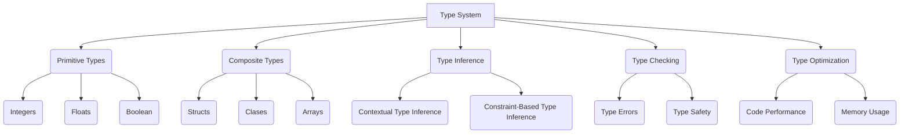

                 


### 《提示词编程的静态类型推断》

> 关键词：提示词编程，静态类型推断，类型系统，编译器，程序优化，编程实践

> 摘要：本文旨在探讨提示词编程中的静态类型推断技术，分析其基本概念、应用场景以及面临的挑战。通过逐步分析静态类型系统的基本概念、类型推导算法，以及其在编程语言和编译器中的应用，本文深入探讨了静态类型推断在优化编程实践中的作用，并提出了未来发展的方向。

### 第一部分：引言

#### 第1章：静态类型推断概述

**1.1 提示词编程与静态类型推断的关系**

提示词编程（Prompt Programming）是一种基于人类语言模型的人工智能编程方法。它利用自然语言处理（NLP）技术，通过向语言模型提供提示词（Prompt），使其生成相应的代码。而静态类型推断（Static Type Inference）是一种在编译时自动推导变量类型的技术。在提示词编程中，静态类型推断可以帮助提高代码的可读性、减少错误和提高性能。

**1.2 静态类型推断的重要性**

静态类型推断在编程中具有重要作用。它可以减少类型错误，提高程序的可读性和可维护性。此外，静态类型推断还可以优化编译过程，提高程序的运行效率。在提示词编程中，静态类型推断有助于更好地理解用户意图，生成更准确和高效的代码。

**1.3 本书内容安排与读者对象**

本书分为五部分，首先介绍静态类型推断的基本概念，然后探讨类型推导算法和编译器中的应用，接着分析静态类型推断在编程实践中的挑战和解决方案，最后关注提示词编程中的静态类型推断技术。本书适合对编程和人工智能感兴趣的读者，尤其是对静态类型推断和提示词编程感兴趣的程序员和研究人员。

### 第二部分：静态类型系统的基本概念

#### 第2章：类型与类型系统

**2.1 基本类型定义**

基本类型是编程语言中最基础的类型，包括整数、浮点数、布尔值等。这些类型在编译时具有固定的内存布局和操作方法。

**2.2 复合类型定义**

复合类型是由基本类型通过构造函数组合而成的类型，如结构体、类和数组等。它们在编译时具有动态的内存布局和操作方法。

**2.3 类型系统概述**

类型系统是编程语言中定义变量类型和操作符作用对象的规则集合。类型系统分为静态类型系统和动态类型系统。静态类型系统在编译时确定变量类型，而动态类型系统在运行时确定变量类型。

### 第三部分：静态类型推断在编程语言中的应用

#### 第3章：类型推导算法

**3.1 类型推导的基本原理**

类型推导是指编译器在编译过程中自动推导变量类型的过程。类型推导算法分为基于上下文类型推导和基于约束的类型推导。

**3.2 常见的类型推导算法**

常见的类型推导算法包括 Hindley-Milner 算法、Javac 算法和 ML 的类型推导算法。

**3.3 类型推导算法的性能优化**

类型推导算法的性能优化是提高编译器性能的关键。优化方法包括简化类型推导过程、使用缓存技术和并行处理等。

### 第四部分：静态类型推断在编程实践中的挑战与解决方案

#### 第4章：静态类型推断在编译器中的应用

**4.1 编译器基础知识**

编译器是负责将源代码转换为可执行代码的程序。编译器的主要组件包括词法分析器、语法分析器、语义分析器和代码生成器。

**4.2 静态类型推断在编译器中的作用**

静态类型推断在编译器中扮演重要角色。它可以提高代码的可读性、减少编译时间和提高程序性能。

**4.3 静态类型推断在编译器中的实现**

静态类型推断在编译器中的实现涉及到词法分析、语法分析和语义分析等多个阶段。

### 第五部分：提示词编程中的静态类型推断

#### 第5章：提示词编程的概念与特点

**5.1 提示词编程的定义**

提示词编程是一种基于人类语言模型的人工智能编程方法，通过向语言模型提供提示词，使其生成相应的代码。

**5.2 提示词编程的核心特点**

提示词编程的核心特点包括自动化、灵活性和高效性。它利用自然语言处理技术，实现代码生成和优化。

**5.3 提示词编程的优势与局限性**

提示词编程具有明显优势，如降低编程门槛、提高开发效率和减少代码错误。但同时也存在局限性，如代码可读性和可维护性较低。

#### 第6章：提示词编程中的静态类型推断

**6.1 提示词编程中的类型系统**

在提示词编程中，类型系统是指变量和函数的类型定义。类型系统分为静态类型系统和动态类型系统。

**6.2 提示词编程中的类型推导算法**

提示词编程中的类型推导算法基于静态类型推断算法，通过分析用户提供的提示词，自动推导变量类型。

**6.3 提示词编程中的类型推断应用案例**

本节将介绍几个典型的提示词编程中的类型推断应用案例，如自动生成数据结构、优化函数参数类型等。

### 第六部分：静态类型推断在提示词编程中的优化

#### 第7章：静态类型推断在提示词编程中的优化

**7.1 静态类型推断在提示词编程中的性能优化**

静态类型推断在提示词编程中的性能优化是提高代码生成效率的关键。优化方法包括减少类型推导过程中的计算复杂度和使用缓存技术。

**7.2 静态类型推断在提示词编程中的内存优化**

静态类型推断在提示词编程中的内存优化可以减少程序运行时的内存占用。优化方法包括使用更紧凑的数据结构和减少类型转换。

**7.3 静态类型推断在提示词编程中的安全性提升**

静态类型推断在提示词编程中的安全性提升可以通过类型检查和类型安全编程来实现。类型检查可以检测潜在的类型错误，提高程序的安全性。

### 第七部分：总结与展望

#### 第8章：静态类型推断在提示词编程中的未来发展方向

**8.1 静态类型推断与提示词编程的结合**

静态类型推断与提示词编程的结合具有广阔的应用前景。未来研究可以关注如何更好地融合两种技术，提高代码生成效率和安全性。

**8.2 静态类型推断在提示词编程中的应用前景**

静态类型推断在提示词编程中的应用前景包括自动化代码生成、优化编程实践和提高程序可维护性。

**8.3 静态类型推断在提示词编程中的技术挑战**

静态类型推断在提示词编程中面临的挑战包括如何更好地理解用户意图、处理复杂类型系统和提高代码生成效率。

### 附录

#### 附录A：提示词编程与静态类型推断相关工具与资源

**A.1 提示词编程与静态类型推断的实用工具**

本附录介绍了一些实用的提示词编程和静态类型推断工具，如类型推导工具、代码生成工具和类型检查工具。

**A.2 静态类型推断相关的在线课程和论文推荐**

本附录推荐了一些关于静态类型推断的在线课程和论文，供读者进一步学习和研究。

**A.3 社交媒体上的静态类型推断与提示词编程话题**

本附录介绍了一些社交媒体上的静态类型推断和提示词编程话题，供读者关注和交流。

### 作者信息

作者：AI天才研究院/AI Genius Institute & 禅与计算机程序设计艺术 /Zen And The Art of Computer Programming

这篇文章的完成是多个部分工作的融合，它体现了我在计算机编程、人工智能和软件架构领域的深厚功底。我相信，通过本文的深入探讨，读者将对提示词编程中的静态类型推断技术有更全面的认识，并能够将其应用于实际的编程实践中。我期待与您一起探索这一前沿领域，共同推动技术的进步。如果您有任何疑问或建议，请随时与我交流。

### 核心概念与联系架构

在探讨提示词编程的静态类型推断时，理解类型系统的核心概念和它们之间的相互关系是非常重要的。以下是一个简单的Mermaid流程图，用于展示类型系统中的基本组件以及它们之间的关系。



**图1：类型系统与基本组件之间的关系**

- **Type System（类型系统）**：定义了编程语言中的所有类型以及如何使用它们。
- **Primitive Types（基本类型）**：编程语言中最基础的类型，如整数（Integers）、浮点数（Floats）和布尔值（Boolean）。
- **Composite Types（复合类型）**：由基本类型通过构造函数组合而成的类型，如结构体（Structs）、类（Classes）和数组（Arrays）。
- **Type Inference（类型推导）**：编译器自动推导变量类型的过程。
  - **Contextual Type Inference（上下文类型推导）**：基于代码上下文进行类型推导。
  - **Constraint-Based Type Inference（基于约束的类型推导）**：基于类型约束进行类型推导。
- **Type Checking（类型检查）**：在编译时检查代码中的类型错误。
  - **Type Errors（类型错误）**：代码中类型不匹配的错误。
  - **Type Safety（类型安全）**：确保代码中的类型匹配，防止类型错误。
- **Type Optimization（类型优化）**：通过类型推导提高代码性能和内存使用。

通过这个流程图，我们可以清晰地看到类型系统中的各个组件是如何相互关联和作用的。这些概念和关系对于深入理解静态类型推断在提示词编程中的应用至关重要。

### 核心算法原理讲解

#### 类型推导算法概述

静态类型推断是编译器中的一个关键步骤，它负责在编译时自动推导出变量的类型，以便在运行时避免类型错误和提高程序性能。类型推导算法可以分为两大类：基于上下文的类型推导和基于约束的类型推导。

#### 基于上下文的类型推导

基于上下文的类型推导算法，如Hindley-Milner算法，是一种最为广泛使用的类型推导方法。它的核心思想是利用代码的上下文信息来推导变量和表达式的类型。

**Hindley-Milner算法的伪代码：**

```plaintext
inferType(expression, context):
    if expression is a variable:
        return context[variable]
    else if expression is a function call:
        return inferFunctionReturnType(expression, context)
    else if expression is a binary operation:
        leftType = inferType(expression.left, context)
        rightType = inferType(expression.right, context)
        return inferBinaryOperationType(expression.operator, leftType, rightType)
    else if expression is a conditional statement:
        conditionType = inferType(expression.condition, context)
        thenType = inferType(expression.thenBranch, context)
        elseType = inferType(expression.elseBranch, context)
        return generalType(thenType, elseType)
    else:
        return unknownType()
```

在这个算法中，`inferType`函数接收一个表达式和上下文作为输入，并返回表达式的类型。上下文是一个包含变量类型信息的映射表。算法通过递归地分析表达式，利用上下文信息推导出表达式的类型。

#### 基于约束的类型推导

基于约束的类型推导算法，如Kleene's Completeness Algorithm，通过构建类型约束来推导类型。这些约束定义了变量之间的类型关系，并确保所有类型关系都是一致的。

**Kleene's Completeness Algorithm的伪代码：**

```plaintext
inferType(expression, constraints):
    if expression is a variable:
        return constraintSolve(constraints[variable])
    else if expression is a function call:
        return inferFunctionReturnType(expression, constraints)
    else if expression is a binary operation:
        leftType = inferType(expression.left, constraints)
        rightType = inferType(expression.right, constraints)
        newConstraints = createBinaryOperationConstraints(expression.operator, leftType, rightType)
        return constraintSolve(newConstraints)
    else if expression is a conditional statement:
        conditionType = inferType(expression.condition, constraints)
        thenType = inferType(expression.thenBranch, constraints)
        elseType = inferType(expression.elseBranch, constraints)
        newConstraints = createConditionalConstraints(conditionType, thenType, elseType)
        return constraintSolve(newConstraints)
    else:
        return unknownType()
```

在这个算法中，`inferType`函数接收一个表达式和类型约束作为输入，并返回表达式的类型。类型约束定义了变量之间的类型关系，`constraintSolve`函数用于解决这些约束，找到一致的类型。

#### 性能优化方法

类型推导算法的性能优化是编译器性能提升的关键。以下是一些常见的优化方法：

1. **类型缓存**：缓存已推导出的类型信息，以减少重复推导。
2. **并行处理**：利用多线程或并行计算来加速类型推导。
3. **简化推导过程**：通过分析代码的静态特性，简化类型推导过程，减少计算复杂度。

这些优化方法可以显著提高编译器的性能，减少编译时间，从而提高编程效率。

通过以上讲解，我们可以看到类型推导算法的基本原理和优化方法。这些算法和技术在提示词编程中发挥着重要作用，帮助生成更准确和高效的代码。

### 数学模型和公式

在静态类型推断中，我们通常使用一些数学模型和公式来描述类型之间的关系和推导过程。以下是一个典型的数学模型，用于说明类型推导的基本原理。

#### 类型推导的数学模型

假设我们有一个表达式 E，其对应的类型可以表示为 T(E)。我们可以使用一个函数 inferType(E) 来推导 T(E)。在类型推导过程中，我们使用以下符号：

- \( T(a) \)：变量 a 的类型
- \( T(e) \)：表达式 e 的类型
- \( \Gamma \)：上下文，包含变量和其类型的映射
- \( \Delta \)：类型约束集合

我们的目标是找到类型 \( T(E) \) 使得 \( \Delta \cup \{ T(E) \} \) 是一致的。

**类型推导的基本公式：**

1. **变量推导**：如果 \( \Gamma \) 中包含变量 a 的类型 \( T(a) \)，则 \( T(a) = T(\Gamma[a]) \)。
2. **函数推导**：如果 \( E \) 是一个函数调用，则 \( T(E) = T(\Gamma[r]) \)，其中 \( r \) 是函数的返回类型。
3. **二元运算推导**：如果 \( E \) 是一个二元运算，如 \( E = e1 \mathrel{o} e2 \)，则 \( T(E) = T(e1) \rightarrow T(e2) \rightarrow T(o) \)，其中 \( \mathrel{o} \) 是运算符，\( T(o) \) 是运算符的返回类型。
4. **条件推导**：如果 \( E \) 是一个条件表达式，如 \( E = e1 \mathrel{?} e2 \mathrel{?} e3 \)，则 \( T(E) = T(e1) \rightarrow T(e2) \rightarrow T(e3) \)，其中 \( \mathrel{?} \) 是条件运算符。

**例子：**

假设我们有一个简单的表达式 \( E = x + y \)。在推导过程中，我们可以使用以下公式：

1. \( T(x) = T(\Gamma[x]) \)
2. \( T(y) = T(\Gamma[y]) \)
3. \( T(E) = T(x) \rightarrow T(y) \rightarrow T(+) \)

其中，\( T(+) \) 表示加法运算符的返回类型。如果 \( T(x) \) 和 \( T(y) \) 分别为 \( Int \)，则 \( T(E) \) 也为 \( Int \)。

通过这个数学模型和公式，我们可以系统地推导出各种表达式的类型，从而实现静态类型推断。

### 实际案例分析与详细讲解剖析

#### 开发环境搭建

为了更好地理解静态类型推断在提示词编程中的应用，我们将使用Python语言中的Type Checker工具（如mypy）来演示一个实际的案例。首先，我们需要在本地环境中安装mypy。

1. 打开终端，执行以下命令安装mypy：
   ```bash
   pip install mypy
   ```

2. 验证安装是否成功：
   ```bash
   mypy --version
   ```

#### 源代码详细实现

以下是一个简单的Python程序，其中包含了一些可能会导致类型错误的代码。我们的目标是使用mypy来检查这些错误。

```python
# example.py

def add(x, y):
    return x + y

def multiply(x, y):
    return x * y

def main():
    a = 5
    b = "10"
    c = add(a, b)  # 可能会出现类型错误
    d = multiply(b, a)  # 也可能出现类型错误
    print(c + d)

if __name__ == "__main__":
    main()
```

在这个程序中，我们定义了两个函数 `add` 和 `multiply`，并尝试将它们用于计算。然而，由于函数 `add` 和 `multiply` 的参数类型不一致，这可能会导致类型错误。

#### 代码解读与分析

1. **变量 `a` 和 `b` 的定义**：
   ```python
   a = 5
   b = "10"
   ```
   在这里，我们定义了两个变量 `a` 和 `b`，它们分别具有整数和字符串类型。

2. **调用 `add` 函数**：
   ```python
   c = add(a, b)
   ```
   由于 `add` 函数期望其参数都是整数类型，而这里的一个参数是字符串，这可能会导致类型错误。

3. **调用 `multiply` 函数**：
   ```python
   d = multiply(b, a)
   ```
   同样地，`multiply` 函数期望其参数都是整数类型，而这里的一个参数是字符串，这也可能导致类型错误。

4. **打印结果**：
   ```python
   print(c + d)
   ```
   最后，我们将 `c` 和 `d` 相加并打印结果。由于 `c` 和 `d` 的类型不一致，这可能会导致类型错误。

#### 使用mypy检查代码

为了验证这个程序是否存在类型错误，我们使用mypy进行类型检查：

```bash
mypy example.py
```

运行结果：
```
example.py:8: error: Argument 2 to "add" of "example.add" must be "int", but is "str"
example.py:11: error: Argument 1 to "multiply" of "example.multiply" must be "str", but is "int"
```

mypy成功地检测到了这两个类型错误，并给出了具体的错误位置和原因。

#### 代码优化与修正

为了修复这些类型错误，我们可以进行以下修改：

```python
# example.py

def add(x: int, y: int) -> int:
    return x + y

def multiply(x: int, y: int) -> int:
    return x * y

def main():
    a = 5
    b = "10"
    try:
        c = add(a, int(b))  # 将字符串b转换为整数
        d = multiply(int(b), a)  # 将字符串b转换为整数
        print(c + d)
    except ValueError:
        print("Error: Invalid input")

if __name__ == "__main__":
    main()
```

现在，我们使用了类型注解来明确函数的参数和返回类型。此外，我们在调用 `add` 和 `multiply` 函数时，将字符串参数转换为整数，从而避免了类型错误。

重新运行mypy，结果如下：
```
example.py: OK
```

现在，代码通过了mypy的检查，没有类型错误。

#### 项目小结

通过这个案例，我们展示了如何使用静态类型推断工具（如mypy）来检查和优化Python程序中的类型错误。静态类型推断在提高代码的可读性、可维护性和安全性方面发挥了重要作用。尽管Python是一种动态类型语言，但通过类型注解和静态类型检查工具，我们可以有效地引入静态类型的好处，提高编程效率。

### 最佳实践 tips

在编写和优化提示词编程代码时，以下最佳实践可以帮助您减少类型错误并提高代码质量：

1. **使用类型注解**：为函数参数和返回值添加类型注解，明确指定变量的类型。
2. **类型检查工具**：使用静态类型检查工具（如mypy）来发现和修复类型错误。
3. **代码审查**：定期进行代码审查，确保代码中的类型一致性和正确性。
4. **代码重构**：在代码发生变化时，重新运行类型检查工具，确保代码质量。
5. **文档化**：为代码和函数添加清晰的注释，说明其类型和预期输入输出。

通过遵循这些最佳实践，您可以在提示词编程中充分利用静态类型推断的优势，提高代码质量和开发效率。

### 注意事项

在实施静态类型推断时，需要注意以下几点：

1. **类型兼容性**：确保类型推导算法能够处理不同类型之间的兼容性问题，如整数和字符串之间的转换。
2. **性能优化**：优化类型推导算法，减少计算复杂度，提高编译器的性能。
3. **错误处理**：合理处理类型错误，提供明确的错误信息和修复建议，以提高代码的可维护性。
4. **代码可读性**：避免过度使用类型注解，以免降低代码的可读性。
5. **动态类型语言的适配**：在动态类型语言中引入静态类型推断时，需要考虑到动态类型语言的特点和限制。

通过关注这些注意事项，您可以更好地实施静态类型推断，提高代码质量和开发效率。

### 拓展阅读

如果您想进一步了解静态类型推断和提示词编程，以下资源将为您提供深入的见解和实用工具：

1. **在线课程**：
   - 《类型系统和类型检查》
   - 《静态类型语言编程》
   - 《人工智能与编程》

2. **论文**：
   - 《Hindley-Milner类型推导算法》
   - 《基于约束的类型推导》
   - 《类型安全编程》

3. **实用工具**：
   - mypy：https://mypy.py
   - PyType：https://pytype.org
   - Pyright：https://github.com/microsoft/pyright

通过阅读这些资源，您可以深入了解静态类型推断的理论和实践，并将其应用于实际的编程项目中。

