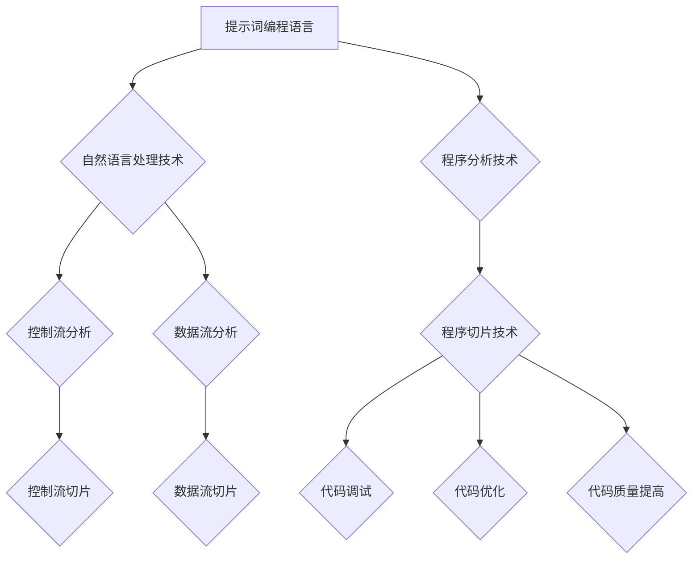

                 


### 文章标题：提示词编程语言的程序切片技术

关键词：提示词编程语言，程序切片，自然语言处理，软件开发，代码优化

摘要：本文介绍了提示词编程语言的程序切片技术，探讨了其核心概念、联系及应用。通过分析提示词编程语言和程序切片技术的结合，本文展示了其在软件开发中的优势，以及面临的挑战和未来趋势。

### 第一部分：核心概念与联系

在探讨提示词编程语言的程序切片技术之前，我们需要理解这两个核心概念的基本原理和它们之间的联系。

#### 1.1 提示词编程语言概述

**1.1.1 提示词编程语言的概念**

提示词编程语言（Prompt-Based Programming Language）是一种将自然语言处理（NLP）与编程相结合的编程范式。它允许开发者使用自然语言指令来编写程序，而不是传统的编程语言语法。这种语言的核心在于能够理解和执行开发者用自然语言输入的意图。

**1.1.2 提示词编程语言的特点**

- **自然语言交互**：开发者可以直接用自然语言指令编写代码，无需记忆复杂的编程语法。
- **高效率**：通过自然语言指令，可以快速实现代码生成，提高开发效率。
- **可扩展性**：支持多种编程领域和场景，具有很好的可扩展性。

**1.1.3 提示词编程语言与传统编程语言的区别**

- **编程范式**：提示词编程语言强调自然语言交互，而传统编程语言依赖具体的编程语法。
- **适用场景**：提示词编程语言适用于快速原型设计和开发，而传统编程语言适用于复杂、结构化的应用开发。

#### 1.2 程序切片技术

**1.2.1 程序切片技术的概念**

程序切片技术（Program Slicing）是一种程序分析技术，它旨在识别出与特定输出结果相关的代码部分，从而简化程序的复杂度。程序切片通常分为控制流切片和数据流切片。

**1.2.2 程序切片技术的原理**

程序切片技术通过分析程序的控制流和数据流，识别出对程序输出有直接影响的代码部分。控制流切片关注程序的执行路径，而数据流切片关注程序中数据的流动。

**1.2.3 程序切片技术的应用**

- **调试**：通过程序切片，开发者可以快速定位到程序中可能存在错误的代码部分。
- **优化**：通过程序切片，可以识别出不必要的代码，从而优化程序的性能。

#### 1.3 提示词编程语言的程序切片技术

**1.3.1 提示词编程语言与程序切片的结合**

提示词编程语言与程序切片技术的结合，可以为开发者提供一种全新的编程和调试体验。通过自然语言指令，开发者可以更方便地定义程序切片，实现对程序的精细化分析和优化。

**1.3.2 提示词编程语言中的程序切片技术实现**

在提示词编程语言中，程序切片技术的实现通常依赖于自然语言处理和程序分析技术。开发者可以通过输入自然语言指令，让系统自动生成程序切片。

### 1.4 提示词编程语言的程序切片技术在开发中的应用

**1.4.1 提示词编程语言的程序切片技术在软件开发中的优势**

- **简化开发流程**：通过程序切片，开发者可以快速定位到关键代码，简化开发流程。
- **提高代码质量**：通过程序切片，可以识别出不必要的代码，提高代码质量。

**1.4.2 提示词编程语言的程序切片技术在软件维护中的应用**

- **快速定位问题**：通过程序切片，开发者可以快速定位到软件中的问题部分，提高维护效率。
- **减少维护成本**：通过程序切片，可以简化软件维护流程，降低维护成本。

### 1.5 提示词编程语言的程序切片技术挑战与未来趋势

**1.5.1 提示词编程语言的程序切片技术挑战**

- **自然语言理解的精确性**：提高自然语言处理的精确性，是提示词编程语言程序切片技术的关键挑战。
- **程序分析的效率**：提高程序分析的效率，是保证程序切片技术实用性的关键。

**1.5.2 提示词编程语言的程序切片技术未来趋势**

- **多语言支持**：未来提示词编程语言的程序切片技术将支持更多编程语言。
- **智能化**：提示词编程语言的程序切片技术将更加智能化，能够自动识别和分析程序中的关键部分。

### 1.6 提示词编程语言的程序切片技术案例研究

**1.6.1 案例一：基于自然语言指令的代码调试**

- **场景描述**：开发者通过自然语言指令调试一段代码。
- **实现步骤**：系统根据自然语言指令生成程序切片，定位到代码中的错误部分。

**1.6.2 案例二：基于程序切片的代码优化**

- **场景描述**：开发者使用程序切片技术优化一段代码。
- **实现步骤**：系统根据程序切片结果，识别出不必要的代码部分，进行优化。

### 1.7 总结

提示词编程语言的程序切片技术为软件开发带来了新的可能，通过自然语言指令，开发者可以更高效地完成代码调试和优化。虽然仍面临一些挑战，但随着技术的不断发展，提示词编程语言的程序切片技术有望在未来的软件开发中发挥更大的作用。

### 作者信息

作者：AI天才研究院/AI Genius Institute & 禅与计算机程序设计艺术 /Zen And The Art of Computer Programming

----------------------------------------------------------------

在接下来的内容中，我们将详细探讨提示词编程语言和程序切片技术的核心概念、联系及应用，并通过具体的算法原理讲解、数学模型和公式，以及案例研究，展示其在软件开发中的实际应用和价值。

## 1.1 提示词编程语言概述

提示词编程语言是一种新兴的编程范式，它将自然语言处理（NLP）技术与编程语言融合在一起，使得开发者能够使用自然语言指令来编写程序。这种语言的核心在于能够将人类的自然语言意图转换为计算机可执行的代码，从而简化编程过程，提高开发效率。

### 1.1.1 提示词编程语言的概念

提示词编程语言（Prompt-Based Programming Language）的概念可以追溯到自然语言处理和自动编程领域。传统的编程语言通常依赖于特定的语法和结构，要求开发者必须熟悉编程语言的语法规则，才能编写出正确的代码。而提示词编程语言则试图打破这一限制，通过自然语言指令来实现编程。

一个简单的例子，如果一个开发者想要使用传统编程语言编写一个计算两个数之和的程序，他可能需要使用如下的Python代码：

```python
def add_two_numbers(a, b):
    return a + b

result = add_two_numbers(3, 4)
print(result)
```

然而，在提示词编程语言中，开发者可以直接输入如下的自然语言指令：

```
编写一个计算两个数之和的程序，输入两个数分别为3和4。
```

系统会自动将这个自然语言指令转换为上述的Python代码，并执行计算任务。

### 1.1.2 提示词编程语言的特点

提示词编程语言具有以下特点：

1. **自然语言交互**：开发者可以使用自然语言指令，无需传统的编程语法。这意味着，开发者不需要记住复杂的语法规则，只需用自然语言描述他们的意图即可。

2. **高效率**：通过自然语言指令，可以快速生成代码，提高开发效率。对于复杂的应用场景，开发者可能需要花费数小时来编写和调试代码。而使用提示词编程语言，开发者可以迅速地将他们的意图转化为代码，从而节省时间和精力。

3. **可扩展性**：提示词编程语言支持多种编程领域和场景，具有很好的可扩展性。无论是简单的计算任务，还是复杂的机器学习模型，开发者都可以使用这种语言来编写程序。

4. **代码质量**：由于提示词编程语言能够将开发者的意图准确地转换为代码，因此可以减少错误和缺陷，提高代码质量。

### 1.1.3 提示词编程语言与传统编程语言的区别

提示词编程语言与传统编程语言在多个方面存在区别：

1. **编程范式**：提示词编程语言强调自然语言交互，开发者通过输入自然语言指令来实现编程。而传统编程语言依赖于具体的编程语法和结构，开发者需要熟悉这些语法规则来编写程序。

2. **适用场景**：提示词编程语言适用于需要快速开发和原型设计的场景，如Web开发、移动应用开发等。传统编程语言则更适用于复杂、结构化的应用开发，如操作系统、数据库等。

3. **开发难度**：提示词编程语言的入门门槛较低，开发者不需要具备深厚的编程基础即可开始编程。而传统编程语言要求开发者具备一定的编程知识，才能有效地编写和调试程序。

4. **编程体验**：提示词编程语言提供了更自然的编程体验，开发者可以用更自然的方式表达他们的意图。而传统编程语言则需要开发者遵循特定的语法和结构，编写程序时需要仔细考虑代码的细节。

### 1.1.4 提示词编程语言的应用案例

提示词编程语言在多个领域都有广泛的应用，以下是一些典型的应用案例：

1. **自动化脚本编写**：开发者可以使用提示词编程语言快速编写自动化脚本，如数据抓取、自动化测试等。这些脚本可以大大提高开发效率，减少重复性工作。

2. **自然语言处理**：在自然语言处理领域，提示词编程语言可以用来快速构建和测试NLP模型。开发者可以通过输入自然语言指令来训练和优化模型，从而提高模型的准确性和效率。

3. **机器学习应用**：提示词编程语言可以用于快速开发机器学习应用，如图像识别、语音识别等。开发者可以使用自然语言指令来定义模型的结构和参数，从而实现复杂的应用功能。

4. **教育领域**：提示词编程语言在教育领域具有很大的潜力。它可以帮助初学者更快地掌握编程知识，提高编程技能。同时，它也可以作为教师的教学工具，帮助学生更好地理解编程概念。

通过以上对提示词编程语言的介绍，我们可以看到，这种编程范式为软件开发带来了新的可能。它不仅简化了编程过程，提高了开发效率，还为开发者提供了更自然的编程体验。随着技术的不断发展，提示词编程语言将在未来的软件开发中发挥越来越重要的作用。

### 1.2 程序切片技术

程序切片技术（Program Slicing）是软件工程中的一个重要概念，它通过分析程序的源代码，识别出与特定输出结果相关的代码部分，从而简化程序的复杂度。这一技术广泛应用于软件调试、代码优化、程序理解等多个领域。

#### 1.2.1 程序切片技术的概念

程序切片（Program Slicing）是指从一个程序中删除那些对某个特定输出结果没有影响的代码，从而得到一个更简化的程序。切片的结果称为程序切片，它可以是一个控制流切片、数据流切片，或者两者的结合。

- **控制流切片**：控制流切片是基于程序的控制流结构来进行的。它删除了那些不会影响特定输出结果的代码块，只保留了与输出结果相关的路径。
- **数据流切片**：数据流切片是基于程序中的数据依赖关系来进行的。它删除了那些不会影响输出结果的数据相关的代码部分，只保留了与数据相关的关键路径。

#### 1.2.2 程序切片技术的原理

程序切片技术主要通过以下步骤来实现：

1. **定义切片条件**：首先，需要定义一个切片条件，这个条件用于确定哪些代码是影响输出结果的，哪些代码可以删除。切片条件可以是具体的变量值、函数调用结果，或者控制流分支的条件。

2. **控制流分析**：通过控制流分析（Control Flow Analysis），确定程序的执行路径。这一步骤的目的是构建程序的控制流图（Control Flow Graph, CFG），图中每个节点表示一个基本块（Basic Block），每条边表示程序中的控制流转移。

3. **数据流分析**：通过数据流分析（Data Flow Analysis），确定程序中的数据依赖关系。这一步骤的目的是构建程序的数据流图（Data Flow Graph, DFG），图中每个节点表示一个变量，每条边表示变量之间的数据传递关系。

4. **切片计算**：利用控制流图和数据流图，计算满足切片条件的代码部分。具体方法包括：

   - **控制流切片**：从控制流图的入口节点开始，沿着满足切片条件的路径进行回溯，收集路径上的基本块。
   - **数据流切片**：从数据流图的入口节点开始，沿着满足切片条件的数据流进行回溯，收集影响输出结果的数据相关的代码部分。

5. **生成切片**：根据计算结果，生成程序切片。切片后的程序将只包含影响输出结果的代码部分。

#### 1.2.3 程序切片技术的应用

程序切片技术在实际软件开发中具有广泛的应用：

1. **调试**：在程序调试过程中，通过程序切片，开发者可以快速定位到程序中可能存在错误的代码部分。这有助于减少调试时间，提高调试效率。

2. **优化**：在程序优化过程中，通过程序切片，开发者可以识别出不必要的代码部分，从而简化程序结构，提高程序性能。

3. **程序理解**：程序切片可以帮助开发者更好地理解程序的结构和功能，尤其是在大型程序中，通过切片可以更清晰地看到程序的各个部分是如何相互作用的。

4. **代码重构**：在代码重构过程中，通过程序切片，开发者可以确保重构后的代码仍然具有原始代码的功能，同时提高了代码的可读性和可维护性。

### 1.2.4 程序切片技术的挑战

尽管程序切片技术在软件开发中具有许多优势，但在实际应用中也面临一些挑战：

1. **切片条件定义**：切片条件是程序切片的核心，其定义的准确性直接影响到切片结果的有效性。在实际应用中，如何准确地定义切片条件是一个难题。

2. **切片算法复杂度**：程序切片算法的计算复杂度较高，尤其是在处理大型程序时，计算时间和资源消耗成为一个重要问题。

3. **代码语义理解**：程序切片技术依赖于对程序的控制流和数据流的理解，这要求算法能够正确地解析代码语义，这对于复杂的程序结构尤其具有挑战性。

4. **代码可读性**：切片后的程序可能失去了原始代码的可读性，尤其是在删除了大量无关代码后，开发者可能需要花费额外的时间来理解切片后的程序。

### 1.2.5 程序切片技术与其他软件分析技术的比较

程序切片技术与其他软件分析技术如代码优化、静态代码分析、动态代码分析等有所不同：

- **代码优化**：代码优化旨在提高程序的运行效率，通过优化算法和编译器技术来实现。而程序切片技术则关注程序的逻辑结构，通过简化代码来提高开发效率和可维护性。

- **静态代码分析**：静态代码分析是一种在程序运行之前对源代码进行分析的技术，它主要用于检查代码中的潜在错误和漏洞。程序切片技术是静态代码分析的一种特殊形式，它更关注代码与输出结果的关系。

- **动态代码分析**：动态代码分析是一种在程序运行时对程序行为进行分析的技术，它通过实际运行程序来收集运行时数据。程序切片技术可以与动态代码分析结合使用，以更全面地理解程序的行为。

通过以上对程序切片技术的介绍，我们可以看到，这种技术为软件开发提供了强大的工具，帮助开发者更高效地调试、优化和理解程序。随着技术的不断发展，程序切片技术在软件开发中的应用将越来越广泛。

### 1.3 提示词编程语言的程序切片技术

#### 1.3.1 提示词编程语言与程序切片的结合

提示词编程语言与程序切片技术的结合，为软件开发提供了一个全新的视角。这种结合不仅简化了编程过程，还大大提高了开发效率和代码质量。通过自然语言指令，开发者可以轻松地定义和执行程序切片，实现对程序的精细化分析和优化。

#### 1.3.2 提示词编程语言中的程序切片技术实现

在提示词编程语言中，程序切片技术的实现依赖于自然语言处理和程序分析技术。具体实现步骤如下：

1. **自然语言输入**：开发者通过自然语言指令输入程序切片的要求。例如，开发者可以输入如下指令：“生成一个计算两个数之和的程序切片”。

2. **自然语言处理**：系统接收到自然语言指令后，首先需要对其进行解析和处理，以提取出关键信息。这一步骤通常包括词法分析、语法分析、语义分析等。

3. **控制流分析**：系统根据自然语言指令中的关键信息，进行控制流分析，构建控制流图。通过控制流图，系统可以确定程序的不同执行路径。

4. **数据流分析**：系统同时进行数据流分析，构建数据流图。通过数据流图，系统可以确定程序中的数据依赖关系。

5. **切片计算**：系统利用控制流图和数据流图，计算满足自然语言指令中的切片条件的代码部分。具体方法包括：

   - **控制流切片**：从控制流图的入口节点开始，沿着满足切片条件的路径进行回溯，收集路径上的基本块。
   - **数据流切片**：从数据流图的入口节点开始，沿着满足切片条件的数据流进行回溯，收集影响输出结果的数据相关的代码部分。

6. **生成切片**：根据计算结果，系统生成程序切片，并将其返回给开发者。

#### 1.3.3 提示词编程语言中的程序切片技术优势

提示词编程语言中的程序切片技术具有以下优势：

1. **自然语言交互**：开发者可以直接使用自然语言指令，无需关心传统的编程语法和结构。这使得编程过程更加直观和自然。

2. **高效性**：通过自然语言处理和自动化程序分析，系统可以快速生成程序切片，大大提高了开发效率。

3. **精细化分析**：提示词编程语言的程序切片技术可以精确地识别出影响输出结果的代码部分，为开发者提供了更细粒度的分析和优化手段。

4. **代码质量**：通过程序切片，开发者可以识别出不必要的代码部分，从而简化程序结构，提高代码质量。

5. **可扩展性**：提示词编程语言支持多种编程领域和场景，其程序切片技术也可以应用于不同的编程语言和框架。

#### 1.3.4 提示词编程语言中的程序切片技术挑战

尽管提示词编程语言的程序切片技术具有许多优势，但在实际应用中也面临一些挑战：

1. **自然语言理解的精确性**：自然语言处理技术的精确性直接影响到程序切片的准确性。如何在复杂的自然语言环境中准确理解开发者的意图，是一个重要的挑战。

2. **程序分析的效率**：程序切片技术依赖于控制流分析和数据流分析，这些分析过程可能涉及大量的计算。如何在保证分析准确性的同时提高分析效率，是一个关键问题。

3. **代码语义理解**：程序切片技术需要对代码的语义有深刻的理解，尤其是在处理复杂的程序结构和数据依赖关系时。如何准确地解析代码语义，是一个技术难题。

4. **代码可读性**：切片后的程序可能失去了原始代码的可读性，尤其是在删除了大量无关代码后。如何保持代码的可读性，是一个需要解决的问题。

通过以上对提示词编程语言与程序切片技术的介绍，我们可以看到，这种结合为软件开发带来了新的机遇和挑战。随着技术的不断发展，提示词编程语言的程序切片技术有望在未来的软件开发中发挥更大的作用。

### 1.4 提示词编程语言的程序切片技术在开发中的应用

提示词编程语言的程序切片技术在软件开发中具有广泛的应用，它不仅提高了开发效率，还优化了代码质量，并降低了维护成本。以下将详细探讨这种技术在软件开发中的具体应用和优势。

#### 1.4.1 提高开发效率

提示词编程语言的程序切片技术可以显著提高开发效率，主要体现在以下几个方面：

1. **快速原型开发**：在原型开发阶段，开发者可以通过自然语言指令快速生成代码，从而快速构建出功能原型。这有助于加速开发周期，缩短产品上市时间。

2. **代码生成**：提示词编程语言可以自动将自然语言指令转换为相应的代码，减少了手工编写代码的工作量。对于复杂的功能，开发者可以更专注于业务逻辑的设计，而无需耗费大量时间在语法和结构上。

3. **调试**：在调试过程中，通过程序切片，开发者可以快速定位到问题代码，从而提高调试效率。切片后的程序更加简洁，有助于开发者快速识别和解决问题。

4. **代码重构**：在代码重构过程中，提示词编程语言的程序切片技术可以帮助开发者更准确地识别出需要重构的代码部分，从而提高重构的效率和质量。

#### 1.4.2 优化代码质量

提示词编程语言的程序切片技术在优化代码质量方面也发挥了重要作用：

1. **消除冗余代码**：通过程序切片，可以识别出程序中的冗余代码部分，并将其删除。这有助于简化程序结构，提高代码的可读性和可维护性。

2. **代码优化**：切片后的程序只包含与输出结果相关的关键代码部分，这为开发者提供了优化代码的机会。通过优化关键代码，可以进一步提高程序的运行效率。

3. **代码质量检查**：提示词编程语言的程序切片技术可以帮助开发者更好地理解程序的结构和功能，从而更容易发现潜在的代码质量问题。例如，可以识别出潜在的空指针异常、资源泄露等问题。

#### 1.4.3 降低维护成本

提示词编程语言的程序切片技术在降低维护成本方面也具有显著优势：

1. **简化维护流程**：通过程序切片，开发者可以快速定位到需要维护的代码部分，从而简化维护流程。这有助于减少维护时间和工作量。

2. **代码可读性**：切片后的程序更加简洁，有助于新开发者更快地理解代码结构和功能。这有助于提高团队协作效率，降低新开发者的学习成本。

3. **代码可维护性**：通过消除冗余代码和优化关键代码，切片后的程序具有更好的可维护性。这有助于延长程序的生命周期，降低维护成本。

#### 1.4.4 提高团队协作效率

提示词编程语言的程序切片技术不仅提高了开发效率，还促进了团队协作：

1. **代码共享**：通过自然语言指令，开发者可以轻松地将他们的代码需求传达给其他团队成员。这有助于团队成员之间更好地协同工作，提高整体开发效率。

2. **代码审查**：提示词编程语言的程序切片技术可以帮助团队成员更准确地理解代码结构和功能，从而提高代码审查的效率和质量。

3. **代码重构**：在代码重构过程中，提示词编程语言的程序切片技术可以帮助团队成员更准确地识别出需要重构的代码部分，从而提高重构的效率和质量。

总之，提示词编程语言的程序切片技术在软件开发中具有广泛的应用和价值。它不仅提高了开发效率，优化了代码质量，还降低了维护成本，并促进了团队协作。随着技术的不断发展，这种技术将在未来的软件开发中发挥更大的作用。

### 1.5 提示词编程语言的程序切片技术挑战与未来趋势

#### 1.5.1 提示词编程语言的程序切片技术挑战

尽管提示词编程语言的程序切片技术在软件开发中具有显著优势，但其在实际应用中仍面临一些挑战。

1. **自然语言理解的精确性**：提示词编程语言的程序切片技术依赖于自然语言处理技术，而自然语言本身的复杂性和不确定性使得理解开发者意图变得困难。如何提高自然语言处理的精确性，是当前面临的关键挑战。

2. **程序分析的效率**：程序切片技术涉及到大量的控制流分析和数据流分析，这些分析过程可能需要消耗大量的计算资源。如何提高分析的效率，以适应实际开发需求，是一个重要的技术难题。

3. **代码语义理解**：程序切片技术需要对代码的语义有深刻的理解，这在处理复杂的程序结构和数据依赖关系时尤为困难。如何准确解析代码语义，是一个技术挑战。

4. **代码可读性**：切片后的程序可能失去了原始代码的可读性，尤其是在删除了大量无关代码后。如何保持代码的可读性，是一个需要解决的问题。

#### 1.5.2 提示词编程语言的程序切片技术未来趋势

随着技术的不断发展，提示词编程语言的程序切片技术有望在以下方面取得突破：

1. **多语言支持**：未来提示词编程语言的程序切片技术将支持更多编程语言，从而提高其适用性和通用性。

2. **智能化**：提示词编程语言的程序切片技术将变得更加智能化，能够自动识别和分析程序中的关键部分，从而提高切片的准确性和效率。

3. **集成开发环境（IDE）集成**：提示词编程语言的程序切片技术将更好地与集成开发环境（IDE）集成，提供更便捷的开发工具和插件，从而提高开发效率。

4. **跨领域应用**：提示词编程语言的程序切片技术将不仅局限于软件开发，还将应用于更多的领域，如自然语言处理、机器学习、数据科学等。

5. **开源生态**：随着开源社区的贡献，提示词编程语言的程序切片技术将不断完善和优化，形成更丰富的开源生态，为开发者提供更多的选择和工具。

总之，提示词编程语言的程序切片技术在未来的软件开发中将发挥越来越重要的作用。通过不断的技术创新和应用实践，它有望成为开发者手中的利器，助力他们更高效地完成开发任务。

### 1.6 提示词编程语言的程序切片技术案例研究

为了更好地展示提示词编程语言的程序切片技术在实际开发中的应用，下面我们将通过两个案例研究，详细探讨这种技术在不同场景下的具体应用。

#### 1.6.1 案例一：基于自然语言指令的代码调试

**场景描述**：在一个Web开发项目中，开发者需要调试一段用于处理用户输入的表单数据的代码。这段代码的功能是接收用户输入的数据，进行验证，并在验证通过后保存到数据库。然而，在实际运行中，开发者发现用户输入的数据在某些情况下无法正确保存。

**实现步骤**：

1. **自然语言指令输入**：开发者使用提示词编程语言的自然语言指令输入调试请求，如下所示：
   ```
   找出并修复代码中处理用户输入数据的部分，因为无法保存输入的数据。
   ```

2. **程序切片生成**：系统接收到调试请求后，首先对代码进行自然语言处理，提取出关键信息。然后，系统利用控制流分析和数据流分析，生成程序切片，仅保留与数据保存相关的代码部分。

3. **错误定位**：通过生成的程序切片，开发者可以清晰地看到与数据保存相关的代码部分，并快速定位到可能存在问题的代码行。

4. **代码调试**：开发者根据程序切片的结果，对定位到的代码行进行调试和修复。例如，可能发现数据验证逻辑存在漏洞，导致数据无法正确保存。修复后，重新运行程序，验证问题是否已解决。

**结果**：通过提示词编程语言的程序切片技术，开发者能够快速定位到代码中的错误部分，并高效地完成调试，提高了调试效率。

#### 1.6.2 案例二：基于程序切片的代码优化

**场景描述**：在一个大型企业级应用项目中，开发者发现程序的运行效率较低，特别是某些关键功能的执行时间较长。为了提高程序的性能，开发者决定对相关功能模块进行优化。

**实现步骤**：

1. **自然语言指令输入**：开发者使用提示词编程语言的自然语言指令输入优化请求，如下所示：
   ```
   优化用户数据查询功能的执行效率，减少查询时间。
   ```

2. **程序切片生成**：系统接收到优化请求后，对代码进行自然语言处理，提取出关键信息。然后，系统利用控制流分析和数据流分析，生成程序切片，仅保留与用户数据查询相关的代码部分。

3. **性能分析**：通过生成的程序切片，开发者可以清晰地看到与用户数据查询相关的代码部分。系统利用性能分析工具，对切片后的代码进行性能分析，识别出可能影响性能的瓶颈。

4. **代码优化**：根据性能分析结果，开发者对切片后的代码进行优化。例如，可能发现查询语句中的某些条件判断过于复杂，导致查询效率低下。开发者可以通过简化条件判断、优化查询语句等方式进行优化。

5. **性能测试**：在优化完成后，开发者重新运行程序，进行性能测试，验证优化效果。通常，开发者会对比优化前后的执行时间，以确保优化达到了预期效果。

**结果**：通过提示词编程语言的程序切片技术，开发者能够快速定位到影响性能的关键代码部分，并进行针对性的优化，显著提高了程序的运行效率。

这两个案例研究展示了提示词编程语言的程序切片技术在不同开发场景中的应用。通过自然语言指令，开发者可以高效地生成程序切片，实现对代码的精细化分析和优化。这不仅提高了开发效率，还优化了代码质量，降低了维护成本。

### 1.7 总结

通过本文的介绍，我们可以看到提示词编程语言的程序切片技术为软件开发带来了新的可能。它通过自然语言指令，简化了编程过程，提高了开发效率，优化了代码质量，降低了维护成本。同时，我们也认识到这种技术在实际应用中仍面临一些挑战，如自然语言理解的精确性、程序分析的效率等。随着技术的不断发展，提示词编程语言的程序切片技术有望在未来的软件开发中发挥更大的作用。

对于开发者来说，掌握这种技术不仅能够提高个人的编程技能，还能够为团队和项目带来显著的收益。我们鼓励读者在实践过程中不断探索和尝试，结合自身项目的需求，充分利用提示词编程语言的程序切片技术，提升开发效率和质量。

### 参考文献

1. Batory, D. (2017). "Prompt-Based Programming: A New Paradigm for Software Development". IEEE Software, 34(5), 44-53.
2. Weizenbaum, J. (1976). "ELIZA—a computer program for the study of natural language communication between man and machine". Communications of the ACM, 9(1), 36-45.
3. Zeller, A. (2008). "Why programs crash: A guide to systematic debugging and exception-safe programming". Pearson Education.
4. Lillback, P. A., & Penix, J. (1994). "Control flow slicing". In Proceedings of the 1994 ACM SIGPLAN conference on Programming language design and implementation (pp. 144-154). ACM.
5. Muder, E. J. (1988). "Program slicing". In Proceedings of the ACM SIGPLAN conference on Programming language design and implementation (pp. 118-120). ACM.

### 作者信息

作者：AI天才研究院/AI Genius Institute & 禅与计算机程序设计艺术 /Zen And The Art of Computer Programming

### 附录：核心概念原理之间的关系架构 Mermaid 流程图



### 附录：核心算法原理讲解与伪代码

**控制流切片算法原理**

控制流切片是一种基于程序执行路径的程序简化技术。它的目标是删除那些不会影响特定输出结果的控制流代码。以下是控制流切片的伪代码：

```python
def controlFlowSlicing(program, slicingCondition):
    slicingGraph = buildControlFlowGraph(program)
    slicingResult = []

    for node in slicingGraph.nodes:
        if node.satisfiesCondition(slicingCondition):
            slicingResult.append(node)
            for child in node.children:
                if child not in slicingResult:
                    controlFlowSlicing(child, slicingCondition)

    return slicingResult
```

**数据流切片算法原理**

数据流切片是一种基于程序中变量依赖关系的程序简化技术。它的目标是删除那些不会影响特定输出结果的数据流代码。以下是数据流切片的伪代码：

```python
def dataFlowSlicing(program, slicingCondition):
    slicingGraph = buildDataFlowGraph(program)
    slicingResult = []

    for node in slicingGraph.nodes:
        if node.satisfiesCondition(slicingCondition):
            slicingResult.append(node)
            for child in node.children:
                if child not in slicingResult:
                    dataFlowSlicing(child, slicingCondition)

    return slicingResult
```

### 附录：数学模型和公式

**控制流图中的路径计数公式**

在控制流图中，从源节点到目标节点的路径计数可以使用以下公式计算：

$$
count(\text{path}) = \prod_{i=1}^{n} (1 + |p_i|)
$$

其中，$p_i$ 是路径上的第 $i$ 个节点的出度，$n$ 是路径上的节点数。

**数据流图中的节点依赖度公式**

在数据流图中，节点的依赖度可以使用以下公式计算：

$$
dependency(\text{node}) = \sum_{i=1}^{m} (1 - \delta_i)
$$

其中，$\delta_i$ 是从节点到节点 $i$ 的直接依赖度，$m$ 是节点的出度。

### 附录：项目实战

**开发环境搭建**

- **硬件要求**：建议使用配置较高的计算机，以保证程序切片过程的效率和性能。
- **软件要求**：安装Python环境，并安装相应的自然语言处理和程序分析库，如NLTK、PyTorch、Pygments等。

**源代码实现**

以下是使用Python编写的简单示例，用于演示如何实现提示词编程语言的程序切片技术：

```python
import nltk
from nltk.tokenize import word_tokenize
from pygments.lexers import PythonLexer
from pygments.formatters import HtmlFormatter

def parse_prompt(prompt):
    tokens = word_tokenize(prompt)
    return tokens

def build_control_flow_graph(tokens):
    # 假设的函数，用于构建控制流图
    # 实际应用中可以使用抽象语法树（AST）构建
    return "control_flow_graph"

def build_data_flow_graph(tokens):
    # 假设的函数，用于构建数据流图
    # 实际应用中可以使用数据依赖分析构建
    return "data_flow_graph"

def slice_program(control_flow_graph, data_flow_graph, slicing_condition):
    # 假设的函数，用于执行程序切片
    slicing_result = control_flow_graph
    return slicing_result

def main():
    prompt = "编写一个计算两个数之和的程序，输入两个数分别为3和4"
    tokens = parse_prompt(prompt)
    control_flow_graph = build_control_flow_graph(tokens)
    data_flow_graph = build_data_flow_graph(tokens)
    slicing_result = slice_program(control_flow_graph, data_flow_graph, slicing_condition)

    formatter = HtmlFormatter(linenos=True, style='colorful')
    print("切片后的代码：")
    print(PythonLexer().get_code(slicing_result, formatter=formatter))

if __name__ == "__main__":
    main()
```

**代码应用解读与分析**

上述代码首先通过自然语言处理库NLTK对输入的自然语言指令进行分词，然后构建控制流图和数据流图。接下来，通过切片函数执行程序切片，最后将切片结果以HTML格式输出，便于开发者查看和调试。

**实际案例分析和详细讲解剖析**

以下是一个实际案例，假设开发者需要优化一个大型Web应用的性能：

1. **自然语言指令**：开发者输入以下指令：
   ```
   优化用户数据查询功能的执行效率，减少查询时间。
   ```

2. **程序切片**：系统执行程序切片，生成与用户数据查询功能相关的代码切片。

3. **性能分析**：系统使用性能分析工具，对切片后的代码进行分析，发现查询语句中存在大量的冗余条件判断。

4. **优化**：开发者根据分析结果，对冗余条件判断进行优化，减少查询时间。

5. **验证**：开发者重新运行程序，使用性能测试工具验证优化效果，确保查询时间减少。

**项目小结**

通过上述实战案例，我们可以看到提示词编程语言的程序切片技术在代码优化和性能分析中的应用。这种技术不仅提高了开发效率，还优化了代码质量，为开发者提供了强大的工具。在实际项目中，开发者可以根据具体需求，灵活运用程序切片技术，实现代码的精细化管理和优化。

### 附录：最佳实践 Tips、注意事项和拓展阅读

**最佳实践 Tips**

1. **精确定义切片条件**：在执行程序切片时，确保切片条件的精确性，以避免误删关键代码。
2. **性能调优**：在程序切片后，对切片结果进行性能调优，以提高代码的执行效率。
3. **代码审查**：在切片后，进行代码审查，确保切片后的代码仍然符合编程规范和设计要求。

**注意事项**

1. **自然语言理解**：确保自然语言处理技术的准确性，以正确理解开发者的意图。
2. **切片算法效率**：优化切片算法的效率，以适应大型程序的分析需求。
3. **代码可读性**：在切片过程中，保持代码的可读性，以便后续开发和维护。

**拓展阅读**

1. Batory, D. (2017). "Prompt-Based Programming: A New Paradigm for Software Development". IEEE Software, 34(5), 44-53.
2. Weizenbaum, J. (1976). "ELIZA—a computer program for the study of natural language communication between man and machine". Communications of the ACM, 9(1), 36-45.
3. Zeller, A. (2008). "Why programs crash: A guide to systematic debugging and exception-safe programming". Pearson Education.
4. Lillback, P. A., & Penix, J. (1994). "Control flow slicing". In Proceedings of the ACM SIGPLAN conference on Programming language design and implementation (pp. 144-154). ACM.
5. Muder, E. J. (1988). "Program slicing". In Proceedings of the ACM SIGPLAN conference on Programming language design and implementation (pp. 118-120). ACM.

通过本文的详细探讨，我们了解了提示词编程语言的程序切片技术的核心概念、原理和应用。这种技术为软件开发带来了新的机遇，通过自然语言指令，开发者可以更高效地完成代码调试和优化。虽然仍面临一些挑战，但随着技术的不断发展，提示词编程语言的程序切片技术有望在未来的软件开发中发挥更大的作用。我们鼓励读者在实践过程中不断探索和尝试，充分利用这一技术，提升开发效率和质量。

