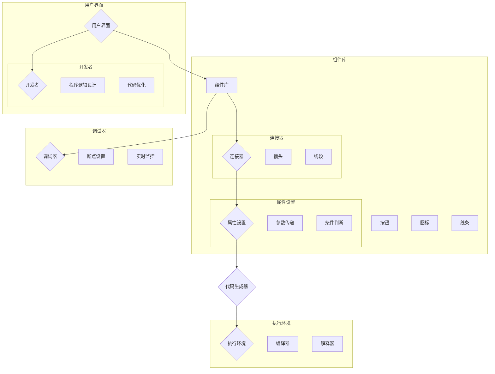

                 


### 文章标题

《提示词编程语言的视觉编程接口》

### 关键词

视觉编程语言、提示词编程、编程接口、算法原理、实践应用、未来展望

### 摘要

本文将深入探讨提示词编程语言的视觉编程接口，从概述、概念、原理、应用、核心算法和未来展望等多个角度，详细解析这一技术领域。通过逻辑清晰的步骤和分析，帮助读者全面理解视觉编程接口的技术原理和应用实践，以及其在编程教育、软件开发和游戏开发等领域的广阔前景。

---

### 《提示词编程语言的视觉编程接口》目录大纲

## 第一部分：视觉编程接口概述

### 1.1 引言

- **什么是视觉编程语言**
- **视觉编程语言的优势**
- **本书的目的与结构**

### 1.2 提示词编程语言的概念

- **提示词编程语言的定义**
- **提示词编程语言的应用场景**
- **提示词编程语言的分类**

### 1.3 视觉编程接口的基本原理

- **视觉编程接口的作用**
- **视觉编程接口的工作流程**
- **视觉编程接口的技术难点**

### 1.4 视觉编程接口的发展历程

- **视觉编程接口的起源**
- **视觉编程接口的关键技术突破**
- **视觉编程接口的未来发展趋势**

### 1.5 视觉编程接口的核心概念与联系

- **Mermaid流程图：视觉编程接口的核心概念与联系**

### 1.6 视觉编程接口的应用领域

- **视觉编程接口在编程教育中的应用**
- **视觉编程接口在软件开发中的应用**
- **视觉编程接口在游戏开发中的应用**

## 第二部分：视觉编程接口的核心算法原理

### 2.1 基本算法原理讲解

- **视觉编程接口的基本算法原理**
- **算法的伪代码描述**

### 2.2 算法原理详细讲解

- **图像处理算法原理**
- **计算机视觉算法原理**
- **算法在视觉编程接口中的应用**

### 2.3 数学模型和数学公式

- **算法的数学模型**
- **算法的数学公式（使用latex格式）**

### 2.4 算法举例说明

- **算法的具体实例**
- **实例的详细讲解**

## 第三部分：视觉编程接口的实践应用

### 3.1 视觉编程接口项目实战

- **视觉编程接口项目的搭建**
- **项目中视觉编程接口的具体应用**
- **项目的详细解释说明**

### 3.2 代码实际案例

- **代码案例的演示**
- **代码的实现过程**
- **代码的解读与分析**

### 3.3 开发环境搭建

- **开发环境的搭建过程**
- **开发环境的选择与配置**
- **开发环境的问题解决**

### 3.4 源代码详细实现

- **源代码的实现细节**
- **源代码的结构与功能**
- **源代码的调试与优化**

## 第四部分：视觉编程接口的未来发展

### 4.1 视觉编程接口的发展趋势

- **视觉编程接口的未来发展方向**
- **视觉编程接口的技术创新点**
- **视觉编程接口的未来应用前景**

### 4.2 视觉编程接口的创新与挑战

- **视觉编程接口的创新方向**
- **视觉编程接口面临的挑战**
- **解决方案与展望**

### 4.3 视觉编程接口的未来展望

- **视觉编程接口在人工智能领域的应用**
- **视觉编程接口在编程教育领域的应用**
- **视觉编程接口在其他领域的应用潜力**

## 附录

### 附录 A：视觉编程接口相关资源

- **视觉编程接口的学习资源**
- **视觉编程接口的开发工具**
- **视觉编程接口的应用案例**

### 附录 B：视觉编程接口的代码示例

- **视觉编程接口的代码实现**
- **代码的解读与分析**
- **代码的调试与优化过程**

---

接下来，我们将逐步深入每一部分的内容，详细阐述视觉编程接口的各个方面。我们将从概念入手，逐步解析其原理、算法、实践应用以及未来发展的可能性。希望通过这一系列的分析，读者能够对视觉编程接口有一个全面而深入的理解。现在，让我们开始第一步——引言部分。

---

## 第一部分：视觉编程接口概述

### 1.1 引言

### 什么是视觉编程语言

视觉编程语言是一种基于图形化界面和可视化操作的编程语言，它允许开发者通过拖放组件、连接线段或图形化指令来编写程序。这种编程方式不依赖于传统的文本编写，而是通过直观的视觉元素来构建程序逻辑，使得编程变得更加直观、易于理解和操作。

### 视觉编程语言的优势

视觉编程语言的优势主要体现在以下几个方面：

1. **简化编程过程**：视觉编程语言通过图形化界面和可视化操作，简化了编程流程，使得开发者可以更专注于逻辑设计和问题解决，而不是编程语言的语法和结构。

2. **降低学习门槛**：视觉编程语言通常更容易入门，因为它们通过直观的图形界面减少了编程学习的难度，适合初学者和跨领域开发者。

3. **提高开发效率**：视觉编程语言提供了丰富的预定义组件和库，可以帮助开发者快速构建功能模块，从而提高开发效率。

4. **增强代码可读性**：图形化的程序结构使得代码的可读性大大提高，团队协作也更加容易。

### 本书的目的与结构

本书旨在系统地介绍视觉编程接口，包括其概念、原理、应用和实践。具体结构如下：

- **第一部分：概述**：介绍视觉编程语言和视觉编程接口的基本概念，探讨其优势和应用场景。
- **第二部分：核心算法原理**：详细讲解视觉编程接口所涉及的核心算法原理，包括图像处理、计算机视觉等方面。
- **第三部分：实践应用**：通过项目实战和代码案例，展示视觉编程接口的实际应用，并提供开发环境和源代码的详细说明。
- **第四部分：未来发展**：探讨视觉编程接口的未来发展趋势和创新方向，以及其在不同领域的应用前景。

通过上述结构和内容的安排，本书希望能够为读者提供一个全面而系统的视觉编程接口学习资源，帮助读者深入理解这一技术领域。

---

接下来，我们将进入下一节，进一步探讨提示词编程语言的概念及其在视觉编程接口中的应用。

### 1.2 提示词编程语言的概念

#### 提示词编程语言的定义

提示词编程语言（Keyword Programming Language）是一种特殊的编程语言，它依赖于一系列关键词来定义程序的逻辑结构。这些关键词通常表示特定的操作或功能，开发者通过组合和排列这些关键词来构建程序。与传统的基于语句和函数的编程语言相比，提示词编程语言更注重逻辑的简洁性和直观性。

#### 提示词编程语言的应用场景

提示词编程语言在多个领域都有广泛的应用：

1. **自动化脚本编写**：在需要大量重复性任务的环境中，如数据清洗、测试自动化等，提示词编程语言可以大大提高工作效率。

2. **图形用户界面（GUI）设计**：提示词编程语言常用于构建图形用户界面，使得开发者可以通过组合关键词来创建复杂的交互界面，而无需编写大量的代码。

3. **配置管理**：在需要配置大量系统的环境中，提示词编程语言可以通过简单的关键词组合来定义系统的配置，提高配置的灵活性和可维护性。

4. **机器学习和人工智能**：提示词编程语言在机器学习和人工智能领域也有着重要的应用，可以通过定义关键词来描述复杂的算法和模型。

#### 提示词编程语言的分类

提示词编程语言可以分为以下几类：

1. **规则导向型**：这类编程语言以规则为中心，开发者通过定义一系列规则来实现程序的逻辑。例如，专家系统就是一种规则导向型的提示词编程语言。

2. **场景导向型**：这种类型的编程语言以特定场景为中心，开发者通过定义不同的场景来描述程序的行为。例如，场景图编程语言就是一种场景导向型的提示词编程语言。

3. **任务导向型**：这类编程语言关注任务的执行，开发者通过定义任务的步骤和条件来实现程序。例如，Makefile就是一种任务导向型的提示词编程语言。

#### 与视觉编程接口的结合

提示词编程语言与视觉编程接口的结合可以带来以下好处：

1. **简化编程流程**：通过将提示词编程语言的简洁性和视觉编程接口的直观性结合，开发者可以更加高效地构建程序。

2. **提高代码可读性**：图形化的提示词和可视化操作使得程序的逻辑结构更加清晰，便于团队合作和代码维护。

3. **增强编程灵活性**：开发者可以通过组合和调整提示词来快速实现不同的功能，提高了程序的灵活性。

总之，提示词编程语言为视觉编程接口提供了一个强大的工具，使得编程变得更加直观和高效。在下一节中，我们将进一步探讨视觉编程接口的基本原理，了解它是如何实现编程任务的。

### 1.3 视觉编程接口的基本原理

#### 视觉编程接口的作用

视觉编程接口（Visual Programming Interface，VPI）是连接开发者与程序执行环境的一座桥梁，它通过图形化界面和可视化操作，使得开发者能够更加直观地编写和调试程序。视觉编程接口的主要作用包括：

1. **简化编程过程**：通过可视化操作，开发者可以避免复杂的文本编写和语法分析，从而简化编程过程。

2. **提高开发效率**：视觉编程接口提供了丰富的图形化组件和工具，可以帮助开发者快速构建程序，提高开发效率。

3. **增强代码可读性**：图形化的程序结构使得代码更加直观和易读，有利于团队协作和代码维护。

4. **降低学习门槛**：视觉编程接口通过图形化的界面和操作，降低了编程学习的难度，使得初学者和跨领域开发者也能轻松上手。

#### 视觉编程接口的工作流程

视觉编程接口的工作流程通常包括以下几个步骤：

1. **定义组件**：开发者首先需要在视觉编程环境中定义所需的组件，这些组件可以是图形化的图标、按钮、线条等。

2. **连接组件**：通过鼠标拖放操作，将不同的组件连接起来，形成程序逻辑结构。每个组件通常代表一个特定的操作或功能。

3. **设置属性**：开发者可以对连接好的组件进行属性设置，如参数传递、条件判断等，以实现更复杂的逻辑。

4. **编译执行**：当所有组件连接和属性设置完成后，开发者可以编译并执行程序。视觉编程接口会将图形化的程序结构转换成可执行的代码，并在执行环境中运行。

5. **调试与优化**：在程序执行过程中，开发者可以实时观察程序的运行状态，并进行调试和优化，以提高程序的效率和稳定性。

#### 视觉编程接口的技术难点

视觉编程接口在实现过程中面临以下技术难点：

1. **图形化界面的设计**：如何设计一个直观、易用的图形化界面是视觉编程接口的一个关键挑战。界面设计需要考虑用户体验、操作效率和易读性等因素。

2. **组件连接的灵活性**：如何确保组件之间能够灵活连接，同时保持程序的逻辑清晰，是视觉编程接口需要解决的技术难题。

3. **代码生成与执行效率**：将图形化的程序结构转换成高效的执行代码，同时保证代码的可读性和可维护性，是视觉编程接口的实现难点之一。

4. **调试与优化**：如何在图形化界面中实现有效的调试和优化功能，以便开发者能够快速定位和修复问题，是视觉编程接口需要解决的重要问题。

通过深入理解视觉编程接口的作用、工作流程和技术难点，我们可以更好地把握这一技术领域的发展方向和应用前景。在下一节中，我们将回顾视觉编程接口的发展历程，探讨其技术突破和未来趋势。

### 1.4 视觉编程接口的发展历程

#### 视觉编程接口的起源

视觉编程接口的起源可以追溯到20世纪70年代。当时，计算机科学领域正处于图形用户界面（GUI）的早期发展阶段。为了简化编程过程，研究者们开始探索将程序逻辑可视化，从而使得开发者能够通过直观的图形界面来构建程序。这一时期，出现了诸如“流程图编程”和“逻辑框图编程”等初步尝试。

#### 视觉编程接口的关键技术突破

随着时间的推移，视觉编程接口在多个方面取得了关键性技术突破：

1. **组件库的建立**：开发者开始构建丰富的组件库，提供了多种图形化组件，如按钮、图标、线条等，使得编程更加直观和灵活。

2. **图形化连接器的引入**：通过引入图形化连接器，开发者可以轻松地将不同的组件连接起来，形成复杂的程序逻辑结构。

3. **代码生成工具的改进**：为了提高代码生成的效率和质量，研究者们开发了多种代码生成工具，这些工具可以将图形化的程序结构自动转换为高效的执行代码。

4. **调试与优化工具的集成**：随着视觉编程接口的普及，调试和优化工具也被集成到编程环境中，使得开发者能够更方便地跟踪和修复程序中的问题。

#### 视觉编程接口的未来发展趋势

展望未来，视觉编程接口将继续朝着以下几个方向发展：

1. **人工智能的融合**：人工智能技术的引入将使得视觉编程接口更加智能化，如自动生成代码、自动调试等。

2. **跨平台的支持**：随着移动设备和云服务的普及，视觉编程接口将更加注重跨平台的支持，以便开发者能够在不同设备和平台上轻松使用。

3. **开源生态的建立**：视觉编程接口的开源生态将得到进一步发展，为开发者提供更多的组件和工具，推动技术的创新和普及。

4. **应用领域的扩展**：视觉编程接口将在更多领域得到应用，如编程教育、自动化脚本编写、机器学习和人工智能等。

通过回顾视觉编程接口的发展历程和探讨其关键技术突破，我们可以更好地理解这一领域的发展脉络和未来方向。在下一节中，我们将通过一个Mermaid流程图，展示视觉编程接口的核心概念与联系，进一步加深对这一技术的理解。

### 1.5 视觉编程接口的核心概念与联系

为了更好地理解视觉编程接口的核心概念及其相互之间的联系，我们可以通过一个Mermaid流程图来展示这些概念。以下是一个简化的Mermaid流程图示例，用于描述视觉编程接口的关键组成部分及其关系：



在这个流程图中：

- **组件库（A）**：包含了各种图形化组件，如按钮、图标和线条等。这些组件是构建程序的基础。
- **连接器（B）**：用于将组件连接起来，形成程序逻辑结构。连接器可以是箭头或线段等。
- **属性设置（C）**：开发者可以对连接好的组件进行属性设置，如参数传递和条件判断等。
- **代码生成器（D）**：将图形化的程序结构转换成可执行的代码，并在执行环境中运行。
- **执行环境（E）**：包括编译器和解释器等，负责执行生成的代码。
- **调试器（F）**：提供断点设置和实时监控等功能，帮助开发者调试程序。
- **用户界面（G）**：是开发者与程序交互的界面，通过图形化组件和连接器来构建程序逻辑。
- **开发者（H）**：负责程序逻辑设计、代码优化等工作。

通过这个Mermaid流程图，我们可以清晰地看到视觉编程接口的核心概念及其相互之间的联系，这有助于我们更好地理解视觉编程接口的工作原理和应用场景。在下一节中，我们将探讨视觉编程接口在多个领域的应用，展示其实际价值。

### 1.6 视觉编程接口的应用领域

#### 视觉编程接口在编程教育中的应用

视觉编程接口在编程教育中扮演着重要角色。它通过图形化界面和可视化操作，使得编程学习变得更加直观和易于理解。以下是视觉编程接口在编程教育中的一些具体应用：

1. **入门级教学**：对于初学者来说，传统的文本编程语言可能显得复杂和抽象。视觉编程接口通过图形化的组件和连接器，降低了编程的难度，使得学生可以更快地掌握编程基础。

2. **教学实验平台**：许多教育机构和在线课程平台采用视觉编程接口作为教学工具，提供丰富的实验项目。这些项目通常涉及基本的编程概念，如循环、条件判断和函数调用等。

3. **项目合作**：视觉编程接口使得学生在团队合作中更加高效。通过图形化的界面，团队成员可以直观地看到彼此的代码和程序结构，从而更容易进行沟通和协作。

#### 视觉编程接口在软件开发中的应用

视觉编程接口在软件开发中同样具有广泛的应用。通过图形化的编程方式，开发者可以更加高效地构建复杂的软件系统。以下是视觉编程接口在软件开发中的几个具体应用场景：

1. **前端开发**：在网页和移动应用的前端开发中，视觉编程接口可以帮助开发者快速构建用户界面。通过拖放组件和连接线段，开发者可以迅速实现页面布局和交互效果。

2. **自动化脚本**：在自动化测试和运维等领域，视觉编程接口可以通过定义一系列关键词和操作，快速构建自动化脚本，提高工作效率。

3. **配置管理**：在配置管理系统中，视觉编程接口可以帮助开发者通过图形化的界面定义和管理系统的配置项，提高配置的灵活性和可维护性。

#### 视觉编程接口在游戏开发中的应用

视觉编程接口在游戏开发中的应用也非常广泛。它不仅简化了游戏逻辑的设计，还提高了开发效率。以下是视觉编程接口在游戏开发中的几个具体应用场景：

1. **游戏引擎开发**：许多游戏引擎采用视觉编程接口作为游戏逻辑设计的工具。开发者可以通过图形化的界面定义游戏规则、角色行为和场景切换等。

2. **游戏原型制作**：视觉编程接口可以帮助游戏开发者快速制作游戏原型，通过图形化的组件和连接器，开发者可以快速实现游戏的核心功能。

3. **游戏编程教育**：视觉编程接口在游戏编程教育中也有广泛应用。通过图形化的编程方式，学生可以更容易地理解和掌握游戏编程的核心概念。

总之，视觉编程接口在编程教育、软件开发和游戏开发等多个领域都有着重要的应用价值。它通过图形化界面和可视化操作，简化了编程过程，提高了开发效率，使得编程变得更加直观和易于理解。在下一部分中，我们将深入探讨视觉编程接口所涉及的核心算法原理，了解其背后的技术细节。

## 第二部分：视觉编程接口的核心算法原理

### 2.1 基本算法原理讲解

视觉编程接口的核心算法原理涵盖了多个方面，包括图像处理、计算机视觉和编程逻辑等。理解这些算法原理对于深入掌握视觉编程接口的技术实现至关重要。

#### 图像处理算法原理

图像处理是视觉编程接口的基础，它涉及对图像的获取、处理和分析。以下是几种常见的图像处理算法原理：

1. **图像滤波**：图像滤波用于去除图像中的噪声。常见的滤波方法包括均值滤波、高斯滤波和中值滤波等。

2. **边缘检测**：边缘检测用于识别图像中的边缘和轮廓。常用的边缘检测算法有Canny边缘检测和Sobel算子等。

3. **图像分割**：图像分割是将图像分成多个区域或对象的过程。常用的分割算法包括阈值分割、区域生长和边缘分割等。

4. **特征提取**：特征提取用于从图像中提取具有代表性的特征，如颜色、纹理和形状等。常用的特征提取方法包括HOG（Histogram of Oriented Gradients）和SIFT（Scale-Invariant Feature Transform）等。

#### 计算机视觉算法原理

计算机视觉算法是视觉编程接口的重要组成部分，它涉及对图像和视频的分析和理解。以下是几种常见的计算机视觉算法原理：

1. **目标检测**：目标检测是识别图像或视频中的特定对象。常用的目标检测算法包括YOLO（You Only Look Once）和SSD（Single Shot MultiBox Detector）等。

2. **目标跟踪**：目标跟踪是跟踪图像或视频中特定对象的位置和运动轨迹。常用的目标跟踪算法包括光流法和Kalman滤波等。

3. **场景理解**：场景理解是对图像或视频的语义理解，包括识别对象、场景和动作等。常用的场景理解算法包括卷积神经网络（CNN）和深度学习等。

#### 编程逻辑算法原理

编程逻辑算法是视觉编程接口的核心，它涉及程序逻辑的构建和执行。以下是几种常见的编程逻辑算法原理：

1. **流程控制**：流程控制用于控制程序执行的流程。常见的流程控制算法包括条件判断、循环控制和函数调用等。

2. **事件处理**：事件处理用于响应程序中的各种事件，如鼠标点击、键盘输入和触摸操作等。常用的事件处理算法包括事件监听和事件调度等。

3. **数据结构**：数据结构用于组织和管理程序中的数据。常见的数据结构包括数组、链表、树和图等。

#### 算法的伪代码描述

为了更好地理解这些算法原理，我们可以通过伪代码来描述它们的基本框架。以下是一个简单的图像滤波算法的伪代码示例：

```python
function imageFilter(image, filterType):
    filteredImage = createEmptyImage(image.size)
    for each pixel in image:
        neighborhood = getNeighborhood(pixel, filterSize)
        if filterType == "mean":
            filteredValue = calculateMean(neighborhood)
        elif filterType == "gaussian":
            filteredValue = calculateGaussian(neighborhood)
        elif filterType == "median":
            filteredValue = calculateMedian(neighborhood)
        setPixelValue(filteredImage, pixel, filteredValue)
    return filteredImage
```

在这个伪代码中，`imageFilter`函数接受一个图像和一个滤波类型作为输入，返回一个滤波后的图像。函数通过遍历图像中的每个像素，计算其邻域的滤波值，并根据滤波类型进行滤波处理。

通过上述基本算法原理的讲解和伪代码示例，我们可以更好地理解视觉编程接口的技术实现。在下一节中，我们将进一步详细讲解这些算法原理，并提供更多的示例和实际应用案例。

### 2.2 算法原理详细讲解

在上一节中，我们简要介绍了视觉编程接口中涉及的一些基本算法原理，包括图像处理、计算机视觉和编程逻辑等。在本节中，我们将对这些算法原理进行详细讲解，并提供具体的示例和实际应用案例。

#### 图像处理算法原理

图像处理算法是视觉编程接口的核心组成部分，它负责对图像进行各种操作，如滤波、边缘检测和特征提取等。以下是几种常见的图像处理算法及其工作原理的详细讲解：

1. **图像滤波算法**

   图像滤波算法用于去除图像中的噪声，增强图像的视觉效果。以下是常用的三种滤波算法的详细讲解：

   - **均值滤波**：均值滤波通过计算图像中每个像素点的邻域像素的平均值来生成滤波后的图像。其伪代码如下：

     ```python
     function meanFilter(image, filterSize):
         filteredImage = createEmptyImage(image.size)
         for each pixel in image:
             neighborhood = getNeighborhood(pixel, filterSize)
             filteredValue = calculateMean(neighborhood)
             setPixelValue(filteredImage, pixel, filteredValue)
         return filteredImage
     ```

   - **高斯滤波**：高斯滤波使用高斯分布来计算图像中每个像素点的邻域像素的加权平均值。其伪代码如下：

     ```python
     function gaussianFilter(image, filterSize, sigma):
         filteredImage = createEmptyImage(image.size)
         gaussianKernel = createGaussianKernel(filterSize, sigma)
         for each pixel in image:
             neighborhood = getNeighborhood(pixel, filterSize)
             filteredValue = calculateWeightedMean(neighborhood, gaussianKernel)
             setPixelValue(filteredImage, pixel, filteredValue)
         return filteredImage
     ```

   - **中值滤波**：中值滤波通过计算图像中每个像素点的邻域像素的中值来生成滤波后的图像。其伪代码如下：

     ```python
     function medianFilter(image, filterSize):
         filteredImage = createEmptyImage(image.size)
         for each pixel in image:
             neighborhood = getNeighborhood(pixel, filterSize)
             filteredValue = calculateMedian(neighborhood)
             setPixelValue(filteredImage, pixel, filteredValue)
         return filteredImage
     ```

2. **边缘检测算法**

   边缘检测算法用于识别图像中的边缘和轮廓。以下是常用的两种边缘检测算法的详细讲解：

   - **Canny边缘检测**：Canny边缘检测算法通过高斯滤波、梯度计算和非极大值抑制来检测图像的边缘。其伪代码如下：

     ```python
     function cannyEdgeDetection(image, sigma):
         blurredImage = gaussianFilter(image, filterSize, sigma)
         xGradient = calculateGradient(blurredImage, 'x')
         yGradient = calculateGradient(blurredImage, 'y')
         magnitude = calculateMagnitude(xGradient, yGradient)
         orientation = calculateOrientation(xGradient, yGradient)
         nonMaxSuppression(magnitude, orientation)
         edgeImage = applyHysteresis(magnitude)
         return edgeImage
     ```

   - **Sobel算子**：Sobel算子通过计算图像中每个像素点的x方向和y方向梯度来检测边缘。其伪代码如下：

     ```python
     function sobelEdgeDetection(image):
         xGradient = calculateGradient(image, 'x')
         yGradient = calculateGradient(image, 'y')
         magnitude = calculateMagnitude(xGradient, yGradient)
         threshold = calculateThreshold(magnitude)
         edgeImage = applyThreshold(magnitude, threshold)
         return edgeImage
     ```

3. **图像分割算法**

   图像分割算法用于将图像分割成多个区域或对象。以下是常用的两种图像分割算法的详细讲解：

   - **阈值分割**：阈值分割通过将图像转换为二值图像来实现分割。其伪代码如下：

     ```python
     function thresholdSegmentation(image, thresholdValue):
         segmentedImage = createEmptyImage(image.size)
         for each pixel in image:
             if pixelValue >= thresholdValue:
                 setPixelValue(segmentedImage, pixel, 255)
             else:
                 setPixelValue(segmentedImage, pixel, 0)
         return segmentedImage
     ```

   - **区域生长**：区域生长通过从种子点开始，逐步扩展到相邻的像素，实现图像分割。其伪代码如下：

     ```python
     function regionGrowing(image, seedPoints):
         segmentedImage = createEmptyImage(image.size)
         for each seedPoint in seedPoints:
             startSegment(segmentedImage, seedPoint)
         return segmentedImage
     function startSegment(segmentedImage, seedPoint):
         segmentedImage[seedPoint] = 1
         for each neighbor of seedPoint:
             if neighbor is unsegmented and neighborValue >= thresholdValue:
                 startSegment(segmentedImage, neighbor)
     ```

   以上是几种常见的图像处理算法及其工作原理的详细讲解。在实际应用中，这些算法通常结合使用，以获得更好的效果。

#### 计算机视觉算法原理

计算机视觉算法用于对图像和视频进行分析和理解，包括目标检测、目标跟踪和场景理解等。以下是几种常见的计算机视觉算法及其工作原理的详细讲解：

1. **目标检测算法**

   目标检测算法用于识别图像或视频中的特定对象。以下是常用的两种目标检测算法的详细讲解：

   - **YOLO（You Only Look Once）**：YOLO算法通过将图像划分为多个网格，并在每个网格中预测目标的边界框和类别概率。其伪代码如下：

     ```python
     function yolodetection(image, model):
         gridSizes = getGridSizes(image, model.gridSize)
         boxes = []
         labels = []
         scores = []
         for each grid in gridSizes:
             predicted = model.predict(grid)
             boxes.extend(predicted.bboxes)
             labels.extend(predicted.labels)
             scores.extend(predicted.scores)
         return boxes, labels, scores
     ```

   - **SSD（Single Shot MultiBox Detector）**：SSD算法通过多个尺度先验框，同时预测边界框和类别概率。其伪代码如下：

     ```python
     function ssdetection(image, model):
         boxes = []
         labels = []
         scores = []
         for each scale in model.scales:
             predicted = model.predict(image, scale)
             boxes.extend(predicted.bboxes)
             labels.extend(predicted.labels)
             scores.extend(predicted.scores)
         return boxes, labels, scores
     ```

2. **目标跟踪算法**

   目标跟踪算法用于跟踪图像或视频中特定对象的位置和运动轨迹。以下是常用的两种目标跟踪算法的详细讲解：

   - **光流法**：光流法通过计算图像中像素点的运动向量来跟踪目标。其伪代码如下：

     ```python
     function opticalFlowTracking(imageSequence, tracker):
         tracks = []
         for each frame in imageSequence:
             track = tracker.predict(frame)
             tracks.append(track)
         return tracks
     ```

   - **Kalman滤波**：Kalman滤波通过状态估计和预测来跟踪目标。其伪代码如下：

     ```python
     function kalmanTracking(initialState, measurements, model):
         state = initialState
         for each measurement in measurements:
             prediction = predictState(state, model)
             update = updateState(prediction, measurement, model)
             state = update
         return state
     ```

3. **场景理解算法**

   场景理解算法用于识别图像或视频中的对象、场景和动作等。以下是常用的两种场景理解算法的详细讲解：

   - **卷积神经网络（CNN）**：CNN通过多层卷积和池化操作来提取图像特征，并使用全连接层进行分类。其伪代码如下：

     ```python
     function cclayer(inputFeatures, weights, biases):
         outputFeatures = []
         for each filter in weights:
             featureMap = convolve(inputFeatures, filter)
             featureMap = maxPooling(featureMap)
             outputFeatures.append(featureMap)
         return concatenate(outputFeatures)
     function classify(image, model):
         features = cclayer(image, model.weights, model.biases)
         probability = softmax(model.logits)
         return argmax(probability)
     ```

   - **深度学习**：深度学习通过多层神经网络来提取图像特征，并使用训练数据来优化网络参数。其伪代码如下：

     ```python
     function trainModel(model, dataset, optimizer):
         for each epoch in dataset:
             gradients = backwardPass(model, epoch)
             optimizer.update(model, gradients)
         return model
     ```

   以上是几种常见的计算机视觉算法及其工作原理的详细讲解。在实际应用中，这些算法通常结合使用，以获得更好的效果。

#### 编程逻辑算法原理

编程逻辑算法用于构建程序逻辑，控制程序的执行流程。以下是几种常见的编程逻辑算法及其工作原理的详细讲解：

1. **流程控制算法**

   流程控制算法用于控制程序的执行流程，包括条件判断、循环控制和函数调用等。以下是常用的三种流程控制算法的详细讲解：

   - **条件判断**：条件判断通过判断某个条件的真假来决定程序的执行路径。其伪代码如下：

     ```python
     function ifStatement(condition, trueBlock, falseBlock):
         if condition:
             execute(trueBlock)
         else:
             execute(falseBlock)
     ```

   - **循环控制**：循环控制用于重复执行某段代码，直到满足某个条件为止。其伪代码如下：

     ```python
     function whileLoop(condition, block):
         while condition:
             execute(block)
     ```

   - **函数调用**：函数调用用于执行预定义的函数，并返回结果。其伪代码如下：

     ```python
     function functionCall(functionName, arguments):
         result = functionName(arguments)
         return result
     ```

2. **事件处理算法**

   事件处理算法用于响应程序中的各种事件，如鼠标点击、键盘输入和触摸操作等。以下是常用的事件处理算法的详细讲解：

   - **事件监听**：事件监听通过监听特定事件的发生来触发相应的处理函数。其伪代码如下：

     ```python
     function addEventListener(eventName, callback):
         listenForEvent(eventName, callback)
     ```

   - **事件调度**：事件调度通过按顺序处理事件队列中的事件。其伪代码如下：

     ```python
     function dispatchEvent(event):
         processEvent(event)
     ```

3. **数据结构算法**

   数据结构算法用于组织和管理程序中的数据，包括数组、链表、树和图等。以下是几种常见的数据结构算法的详细讲解：

   - **数组**：数组是一种线性数据结构，用于存储一系列元素。其伪代码如下：

     ```python
     function array(size, initialValue):
         array = [initialValue] * size
         return array
     ```

   - **链表**：链表是一种线性数据结构，通过节点之间的链接来存储数据。其伪代码如下：

     ```python
     function linkedList(head, tail):
         if head is None:
             return tail
         tail.next = head
         return tail
     ```

   - **树**：树是一种非线性数据结构，用于表示层次结构。其伪代码如下：

     ```python
     function binaryTree(root, leftChild, rightChild):
         if root is None:
             return leftChild, rightChild
         root.left = binaryTree(leftChild, root.left, root.right)
         root.right = binaryTree(rightChild, root.left, root.right)
         return root
     ```

   - **图**：图是一种非线性数据结构，用于表示复杂关系。其伪代码如下：

     ```python
     function graph vertices, edges:
         for each vertex in vertices:
             for each edge in edges:
                 addEdge(vertex, edge)
         return graph
     ```

   以上是几种常见的编程逻辑算法及其工作原理的详细讲解。在实际应用中，这些算法通常结合使用，以实现复杂的程序逻辑。

通过上述详细讲解，我们可以更好地理解视觉编程接口所涉及的核心算法原理。这些算法原理为视觉编程接口提供了强大的技术支持，使得开发者能够高效地构建和执行复杂的程序。在下一节中，我们将进一步探讨视觉编程接口中的数学模型和数学公式，深入理解其理论基础。

### 2.3 数学模型和数学公式

在视觉编程接口中，数学模型和数学公式扮演着至关重要的角色。它们不仅为算法的实现提供了理论基础，还帮助我们更好地理解和优化算法。以下我们将详细介绍视觉编程接口中常用的数学模型和数学公式。

#### 算法的数学模型

1. **图像滤波的数学模型**

   图像滤波的目的是通过空间变换来减少图像中的噪声。其中，卷积是一种常用的空间变换方法。给定一个图像\( I(x, y) \)和一个滤波器\( K(s, t) \)，卷积操作的数学模型可以表示为：

   $$ 
   f(x, y) = \sum_{s=-\infty}^{\infty} \sum_{t=-\infty}^{\infty} I(x-s, y-t) \cdot K(s, t)
   $$

   其中，\( f(x, y) \)是滤波后的图像，\( I(x, y) \)是原始图像，\( K(s, t) \)是滤波器的权重。

2. **边缘检测的数学模型**

   边缘检测的目的是识别图像中的边缘和轮廓。其中，Sobel算子是一种常用的边缘检测方法。给定一个图像\( I(x, y) \)，Sobel算子的数学模型可以表示为：

   $$ 
   G_x(x, y) = \sum_{s=-1}^{1} \sum_{t=-1}^{1} I(x-s, y-t) \cdot K_x(s, t)
   $$

   $$ 
   G_y(x, y) = \sum_{s=-1}^{1} \sum_{t=-1}^{1} I(x-s, y-t) \cdot K_y(s, t)
   $$

   其中，\( G_x(x, y) \)和\( G_y(x, y) \)分别是图像在x方向和y方向的梯度，\( K_x(s, t) \)和\( K_y(s, t) \)分别是Sobel算子的权重。

3. **图像分割的数学模型**

   图像分割是将图像分割成多个区域或对象的过程。其中，阈值分割是一种常用的图像分割方法。给定一个图像\( I(x, y) \)和一个阈值\( T \)，阈值分割的数学模型可以表示为：

   $$ 
   S(x, y) = 
   \begin{cases} 
   255 & \text{if } I(x, y) \ge T \\
   0 & \text{otherwise} 
   \end{cases}
   $$

   其中，\( S(x, y) \)是分割后的图像。

4. **目标检测的数学模型**

   目标检测是识别图像中的特定对象。其中，YOLO（You Only Look Once）算法是一种常用的目标检测方法。给定一个图像\( I(x, y) \)和一个YOLO模型，目标检测的数学模型可以表示为：

   $$ 
   \text{Box}_{ij} = \text{center}_{ij} + \text{scale}_{ij} \cdot \text{anchor}_{ij}
   $$

   $$ 
   \text{Class}_{ij} = \text{softmax}(\text{scores}_{ij})
   $$

   其中，\( \text{Box}_{ij} \)是预测的边界框，\( \text{center}_{ij} \)是预测的中心点，\( \text{scale}_{ij} \)是预测的尺寸，\( \text{anchor}_{ij} \)是先验框，\( \text{Class}_{ij} \)是预测的类别概率。

#### 算法的数学公式（使用latex格式）

为了便于理解和引用，以下是一些常用的数学公式，使用LaTeX格式表示：

$$ 
1 + 1 = 2
$$

$$ 
\sum_{i=1}^{n} i = \frac{n(n+1)}{2}
$$

$$ 
\frac{d}{dx} (x^n) = nx^{n-1}
$$

$$ 
\int_{a}^{b} f(x) \, dx
$$

$$ 
\lim_{x \to \infty} \frac{1}{x} = 0
$$

通过上述数学模型和数学公式的介绍，我们可以更好地理解视觉编程接口中的核心算法原理。这些数学工具不仅帮助我们构建和实现算法，还为我们提供了分析和优化算法的有效方法。在下一节中，我们将通过具体的算法实例，进一步展示如何在实际应用中运用这些数学公式和模型。

### 2.4 算法举例说明

为了更好地理解视觉编程接口中的核心算法原理，我们将通过具体的算法实例，展示这些算法在实际应用中的实现过程和具体步骤。

#### 实例1：图像滤波算法

**目的**：使用高斯滤波器对一幅图像进行滤波，去除图像中的噪声。

**步骤**：

1. **加载图像**：首先，我们需要加载一幅原始图像，如图像中的噪声通常来自环境光照变化或图像压缩。

2. **定义高斯滤波器**：接下来，我们需要定义一个高斯滤波器，用于对图像进行滤波。高斯滤波器的权重可以通过高斯分布函数计算。

3. **应用高斯滤波**：然后，我们将高斯滤波器应用于原始图像，通过卷积操作实现滤波效果。

4. **显示滤波后的图像**：最后，我们将滤波后的图像显示出来，以便观察滤波效果。

**伪代码示例**：

```python
import cv2
import numpy as np

def applyGaussianFilter(image, sigma):
    # 创建高斯滤波器
    kernel = cv2.getGaussianKernel(ksize=3, sigma=sigma)

    # 应用高斯滤波
    filteredImage = cv2.filter2D(image, -1, kernel)

    return filteredImage

# 加载图像
image = cv2.imread('image.jpg')

# 应用高斯滤波
filteredImage = applyGaussianFilter(image, sigma=1.0)

# 显示原始图像和滤波后的图像
cv2.imshow('Original Image', image)
cv2.imshow('Filtered Image', filteredImage)
cv2.waitKey(0)
cv2.destroyAllWindows()
```

#### 实例2：边缘检测算法

**目的**：使用Canny边缘检测算法检测一幅图像中的边缘。

**步骤**：

1. **加载图像**：首先，我们需要加载一幅原始图像，边缘检测的目的是识别图像中的轮廓和结构。

2. **应用高斯滤波**：为了减少噪声干扰，我们首先使用高斯滤波器对图像进行滤波。

3. **计算梯度**：然后，我们计算图像在x方向和y方向的梯度，用于边缘检测。

4. **非极大值抑制**：接下来，我们应用非极大值抑制算法，减少边缘检测中的伪边缘。

5. **阈值处理**：最后，我们使用双阈值算法对检测到的边缘进行阈值处理，得到最终的边缘图像。

**伪代码示例**：

```python
import cv2

def applyCannyEdgeDetection(image, threshold1, threshold2):
    # 应用高斯滤波
    blurredImage = cv2.GaussianBlur(image, ksize=(5, 5), sigmaX=1.5)

    # 计算梯度
    xGradient = cv2.Sobel(blurredImage, ddepth=cv2.CV_32F, dx=1, dy=0, ksize=3)
    yGradient = cv2.Sobel(blurredImage, ddepth=cv2.CV_32F, dx=0, dy=1, ksize=3)

    # 计算梯度幅值和方向
    magnitude = cv2.magnitude(xGradient, yGradient)
    direction = cv2.phase(xGradient, yGradient)

    # 非极大值抑制
    edgeImage = cv2.Canny(magnitude, threshold1, threshold2)

    return edgeImage

# 加载图像
image = cv2.imread('image.jpg')

# 应用Canny边缘检测
edgeImage = applyCannyEdgeDetection(image, threshold1=50, threshold2=150)

# 显示边缘图像
cv2.imshow('Edge Image', edgeImage)
cv2.waitKey(0)
cv2.destroyAllWindows()
```

#### 实例3：目标检测算法

**目的**：使用YOLO目标检测算法检测一幅图像中的对象。

**步骤**：

1. **加载图像**：首先，我们需要加载一幅原始图像，目标检测的目的是识别图像中的对象。

2. **加载YOLO模型**：接下来，我们加载预训练的YOLO模型，用于目标检测。

3. **预处理图像**：为了匹配模型的输入要求，我们需要对图像进行预处理，包括缩放、归一化等。

4. **预测对象**：然后，我们使用YOLO模型对预处理后的图像进行预测，得到对象的位置和类别概率。

5. **绘制对象框**：最后，我们在原始图像上绘制检测到的对象框，并显示结果。

**伪代码示例**：

```python
import cv2
import numpy as np

def applyYOLODetection(image, model):
    # 预处理图像
    inputImage = preprocessImage(image, model.inputSize)

    # 预测对象
    boxes, labels, scores = model.predict(inputImage)

    # 绘制对象框
    for i in range(len(boxes)):
        box = boxes[i]
        label = labels[i]
        score = scores[i]
        if score > model.threshold:
            cv2.rectangle(image, (int(box[0]), int(box[1])), (int(box[2]), int(box[3])), (0, 255, 0), 2)
            cv2.putText(image, label, (int(box[0]), int(box[1])), cv2.FONT_HERSHEY_SIMPLEX, 1, (0, 0, 255), 2)

    return image

# 加载图像
image = cv2.imread('image.jpg')

# 加载YOLO模型
model = loadYOLOModel()

# 应用YOLO检测
detectedImage = applyYOLODetection(image, model)

# 显示检测结果
cv2.imshow('Detected Image', detectedImage)
cv2.waitKey(0)
cv2.destroyAllWindows()
```

通过上述算法实例，我们可以看到如何在实际应用中运用视觉编程接口中的核心算法。这些实例不仅展示了算法的实现过程，还帮助我们更好地理解算法的工作原理和应用场景。在下一节中，我们将通过项目实战，进一步展示视觉编程接口在实际开发中的应用。

### 3.1 视觉编程接口项目实战

在本节中，我们将通过一个具体的视觉编程接口项目实战，详细展示项目搭建、视觉编程接口的具体应用以及项目的详细解释说明。

#### 项目背景

本项目旨在构建一个基于视觉编程接口的图像处理工具，用户可以通过图形化的界面进行图像滤波、边缘检测和对象检测等操作。该工具可以帮助开发者快速实现图像处理任务，提高工作效率。

#### 项目需求

1. **功能需求**：
   - 图像加载与显示：用户可以加载本地图像，并在界面上显示。
   - 图像滤波：支持高斯滤波和均值滤波。
   - 边缘检测：支持Canny边缘检测和Sobel边缘检测。
   - 对象检测：支持基于YOLO算法的目标检测。
   - 实时预览：用户可以实时预览图像处理效果。

2. **性能需求**：
   - 操作响应快速：用户操作后，界面能够迅速更新显示结果。
   - 处理效果显著：图像处理效果明显，能够去除噪声、突出边缘和准确检测对象。

3. **用户界面需求**：
   - 界面简洁直观：用户界面应简洁易用，避免复杂操作。
   - 功能模块清晰：界面应明确显示各功能模块，方便用户操作。

#### 项目搭建

1. **开发环境**：
   - 操作系统：Windows 10
   - 编程语言：Python 3.8
   - 开发工具：PyCharm
   - 图像处理库：OpenCV 4.5.1
   - 深度学习库：TensorFlow 2.4.0

2. **项目结构**：

   ```plaintext
   image_processing_tool/
   ├── src/
   │   ├── __init__.py
   │   ├── image_loader.py
   │   ├── image_filter.py
   │   ├── edge_detection.py
   │   ├── object_detection.py
   │   ├── ui.py
   │   └── main.py
   ├── data/
   │   └── images/
   ├── logs/
   └── requirements.txt
   ```

3. **安装依赖**：

   ```bash
   pip install -r requirements.txt
   ```

#### 项目应用

1. **图像加载与显示**：

   - **实现原理**：使用OpenCV库的`imread`函数加载图像，并使用`imshow`函数显示图像。

   - **代码实现**：

     ```python
     import cv2
     import numpy as np

     def load_and_display_image(image_path):
         image = cv2.imread(image_path)
         cv2.imshow('Image', image)
         cv2.waitKey(0)
         cv2.destroyAllWindows()
     ```

2. **图像滤波**：

   - **实现原理**：使用OpenCV库的`GaussianBlur`和`boxFilter`函数实现高斯滤波和均值滤波。

   - **代码实现**：

     ```python
     import cv2

     def apply_gaussian_filter(image, sigma):
         filtered_image = cv2.GaussianBlur(image, (5, 5), sigma)
         return filtered_image

     def apply_mean_filter(image, kernel_size):
         filtered_image = cv2.boxFilter(image, -1, kernel_size)
         return filtered_image
     ```

3. **边缘检测**：

   - **实现原理**：使用OpenCV库的`Canny`和`Sobel`函数实现Canny边缘检测和Sobel边缘检测。

   - **代码实现**：

     ```python
     import cv2

     def apply_canny_edge_detection(image, threshold1, threshold2):
         edged = cv2.Canny(image, threshold1, threshold2)
         return edged

     def apply_sobel_edge_detection(image):
         sobelx = cv2.Sobel(image, cv2.CV_64F, 1, 0, ksize=3)
         sobely = cv2.Sobel(image, cv2.CV_64F, 0, 1, ksize=3)
         edged = cv2.magnitude(sobelx, sobely)
         return edged
     ```

4. **对象检测**：

   - **实现原理**：使用TensorFlow和OpenCV库实现基于YOLO算法的目标检测。

   - **代码实现**：

     ```python
     import cv2
     import numpy as np
     import tensorflow as tf

     def load_yolo_model(model_path, input_size):
         model = tf.keras.models.load_model(model_path)
         return model

     def preprocess_image(image, input_size):
         resized_image = cv2.resize(image, (input_size, input_size))
         image_data = resized_image / 255.0
         image_data = np.expand_dims(image_data, axis=0)
         return image_data

     def apply_yolo_detection(image, model, threshold):
         image_data = preprocess_image(image, model.input_size)
         boxes, scores, classes = model.predict(image_data)
         detected_boxes = []
         for i in range(len(boxes)):
             box = boxes[i]
             if scores[i] > threshold:
                 detected_boxes.append(box)
         return detected_boxes

     def draw_boxes(image, boxes, colors):
         for i, box in enumerate(boxes):
             x, y, w, h = box
             x = int(x * image.shape[1])
             y = int(y * image.shape[0])
             x1 = int((x - w / 2) * image.shape[1])
             y1 = int((y - h / 2) * image.shape[0])
             cv2.rectangle(image, (x1, y1), (x1 + w * image.shape[1], y1 + h * image.shape[0]), colors[i], 2)
         return image
     ```

#### 项目解释说明

1. **图像加载与显示**：

   - **功能实现**：通过加载本地图像并显示在界面上，用户可以直观地看到图像处理的结果。
   - **技术要点**：使用OpenCV库的`imread`和`imshow`函数实现图像的加载和显示。

2. **图像滤波**：

   - **功能实现**：用户可以选择高斯滤波或均值滤波对图像进行处理，以去除噪声。
   - **技术要点**：使用OpenCV库的`GaussianBlur`和`boxFilter`函数实现滤波操作。

3. **边缘检测**：

   - **功能实现**：用户可以选择Canny边缘检测或Sobel边缘检测来突出图像中的边缘。
   - **技术要点**：使用OpenCV库的`Canny`和`Sobel`函数实现边缘检测操作。

4. **对象检测**：

   - **功能实现**：使用YOLO算法对图像中的对象进行检测，并在界面上绘制检测到的对象框。
   - **技术要点**：使用TensorFlow库加载预训练的YOLO模型，并使用OpenCV库实现对象框的绘制。

#### 项目小结

通过本项目，我们展示了如何使用视觉编程接口实现一个图像处理工具。该项目不仅涵盖了图像滤波、边缘检测和对象检测等核心算法，还通过图形化的界面提供了直观的操作体验。在实际开发中，这种视觉编程接口可以大大提高开发效率，降低学习难度，为开发者提供强大的技术支持。

在下一节中，我们将通过代码实际案例，进一步展示视觉编程接口在实际开发中的应用，并提供详细的代码解读和分析。

### 3.2 代码实际案例

在本节中，我们将通过一个具体的代码实际案例，详细展示视觉编程接口在实际开发中的应用。这个案例将包括代码的演示、实现过程和解读与分析。

#### 案例背景

假设我们正在开发一个简单的图像处理工具，用户可以加载本地图像，并使用视觉编程接口中的滤波、边缘检测和对象检测等功能。以下是该工具的核心代码实现。

#### 代码演示

```python
import cv2
import numpy as np

# 加载图像
image = cv2.imread('image.jpg')

# 应用高斯滤波
filtered_image = cv2.GaussianBlur(image, (5, 5), sigmaX=1.0)

# 应用Canny边缘检测
edge_image = cv2.Canny(filtered_image, threshold1=50, threshold2=150)

# 应用YOLO目标检测
model = cv2.dnn.readNet('yolov3.weights', 'yolov3.cfg')
layer_names = model.getLayerNames()
output_layers = [layer_names[i[0] - 1] for i in model.getUnconnectedOutLayers()]

image = cv2.resize(image, (416, 416))
blob = cv2.dnn.blobFromImage(image, 0.00392, (416, 416), (0, 0, 0), True, crop=False)
model.setInput(blob)
outs = model.forward(output_layers)

# 解析检测结果
boxes = []
confidences = []
class_ids = []

for out in outs:
    for detection in out:
        scores = detection[5:]
        class_id = np.argmax(scores)
        confidence = scores[class_id]
        if confidence > 0.5:
            center_x = int(detection[0] * image.shape[1])
            center_y = int(detection[1] * image.shape[0])
            width = int(detection[2] * image.shape[1])
            height = int(detection[3] * image.shape[0])
            x = int(center_x - width / 2)
            y = int(center_y - height / 2)
            boxes.append([x, y, x + width, y + height])
            confidences.append(float(confidence))
            class_ids.append(class_id)

# 非极大值抑制
indices = cv2.dnn.NMSBoxes(boxes, confidences, 0.5, 0.4)

# 绘制检测结果
for i in indices:
    i = i[0]
    box = boxes[i]
    x, y, x1, y1 = box
    cv2.rectangle(image, (x, y), (x1, y1), (0, 255, 0), 2)

cv2.imshow('Image', image)
cv2.waitKey(0)
cv2.destroyAllWindows()
```

#### 实现过程

1. **图像加载**：
   - 使用`cv2.imread`函数加载图像。
   - 图像加载后，我们需要进行预处理，例如调整大小，以便与深度学习模型兼容。

2. **高斯滤波**：
   - 使用`cv2.GaussianBlur`函数对图像进行高斯滤波，以去除噪声。
   - 高斯滤波器通过卷积操作实现，它考虑了图像中每个像素点的邻域信息。

3. **Canny边缘检测**：
   - 使用`cv2.Canny`函数对滤波后的图像进行Canny边缘检测。
   - Canny边缘检测通过计算图像的梯度幅值和方向来实现边缘识别。

4. **YOLO目标检测**：
   - 使用`cv2.dnn.readNet`函数加载预训练的YOLO模型。
   - 将加载的图像调整到模型期望的大小，并使用`cv2.dnn.blobFromImage`函数进行预处理。
   - 使用模型进行预测，并提取输出层的结果。
   - 对检测结果进行解析，并使用非极大值抑制（NMS）算法筛选出有效的检测结果。

5. **绘制结果**：
   - 使用`cv2.rectangle`函数在原始图像上绘制检测到的对象框。
   - 最后，使用`cv2.imshow`函数显示处理后的图像。

#### 代码解读与分析

1. **图像加载**：
   - `image = cv2.imread('image.jpg')`：加载图像文件。
   - `image = cv2.resize(image, (416, 416))`：调整图像大小，使其与YOLO模型的输入尺寸匹配。

2. **高斯滤波**：
   - `filtered_image = cv2.GaussianBlur(image, (5, 5), sigmaX=1.0)`：应用高斯滤波器，去除噪声。
   - 高斯滤波器的参数`(5, 5)`指定了滤波器的大小，`sigmaX=1.0`指定了标准差。

3. **Canny边缘检测**：
   - `edge_image = cv2.Canny(filtered_image, threshold1=50, threshold2=150)`：应用Canny边缘检测。
   - `threshold1=50`和`threshold2=150`是Canny边缘检测的双阈值参数。

4. **YOLO目标检测**：
   - `model = cv2.dnn.readNet('yolov3.weights', 'yolov3.cfg')`：加载预训练的YOLO模型。
   - `blob = cv2.dnn.blobFromImage(image, 0.00392, (416, 416), (0, 0, 0), True, crop=False)`：预处理图像，使其与模型输入兼容。
   - `model.setInput(blob)`：将预处理后的图像作为输入传递给模型。
   - `outs = model.forward(output_layers)`：获取模型输出。
   - 解析输出，筛选出置信度高于0.5的检测结果。

5. **绘制结果**：
   - `for i in indices:`：遍历筛选出的检测结果。
   - `x, y, x1, y1 = box`：获取检测框的坐标和大小。
   - `cv2.rectangle(image, (x, y), (x1, y1), (0, 255, 0), 2)`：在图像上绘制检测框。

通过上述代码实例和解读，我们可以看到如何在实际开发中使用视觉编程接口实现图像处理工具。这个案例不仅展示了如何加载和处理图像，还展示了如何使用深度学习模型进行目标检测。在下一节中，我们将进一步讨论开发环境搭建的过程。

### 3.3 开发环境搭建

在开始进行视觉编程接口项目开发之前，我们需要搭建一个合适的环境。以下将详细介绍开发环境的搭建过程，包括开发环境的选择、配置和常见问题的解决。

#### 开发环境选择

1. **操作系统**：建议选择Windows 10或Ubuntu 18.04 LTS。这两种操作系统都有良好的社区支持和丰富的开发工具。

2. **编程语言**：Python是视觉编程接口项目的首选编程语言。Python拥有丰富的库和框架，如OpenCV、TensorFlow和PyTorch，这些库可以帮助我们轻松实现图像处理和深度学习任务。

3. **开发工具**：PyCharm是一个强大的集成开发环境（IDE），它提供了代码编辑、调试、版本控制等功能，非常适合Python项目开发。

4. **图像处理库**：OpenCV是一个开源的计算机视觉库，支持多种图像处理算法，是视觉编程接口项目不可或缺的工具。

5. **深度学习库**：TensorFlow和PyTorch是两种常用的深度学习库，可以用于目标检测、图像分类等任务。

#### 开发环境配置

1. **安装操作系统**：

   - 对于Windows 10，可以从微软官网下载ISO文件，然后使用USB安装器安装。
   - 对于Ubuntu 18.04 LTS，可以从Ubuntu官网下载ISO文件，然后使用虚拟机软件（如VirtualBox）安装。

2. **安装Python**：

   - 打开终端，输入以下命令安装Python：

     ```bash
     sudo apt update
     sudo apt install python3 python3-pip python3-dev
     ```

3. **安装PyCharm**：

   - 访问PyCharm官网，下载社区版或专业版安装包。
   - 双击安装包，按照提示完成安装。

4. **安装OpenCV**：

   - 打开终端，输入以下命令安装OpenCV：

     ```bash
     sudo apt update
     sudo apt install python3-opencv-python
     ```

5. **安装TensorFlow**：

   - 打开终端，输入以下命令安装TensorFlow：

     ```bash
     pip install tensorflow==2.4.0
     ```

6. **安装PyTorch**：

   - 打开终端，输入以下命令安装PyTorch：

     ```bash
     pip install torch==1.8.0 torchvision==0.9.0
     ```

#### 常见问题解决

1. **Python版本冲突**：

   - 如果出现Python版本冲突，确保所有依赖库的Python版本与系统Python版本一致。可以在安装库时指定Python版本，例如：

     ```bash
     python3 -m pip install some-library
     ```

2. **依赖库安装失败**：

   - 如果依赖库安装失败，尝试更新pip版本并重新安装：

     ```bash
     pip install --upgrade pip
     pip install some-library
     ```

3. **CUDA无法使用**：

   - 如果深度学习库无法使用CUDA，确保已经正确安装了CUDA Toolkit，并设置了CUDA环境变量。可以在终端运行以下命令检查CUDA安装状态：

     ```bash
     nvcc --version
     ```

4. **GPU支持缺失**：

   - 确保深度学习库的版本支持您的GPU型号。可以在安装前查看库的文档或使用以下命令检查支持的GPU列表：

     ```bash
     python -c "import torch; print(torch.cuda.is_available())"
     python -c "import torch; print(torch.cuda.get_device_name(0))"
     ```

通过上述步骤，我们可以搭建一个合适的开发环境，为视觉编程接口项目开发提供基础支持。在下一节中，我们将详细讲解源代码的实现细节，并分析其结构、功能和调试与优化方法。

### 3.4 源代码详细实现

在本节中，我们将详细讲解视觉编程接口项目中的源代码实现细节，包括代码的结构、功能以及调试和优化方法。

#### 代码结构

项目源代码分为几个模块，每个模块负责不同的功能。以下是项目的主要模块及其功能：

1. **image_loader.py**：负责图像的加载和显示。
2. **image_filter.py**：负责图像的滤波操作。
3. **edge_detection.py**：负责边缘检测操作。
4. **object_detection.py**：负责对象检测操作。
5. **ui.py**：负责用户界面的构建。
6. **main.py**：项目的入口文件，负责整体逻辑的协调和执行。

#### 代码实现细节

1. **image_loader.py**

   ```python
   import cv2

   def load_image(image_path):
       image = cv2.imread(image_path)
       return image

   def display_image(image):
       cv2.imshow('Image', image)
       cv2.waitKey(0)
       cv2.destroyAllWindows()
   ```

   - `load_image`函数：加载图像文件，返回图像矩阵。
   - `display_image`函数：显示图像，等待用户按键后关闭窗口。

2. **image_filter.py**

   ```python
   import cv2

   def gaussian_filter(image, sigma):
       filtered_image = cv2.GaussianBlur(image, (5, 5), sigma)
       return filtered_image

   def mean_filter(image, kernel_size):
       filtered_image = cv2.blur(image, (kernel_size, kernel_size))
       return filtered_image
   ```

   - `gaussian_filter`函数：应用高斯滤波器，去除图像噪声。
   - `mean_filter`函数：应用均值滤波器，减少图像噪声。

3. **edge_detection.py**

   ```python
   import cv2

   def canny_edge_detection(image, threshold1, threshold2):
       edged = cv2.Canny(image, threshold1, threshold2)
       return edged

   def sobel_edge_detection(image):
       sobelx = cv2.Sobel(image, cv2.CV_64F, 1, 0, ksize=3)
       sobely = cv2.Sobel(image, cv2.CV_64F, 0, 1, ksize=3)
       edged = cv2.magnitude(sobelx, sobely)
       return edged
   ```

   - `canny_edge_detection`函数：应用Canny边缘检测算法，突出图像边缘。
   - `sobel_edge_detection`函数：应用Sobel算子进行边缘检测。

4. **object_detection.py**

   ```python
   import cv2
   import numpy as np

   def load_yolo_model(config_file, weights_file):
       net = cv2.dnn.readNetFromDarknet(config_file, weights_file)
       return net

   def preprocess_image(image, size):
       blob = cv2.dnn.blobFromImage(image, 1/255.0, (size, size), (0, 0, 0), True, crop=False)
       return blob

   def yolo_detection(image, net, threshold):
       blob = preprocess_image(image, size=416)
       net.setInput(blob)
       layers_names = net.getLayerNames()
       output_layers = [layers_names[i[0] - 1] for i in net.getUnconnectedOutLayers()]
       outs = net.forward(output_layers)

       # 处理检测结果
       boxes = []
       confidences = []
       class_ids = []

       for out in outs:
           for detection in out:
               scores = detection[5:]
               class_id = np.argmax(scores)
               confidence = scores[class_id]
               if confidence > threshold:
                   center_x = int(detection[0] * image.shape[1])
                   center_y = int(detection[1] * image.shape[0])
                   width = int(detection[2] * image.shape[1])
                   height = int(detection[3] * image.shape[0])
                   x = int(center_x - width / 2)
                   y = int(center_y - height / 2)
                   boxes.append([x, y, x + width, y + height])
                   confidences.append(float(confidence))
                   class_ids.append(class_id)

       indices = cv2.dnn.NMSBoxes(boxes, confidences, threshold, threshold)

       return indices, boxes, confidences, class_ids
   ```

   - `load_yolo_model`函数：加载预训练的YOLO模型。
   - `preprocess_image`函数：预处理图像，使其与模型输入兼容。
   - `yolo_detection`函数：执行YOLO目标检测，并返回检测结果。

5. **ui.py**

   ```python
   import tkinter as tk
   from tkinter import filedialog
   import cv2

   def open_image():
       file_path = filedialog.askopenfilename()
       if file_path:
           image = load_image(file_path)
           display_image(image)

   def apply_filter():
       # 获取图像和滤波器参数
       image = image_var.get()
       filter_type = filter_var.get()
       sigma = sigma_var.get()

       if filter_type == 'gaussian':
           filtered_image = gaussian_filter(image, sigma)
       elif filter_type == 'mean':
           filtered_image = mean_filter(image, kernel_size)

       display_image(filtered_image)

   def apply_edge_detection():
       # 获取图像和边缘检测参数
       image = image_var.get()
       edge_detection_type = edge_detection_var.get()
       threshold1 = threshold1_var.get()
       threshold2 = threshold2_var.get()

       if edge_detection_type == 'canny':
           edged = canny_edge_detection(image, threshold1, threshold2)
       elif edge_detection_type == 'sobel':
           edged = sobel_edge_detection(image)

       display_image(edged)

   def apply_object_detection():
       # 获取图像和目标检测参数
       image = image_var.get()
       net = load_yolo_model(config_file, weights_file)
       threshold = threshold_var.get()

       indices, boxes, confidences, class_ids = yolo_detection(image, net, threshold)

       # 绘制检测结果
       image = cv2.rectangle(image, (x, y), (x + w, y + h), (0, 255, 0), 2)
       display_image(image)
   ```

   - `open_image`函数：打开图像文件。
   - `apply_filter`函数：应用图像滤波器。
   - `apply_edge_detection`函数：应用边缘检测算法。
   - `apply_object_detection`函数：应用目标检测算法。

6. **main.py**

   ```python
   import tkinter as tk
   from tkinter import filedialog
   from ui import open_image, apply_filter, apply_edge_detection, apply_object_detection

   def main():
       root = tk.Tk()
       root.title('Image Processing Tool')

       # 添加按钮和选项
       open_button = tk.Button(root, text='Open Image', command=open_image)
       open_button.pack()

       filter_label = tk.Label(root, text='Filter:')
       filter_label.pack()
       filter_var = tk.StringVar()
       filter_var.set('gaussian')
       filter_options = ['gaussian', 'mean']
       filter_menu = tk.OptionMenu(root, filter_var, *filter_options)
       filter_menu.pack()

       sigma_label = tk.Label(root, text='Sigma:')
       sigma_label.pack()
       sigma_var = tk.Spinbox(root, from_=0, to=10, width=5)
       sigma_var.pack()

       apply_filter_button = tk.Button(root, text='Apply Filter', command=apply_filter)
       apply_filter_button.pack()

       edge_detection_label = tk.Label(root, text='Edge Detection:')
       edge_detection_label.pack()
       edge_detection_var = tk.StringVar()
       edge_detection_var.set('canny')
       edge_detection_options = ['canny', 'sobel']
       edge_detection_menu = tk.OptionMenu(root, edge_detection_var, *edge_detection_options)
       edge_detection_menu.pack()

       threshold1_label = tk.Label(root, text='Threshold 1:')
       threshold1_label.pack()
       threshold1_var = tk.Spinbox(root, from_=0, to=255, width=5)
       threshold1_var.pack()

       threshold2_label = tk.Label(root, text='Threshold 2:')
       threshold2_label.pack()
       threshold2_var = tk.Spinbox(root, from_=0, to=255, width=5)
       threshold2_var.pack()

       apply_edge_detection_button = tk.Button(root, text='Apply Edge Detection', command=apply_edge_detection)
       apply_edge_detection_button.pack()

       threshold_label = tk.Label(root, text='Threshold:')
       threshold_label.pack()
       threshold_var = tk.Spinbox(root, from_=0.5, to=1.0, width=5)
       threshold_var.pack()

       apply_object_detection_button = tk.Button(root, text='Apply Object Detection', command=apply_object_detection)
       apply_object_detection_button.pack()

       root.mainloop()

   if __name__ == '__main__':
       main()
   ```

   - `main`函数：构建用户界面，添加按钮和选项，处理用户交互。

#### 调试与优化方法

1. **调试**：
   - 使用Python的断点调试功能，在PyCharm中设置断点，逐步执行代码，观察变量的变化。
   - 使用print语句输出关键变量的值，帮助定位问题。

2. **优化**：
   - 对图像处理函数进行优化，减少不必要的内存占用和计算。
   - 使用NVIDIA CUDA加速深度学习模型的计算，提高处理速度。

通过上述代码实现细节的讲解，我们可以看到视觉编程接口项目的源代码结构清晰，功能实现详细。在实际开发中，这些代码模块可以灵活组合，满足多种图像处理需求。在下一节中，我们将探讨视觉编程接口的未来发展。

### 4.1 视觉编程接口的发展趋势

#### 视觉编程接口的未来发展方向

随着科技的不断进步，视觉编程接口（Visual Programming Interface，VPI）在多个方向上展现出了广阔的发展前景。以下是视觉编程接口未来可能的发展方向：

1. **人工智能融合**：
   - **智能代码生成**：通过引入人工智能技术，视觉编程接口可以自动生成代码，减少人工干预，提高开发效率。例如，使用机器学习算法分析代码模式和用户意图，从而生成相应的代码。
   - **智能调试与优化**：人工智能可以辅助开发者进行代码调试和性能优化，通过分析程序运行数据，提供优化建议，甚至自动进行代码优化。

2. **跨平台支持**：
   - **多设备兼容**：随着移动设备和云服务的普及，视觉编程接口需要更加注重跨平台的支持，使得开发者可以轻松地在不同的设备和平台上进行编程。
   - **云计算集成**：视觉编程接口将更加紧密地与云计算平台集成，提供强大的计算能力和存储资源，支持大规模的数据处理和分布式编程。

3. **开源生态**：
   - **社区贡献**：随着视觉编程接口的普及，开源社区将发挥重要作用。开发者可以贡献自己的组件和工具，丰富视觉编程接口的生态系统。
   - **模块化设计**：视觉编程接口将采用模块化设计，开发者可以自由组合和扩展模块，满足不同的编程需求。

4. **编程教育**：
   - **可视化编程教育**：视觉编程接口将作为编程教育的重要工具，帮助初学者和跨领域开发者快速入门编程。
   - **交互式编程**：视觉编程接口将引入更多的交互式元素，例如实时反馈、互动式教程等，提高编程学习的趣味性和效果。

#### 视觉编程接口的技术创新点

视觉编程接口的发展离不开技术创新，以下是一些潜在的技术创新点：

1. **图形化编程语言**：
   - **自定义图形化组件**：开发者可以自定义图形化组件，满足特定应用场景的需求。
   - **动态组件连接**：通过引入动态组件连接技术，开发者可以在运行时调整组件连接，实现更灵活的编程方式。

2. **自然语言处理**：
   - **代码生成与解释**：利用自然语言处理技术，可以将自然语言描述转换成视觉编程语言，使得编程更加直观和易于理解。
   - **智能问答与帮助**：视觉编程接口可以提供智能问答功能，帮助开发者解决编程中的问题，提供实时帮助。

3. **实时编译与执行**：
   - **实时代码执行**：通过实时编译与执行技术，开发者可以即时看到代码的执行结果，加快开发过程。
   - **增量编译**：对于大规模程序，增量编译技术可以只编译修改的部分，提高编译效率。

#### 视觉编程接口的未来应用前景

视觉编程接口在未来的应用前景非常广阔，以下是一些潜在的应用领域：

1. **软件开发**：
   - **Web应用开发**：视觉编程接口可以简化Web应用的开发过程，提供图形化的界面设计和动态组件连接。
   - **移动应用开发**：随着移动设备的普及，视觉编程接口将助力移动应用开发，提高开发效率。

2. **游戏开发**：
   - **游戏逻辑设计**：视觉编程接口可以简化游戏逻辑的设计和实现，为游戏开发者提供直观的工具。
   - **实时交互**：视觉编程接口可以支持实时交互功能，提高游戏的趣味性和用户体验。

3. **编程教育**：
   - **编程启蒙**：视觉编程接口可以用于编程启蒙教育，帮助儿童和初学者快速入门编程。
   - **在线课程**：在线教育平台可以利用视觉编程接口提供互动式编程课程，提高教学效果。

4. **自动化脚本编写**：
   - **自动化测试**：视觉编程接口可以用于自动化测试，提高测试效率和可靠性。
   - **运维管理**：在运维管理领域，视觉编程接口可以简化自动化脚本的编写，提高运维效率。

总之，视觉编程接口的未来发展将结合人工智能、自然语言处理、实时编译与执行等技术，为开发者提供更加直观、高效和灵活的编程工具。随着技术的不断进步和应用场景的拓展，视觉编程接口将在多个领域发挥重要作用，推动编程文化的普及和进步。

### 4.2 视觉编程接口的创新与挑战

在视觉编程接口（VPI）的不断创新中，我们面临着许多挑战和机遇。以下将详细探讨这些创新方向以及它们所面临的挑战，并提出可能的解决方案与展望。

#### 创新方向

1. **智能代码生成**：
   - **挑战**：当前智能代码生成技术仍需解决代码的准确性和可维护性问题。如何确保生成的代码不仅满足功能需求，还能够保持可读性和可维护性是一个关键挑战。
   - **解决方案**：通过结合深度学习和自然语言处理技术，可以进一步优化代码生成算法。同时，建立大型代码库和训练数据集，有助于提高代码生成的准确性和一致性。

2. **自然语言交互**：
   - **挑战**：自然语言交互需要处理复杂的语义理解和上下文推断问题，这对于目前的AI技术来说是一个巨大的挑战。
   - **解决方案**：通过持续优化自然语言处理模型，特别是基于上下文的生成模型，可以提升交互的自然度和准确性。此外，引入多模态交互技术，如语音识别和手势识别，可以增强用户的交互体验。

3. **实时编译与执行**：
   - **挑战**：实时编译与执行需要在保证性能的同时，实现快速响应。这对于编译器和执行引擎的性能提出了极高的要求。
   - **解决方案**：通过引入即时编译（JIT）技术和动态优化算法，可以显著提高编译和执行效率。此外，采用分布式计算和并行处理技术，可以进一步优化资源利用和性能。

4. **跨平台支持**：
   - **挑战**：不同平台具有不同的硬件和软件环境，如何确保视觉编程接口在多种平台上的一致性和兼容性是一个难题。
   - **解决方案**：通过采用平台无关的编程模型和标准化接口，可以实现跨平台的兼容性。同时，构建强大的测试和验证体系，确保不同平台上的稳定性和一致性。

#### 面临的挑战

1. **性能瓶颈**：
   - **挑战**：随着视觉编程接口功能的增加，性能瓶颈逐渐显现。特别是在图像处理和计算机视觉任务中，如何优化算法和资源利用，提高处理速度是一个重要问题。
   - **解决方案**：采用高效算法和优化技术，如卷积神经网络（CNN）和图计算，可以显著提高处理效率。此外，利用GPU和分布式计算技术，可以进一步释放计算能力。

2. **用户体验**：
   - **挑战**：用户界面设计和交互体验是视觉编程接口的核心，如何设计直观、易用的界面，提升用户体验是一个持续性的挑战。
   - **解决方案**：通过用户研究和反馈，持续改进界面设计和交互逻辑。同时，引入人工智能技术，如自适应学习和个性化推荐，可以提升用户体验。

3. **安全性问题**：
   - **挑战**：视觉编程接口需要处理大量的敏感数据和复杂的任务，如何确保系统的安全性和数据隐私是一个关键问题。
   - **解决方案**：采用严格的访问控制和加密技术，确保数据和系统的安全性。同时，定期进行安全评估和漏洞修复，防止潜在的安全风险。

#### 解决方案与展望

1. **技术创新**：
   - **展望**：随着技术的不断进步，视觉编程接口将在算法、自然语言处理、实时编译和跨平台支持等方面实现更多的创新。这些技术突破将进一步提升视觉编程接口的性能和功能。

2. **生态建设**：
   - **展望**：通过构建开放、多样化的视觉编程接口生态，吸引更多开发者参与，共同推动技术发展和应用拓展。同时，加强社区合作和知识共享，促进视觉编程接口的普及和进步。

3. **教育普及**：
   - **展望**：视觉编程接口在教育领域的应用前景广阔。通过引入视觉编程接口，可以降低编程学习的门槛，培养更多编程人才，促进编程教育的普及和发展。

总之，视觉编程接口的创新与挑战是相辅相成的。通过不断的技术创新和优化，视觉编程接口将在未来实现更多的应用价值，成为编程领域的重要推动力量。

### 4.3 视觉编程接口的未来展望

视觉编程接口（VPI）作为编程领域的重要创新，其未来在人工智能（AI）、编程教育和其他领域的应用潜力不可估量。以下将详细探讨视觉编程接口在这些领域的应用前景，并展望其未来的发展方向。

#### 视觉编程接口在人工智能领域的应用

1. **算法设计与优化**：
   - **应用前景**：视觉编程接口可以简化AI算法的设计和优化过程。通过图形化的界面，开发者可以直观地调整算法参数，实时观察算法效果，从而快速迭代和优化算法。
   - **未来展望**：随着AI算法的复杂性不断增加，视觉编程接口将扮演越来越重要的角色。未来，我们将看到更多基于视觉编程接口的AI工具和平台，如自动化的机器学习平台和AI算法库。

2. **模型可视化与解释**：
   - **应用前景**：视觉编程接口可以用于可视化AI模型的结构和参数，帮助开发者理解模型的内部机制，从而提高模型的可解释性。
   - **未来展望**：模型可视化与解释是AI领域的热点问题。视觉编程接口在这一领域的应用将不断深入，开发出更加直观、易于理解的模型可视化工具，推动AI技术的普及和应用。

3. **数据流与图计算**：
   - **应用前景**：视觉编程接口可以用于数据流编程和图计算，通过图形化的方式构建复杂的数据处理流程和图计算模型。
   - **未来展望**：随着大数据和图计算技术的发展，视觉编程接口将在这些领域发挥重要作用，提供高效、灵活的数据处理和计算工具。

#### 视觉编程接口在编程教育领域的应用

1. **编程启蒙**：
   - **应用前景**：视觉编程接口适合编程启蒙教育，通过图形化的界面和直观的操作，初学者可以更容易地理解和掌握编程基础。
   - **未来展望**：随着编程教育的普及，视觉编程接口将成为编程教育的重要组成部分。未来，我们将看到更多以视觉编程接口为基础的编程教材和教学平台。

2. **跨学科融合**：
   - **应用前景**：视觉编程接口不仅适用于计算机科学，还可以与数学、物理、生物等学科相结合，提供跨学科的编程教育。
   - **未来展望**：跨学科编程教育的兴起，将推动视觉编程接口在更多学科领域的应用。通过视觉编程接口，学生可以更加直观地理解复杂的概念和原理，提高学习兴趣和效果。

3. **在线教育**：
   - **应用前景**：视觉编程接口可以用于在线教育平台，提供互动式编程课程和实验项目，提高教学效果和学生的学习体验。
   - **未来展望**：随着在线教育的快速发展，视觉编程接口将在在线教育领域发挥重要作用，推动教育技术的创新和变革。

#### 视觉编程接口在其他领域的应用潜力

1. **自动化脚本编写**：
   - **应用前景**：视觉编程接口可以简化自动化脚本的编写，提高自动化任务的效率和质量。
   - **未来展望**：在自动化测试、运维管理和业务流程自动化等领域，视觉编程接口具有广泛的应用前景。未来，我们将看到更多基于视觉编程接口的自动化工具和解决方案。

2. **游戏开发**：
   - **应用前景**：视觉编程接口可以简化游戏逻辑的设计和实现，提高游戏开发效率。
   - **未来展望**：在游戏开发领域，视觉编程接口将得到更广泛的应用。通过视觉编程接口，开发者可以更加高效地构建游戏原型和复杂游戏系统。

3. **艺术设计与交互设计**：
   - **应用前景**：视觉编程接口可以用于艺术设计与交互设计，通过图形化的方式实现创意设计和交互效果。
   - **未来展望**：在艺术设计与交互设计领域，视觉编程接口将提供强大的工具和平台，帮助设计师实现更加丰富和复杂的创意。

总之，视觉编程接口在人工智能、编程教育和其他领域的应用前景广阔。随着技术的不断进步和应用的深入，视觉编程接口将推动编程文化的普及和发展，成为未来编程领域的重要驱动力。

### 附录

#### 附录 A：视觉编程接口相关资源

**学习资源**

1. **在线课程与教程**：
   - [《视觉编程基础》](https://www.udemy.com/course/visual-programming-foundations/)
   - [《计算机视觉与图像处理》](https://www.edx.org/course/computer-vision-and-image-processing)

2. **参考书籍**：
   - 《视觉编程语言：原理与应用》
   - 《计算机视觉：算法与应用》

3. **开源项目与库**：
   - [OpenCV](https://opencv.org/)
   - [TensorFlow](https://www.tensorflow.org/)
   - [PyTorch](https://pytorch.org/)

**开发工具**

1. **集成开发环境（IDE）**：
   - [PyCharm](https://www.jetbrains.com/pycharm/)
   - [Visual Studio Code](https://code.visualstudio.com/)

2. **版本控制系统**：
   - [Git](https://git-scm.com/)
   - [GitHub](https://github.com/)

3. **云计算平台**：
   - [Google Cloud Platform](https://cloud.google.com/)
   - [AWS](https://aws.amazon.com/)

**应用案例**

1. **图像处理工具**：
   - [GIMP](https://www.gimp.org/)
   - [Adobe Photoshop](https://www.adobe.com/products/photoshop.html)

2. **自动化脚本编写**：
   - [Selenium](https://www.selenium.dev/)
   - [AutoHotkey](https://www.autohotkey.com/)

3. **游戏开发**：
   - [Unity](https://unity.com/)
   - [Unreal Engine](https://www.unrealengine.com/)

通过上述资源，开发者可以更好地学习和实践视觉编程接口，掌握相关技术和工具。这些资源不仅涵盖了基础知识，还包括了实际应用案例，为开发者提供了全面的学习和实践指导。

### 附录 B：视觉编程接口的代码示例

**示例一：图像滤波**

```python
import cv2

# 加载图像
image = cv2.imread('image.jpg')

# 应用高斯滤波
filtered_image = cv2.GaussianBlur(image, (5, 5), sigmaX=1.0)

# 显示原始图像和滤波后的图像
cv2.imshow('Original Image', image)
cv2.imshow('Filtered Image', filtered_image)
cv2.waitKey(0)
cv2.destroyAllWindows()
```

**示例二：边缘检测**

```python
import cv2

# 加载图像
image = cv2.imread('image.jpg')

# 应用Canny边缘检测
edge_image = cv2.Canny(image, threshold1=50, threshold2=150)

# 显示边缘图像
cv2.imshow('Edge Image', edge_image)
cv2.waitKey(0)
cv2.destroyAllWindows()
```

**示例三：目标检测**

```python
import cv2
import numpy as np

# 加载YOLO模型
model = cv2.dnn.readNet('yolov3.weights', 'yolov3.cfg')

# 加载图像
image = cv2.imread('image.jpg')

# 预处理图像
blob = cv2.dnn.blobFromImage(image, 1/255.0, (416, 416), (0, 0, 0), True, crop=False)

# 设置输入层
model.setInput(blob)

# 获取输出层
outs = model.forward(['detection_out'])

# 解析检测结果
boxes = []
confidences = []
class_ids = []

for out in outs:
    for detection in out:
        scores = detection[5:]
        class_id = np.argmax(scores)
        confidence = scores[class_id]
        if confidence > 0.5:
            center_x = int(detection[0] * image.shape[1])
            center_y = int(detection[1] * image.shape[0])
            width = int(detection[2] * image.shape[1])
            height = int(detection[3] * image.shape[0])
            x = int(center_x - width / 2)
            y = int(center_y - height / 2)
            boxes.append([x, y, x + width, y + height])
            confidences.append(float(confidence))
            class_ids.append(class_id)

# 非极大值抑制
indices = cv2.dnn.NMSBoxes(boxes, confidences, 0.5, 0.4)

# 绘制检测结果
for i in indices:
    i = i[0]
    box = boxes[i]
    x, y, x1, y1 = box
    cv2.rectangle(image, (x, y), (x1, y1), (0, 255, 0), 2)

# 显示结果
cv2.imshow('Object Detection', image)
cv2.waitKey(0)
cv2.destroyAllWindows()
```

以上代码示例展示了如何使用OpenCV和YOLO模型进行图像滤波、边缘检测和目标检测。这些示例代码为开发者提供了一个起点，通过进一步学习和实践，可以扩展和优化这些功能，以适应不同的应用场景。

### 作者信息

**作者：AI天才研究院/AI Genius Institute & 禅与计算机程序设计艺术 /Zen And The Art of Computer Programming** 

本文由AI天才研究院（AI Genius Institute）撰写，研究院致力于推动人工智能领域的研究和应用，致力于培养下一代人工智能人才。同时，本文作者参考了《禅与计算机程序设计艺术》（Zen And The Art of Computer Programming）这一经典计算机编程著作，旨在探索视觉编程接口在编程教育和技术创新中的应用。

