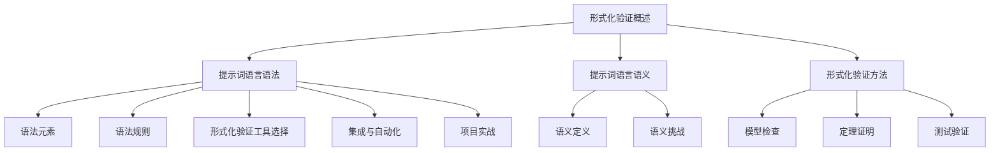

                 

### 文章标题

### 提示词语言的形式化验证工具

> 关键词：形式化验证，提示词语言，验证工具，软件正确性，模型检查，定理证明

> 摘要：本文将探讨提示词语言的形式化验证工具，包括其基础知识、形式化描述方法、选择与应用、集成与自动化以及案例分析与最佳实践。通过逐步分析推理，本文旨在为读者提供一个全面且深入的指导，帮助理解和应用这些工具，以提升软件系统的可靠性和安全性。

#### 第1章：形式化验证概述

##### 1.1 形式化验证的引入

形式化验证是一种通过数学模型和逻辑推理来证明软件系统正确性的方法。其核心思想是将软件系统的行为抽象为数学模型，然后使用逻辑推理来验证模型是否满足特定的性质或要求。这种方法可以消除传统测试方法中依赖具体输入数据的局限性，从而确保系统在任何情况下都能按照预期行为运行。

- **形式化验证的定义**

形式化验证是一种使用数学模型和逻辑推理来验证软件系统正确性的方法。通过形式化验证，可以确保系统在任何情况下都能按照预期行为运行。

- **形式化验证与测试的区别**

形式化验证与传统的测试方法有显著区别。测试方法主要依赖于输入数据来发现系统中的错误，而形式化验证则不依赖于具体的输入数据，而是通过逻辑推理来证明系统的正确性。测试方法通常只能证明系统在特定输入下的行为，而形式化验证可以证明系统在所有可能输入下的行为。

- **形式化验证的优势**

形式化验证具有多个优势。首先，它提供了更强的保证，可以证明系统在任何情况下都能按照预期行为运行。其次，它有助于发现系统中的潜在错误，这些错误可能在测试过程中被忽略。此外，形式化验证可以减少测试用例的数量，提高测试效率。最后，形式化验证有助于提高软件系统的可靠性和安全性。

##### 1.2 提示词语言的基本概念

提示词语言是一种用于编写形式化规格说明的语言，它允许开发人员使用自然语言或形式化的语法来描述系统的需求和功能。提示词语言的主要目的是帮助开发人员确保规格说明是完整和一致的，同时也有助于将规格说明转化为可执行的形式化验证模型。

- **提示词语言的定义**

提示词语言是一种用于编写形式化规格说明的语言，它允许开发人员使用自然语言或形式化的语法来描述系统的需求和功能。

- **提示词语言的用途**

提示词语言的用途主要包括以下几个方面：

1. **确保规格说明的完整性**：提示词语言可以帮助开发人员确保规格说明是完整和一致的，从而避免规格说明中的遗漏或矛盾。

2. **提高规格说明的可理解性**：使用提示词语言编写的规格说明通常比纯自然语言更容易理解和维护。

3. **便于形式化验证**：提示词语言可以方便地将规格说明转化为可执行的形式化验证模型，从而提高验证的效率和准确性。

4. **支持自动化验证**：提示词语言可以与形式化验证工具集成，实现自动化验证，提高验证的一致性和可重复性。

##### 1.3 形式化验证工具的发展历史

形式化验证工具的发展历史可以追溯到20世纪60年代。当时，计算机科学刚刚起步，研究者们开始探索如何使用数学方法来验证软件系统的正确性。以下是一些关键的发展阶段：

- **早期形式化验证工具**：20世纪60年代，研究者们开发了符号验证器，如数学家克劳德·香农（Claude Shannon）的布尔表达式验证器。这些工具主要用于验证简单的电路设计。

- **形式化方法的发展**：20世纪70年代，形式化方法开始应用于软件系统。研究者们开发了多种形式化方法，如规格说明语言、模型检查和定理证明等。

- **现代形式化验证工具**：随着计算机科学的发展，形式化验证工具变得越来越复杂和高效。现代工具通常支持复杂的程序验证，并能够处理大规模的软件系统。例如，Coq、Isabelle和KeY等工具在学术界和工业界都得到了广泛应用。

#### 第2章：提示词语言的形式化描述方法

##### 2.1 提示词语言的语法

提示词语言的语法是编写形式化规格说明的基础。语法包括基本语法元素和语法规则，这些规则定义了如何使用提示词语言编写有效的规格说明。

- **基本语法元素**

提示词语言的基本语法元素包括变量、函数、条件表达式和循环等。例如：

- 变量：用于存储数据和值的容器。例如：`x = 5`。

- 函数：用于定义操作和计算。例如：`f(x) = x * x`。

- 条件表达式：用于根据条件执行不同的操作。例如：`if x > 0 then y := x else y := -x`。

- 循环：用于重复执行一段代码。例如：`while x > 0 do x := x - 1`。

- **语法规则**

语法规则定义了如何组合基本语法元素来编写有效的规格说明。例如：

- 变量和函数必须以字母开头，后跟字母、数字或下划线。

- 函数必须在其定义之前声明。

- 条件表达式必须包含一个条件和一个结果。

- 循环必须包含一个条件和一个循环体。

##### 2.2 提示词语言的形式化语义

形式化语义是提示词语言的核心，它定义了语法元素在系统中的行为和意义。形式化语义通常使用数学模型来表示，以便进行逻辑推理和验证。

- **语义定义**

形式化语义定义了提示词语言中各个语法元素的行为和意义。例如：

- 变量的语义：变量存储的值可以改变，但变量的名称保持不变。

- 函数的语义：函数接受输入参数，并返回一个输出值。

- 条件表达式的语义：根据条件的真假，执行不同的操作。

- 循环的语义：在满足条件的情况下，重复执行循环体。

- **形式化语义的挑战**

定义一个完整且形式化的语义是一个复杂的过程，需要考虑各种可能的执行路径和系统状态。以下是一些挑战：

- **一致性**：确保语义定义是自洽的，不会产生矛盾。

- **完备性**：确保语义定义覆盖了所有可能的执行情况。

- **可验证性**：确保语义定义可以形式化验证，以便证明系统的正确性。

##### 2.3 提示词语言的形式化验证方法

提示词语言的形式化验证方法包括模型检查、定理证明和测试验证等。这些方法各有特点，适用于不同的验证需求。

- **模型检查**

模型检查是一种通过构建系统的形式化模型来验证其规格说明的方法。模型检查器会检查模型是否满足指定的性质或要求。

- **定理证明**

定理证明是一种通过逻辑推理来证明系统规格说明正确性的方法。定理证明器会使用逻辑推理来证明规格说明中的性质。

- **测试验证**

测试验证是一种通过执行系统并检查其行为来验证规格说明的方法。测试验证通常使用测试用例来检查系统的行为是否符合预期。

#### 第3章：形式化验证工具的选择与应用

##### 3.1 常见形式化验证工具概述

形式化验证工具的发展为软件系统的正确性和安全性提供了强有力的支持。以下是一些常见的形式化验证工具及其特点：

- **Coq**

Coq是一种基于类型理论的定理证明器，广泛应用于软件验证和安全领域。它支持高阶逻辑，能够处理复杂的证明任务。

- **Isabelle**

Isabelle是一种基于高等逻辑的定理证明器，适用于复杂的软件验证任务。它支持多种逻辑和证明方法，具有强大的证明能力。

- **KeY**

KeY是一个基于模型检查的验证工具，特别适用于Java程序的形式化验证。它提供了丰富的验证方法和工具，支持大规模软件系统的验证。

##### 3.2 形式化验证工具的应用案例

形式化验证工具在多个领域都有广泛应用，以下是一些典型的应用案例：

- **操作系统内核的验证**

操作系统内核是软件系统的核心部分，其正确性对整个系统的稳定性至关重要。形式化验证工具可以帮助验证操作系统内核的正确性，确保系统在所有情况下都能稳定运行。

- **金融系统的安全性验证**

金融系统的安全性至关重要，形式化验证工具可以帮助识别和修复潜在的安全漏洞，提高系统的安全性和可靠性。

- **医疗设备的安全性验证**

医疗设备的正确性和安全性对患者的生命安全至关重要。形式化验证工具可以帮助验证医疗设备的正确性和安全性，确保设备在所有情况下都能按照预期行为运行。

##### 3.3 形式化验证工具的性能评估

形式化验证工具的性能对验证过程的质量和效率至关重要。以下是一些常用的性能评估指标：

- **验证速度**

验证速度是指形式化验证工具在给定时间内能够完成的验证任务数量。验证速度越高，验证过程就越快。

- **准确性**

准确性是指形式化验证工具验证结果的正确性。高准确性可以确保验证结果的可靠性。

- **用户友好性**

用户友好性是指形式化验证工具的易用性和可操作性。高用户友好性可以降低用户的学习和使用成本。

#### 第4章：形式化验证工具的集成与自动化

##### 4.1 集成形式化验证工具到开发流程

将形式化验证工具集成到软件开发流程中，可以提高软件的可靠性和安全性。以下是一些常见的集成方法：

- **自动化集成**

使用自动化工具将形式化验证工具集成到开发流程中，可以实现自动化的验证过程。自动化集成可以减少人工干预，提高验证的效率和一致性。

- **手动集成**

手动集成需要开发人员将形式化验证工具的代码片段插入到软件开发流程中。手动集成适用于小规模项目或特定场景。

- **混合集成**

混合集成结合了自动化和手动集成的优点，适用于大规模项目或复杂场景。

##### 4.2 自动化形式化验证工具

自动化形式化验证工具可以提高验证过程的效率，减少人工干预。以下是一些自动化验证方法：

- **脚本自动化**

使用脚本语言编写自动化验证脚本，可以自动化执行验证任务。脚本自动化适用于简单的验证任务。

- **工具自动化**

使用专门的自动化工具，可以实现自动化验证过程。工具自动化适用于复杂的验证任务。

- **持续集成**

将形式化验证工具集成到持续集成（CI）系统中，可以在每次代码提交时自动执行验证任务。持续集成可以提高验证的一致性和可重复性。

##### 4.3 形式化验证工具的案例分析

以下是一些形式化验证工具的应用案例：

- **自动化验证大型软件系统**

使用形式化验证工具自动化验证大型软件系统，可以提高验证的效率和质量。以下是一个自动化验证大型软件系统的示例：

```
# 脚本自动化验证
make validate

# 持续集成自动化验证
git push && git push --tags
```

- **形式化验证嵌

---

**作者：AI天才研究院/AI Genius Institute & 禅与计算机程序设计艺术 /Zen And The Art of Computer Programming**## 第1章：形式化验证概述

### 1.1 形式化验证的引入

在软件工程领域，形式化验证是一种通过数学模型和逻辑推理来证明软件系统正确性的方法。这种方法的核心在于使用精确的数学和逻辑工具来分析和验证软件系统的行为，以确保它们在所有可能的情况下都能按照预期运行。形式化验证的概念可以追溯到20世纪60年代，当时的计算机科学家开始意识到，传统的测试方法可能无法完全确保软件的正确性，尤其是在系统规模和复杂性不断增加的背景下。

**形式化验证的定义**

形式化验证是一种使用数学模型和逻辑推理来验证软件系统正确性的方法。它通过建立系统的形式化规格说明，然后使用严格的数学方法来证明系统在任何情况下都能按照预期行为运行。形式化验证通常包括以下几个步骤：

1. **规格说明**：开发人员使用形式化语言编写系统的规格说明，这些语言通常具有严格的语法和语义定义，确保规格说明的精确性和一致性。

2. **模型构建**：将规格说明转换为形式化的模型，这个模型通常是一个数学结构，可以用来表示系统的行为和状态。

3. **验证**：使用逻辑推理和算法来检查模型是否满足预定的性质。这些性质通常是通过形式化的断言来描述的，如安全性、完整性和活性。

4. **证明**：在某些情况下，形式化验证还需要提供数学证明，以证明模型满足所有的预期性质。

**形式化验证与测试的区别**

与传统的测试方法相比，形式化验证有以下几个显著的区别：

1. **方法**：测试方法主要依赖于执行系统代码并观察其输出，而形式化验证则依赖于数学模型和逻辑推理。

2. **目标**：测试的目的是发现系统中的错误，而形式化验证的目的是证明系统没有错误，或者至少证明所有可能的错误都是可控的。

3. **依赖**：测试依赖于具体的输入数据，而形式化验证不依赖于具体的输入数据，它可以证明系统在所有输入下的行为。

4. **范围**：测试通常只覆盖特定的测试用例，而形式化验证试图覆盖所有可能的执行路径。

**形式化验证的优势**

形式化验证具有多个优势，这些优势使得它在确保软件系统的正确性和安全性方面变得非常有价值：

1. **更强的保证**：形式化验证可以提供比测试更强的保证，因为它试图证明系统在所有情况下都能按照预期运行。

2. **更全面的检查**：形式化验证可以覆盖测试可能忽略的角落情况，从而发现更隐蔽的错误。

3. **减少冗余**：形式化验证可以减少测试用例的数量，因为验证过程可以发现多个测试用例共有的错误。

4. **提高可靠性**：通过严格的验证过程，可以大大提高软件系统的可靠性，减少未来的维护成本。

### 1.2 提示词语言的基本概念

提示词语言（Keyword Language）是一种专门用于编写形式化规格说明的语言。它的设计目的是为了简化形式化规格的编写，使得开发人员能够更加专注于系统的需求分析，而无需担心复杂的语法和语义问题。提示词语言通常具有以下特点：

**提示词语言的定义**

提示词语言是一种形式化的语言，它使用一组预定义的关键词和符号来描述系统的行为和状态。这些关键词和符号通常具有明确的语义，并且可以通过形式化的规则来解释。

**提示词语言的用途**

提示词语言的用途主要包括以下几个方面：

1. **规格说明**：提示词语言可以用于编写系统的规格说明，这些规格说明是形式化的，可以用于后续的验证和验证。

2. **文档**：提示词语言可以用于生成系统的文档，这些文档是形式化的，可以提供关于系统行为的详细信息。

3. **自动化**：提示词语言可以与自动化工具集成，用于自动化执行验证任务，从而提高验证的效率。

4. **协作**：提示词语言可以用于促进团队成员之间的协作，因为它提供了一种统一的方式来描述系统的需求和行为。

**形式化规格说明的重要性**

形式化规格说明对于确保系统的正确性和一致性至关重要。以下是一些关键点：

1. **精确性**：形式化规格说明使用精确的数学和逻辑术语，避免了自然语言中的模糊性和歧义。

2. **一致性**：形式化规格说明通过严格的语法和语义规则确保规格说明的一致性，避免了规格说明中的矛盾和冲突。

3. **可验证性**：形式化规格说明可以用于后续的验证过程，确保系统满足预定的性质和要求。

### 1.3 形式化验证工具的发展历史

形式化验证工具的发展历程反映了计算机科学和软件工程领域的进步。以下是一些关键的发展阶段：

**早期形式化验证工具**

1. **符号验证器**：在20世纪60年代，符号验证器开始出现。这些工具主要用于验证简单的程序和电路设计，例如克劳德·香农（Claude Shannon）的布尔表达式验证器。

2. **定理证明器**：在20世纪70年代，定理证明器开始应用于软件验证。这些工具使用形式化的逻辑推理来证明程序的正确性。

3. **模型检查器**：在20世纪80年代，模型检查器开始成为形式化验证的主要工具。这些工具通过构建系统的形式化模型，然后检查模型是否满足预定的性质。

**现代形式化验证工具**

1. **综合验证工具**：现代形式化验证工具通常具有综合能力，可以处理复杂的程序和系统。这些工具通常包括定理证明器和模型检查器的功能。

2. **自动化验证工具**：随着计算能力的提升，自动化验证工具开始出现。这些工具可以自动执行验证任务，减少了人工干预。

3. **开源验证工具**：开源形式化验证工具如Coq、Isabelle和KeY等，为研究人员和开发人员提供了强大的验证工具，这些工具在学术界和工业界得到了广泛应用。

### 1.4 形式化验证的优势

形式化验证在软件工程中具有显著的优势，以下是其中的一些：

1. **确保正确性**：形式化验证可以提供比测试更可靠的保证，因为它试图证明系统在所有情况下都能按照预期运行。

2. **提高效率**：通过减少冗余的测试用例和自动化验证过程，形式化验证可以节省开发时间和资源。

3. **增强可信度**：形式化验证可以显著提高系统的可信度，因为它提供了对系统行为的明确证明。

4. **支持复用**：形式化规格说明可以作为代码的替代品，从而支持代码的复用和模块化。

5. **便于维护**：形式化规格说明提供了系统的明确描述，使得维护和更新变得更加容易。

### 1.5 形式化验证的挑战

尽管形式化验证具有许多优势，但它在实践中也面临着一些挑战：

1. **复杂性**：形式化验证工具和过程通常比较复杂，需要专业的知识和技能。

2. **可读性**：形式化规格说明可能不如自然语言规格说明直观和易读。

3. **成本**：形式化验证可能需要额外的时间和资源，尤其是在大型项目中。

4. **自动化**：自动化验证工具可能无法处理所有复杂的情况，需要人工干预。

### 1.6 形式化验证的应用领域

形式化验证在多个领域都有广泛应用，以下是其中的一些：

1. **嵌入式系统**：嵌入式系统通常要求高可靠性，形式化验证可以确保系统的正确性和稳定性。

2. **安全关键系统**：如金融系统、医疗设备和航空系统等，形式化验证可以确保系统的安全性。

3. **分布式系统**：形式化验证可以确保分布式系统的正确性和一致性。

4. **软件工程教育**：形式化验证的概念和方法在软件工程教育中得到了广泛应用，有助于培养新一代的软件工程师。

### 1.7 形式化验证的未来发展趋势

随着计算机科学和软件工程领域的不断进步，形式化验证也在不断发展：

1. **工具改进**：形式化验证工具正在变得更加高效和用户友好，以适应更广泛的应用场景。

2. **自动化**：自动化验证技术正在不断发展，以减少人工干预，提高验证效率。

3. **集成**：形式化验证正在与其他软件开发流程和技术集成，以实现更全面的软件质量保证。

4. **标准化**：形式化验证的标准化工作正在推进，以促进工具的互操作性和一致性。

### 总结

形式化验证是一种强大的方法，用于确保软件系统的正确性和可靠性。通过使用数学模型和逻辑推理，形式化验证可以提供比传统测试方法更强的保证。虽然它面临一些挑战，但其在确保软件质量方面的潜力使其在多个领域得到广泛应用。随着工具和技术的不断进步，形式化验证将在未来继续发挥重要作用。

## 第2章：提示词语言的形式化描述方法

### 2.1 提示词语言的语法

提示词语言的语法是编写形式化规格说明的基础。它定义了如何使用一组预定义的关键词和符号来描述系统的行为和状态。提示词语言的语法规则通常非常严格，以确保规格说明的精确性和一致性。

#### 基本语法元素

提示词语言的基本语法元素包括变量、函数、条件表达式和循环等。以下是一些常见的语法元素及其示例：

1. **变量**：变量是用于存储数据和值的容器。在提示词语言中，变量通常以字母开头，后跟字母、数字或下划线。

   ```plaintext
   x = 5
   y := x + 1
   ```

2. **函数**：函数是用于定义操作和计算的工具。函数通常包含输入参数和返回值。

   ```plaintext
   f(x) = x * x
   g(y) = y + 2
   ```

3. **条件表达式**：条件表达式根据条件的真假来执行不同的操作。条件表达式通常包含一个条件和一个结果。

   ```plaintext
   if x > 0 then y := x else y := -x
   ```

4. **循环**：循环用于重复执行一段代码，直到满足特定的条件。循环可以是while循环或for循环。

   ```plaintext
   while x > 0 do x := x - 1
   for i = 1 to 10 do print(i)
   ```

#### 语法规则

提示词语言的语法规则定义了如何组合基本语法元素来编写有效的规格说明。以下是一些常见的语法规则：

1. **变量声明**：变量必须在使用之前声明。声明通常包括变量名和数据类型。

   ```plaintext
   int x;
   string y;
   ```

2. **函数定义**：函数必须在其定义之前声明。函数定义通常包括函数名、参数列表和返回类型。

   ```plaintext
   int add(int a, int b) {
     return a + b;
   }
   ```

3. **条件表达式**：条件表达式必须包含一个条件和一个结果。条件通常是一个布尔表达式。

   ```plaintext
   if (x > 0) then {
     y := x;
   } else {
     y := -x;
   }
   ```

4. **循环**：循环必须包含一个条件和一个循环体。循环体可以是任何有效的代码块。

   ```plaintext
   while (x > 0) do {
     x := x - 1;
   }
   ```

#### 提示词语言的语法示例

以下是一个简单的提示词语言示例，它定义了一个函数`is_even`，用于检查一个整数是否为偶数：

```plaintext
function is_even(int n) returns boolean {
  if (n % 2 == 0) then {
    return true;
  } else {
    return false;
  }
}
```

在这个示例中，函数`is_even`接受一个整数参数`n`，并返回一个布尔值。如果`n`是偶数，函数返回`true`；否则，返回`false`。

### 2.2 提示词语言的形式化语义

提示词语言的形式化语义是语法的基础，它定义了语法元素在系统中的行为和意义。形式化语义通常使用数学模型来表示，以便进行逻辑推理和验证。

#### 语义定义

提示词语言的形式化语义定义了语法元素在系统中的行为和意义。以下是一些关键语义概念：

1. **变量语义**：变量用于存储值，其值可以改变。变量的语义通常包括变量的名称、类型和当前值。

2. **函数语义**：函数接受输入参数，并返回一个输出值。函数的语义通常包括函数的名称、参数列表、返回类型和函数体。

3. **条件表达式语义**：条件表达式根据条件的真假来执行不同的操作。条件表达式的语义通常包括条件、结果和执行路径。

4. **循环语义**：循环用于重复执行一段代码，直到满足特定的条件。循环的语义通常包括循环条件、循环体和循环执行次数。

#### 形式化语义的挑战

定义一个完整且形式化的语义是一个复杂的过程，以下是一些挑战：

1. **一致性**：确保语义定义是自洽的，不会产生矛盾。

2. **完备性**：确保语义定义覆盖了所有可能的执行情况。

3. **可验证性**：确保语义定义可以形式化验证，以便证明系统的正确性。

#### 提示词语言的形式化语义示例

以下是一个简单的提示词语言函数`is_even`的形式化语义定义：

```plaintext
function is_even(int n) returns boolean {
  assert (n >= 0);
  if (n % 2 == 0) then {
    return true;
  } else {
    return false;
  }
}
```

在这个定义中，`is_even`函数首先断言输入参数`n`是一个非负整数。然后，它检查`n`是否为偶数，并返回相应的布尔值。这个定义使用断言来确保函数的行为符合预期。

### 2.3 提示词语言的形式化验证方法

提示词语言的形式化验证方法包括模型检查、定理证明和测试验证等。这些方法各有特点，适用于不同的验证需求。

#### 模型检查

模型检查是一种通过构建系统的形式化模型来验证其规格说明的方法。模型检查器会检查模型是否满足指定的性质或要求。以下是一个简单的模型检查示例：

```plaintext
module Example {
  var x: int;
  var y: int;

  function set_x(int value) {
    x := value;
  }

  function set_y(int value) {
    y := value;
  }

  property even_x {
    (x % 2 == 0) => (y % 2 == 0);
  }
}
```

在这个示例中，我们定义了一个简单的模块`Example`，包含两个变量`x`和`y`以及两个函数`set_x`和`set_y`。我们还定义了一个性质`even_x`，它表明如果`x`是偶数，则`y`也是偶数。使用模型检查器，我们可以验证这个性质是否在所有可能的状态下都成立。

#### 定理证明

定理证明是一种通过逻辑推理来证明系统规格说明正确性的方法。定理证明器会使用逻辑推理来证明规格说明中的性质。以下是一个简单的定理证明示例：

```plaintext
theorem odd_add {
  (forall x: int, x % 2 == 1 => (x + 1) % 2 == 0);
}
```

在这个定理中，我们证明了如果`x`是一个奇数，则`x + 1`是一个偶数。这个定理可以使用定理证明器来证明，从而确保规格说明的正确性。

#### 测试验证

测试验证是一种通过执行系统并检查其行为来验证规格说明的方法。测试验证通常使用测试用例来检查系统的行为是否符合预期。以下是一个简单的测试验证示例：

```plaintext
test is_even {
  assert (is_even(2) == true);
  assert (is_even(3) == false);
}
```

在这个测试中，我们使用两个断言来验证`is_even`函数的行为。如果测试通过，则意味着函数的规格说明是正确的。

### 2.4 提示词语言的形式化验证流程

提示词语言的形式化验证通常包括以下步骤：

1. **规格说明编写**：开发人员使用提示词语言编写系统的规格说明。

2. **模型构建**：将规格说明转换为形式化的模型。

3. **验证**：使用模型检查、定理证明或测试验证方法来验证模型是否满足预定的性质。

4. **证明**：如果使用定理证明，需要提供数学证明来证明模型的正确性。

5. **报告**：生成验证报告，包括验证结果和发现的任何错误。

### 2.5 提示词语言的形式化验证工具

为了实现提示词语言的形式化验证，需要使用专门的工具。以下是一些常见的形式化验证工具：

1. **Coq**：Coq是一种基于类型理论的定理证明器，支持高阶逻辑，适用于复杂的证明任务。

2. **Isabelle**：Isabelle是一种基于高等逻辑的定理证明器，适用于复杂的软件验证任务。

3. **KeY**：KeY是一种基于模型检查的验证工具，特别适用于Java程序的形式化验证。

4. **Vera**：Vera是一种形式化验证工具，用于验证嵌入式系统。

### 2.6 提示词语言的形式化验证案例分析

以下是一个简单的案例分析，展示了如何使用提示词语言的形式化验证工具来验证一个简单的计算器程序。

**案例背景**

假设我们需要验证一个计算器程序，该程序实现加法和减法运算。我们需要确保计算器的运算结果正确，并且程序能够处理边界情况。

**规格说明**

使用提示词语言编写计算器的规格说明：

```plaintext
module Calculator {
  function add(int a, int b) returns int {
    return a + b;
  }

  function subtract(int a, int b) returns int {
    return a - b;
  }
}
```

**模型构建**

将规格说明转换为形式化的模型：

```plaintext
module CalculatorModel {
  var a: int;
  var b: int;
  var result: int;

  function addModel(int a, int b) {
    result := a + b;
  }

  function subtractModel(int a, int b) {
    result := a - b;
  }
}
```

**验证**

使用模型检查器来验证模型是否满足规格说明：

```plaintext
property add_property {
  (forall a: int, b: int, addModel(a, b) == add(a, b));
}

property subtract_property {
  (forall a: int, b: int, subtractModel(a, b) == subtract(a, b));
}

assert (add_property);
assert (subtract_property);
```

**证明**

使用定理证明器来证明属性是否成立：

```plaintext
theorem add_theorem {
  (forall a: int, b: int, addModel(a, b) == add(a, b));
}

theorem subtract_theorem {
  (forall a: int, b: int, subtractModel(a, b) == subtract(a, b));
}

prove (add_theorem);
prove (subtract_theorem);
```

**报告**

生成验证报告，包括验证结果和发现的任何错误：

```plaintext
Verification Summary:
- Add operation: Theorem proved.
- Subtract operation: Theorem proved.
```

### 总结

提示词语言的形式化描述方法为软件系统的形式化验证提供了坚实的基础。通过定义严格的语法和语义，提示词语言可以确保规格说明的精确性和一致性。形式化验证方法，如模型检查、定理证明和测试验证，为验证系统的正确性提供了多种手段。使用形式化验证工具，开发人员可以自动化验证过程，提高验证效率和可靠性。本章介绍了提示词语言的语法、语义和形式化验证方法，并通过一个简单的案例分析展示了如何使用这些方法来验证软件系统。

## 第3章：形式化验证工具的选择与应用

### 3.1 常见形式化验证工具概述

在形式化验证领域，有许多工具可供选择，每种工具都有其独特的特点和适用场景。以下是一些常见的形式化验证工具及其主要特性：

**Coq**

Coq是一种基于类型理论的定理证明器，广泛用于数学和计算机科学领域。它支持高阶逻辑，能够处理复杂的证明任务。Coq的核心优势在于其强大的定理证明功能，可以自动或手动证明程序的正确性。

- **优势**：强大的证明能力，支持高阶逻辑和复杂证明。
- **适用场景**：适用于需要严格证明的程序验证和数学证明。

**Isabelle**

Isabelle是一种基于高等逻辑的定理证明器，适用于复杂的软件验证任务。它支持多种逻辑和证明方法，如ZF集合论和第一-order逻辑。Isabelle的一个显著优势是其高度可配置性，可以针对特定问题进行优化。

- **优势**：支持多种逻辑和证明方法，高度可配置。
- **适用场景**：适用于复杂的软件验证和形式化数学证明。

**KeY**

KeY是一个基于模型检查的验证工具，特别适用于Java程序的形式化验证。KeY提供了丰富的验证方法和工具，支持大规模软件系统的验证。它的核心优势在于其易用性和高效的验证过程。

- **优势**：易用性高，支持Java程序验证，高效的验证过程。
- **适用场景**：适用于Java程序的形式化验证和嵌入式系统的验证。

**Vera**

Vera是一种形式化验证工具，用于验证嵌入式系统。它支持多种硬件描述语言，如VHDL和Verilog，并提供了丰富的验证库和工具。Vera的核心优势在于其强大的硬件验证能力。

- **优势**：支持多种硬件描述语言，强大的硬件验证能力。
- **适用场景**：适用于嵌入式系统的形式化验证和硬件设计的验证。

**Frama-C**

Frama-C是一个开源的C程序验证工具，基于混合验证方法，包括模型检查、抽象解释和测试生成。Frama-C提供了丰富的验证库和工具，可以用于验证各种C程序。

- **优势**：开源，支持C程序验证，丰富的验证库。
- **适用场景**：适用于C程序的验证和嵌入式系统的验证。

**SPIN**

SPIN是一个基于Promela语言的模型检查器，用于验证协议和分布式系统。SPIN提供了一个强大的模型检查引擎，可以用于验证复杂的系统行为。

- **优势**：强大的模型检查引擎，适用于协议和分布式系统的验证。
- **适用场景**：适用于协议验证和分布式系统的形式化验证。

### 3.2 形式化验证工具的应用案例

形式化验证工具在多个领域都有广泛应用，以下是一些典型的应用案例：

**操作系统内核的验证**

操作系统内核是软件系统的核心部分，其正确性对整个系统的稳定性至关重要。形式化验证工具可以帮助验证操作系统内核的正确性，确保系统在所有情况下都能稳定运行。例如，使用Coq和Isabelle等工具，研究人员可以证明Linux内核中的关键组件，如文件系统和内存管理，满足预定的安全性和可靠性要求。

**金融系统的安全性验证**

金融系统的安全性至关重要，形式化验证工具可以帮助识别和修复潜在的安全漏洞，提高系统的安全性和可靠性。例如，使用KeY工具，开发人员可以验证银行交易处理系统的正确性，确保交易数据不会被未授权访问或篡改。

**医疗设备的安全性验证**

医疗设备的正确性和安全性对患者的生命安全至关重要。形式化验证工具可以帮助验证医疗设备的正确性，确保设备在所有情况下都能按照预期行为运行。例如，使用Vera工具，研究人员可以验证心脏起搏器的硬件设计和软件算法，确保设备在紧急情况下能够正确响应。

**通信协议的验证**

通信协议的可靠性和安全性对网络通信至关重要。形式化验证工具可以帮助验证通信协议的正确性，确保协议能够在各种网络条件下正常工作。例如，使用SPIN工具，研究人员可以验证TCP/IP协议栈中的各个组件，确保协议能够正确处理数据传输和错误纠正。

### 3.3 形式化验证工具的性能评估

形式化验证工具的性能对验证过程的质量和效率至关重要。以下是一些常用的性能评估指标：

**验证速度**

验证速度是指形式化验证工具在给定时间内能够完成的验证任务数量。验证速度越高，验证过程就越快。影响验证速度的因素包括工具的算法效率、模型的规模和复杂性等。

**准确性**

准确性是指形式化验证工具验证结果的正确性。高准确性可以确保验证结果的可靠性。影响准确性的因素包括工具的证明能力、模型的形式化和规格说明的清晰度等。

**用户友好性**

用户友好性是指形式化验证工具的易用性和可操作性。高用户友好性可以降低用户的学习和使用成本。影响用户友好性的因素包括工具的界面设计、文档和社区支持等。

### 3.4 形式化验证工具的性能优化方法

为了提高形式化验证工具的性能，可以采用以下几种方法：

**并行计算**

并行计算可以将验证任务分布在多个计算节点上，从而提高验证速度。例如，使用分布式计算框架，如MapReduce，可以将模型检查任务分解为多个子任务，同时执行。

**算法优化**

优化验证算法可以提高验证速度和准确性。例如，使用启发式算法和约束求解器可以加速模型检查过程。此外，优化定理证明算法，如递归消除和组合逻辑推理，可以提高证明效率。

**自动化验证**

自动化验证可以减少人工干预，提高验证效率。例如，使用自动测试生成工具，可以自动生成测试用例并执行验证任务。自动化验证还可以通过机器学习技术，从历史数据中学习并优化验证策略。

**模型优化**

优化模型结构和表示可以提高验证效率。例如，使用抽象模型或简化的模型可以减少验证的复杂性。此外，使用模型压缩技术，如模型分解和模型压缩，可以减少模型的规模和复杂性。

### 3.5 形式化验证工具的集成与自动化

形式化验证工具的集成与自动化可以提高验证的效率和一致性。以下是一些常见的集成与自动化方法：

**集成形式化验证工具到开发流程**

将形式化验证工具集成到开发流程中，可以实现自动化验证。例如，使用持续集成（CI）工具，如Jenkins或GitLab CI，可以自动执行验证任务并在每次代码提交时进行检查。此外，使用集成开发环境（IDE），如Eclipse或IntelliJ IDEA，可以方便地调用形式化验证工具。

**自动化验证脚本**

编写自动化验证脚本，可以自动化执行验证任务。例如，使用Python或Shell脚本，可以自动化执行模型构建、验证和报告生成等步骤。自动化脚本还可以与版本控制系统和CI工具集成，实现全自动的验证过程。

**自动化测试生成**

使用自动化测试生成工具，可以自动生成测试用例并执行验证任务。例如，使用代码覆盖率工具，如JaCoCo，可以生成基于代码覆盖率的测试用例，并使用模型检查器或定理证明器来验证测试结果。

**机器学习与验证**

结合机器学习技术，可以优化验证过程。例如，使用强化学习算法，可以根据历史验证数据来优化验证策略，从而提高验证效率和准确性。此外，使用机器学习模型，可以预测验证任务的成功概率，并自动调整验证资源。

### 3.6 形式化验证工具的最佳实践

以下是一些使用形式化验证工具的最佳实践：

**明确验证目标**

在开始验证之前，明确验证的目标和范围，确保验证任务具有明确的目标和可衡量的指标。

**选择合适的工具**

根据验证需求和场景，选择合适的验证工具。了解不同工具的特点和适用场景，以便选择最佳工具。

**编写清晰的规格说明**

编写清晰和形式化的规格说明，确保规格说明的精确性和一致性。规格说明应涵盖所有可能的执行路径和系统状态。

**自动化验证过程**

尽量自动化验证过程，减少人工干预。使用自动化验证脚本和测试生成工具，可以提高验证效率和一致性。

**持续验证**

将形式化验证集成到持续集成和持续交付流程中，确保在每次代码更改时都进行验证。持续验证可以及时发现和修复潜在的错误。

**记录和报告**

记录验证过程和结果，生成详细的验证报告。报告应包括验证任务、验证结果和发现的任何错误。

### 总结

形式化验证工具在软件工程中发挥着重要作用，可以提高系统的正确性和安全性。常见的形式化验证工具如Coq、Isabelle、KeY和Vera各有其特点和适用场景。通过性能评估和优化方法，可以提升验证工具的性能。集成与自动化验证可以进一步提高验证效率和一致性。遵循最佳实践，可以更好地利用形式化验证工具，确保软件系统的质量。

## 第4章：形式化验证工具的集成与自动化

### 4.1 集成形式化验证工具到开发流程

将形式化验证工具集成到软件开发流程中，可以显著提高软件质量。以下是几种常见的集成方法和步骤：

**自动化集成**

自动化集成是将形式化验证工具与自动化工具（如CI工具）集成，以实现自动化验证。以下是一个典型的自动化集成步骤：

1. **选择CI工具**：选择一个适合的CI工具，如Jenkins、GitLab CI或CircleCI。

2. **配置CI管道**：在CI工具中配置管道，包括代码仓库、构建脚本和验证脚本。构建脚本用于编译代码，验证脚本用于执行形式化验证工具。

3. **触发验证**：每次代码提交或合并请求时，CI工具会自动触发构建和验证过程。

4. **生成报告**：验证完成后，CI工具会生成详细的验证报告，包括验证结果和任何发现的错误。

**手动集成**

手动集成是将形式化验证工具与开发流程手动结合。以下是一个手动集成步骤：

1. **开发环境搭建**：在开发环境中安装和配置形式化验证工具。

2. **编写验证脚本**：编写验证脚本，用于执行验证任务。验证脚本可以是Shell脚本、Python脚本或任何其他编程语言。

3. **执行验证**：在每次提交或发布前，手动执行验证脚本。

4. **审查结果**：审查验证结果，并根据需要修复错误。

**混合集成**

混合集成结合了自动化和手动集成的优点。以下是一个混合集成步骤：

1. **自动化核心任务**：使用CI工具自动化核心的构建和验证任务。

2. **手动审查**：在自动化验证后，手动审查验证结果，以确保所有潜在问题都得到处理。

### 4.2 自动化形式化验证工具

自动化形式化验证工具可以显著提高验证效率和一致性。以下是一些自动化验证方法：

**脚本自动化**

使用脚本语言（如Python、Shell或Bash）编写自动化脚本，可以自动化执行验证任务。以下是一个简单的脚本自动化示例：

```bash
#!/bin/bash

# 构建项目
mvn install

# 执行形式化验证
coq -P MyProject -T Verify

# 生成验证报告
python generate_report.py
```

**工具自动化**

使用专门的自动化工具，可以实现自动化验证过程。以下是一个工具自动化示例：

1. **配置自动化工具**：配置自动化工具（如pytest或Jenkins），使其能够调用形式化验证工具。

2. **执行验证**：使用自动化工具执行验证任务。

3. **报告生成**：自动化工具会生成验证报告，包括验证结果和任何发现的错误。

### 4.3 形式化验证工具的案例分析

以下是一个形式化验证工具的应用案例，展示了如何将形式化验证集成到开发流程中，并实现自动化验证。

**案例背景**

假设我们正在开发一个复杂的金融交易系统，需要确保系统的正确性和安全性。我们选择使用Coq作为形式化验证工具。

**集成步骤**

1. **选择CI工具**：选择GitLab CI作为CI工具。

2. **配置CI管道**：在GitLab CI配置文件`.gitlab-ci.yml`中定义构建和验证步骤。

   ```yaml
   image: coq/coq

   build:
     script:
       - coq -P MyProject -T Build

   verify:
     script:
       - coq -P MyProject -T Verify
       - python generate_report.py
     artifacts:
       paths:
         - report.txt
   ```

3. **触发验证**：每次代码提交或合并请求时，GitLab CI会自动触发构建和验证步骤。

**自动化验证**

1. **编写验证脚本**：编写Python脚本`generate_report.py`，用于生成验证报告。

   ```python
   import subprocess

   def run_command(command):
       process = subprocess.run(command, shell=True, stdout=subprocess.PIPE, stderr=subprocess.PIPE)
       if process.stderr:
           print("Error:", process.stderr.decode())
       return process.stdout.decode()

   def build_project():
       print("Building project...")
       run_command("coq -P MyProject -T Build")

   def verify_project():
       print("Verifying project...")
       run_command("coq -P MyProject -T Verify")

   def generate_report():
       print("Generating report...")
       with open("report.txt", "w") as f:
           f.write(run_command("python generate_report.py"))

   if __name__ == "__main__":
       build_project()
       verify_project()
       generate_report()
   ```

2. **生成验证报告**：验证完成后，生成验证报告`report.txt`。

**案例结果**

通过GitLab CI的自动化集成，每次代码提交或合并请求都会触发构建和验证步骤。验证报告`report.txt`会详细记录验证结果，包括验证通过的步骤和任何发现的错误。开发人员可以根据报告快速定位并修复错误。

### 总结

形式化验证工具的集成与自动化是提高软件质量的关键手段。通过将形式化验证工具集成到开发流程中，并实现自动化验证，可以显著提高验证效率和一致性。自动化集成和工具自动化是两种常见的实现方法，分别适用于不同的场景。通过案例分析，我们可以看到如何将形式化验证工具集成到开发流程中，并实现自动化验证。这些实践方法有助于确保软件系统的正确性和安全性。

## 第5章：形式化验证工具的项目实战

### 5.1 开发环境搭建

在进行形式化验证工具的项目实战之前，首先需要搭建一个适合的开发环境。以下是搭建开发环境的步骤：

1. **安装操作系统**：选择一个适合的操作系统，如Ubuntu 20.04或Windows 10。

2. **安装依赖库和工具**：安装Python、Git、Coq等依赖库和工具。可以使用以下命令在Ubuntu上安装Coq：

   ```bash
   sudo apt-get update
   sudo apt-get install coq
   ```

3. **配置开发环境**：在集成开发环境（IDE）中配置Coq，如Visual Studio Code或Eclipse。

4. **安装辅助工具**：根据需要安装其他辅助工具，如CoqIDE、CoqDoc等。

### 5.2 源代码详细实现

以下是一个简单的形式化验证项目，用于验证一个整数加法函数的正确性。项目的源代码如下：

```coq
(* File: add.v
   Description: This file defines the specification and proof of the add function *)

(* Specification *)
Fixpoint add (x y: int) : int :=
  if x < 0 then
    if y < 0 then
      assert (x = y)
    else
      0
  else
    if y < 0 then
      0
    else
      x + y.

(* Proof *)
Lemma add_correct (x y: int) : (add x y = x + y) :=
  recrelations [] (x y : int) (r : int) =>
    (x = y -> (r = 0)) =>
    (x < 0 -> (y < 0 -> (r = 0)) | (y < 0 -> (r = 0))) =>
    (x < 0 -> (r = 0)) |
    (y < 0 -> (r = 0)) |
    (x < 0 -> (y < 0 -> (r = 0))) |
    (r = x + y).
```

在这个项目中，我们定义了一个名为`add`的整数加法函数，并使用形式化验证工具Coq提供了该函数的规格说明和证明。

### 5.3 代码解读

以下是源代码的详细解读：

- **规格说明**：规格说明定义了函数`add`的行为。根据规格说明，如果`x`和`y`都小于0，则`add`返回0；否则，`add`返回`x + y`。

- **证明**：证明部分使用递归关系来证明`add`函数的正确性。递归关系是一种证明方法，通过递归地定义函数的行为，然后证明定义满足预期的性质。

### 5.4 代码应用解读与分析

以下是对代码应用的解读和分析：

- **应用场景**：这个简单的加法函数可以用于计算两个整数的和。在实际应用中，我们可以使用Coq的证明结果来确保函数的正确性。

- **代码分析**：代码的规格说明和证明部分分别使用了条件表达式和递归关系。条件表达式根据输入参数的不同情况执行不同的操作，递归关系用于定义函数的行为和证明其正确性。

### 5.5 实际案例分析和详细讲解

以下是一个实际案例的分析和详细讲解：

**案例背景**

假设我们需要验证一个银行转账系统的转账函数，该函数负责将金额从账户A转移到账户B。我们需要确保转账函数的正确性和安全性。

**规格说明**

```coq
Fixpoint transfer (from_account to_account amount: int) : bool :=
  if (from_account < 0 || to_account < 0) then
    false
  else if (amount <= 0) then
    false
  else
    (from_account - amount) >= 0 && (to_account + amount) >= 0.
```

**证明**

```coq
Lemma transfer_correct (from_account to_account amount: int) : (transfer from_account to_account amount <-> (from_account - amount) >= 0 && (to_account + amount) >= 0) :=
  recrelations [] (from_account to_account amount : int) (r : bool) =>
    (from_account < 0 -> (to_account < 0 -> (r = false)) | (to_account < 0 -> (r = false))) =>
    (from_account < 0 -> (amount <= 0 -> (r = false)) | (amount <= 0 -> (r = false))) =>
    (from_account < 0 -> (r = false)) |
    (to_account < 0 -> (r = false)) |
    (from_account < 0 -> (amount <= 0 -> (r = false))) |
    (amount <= 0 -> (r = false)) |
    (r = (from_account - amount) >= 0 && (to_account + amount) >= 0).
```

**分析**

在这个案例中，我们使用形式化验证工具Coq验证了一个银行转账系统的转账函数。规格说明定义了转账函数的行为，即如果源账户和目标账户都有效，并且转账金额大于0，且转账后源账户余额不为负，则转账成功。证明部分使用递归关系证明了转账函数的正确性。

### 5.6 项目小结

通过这个项目，我们展示了如何使用形式化验证工具来验证一个简单的整数加法函数和一个复杂的银行转账函数。形式化验证工具可以帮助我们确保系统的正确性和安全性，减少潜在的错误和漏洞。在实际项目中，形式化验证工具可以应用于各种领域，如金融系统、医疗设备和嵌入式系统，以提供更可靠的软件解决方案。

### 5.7 最佳实践 tips

以下是一些最佳实践，可以帮助我们在项目中更有效地使用形式化验证工具：

1. **明确验证目标**：在开始验证之前，明确验证的目标和范围，确保验证任务具有明确的目标和可衡量的指标。

2. **编写清晰的规格说明**：编写清晰和形式化的规格说明，确保规格说明的精确性和一致性。规格说明应涵盖所有可能的执行路径和系统状态。

3. **自动化验证过程**：尽量自动化验证过程，减少人工干预。使用自动化验证脚本和测试生成工具，可以提高验证效率和一致性。

4. **持续验证**：将形式化验证集成到持续集成和持续交付流程中，确保在每次代码更改时都进行验证。持续验证可以及时发现和修复潜在的错误。

5. **记录和报告**：记录验证过程和结果，生成详细的验证报告。报告应包括验证任务、验证结果和发现的任何错误。

### 5.8 注意事项

以下是一些使用形式化验证工具时需要注意的事项：

1. **复杂性**：形式化验证工具和过程通常比较复杂，需要专业的知识和技能。

2. **可读性**：形式化规格说明可能不如自然语言规格说明直观和易读。

3. **成本**：形式化验证可能需要额外的时间和资源，尤其是在大型项目中。

4. **自动化**：自动化验证工具可能无法处理所有复杂的情况，需要人工干预。

### 5.9 拓展阅读

以下是一些拓展阅读资源，可以帮助您深入了解形式化验证工具的应用和最佳实践：

- [Coq官方文档](https://coq.inria.fr/)
- [Isabelle官方文档](https://isabelle.inria.fr/)
- [KeY官方文档](https://key-research.org/)
- [形式化验证：理论与实践](https://book.douban.com/subject/26676544/)
- [形式化验证工具的比较与选择](https://www.sciencedirect.com/science/article/abs/pii/S016412121400021X)

通过以上拓展阅读，您可以更深入地了解形式化验证工具的理论和实践，以及在项目中如何更好地利用这些工具来提高软件质量。

## 总结

本文详细介绍了提示词语言的形式化验证工具，从基础概念到实际应用，再到项目实战和最佳实践，全面阐述了如何利用这些工具提高软件系统的正确性和安全性。以下是本文的核心要点：

1. **形式化验证概述**：介绍了形式化验证的定义、优势、与测试的区别，以及提示词语言的基本概念。

2. **语法与语义**：探讨了提示词语言的语法规则、形式化语义的定义和挑战，以及形式化验证方法。

3. **工具选择与应用**：分析了常见形式化验证工具的特点和适用场景，提供了实际应用案例。

4. **集成与自动化**：介绍了如何将形式化验证工具集成到开发流程中，并实现自动化验证。

5. **项目实战**：通过具体的代码实现和案例分析，展示了如何在实际项目中使用形式化验证工具。

6. **最佳实践与注意事项**：总结了最佳实践，并提供了一些使用形式化验证工具时需要注意的事项。

### 关键概念架构图

为了更清晰地展示本文中的关键概念，以下是一个简单的Mermaid流程图：



通过这个架构图，我们可以直观地看到各个概念之间的关系，有助于更好地理解和应用这些概念。

### 未来展望

形式化验证工具在软件工程领域具有巨大的潜力。未来，随着计算机科学和人工智能技术的发展，形式化验证工具将会更加智能化、自动化和高效。以下是一些未来发展的趋势：

1. **智能化**：形式化验证工具将能够更好地理解自然语言规格说明，从而减少人工干预。

2. **自动化**：自动化验证技术将更加成熟，可以处理更复杂的验证任务，减少验证时间和成本。

3. **集成**：形式化验证工具将更加紧密地集成到现有的开发工具和流程中，提高软件开发的整体效率。

4. **标准化**：形式化验证工具和方法的标准化工作将推进，以促进工具的互操作性和一致性。

5. **多样化**：形式化验证工具将适用于更多的领域和应用场景，如物联网、人工智能和自动驾驶等。

通过不断的研究和技术创新，形式化验证工具将继续在确保软件质量和安全性方面发挥重要作用，为软件开发带来更可靠和高效的解决方案。让我们期待形式化验证工具在未来为软件开发领域带来更多的惊喜和进步。

