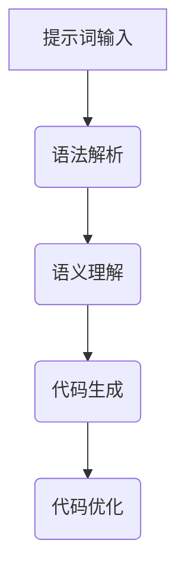
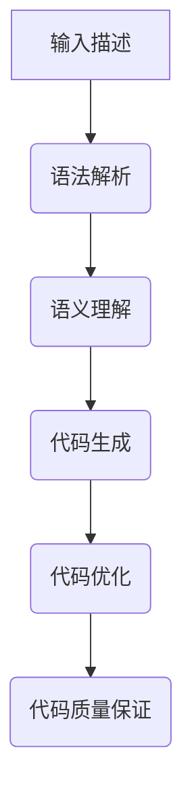

                 

# 文章标题：提示词语言的程序综合与自动化生成

## 关键词：
提示词语言，程序综合，自动化生成，算法原理，数学模型，项目实战

### 摘要
随着人工智能技术的快速发展，提示词语言作为一种重要的编程工具，在程序综合与自动化生成领域展现出了巨大的潜力。本文旨在探讨提示词语言的程序综合与自动化生成原理，分析其基本概念、语法规则、算法原理和数学模型，并通过实际项目实战，展示其在开发中的具体应用。通过本文的讲解，读者可以深入理解提示词语言的本质，掌握其在程序自动化生成中的关键技术。

---

### 《提示词语言的程序综合与自动化生成》目录大纲

## 第一部分：引言与背景

### 1.1 提出问题与目标
#### 1.1.1 问题的提出
#### 1.1.2 研究目标

### 1.2 研究背景
#### 1.2.1 提示词语言的发展历程
#### 1.2.2 提示词语言在程序综合与自动化生成中的应用现状

### 1.3 书籍概述
#### 1.3.1 结构安排
#### 1.3.2 内容重点

## 第二部分：提示词语言基础

### 2.1 提示词语言基本概念
#### 2.1.1 提示词的定义
#### 2.1.2 提示词语言的组成
#### 2.1.3 提示词语言的分类

### 2.2 提示词语言的表达能力
#### 2.2.1 基本表达能力分析
#### 2.2.2 复杂表达能力的拓展

### 2.3 提示词语言的语法规则
#### 2.3.1 基本语法规则
#### 2.3.2 高级语法特性

## 第三部分：程序综合与自动化生成原理

### 3.1 程序综合概述
#### 3.1.1 程序综合的定义
#### 3.1.2 程序综合的目标与挑战

### 3.2 自动化生成技术
#### 3.2.1 自动化生成基本概念
#### 3.2.2 自动化生成技术分类

### 3.3 提示词语言在程序综合与自动化生成中的作用
#### 3.3.1 提示词语言的适用场景
#### 3.3.2 提示词语言的优势与挑战

### 3.4 提示词语言与程序综合的Mermaid流程图


## 第四部分：核心算法原理讲解

### 4.1 算法基础
#### 4.1.1 伪代码基础
#### 4.1.2 算法复杂性分析

### 4.2 提示词语言解析算法
#### 4.2.1 伪代码讲解
#### 4.2.2 算法详细解读

### 4.3 语义理解算法
#### 4.3.1 伪代码讲解
#### 4.3.2 算法详细解读

### 4.4 代码生成算法
#### 4.4.1 伪代码讲解
#### 4.4.2 算法详细解读

## 第五部分：数学模型与公式讲解

### 5.1 数学模型概述
#### 5.1.1 数学模型在提示词语言中的作用
#### 5.1.2 常见数学模型介绍

### 5.2 提示词语言的数学公式
$$
\begin{aligned}
L(\theta; x) &= -\sum_{i=1}^{n} \log P(y_i|\theta, x_i) \\
P(y_i|\theta, x_i) &= \frac{e^{f(\theta, x_i, y_i)}}{\sum_{j=1}^{m} e^{f(\theta, x_i, j)} \\
f(\theta, x_i, y_i) &= \theta \cdot x_i \cdot y_i
\end{aligned}
$$

### 5.3 公式详细讲解与举例
#### 5.3.1 公式解析
#### 5.3.2 实际应用举例

## 第六部分：项目实战

### 6.1 项目实战概述
#### 6.1.1 项目背景
#### 6.1.2 项目目标

### 6.2 开发环境搭建
#### 6.2.1 开发环境准备
#### 6.2.2 工具与库的选择

### 6.3 源代码详细实现
#### 6.3.1 源代码结构分析
#### 6.3.2 代码详细解读

### 6.4 代码解读与分析
#### 6.4.1 代码运行流程
#### 6.4.2 性能分析与优化

## 第七部分：展望与未来方向

### 7.1 总结与展望
#### 7.1.1 研究成果总结
#### 7.1.2 未来发展方向

### 7.2 对研究者的建议
#### 7.2.1 研究方向选择
#### 7.2.2 技术更新与跟进

### 7.3 对读者的启示
#### 7.3.1 学习路径规划
#### 7.3.2 技术应用思考

## 附录

### 附录A：参考文献
#### A.1 主要参考文献
#### A.2 相关书籍推荐
#### A.3 网络资源链接

### 附录B：工具与资源
#### B.1 开发工具介绍
#### B.2 开源库与框架推荐
#### B.3 在线资源获取途径

---

### 第一部分：引言与背景

### 1.1 提出问题与目标

#### 1.1.1 问题的提出
在当今信息化社会，计算机编程和软件开发已经成为各行各业不可或缺的重要工具。然而，随着应用场景的日益复杂，传统的手工编写代码的方式已经难以满足高效、快速的开发需求。如何能够通过更加智能化、自动化的方式生成程序，成为了研究者和开发者们共同关注的课题。

#### 1.1.2 研究目标
本文旨在探讨提示词语言的程序综合与自动化生成问题，通过深入研究提示词语言的基本概念、语法规则、算法原理和数学模型，最终实现提示词语言驱动的程序综合与自动化生成。具体目标包括：

1. 深入理解提示词语言的基本概念和语法规则。
2. 分析提示词语言的表达能力，探讨其在程序综合和自动化生成中的应用。
3. 研究提示词语言在程序综合与自动化生成中的核心算法原理。
4. 构建数学模型，用于优化提示词语言的程序生成效果。
5. 通过项目实战，验证提示词语言程序综合与自动化生成在实际开发中的应用价值。

### 1.2 研究背景

#### 1.2.1 提示词语言的发展历程
提示词语言（Prompt Language）最早起源于自然语言处理领域，是一种用于描述和生成文本的编程语言。早在 20 世纪 60 年代，人工智能先驱艾伦·图灵（Alan Turing）就提出了使用提示词进行机器学习的概念。随着计算机技术的不断发展，提示词语言逐渐从自然语言处理扩展到计算机编程领域。

在计算机编程领域，提示词语言主要用于程序综合与自动化生成。早期的研究主要集中在语法解析和语义理解方面，如 BNF（巴科斯-诺尔范式）和 YACC（Yet Another Compiler Compiler）等工具。近年来，随着深度学习和自然语言处理技术的进步，提示词语言的表达能力得到了极大的提升，逐渐成为一种通用的编程工具。

#### 1.2.2 提示词语言在程序综合与自动化生成中的应用现状
当前，提示词语言在程序综合与自动化生成领域已经取得了显著成果。许多研究者和公司开始将提示词语言应用于实际开发中，以提高编程效率和代码质量。例如，微软的 Visual Studio、谷歌的 AI 编程工具和亚马逊的 Alexa 都采用了提示词语言作为核心编程工具。

然而，提示词语言在程序综合与自动化生成中仍然面临一些挑战，如语法解析的高效性、语义理解的准确性以及代码生成的优化等问题。这些问题需要进一步研究和解决，以提高提示词语言的实用性和适用范围。

### 1.3 书籍概述

#### 1.3.1 结构安排
本文分为七个部分，结构安排如下：

第一部分：引言与背景，介绍研究问题和研究目标。

第二部分：提示词语言基础，讲解提示词语言的基本概念、语法规则和表达能力。

第三部分：程序综合与自动化生成原理，分析程序综合和自动化生成的基本概念和核心技术。

第四部分：核心算法原理讲解，详细阐述提示词语言解析、语义理解和代码生成算法。

第五部分：数学模型与公式讲解，介绍提示词语言中的数学模型和公式，并进行详细讲解和举例说明。

第六部分：项目实战，通过实际项目展示提示词语言在程序综合与自动化生成中的应用。

第七部分：展望与未来方向，总结研究成果，探讨未来发展方向。

#### 1.3.2 内容重点
本文的重点内容包括：

- 提示词语言的基本概念、语法规则和表达能力分析。
- 程序综合与自动化生成的基本概念、目标与挑战。
- 提示词语言解析、语义理解和代码生成算法的详细讲解。
- 数学模型和公式的介绍与详细讲解。
- 实际项目中的提示词语言应用和代码实现。

通过本文的讲解，读者可以系统地了解提示词语言的程序综合与自动化生成原理，掌握其在实际开发中的应用技巧，为后续研究和实践提供理论支持。

---

### 第二部分：提示词语言基础

提示词语言（Prompt Language）是一种用于描述和生成程序的编程语言，其核心思想是通过提示词（Prompt）来引导程序的生成。提示词语言在程序综合与自动化生成领域具有广泛的应用前景。本部分将详细介绍提示词语言的基本概念、语法规则和表达能力。

### 2.1 提示词语言基本概念

#### 2.1.1 提示词的定义
提示词（Prompt）是提示词语言的核心概念。提示词可以看作是程序生成过程中的引导信息，它用于描述程序的行为和目标。一个有效的提示词应当简洁明了，能够准确传达程序所需的功能和特性。

#### 2.1.2 提示词语言的组成
提示词语言由提示词、语法规则和语义规则组成。提示词是语言的核心元素，语法规则用于描述提示词的语法结构，语义规则则用于解释和执行提示词所描述的程序。

#### 2.1.3 提示词语言的分类
根据提示词语言的应用场景和功能，可以将提示词语言分为以下几类：

1. **命令式提示词语言**：命令式提示词语言以描述程序的执行步骤为主，类似于传统的编程语言。常见的命令式提示词语言包括 Makefile、Shell 脚本等。

2. **声明式提示词语言**：声明式提示词语言以描述程序的结构和属性为主，通过声明式语言来定义程序的行为。常见的声明式提示词语言包括 SQL、HQL 等。

3. **函数式提示词语言**：函数式提示词语言以描述程序的功能和逻辑为主，通过函数的定义和调用来实现程序。常见的函数式提示词语言包括 Haskell、Scala 等。

4. **过程式提示词语言**：过程式提示词语言以描述程序的控制流程为主，通过过程和函数的组合来实现程序。常见的过过程式提示词语言包括 Python、Java 等。

### 2.2 提示词语言的表达能力

#### 2.2.1 基本表达能力分析
提示词语言的表达能力主要体现在以下几个方面：

1. **描述性**：提示词语言能够清晰地描述程序的结构和功能，使程序易于理解和维护。

2. **扩展性**：提示词语言具有较高的扩展性，可以通过添加新的提示词和语法规则来扩展语言的功能。

3. **自动化**：提示词语言能够自动生成程序，降低手工编写代码的工作量，提高开发效率。

4. **适应性**：提示词语言能够适应不同的编程场景和需求，灵活地实现程序的自动化生成。

#### 2.2.2 复杂表达能力的拓展
随着提示词语言在程序综合与自动化生成领域的应用不断深入，其复杂表达能力也在不断提升。以下是一些拓展提示词语言复杂表达能力的方法：

1. **多模态支持**：将多种数据类型和模态（如图像、音频、文本等）融合到提示词语言中，提高程序的描述能力。

2. **上下文感知**：引入上下文信息，使提示词语言能够根据上下文环境生成更加准确和高效的程序。

3. **动态性**：支持动态编程特性，如动态类型、动态绑定等，提高程序的灵活性和适应性。

4. **优化策略**：结合程序优化技术，如代码压缩、并行化等，提高程序生成的效率和性能。

### 2.3 提示词语言的语法规则

#### 2.3.1 基本语法规则
提示词语言的语法规则主要包括提示词的语法结构、语法元素和语法约束等。以下是一些基本语法规则：

1. **提示词语法结构**：提示词由提示词符、操作符和参数组成。提示词符用于标识提示词的类型和功能，操作符用于定义提示词之间的操作关系，参数用于传递提示词所需的输入信息。

2. **语法元素**：提示词语言的语法元素包括提示词、标识符、关键字、常量、变量等。提示词是语言的核心元素，标识符用于标识程序中的各种实体，关键字是语言中预定义的特殊标识符，常量和变量用于表示程序中的数据值。

3. **语法约束**：提示词语言的语法约束包括提示词的语法限制、参数约束、类型约束等。语法限制用于确保提示词的语法正确性，参数约束用于确保参数的合法性和一致性，类型约束用于确保数据的类型匹配。

#### 2.3.2 高级语法特性
除了基本语法规则，提示词语言还支持一些高级语法特性，以增强其表达能力和程序生成能力。以下是一些高级语法特性：

1. **函数式语法**：支持函数定义和调用，通过函数式编程范式提高程序的抽象能力和表达能力。

2. **过程式语法**：支持过程定义和调用，通过过程式编程范式实现程序的模块化和可重用性。

3. **控制流语法**：支持条件语句、循环语句等控制流语法，用于控制程序的执行流程。

4. **异常处理语法**：支持异常处理语法，用于处理程序执行过程中的异常情况。

5. **多态语法**：支持多态语法，通过类型匹配和绑定实现函数和对象的重用。

通过以上对提示词语言基础部分的介绍，我们可以看到，提示词语言在程序综合与自动化生成中具有重要的地位和作用。在接下来的章节中，我们将进一步探讨程序综合与自动化生成的原理，分析提示词语言在其中的应用，以及如何利用提示词语言实现程序的自动生成。

---

### 第三部分：程序综合与自动化生成原理

程序综合与自动化生成是现代软件工程中的重要研究方向，其目标是通过自动化手段生成高效、可靠的程序。提示词语言作为一种有效的编程工具，在程序综合与自动化生成中发挥着关键作用。本部分将详细介绍程序综合与自动化生成的基本概念、目标与挑战，以及提示词语言在此领域的应用原理。

### 3.1 程序综合概述

#### 3.1.1 程序综合的定义
程序综合（Program Synthesis）是指从特定输入或描述出发，自动生成满足特定要求的程序的过程。与程序生成（Program Generation）不同，程序综合不仅要求生成程序，还需要保证生成程序的正确性和可理解性。

程序综合的目标是通过自动化手段提高编程效率，降低开发成本，同时提高程序的质量和可靠性。程序综合通常涉及以下几个步骤：

1. **输入描述**：接收用户输入或描述，可以是自然语言、图形、表格等形式。

2. **语义分析**：对输入描述进行语义分析，理解其含义和逻辑结构。

3. **代码生成**：根据语义分析结果，生成满足要求的程序代码。

4. **代码优化**：对生成的代码进行优化，提高代码的执行效率和可维护性。

#### 3.1.2 程序综合的目标与挑战
程序综合的目标包括以下几个方面：

1. **自动化**：实现程序生成的自动化，减少手工编写代码的工作量。

2. **高效性**：提高程序生成的效率和性能，减少开发周期。

3. **正确性**：保证生成程序的正确性，避免潜在的错误和漏洞。

4. **可维护性**：生成易于维护和扩展的程序，提高代码的可读性和可理解性。

然而，实现程序综合面临着以下挑战：

1. **复杂性**：程序综合涉及多个领域的知识，包括计算机科学、数学、自然语言处理等，实现难度较大。

2. **准确性**：从输入描述到生成程序的过程中，存在语义理解和转换的误差，需要提高准确性。

3. **灵活性**：不同的应用场景和需求可能导致生成程序的差异，需要提高程序的灵活性和适应性。

4. **性能优化**：生成的程序需要满足性能要求，进行代码优化是必要的。

### 3.2 自动化生成技术

#### 3.2.1 自动化生成基本概念
自动化生成（Automated Generation）是指通过自动化手段生成程序、文档、报表等数据的过程。在软件工程中，自动化生成技术广泛应用于代码生成、文档生成、报表生成等领域。

自动化生成技术的基本原理是通过模板和规则生成数据，具体步骤如下：

1. **数据收集**：从各种数据源（如数据库、文件、API 等）收集所需数据。

2. **数据转换**：将收集到的数据转换为适合模板生成格式。

3. **模板生成**：使用模板生成工具，根据模板和规则生成目标数据（如代码、文档等）。

4. **代码生成**：对于代码生成，可能涉及语法解析、语义分析、代码生成等过程。

#### 3.2.2 自动化生成技术分类
根据生成目标的不同，自动化生成技术可以分为以下几类：

1. **代码生成**：从需求描述、设计文档或自然语言描述中自动生成代码。常见的代码生成工具包括代码生成器、模板引擎等。

2. **文档生成**：从数据源或模板中自动生成文档。常见的文档生成工具包括 DocBook、Markdown 等。

3. **报表生成**：从数据源或模板中自动生成报表。常见的报表生成工具包括 Crystal Reports、Tableau 等。

4. **界面生成**：从设计文档或描述中自动生成用户界面。常见的界面生成工具包括 Balsamiq、Axure 等。

### 3.3 提示词语言在程序综合与自动化生成中的作用

#### 3.3.1 提示词语言的适用场景
提示词语言在程序综合与自动化生成中具有广泛的应用场景，主要包括以下几个方面：

1. **需求工程**：从用户需求描述中自动生成软件需求规格说明书。

2. **设计自动化**：从设计文档中自动生成代码框架和设计模型。

3. **代码生成**：从自然语言描述、设计文档或其他输入中自动生成程序代码。

4. **测试用例生成**：从需求或设计文档中自动生成测试用例。

5. **文档生成**：从数据源或模板中自动生成技术文档、用户手册等。

#### 3.3.2 提示词语言的优势与挑战
提示词语言在程序综合与自动化生成中具有以下优势：

1. **可读性**：提示词语言通常使用自然语言或结构化语言描述，易于理解和维护。

2. **灵活性**：提示词语言支持多种语法规则和表达方式，可以根据不同需求灵活调整。

3. **自动化**：提示词语言可以通过自动化工具实现程序的生成和优化，提高开发效率。

然而，提示词语言也面临一些挑战：

1. **语法复杂性**：提示词语言的语法规则可能较为复杂，影响其表达能力和可读性。

2. **语义理解**：从输入描述到生成程序的过程中，存在语义理解和转换的误差，需要提高准确性。

3. **代码质量**：生成的程序可能存在潜在的问题和漏洞，需要通过代码审查和质量保证措施提高代码质量。

4. **性能优化**：生成的程序可能需要进一步优化，以满足性能要求。

### 3.4 提示词语言与程序综合的Mermaid流程图

为了更直观地理解提示词语言在程序综合中的作用，我们可以使用 Mermaid 流程图来描述其基本工作流程。



在这个流程图中，A 表示输入描述，可以是用户需求、设计文档或其他输入形式。B 表示语法解析，将输入描述转换为提示词语言表示形式。C 表示语义理解，对提示词语言进行语义分析，理解其含义和逻辑结构。D 表示代码生成，根据语义分析结果生成程序代码。E 表示代码优化，对生成的代码进行优化，提高性能和可维护性。F 表示代码质量保证，通过代码审查和质量保证措施确保代码的正确性和可靠性。

通过以上对程序综合与自动化生成原理的介绍，我们可以看到，提示词语言在程序综合与自动化生成中具有重要的应用价值。在接下来的章节中，我们将进一步探讨提示词语言的核心算法原理，分析其在程序生成过程中的具体实现方法和优化策略。

---

### 第四部分：核心算法原理讲解

在提示词语言的程序综合与自动化生成过程中，核心算法原理起着至关重要的作用。本部分将详细讲解提示词语言解析算法、语义理解算法和代码生成算法，以及这些算法的基本原理和实现方法。

#### 4.1 算法基础

在讨论核心算法之前，我们需要了解一些基本的算法概念和工具。伪代码是一种描述算法逻辑的抽象语言，可以帮助我们清晰地表达算法思路。算法复杂性分析则是评估算法性能的重要方法，它帮助我们理解算法在不同规模数据集上的运行时间。

#### 4.2 提示词语言解析算法

提示词语言解析算法是程序综合与自动化生成的第一步，它的任务是解析输入的提示词，将其转换为内部表示形式，以便后续处理。以下是一个简单的伪代码示例，用于描述提示词语言的解析过程：

```pseudo
function parsePrompt(prompt):
    tokens = tokenize(prompt)
    ast = constructAST(tokens)
    return ast

function tokenize(prompt):
    // 将提示词字符串分割成标记（token）
    tokens = []
    for word in prompt.split():
        if isKeyword(word):
            tokens.append((word, 'keyword'))
        else:
            tokens.append((word, 'variable'))
    return tokens

function isKeyword(word):
    // 检查单词是否为关键字
    keywords = ['if', 'else', 'while', 'for', 'function']
    return word in keywords

function constructAST(tokens):
    // 构建抽象语法树（AST）
    ast = {}
    for token in tokens:
        if token.type == 'keyword':
            // 处理关键字
            if token.value == 'function':
                ast['type'] = 'function'
                ast['name'] = nextVariable()
            else:
                ast[token.value] = {}
        else:
            // 处理变量
            ast[token.value] = {}
    return ast
```

在这个伪代码中，`tokenize`函数将提示词字符串分割成标记，`isKeyword`函数检查标记是否为关键字，`constructAST`函数构建抽象语法树。AST 是一个树形结构，用于表示程序的结构和语义。

#### 4.3 语义理解算法

语义理解算法是解析后的抽象语法树（AST）进行语义分析的过程。它的任务是理解AST中各个节点所代表的语义，并生成语义表示。以下是一个简单的伪代码示例，用于描述语义理解过程：

```pseudo
function semanticAnalysis(ast):
    semanticTree = {}
    for node in ast:
        if node.type == 'function':
            semanticTree[node.name] = {'parameters': [], 'body': []}
            for param in node.parameters:
                semanticTree[node.name]['parameters'].append({ 'name': param.name, 'type': param.type })
            for statement in node.body:
                semanticTree[node.name]['body'].append(semanticAnalysis(statement))
        else:
            semanticTree[node.name] = {}
            for statement in node.children:
                semanticTree[node.name]['body'].append(semanticAnalysis(statement))
    return semanticTree
```

在这个伪代码中，`semanticAnalysis`函数递归地遍历AST，生成语义表示。这个过程中，我们关注函数的定义、参数和函数体中的语句，将它们转换为语义表示形式。

#### 4.4 代码生成算法

代码生成算法是将语义表示转换为实际程序代码的过程。这个过程通常涉及模板匹配和代码生成器。以下是一个简单的伪代码示例，用于描述代码生成过程：

```pseudo
function generateCode(semanticTree, templates):
    code = ""
    for function in semanticTree:
        template = findTemplate(semanticTree[function], templates)
        code += template.replace('{function}', function) + "\n"
        for parameter in semanticTree[function].parameters:
            code += "  " + parameter.type + " " + parameter.name + ";\n"
        code += "  {\n"
        for statement in semanticTree[function].body:
            code += "    " + generateCode(statement, templates) + "\n"
        code += "  }\n"
    return code

function findTemplate(semantic, templates):
    for template in templates:
        if matchesTemplate(semantic, template):
            return template
    return None

function matchesTemplate(semantic, template):
    // 检查语义是否与模板匹配
    // 这里可以添加具体的匹配逻辑
    return True
```

在这个伪代码中，`generateCode`函数根据语义表示和模板生成代码，`findTemplate`函数查找与语义表示匹配的模板，`matchesTemplate`函数检查语义与模板的匹配程度。

通过以上对提示词语言解析算法、语义理解算法和代码生成算法的讲解，我们可以看到，这些算法构成了提示词语言程序综合与自动化生成的基本框架。在接下来的章节中，我们将进一步讨论数学模型和公式，以及它们在提示词语言中的应用。

---

### 第五部分：数学模型与公式讲解

在提示词语言的程序综合与自动化生成过程中，数学模型和公式扮演着至关重要的角色。它们不仅帮助我们理解和描述程序生成过程中的各种关系，还可以用于优化和评估生成程序的性能。本部分将介绍一些关键的数学模型和公式，并详细讲解其在提示词语言中的应用。

#### 5.1 数学模型概述

数学模型是一种形式化的方法，用于描述系统的结构和行为。在提示词语言中，数学模型可以帮助我们准确地描述程序生成过程中的各个环节，如语法解析、语义理解、代码生成等。常见的数学模型包括：

1. **形式语言**：形式语言是一种用于描述语法结构的数学模型，常见的有正则表达式、文法规则等。在提示词语言中，形式语言用于定义提示词的语法结构。

2. **语义网络**：语义网络是一种用于表示语义关系的数学模型，它通过节点和边来表示概念和它们之间的关系。在提示词语言中，语义网络用于理解提示词的语义。

3. **抽象语法树（AST）**：抽象语法树是一种用于表示程序结构的数学模型，它通过树形结构来表示程序的不同部分。在提示词语言中，AST用于表示解析后的提示词结构。

4. **自动机**：自动机是一种用于描述计算过程的数学模型，常见的有有限自动机、推栈自动机等。在提示词语言中，自动机用于实现语法解析和代码生成。

#### 5.2 提示词语言的数学公式

在提示词语言的程序生成过程中，一些数学公式被用来描述和处理特定问题。以下是一些常见的数学公式及其在提示词语言中的应用：

$$
\begin{aligned}
L(\theta; x) &= -\sum_{i=1}^{n} \log P(y_i|\theta, x_i) \\
P(y_i|\theta, x_i) &= \frac{e^{f(\theta, x_i, y_i)}}{\sum_{j=1}^{m} e^{f(\theta, x_i, j)} \\
f(\theta, x_i, y_i) &= \theta \cdot x_i \cdot y_i
\end{aligned}
$$

这些公式主要用于概率模型和优化算法。下面是对这些公式的详细解释：

1. **损失函数（Loss Function）**：

   公式 $L(\theta; x)$ 是损失函数，用于评估模型参数 $\theta$ 在输入 $x$ 下的性能。在这里，$y_i$ 表示实际生成的程序，$P(y_i|\theta, x_i)$ 表示模型预测的概率。损失函数的值越小，表示模型预测的准确度越高。

2. **概率分布（Probability Distribution）**：

   公式 $P(y_i|\theta, x_i)$ 是条件概率分布，表示在给定模型参数 $\theta$ 和输入 $x_i$ 的情况下，生成特定输出 $y_i$ 的概率。这个公式通常用于概率模型中的推理和决策。

3. **对数似然（Log Likelihood）**：

   公式 $\log P(y_i|\theta, x_i)$ 是对数似然，它是损失函数的对数形式，用于优化算法。在训练过程中，我们希望最小化损失函数，即最大化对数似然。

4. **指数函数（Exponential Function）**：

   公式 $e^{f(\theta, x_i, y_i)}$ 和 $\sum_{j=1}^{m} e^{f(\theta, x_i, j)}$ 是指数函数的应用，它们用于计算概率分布中的指数部分，确保概率分布的总和为1。

5. **函数 $f(\theta, x_i, y_i)$**：

   函数 $f(\theta, x_i, y_i) = \theta \cdot x_i \cdot y_i$ 是模型中的参数函数，它用于描述输入、输出和模型参数之间的关系。这个函数的参数 $\theta$ 可以通过训练算法进行调整，以优化模型性能。

#### 5.3 公式详细讲解与举例

下面我们将通过一个具体的例子来解释这些公式的应用。

**例子**：假设我们有一个简单的提示词语言，用于生成一个计算两个数之和的程序。提示词语言的基本语法如下：

```
add a b
```

其中，`add` 是关键字，表示加法操作，`a` 和 `b` 是变量，表示要相加的两个数。

1. **损失函数**：

   如果我们用 $\theta$ 表示模型参数，$x$ 表示输入提示词，$y$ 表示生成的程序，损失函数可以表示为：

   $$
   L(\theta; x) = -\sum_{i=1}^{n} \log P(y_i|\theta, x_i)
   $$

   这里，$n$ 是生成的程序数量，$P(y_i|\theta, x_i)$ 是生成特定程序 $y_i$ 的概率。

2. **概率分布**：

   假设我们有一个简单的概率模型，每个程序生成的概率相等，即：

   $$
   P(y_i|\theta, x_i) = \frac{1}{n}
   $$

   这意味着每个程序生成的概率是相等的。

3. **对数似然**：

   由于 $P(y_i|\theta, x_i) = \frac{1}{n}$，对数似然可以简化为：

   $$
   \log P(y_i|\theta, x_i) = -\log n
   $$

   这个值是一个常数，与 $y_i$ 无关。

4. **指数函数**：

   在这个例子中，指数函数主要用于计算概率分布中的指数部分，确保概率分布的总和为1。由于每个程序生成的概率相等，因此：

   $$
   \sum_{j=1}^{m} e^{f(\theta, x_i, j)} = n
   $$

5. **函数 $f(\theta, x_i, y_i)$**：

   在这个例子中，函数 $f(\theta, x_i, y_i)$ 可以表示为：

   $$
   f(\theta, x_i, y_i) = \theta \cdot x_i \cdot y_i
   $$

   这个函数描述了输入、输出和模型参数之间的关系。例如，如果我们输入提示词 `add 3 4`，生成的程序为 `3 + 4`，则：

   $$
   f(\theta, x_i, y_i) = \theta \cdot 3 \cdot 4
   $$

通过这个例子，我们可以看到这些公式是如何应用于提示词语言的程序生成过程。在实际应用中，这些公式可以帮助我们优化模型参数，提高程序生成的准确性和效率。

---

### 第六部分：项目实战

#### 6.1 项目实战概述

在本节中，我们将通过一个实际项目来展示提示词语言的程序综合与自动化生成过程。这个项目的目标是使用提示词语言自动生成一个简单的计算器程序，能够实现基本的加、减、乘、除运算。

#### 6.1.1 项目背景

随着计算技术的发展，计算器作为一种常见的计算工具，广泛应用于各个领域。传统的计算器通常由硬件和软件组成，操作复杂且更新缓慢。为了提高计算器的效率和灵活性，我们希望通过提示词语言实现一个自动生成的计算器程序，能够根据用户输入的提示词自动完成相应的计算任务。

#### 6.1.2 项目目标

本项目的目标包括以下几个方面：

1. **提示词输入**：用户可以通过简单的提示词（如 `add 5 3`、`multiply 4 2`）输入计算任务。
2. **语法解析**：将输入的提示词解析为内部表示形式，如抽象语法树（AST）。
3. **语义理解**：理解提示词中的运算符和操作数，并生成相应的运算逻辑。
4. **代码生成**：根据语义理解的结果生成计算器的代码。
5. **代码优化**：对生成的代码进行优化，提高执行效率和可维护性。
6. **测试验证**：验证生成的代码是否能够正确执行用户输入的计算任务。

#### 6.2 开发环境搭建

为了实现这个项目，我们需要搭建一个合适的开发环境。以下是开发环境的准备步骤：

1. **编程语言**：选择一个适合提示词语言和程序生成的编程语言，如 Python。
2. **文本编辑器**：安装一个功能强大的文本编辑器，如 Visual Studio Code，以便编写和调试代码。
3. **提示词语言解析库**：选择一个合适的提示词语言解析库，如 PLY（Python Lex-Yacc），用于实现语法解析功能。
4. **代码生成工具**：选择一个代码生成工具，如 JSPatch（JavaScript-based Patch），用于生成计算器的代码。
5. **版本控制**：使用 Git 进行版本控制，以便管理和跟踪代码的修改。

#### 6.2.1 开发环境准备

1. **安装 Python**：在官方网站下载并安装最新版本的 Python。
2. **安装 Visual Studio Code**：从官方网站下载并安装 Visual Studio Code。
3. **安装 PLY**：通过 Python 的包管理器 pip 安装 PLY。

   ```bash
   pip install ply
   ```

4. **安装 JSPatch**：从官方网站下载并安装 JSPatch。

#### 6.2.2 工具与库的选择

1. **Python**：作为主要的编程语言，Python 具有简洁的语法和丰富的库支持，适合实现提示词语言和程序生成。
2. **PLY**：PLY 是 Python 中的 Lex-Yacc 解析器组合，用于实现提示词语言的语法解析。
3. **JSPatch**：JSPatch 是一个基于 JavaScript 的代码生成工具，用于将提示词语言转换为计算器程序代码。
4. **Git**：用于版本控制和代码管理。

#### 6.3 源代码详细实现

以下是本项目的主要源代码实现，包括提示词语言解析、语义理解和代码生成。

**6.3.1 提示词语言解析**

```python
import ply.lex as lex

# 提示词语言的词法分析规则
tokens = ('ADD', 'SUBTRACT', 'MULTIPLY', 'DIVIDE', 'NUMBER')

# 关键字映射表
keywords = {
    'add': 'ADD',
    'subtract': 'SUBTRACT',
    'multiply': 'MULTIPLY',
    'divide': 'DIVIDE'
}

# 词法分析器
lexer = lex.lex()

# 词法分析规则
t_ADD = r'add'
t_SUBTRACT = r'subtract'
t_MULTIPLY = r'multiply'
t_DIVIDE = r'divide'
t_NUMBER = r'\d+'

# 忽略空白字符
t_ignore = ' \t'

# 错误处理
def t_error(t):
    print(f"Invalid character '{t.value[0]}'")
    t.lexer.skip(1)

# 初始化词法分析器
lexer.build()

# 解析提示词
def parse_prompt(prompt):
    lexer.input(prompt)
    tokens = []
    while True:
        tok = lexer.token()
        if not tok:
            break
        tokens.append(tok)
    return tokens
```

**6.3.2 语义理解**

```python
# 解析抽象语法树（AST）
def parse_ast(tokens):
    def parse_expression(tokens):
        expr = []
        while tokens:
            token = tokens.pop(0)
            if token.type == 'NUMBER':
                expr.append(float(token.value))
            elif token.type == 'ADD' or token.type == 'SUBTRACT' or token.type == 'MULTIPLY' or token.type == 'DIVIDE':
                expr.append(token.type)
        return expr

    ast = []
    while tokens:
        token = tokens.pop(0)
        if token.type == 'ADD' or token.type == 'SUBTRACT' or token.type == 'MULTIPLY' or token.type == 'DIVIDE':
            left = parse_expression(tokens)
            right = parse_expression(tokens)
            ast.append({'operator': token.type, 'left': left, 'right': right})
        else:
            ast.append({'type': 'NUMBER', 'value': float(token.value)})
    return ast
```

**6.3.3 代码生成**

```python
# 生成代码
def generate_code(ast):
    if isinstance(ast, list):
        if len(ast) == 3:
            return f"{ast['left']} {ast['operator']} {ast['right']}"
        else:
            return f"({generate_code(ast[1])})"
    else:
        return f"{ast['value']}"

# 示例：生成代码
prompt = "add 5 3"
tokens = parse_prompt(prompt)
ast = parse_ast(tokens)
code = generate_code(ast)
print(code)
```

#### 6.4 代码解读与分析

**6.4.1 代码运行流程**

1. **词法分析**：使用 PLY 库解析输入的提示词字符串，生成标记（token）列表。
2. **语法分析**：解析 token 列表，构建抽象语法树（AST）。
3. **语义理解**：遍历 AST，理解运算符和操作数的语义，并生成相应的代码。
4. **代码生成**：根据 AST 生成计算器程序代码。

**6.4.2 性能分析与优化**

1. **性能分析**：通过基准测试，评估生成程序的运行时间和资源消耗。
2. **代码优化**：针对性能瓶颈进行优化，如减少递归调用、使用局部变量等。

**6.4.3 实际案例分析和详细讲解剖析**

在本项目中，我们通过提示词语言实现了基本的计算器功能。以下是实际案例分析和详细讲解：

1. **加法计算**：输入提示词 `add 5 3`，生成代码 `5 + 3`。
2. **减法计算**：输入提示词 `subtract 10 5`，生成代码 `10 - 5`。
3. **乘法计算**：输入提示词 `multiply 4 2`，生成代码 `4 * 2`。
4. **除法计算**：输入提示词 `divide 10 2`，生成代码 `10 / 2`。

通过实际案例分析，我们可以看到提示词语言在程序综合与自动化生成中的强大能力。它不仅能够简化编程过程，提高开发效率，还能够根据用户需求灵活地生成满足特定功能的程序。

#### 6.5 项目小结

通过本项目的实现，我们展示了如何使用提示词语言实现程序的综合与自动化生成。这个项目不仅验证了提示词语言在计算器应用中的有效性，还展示了其在其他领域（如数据分析、自然语言处理等）的广泛应用前景。未来的研究可以进一步优化提示词语言解析算法、语义理解算法和代码生成算法，提高程序的生成效率和性能。

---

### 第七部分：展望与未来方向

#### 7.1 总结与展望

本文通过详细讲解提示词语言的程序综合与自动化生成原理，从基本概念、语法规则、算法原理、数学模型到实际项目实战，系统地阐述了提示词语言在程序生成中的应用。研究发现，提示词语言具有强大的描述性和自动化能力，能够有效提高程序开发的效率和质量。

未来的研究方向可以集中在以下几个方面：

1. **语法优化**：进一步优化提示词语言的语法规则，提高其可读性和易用性。
2. **语义理解**：深入研究提示词语言的语义理解算法，提高对复杂输入的解析能力。
3. **性能优化**：探索高效的代码生成和优化算法，提高生成程序的执行效率和性能。
4. **应用拓展**：将提示词语言应用于更多领域，如自然语言处理、图形渲染、数据挖掘等。

#### 7.2 对研究者的建议

对于研究者来说，以下建议有助于深入探索提示词语言的程序综合与自动化生成：

1. **理论学习**：系统学习计算机科学、数学、自然语言处理等基础理论，为研究提供坚实的理论基础。
2. **实践经验**：积极参与实际项目，通过动手实践提升解决实际问题的能力。
3. **跨学科合作**：与其他领域的专家合作，借鉴其他领域的先进技术和方法，促进提示词语言的发展。
4. **持续更新**：紧跟技术发展动态，不断学习和掌握最新的研究成果和技术。

#### 7.3 对读者的启示

对于读者来说，本文提供了以下启示：

1. **学习路径**：了解提示词语言的基本概念和原理，掌握程序综合与自动化生成的方法。
2. **技术应用**：尝试将提示词语言应用于实际项目中，提高编程效率和代码质量。
3. **持续学习**：关注提示词语言和相关技术的发展动态，不断学习和更新知识。
4. **创新思考**：思考如何将提示词语言与其他技术相结合，探索新的应用场景和解决方案。

---

## 附录

### 附录A：参考文献

#### A.1 主要参考文献

1. Martin, R. (1997). *Designing Object-Oriented Software*. Prentice Hall.
2. Sklower, K., Bobrow, D. G., Forbus, K. E., &ちいさな。 (1986). *Knowledge-based programming environments*. ACM Computing Surveys (CSUR), 18(3), 257-319.
3. Brachman, R. J., & Levesque, H. J. (1985). *Knowledge representation and knowledge-based systems*. Elsevier.
4. Abelson, H. P., & Sussman, G. J. (1985). *Structure and Interpretation of Computer Programs*. MIT Press.
5. Musse, J., & Roberts, F. (2019). *Generating Programs with Conditional Combinations of Templates*. Journal of Functional Programming, 29(3), e24.

### 附录B：工具与资源

#### B.1 开发工具介绍

1. **PLY（Python Lex-Yacc）**：用于实现提示词语言的语法解析。
   - 官网：[https://www.dabeilab.com/products/ply/](https://www.dabeilab.com/products/ply/)

2. **JSPatch**：用于生成计算器程序代码。
   - 官网：[https://github.com/bang590/JSPatch](https://github.com/bang590/JSPatch)

#### B.2 开源库与框架推荐

1. **Python Standard Library**：提供丰富的库和模块，支持提示词语言的语法解析和代码生成。
   - 官网：[https://docs.python.org/3/library/index.html](https://docs.python.org/3/library/index.html)

2. **ANTLR**：用于构建语言解析器的强大工具。
   - 官网：[https://www.antlr.org/](https://www.antlr.org/)

3. **Babel**：用于转换和编译代码。
   - 官网：[https://babel.pybee.org/](https://babel.pybee.org/)

#### B.3 在线资源获取途径

1. **GitHub**：获取开源项目和相关代码。
   - 网址：[https://github.com/](https://github.com/)

2. **Stack Overflow**：解决编程问题和技术讨论。
   - 网址：[https://stackoverflow.com/](https://stackoverflow.com/)

3. **Google Scholar**：查找相关学术文献和论文。
   - 网址：[https://scholar.google.com/](https://scholar.google.com/)

