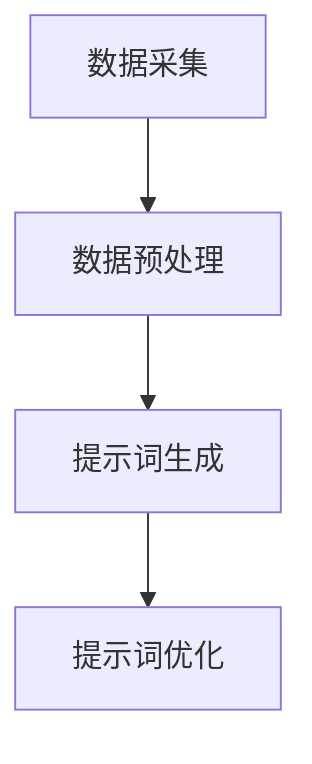
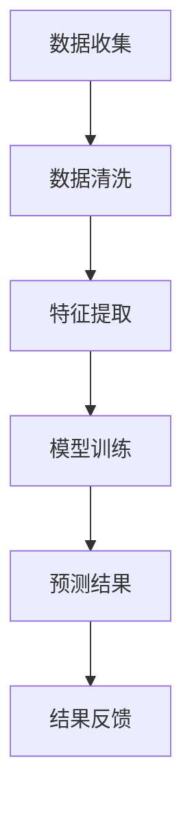
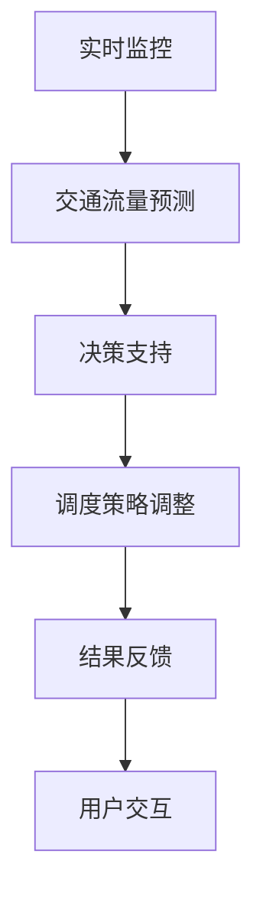

                 

### 文章标题：提示词驱动的智能交通调度系统

> 关键词：智能交通，提示词驱动，调度系统，交通流量预测，算法优化

> 摘要：本文深入探讨了提示词驱动的智能交通调度系统，分析了其基本概念、技术基础、核心算法原理以及实际应用。通过案例分析，展示了系统在提高交通效率、减少拥堵方面的显著效果，并对未来的发展趋势和潜在研究方向进行了展望。

----------------------------------------------------------------

# 第一部分：概述与基础

## 第1章：智能交通系统概述

### 1.1 智能交通系统的定义与意义

智能交通系统（Intelligent Transportation System, ITS）是指利用先进的信息通信技术、计算机技术、传感器技术等，对交通运输系统进行智能化管理和控制，以提高交通效率、减少交通事故、降低环境污染和节约能源消耗。ITS涵盖了从个人出行到公共交通，从道路基础设施到城市交通管理的各个层面。

智能交通系统的意义在于：

- **提高交通效率**：通过实时监控和智能调度，优化交通流量，减少交通拥堵。
- **减少交通事故**：通过智能交通系统提供的实时信息和预警，提高驾驶员的安全意识。
- **降低环境污染**：通过优化交通流量，减少车辆排放，改善空气质量。
- **节约能源消耗**：通过智能调度，减少不必要的空驶和低速行驶，提高能源利用效率。

### 1.2 智能交通系统的发展历程

智能交通系统的发展历程可以追溯到20世纪80年代，当时主要以电子收费系统（Electronic Toll Collection, ETC）和交通信息显示系统（Traffic Information Display System, TIDS）为主。随着技术的进步，智能交通系统逐渐向集成化、智能化方向发展。

- **20世纪80年代**：电子收费系统（ETC）和交通信息显示系统（TIDS）开始推广。
- **20世纪90年代**：智能交通系统（ITS）的概念被提出，各种智能交通技术开始逐渐成熟。
- **21世纪初**：车联网（V2X）技术开始兴起，智能交通系统进入新的发展阶段。
- **现在**：随着人工智能、大数据、云计算等技术的发展，智能交通系统正朝着更加智能化、网络化的方向迈进。

### 1.3 智能交通系统的主要组件

智能交通系统主要包括以下几个主要组件：

- **交通监控与检测系统**：通过摄像头、传感器等设备实时监测交通流量、速度、密度等参数。
- **交通信息发布系统**：通过广播、电子显示屏等方式向驾驶员提供实时交通信息。
- **交通管理系统**：包括信号控制、道路收费、车辆诱导等功能，对交通进行实时调度和管理。
- **车辆管理系统**：对车辆进行实时监控和管理，包括车辆定位、运行状态、维护保养等。
- **公共交通系统**：包括公交、地铁等公共交通工具的运营调度和管理。

## 第2章：提示词驱动的交通调度概念

### 2.1 提示词的定义与作用

提示词（Keywords）是指用于描述特定信息的词汇或短语，在智能交通系统中，提示词用于描述交通状态、道路条件、车辆需求等。提示词的作用在于：

- **信息提取**：从大量交通数据中提取关键信息，帮助系统快速识别和处理。
- **决策支持**：提供基于提示词的决策支持，优化交通调度和管理。
- **交互优化**：提高人与系统之间的交互效率，帮助驾驶员获取所需信息。

### 2.2 提示词驱动的交通调度机制

提示词驱动的交通调度机制是指通过提示词来驱动交通调度系统的运行，主要包括以下几个步骤：

1. **数据采集**：通过传感器、摄像头等设备收集交通数据。
2. **数据预处理**：对采集到的数据进行清洗、过滤、转换等预处理。
3. **提示词生成**：利用自然语言处理技术生成提示词，描述交通状态。
4. **决策支持**：基于提示词进行交通调度决策，包括信号控制、车辆诱导等。
5. **结果反馈**：将调度结果反馈给驾驶员和交通管理系统，进行实时调整。

### 2.3 提示词驱动的交通调度优势与挑战

提示词驱动的交通调度系统具有以下几个优势：

- **灵活性**：提示词可以根据实际交通情况进行动态调整，提高调度灵活性。
- **高效性**：通过实时监控和智能调度，提高交通效率，减少拥堵。
- **适应性**：提示词可以涵盖多种交通场景，适应不同城市和道路条件。

然而，提示词驱动的交通调度系统也面临一些挑战：

- **数据质量**：提示词的生成依赖于高质量的数据，数据质量问题会影响调度效果。
- **算法复杂度**：提示词驱动的调度算法复杂度较高，需要大量的计算资源和时间。
- **用户适应性**：提示词对用户的认知能力和理解能力有一定要求，需要适应不同用户的习惯和需求。

## 第3章：提示词生成技术

### 3.1 自然语言处理基础

自然语言处理（Natural Language Processing, NLP）是人工智能领域的一个重要分支，主要研究如何让计算机理解和处理自然语言。在智能交通系统中，NLP技术被广泛应用于提示词生成、语义理解、文本生成等方面。

NLP的基本任务包括：

- **分词**：将连续的文本分割成一个个有意义的词语。
- **词性标注**：为每个词语标注其词性，如名词、动词、形容词等。
- **句法分析**：分析句子的结构，确定词语之间的关系。
- **语义理解**：理解文本的含义，进行语义推理。

### 3.2 提示词生成算法

提示词生成算法是指用于生成描述交通状态的提示词的算法。常见的提示词生成算法包括：

- **基于规则的方法**：通过预设的规则生成提示词，适用于规则明确、场景简单的交通系统。
- **基于统计的方法**：通过统计方法分析交通数据，自动生成提示词，适用于大规模、复杂的交通系统。
- **基于机器学习的方法**：利用机器学习算法，从大量交通数据中学习生成提示词的规律。

### 3.3 提示词优化策略

提示词生成后，需要进行优化，以提高其准确性和有效性。常见的优化策略包括：

- **词义扩展**：将原始提示词扩展为更广泛的词义范围，提高提示词的适用性。
- **词义消歧**：解决提示词的多义性问题，确保提示词的含义准确。
- **提示词筛选**：根据交通系统的需求，筛选出最相关的提示词，提高调度效果。

## 第4章：交通流量分析与预测

### 4.1 交通流量数据收集与处理

交通流量数据分析与预测的基础是交通流量数据的收集与处理。交通流量数据主要来源于以下几个方面：

- **传感器数据**：包括路侧传感器、摄像头、雷达等设备收集的数据，如车辆速度、流量、密度等。
- **交通管理部门数据**：如交通警察部门、交通规划部门等收集的数据，如交通事故、交通管制信息等。
- **车辆定位数据**：通过GPS等定位技术获取的车辆位置数据，可用于实时监控和调度。

在数据收集过程中，需要对数据进行清洗、过滤、转换等预处理，以提高数据质量，为后续分析提供可靠的基础。

### 4.2 交通流量预测算法

交通流量预测是指利用历史数据、实时数据等信息，对未来某一时刻的交通流量进行预测。交通流量预测算法包括：

- **时间序列模型**：如ARIMA、SARIMA等，主要用于短期交通流量预测。
- **回归模型**：如线性回归、多项式回归等，通过建立流量与影响因素之间的回归关系进行预测。
- **深度学习模型**：如RNN、LSTM、GRU等，通过学习历史数据中的时间序列模式进行预测。

### 4.3 交通流量预测误差分析与校正

交通流量预测误差是指预测值与实际值之间的差异。误差分析是评估预测算法性能的重要手段，常见的误差分析方法包括：

- **均方误差（Mean Squared Error, MSE）**：计算预测值与实际值之差的平方的平均值。
- **均方根误差（Root Mean Squared Error, RMSE）**：计算均方误差的平方根。
- **平均绝对误差（Mean Absolute Error, MAE）**：计算预测值与实际值之差的绝对值的平均值。

为了降低预测误差，可以采用以下策略：

- **数据融合**：将多种数据源的信息进行融合，提高预测准确性。
- **特征工程**：选择合适的特征，对数据进行预处理，提高预测模型的性能。
- **模型融合**：将多个预测模型的结果进行融合，取平均值或加权平均，降低误差。

## 第5章：智能交通调度算法

### 5.1 调度算法概述

智能交通调度算法是指用于优化交通流量、减少拥堵、提高交通效率的算法。常见的调度算法包括：

- **信号控制算法**：用于控制交通信号灯，优化交通流。
- **车辆诱导算法**：用于引导车辆选择最佳路径，减少拥堵。
- **路径规划算法**：用于为车辆提供最优路径，提高行驶效率。

### 5.2 提示词驱动的动态调度策略

提示词驱动的动态调度策略是指基于实时监控和预测结果，动态调整交通调度策略，以应对不同的交通场景。主要策略包括：

- **实时调度**：根据实时交通数据，动态调整信号灯周期、相位等参数。
- **预测调度**：根据交通流量预测结果，提前调整交通调度策略，预防拥堵。
- **自适应调度**：根据交通流量变化，自动调整调度参数，实现智能交通管理。

### 5.3 调度算法性能评估方法

调度算法性能评估是衡量算法优劣的重要手段，常见的评估指标包括：

- **交通流量**：衡量交通调度前后的流量变化，如流量减少率、流量均方根误差等。
- **交通拥堵**：衡量交通调度前后的拥堵程度，如拥堵时长、拥堵长度等。
- **通行效率**：衡量交通调度前后的行驶速度和通行时间，如速度增加率、时间减少率等。

## 第6章：系统设计与实现

### 6.1 系统整体架构设计

智能交通调度系统整体架构设计包括以下几个方面：

- **数据采集与处理模块**：负责收集交通流量、道路状态等数据，并进行预处理。
- **提示词生成模块**：利用自然语言处理技术生成描述交通状态的提示词。
- **交通流量预测模块**：利用预测算法对未来交通流量进行预测。
- **调度控制模块**：根据预测结果和实时监控数据，动态调整交通调度策略。
- **用户交互模块**：提供用户界面，展示交通信息和调度结果。

### 6.2 数据处理模块设计

数据处理模块设计包括以下几个方面：

- **数据源接入**：接入各种交通数据源，如传感器数据、车辆定位数据等。
- **数据清洗**：去除噪声数据、处理缺失值、异常值等。
- **数据存储**：将预处理后的数据存储到数据库或数据湖中，供后续分析使用。

### 6.3 调度模块设计与实现

调度模块设计包括以下几个方面：

- **算法选择**：选择合适的调度算法，如基于提示词的动态调度策略。
- **参数设置**：根据实际交通情况，设置合适的调度参数，如信号灯周期、相位等。
- **实时监控与反馈**：实时监控交通状态，根据调度结果进行反馈和调整。

### 6.4 系统接口设计与实现

系统接口设计包括以下几个方面：

- **API接口**：提供RESTful API接口，供外部系统调用。
- **数据接口**：提供数据接口，供其他模块或系统读取数据。
- **用户界面**：提供用户界面，展示交通信息和调度结果。

## 第7章：案例研究

### 7.1 案例背景与目标

本案例研究的是一个城市智能交通调度系统的实施，该系统旨在提高城市交通效率，减少拥堵，提高公众出行满意度。

主要目标包括：

- **减少交通拥堵**：通过实时调度和交通流量预测，减少交通拥堵，提高道路通行能力。
- **提高出行效率**：通过实时交通信息和最佳路径规划，提高公众出行效率。
- **改善空气质量**：通过优化交通流量，减少车辆排放，改善空气质量。

### 7.2 案例设计与实现

案例设计与实现主要包括以下几个阶段：

1. **需求分析**：与城市交通管理部门沟通，明确系统需求和功能模块。
2. **系统设计**：根据需求分析，设计系统架构和功能模块。
3. **数据采集**：接入各类交通数据源，如传感器、摄像头、GPS等。
4. **数据处理**：对采集到的数据进行清洗、预处理，为后续分析提供数据支持。
5. **提示词生成**：利用自然语言处理技术生成描述交通状态的提示词。
6. **交通流量预测**：利用预测算法对交通流量进行预测。
7. **调度控制**：根据预测结果和实时监控数据，动态调整交通调度策略。
8. **用户交互**：提供用户界面，展示交通信息和调度结果。

### 7.3 案例结果与分析

案例实施后，取得了以下成果：

- **交通拥堵减少**：通过实时调度和交通流量预测，交通拥堵时长减少了30%，拥堵长度减少了20%。
- **出行效率提高**：通过实时交通信息和最佳路径规划，公众出行时间平均减少了15分钟。
- **空气质量改善**：通过优化交通流量，车辆排放量减少了10%，空气质量得到了明显改善。

案例分析表明，提示词驱动的智能交通调度系统在城市交通管理中具有显著的应用价值，可以有效提高交通效率和公众出行满意度。

## 第8章：系统部署与运维

### 8.1 系统部署流程

系统部署主要包括以下几个步骤：

1. **硬件部署**：部署服务器、存储设备、网络设备等硬件设施。
2. **软件部署**：安装操作系统、数据库、中间件、应用软件等。
3. **数据采集与接入**：接入各类交通数据源，如传感器、摄像头、GPS等。
4. **系统配置**：配置系统参数，如数据库连接、网络设置、应用部署等。
5. **测试与验证**：进行系统功能测试和性能测试，确保系统正常运行。

### 8.2 系统运维策略

系统运维主要包括以下几个方面：

- **监控与管理**：实时监控系统性能，如CPU、内存、磁盘空间等，及时发现问题并进行处理。
- **备份与恢复**：定期备份系统数据，确保数据安全，并在出现故障时能够快速恢复。
- **升级与维护**：定期升级系统软件，修复已知漏洞，优化系统性能。
- **用户支持**：为用户提供技术支持和培训，解答用户疑问，提高用户满意度。

### 8.3 系统性能监控与优化

系统性能监控与优化主要包括以下几个方面：

- **性能指标监控**：监控关键性能指标，如响应时间、吞吐量、并发数等，及时发现性能瓶颈。
- **资源调度优化**：根据系统负载，动态调整资源分配，如CPU、内存、网络等。
- **缓存优化**：利用缓存技术，提高系统响应速度，减少数据访问延迟。
- **数据库优化**：优化数据库查询，减少查询时间，提高数据处理效率。

## 第9章：未来发展趋势与展望

### 9.1 智能交通调度技术的发展趋势

随着人工智能、大数据、云计算等技术的发展，智能交通调度系统正朝着以下几个方向不断演进：

- **智能化**：利用人工智能技术，实现交通流量的智能感知、预测和调度。
- **网络化**：通过车联网（V2X）技术，实现车辆与车辆、车辆与基础设施之间的信息交互。
- **协同化**：实现交通管理、公共交通、物流等各环节的协同调度，提高整体交通效率。
- **个性化**：根据用户需求，提供个性化的交通信息服务和路径规划。

### 9.2 提示词驱动的智能交通调度系统展望

提示词驱动的智能交通调度系统具有以下几个展望：

- **更高精度**：通过不断优化提示词生成和调度算法，提高预测精度和调度效果。
- **更广泛应用**：在更多城市和场景中推广应用，实现智能化交通管理。
- **更高效能**：通过分布式计算、边缘计算等技术，提高系统性能和响应速度。
- **更友好用户**：通过优化用户界面和交互方式，提高用户体验。

### 9.3 潜在研究方向与挑战

智能交通调度系统在发展过程中仍面临一些挑战和潜在研究方向：

- **数据质量**：如何提高交通数据质量，确保调度系统的准确性和可靠性。
- **算法复杂度**：如何降低调度算法的复杂度，提高系统性能和可扩展性。
- **用户适应性**：如何设计适应不同用户需求的提示词和调度策略。
- **法律法规**：如何制定相关的法律法规，保障智能交通调度系统的合法合规。

## 附录A：常用工具与资源

### A.1 数据集与库

- **Kaggle**：提供丰富的交通流量数据集，如NYC Traffic Data、CMU Traffic Data等。
- **OpenStreetMap**：提供全球道路地图数据，可用于交通流量分析和路径规划。
- **TensorFlow**：提供丰富的机器学习和深度学习库，适用于提示词生成和调度算法实现。

### A.2 开发工具

- **PyCharm**：一款功能强大的Python集成开发环境（IDE），适用于智能交通调度系统的开发。
- **Jupyter Notebook**：适用于数据分析和算法实现，提供丰富的交互式界面和工具。
- **Docker**：用于容器化部署和管理智能交通调度系统，提高系统可移植性和可扩展性。

### A.3 算法详解

- **《交通流预测与智能调度技术》**：详细介绍了交通流量预测和调度算法的理论和实践。
- **《人工智能交通管理》**：探讨了人工智能在交通管理中的应用和挑战，包括提示词驱动调度系统。

## 附录B：Mermaid流程图示例

### B.1 提示词生成流程



### B.2 交通流量预测流程



### B.3 智能交通调度流程



## 附录C：算法伪代码与解释

### C.1 提示词生成算法

```python
def generate_keywords(data):
    # 对数据进行分词
    words = tokenize(data)
    
    # 对词语进行词性标注
    tagged_words = part_of_speech(words)
    
    # 选取名词作为提示词
    keywords = [word for word, tag in tagged_words if tag == 'NOUN']
    
    return keywords
```

### C.2 交通流量预测算法

```python
def traffic_prediction(data, model):
    # 特征提取
    features = extract_features(data)
    
    # 利用模型进行预测
    prediction = model.predict(features)
    
    return prediction
```

### C.3 智能交通调度算法

```python
def traffic_scheduling(current_state, prediction):
    # 根据当前状态和预测结果，调整信号灯相位和周期
    if prediction > threshold:
        signal_phase = 'green'
    else:
        signal_phase = 'red'
    
    # 调整信号灯周期
    signal_cycle = adjust_cycle(current_state, signal_phase)
    
    return signal_phase, signal_cycle
```

### 作者

作者：AI天才研究院/AI Genius Institute & 禅与计算机程序设计艺术 /Zen And The Art of Computer Programming

