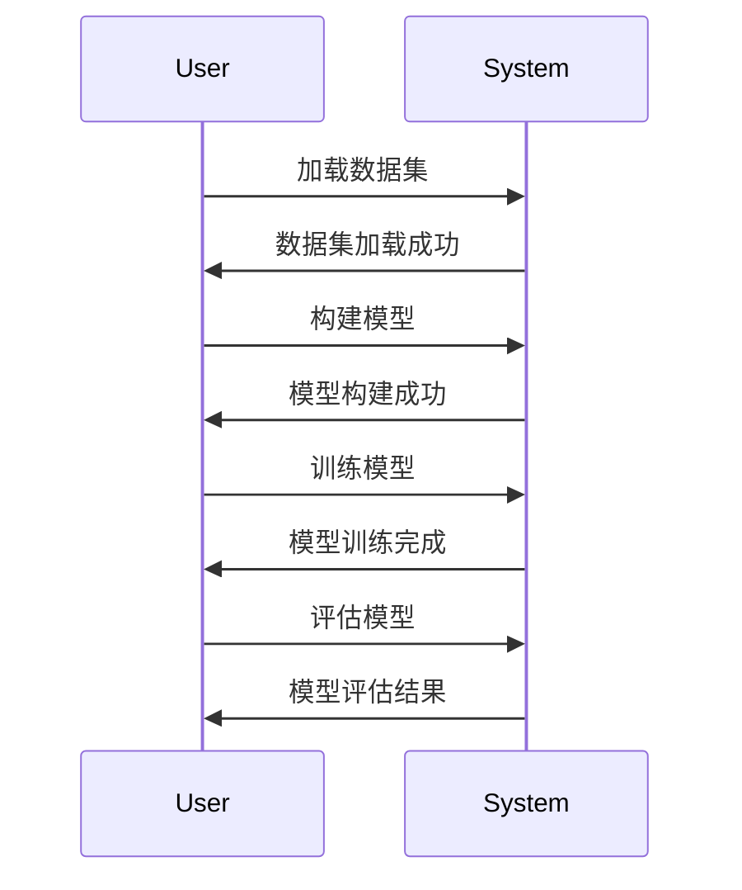

                 

### 文章标题：AI编程的新思维

关键词：人工智能，编程，机器学习，深度学习，创新方法

摘要：本文旨在探讨人工智能编程的新思维，从基础概念到核心算法，再到创新方法，为读者提供一整套系统的AI编程思维框架。通过详细阐述AI编程的核心技术、算法原理及其实践应用，本文将帮助读者深入理解AI编程的本质，并激发读者在编程领域进行创新思维。

### 目录

#### 第一部分：AI编程基础与核心概念

1. AI编程概述
   1.1 AI编程的起源与发展
   1.2 AI编程的基本概念
   1.2.1 人工智能的定义与分类
   1.2.2 机器学习与深度学习的区别
   1.3 AI编程的核心技术
   1.3.1 数据预处理
   1.3.1.1 数据清洗
   1.3.1.2 特征工程
   1.4 AI编程的工具与框架
   1.4.1 常见的AI编程工具
   1.4.1.1 TensorFlow

2. 机器学习算法原理与实现
   2.1 监督学习算法
   2.1.1 线性回归
   2.2 非监督学习算法
   2.2.1 K-均值聚类
   2.3 深度学习算法
   2.3.1 卷积神经网络

#### 第二部分：AI编程新思维

3. AI编程的创新方法
   3.1 自适应学习方法
   3.1.1 强化学习

### 第一部分：AI编程基础与核心概念

#### 1. AI编程概述

##### 1.1 AI编程的起源与发展

人工智能（AI）编程起源于20世纪50年代，经历了几个重要的阶段：逻辑推理阶段、知识表示阶段、机器学习阶段和深度学习阶段。每一个阶段都带来了编程思维方式的变革。

1. 逻辑推理阶段（1950s-1970s）：基于规则和逻辑的编程方式，试图通过编写大量规则来模拟人类智能。
2. 知识表示阶段（1980s-1990s）：引入知识表示的概念，通过构建知识库来模拟人类智能。
3. 机器学习阶段（2000s）：机器学习算法的出现，使得计算机可以通过数据和算法自主学习和优化。
4. 深度学习阶段（2010s至今）：深度学习算法的突破，使得计算机在图像识别、自然语言处理等领域取得了显著的成果。

##### 1.2 AI编程的基本概念

AI编程涉及多个核心概念，包括人工智能、机器学习和深度学习。

1. 人工智能（Artificial Intelligence, AI）：人工智能是指通过计算机程序来模拟人类智能的行为，包括感知、学习、推理和决策等。
2. 机器学习（Machine Learning, ML）：机器学习是人工智能的一个分支，通过算法从数据中学习规律，并自动改进性能。
3. 深度学习（Deep Learning, DL）：深度学习是一种特殊的机器学习算法，通过多层神经网络来模拟人类大脑的神经网络结构，从而实现复杂任务的自动化。

##### 1.2.1 人工智能的定义与分类

人工智能可以从多个维度进行分类：

1. 按照能力：弱人工智能和强人工智能。弱人工智能是指只能完成特定任务的智能系统，强人工智能是指具有普遍智能的智能系统。
2. 按照实现方式：基于规则的AI、知识表示的AI、基于数据的AI、基于模型的AI等。
3. 按照应用领域：通用人工智能（AGI）、专用人工智能（Narrow AI）等。

##### 1.2.2 机器学习与深度学习的区别

机器学习和深度学习都是人工智能的重要组成部分，但它们的实现方式和应用场景有所不同。

1. 机器学习：机器学习是基于数据驱动的方法，通过算法从数据中学习规律。机器学习算法包括监督学习、非监督学习和强化学习等。
2. 深度学习：深度学习是一种特殊的机器学习算法，通过多层神经网络来模拟人类大脑的神经网络结构。深度学习在图像识别、自然语言处理等领域表现出色。

##### 1.3 AI编程的核心技术

AI编程的核心技术包括数据预处理、机器学习算法、深度学习算法等。

1. 数据预处理：数据预处理是AI编程的第一步，包括数据清洗、数据集成、数据转换和数据降维等。
   - 数据清洗：去除重复数据、错误数据和缺失数据。
   $$
   \text{数据清洗：去除重复数据、错误数据和缺失数据}
   $$
   - 数据集成：将多个数据源的数据合并为一个统一的数据集。
   - 数据转换：将数据转换为适合机器学习算法的形式。
   - 数据降维：减少数据维度，提高模型训练效率。

2. 机器学习算法：机器学习算法包括监督学习、非监督学习和强化学习等。
   - 监督学习：通过已有标签数据来训练模型，如线性回归、支持向量机等。
   - 非监督学习：通过无标签数据来训练模型，如K-均值聚类、主成分分析等。
   - 强化学习：通过不断试错来训练模型，如Q-学习、深度Q网络等。

3. 深度学习算法：深度学习算法通过多层神经网络来模拟人类大脑的神经网络结构，包括卷积神经网络（CNN）、循环神经网络（RNN）、生成对抗网络（GAN）等。

##### 1.4 AI编程的工具与框架

AI编程的工具和框架是进行AI编程的重要支撑。

1. 常见的AI编程工具：
   - Python：Python是一种广泛使用的编程语言，因其简洁易懂、功能强大而被广泛应用于AI编程。
   - TensorFlow：TensorFlow是一种开源的深度学习框架，由Google开发，支持多种机器学习和深度学习算法。
   - Keras：Keras是一种高级神经网络API，构建在TensorFlow之上，提供了更简单、更直观的深度学习编程接口。

2. 常见的AI编程工具

TensorFlow架构



### 2. 机器学习算法原理与实现

#### 2.1 监督学习算法

监督学习是一种机器学习算法，通过已有标签数据来训练模型。常见的监督学习算法包括线性回归、支持向量机、决策树、随机森林等。

##### 2.1.1 线性回归

线性回归是一种最简单的监督学习算法，用于预测连续值输出。

伪代码：

```python
def linear_regression(x, y):
    # 计算斜率和截距
    m = (mean(y) - mean(x) * mean(y)) / (mean(x) ** 2 - mean(x) ** 2)
    b = mean(y) - m * mean(x)
    return m, b
```

##### 2.2 非监督学习算法

非监督学习是一种机器学习算法，通过无标签数据来训练模型。常见的非监督学习算法包括K-均值聚类、主成分分析、自编码器等。

##### 2.2.1 K-均值聚类

K-均值聚类是一种常用的非监督学习算法，用于将数据集划分为K个簇。

伪代码：

```python
def k_means(data, k):
    # 初始化k个中心点
    centroids = initialize_centroids(data, k)
    while not_converged(centroids):
        # 计算每个数据点到中心的距离
        distances = calculate_distances(data, centroids)
        # 分配每个数据点到最近的中心点
        assignments = assign_data_to_centroids(data, distances)
        # 更新中心点
        centroids = update_centroids(assignments, data)
    return centroids, assignments
```

##### 2.3 深度学习算法

深度学习是一种特殊的机器学习算法，通过多层神经网络来模拟人类大脑的神经网络结构。常见的深度学习算法包括卷积神经网络（CNN）、循环神经网络（RNN）、生成对抗网络（GAN）等。

##### 2.3.1 卷积神经网络

卷积神经网络是一种常用的深度学习算法，用于图像识别、自然语言处理等任务。

伪代码：

```python
def convolutional_neural_network(input_data):
    # 定义卷积层
    conv1 = Conv2D(32, (3, 3), activation='relu')(input_data)
    # 定义池化层
    pool1 = MaxPooling2D((2, 2))(conv1)
    # 定义全连接层
    flatten = Flatten()(pool1)
    dense1 = Dense(128, activation='relu')(flatten)
    # 定义输出层
    output = Dense(10, activation='softmax')(dense1)
    return Model(inputs=input_data, outputs=output)
```

### 第二部分：AI编程新思维

#### 3. AI编程的创新方法

随着人工智能技术的不断发展，AI编程也在不断创新。以下介绍几种AI编程的创新方法。

##### 3.1 自适应学习方法

自适应学习方法是一种能够根据环境变化自动调整学习策略的方法。其中，强化学习是一种常见的自适应学习方法。

##### 3.1.1 强化学习

强化学习是一种通过不断试错来学习的方法，其核心是状态-动作值函数。强化学习算法通过更新状态-动作值函数来优化决策。

伪代码：

```python
def q_learning(state, action, reward, next_state, discount_factor):
    # 更新状态-动作值函数
    q_value = q_values[state][action] + reward + discount_factor * max(q_values[next_state])
    q_values[state][action] = q_value
```

### 总结

AI编程的新思维包括对人工智能、机器学习和深度学习等基础概念的理解，对核心算法原理的掌握，以及对创新方法的探索。通过本文的介绍，读者可以更深入地了解AI编程的内涵和本质，为未来的AI编程工作奠定基础。

作者：AI天才研究院/AI Genius Institute & 禅与计算机程序设计艺术 /Zen And The Art of Computer Programming

