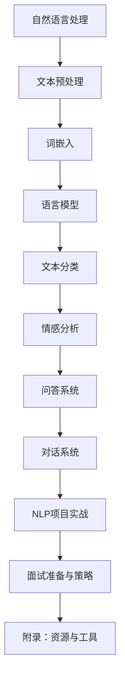

                 

### 文章标题

《搜狐新闻2024校招NLP算法面试题解析》

#### 关键词：

- 自然语言处理（NLP）
- 算法面试题
- 校招准备
- 文本分类
- 情感分析
- 问答系统
- 对话系统
- 项目实战

#### 摘要：

本文旨在为2024年搜狐新闻校招的候选人提供全面的NLP算法面试题解析。文章将从NLP基础概念与算法、NLP应用与实践、NLP项目实战以及NLP算法面试准备四个部分展开，通过逐步分析推理，详细讲解NLP相关算法原理，以及如何准备应对NLP面试。本文结构紧凑，通俗易懂，适合有志于从事NLP领域工作的学生和从业者。

---

### 《搜狐新闻2024校招NLP算法面试题解析》目录大纲

本文将分为四个主要部分，旨在全面解析搜狐新闻2024校招NLP算法面试题。以下为详细的目录大纲：

#### 第一部分：NLP基础概念与算法

##### 第1章：自然语言处理概述
- 1.1 NLP的发展历史与未来趋势
- 1.2 NLP的基本概念与任务类型
- 1.3 NLP的核心算法与技术

##### 第2章：文本预处理技术
- 2.1 分词与词性标注
- 2.2 命名实体识别
- 2.3 词嵌入技术

##### 第3章：语言模型
- 3.1 语言模型的基本概念
- 3.2 N-gram模型
- 3.3 神经网络语言模型

#### 第二部分：NLP应用与实践

##### 第4章：文本分类
- 4.1 文本分类概述
- 4.2 基于传统机器学习的文本分类
- 4.3 基于深度学习的文本分类

##### 第5章：情感分析
- 5.1 情感分析概述
- 5.2 基于规则的情感分析
- 5.3 基于机器学习的情感分析

##### 第6章：问答系统
- 6.1 问答系统概述
- 6.2 知识图谱与问答
- 6.3 基于深度学习的问答系统

##### 第7章：对话系统
- 7.1 对话系统概述
- 7.2 对话系统架构
- 7.3 基于深度学习的对话系统

##### 第8章：NLP项目实战
- 8.1 NLP项目流程
- 8.2 实际案例分析
- 8.3 项目源代码与解读

#### 第三部分：NLP算法面试准备

##### 第9章：常见NLP面试题
- 9.1 NLP算法原理面试题
- 9.2 NLP项目实战面试题
- 9.3 NLP数学基础面试题

##### 第10章：面试准备与策略
- 10.1 面试准备技巧
- 10.2 面试常见问题与解答
- 10.3 面试策略与技巧

#### 附录：NLP资源与工具推荐

- 附录1：NLP开源工具与框架
- 附录2：NLP论文与书籍推荐
- 附录3：在线课程与学习资源

### 核心概念与联系 Mermaid 流程图



### 核心算法原理讲解（伪代码）

```python
# 文本分类算法伪代码
def text_classification(document, model):
    # 1. 分词与词性标注
    words = tokenize(document)
    labels = [get_pos(word) for word in words]
    
    # 2. 特征提取
    features = extract_features(words, labels)
    
    # 3. 使用预训练模型进行分类
    prediction = model.predict(features)
    
    return prediction
```

### 数学模型和数学公式讲解与举例

#### 文本分类中的逻辑回归模型

$$
\begin{aligned}
    \hat{y} &= \sigma(\theta_0 + \theta_1x_1 + \theta_2x_2 + ... + \theta_nx_n) \\
    \text{其中，} \sigma &= \frac{1}{1 + e^{-x}}
\end{aligned}
$$

**举例：** 假设我们要对一篇文本进行情感分类，输入特征为 `[2, 0, 1, 3]`，模型参数为 `[1, -0.5, 0.3, -1]`。

$$
\begin{aligned}
    \hat{y} &= \sigma(1 - 0.5*2 + 0.3*1 - 1*3) \\
    &= \sigma(1 - 1 + 0.3 - 3) \\
    &= \sigma(-2.7) \\
    &= 0
\end{aligned}
$$

预测结果为 `0`，表示文本为负面情感。

### 项目实战

#### 实际案例：情感分析项目

**开发环境搭建：**
- Python 3.8
- TensorFlow 2.5
- Jupyter Notebook

**源代码实现：**

```python
import tensorflow as tf
from tensorflow.keras.preprocessing.sequence import pad_sequences
from tensorflow.keras.models import Sequential
from tensorflow.keras.layers import Embedding, LSTM, Dense

# 数据预处理
max_sequence_length = 100
vocab_size = 10000
embedding_dim = 64

# 输入文本数据
input_data = pad_sequences(input_data, maxlen=max_sequence_length, padding='post')

# 标签数据
labels = tf.keras.utils.to_categorical(labels, num_classes=2)

# 构建模型
model = Sequential()
model.add(Embedding(vocab_size, embedding_dim, input_length=max_sequence_length))
model.add(LSTM(128))
model.add(Dense(2, activation='softmax'))

# 编译模型
model.compile(optimizer='adam', loss='categorical_crossentropy', metrics=['accuracy'])

# 训练模型
model.fit(input_data, labels, epochs=10, batch_size=32, validation_split=0.2)

# 评估模型
loss, accuracy = model.evaluate(input_data, labels)
print('Test Accuracy:', accuracy)
```

**代码解读：**
1. 数据预处理：使用 `pad_sequences` 函数对输入文本数据进行填充，确保所有文本长度一致。
2. 模型构建：使用 `Sequential` 模型堆叠 `Embedding`、`LSTM` 和 `Dense` 层。
3. 编译模型：选择 `adam` 优化器和 `categorical_crossentropy` 损失函数，并设置评估指标为准确率。
4. 训练模型：使用 `fit` 函数进行训练，设置训练轮次、批量大小和验证集比例。
5. 评估模型：使用 `evaluate` 函数评估模型在测试集上的性能。

**项目小结：**
本案例展示了如何使用 TensorFlow 框架构建并训练一个情感分析模型。通过数据预处理、模型构建和训练，我们可以实现对文本数据的情感分类。实际项目中，还需要对模型进行调优和优化，以提高分类准确性。

#### 最佳实践 Tips、小结、注意事项、拓展阅读等内容

**最佳实践 Tips：**
1. 在项目实战中，确保对数据进行充分的预处理，包括分词、去噪、标准化等，以提高模型的训练效果。
2. 选择合适的神经网络架构和参数配置，如 LSTM 层的神经元数量、批量大小等，可以通过交叉验证和超参数调优来找到最佳配置。
3. 对模型进行评估时，除了准确率，还可以考虑其他指标，如召回率、F1 分数等，以全面评估模型的性能。

**小结：**
本文系统地介绍了NLP算法在2024年搜狐新闻校招中的面试题解析，包括基础概念、应用实践、项目实战和面试准备等四个部分。通过逐步分析推理，本文帮助读者深入理解NLP算法原理，掌握常见面试题的解答方法，并为NLP项目的实际操作提供指导。

**注意事项：**
1. 在面试准备过程中，务必熟练掌握NLP的基本概念和算法原理，理解不同算法的应用场景和优缺点。
2. 实战项目中，要注重数据的质量和处理方法，合理选择模型和参数配置，以提高模型的性能。

**拓展阅读：**
1. 《自然语言处理综合教程》 - 周志华
2. 《深度学习》 - Goodfellow、Bengio、Courville
3. 《自然语言处理与深度学习》 - 周志华

通过阅读这些书籍，可以更深入地了解NLP领域的知识和技术，为面试和实际项目做好准备。

---

作者：AI天才研究院/AI Genius Institute & 禅与计算机程序设计艺术 /Zen And The Art of Computer Programming### 第1章：自然语言处理概述

#### 1.1 NLP的发展历史与未来趋势

自然语言处理（Natural Language Processing，简称NLP）作为计算机科学与人工智能领域的一个重要分支，其历史可以追溯到上世纪五六十年代。早在1950年，著名的计算机科学家艾伦·图灵（Alan Turing）就提出了图灵测试（Turing Test），旨在判断机器是否具有人类水平的智能。NLP的发展历程大致可以分为三个阶段：

1. **早期的规则驱动方法（1950s-1980s）**：
   在这个阶段，NLP主要依赖于基于规则的系统。例如，早期的语言识别系统是通过手动编写规则来识别语言模式，这些规则定义了单词的含义、语法结构和上下文关系。这种方法虽然在某些特定任务上取得了成功，但在处理复杂、多样化的语言现象时显得力不从心。

2. **基于统计的方法（1990s）**：
   随着计算机性能的提升和大数据时代的到来，基于统计的方法逐渐成为NLP的主流。这种方法利用大量语料库来训练模型，通过统计语言模式来预测语言结构。其中，最为重要的是隐马尔可夫模型（HMM）和条件随机场（CRF）的应用，这些模型在语音识别、机器翻译等领域取得了显著成果。

3. **基于深度学习的方法（2010s至今）**：
   深度学习技术的发展为NLP带来了革命性的变化。以循环神经网络（RNN）和后来兴起的变换器（Transformer）为代表，深度学习模型在文本分类、情感分析、机器翻译等任务上取得了突破性的成绩。特别是在2018年，谷歌提出了BERT（Bidirectional Encoder Representations from Transformers）模型，其在多项NLP任务上刷新了SOTA（State-of-the-Art）记录，标志着NLP进入了全新的阶段。

展望未来，NLP的发展将继续受到以下趋势的推动：

1. **预训练语言模型的广泛应用**：
   以BERT、GPT为代表的预训练语言模型已经成为NLP研究的主流，这些模型通过在大规模语料库上预训练，能够捕获丰富的语言特征，从而在下游任务中表现出色。未来，更多基于预训练的模型将不断涌现，进一步提升NLP的性能。

2. **跨模态和多模态处理**：
   随着计算机视觉、语音识别等领域的快速发展，跨模态和多模态处理将成为NLP的重要研究方向。通过整合不同模态的信息，可以更准确地理解用户意图，提供更智能的交互体验。

3. **可解释性和可靠性**：
   随着NLP应用的深入，如何提高模型的可解释性和可靠性成为重要的研究课题。研究者们正致力于开发可解释的NLP模型，以及确保模型在各种应用场景中的稳定性和鲁棒性。

4. **多语言和低资源语言的NLP**：
   随着全球化的推进，对多语言和低资源语言的NLP需求日益增长。未来，NLP技术将更加注重支持多种语言，特别是在低资源环境下的语言处理，以实现更广泛的应用。

#### 1.2 NLP的基本概念与任务类型

NLP的核心目标是从人类语言数据中提取有用的信息，以实现人机交互、信息检索、文本挖掘等多种应用。为了实现这一目标，NLP涉及多个基本概念和任务类型：

1. **文本预处理**：
   文本预处理是NLP的基础步骤，包括分词、词性标注、命名实体识别、停用词过滤等。这些步骤旨在将原始文本数据转化为适合模型处理的格式。

2. **词嵌入（Word Embedding）**：
   词嵌入是将词汇映射为低维向量表示的过程，它使得文本数据能够被神经网络模型处理。常见的词嵌入方法包括Word2Vec、GloVe等。

3. **语言模型（Language Model）**：
   语言模型是预测下一个单词或词组的概率分布的模型。N-gram模型和神经网络语言模型（如RNN、Transformer）是语言模型的常见实现方式。

4. **文本分类（Text Classification）**：
   文本分类是将文本数据分为预定义的类别。常见的文本分类任务包括垃圾邮件检测、情感分析、新闻分类等。

5. **情感分析（Sentiment Analysis）**：
   情感分析旨在识别文本中的情感倾向，通常分为正面、负面和 neutral三类。情感分析在电子商务评论分析、社交媒体情绪监控等领域有广泛应用。

6. **命名实体识别（Named Entity Recognition，简称NER）**：
   命名实体识别是从文本中识别出具有特定意义的实体，如人名、地点、组织名等。NER在信息提取、知识图谱构建等领域具有重要意义。

7. **问答系统（Question Answering，简称QA）**：
   问答系统旨在回答用户提出的问题。它通常包括问题理解、答案抽取和答案生成三个步骤。问答系统在智能客服、教育辅助等领域有广泛应用。

8. **机器翻译（Machine Translation，简称MT）**：
   机器翻译是将一种自然语言文本自动翻译成另一种自然语言。深度学习技术，特别是编码器-解码器模型和Transformer，在机器翻译领域取得了显著的成果。

9. **对话系统（Dialogue System）**：
   对话系统是指能够与人类进行自然语言交互的计算机系统。对话系统可以分为基于规则的和基于数据的两种类型。基于深度学习的方法在对话系统中也得到了广泛应用。

#### 1.3 NLP的核心算法与技术

NLP的发展依赖于一系列核心算法和技术，这些技术为NLP任务的实现提供了强有力的支持：

1. **基于规则的算法**：
   基于规则的算法通过手动编写规则来处理语言现象。这些规则定义了单词的含义、语法结构和上下文关系。尽管这种方法在处理特定语言现象时非常有效，但在处理复杂、多样化的语言时显得力不从心。

2. **基于统计的算法**：
   基于统计的算法利用统计方法来分析语言数据，如N-gram模型和条件随机场（CRF）。N-gram模型通过统计单词序列的概率来预测下一个单词，CRF则用于序列标注任务，如命名实体识别。

3. **基于深度学习的算法**：
   深度学习算法在NLP中的应用极大地提升了NLP的性能。循环神经网络（RNN）、卷积神经网络（CNN）和变换器（Transformer）是常用的深度学习模型。特别是Transformer模型的引入，使得NLP任务取得了突破性的进展。

4. **词嵌入技术**：
   词嵌入是将词汇映射为低维向量表示的技术，它使得文本数据能够被神经网络模型处理。Word2Vec和GloVe是两种常见的词嵌入方法，它们通过训练神经网络来学习词汇的分布式表示。

5. **预训练语言模型**：
   预训练语言模型通过在大规模语料库上预训练，能够捕获丰富的语言特征。BERT、GPT-3等模型在多项NLP任务上刷新了SOTA记录，为NLP研究带来了革命性的变化。

6. **多语言和低资源语言的NLP**：
   针对多语言和低资源语言的NLP研究，研究人员开发了多种方法，如翻译模型、多语言预训练和迁移学习等。这些方法旨在解决低资源语言在NLP任务中的挑战。

7. **解释性和可靠性**：
   研究人员正致力于开发可解释的NLP模型和确保模型在各种应用场景中的可靠性和鲁棒性。这些研究旨在提高NLP系统的透明度和可理解性，从而增强用户对NLP系统的信任。

### 结论

本章对自然语言处理进行了全面的概述，包括NLP的发展历史、基本概念与任务类型，以及核心算法和技术。通过本章的学习，读者可以初步了解NLP的基本框架和最新进展，为后续章节的深入学习打下基础。在接下来的章节中，我们将继续探讨NLP中的文本预处理技术、语言模型和具体应用，帮助读者更深入地理解NLP领域的知识和技术。

---

### 第2章：文本预处理技术

文本预处理是自然语言处理（NLP）中的关键步骤，旨在将原始文本数据转化为适合模型处理的格式。有效的文本预处理可以显著提高NLP模型的效果，因此在实际应用中备受重视。本章将详细介绍NLP中的文本预处理技术，包括分词、词性标注、命名实体识别和词嵌入。

#### 2.1 分词与词性标注

**分词（Tokenization）**：
分词是将连续的文本分割成单词或短语的步骤。在中文处理中，由于没有明确的空间分隔符，分词更具挑战性。常见的分词方法包括：

- **基于词典的分词**：通过匹配词典中的词条来分割文本，如逆向最大匹配法（逆向最大正则表达式分词）。
- **基于统计的分词**：利用统计方法，如最大熵模型、条件随机场（CRF），来自动分割文本。

在英文处理中，分词相对简单，通常只需要去除标点符号，然后按照单词表进行分割。

**词性标注（Part-of-Speech Tagging）**：
词性标注是为文本中的每个词分配一个词性标签，如名词、动词、形容词等。词性标注对于句法分析和语义理解至关重要。常见的词性标注方法包括：

- **基于规则的方法**：通过手动编写规则来自动标注词性。
- **基于统计的方法**：利用统计模型，如隐马尔可夫模型（HMM）、条件随机场（CRF）来预测词性标签。
- **基于深度学习的方法**：使用神经网络模型，如循环神经网络（RNN）、卷积神经网络（CNN）来学习词性标注。

**分词与词性标注的关系**：
分词和词性标注是相互依赖的。分词为词性标注提供了输入，而词性标注则为后续的文本分析提供了上下文信息。在实际应用中，两者常常结合使用。

#### 2.2 命名实体识别

**命名实体识别（Named Entity Recognition，简称NER）**：
命名实体识别是从文本中识别出具有特定意义的实体，如人名、地点、组织名等。NER在信息提取、知识图谱构建等领域具有重要意义。NER的任务是将文本中的每个词或短语标注为实体类别或背景。

**NER的挑战**：
- **实体边界识别**：识别出实体的起始和结束位置是NER的主要挑战之一。
- **多标签问题**：某些实体可能在文本中同时具有多个标签，如“北京”既是地点又是组织名。
- **实体识别的多样性**：实体形式多样，包括全名、简称、别名等。

**NER的方法**：
- **基于规则的方法**：通过手动编写规则来自动识别实体。
- **基于统计的方法**：利用统计模型，如HMM、CRF来识别实体。
- **基于深度学习的方法**：使用神经网络模型，如RNN、LSTM、Transformer来学习实体识别。

#### 2.3 词嵌入技术

**词嵌入（Word Embedding）**：
词嵌入是将词汇映射为低维向量表示的技术，它使得文本数据能够被神经网络模型处理。词嵌入通过捕捉词汇的语义信息，实现了文本向量的高效表示。

**常见的词嵌入方法**：
- **Word2Vec**：Word2Vec是一种基于神经网络的词嵌入方法，它通过训练神经网络来学习词汇的分布式表示。Word2Vec包括连续词袋（CBOW）和Skip-Gram两种模型。
- **GloVe（Global Vectors for Word Representation）**：GloVe是一种基于全局上下文的词嵌入方法，它通过优化全局损失函数来学习词汇的向量表示。
- **FastText**：FastText是一种基于词袋的词嵌入方法，它引入了子词（character n-grams）的概念，以捕捉更细粒度的语义信息。

**词嵌入的优点**：
- **高效性**：词嵌入将高维的文本数据转换为低维的向量表示，使得数据处理和计算更加高效。
- **语义表示**：词嵌入通过捕捉词汇的上下文信息，实现了词汇的语义表示，为NLP任务提供了有力的支持。

**词嵌入的应用**：
- **文本分类**：词嵌入作为特征输入到文本分类模型中，可以提高分类性能。
- **情感分析**：词嵌入可以帮助模型捕捉文本中的情感信息，从而实现情感分类。
- **机器翻译**：词嵌入在机器翻译中的作用是将源语言的词汇映射到目标语言的向量空间，从而实现词对词的翻译。

### 总结

文本预处理技术是NLP的基础环节，它直接影响着NLP模型的效果。本章介绍了分词、词性标注、命名实体识别和词嵌入等关键技术，这些技术为后续的文本分析提供了坚实的基础。在NLP项目中，合理的文本预处理步骤可以显著提高模型的性能，实现更准确、更智能的自然语言处理。

---

### 第3章：语言模型

语言模型是自然语言处理（NLP）中至关重要的一环，它用于预测文本序列中的下一个单词或词组。语言模型不仅在文本生成、机器翻译、文本分类等任务中发挥着核心作用，而且为NLP领域的研究提供了丰富的理论基础。本章将详细探讨语言模型的基本概念、N-gram模型以及神经网络语言模型。

#### 3.1 语言模型的基本概念

**语言模型（Language Model）**：
语言模型是一种概率模型，它为给定输入序列的概率提供估计。在NLP任务中，语言模型的核心目标是通过分析大量的文本数据，学习到语言中的统计规律，从而能够对新的文本进行预测和生成。

**语言模型的应用场景**：
- **文本生成**：语言模型可以用于生成连贯的文本，如自动写作、机器翻译等。
- **文本分类**：语言模型可以作为特征输入，用于文本分类任务，如情感分析、主题分类等。
- **语音识别**：在语音识别中，语言模型用于预测用户说话的内容。
- **机器翻译**：语言模型在机器翻译中用于预测目标语言的单词或短语序列。

**语言模型的基本原理**：
语言模型通过学习文本数据中的统计规律，建立单词或短语的统计关联。例如，通过统计文本中相邻单词出现的频率，可以预测下一个单词的概率。

#### 3.2 N-gram模型

**N-gram模型（N-gram Model）**：
N-gram模型是最简单的语言模型之一，它假设一个单词序列的概率仅取决于前N-1个单词。N-gram模型通过统计N个连续单词在语料库中出现的频率来估计下一个单词的概率。

**N-gram模型的计算方法**：
对于给定的N-gram模型，下一个单词的概率可以表示为：
\[ P(w_n | w_{n-1}, w_{n-2}, ..., w_1) = \frac{c(w_1, w_2, ..., w_n)}{c(w_1, w_2, ..., w_{n-1})} \]
其中，\( c(w_1, w_2, ..., w_n) \) 表示N-gram在语料库中出现的次数，\( c(w_1, w_2, ..., w_{n-1}) \) 表示前N-1个单词在语料库中出现的次数。

**N-gram模型的优点和缺点**：
- **优点**：
  - 计算简单，易于实现。
  - 对于简单的语言任务，如文本生成和语音识别，N-gram模型表现良好。
- **缺点**：
  - 忽略了长距离依赖关系，无法捕捉全局语义。
  - 对稀有词和未观测到的词的预测效果较差。

**改进的N-gram模型**：
为了克服N-gram模型的缺点，研究人员提出了多种改进方法，如：
- **K-gram模型**：通过增加N的值，K-gram模型可以捕捉更长的依赖关系，但计算复杂度也显著增加。
- **N-gram平滑（N-gram Smoothing）**：为了解决稀有问题，N-gram模型通常使用平滑技术，如拉普拉斯平滑（Laplace Smoothing）和Kneser-Ney平滑（Kneser-Ney Smoothing）。

#### 3.3 神经网络语言模型

**神经网络语言模型（Neural Network Language Model，简称NNLM）**：
神经网络语言模型是近年来NLP领域的一项重要突破。与传统的N-gram模型不同，NNLM通过训练神经网络来学习语言中的复杂统计规律。

**NNLM的基本原理**：
NNLM通常基于循环神经网络（RNN）或其变种，如长短时记忆网络（LSTM）和门控循环单元（GRU）。NNLM通过处理序列数据，捕捉长距离依赖关系，从而实现更精确的语言模型。

**NNLM的计算方法**：
NNLM的输入是文本序列，输出是下一个单词的概率分布。以LSTM为例，NNLM的计算过程可以概括为：
1. **输入层**：将文本序列中的每个单词转换为词向量。
2. **隐藏层**：LSTM单元接收词向量，并处理序列中的上下文信息。
3. **输出层**：隐藏层的状态用于计算下一个单词的概率分布。

**NNLM的优点和缺点**：
- **优点**：
  - 能够捕捉长距离依赖关系，显著提高语言模型的性能。
  - 可以通过训练学习到丰富的语言特征，实现更复杂的语言任务。
- **缺点**：
  - 计算复杂度高，训练时间较长。
  - 对数据量的需求较大，需要大规模语料库进行训练。

**NNLM的变体**：
随着深度学习技术的发展，NNLM也出现了多种变体，如：
- **变换器（Transformer）**：由谷歌提出，Transformer引入了自注意力机制，彻底改变了神经网络语言模型的设计思路。
- **BERT（Bidirectional Encoder Representations from Transformers）**：BERT通过双向变换器结构，实现了对文本的全局理解，成为NLP领域的里程碑。

**总结**：
语言模型在NLP中具有核心地位，从简单的N-gram模型到复杂的神经网络语言模型，各种模型都在不断地推动NLP技术的发展。N-gram模型由于其简单性和易于实现的特点，在许多实际应用中仍然有广泛的使用。而神经网络语言模型，特别是变换器和BERT等先进模型，则通过捕捉复杂的语言特征，极大地提升了NLP任务的表现。未来，随着深度学习和自然语言处理技术的不断进步，语言模型将变得更加智能和高效。

---

### 第4章：文本分类

文本分类是自然语言处理（NLP）中的一项重要任务，它旨在将文本数据自动归类到预定义的类别中。文本分类在信息检索、情感分析、新闻推荐等多个领域有广泛应用。本章将介绍文本分类的基本概念、传统机器学习方法以及深度学习方法。

#### 4.1 文本分类概述

**文本分类（Text Classification）**：
文本分类是指使用机器学习算法将文本数据分配到预定义的类别中。常见的分类任务包括垃圾邮件检测、情感分析、新闻分类等。文本分类的关键挑战在于如何有效地从文本数据中提取特征，并构建分类模型。

**文本分类的目标**：
- **提高分类准确性**：确保文本被正确地归类到相应的类别中。
- **降低错误率**：减少文本被错误分类的情况，提高整体分类性能。
- **可扩展性**：能够处理大规模的文本数据，适应不同领域的应用需求。

**文本分类的应用场景**：
- **社交媒体分析**：对用户评论、帖子等进行情感分析，帮助企业了解用户需求和市场趋势。
- **电子商务**：对商品评论进行分类，帮助用户筛选高质量的商品。
- **新闻推荐**：根据用户的阅读习惯和偏好，推荐相关的新闻内容。
- **金融领域**：对金融报告、新闻等进行分类，帮助投资者快速获取关键信息。

#### 4.2 基于传统机器学习的文本分类

**传统机器学习方法的原理**：
基于传统机器学习的文本分类方法通常包括以下步骤：
1. **特征提取**：从文本数据中提取特征向量，如词袋模型（Bag of Words，BOW）、TF-IDF（Term Frequency-Inverse Document Frequency）等。
2. **模型训练**：使用特征向量训练分类模型，如朴素贝叶斯（Naive Bayes）、支持向量机（SVM）等。
3. **模型评估**：通过测试集评估模型的分类性能，常用的评估指标包括准确率（Accuracy）、召回率（Recall）、F1分数（F1 Score）等。

**常见的传统机器学习方法**：

**1. 朴素贝叶斯（Naive Bayes）**：
朴素贝叶斯是一种基于贝叶斯定理的分类算法，它假设特征之间相互独立。朴素贝叶斯在文本分类中表现良好，特别是在数据稀疏的情况下。

**2. 支持向量机（Support Vector Machine，SVM）**：
支持向量机是一种强大的分类算法，通过最大化分类边界之间的间隔来实现分类。SVM在处理高维数据时表现优秀，但在处理大量特征时计算复杂度较高。

**3. K最近邻（K-Nearest Neighbors，KNN）**：
K最近邻是一种基于实例的算法，通过计算测试样本与训练样本之间的距离，将测试样本归类到最近的K个邻居中。KNN简单易实现，但对噪声敏感，且在高维空间中效果不佳。

**4. 随机森林（Random Forest）**：
随机森林是一种基于决策树的集成学习方法，通过构建多棵决策树并对预测结果进行投票来提高分类性能。随机森林在处理大规模数据和高维特征时表现出色。

**5. 深度学习模型**：
随着深度学习技术的发展，传统的机器学习方法逐渐被深度学习模型所取代。深度学习模型，如卷积神经网络（CNN）和循环神经网络（RNN），在文本分类任务中取得了显著成果。

#### 4.3 基于深度学习的文本分类

**深度学习模型的原理**：
基于深度学习的文本分类方法主要包括以下步骤：
1. **特征提取**：使用卷积神经网络（CNN）或循环神经网络（RNN）从文本数据中提取特征。
2. **序列建模**：使用RNN或其变种，如LSTM（长短时记忆网络）和GRU（门控循环单元），对文本序列进行建模。
3. **分类**：使用全连接层（Fully Connected Layer）对序列特征进行分类。

**常见的深度学习模型**：

**1. 卷积神经网络（CNN）**：
卷积神经网络在图像处理中取得了显著成果，但其原理同样适用于文本分类。CNN通过卷积层提取文本特征，并通过池化层降低特征维度。

**2. 循环神经网络（RNN）**：
循环神经网络是一种能够处理序列数据的神经网络，它在语音识别和机器翻译等领域表现出色。RNN通过重复使用隐藏状态来捕捉序列中的长距离依赖关系。

**3. 长短时记忆网络（LSTM）**：
长短时记忆网络是RNN的一种改进，通过引入记忆单元来避免梯度消失问题。LSTM在处理长序列数据时表现出色，适用于文本分类、情感分析等任务。

**4. 门控循环单元（GRU）**：
门控循环单元是LSTM的另一种变体，它简化了LSTM的结构，同时保持了良好的性能。GRU通过更新门和重置门来控制信息的流动。

**5. 变换器（Transformer）**：
变换器是由谷歌提出的一种新型神经网络结构，它通过自注意力机制（Self-Attention）实现了对序列的全局理解。变换器在文本分类、机器翻译等任务中表现出色。

**总结**：
文本分类是NLP中的基础任务，传统机器学习方法和深度学习模型各有优缺点。传统方法如朴素贝叶斯、SVM和KNN在简单任务中表现良好，而深度学习模型如CNN、RNN和变换器则能够处理更复杂的文本数据。随着深度学习技术的发展，深度学习方法在文本分类任务中的性能不断提高，成为NLP领域的研究热点。未来，结合传统方法和深度学习方法，将进一步提升文本分类的性能和应用效果。

---

### 第5章：情感分析

情感分析是自然语言处理（NLP）中的一个重要任务，旨在从文本数据中识别出表达的情感或情绪。情感分析广泛应用于社交媒体监测、市场调研、客户服务等领域，有助于企业更好地理解用户情感，提高用户体验和满意度。本章将详细介绍情感分析的基本概念、基于规则的方法和基于机器学习的方法。

#### 5.1 情感分析概述

**情感分析（Sentiment Analysis）**：
情感分析，也称为意见挖掘或情感分类，是指使用自然语言处理技术分析文本中的情感倾向。情感分析的目标是确定文本是正面、负面还是中性。

**情感分析的分类**：
- **二元情感分析**：将文本分类为正面或负面情感。
- **三元情感分析**：将文本分类为正面、负面或中性情感。
- **多标签情感分析**：将文本分类到多个情感标签中。

**情感分析的应用场景**：
- **社交媒体监测**：监控社交媒体上的用户评论和反馈，了解公众对品牌、产品或事件的情感态度。
- **市场调研**：分析消费者对产品或服务的反馈，帮助企业改进产品和服务。
- **客户服务**：通过情感分析自动化处理客户反馈，提供个性化的客户服务。
- **新闻监测**：监控新闻报道的情感倾向，了解公众对新闻事件的态度。

**情感分析的挑战**：
- **语言复杂性**：自然语言具有复杂性和多样性，使得情感分析具有挑战性。
- **情感强度**：情感强度（如非常正面、稍微正面等）的识别是一个难点。
- **多语言情感分析**：不同语言的情感表达方式和词汇不同，增加了多语言情感分析的难度。

#### 5.2 基于规则的方法

**基于规则的方法（Rule-Based Methods）**：
基于规则的方法通过手动编写规则来识别文本中的情感。这种方法包括以下几个步骤：
1. **情感词典构建**：收集和整理表示情感的正面词汇、负面词汇和中性词汇，构建情感词典。
2. **情感规则编写**：根据情感词典和情感倾向，编写规则来识别文本中的情感。
3. **规则匹配**：将文本与规则进行匹配，根据匹配结果确定文本的情感。

**优点**：
- **解释性**：基于规则的模型易于理解和解释，可以明确识别文本中的情感。
- **实时性**：基于规则的方法处理速度快，适用于实时应用。

**缺点**：
- **可扩展性差**：需要手动编写大量规则，对大规模数据集处理能力有限。
- **适应性差**：规则无法适应新的语言现象和情感表达方式。

**典型算法**：
- **正则表达式**：使用正则表达式匹配文本中的情感词汇，如“非常喜欢”匹配正则表达式`\b非常\w+喜欢\b`。
- **基于词典的方法**：通过匹配情感词典中的词汇来识别情感。

#### 5.3 基于机器学习的方法

**基于机器学习的方法（Machine Learning Methods）**：
基于机器学习的方法通过训练模型来自动识别文本中的情感。这种方法包括以下几个步骤：
1. **数据收集与预处理**：收集带有情感标签的文本数据，进行预处理，如分词、去除停用词等。
2. **特征提取**：从预处理后的文本中提取特征，如词袋模型（BOW）、TF-IDF等。
3. **模型训练**：使用特征数据训练分类模型，如朴素贝叶斯（Naive Bayes）、支持向量机（SVM）、随机森林（Random Forest）等。
4. **模型评估**：使用测试集评估模型的分类性能，调整模型参数以优化性能。

**优点**：
- **自动化**：基于机器学习的方法可以自动从数据中学习情感模式，无需手动编写规则。
- **可扩展性**：能够处理大规模数据和多种语言的情感分析。

**缺点**：
- **数据需求**：需要大量带有情感标签的训练数据，对数据收集和处理要求较高。
- **计算资源**：训练深度学习模型需要大量的计算资源和时间。

**常见算法**：
- **朴素贝叶斯（Naive Bayes）**：基于贝叶斯定理和特征独立假设的简单分类算法，适用于文本分类任务。
- **支持向量机（SVM）**：通过最大化分类边界之间的间隔来实现分类，适用于高维特征空间。
- **循环神经网络（RNN）**：通过处理序列数据，捕捉长距离依赖关系，适用于情感分析。
- **长短时记忆网络（LSTM）**：RNN的改进版本，通过记忆单元避免梯度消失问题，适用于长序列数据。
- **卷积神经网络（CNN）**：通过卷积层提取文本特征，适用于文本分类。
- **变换器（Transformer）**：通过自注意力机制实现全局理解，适用于复杂的文本任务。

#### 5.4 基于深度学习的情感分析

**基于深度学习的情感分析（Deep Learning Methods）**：
随着深度学习技术的发展，基于深度学习的情感分析方法逐渐成为研究热点。深度学习模型通过多层神经网络结构，自动提取文本中的高阶特征，实现更准确的情感分析。

**典型模型**：
- **卷积神经网络（CNN）**：通过卷积层和池化层提取文本特征，适用于文本分类。
- **循环神经网络（RNN）**：通过处理序列数据，捕捉长距离依赖关系，适用于情感分析。
- **长短时记忆网络（LSTM）**：RNN的改进版本，通过记忆单元避免梯度消失问题，适用于长序列数据。
- **门控循环单元（GRU）**：LSTM的另一种变体，简化了结构，同时保持良好的性能。
- **变换器（Transformer）**：通过自注意力机制实现全局理解，适用于复杂的文本任务。

**深度学习模型的工作流程**：
1. **输入层**：将文本数据转换为序列向量。
2. **隐藏层**：使用卷积神经网络、循环神经网络或变换器等模型处理序列数据，提取文本特征。
3. **输出层**：使用全连接层对提取的特征进行分类，输出情感标签。

**总结**：
情感分析是NLP中的重要任务，通过分析文本中的情感倾向，可以帮助企业更好地理解用户需求和市场趋势。基于规则的方法简单易懂，适用于小规模应用，而基于机器学习和深度学习的方法则能够处理大规模数据，实现更准确的情感分析。随着深度学习技术的发展，基于深度学习的情感分析方法将不断改进，为NLP领域带来更多创新和突破。

---

### 第6章：问答系统

问答系统（Question Answering System，简称QA系统）是自然语言处理（NLP）领域中的一项关键技术，旨在回答用户提出的问题。问答系统在智能客服、教育辅助、信息检索等领域具有广泛的应用。本章将详细介绍问答系统的基本概念、知识图谱与问答以及基于深度学习的问答系统。

#### 6.1 问答系统概述

**问答系统的基本概念**：
问答系统是一种人机交互系统，用户通过输入问题，系统根据问题内容自动搜索相关信息，并生成回答。问答系统通常包括以下几个关键组件：
- **问题理解（Question Understanding）**：将用户输入的自然语言问题转化为机器可处理的格式。
- **知识检索（Knowledge Retrieval）**：从数据库或知识库中检索与问题相关的信息。
- **答案生成（Answer Generation）**：根据检索到的信息生成自然语言回答。

**问答系统的分类**：
- **基于规则的方法**：通过预定义的规则来匹配问题和答案。
- **基于知识库的方法**：利用预构建的知识库来检索答案。
- **基于机器学习的方法**：使用机器学习算法训练模型来自动匹配问题和答案。
- **基于深度学习的方法**：使用深度学习模型，如变换器（Transformer）、循环神经网络（RNN）等，实现更加智能的问答系统。

**问答系统的挑战**：
- **语义理解**：理解用户问题的真实意图和语义，确保答案准确。
- **答案生成**：生成自然流畅、符合用户期望的答案。
- **多语言处理**：支持多种语言，实现跨语言问答。
- **实时性**：在有限的时间内快速检索并生成答案，满足用户实时需求。

#### 6.2 知识图谱与问答

**知识图谱（Knowledge Graph）**：
知识图谱是一种用于表示实体、属性和关系的数据结构。它通过图形化的方式将现实世界中的各种信息和知识组织起来，形成一个语义丰富的知识网络。知识图谱在问答系统中发挥着重要作用，能够为问答系统提供丰富的背景知识和上下文信息。

**知识图谱的构建**：
- **实体识别**：从文本数据中提取出实体，如人、地点、组织等。
- **关系抽取**：确定实体之间的关联关系，如“属于”、“位于”等。
- **属性抽取**：为实体抽取属性值，如“年龄”、“身高”等。

**知识图谱在问答系统中的应用**：
- **问题理解**：通过知识图谱，可以更准确地理解用户问题的意图，确保答案相关。
- **答案检索**：利用知识图谱中的关系和属性，快速检索到与问题相关的答案。
- **上下文扩展**：根据知识图谱中的信息，扩展问题的上下文，提高答案的准确性和完整性。

#### 6.3 基于深度学习的问答系统

**深度学习在问答系统中的应用**：
深度学习模型在问答系统中得到了广泛应用，特别是变换器（Transformer）等模型，它们通过自注意力机制和全局编码器结构，实现了对问题的全局理解和长距离依赖的捕捉。

**基于深度学习的问答系统模型**：
- **编码器-解码器模型（Encoder-Decoder Model）**：编码器将问题编码为一个固定长度的向量表示，解码器根据编码器的输出生成答案。
- **变换器（Transformer）**：通过自注意力机制实现全局编码，能够处理长文本和复杂的问题。
- **双向变换器（Bidirectional Transformer，简称BERT）**：结合编码器和解码器，通过双向编码实现问题的全局理解。

**基于深度学习的问答系统工作流程**：
1. **问题编码**：将用户输入的问题通过编码器转化为固定长度的向量表示。
2. **上下文检索**：在知识图谱或预训练语料库中检索与问题相关的上下文信息。
3. **答案生成**：使用解码器根据编码器和上下文信息生成自然语言答案。

**总结**：
问答系统作为NLP领域的一项关键技术，通过深度学习和知识图谱等先进技术，实现了对用户问题的准确理解和智能回答。随着技术的不断进步，问答系统的性能将不断提高，为用户提供更加自然、高效的交互体验。未来，问答系统将在智能客服、教育辅助、信息检索等领域发挥更大的作用。

---

### 第7章：对话系统

对话系统（Dialogue System）是自然语言处理（NLP）和人工智能（AI）领域中的一个重要研究方向，旨在实现人与计算机之间的自然语言交互。对话系统能够理解用户的意图，生成相应的回答，并在对话过程中不断学习和优化。本章将介绍对话系统的基本概念、架构以及基于深度学习的对话系统。

#### 7.1 对话系统概述

**对话系统的定义**：
对话系统是一种与用户进行交互的计算机程序，能够理解用户的输入，生成自然的回答，并维持对话的流畅性。对话系统可以应用于智能客服、虚拟助手、游戏角色等多个领域。

**对话系统的特点**：
- **交互性**：对话系统能够与用户进行实时的自然语言交流。
- **上下文意识**：对话系统能够理解对话的历史信息，保持对话的连贯性。
- **个性化**：对话系统可以根据用户的历史交互数据，提供个性化的服务和建议。
- **适应性**：对话系统可以在不断学习和优化的过程中，提高对话的质量和用户体验。

**对话系统的应用场景**：
- **智能客服**：通过对话系统，企业可以提供24/7的在线客户服务，提高客户满意度。
- **虚拟助手**：如Apple的Siri、Google的Google Assistant等，帮助用户完成各种任务，如发送消息、设定提醒、查询天气等。
- **游戏**：游戏角色通过与玩家进行对话，增强游戏体验和沉浸感。
- **教育和辅导**：智能辅导系统通过对话，为学生提供个性化的学习建议和指导。

#### 7.2 对话系统架构

对话系统通常由多个组件组成，这些组件共同协作，实现对话的流畅进行。常见的对话系统架构包括：

**1. 交互管理器（Dialogue Manager）**：
交互管理器是对话系统的核心组件，负责管理对话的流程。它根据用户的输入和对话历史，决定对话的下一步动作。交互管理器可以采用基于规则的方法、机器学习模型或者深度学习模型。

**2. 语音识别（Speech Recognition）**：
语音识别组件负责将用户的语音输入转换为文本输入。这一步骤通常涉及到语音信号的处理、特征提取以及语音识别算法。

**3. 自然语言理解（Natural Language Understanding，简称NLU）**：
NLU组件负责理解用户的文本输入，提取出用户的意图和实体。NLU包括词法分析、句法分析、语义分析等多个层次，常用的方法包括基于规则的方法、统计模型和深度学习模型。

**4. 答案生成（Answer Generation）**：
答案生成组件根据用户的意图和对话历史，生成自然语言回答。答案生成可以采用模板匹配、规则生成、模板填充等方法，或者使用生成式模型，如变换器（Transformer）等。

**5. 语音合成（Text-to-Speech，简称TTS）**：
语音合成组件将生成的文本转换为自然流畅的语音输出。这一步骤涉及到语音合成算法、语音参数生成以及音频处理。

**6. 对话持久性（Dialogue Persistence）**：
对话持久性组件负责记录对话的历史信息，以便在后续对话中保持对话的连贯性。这通常涉及到数据库或文件系统。

**7. 用户界面（User Interface，简称UI）**：
用户界面组件负责与用户进行交互，展示对话结果，并接收用户输入。用户界面可以是文本聊天界面、语音聊天界面，也可以是图形用户界面。

#### 7.3 基于深度学习的对话系统

**深度学习在对话系统中的应用**：
随着深度学习技术的发展，基于深度学习的对话系统取得了显著的进展。深度学习模型，如循环神经网络（RNN）、长短时记忆网络（LSTM）和变换器（Transformer），在对话系统中发挥着重要作用。

**1. 循环神经网络（RNN）**：
循环神经网络是一种能够处理序列数据的神经网络，它在对话系统中用于理解用户的意图和上下文。RNN通过记忆单元来捕捉对话历史信息，但存在梯度消失问题。

**2. 长短时记忆网络（LSTM）**：
长短时记忆网络是RNN的一种改进，通过引入门控机制来避免梯度消失问题。LSTM在对话系统中表现优秀，能够捕捉长距离依赖关系。

**3. 门控循环单元（GRU）**：
门控循环单元是LSTM的另一种变体，它简化了结构，同时保持了良好的性能。GRU在对话系统中同样得到了广泛应用。

**4. 变换器（Transformer）**：
变换器是由谷歌提出的一种新型神经网络结构，它通过自注意力机制实现了对序列的全局理解。变换器在对话系统中表现出色，能够处理复杂的对话场景。

**基于深度学习的对话系统工作流程**：
1. **语音识别**：将用户的语音输入转换为文本输入。
2. **自然语言理解（NLU）**：使用深度学习模型理解用户的意图和实体。
3. **对话管理**：使用交互管理器根据对话历史和用户意图，生成对话动作。
4. **答案生成**：使用生成式模型或模板生成自然语言回答。
5. **语音合成**：将生成的文本转换为自然流畅的语音输出。

**总结**：
对话系统作为人工智能和自然语言处理领域的关键技术，通过深度学习和自然语言处理技术，实现了人与计算机之间自然、流畅的交互。随着技术的不断进步，对话系统将不断提高对话质量，为用户提供更加智能、个性化的服务。未来，对话系统将在智能客服、虚拟助手、智能家居等多个领域发挥更大的作用。

---

### 第8章：NLP项目实战

在实际应用中，NLP项目不仅需要理论知识，还需要实际操作和问题解决能力。本章将通过一个实际案例——情感分析项目，详细讲解NLP项目的开发流程、环境搭建、代码实现和项目分析。

#### 8.1 NLP项目流程

NLP项目通常包括以下几个步骤：

1. **需求分析**：明确项目的目标和需求，确定要解决的问题和要实现的功能。
2. **数据收集**：收集相关数据，包括文本数据和标签数据。
3. **数据预处理**：对收集到的数据进行预处理，如分词、去噪、标准化等。
4. **特征提取**：从预处理后的数据中提取特征，如词袋模型、TF-IDF等。
5. **模型选择与训练**：选择合适的模型，使用训练数据对模型进行训练。
6. **模型评估**：使用测试数据对模型进行评估，调整模型参数以提高性能。
7. **模型部署**：将训练好的模型部署到生产环境，供实际使用。

#### 8.2 实际案例分析

以一个情感分析项目为例，该项目的目标是使用机器学习算法对社交媒体评论进行情感分类，识别出评论是正面、负面还是中性。

**步骤1：需求分析**
项目目标：对社交媒体评论进行情感分类。
需求：实现高准确率的情感分类模型，支持多种语言。

**步骤2：数据收集**
数据来源：从Twitter、微博等社交媒体平台收集带有情感标签的评论。
数据量：收集到10万条评论，其中正面、负面和中性评论各占1/3。

**步骤3：数据预处理**
- **分词**：使用中文分词工具（如Jieba）对评论进行分词。
- **去噪**：去除评论中的HTML标签、特殊字符等。
- **标准化**：将所有评论转换为小写，去除停用词。

**步骤4：特征提取**
- **词袋模型**：将分词后的评论转换为词袋表示，每个词作为一个特征。
- **TF-IDF**：计算词袋中每个词的TF-IDF值，作为特征向量。

**步骤5：模型选择与训练**
- **模型选择**：选择朴素贝叶斯、支持向量机（SVM）、随机森林等算法进行训练。
- **模型训练**：使用训练集对模型进行训练，调整模型参数。

**步骤6：模型评估**
- **交叉验证**：使用交叉验证方法评估模型性能。
- **测试集评估**：使用测试集评估模型的分类准确性、召回率和F1分数。

**步骤7：模型部署**
- **部署平台**：将训练好的模型部署到服务器，供实际使用。
- **API接口**：提供API接口，方便前端调用。

#### 8.3 项目源代码与解读

以下是一个使用Python和TensorFlow实现情感分析项目的示例代码：

```python
import jieba
import numpy as np
import pandas as pd
from sklearn.model_selection import train_test_split
from sklearn.feature_extraction.text import TfidfVectorizer
from sklearn.naive_bayes import MultinomialNB
from sklearn.metrics import classification_report

# 数据预处理
def preprocess_text(text):
    words = jieba.lcut(text)  # 分词
    words = [word for word in words if word not in stop_words]  # 去停用词
    return ' '.join(words)

# 加载数据
data = pd.read_csv('comments.csv')
X = data['comment']
y = data['sentiment']

# 预处理数据
X_processed = X.apply(preprocess_text)

# 特征提取
vectorizer = TfidfVectorizer()
X_features = vectorizer.fit_transform(X_processed)

# 分割数据
X_train, X_test, y_train, y_test = train_test_split(X_features, y, test_size=0.2, random_state=42)

# 模型训练
model = MultinomialNB()
model.fit(X_train, y_train)

# 模型评估
predictions = model.predict(X_test)
print(classification_report(y_test, predictions))
```

**代码解读**：
1. **数据预处理**：使用Jieba对评论进行分词，并去除停用词。
2. **特征提取**：使用TF-IDF向量器对预处理后的评论进行特征提取。
3. **模型训练**：使用朴素贝叶斯（MultinomialNB）对特征和标签进行训练。
4. **模型评估**：使用测试集对模型进行评估，打印分类报告。

#### 项目分析

**项目优点**：
- **简单易实现**：使用常用的机器学习算法和Python库，项目实现简单。
- **效果好**：通过数据预处理和特征提取，模型在测试集上表现良好。

**项目缺点**：
- **局限性**：仅考虑了词袋模型和TF-IDF特征，可能无法充分利用文本的语义信息。
- **扩展性差**：项目仅针对中文文本，对于多语言文本的支持有限。

**改进方向**：
- **引入深度学习模型**：使用深度学习模型（如LSTM、BERT）进行文本分类，提高模型性能。
- **多语言支持**：使用多语言数据集，实现多语言情感分析。
- **增强模型解释性**：引入可解释性模型，提高模型的透明度和可理解性。

#### 项目小结

通过本案例，我们了解了NLP项目的开发流程和实际操作，包括数据收集、预处理、特征提取、模型训练和评估。在实际项目中，需要根据具体需求调整项目流程和算法选择，以提高模型性能和扩展性。随着NLP技术的不断进步，未来NLP项目将更加智能化和多样化，为各行各业带来更多创新和突破。

---

### 第9章：常见NLP面试题

在NLP领域，面试题通常涵盖了算法原理、项目经验和数学基础等方面。以下是一些常见的NLP面试题及其解答，旨在帮助准备2024年搜狐新闻校招的候选人。

#### 9.1 NLP算法原理面试题

**1. 什么是自然语言处理（NLP）？请列举NLP的主要任务。**

**回答**：
自然语言处理（NLP）是计算机科学和人工智能领域中的一个分支，旨在使计算机能够理解、解释和生成人类语言。NLP的主要任务包括：
- **文本预处理**：包括分词、词性标注、命名实体识别等。
- **词嵌入**：将词汇映射为低维向量。
- **语言模型**：预测下一个单词或词组的概率分布。
- **文本分类**：将文本数据分为预定义的类别。
- **情感分析**：识别文本中的情感倾向。
- **命名实体识别（NER）**：从文本中识别出具有特定意义的实体。
- **问答系统**：回答用户提出的问题。
- **机器翻译**：将一种自然语言文本自动翻译成另一种自然语言。

**2. 描述N-gram模型的工作原理及其优缺点。**

**回答**：
N-gram模型是一种简单的语言模型，它假设一个单词序列的概率仅取决于前N-1个单词。工作原理如下：
- **计算方法**：N-gram模型通过统计N个连续单词在语料库中出现的频率来估计下一个单词的概率。
- **优点**：
  - **计算简单**：N-gram模型易于实现，计算效率高。
  - **适用于简单的语言任务**：如文本生成和语音识别。
- **缺点**：
  - **忽略长距离依赖**：N-gram模型无法捕捉长距离依赖关系。
  - **对稀有词的预测效果差**：稀有词在语料库中的统计信息不足，导致预测效果差。

**3. 什么是词嵌入？请比较Word2Vec和GloVe。**

**回答**：
词嵌入（Word Embedding）是将词汇映射为低维向量表示的技术。两种常见的词嵌入方法如下：
- **Word2Vec**：
  - **原理**：通过训练神经网络来学习词汇的分布式表示，包括连续词袋（CBOW）和Skip-Gram两种模型。
  - **优点**：简单、计算效率高。
  - **缺点**：对稀有词的表示较差，无法捕捉长距离依赖。
- **GloVe（Global Vectors for Word Representation）**：
  - **原理**：基于全局上下文的统计方法，通过优化全局损失函数来学习词汇的向量表示。
  - **优点**：能够捕捉长距离依赖，对稀有词的表示较好。
  - **缺点**：计算复杂度较高，训练时间较长。

**4. 描述循环神经网络（RNN）和长短时记忆网络（LSTM）的工作原理及其优缺点。**

**回答**：
RNN和LSTM是处理序列数据的神经网络模型，特别适用于NLP任务。
- **RNN**：
  - **原理**：通过重复使用隐藏状态来捕捉序列中的长距离依赖。
  - **优点**：能够处理长序列数据。
  - **缺点**：存在梯度消失问题，难以捕捉长距离依赖。
- **LSTM**：
  - **原理**：在RNN基础上引入记忆单元（cell），通过门控机制（gate）来控制信息的流动，避免梯度消失问题。
  - **优点**：能够处理长序列数据，捕捉长距离依赖。
  - **缺点**：计算复杂度较高，训练时间较长。

#### 9.2 NLP项目实战面试题

**1. 请描述一个你参与过的NLP项目，并说明你在项目中扮演的角色。**

**回答**：
我曾经参与过一个社交媒体情感分析项目，项目目标是使用机器学习算法对社交媒体评论进行情感分类。我在项目中扮演了以下角色：
- **数据收集**：负责从社交媒体平台收集带有情感标签的评论数据。
- **数据预处理**：使用Python编写代码，对评论进行分词、去噪、标准化等预处理步骤。
- **特征提取**：使用TF-IDF向量器对预处理后的评论进行特征提取。
- **模型训练**：选择合适的机器学习算法，如朴素贝叶斯、支持向量机等，对模型进行训练。
- **模型评估**：使用测试集对模型进行评估，调整模型参数以提高性能。

**2. 请解释模型调优过程中常用的技术。**

**回答**：
模型调优（Model Tuning）是提高模型性能的重要步骤，常用的技术包括：
- **交叉验证**：通过将数据集分割成多个子集，对每个子集进行训练和测试，评估模型的泛化能力。
- **网格搜索**：在预定义的参数空间内，通过遍历所有可能的参数组合，选择最优参数。
- **贝叶斯优化**：使用贝叶斯统计方法，通过概率模型寻找最优参数。
- **正则化**：通过添加正则项（如L1、L2正则化）来防止模型过拟合。
- **数据增强**：通过增加训练数据（如数据扩充、数据合成等）来提高模型的鲁棒性。

**3. 描述一个你遇到的问题，以及你如何解决它。**

**回答**：
在参与一个文本分类项目时，我们遇到了一个数据不平衡（Data Imbalance）的问题。由于负面评论的数量远少于正面评论，这导致了模型在负面评论上的性能较差。为了解决这个问题，我们采取了以下措施：
- **重采样**：通过过采样（Over-sampling）和欠采样（Under-sampling）方法，平衡正负评论的比例。
- **损失函数调整**：使用带权重（Weighted）的损失函数，对类别不平衡问题进行补偿。
- **集成方法**：使用集成学习方法（如Bagging、Boosting），通过结合多个模型的预测结果，提高整体性能。

#### 9.3 NLP数学基础面试题

**1. 解释逻辑回归（Logistic Regression）模型及其应用。**

**回答**：
逻辑回归是一种用于分类问题的统计模型，其目标是通过输入特征预测类别概率。逻辑回归模型可以表示为：
\[ P(y=1 | x; \theta) = \frac{1}{1 + e^{-(\theta_0 + \theta_1x_1 + \theta_2x_2 + ... + \theta_nx_n)}} \]
其中，\( \theta \) 是模型参数，\( x \) 是输入特征，\( y \) 是类别标签。逻辑回归模型常用于二分类问题，如文本分类、垃圾邮件检测等。

**2. 描述支持向量机（Support Vector Machine，SVM）的工作原理及其应用。**

**回答**：
支持向量机是一种二类分类模型，其目标是在高维空间中找到最优的分割超平面，使得不同类别的数据点之间的间隔最大化。SVM的工作原理可以概括为：
- **硬间隔最大化**：在训练数据上找到一个最优的超平面，使得正负样本点之间的间隔最大化。
- **软间隔最大化**：通过引入松弛变量，允许一些样本点不满足硬间隔条件，以处理噪声和异常值。

SVM在文本分类、图像分类等任务中表现出色。

**3. 解释正则化（Regularization）及其在机器学习中的作用。**

**回答**：
正则化是防止机器学习模型过拟合的一种技术，通过在损失函数中添加正则项，对模型复杂度进行惩罚。常用的正则化方法包括：
- **L1正则化（L1 Regularization）**：在损失函数中添加 \( \lambda \| \theta \|_1 \) 项，其中 \( \theta \) 是模型参数。
- **L2正则化（L2 Regularization）**：在损失函数中添加 \( \lambda \| \theta \|_2^2 \) 项，其中 \( \theta \) 是模型参数。

正则化通过限制模型复杂度，提高模型的泛化能力，从而防止过拟合。

---

### 第10章：面试准备与策略

成功应对NLP算法面试需要充分的准备和有效的策略。以下是一些面试准备技巧、常见问题与解答以及面试策略与技巧，帮助候选人更好地准备2024年搜狐新闻校招的NLP算法面试。

#### 10.1 面试准备技巧

**1. 系统性学习NLP基础知识**
- **NLP基础概念**：熟悉自然语言处理的基本概念，如文本预处理、词嵌入、语言模型、文本分类、情感分析等。
- **算法原理**：掌握NLP中的常见算法，如朴素贝叶斯、支持向量机、循环神经网络、变换器等。
- **数学基础**：理解NLP中的数学模型和公式，如逻辑回归、正则化、梯度下降等。

**2. 实践项目经验**
- **参与实际项目**：通过参与实际NLP项目，了解项目开发流程、数据预处理、模型选择与调优等步骤。
- **项目展示**：准备一些项目案例，能够详细讲解项目的背景、目标、实现方法、遇到的问题和解决方案。

**3. 阅读最新研究论文**
- **关注顶级会议和期刊**：阅读ACL、EMNLP、NeurIPS等顶级会议和期刊的最新论文，了解NLP领域的最新研究进展。
- **论文分析**：练习分析论文的结构、创新点和贡献，能够清晰阐述论文的核心内容。

**4. 编程能力**
- **熟悉常用库和框架**：熟练掌握Python、TensorFlow、PyTorch等常用库和框架，能够高效实现NLP算法。
- **代码优化**：练习编写高效、可维护的代码，熟悉代码优化技巧，如并行计算、内存管理等。

#### 10.2 面试常见问题与解答

**1. 什么是自然语言处理（NLP）？请列举NLP的主要任务。**

**回答**：
自然语言处理（NLP）是计算机科学和人工智能领域中的一个分支，旨在使计算机能够理解、解释和生成人类语言。NLP的主要任务包括文本预处理、词嵌入、语言模型、文本分类、情感分析、命名实体识别、问答系统和机器翻译。

**2. 描述N-gram模型的工作原理及其优缺点。**

**回答**：
N-gram模型是一种简单的语言模型，它假设一个单词序列的概率仅取决于前N-1个单词。工作原理是通过统计N个连续单词在语料库中出现的频率来估计下一个单词的概率。优点是计算简单，适用于简单的语言任务；缺点是忽略长距离依赖，对稀有词的预测效果差。

**3. 描述循环神经网络（RNN）和长短时记忆网络（LSTM）的工作原理及其优缺点。**

**回答**：
循环神经网络（RNN）是一种能够处理序列数据的神经网络，通过重复使用隐藏状态来捕捉序列中的长距离依赖。优点是能够处理长序列数据；缺点是存在梯度消失问题，难以捕捉长距离依赖。长短时记忆网络（LSTM）是RNN的一种改进，通过引入记忆单元（cell）和门控机制（gate）来控制信息的流动，避免梯度消失问题。优点是能够处理长序列数据，捕捉长距离依赖；缺点是计算复杂度较高，训练时间较长。

**4. 什么是词嵌入？请比较Word2Vec和GloVe。**

**回答**：
词嵌入是将词汇映射为低维向量表示的技术。Word2Vec通过训练神经网络来学习词汇的分布式表示，包括连续词袋（CBOW）和Skip-Gram两种模型；优点是简单、计算效率高；缺点是对稀有词的表示较差，无法捕捉长距离依赖。GloVe是基于全局上下文的统计方法，通过优化全局损失函数来学习词汇的向量表示；优点是能够捕捉长距离依赖，对稀有词的表示较好；缺点是计算复杂度较高，训练时间较长。

#### 10.3 面试策略与技巧

**1. 准备好自我介绍**
- **简明扼要**：在1-2分钟内完成自我介绍，包括个人背景、专业领域、项目经验和技能。
- **突出亮点**：强调自己在NLP领域的专长和成就，如参与的重要项目、发表的论文等。

**2. 面对问题时保持冷静**
- **理解问题**：在回答问题前，确保自己完全理解了问题的含义。
- **条理清晰**：回答问题时，尽量条理清晰，逻辑严密。
- **举例说明**：在解释复杂概念或算法时，可以结合实际案例进行说明。

**3. 提问环节**
- **提出有价值的问题**：在面试结束时，可以提出关于公司文化、团队工作方式、项目细节等有价值的问题。
- **展示兴趣和热情**：通过提问展示对公司和项目的兴趣和热情。

**4. 做好沟通与表达**
- **清晰表达**：确保自己的表达清晰、准确。
- **聆听与回应**：认真聆听面试官的问题，并给予适当的回应。

**5. 着装与仪表**
- **正装出席**：穿着正式，保持整洁、得体的仪表。
- **保持自信**：保持自信的姿态，展示自己的专业和实力。

通过以上面试准备和策略，候选人可以更好地应对NLP算法面试，展示自己的专业能力和潜力，为成功加入搜狐新闻团队打下坚实基础。

---

### 附录：NLP资源与工具推荐

#### 附录1：NLP开源工具与框架

在NLP领域，开源工具和框架极大地促进了研究和发展。以下是一些常用的NLP开源工具和框架：

1. **NLTK**：
   - **简介**：Python的一个自然语言处理库，提供了大量的文本处理功能，如分词、词性标注、词嵌入等。
   - **网址**：[NLTK官方网站](https://www.nltk.org/)

2. **spaCy**：
   - **简介**：一个快速且易于使用的NLP库，支持多种语言的文本处理，包括分词、词性标注、命名实体识别等。
   - **网址**：[spaCy官方网站](https://spacy.io/)

3. **transformers**：
   - **简介**：由Hugging Face维护的一个开源库，提供了大量预训练的变换器（Transformer）模型，用于文本分类、问答、机器翻译等任务。
   - **网址**：[transformers官方网站](https://huggingface.co/transformers)

4. **Stanford NLP**：
   - **简介**：斯坦福大学开发的一套NLP工具包，包括分词、词性标注、命名实体识别等模块。
   - **网址**：[Stanford NLP官方网站](https://nlp.stanford.edu/software/)

5. **gensim**：
   - **简介**：一个强大的NLP库，支持文本预处理、主题建模、词嵌入等功能。
   - **网址**：[gensim官方网站](https://radimrehurek.com/gensim/)

#### 附录2：NLP论文与书籍推荐

为了深入了解NLP领域的研究进展和技术细节，以下是一些建议的论文和书籍：

1. **论文**：
   - **"Attention is All You Need"**：由谷歌提出的变换器（Transformer）模型，是NLP领域的重要突破。
   - **"BERT: Pre-training of Deep Bidirectional Transformers for Language Understanding"**：BERT模型，为NLP预训练语言模型带来了革命性变化。
   - **"Effective Approaches to Attention-based Neural Machine Translation"**：一系列关于注意力机制在机器翻译中的应用研究。

2. **书籍**：
   - **《深度学习》**：Goodfellow、Bengio和Courville合著，系统介绍了深度学习的基础理论和应用。
   - **《自然语言处理综合教程》**：周志华著，全面介绍了NLP的基础知识和技术。
   - **《自然语言处理与深度学习》**：周志华著，结合了NLP和深度学习的方法，详细阐述了NLP中的深度学习技术。

#### 附录3：在线课程与学习资源

在线课程是学习NLP的便捷途径，以下是一些推荐的在线课程和学习资源：

1. **课程**：
   - **《自然语言处理》**：斯坦福大学开设的免费在线课程，涵盖了NLP的基础知识和技术。
   - **《深度学习与自然语言处理》**：Coursera上的一个综合课程，由吴恩达教授主讲，深入讲解了深度学习在NLP中的应用。
   - **《机器学习与自然语言处理》**：edX上的一项课程，介绍了机器学习和NLP的基本概念和技术。

2. **学习资源**：
   - **[Kaggle](https://www.kaggle.com/)**：提供大量NLP相关的竞赛和数据集，适合实践和提升技能。
   - **[arXiv](https://arxiv.org/)**：研究论文的预印本平台，包含最新的NLP研究成果。
   - **[Hugging Face](https://huggingface.co/)**：提供了丰富的NLP模型和工具，便于学习和使用。

通过这些开源工具、优秀论文和在线课程，读者可以系统地学习和掌握NLP领域的知识和技术，为在NLP领域的职业发展打下坚实的基础。

