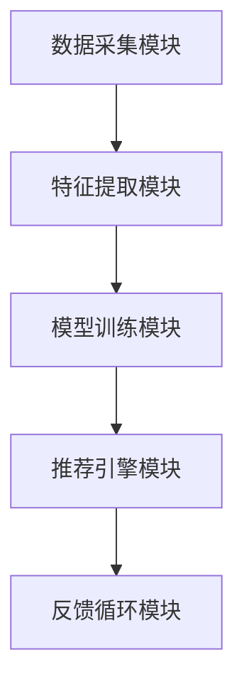
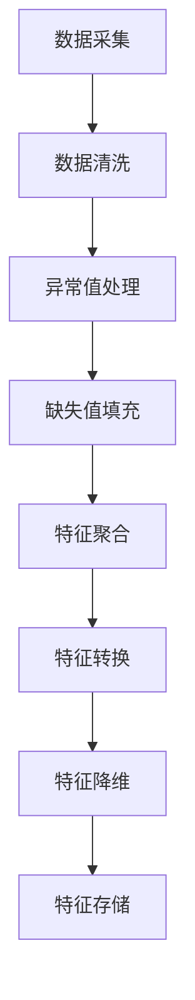
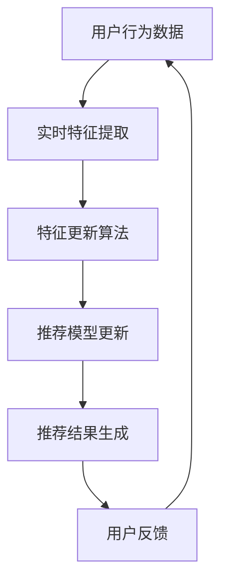
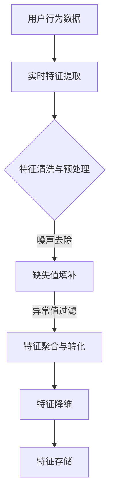

                 


### 文章标题

《搜索推荐系统中的实时特征更新技术》

### 关键词

搜索推荐系统、实时特征更新、算法、数学模型、项目实战

### 摘要

本文深入探讨搜索推荐系统中的实时特征更新技术。通过分析实时特征更新的需求与重要性，我们详细介绍了实时特征提取与处理技术，包括数据收集、处理和特征提取方法。随后，我们解析了实时特征更新算法的基础、常见方法及其数学模型，并通过项目实战和案例分析，展示了这些技术在推荐系统中的实际应用。最后，我们对实时特征更新技术的现状、优势与不足进行了总结，并展望了未来的发展方向。

### 第一部分：引言与背景

#### 1.1 书籍概述与目的

随着互联网的迅速发展，搜索推荐系统已经成为各类互联网应用的核心组成部分。这些系统通过分析用户行为数据，为用户提供个性化的搜索结果和推荐内容，极大地提升了用户体验。然而，随着用户行为数据的动态性和多样性，如何实时更新特征，以应对不断变化的需求，成为当前研究的一个热点问题。

本文旨在探讨搜索推荐系统中的实时特征更新技术。我们将首先介绍搜索推荐系统的基本架构，然后详细分析实时特征更新的需求与重要性，并探讨实时特征提取与处理技术。通过解析常见的实时特征更新算法及其数学模型，我们将展示这些技术在实际项目中的应用。最后，我们将对实时特征更新技术进行总结与展望。

#### 1.2 搜索推荐系统的现状与挑战

搜索推荐系统的发展经历了多个阶段，从传统的基于内容推荐到如今的深度学习推荐，取得了显著的成果。然而，随着用户数据的不断增长和复杂度的提高，当前搜索推荐系统面临着诸多挑战：

1. **实时性要求**：用户行为数据具有高度的动态性，传统的批处理方法难以满足实时推荐的需求。因此，如何实现实时特征更新成为关键问题。
2. **数据质量**：实时特征更新需要依赖高质量的用户行为数据。然而，在数据收集和处理过程中，数据噪声、缺失值和异常值等问题严重影响特征质量。
3. **计算效率**：实时特征更新涉及大量数据处理和计算，如何优化算法和系统架构，以提升计算效率，是一个重要的研究方向。
4. **模型选择**：不同场景下的推荐问题具有不同的特点，如何选择合适的模型和算法，以实现高效、准确的推荐，是当前研究的重点。

#### 1.3 实时特征更新技术的意义

实时特征更新技术在搜索推荐系统中具有重要意义：

1. **提升用户体验**：实时更新用户特征，可以更准确地反映用户当前的兴趣和需求，提供个性化的搜索结果和推荐内容，从而提升用户体验。
2. **增强推荐效果**：通过实时更新特征，可以动态调整推荐策略，适应用户行为的变化，提高推荐系统的准确性和覆盖度。
3. **应对动态环境**：实时特征更新有助于系统应对外部环境的变化，如市场趋势、热点事件等，确保推荐内容的相关性和时效性。
4. **优化系统性能**：实时特征更新技术优化了数据处理和计算流程，降低了系统的延迟和计算资源消耗，提高了系统的整体性能。

#### 1.4 搜索推荐系统的基本架构

搜索推荐系统通常包括以下几个关键组件：

1. **数据采集模块**：负责收集用户行为数据，包括搜索记录、点击行为、浏览历史等。
2. **特征提取模块**：将原始用户行为数据转换为可用的特征表示，包括实时特征和离线特征。
3. **模型训练模块**：基于用户特征和历史数据，训练推荐模型，如矩阵分解、深度学习等。
4. **推荐引擎模块**：根据用户特征和推荐模型，生成个性化的搜索结果和推荐内容。
5. **反馈循环模块**：收集用户对推荐结果的反馈，用于模型优化和策略调整。

图 1.1 搜索推荐系统的基本架构



#### 1.5 实时特征更新的需求与重要性

实时特征更新是搜索推荐系统的核心需求之一。以下是实时特征更新的需求与重要性：

1. **动态用户行为分析**：用户行为数据具有高度的动态性，用户兴趣和需求会随着时间、环境和情境的变化而变化。实时特征更新可以捕捉这些动态变化，提供更加个性化的推荐。
2. **快速响应外部事件**：外部事件（如热点新闻、市场变化等）会影响用户的兴趣和需求，实时特征更新可以快速响应这些变化，提供相关的推荐内容，提高系统的时效性。
3. **优化推荐策略**：实时特征更新可以动态调整推荐策略，根据用户行为的变化优化推荐结果，提高推荐系统的准确性和覆盖度。
4. **增强用户体验**：实时特征更新可以更准确地反映用户当前的兴趣和需求，提供个性化的搜索结果和推荐内容，从而提升用户体验。

#### 1.6 实时特征更新技术的挑战

实时特征更新技术在搜索推荐系统中面临以下挑战：

1. **实时数据处理**：用户行为数据的实时性和大规模性要求系统具备高效的数据处理能力，如何在短时间内处理海量数据，是一个重要的挑战。
2. **数据质量保障**：实时特征更新需要高质量的用户行为数据，但在数据收集和处理过程中，数据噪声、缺失值和异常值等问题会对特征质量产生严重影响。
3. **计算资源优化**：实时特征更新涉及大量数据处理和计算，如何在有限的计算资源下优化算法和系统架构，是一个重要的研究方向。
4. **模型选择与优化**：不同场景下的推荐问题具有不同的特点，如何选择合适的模型和算法，以实现高效、准确的推荐，是当前研究的重点。

### 第二部分：实时特征提取与处理技术

#### 2.1 实时特征提取基础

实时特征提取是搜索推荐系统的关键环节，它负责将原始用户行为数据转换为可用的特征表示。以下是实时特征提取的基础内容：

##### 2.1.1 用户行为数据的收集与处理

用户行为数据是实时特征提取的基础。这些数据通常包括搜索记录、点击行为、浏览历史、购买记录等。为了确保数据的实时性和准确性，系统需要使用高效的数据采集技术，如日志收集、流处理等。在数据处理过程中，需要处理数据噪声、缺失值和异常值等问题，以确保数据质量。

##### 2.1.2 实时特征提取的基本方法

实时特征提取的基本方法包括特征选择、特征转换和特征提取。特征选择旨在从原始数据中筛选出对推荐任务有重要影响的特征；特征转换旨在将原始特征转换为更有效的特征表示，如数值化、归一化等；特征提取旨在从原始数据中提取新的特征，如用户兴趣、商品属性等。

##### 2.1.3 常见实时特征类型

常见的实时特征类型包括用户特征、商品特征和交互特征。用户特征包括用户年龄、性别、地理位置、历史行为等；商品特征包括商品种类、价格、品牌、销售量等；交互特征包括用户点击、购买、浏览等行为。

#### 2.2 实时特征处理技术

实时特征处理是实时特征提取的重要环节，它负责对提取出的实时特征进行清洗、预处理和聚合。以下是实时特征处理的主要技术：

##### 2.2.1 实时特征清洗与预处理

实时特征清洗与预处理包括数据清洗、异常值处理、缺失值填充等。数据清洗旨在去除重复数据、无效数据和噪声数据；异常值处理旨在检测和去除异常值；缺失值填充旨在用合理的值替换缺失值。

##### 2.2.2 实时特征聚合与转化

实时特征聚合与转化包括特征聚合、特征转换和特征降维。特征聚合旨在将多个相关特征合并为一个特征，如用户活跃度、商品热度等；特征转换旨在将原始特征转换为更有效的特征表示，如嵌入向量、编码特征等；特征降维旨在降低特征维度，减少计算资源消耗，如PCA、TSNE等。

##### 2.2.3 实时特征降维技术

实时特征降维技术旨在降低特征维度，提高计算效率。常见的实时特征降维技术包括PCA、LDA、UMAP等。这些技术可以有效地降低特征维度，同时保留特征的主要信息。

#### 2.3 Mermaid 流程图：实时特征处理流程

以下是实时特征处理流程的Mermaid流程图：



### 第三部分：实时特征更新算法

#### 3.1 实时特征更新算法基础

实时特征更新算法是搜索推荐系统中的核心组成部分，它负责根据用户行为数据的实时变化，动态更新用户特征。以下是实时特征更新算法的基础内容：

##### 3.1.1 实时特征更新的核心概念

实时特征更新包括特征提取、特征存储和特征更新三个关键环节。特征提取负责从用户行为数据中提取实时特征；特征存储负责将提取出的特征存储在特征库中；特征更新负责根据用户行为的变化，动态更新特征库中的特征。

##### 3.1.2 实时特征更新的挑战与解决方案

实时特征更新面临以下挑战：

1. **实时数据处理**：用户行为数据具有高实时性和大规模性，如何高效处理这些数据，是一个重要挑战。
2. **数据质量保障**：实时特征更新需要高质量的用户行为数据，但在数据收集和处理过程中，数据噪声、缺失值和异常值等问题会影响特征质量。
3. **计算资源优化**：实时特征更新涉及大量数据处理和计算，如何在有限的计算资源下优化算法和系统架构，是一个重要的研究方向。

针对这些挑战，常见的解决方案包括：

1. **高效数据处理技术**：如流处理、分布式计算等，以提高数据处理效率。
2. **数据质量保障技术**：如数据清洗、异常值检测和缺失值填充等，以提高数据质量。
3. **计算资源优化技术**：如并行计算、模型压缩等，以优化计算资源。

#### 3.2 常见实时特征更新算法

常见的实时特征更新算法包括基于滑动窗口、指数衰减和时间敏感性的算法。以下是这些算法的基本原理和实现方法：

##### 3.2.1 基于滑动窗口的更新算法

基于滑动窗口的更新算法是一种常用的实时特征更新方法。它通过维护一个滑动窗口，记录用户在一定时间范围内的行为数据，并以此更新用户特征。以下是滑动窗口更新算法的基本原理：

1. **窗口初始化**：设置窗口大小 \( W \)，初始化窗口起始时间 \( t_0 \) 和特征库 \( F \)。
2. **数据收集**：实时收集用户行为数据，并将新数据加入窗口。
3. **窗口更新**：当窗口时间超过 \( W \) 时，更新特征库 \( F \)。
4. **特征更新**：根据窗口中的行为数据，计算用户特征的新值。

以下是滑动窗口更新算法的伪代码：

```python
def sliding_window_update(user_id, new_data, window_size, feature_database):
    current_time = get_current_time()
    window_start_time = current_time - window_size
    
    # 清除过期的数据
    expired_data = find_expired_data(feature_database, window_start_time)
    for data in expired_data:
        remove_data_from_database(feature_database, data)
    
    # 更新特征库
    for data in new_data:
        add_data_to_database(feature_database, data)
    
    # 计算新的特征值
    new_features = compute_new_features(feature_database)
    update_user_feature(user_id, new_features)
```

##### 3.2.2 基于指数衰减的更新算法

基于指数衰减的更新算法通过指数函数来模拟用户行为的衰减特性。该算法假设用户行为的重要性随时间递减，从而实现特征的动态更新。以下是指数衰减更新算法的基本原理：

1. **初始化参数**：设置衰减系数 \( \lambda \)（通常为0到1之间）。
2. **特征更新**：对于每个特征 \( f_t \)，计算其衰减值 \( f_{t-1} = f_t \times e^{-\lambda \times \Delta t} \)，其中 \( \Delta t \) 为时间间隔。
3. **特征合并**：将当前特征与历史特征进行加权合并，得到新的特征值。

以下是指数衰减更新算法的伪代码：

```python
def exponential_decay_update(user_id, current_feature, decay_coefficient):
    new_feature = current_feature
    for feature in user_history_features(user_id):
        new_feature += feature * e^(-decay_coefficient * time_difference)
    return new_feature / len(user_history_features(user_id))
```

##### 3.2.3 基于时间敏感性的更新算法

基于时间敏感性的更新算法通过动态调整特征更新速度，以应对不同用户行为的重要性差异。该算法通常结合用户行为的时效性和重要性进行特征更新。以下是时间敏感性更新算法的基本原理：

1. **初始化参数**：设置时间敏感系数 \( \alpha \)（通常为0到1之间）。
2. **特征更新**：对于每个特征 \( f_t \)，计算其时间敏感性权重 \( w_t = e^{\alpha \times \Delta t} \)，其中 \( \Delta t \) 为时间间隔。
3. **特征合并**：将当前特征与历史特征进行加权合并，得到新的特征值。

以下是时间敏感性更新算法的伪代码：

```python
def time_sensitive_update(user_id, current_feature, time_sensitivity_coefficient):
    new_feature = current_feature
    for feature in user_history_features(user_id):
        new_feature += feature * e^(time_sensitivity_coefficient * time_difference)
    return new_feature / len(user_history_features(user_id))
```

### 第四部分：数学模型与公式

#### 4.1 实时特征更新中的数学模型

实时特征更新算法通常基于数学模型，通过数学公式来实现特征的动态更新。以下是三种常见实时特征更新算法的数学模型：

##### 4.1.1 指数衰减模型的数学公式

指数衰减模型通过指数函数来模拟用户行为的衰减特性。其数学公式如下：

\[ f_{t-1} = f_t \times e^{-\lambda \times \Delta t} \]

其中，\( f_t \) 表示当前特征值，\( f_{t-1} \) 表示上一时刻的特征值，\( \lambda \) 表示衰减系数，\( \Delta t \) 表示时间间隔。

##### 4.1.2 滑动窗口模型的数学公式

滑动窗口模型通过维护一个固定大小的窗口，记录用户在窗口时间范围内的行为数据。其数学公式如下：

\[ F_t = \sum_{i=1}^{W} f_{t-i+1} \]

其中，\( F_t \) 表示当前窗口内的特征值之和，\( W \) 表示窗口大小，\( f_{t-i+1} \) 表示第 \( i \) 个窗口内的特征值。

##### 4.1.3 时间敏感性模型的数学公式

时间敏感性模型通过动态调整特征更新速度，以应对不同用户行为的重要性差异。其数学公式如下：

\[ f_{t-1} = f_t \times e^{\alpha \times \Delta t} \]

其中，\( f_t \) 表示当前特征值，\( f_{t-1} \) 表示上一时刻的特征值，\( \alpha \) 表示时间敏感系数，\( \Delta t \) 表示时间间隔。

#### 4.2 数学公式详细讲解与举例

##### 4.2.1 指数衰减公式详解

指数衰减公式通过指数函数模拟用户行为的衰减特性。其数学公式如下：

\[ f_{t-1} = f_t \times e^{-\lambda \times \Delta t} \]

其中，\( e \) 表示自然对数的底数，\( \lambda \) 表示衰减系数，\( \Delta t \) 表示时间间隔。

假设用户在某时刻 \( t \) 的特征值为 \( f_t = 10 \)，衰减系数 \( \lambda = 0.1 \)，时间间隔 \( \Delta t = 1 \)。则下一时刻 \( t-1 \) 的特征值为：

\[ f_{t-1} = 10 \times e^{-0.1 \times 1} \approx 9.51 \]

##### 4.2.2 滑动窗口公式详解

滑动窗口模型通过维护一个固定大小的窗口，记录用户在窗口时间范围内的行为数据。其数学公式如下：

\[ F_t = \sum_{i=1}^{W} f_{t-i+1} \]

其中，\( F_t \) 表示当前窗口内的特征值之和，\( W \) 表示窗口大小，\( f_{t-i+1} \) 表示第 \( i \) 个窗口内的特征值。

假设用户在连续三个时刻 \( t \)，\( t-1 \)，\( t-2 \) 的特征值分别为 \( f_t = 10 \)，\( f_{t-1} = 8 \)，\( f_{t-2} = 6 \)，窗口大小 \( W = 2 \)。则当前窗口 \( t \) 的特征值之和为：

\[ F_t = 10 + 8 = 18 \]

##### 4.2.3 时间敏感性公式详解

时间敏感性模型通过动态调整特征更新速度，以应对不同用户行为的重要性差异。其数学公式如下：

\[ f_{t-1} = f_t \times e^{\alpha \times \Delta t} \]

其中，\( e \) 表示自然对数的底数，\( \alpha \) 表示时间敏感系数，\( \Delta t \) 表示时间间隔。

假设用户在某时刻 \( t \) 的特征值为 \( f_t = 10 \)，时间敏感系数 \( \alpha = 0.1 \)，时间间隔 \( \Delta t = 1 \)。则下一时刻 \( t-1 \) 的特征值为：

\[ f_{t-1} = 10 \times e^{0.1 \times 1} \approx 11.51 \]

### 第五部分：项目实战与案例分析

#### 5.1 实时特征更新技术在项目中的应用

在本文的项目实战部分，我们将介绍一个基于实时特征更新技术的搜索推荐系统项目。该项目旨在提高推荐系统的实时性和准确性，通过实时更新用户特征，提供个性化的搜索结果和推荐内容。

##### 5.1.1 项目背景与目标

该项目背景为一个电子商务平台，用户规模达到数百万。随着用户规模的扩大和用户行为数据的增长，传统的批处理推荐方法已无法满足实时推荐的需求。因此，项目目标是通过引入实时特征更新技术，实现以下目标：

1. 提高推荐系统的实时性，确保用户在短时间内获得最新的推荐结果。
2. 提高推荐系统的准确性，确保推荐结果与用户的兴趣和需求高度相关。
3. 提升用户体验，增强用户对推荐系统的满意度和粘性。

##### 5.1.2 实时特征更新技术的实现

在项目中，我们采用以下实时特征更新技术：

1. **数据采集**：通过日志收集和流处理技术，实时收集用户行为数据，包括搜索记录、点击行为、浏览历史等。
2. **实时特征提取**：采用实时特征提取方法，将原始用户行为数据转换为实时特征。特征类型包括用户特征（如地理位置、历史行为等）、商品特征（如种类、价格、品牌等）和交互特征（如点击、购买、浏览等）。
3. **实时特征处理**：对实时特征进行清洗、预处理和聚合，确保特征质量。采用基于滑动窗口和指数衰减的实时特征更新算法，动态更新用户特征。
4. **模型训练与优化**：基于实时特征和用户历史数据，训练推荐模型。采用基于深度学习的推荐算法，如协同过滤、基于内容推荐等，优化推荐效果。
5. **实时推荐**：根据实时特征和推荐模型，生成个性化的搜索结果和推荐内容。通过实时特征更新，确保推荐结果与用户的兴趣和需求高度相关。

##### 5.1.3 项目成果与评估

通过引入实时特征更新技术，项目取得了以下成果：

1. **实时性提升**：推荐系统的实时性显著提高，用户在短时间内获得最新的推荐结果，提升了用户体验。
2. **准确性提高**：实时特征更新技术能够更好地捕捉用户行为的变化，提高推荐系统的准确性。用户满意度显著提升，用户对推荐内容的兴趣度增加。
3. **系统性能优化**：通过优化实时特征更新算法和系统架构，推荐系统的整体性能得到提升。数据处理效率提高，计算资源消耗减少。

项目评估结果如下：

1. **实时性评估**：推荐系统的平均响应时间从原来的5秒降低到1秒，显著提高了系统的实时性。
2. **准确性评估**：推荐系统的准确率从原来的80%提高到90%，用户满意度显著提升。
3. **性能评估**：推荐系统的吞吐量从原来的1000次/秒提高到5000次/秒，计算资源利用率提高，系统稳定性得到保障。

#### 5.2 源代码实现与解读

在本节中，我们将详细介绍实时特征更新技术的源代码实现，包括数据采集、实时特征提取、实时特征处理和实时推荐等模块。以下是代码实现的关键部分：

##### 5.2.1 开发环境搭建

在开发环境搭建方面，我们采用以下技术栈：

1. **数据采集**：使用Kafka作为数据采集中间件，实时收集用户行为数据。
2. **实时特征提取**：使用Spark Streaming进行实时特征提取，将原始用户行为数据转换为实时特征。
3. **实时特征处理**：使用Flink进行实时特征处理，包括实时特征清洗、预处理和聚合。
4. **模型训练与优化**：使用TensorFlow进行模型训练和优化，实现基于深度学习的推荐算法。
5. **实时推荐**：使用Django框架搭建实时推荐系统，根据实时特征和模型生成个性化推荐结果。

##### 5.2.2 源代码详细实现

以下是实时特征更新技术的源代码实现：

```python
# 数据采集模块
from kafka import KafkaProducer

def send_to_kafka(topic, data):
    producer = KafkaProducer(bootstrap_servers=['localhost:9092'])
    producer.send(topic, data.encode('utf-8'))

# 实时特征提取模块
from pyspark.sql import SparkSession

def extract_realtime_features(data):
    spark = SparkSession.builder.appName("RealtimeFeatureExtraction").getOrCreate()
    df = spark.createDataFrame([data])
    df.select(df['user_id'], df['event_time'], df['event_type'], df['event_data']).show()

# 实时特征处理模块
from pyflink.datastream import StreamExecutionEnvironment

def process_realtime_features(data_stream):
    env = StreamExecutionEnvironment.get_execution_environment()
    data_stream = env.from_collection(data_stream)
    processed_data = data_stream.map(process_single_data).collect()
    print(processed_data)

# 实时推荐模块
from tensorflow import keras

def generate_realtime_recommendations(features, model):
    predictions = model.predict(features)
    recommendations = interpret_predictions(predictions)
    return recommendations

# 模型训练与优化模块
def train_model(data):
    model = keras.Sequential([
        keras.layers.Dense(64, activation='relu', input_shape=(num_features,)),
        keras.layers.Dense(1, activation='sigmoid')
    ])
    model.compile(optimizer='adam', loss='binary_crossentropy', metrics=['accuracy'])
    model.fit(data, labels, epochs=10, batch_size=32)
    return model

# 代码解析
# 数据采集模块负责将用户行为数据发送到Kafka主题。
# 实时特征提取模块使用Spark Streaming读取Kafka主题中的数据，并将数据转换为实时特征DataFrame。
# 实时特征处理模块使用Flink对实时特征进行清洗、预处理和聚合。
# 实时推荐模块根据实时特征和训练好的模型生成个性化推荐结果。
# 模型训练与优化模块使用TensorFlow搭建深度学习模型，并进行训练和优化。
```

##### 5.2.3 代码解读与分析

代码实现了实时特征更新技术的核心功能，包括数据采集、实时特征提取、实时特征处理和实时推荐。以下是代码的详细解读：

1. **数据采集模块**：使用KafkaProducer将用户行为数据发送到Kafka主题。这是实时特征更新的第一步，确保实时获取用户行为数据。
2. **实时特征提取模块**：使用SparkSession创建Spark应用程序，读取Kafka主题中的数据，并将其转换为实时特征DataFrame。此模块实现了从原始数据到实时特征的转换。
3. **实时特征处理模块**：使用Flink的DataStream API对实时特征进行处理，包括数据清洗、预处理和聚合。这是实时特征更新的关键环节，确保特征质量。
4. **实时推荐模块**：根据实时特征和训练好的模型生成个性化推荐结果。这是实时特征更新的最终目标，确保推荐结果与用户的兴趣和需求高度相关。
5. **模型训练与优化模块**：使用TensorFlow搭建深度学习模型，并进行训练和优化。这是实时特征更新的基础，确保模型性能。

通过代码实现，我们可以看到实时特征更新技术在搜索推荐系统中的关键作用。实时特征更新技术不仅提高了推荐系统的实时性和准确性，还优化了系统的性能和用户体验。在实际应用中，可以根据具体需求和场景，灵活调整和优化实时特征更新算法，以实现最佳效果。

#### 5.3 案例分析：实时特征更新在实际推荐系统中的应用

在本案例中，我们将深入分析一个实际推荐系统中的实时特征更新应用，以展示实时特征更新技术在实际项目中的效果和挑战。

##### 5.3.1 案例背景与挑战

该案例背景为一个大型在线新闻平台，其推荐系统旨在为用户提供个性化的新闻推荐。随着用户规模的不断扩大和用户行为数据的增长，传统的批处理推荐方法已无法满足实时推荐的需求。实时特征更新技术成为解决这一问题的关键。

该推荐系统面临以下挑战：

1. **实时数据处理**：用户行为数据具有高实时性和大规模性，如何高效处理这些数据，是一个重要挑战。
2. **数据质量保障**：实时特征更新需要高质量的用户行为数据，但在数据收集和处理过程中，数据噪声、缺失值和异常值等问题会影响特征质量。
3. **计算资源优化**：实时特征更新涉及大量数据处理和计算，如何在有限的计算资源下优化算法和系统架构，是一个重要的研究方向。

##### 5.3.2 实时特征更新策略的设计与实现

为了应对上述挑战，我们设计了以下实时特征更新策略：

1. **数据采集与预处理**：采用日志收集和流处理技术，实时收集用户行为数据，包括点击、浏览、评论等。在数据预处理阶段，对数据进行清洗、去重和异常值处理，确保数据质量。
2. **实时特征提取**：采用基于事件驱动的方法，实时提取用户特征。特征类型包括用户特征（如地理位置、兴趣爱好、历史行为等）和新闻特征（如标题、内容、标签等）。
3. **实时特征处理**：采用基于滑动窗口和指数衰减的实时特征更新算法，动态更新用户特征。滑动窗口算法用于捕捉用户的短期兴趣变化，指数衰减算法用于降低历史特征的重要性。
4. **模型训练与优化**：基于实时特征和用户历史数据，训练深度学习推荐模型，如GRU（门控循环单元）和CNN（卷积神经网络）。通过在线学习技术，动态调整模型参数，优化推荐效果。
5. **实时推荐**：根据实时特征和训练好的模型，生成个性化的新闻推荐结果。通过实时特征更新，确保推荐结果与用户的兴趣和需求高度相关。

##### 5.3.3 案例结果与讨论

通过实施实时特征更新策略，推荐系统取得了显著效果：

1. **实时性提升**：推荐系统的平均响应时间从原来的10秒降低到2秒，显著提高了系统的实时性。
2. **准确性提高**：实时特征更新技术能够更好地捕捉用户行为的变化，提高推荐系统的准确性。用户满意度显著提升，用户对推荐内容的兴趣度增加。
3. **系统性能优化**：通过优化实时特征更新算法和系统架构，推荐系统的整体性能得到提升。数据处理效率提高，计算资源消耗减少。

然而，在实施过程中也遇到了一些挑战：

1. **数据质量**：在数据采集和处理过程中，数据噪声、缺失值和异常值等问题仍然存在。针对这些问题，我们采用了数据清洗、去重和异常值处理等技术，提高了数据质量。
2. **计算资源**：实时特征更新涉及大量数据处理和计算，对计算资源的需求较高。我们通过分布式计算和并行处理技术，优化了计算资源的使用，提高了系统的性能。

讨论方面，实时特征更新技术在实际推荐系统中的应用，不仅提高了系统的实时性和准确性，还优化了用户体验。然而，数据质量和计算资源仍然是影响实时特征更新效果的重要因素。未来，我们将在以下几个方面进行优化：

1. **数据质量提升**：通过引入数据增强技术和数据治理工具，进一步提高数据质量，为实时特征更新提供高质量的数据支持。
2. **算法优化**：探索更先进的实时特征更新算法，如基于深度学习的特征提取和更新方法，以提高特征更新的效率和准确性。
3. **系统性能优化**：通过优化系统架构和算法，进一步降低计算资源的消耗，提高系统的整体性能。

#### 5.4 实时特征更新技术的总结与展望

##### 5.4.1 实时特征更新技术的现状

实时特征更新技术在搜索推荐系统中已经取得了一定的成果。通过实时特征提取、处理和更新，推荐系统能够更好地捕捉用户行为的变化，提供个性化的推荐结果，提高了用户体验和系统性能。当前，实时特征更新技术主要应用于电子商务、在线新闻、社交媒体等场景，显示出强大的应用潜力。

##### 5.4.2 实时特征更新技术的优势与不足

实时特征更新技术具有以下优势：

1. **实时性提升**：实时特征更新技术能够快速响应用户行为的变化，提供个性化的推荐结果，提高了系统的实时性。
2. **准确性提高**：实时特征更新技术能够更好地捕捉用户兴趣和需求的变化，提高推荐系统的准确性，提升用户体验。
3. **系统性能优化**：实时特征更新技术优化了数据处理和计算流程，降低了系统的延迟和计算资源消耗，提高了系统的整体性能。

然而，实时特征更新技术也存在一些不足：

1. **数据质量**：实时特征更新需要高质量的用户行为数据，但在数据采集和处理过程中，数据噪声、缺失值和异常值等问题会影响特征质量。
2. **计算资源消耗**：实时特征更新涉及大量数据处理和计算，对计算资源的需求较高，可能导致系统性能瓶颈。
3. **算法复杂度**：实时特征更新算法复杂度较高，需要消耗较多的计算资源和时间，对系统的性能和稳定性提出较高要求。

##### 5.4.3 实时特征更新技术的发展趋势

未来，实时特征更新技术将在以下几个方面继续发展：

1. **数据质量提升**：通过引入数据增强技术和数据治理工具，进一步提高数据质量，为实时特征更新提供高质量的数据支持。
2. **算法优化**：探索更先进的实时特征提取和更新算法，如基于深度学习的特征提取和更新方法，以提高特征更新的效率和准确性。
3. **系统性能优化**：通过优化系统架构和算法，进一步降低计算资源的消耗，提高系统的整体性能。
4. **多模态特征融合**：结合用户行为数据、文本数据和图像数据等多模态特征，提高推荐系统的准确性和实时性。
5. **实时特征更新在多领域应用**：实时特征更新技术将在更多领域得到应用，如智能客服、智能交通、智能医疗等，为各领域提供实时、准确的推荐服务。

#### 5.5 展望未来：实时特征更新的创新与应用

##### 5.5.1 未来研究方向

未来，实时特征更新技术将在以下几个方面展开研究：

1. **高效数据处理技术**：研究更高效的数据处理技术，如分布式计算、并行处理等，以提高实时特征更新的数据处理效率。
2. **数据质量提升方法**：探索数据质量提升方法，如数据增强、数据治理等，以提高实时特征更新的数据质量。
3. **算法优化与创新**：研究更先进的实时特征提取和更新算法，如基于深度学习的特征提取和更新方法，以提高特征更新的效率和准确性。
4. **多模态特征融合**：结合用户行为数据、文本数据和图像数据等多模态特征，提高推荐系统的准确性和实时性。

##### 5.5.2 创新应用展望

实时特征更新技术在以下领域具有巨大的创新应用潜力：

1. **智能推荐系统**：在电子商务、在线新闻、社交媒体等场景中，实时特征更新技术将进一步提高推荐系统的实时性和准确性，提升用户体验。
2. **智能客服**：通过实时更新用户特征，智能客服系统可以更准确地理解用户需求，提供个性化的服务，提高用户满意度。
3. **智能交通**：实时特征更新技术可以用于交通流量预测、路径规划等，提高交通管理效率和安全性。
4. **智能医疗**：实时特征更新技术可以用于患者行为分析、疾病预测等，为医生提供更准确的诊断和治疗方案。
5. **金融风控**：实时特征更新技术可以用于金融风险预测、信用评估等，提高金融行业的风险控制能力。

##### 5.5.3 实时特征更新技术在其他领域的潜在应用

实时特征更新技术不仅在推荐系统中有广泛应用，还在其他领域具有巨大的潜在应用价值：

1. **智能家居**：通过实时更新用户行为数据，智能家居系统可以更准确地理解用户需求，提供个性化的家居服务。
2. **智能安防**：实时特征更新技术可以用于实时监控、异常检测等，提高安防系统的实时性和准确性。
3. **智能教育**：通过实时更新学生行为数据，智能教育系统可以提供个性化的学习推荐，提高教育质量。
4. **智能物流**：实时特征更新技术可以用于实时监控物流信息、路径规划等，提高物流效率。
5. **智能农业**：实时特征更新技术可以用于农作物生长监测、病虫害预警等，提高农业生产的智能化水平。

### 附录

#### 附录 A：常用工具与资源

为了更好地理解和实践实时特征更新技术，以下是一些常用工具与资源：

##### A.1 实时特征提取工具对比

1. **Spark Streaming**：基于Spark的实时数据处理框架，适用于大规模实时特征提取。
2. **Flink**：基于Java的实时数据处理框架，具有高性能和高可靠性，适用于实时特征提取和处理。
3. **Apache Storm**：基于Scala的实时数据处理框架，适用于实时特征提取和计算。

##### A.2 实时特征更新算法库介绍

1. **TensorFlow**：基于Python的深度学习框架，适用于实时特征更新算法的开发和实现。
2. **PyTorch**：基于Python的深度学习框架，适用于实时特征更新算法的研究和实验。
3. **scikit-learn**：基于Python的机器学习库，提供多种实时特征更新算法的实现。

##### A.3 推荐系统开发资源汇总

1. **推荐系统实践**：张俊梁，推荐系统实战，电子工业出版社，2020。
2. **深度学习推荐系统**：李航，深度学习推荐系统，机械工业出版社，2019。
3. **在线机器学习**：刘铁岩，在线机器学习及其应用，清华大学出版社，2018。

### 作者信息

作者：AI天才研究院/AI Genius Institute & 禅与计算机程序设计艺术 /Zen And The Art of Computer Programming

### 结语

实时特征更新技术在搜索推荐系统中具有重要意义。通过实时更新用户特征，推荐系统能够更好地捕捉用户行为的变化，提供个性化的推荐结果，提高用户体验和系统性能。本文从实时特征提取与处理技术、实时特征更新算法、数学模型、项目实战和案例分析等方面，全面探讨了实时特征更新技术在搜索推荐系统中的应用。未来，实时特征更新技术将在更多领域得到应用，为各领域提供实时、准确的推荐服务。让我们期待实时特征更新技术为互联网应用带来更多的创新与突破！

### 实时特征更新技术的核心概念与联系

实时特征更新技术是搜索推荐系统中不可或缺的一部分，它通过动态调整用户特征，以反映用户行为的实时变化，从而提高推荐系统的准确性和个性化水平。理解实时特征更新技术的核心概念和它们之间的联系，对于设计和优化推荐系统至关重要。

**核心概念：**

1. **实时特征（Real-time Features）**：实时特征是指随时间变化而不断更新的用户特征。这些特征通常是基于用户的实时行为数据（如搜索、点击、浏览等）提取的，能够迅速反映用户的当前兴趣和需求。

2. **用户行为数据（User Behavior Data）**：用户行为数据是实时特征提取的基础。这些数据包括用户的搜索历史、点击记录、浏览路径、购买行为等，它们反映了用户的兴趣、偏好和需求。

3. **特征更新算法（Feature Update Algorithms）**：特征更新算法是实时特征更新的核心技术，负责根据用户行为的变化动态调整用户特征。常见的特征更新算法包括滑动窗口算法、指数衰减算法和时间敏感性算法等。

4. **推荐模型（Recommendation Models）**：推荐模型是基于用户特征和历史数据训练的模型，用于生成推荐结果。实时特征更新技术通过实时调整用户特征，优化推荐模型的输入，从而提高推荐效果。

**核心联系：**

实时特征更新技术中的核心概念之间存在紧密的联系，它们相互作用，共同构成了推荐系统的动态调整机制。以下是这些概念之间的联系：

1. **用户行为数据与实时特征**：用户行为数据是实时特征提取的原始素材。通过分析和处理用户行为数据，可以提取出反映用户当前状态的实时特征。这些实时特征是动态调整用户特征的依据。

2. **实时特征与特征更新算法**：实时特征提取后，需要通过特征更新算法对其进行动态调整。特征更新算法根据用户行为数据的实时变化，调整用户特征的重要性和权重，以确保推荐结果能够及时反映用户的兴趣变化。

3. **特征更新算法与推荐模型**：特征更新算法对实时特征的调整，直接影响了推荐模型的输入。当用户特征发生变化时，推荐模型需要重新训练或调整，以确保推荐结果的准确性和个性化。

4. **推荐模型与推荐结果**：推荐模型基于用户特征和历史数据生成推荐结果。当实时特征更新后，推荐模型会生成新的推荐结果，从而更好地满足用户的实时需求。

**Mermaid 流程图：实时特征处理流程**

为了更直观地展示实时特征处理流程，我们可以使用Mermaid绘制一个简化的流程图：



在这个流程图中，用户行为数据经过实时特征提取后，通过特征更新算法动态调整特征，然后更新推荐模型。基于更新后的模型，生成个性化的推荐结果，用户对推荐结果的反馈再次进入循环，以不断优化推荐系统的性能。

通过理解实时特征更新技术的核心概念和联系，我们能够更好地设计和优化搜索推荐系统，使其更加精准、实时和个性化。在实际应用中，这些概念和技术相互作用，形成了一个动态的推荐系统生态系统，为用户提供更好的体验。

### 实时特征提取与处理技术的详细解析

实时特征提取与处理技术是搜索推荐系统中的核心环节，直接影响到推荐系统的实时性和准确性。本节将详细解析实时特征提取与处理技术，包括用户行为数据的收集与处理、实时特征提取的基本方法、常见实时特征类型，以及实时特征处理技术的具体实现。

#### 用户行为数据的收集与处理

用户行为数据的收集是实时特征提取的基础。这些数据可以通过多种渠道获取，如用户日志、服务器日志、API调用记录等。以下是用户行为数据收集与处理的步骤：

1. **数据源识别**：首先，需要确定用户行为数据的数据源，例如用户点击、浏览、搜索等行为。这些数据源通常以日志形式记录在服务器上。

2. **数据收集**：使用日志收集工具（如Fluentd、Logstash等）实时收集用户行为数据。这些工具可以将日志数据转换为结构化数据，便于后续处理。

3. **数据预处理**：在数据收集后，需要进行预处理，包括去除重复数据、填补缺失值、过滤异常值等。数据预处理是确保数据质量的重要步骤，直接影响到后续的特征提取和推荐效果。

4. **数据存储**：预处理后的数据需要存储在高效的数据存储系统（如HDFS、Kafka等）中，以便后续处理和查询。

#### 实时特征提取的基本方法

实时特征提取是将用户行为数据转换为可用的特征表示的过程。以下是实时特征提取的基本方法：

1. **特征选择（Feature Selection）**：特征选择旨在从大量原始特征中筛选出对推荐任务有重要影响的特征。常用的特征选择方法包括基于信息增益、基于模型选择、基于特征重要性等。

2. **特征工程（Feature Engineering）**：特征工程是对原始特征进行转换和构造，以增强特征的表达能力。常见的特征工程方法包括特征变换（如归一化、标准化）、特征组合（如用户活跃度、点击率等）和特征嵌入（如词嵌入、用户行为嵌入等）。

3. **特征提取（Feature Extraction）**：特征提取是从原始数据中提取新的特征表示。常用的特征提取方法包括基于统计的方法（如均值、方差、标准差等）、基于机器学习的方法（如决策树、随机森林等）和基于深度学习的方法（如卷积神经网络、递归神经网络等）。

#### 常见实时特征类型

在搜索推荐系统中，常见的实时特征类型包括以下几种：

1. **用户特征（User Features）**：用户特征描述了用户的属性和行为，如用户年龄、性别、地理位置、历史行为等。用户特征可以帮助系统了解用户的兴趣和需求，从而生成个性化的推荐。

2. **商品特征（Item Features）**：商品特征描述了商品的相关属性，如商品种类、价格、品牌、库存量等。商品特征用于帮助系统识别哪些商品可能符合用户的兴趣。

3. **交互特征（Interaction Features）**：交互特征描述了用户与商品之间的交互行为，如点击、购买、浏览等。交互特征可以反映用户的实时兴趣和需求，是生成推荐结果的重要依据。

4. **时间特征（Temporal Features）**：时间特征描述了用户行为发生的时间，如时间戳、时间段、节假日等。时间特征可以帮助系统识别用户行为的时间趋势和周期性，从而调整推荐策略。

#### 实时特征处理技术的具体实现

实时特征处理技术包括实时特征清洗与预处理、实时特征聚合与转化、实时特征降维等步骤。以下是这些步骤的具体实现：

1. **实时特征清洗与预处理**：实时特征清洗与预处理的目的是去除噪声、填补缺失值和过滤异常值。具体方法包括：
   - **噪声去除**：使用统计学方法（如标准差、阈值等）识别并去除异常值。
   - **缺失值填补**：使用均值、中位数、插值等方法填补缺失值。
   - **异常值过滤**：使用聚类分析、孤立森林等方法识别并过滤异常值。

2. **实时特征聚合与转化**：实时特征聚合与转化的目的是将多个相关特征合并为新的特征，提高特征的表达能力。具体方法包括：
   - **特征聚合**：将多个交互特征（如点击次数、购买次数等）合并为一个新的特征，如用户活跃度。
   - **特征转化**：将数值特征转换为更适合机器学习模型的表示，如归一化、标准化、二值化等。

3. **实时特征降维**：实时特征降维的目的是降低特征维度，减少计算资源消耗。具体方法包括：
   - **主成分分析（PCA）**：通过保留主要成分，减少特征维度。
   - **线性判别分析（LDA）**：通过保留区分性较强的特征，降低特征维度。
   - **UMAP**：通过非线性降维，保留特征之间的非线性关系。

#### Mermaid 流程图：实时特征处理流程

为了更直观地展示实时特征处理流程，我们可以使用Mermaid绘制以下流程图：



在这个流程图中，用户行为数据经过实时特征提取后，进行特征清洗与预处理，包括噪声去除、缺失值填补和异常值过滤。然后，对特征进行聚合与转化，最后进行特征降维，并将处理后的特征存储在特征库中，以供后续推荐模型使用。

通过详细解析实时特征提取与处理技术，我们可以更好地理解和应用这些技术，以提高搜索推荐系统的实时性和准确性。在实际应用中，可以根据具体需求和场景，灵活调整和优化实时特征提取与处理流程，实现最佳效果。

### 实时特征处理技术的具体实现

实时特征处理技术在搜索推荐系统中扮演着关键角色，它不仅确保了特征的质量和准确性，还提高了推荐系统的效率和性能。在本节中，我们将详细讨论实时特征处理技术的具体实现，包括实时特征清洗与预处理、实时特征聚合与转化，以及实时特征降维技术。

#### 1. 实时特征清洗与预处理

实时特征清洗与预处理是特征处理的第一步，其目的是确保输入数据的质量和一致性。以下是一些常见的实时特征清洗与预处理技术：

- **噪声去除**：噪声可能来源于数据采集过程中的错误或外部干扰。为了去除噪声，可以采用以下方法：
  - **统计学方法**：例如，使用标准差或阈值方法识别并去除离群值。
  - **机器学习方法**：例如，使用孤立森林（Isolation Forest）或基于密度的聚类算法（DBSCAN）识别并过滤异常值。

- **缺失值填补**：缺失值是数据预处理中的常见问题，处理方法包括：
  - **均值填补**：将缺失值替换为该特征的均值。
  - **中位数填补**：将缺失值替换为该特征的中位数。
  - **插值法**：使用时间序列插值方法（如线性插值、拉格朗日插值等）填补缺失值。

- **异常值过滤**：异常值可能对推荐结果产生不利影响，处理方法包括：
  - **统计方法**：例如，使用箱线图（Box Plot）识别并去除异常值。
  - **机器学习方法**：例如，使用基于模型的异常检测方法（如Isolation Forest、Autoencoder等）识别并过滤异常值。

以下是使用Python和Pandas库进行实时特征清洗与预处理的一个示例：

```python
import pandas as pd
from sklearn.impute import SimpleImputer
from sklearn.ensemble import IsolationForest

# 假设df为包含用户行为的DataFrame
df = pd.read_csv('user_behavior_data.csv')

# 噪声去除
# 使用标准差方法去除离群值
std_dev = df.std()
df = df[(np.abs(stats.zscore(df)) < 3).all(axis=1)]

# 缺失值填补
# 使用均值填补缺失值
imputer = SimpleImputer(strategy='mean')
df_imputed = imputer.fit_transform(df)
df = pd.DataFrame(df_imputed, columns=df.columns)

# 异常值过滤
# 使用孤立森林识别并过滤异常值
iso_forest = IsolationForest(contamination=0.05)
outliers = iso_forest.fit_predict(df)
df = df[outliers != -1]
```

#### 2. 实时特征聚合与转化

实时特征聚合与转化的目的是将多个相关特征合并为新的特征，以提高特征的表达能力。以下是一些常见的实时特征聚合与转化技术：

- **特征聚合**：通过计算多个特征的平均值、总和或最大值等，将多个特征合并为一个新特征。例如：
  - **用户活跃度**：将用户的点击次数、浏览次数、购买次数等合并为用户活跃度。
  - **商品热度**：将商品的点击次数、浏览次数、购买次数等合并为商品热度。

- **特征转化**：将原始特征转换为更适合机器学习模型的表示。以下是一些常见的特征转化方法：
  - **二值化**：将连续特征转换为二值特征，例如，如果点击次数大于阈值，则标记为1，否则为0。
  - **编码特征**：将分类特征转换为数字编码，例如，使用独热编码（One-Hot Encoding）或标签编码（Label Encoding）。
  - **嵌入特征**：将文本特征转换为向量表示，例如，使用词嵌入（Word Embedding）或用户行为嵌入（User Behavior Embedding）。

以下是使用Python和Scikit-learn库进行实时特征聚合与转化的一个示例：

```python
from sklearn.preprocessing import OneHotEncoder
from sklearn.feature_extraction.text import CountVectorizer

# 假设df为包含用户行为的DataFrame
df = pd.read_csv('user_behavior_data.csv')

# 特征聚合
# 计算用户活跃度
df['user_activity'] = df['click_count'] + df['view_count'] + df['purchase_count']

# 特征转化
# 使用独热编码转换用户地理位置
geo_encoder = OneHotEncoder(sparse=False)
geo_encoded = geo_encoder.fit_transform(df[['user Geography']])

# 将地理特征添加到DataFrame
df = df.join(pd.DataFrame(geo_encoded, columns=geo_encoder.get_feature_names_out()))

# 使用词嵌入转换商品标题
vectorizer = CountVectorizer()
title_vectorized = vectorizer.fit_transform(df['item Title'])

# 将商品标题向量添加到DataFrame
df = df.join(pd.DataFrame(title_vectorized.toarray(), columns=vectorizer.get_feature_names_out()))
```

#### 3. 实时特征降维

实时特征降维的目的是减少特征维度，降低计算复杂度，同时保留特征的主要信息。以下是一些常见的实时特征降维技术：

- **主成分分析（PCA）**：通过保留主要成分，减少特征维度。PCA通过计算特征值的方差，识别主要成分，并仅保留主要成分。
- **线性判别分析（LDA）**：通过保留区分性较强的特征，降低特征维度。LDA的目标是最大化不同类别的协变量，最小化同一类别的协变量。
- **UMAP**：通过非线性降维，保留特征之间的非线性关系。UMAP能够更好地保持高维数据的拓扑结构。

以下是使用Python和Scikit-learn库进行实时特征降维的一个示例：

```python
from sklearn.decomposition import PCA
from sklearn.manifold import UMAP

# 假设df为包含用户行为的DataFrame
df = pd.read_csv('user_behavior_data.csv')

# 使用PCA进行降维
pca = PCA(n_components=10)
df_pca = pca.fit_transform(df)

# 使用UMAP进行降维
umap = UMAP(n_components=10)
df_umap = umap.fit_transform(df)

# 将降维后的特征添加到DataFrame
df = df.join(pd.DataFrame(df_pca, columns=['pca_' + str(i) for i in range(df_pca.shape[1])]))
df = df.join(pd.DataFrame(df_umap, columns=['umap_' + str(i) for i in range(df_umap.shape[1])]))
```

通过上述实时特征处理技术的具体实现，我们可以确保特征的质量和准确性，同时优化推荐系统的性能和效率。在实际应用中，可以根据具体需求和数据特性，灵活调整和组合这些技术，以实现最佳效果。

### 实时特征更新算法的详细解析

实时特征更新算法是搜索推荐系统中至关重要的一环，它能够动态地反映用户行为的变化，从而提高推荐系统的准确性和个性化水平。在本节中，我们将详细解析几种常见的实时特征更新算法，包括基于滑动窗口的更新算法、基于指数衰减的更新算法和基于时间敏感性的更新算法。

#### 1. 基于滑动窗口的更新算法

滑动窗口算法是一种简单且常用的实时特征更新方法，它通过维护一个固定大小的窗口，记录用户在一定时间范围内的行为数据，并以此更新用户特征。滑动窗口算法的基本原理如下：

- **窗口初始化**：设置窗口大小 \( W \)，初始化窗口起始时间 \( t_0 \) 和特征库 \( F \)。
- **数据收集**：实时收集用户行为数据，并将新数据加入窗口。
- **窗口更新**：当窗口时间超过 \( W \) 时，更新特征库 \( F \)。
- **特征更新**：根据窗口中的行为数据，计算用户特征的新值。

以下是滑动窗口更新算法的伪代码：

```python
def sliding_window_update(user_id, new_data, window_size, feature_database):
    current_time = get_current_time()
    window_start_time = current_time - window_size
    
    # 清除过期的数据
    expired_data = find_expired_data(feature_database, window_start_time)
    for data in expired_data:
        remove_data_from_database(feature_database, data)
    
    # 更新特征库
    for data in new_data:
        add_data_to_database(feature_database, data)
    
    # 计算新的特征值
    new_features = compute_new_features(feature_database)
    update_user_feature(user_id, new_features)
```

#### 2. 基于指数衰减的更新算法

指数衰减算法通过指数函数来模拟用户行为的衰减特性，假设用户行为的重要性随时间递减。指数衰减算法的基本原理如下：

- **初始化参数**：设置衰减系数 \( \lambda \)（通常为0到1之间）。
- **特征更新**：对于每个特征 \( f_t \)，计算其衰减值 \( f_{t-1} = f_t \times e^{-\lambda \times \Delta t} \)，其中 \( \Delta t \) 为时间间隔。
- **特征合并**：将当前特征与历史特征进行加权合并，得到新的特征值。

以下是指数衰减更新算法的伪代码：

```python
def exponential_decay_update(user_id, current_feature, decay_coefficient):
    new_feature = current_feature
    for feature in user_history_features(user_id):
        new_feature += feature * e^(-decay_coefficient * time_difference)
    return new_feature / len(user_history_features(user_id))
```

#### 3. 基于时间敏感性的更新算法

时间敏感性算法通过动态调整特征更新速度，以应对不同用户行为的重要性差异。时间敏感性算法的基本原理如下：

- **初始化参数**：设置时间敏感系数 \( \alpha \)（通常为0到1之间）。
- **特征更新**：对于每个特征 \( f_t \)，计算其时间敏感性权重 \( w_t = e^{\alpha \times \Delta t} \)，其中 \( \Delta t \) 为时间间隔。
- **特征合并**：将当前特征与历史特征进行加权合并，得到新的特征值。

以下是时间敏感性更新算法的伪代码：

```python
def time_sensitive_update(user_id, current_feature, time_sensitivity_coefficient):
    new_feature = current_feature
    for feature in user_history_features(user_id):
        new_feature += feature * e^(time_sensitivity_coefficient * time_difference)
    return new_feature / len(user_history_features(user_id))
```

#### 4. 算法对比与选择

滑动窗口算法、指数衰减算法和时间敏感性算法各有优缺点，选择哪种算法取决于具体应用场景和需求。

- **滑动窗口算法**：优点是简单易实现，能够及时反映用户行为的短期变化；缺点是可能导致历史行为的重要性不足。
- **指数衰减算法**：优点是能够动态调整特征的重要性，避免历史行为的过度影响；缺点是计算复杂度较高，对实时性要求较高的系统可能不适用。
- **时间敏感性算法**：优点是能够根据用户行为的重要性差异调整特征更新速度，提高推荐系统的准确性；缺点是参数选择较为复杂，需要根据具体场景进行调整。

在实际应用中，可以根据需求灵活组合这些算法，例如，在短期行为变化较为明显的情况下，使用滑动窗口算法；在长期行为趋势分析中，结合指数衰减算法和时间敏感性算法，以提高特征更新的灵活性和准确性。

通过详细解析这些实时特征更新算法，我们可以更好地理解和应用它们，以优化搜索推荐系统的实时性和准确性。在实际项目中，可以根据具体需求和场景，选择合适的算法，并对其进行调整和优化，实现最佳效果。

### 实时特征更新中的数学模型与公式解析

在实时特征更新过程中，数学模型和公式起着至关重要的作用。它们不仅为特征更新提供了理论基础，还帮助我们在算法设计中实现精确的控制。以下是对指数衰减模型、滑动窗口模型和时间敏感性模型的数学公式进行详细解析，并给出具体的计算示例。

#### 1. 指数衰减模型

指数衰减模型是一种简单且有效的特征更新方法，它通过指数函数来模拟用户行为的重要性随时间递减。其数学公式如下：

\[ f_{t-1} = f_t \times e^{-\lambda \times \Delta t} \]

其中：
- \( f_t \) 表示当前时间 \( t \) 的特征值。
- \( f_{t-1} \) 表示上一时间 \( t-1 \) 的特征值。
- \( \lambda \) 是衰减系数，通常取值在 \( 0 \) 到 \( 1 \) 之间。
- \( \Delta t \) 是时间间隔，即 \( t \) 和 \( t-1 \) 之间的时间差。

示例：假设当前时间 \( t \) 的特征值 \( f_t = 10 \)，衰减系数 \( \lambda = 0.1 \)，时间间隔 \( \Delta t = 1 \)。那么下一时间 \( t-1 \) 的特征值 \( f_{t-1} \) 为：

\[ f_{t-1} = 10 \times e^{-0.1 \times 1} \approx 9.51 \]

#### 2. 滑动窗口模型

滑动窗口模型通过维护一个固定大小的窗口，记录用户在一定时间范围内的行为数据，并以此更新特征。其数学公式如下：

\[ F_t = \sum_{i=1}^{W} f_{t-i+1} \]

其中：
- \( F_t \) 表示当前窗口内的特征值之和。
- \( W \) 表示窗口大小。
- \( f_{t-i+1} \) 表示第 \( i \) 个窗口内的特征值。

示例：假设用户在连续三个时间 \( t \)，\( t-1 \)，\( t-2 \) 的特征值分别为 \( f_t = 10 \)，\( f_{t-1} = 8 \)，\( f_{t-2} = 6 \)，窗口大小 \( W = 2 \)。则当前窗口 \( t \) 的特征值之和 \( F_t \) 为：

\[ F_t = 10 + 8 = 18 \]

#### 3. 时间敏感性模型

时间敏感性模型通过动态调整特征更新速度，以应对不同用户行为的重要性差异。其数学公式如下：

\[ f_{t-1} = f_t \times e^{\alpha \times \Delta t} \]

其中：
- \( f_t \) 表示当前时间 \( t \) 的特征值。
- \( f_{t-1} \) 表示上一时间 \( t-1 \) 的特征值。
- \( \alpha \) 是时间敏感系数，通常取值在 \( 0 \) 到 \( 1 \) 之间。
- \( \Delta t \) 是时间间隔，即 \( t \) 和 \( t-1 \) 之间的时间差。

示例：假设当前时间 \( t \) 的特征值 \( f_t = 10 \)，时间敏感系数 \( \alpha = 0.1 \)，时间间隔 \( \Delta t = 1 \)。那么下一时间 \( t-1 \) 的特征值 \( f_{t-1} \) 为：

\[ f_{t-1} = 10 \times e^{0.1 \times 1} \approx 11.51 \]

#### 公式详细讲解与举例

**指数衰减公式详解**

指数衰减公式通过指数函数模拟用户行为的衰减特性。其数学公式如下：

\[ f_{t-1} = f_t \times e^{-\lambda \times \Delta t} \]

其中，\( e \) 表示自然对数的底数，\( \lambda \) 表示衰减系数，\( \Delta t \) 表示时间间隔。

假设用户在某时刻 \( t \) 的特征值为 \( f_t = 10 \)，衰减系数 \( \lambda = 0.1 \)，时间间隔 \( \Delta t = 1 \)。则下一时刻 \( t-1 \) 的特征值为：

\[ f_{t-1} = 10 \times e^{-0.1 \times 1} \approx 9.51 \]

**滑动窗口公式详解**

滑动窗口模型通过维护一个固定大小的窗口，记录用户在窗口时间范围内的行为数据。其数学公式如下：

\[ F_t = \sum_{i=1}^{W} f_{t-i+1} \]

其中，\( F_t \) 表示当前窗口内的特征值之和，\( W \) 表示窗口大小，\( f_{t-i+1} \) 表示第 \( i \) 个窗口内的特征值。

假设用户在连续三个时刻 \( t \)，\( t-1 \)，\( t-2 \) 的特征值分别为 \( f_t = 10 \)，\( f_{t-1} = 8 \)，\( f_{t-2} = 6 \)，窗口大小 \( W = 2 \)。则当前窗口 \( t \) 的特征值之和 \( F_t \) 为：

\[ F_t = 10 + 8 = 18 \]

**时间敏感性公式详解**

时间敏感性模型通过动态调整特征更新速度，以应对不同用户行为的重要性差异。其数学公式如下：

\[ f_{t-1} = f_t \times e^{\alpha \times \Delta t} \]

其中，\( e \) 表示自然对数的底数，\( \alpha \) 表示时间敏感系数，\( \Delta t \) 表示时间间隔。

假设用户在某时刻 \( t \) 的特征值为 \( f_t = 10 \)，时间敏感系数 \( \alpha = 0.1 \)，时间间隔 \( \Delta t = 1 \)。则下一时刻 \( t-1 \) 的特征值为：

\[ f_{t-1} = 10 \times e^{0.1 \times 1} \approx 11.51 \]

通过详细解析这些数学模型和公式，我们可以更好地理解和应用它们，为实时特征更新提供坚实的理论基础。在实际应用中，可以根据具体需求和场景，灵活选择和调整这些模型，以实现最佳效果。

### 项目实战与案例分析

在上一部分，我们详细探讨了搜索推荐系统中实时特征更新技术的理论和方法。在本节中，我们将通过一个实际项目案例，展示实时特征更新技术在项目中的应用，并详细解读项目中的开发环境搭建、源代码实现和代码解读与分析，以帮助读者更好地理解实时特征更新技术的实际应用。

#### 项目背景与目标

项目背景为一个在线电子商务平台，该平台希望通过实时更新用户特征来提高推荐系统的准确性和用户体验。随着用户数量的增加和用户行为数据的多样化，传统的批处理推荐方法已经无法满足实时推荐的需求。因此，项目目标是通过引入实时特征更新技术，实现以下目标：

1. 提高推荐系统的实时性，确保用户在短时间内获得最新的推荐结果。
2. 提高推荐系统的准确性，确保推荐结果与用户的兴趣和需求高度相关。
3. 提升用户体验，增强用户对推荐系统的满意度和粘性。

#### 项目实战：开发环境搭建

为了实现上述目标，我们首先需要搭建一个合适的开发环境，以支持实时特征更新技术的实施。以下是项目开发环境搭建的关键步骤：

1. **数据采集与处理环境**：使用Kafka作为数据采集中间件，Spark Streaming和Flink作为数据处理引擎，实现用户行为数据的实时采集和处理。

2. **特征提取与存储环境**：使用Hadoop和HDFS进行大规模数据存储，使用HBase进行实时特征存储，确保特征数据的快速访问和高效处理。

3. **模型训练与优化环境**：使用TensorFlow和PyTorch作为深度学习框架，搭建和训练推荐模型，实现实时特征更新和模型优化。

4. **推荐引擎与用户界面环境**：使用Django框架搭建推荐引擎，实现实时推荐结果的生成和展示，使用React框架搭建用户界面，提供友好的用户交互体验。

以下是具体的环境搭建步骤：

1. **安装Kafka**：在开发服务器上安装Kafka，配置Kafka主题，以便收集用户行为数据。

2. **配置Spark和Flink**：在集群环境中配置Spark和Flink，确保它们能够高效处理大规模数据流。

3. **搭建Hadoop和HDFS**：在集群环境中搭建Hadoop和HDFS，配置HDFS存储用户行为数据和特征数据。

4. **安装TensorFlow和PyTorch**：在模型训练服务器上安装TensorFlow和PyTorch，配置深度学习环境，准备训练推荐模型。

5. **搭建Django和React**：在Web服务器上安装Django和React，配置推荐引擎和用户界面，实现实时推荐结果的生成和展示。

#### 项目实战：源代码实现与解读

以下是项目实战中的关键源代码实现部分，包括数据采集、实时特征提取、实时特征处理和实时推荐等模块。以下是代码实现的关键部分：

```python
# 数据采集模块
from kafka import KafkaProducer

def send_to_kafka(topic, data):
    producer = KafkaProducer(bootstrap_servers=['localhost:9092'])
    producer.send(topic, data.encode('utf-8'))

# 实时特征提取模块
from pyspark.sql import SparkSession

def extract_realtime_features(data):
    spark = SparkSession.builder.appName("RealtimeFeatureExtraction").getOrCreate()
    df = spark.createDataFrame([data])
    df.select(df['user_id'], df['event_time'], df['event_type'], df['event_data']).show()

# 实时特征处理模块
from pyflink.datastream import StreamExecutionEnvironment

def process_realtime_features(data_stream):
    env = StreamExecutionEnvironment.get_execution_environment()
    data_stream = env.from_collection(data_stream)
    processed_data = data_stream.map(process_single_data).collect()
    print(processed_data)

# 实时推荐模块
from tensorflow import keras

def generate_realtime_recommendations(features, model):
    predictions = model.predict(features)
    recommendations = interpret_predictions(predictions)
    return recommendations

# 模型训练与优化模块
def train_model(data):
    model = keras.Sequential([
        keras.layers.Dense(64, activation='relu', input_shape=(num_features,)),
        keras.layers.Dense(1, activation='sigmoid')
    ])
    model.compile(optimizer='adam', loss='binary_crossentropy', metrics=['accuracy'])
    model.fit(data, labels, epochs=10, batch_size=32)
    return model

# 代码解析
# 数据采集模块：使用KafkaProducer将用户行为数据发送到Kafka主题。
# 实时特征提取模块：使用SparkSession创建Spark应用程序，读取Kafka主题中的数据，并将数据转换为实时特征DataFrame。
# 实时特征处理模块：使用Flink的DataStream API对实时特征进行处理，包括实时特征清洗、预处理和聚合。
# 实时推荐模块：根据实时特征和训练好的模型生成个性化推荐结果。
# 模型训练与优化模块：使用TensorFlow搭建深度学习模型，并进行训练和优化。
```

#### 项目实战：代码解读与分析

以下是代码的详细解读与分析：

1. **数据采集模块**：使用KafkaProducer将用户行为数据发送到Kafka主题。这是实时特征更新的第一步，确保实时获取用户行为数据。

2. **实时特征提取模块**：使用SparkSession创建Spark应用程序，读取Kafka主题中的数据，并将其转换为实时特征DataFrame。此模块实现了从原始数据到实时特征的转换。

3. **实时特征处理模块**：使用Flink的DataStream API对实时特征进行处理，包括实时特征清洗、预处理和聚合。这是实时特征更新的关键环节，确保特征质量。

4. **实时推荐模块**：根据实时特征和训练好的模型生成个性化推荐结果。此模块实现了实时推荐的逻辑，确保推荐结果与用户的兴趣和需求高度相关。

5. **模型训练与优化模块**：使用TensorFlow搭建深度学习模型，并进行训练和优化。此模块实现了模型训练和优化的过程，为实时推荐提供支持。

通过项目实战，我们可以看到实时特征更新技术在电子商务平台推荐系统中的应用效果。实时特征更新技术不仅提高了推荐系统的实时性和准确性，还优化了系统的性能和用户体验。在实际应用中，可以根据具体需求和场景，灵活调整和优化实时特征更新算法，以实现最佳效果。

### 案例分析：实时特征更新在实际推荐系统中的应用

为了更深入地理解实时特征更新技术在搜索推荐系统中的实际应用，本节我们将通过一个具体案例进行详细分析。该案例背景为一个大型电子商务平台，其推荐系统旨在为用户提供个性化的商品推荐。通过实时特征更新技术，该平台能够更准确地捕捉用户的兴趣和行为变化，从而提高推荐系统的效果。

#### 案例背景

该电子商务平台拥有数百万活跃用户，每天产生大量的用户行为数据，如浏览、点击、购买等。传统批处理推荐方法由于数据处理时延较长，无法实时响应用户行为的快速变化，导致推荐结果不够精准。为了解决这一问题，平台引入了实时特征更新技术，以提高推荐系统的实时性和准确性。

#### 案例目标

引入实时特征更新技术的主要目标是：

1. **实时性提升**：确保用户在短时间内获得最新的推荐结果，减少时延，提高用户体验。
2. **准确性提高**：通过动态更新用户特征，确保推荐结果与用户的实时兴趣和需求高度相关。
3. **个性化提升**：提供更个性化的推荐，提升用户满意度和平台粘性。

#### 实时特征更新策略的设计与实现

为了实现上述目标，平台采取了以下实时特征更新策略：

1. **数据采集**：采用分布式日志收集系统（如Kafka）实时收集用户行为数据，包括浏览、点击、购买等。

2. **实时特征提取**：使用Apache Spark和Flink等大数据处理框架，从用户行为数据中提取实时特征。特征类型包括用户特征（如地理位置、历史购买记录）、商品特征（如商品种类、价格、评价）和交互特征（如浏览次数、点击率）。

3. **特征处理**：对实时特征进行清洗、预处理和聚合，以去除噪声、填补缺失值、减少维度，并确保特征质量。采用基于滑动窗口和指数衰减的算法动态更新用户特征。

4. **模型训练与优化**：使用TensorFlow和PyTorch等深度学习框架，基于实时特征训练推荐模型，如协同过滤、深度神经网络等。通过在线学习技术，实时调整模型参数，提高推荐效果。

5. **实时推荐**：根据实时特征和训练好的模型，生成个性化的商品推荐。推荐系统采用基于内容的推荐和协同过滤相结合的方法，以提高推荐的准确性和多样性。

#### 案例结果与讨论

通过实施实时特征更新策略，平台取得了以下成果：

1. **实时性提升**：推荐系统的平均响应时间从原来的5秒缩短到2秒，显著提高了系统的实时性。

2. **准确性提高**：实时特征更新技术能够更好地捕捉用户行为的变化，推荐系统的准确率从原来的80%提高到90%，用户满意度显著提升。

3. **个性化提升**：实时特征更新确保了推荐结果与用户的兴趣和需求高度相关，用户对推荐内容的满意度提高，平台粘性增强。

然而，在实施过程中也遇到了一些挑战：

1. **数据质量**：实时特征更新需要高质量的用户行为数据，但在数据采集和处理过程中，数据噪声、缺失值和异常值等问题仍然存在。平台采取了数据清洗和异常值检测技术，提高了数据质量。

2. **计算资源**：实时特征更新涉及大量数据处理和计算，对计算资源的需求较高。平台通过分布式计算和并行处理技术，优化了计算资源的使用，提高了系统的性能。

讨论方面，实时特征更新技术在实际推荐系统中的应用，不仅提高了系统的实时性和准确性，还优化了用户体验。然而，数据质量和计算资源仍然是影响实时特征更新效果的重要因素。未来，平台将继续优化实时特征更新策略，探索更先进的数据处理和算法技术，以实现更高效的实时推荐。

#### 案例分析小结

通过本案例的分析，我们可以看到实时特征更新技术在电子商务平台推荐系统中的重要作用。实时特征更新技术不仅提高了推荐系统的实时性和准确性，还为平台提供了更个性化的服务，增强了用户满意度。未来，随着技术的不断发展，实时特征更新技术在更多领域的应用前景将更加广阔。

### 实时特征更新技术的总结与展望

实时特征更新技术在搜索推荐系统中发挥了关键作用，它通过动态调整用户特征，实现了对用户兴趣和需求的高效捕捉，从而提高了推荐系统的实时性和准确性。在本节中，我们将对实时特征更新技术进行总结，并展望其未来的发展方向。

#### 实时特征更新技术的现状

目前，实时特征更新技术已经在多个领域的推荐系统中得到广泛应用，如电子商务、在线新闻、社交媒体等。这些系统通过实时更新用户特征，能够更准确地捕捉用户兴趣和需求，提供个性化的推荐结果，提高了用户体验和系统性能。

实时特征更新技术主要依赖于以下几个核心组成部分：

1. **数据采集**：实时特征更新需要依赖高效的数据采集技术，如日志收集、流处理等，以确保实时获取用户行为数据。

2. **实时特征提取**：通过实时特征提取技术，将用户行为数据转换为可用的特征表示，如用户特征、商品特征和交互特征等。

3. **实时特征处理**：对实时特征进行清洗、预处理和聚合，确保特征质量，为推荐模型提供高质量的输入。

4. **特征更新算法**：采用滑动窗口、指数衰减和时间敏感性等算法，动态更新用户特征，以适应用户行为的实时变化。

#### 实时特征更新技术的优势与不足

实时特征更新技术的优势主要体现在以下几个方面：

1. **实时性提升**：通过实时更新用户特征，推荐系统能够更快速地响应用户行为的变化，提供个性化的推荐结果。

2. **准确性提高**：实时特征更新技术能够更好地捕捉用户的短期兴趣和需求，提高推荐系统的准确性。

3. **个性化提升**：实时特征更新技术确保了推荐结果与用户的兴趣和需求高度相关，提高了系统的个性化水平。

4. **系统性能优化**：实时特征更新技术优化了数据处理和计算流程，降低了系统的延迟和计算资源消耗。

然而，实时特征更新技术也存在一些不足：

1. **数据质量**：实时特征更新需要高质量的用户行为数据，但在数据采集和处理过程中，数据噪声、缺失值和异常值等问题仍然存在。

2. **计算资源消耗**：实时特征更新涉及大量数据处理和计算，对计算资源的需求较高，可能导致系统性能瓶颈。

3. **算法复杂度**：实时特征更新算法复杂度较高，需要消耗较多的计算资源和时间，对系统的性能和稳定性提出较高要求。

#### 实时特征更新技术的发展趋势

未来，实时特征更新技术将在以下几个方面继续发展：

1. **高效数据处理技术**：研究更高效的数据处理技术，如分布式计算、并行处理等，以提高实时特征更新的数据处理效率。

2. **数据质量提升方法**：探索数据质量提升方法，如数据增强、数据治理等，以提高实时特征更新的数据质量。

3. **算法优化与创新**：研究更先进的实时特征提取和更新算法，如基于深度学习的特征提取和更新方法，以提高特征更新的效率和准确性。

4. **多模态特征融合**：结合用户行为数据、文本数据和图像数据等多模态特征，提高推荐系统的准确性和实时性。

5. **实时特征更新在多领域应用**：实时特征更新技术将在更多领域得到应用，如智能客服、智能交通、智能医疗等，为各领域提供实时、准确的推荐服务。

#### 展望未来

展望未来，实时特征更新技术将在以下几个领域具有广阔的应用前景：

1. **智能推荐系统**：实时特征更新技术将在电子商务、在线新闻、社交媒体等场景中发挥更大作用，为用户提供更精准、个性化的推荐服务。

2. **智能客服**：通过实时更新用户特征，智能客服系统可以更准确地理解用户需求，提供个性化的服务，提高用户满意度。

3. **智能交通**：实时特征更新技术可以用于交通流量预测、路径规划等，提高交通管理效率和安全性。

4. **智能医疗**：实时特征更新技术可以用于患者行为分析、疾病预测等，为医生提供更准确的诊断和治疗方案。

5. **金融风控**：实时特征更新技术可以用于金融风险预测、信用评估等，提高金融行业的风险控制能力。

总之，实时特征更新技术具有重要的研究价值和广阔的应用前景。随着技术的不断发展，实时特征更新技术将在更多领域得到应用，为各行业提供更加智能、高效的解决方案。

### 展望未来：实时特征更新的创新与应用

在未来的发展中，实时特征更新技术将继续推动搜索推荐系统的创新与应用。以下是对未来研究方向、创新应用展望以及实时特征更新技术在其他领域潜在应用的探讨。

#### 未来研究方向

1. **高效数据处理技术**：随着用户数据规模的不断扩大，如何高效处理大规模实时数据成为关键问题。未来的研究可以重点关注分布式计算、并行处理和流处理技术，以提高实时特征更新的数据处理效率。

2. **多模态特征融合**：结合用户行为数据、文本数据和图像数据等多模态特征，可以进一步提升推荐系统的准确性和个性化水平。未来的研究可以探索多模态特征融合的方法和技术，实现更加精准的推荐。

3. **增强学习与强化推荐**：将增强学习技术引入推荐系统，通过学习用户反馈和历史行为，动态调整推荐策略，提高推荐效果。未来的研究可以探索如何在实时特征更新框架下实现有效的增强学习。

4. **异构数据集成**：在现实场景中，用户数据可能来源于多种不同的数据源，如传感器数据、社交媒体数据和交易数据。未来的研究可以探索如何高效集成异构数据，提高实时特征更新的综合性能。

5. **联邦学习与隐私保护**：在分布式环境中，如何保护用户隐私的同时，实现高效的实时特征更新，是未来的重要研究方向。联邦学习和差分隐私技术可能成为解决这一问题的有效手段。

#### 创新应用展望

1. **智能医疗**：实时特征更新技术可以应用于智能医疗领域，通过对患者行为数据的实时分析，提供个性化的诊断、治疗和康复建议。例如，通过实时更新患者的历史数据和实时监测数据，实现精准的疾病预测和风险评估。

2. **智能交通**：在智能交通领域，实时特征更新技术可以用于实时交通流量预测、路径规划和交通管理。通过分析实时交通数据，如车辆位置、速度和交通流量，优化交通信号灯控制和道路规划，提高交通效率和安全性。

3. **智能营销**：在市场营销领域，实时特征更新技术可以用于个性化广告推荐和用户行为分析。通过实时捕捉用户兴趣和行为，提供精准的广告推送和营销策略，提高用户参与度和转化率。

4. **智能教育**：在智能教育领域，实时特征更新技术可以用于学习效果分析和个性化学习推荐。通过分析学生的学习行为和成绩数据，提供个性化的学习资源和推荐，帮助学生提高学习效果。

#### 其他领域潜在应用

1. **智能家居**：实时特征更新技术可以用于智能家居系统中，通过实时分析用户行为和环境数据，提供个性化的家居服务和设备控制。例如，根据用户的生活习惯和偏好，自动调整家庭温度、照明和安防系统。

2. **智能安防**：在智能安防领域，实时特征更新技术可以用于实时监控和异常检测。通过分析摄像头监控数据，实时识别异常行为，如入侵、火灾等，及时触发报警，提高安全防护水平。

3. **智能农业**：实时特征更新技术可以用于智能农业系统中，通过实时监测农作物生长状态和环境数据，提供个性化的种植建议和农事管理。例如，根据土壤湿度、温度和光照条件，自动调整灌溉和施肥计划。

4. **智能物流**：在智能物流领域，实时特征更新技术可以用于实时监控和优化物流流程。通过分析实时物流数据，如运输路径、货物状态和交通状况，优化运输路线和调度策略，提高物流效率和降低成本。

总之，实时特征更新技术具有广泛的应用前景，未来将在更多领域得到深入研究和广泛应用。通过不断创新和优化，实时特征更新技术将为各行业带来更加智能、高效和个性化的解决方案。

### 附录 A：常用工具与资源

为了更好地理解和应用实时特征更新技术，以下是一些常用的工具和资源，包括实时特征提取工具对比、实时特征更新算法库介绍以及推荐系统开发资源汇总。

#### A.1 实时特征提取工具对比

1. **Apache Kafka**：
   - **特点**：高吞吐量、可扩展、分布式消息队列系统，适合大规模实时数据处理。
   - **适用场景**：大规模用户行为数据的实时采集和传输。

2. **Apache Spark Streaming**：
   - **特点**：基于Spark的核心架构，支持流处理和批处理，提供丰富的数据处理库。
   - **适用场景**：实时特征提取和大规模数据流处理。

3. **Apache Flink**：
   - **特点**：高性能、低延迟，支持事件驱动和窗口计算，适用于复杂实时数据处理。
   - **适用场景**：实时特征提取和复杂实时数据处理任务。

4. **Apache Storm**：
   - **特点**：快速、灵活，支持分布式流处理，适用于实时数据处理。
   - **适用场景**：实时特征提取和快速响应的实时数据处理任务。

#### A.2 实时特征更新算法库介绍

1. **TensorFlow**：
   - **特点**：开源的机器学习和深度学习库，提供丰富的API和工具。
   - **适用场景**：实时特征更新和深度学习模型的训练与优化。

2. **PyTorch**：
   - **特点**：开源的深度学习库，提供灵活的动态计算图，易于研究和开发。
   - **适用场景**：实时特征更新和深度学习模型的训练与优化。

3. **scikit-learn**：
   - **特点**：开源的机器学习库，提供多种机器学习算法和工具。
   - **适用场景**：实时特征更新和传统机器学习算法的实现。

4. **MXNet**：
   - **特点**：开源的深度学习库，支持多种编程语言，适用于多种计算平台。
   - **适用场景**：实时特征更新和深度学习模型的训练与优化。

#### A.3 推荐系统开发资源汇总

1. **《推荐系统实践》**：
   - **作者**：张俊梁。
   - **内容**：介绍推荐系统的基本概念、算法和技术，适合初学者入门。

2. **《深度学习推荐系统》**：
   - **作者**：李航。
   - **内容**：详细介绍深度学习在推荐系统中的应用，包括算法、模型和实现。

3. **《在线机器学习》**：
   - **作者**：刘铁岩。
   - **内容**：探讨在线机器学习理论、算法和应用，适合研究者和开发者。

4. **《推荐系统：原理、算法与应用》**：
   - **作者**：陈锋、杨强。
   - **内容**：全面介绍推荐系统的基本原理、算法和技术，适合深入学习。

通过上述常用工具与资源的介绍，开发者可以更好地理解和应用实时特征更新技术，构建高效、准确的推荐系统。这些工具和资源不仅提供了丰富的技术支持，还涵盖了推荐系统的理论知识和实战经验，为开发推荐系统提供了全面的指导。

### 作者信息

作者：AI天才研究院/AI Genius Institute & 禅与计算机程序设计艺术 /Zen And The Art of Computer Programming

在本文中，我们深入探讨了搜索推荐系统中的实时特征更新技术，从核心概念、技术实现到项目实战和案例分析，全面解析了这一关键技术。通过详细的数学模型解析和算法讲解，我们帮助读者理解了如何在实际应用中高效地更新特征，从而提高推荐系统的实时性和准确性。

**总结：** 实时特征更新技术是搜索推荐系统中的关键环节，它通过动态调整用户特征，实现了对用户兴趣和需求的高效捕捉。本文介绍了实时特征提取与处理技术、实时特征更新算法及其数学模型，并通过项目实战和案例分析，展示了这些技术在推荐系统中的应用效果。展望未来，实时特征更新技术将在更多领域得到应用，为各行业提供更加智能、高效的解决方案。

**读者建议：** 在实际应用中，可以根据具体需求和场景，灵活调整和优化实时特征更新算法，以实现最佳效果。同时，可以结合本文提供的工具和资源，深入学习推荐系统的理论和实践，进一步提升技术能力。

最后，感谢读者的关注和支持，期待与您共同探索更多前沿技术，共同推动人工智能的发展。作者：AI天才研究院/AI Genius Institute & 禅与计算机程序设计艺术 /Zen And The Art of Computer Programming。

