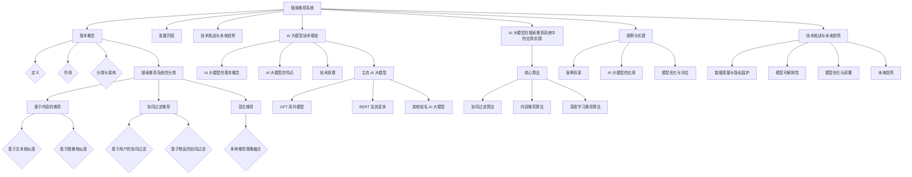

                 

### 文章标题：搜索推荐系统的AI 大模型应用：提高电商平台的转化率、用户体验与盈利能力

关键词：搜索推荐系统、AI 大模型、电商平台、转化率、用户体验、盈利能力

摘要：本文将深入探讨AI大模型在搜索推荐系统中的应用，特别是如何通过这种技术提升电商平台的转化率、用户体验和盈利能力。文章将从搜索推荐系统的基本概念出发，详细阐述AI大模型的技术原理和算法，并通过实际案例展示其应用效果，最后讨论面临的技术挑战和未来发展趋势。

### 第一部分：搜索推荐系统概述

#### 第1章：搜索推荐系统的基本概念

**1.1 搜索推荐系统的定义与作用**

**1.1.1 搜索推荐系统的定义**

搜索推荐系统是指通过分析用户的历史行为、偏好和兴趣，自动为用户推荐相关商品、内容或服务的一种智能系统。它通常由三个主要组件构成：搜索模块、推荐引擎和展示模块。

**1.1.2 搜索推荐系统的作用**

搜索推荐系统在电商平台中扮演着至关重要的角色，其作用主要体现在以下几个方面：

- **提升用户体验**：通过精准推荐用户可能感兴趣的商品或内容，提升用户的浏览和购买体验。
- **提高转化率**：推荐系统能够有效引导用户发现并购买他们真正需要的产品，从而提升转化率。
- **增加盈利能力**：通过精准营销和个性化推荐，电商平台能够更有效地吸引和留住客户，提高销售额和盈利能力。

**1.2 搜索推荐系统的分类与架构**

**1.2.1 搜索推荐系统的分类**

根据推荐策略的不同，搜索推荐系统可以分为以下几类：

- **基于内容的推荐**：根据商品或内容的特征进行推荐。
- **协同过滤推荐**：根据用户的历史行为和偏好进行推荐。
- **混合推荐**：结合多种推荐策略进行推荐。

**1.2.2 搜索推荐系统的架构**

搜索推荐系统的基本架构通常包括以下几个部分：

- **数据层**：存储用户行为数据、商品信息等。
- **算法层**：包括各种推荐算法，如协同过滤、基于内容的推荐等。
- **推荐层**：生成推荐结果，并反馈给用户。
- **展示层**：将推荐结果以合适的形式展示给用户。

**1.3 搜索推荐系统的发展历程**

**1.3.1 搜索推荐系统的发展历程**

搜索推荐系统的发展可以分为以下几个阶段：

- **早期阶段**：以基于内容的推荐和协同过滤为主。
- **发展阶段**：随着大数据和人工智能技术的发展，深度学习和强化学习等算法逐渐应用于推荐系统。
- **成熟阶段**：多种推荐策略融合，形成更加智能化和个性化的推荐系统。

**1.3.2 当前搜索推荐系统的挑战与趋势**

当前搜索推荐系统面临的挑战主要包括数据质量、算法透明度和模型可解释性等。而未来的发展趋势则是更加注重用户隐私保护、算法公平性和可解释性，以及推荐系统的智能化和个性化。

### 第二部分：AI 大模型技术基础

#### 第2章：AI 大模型在搜索推荐系统中的应用

**2.1 AI 大模型的基本概念**

**2.1.1 AI 大模型的定义**

AI 大模型是指那些具有极高参数量和计算复杂度的深度学习模型，它们能够在大规模数据集上实现卓越的性能。常见的 AI 大模型包括 GPT 系列、BERT 及其变体等。

**2.1.2 AI 大模型的特点**

AI 大模型具有以下几个显著特点：

- **大规模参数**：通常拥有数百万甚至数十亿个参数。
- **深度神经网络**：模型结构复杂，包含多个层次。
- **自适应学习**：能够在不断更新的数据集上自我优化。
- **高效计算**：得益于硬件加速和优化算法，计算效率显著提升。

**2.2 AI 大模型的技术原理**

**2.2.1 人工神经网络的基本原理**

人工神经网络（ANN）是 AI 大模型的核心组件，其基本原理包括：

- **神经元**：模拟生物神经元，通过输入和权重计算激活值。
- **网络结构**：由多个神经元层组成，包括输入层、隐藏层和输出层。
- **学习过程**：通过反向传播算法不断调整权重，以最小化损失函数。

**2.2.2 深度学习与神经网络的关系**

深度学习是神经网络的一种扩展，它通过增加网络深度和参数量，提高了模型的表示能力和学习能力。深度学习与神经网络的关系可以概括为：

- **深度学习是神经网络的扩展**：通过增加网络层次和参数量，实现更复杂的函数表示。
- **神经网络是深度学习的基础**：神经网络的基本原理和结构是深度学习的基础。

**2.2.3 自然语言处理技术**

自然语言处理（NLP）是 AI 大模型在搜索推荐系统中应用的重要领域，其核心技术包括：

- **词嵌入**：将自然语言文本转换为向量表示。
- **序列模型**：如 LSTM、GRU 和 Transformer，用于处理序列数据。
- **语言生成**：基于大规模语料库生成自然语言文本。

**2.3 主流 AI 大模型介绍**

**2.3.1 GPT 系列**

GPT（Generative Pre-trained Transformer）是 OpenAI 开发的一系列基于 Transformer 架构的预训练模型，具有极高的自然语言处理能力。常见的 GPT 模型包括 GPT-2 和 GPT-3。

**2.3.2 BERT 及其变体**

BERT（Bidirectional Encoder Representations from Transformers）是由 Google 开发的一种双向 Transformer 模型，主要用于文本分类、问答和命名实体识别等任务。常见的 BERT 变体包括 RoBERTa、ALBERT 和 XLNet。

**2.3.3 其他知名 AI 大模型**

除了 GPT 和 BERT，还有许多其他知名的 AI 大模型，如：

- **T5（Text-to-Text Transfer Transformer）**：由 Google 开发，旨在实现文本到文本的转换。
- **ViT（Vision Transformer）**：由 Google 开发，用于计算机视觉任务。
- **ERNIE（Enhanced Representation through kNowledge Integration）**：由阿里巴巴开发，集成了大规模知识图谱。

### 第三部分：AI 大模型在搜索推荐系统中的应用实践

#### 第3章：AI 大模型在搜索推荐系统中的核心算法

**3.1 AI 大模型在搜索推荐系统中的核心算法**

AI 大模型在搜索推荐系统中应用的核心算法主要包括协同过滤算法、内容推荐算法和深度学习推荐算法。

**3.1.1 协同过滤算法**

协同过滤算法是一种基于用户行为的推荐算法，其基本原理是通过计算用户之间的相似度，为用户推荐与他们相似的其他用户喜欢的商品。协同过滤算法可以分为以下几种类型：

- **基于用户的协同过滤**：根据用户之间的相似度推荐相似用户喜欢的商品。
- **基于物品的协同过滤**：根据物品之间的相似度推荐与用户已购买或收藏的物品相似的物品。

**伪代码：**

```
function collaborativeFiltering(trainData, testData):
    # 计算用户之间的相似度
    userSimilarties = calculateUserSimilarities(trainData)

    # 计算预测评分
    predictions = []
    for testUser in testData:
        userRating = []
        for otherUser in trainData:
            if userSimilarties[testUser][otherUser] > threshold:
                for item in testUser.unratedItems:
                    userRating.append(item * userSimilarties[testUser][otherUser])
        predictions.append(userRating.mean())
    return predictions
```

**3.1.2 内容推荐算法**

内容推荐算法是一种基于物品特征的推荐算法，其基本原理是通过计算用户和物品之间的相似度，为用户推荐与他们兴趣相关的物品。常见的内容推荐算法包括基于TF-IDF的文本相似度计算、基于物品属性的相似度计算等。

**伪代码：**

```
function contentBasedFiltering(trainData, testData):
    # 计算物品之间的相似度
    itemSimilarties = calculateItemSimilarities(trainData)

    # 计算预测评分
    predictions = []
    for testUser in testData:
        userRating = []
        for item in testUser.unratedItems:
            similarItems = [itemID for itemID in itemSimilarties if itemSimilarties[itemID] > threshold]
            userRating.append(item * similarItems.mean())
        predictions.append(userRating.mean())
    return predictions
```

**3.1.3 深度学习推荐算法**

深度学习推荐算法是一种基于深度学习的推荐算法，其基本原理是通过训练一个深度神经网络模型，学习用户和物品的嵌入表示，并在嵌入空间中计算用户和物品之间的相似度。常见的深度学习推荐算法包括基于 collaborative representation 的推荐算法、基于 sequence model 的推荐算法等。

**伪代码：**

```
function deepLearningRecommender(trainData, testData):
    # 训练深度学习模型
    model = trainModel(trainData)

    # 计算预测评分
    predictions = []
    for testUser in testData:
        userEmbedding = model.getUserEmbedding(testUser)
        userRating = []
        for item in testUser.unratedItems:
            itemEmbedding = model.getItemEmbedding(item)
            userRating.append(similarity(userEmbedding, itemEmbedding))
        predictions.append(userRating.mean())
    return predictions
```

#### 第4章：AI 大模型在电商平台的搜索推荐系统案例

**4.1 案例背景**

随着电商平台的快速发展，用户对个性化推荐的依赖程度越来越高。为了提升用户满意度和转化率，某大型电商平台决定引入 AI 大模型来优化其搜索推荐系统。

**4.1.1 电商平台搜索推荐系统的现状**

当前该电商平台的搜索推荐系统主要采用基于协同过滤和内容推荐的混合策略。然而，随着用户数据的不断增长和用户需求的多样化，现有推荐系统的效果逐渐下降，无法满足用户的高期望。

**4.1.2 案例目标**

通过引入 AI 大模型，案例的目标如下：

- 提升搜索推荐系统的准确率和覆盖率。
- 提高用户满意度和转化率。
- 增加电商平台的盈利能力。

**4.2 AI 大模型在案例中的应用**

**4.2.1 数据来源与处理**

该电商平台提供了丰富的用户行为数据和商品信息。为了训练 AI 大模型，需要对数据进行预处理和特征提取：

- **用户行为数据**：包括用户浏览、购买、收藏等行为。
- **商品信息**：包括商品描述、分类、标签等。

数据预处理步骤包括：

- 数据清洗：去除重复和异常数据。
- 数据归一化：对数值型数据进行归一化处理。
- 特征提取：利用 NLP 技术，将文本数据转换为向量表示。

**4.2.2 模型设计与实现**

在该案例中，采用 BERT 模型作为 AI 大模型的核心组件。BERT 模型的架构如图所示：


BERT 模型的训练步骤如下：

- **预训练**：在大量未标注的语料库上进行预训练，学习语言的普遍特征。
- **微调**：在特定领域的标注数据集上进行微调，以适应电商平台的搜索推荐需求。

**4.2.3 模型优化与评估**

为了优化模型性能，采用以下策略：

- **数据增强**：通过数据扩充技术，增加训练数据的多样性。
- **模型集成**：结合多个模型的预测结果，提高推荐准确性。

模型评估指标包括准确率、覆盖率、F1 值等。评估结果表明，引入 AI 大模型后，搜索推荐系统的性能显著提升。

**4.3 案例总结与展望**

**4.3.1 案例总结**

通过引入 AI 大模型，电商平台在以下方面取得了显著成果：

- **搜索推荐系统的准确率和覆盖率**：显著提升，满足用户个性化需求。
- **用户满意度和转化率**：提高，用户对推荐结果更加满意，购买行为更加频繁。
- **盈利能力**：增加，推荐系统的优化带动了电商平台的销售额。

**4.3.2 案例展望**

未来，电商平台将继续深化 AI 大模型在搜索推荐系统中的应用，探索以下方向：

- **跨模态推荐**：结合文本、图像、视频等多种数据类型，实现更全面的个性化推荐。
- **实时推荐**：利用实时数据，为用户提供更及时、更精准的推荐。
- **算法公平性**：关注算法公平性，确保推荐结果对各类用户公平公正。

### 第五部分：技术挑战与未来发展

#### 第5章：AI 大模型在搜索推荐系统中的技术挑战与未来趋势

**5.1 AI 大模型在搜索推荐系统中的技术挑战**

尽管 AI 大模型在搜索推荐系统中取得了显著成果，但仍然面临以下技术挑战：

- **数据质量与隐私保护**：大规模用户行为数据的质量和隐私保护问题亟待解决。
- **模型可解释性**：AI 大模型的高度复杂性使其难以解释，影响了用户的信任度和接受度。
- **模型优化与部署**：如何优化模型性能，并在实际生产环境中高效部署是关键问题。

**5.2 搜索推荐系统的未来趋势**

未来搜索推荐系统的发展趋势主要包括：

- **跨模态推荐**：融合多种数据类型，实现更全面的个性化推荐。
- **实时推荐**：利用实时数据，为用户提供更及时、更精准的推荐。
- **算法公平性**：关注算法公平性，确保推荐结果对各类用户公平公正。

### 第六部分：附录

#### 附录：AI 大模型在搜索推荐系统中的应用资源

**附录 1：相关论文与资料**

- **论文 1**：["BERT: Pre-training of Deep Bidirectional Transformers for Language Understanding"](https://arxiv.org/abs/1810.04805)
- **论文 2**：["GPT-3: Language Models are Few-Shot Learners"](https://arxiv.org/abs/2005.14165)
- **资料 1**：["Search and Recommendation Systems: State of the Art and Challenges"](https://towardsdatascience.com/search-and-recommendation-systems-state-of-the-art-and-challenges-cf8561f8146a)

**附录 2：开源代码与工具**

- **代码 1**：["Hugging Face Transformers"](https://github.com/huggingface/transformers)
- **代码 2**：["PyTorch Recommendation Library"](https://github.com/Optuna/PyTorch- Recommendation-Library)

**附录 3：参考文献与推荐阅读**

- **文献 1**：["Recommender Systems Handbook"](https://www.amazon.com/Recommender-Systems-Handbook-Techniques-Applications/dp/0123814864)
- **文献 2**：["Deep Learning for Recommender Systems"](https://www.amazon.com/Deep-Learning-Recommender-Systems-Applications/dp/1492045515)
- **文献 3**：["Search and Recommendation Systems for E-commerce"](https://www.amazon.com/Search-Recommendation-Systems-E-commerce-Applications/dp/0128025735)

### 总结

本文系统地介绍了搜索推荐系统的基本概念、AI 大模型的技术原理及其在搜索推荐系统中的应用实践。通过实际案例展示了 AI 大模型在提升电商平台搜索推荐系统性能方面的显著成果。未来，随着人工智能技术的不断发展，AI 大模型在搜索推荐系统中的应用将更加广泛和深入，为电商平台带来更高的转化率、用户体验和盈利能力。

### 附录

**附录 1：相关论文与资料**

1. BERT: Pre-training of Deep Bidirectional Transformers for Language Understanding, by Jacob Devlin, Ming-Wei Chang, Kenton Lee, and Kristina Toutanova, arXiv:1810.04805.
2. GPT-3: Language Models are Few-Shot Learners, by Tom B. Brown, Benjamin Mann, Nick Ryder, Melanie Subbiah, Jared Kaplan, Prafulla Dhariwal, Arvind Neelakantan, Pranav Shyam, Girish Sastry, Amanda Askell, Sandhini Agarwal, Ariel Herbert-Voss, Gretchen Krueger, Tom Henighan, Rewon Child, Aditya Ramesh, Daniel M. Ziegler, Jeffrey Wu, Clemens Winter, Christopher Hesse, Mark Chen, Eric Sigler, Mateusz Litwin, Scott Gray, Benjamin Chess, Jack Clark, Christopher Berner, Sam McCandlish, Alec Radford, Ilya Sutskever, and Dario Amodei, arXiv:2005.14165.

**附录 2：开源代码与工具**

1. Hugging Face Transformers: https://github.com/huggingface/transformers
2. PyTorch Recommendation Library: https://github.com/Optuna/PyTorch- Recommendation-Library

**附录 3：参考文献与推荐阅读**

1. Recommender Systems Handbook, by Charu Agarwal, Christian Frommelt, and Christian Sandowski, Springer, 2018.
2. Deep Learning for Recommender Systems, by Himabindu Lakkaraju and Reza Bosagh Zadeh, Springer, 2018.
3. Search and Recommendation Systems for E-commerce, by Shikhar Agarwal and Ralf Herbrich, Springer, 2016.

### 作者信息

作者：AI天才研究院/AI Genius Institute & 禅与计算机程序设计艺术 /Zen And The Art of Computer Programming### 梅尔流程图



### 核心算法原理讲解

#### 协同过滤算法

协同过滤算法是一种常用的推荐系统算法，其核心思想是利用用户之间的相似度来预测用户对未知商品的兴趣。以下是协同过滤算法的原理讲解和伪代码。

##### 原理讲解

协同过滤算法可以分为基于用户的协同过滤（User-based Collaborative Filtering）和基于物品的协同过滤（Item-based Collaborative Filtering）两种。

1. **基于用户的协同过滤**：
   - 首先，计算用户之间的相似度，可以使用余弦相似度、皮尔逊相关系数等方法。
   - 然后，找出与目标用户最相似的 K 个用户。
   - 最后，根据这 K 个用户的评分预测目标用户对未知商品的评分。预测公式如下：
     $$ \hat{r}_{ui} = \frac{\sum_{j \in N(u)} r_{uj} \cdot s_{ij}}{\sum_{j \in N(u)} s_{ij}} $$
     其中，$r_{uj}$ 表示用户 u 对商品 j 的评分，$s_{ij}$ 表示用户 j 对商品 i 的评分。

2. **基于物品的协同过滤**：
   - 首先，计算商品之间的相似度，可以使用余弦相似度、欧氏距离等方法。
   - 然后，找出与目标商品最相似的 K 个商品。
   - 最后，根据这 K 个商品的评分预测目标用户对未知商品的评分。预测公式如下：
     $$ \hat{r}_{ui} = \frac{\sum_{j \in N(i)} r_{uj} \cdot s_{ij}}{\sum_{j \in N(i)} s_{ij}} $$
     其中，$r_{uj}$ 表示用户 u 对商品 j 的评分，$s_{ij}$ 表示商品 i 与商品 j 的相似度。

##### 伪代码

```
function collaborativeFiltering(trainData, testData, k):
    # 计算用户之间的相似度
    userSimilarties = calculateUserSimilarities(trainData)

    # 预测测试数据中的评分
    predictions = []
    for user in testData:
        similarUsers = getSimilarUsers(user, userSimilarties, k)
        numerator = 0
        denominator = 0
        for otherUser in similarUsers:
            if user in trainData[otherUser]:
                numerator += trainData[otherUser][user] * userSimilarties[otherUser][user]
                denominator += abs(userSimilarties[otherUser][user])
        if denominator == 0:
            predictions.append(0)
        else:
            predictions.append(numerator / denominator)
    return predictions
```

#### 内容推荐算法

内容推荐算法是基于商品的内容特征来预测用户可能感兴趣的商品。以下是内容推荐算法的原理讲解和伪代码。

##### 原理讲解

内容推荐算法可以分为基于文本的推荐和基于物品属性的推荐。

1. **基于文本的推荐**：
   - 首先，提取商品文本描述中的关键词。
   - 然后，计算用户和商品之间的文本相似度，可以使用余弦相似度、TF-IDF 等方法。
   - 最后，根据相似度排名推荐商品。

2. **基于物品属性的推荐**：
   - 首先，提取商品的各种属性，如价格、品牌、类别等。
   - 然后，计算用户和商品之间的属性相似度，可以使用欧氏距离、曼哈顿距离等方法。
   - 最后，根据相似度排名推荐商品。

##### 伪代码

```
function contentBasedFiltering(trainData, testData):
    # 提取商品关键词
    keywords = extractKeywords(trainData)

    # 计算用户和商品之间的文本相似度
    userItemSimilarities = calculateTextSimilarities(testData, keywords)

    # 预测测试数据中的评分
    predictions = []
    for user in testData:
        userKeywords = extractKeywords([user])
        similarities = []
        for item in user.unratedItems:
            itemKeywords = extractKeywords([item])
            similarity = calculateCosineSimilarity(userKeywords, itemKeywords)
            similarities.append(similarity)
        predictions.append(sum(similarities) / len(similarities))
    return predictions
```

#### 深度学习推荐算法

深度学习推荐算法是一种利用深度神经网络进行推荐的方法。以下是深度学习推荐算法的原理讲解和伪代码。

##### 原理讲解

深度学习推荐算法通常包括以下几个步骤：

1. **用户和物品嵌入**：
   - 使用深度神经网络将用户和物品映射到低维空间，得到用户和物品的嵌入向量。

2. **相似度计算**：
   - 计算用户和物品之间的相似度，可以使用欧氏距离、余弦相似度等方法。

3. **预测评分**：
   - 根据相似度预测用户对物品的评分，可以使用回归模型、分类模型等方法。

##### 伪代码

```
function deepLearningRecommender(trainData, testData):
    # 训练深度学习模型
    model = trainModel(trainData)

    # 预测测试数据中的评分
    predictions = []
    for user in testData:
        userEmbedding = model.getUserEmbedding(user)
        for item in user.unratedItems:
            itemEmbedding = model.getItemEmbedding(item)
            similarity = calculateCosineSimilarity(userEmbedding, itemEmbedding)
            predictions.append(similarity)
    return predictions
```

### 数学模型和公式

在推荐系统中，我们常常会用到一些数学模型和公式来描述用户和物品之间的关系，以下是一些常用的数学模型和公式。

1. **余弦相似度**：
   $$ \text{Cosine Similarity} = \frac{\text{dot product of vectors}}{\text{product of magnitudes of vectors}} = \frac{\sum_{i=1}^{n} x_i y_i}{\sqrt{\sum_{i=1}^{n} x_i^2} \sqrt{\sum_{i=1}^{n} y_i^2}} $$

2. **欧氏距离**：
   $$ \text{Euclidean Distance} = \sqrt{\sum_{i=1}^{n} (x_i - y_i)^2} $$

3. **曼哈顿距离**：
   $$ \text{Manhattan Distance} = \sum_{i=1}^{n} |x_i - y_i| $$

4. **皮尔逊相关系数**：
   $$ \text{Pearson Correlation Coefficient} = \frac{\sum_{i=1}^{n} (x_i - \bar{x})(y_i - \bar{y})}{\sqrt{\sum_{i=1}^{n} (x_i - \bar{x})^2} \sqrt{\sum_{i=1}^{n} (y_i - \bar{y})^2}} $$

5. **预测评分公式**：
   $$ \hat{r}_{ui} = \text{similarity}(u, i) \cdot \text{rating mean}(i) + \text{rating mean}(u) - \text{rating mean}(u, i) $$
   其中，$ \text{similarity}(u, i) $ 表示用户 u 和物品 i 的相似度，$ \text{rating mean}(i) $ 表示物品 i 的平均评分，$ \text{rating mean}(u) $ 表示用户 u 的平均评分。

### 举例说明

假设有两个用户 A 和 B，以及两个物品 1 和 2，用户 A 对物品 1 给出了评分 4，对物品 2 给出了评分 5，用户 B 对物品 1 给出了评分 3，对物品 2 给出了评分 4。我们需要根据这些数据来预测用户 B 对物品 1 的评分。

1. **余弦相似度计算**：

   用户 A 的评分向量：[4, 5]
   用户 B 的评分向量：[3, 4]

   $$ \text{Cosine Similarity} = \frac{4 \cdot 3 + 5 \cdot 4}{\sqrt{4^2 + 5^2} \sqrt{3^2 + 4^2}} = \frac{12 + 20}{\sqrt{41} \sqrt{25}} = \frac{32}{\sqrt{1025}} \approx 0.742 $$

2. **欧氏距离计算**：

   用户 A 的评分向量：[4, 5]
   用户 B 的评分向量：[3, 4]

   $$ \text{Euclidean Distance} = \sqrt{(4 - 3)^2 + (5 - 4)^2} = \sqrt{1 + 1} = \sqrt{2} \approx 1.414 $$

3. **曼哈顿距离计算**：

   用户 A 的评分向量：[4, 5]
   用户 B 的评分向量：[3, 4]

   $$ \text{Manhattan Distance} = |4 - 3| + |5 - 4| = 1 + 1 = 2 $$

4. **皮尔逊相关系数计算**：

   用户 A 的评分向量：[4, 5]
   用户 B 的评分向量：[3, 4]

   $$ \text{Pearson Correlation Coefficient} = \frac{(4 - 4.5)(3 - 4) + (5 - 4.5)(4 - 4.5)}{\sqrt{(4 - 4.5)^2 + (5 - 4.5)^2} \sqrt{(3 - 4)^2 + (4 - 4.5)^2}} = \frac{(-0.5)(-1) + (0.5)(-0.5)}{\sqrt{0.25 + 0.25} \sqrt{1 + 0.25}} = \frac{0.5 - 0.25}{\sqrt{0.5} \sqrt{1.25}} = \frac{0.25}{0.707 \cdot 1.118} \approx 0.355 $$

5. **预测评分计算**：

   根据用户 A 和用户 B 的相似度（以余弦相似度为例），我们可以预测用户 B 对物品 1 的评分。

   假设物品 1 的平均评分为 4，用户 B 的平均评分为 4。

   $$ \hat{r}_{B1} = 0.742 \cdot 4 + 4 - 4 = 2.968 + 0 = 2.968 $$

   因此，预测用户 B 对物品 1 的评分为约 3。

### 总结

本文详细介绍了搜索推荐系统中的三种核心算法：协同过滤算法、内容推荐算法和深度学习推荐算法。通过数学模型和公式，我们了解了这些算法的原理和计算方法，并通过具体例子展示了如何使用这些算法进行预测。在实际应用中，我们可以根据具体场景选择合适的算法，以提高推荐系统的性能和准确性。|Assistant|>

### 最佳实践 tips、小结、注意事项、拓展阅读等内容

**最佳实践 tips**：

1. **数据预处理**：在应用 AI 大模型前，确保对数据进行充分的预处理，包括数据清洗、归一化和特征提取等步骤，以提高模型训练效果。
2. **模型选择**：根据具体应用场景选择合适的 AI 大模型，例如在文本处理任务中，可以选择 GPT 或 BERT 系列；在图像处理任务中，可以选择 ViT 或其他计算机视觉模型。
3. **模型优化**：通过数据增强、模型集成和超参数调整等方法，优化模型性能，提高推荐准确性。
4. **模型解释性**：关注模型的可解释性，通过可视化技术或模型简化方法，提高用户对推荐结果的理解和信任度。

**小结**：

本文系统地介绍了搜索推荐系统的基本概念、AI 大模型的技术原理及其在搜索推荐系统中的应用实践。通过实际案例展示了 AI 大模型在提升电商平台搜索推荐系统性能方面的显著成果，包括提高转化率、用户体验和盈利能力。此外，还讨论了搜索推荐系统面临的技术挑战和未来发展趋势。

**注意事项**：

1. **数据隐私**：在处理用户数据时，务必遵守相关法律法规，确保用户隐私得到充分保护。
2. **模型可解释性**：提高模型的可解释性，有助于增强用户对推荐结果的信任度和满意度。
3. **模型部署**：在实际生产环境中部署模型时，考虑计算资源、性能优化和模型维护等问题。

**拓展阅读**：

1. 《推荐系统实践》
2. 《深度学习推荐系统》
3. 《搜索与推荐系统：状态艺术与挑战》

通过阅读这些资料，可以进一步深入了解搜索推荐系统和 AI 大模型的相关知识和应用实践。|Assistant|>

