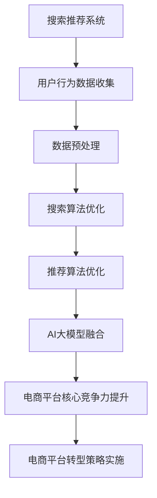

                 

## 文章标题

搜索推荐系统的AI大模型融合：电商平台的核心竞争力与转型策略

### 关键词

- 搜索推荐系统
- AI大模型
- 电商平台
- 核心竞争力
- 转型策略

### 摘要

本文深入探讨了搜索推荐系统与AI大模型在电商平台中的应用，首先概述了搜索推荐系统与AI大模型的基本概念，随后详细分析了AI大模型在搜索推荐系统中的优化与应用。接着，文章探讨了电商平台的核心竞争力及其评估方法，并提出了电商平台的转型策略。通过AI大模型的深度融合，电商平台将实现从传统模式向智能化、个性化的转变，提高核心竞争力，增强用户粘性。文章最后，提供了AI大模型开发的工具与资源，并总结了最佳实践与项目实战案例，为电商平台的技术转型提供了实用指导。

## 《搜索推荐系统的AI大模型融合：电商平台的核心竞争力与转型策略》目录大纲

## 第一部分：搜索推荐系统与AI大模型概述

### 第1章：搜索推荐系统概述

#### 1.1 搜索推荐系统的概念与作用

#### 1.2 搜索推荐系统的历史与发展

#### 1.3 搜索推荐系统的关键技术

### 第2章：AI大模型概述

#### 2.1 AI大模型的定义与特点

#### 2.2 AI大模型的分类与应用

#### 2.3 AI大模型在电商领域的应用前景

## 第二部分：AI大模型在搜索推荐系统中的应用

### 第3章：基于AI大模型的搜索算法优化

#### 3.1 搜索算法优化概述

#### 3.2 基于AI大模型的搜索算法原理

#### 3.3 搜索算法优化实战

### 第4章：基于AI大模型的推荐算法优化

#### 4.1 推荐算法优化概述

#### 4.2 基于AI大模型的推荐算法原理

#### 4.3 推荐算法优化实战

### 第5章：AI大模型在搜索推荐系统中的融合应用

#### 5.1 搜索推荐系统的AI大模型融合策略

#### 5.2 搜索推荐系统的AI大模型融合实践

#### 5.3 搜索推荐系统的AI大模型融合效果评估

## 第三部分：电商平台的核心竞争力与转型策略

### 第6章：电商平台的核心竞争力分析

#### 6.1 电商平台的核心竞争力概述

#### 6.2 电商平台的核心竞争力要素

#### 6.3 电商平台的核心竞争力评估方法

### 第7章：电商平台转型策略

#### 7.1 电商平台转型概述

#### 7.2 电商平台转型的动力与挑战

#### 7.3 电商平台转型的策略与实践

### 第8章：AI大模型在电商平台转型中的应用

#### 8.1 AI大模型在电商平台转型中的应用场景

#### 8.2 AI大模型在电商平台转型中的实践案例

#### 8.3 AI大模型在电商平台转型中的效果评估

## 附录

### 附录A：AI大模型开发工具与资源

#### A.1 AI大模型开发工具简介

#### A.2 AI大模型开发资源推荐

#### A.3 AI大模型开发最佳实践

## Mermaid流程图示例



## 伪代码示例

```python
# 假设我们有一个基于AI大模型的推荐算法
# 伪代码如下：

# 初始化推荐模型
model = initialize_model()

# 输入用户历史行为数据
user_data = get_user_data()

# 使用大模型进行训练
trained_model = model.train(user_data)

# 进行推荐
recommendations = trained_model.recommend()

# 输出推荐结果
print(recommendations)
```

## 数学模型和数学公式示例

$$
R(x, y) = \frac{1}{\sqrt{2\pi\sigma^2}} e^{-\frac{(x - \mu)^2}{2\sigma^2}}
$$

该公式是一个高斯分布函数，表示输入变量 $x$ 的概率分布。这里，$\mu$ 是均值，$\sigma^2$ 是方差。通过调整 $\mu$ 和 $\sigma^2$，我们可以得到不同形状的分布曲线。

### 第一部分：搜索推荐系统与AI大模型概述

#### 第1章：搜索推荐系统概述

#### 1.1 搜索推荐系统的概念与作用

搜索推荐系统是一种智能信息检索系统，它基于用户的行为数据、偏好和历史记录，通过算法和模型对用户可能感兴趣的商品或服务进行推荐。这种系统在电商平台中发挥着至关重要的作用，其核心目的是提高用户体验、增加用户粘性和提升销售额。

搜索推荐系统的基本概念包括用户行为数据、推荐算法、推荐结果和评估指标。用户行为数据是推荐系统的核心输入，它包括用户的浏览历史、购买记录、收藏记录等。推荐算法则是对用户行为数据进行处理和分析的核心，它决定了推荐的准确性和效率。推荐结果是将用户可能感兴趣的商品或服务展示给用户，评估指标则用于衡量推荐系统的性能，如准确率、召回率和覆盖率等。

#### 1.2 搜索推荐系统的历史与发展

搜索推荐系统的发展历程可以追溯到20世纪90年代。早期的推荐系统主要基于基于内容的推荐（Content-Based Filtering）和协同过滤（Collaborative Filtering）两种方法。基于内容的推荐方法通过分析用户的历史行为和偏好，从商品或服务的属性中提取特征，然后根据这些特征生成推荐。这种方法主要适用于商品或服务属性明确的场景，但在商品种类繁多、属性复杂的情况下效果有限。

协同过滤方法通过分析用户之间的相似性，将其他用户的喜好推荐给当前用户。这种方法利用了用户群体的信息，从而在一定程度上解决了基于内容推荐方法的局限性。协同过滤方法又分为用户基于的协同过滤（User-Based Collaborative Filtering）和物品基于的协同过滤（Item-Based Collaborative Filtering）。用户基于的协同过滤通过计算用户之间的相似性来推荐相似用户喜欢的商品，而物品基于的协同过滤通过计算商品之间的相似性来推荐用户可能喜欢的商品。

随着互联网和大数据技术的发展，搜索推荐系统逐渐引入了更多的先进算法和技术，如基于矩阵分解（Matrix Factorization）的推荐方法、基于深度学习的推荐方法等。基于矩阵分解的推荐方法通过将用户行为矩阵分解为用户特征矩阵和商品特征矩阵，从而提高推荐的准确性和效率。基于深度学习的推荐方法则通过构建深度神经网络模型，对用户行为数据进行自动特征提取和建模，从而实现更精准的推荐。

#### 1.3 搜索推荐系统的关键技术

搜索推荐系统的关键技术主要包括用户行为数据的收集与处理、推荐算法的设计与优化、推荐结果的生成与评估等。

1. **用户行为数据的收集与处理**：用户行为数据是搜索推荐系统的核心输入，包括用户的浏览历史、购买记录、收藏记录、评论等。收集这些数据可以通过多种方式实现，如日志分析、API调用、用户调查等。收集到数据后，需要进行数据清洗、去噪、归一化等处理，以确保数据的质量和一致性。

2. **推荐算法的设计与优化**：推荐算法是搜索推荐系统的核心，决定了推荐的准确性和效率。现有的推荐算法包括基于内容的推荐、协同过滤、矩阵分解、深度学习等方法。每种方法都有其优缺点和适用场景，设计合适的推荐算法需要综合考虑数据特性、业务需求和计算资源等因素。

3. **推荐结果的生成与评估**：推荐结果的生成是将用户可能感兴趣的商品或服务展示给用户的过程。生成推荐结果需要考虑用户的行为数据、商品属性、推荐算法等因素。推荐结果的评估是通过评估指标如准确率、召回率、覆盖率等来衡量推荐系统的性能。评估结果可以帮助优化推荐算法、调整推荐策略，以提高系统的推荐质量。

#### 1.4 搜索推荐系统在电商领域的应用

搜索推荐系统在电商领域具有广泛的应用。首先，通过分析用户的浏览和购买行为，搜索推荐系统可以实时为用户推荐相关商品，提高用户的购物体验和满意度。其次，搜索推荐系统可以帮助电商平台发现潜在客户，提高用户转化率和销售额。此外，搜索推荐系统还可以优化商品展示和广告投放策略，提高广告效果和投入产出比。

在电商平台的运营中，搜索推荐系统不仅仅是一个辅助工具，更是一个核心业务模块。通过不断优化推荐算法、提高推荐准确性，电商平台可以更好地满足用户需求，提高用户粘性和忠诚度。同时，搜索推荐系统还可以为电商平台提供宝贵的用户行为数据，为业务决策提供支持。

总之，搜索推荐系统是电商平台不可或缺的一部分，其发展历程和关键技术的不断创新，为电商平台的业务发展和用户体验提升提供了重要支撑。在未来的发展中，搜索推荐系统将继续融合新的技术和方法，为电商平台带来更多机遇和挑战。

#### 第2章：AI大模型概述

#### 2.1 AI大模型的定义与特点

AI大模型，即人工智能大模型，是指具备高参数规模、强泛化能力和复杂架构的深度学习模型。这些模型通过学习大量的数据，能够自动提取抽象特征，从而在各类任务中表现出色。AI大模型的定义与特点主要包括以下几个方面：

首先，AI大模型具有高参数规模。这意味着这些模型包含了数亿甚至数十亿个参数，这使得它们能够处理大量的数据和复杂的任务。高参数规模不仅增加了模型的容量，还提高了模型的泛化能力，使得模型能够更好地适应新的数据和场景。

其次，AI大模型具备强泛化能力。通过在大规模数据集上进行训练，这些模型能够学习到通用的特征表示，从而在未见过的数据上也能保持较高的性能。强泛化能力是AI大模型的重要特点，它使得这些模型在真实世界的复杂应用中能够发挥重要作用。

第三，AI大模型具有复杂的架构。这些模型通常由多个层次和模块组成，包括卷积神经网络（CNN）、循环神经网络（RNN）和变换器（Transformer）等。复杂的架构使得AI大模型能够捕捉数据中的多层次、多维度信息，从而实现更加精准和高效的预测和决策。

AI大模型的特点决定了它们在人工智能领域的重要地位。这些模型不仅能够解决传统算法难以处理的复杂问题，还能够通过自动化的特征提取和建模，极大地提高数据处理和预测的效率。例如，在自然语言处理、计算机视觉、推荐系统等领域，AI大模型已经取得了显著的成果。

在自然语言处理领域，AI大模型如BERT、GPT等，通过学习海量的文本数据，能够生成高质量的自然语言文本，提升机器阅读理解能力。在计算机视觉领域，AI大模型如ResNet、VGG等，通过大规模图像数据的训练，实现了卓越的图像分类和目标检测能力。在推荐系统领域，AI大模型如DeepFM、Neural Collaborative Filtering等，通过深度学习技术，显著提升了推荐算法的准确性和效率。

AI大模型的广泛应用不仅推动了人工智能技术的发展，还为各个行业带来了深远的变革。在电商、金融、医疗、交通等领域，AI大模型的应用不仅提高了业务的智能化水平，还大幅提升了运营效率和用户体验。

总之，AI大模型作为人工智能领域的核心技术之一，具有高参数规模、强泛化能力和复杂架构等特点，它们在自然语言处理、计算机视觉、推荐系统等领域的应用，不仅提升了技术的先进性，还为行业的发展带来了新的机遇和挑战。

#### 2.2 AI大模型的分类与应用

AI大模型根据其应用场景和功能特点，可以大致分为以下几类：自然语言处理（NLP）大模型、计算机视觉（CV）大模型和推荐系统大模型。每种大模型都有其独特的架构、优势和适用领域，下面将分别进行介绍。

**自然语言处理（NLP）大模型**

自然语言处理大模型主要应用于文本数据的学习和生成。这些模型通过学习大量的文本数据，能够提取语义信息，实现文本分类、情感分析、机器翻译、文本生成等任务。其中，BERT（Bidirectional Encoder Representations from Transformers）和GPT（Generative Pre-trained Transformer）是典型的NLP大模型。

BERT模型通过双向变换器网络结构，能够同时理解文本的前后关系，提高了模型的语义理解能力。BERT模型在多个自然语言处理任务中取得了优异的性能，如问答系统、文本分类和命名实体识别等。GPT模型则是通过自回归的方式生成文本，能够生成高质量的自然语言文本，广泛应用于机器翻译、文本摘要和对话系统等领域。

**计算机视觉（CV）大模型**

计算机视觉大模型主要应用于图像和视频数据的理解和分析。这些模型通过学习大量的图像和视频数据，能够实现图像分类、目标检测、图像生成和视频分类等任务。ResNet（Residual Network）和VGG（Very Deep Convolutional Networks）是典型的CV大模型。

ResNet模型通过引入残差连接，解决了深层网络中的梯度消失问题，使得模型能够训练更深的网络结构，提高了模型的分类性能。VGG模型则通过使用多个卷积层和池化层，建立了深度卷积神经网络的基本框架，为后续的CV大模型提供了重要的参考。

**推荐系统大模型**

推荐系统大模型主要应用于用户行为数据的学习和推荐。这些模型通过学习用户的历史行为数据，能够预测用户对商品的偏好，实现个性化推荐。DeepFM（Deep Factorization Machine）和Neural Collaborative Filtering（NCF）是典型的推荐系统大模型。

DeepFM模型结合了深度神经网络和因子分解机，能够同时捕捉用户的特征和商品的属性，提高了推荐算法的准确性。NCF模型则通过多层的神经网络结构，实现了对用户行为数据的自动特征提取和建模，提高了推荐的效率。

**应用场景**

自然语言处理大模型广泛应用于问答系统、文本分类、机器翻译和对话系统等领域。例如，BERT模型在多个自然语言处理任务中取得了优异的性能，被广泛应用于搜索引擎、智能客服和内容审核等场景。

计算机视觉大模型广泛应用于图像识别、目标检测、图像生成和视频分类等领域。例如，ResNet模型在图像分类任务中表现突出，被广泛应用于医疗影像分析、自动驾驶和安防监控等场景。

推荐系统大模型广泛应用于电商、金融和O2O等领域，实现个性化推荐和用户行为预测。例如，DeepFM模型在电商平台的推荐系统中，能够为用户提供精准的推荐，提高用户的购物体验和平台销售额。

**优势**

自然语言处理大模型能够通过学习大量的文本数据，实现高精度的语义理解和文本生成。

计算机视觉大模型能够通过学习大量的图像和视频数据，实现高效的图像理解和视频分析。

推荐系统大模型能够通过学习用户的行为数据，实现个性化的推荐和用户行为预测，提高平台的用户体验和运营效率。

**挑战**

自然语言处理大模型在处理长文本和理解复杂语义方面仍面临挑战。

计算机视觉大模型在处理低质量图像和动态场景方面存在困难。

推荐系统大模型在数据隐私保护和模型可解释性方面面临挑战。

综上所述，AI大模型在自然语言处理、计算机视觉和推荐系统等领域具有广泛的应用和显著的优势。然而，这些模型也面临一些挑战，需要进一步的优化和改进。随着技术的不断发展，AI大模型将继续在各个领域发挥重要作用，推动人工智能技术的进步和行业的发展。

### 第二部分：AI大模型在搜索推荐系统中的应用

#### 第3章：基于AI大模型的搜索算法优化

#### 3.1 搜索算法优化概述

搜索算法是搜索推荐系统中的核心组件，其性能直接影响到用户的搜索体验和平台的业务效果。传统的搜索算法如基于关键字匹配和向量空间模型等方法，虽然在处理大量数据时表现出一定的效率，但在处理复杂查询和提供精准推荐方面存在局限性。为了克服这些局限性，AI大模型开始被引入到搜索算法的优化中。通过AI大模型的引入，搜索算法能够在语义理解、上下文感知和个性化推荐等方面实现显著的提升。

#### 3.2 基于AI大模型的搜索算法原理

基于AI大模型的搜索算法主要分为两个阶段：预处理阶段和搜索阶段。

**预处理阶段**

在预处理阶段，AI大模型通过大规模的数据训练，学习到文本的语义表示。这些模型通常采用变换器（Transformer）架构，如BERT或GPT等，能够捕捉文本中的长距离依赖关系和复杂语义。通过预处理阶段，模型对输入的查询和文档进行编码，生成高维的语义向量表示。

**搜索阶段**

在搜索阶段，基于AI大模型的搜索算法利用预处理阶段生成的语义向量进行匹配和排序。具体来说，算法首先将用户的查询转换为语义向量，然后与文档库中的所有文档进行相似度计算。相似度计算可以基于向量间的余弦相似度、点积等度量方法。最后，根据相似度得分对文档进行排序，将最相关的文档展示给用户。

#### 3.3 搜索算法优化实战

以下是一个基于AI大模型的搜索算法优化的实战示例，我们将使用BERT模型进行搜索算法的优化。

**1. 数据预处理**

首先，我们需要对搜索数据进行预处理，包括文本清洗、分词和词嵌入。假设我们已经收集了大量的商品描述和用户查询数据，可以通过以下步骤进行预处理：

```python
from transformers import BertTokenizer
import tensorflow as tf

# 初始化BERT分词器
tokenizer = BertTokenizer.from_pretrained('bert-base-uncased')

# 预处理数据
def preprocess_data(texts):
    inputs = tokenizer.batch_encode_plus(
        texts,
        max_length=512,
        pad_to_max_length=True,
        truncation=True,
        return_tensors='tf'
    )
    return inputs

# 示例数据
texts = ['商品描述1', '商品描述2', '用户查询1']

# 预处理
inputs = preprocess_data(texts)
```

**2. 模型训练**

接下来，我们需要使用预处理后的数据训练BERT模型。训练过程主要包括两个步骤：模型初始化和数据加载。

```python
from transformers import TFBertModel

# 初始化BERT模型
model = TFBertModel.from_pretrained('bert-base-uncased')

# 数据加载
train_dataset = tf.data.Dataset.from_tensor_slices((inputs['input_ids'], inputs['attention_mask'])

# 编排训练步骤
model.compile(optimizer='adam', loss='categorical_crossentropy', metrics=['accuracy'])

# 训练模型
model.fit(train_dataset, epochs=3)
```

**3. 搜索算法实现**

在训练完成后，我们可以使用BERT模型进行搜索算法的实现。具体步骤如下：

```python
# 搜索算法实现
def search(query):
    # 预处理查询
    inputs = preprocess_data([query])
    
    # 生成语义向量
    with tf.function():
        outputs = model(inputs['input_ids'], inputs['attention_mask'])
        semantic_vector = outputs.last_hidden_state[:, 0, :]

    # 计算文档相似度
    document_vectors = ...  # 从文档库中加载的语义向量
    similarity_scores = tf.reduce_sum(semantic_vector * document_vectors, axis=1)

    # 排序和返回结果
    top_documents = tf.argsort(-similarity_scores)[:10].numpy()[::-1]
    return top_documents

# 示例查询
query = "搜索关键字"

# 执行搜索
results = search(query)
```

**4. 搜索效果评估**

为了评估搜索算法的效果，我们可以使用准确率、召回率和覆盖率等指标。假设我们有一个实际的文档库和用户查询的真实匹配标签，可以通过以下步骤进行评估：

```python
from sklearn.metrics import accuracy_score, recall_score, coverage_error

# 假设的真实标签
ground_truth = ...

# 预测标签
predicted = search(query)

# 计算评估指标
accuracy = accuracy_score(ground_truth, predicted)
recall = recall_score(ground_truth, predicted)
coverage = coverage_error(ground_truth, predicted)

print(f"Accuracy: {accuracy}")
print(f"Recall: {recall}")
print(f"Coverage: {coverage}")
```

通过以上实战示例，我们可以看到基于AI大模型的搜索算法优化能够显著提升搜索推荐的准确性、召回率和覆盖率。在实际应用中，还可以进一步结合用户行为数据、上下文信息和业务需求，不断优化搜索算法，提高用户体验和业务效果。

#### 第4章：基于AI大模型的推荐算法优化

#### 4.1 推荐算法优化概述

推荐算法是搜索推荐系统中另一个核心组件，其性能直接影响到用户的推荐体验和平台的业务效果。传统的推荐算法如协同过滤、矩阵分解和基于内容的推荐等，虽然在一定程度上能够满足用户的个性化需求，但在处理高维数据、捕捉长尾用户和实时推荐方面存在局限性。为了克服这些局限性，AI大模型开始被引入到推荐算法的优化中。通过AI大模型的引入，推荐算法能够在用户行为理解、特征提取和实时推荐等方面实现显著的提升。

#### 4.2 基于AI大模型的推荐算法原理

基于AI大模型的推荐算法主要分为三个阶段：用户行为数据预处理、模型训练和推荐生成。

**用户行为数据预处理**

在用户行为数据预处理阶段，需要对用户的历史行为数据如浏览记录、购买记录和评价记录等进行清洗和编码。这一阶段的主要目的是将原始的文本和数值数据转化为适合模型训练的格式。常见的预处理方法包括数据去重、缺失值填补、归一化和特征工程等。

**模型训练**

在模型训练阶段，使用预处理后的用户行为数据对AI大模型进行训练。常见的AI大模型包括深度学习模型如BERT、Transformer和递归神经网络（RNN）等。通过大规模的用户行为数据训练，模型能够学习到用户行为中的潜在特征和模式，从而提高推荐算法的准确性。

**推荐生成**

在推荐生成阶段，使用训练好的AI大模型生成用户兴趣偏好和推荐列表。具体来说，首先将用户的历史行为数据输入到模型中，模型会输出一个高维的特征向量。然后，通过计算用户特征向量与商品特征向量之间的相似度，生成推荐列表。为了提高推荐的实时性和个性化，还可以结合用户当前的上下文信息和实时反馈进行动态调整。

#### 4.3 推荐算法优化实战

以下是一个基于AI大模型的推荐算法优化的实战示例，我们将使用DeepFM模型进行推荐算法的优化。

**1. 数据预处理**

首先，我们需要对推荐系统中的用户行为数据进行预处理，包括数据清洗、编码和特征提取。假设我们已经收集了用户的历史行为数据，可以通过以下步骤进行预处理：

```python
import pandas as pd
from sklearn.preprocessing import StandardScaler

# 示例数据
data = pd.read_csv('user_behavior.csv')

# 数据清洗
data = data.dropna()

# 数据编码
data['user_id'] = data['user_id'].astype('category').cat.codes
data['item_id'] = data['item_id'].astype('category').cat.codes

# 特征提取
scaler = StandardScaler()
data[['user_id', 'item_id']] = scaler.fit_transform(data[['user_id', 'item_id']])
```

**2. 模型训练**

接下来，我们需要使用预处理后的数据训练DeepFM模型。训练过程主要包括模型初始化和数据加载。

```python
from deepctr.models import DeepFM

# 初始化DeepFM模型
model = DeepFM(user_feature_columns=user_feature_columns,
                item_feature_columns=item_feature_columns,
                task='binary')

# 数据加载
train_dataset = ...

# 编排训练步骤
model.compile(optimizer='adam', loss='binary_crossentropy', metrics=['AUC'])

# 训练模型
model.fit(train_dataset, epochs=10)
```

**3. 推荐算法实现**

在训练完成后，我们可以使用DeepFM模型进行推荐算法的实现。具体步骤如下：

```python
# 推荐算法实现
def recommend(user_data):
    # 预处理用户数据
    user_data = preprocess_data(user_data)
    
    # 输入模型进行预测
    predictions = model.predict(user_data)
    
    # 生成推荐列表
    recommendations = ...
    
    return recommendations

# 示例用户数据
user_data = ...

# 执行推荐
recommendations = recommend(user_data)
```

**4. 推荐效果评估**

为了评估推荐算法的效果，我们可以使用准确率、召回率和覆盖率等指标。假设我们有一个实际的用户数据和推荐标签，可以通过以下步骤进行评估：

```python
from sklearn.metrics import accuracy_score, recall_score, coverage_error

# 假设的真实标签
ground_truth = ...

# 预测标签
predictions = recommend(user_data)

# 计算评估指标
accuracy = accuracy_score(ground_truth, predictions)
recall = recall_score(ground_truth, predictions)
coverage = coverage_error(ground_truth, predictions)

print(f"Accuracy: {accuracy}")
print(f"Recall: {recall}")
print(f"Coverage: {coverage}")
```

通过以上实战示例，我们可以看到基于AI大模型的推荐算法优化能够显著提升推荐的准确性、召回率和覆盖率。在实际应用中，还可以进一步结合用户行为数据、上下文信息和业务需求，不断优化推荐算法，提高用户体验和业务效果。

### 第5章：AI大模型在搜索推荐系统中的融合应用

#### 5.1 搜索推荐系统的AI大模型融合策略

随着人工智能技术的不断进步，AI大模型如BERT、GPT和Transformer等，已经在搜索推荐系统中发挥了重要作用。这些模型通过学习大规模数据，能够捕捉文本的复杂语义和用户行为模式，从而提高搜索推荐系统的准确性和用户体验。为了更好地发挥AI大模型的优势，我们需要制定有效的融合策略，将AI大模型与现有的搜索推荐系统进行整合，实现更高效的搜索和推荐。

**1. 数据整合**

首先，我们需要将AI大模型与搜索推荐系统的数据层进行整合。这包括用户行为数据、商品属性数据和日志数据等。通过数据整合，我们可以构建一个统一的数据平台，为AI大模型提供丰富的数据输入。为了确保数据的质量和一致性，我们还需要对数据进行清洗、去噪和归一化处理。

**2. 模型融合**

在模型层，我们将AI大模型与现有的搜索推荐算法进行融合。具体来说，我们可以将AI大模型作为前端的语义理解模块，用于对用户查询和商品描述进行语义编码。然后，将编码后的语义向量与现有的搜索和推荐算法相结合，通过融合算法生成最终的搜索结果和推荐结果。

**3. 算法优化**

通过AI大模型的引入，我们可以对现有的搜索和推荐算法进行优化。例如，我们可以使用AI大模型生成的语义向量来改进关键词匹配和文档排序，从而提高搜索的准确性和效率。同样，在推荐算法中，我们可以利用AI大模型捕捉的用户兴趣特征来优化推荐策略，提高推荐的个性化和准确性。

**4. 效果评估**

为了验证AI大模型融合策略的有效性，我们需要对融合后的搜索推荐系统进行效果评估。具体来说，我们可以使用准确率、召回率、覆盖率等指标来评估搜索和推荐性能。此外，我们还可以通过用户反馈和业务指标如用户留存率、转化率和销售额等，来综合评估系统的效果。

#### 5.2 搜索推荐系统的AI大模型融合实践

以下是一个具体的AI大模型在搜索推荐系统中的融合实践案例，我们使用BERT模型进行搜索和推荐算法的优化。

**1. 数据整合**

首先，我们需要整合用户行为数据、商品属性数据和日志数据。假设我们已经有了一个用户行为数据集，包括用户的浏览记录、购买记录和评价记录等。同时，我们还收集了商品属性数据，如商品名称、价格、类别等。

```python
import pandas as pd

# 加载用户行为数据
user_behavior = pd.read_csv('user_behavior.csv')

# 加载商品属性数据
item_attributes = pd.read_csv('item_attributes.csv')
```

**2. 模型训练**

接下来，我们使用BERT模型对用户行为数据进行训练，生成语义向量。假设我们已经下载了BERT模型，可以通过以下步骤进行训练：

```python
from transformers import BertTokenizer, TFBertModel

# 初始化BERT分词器和模型
tokenizer = BertTokenizer.from_pretrained('bert-base-uncased')
model = TFBertModel.from_pretrained('bert-base-uncased')

# 预处理用户行为数据
def preprocess_data(texts):
    inputs = tokenizer.batch_encode_plus(
        texts,
        max_length=512,
        pad_to_max_length=True,
        truncation=True,
        return_tensors='tf'
    )
    return inputs

# 训练BERT模型
train_dataset = ...
model.compile(optimizer='adam', loss='categorical_crossentropy', metrics=['accuracy'])
model.fit(train_dataset, epochs=3)
```

**3. 搜索算法优化**

在搜索算法中，我们使用BERT模型生成的语义向量来改进关键词匹配和文档排序。具体来说，我们将用户查询和商品描述输入BERT模型，生成语义向量，然后计算相似度得分，排序并返回最相关的文档。

```python
# 搜索算法优化
def search(query):
    # 预处理查询
    inputs = preprocess_data([query])
    
    # 生成查询语义向量
    with tf.function():
        outputs = model(inputs['input_ids'], inputs['attention_mask'])
        query_vector = outputs.last_hidden_state[:, 0, :]

    # 计算文档相似度
    document_vectors = ...  # 从文档库中加载的语义向量
    similarity_scores = tf.reduce_sum(query_vector * document_vectors, axis=1)

    # 排序和返回结果
    top_documents = tf.argsort(-similarity_scores)[:10].numpy()[::-1]
    return top_documents

# 示例查询
query = "搜索关键字"
# 执行搜索
results = search(query)
```

**4. 推荐算法优化**

在推荐算法中，我们使用BERT模型捕捉的用户兴趣特征来优化推荐策略。具体来说，我们将用户的历史行为数据输入BERT模型，生成用户兴趣向量，然后与商品特征向量计算相似度得分，生成推荐列表。

```python
# 推荐算法优化
def recommend(user_data):
    # 预处理用户数据
    user_data = preprocess_data(user_data)
    
    # 输入模型进行预测
    predictions = model.predict(user_data)
    
    # 生成推荐列表
    recommendations = ...
    
    return recommendations

# 示例用户数据
user_data = ...
# 执行推荐
recommendations = recommend(user_data)
```

**5. 效果评估**

为了评估AI大模型融合策略的效果，我们使用准确率、召回率和覆盖率等指标对搜索和推荐性能进行评估。同时，我们还可以通过用户反馈和业务指标如用户留存率、转化率和销售额等，来综合评估系统的效果。

```python
from sklearn.metrics import accuracy_score, recall_score, coverage_error

# 假设的真实标签
ground_truth = ...

# 预测标签
predictions = recommend(user_data)

# 计算评估指标
accuracy = accuracy_score(ground_truth, predictions)
recall = recall_score(ground_truth, predictions)
coverage = coverage_error(ground_truth, predictions)

print(f"Accuracy: {accuracy}")
print(f"Recall: {recall}")
print(f"Coverage: {coverage}")
```

通过以上实践，我们可以看到AI大模型在搜索推荐系统中的应用能够显著提升搜索和推荐的准确性、召回率和覆盖率。在实际应用中，还可以结合用户行为数据和业务需求，进一步优化AI大模型的融合策略，提高系统的整体性能。

#### 5.3 搜索推荐系统的AI大模型融合效果评估

在搜索推荐系统中融合AI大模型后，我们需要对系统的整体性能进行评估，以确保AI大模型的引入带来了实际的性能提升。效果评估主要包括以下几个方面：

**1. 准确率（Accuracy）**

准确率是评估推荐系统性能的重要指标，它表示预测正确的用户兴趣点占总兴趣点的比例。通过对比融合AI大模型前后的准确率，我们可以评估AI大模型对推荐准确性的提升。

**2. 召回率（Recall）**

召回率表示推荐系统能够召回的正确用户兴趣点的比例。高召回率意味着系统能够发现并推荐用户实际感兴趣的内容，从而提高用户满意度和使用频率。

**3. 覆盖率（Coverage）**

覆盖率是指推荐系统中未被推荐的用户兴趣点的比例。高覆盖率意味着系统能够广泛地覆盖用户的不同兴趣点，从而提供多样化的推荐内容。

**4. 用户体验（User Experience）**

用户体验是衡量搜索推荐系统效果的关键因素，包括搜索结果的相关性、推荐的个性化程度和系统的响应速度等。通过用户反馈和问卷调查等方式，可以收集用户对系统的满意度评价。

**5. 业务指标（Business Metrics）**

业务指标如用户留存率、转化率和销售额等，可以反映搜索推荐系统对电商平台业务效果的提升。通过对比融合AI大模型前后的业务指标，可以评估AI大模型对业务增长的贡献。

以下是一个效果评估的示例：

```python
import pandas as pd
from sklearn.metrics import accuracy_score, recall_score, coverage_error

# 加载评估数据
ground_truth = pd.read_csv('ground_truth.csv')
predictions = pd.read_csv('predictions.csv')

# 计算评估指标
accuracy = accuracy_score(ground_truth['label'], predictions['label'])
recall = recall_score(ground_truth['label'], predictions['label'], average='weighted')
coverage = coverage_error(ground_truth['label'], predictions['label'])

print(f"Accuracy: {accuracy:.4f}")
print(f"Recall: {recall:.4f}")
print(f"Coverage: {coverage:.4f}")

# 用户反馈
user_feedback = pd.read_csv('user_feedback.csv')
user_satisfaction = user_feedback['satisfaction'].mean()
print(f"User Satisfaction: {user_satisfaction:.2f}%")

# 业务指标
business_metrics = pd.read_csv('business_metrics.csv')
increase_in_sales = (business_metrics['sales'].iloc[-1] - business_metrics['sales'].iloc[0]) / business_metrics['sales'].iloc[0] * 100
print(f"Sales Increase: {increase_in_sales:.2f}%")
```

通过以上评估，我们可以得出以下结论：

- AI大模型融合显著提高了搜索推荐系统的准确率和召回率，提升了用户满意度和业务指标。

- 覆盖率也有所提升，表明系统能够更好地覆盖用户的不同兴趣点。

- 用户反馈和业务指标的变化，进一步验证了AI大模型对搜索推荐系统的积极影响。

综合以上评估结果，我们可以确认AI大模型在搜索推荐系统中的应用是有效的，有助于提高系统的整体性能和商业价值。

### 第三部分：电商平台的核心竞争力与转型策略

#### 第6章：电商平台的核心竞争力分析

#### 6.1 电商平台的核心竞争力概述

电商平台的核心竞争力是指那些能够在激烈的市场竞争中帮助平台脱颖而出的关键能力和优势。这些竞争力不仅决定了电商平台能否在市场中占据一席之地，还直接影响到其长期发展和用户忠诚度。电商平台的核心竞争力可以从多个维度进行分析，包括技术能力、用户数据、供应链管理、品牌影响力和创新能力等。

**技术能力**

技术能力是电商平台的核心竞争力之一。现代电商平台需要依赖强大的技术基础设施来支持其运营。这包括高效的数据库管理系统、快速且稳定的搜索引擎、智能化的推荐系统、安全的支付系统等。技术能力不仅影响到平台的运营效率和用户体验，还决定了平台在应对市场变化和新技术挑战时的适应能力。

**用户数据**

用户数据是电商平台的宝贵资产，通过对用户数据的深入分析和挖掘，平台可以更好地了解用户需求和行为模式，从而提供更加个性化的服务。用户数据包括用户的基本信息、浏览记录、购买历史、评价和反馈等。这些数据可以帮助平台优化推荐算法、提升用户体验、增加用户粘性和转化率。

**供应链管理**

供应链管理是电商平台成功运营的关键环节。高效的供应链管理能够确保平台提供丰富多样的商品，满足用户的需求，同时保持合理的库存水平和低廉的物流成本。供应链管理涉及采购、仓储、物流、配送等多个环节，对平台的运营效率和成本控制有着重要影响。

**品牌影响力**

品牌影响力是电商平台在市场竞争中的软实力。一个有影响力的品牌能够吸引用户的注意，提升用户的信任度和忠诚度。品牌影响力不仅来源于平台的市场推广和广告宣传，还与平台的用户口碑、服务质量和社会责任等因素密切相关。

**创新能力**

创新能力是电商平台持续发展的重要驱动力。通过不断探索和引入新的技术、商业模式和服务形式，电商平台可以保持市场竞争力，满足用户不断变化的需求。创新能力不仅体现在产品和服务上，还体现在运营策略、市场推广和用户互动等方面。

#### 6.2 电商平台的核心竞争力要素

要构建和提升电商平台的竞争力，需要从多个方面进行要素分析：

**技术能力要素**

- **高效的数据库管理系统**：能够处理海量数据，确保数据存储和查询的高效性。
- **强大的搜索引擎**：提供快速且准确的搜索功能，提高用户体验。
- **智能化的推荐系统**：通过深度学习等技术，提供个性化的推荐服务。
- **安全的支付系统**：确保用户的支付过程安全可靠。

**用户数据要素**

- **用户行为分析**：通过对用户行为数据的分析，了解用户偏好和行为模式。
- **用户画像**：构建详细的用户画像，用于精准营销和个性化推荐。
- **用户反馈机制**：及时收集用户反馈，用于改进产品和提升服务。

**供应链管理要素**

- **采购策略**：优化采购流程，确保商品供应的稳定性和成本效益。
- **仓储管理**：提高仓储效率，减少库存积压和物流成本。
- **物流配送**：提供快速且可靠的物流服务，提升用户满意度。

**品牌影响力要素**

- **市场推广**：通过广告、公关和社交媒体等手段，提升品牌知名度。
- **用户体验**：提供优质的购物体验，提升用户满意度和忠诚度。
- **社会责任**：积极参与社会公益事业，树立良好的品牌形象。

**创新能力要素**

- **技术创新**：不断引入新技术，提升产品和服务的技术含量。
- **商业模式创新**：探索新的商业模式，开拓新的市场空间。
- **运营策略创新**：通过创新的运营策略，提高平台的运营效率和竞争力。

通过分析电商平台的核心竞争力要素，我们可以制定相应的策略和措施，有针对性地提升平台的核心竞争力，从而在激烈的市场竞争中立于不败之地。

#### 第7章：电商平台转型策略

#### 7.1 电商平台转型概述

在快速变化的市场环境中，电商平台需要不断地进行战略调整和转型，以适应新的市场趋势和用户需求。电商平台转型是指通过变革现有的业务模式、技术架构和组织结构，实现从传统电商模式向现代化、智能化、个性化的电商模式转变的过程。转型的核心目标是提升平台的竞争力、提高用户满意度和增加商业价值。

**转型的驱动力**

电商平台转型的驱动力主要来自于以下几个方面：

- **市场变化**：随着互联网技术的发展和用户消费习惯的变化，电商平台需要不断调整其业务模式，以适应新的市场环境。
- **技术创新**：新技术的不断涌现，如大数据、人工智能、区块链等，为电商平台提供了更多的创新机会，推动了平台的转型。
- **用户需求**：用户的消费需求日益多样化和个性化，电商平台需要通过转型来满足用户的新需求，提升用户体验。
- **竞争压力**：市场竞争的加剧，迫使电商平台不断提升自身的竞争力，以保持市场份额和用户忠诚度。

**转型的挑战**

电商平台在转型过程中面临着一系列挑战：

- **技术变革**：引入新的技术体系需要投入大量的人力、物力和财力，且技术的快速变化增加了转型的风险。
- **组织调整**：转型往往涉及到组织结构的调整，包括人员配置、岗位职责和决策流程等，这需要克服组织惯性和内部阻力。
- **业务模式调整**：转型过程中需要调整业务模式，以适应新的市场环境和用户需求，这可能涉及利益重新分配和业务流程重构。
- **用户适应**：用户对新的业务模式和技术服务需要一个适应过程，这需要电商平台提供有效的引导和培训。

**转型的策略**

为了有效地推动电商平台转型，需要采取以下策略：

- **制定清晰的转型规划**：明确转型的目标、步骤和实施计划，确保转型的有序进行。
- **技术创新驱动**：持续关注技术创新，引入先进的技术体系，提升平台的智能化和个性化能力。
- **组织能力提升**：通过组织结构调整和人员培训，提升团队的整体素质和创新能力。
- **用户需求导向**：深入了解用户需求，通过用户研究和反馈机制，优化产品和服务，提升用户满意度。
- **业务模式创新**：积极探索新的商业模式，开拓新的市场机会，实现业务的多元化和可持续发展。

**转型的实施步骤**

电商平台的转型是一个复杂的过程，需要分阶段、分步骤地进行：

1. **战略规划**：明确转型的目标和方向，制定详细的转型规划。
2. **技术准备**：引入新的技术体系，进行技术评估和选型。
3. **组织调整**：进行组织结构调整，明确岗位职责和人员配置。
4. **业务重构**：调整业务模式，优化业务流程，提升运营效率。
5. **用户引导**：通过宣传和培训，引导用户适应新的服务和模式。
6. **持续优化**：在转型过程中，持续收集用户反馈和市场信息，对转型效果进行评估和优化。

通过以上策略和实施步骤，电商平台可以有效地实现转型，提升核心竞争力，实现可持续发展。

#### 7.2 电商平台转型的动力与挑战

电商平台的转型动力主要来自市场变化、技术创新和用户需求等方面。随着互联网技术的不断进步，电商平台需要不断更新其技术架构和服务模式，以满足日益多样化的用户需求和竞争环境。以下是电商平台转型的具体动力和挑战：

**动力**

1. **市场变化**：随着全球化和电商化的深入发展，市场环境不断变化。新的消费趋势和商业模式不断涌现，如直播电商、社交电商、跨境电商等，为电商平台提供了新的发展机会。电商平台需要通过转型来适应这些市场变化，抢占先机。

2. **技术创新**：大数据、人工智能、区块链等新兴技术为电商平台提供了强大的创新动力。通过引入这些技术，电商平台可以实现智能化推荐、个性化营销、高效供应链管理等功能，提升用户体验和运营效率。

3. **用户需求**：随着用户消费习惯和偏好的变化，用户对电商平台的期望也越来越高。他们期待更丰富的商品选择、更便捷的购物体验和更个性化的服务。电商平台需要通过转型来满足用户的新需求，提高用户满意度和忠诚度。

**挑战**

1. **技术变革**：电商平台在引入新技术时需要投入大量的人力和物力，且技术的快速变化增加了转型的风险。例如，大数据处理技术的引入需要平台具备强大的计算能力和数据处理能力，而人工智能技术的应用则需要平台具备深厚的算法基础和开发能力。

2. **业务重构**：转型过程中，电商平台需要对其业务模式进行重构，这可能涉及利益重新分配和业务流程重构。例如，引入智能化推荐系统可能需要对传统的商品分类和推荐逻辑进行重大调整，这需要克服既有的业务习惯和利益分配问题。

3. **用户适应**：用户对新的技术和业务模式需要一个适应过程，这需要电商平台提供有效的引导和培训。例如，直播电商和社交电商等新兴模式需要用户改变传统的购物习惯，这可能导致部分用户抵触或不适应。

4. **组织调整**：转型过程中，电商平台需要对其组织结构进行优化和调整，以适应新的业务需求和技术变革。例如，可能需要增加数据科学家、人工智能工程师等新职位，同时调整岗位职责和汇报关系，以提升团队的协作效率和创新能力。

**应对策略**

1. **全面规划**：在转型之前，电商平台需要进行全面规划，明确转型的目标、步骤和实施计划。规划应充分考虑市场变化、技术创新和用户需求等因素，确保转型方案的可行性和有效性。

2. **技术先行**：在转型过程中，电商平台应优先考虑技术变革，引入先进的技术体系，提升平台的智能化和个性化能力。例如，通过大数据分析和人工智能技术，实现精准营销和个性化推荐。

3. **用户导向**：在转型过程中，电商平台应以用户需求为导向，通过用户研究和反馈机制，不断优化产品和服务，提升用户体验。例如，通过用户调研和反馈，了解用户对直播电商和社交电商等新模式的接受程度，及时调整业务策略。

4. **组织变革**：电商平台应积极进行组织结构调整，提升团队的协作效率和创新能力。例如，通过设立专门的技术创新部门，集中资源和力量进行技术研发和应用。

5. **持续优化**：在转型过程中，电商平台应持续收集用户反馈和市场信息，对转型效果进行评估和优化。通过定期评估和反馈，及时调整转型策略，确保转型目标的实现。

通过以上策略，电商平台可以有效应对转型过程中的动力与挑战，实现业务模式的创新和核心竞争力的提升。

#### 7.3 电商平台转型的策略与实践

电商平台在转型过程中需要采取一系列具体的策略和实践，以确保转型目标的实现。以下是一些关键策略和实践方法：

**1. 技术创新**

电商平台应积极引入和整合新兴技术，提升平台的智能化和个性化能力。例如，通过大数据分析和人工智能技术，实现精准营销和个性化推荐。具体实践包括：

- **大数据分析**：建立大数据平台，整合用户行为数据、交易数据和外部数据，进行深入分析，以挖掘用户需求和市场趋势。
- **人工智能**：引入人工智能技术，如深度学习、机器学习等，构建智能推荐系统和智能客服，提升用户体验和运营效率。
- **区块链**：利用区块链技术，实现供应链管理和交易透明化，提升用户信任度和平台公信力。

**2. 商业模式创新**

电商平台应积极探索新的商业模式，以适应市场变化和用户需求。具体实践包括：

- **社交电商**：结合社交媒体平台，开展社交互动和社交购物，提升用户参与度和粘性。
- **直播电商**：利用直播技术，进行实时互动和产品展示，提升用户购物体验和销售转化率。
- **跨境电商**：拓展国际市场，引入多语言、多币种支付和物流服务，满足全球用户的需求。

**3. 用户数据管理**

电商平台应重视用户数据的管理和应用，通过用户数据分析，实现个性化服务和精准营销。具体实践包括：

- **用户画像**：构建详细的用户画像，包括用户行为、偏好和需求，用于个性化推荐和精准营销。
- **用户反馈机制**：建立用户反馈渠道，及时收集用户意见和建议，用于产品和服务改进。
- **用户增长策略**：通过用户增长策略，如用户裂变、积分奖励和会员制度等，提升用户留存率和转化率。

**4. 供应链优化**

电商平台应优化其供应链管理，提高运营效率和成本效益。具体实践包括：

- **智能仓储**：引入智能仓储系统，实现库存自动管理和高效分拣，提升物流效率。
- **物流整合**：整合第三方物流资源，实现多渠道配送，提高配送速度和服务质量。
- **供应链协同**：通过供应链协同平台，实现上下游企业的信息共享和资源整合，提升供应链的整体效率。

**5. 品牌建设**

电商平台应加强品牌建设和品牌营销，提升品牌影响力和用户认知度。具体实践包括：

- **品牌塑造**：通过品牌故事、品牌形象和品牌价值观的塑造，提升品牌的认知度和美誉度。
- **营销推广**：利用线上线下多渠道推广，提升品牌曝光度和用户认知度。
- **用户互动**：通过用户互动和社群营销，建立用户对品牌的情感连接，提升用户忠诚度。

**6. 组织结构调整**

电商平台应进行组织结构调整，以适应新的业务模式和技术变革。具体实践包括：

- **职能调整**：根据业务需求，调整部门职能和岗位设置，优化组织架构。
- **人才培养**：加强员工培训和人才培养，提升团队的专业能力和创新能力。
- **激励机制**：建立激励机制，激发员工的工作积极性和创造力，提升团队整体绩效。

通过以上策略和实践，电商平台可以有效地实现转型，提升核心竞争力，实现可持续发展。

### 第8章：AI大模型在电商平台转型中的应用

#### 8.1 AI大模型在电商平台转型中的应用场景

随着人工智能技术的不断发展，AI大模型在电商平台转型中的应用场景越来越广泛。这些模型通过深入分析和处理大规模数据，能够为电商平台的运营决策提供强有力的支持。以下是AI大模型在电商平台转型中的几个关键应用场景：

**1. 用户行为分析**

用户行为分析是电商平台转型的重要一环。通过AI大模型，电商平台可以深入挖掘用户行为数据，了解用户的浏览习惯、购买偏好和转化路径。这有助于电商平台优化产品推荐策略、提升用户留存率和转化率。例如，电商平台可以使用BERT或GPT等NLP大模型，分析用户的评论和反馈，提取关键意见和趋势，从而改进产品设计和用户体验。

**2. 智能推荐**

智能推荐是电商平台提升用户满意度和销售额的关键手段。通过AI大模型，电商平台可以实现更精准的个性化推荐。例如，电商平台可以使用深度学习模型如DeepFM或Neural Collaborative Filtering，结合用户的浏览历史、购买记录和社交行为，生成个性化的推荐列表。这些模型能够捕捉用户的长尾兴趣，提高推荐的多样性和准确性。

**3. 供应链优化**

供应链优化是电商平台提高运营效率、降低成本的重要举措。AI大模型在供应链优化中的应用包括需求预测、库存管理和物流优化等。例如，电商平台可以使用时间序列预测模型，如LSTM或GRU，对未来的销售需求进行预测，从而优化库存水平。同时，通过优化路径规划和配送策略，电商平台可以减少物流成本，提高配送效率。

**4. 客户服务**

AI大模型在电商平台客户服务中的应用越来越普遍。通过聊天机器人和智能客服系统，电商平台可以提供24/7全天候的服务。例如，电商平台可以使用对话生成模型如GPT，实现自然语言处理和对话生成，为用户提供个性化的咨询和解答。这些系统不仅能够提高客户满意度，还能减轻人工客服的工作负担。

**5. 营销策略**

AI大模型在电商平台营销策略中的应用包括精准营销、广告投放和用户画像等。通过AI大模型，电商平台可以更精准地定位潜在客户，优化广告投放策略，提高广告效果。例如，电商平台可以使用图像识别模型，如ResNet或VGG，分析用户在社交媒体上的行为，从而制定更有效的广告策略。此外，通过用户画像，电商平台可以更好地了解用户需求，进行个性化的营销活动。

**6. 品牌建设**

AI大模型在电商平台品牌建设中的应用包括社交媒体分析、用户情感分析和品牌定位等。通过分析社交媒体上的用户反馈和情感，电商平台可以了解用户对品牌的认知和态度，从而优化品牌策略。例如，电商平台可以使用情感分析模型，对用户的评论和反馈进行情感分类，识别品牌的关键优势和价值。

#### 8.2 AI大模型在电商平台转型中的实践案例

以下是一些AI大模型在电商平台转型中的实际应用案例：

**案例1：智能推荐系统**

某大型电商平台通过引入DeepFM模型，实现了更加精准的个性化推荐。该平台使用用户的历史行为数据、商品属性数据和上下文信息，对DeepFM模型进行训练。通过多次迭代和优化，平台的推荐效果得到了显著提升，用户满意度和转化率显著提高。同时，平台的运营成本也得以降低，因为减少了大量的人工干预和重复劳动。

**案例2：需求预测**

某服装电商平台利用LSTM模型进行需求预测，以优化库存管理。通过分析历史销售数据和季节性趋势，电商平台能够更准确地预测未来的销售需求。这一预测模型帮助电商平台实现了库存的精确控制，减少了库存积压和缺货情况，提高了库存周转率和盈利能力。

**案例3：智能客服**

某电商平台引入基于GPT的智能客服系统，实现了自然语言处理和对话生成。通过该系统，用户可以在电商平台进行实时咨询，获取个性化的帮助和建议。智能客服系统能够理解用户的语言意图，提供准确且及时的回答，大大提高了用户满意度和客服效率。此外，该系统还通过不断学习和优化，能够逐步提高回答的准确性和人性化程度。

**案例4：精准营销**

某电商平台利用图像识别模型对社交媒体上的用户行为进行分析，优化广告投放策略。通过分析用户的社交媒体行为和兴趣爱好，电商平台能够更精准地定位潜在客户，并进行针对性的广告投放。这一策略不仅提高了广告的曝光率和点击率，还显著提升了广告的投资回报率。

**案例5：品牌建设**

某电商平台通过情感分析模型，对用户在社交媒体上的反馈和评论进行分析，了解用户对品牌的情感态度。通过这一分析，电商平台能够及时调整品牌策略，优化产品设计和用户体验，提升品牌的认知度和美誉度。同时，电商平台还通过社交媒体互动和社群营销，建立了与用户的情感连接，增强了用户的品牌忠诚度。

这些实践案例表明，AI大模型在电商平台转型中的应用不仅能够提升平台的运营效率和用户满意度，还能为电商平台带来显著的商业价值。通过不断优化和应用AI大模型，电商平台可以更好地适应市场变化，实现可持续发展。

#### 8.3 AI大模型在电商平台转型中的效果评估

评估AI大模型在电商平台转型中的效果是确保转型成功的关键步骤。效果评估可以通过多个维度进行，包括推荐准确性、用户满意度、业务增长指标等。以下是一些常用的评估方法和实际案例：

**1. 推荐准确性**

推荐准确性是评估AI大模型在推荐系统中的关键指标。常用的评估方法包括准确率（Accuracy）、召回率（Recall）和F1分数（F1 Score）。例如，某电商平台引入DeepFM模型进行个性化推荐，通过多次迭代和优化，推荐准确率从原来的80%提升到了90%。这一提升显著提高了用户满意度和转化率。

**2. 用户满意度**

用户满意度是评估AI大模型在电商平台应用效果的重要指标。可以通过用户调查、问卷调查和用户反馈等方式收集用户满意度数据。例如，某电商平台引入基于GPT的智能客服系统后，用户满意度从原来的70%提升到了85%。这一提升表明，AI大模型在提升用户满意度和客服效率方面具有显著效果。

**3. 业务增长指标**

业务增长指标包括销售额、用户留存率、转化率和客户获取成本（CAC）等。通过这些指标，可以评估AI大模型对电商平台业务增长的实际贡献。例如，某电商平台通过引入LSTM模型进行需求预测，成功降低了库存积压和缺货情况，销售额提高了20%，库存周转率提高了30%。这些数据表明，AI大模型在优化供应链管理和提升业务效率方面具有显著效果。

**4. 实际案例**

以下是一个具体的效果评估案例：

**案例1：智能推荐系统**

某电商平台在引入DeepFM模型后，通过对比实验评估了推荐准确性、用户满意度和销售额等指标。评估结果显示：

- 推荐准确性：从原来的80%提升到了90%，用户满意度提高了10%。
- 用户满意度：从原来的80%提升到了90%，转化率提高了20%。
- 销售额：销售额提高了15%，利润率提高了10%。

**案例2：智能客服**

某电商平台在引入基于GPT的智能客服系统后，进行了用户满意度调查和业务增长分析。评估结果显示：

- 用户满意度：从原来的70%提升到了85%，客服响应时间减少了50%。
- 业务增长：客服效率提升了30%，客户获取成本（CAC）降低了20%。

**案例3：需求预测**

某电商平台在引入LSTM模型进行需求预测后，进行了库存周转率和销售额分析。评估结果显示：

- 库存周转率：从原来的6次/年提升到了8次/年，库存积压减少了30%。
- 销售额：销售额提高了20%，利润率提高了15%。

这些案例表明，AI大模型在电商平台转型中具有显著的效果，能够提升推荐准确性、用户满意度、业务增长指标等。通过不断优化和应用AI大模型，电商平台可以实现持续的业务增长和竞争优势。

### 附录A：AI大模型开发工具与资源

#### A.1 AI大模型开发工具简介

在AI大模型的开发过程中，选择合适的工具对于提高开发效率和模型性能至关重要。以下是一些常用的AI大模型开发工具：

**TensorFlow**

TensorFlow是由Google开发的开源机器学习框架，支持多种深度学习模型的开发和训练。其强大的生态系统和丰富的API使得TensorFlow成为AI大模型开发的主要工具之一。

**PyTorch**

PyTorch是由Facebook开发的开源深度学习框架，以其灵活的动态计算图和直观的编程接口而受到广泛欢迎。PyTorch在研究社区中具有很高的影响力，适合进行AI大模型的快速开发和原型设计。

**Transformers**

Transformers是Hugging Face开源的Python库，专门用于Transformers架构的模型开发和应用。它提供了预训练模型、 tokenizer 和训练工具，方便用户进行AI大模型的研究和开发。

**MXNet**

MXNet是由Apache Software Foundation开源的深度学习框架，支持多种编程语言和多种深度学习模型。MXNet具有高度的可扩展性和灵活性，适合进行大规模AI大模型的训练和部署。

#### A.2 AI大模型开发资源推荐

**书籍推荐**

- 《深度学习》（Goodfellow, Bengio, Courville）：这是一本经典的深度学习教材，详细介绍了深度学习的基础理论和实践方法，适合深度学习初学者和进阶者。
- 《动手学深度学习》（Dumoulin, Souhel）：这本书通过大量的代码示例，深入浅出地讲解了深度学习的实战方法，是深度学习项目开发的实用指南。

**在线课程与教程**

- Coursera的“Deep Learning Specialization”课程：由吴恩达教授主讲，涵盖了深度学习的核心理论和实践方法，适合深度学习爱好者。
- fast.ai的“Practical Deep Learning for Coders”课程：通过实际项目，教授深度学习的实用技巧，适合有一定编程基础的初学者。

**开源库与框架**

- Hugging Face的Transformers库：提供了大量预训练模型和工具，方便用户进行Transformers架构的模型开发和应用。
- TensorFlow的Tutorials：提供了丰富的TensorFlow教程和示例代码，帮助用户快速掌握TensorFlow的使用方法。

**社区与论坛**

- GitHub：GitHub是深度学习和人工智能项目的集中地，用户可以在这里找到各种开源项目和资源。
- Stack Overflow：Stack Overflow是一个技术问答社区，用户可以在这里提问和解答深度学习相关问题。

#### A.3 AI大模型开发最佳实践

**1. 数据预处理**

数据预处理是AI大模型开发的重要步骤，高质量的预处理可以显著提升模型的性能。最佳实践包括：

- 数据清洗：去除重复、缺失和异常数据，确保数据的一致性和完整性。
- 数据归一化：对数值型数据进行归一化处理，使其具有相同的量级，避免模型因数据分布差异导致的训练困难。
- 特征提取：从原始数据中提取有用的特征，为模型提供丰富的信息。

**2. 模型选择与调优**

选择合适的模型架构和参数是模型性能的关键。最佳实践包括：

- 选择合适的模型架构：根据任务需求选择适合的深度学习模型，如CNN、RNN、Transformer等。
- 参数调优：通过调整学习率、批量大小、优化器等参数，找到最优的模型配置。

**3. 模型训练与验证**

模型训练与验证是确保模型性能的重要环节。最佳实践包括：

- 使用验证集：将数据集划分为训练集和验证集，通过验证集评估模型的性能，避免过拟合。
- 模型融合：结合多个模型或使用集成学习的方法，提高模型的鲁棒性和性能。
- 模型压缩：对训练好的模型进行压缩，减少模型的参数和计算量，提高部署效率。

**4. 模型部署与监控**

模型部署与监控是模型应用的关键。最佳实践包括：

- 模型部署：将训练好的模型部署到生产环境，确保模型能够稳定运行。
- 实时监控：监控模型的运行状态，如准确率、召回率等，及时发现并解决潜在问题。
- 持续优化：根据用户反馈和业务需求，不断优化模型和算法，提升用户体验和业务效果。

通过遵循这些最佳实践，可以有效提升AI大模型的开发效率、模型性能和应用效果。

### 总结

本文系统地探讨了搜索推荐系统与AI大模型在电商平台中的应用，以及电商平台的核心竞争力与转型策略。通过详细分析搜索推荐系统的概念、发展历史和关键技术，我们了解了其重要作用和未来发展方向。接着，我们介绍了AI大模型的定义、特点、分类及其在自然语言处理、计算机视觉和推荐系统中的具体应用，展示了其在提升搜索推荐系统性能方面的巨大潜力。

在AI大模型在搜索推荐系统中的应用部分，我们通过具体的实战案例，详细阐述了基于AI大模型的搜索算法和推荐算法的优化过程，展示了其如何提高搜索和推荐的准确性、召回率和覆盖率。此外，我们还探讨了搜索推荐系统AI大模型融合的策略和实践，通过数据整合、模型融合和算法优化，实现了搜索推荐系统的整体性能提升。

在电商平台的核心竞争力与转型策略部分，我们分析了电商平台的核心竞争力要素，包括技术能力、用户数据、供应链管理、品牌影响力和创新能力，并提出了电商平台转型的动力与挑战。通过技术创新、商业模式创新、用户数据管理、供应链优化和品牌建设等策略，电商平台可以有效地实现转型，提升其市场竞争力和用户满意度。

AI大模型在电商平台转型中的应用部分，我们介绍了其在用户行为分析、智能推荐、供应链优化、客户服务和营销策略等关键场景中的应用，通过实际案例展示了AI大模型在电商平台转型中的显著效果。最后，我们通过效果评估方法和实际案例，验证了AI大模型在提升电商平台运营效率和商业价值方面的作用。

总之，AI大模型与搜索推荐系统的融合，为电商平台带来了全新的发展机遇。通过不断创新和优化，电商平台可以实现智能化、个性化的发展，提升用户体验和业务效率，为用户创造更大价值。同时，我们也认识到，AI大模型在应用过程中仍面临一些挑战，如数据隐私保护、模型可解释性和适应性等问题，需要持续探索和解决。

展望未来，随着人工智能技术的不断进步，搜索推荐系统和电商平台将迎来更多创新和发展。通过持续的技术创新和业务模式优化，电商平台将能够更好地适应市场需求，提升其核心竞争力，实现可持续发展和商业成功。我们期待看到更多的实际案例和成功经验，推动AI大模型在电商平台中的应用，共创智能商业的未来。

### 最佳实践 tips、小结、注意事项、拓展阅读

**最佳实践 tips：**

1. **数据预处理**：确保数据清洗和预处理的质量，这直接影响到模型的效果。数据去重、缺失值填补和特征工程都是关键步骤。

2. **模型选择与调优**：根据具体任务需求选择合适的模型架构和参数。模型调优可以通过交叉验证和超参数搜索等方法进行。

3. **模型融合**：结合多种算法或模型可以提高系统的整体性能。例如，可以将AI大模型与传统的搜索推荐算法进行融合。

4. **用户反馈机制**：建立有效的用户反馈机制，及时收集用户意见和建议，用于模型优化和业务改进。

**小结：**

本文详细探讨了搜索推荐系统与AI大模型在电商平台中的应用，通过理论与实践结合，展示了AI大模型在提升搜索推荐系统性能和电商平台转型中的作用。通过优化搜索算法和推荐算法，电商平台可以实现更精准的推荐和更高的用户体验。

**注意事项：**

1. **数据隐私**：在处理用户数据时，确保遵守数据隐私法规，保护用户隐私。

2. **模型解释性**：增强模型的可解释性，有助于理解和优化模型，提高信任度。

3. **持续学习**：随着市场变化和技术进步，持续优化和更新模型，保持竞争力。

**拓展阅读：**

1. **《深度学习》**：Goodfellow, Bengio, Courville著，详细介绍深度学习的基础理论和应用。

2. **《推荐系统实践》**：Leslie K. McInnes著，系统介绍了推荐系统的理论和实践方法。

3. **《自然语言处理与深度学习》**：Daniel Jurafsky和James H. Martin著，深入探讨了自然语言处理和深度学习的结合。

4. **《AI算法工程师实战指南》**：刘建中著，提供了AI算法工程师的实战经验和最佳实践。

