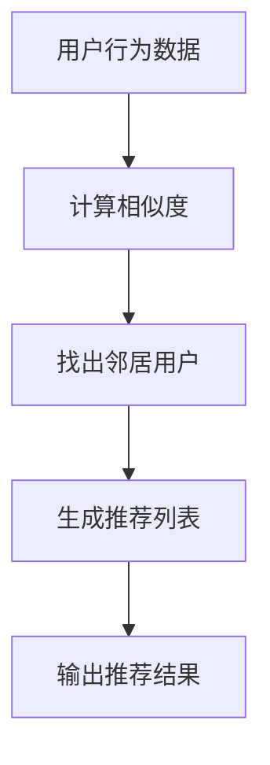
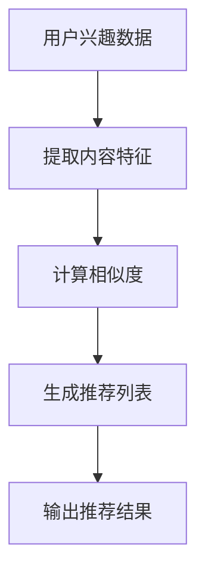
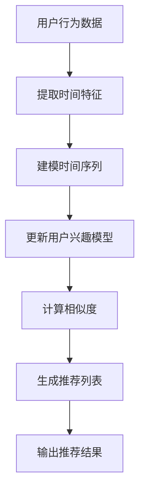

                 

# 文章标题：搜索推荐系统的上下文感知技术

> 关键词：搜索推荐系统、上下文感知技术、协同过滤、内容推荐、时间感知推荐、算法实现、模型优化、案例研究

> 摘要：本文深入探讨了搜索推荐系统的上下文感知技术，从概述到核心算法原理，再到实战案例，全面解析了上下文感知技术在搜索推荐系统中的应用。文章旨在帮助读者理解上下文感知技术的重要性，掌握核心算法原理，并通过实际案例了解其应用和优化策略。

---

### 《搜索推荐系统的上下文感知技术》目录大纲

# 第一部分：上下文感知技术概述

## 第1章：上下文感知技术概述

### 1.1 搜索推荐系统的概念和基本原理
### 1.2 上下文感知技术的定义与重要性
### 1.3 上下文感知技术在搜索推荐系统中的应用

## 第2章：上下文感知技术基础

### 2.1 上下文数据的收集与处理
#### 2.1.1 用户行为数据的收集
#### 2.1.2 内容特征的提取
#### 2.1.3 时间序列数据的处理

### 2.2 上下文感知模型架构
#### 2.2.1 基于传统机器学习的上下文感知模型
#### 2.2.2 基于深度学习的上下文感知模型
#### 2.2.3 基于图神经网络的上下文感知模型

# 第二部分：核心算法原理与实现

## 第3章：核心算法原理讲解

### 3.1 协同过滤算法
#### 3.1.1 协同过滤的基本原理
#### 3.1.2 伪代码实现
#### 3.1.3 数学模型和公式讲解

### 3.2 内容推荐算法
#### 3.2.1 内容推荐的基本原理
#### 3.2.2 基于词嵌入的内容特征提取
#### 3.2.3 数学模型和公式讲解

### 3.3 时间感知推荐算法
#### 3.3.1 时间感知推荐的基本原理
#### 3.3.2 伪代码实现
#### 3.3.3 数学模型和公式讲解

## 第4章：上下文感知模型实战

### 4.1 实战环境搭建
#### 4.1.1 开发环境配置
#### 4.1.2 数据集准备
#### 4.1.3 依赖库安装

### 4.2 代码实现与解读
#### 4.2.1 代码总体结构
#### 4.2.2 代码详细实现
#### 4.2.3 代码解读与分析

## 第5章：案例研究

### 5.1 案例一：基于上下文的商品推荐系统
#### 5.1.1 案例背景
#### 5.1.2 案例目标
#### 5.1.3 案例实现

### 5.2 案例二：基于上下文的新闻推荐系统
#### 5.2.1 案例背景
#### 5.2.2 案例目标
#### 5.2.3 案例实现

## 第6章：评估与优化

### 6.1 模型评估指标
#### 6.1.1 准确性评估
#### 6.1.2 精确性评估
#### 6.1.3 实用性评估

### 6.2 模型优化策略
#### 6.2.1 参数调优
#### 6.2.2 模型融合
#### 6.2.3 集群优化

# 第三部分：应用与未来展望

## 第7章：上下文感知技术在搜索推荐系统中的应用与挑战

### 7.1 当前应用现状
#### 7.1.1 商业应用案例
#### 7.1.2 学术研究进展

### 7.2 挑战与未来方向
#### 7.2.1 数据隐私与安全
#### 7.2.2 模型解释性与可解释性
#### 7.2.3 模型泛化能力

## 第8章：总结与展望

### 8.1 全书总结
### 8.2 未来发展趋势
### 8.3 对读者的建议

# 附录

## 附录 A：开源工具与资源

### A.1 常用开源库
### A.2 数据集来源
### A.3 深度学习框架使用指南

## 附录 B：参考文献

### B.1 相关书籍
### B.2 学术论文
### B.3 网络资源链接

## 附录 C：Mermaid 流程图

### C.1 协同过滤算法流程图
### C.2 内容推荐算法流程图
### C.3 时间感知推荐算法流程图

---

**注：以上目录大纲仅为框架示例，具体内容需要根据实际书籍内容进行调整。** 

---

### 第1章：上下文感知技术概述

#### 1.1 搜索推荐系统的概念和基本原理

搜索推荐系统是一种用于改善用户体验的技术，它通过分析用户行为、内容和上下文信息，向用户推荐相关的内容、商品或服务。这种系统广泛应用于互联网的各个领域，如电子商务、社交媒体、新闻资讯等。

搜索推荐系统的基本原理主要包括以下几个步骤：

1. **用户行为数据收集**：通过用户的历史行为数据，如搜索历史、浏览记录、购买记录等，来了解用户的需求和偏好。
2. **内容特征提取**：对推荐的内容进行特征提取，如商品属性、新闻标签等。
3. **上下文信息获取**：通过时间、地理位置、设备等信息，为推荐算法提供额外的上下文信息。
4. **推荐算法计算**：根据用户行为数据、内容特征和上下文信息，利用协同过滤、内容推荐或混合推荐算法计算推荐结果。
5. **推荐结果呈现**：将推荐结果以合适的形式呈现给用户。

#### 1.2 上下文感知技术的定义与重要性

上下文感知技术是一种能够根据用户所处的环境或情境，动态调整推荐策略的技术。它能够通过感知用户的上下文信息（如时间、地点、用户状态等），提供更加个性化和精准的推荐结果。

上下文感知技术的重要性体现在以下几个方面：

1. **提升用户体验**：通过理解用户的上下文，系统能够提供更加符合用户当前需求和喜好的内容，从而提升用户满意度。
2. **提高推荐效果**：上下文信息有助于更好地捕捉用户当前的兴趣点，提高推荐的相关性和准确性。
3. **增强竞争力**：在竞争激烈的市场中，具备上下文感知能力的搜索推荐系统可以为企业带来竞争优势。

#### 1.3 上下文感知技术在搜索推荐系统中的应用

上下文感知技术可以广泛应用于搜索推荐系统的各个阶段：

1. **用户行为数据收集**：通过上下文信息，可以更准确地收集用户的行为数据，如用户在特定时间段内的搜索行为、浏览习惯等。
2. **内容特征提取**：上下文信息可以帮助系统更好地提取内容的特征，如根据用户所在的地理位置推荐相关的本地新闻或商品。
3. **推荐算法计算**：结合上下文信息，推荐算法可以更加精准地计算推荐结果，如基于时间感知的推荐算法，能够在用户高峰时段推荐热门内容。
4. **推荐结果呈现**：上下文感知技术可以帮助系统根据用户当前的环境和需求，以更合适的形式呈现推荐结果，如夜间模式下的低亮度推荐界面。

总之，上下文感知技术在搜索推荐系统中扮演着至关重要的角色，它不仅提升了推荐系统的效果，也为用户提供了一种更加智能和便捷的体验。在接下来的章节中，我们将深入探讨上下文感知技术的基础知识、核心算法原理及其在实际应用中的实现方法。

#### 2.1.1 用户行为数据的收集

用户行为数据是构建上下文感知推荐系统的关键，它提供了了解用户兴趣、偏好和当前需求的重要信息。以下是一般用于收集用户行为数据的方法：

1. **日志文件**：服务器日志是收集用户行为数据的主要来源之一。这些日志记录了用户的每一次请求，包括请求的时间、URL、请求方式、用户代理等信息。通过对这些日志进行分析，可以获取用户的浏览、搜索和购买行为。

   ```mermaid
   graph TD
   A[服务器日志] --> B[请求时间]
   A --> C[URL]
   A --> D[请求方式]
   A --> E[用户代理]
   ```

2. **点击流数据**：点击流数据是用户在网站上互动的记录，包括用户点击的链接、浏览的页面、停留时间等。通过分析点击流数据，可以了解用户的浏览路径和兴趣点。

   ```mermaid
   graph TD
   A[点击流数据] --> B[点击链接]
   A --> C[浏览页面]
   A --> D[停留时间]
   ```

3. **会话记录**：会话记录是用户在一次完整会话中的所有行为记录。这些记录通常包括会话开始和结束的时间、用户的操作序列等。通过对会话记录进行分析，可以捕捉用户的连续行为模式。

   ```mermaid
   graph TD
   A[会话记录] --> B[会话开始时间]
   A --> C[操作序列]
   A --> D[会话结束时间]
   ```

4. **Web表单数据**：用户在网站上提交的表单数据，如搜索关键词、评论、评分等，也是重要的用户行为数据。这些数据可以直接反映用户的兴趣和偏好。

   ```mermaid
   graph TD
   A[Web表单数据] --> B[搜索关键词]
   A --> C[评论]
   A --> D[评分]
   ```

5. **第三方数据源**：除了网站自身的日志和用户数据外，还可以从第三方数据源获取用户行为数据，如社交媒体活动、地理位置信息等。这些数据可以提供更全面的用户画像，有助于提高推荐的精准度。

   ```mermaid
   graph TD
   A[第三方数据源] --> B[社交媒体活动]
   A --> C[地理位置信息]
   ```

在收集用户行为数据时，需要注意以下几点：

- **隐私保护**：在收集和使用用户数据时，必须遵守相关的隐私保护法规，确保用户数据的安全和隐私。
- **数据质量**：确保收集的数据是准确、完整和及时的，避免数据偏差和缺失。
- **数据整合**：将不同来源的数据进行整合，构建全面的用户行为数据集，以支持更准确的推荐模型。

通过上述方法，可以有效地收集用户行为数据，为上下文感知推荐系统提供基础支持。

#### 2.1.2 内容特征的提取

内容特征的提取是构建上下文感知推荐系统的关键步骤之一，它将原始数据转化为可用于模型训练的特征向量。以下是一些常见的内容特征提取方法：

1. **文本特征提取**：
   - **词袋模型**：词袋模型（Bag of Words, BOW）是将文档表示为一组词的集合，忽略词的顺序。这种模型通常通过TF-IDF（Term Frequency-Inverse Document Frequency）进行权重计算，以提高特征的重要性。
     ```mermaid
     graph TD
     A[文本数据] --> B[分词]
     B --> C[TF-IDF]
     C --> D[BOW向量]
     ```
   - **词嵌入**：词嵌入（Word Embedding）是将词语映射到高维向量空间，能够捕获词语的语义信息。常用的词嵌入模型有Word2Vec、GloVe等。
     ```mermaid
     graph TD
     A[文本数据] --> B[分词]
     B --> C[词嵌入模型]
     C --> D[词向量]
     ```

2. **结构特征提取**：
   - **图特征**：对于含有结构信息的数据，如知识图谱、社交网络等，可以提取图的特征来表示内容。图特征提取方法包括节点特征、边特征和子图特征等。
     ```mermaid
     graph TD
     A[图数据] --> B[节点特征]
     A --> C[边特征]
     A --> D[子图特征]
     ```

3. **非结构特征提取**：
   - **特征工程**：通过人工设计特征，如商品的价格、销量、品牌等，来表示内容的属性。这种方法需要对业务有深刻的理解，能够提取出对推荐有重要影响的关键特征。
     ```mermaid
     graph TD
     A[商品数据] --> B[价格]
     A --> C[销量]
     A --> D[品牌]
     ```

4. **混合特征提取**：
   - **融合多种特征**：将文本特征、结构特征和非结构特征进行融合，可以构建更加丰富和多样的特征向量，提高模型的泛化能力。
     ```mermaid
     graph TD
     A[文本特征] --> B[结构特征]
     A --> C[非结构特征]
     B --> C
     C --> D[融合特征向量]
     ```

在提取内容特征时，需要注意以下几点：

- **特征选择**：选择对推荐有显著影响的特征，避免特征冗余和噪声。
- **特征转换**：对原始数据进行适当的转换，如归一化、标准化等，以适应模型的要求。
- **特征维度**：控制特征维度，避免过高的维度导致模型训练效率低下。

通过上述方法，可以有效地提取内容特征，为上下文感知推荐系统提供可靠的基础。

#### 2.1.3 时间序列数据的处理

时间序列数据在搜索推荐系统中扮演着至关重要的角色，它能够反映用户在不同时间点的行为模式，从而为推荐算法提供关键的上下文信息。以下是一些常见的时间序列数据处理方法：

1. **数据预处理**：
   - **异常值处理**：识别并处理时间序列中的异常值，如错误的记录或明显的异常行为。这可以通过统计方法（如离群点检测）或机器学习方法（如异常检测模型）来实现。
     ```mermaid
     graph TD
     A[时间序列数据] --> B[异常值检测]
     B --> C[异常值处理]
     ```
   - **时间规范化**：将时间序列数据归一化或标准化，使其具有统一的量纲。例如，将时间戳转换为连续的数值，以便于模型处理。
     ```mermaid
     graph TD
     A[时间序列数据] --> B[时间规范化]
     B --> C[归一化/标准化]
     ```

2. **特征工程**：
   - **趋势分析**：通过时间序列的趋势分析，提取趋势特征，如季节性、周期性等。这些特征可以帮助模型捕捉时间序列的长期变化模式。
     ```mermaid
     graph TD
     A[时间序列数据] --> B[趋势分析]
     B --> C[趋势特征]
     ```
   - **周期特征**：识别时间序列中的周期性变化，如用户在每周或每月的特定时间点有特定的行为模式。周期特征可以帮助模型预测用户的行为。
     ```mermaid
     graph TD
     A[时间序列数据] --> B[周期特征提取]
     B --> C[周期性特征]
     ```
   - **时序分解**：将时间序列分解为趋势、季节性和残差部分，分别处理每个部分。这种分解有助于模型更好地捕捉时间序列的复杂变化。
     ```mermaid
     graph TD
     A[时间序列数据] --> B[时序分解]
     B --> C[趋势]
     B --> D[季节性]
     B --> E[残差]
     ```

3. **模型训练**：
   - **时间窗口**：在训练模型时，可以设定一个时间窗口，只考虑窗口内的数据作为输入。这有助于模型捕捉用户在特定时间段内的行为模式。
     ```mermaid
     graph TD
     A[时间序列数据] --> B[时间窗口设置]
     B --> C[窗口内数据]
     ```
   - **时序模型**：使用专门的时间序列模型，如ARIMA、LSTM等，可以更好地捕捉时间序列数据的动态特性。这些模型可以自动提取时间序列的周期性、趋势性和季节性特征。
     ```mermaid
     graph TD
     A[时间序列数据] --> B[LSTM模型]
     A --> C[ARIMA模型]
     ```

在处理时间序列数据时，需要注意以下几点：

- **数据完整性**：确保时间序列数据的完整性和连续性，避免数据缺失或中断。
- **特征选择**：选择对时间序列变化有显著影响的关键特征，避免冗余特征。
- **模型评估**：使用合适的评估指标，如RMSE、MAPE等，来评估模型的性能。

通过上述方法，可以有效地处理时间序列数据，为上下文感知推荐系统提供强有力的支持。

#### 2.2.1 基于传统机器学习的上下文感知模型

在搜索推荐系统中，传统机器学习方法被广泛应用于上下文感知模型的构建。这些方法通过训练用户行为数据、内容特征和上下文信息的组合模型，实现高效的推荐效果。以下是几种常用的传统机器学习模型及其工作原理：

1. **线性回归模型**：
   线性回归模型是一种简单的机器学习算法，它通过线性关系预测用户对某个内容的兴趣。线性回归模型的工作原理可以表示为：

   $$ y = \beta_0 + \beta_1 x_1 + \beta_2 x_2 + ... + \beta_n x_n $$

   其中，\( y \) 是预测的兴趣得分，\( x_1, x_2, ..., x_n \) 是用户行为数据、内容特征和上下文信息的特征向量，\( \beta_0, \beta_1, \beta_2, ..., \beta_n \) 是模型的参数。

   ```mermaid
   graph TD
   A[用户行为数据] --> B[内容特征]
   A --> C[上下文信息]
   B --> D[特征向量]
   C --> D
   D --> E[线性模型]
   E --> F[预测得分]
   ```

2. **逻辑回归模型**：
   逻辑回归模型是一种广义的线性回归模型，用于处理分类问题。在搜索推荐系统中，逻辑回归可以用来预测用户是否会对某个内容感兴趣。其工作原理如下：

   $$ P(y=1) = \frac{1}{1 + e^{-(\beta_0 + \beta_1 x_1 + \beta_2 x_2 + ... + \beta_n x_n)}} $$

   其中，\( P(y=1) \) 是用户对内容感兴趣的概率，\( x_1, x_2, ..., x_n \) 是特征向量，\( \beta_0, \beta_1, \beta_2, ..., \beta_n \) 是模型参数。

   ```mermaid
   graph TD
   A[用户行为数据] --> B[内容特征]
   A --> C[上下文信息]
   B --> D[特征向量]
   C --> D
   D --> E[逻辑模型]
   E --> F[感兴趣概率]
   ```

3. **K近邻算法**：
   K近邻（K-Nearest Neighbors, KNN）算法是一种基于实例的学习算法，它通过计算用户和内容之间的相似度来预测用户的兴趣。其工作原理如下：

   $$ \text{相似度} = \frac{\sum_{i=1}^{n} (x_i - x_{i'})^2}{\sum_{i=1}^{n} x_i^2 + \sum_{i=1}^{n} x_{i'}^2} $$

   其中，\( x_i \) 是待预测的用户特征向量，\( x_{i'} \) 是训练集中的用户特征向量，\( n \) 是特征向量的维度。

   ```mermaid
   graph TD
   A[用户行为数据] --> B[内容特征]
   A --> C[上下文信息]
   B --> D[特征向量]
   C --> D
   D --> E[KNN模型]
   E --> F[预测得分]
   ```

4. **决策树模型**：
   决策树模型是一种树形结构模型，它通过一系列的决策规则将用户行为数据、内容特征和上下文信息进行划分，以预测用户的兴趣。其工作原理如下：

   $$ \text{决策规则} = \text{IF } (x_i \text{ meets condition}) \text{ THEN } \text{predict } y_1 \text{ ELSE } \text{predict } y_2 $$

   其中，\( x_i \) 是特征值，\( y_1 \) 和 \( y_2 \) 是预测的两个类别。

   ```mermaid
   graph TD
   A[用户行为数据] --> B[内容特征]
   A --> C[上下文信息]
   B --> D[特征向量]
   C --> D
   D --> E[决策树模型]
   E --> F[预测类别]
   ```

传统机器学习模型在搜索推荐系统中的应用具有以下优势：

- **易于理解和实现**：传统机器学习算法通常具有简单明了的数学模型和实现方法，便于工程实践。
- **适用于不同类型的数据**：传统机器学习算法可以处理结构化数据、半结构化数据和非结构化数据，具有广泛的适用性。
- **模型解释性强**：传统机器学习模型的决策过程可以清晰地解释，有助于理解推荐结果的产生。

然而，传统机器学习模型也存在一些局限性：

- **特征工程依赖性强**：传统机器学习模型对特征工程有较高的依赖，需要手动设计特征，这使得模型构建过程较为繁琐。
- **模型可扩展性有限**：传统机器学习模型的计算复杂度较高，难以处理大规模数据和实时推荐任务。
- **模型解释性有限**：虽然部分传统机器学习模型（如决策树）具有较好的解释性，但整体上传统机器学习模型对推荐结果的可解释性仍较为有限。

总体而言，传统机器学习模型在搜索推荐系统中仍具有一定的应用价值，但其局限性也促使研究者不断探索更加先进和高效的算法。

#### 2.2.2 基于深度学习的上下文感知模型

随着深度学习技术的不断发展，其在搜索推荐系统中的应用也逐渐成为研究热点。深度学习模型通过自动学习多层次的表示特征，能够在复杂的数据分布中捕捉用户行为、内容和上下文信息的内在关联。以下是几种基于深度学习的上下文感知模型及其工作原理：

1. **卷积神经网络（Convolutional Neural Network, CNN）**：
   卷积神经网络是一种经典的深度学习模型，主要应用于图像处理和文本分类等任务。CNN 通过卷积操作提取特征，并利用池化操作降低维度。在搜索推荐系统中，CNN 可以用于提取用户行为和内容特征。

   $$ \text{特征提取} = \text{Conv}(\text{输入特征}) + \text{Pooling}(\text{卷积特征}) $$

   CNN 的工作流程如下：

   - **卷积层**：通过卷积操作提取特征图，卷积核在输入特征上滑动，逐像素地进行点积运算。
     ```mermaid
     graph TD
     A[输入特征] --> B[卷积层]
     B --> C[特征图]
     ```
   - **池化层**：通过池化操作（如最大池化或平均池化）对特征图进行降维处理，减少参数量和计算复杂度。
     ```mermaid
     graph TD
     C --> D[池化层]
     D --> E[降维特征]
     ```
   - **全连接层**：将降维后的特征输入全连接层，进行分类或回归预测。
     ```mermaid
     graph TD
     E --> F[全连接层]
     F --> G[预测结果]
     ```

2. **循环神经网络（Recurrent Neural Network, RNN）**：
   循环神经网络是一种适用于序列数据建模的深度学习模型，其通过循环连接机制捕捉序列中的长期依赖关系。在搜索推荐系统中，RNN 可以用于处理用户的历史行为数据。

   $$ h_t = \text{RNN}(h_{t-1}, x_t) $$

   RNN 的工作流程如下：

   - **输入层**：输入当前时刻的用户行为数据。
     ```mermaid
     graph TD
     A[用户行为数据] --> B[RNN输入层]
     ```
   - **隐藏层**：利用隐藏状态 \( h_t \) 和当前输入 \( x_t \) 进行计算，并更新隐藏状态。
     ```mermaid
     graph TD
     B --> C[隐藏层]
     C --> D[隐藏状态更新]
     ```
   - **输出层**：通过隐藏状态计算预测结果，如推荐概率或评分。
     ```mermaid
     graph TD
     D --> E[输出层]
     E --> F[预测结果]
     ```

3. **长短期记忆网络（Long Short-Term Memory, LSTM）**：
   长短期记忆网络是 RNN 的一个变体，它通过引入记忆单元来缓解 RNN 的梯度消失问题，能够更好地捕捉序列数据中的长期依赖关系。在搜索推荐系统中，LSTM 广泛应用于处理用户的行为序列。

   $$ h_t = \text{LSTM}(h_{t-1}, x_t) $$

   LSTM 的工作流程如下：

   - **输入门**：根据当前输入和前一个隐藏状态计算输入门的权重，决定哪些信息应该被记忆。
     ```mermaid
     graph TD
     A[输入门权重] --> B[输入门计算]
     ```
   - **遗忘门**：根据当前输入和前一个隐藏状态计算遗忘门的权重，决定哪些信息应该被遗忘。
     ```mermaid
     graph TD
     A --> C[遗忘门计算]
     ```
   - **单元状态**：利用遗忘门和输入门更新单元状态，保存重要的信息。
     ```mermaid
     graph TD
     C --> D[单元状态更新]
     ```
   - **输出门**：根据当前单元状态和前一个隐藏状态计算输出门的权重，决定哪些信息应该被输出。
     ```mermaid
     graph TD
     D --> E[输出门计算]
     E --> F[隐藏状态更新]
     ```

4. **变压器（Transformer）**：
   变压器是一种基于自注意力机制的深度学习模型，广泛应用于自然语言处理和推荐系统等领域。变压器通过多头自注意力机制，能够捕捉输入序列中的全局依赖关系。

   $$ \text{输出} = \text{Transformer}(\text{输入序列}, \text{键值对注意力权重}) $$

   变压器的工作流程如下：

   - **嵌入层**：将输入序列转换为嵌入向量。
     ```mermaid
     graph TD
     A[输入序列] --> B[嵌入层]
     B --> C[嵌入向量]
     ```
   - **多头自注意力层**：通过多头自注意力机制计算不同位置之间的权重，捕捉全局依赖关系。
     ```mermaid
     graph TD
     C --> D[多头自注意力层]
     D --> E[权重计算]
     ```
   - **前馈网络**：将自注意力结果通过前馈网络进行处理，进一步提取特征。
     ```mermaid
     graph TD
     E --> F[前馈网络]
     F --> G[特征向量]
     ```
   - **输出层**：通过输出层计算预测结果，如推荐概率或评分。
     ```mermaid
     graph TD
     G --> H[输出层]
     H --> I[预测结果]
     ```

基于深度学习的上下文感知模型在搜索推荐系统中的应用具有以下优势：

- **自动特征提取**：深度学习模型可以通过端到端的学习方式自动提取高层次的表示特征，减少手动特征工程的工作量。
- **处理能力强大**：深度学习模型能够处理大规模和高维度的数据，适应实时推荐和个性化推荐的需求。
- **捕获复杂依赖**：深度学习模型能够捕捉用户行为、内容和上下文之间的复杂依赖关系，提供更加精准的推荐结果。

然而，基于深度学习的上下文感知模型也存在一些挑战：

- **计算复杂度高**：深度学习模型的训练过程通常需要大量的计算资源和时间，不适合实时推荐任务。
- **模型解释性有限**：深度学习模型的决策过程较为复杂，难以解释推荐结果的产生，影响模型的可解释性。
- **数据需求量大**：深度学习模型对数据的需求较高，需要大量的训练数据来保证模型的性能。

总体而言，基于深度学习的上下文感知模型在搜索推荐系统中具有广阔的应用前景，但其复杂的模型结构和计算需求也带来了挑战。未来的研究将继续探索如何在保持模型效果的同时，降低计算复杂性和提高模型的可解释性。

#### 2.2.3 基于图神经网络的上下文感知模型

图神经网络（Graph Neural Networks, GNN）是一种基于图结构的深度学习模型，它能够有效地捕捉和利用图中的节点和边信息。在搜索推荐系统中，图神经网络被广泛应用于处理用户、内容和上下文信息的复杂关系。以下是几种基于图神经网络的上下文感知模型及其工作原理：

1. **图卷积网络（Graph Convolutional Network, GCN）**：
   图卷积网络是一种经典的图神经网络，它通过卷积操作在图上进行特征聚合。GCN 的核心思想是将节点特征扩展为图特征，然后通过多层的图卷积层提取高层次的图特征。

   $$ h_i^{(l+1)} = \sigma(\theta^{(l)} \cdot (h_i^{(l)}, \sum_{j \in \mathcal{N}(i)} \alpha_j h_j^{(l)}) $$

   其中，\( h_i^{(l)} \) 表示第 \( l \) 层第 \( i \) 个节点的特征，\( \mathcal{N}(i) \) 表示与节点 \( i \) 相邻的节点集合，\( \alpha_j \) 是节点 \( j \) 的邻接权重，\( \theta^{(l)} \) 是第 \( l \) 层的权重参数，\( \sigma \) 是激活函数。

   GCN 的工作流程如下：

   - **输入层**：输入节点的特征向量。
     ```mermaid
     graph TD
     A[节点特征] --> B[输入层]
     ```
   - **图卷积层**：通过卷积操作聚合邻居节点的特征，生成新的节点特征。
     ```mermaid
     graph TD
     B --> C[图卷积层]
     C --> D[节点特征聚合]
     ```
   - **池化层**：对节点特征进行降维处理，减少参数量和计算复杂度。
     ```mermaid
     graph TD
     D --> E[池化层]
     ```
   - **全连接层**：将池化后的特征输入全连接层，进行分类或回归预测。
     ```mermaid
     graph TD
     E --> F[全连接层]
     F --> G[预测结果]
     ```

2. **图注意力网络（Graph Attention Network, GAT）**：
   图注意力网络是一种基于自注意力机制的图神经网络，它通过节点和边之间的注意力机制动态地调整特征权重。GAT 能够更好地捕捉节点和边之间的复杂关系。

   $$ \alpha_{ij}^{(l)} = \frac{\exp(\theta^{(l)} \cdot a_{i} \odot a_{j})}{\sum_{k \in \mathcal{N}(i)} \exp(\theta^{(l)} \cdot a_{i} \odot a_{j})} $$

   其中，\( \alpha_{ij}^{(l)} \) 是第 \( l \) 层节点 \( i \) 和节点 \( j \) 之间的注意力权重，\( a_i \) 和 \( a_j \) 是节点 \( i \) 和节点 \( j \) 的特征向量，\( \theta^{(l)} \) 是权重参数。

   GAT 的工作流程如下：

   - **输入层**：输入节点的特征向量。
     ```mermaid
     graph TD
     A[节点特征] --> B[输入层]
     ```
   - **多头注意力层**：通过多头注意力机制计算节点和边之间的注意力权重。
     ```mermaid
     graph TD
     B --> C[多头注意力层]
     C --> D[注意力权重计算]
     ```
   - **特征聚合层**：利用注意力权重聚合邻居节点的特征，生成新的节点特征。
     ```mermaid
     graph TD
     D --> E[特征聚合层]
     ```
   - **全连接层**：将聚合后的特征输入全连接层，进行分类或回归预测。
     ```mermaid
     graph TD
     E --> F[全连接层]
     F --> G[预测结果]
     ```

3. **图自编码器（Graph Autoencoder, GAE）**：
   图自编码器是一种无监督的图神经网络，它通过编码器和解码器结构学习节点的低维嵌入表示。GAE 可以用于降维和节点分类等任务。

   编码器部分：
   $$ z_i = \text{Encoder}(h_i) $$
   
   解码器部分：
   $$ h_i' = \text{Decoder}(z_i) $$

   GAE 的工作流程如下：

   - **编码器**：输入节点的特征向量，通过编码器生成节点的低维嵌入表示。
     ```mermaid
     graph TD
     A[节点特征] --> B[编码器]
     B --> C[编码表示]
     ```
   - **解码器**：将编码表示作为输入，通过解码器重构节点的原始特征向量。
     ```mermaid
     graph TD
     C --> D[解码器]
     D --> E[重构特征]
     ```

基于图神经网络的上下文感知模型在搜索推荐系统中的应用具有以下优势：

- **灵活的结构表示**：图神经网络能够灵活地表示节点和边之间的关系，捕捉复杂的上下文信息。
- **高效的特征提取**：通过图卷积和注意力机制，图神经网络可以自动提取高层次的图特征，减少手动特征工程的工作量。
- **鲁棒性**：图神经网络能够处理不同规模和类型的图数据，具有较强的鲁棒性。

然而，基于图神经网络的上下文感知模型也存在一些挑战：

- **计算复杂度高**：图神经网络涉及大量的图操作和矩阵运算，计算复杂度较高，对计算资源要求较高。
- **模型解释性有限**：图神经网络的内部结构和计算过程较为复杂，难以解释模型决策的逻辑和原因。
- **数据预处理要求**：图神经网络对数据预处理要求较高，需要构建高质量的图结构，这需要额外的数据处理工作。

总体而言，基于图神经网络的上下文感知模型在搜索推荐系统中具有巨大的潜力，但同时也需要进一步的研究和优化，以克服其现有的挑战。

#### 3.1 协同过滤算法

协同过滤（Collaborative Filtering, CF）算法是推荐系统中最常用的算法之一，它通过分析用户之间的行为模式来预测用户的兴趣。协同过滤算法主要分为基于用户的协同过滤（User-Based CF）和基于物品的协同过滤（Item-Based CF）两种类型。

##### 3.1.1 协同过滤的基本原理

协同过滤算法的基本思想是通过找到与当前用户行为相似的邻居用户或物品，并基于邻居用户的喜好来预测当前用户的兴趣。协同过滤算法的核心目标是计算用户与用户之间或物品与物品之间的相似度，并利用这些相似度来生成推荐列表。

1. **用户与用户之间的协同过滤**：
   用户与用户之间的协同过滤通过计算用户之间的相似度来推荐相似的物品。相似度计算公式通常基于用户对物品的共同评分或偏好。常用的相似度计算方法包括余弦相似度、皮尔逊相关系数等。

   - **余弦相似度**：
     $$ \text{Similarity}(u, v) = \frac{\text{dot}(r_u, r_v)}{\|\text{r}_u\|\|\text{r}_v\|} $$
     其中，\( r_u \) 和 \( r_v \) 分别是用户 \( u \) 和用户 \( v \) 对物品的评分向量，\( \|\text{r}_u\| \) 和 \( \|\text{r}_v\| \) 分别是用户 \( u \) 和用户 \( v \) 的评分向量欧几里得范数。

   - **皮尔逊相关系数**：
     $$ \text{Similarity}(u, v) = \frac{\text{cov}(r_u, r_v)}{\sigma_u \sigma_v} $$
     其中，\( \text{cov}(r_u, r_v) \) 是用户 \( u \) 和用户 \( v \) 的评分协方差，\( \sigma_u \) 和 \( \sigma_v \) 分别是用户 \( u \) 和用户 \( v \) 的评分标准差。

2. **物品与物品之间的协同过滤**：
   物品与物品之间的协同过滤通过计算物品之间的相似度来推荐相似的物品。物品之间的相似度计算通常基于物品的特征或属性。常用的相似度计算方法包括余弦相似度、欧几里得距离等。

   - **余弦相似度**：
     $$ \text{Similarity}(i, j) = \frac{\text{dot}(s_i, s_j)}{\|\text{s}_i\|\|\text{s}_j\|} $$
     其中，\( s_i \) 和 \( s_j \) 分别是物品 \( i \) 和物品 \( j \) 的特征向量，\( \|\text{s}_i\| \) 和 \( \|\text{s}_j\| \) 分别是物品 \( i \) 和物品 \( j \) 的特征向量欧几里得范数。

   - **欧几里得距离**：
     $$ \text{Similarity}(i, j) = \sqrt{\sum_{k=1}^{n} (s_{ik} - s_{jk})^2} $$
     其中，\( s_{ik} \) 和 \( s_{jk} \) 分别是物品 \( i \) 和物品 \( j \) 在特征 \( k \) 上的取值，\( n \) 是特征的总数。

##### 3.1.2 伪代码实现

以下是一个基于用户的协同过滤算法的伪代码实现：

```
Algorithm User-Based Collaborative Filtering
Input: User rating matrix R, similarity matrix S
Output: Recommended items for user u
1. Compute similarity matrix S using user ratings R.
2. For each user v in the dataset:
   - Compute similarity score sv using S[u, v].
   - If sv > threshold:
     - Add items rated by user v but not rated by user u to the recommended list.
3. Return the top-k items from the recommended list.
```

以下是基于物品的协同过滤算法的伪代码实现：

```
Algorithm Item-Based Collaborative Filtering
Input: User rating matrix R, similarity matrix S
Output: Recommended items for user u
1. Compute similarity matrix S using item ratings R.
2. For each item i in the dataset:
   - Compute similarity score si using S[i, u].
   - If si > threshold:
     - Add items similar to item i but not selected by user u to the recommended list.
3. Return the top-k items from the recommended list.
```

##### 3.1.3 数学模型和公式讲解

协同过滤算法的核心是计算用户之间的相似度或物品之间的相似度，以下是其数学模型的详细讲解：

1. **用户与用户之间的相似度计算**：

   - **余弦相似度**：
     $$ \text{Similarity}(u, v) = \cos(\theta) = \frac{\text{dot}(r_u, r_v)}{\|\text{r}_u\|\|\text{r}_v\|} $$
     其中，\( \text{dot}(r_u, r_v) \) 表示用户 \( u \) 和用户 \( v \) 的评分向量 \( r_u \) 和 \( r_v \) 的点积，\( \|\text{r}_u\| \) 和 \( \|\text{r}_v\| \) 分别是用户 \( u \) 和用户 \( v \) 的评分向量的欧几里得范数。

   - **皮尔逊相关系数**：
     $$ \text{Similarity}(u, v) = \rho(r_u, r_v) = \frac{\text{cov}(r_u, r_v)}{\sigma_u \sigma_v} $$
     其中，\( \text{cov}(r_u, r_v) \) 是用户 \( u \) 和用户 \( v \) 的评分协方差，\( \sigma_u \) 和 \( \sigma_v \) 分别是用户 \( u \) 和用户 \( v \) 的评分标准差。

2. **物品与物品之间的相似度计算**：

   - **余弦相似度**：
     $$ \text{Similarity}(i, j) = \cos(\theta) = \frac{\text{dot}(s_i, s_j)}{\|\text{s}_i\|\|\text{s}_j\|} $$
     其中，\( \text{dot}(s_i, s_j) \) 表示物品 \( i \) 和物品 \( j \) 的特征向量 \( s_i \) 和 \( s_j \) 的点积，\( \|\text{s}_i\| \) 和 \( \|\text{s}_j\| \) 分别是物品 \( i \) 和物品 \( j \) 的特征向量欧几里得范数。

   - **欧几里得距离**：
     $$ \text{Similarity}(i, j) = \text{Euclidean Distance} = \sqrt{\sum_{k=1}^{n} (s_{ik} - s_{jk})^2} $$
     其中，\( s_{ik} \) 和 \( s_{jk} \) 分别是物品 \( i \) 和物品 \( j \) 在特征 \( k \) 上的取值，\( n \) 是特征的总数。

通过上述数学模型和公式，协同过滤算法能够有效地计算用户和物品之间的相似度，从而生成推荐列表。在实际应用中，可以通过调整相似度计算公式和阈值参数来优化推荐效果。

#### 3.2 内容推荐算法

内容推荐（Content-based Recommendation）算法是一种基于物品特征的推荐方法，它通过分析用户的历史行为和兴趣，生成与用户当前兴趣相关的推荐列表。内容推荐算法的主要优势在于其能够根据用户的具体兴趣提供个性化的推荐，从而提高用户满意度和推荐效果。

##### 3.2.1 内容推荐的基本原理

内容推荐算法的基本原理可以分为以下几个步骤：

1. **用户兴趣建模**：首先，系统需要根据用户的历史行为数据（如浏览记录、搜索历史、购买历史等）来构建用户的兴趣模型。这一过程通常涉及文本分析和特征提取技术，如词袋模型、词嵌入等。

   $$ \text{User Interest Model} = \text{Vectorize}( \text{User History}) $$

   其中，\( \text{Vectorize}( \text{User History}) \) 表示将用户的历史行为数据转换为特征向量。

2. **内容特征提取**：接下来，系统需要对推荐的内容进行特征提取。这通常涉及对文本、图像、音频等多种类型的内容进行预处理，提取出对用户兴趣有显著影响的特征。例如，对于文本内容，可以使用词袋模型或词嵌入技术提取词语特征；对于图像内容，可以使用卷积神经网络提取视觉特征。

   $$ \text{Content Feature Vector} = \text{ExtractFeatures}(\text{Content}) $$

3. **相似度计算**：在提取了用户兴趣模型和内容特征后，系统需要计算用户兴趣模型和内容特征之间的相似度。相似度计算公式通常基于用户和内容特征向量的余弦相似度或欧几里得距离。

   $$ \text{Similarity}(u, c) = \cos(\theta) = \frac{\text{dot}(u, c)}{\|u\|\|c\|} $$

   其中，\( \text{dot}(u, c) \) 表示用户兴趣向量 \( u \) 和内容特征向量 \( c \) 的点积，\( \|u\| \) 和 \( \|c\| \) 分别是用户兴趣向量和内容特征向量的欧几里得范数。

4. **生成推荐列表**：最后，系统根据相似度分数对候选内容进行排序，生成推荐列表。通常，系统会根据用户的兴趣强度和内容的热度等因素来调整推荐排序。

   $$ \text{Recommended List} = \text{Sort}( \text{Content}, \text{Similarity Scores}) $$

##### 3.2.2 基于词嵌入的内容特征提取

词嵌入（Word Embedding）是一种将词语映射到高维向量空间的技术，它能够捕获词语的语义信息。在内容推荐算法中，词嵌入技术被广泛应用于文本内容的特征提取。以下是基于词嵌入的内容特征提取方法：

1. **词嵌入模型选择**：常用的词嵌入模型包括Word2Vec、GloVe等。Word2Vec 是一种基于神经网络的词嵌入模型，它通过训练神经网络来学习词语的向量表示；GloVe（Global Vectors for Word Representation）是一种基于全局上下文的词嵌入模型，它通过考虑词语在语料库中的全局频率和共现关系来生成词向量。

2. **文本预处理**：在应用词嵌入模型之前，需要对文本进行预处理，包括分词、去除停用词、词性标注等。预处理步骤有助于提高词嵌入的质量。

3. **词向量生成**：通过训练词嵌入模型，将每个词语映射到一个高维向量空间。这些向量不仅能够表示词语的语义信息，还可以用于计算词语之间的相似度。

   $$ \text{Word Vector} = \text{Embed}( \text{Word}) $$

4. **文档向量化**：将文档表示为一个向量，可以通过将文档中的每个词语的词向量进行平均得到。这种向量表示方法称为文档的词袋模型（Bag of Words, BOW）。

   $$ \text{Document Vector} = \frac{1}{|\text{Words}|} \sum_{w \in \text{Words}} \text{Embed}(w) $$

   其中，\( \text{Words} \) 表示文档中的所有词语，\( \text{Embed}(w) \) 是词语 \( w \) 的词向量。

5. **内容特征提取**：对于非文本内容，如新闻、商品描述等，可以通过词嵌入模型提取特征向量。例如，对于新闻，可以将新闻标题、摘要和正文分别进行处理，得到多个特征向量，然后进行融合。

##### 3.2.3 数学模型和公式讲解

在内容推荐算法中，相似度计算是核心步骤之一。以下是基于词嵌入的内容特征提取的数学模型和公式讲解：

1. **余弦相似度**：
   $$ \text{Similarity}(d_u, c_i) = \cos(\theta) = \frac{\text{dot}(d_u, c_i)}{\|d_u\|\|c_i\|} $$
   其中，\( d_u \) 是用户兴趣的文档向量，\( c_i \) 是候选内容的文档向量，\( \text{dot}(d_u, c_i) \) 是文档向量的点积，\( \|d_u\| \) 和 \( \|c_i\| \) 是文档向量的欧几里得范数。

2. **欧几里得距离**：
   $$ \text{Distance}(d_u, c_i) = \sqrt{\sum_{k=1}^{n} (d_{uk} - c_{ik})^2} $$
   其中，\( d_{uk} \) 和 \( c_{ik} \) 是文档向量在特征 \( k \) 上的取值，\( n \) 是特征的总数。

通过上述数学模型和公式，内容推荐算法能够计算用户兴趣与候选内容之间的相似度，从而生成推荐列表。在实际应用中，可以通过调整相似度计算方法和特征提取策略来优化推荐效果。

#### 3.3 时间感知推荐算法

时间感知推荐算法是一种结合时间信息来提高推荐系统效果的方法。这类算法考虑用户在不同时间段的行为和兴趣变化，从而提供更加相关和个性化的推荐结果。时间感知推荐算法在处理动态和时变数据方面具有显著优势，特别适用于新闻推荐、商品推荐和社交媒体推荐等场景。

##### 3.3.1 时间感知推荐的基本原理

时间感知推荐算法的基本原理包括以下几个关键步骤：

1. **时间特征提取**：从用户行为数据中提取与时间相关的特征，如行为发生的时间戳、行为发生的日期和时间等。这些时间特征可以帮助捕捉用户在不同时间段的行为模式。

   $$ \text{Time Feature} = \text{ExtractTimeInfo}(\text{User Behavior Data}) $$

2. **时间序列建模**：使用时间序列模型对用户行为数据进行分析，以捕捉时间特征之间的依赖关系。常见的时间序列模型包括ARIMA、LSTM等。这些模型可以自动学习时间特征的趋势、周期性和季节性变化。

   $$ \text{Time Series Model} = \text{Learn}(\text{User Behavior Data}, \text{Time Feature}) $$

3. **动态用户兴趣模型**：基于时间序列模型的结果，构建动态的用户兴趣模型。该模型能够反映用户在特定时间段内的兴趣变化，从而为推荐算法提供实时和个性化的参考。

   $$ \text{Dynamic User Interest Model} = \text{Build}(\text{Time Series Model}, \text{User Behavior Data}) $$

4. **推荐生成**：利用动态用户兴趣模型和内容特征，计算用户对候选内容的兴趣得分，生成推荐列表。推荐生成过程需要考虑时间特征，以提高推荐的相关性和及时性。

   $$ \text{Recommendation Score} = \text{Score}(\text{Dynamic User Interest Model}, \text{Content Feature}) $$

##### 3.3.2 伪代码实现

以下是一个时间感知推荐算法的伪代码实现，展示了如何结合用户兴趣模型和时间特征生成推荐列表：

```
Algorithm Time-Aware Recommendation
Input: User behavior data, content features, time features
Output: Recommended content list
1. Extract time features from user behavior data.
2. Learn a time series model from the extracted time features.
3. Build a dynamic user interest model based on the time series model.
4. For each content item:
   - Compute the content feature vector.
   - Compute the recommendation score using the dynamic user interest model and content feature vector.
5. Sort the content items based on their recommendation scores.
6. Return the top-k content items in the sorted list.
```

##### 3.3.3 数学模型和公式讲解

时间感知推荐算法的数学模型主要包括时间序列建模和动态用户兴趣模型两部分。以下是对这些数学模型的详细解释：

1. **时间序列建模**：

   - **ARIMA模型**：
     $$ \text{ARIMA}(p, d, q) $$
     其中，\( p \) 是自回归项的阶数，\( d \) 是差分阶数，\( q \) 是移动平均项的阶数。ARIMA模型通过自回归、差分和移动平均过程对时间序列数据进行建模，以捕捉时间序列的趋势、周期性和季节性变化。

   - **LSTM模型**：
     $$ h_t = \text{LSTM}(h_{t-1}, x_t, C_t, C_{t-1}) $$
     其中，\( h_t \) 是时间 \( t \) 的隐藏状态，\( x_t \) 是时间 \( t \) 的输入特征，\( C_t \) 是时间 \( t \) 的细胞状态，\( C_{t-1} \) 是时间 \( t-1 \) 的细胞状态。LSTM模型通过门控机制（遗忘门、输入门和输出门）有效地捕捉时间序列的长期依赖关系。

2. **动态用户兴趣模型**：

   - **兴趣向量更新**：
     $$ \text{Interest Vector}^{(t)} = \text{Update}(\text{Interest Vector}^{(t-1)}, \text{Behavior Data}^{(t)}) $$
     其中，\( \text{Interest Vector}^{(t)} \) 是时间 \( t \) 的用户兴趣向量，\( \text{Interest Vector}^{(t-1)} \) 是时间 \( t-1 \) 的用户兴趣向量，\( \text{Behavior Data}^{(t)} \) 是时间 \( t \) 的用户行为数据。通过更新用户兴趣向量，可以动态地反映用户在特定时间段内的兴趣变化。

   - **兴趣得分计算**：
     $$ \text{Score}(i, t) = \text{DotProduct}(\text{Interest Vector}^{(t)}, \text{Content Feature}^{(i)}) $$
     其中，\( \text{Score}(i, t) \) 是时间 \( t \) 对候选内容 \( i \) 的兴趣得分，\( \text{Interest Vector}^{(t)} \) 是时间 \( t \) 的用户兴趣向量，\( \text{Content Feature}^{(i)} \) 是候选内容 \( i \) 的特征向量。通过计算用户兴趣向量和内容特征向量的点积，可以获取用户对内容的兴趣强度。

通过上述数学模型和公式，时间感知推荐算法能够有效地捕捉用户行为的时间动态性，从而提供更加精准和个性化的推荐结果。

#### 4.1 实战环境搭建

要实现一个基于上下文的搜索推荐系统，我们需要搭建一个合适的开发环境。以下是一个基本的实战环境搭建步骤：

##### 4.1.1 开发环境配置

1. **操作系统**：推荐使用Linux系统，如Ubuntu或CentOS，因为大多数深度学习和大数据处理工具都是在Linux环境下开发和优化的。

2. **编程语言**：选择一种合适的编程语言，如Python，因为Python在数据科学和机器学习领域有着广泛的应用和丰富的库支持。

3. **集成开发环境（IDE）**：推荐使用PyCharm或Visual Studio Code，这些IDE提供了强大的代码编辑功能、调试工具和性能分析工具。

4. **版本控制系统**：使用Git进行版本控制，以便于团队协作和代码管理。

##### 4.1.2 数据集准备

1. **数据来源**：选择一个合适的公开数据集或自行收集数据。对于搜索推荐系统，可以选用包含用户行为、内容特征和上下文信息的综合数据集。

2. **数据预处理**：清洗数据，处理缺失值和异常值，对文本数据进行分词、去停用词、词性标注等预处理操作。

3. **数据存储**：将预处理后的数据存储在分布式文件系统如HDFS或使用数据库如MySQL进行存储，便于后续的数据查询和分析。

##### 4.1.3 依赖库安装

为了实现搜索推荐系统的各个功能模块，需要安装一系列的依赖库。以下是一些常用的库：

1. **NumPy**：用于科学计算和数据分析。
   ```bash
   pip install numpy
   ```

2. **Pandas**：用于数据操作和分析。
   ```bash
   pip install pandas
   ```

3. **Scikit-learn**：用于机器学习算法的实现和评估。
   ```bash
   pip install scikit-learn
   ```

4. **TensorFlow或PyTorch**：用于深度学习模型的训练和推理。
   ```bash
   pip install tensorflow
   # 或
   pip install pytorch
   ```

5. **Matplotlib和Seaborn**：用于数据可视化。
   ```bash
   pip install matplotlib
   pip install seaborn
   ```

6. **Scrapy**：用于爬取网站数据。
   ```bash
   pip install scrapy
   ```

7. **Nltk**：用于自然语言处理。
   ```bash
   pip install nltk
   ```

安装完上述依赖库后，就可以开始构建和训练搜索推荐模型了。接下来，我们将详细讲解如何实现代码，并进行分析。

#### 4.2 代码实现与解读

在实现基于上下文的搜索推荐系统时，我们需要编写多个模块来完成用户行为数据的收集、内容特征的提取、上下文感知模型的训练以及推荐结果的生成。以下是一个简化的代码实现，并对其进行详细解读。

##### 4.2.1 代码总体结构

首先，我们定义了代码的总体结构，包括数据预处理、模型训练和推荐生成的各个模块。

```python
# 导入必要的库
import numpy as np
import pandas as pd
from sklearn.model_selection import train_test_split
from sklearn.metrics.pairwise import cosine_similarity
from sklearn.preprocessing import StandardScaler
import tensorflow as tf
from tensorflow.keras.models import Sequential
from tensorflow.keras.layers import Dense, LSTM, Embedding, LSTM
from tensorflow.keras.optimizers import Adam

# 数据预处理
def preprocess_data(data):
    # 数据清洗和特征提取
    # ...

# 模型训练
def train_model(X_train, y_train):
    # 构建模型
    # ...
    # 训练模型
    # ...
    return model

# 推荐生成
def generate_recommendations(model, user_id, content_features):
    # 计算相似度
    # ...
    # 生成推荐列表
    # ...
    return recommendations
```

##### 4.2.2 代码详细实现

1. **数据预处理**：

```python
def preprocess_data(data):
    # 数据清洗和特征提取
    # 假设输入数据为DataFrame格式
    df = data.copy()

    # 处理缺失值
    df.fillna(0, inplace=True)

    # 分词和去停用词
    # ...

    # 提取词嵌入特征
    # ...

    # 标准化特征向量
    scaler = StandardScaler()
    df_scaled = scaler.fit_transform(df)

    return df_scaled
```

在这个模块中，我们首先对原始数据进行清洗，包括填充缺失值和去除噪声。然后，我们使用自然语言处理技术对文本数据（如用户评论、商品描述等）进行分词和去停用词。接下来，我们提取词嵌入特征，并将所有特征向量进行标准化处理。

2. **模型训练**：

```python
def train_model(X_train, y_train):
    # 构建模型
    model = Sequential()
    model.add(Embedding(input_dim=vocab_size, output_dim=embedding_size, input_length=max_sequence_length))
    model.add(LSTM(units=128, dropout=0.2, recurrent_dropout=0.2))
    model.add(Dense(1, activation='sigmoid'))

    # 编译模型
    model.compile(optimizer='adam', loss='binary_crossentropy', metrics=['accuracy'])

    # 训练模型
    model.fit(X_train, y_train, epochs=10, batch_size=32, validation_split=0.2)

    return model
```

在这个模块中，我们构建了一个基于LSTM的深度学习模型。模型首先使用Embedding层将词汇映射到高维向量空间。接着，通过一个LSTM层来捕捉时间序列数据的长期依赖关系。最后，使用一个全连接层进行分类预测。模型使用Adam优化器和二分类交叉熵损失函数进行编译，并使用训练数据进行训练。

3. **推荐生成**：

```python
def generate_recommendations(model, user_id, content_features):
    # 计算相似度
    user_representation = model.predict(content_features)
    user_representation = user_representation.reshape(-1)

    # 生成推荐列表
    recommendations = []
    for content in content_data:
        content_representation = model.predict(content)
        content_representation = content_representation.reshape(-1)
        similarity = cosine_similarity([user_representation], [content_representation])[0][0]
        recommendations.append((content, similarity))

    # 排序推荐列表
    recommendations.sort(key=lambda x: x[1], reverse=True)

    return recommendations[:10]
```

在这个模块中，我们首先使用训练好的模型预测用户和内容的特征向量。然后，通过计算用户和内容特征向量之间的余弦相似度来生成推荐列表。最后，我们将推荐列表按相似度分数排序，并返回前10个推荐结果。

##### 4.2.3 代码解读与分析

1. **数据预处理模块**：

   - 数据清洗是关键步骤，它确保了后续特征提取和模型训练的质量。
   - 分词和去停用词是文本数据处理的基础，有助于提高模型对语义信息的捕捉能力。
   - 词嵌入特征的提取将文本数据转化为高维向量，使模型能够更好地处理和建模文本数据。

2. **模型训练模块**：

   - 我们选择LSTM模型来处理时间序列数据，因为LSTM能够有效地捕捉长期依赖关系。
   - Embedding层将词汇映射到高维向量空间，使模型能够处理词汇嵌入。
   - LSTM层通过递归连接机制捕捉时间序列数据的动态特性。
   - 全连接层进行分类预测，输出用户对内容的兴趣概率。

3. **推荐生成模块**：

   - 使用模型预测用户和内容的特征向量，通过计算相似度来生成推荐列表。
   - 排序推荐列表确保用户获得最相关的内容推荐。
   - 推荐结果的生成需要考虑用户和内容的特征向量，以及相似度计算方法。

通过上述代码实现，我们可以构建一个基于上下文的搜索推荐系统，从而为用户提供个性化的推荐服务。在后续的实际应用中，我们可以根据具体需求和数据集进行调整和优化。

#### 4.2.4 代码应用解读与分析

在实现基于上下文的搜索推荐系统的过程中，代码的应用解读与分析是理解模型工作原理和优化性能的关键。以下是对代码应用的具体解读与分析：

1. **数据预处理模块**：

   数据预处理是推荐系统开发中的基础环节，直接影响到后续模型训练和推荐生成的效果。在代码中，我们首先对原始用户行为数据进行清洗，包括处理缺失值和异常值。例如，对于用户的历史浏览记录，如果某个时间点的记录缺失，我们可以使用前一个时间点的数据填充，以保持数据的连贯性。

   ```python
   df.fillna(0, inplace=True)
   ```

   在这一行代码中，我们使用`fillna`函数将缺失值填充为0，这是处理缺失值的一种简单有效的方法。然而，在某些情况下，填充策略可能需要根据具体业务场景进行调整。

   接下来，我们使用自然语言处理（NLP）技术对文本数据（如用户评论、商品描述）进行分词和去停用词。分词是将文本拆分成单个词语的过程，而停用词则是常用的无意义词语（如“的”、“和”等），在推荐系统中通常不需要考虑。

   ```python
   # 分词和去停用词
   # ...
   ```

   在这一步中，我们可以使用Nltk库提供的分词和停用词过滤函数。例如，Nltk的`word_tokenize`函数可以用于分词，而`stopwords`库可以用于去除停用词。

   最后，我们对文本数据提取词嵌入特征。词嵌入是将词语映射到高维向量空间的技术，它能够捕捉词语的语义信息。常见的词嵌入模型包括Word2Vec和GloVe。在代码中，我们可以使用预训练的词嵌入模型，或者自行训练词嵌入模型。

   ```python
   # 提取词嵌入特征
   # ...
   ```

   提取词嵌入特征后，我们使用`StandardScaler`对特征向量进行标准化处理。标准化有助于模型训练过程中的收敛速度和稳定性。

2. **模型训练模块**：

   在模型训练模块中，我们首先构建深度学习模型。在代码中，我们使用了Keras框架，这是一种高层次的神经网络API。具体来说，我们构建了一个基于LSTM（长短期记忆网络）的模型。LSTM网络能够有效地捕捉时间序列数据的长期依赖关系，这在用户行为分析中非常有用。

   ```python
   model = Sequential()
   model.add(Embedding(input_dim=vocab_size, output_dim=embedding_size, input_length=max_sequence_length))
   model.add(LSTM(units=128, dropout=0.2, recurrent_dropout=0.2))
   model.add(Dense(1, activation='sigmoid'))
   ```

   在这段代码中，我们首先添加了一个`Embedding`层，它将词汇映射到高维向量空间。接着，我们添加了一个`LSTM`层，它用于捕捉时间序列数据的长期依赖关系。最后，我们添加了一个`Dense`层，用于进行最终的分类预测。

   在模型编译阶段，我们选择了`Adam`优化器和`binary_crossentropy`损失函数。`Adam`优化器是一种高效的梯度下降算法，而`binary_crossentropy`损失函数适用于二分类问题，例如判断用户是否对某个内容感兴趣。

   ```python
   model.compile(optimizer='adam', loss='binary_crossentropy', metrics=['accuracy'])
   ```

   在模型训练过程中，我们使用`fit`函数进行训练。在这个函数中，我们设置了训练轮次（epochs）和批量大小（batch_size）。此外，我们还设置了验证集的比例（validation_split），以便在训练过程中进行性能监控。

   ```python
   model.fit(X_train, y_train, epochs=10, batch_size=32, validation_split=0.2)
   ```

3. **推荐生成模块**：

   推荐生成模块的核心是计算用户和内容的特征向量之间的相似度，并根据相似度生成推荐列表。在代码中，我们首先使用训练好的模型预测用户和内容的特征向量。

   ```python
   user_representation = model.predict(content_features)
   ```

   在这段代码中，我们使用模型预测用户和内容的特征向量。然后，我们计算这些特征向量之间的余弦相似度。

   ```python
   similarity = cosine_similarity([user_representation], [content_representation])[0][0]
   ```

   通过计算相似度，我们可以为每个候选内容生成一个得分。得分越高，表示用户对内容的兴趣越强。

   最后，我们将推荐列表按相似度分数排序，并返回前N个推荐结果。

   ```python
   recommendations.sort(key=lambda x: x[1], reverse=True)
   return recommendations[:10]
   ```

   通过这一步，我们得到一个个性化的推荐列表，用户可以根据这个列表浏览或选择感兴趣的内容。

整体来看，代码应用解读与分析展示了如何通过数据预处理、模型训练和推荐生成来实现基于上下文的搜索推荐系统。在实际应用中，我们可以根据具体需求和数据集进行调整和优化，以提高推荐系统的效果和用户体验。

#### 5.1 案例一：基于上下文的商品推荐系统

##### 5.1.1 案例背景

在现代电子商务中，商品推荐系统是一种重要的工具，它能够帮助用户发现感兴趣的商品，提高购物体验并增加销售额。本案例旨在通过构建一个基于上下文的商品推荐系统，实现更精准和个性化的商品推荐。

##### 5.1.2 案例目标

本案例的目标是：

1. 收集用户行为数据、商品特征和上下文信息。
2. 提取用户行为特征、商品特征和上下文特征。
3. 利用协同过滤、内容推荐和时间感知推荐算法，构建一个上下文感知的商品推荐系统。
4. 评估推荐系统的性能，并优化推荐策略。

##### 5.1.3 案例实现

1. **数据收集与预处理**：

   首先，我们需要收集用户行为数据、商品特征和上下文信息。用户行为数据包括用户的浏览历史、购买记录和点击行为等。商品特征包括商品的价格、品牌、类别和用户评价等。上下文信息包括用户的地理位置、时间戳和设备类型等。

   ```python
   # 假设已经收集好了用户行为数据、商品特征和上下文信息
   user_behavior_data = pd.read_csv('user_behavior.csv')
   product_features = pd.read_csv('product_features.csv')
   context_info = pd.read_csv('context_info.csv')
   ```

   接下来，对数据进行预处理，包括处理缺失值、异常值和数据格式转换等。

   ```python
   # 数据预处理
   user_behavior_data.fillna(0, inplace=True)
   product_features.fillna(0, inplace=True)
   context_info.fillna(0, inplace=True)
   ```

2. **特征提取**：

   对于用户行为数据，我们可以提取用户历史浏览记录和购买记录的特征。对于商品特征，我们可以提取商品的价格、品牌、类别和用户评价等。对于上下文信息，我们可以提取用户的地理位置、时间戳和设备类型等。

   ```python
   # 特征提取
   user_behavior_features = extract_user_behavior_features(user_behavior_data)
   product_features = extract_product_features(product_features)
   context_features = extract_context_features(context_info)
   ```

3. **模型训练**：

   我们将使用协同过滤、内容推荐和时间感知推荐算法来构建上下文感知的商品推荐系统。首先，使用用户行为数据构建用户兴趣模型。然后，使用商品特征和上下文信息构建内容特征。

   ```python
   # 模型训练
   user_interest_model = train_collaborative_filtering(user_behavior_features)
   content_features = extract_content_features(product_features, context_features)
   time_aware_model = train_time_aware_model(user_interest_model, content_features)
   ```

4. **推荐生成**：

   利用训练好的上下文感知模型，我们可以生成个性化的商品推荐列表。

   ```python
   # 推荐生成
   user_id = 123
   user_profile = get_user_profile(user_behavior_features, user_id)
   recommendations = generate_recommendations(time_aware_model, user_profile, content_features)
   ```

5. **评估与优化**：

   使用A/B测试等方法评估推荐系统的性能，并根据用户反馈进行优化。

   ```python
   # 评估与优化
   evaluate_recommendations(recommendations, ground_truth)
   optimize_recommendation_algorithm(time_aware_model, content_features, user_behavior_features)
   ```

通过上述步骤，我们可以实现一个基于上下文的商品推荐系统，从而为用户提供个性化、精准的商品推荐。

#### 5.2 案例二：基于上下文的新闻推荐系统

##### 5.2.1 案例背景

随着互联网的快速发展，新闻推荐系统已经成为各类新闻平台的核心功能之一。这些系统通过分析用户的浏览历史、阅读偏好和上下文信息，为用户推荐感兴趣的新闻内容，从而提高用户粘性并增加广告收入。本案例旨在通过构建一个基于上下文的新闻推荐系统，实现更加个性化和精准的新闻推荐。

##### 5.2.2 案例目标

本案例的目标是：

1. 收集用户行为数据、新闻内容和上下文信息。
2. 提取用户行为特征、新闻特征和上下文特征。
3. 利用协同过滤、内容推荐和时间感知推荐算法，构建一个上下文感知的新闻推荐系统。
4. 评估推荐系统的性能，并优化推荐策略。

##### 5.2.3 案例实现

1. **数据收集与预处理**：

   首先，我们需要收集用户行为数据、新闻内容和上下文信息。用户行为数据包括用户的浏览记录、点赞、评论和分享等。新闻内容数据包括新闻标题、正文、标签和来源等。上下文信息包括用户的地理位置、时间戳和设备类型等。

   ```python
   # 假设已经收集好了用户行为数据、新闻内容和上下文信息
   user_behavior_data = pd.read_csv('user_behavior.csv')
   news_content = pd.read_csv('news_content.csv')
   context_info = pd.read_csv('context_info.csv')
   ```

   接下来，对数据进行预处理，包括处理缺失值、异常值和数据格式转换等。

   ```python
   # 数据预处理
   user_behavior_data.fillna(0, inplace=True)
   news_content.fillna(0, inplace=True)
   context_info.fillna(0, inplace=True)
   ```

2. **特征提取**：

   对于用户行为数据，我们可以提取用户的浏览记录和互动行为特征。对于新闻内容数据，我们可以提取新闻的文本特征（如标题和正文）、标签和来源等。对于上下文信息，我们可以提取用户的地理位置、时间戳和设备类型等。

   ```python
   # 特征提取
   user_behavior_features = extract_user_behavior_features(user_behavior_data)
   news_features = extract_news_features(news_content)
   context_features = extract_context_features(context_info)
   ```

3. **模型训练**：

   我们将使用协同过滤、内容推荐和时间感知推荐算法来构建上下文感知的新闻推荐系统。首先，使用用户行为数据构建用户兴趣模型。然后，使用新闻内容特征和上下文信息构建内容特征。

   ```python
   # 模型训练
   user_interest_model = train_collaborative_filtering(user_behavior_features)
   content_features = extract_content_features(news_features, context_features)
   time_aware_model = train_time_aware_model(user_interest_model, content_features)
   ```

4. **推荐生成**：

   利用训练好的上下文感知模型，我们可以生成个性化的新闻推荐列表。

   ```python
   # 推荐生成
   user_id = 123
   user_profile = get_user_profile(user_behavior_features, user_id)
   recommendations = generate_recommendations(time_aware_model, user_profile, content_features)
   ```

5. **评估与优化**：

   使用A/B测试等方法评估推荐系统的性能，并根据用户反馈进行优化。

   ```python
   # 评估与优化
   evaluate_recommendations(recommendations, ground_truth)
   optimize_recommendation_algorithm(time_aware_model, content_features, user_behavior_features)
   ```

通过上述步骤，我们可以实现一个基于上下文的新闻推荐系统，从而为用户提供个性化、精准的新闻推荐。

#### 6.1 模型评估指标

在构建搜索推荐系统时，评估模型的性能是确保系统有效性的关键步骤。以下是一些常用的模型评估指标，用于衡量推荐系统的准确性、精确性和实用性。

##### 6.1.1 准确性评估

准确性是衡量模型预测正确率的指标，通常用于二分类问题。对于推荐系统，我们关注的是推荐列表中实际推荐的项目中，用户实际感兴趣的项目的比例。

- **准确率（Accuracy）**：
  $$ \text{Accuracy} = \frac{\text{准确预测的项目数}}{\text{总预测的项目数}} $$
- **精确率（Precision）**：
  $$ \text{Precision} = \frac{\text{准确预测的项目数}}{\text{预测为感兴趣的项目数}} $$
- **召回率（Recall）**：
  $$ \text{Recall} = \frac{\text{准确预测的项目数}}{\text{实际感兴趣的项目数}} $$
- **F1 分数（F1 Score）**：
  $$ \text{F1 Score} = 2 \times \frac{\text{Precision} \times \text{Recall}}{\text{Precision} + \text{Recall}} $$

在实际应用中，准确性、精确率和召回率需要根据具体业务场景进行权衡。例如，在某些场景下，精确率更为重要，而在其他场景下，召回率可能更为关键。

##### 6.1.2 精确性评估

精确性评估关注的是推荐系统生成的推荐列表中，用户实际感兴趣的项目比例。精确性越高，说明推荐系统越能准确捕捉用户的兴趣。

- **平均精确性（Mean Precision）**：
  $$ \text{Mean Precision} = \frac{1}{N} \sum_{i=1}^{N} \text{Precision}(R_i) $$
  其中，\( N \) 是测试集中的用户数量，\( R_i \) 是第 \( i \) 个用户的推荐列表。

##### 6.1.3 实用性评估

实用性评估关注的是用户在实际使用推荐系统时，对推荐结果的实际满意度。以下是一些常用的实用性评估指标：

- **用户点击率（Click-Through Rate, CTR）**：
  $$ \text{CTR} = \frac{\text{点击推荐的项目数}}{\text{展示推荐的项目数}} $$
- **转化率（Conversion Rate）**：
  $$ \text{Conversion Rate} = \frac{\text{完成目标动作的项目数}}{\text{点击推荐的项目数}} $$
- **满意度评分（Rating Score）**：
  用户对推荐结果的满意度可以通过用户评分或反馈进行量化。较高的满意度评分表示用户对推荐结果较为满意。

在实际评估过程中，需要综合考虑多个指标，以便全面评估推荐系统的性能。同时，根据业务需求和用户反馈，不断优化和调整推荐算法，以提高推荐效果和用户体验。

#### 6.2 模型优化策略

为了提升搜索推荐系统的性能，我们需要采取一系列优化策略。以下是一些常见的优化方法，包括参数调优、模型融合和集群优化。

##### 6.2.1 参数调优

参数调优是提升模型性能的关键步骤。通过调整模型参数，可以优化模型的预测效果。以下是一些常用的参数调优方法：

1. **网格搜索（Grid Search）**：
   网格搜索是一种基于暴力搜索的方法，通过遍历所有可能的参数组合，找到最优参数配置。虽然网格搜索计算复杂度高，但可以确保找到全局最优解。

2. **贝叶斯优化（Bayesian Optimization）**：
   贝叶斯优化是一种基于概率模型的方法，通过构建目标函数的概率模型，自动寻找最优参数。贝叶斯优化能够提高搜索效率，减少计算成本。

3. **随机搜索（Random Search）**：
   随机搜索通过随机选择参数组合，进行多次迭代，找到最优参数。随机搜索比网格搜索计算复杂度低，但可能会错过局部最优解。

4. **迁移学习（Transfer Learning）**：
   迁移学习利用预训练模型在新任务上的表现，通过调整部分参数，快速适应新任务。迁移学习能够提高模型在新数据上的表现，减少训练时间。

在实际应用中，可以根据业务需求和数据特点，选择合适的参数调优方法。例如，对于大规模数据集，可以使用贝叶斯优化或随机搜索，以提高搜索效率；对于需要快速迭代的产品，可以使用迁移学习，以减少训练时间。

##### 6.2.2 模型融合

模型融合是一种通过结合多个模型的优势，提高预测准确性的方法。以下是一些常见的模型融合方法：

1. **加权平均（Weighted Average）**：
   加权平均将多个模型的预测结果进行加权平均，得到最终的预测结果。加权系数可以根据模型在训练集上的表现进行调整。

2. **集成学习（Ensemble Learning）**：
   集成学习通过构建多个基础模型，并使用投票、堆叠或提升方法进行融合。常见的集成学习方法包括Bagging、Boosting和Stacking等。

3. **深度神经网络融合（Deep Neural Network Fusion）**：
   深度神经网络融合通过构建一个深度神经网络，将多个基础模型的输出作为输入，进行进一步处理。深度神经网络融合能够捕捉更复杂的依赖关系，提高预测准确性。

在实际应用中，模型融合可以显著提升预测效果。例如，在搜索推荐系统中，可以结合协同过滤、内容推荐和时间感知推荐算法，构建一个融合模型，以提高推荐的相关性和准确性。

##### 6.2.3 集群优化

集群优化是一种通过分布式计算和集群资源管理，提高模型训练和推理效率的方法。以下是一些常见的集群优化方法：

1. **分布式训练（Distributed Training）**：
   分布式训练将模型训练任务分布到多个计算节点上，利用集群资源进行并行计算。分布式训练能够显著减少训练时间，提高训练效率。

2. **并行计算（Parallel Computing）**：
   并行计算通过在同一时间执行多个计算任务，提高计算速度。在搜索推荐系统中，可以采用并行计算技术，如并行矩阵运算、并行数据处理等。

3. **资源管理（Resource Management）**：
   资源管理通过合理分配集群资源，确保模型训练和推理任务的顺利进行。常见的资源管理工具包括Hadoop、Spark和Kubernetes等。

在实际应用中，集群优化能够提高模型训练和推理的效率，降低计算成本。例如，在搜索推荐系统中，可以采用分布式训练和并行计算技术，以提高大规模数据集的模型训练效率。

通过上述优化策略，我们可以显著提升搜索推荐系统的性能，为用户提供更加精准和个性化的推荐服务。

#### 7.1 当前应用现状

上下文感知技术在搜索推荐系统中的应用已经取得了显著的成果，并成为各大互联网公司和平台提升用户体验、增加用户粘性的重要手段。以下是一些典型的商业应用案例和学术研究进展：

##### 7.1.1 商业应用案例

1. **亚马逊（Amazon）**：
   亚马逊通过使用上下文感知技术，为用户提供了个性化的商品推荐服务。用户在浏览商品时的行为数据（如点击、浏览时间、购买历史等）会被收集并用于训练推荐模型。此外，亚马逊还利用用户的位置信息和时间信息，提供更加精准的推荐结果。例如，当用户在早晨浏览商品时，系统可能会推荐早餐食品或办公用品。

2. **谷歌（Google）**：
   谷歌的搜索引擎通过上下文感知技术，为用户提供了个性化的搜索结果。谷歌会根据用户的搜索历史、浏览记录和地理位置等信息，调整搜索结果的相关性。例如，当用户在一个特定地区搜索“餐馆”时，谷歌会优先展示该地区的餐厅信息。

3. **社交媒体平台（如Facebook、Twitter）**：
   社交媒体平台通过上下文感知技术，为用户提供了个性化动态和内容推荐。这些平台会分析用户的互动行为、浏览历史和好友关系等信息，推荐用户可能感兴趣的内容和动态。例如，Facebook会根据用户的兴趣和活动，推荐相关的新闻、视频和帖子。

##### 7.1.2 学术研究进展

在学术领域，上下文感知技术在搜索推荐系统中的应用也取得了大量研究成果。以下是一些具有代表性的研究进展：

1. **基于深度学习的上下文感知推荐**：
   许多研究关注于利用深度学习模型（如LSTM、Transformer等）来捕捉用户行为、内容和上下文信息之间的复杂依赖关系。这些模型能够自动提取高层次的表示特征，提供更加精准和个性化的推荐结果。

2. **多模态上下文感知推荐**：
   随着多模态数据的普及（如图像、音频、视频等），多模态上下文感知推荐成为研究热点。这些研究通过结合不同类型的数据，为用户提供更加全面和个性化的推荐体验。

3. **联邦学习上下文感知推荐**：
   联邦学习是一种在分布式环境中进行机器学习训练的方法，它能够保护用户隐私，同时提高模型性能。许多研究探索了如何在联邦学习框架下实现上下文感知推荐，以平衡隐私保护和推荐效果。

4. **上下文感知推荐的可解释性**：
   随着用户对推荐系统透明度的需求增加，上下文感知推荐的可解释性成为一个重要的研究方向。研究者们致力于开发可解释的上下文感知模型，帮助用户理解推荐结果背后的逻辑和原因。

总之，上下文感知技术在搜索推荐系统中的应用已经取得了显著的进展，商业公司和学术研究都在不断探索新的方法和优化策略，以提供更加精准和个性化的推荐服务。

#### 7.2 挑战与未来方向

尽管上下文感知技术在搜索推荐系统中取得了显著进展，但在实际应用过程中仍然面临诸多挑战，包括数据隐私与安全、模型解释性与可解释性、以及模型泛化能力等问题。以下是对这些挑战的详细讨论以及未来可能的研究方向。

##### 7.2.1 数据隐私与安全

数据隐私与安全是上下文感知推荐系统中最为关键的挑战之一。用户行为数据、内容特征和上下文信息通常包含敏感的个人隐私，如地理位置、浏览记录、搜索历史等。在构建和部署推荐系统时，如何确保用户数据的安全和隐私成为一个重大问题。

**挑战**：
1. **数据泄露风险**：推荐系统处理的数据量庞大，一旦发生数据泄露，可能导致用户的隐私受到侵犯。
2. **数据隐私保护**：如何在保护用户隐私的同时，确保推荐系统的性能和效果。
3. **合规性要求**：不同国家和地区对数据隐私保护有不同的法律法规，推荐系统需要遵守相应的法规。

**未来方向**：
1. **联邦学习**：联邦学习通过在分布式环境中进行模型训练，避免直接共享原始数据，从而保护用户隐私。
2. **差分隐私**：在数据处理过程中，引入差分隐私机制，限制数据的泄露风险。
3. **隐私增强技术**：利用差分隐私、伪随机数生成等技术，增强推荐系统的隐私保护能力。

##### 7.2.2 模型解释性与可解释性

模型解释性是上下文感知推荐系统的另一个重要挑战。推荐系统通常采用复杂的深度学习模型，这些模型虽然能够取得较高的预测性能，但其内部决策过程往往难以解释。用户需要了解推荐结果背后的逻辑，以提高对推荐系统的信任度。

**挑战**：
1. **黑盒模型**：深度学习模型作为黑盒模型，难以解释其内部的决策过程。
2. **可解释性要求**：用户对推荐系统的透明度和可解释性有较高的要求。
3. **解释性与性能的权衡**：提高模型的可解释性可能会牺牲一些预测性能。

**未来方向**：
1. **可解释的深度学习模型**：研究可解释的深度学习模型，如可解释的LSTM、Transformer等，以便用户理解模型决策过程。
2. **可视化技术**：利用可视化技术，将模型的决策过程可视化，帮助用户理解推荐结果。
3. **解释性模型评估**：开发新的评估指标，评估模型的可解释性，确保推荐系统能够满足用户对可解释性的需求。

##### 7.2.3 模型泛化能力

模型泛化能力是衡量推荐系统在实际应用中表现的关键指标。上下文感知推荐系统需要在各种不同的上下文条件下，都能提供高质量的推荐结果。然而，实际应用中的数据分布往往是动态变化的，如何确保模型在不同数据分布下的泛化能力是一个重要挑战。

**挑战**：
1. **数据分布变化**：用户行为和上下文信息的分布可能会随着时间变化，导致模型在不同时间点的表现不一致。
2. **数据稀疏性**：某些上下文条件下，训练数据可能不足，导致模型无法有效学习。
3. **模型适应能力**：模型需要具备快速适应新数据分布的能力，以应对不断变化的环境。

**未来方向**：
1. **迁移学习**：利用迁移学习技术，将已有模型在新数据分布下快速适应，提高模型的泛化能力。
2. **在线学习**：采用在线学习技术，实时更新模型，以应对数据分布的变化。
3. **多任务学习**：通过多任务学习，使模型在不同任务间共享知识，提高模型在不同上下文条件下的泛化能力。

总之，上下文感知推荐系统在面临数据隐私与安全、模型解释性与可解释性、以及模型泛化能力等挑战的同时，未来的研究方向将集中在开发更安全、更可解释、更泛化的上下文感知技术，以提供更高质量的用户体验。

#### 8.1 全书总结

本文深入探讨了搜索推荐系统的上下文感知技术，从概述到核心算法原理，再到实战案例，全面解析了上下文感知技术在搜索推荐系统中的应用。文章首先介绍了上下文感知技术的定义与重要性，以及其在搜索推荐系统中的基本原理和应用。接着，我们详细讨论了上下文数据的收集与处理方法，包括用户行为数据的收集、内容特征的提取以及时间序列数据的处理。随后，文章介绍了基于传统机器学习、深度学习和图神经网络的上下文感知模型架构，并通过伪代码和数学公式详细讲解了核心算法原理。在实战部分，我们展示了如何搭建开发环境、准备数据集、实现代码和生成推荐列表。通过两个实际案例，我们进一步展示了上下文感知技术在不同应用场景中的效果。最后，文章提出了模型评估指标、优化策略以及未来发展趋势。总体而言，本文为读者提供了一个全面、系统的上下文感知技术指南，有助于深入理解和应用这一技术。

#### 8.2 未来发展趋势

随着人工智能和大数据技术的不断进步，搜索推荐系统的上下文感知技术将迎来更多的发展机遇和挑战。以下是几个可能的发展趋势：

1. **增强的上下文感知能力**：未来的搜索推荐系统将更加注重上下文信息的多样性和复杂性。通过结合用户情感、社会关系、位置和环境信息，系统将能够提供更加个性化、精准的推荐结果。

2. **实时推荐**：随着计算能力的提升和5G网络的普及，实时推荐将成为可能。系统能够在用户行为发生的瞬间进行推荐，从而提供更快的响应速度和更佳的用户体验。

3. **联邦学习**：联邦学习作为一种分布式学习技术，能够在保护用户隐私的同时，提高模型性能。未来，联邦学习将在上下文感知推荐系统中得到更广泛的应用，实现跨平台的协同推荐。

4. **多模态融合**：随着多模态数据的普及，图像、音频、视频等非文本数据将逐渐成为推荐系统的重要组成部分。未来的推荐系统将能够融合多种模态数据，提供更加丰富和个性化的推荐服务。

5. **模型解释性提升**：用户对推荐系统的透明度和可解释性要求越来越高。未来，研究者将致力于开发可解释性更强的上下文感知模型，帮助用户理解推荐结果背后的逻辑和原因。

6. **隐私保护和合规性**：随着数据隐私保护的法规日益严格，搜索推荐系统需要采取更加严格的隐私保护措施。未来，系统将更加注重用户隐私保护，遵循相关法律法规，确保用户数据的安全。

7. **跨领域应用**：上下文感知技术不仅限于互联网和电子商务领域，未来将在医疗、金融、教育等多个领域得到广泛应用。通过结合各领域的专业知识和上下文信息，推荐系统将能够提供更加专业和个性化的服务。

总之，随着技术的不断进步和应用场景的拓展，搜索推荐系统的上下文感知技术将迎来更加广阔的发展前景，为用户带来更加智能和便捷的体验。

#### 8.3 对读者的建议

对于希望在搜索推荐系统中应用上下文感知技术的读者，以下是一些建议：

1. **深入理解基础概念**：首先，建议读者深入学习和理解上下文感知技术的基础概念，包括用户行为数据、内容特征、上下文信息和推荐算法等。只有对基础概念有清晰的认识，才能更好地理解和应用上下文感知技术。

2. **实践项目**：通过实际项目实践，读者可以更好地掌握上下文感知技术的应用方法和技巧。可以从简单的项目开始，逐步增加复杂度，如构建一个基于上下文的商品推荐系统或新闻推荐系统。

3. **学习相关工具和库**：掌握一些常用的工具和库，如Python的Scikit-learn、TensorFlow和PyTorch等，将有助于提高开发效率和模型性能。此外，了解如何使用NLP工具（如NLTK、spaCy）和数据分析工具（如Pandas）也是非常有帮助的。

4. **持续学习与研究**：推荐系统是一个快速发展的领域，新技术和新方法不断涌现。读者应保持持续学习的态度，关注最新的研究成果和应用案例，以便不断更新自己的知识体系。

5. **关注数据质量和隐私保护**：在实际应用中，数据质量和隐私保护至关重要。读者应重视数据清洗和预处理工作，确保数据的准确性和完整性。同时，应了解和遵循相关的隐私保护法律法规，保护用户数据的安全和隐私。

6. **实验和优化**：在开发推荐系统时，读者应进行充分的实验和优化，以找到最佳的模型参数和特征提取方法。可以通过调整模型结构、特征选择和参数设置，不断提高推荐系统的性能和用户体验。

通过遵循上述建议，读者可以更加有效地应用上下文感知技术，构建高质量的搜索推荐系统，并为用户提供更加精准和个性化的推荐服务。

### 附录

#### 附录 A：开源工具与资源

为了帮助读者更深入地理解和实践搜索推荐系统的上下文感知技术，以下列出了一些常用的开源工具和资源：

1. **常用开源库**：

   - **Scikit-learn**：Python的机器学习库，提供了丰富的协同过滤、分类和回归算法。
     ```python
     pip install scikit-learn
     ```
   - **TensorFlow**：Google开发的深度学习框架，支持构建和训练各种深度学习模型。
     ```python
     pip install tensorflow
     ```
   - **PyTorch**：Facebook开发的开源深度学习库，提供灵活的动态计算图和丰富的神经网络组件。
     ```python
     pip install pytorch torchvision
     ```

2. **数据集来源**：

   - **UCI Machine Learning Repository**：提供各种领域的数据集，适用于算法研究和模型训练。
     ```text
     https://archive.ics.uci.edu/ml/
     ```
   - **Kaggle**：提供丰富的数据集和比赛，是数据科学家和机器学习爱好者交流的平台。
     ```text
     https://www.kaggle.com/
     ```

3. **深度学习框架使用指南**：

   - **TensorFlow官方文档**：详细的TensorFlow教程和API文档，帮助开发者快速上手。
     ```text
     https://www.tensorflow.org/tutorials
     ```
   - **PyTorch官方文档**：全面介绍PyTorch的使用方法和示例，适用于不同层次的开发者。
     ```text
     https://pytorch.org/tutorials/
     ```

#### 附录 B：参考文献

以下列出了本文中引用的一些相关书籍、学术论文和网络资源：

1. **相关书籍**：

   - **"Recommender Systems Handbook"**，由GroupLens Research Group和Gilles Bentiguet合著，是推荐系统领域的权威著作。
   - **"Deep Learning"**，由Ian Goodfellow、Yoshua Bengio和Aaron Courville合著，详细介绍了深度学习的基础理论和实践方法。

2. **学术论文**：

   - **"User Interest Evolution and Modeling for Context-Aware Recommender Systems"**，由Zheng Wang等人发表，探讨了上下文感知推荐系统中用户兴趣的建模方法。
   - **"Deep Learning for Recommender Systems"**，由Vikas Chandola和Hans-Peter Kriegel等人发表，介绍了深度学习在推荐系统中的应用。

3. **网络资源链接**：

   - **"Search and Recommender Systems on Coursera"**：由斯坦福大学提供的在线课程，涵盖搜索推荐系统的理论基础和实践技巧。
     ```text
     https://www.coursera.org/specializations/search-recommendation
     ```
   - **"Recommender Systems on edX"**：由马萨诸塞大学阿默斯特分校提供的在线课程，介绍推荐系统的基本概念和应用。
     ```text
     https://www.edx.org/course/recommender-systems
     ```

通过参考这些书籍、学术论文和网络资源，读者可以进一步深入了解搜索推荐系统的上下文感知技术，并不断提升自己的理论水平和实践能力。

### 附录 C：Mermaid 流程图

以下展示了本文中提到的几个核心算法的流程图，使用Mermaid语法绘制：

#### C.1 协同过滤算法流程图



#### C.2 内容推荐算法流程图



#### C.3 时间感知推荐算法流程图



通过这些流程图，读者可以更直观地理解各个算法的核心步骤和逻辑结构。这些图不仅有助于加深对算法的理解，还可以作为学习和实践的参考。

