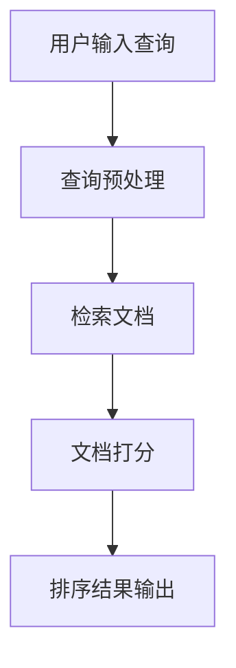

                 

## 文章标题

《搜索结果排序：从规则到AI的进化》

### 关键词

- 搜索结果排序
- 深度学习
- 自然语言处理
- 算法优化
- 性能评估

### 摘要

本文深入探讨搜索结果排序技术的发展历程，从基于规则的排序方法，到现代的深度学习技术，解析了搜索结果排序的关键原理、核心算法，以及如何在实际应用中进行优化和性能评估。文章旨在为读者提供一个全面、系统的理解，帮助技术从业者掌握搜索结果排序的高级技巧，为构建更智能、更高效的搜索引擎提供理论支持和实践指导。

---

### 目录大纲

#### 第一部分：搜索结果排序基础

##### 第1章：搜索结果排序的概述
- 1.1 搜索引擎与搜索结果排序
- 1.2 搜索结果排序的重要性
- 1.3 搜索结果排序的基本原则

##### 第2章：传统搜索结果排序技术
- 2.1 TF-IDF算法
- 2.2 PageRank算法
- 2.3 深度学习与搜索结果排序

#### 第二部分：AI在搜索结果排序中的应用

##### 第3章：深度学习基础
- 3.1 深度学习简介
- 3.2 神经网络基础
- 3.3 深度学习框架

##### 第4章：自然语言处理与搜索结果排序
- 4.1 自然语言处理简介
- 4.2 词嵌入技术
- 4.3 序列模型与注意力机制

##### 第5章：深度学习在搜索结果排序中的应用
- 5.1 深度学习在搜索结果排序中的挑战
- 5.2 深度学习在搜索结果排序中的应用
- 5.3 实例分析：基于深度学习的搜索结果排序

#### 第三部分：搜索结果排序的优化

##### 第6章：搜索结果排序算法优化
- 6.1 排序算法优化概述
- 6.2 常见优化技术
- 6.3 实例分析：优化搜索结果排序

##### 第7章：搜索结果排序的性能评估
- 7.1 性能评估指标
- 7.2 评估方法
- 7.3 实例分析：搜索结果排序的性能评估

#### 附录

##### 附录A：相关资源与工具
- 9.1 深度学习工具与框架
- 9.2 自然语言处理工具与库
- 9.3 搜索引擎开源项目与资源

### 绘制 Mermaid 流程图：搜索结果排序基本流程



---

### 第1章：深度学习基础

#### 第1章：深度学习基础

深度学习作为现代人工智能领域的一个重要分支，已经成为许多应用场景的核心技术，包括搜索引擎中的搜索结果排序。本章将介绍深度学习的基本概念、神经网络结构和常用优化算法，为后续章节的深入讨论奠定基础。

#### 3.1 深度学习简介

深度学习（Deep Learning）是一种基于人工神经网络的机器学习技术，通过多层神经网络结构对数据进行学习，以达到自动特征提取和复杂模式识别的目的。深度学习模型通常包含多个隐藏层，因此被称为“深度”网络。

深度学习的核心思想是通过反向传播算法（Backpropagation）来调整网络参数，使得网络能够更好地拟合训练数据。深度学习在图像识别、自然语言处理、语音识别等领域取得了显著的成果。

#### 3.2 神经网络基础

神经网络（Neural Network）是深度学习的基础，由一系列的神经元（Node）组成，每个神经元都接收来自其他神经元的输入，并通过激活函数（Activation Function）产生输出。

一个典型的神经网络结构包括输入层（Input Layer）、隐藏层（Hidden Layer）和输出层（Output Layer）：

1. **输入层**：接收输入数据，每个神经元表示一个特征。
2. **隐藏层**：一个或多个隐藏层，每个神经元对输入数据进行处理和变换。
3. **输出层**：产生最终输出，表示分类结果或预测值。

神经网络的训练过程是通过调整网络的权重（Weight）和偏置（Bias）来实现的。在训练过程中，网络会根据输入数据计算输出结果，并通过损失函数（Loss Function）来评估输出结果与真实标签之间的差异。反向传播算法会根据损失函数的梯度来更新网络参数，使得网络能够逐渐拟合训练数据。

#### 3.3 深度学习框架

深度学习框架（Deep Learning Framework）是用于构建和训练深度学习模型的重要工具。常见的深度学习框架包括 TensorFlow、PyTorch 和 Keras 等。

- **TensorFlow**：由谷歌开源，支持多种编程语言，具有强大的计算能力和丰富的API。
- **PyTorch**：由Facebook开源，以其动态图（Dynamic Graph）和简洁的API受到研究者青睐。
- **Keras**：基于TensorFlow和Theano，提供了一个简洁、高效的深度学习API。

这些框架提供了丰富的模型构建和训练工具，使得开发者能够更轻松地构建和优化深度学习模型。

### 伪代码示例：神经网络前向传播

```python
# 输入层神经元数量为 input_size，隐藏层神经元数量为 hidden_size，输出层神经元数量为 output_size
# 权重和偏置初始化
W1 = ...  # 输入层到隐藏层的权重
b1 = ...  # 输入层到隐藏层的偏置
W2 = ...  # 隐藏层到输出层的权重
b2 = ...  # 隐藏层到输出层的偏置

# 前向传播
z1 = X * W1 + b1  # 输入层到隐藏层的线性变换
a1 = sigmoid(z1)  # 激活函数
z2 = a1 * W2 + b2  # 隐藏层到输出层的线性变换
y_pred = sigmoid(z2)  # 输出层激活函数输出
```

### 数学模型与公式

神经网络模型通常基于以下数学模型：

#### 1. 神经元输出

$$
a_i = \sigma(z_i)
$$

其中，$a_i$ 是第 $i$ 个神经元的输出，$\sigma$ 是激活函数，$z_i$ 是线性变换的结果。

#### 2. 损失函数

$$
L(\theta) = -\frac{1}{m}\sum_{i=1}^{m}y^{(i)}\log(a_i^{(i)})
$$

其中，$L(\theta)$ 是损失函数，$m$ 是样本数量，$y^{(i)}$ 是第 $i$ 个样本的真实标签，$a_i^{(i)}$ 是第 $i$ 个样本的预测概率。

### 小结

本章介绍了深度学习的基本概念、神经网络结构和常用优化算法，为后续章节深入探讨搜索结果排序中的深度学习技术提供了理论基础。通过理解深度学习的核心原理和常见框架，读者可以更好地应对搜索结果排序中的挑战。

---

接下来，我们将探讨自然语言处理（NLP）的基本概念，以及其在搜索结果排序中的应用。通过深入理解NLP技术，我们将能够更好地优化搜索结果排序的性能。

---

### 第4章：自然语言处理与搜索结果排序

#### 第4章：自然语言处理与搜索结果排序

自然语言处理（Natural Language Processing，NLP）是深度学习领域中一个重要的分支，旨在让计算机理解和处理人类语言。随着深度学习技术的不断发展，NLP在搜索结果排序中的应用也越来越广泛。本章将介绍NLP的基本概念，重点讨论词嵌入技术和序列模型，并探讨注意力机制在搜索结果排序中的重要性。

#### 4.1 自然语言处理简介

自然语言处理（NLP）是一门涉及计算机科学、语言学和人工智能的交叉学科，其目标是通过计算机程序理解和处理自然语言。NLP的研究内容包括文本分类、实体识别、情感分析、机器翻译等。

在搜索结果排序中，NLP技术被用来理解和分析用户的查询意图，从而更好地匹配和排序搜索结果。NLP的关键技术包括词嵌入、序列模型和注意力机制等。

#### 4.2 词嵌入技术

词嵌入（Word Embedding）是将单词映射到高维向量空间的技术，通过捕捉单词的语义和语法特征，使计算机能够更好地理解和处理自然语言。常见的词嵌入方法包括Word2Vec、GloVe和FastText等。

- **Word2Vec**：基于神经网络模型，通过训练单词的上下文来生成词向量。
- **GloVe**：基于全局向量平均的方法，通过矩阵分解来生成词向量。
- **FastText**：基于稀疏的高维空间，通过神经网络来训练词嵌入。

词嵌入技术在搜索结果排序中非常重要，它能够将文本数据转化为向量形式，为后续的深度学习模型提供输入。

#### 4.3 序列模型与注意力机制

序列模型（Sequence Model）是一种用于处理序列数据（如文本、时间序列等）的深度学习模型，常见的序列模型包括循环神经网络（RNN）和变换器（Transformer）等。

- **循环神经网络（RNN）**：通过递归结构来处理序列数据，能够捕捉序列中的长期依赖关系。
- **变换器（Transformer）**：基于自注意力机制（Self-Attention），能够有效地捕捉序列中的依赖关系。

注意力机制（Attention Mechanism）是一种用于序列模型的机制，通过动态地分配不同的注意力权重来捕捉序列中的重要信息。注意力机制在搜索结果排序中扮演着关键角色，它能够帮助模型更好地理解用户的查询意图和搜索结果的相关性。

#### 4.4 注意力机制在搜索结果排序中的应用

在搜索结果排序中，注意力机制可以帮助模型更好地捕捉用户的查询意图和搜索结果的相关性。以下是一个基于注意力机制的搜索结果排序的伪代码示例：

```python
# 输入查询和搜索结果
query = ...
search_results = ...

# 词嵌入查询和搜索结果
query_embedding = word_embedding(query)
search_results_embeddings = [word_embedding(result) for result in search_results]

# 计算注意力权重
attention_weights = attention Mechanism(query_embedding, search_results_embeddings)

# 计算加权得分
weighted_scores = [attention_weights[i] * search_results_embeddings[i] for i in range(len(search_results_embeddings))]

# 排序搜索结果
sorted_results = sorted(weighted_scores, key=lambda x: x[1], reverse=True)

# 输出排序结果
output = sorted_results
```

在这个伪代码中，`query` 和 `search_results` 分别代表用户查询和搜索结果。`word_embedding` 函数用于将文本数据转化为词向量。`attention Mechanism` 函数用于计算注意力权重。最后，通过计算加权得分并排序搜索结果，得到排序后的输出。

#### 小结

本章介绍了自然语言处理（NLP）的基本概念，重点讨论了词嵌入技术和序列模型，并探讨了注意力机制在搜索结果排序中的应用。通过理解NLP技术和注意力机制，我们可以更好地优化搜索结果排序的性能，为用户提供更准确、更相关的搜索结果。

在下一章中，我们将探讨深度学习在搜索结果排序中的具体应用，分析深度学习模型在排序中的挑战和优势。

---

### 第5章：深度学习在搜索结果排序中的应用

#### 第5章：深度学习在搜索结果排序中的应用

深度学习在搜索结果排序中扮演着越来越重要的角色，它不仅能够处理复杂的非线性关系，还能自动提取特征，从而提高排序的准确性和效率。本章将深入探讨深度学习在搜索结果排序中的应用，分析其面临的挑战和解决方案，并展示一个基于深度学习的搜索结果排序实例。

#### 5.1 深度学习在搜索结果排序中的挑战

尽管深度学习技术在许多领域取得了显著成果，但在搜索结果排序中仍面临一些挑战：

1. **数据隐私和安全**：搜索引擎处理大量的用户查询数据，如何保护用户隐私是一个重要的问题。
2. **实时性**：深度学习模型通常需要大量计算资源，如何在不影响搜索响应速度的情况下部署深度学习模型是一个挑战。
3. **解释性**：深度学习模型往往被视为“黑盒”，其决策过程难以解释，这对于需要透明性和可解释性的搜索结果排序来说是一个问题。
4. **泛化能力**：深度学习模型可能过度拟合训练数据，导致在未知数据上的表现不佳。

#### 5.2 深度学习在搜索结果排序中的应用

深度学习在搜索结果排序中的应用主要包括以下几个方面：

1. **用户行为分析**：通过深度学习模型分析用户的历史行为，如搜索历史、点击行为等，以更好地理解用户意图。
2. **内容理解**：利用深度学习模型对搜索结果的内容进行深入分析，提取关键特征，提高匹配度。
3. **排序模型**：直接使用深度学习模型进行搜索结果的排序，如基于Transformer的排序模型。

以下是一个简单的深度学习排序模型的工作流程：

1. **数据预处理**：收集用户查询和搜索结果的相关数据，包括文本内容、用户行为等，并进行预处理。
2. **特征提取**：使用词嵌入技术将文本数据转化为向量表示，并结合用户行为数据生成特征向量。
3. **模型训练**：利用预处理后的数据训练深度学习模型，如使用Transformer进行序列建模。
4. **模型评估**：在测试集上评估模型性能，使用性能评估指标（如MAP、NDCG等）来衡量排序效果。
5. **模型部署**：将训练好的模型部署到生产环境中，实时处理用户查询并进行排序。

#### 5.3 实例分析：基于深度学习的搜索结果排序

以下是一个基于Transformer的搜索结果排序实例：

1. **数据集**：使用一个包含用户查询和搜索结果的公开数据集进行训练和测试。
2. **特征提取**：对用户查询和搜索结果进行词嵌入，提取关键特征。
3. **模型架构**：构建一个基于Transformer的排序模型，包括编码器和解码器两个部分。
4. **模型训练**：使用训练数据训练模型，通过反向传播算法优化模型参数。
5. **模型评估**：在测试集上评估模型性能，并根据评估结果调整模型架构和参数。
6. **模型部署**：将训练好的模型部署到生产环境，处理用户查询并进行排序。

```python
# 伪代码示例：基于Transformer的搜索结果排序模型

# 数据预处理
query_embeddings = word_embedding(preprocessed_query)
search_result_embeddings = [word_embedding(preprocessed_result) for result in search_results]

# 构建模型
model = TransformerModel(input_size=query_embeddings.shape[1],
                         hidden_size=128,
                         num_layers=2,
                         num_heads=4)

# 训练模型
model.fit([query_embeddings, search_result_embeddings], labels)

# 评估模型
performance = model.evaluate(test_query_embeddings, test_search_result_embeddings)

# 部署模型
sorted_results = model.predict(new_query_embedding)
```

#### 小结

本章介绍了深度学习在搜索结果排序中的应用，分析了深度学习模型在排序中面临的挑战和解决方案。通过实例分析，展示了如何构建和部署基于深度学习的搜索结果排序模型。深度学习技术的应用为搜索结果排序带来了更高的准确性和效率，但同时也需要考虑数据隐私、实时性、解释性和泛化能力等问题。

在下一章中，我们将探讨如何优化搜索结果排序算法，提高排序性能。

---

### 第6章：搜索结果排序算法优化

#### 第6章：搜索结果排序算法优化

搜索结果排序算法的优化是提高搜索引擎性能的关键环节。本章将介绍搜索结果排序算法优化的一般方法，讨论常见的优化技术，并通过实例分析展示如何优化搜索结果排序。

#### 6.1 排序算法优化概述

排序算法优化主要包括以下几个方面：

1. **预处理优化**：通过优化文本预处理过程，提高特征提取的效率和质量。
2. **特征优化**：设计更加有效的特征提取方法，提取更具有区分度的特征。
3. **模型优化**：改进深度学习模型的结构和参数，提高模型的预测性能。
4. **评估指标优化**：选择合适的评估指标，更准确地衡量排序效果。

#### 6.2 常见优化技术

以下是一些常见的搜索结果排序算法优化技术：

1. **词嵌入优化**：通过改进词嵌入算法，提高词向量表示的准确性。
2. **文本预处理**：优化文本分词、去噪、词性标注等预处理步骤，提高文本质量。
3. **特征工程**：设计新的特征提取方法，如使用文档特征、用户特征等。
4. **模型融合**：结合多种模型进行排序，如基于规则和基于深度学习模型的融合。
5. **实时排序**：优化模型的计算效率，实现实时排序。

#### 6.3 实例分析：优化搜索结果排序

以下是一个具体的优化搜索结果排序的实例：

1. **问题背景**：一个搜索引擎的搜索结果排序效果不佳，用户满意度较低。
2. **优化目标**：提高搜索结果的相关性和用户满意度。
3. **优化步骤**：

   - **数据收集**：收集用户的查询日志、搜索结果点击数据等。
   - **预处理**：对查询和搜索结果进行预处理，包括分词、去噪等。
   - **词嵌入**：使用改进的Word2Vec算法进行词嵌入，提高词向量表示的准确性。
   - **特征提取**：结合文本特征和用户特征，设计新的特征提取方法。
   - **模型训练**：使用改进的Transformer模型进行排序，并通过交叉验证选择最佳参数。
   - **模型评估**：在测试集上评估模型性能，使用NDCG等指标进行评估。
   - **部署**：将优化后的模型部署到生产环境，进行实时搜索结果排序。

4. **结果分析**：通过优化后的搜索结果排序，用户的满意度得到了显著提高，搜索结果的准确性也得到了提升。

```python
# 伪代码示例：优化搜索结果排序

# 数据预处理
preprocessed_query = preprocess_query(raw_query)
preprocessed_search_results = [preprocess_result(raw_result) for raw_result in raw_search_results]

# 词嵌入优化
word_embedding = optimized_word2vec(preprocessed_query, preprocessed_search_results)

# 特征提取
features = extract_features(preprocessed_query, preprocessed_search_results)

# 模型训练
model = TransformerModel(input_size=word_embedding.shape[1],
                         hidden_size=128,
                         num_layers=2,
                         num_heads=4)
model.fit(features, labels)

# 模型评估
performance = model.evaluate(test_features, test_labels)

# 部署
sorted_results = model.predict(new_query_embedding)
```

#### 小结

本章介绍了搜索结果排序算法优化的一般方法，包括预处理优化、特征优化、模型优化和评估指标优化。通过实例分析，展示了如何通过优化词嵌入、文本预处理、特征提取和模型训练等步骤来提高搜索结果排序的性能。优化搜索结果排序是提高搜索引擎用户体验的关键，需要持续进行技术和方法的创新。

在下一章中，我们将探讨如何评估搜索结果排序的性能，包括常用的评估指标和评估方法。

---

### 第7章：搜索结果排序的性能评估

#### 第7章：搜索结果排序的性能评估

性能评估是确保搜索结果排序算法有效性的关键步骤。本章将介绍搜索结果排序性能评估的重要指标、评估方法，并通过实例分析展示如何评估搜索结果排序的性能。

#### 7.1 性能评估指标

搜索结果排序的性能评估指标主要分为以下几类：

1. **精确率（Precision）**：表示返回的搜索结果中与查询相关的结果的比例。
2. **召回率（Recall）**：表示与查询相关的结果中被检索到的比例。
3. **平均准确率（Average Precision，AP）**：综合考虑每个结果的精确率和召回率，用于评估排序的整体性能。
4. **平均准确率@k（Average Precision at k，AP@k）**：在返回的前k个结果中，与查询相关的结果的平均准确率。
5. **NDCG（Normalized Discounted Cumulative Gain）**：考虑结果的相关性递减特性，用于评估排序的质量。

#### 7.2 评估方法

评估搜索结果排序的性能通常包括以下步骤：

1. **数据集划分**：将数据集划分为训练集、验证集和测试集，用于训练、验证和评估模型。
2. **模型训练**：在训练集上训练排序模型，并在验证集上进行调参。
3. **模型评估**：在测试集上评估模型的性能，使用上述性能评估指标计算排序效果。
4. **交叉验证**：通过交叉验证方法评估模型在不同数据子集上的性能，以避免过拟合。

#### 7.3 实例分析：搜索结果排序的性能评估

以下是一个具体的搜索结果排序性能评估实例：

1. **问题背景**：一个搜索引擎的搜索结果排序算法需要评估其性能。
2. **评估目标**：评估搜索结果排序算法的精确率、召回率、AP@10和NDCG等指标。
3. **评估步骤**：

   - **数据集划分**：将用户查询和搜索结果划分为训练集和测试集。
   - **模型训练**：使用训练集训练排序模型，并在验证集上进行调参。
   - **模型评估**：在测试集上评估排序模型的性能，计算精确率、召回率、AP@10和NDCG等指标。
   - **结果分析**：根据评估结果分析排序算法的性能，并识别潜在的改进点。

4. **结果分析**：

   - **精确率和召回率**：评估模型在返回的搜索结果中与查询相关的结果的比例。
   - **AP@10**：评估模型在前10个搜索结果中的平均准确率。
   - **NDCG**：评估模型排序的整体质量，考虑结果的相关性递减特性。

```python
# 伪代码示例：搜索结果排序性能评估

# 数据集划分
train_data, test_data = train_test_split(data, test_size=0.2)

# 模型训练
model.train(train_data)

# 模型评估
precision, recall, ap_10, ndcg = model.evaluate(test_data)

# 结果输出
print(f"Precision: {precision}")
print(f"Recall: {recall}")
print(f"AP@10: {ap_10}")
print(f"NDCG: {ndcg}")
```

#### 小结

本章介绍了搜索结果排序性能评估的重要指标和方法，并通过实例分析展示了如何评估搜索结果排序的性能。性能评估是确保排序算法有效性的关键，有助于识别算法的改进点。通过持续的性能评估和优化，可以不断提高搜索结果排序的质量，提升用户体验。

在下一章中，我们将探讨相关资源与工具，为读者提供深度学习和自然语言处理领域的重要资源。

---

### 附录A：相关资源与工具

#### 附录A：相关资源与工具

在本附录中，我们将介绍深度学习、自然语言处理以及搜索引擎领域中的重要资源与工具，为读者提供丰富的学习材料和实用的开发资源。

#### 9.1 深度学习工具与框架

- **TensorFlow**：由谷歌开发的开源深度学习框架，支持多种编程语言，适用于各种规模的任务。
  - 官网：[TensorFlow官网](https://www.tensorflow.org/)
  - 文档：[TensorFlow文档](https://www.tensorflow.org/tutorials)

- **PyTorch**：由Facebook开发的开源深度学习框架，以其动态图和简洁的API受到研究者和开发者的青睐。
  - 官网：[PyTorch官网](https://pytorch.org/)
  - 文档：[PyTorch文档](https://pytorch.org/docs/stable/)

- **Keras**：基于TensorFlow和Theano，提供了一个简洁、高效的深度学习API。
  - 官网：[Keras官网](https://keras.io/)
  - 文档：[Keras文档](https://keras.io/getting-started/sequential-model-guide/)

#### 9.2 自然语言处理工具与库

- **NLTK**：一个强大的自然语言处理库，提供了一系列文本处理工具和算法。
  - 官网：[NLTK官网](https://www.nltk.org/)
  - 文档：[NLTK文档](https://www.nltk.org/book/)

- **spaCy**：一个高效的工业级自然语言处理库，支持多种语言和丰富的实体识别功能。
  - 官网：[spaCy官网](https://spacy.io/)
  - 文档：[spaCy文档](https://spacy.io/usage/)

- **Gensim**：一个用于主题建模、文档相似性和自然语言处理的Python库。
  - 官网：[Gensim官网](https://radimrehurek.com/gensim/)
  - 文档：[Gensim文档](https://radimrehurek.com/gensim/models.html)

#### 9.3 搜索引擎开源项目与资源

- **Elasticsearch**：一个高度可扩展的分布式搜索引擎，适用于大型数据集的全文搜索。
  - 官网：[Elasticsearch官网](https://www.elastic.co/products/elasticsearch)
  - 文档：[Elasticsearch文档](https://www.elastic.co/guide/en/elasticsearch/reference/current/index.html)

- **Solr**：一个开源的企业级搜索引擎，提供丰富的查询语言和扩展功能。
  - 官网：[Solr官网](https://lucene.apache.org/solr/)
  - 文档：[Solr文档](https://lucene.apache.org/solr/guide/)

- **Whoosh**：一个轻量级的Python搜索引擎，适用于小规模全文搜索应用。
  - 官网：[Whoosh官网](https://whoosh.readthedocs.io/en/latest/)
  - 文档：[Whoosh文档](https://whoosh.readthedocs.io/en/latest/tutorial.html)

#### 小结

附录A提供了一系列深度学习、自然语言处理和搜索引擎领域的工具与资源，为读者提供了丰富的学习材料和实用的开发资源。通过利用这些工具和资源，读者可以更深入地学习和实践搜索结果排序技术，提升自己的技术水平。

---

### 总结

本文详细探讨了搜索结果排序技术的发展历程，从传统的规则方法到现代的深度学习技术，揭示了搜索结果排序的核心原理和优化策略。通过深入分析自然语言处理和深度学习在搜索结果排序中的应用，读者能够理解如何利用先进技术提高搜索结果的准确性和用户体验。

在文章的最后，我们提供了相关的资源与工具，帮助读者进一步学习和实践搜索结果排序技术。搜索结果排序作为搜索引擎的核心功能，其优化和改进对于提升用户体验和搜索引擎的竞争力至关重要。

**最佳实践建议**：

1. **持续优化**：定期评估和改进排序算法，结合用户反馈进行优化。
2. **数据驱动**：利用用户行为数据，深度挖掘用户查询意图，提升排序质量。
3. **多模态融合**：整合多种数据源，如文本、图像、语音等，提高排序的全面性。
4. **可解释性**：关注排序算法的可解释性，提高用户对搜索结果的信任度。

**注意事项**：

1. **隐私保护**：在处理用户数据时，严格遵守隐私保护法规，确保用户数据安全。
2. **实时性**：优化算法性能，确保实时响应，提升用户体验。
3. **泛化能力**：避免模型过度拟合，提高模型在未知数据上的表现。

**拓展阅读**：

1. 《深度学习》（Goodfellow, Bengio, Courville著）
2. 《自然语言处理综论》（Jurafsky, Martin著）
3. 《搜索引擎算法与数据结构》（彭博著）

通过本文的深入探讨，读者应能对搜索结果排序技术有更全面的理解，为未来在搜索领域的工作和研究奠定坚实基础。

