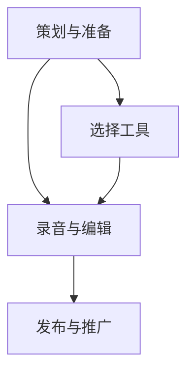

                 

### 播客制作基础

#### 第1章：播客制作入门

##### 1.1 播客的概念与价值

播客（Podcast）是指一种通过互联网传输的音频内容，用户可以随时随地进行订阅和收听。播客这一概念最早起源于苹果公司推出的iPod，因此得名。随着移动互联网的普及，播客逐渐成为一种流行的媒体形式。

**播客的定义**

播客通常是由一系列连续的音频文件组成，这些文件可以通过网络下载或通过专门的播客应用程序进行订阅和播放。播客的内容涵盖了各种领域，如新闻、娱乐、教育、科技、商业等，具有高度个性化的特点。

**播客的发展历程**

播客的发展可以分为几个阶段：

1. **初期阶段**：2004年左右，播客开始兴起，主要依托于苹果公司的iTunes Store进行分发。
2. **快速增长阶段**：2005年至2010年，随着智能手机的普及，播客听众数量迅速增加，内容形式和种类也更加丰富。
3. **成熟阶段**：2010年以后，播客进入成熟期，逐渐形成了一套完整的产业生态，包括内容创作、制作、分发、广告营销等环节。

**播客在当今社会的影响**

播客作为一种新兴的媒体形式，对当今社会产生了深远的影响：

1. **媒体消费习惯的改变**：播客让用户可以更加便捷地获取信息，改变了传统的媒体消费习惯。
2. **内容创作与传播的创新**：播客为个人和专业机构提供了一个低成本的内容创作与传播平台。
3. **商业模式的变化**：播客成为了一种新的广告形式，为内容创作者带来了新的收入来源。

##### 1.2 播客制作的基本流程

播客制作的基本流程可以分为以下几个阶段：

**策划与准备阶段**

1. **确定主题与目标受众**：首先需要明确播客的内容主题和目标受众，以便进行后续的策划和创作。
2. **准备素材**：包括撰写脚本、录制音频、收集图片、视频等辅助素材。
3. **制作预算**：根据播客的制作规模和成本进行预算规划。

**录音与编辑阶段**

1. **录音**：选择合适的录音设备和环境，进行音频录制。录音过程中要注意声音质量，避免噪声干扰。
2. **编辑**：使用音频编辑软件对录制的音频进行剪辑、混音、添加音效等操作，使其达到理想的效果。

**发布与推广阶段**

1. **上传与分发**：将编辑好的音频文件上传到播客平台，如Apple Podcasts、Spotify、喜马拉雅等。
2. **推广**：通过社交媒体、邮件列表、合作推广等方式，吸引听众和用户。

##### 1.3 播客制作工具的选择

在进行播客制作时，选择合适的工具非常重要。以下是一些主流的播客制作工具及其特点：

**Audacity**

Audacity是一款免费、开源的音频编辑软件，支持多种操作系统，功能强大且易于使用。它适合初学者和有经验的用户进行音频剪辑和编辑。

**Adobe Audition**

Adobe Audition是Adobe公司的一款专业音频编辑软件，功能全面，支持多轨音频编辑、声音修复、特效应用等。它适合专业用户进行高级音频处理和后期制作。

**Logic Pro X**

Logic Pro X是苹果公司推出的一款专业音频制作软件，具有丰富的功能，包括多轨音频编辑、声音效果、音乐制作等。它适合专业音乐人和播客制作人员使用。

**不同工具的特点与应用场景**

1. **Audacity**：适合个人或小型团队进行简单音频剪辑和编辑。
2. **Adobe Audition**：适合专业用户进行复杂音频处理和后期制作。
3. **Logic Pro X**：适合专业音乐人和播客制作人员进行高级音频处理和音乐制作。

**工具的兼容性与扩展性**

在选择播客制作工具时，需要考虑其兼容性和扩展性。 ideally，工具应该支持多种音频格式和操作系统，同时提供丰富的插件和扩展功能，以适应不同的制作需求。

##### 1.4 播客制作工具的使用

**Audacity使用指南**

1. **界面与工具栏介绍**：Audacity的界面主要包括菜单栏、工具栏、音轨面板等。用户可以通过工具栏快速访问常用的音频编辑功能。
2. **基本操作与快捷键**：了解和掌握Audacity的基本操作和快捷键，可以提高工作效率。例如，使用“Ctrl+C”进行复制、“Ctrl+V”进行粘贴等。
3. **音频文件的导入与导出**：用户可以导入各种音频格式，如MP3、WAV、AAC等，并进行编辑。导出时，可以选择不同的音频格式和参数，以满足不同的需求。

**Adobe Audition入门到精通**

1. **基本操作与快捷键**：Adobe Audition的界面设计更加专业，用户需要掌握其基本操作和快捷键，如“Ctrl+Z”撤销、“Ctrl+Shift+Z”重做等。
2. **高级编辑技巧**：Adobe Audition支持多轨音频编辑，用户可以灵活地进行音频剪辑、混音、添加音效等操作。此外，它还提供了一系列高级工具，如声音修复、降噪等。
3. **实战案例**：通过实际案例的学习和实践，用户可以更好地掌握Adobe Audition的使用技巧。例如，制作一首音乐、修复一段录音等。

**Logic Pro X播客制作实战**

1. **基础操作与快捷键**：Logic Pro X的界面设计简洁明了，用户可以通过工具栏快速访问常用的功能。掌握快捷键可以提高工作效率。
2. **高级编辑技巧**：Logic Pro X支持多轨音频编辑和音乐制作，用户可以灵活运用其高级功能，如音频修复、声音效果、多音轨合成等。
3. **实战案例**：通过实际案例的学习和实践，用户可以更好地掌握Logic Pro X的使用技巧。例如，制作一档播客节目、录制一首歌曲等。

##### 1.5 播客制作工具的比较与选择

**不同工具的优缺点**

1. **Audacity**：优点是免费、开源、功能强大，适合初学者和有经验的用户。缺点是界面不够友好，部分高级功能较复杂。
2. **Adobe Audition**：优点是功能全面、专业性强，适合专业用户进行复杂音频处理和后期制作。缺点是价格较高，入门门槛较高。
3. **Logic Pro X**：优点是界面简洁、功能强大，适合专业音乐人和播客制作人员。缺点是价格较高，需要一定的音乐制作基础。

**选择工具的考虑因素**

1. **预算**：根据制作预算选择合适的工具，如Audacity适合预算有限的用户。
2. **功能需求**：根据制作需求选择具有相应功能的工具，如Adobe Audition适合进行复杂音频处理和后期制作。
3. **平台兼容性**：根据操作系统和硬件配置选择兼容性较好的工具。

##### 1.6 播客制作工具的未来发展趋势

**新技术的应用**

随着人工智能、云计算等新技术的不断发展，播客制作工具将迎来新的变革：

1. **人工智能**：人工智能技术在音频识别、自动剪辑、语音合成等方面具有广泛的应用前景，将为播客制作带来更高的效率和智能化。
2. **云端服务**：云端服务将使得播客制作工具更加灵活和便捷，用户可以通过互联网随时随地访问和使用这些工具。
3. **跨平台协同工作**：跨平台协同工作将使得多个用户可以在同一项目上进行协作，提高工作效率和创作质量。

**行业趋势与挑战**

播客制作工具的发展也将面临一些挑战：

1. **市场竞争**：随着越来越多的工具进入市场，竞争将日益激烈，工具需要不断创新和优化，以满足用户的需求。
2. **法规与伦理问题**：随着播客内容的普及，相关的法规和伦理问题也将受到关注，工具需要遵循相关的法规和伦理规范。

### 结论

播客制作工具为音频内容创作提供了强大的支持，无论是个人爱好者还是专业机构，都可以通过这些工具轻松制作出高质量的音频内容。未来，随着新技术的不断涌现，播客制作工具将更加智能化和便捷化，为用户带来更好的创作体验。

---

作者：AI天才研究院/AI Genius Institute & 禅与计算机程序设计艺术 /Zen And The Art of Computer Programming

---

核心概念与联系

播客的核心概念包括播客的定义、发展历程、基本流程和制作工具。这些概念之间存在紧密的联系：

- **播客定义**是播客的基础，指明了播客的基本特性和形式。
- **发展历程**展示了播客从兴起、快速增长到成熟的过程，揭示了播客在社会中的地位和影响力。
- **基本流程**包括策划与准备、录音与编辑、发布与推广，是制作播客的具体步骤。
- **制作工具**是播客制作过程中不可或缺的部分，决定了播客的质量和效率。

下面是一个简单的Mermaid流程图，展示了播客制作的基本流程：



**核心算法原理讲解**

在播客制作中，算法主要应用于音频编辑和声音处理。以下是一个简单的音频剪辑算法的伪代码：

```plaintext
function audioClip(inputFile, outputFile, start, end):
    // 读取音频文件
    audio = readAudioFile(inputFile)
    
    // 提取音频片段
    clip = extractAudioSegment(audio, start, end)
    
    // 保存剪辑后的音频文件
    saveAudioFile(clip, outputFile)
```

在这个算法中，`readAudioFile`用于读取输入音频文件，`extractAudioSegment`用于提取音频片段，`saveAudioFile`用于保存剪辑后的音频文件。

**数学模型和公式**

音频处理中的数学模型主要涉及傅里叶变换（Fourier Transform）和离散余弦变换（Discrete Cosine Transform，DCT）。以下是傅里叶变换的公式：

$$
F(\omega) = \int_{-\infty}^{\infty} f(t) e^{-j\omega t} dt
$$

其中，\( F(\omega) \) 是傅里叶变换的结果，\( f(t) \) 是原始信号，\( \omega \) 是频率。

**详细讲解与举例说明**

假设我们有一段长度为 \( N \) 的音频信号，我们可以使用离散傅里叶变换（DFT）来将其转换为频域表示。以下是一个简单的DFT算法的伪代码：

```plaintext
function dft(signal):
    N = length(signal)
    result = []

    for k from 0 to N-1:
        sum = 0
        
        for n from 0 to N-1:
            sum += signal[n] * e^(-j * 2 * pi * k * n / N)
        
        result.append(sum)
    
    return result
```

在这个算法中，`signal` 是输入音频信号，`result` 是DFT的结果。通过计算DFT，我们可以将音频信号从时域转换为频域，从而分析其频率成分。

**项目实战**

以下是一个简单的播客制作项目实战，包括开发环境搭建、源代码实现和代码解读。

**开发环境搭建**

1. 安装音频编辑软件（如Audacity、Adobe Audition等）。
2. 安装音频播放器（如foobar2000、VLC等）。
3. 准备音频素材（如录音文件、背景音乐等）。

**源代码实现**

以下是一个简单的Audacity脚本，用于批量剪辑音频文件：

```python
import os

def clip_audio(file_path, start_time, end_time, output_dir):
    os.system(f"audacity -n '{file_path}' -i '{output_dir}' -s {start_time} -e {end_time}")

input_dir = "input_files"
output_dir = "output_files"

for file in os.listdir(input_dir):
    if file.endswith(".wav"):
        file_path = os.path.join(input_dir, file)
        start_time = 0
        end_time = 60
        clip_audio(file_path, start_time, end_time, output_dir)

```

**代码解读**

- `clip_audio` 函数用于剪辑音频文件，它接收输入文件路径、开始时间和结束时间，以及输出目录作为参数。
- `os.system` 用于在命令行中运行Audacity命令。
- `os.listdir` 用于列出输入目录中的所有文件。
- `os.path.join` 用于拼接文件路径。

**代码应用解读与分析**

通过这个脚本，我们可以对输入目录中的所有音频文件进行批量剪辑。剪辑后的音频文件将保存到输出目录中。这个脚本可以用于简化音频剪辑过程，提高工作效率。

**实际案例分析和详细讲解剖析**

以下是一个实际的播客制作案例：

1. **案例背景**：一家科技公司的创始人决定制作一档科技播客，分享公司的最新技术和行业动态。
2. **策划与准备**：确定播客的主题、目标受众和内容结构。准备录音设备、脚本和辅助素材。
3. **录音与编辑**：录制播客内容，使用Audacity进行音频剪辑和编辑，包括音量调整、降噪、添加背景音乐等。
4. **发布与推广**：将编辑好的音频文件上传到播客平台，通过社交媒体和邮件列表进行推广。

**项目小结**

通过这个案例，我们可以看到播客制作的全过程，包括策划、录音、编辑和发布。正确的策划和准备是成功制作播客的关键，而音频编辑技巧则是提升播客质量的重要手段。

**最佳实践 tips**

1. **声音质量**：确保录音设备的质量，选择合适的录音环境和麦克风。
2. **音频编辑**：掌握基本的音频编辑技巧，如剪辑、混音、添加音效等。
3. **内容结构**：合理规划播客的内容结构，确保信息传递清晰、流畅。
4. **推广策略**：利用社交媒体和邮件列表进行推广，吸引更多的听众。

**小结**

播客制作工具为音频内容创作提供了强大的支持。通过了解播客制作的基础知识和基本流程，我们可以选择合适的工具，进行高质量的内容创作。随着新技术的不断发展，播客制作工具将更加智能化和便捷化，为用户带来更好的创作体验。

**注意事项**

1. **设备选择**：确保录音设备的质量，避免使用内置麦克风。
2. **音频格式**：选择适合的音频格式，如MP3、WAV等。
3. **编辑技巧**：掌握基本的音频编辑技巧，提升播客质量。

**拓展阅读**

- 《播客制作完全指南》：提供详细的播客制作流程和技巧。
- 《音频编辑技术解析》：介绍音频编辑的基本原理和技术。
- 《播客运营与营销策略》：分享播客运营和营销的最佳实践。

**附录 A：播客制作工具资源汇总**

### A.1 主流播客制作工具下载与安装指南

#### A.1.1 Audacity

**下载链接**：[Audacity官网](https://www.audacityteam.org/)

**安装步骤**：

1. 访问Audacity官网，下载对应操作系统的版本。
2. 运行安装程序，按照提示完成安装。

#### A.1.2 Adobe Audition

**下载链接**：[Adobe Audition官网](https://www.adobe.com/products/audition.html)

**安装步骤**：

1. 购买Adobe Audition许可证。
2. 访问Adobe官网，下载并安装Adobe Audition。
3. 输入许可证信息，激活软件。

#### A.1.3 Logic Pro X

**下载链接**：[苹果官网](https://www.apple.com/logic-pro/)

**安装步骤**：

1. 购买Logic Pro X许可证。
2. 下载Logic Pro X安装包。
3. 打开安装包，按照提示完成安装。

### A.2 播客制作教程与学习资源推荐

#### A.2.1 在线课程

- **Coursera**：提供《音频制作与播客》等课程。
- **Udemy**：提供《播客制作从入门到精通》等课程。

#### A.2.2 技术论坛与社区

- **Reddit**：[r/AudioProduction](https://www.reddit.com/r/AudioProduction/)
- **Discord**：加入相关的音频制作和播客制作的Discord频道。

#### A.2.3 技术文档与手册

- **Audacity官方文档**：[Audacity官方手册](https://manual.audacityteam.org/3/)
- **Adobe Audition官方文档**：[Adobe Audition帮助文档](https://helpx.adobe.com/audition/using/help.html)
- **Logic Pro X官方文档**：[Logic Pro X用户手册](https://support.apple.com/library/content/releasenotes/logistic/LogicProXReleaseNotes/LogicProXReleaseNotes.html)

