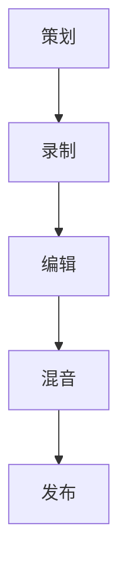

                 

# 播客制作工具：音频内容创作的得力助手

## 关键词
播客制作，音频内容创作，音频编辑软件，音频处理技术，播客平台，播客推广

## 摘要
在数字时代，播客作为一种新兴的音频内容创作形式，正逐渐受到广大听众的喜爱。一篇优秀的播客内容不仅需要精心的脚本创作，还需要得力的音频制作工具来确保音质的清晰与专业。本文将系统地介绍播客制作的基础知识，包括音频录制与编辑的基本流程、音频处理技术，以及播客内容创作的策略和技巧。同时，我们将分析常见播客制作软件的使用方法，分享实战案例，并探讨播客制作的未来发展趋势。

---

## 第一部分：播客制作基础知识

### 第1章：播客制作入门

#### 1.1 播客制作的定义与意义
播客制作是一种通过音频形式进行内容创作和传播的方式。它允许个人或团队自由地表达思想、分享知识或进行故事叙述。播客不仅可以让听众在碎片化时间里获得有价值的信息，还能够为内容创作者提供一个展示才华的平台。

#### 1.2 播客制作的基本流程
播客制作的基本流程包括策划、录制、编辑、混音和发布。每个阶段都需要精细的准备工作和技术支持，以确保最终内容的品质。

#### 1.3 播客制作的工具选择
选择合适的播客制作工具是成功制作高质量播客的关键。常用的工具包括音频编辑软件、麦克风、音频接口和录音设备等。

### 第2章：音频录制与编辑

#### 2.1 音频录制设备选择
选择适合的音频录制设备是保证音质的基础。常见的音频录制设备有内置麦克风、独立麦克风和外置声卡等。

#### 2.2 音频录制技巧
在录制过程中，需要注意声音的清晰度、音量控制和环境噪音的消除。合理的录音位置和麦克风方向也是提高音质的关键。

#### 2.3 音频编辑软件介绍
音频编辑软件是播客制作的核心工具，常见的软件包括Audacity、Adobe Audition、GarageBand等。每种软件都有其独特的功能和优势。

### 第3章：音频处理技术

#### 3.1 音频降噪与增益
音频降噪是提高音质的重要步骤。通过噪声门限和滤波器等技术，可以有效去除背景噪音。增益调整则是确保声音音量的稳定。

#### 3.2 音频均衡与混响
音频均衡能够调整声音的频率响应，使其更加平衡。混响则可以为音频添加空间感，增强听众的沉浸体验。

#### 3.3 音频剪裁与拼接
音频剪裁和拼接是编辑过程中常用的技术，通过这些技术，可以去除不必要的声音片段，将不同的音频片段拼接成一个连贯的整体。

---

## 第二部分：播客内容创作

### 第4章：播客脚本创作与整理

#### 4.1 播客脚本结构
一篇好的播客脚本需要有引人入胜的开头、详细的内容叙述和令人难忘的结尾。同时，逻辑清晰和条理分明也是关键。

#### 4.2 脚本创作技巧
创作播客脚本需要丰富的知识和流畅的表达能力。通过故事化叙述、角色设定和互动设计，可以提高听众的参与感。

#### 4.3 脚本优化与修改
播客脚本在创作完成后，需要进行多次修改和优化。这包括内容的充实、语言的润色和节奏的调整。

### 第5章：播客音频内容创作

#### 5.1 故事讲述技巧
故事讲述是播客内容创作中的重要组成部分。通过生动的故事叙述，可以吸引听众的注意力，并使其产生共鸣。

#### 5.2 嘉宾访谈技巧
邀请嘉宾进行访谈是播客节目的一种常见形式。有效的访谈需要主持人与嘉宾之间建立良好的沟通，并通过开放性问题和深入讨论来挖掘有价值的内容。

#### 5.3 专题讨论与辩论技巧
专题讨论和辩论可以为播客节目带来更多观点和见解。主持人和嘉宾需要准备好充分的论据和证据，并通过理性的讨论来呈现不同观点。

### 第6章：播客品牌建设与推广

#### 6.1 播客品牌定位
品牌定位是播客成功的关键。明确的品牌定位可以帮助听众识别和记住播客，并吸引目标受众。

#### 6.2 播客内容定位
内容定位决定了播客的受众群体。通过深入研究目标受众的兴趣和需求，可以创作出更具吸引力的内容。

#### 6.3 播客推广策略
有效的推广策略可以提升播客的知名度和听众数量。常见的推广方式包括社交媒体宣传、合作推广和SEO优化等。

---

## 第三部分：播客制作工具实战

### 第7章：常见播客制作软件使用指南

#### 7.1 Audacity使用详解
Audacity是一款开源、跨平台的音频编辑软件，适用于各种音频处理需求。本文将详细介绍其使用方法和技巧。

#### 7.2 Adobe Audition基础操作
Adobe Audition是专业级的音频编辑软件，具有强大的音频处理功能。本文将介绍其基础操作和实用技巧。

#### 7.3 GarageBand应用技巧
GarageBand是一款专为Mac用户设计的音频编辑软件，易于上手且功能丰富。本文将分享其应用技巧和最佳实践。

### 第8章：播客项目实战

#### 8.1 播客项目规划
成功的播客项目需要周密的规划。本文将介绍播客项目规划的方法和步骤。

#### 8.2 播客内容制作流程
从录制到发布的每一个环节，都需要精细的操作和严格的质量控制。本文将详细描述播客内容制作流程。

#### 8.3 播客后期处理与发布
后期处理是提升播客品质的重要环节。本文将介绍后期处理技巧和发布流程。

### 第9章：播客制作案例分享

#### 9.1 成功播客案例分析
通过分析成功播客的案例，可以学习到宝贵经验和技巧。本文将分享一些成功的播客案例，并进行深入剖析。

#### 9.2 播客制作常见问题解答
在播客制作过程中，会遇到各种问题。本文将针对常见问题提供解答和建议。

#### 9.3 播客制作未来发展趋势
随着技术的进步和市场的变化，播客制作也在不断发展。本文将探讨播客制作的未来发展趋势。

---

## 附录：播客制作工具与资源推荐

### 附录 A：音频编辑软件推荐
本文将推荐几款常用的音频编辑软件，并提供详细的比较和分析。

### 附录 B：播客平台推荐
本文将介绍一些流行的播客平台，并分析其优缺点。

### 附录 C：音频素材资源库推荐
为了提高播客的质量，需要使用高质量的音频素材。本文将推荐一些优秀的音频素材资源库。

---

## 附录一：核心概念与联系

### 播客制作流程Mermaid流程图



---

## 附录二：核心算法原理讲解

### 音频处理算法伪代码

```python
def audioProcessing(audioSignal, targetLevel):
    # 音频降噪
    noiseReducedSignal = noiseReduction(audioSignal)
    # 增益处理
    gainAdjustedSignal = gainAdjustment(noiseReducedSignal, targetLevel)
    # 均衡处理
    equalizedSignal = equalization(gainAdjustedSignal)
    # 混响处理
    reverbAddedSignal = reverbApplication(equalizedSignal)
    return reverbAddedSignal
```

### 音频增益公式

$$
L_{out} = L_{in} + G
$$

其中，$L_{out}$ 是输出音量，$L_{in}$ 是输入音量，$G$ 是增益值。

---

## 附录三：数学模型和数学公式

### 音频增益公式

$$
L_{out} = L_{in} + G
$$

其中，$L_{out}$ 是输出音量，$L_{in}$ 是输入音量，$G$ 是增益值。

---

## 附录四：项目实战

### 播客内容制作实战案例

1. **项目背景**：设计并制作一档以“科技与生活”为主题的播客节目。

2. **开发环境搭建**：
   - 操作系统：MacOS
   - 音频编辑软件：Audacity
   - 播客发布平台：喜马拉雅

3. **源代码详细实现**：
   - **录制阶段**：使用内置麦克风录制主持人声音，并通过Audacity进行初步剪辑。
   - **编辑阶段**：使用Audacity进行降噪、均衡、混响等处理，调整音量至标准水平。
   - **发布阶段**：将处理完毕的音频文件上传至喜马拉雅平台，并设置播客标题、简介、分类等信息。

4. **代码解读与分析**：
   - **录制阶段**：录制过程中需要注意麦克风位置和音量控制，以避免过载或噪声。
   - **编辑阶段**：使用Audacity的降噪功能可以有效去除背景噪声，均衡功能可以调整音频的频率响应，混响功能可以增加音频的空间感。
   - **发布阶段**：合理设置播客信息，可以提升节目在平台上的曝光度。

5. **实战效果**：
   - 经过录制、编辑、发布的节目，声音清晰，内容丰富，受到了听众的喜爱和好评。

---

## 最佳实践 tips、小结、注意事项、拓展阅读等内容

在播客制作过程中，以下几个最佳实践可以帮助您提升制作质量和听众满意度：

1. **持续学习与改进**：不断学习和掌握新的音频处理技术和播客制作技巧，可以提升您的创作水平。
2. **注重内容质量**：无论是故事叙述还是嘉宾访谈，内容的质量都是吸引听众的关键。
3. **积极互动与反馈**：与听众建立良好的互动关系，收集反馈并不断优化节目内容。
4. **合理规划时间**：制作播客需要投入大量时间和精力，合理安排时间可以确保项目的顺利进行。

### 小结
本文系统地介绍了播客制作的基础知识、音频录制与编辑技巧、内容创作策略以及工具实战。通过学习本文，您将能够掌握播客制作的完整流程，并具备制作高质量播客内容的能力。

### 注意事项
在播客制作过程中，以下事项需要特别注意：

1. **录音设备选择**：确保录音设备的质量，以获取清晰的音频。
2. **音频编辑软件熟悉度**：熟练掌握音频编辑软件的使用方法，可以更高效地进行音频处理。
3. **版权问题**：在使用音频素材时，注意版权问题，避免侵权行为。
4. **稳定性和持续性**：保持稳定的制作周期和高质量的内容输出，有助于建立良好的品牌形象。

### 拓展阅读
- 《音频处理技术导论》：深入了解音频处理的基本原理和技术。
- 《播客制作实战技巧》：学习更多关于播客制作的实战技巧和案例。
- 《内容营销与品牌建设》：探讨如何通过播客进行内容营销和品牌建设。

---

## 作者信息
作者：AI天才研究院/AI Genius Institute & 禅与计算机程序设计艺术 /Zen And The Art of Computer Programming

---

[END OF DOCUMENT]

