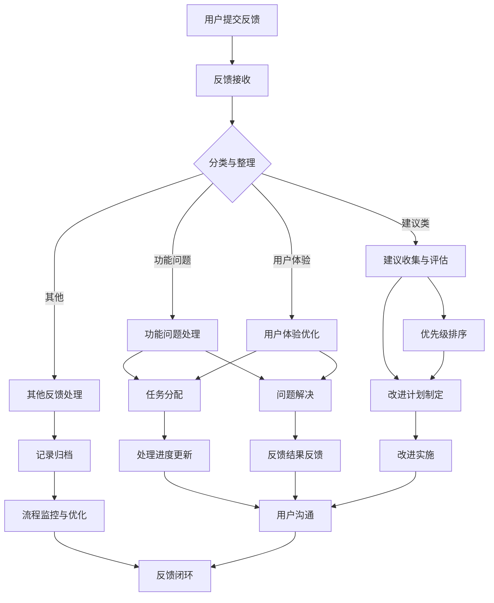

                 

# 文章标题

《收集用户反馈的有效方法》

> 关键词：用户反馈、问卷调查、访谈、观察、社交媒体分析、满意度、需求、痛点、期望

> 摘要：本文详细探讨了用户反馈的重要性，介绍了多种有效的用户反馈收集方法，并提出了提高反馈收集效率和处理的策略。通过案例分析，揭示了用户反馈在实际产品改进中的价值，为企业和开发者提供了实用的参考。

---

### 《收集用户反馈的有效方法》目录大纲

# 第一部分：用户反馈的重要性与基础理论

## 第1章：用户反馈的价值与意义

### 1.1 用户反馈的定义与类型

### 1.2 用户反馈在产品改进中的重要性

### 1.3 用户反馈对企业发展的贡献

## 第2章：用户反馈收集的方法与渠道

### 2.1 问卷调查法

### 2.2 用户访谈法

### 2.3 现场观察法

### 2.4 社交媒体分析

## 第3章：用户反馈的核心要素

### 3.1 用户满意度

### 3.2 用户需求

### 3.3 用户痛点

### 3.4 用户期望

# 第二部分：用户反馈的有效收集与处理

## 第4章：提高用户反馈收集效率的策略

### 4.1 设计简洁明了的反馈表单

### 4.2 设置合理的反馈奖励机制

### 4.3 鼓励用户积极参与反馈

### 4.4 建立反馈数据管理系统

## 第5章：用户反馈的处理与分析

### 5.1 用户反馈的分类与整理

### 5.2 用户反馈的定量与定性分析

### 5.3 用户反馈的优先级排序

### 5.4 用户反馈的反馈机制

## 第6章：用户反馈的响应与改进

### 6.1 制定有效的改进计划

### 6.2 及时向用户反馈改进结果

### 6.3 建立长期的用户反馈循环机制

### 6.4 用户反馈与用户关系的维护

# 第三部分：用户反馈实践案例分析

## 第7章：用户反馈实践案例分析一

### 7.1 案例背景

### 7.2 用户反馈收集方法

### 7.3 用户反馈处理与分析

### 7.4 用户反馈响应与改进

## 第8章：用户反馈实践案例分析二

### 8.1 案例背景

### 8.2 用户反馈收集方法

### 8.3 用户反馈处理与分析

### 8.4 用户反馈响应与改进

## 第9章：用户反馈实践案例分析三

### 9.1 案例背景

### 9.2 用户反馈收集方法

### 9.3 用户反馈处理与分析

### 9.4 用户反馈响应与改进

# 附录

### 附录A：用户反馈收集工具推荐

### 附录B：用户反馈分析模板

### 附录C：用户反馈处理流程图示## 第1章：用户反馈的价值与意义

### 1.1 用户反馈的定义与类型

用户反馈是指用户在使用某个产品或服务后，对其体验和感受的表达。它可以是正面的，如赞扬产品的易用性或服务质量；也可以是负面的，如对产品缺陷或服务不满的抱怨。用户反馈的类型多种多样，包括但不限于以下几种：

1. **满意度反馈**：用户对产品或服务的整体满意度，通常以评分或评论的形式出现。
2. **需求反馈**：用户对产品或服务的新功能、新特性的期望或建议。
3. **痛点反馈**：用户在使用产品或服务时遇到的具体问题或困扰。
4. **期望反馈**：用户对未来产品或服务改进方向的期待。

这些反馈对于产品或服务的改进至关重要，因为它们提供了直接来自用户的声音，帮助开发者和企业了解用户的需求和痛点，从而进行针对性的优化。

### 1.2 用户反馈在产品改进中的重要性

用户反馈是产品改进的重要依据。通过收集和分析用户反馈，开发者和企业可以获得以下几方面的价值：

1. **发现产品缺陷**：用户反馈可以帮助发现产品中的缺陷和问题，这些问题可能是用户在使用过程中遇到的障碍，也可能是产品设计的不足。
2. **理解用户需求**：用户反馈揭示了用户对产品或服务的实际需求，开发者可以根据这些需求进行功能优化或开发新的功能。
3. **改进用户体验**：通过了解用户的期望和痛点，开发者可以针对性地改进产品的用户体验，提高用户的满意度和忠诚度。
4. **优化产品特性**：用户反馈提供了关于产品特性的直接反馈，开发者可以基于这些反馈对产品特性进行优化，提升产品的竞争力。

### 1.3 用户反馈对企业发展的贡献

用户反馈不仅对产品改进有直接影响，还对企业的长期发展有重要作用：

1. **市场洞察**：用户反馈可以帮助企业了解市场趋势和竞争状况，从而制定更为有效的市场策略。
2. **品牌建设**：积极收集和回应用户反馈，展示了企业的责任感和服务意识，有助于提升品牌形象。
3. **客户关系**：通过认真对待用户反馈，企业可以建立良好的客户关系，增强客户的信任和忠诚度。
4. **创新驱动**：用户反馈是企业创新的源泉，通过深入了解用户需求，企业可以开发出更符合市场需求的新产品或服务。

### 1.4 用户反馈的有效性评估

评估用户反馈的有效性是确保反馈收集过程高效和有意义的关键。以下是一些评估用户反馈有效性的指标：

1. **反馈数量**：反馈的数量可以反映用户参与度，但单纯的反馈数量并不代表反馈的质量。
2. **反馈质量**：高质量的反馈通常具体、详细，并且提出了实际的问题或建议。
3. **反馈的多样性**：多元化的反馈可以帮助企业更全面地了解产品的不同方面。
4. **反馈的时间分布**：及时、持续的反馈可以更有效地指导产品的迭代和改进。

通过以上评估指标，企业可以识别出最有价值、最有影响力的用户反馈，从而更有效地利用这些反馈来优化产品和服务。

在接下来的章节中，我们将深入探讨用户反馈的具体收集方法和处理策略，帮助读者在实际操作中更好地运用用户反馈，推动产品和服务的发展。## 第2章：用户反馈收集的方法与渠道

### 2.1 问卷调查法

问卷调查法是一种广泛使用的用户反馈收集方法，通过设计一系列问题，收集用户的意见、评价和反馈。这种方法具有以下优点：

1. **数据量大**：问卷调查可以在短时间内收集大量用户的反馈，有助于全面了解用户群体。
2. **易于分析**：问卷调查的结果可以方便地通过统计工具进行分析，提取有价值的信息。
3. **成本低**：相比于其他反馈收集方法，问卷调查的成本相对较低。

但问卷调查也存在一些局限性，如：

1. **主观性**：用户在填写问卷时可能会受到个人情感和认知的影响，导致反馈不够客观。
2. **回收率低**：问卷调查的参与率可能不高，影响数据的代表性。

设计一个有效的问卷调查需要注意以下几点：

1. **问题设计**：问题应简洁明了，避免使用专业术语，问题类型应多样化，包括选择题、填空题和开放式问题。
2. **样本选择**：确保样本具有代表性，可以从用户群体中随机选择或根据特定条件筛选。
3. **回答引导**：在问卷中提供一些回答引导，帮助用户更好地表达自己的意见。

### 2.2 用户访谈法

用户访谈法是一种通过面对面或在线视频会议与用户进行深入交流的方法。这种方法具有以下优点：

1. **深度了解**：访谈可以深入了解用户的需求、痛点和行为，获取更为详细的信息。
2. **互动性强**：访谈过程中可以实时反馈，用户可以表达更复杂的意见和想法。
3. **真实性**：用户在访谈中的回答通常更为真实和自然。

但用户访谈法也存在一些挑战，如：

1. **时间成本高**：访谈需要消耗大量时间和人力资源。
2. **样本数量有限**：由于时间和资源的限制，访谈的样本数量通常较少。

进行有效的用户访谈需要注意以下几点：

1. **访谈提纲**：提前准备访谈提纲，确保访谈内容系统、全面。
2. **访谈引导**：访谈过程中要注意引导用户，避免用户偏离主题。
3. **记录整理**：访谈结束后，要及时整理和记录访谈内容，提取关键信息。

### 2.3 现场观察法

现场观察法是通过直接观察用户在真实环境中的行为，收集用户反馈的方法。这种方法具有以下优点：

1. **客观真实**：观察法可以客观地记录用户的行为和互动，减少主观偏差。
2. **全面了解**：现场观察可以获取用户在多种情境下的行为反馈，有助于全面了解产品或服务的表现。

但现场观察法也存在一些挑战，如：

1. **干扰性**：观察者可能会干扰用户的正常行为，影响观察结果的准确性。
2. **数据整理**：观察法获取的数据通常较为零散，需要后期整理和归纳。

进行有效的现场观察需要注意以下几点：

1. **观察前准备**：明确观察目标和观察点，准备相应的观察工具和记录设备。
2. **观察过程**：观察者应保持低调，避免对用户造成不必要的干扰。
3. **数据整理**：观察结束后，要及时整理和分析观察数据，提取有价值的信息。

### 2.4 社交媒体分析

社交媒体分析是通过分析用户在社交媒体平台上的行为和言论，收集用户反馈的方法。这种方法具有以下优点：

1. **数据来源广泛**：社交媒体平台拥有庞大的用户群体，数据来源广泛。
2. **实时性**：社交媒体上的用户反馈可以实时获取，有助于及时了解用户动态。
3. **多样性**：社交媒体分析可以获取多种类型的用户反馈，包括文字、图片和视频等。

但社交媒体分析也存在一些局限性，如：

1. **数据真实性问题**：部分用户可能在社交媒体上发布不真实或带有情绪化的反馈。
2. **数据筛选困难**：从庞大的社交媒体数据中筛选出有价值的信息较为困难。

进行有效的社交媒体分析需要注意以下几点：

1. **分析工具**：选择合适的社交媒体分析工具，如 sentiment analysis、topic modeling 等。
2. **数据筛选**：对社交媒体数据进行筛选和分类，提取有价值的信息。
3. **数据解读**：对分析结果进行深入解读，挖掘用户反馈的核心问题。

### 2.5 多种方法结合的综合反馈收集策略

在实际操作中，单一反馈收集方法往往难以满足企业的需求。因此，多种方法的结合成为一种常见的策略。以下是一些综合反馈收集的建议：

1. **问卷调查与访谈结合**：通过问卷调查获取大量数据，通过访谈深入了解部分用户的反馈。
2. **现场观察与社交媒体分析结合**：在现场观察的基础上，结合社交媒体分析，获取更全面的用户反馈。
3. **定期反馈与即时反馈结合**：定期进行问卷调查或访谈，同时设置在线反馈渠道，获取实时用户反馈。

通过综合运用多种反馈收集方法，企业可以更全面、准确地了解用户需求，从而更好地指导产品和服务改进。

在下一章中，我们将探讨用户反馈的核心要素，帮助读者深入理解用户反馈的内涵和重要性。## 第3章：用户反馈的核心要素

用户反馈不仅仅是一系列意见和评论，它包含了一系列关键要素，这些要素可以帮助企业和开发者更好地理解用户的需求和期望。以下是用户反馈中的四个核心要素：

### 3.1 用户满意度

用户满意度是指用户对产品或服务整体体验的评价。它是衡量产品或服务性能的重要指标，可以通过多种方式度量，如：

- **评分系统**：用户可以对产品或服务进行评分，通常使用五分制或十分制。
- **评论**：用户可以写下详细的评论，表达他们的满意或不满。
- **净推荐值（NPS）**：通过询问用户“您有多大可能推荐我们的产品或服务给他人？”来计算用户满意度。

用户满意度对企业的意义在于：

- **产品改进**：了解用户的不满意之处，可以指导产品改进的方向。
- **品牌建设**：高满意度可以增强品牌形象，吸引更多新用户。

### 3.2 用户需求

用户需求是指用户希望产品或服务能够提供的功能或服务。这些需求可以是具体的，如新增特定功能；也可以是抽象的，如提高用户体验。了解用户需求的方法包括：

- **问卷调查**：通过设计相关的问题，了解用户对产品的期望。
- **访谈**：通过与用户进行深入交流，获取他们对产品功能的详细需求。
- **行为分析**：通过分析用户在使用产品时的行为，发现潜在需求。

用户需求对企业的意义在于：

- **产品开发**：根据用户需求进行产品设计和开发，提高产品的市场适应性。
- **市场策略**：了解用户需求可以帮助企业调整市场策略，更好地满足目标用户。

### 3.3 用户痛点

用户痛点是指用户在使用产品或服务过程中遇到的具体问题或困扰。这些问题可能是功能性的，也可能是体验上的。识别用户痛点的方法包括：

- **用户反馈**：通过用户直接反馈的问题，识别出痛点的具体表现。
- **访谈**：通过与用户交流，深入了解他们在使用产品时遇到的具体问题。
- **现场观察**：通过观察用户在使用产品时的行为，发现潜在痛点。

用户痛点对企业的意义在于：

- **问题解决**：解决用户痛点可以显著提高产品的用户体验。
- **竞争优势**：快速解决用户痛点可以增加用户对产品的忠诚度，提高市场竞争力。

### 3.4 用户期望

用户期望是指用户对产品或服务未来改进方向的期待。这些期望可以是具体的，如希望增加新功能；也可以是抽象的，如希望产品更加智能化。

- **问卷调查**：通过设计相关的问题，了解用户对未来的期望。
- **访谈**：通过与用户交流，获取他们对产品未来改进的详细期望。
- **趋势分析**：通过市场分析和技术趋势，预测用户未来的需求。

用户期望对企业的意义在于：

- **创新驱动**：了解用户期望可以激发产品创新，开发出更符合市场需求的产品。
- **长期规划**：用户期望可以帮助企业制定长期的产品规划和市场策略。

### 3.5 四要素之间的关系

用户满意度、需求、痛点和期望这四个核心要素之间存在紧密的联系：

- **用户满意度**是用户对当前产品或服务体验的评价，反映了用户对产品或服务的直接感受。
- **需求**揭示了用户对产品或服务的新期望，是改进产品的基础。
- **痛点**是用户当前遇到的具体问题，是满足需求的直接障碍。
- **期望**是用户对未来的期待，是产品改进的方向和目标。

通过理解这四个要素之间的关系，企业可以更全面地了解用户需求，从而更有效地进行产品改进和优化。在下一章中，我们将探讨如何提高用户反馈收集的效率，帮助读者在实际操作中更好地运用这些核心要素。## 第4章：提高用户反馈收集效率的策略

收集用户反馈是一个系统性的工程，涉及到方法的选用、工具的配置以及激励机制的设置等多个方面。以下是一些提高用户反馈收集效率的有效策略：

### 4.1 设计简洁明了的反馈表单

一个设计简洁明了的反馈表单是收集有效用户反馈的基础。以下是一些设计建议：

1. **问题简明扼要**：问题应简明易懂，避免使用复杂的术语或模糊的表述。每个问题应只涉及一个主题，避免用户在填写时产生困惑。
2. **避免冗长**：反馈表单应尽量简洁，避免包含过多的非必要问题。用户通常不愿意花费大量时间填写反馈。
3. **分步填写**：将反馈表单分成多个部分，每个部分只涉及一类问题，帮助用户逐步完成填写。
4. **提供示例**：对于开放式问题，提供简短的示例，帮助用户理解如何表达他们的意见。

### 4.2 设置合理的反馈奖励机制

设置合理的反馈奖励机制可以激励用户积极参与反馈。以下是一些奖励机制的建议：

1. **物质奖励**：提供小额的现金奖励或优惠券，可以直接激励用户填写反馈。
2. **积分制度**：建立积分系统，用户每填写一次反馈或提出一条有效建议都可以获得积分，积分可以兑换礼品或服务。
3. **社交奖励**：在社交媒体上公开感谢和表扬提供有价值反馈的用户，可以增强他们的参与感和荣誉感。
4. **反馈竞赛**：定期举办反馈竞赛，奖励提供最有用反馈的用户，增加用户的参与热情。

### 4.3 鼓励用户积极参与反馈

为了确保反馈收集的效率，需要采取一系列措施鼓励用户积极参与反馈：

1. **明确反馈的重要性**：通过宣传材料或邮件告知用户，他们的反馈对产品改进至关重要，鼓励他们积极参与。
2. **提供便利**：确保反馈渠道方便用户访问和使用，如在线反馈表、反馈按钮等。
3. **及时反馈**：向用户提供关于他们反馈的处理进展的更新，让他们感受到自己的意见得到了重视。
4. **个性化沟通**：对于提供重要反馈的用户，可以发送个性化的感谢信或邮件，增加他们的参与度。

### 4.4 建立反馈数据管理系统

建立有效的反馈数据管理系统是提高反馈收集效率的关键。以下是一些系统的建议：

1. **自动化收集**：使用自动化工具收集用户反馈，减少人工录入的时间和错误。
2. **数据整合**：将不同来源的反馈数据进行整合，确保所有反馈都能被统一处理和分析。
3. **数据分类**：对反馈进行分类和管理，根据问题的类型、严重程度和优先级进行分门别类。
4. **数据可视化**：使用可视化工具将反馈数据进行分析和展示，帮助团队更直观地了解用户反馈。

### 4.5 定期评估和优化反馈收集策略

反馈收集策略需要定期评估和优化，以确保其持续有效。以下是一些评估和优化的建议：

1. **反馈量分析**：定期分析反馈的数量和质量，识别反馈收集中的问题和瓶颈。
2. **用户反馈调查**：定期进行用户反馈调查，了解用户对反馈收集过程的满意度和建议。
3. **优化反馈表单**：根据用户反馈和数据分析结果，不断优化反馈表单的设计和问题设置。
4. **培训团队成员**：定期对团队成员进行反馈收集和处理的培训，提高团队的反馈收集和处理能力。

通过实施以上策略，企业可以显著提高用户反馈的收集效率，更有效地利用用户反馈来优化产品和服务，从而提升用户满意度和市场份额。

在下一章中，我们将深入探讨如何处理和分析用户反馈，帮助读者将收集到的用户反馈转化为实际的产品改进。## 第5章：用户反馈的处理与分析

### 5.1 用户反馈的分类与整理

在收集到大量的用户反馈后，首先需要对反馈进行分类和整理，以便于后续的处理和分析。以下是一些分类和整理的方法：

1. **按照反馈内容分类**：将反馈按照内容进行分类，如需求类、问题类、建议类等。这种方法有助于快速识别不同类型的反馈，集中处理。

2. **按照反馈来源分类**：根据反馈的来源进行分类，如线上反馈、线下反馈、社交媒体反馈等。这种方法有助于了解不同渠道反馈的特点和用户群体。

3. **按照反馈优先级分类**：根据反馈的重要性和紧急程度进行分类，如高优先级、中优先级、低优先级等。这种方法有助于团队集中精力处理最重要的问题。

4. **按照反馈的时间分类**：将反馈按照时间进行分类，如近期反馈、中期反馈、长期反馈等。这种方法有助于分析用户反馈的趋势和变化。

### 5.2 用户反馈的定量与定性分析

在整理分类后，对用户反馈进行定量与定性分析是深入了解用户需求的关键。以下是一些分析方法：

1. **定量分析**：
   - **统计分析**：使用统计分析工具对反馈的数量、频率、分布等数据进行详细分析，识别出最常见的用户问题和需求。
   - **评分分析**：对用户给出的评分进行统计分析，计算平均分、标准差等指标，评估用户满意度。
   - **频率分析**：对特定问题或评论出现的频率进行分析，识别出用户最关注的问题。

2. **定性分析**：
   - **内容分析**：对用户的评论和反馈进行文本分析，提取关键主题和情感倾向。
   - **情感分析**：使用自然语言处理技术对用户反馈进行情感分析，识别出用户的正面或负面情绪。
   - **主题建模**：使用主题建模算法对用户的反馈进行聚类，识别出反馈中的主要主题。

### 5.3 用户反馈的优先级排序

在分析用户反馈后，需要对反馈进行优先级排序，以便于团队集中精力解决最重要的问题。以下是一些排序方法：

1. **按照影响范围排序**：优先解决影响范围最广的问题，这些问题的解决将带来最大的用户满意度提升。

2. **按照紧急程度排序**：优先解决紧急且严重的问题，这些问题可能会对用户的使用体验产生负面影响。

3. **按照用户满意度排序**：优先解决用户满意度最低的问题，这些问题的解决将显著提高用户满意度。

4. **按照反馈数量排序**：优先解决反馈数量最多的问题，这些问题可能反映了最普遍的用户需求。

### 5.4 用户反馈的反馈机制

建立有效的反馈机制是确保用户反馈得到及时响应和有效处理的关键。以下是一些反馈机制的建议：

1. **实时反馈**：建立实时反馈系统，确保用户提交的反馈能够被迅速查看和处理。

2. **透明度**：向用户提供反馈处理进展的更新，让他们了解自己的意见已经被关注和处理。

3. **闭环反馈**：在问题解决后，向用户反馈处理结果，并询问他们对解决方案的满意度，形成闭环反馈。

4. **用户社区**：建立用户社区，鼓励用户在此交流反馈和意见，增强用户的参与感和归属感。

通过以上处理与分析策略，企业可以有效地将用户反馈转化为实际的产品改进，提升用户体验，增强用户忠诚度。在下一章中，我们将通过实践案例，展示如何在实际操作中应用这些策略。## 第6章：用户反馈的响应与改进

### 6.1 制定有效的改进计划

在收集和分析了用户反馈后，企业需要制定一个详细的改进计划，以确保用户反馈得到有效响应。以下是制定改进计划的步骤：

1. **明确改进目标**：根据用户反馈的分析结果，明确需要改进的具体方面，如功能、用户体验、性能等。
2. **设定改进优先级**：根据反馈的重要性和紧急程度，设定改进的优先级，确保最重要的改进项目先被实施。
3. **分解改进任务**：将改进任务分解为具体的子任务，明确每个子任务的责任人和完成时间。
4. **制定改进方案**：为每个改进任务制定具体的实施方案，包括所需资源、实施步骤、预期效果等。
5. **制定时间表**：为改进计划的实施制定一个详细的时间表，确保所有任务按照计划进行。

### 6.2 及时向用户反馈改进结果

及时向用户反馈改进结果是建立用户信任和满意度的关键。以下是一些反馈改进结果的策略：

1. **定期更新**：定期向用户提供改进进展的更新，让他们了解自己的反馈已经被关注和处理。
2. **透明沟通**：在反馈处理过程中，保持与用户的沟通，让他们了解问题的具体情况和解决方案的进展。
3. **公开报告**：在改进完成后，通过公开报告或邮件等方式，向用户反馈改进结果，展示改进的具体效果。
4. **征求反馈**：在改进结果公开后，再次征求用户的反馈，了解他们对改进结果的满意度和建议。

### 6.3 建立长期的用户反馈循环机制

建立长期的用户反馈循环机制是持续改进产品和提升用户体验的关键。以下是一些建立反馈循环机制的建议：

1. **持续收集反馈**：通过多种渠道（如问卷调查、用户访谈、社交媒体等）持续收集用户反馈，确保及时获取最新的用户意见。
2. **定期评估反馈**：定期对收集到的用户反馈进行分析和评估，识别出需要改进的方面，并制定相应的改进计划。
3. **建立反馈反馈机制**：确保用户反馈能够被快速查看和处理，并在问题解决后进行闭环反馈，形成良性循环。
4. **用户参与**：鼓励用户参与产品改进的整个过程，通过用户社区、用户会议等方式，增强用户的参与感和归属感。

### 6.4 用户反馈与用户关系的维护

用户反馈不仅仅是改进产品的工具，也是维护用户关系的重要手段。以下是一些维护用户关系的策略：

1. **积极回应**：对用户的反馈和意见，无论是正面还是负面，都应给予积极回应，展现企业的责任感和服务意识。
2. **个性化沟通**：根据用户的反馈和需求，提供个性化的沟通和服务，增强用户的个性化体验。
3. **建立信任**：通过持续改进产品和及时反馈，建立用户的信任，增强用户对企业的忠诚度。
4. **奖励机制**：通过奖励机制，如积分、礼品等，激励用户积极参与反馈，增强用户与企业的互动。

通过以上策略，企业可以有效地响应用户反馈，持续改进产品和服务，提升用户满意度，建立长期稳定的用户关系。

在下一章中，我们将通过实践案例分析，展示如何在实际操作中应用上述策略，实现用户反馈的有效响应和改进。## 第7章：用户反馈实践案例分析一

### 7.1 案例背景

本案例研究的是一家名为“智享生活”的在线生活服务平台。该公司提供各类生活服务，包括餐饮预订、家政服务、健康咨询等。随着市场竞争的加剧和用户需求的多样化，智享生活急需通过有效收集用户反馈来改进产品和服务，提升用户满意度。

### 7.2 用户反馈收集方法

为了全面了解用户的需求和痛点，智享生活采取了多种用户反馈收集方法：

1. **问卷调查法**：通过在线问卷，收集用户对平台各个功能模块的满意度评价、使用频率和改进建议。问卷设计了多种类型的问题，包括选择题、填空题和开放式问题。

2. **用户访谈法**：组织了多场用户访谈，与不同类型的用户（如活跃用户、偶尔使用用户和从未使用过的用户）进行深入交流，了解他们对平台的具体需求和意见。

3. **现场观察法**：在用户使用平台的过程中，进行了现场观察，记录用户的行为和互动，识别出潜在的问题和改进点。

4. **社交媒体分析**：通过分析用户在社交媒体平台上的评论和讨论，了解用户对平台的热议话题和情感倾向。

### 7.3 用户反馈处理与分析

在收集到大量用户反馈后，智享生活采取了一系列处理和分析措施：

1. **分类与整理**：将反馈按照内容、来源和优先级进行分类和整理，确保每个反馈都能被有效地处理。

2. **定量与定性分析**：通过统计分析工具对定量反馈进行详细分析，提取出用户最关心的问题和需求。同时，对定性反馈进行文本分析，识别出用户的情感倾向和主要主题。

3. **优先级排序**：根据反馈的重要性和紧急程度，对反馈进行优先级排序，确保最重要的改进项目得到优先处理。

### 7.4 用户反馈响应与改进

基于对用户反馈的处理和分析，智享生活制定了详细的改进计划，并采取以下措施进行改进：

1. **改进功能**：根据用户的需求，增加了餐饮预订的实时更新功能，使用户可以及时了解餐厅的实时状况。

2. **优化用户体验**：通过用户访谈和现场观察发现，用户在预订家政服务时经常遇到困扰。因此，平台优化了服务流程，简化了预订步骤，提高了用户操作的便捷性。

3. **问题解决**：针对用户反映的常见问题，如订单状态无法及时更新、服务反馈渠道不畅等，平台进行了修复和优化。

4. **用户反馈闭环**：在改进完成后，智享生活通过邮件和社交媒体向用户提供反馈处理结果，并再次征求用户意见，确保用户满意。

通过以上措施，智享生活不仅解决了用户的痛点，还提升了用户的满意度，建立了良好的用户关系。在后续的运营中，智享生活将继续通过用户反馈来不断优化产品和服务，满足用户需求。

本案例展示了如何通过有效的用户反馈收集、处理和响应，实现产品改进和用户满意度提升。在下一章中，我们将继续分析其他实践案例，以进一步探讨用户反馈在产品改进中的应用。|im_sep|## 第8章：用户反馈实践案例分析二

### 8.1 案例背景

本案例研究的是一家名为“优步出行”的全球知名打车软件公司。随着共享经济的兴起，优步在市场上占据了重要位置，但同时也面临着激烈的竞争。为了保持竞争优势，优步亟需通过有效收集用户反馈来持续改进服务，提升用户体验。

### 8.2 用户反馈收集方法

为了深入了解用户的需求和痛点，优步采取了多种用户反馈收集方法：

1. **问卷调查法**：优步定期通过在线问卷收集用户对服务的满意度、使用频率和改进建议。问卷涵盖了多个方面，包括司机服务质量、乘车体验、支付系统等。

2. **用户访谈法**：优步定期组织用户访谈，与不同类型的用户（如经常使用优步的乘客、新用户和高级会员）进行深入交流，了解他们对优步的具体需求和意见。

3. **现场观察法**：优步在多个城市进行了现场观察，记录用户在使用平台和服务过程中的行为和互动，识别出潜在的问题和改进点。

4. **社交媒体分析**：优步通过分析用户在社交媒体平台上的评论和讨论，了解用户对优步的热议话题和情感倾向。

### 8.3 用户反馈处理与分析

在收集到大量用户反馈后，优步采取了以下措施进行用户反馈的处理和分析：

1. **分类与整理**：将反馈按照内容、来源和优先级进行分类和整理，确保每个反馈都能被有效地处理。

2. **定量与定性分析**：通过统计分析工具对定量反馈进行详细分析，提取出用户最关心的问题和需求。同时，对定性反馈进行文本分析，识别出用户的情感倾向和主要主题。

3. **优先级排序**：根据反馈的重要性和紧急程度，对反馈进行优先级排序，确保最重要的改进项目得到优先处理。

### 8.4 用户反馈响应与改进

基于对用户反馈的处理和分析，优步制定了详细的改进计划，并采取以下措施进行改进：

1. **司机服务质量提升**：针对用户反映的司机服务问题，优步推出了“司机培训计划”，加强对司机的服务培训和考核，提升司机整体服务质量。

2. **乘车体验优化**：根据用户反馈，优步优化了乘车流程，简化了预约和支付步骤，提高了用户操作的便捷性。此外，优步还增加了实时导航和路况信息，帮助用户更好地规划行程。

3. **问题解决**：针对用户反映的常见问题，如预约时间长、车辆迟到等，优步进行了技术优化和运营调整，提高了服务的准时率和满意度。

4. **用户反馈闭环**：在改进完成后，优步通过邮件和社交媒体向用户提供反馈处理结果，并再次征求用户意见，确保用户满意。同时，优步还建立了用户反馈奖励机制，鼓励用户积极参与反馈。

通过以上措施，优步不仅解决了用户的痛点，还提升了用户的满意度，增强了用户忠诚度。在后续的运营中，优步将继续通过用户反馈来不断优化服务和产品，保持市场竞争力。

本案例展示了如何通过有效的用户反馈收集、处理和响应，实现产品改进和用户满意度提升。在下一章中，我们将继续分析其他实践案例，以进一步探讨用户反馈在产品改进中的应用。|im_sep|## 第9章：用户反馈实践案例分析三

### 9.1 案例背景

本案例研究的是一家名为“星享健康”的健康管理平台。该公司提供在线健康咨询、健身指导和营养规划等服务，帮助用户实现健康生活方式。随着市场竞争的加剧，星享健康亟需通过有效收集用户反馈来改进产品和服务，提升用户体验，增加用户黏性。

### 9.2 用户反馈收集方法

为了深入了解用户的需求和痛点，星享健康采取了多种用户反馈收集方法：

1. **问卷调查法**：通过在线问卷，收集用户对平台各个功能模块的满意度评价、使用频率和改进建议。问卷涵盖了健康咨询、健身指导、营养规划等多个方面。

2. **用户访谈法**：组织了多场用户访谈，与不同类型的用户（如长期订阅用户、新用户和未使用的潜在用户）进行深入交流，了解他们对平台的具体需求和意见。

3. **现场观察法**：在用户使用平台的过程中，进行了现场观察，记录用户的行为和互动，识别出潜在的问题和改进点。

4. **社交媒体分析**：通过分析用户在社交媒体平台上的评论和讨论，了解用户对平台的热议话题和情感倾向。

### 9.3 用户反馈处理与分析

在收集到大量用户反馈后，星享健康采取了以下措施进行用户反馈的处理和分析：

1. **分类与整理**：将反馈按照内容、来源和优先级进行分类和整理，确保每个反馈都能被有效地处理。

2. **定量与定性分析**：通过统计分析工具对定量反馈进行详细分析，提取出用户最关心的问题和需求。同时，对定性反馈进行文本分析，识别出用户的情感倾向和主要主题。

3. **优先级排序**：根据反馈的重要性和紧急程度，对反馈进行优先级排序，确保最重要的改进项目得到优先处理。

### 9.4 用户反馈响应与改进

基于对用户反馈的处理和分析，星享健康制定了详细的改进计划，并采取以下措施进行改进：

1. **健康咨询服务优化**：根据用户反馈，星享健康增加了健康咨询的服务种类，如心理健康咨询、运动损伤咨询等。同时，优化了在线咨询流程，提高了咨询效率。

2. **健身指导个性化**：根据用户反馈，星享健康推出了个性化健身指导服务，根据用户的身体数据和健身目标，提供定制化的健身计划和指导。

3. **营养规划服务提升**：针对用户反馈中的营养问题，星享健康增加了营养课程的种类，如饮食搭配、减肥指导等。同时，优化了营养师的服务流程，提高了服务质量和用户满意度。

4. **用户反馈闭环**：在改进完成后，星享健康通过邮件和社交媒体向用户提供反馈处理结果，并再次征求用户意见，确保用户满意。同时，星享健康建立了用户反馈奖励机制，鼓励用户积极参与反馈。

通过以上措施，星享健康不仅解决了用户的痛点，还提升了用户的满意度，增强了用户忠诚度。在后续的运营中，星享健康将继续通过用户反馈来不断优化服务和产品，满足用户需求。

本案例展示了如何通过有效的用户反馈收集、处理和响应，实现产品改进和用户满意度提升。在下一章中，我们将总结用户反馈收集的最佳实践，为读者提供实用的建议和工具。|im_sep|## 附录A：用户反馈收集工具推荐

在用户反馈收集的过程中，选择合适的工具可以显著提高收集效率和数据质量。以下是一些广泛使用的用户反馈收集工具及其特点：

1. **SurveyMonkey**：
   - **特点**：SurveyMonkey是一个功能强大的在线问卷调查平台，提供了丰富的问卷模板和自定义选项，支持多种题型（单选、多选、评分、文本等），能够方便地进行数据分析。
   - **使用场景**：适用于各种类型的用户反馈调查，包括市场调研、满意度调查、产品反馈等。

2. **Typeform**：
   - **特点**：Typeform是一款设计简洁、用户体验友好的在线问卷工具，问卷设计直观、互动性强，支持多种交互形式（如滑动条、图片选择等）。
   - **使用场景**：适合进行个性化的用户访谈和反馈收集，尤其适用于需要深入了解用户需求和体验的场景。

3. **Qualtrics**：
   - **特点**：Qualtrics是一个专业的调查平台，提供了强大的问卷设计工具和数据分析功能，支持复杂的调研设计和多维度的数据分析。
   - **使用场景**：适用于大规模的用户调查和研究项目，特别是需要高级分析功能和应用场景。

4. **Google Forms**：
   - **特点**：Google Forms是Google提供的免费在线问卷调查工具，简单易用，可以方便地嵌入到网页或通过链接分享，支持多种题型和自动化数据收集。
   - **使用场景**：适合快速创建和分发问卷，适用于小规模的用户反馈收集。

5. **UserVoice**：
   - **特点**：UserVoice是一款集用户反馈收集、产品管理和社区互动于一体的平台，提供了自定义的用户投票和反馈系统，可以方便地管理用户建议和问题。
   - **使用场景**：适用于产品开发团队，需要集中管理和优先级排序用户反馈和需求。

6. **UserTesting**：
   - **特点**：UserTesting是一个在线用户测试平台，提供了真实用户对网站或应用的体验视频，可以帮助开发者直观地了解用户行为和反馈。
   - **使用场景**：适用于需要深入了解用户交互体验和界面问题的场景。

选择合适的工具时，需要根据企业的具体需求和资源来考虑。以下是一些选择工具时的建议：

1. **明确需求**：根据用户反馈收集的目标和需求，选择适合的工具类型，如调查问卷、用户访谈、用户测试等。

2. **考虑成本**：免费和付费工具各有优势，根据企业的预算和需求来选择最合适的工具。

3. **用户体验**：工具的易用性和用户界面设计对用户参与度有很大影响，选择一个易于使用和操作的工具可以提高用户反馈的质量。

4. **数据分析功能**：选择具备强大数据分析功能的工具，可以帮助更有效地处理和利用用户反馈数据。

通过以上推荐和选择建议，企业可以更好地进行用户反馈收集，从而更有效地优化产品和服务。|im_sep|## 附录B：用户反馈分析模板

用户反馈分析是产品改进的关键环节，一个有效的分析模板可以帮助团队更好地理解、分类和优先处理用户反馈。以下是一个用户反馈分析的模板，包含了几列常用的数据和指标：

1. **反馈ID**：用于唯一标识每条用户反馈。
2. **反馈来源**：记录用户反馈的来源渠道，如问卷调查、用户访谈、社交媒体等。
3. **用户ID**：记录反馈用户的唯一标识，便于后续追踪和回应。
4. **反馈内容**：摘录用户反馈的具体内容，包括问题描述、建议和意见。
5. **反馈时间**：记录用户提交反馈的时间，有助于分析反馈的时间分布。
6. **分类**：将反馈按照内容进行分类，如功能问题、用户体验、建议等。
7. **优先级**：根据反馈的重要性和紧急程度，设置优先级，如高、中、低。
8. **状态**：记录反馈的处理状态，如待处理、处理中、已处理、关闭等。
9. **处理人**：记录处理反馈的责任人，便于追踪处理进度。
10. **处理时间**：记录反馈的处理时间，便于监控处理效率。
11. **改进措施**：记录针对反馈的改进措施和计划，便于后续实施。
12. **结果反馈**：记录反馈处理的结果和用户的满意度反馈。

以下是一个简化的用户反馈分析模板的示例：

| 反馈ID | 反馈来源 | 用户ID | 反馈内容 | 反馈时间 | 分类 | 优先级 | 状态 | 处理人 | 处理时间 | 改进措施 | 结果反馈 |
| --- | --- | --- | --- | --- | --- | --- | --- | --- | --- | --- | --- |
| 001 | 问卷调查 | U001 | 订单提交过程复杂 | 2023-01-15 | 功能问题 | 高 | 已处理 | 张三 | 2023-01-20 | 简化订单提交流程 | 用户满意 |
| 002 | 用户访谈 | U002 | 健身指导不详细 | 2023-01-18 | 用户体验 | 中 | 待处理 | 李四 | 2023-01-25 | 增加健身指导详细步骤 | 待评价 |
| 003 | 社交媒体 | U003 | 缺少心理健康咨询服务 | 2023-01-22 | 建议类 | 高 | 待处理 | 王五 | 2023-01-28 | 增加心理健康咨询服务 | 待评价 |

使用此模板，企业可以系统地收集、分类、优先处理用户反馈，从而更有效地进行产品改进。

在用户反馈分析过程中，还可以结合以下工具和技术：

1. **数据可视化工具**：如Tableau、Power BI等，用于将反馈数据以图表、仪表盘的形式直观展示，帮助团队更快速地理解反馈趋势和问题。

2. **文本分析工具**：如自然语言处理（NLP）工具，用于分析用户反馈中的情感、主题和关键词，提取有价值的信息。

3. **数据库管理系统**：如MySQL、PostgreSQL等，用于存储和管理用户反馈数据，便于后续的数据查询和分析。

通过合理运用这些工具和技术，企业可以更加深入地分析用户反馈，从而更精准地指导产品改进。|im_sep|## 附录C：用户反馈处理流程图示

为了确保用户反馈能够被高效、有序地处理，企业需要建立一套完善的用户反馈处理流程。以下是一个简化的用户反馈处理流程图示，包括各个环节和步骤：

### 流程说明：

1. **用户提交反馈**：用户通过多种渠道（如问卷调查、用户访谈、社交媒体等）提交反馈。

2. **反馈接收**：企业建立一个集中的反馈接收系统，确保所有用户反馈都能被及时接收和处理。

3. **分类与整理**：根据反馈的内容和性质，对反馈进行分类和整理，如功能问题、用户体验、建议等。

4. **功能问题处理**：针对功能性问题，分配给相关团队或开发人员，制定解决方案。

5. **用户体验优化**：针对用户体验问题，进行相应的优化和调整，以提高用户满意度。

6. **建议收集与评估**：对用户提出的建议进行评估和筛选，确定哪些建议具有实施价值。

7. **其他反馈处理**：对于不属于功能问题、用户体验或建议类的反馈，进行相应的记录和处理。

8. **任务分配**：根据反馈的优先级和紧急程度，将反馈分配给相关责任人。

9. **问题解决**：责任人针对反馈进行问题定位和解决。

10. **优先级排序**：对于建议类反馈，根据重要性和可行性进行优先级排序。

11. **改进计划制定**：针对筛选出的优先级较高的建议，制定详细的改进计划。

12. **改进实施**：按照改进计划实施改进措施，优化产品和服务。

13. **记录归档**：对处理完成的反馈进行归档，以便后续查询和监控。

14. **处理进度更新**：定期更新反馈的处理进度，确保用户了解反馈的处理情况。

15. **反馈结果反馈**：将处理结果和改进措施反馈给用户，确保用户满意。

16. **流程监控与优化**：对整个反馈处理流程进行监控和评估，不断优化流程，提高效率。

17. **用户沟通**：与用户保持密切沟通，及时回应用户的问题和建议，增强用户信任。

18. **反馈闭环**：在反馈处理结束后，进行闭环反馈，确保用户意见被充分听取和回应。

通过以上流程，企业可以确保用户反馈得到及时、有效、有序的处理，从而不断提升产品和服务质量，增强用户满意度和忠诚度。|im_sep|## 结论

通过本文的详细探讨，我们了解了用户反馈在产品改进和企业发展中的关键作用。用户反馈不仅是发现产品缺陷和用户痛点的有力工具，还能帮助企业理解用户需求和期望，从而进行精准的产品优化和创新。有效的用户反馈收集、处理和响应策略，可以显著提升用户体验，增强用户忠诚度和品牌形象。

以下是本文的核心要点总结：

1. **用户反馈的价值**：用户反馈是产品改进的重要依据，能帮助企业发现缺陷、理解需求、提升用户体验和优化产品特性。

2. **反馈收集方法**：问卷调查、用户访谈、现场观察和社交媒体分析是常见的用户反馈收集方法，企业应根据实际情况选择合适的组合策略。

3. **反馈处理与分析**：对反馈进行分类、定量与定性分析，设置优先级，制定改进计划，并建立反馈闭环机制，确保反馈得到及时有效的处理。

4. **提高反馈效率的策略**：设计简洁明了的反馈表单、设置合理的反馈奖励机制、鼓励用户积极参与反馈和建立反馈数据管理系统，都是提高反馈收集效率的重要措施。

5. **实践案例分析**：通过优步出行和星享健康的案例，展示了如何在实际操作中运用用户反馈，进行产品改进和用户体验提升。

6. **工具推荐与模板**：提供了多种用户反馈收集和分析工具的推荐，以及用户反馈分析模板，帮助企业更有效地管理和利用反馈数据。

在未来的产品开发和服务改进中，企业应持续关注用户反馈，建立完善的用户反馈机制，将用户声音融入产品设计和迭代过程中。通过不断优化产品和服务，企业可以更好地满足用户需求，提升市场竞争力和用户满意度。

**作者：AI天才研究院/AI Genius Institute & 禅与计算机程序设计艺术 /Zen And The Art of Computer Programming**

