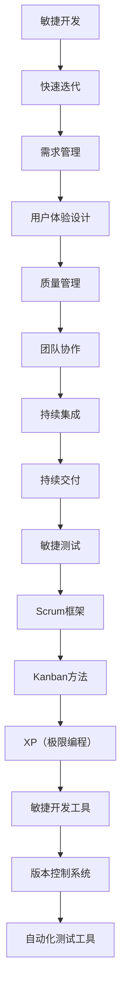

                 


### 文章标题
《敏捷开发与快速迭代原理与代码实战案例讲解》

### 关键词
敏捷开发，快速迭代，需求管理，用户体验设计，质量管理，团队协作，持续集成，持续交付，Scrum框架，Kanban方法，XP（极限编程）

### 摘要
本文将深入探讨敏捷开发与快速迭代的原理与实践。我们将首先介绍敏捷开发的基础，包括其核心原则、方法论、工具和技术。接着，我们将探讨敏捷开发中的团队协作和用户体验设计。随后，文章将聚焦于快速迭代的实践，详细讲解迭代规划与执行、风险管理、持续集成与交付以及敏捷测试。最后，通过具体案例研究，我们将分析敏捷开发在不同行业中的应用，并提供有关敏捷开发与快速迭代的未来趋势的见解。

### 《敏捷开发与快速迭代原理与代码实战案例讲解》目录大纲

#### 第一部分：敏捷开发基础

#### 第1章：敏捷开发概述
1.1 敏捷开发的核心原则
1.2 敏捷开发与传统开发方法的对比
1.3 敏捷开发的价值和优势

#### 第2章：敏捷开发方法论
2.1 Scrum框架
2.2 Kanban方法
2.3 XP（极限编程）

#### 第3章：敏捷开发工具与技术
3.1 敏捷项目管理工具
3.2 版本控制系统
3.3 自动化测试工具

#### 第4章：敏捷开发中的团队协作
4.1 敏捷团队的角色与职责
4.2 敏捷团队的沟通与合作
4.3 敏捷团队的文化建设

#### 第二部分：快速迭代实践

#### 第5章：迭代规划与执行
5.1 迭代周期的定义
5.2 迭代规划会议
5.3 迭代执行中的问题处理

#### 第6章：快速迭代中的风险管理
6.1 风险识别与评估
6.2 风险应对策略
6.3 风险监控与调整

#### 第7章：快速迭代中的持续集成与交付
7.1 持续集成（CI）的概念与实现
7.2 持续交付（CD）的概念与实现
7.3 自动化部署工具

#### 第8章：敏捷开发与敏捷测试
8.1 敏捷测试的基本原则
8.2 敏捷测试的方法和工具
8.3 敏捷测试与敏捷开发的结合

#### 第9章：敏捷开发案例研究
9.1 案例一：某电商平台的敏捷转型
9.2 案例二：某金融科技公司的敏捷实践
9.3 案例三：敏捷开发在游戏开发中的应用

#### 第三部分：敏捷开发与快速迭代原理深入

#### 第10章：敏捷开发中的需求管理
10.1 需求的收集与管理
10.2 需求的优先级排序
10.3 需求变更管理

#### 第11章：敏捷开发中的用户体验设计
11.1 用户体验设计的原则
11.2 用户体验设计的流程
11.3 用户体验设计工具与技巧

#### 第12章：敏捷开发中的质量管理
12.1 质量管理的基本概念
12.2 质量管理的方法与工具
12.3 质量管理在敏捷开发中的应用

#### 第13章：敏捷开发中的团队扩展与协调
13.1 分布式敏捷开发的挑战与解决方案
13.2 敏捷团队的国际合作
13.3 敏捷团队在跨文化环境中的协作

#### 第14章：敏捷开发与快速迭代的未来趋势
14.1 新型敏捷开发方法的发展
14.2 敏捷开发与人工智能的结合
14.3 敏捷开发在全球范围内的应用前景

#### 附录

#### 附录A：敏捷开发工具与资源
A.1 常用敏捷开发工具介绍
A.2 敏捷开发相关资源推荐

#### 附录B：敏捷开发相关术语解释
B.1 敏捷开发常用术语解释
B.2 敏捷开发相关术语表

### 核心概念与联系


### 核心算法原理讲解
#### 伪代码：

```
// 敏捷开发核心算法伪代码

// 定义迭代周期
ITERATION_CYCLE := 2 weeks

// 迭代规划会议
ITERATION_PLAN Meeting() {
    // 收集需求
    COLLECT_REQUIREMENTS()

    // 确定优先级
    ASSIGN_PRIORITY()

    // 分配任务
    ASSIGN_TASKS()

    // 讨论迭代目标和里程碑
    DISCUSS_GOALS_AND_MILESTONES()
}

// 迭代执行
EXECUTE_ITERATION() {
    // 完成任务
    COMPLETE_TASKS()

    // 定期检查进度
    CHECK_PROGRESS()

    // 处理问题
    HANDLE_ISSUES()
}

// 持续集成
CONTINUOUS_INTEGRATION() {
    // 编译代码
    BUILD_CODE()

    // 运行测试
    RUN_TESTS()

    // 自动化部署
    AUTOMATE_DEPLOYMENT()
}

// 敏捷测试
AGILE_TESTING() {
    // 设计测试用例
    DESIGN_TEST_CASES()

    // 执行测试
    EXECUTE_TESTS()

    // 分析测试结果
    ANALYZE_TEST_RESULTS()
}
```

## 第一部分：敏捷开发基础

### 第1章：敏捷开发概述

#### 1.1 敏捷开发的核心原则

敏捷开发是一种应对快速变化的需求的软件开发能力。它强调轻量化和高效性，使得团队能够迅速响应变化并持续交付价值。敏捷开发的核心原则包括以下12条：

1. **个体和互动重于过程和工具**：强调团队合作和个人能力的重要性，而不是依赖特定的工具或流程。
2. **可工作的软件重于详尽的文档**：优先考虑可执行的代码，而不是过多的文档。
3. **客户合作重于合同谈判**：与客户紧密合作，确保需求的理解和实现准确无误。
4. **响应变化重于遵循计划**：敏捷开发更注重灵活性和适应性，能够快速响应需求变化。

#### 1.2 敏捷开发与传统开发方法的对比

传统开发方法，如瀑布模型，通常是一种线性的、顺序的、阶段性的开发方式。它强调在每个阶段完成后才开始下一阶段，通常会导致项目进度延迟和成本增加。相比之下，敏捷开发采用迭代和增量的方法，通过持续交付可工作的软件来应对变化。

**优点对比**：

- **灵活性**：敏捷开发能够更好地适应需求变化，提供更快的响应速度。
- **客户满意度**：通过客户参与和反馈，确保软件产品符合客户需求。
- **风险管理**：早期的迭代和反馈有助于识别和解决问题。

#### 1.3 敏捷开发的价值和优势

敏捷开发的价值体现在以下几个方面：

1. **更快交付**：通过迭代和增量开发，团队能够更快地交付可工作的软件。
2. **提高质量**：频繁的测试和反馈有助于发现和修复缺陷，提高软件质量。
3. **客户满意度**：通过持续交付和客户合作，确保软件符合客户需求。
4. **团队合作**：敏捷开发鼓励跨职能团队合作，提高团队协作效率。

### 第2章：敏捷开发方法论

#### 2.1 Scrum框架

Scrum是一种广泛应用的敏捷开发方法论，它以迭代和增量的方式工作，强调团队协作和持续交付。

**核心概念**：

- **迭代（Sprint）**：每次迭代通常持续2-4周，结束后团队会评估和回顾。
- **产品待办列表**：列出所有需要完成的工作，按优先级排序。
- **每日站会**：团队成员每日短时间聚会，讨论进度和问题。
- **冲刺回顾会议**：迭代结束后，团队会讨论如何改进流程。

**步骤**：

1. **启动项目**：确定产品目标，建立产品待办列表。
2. **规划第一个迭代**：选择最高优先级的需求进行开发。
3. **执行迭代**：团队按计划工作，每天举行站会。
4. **结束迭代**：完成需求，进行评审和回顾。

#### 2.2 Kanban方法

Kanban是一种基于可视化工作流程的管理方法，它通过限制工作量和持续改进来提高效率。

**核心概念**：

- **看板卡片**：每个任务用卡片表示，放在看板上。
- **工作流程**：从“待办”到“进行中”、“审查”和“完成”。
- **限制工作总量（WIP）**：通过限制正在处理的工作数量来避免过度工作。

**步骤**：

1. **可视化工作流程**：在白板上创建看板，将任务卡片放在不同的列中。
2. **确定WIP限制**：为每列设置WIP限制。
3. **监控和改进**：定期审查看板，识别瓶颈并采取措施改进。

#### 2.3 XP（极限编程）

XP是一种基于敏捷原则的编程方法论，它强调高质量的代码和高效的团队合作。

**核心概念**：

- **简单性**：避免复杂的方案，保持代码和流程的简洁。
- **测试驱动开发（TDD）**：先编写测试，然后编写代码来通过测试。
- **持续集成（CI）**：频繁地合并代码并运行测试，确保代码质量。

**步骤**：

1. **编写测试**：为即将编写的功能编写测试。
2. **编写代码**：编写代码来通过测试。
3. **重构**：持续改进代码质量，去除重复和冗余。
4. **代码评审**：团队成员互相审查代码，确保符合质量标准。

### 第3章：敏捷开发工具与技术

#### 3.1 敏捷项目管理工具

敏捷项目管理工具帮助团队跟踪任务、进度和团队协作。常见工具包括：

- **JIRA**：用于跟踪问题、任务和敏捷迭代。
- **Trello**：基于看板的任务管理工具。
- **Asana**：用于任务分配和项目进度跟踪。

#### 3.2 版本控制系统

版本控制系统（如Git）用于管理代码的版本和历史。敏捷开发中常用的Git命令包括：

- **git clone**：克隆代码仓库。
- **git pull**：从远程仓库获取更新。
- **git push**：将本地更新推送到远程仓库。
- **git branch**：创建和管理分支。

#### 3.3 自动化测试工具

自动化测试工具用于确保代码质量和功能完整性。常见工具包括：

- **Selenium**：用于Web应用程序的自动化测试。
- **JUnit**：用于Java应用程序的单元测试。
- **Cucumber**：用于行为驱动开发（BDD）的测试工具。

## 第二部分：敏捷开发中的团队协作

### 第4章：敏捷开发中的团队协作

#### 4.1 敏捷团队的角色与职责

敏捷团队通常由以下几类角色组成：

- **产品负责人（Product Owner）**：负责确定产品的愿景和需求，与利益相关者沟通。
- **Scrum Master**：确保团队遵循敏捷实践，消除障碍，帮助团队持续改进。
- **开发团队成员**：负责实现产品需求，通常包括开发、测试和质量保证。

#### 4.2 敏捷团队的沟通与合作

敏捷开发强调团队的紧密合作和沟通。以下是一些关键沟通与合作技巧：

- **每日站会**：每日短暂的站会有助于团队成员了解进度和问题。
- **信息透明**：保持信息透明，使所有团队成员都能了解项目的状态和决策。
- **代码评审**：定期进行代码评审，确保代码质量。
- **共享知识**：鼓励团队成员分享知识和经验，提高整体技能水平。

#### 4.3 敏捷团队的文化建设

敏捷团队的文化建设是确保团队高效运作的关键。以下是一些文化建设策略：

- **信任**：建立信任，鼓励团队成员互相支持和合作。
- **开放性**：鼓励团队成员提出意见和建议，促进创新。
- **责任感**：每个团队成员都对自己的工作和项目的成功负责。
- **持续学习**：鼓励团队成员不断学习和提升技能。

## 第三部分：快速迭代实践

### 第5章：迭代规划与执行

#### 5.1 迭代周期的定义

迭代周期是指团队从规划、执行到回顾的整个周期。典型的迭代周期包括：

- **规划会议**：确定迭代的目标和任务。
- **执行阶段**：团队按计划工作。
- **评审会议**：评估迭代成果和团队表现。
- **回顾会议**：讨论改进方法。

#### 5.2 迭代规划会议

迭代规划会议是迭代周期的开始，主要任务包括：

- **确定迭代目标**：明确本次迭代需要实现的功能和目标。
- **选择需求**：从产品待办列表中选择优先级最高的需求。
- **分配任务**：根据团队成员的能力和技能分配任务。
- **制定迭代计划**：确定任务完成的时间和资源需求。

#### 5.3 迭代执行中的问题处理

在迭代执行过程中，团队可能会遇到各种问题。以下是一些常见问题及其处理方法：

- **进度延迟**：通过每日站会和进度跟踪，及时发现并解决问题。
- **资源不足**：重新分配资源或寻求外部支持。
- **需求变更**：评估变更影响，并与产品负责人协商。
- **技术难题**：通过团队协作和专家咨询，寻找解决方案。

### 第6章：快速迭代中的风险管理

#### 6.1 风险识别与评估

在快速迭代过程中，风险识别和评估至关重要。以下是一些识别和评估风险的步骤：

- **识别潜在风险**：通过历史数据和专家意见，识别可能的风险。
- **评估风险影响**：评估风险对项目的影响程度。
- **确定风险优先级**：根据风险影响和发生概率，确定风险优先级。

#### 6.2 风险应对策略

针对不同类型的风险，可以采取以下应对策略：

- **避免**：通过变更设计或方法，避免风险发生。
- **转移**：通过保险或其他手段将风险转移给第三方。
- **减轻**：采取措施减轻风险的影响。
- **接受**：对于无法避免或转移的风险，制定应对计划。

#### 6.3 风险监控与调整

在迭代过程中，持续监控风险并调整应对策略至关重要。以下是一些监控和调整风险的步骤：

- **定期审查**：定期审查风险状况，评估应对策略的有效性。
- **更新风险登记册**：记录新的风险和风险的变化。
- **沟通与协调**：与团队和利益相关者沟通，确保他们了解风险状况。

### 第7章：快速迭代中的持续集成与交付

#### 7.1 持续集成（CI）的概念与实现

持续集成是一种软件开发实践，通过频繁地将代码集成到共享仓库中，并自动化构建和测试，确保代码质量。

**实现步骤**：

1. **代码仓库**：使用版本控制系统管理代码。
2. **自动化构建**：使用CI工具（如Jenkins、Travis CI）自动化编译和构建代码。
3. **自动化测试**：运行单元测试、集成测试和性能测试，确保代码质量。

#### 7.2 持续交付（CD）的概念与实现

持续交付是一种软件开发实践，通过自动化部署和测试，确保软件在任何时间都可以交付。

**实现步骤**：

1. **自动化测试**：确保代码质量，通过CI实现。
2. **部署管道**：自动化部署流程，从测试环境到生产环境。
3. **蓝绿部署**：在部署新版本时，将部分流量转移到新版本，确保平稳过渡。

#### 7.3 自动化部署工具

自动化部署工具可以帮助团队更高效地管理部署过程。常见工具包括：

- **Docker**：用于容器化应用程序，简化部署。
- **Kubernetes**：用于自动化容器部署和管理。
- **Ansible**：用于自动化基础设施和应用程序部署。

## 第8章：敏捷开发与敏捷测试

#### 8.1 敏捷测试的基本原则

敏捷测试是一种与敏捷开发相结合的测试方法，强调持续测试和迭代改进。以下是一些敏捷测试的基本原则：

- **早期和持续测试**：从项目开始就进行测试，并在整个开发过程中持续进行。
- **团队合作**：测试人员与开发人员紧密合作，共同确保代码质量。
- **自动化测试**：自动化执行重复性的测试，提高测试效率和覆盖率。
- **快速反馈**：及时反馈测试结果，帮助团队快速修复问题。

#### 8.2 敏捷测试的方法和工具

敏捷测试包括多种方法和工具，以适应快速迭代的开发过程。以下是一些常用的敏捷测试方法和工具：

- **单元测试**：测试单个模块的功能和性能，使用JUnit等工具实现。
- **集成测试**：测试模块之间的集成和交互，使用Selenium等工具实现。
- **行为驱动开发（BDD）**：使用自然语言描述测试场景，使用Cucumber等工具实现。
- **持续集成工具**：如Jenkins、Travis CI等，用于自动化构建和测试。

#### 8.3 敏捷测试与敏捷开发的结合

敏捷测试与敏捷开发的结合，使得测试过程更加灵活和高效。以下是一些结合方法：

- **测试驱动开发（TDD）**：先编写测试，然后编写代码来通过测试。
- **持续反馈**：通过持续测试和反馈，及时发现和修复问题。
- **迭代改进**：根据测试结果，不断改进测试策略和开发流程。

## 第9章：敏捷开发案例研究

### 案例一：某电商平台的敏捷转型

#### 背景介绍

某电商平台是一家大型在线购物网站，由于传统开发方法导致的进度延迟和质量问题，公司决定进行敏捷转型。

#### 敏捷实践

1. **团队构建**：成立跨职能团队，包括产品负责人、Scrum Master和开发人员。
2. **迭代规划**：每两周进行一次迭代规划会议，确定迭代目标和任务。
3. **持续集成**：使用Jenkins实现持续集成和自动化测试。
4. **客户合作**：定期与客户沟通，收集反馈并快速响应需求变更。

#### 结果

通过敏捷转型，电商平台显著提高了项目进度和产品质量，客户满意度大幅提升。

### 案例二：某金融科技公司的敏捷实践

#### 背景介绍

某金融科技公司致力于开发创新的金融产品，由于市场竞争激烈，公司决定采用敏捷开发以快速响应市场变化。

#### 敏捷实践

1. **Scrum框架**：采用Scrum框架进行项目管理和迭代开发。
2. **用户体验设计**：重视用户体验设计，确保产品符合用户需求。
3. **自动化测试**：使用Selenium实现自动化测试，提高测试效率。

#### 结果

通过敏捷实践，金融科技公司能够更快地推出新产品，市场份额得到显著提升。

### 案例三：敏捷开发在游戏开发中的应用

#### 背景介绍

某游戏开发公司致力于开发高质量的电子游戏，由于游戏开发周期长、变更频繁，公司决定采用敏捷开发方法。

#### 敏捷实践

1. **迭代开发**：每两周进行一次迭代，快速交付可玩性较高的游戏版本。
2. **用户体验设计**：重视用户体验设计，定期与玩家互动，收集反馈。
3. **持续集成**：使用Git和Jenkins实现持续集成和自动化测试。

#### 结果

通过敏捷开发，游戏开发公司能够更快地响应市场需求，游戏质量和用户满意度得到显著提升。

## 第三部分：敏捷开发与快速迭代原理深入

### 第10章：敏捷开发中的需求管理

#### 10.1 需求的收集与管理

在敏捷开发中，需求管理是确保项目成功的关键。以下是需求收集和管理的步骤：

1. **需求识别**：通过与利益相关者沟通，识别项目需求。
2. **需求分类**：根据需求的优先级和影响范围进行分类。
3. **需求文档**：编写需求文档，明确需求的详细描述和验收标准。
4. **需求变更管理**：记录需求变更，评估变更影响，并与利益相关者协商。

#### 10.2 需求的优先级排序

需求的优先级排序是确保项目资源合理分配的关键。以下是一些常用的优先级排序方法：

1. **价值排序**：根据需求对业务价值的影响进行排序。
2. **风险排序**：根据需求的风险程度进行排序。
3. **时间排序**：根据需求的紧急程度进行排序。

#### 10.3 需求变更管理

在敏捷开发中，需求变更不可避免。以下是一些需求变更管理的最佳实践：

1. **变更日志**：记录每次需求变更的详细信息，包括变更原因、影响范围和解决方案。
2. **评估变更影响**：评估变更对项目进度、成本和质量的影响。
3. **利益相关者协商**：与利益相关者协商，确保变更得到一致认可。
4. **更新项目计划**：根据变更情况更新项目计划，确保项目继续顺利进行。

### 第11章：敏捷开发中的用户体验设计

#### 11.1 用户体验设计的原则

用户体验设计（UX设计）在敏捷开发中起着关键作用，以下是用户体验设计的原则：

1. **用户为中心**：以用户需求为中心，设计符合用户习惯的产品。
2. **简洁性**：保持界面简洁，避免冗余和复杂功能。
3. **可用性**：确保产品易于使用，用户可以轻松完成任务。
4. **响应式设计**：设计适应不同设备和屏幕尺寸的界面。

#### 11.2 用户体验设计的流程

用户体验设计的流程通常包括以下步骤：

1. **需求分析**：了解用户需求，收集用户数据。
2. **原型设计**：创建界面原型，进行用户测试和反馈。
3. **交互设计**：设计用户界面和交互流程，确保符合用户体验原则。
4. **视觉设计**：设计产品的视觉元素，包括颜色、字体和图标。
5. **开发与测试**：将设计转化为实际代码，并进行测试和优化。

#### 11.3 用户体验设计工具与技巧

以下是一些常用的用户体验设计工具与技巧：

1. **Axure RP**：用于创建交互式原型和文档。
2. **Sketch**：用于设计用户界面和图标。
3. **Figma**：用于协作式设计和原型制作。
4. **用户测试**：通过实际用户进行测试，收集反馈并进行迭代改进。

### 第12章：敏捷开发中的质量管理

#### 12.1 质量管理的基本概念

质量管理是确保软件产品满足既定标准和用户期望的过程。以下是一些质量管理的基本概念：

1. **质量计划**：制定质量管理目标和策略。
2. **质量保证**：通过过程审查和评审，确保质量标准得到遵守。
3. **质量控制**：通过测试和审查，发现并修复缺陷。
4. **持续改进**：通过反馈和过程改进，不断提高产品质量。

#### 12.2 质量管理的方法与工具

以下是一些常用的质量管理和方法与工具：

1. **缺陷管理工具**：如JIRA、Bugzilla等，用于记录、跟踪和解决缺陷。
2. **自动化测试工具**：如Selenium、JUnit等，用于提高测试效率和覆盖率。
3. **代码审查工具**：如SonarQube、Checkmarx等，用于发现代码中的潜在缺陷。
4. **过程改进方法**：如六西格玛、精益生产等，用于优化开发流程和提高质量。

#### 12.3 质量管理在敏捷开发中的应用

在敏捷开发中，质量管理贯穿整个开发过程。以下是一些质量管理的敏捷实践：

1. **持续集成**：通过自动化测试和构建，确保代码质量。
2. **持续反馈**：通过定期回顾和改进，持续提高产品质量。
3. **团队合作**：质量是团队的共同责任，所有成员都应参与质量保证。
4. **用户测试**：邀请实际用户参与测试，收集反馈并进行改进。

### 第13章：敏捷开发中的团队扩展与协调

#### 13.1 分布式敏捷开发的挑战与解决方案

随着团队规模的扩大和地理位置的分散，分布式敏捷开发面临以下挑战：

1. **沟通与协作**：跨时区和文化差异的沟通和协作。
2. **同步与协调**：保持团队成员的同步和协调。
3. **基础设施**：确保分布式团队拥有可靠的技术基础设施。

以下是一些解决方案：

1. **视频会议工具**：如Zoom、Microsoft Teams等，用于远程团队会议。
2. **即时通讯工具**：如Slack、WhatsApp等，用于实时沟通和协作。
3. **共享文档平台**：如Google Workspace、Microsoft Office 365等，用于共享文档和文件。
4. **分布式团队管理工具**：如Jira、Confluence等，用于跟踪任务和项目管理。

#### 13.2 敏捷团队的国际合作

国际合作的敏捷团队需要面对文化差异和时区挑战。以下是一些建议：

1. **建立共同目标**：确保团队成员都清楚团队的目标和愿景。
2. **文化敏感性培训**：提高团队成员对文化差异的敏感性。
3. **协调会议时间**：尽量协调团队成员的时区，减少会议冲突。
4. **使用虚拟办公室**：使用虚拟办公室工具，如Trello、Asana等，帮助团队成员管理任务和进度。

#### 13.3 敏捷团队在跨文化环境中的协作

跨文化环境中的敏捷团队需要特别关注以下方面：

1. **沟通与表达**：不同文化有不同的沟通方式和表达方式。
2. **决策过程**：不同文化有不同的决策风格和偏好。
3. **团队合作**：不同文化有不同的团队合作方式。

以下是一些协作策略：

1. **开放式沟通**：鼓励团队成员表达观点和意见。
2. **建立信任**：通过团队合作和相互支持，建立信任关系。
3. **共享知识和经验**：鼓励团队成员分享知识和经验，促进团队成长。
4. **尊重文化差异**：尊重团队成员的文化背景，避免文化冲突。

### 第14章：敏捷开发与快速迭代的未来趋势

#### 14.1 新型敏捷开发方法的发展

随着技术的不断进步，新型敏捷开发方法正在不断发展。以下是一些新兴的敏捷开发方法：

1. **DevOps**：将软件开发和IT运维相结合，实现更快速、更可靠的交付。
2. **Serverless架构**：利用云计算服务，实现无服务器开发和部署。
3. **人工智能与敏捷开发**：利用人工智能技术，优化敏捷开发过程和结果。

#### 14.2 敏捷开发与人工智能的结合

敏捷开发与人工智能的结合，为软件开发带来了新的机遇和挑战。以下是一些应用领域：

1. **需求预测**：利用人工智能技术，预测用户需求和市场趋势。
2. **自动化测试**：利用人工智能技术，提高测试效率和覆盖率。
3. **代码审查**：利用人工智能技术，发现代码中的潜在缺陷。
4. **持续反馈**：利用人工智能技术，分析用户反馈和项目数据，持续优化开发过程。

#### 14.3 敏捷开发在全球范围内的应用前景

随着全球软件产业的发展，敏捷开发的应用前景广阔。以下是一些趋势：

1. **企业数字化转型**：敏捷开发有助于企业实现数字化转型和业务创新。
2. **全球敏捷联盟**：越来越多的企业和组织加入全球敏捷联盟，推动敏捷开发的发展。
3. **敏捷教育**：越来越多的教育机构开设敏捷开发课程，培养敏捷开发人才。

### 附录

#### 附录A：敏捷开发工具与资源

A.1 常用敏捷开发工具介绍

- **JIRA**：用于项目管理、任务跟踪和敏捷迭代。
- **Trello**：用于任务管理和看板可视化。
- **Asana**：用于任务分配和项目进度跟踪。
- **Slack**：用于团队沟通和协作。
- **Zoom**：用于远程视频会议和交流。

A.2 敏捷开发相关资源推荐

- **《敏捷软件开发：实践指南》**：作者：埃里克·莱姆勒（Eric Brechner）
- **《敏捷实践指南》**：作者：詹姆斯·高斯林（James Grenning）
- **《Scrum敏捷开发实践指南》**：作者：斯科特·凯利（Scott W. Kelby）
- **敏捷开发社区网站**：如Scrum.org、Agile Alliance等。

#### 附录B：敏捷开发相关术语解释

B.1 敏捷开发常用术语解释

- **Scrum Master**：负责确保团队遵循敏捷实践，帮助团队持续改进。
- **产品待办列表**：列出所有需要完成的工作，按优先级排序。
- **Sprint**：每次迭代，通常持续2-4周。
- **用户故事**：描述用户需求的简短描述。
- **看板**：用于可视化工作流程和任务状态的看板。
- **持续集成**：通过自动化构建和测试，确保代码质量。
- **持续交付**：通过自动化部署和测试，确保软件在任何时间都可以交付。

B.2 敏捷开发相关术语表

- **敏捷开发（Agile Development）**：一种软件开发方法，强调快速响应变化和持续交付价值。
- **敏捷方法论**：如Scrum、Kanban、XP等，用于指导敏捷开发过程。
- **迭代（Iteration）**：每次开发周期，包括需求分析、设计、编码、测试和部署。
- **增量（Increment）**：每次迭代交付的软件功能。
- **用户故事（User Story）**：描述用户需求的故事，通常以“作为…，我想要…，以便…”的形式编写。
- **迭代规划会议（Sprint Planning Meeting）**：团队在每次迭代开始时召开的会议，确定迭代目标和任务。
- **每日站会（Daily Stand-up Meeting）**：每天早上的短暂会议，团队成员汇报进度和问题。
- **Scrum Board（看板）**：用于可视化任务状态和进度的工具。
- **看板卡片（Kanban Card）**：表示任务的卡片，放在看板上不同的列中。
- **Scrum Master**：负责确保团队遵循敏捷实践，消除障碍，帮助团队持续改进。
- **产品负责人（Product Owner）**：负责确定产品的愿景和需求，与利益相关者沟通。
- **Scrum Team**：由产品负责人、Scrum Master和开发团队成员组成的团队。
- **增量（Increment）**：每次迭代交付的软件功能。
- **迭代回顾会议（Sprint Retrospective）**：每次迭代结束时召开的会议，团队讨论如何改进流程。

## 总结与展望

敏捷开发与快速迭代是一种以用户需求为导向，以持续交付价值为核心的开发方法。它通过迭代、增量和团队合作，提高了软件开发的效率和质量。本文系统地介绍了敏捷开发与快速迭代的核心原理、实践方法和应用案例，旨在帮助读者全面了解并掌握这一开发模式。

### 总结

1. **敏捷开发的核心原则**：敏捷开发强调个体和互动、可工作的软件、客户合作和响应变化。
2. **敏捷开发方法论**：包括Scrum、Kanban和XP等方法论，各有特点和应用场景。
3. **敏捷开发工具与技术**：介绍了敏捷项目管理工具、版本控制系统和自动化测试工具等。
4. **团队协作**：强调了敏捷团队的角色与职责、沟通与合作以及文化建设的重要性。
5. **快速迭代实践**：详细讲解了迭代规划与执行、风险管理、持续集成与交付和敏捷测试。
6. **需求管理**：阐述了需求的收集与管理、优先级排序和变更管理。
7. **用户体验设计**：介绍了用户体验设计的原则、流程和工具。
8. **质量管理**：讨论了质量管理的概念、方法和在敏捷开发中的应用。
9. **团队扩展与协调**：分析了分布式敏捷开发的挑战与解决方案，以及国际合作和跨文化环境中的协作策略。
10. **未来趋势**：探讨了新型敏捷开发方法的发展、敏捷开发与人工智能的结合以及全球应用前景。

### 展望

随着技术的不断进步和市场需求的快速变化，敏捷开发与快速迭代将继续发展和完善。未来，我们可以期待：

1. **更加智能化**：人工智能技术将进一步融入敏捷开发，优化开发流程和提高效率。
2. **更广泛的接受度**：敏捷开发将在全球范围内得到更广泛的接受和应用。
3. **跨行业融合**：敏捷开发将在更多行业领域得到应用，推动业务创新和数字化转型。
4. **持续改进**：敏捷开发社区将继续探索和实践新的方法和技术，以持续改进软件开发过程。

通过本文的学习，读者可以更好地理解和应用敏捷开发与快速迭代，提高软件开发的效率和质量。希望本文能为您的敏捷开发之旅提供有价值的参考和启示。让我们共同迎接敏捷开发与快速迭代的美好未来！作者：AI天才研究院/AI Genius Institute & 禅与计算机程序设计艺术 /Zen And The Art of Computer Programming。

