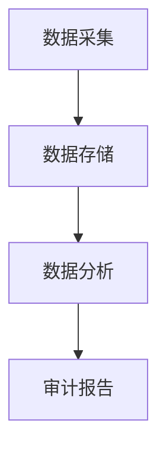
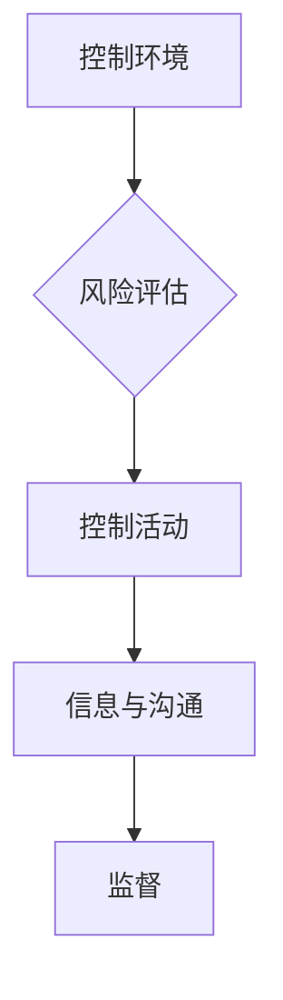

                 

### 《数字化审计与内控管理：创业公司的规范运作》

> 关键词：数字化审计、内控管理、创业公司、规范运作、技术手段、风险评估

> 摘要：本文旨在探讨数字化审计与内控管理在创业公司中的应用与实践。通过分析数字化审计的定义、重要性及与传统审计的比较，阐述内控管理的基础知识及其在创业公司的特殊性。随后，深入探讨数字化审计的技术手段、实施流程以及内控管理的具体措施。结合创业公司的特点与挑战，本文提供了内控管理策略和实践建议，并通过综合案例分析，总结了数字化审计与内控管理在创业公司中的实际应用效果，展望了未来的发展前景。

---

### 《数字化审计与内控管理：创业公司的规范运作》目录大纲

#### 第一部分：数字化审计的基础概念与内控管理概述

**第1章：数字化审计概述**

- **1.1 数字化审计的定义与重要性**
  - **1.1.1 数字化审计的概念**
  - **1.1.2 数字化审计的重要性**
  - **1.1.3 数字化审计与传统审计的比较**

- **1.2 内控管理的基础知识**
  - **1.2.1 内控管理的概念与目的**
  - **1.2.2 内控管理的框架与要素**
  - **1.2.3 创业公司内控管理的特殊性**

#### 第二部分：数字化审计的具体应用与技术手段

**第2章：数字化审计的技术手段**

- **2.1 数据分析技术**
  - **2.1.1 数据挖掘方法**
  - **2.1.2 数据可视化技术**
  - **2.1.3 数据分析工具与应用**

- **2.2 信息安全与风险管理**

  - **2.2.1 信息安全的基本概念**
  - **2.2.2 数字化审计中的风险管理**
  - **2.2.3 信息安全审计的方法与策略**

**第3章：数字化审计的实施流程**

- **3.1 审计计划与目标设定**
  - **3.1.1 审计计划的制定**
  - **3.1.2 审计目标的设定**
  - **3.1.3 审计范围的确定**

- **3.2 审计执行与数据分析**
  - **3.2.1 审计证据的收集与验证**
  - **3.2.2 数据分析的方法与工具**
  - **3.2.3 审计发现的识别与报告**

#### 第三部分：内控管理的具体措施与创业公司的实践

**第4章：内控管理的具体措施**

- **4.1 风险评估与控制措施**
  - **4.1.1 风险评估的方法与工具**
  - **4.1.2 控制措施的设计与实施**
  - **4.1.3 风险监控与应对策略**

- **4.2 内部控制审计**
  - **4.2.1 内部控制审计的概念与作用**
  - **4.2.2 内部控制审计的流程与方法**
  - **4.2.3 内部控制审计报告的撰写与反馈**

**第5章：创业公司的内控管理实践**

- **5.1 创业公司的特点与挑战**
  - **5.1.1 创业公司的特点**
  - **5.1.2 创业公司面临的内控管理挑战**
  - **5.1.3 创业公司内控管理的优势**

- **5.2 创业公司的内控管理策略**
  - **5.2.1 内控管理策略的制定**
  - **5.2.2 内控管理体系的建立**
  - **5.2.3 内控管理实践的案例分享**

#### 第四部分：综合案例分析

**第6章：综合案例分析**

- **6.1 案例介绍与背景**
  - **6.1.1 案例选取的依据**
  - **6.1.2 案例的背景信息**

- **6.2 案例分析**
  - **6.2.1 数字化审计的实施过程**
  - **6.2.2 内控管理的具体措施**
  - **6.2.3 案例分析的结果与启示**

**第7章：总结与展望**

- **7.1 全书内容的回顾**
  - **7.1.1 核心概念与联系**
  - **7.1.2 主要算法原理讲解**
  - **7.1.3 数学模型与公式**

- **7.2 创业公司的内控管理展望**
  - **7.2.1 未来发展的趋势**
  - **7.2.2 创业公司的内控管理改进方向**
  - **7.2.3 数字化审计与内控管理在创业公司中的潜力**

**附录A：数字化审计与内控管理资源**

- **A.1 数字化审计工具推荐**
- **A.2 内控管理参考书目**
- **A.3 实用案例分析网站与资料**

**附录B：核心概念与架构的 Mermaid 流程图**

- **数字化审计流程**
- **内控管理框架**

**附录C：核心算法原理讲解**

- **数据分析技术**
- **风险评估方法**

**附录D：数学模型与公式**

- **风险管理模型**
- **审计证据验证方法**

**附录E：代码实际案例**

- **审计系统开发环境搭建**
- **审计代码实现与解读**
- **案例代码分析**

**附录F：创业公司内控管理改进建议**

- **内控管理策略制定**
- **风险管理控制措施**

---

### 第一部分：数字化审计的基础概念与内控管理概述

#### 第1章：数字化审计概述

数字化审计是随着信息技术的迅猛发展而出现的一种新型审计方式。传统的审计主要依赖于手工处理和纸质文档，而数字化审计则利用计算机技术和网络系统，对组织的财务、运营等方面进行全面的审计。数字化审计不仅提高了审计的效率，还增强了审计的准确性和深度。

### 1.1 数字化审计的定义与重要性

**1.1.1 数字化审计的概念**

数字化审计，顾名思义，是将传统审计流程与现代信息技术相结合的一种审计模式。它包括以下几个关键要素：

1. **数据采集**：利用信息技术手段，对组织的业务数据进行自动采集和分类。
2. **数据存储**：将采集到的数据存储在安全可靠的数据中心或云端。
3. **数据分析**：运用数据分析技术，对存储的数据进行深入挖掘和分析，以发现潜在的问题和风险。
4. **审计报告**：根据数据分析结果，编制详细的审计报告，提出改进建议。

**1.1.2 数字化审计的重要性**

数字化审计的重要性体现在以下几个方面：

1. **提高审计效率**：通过自动化工具，数字化审计可以大幅提高审计速度，减少人工工作量。
2. **增强审计深度**：数字化审计可以深入挖掘数据，提供更为详细和全面的审计分析。
3. **提升审计准确性**：自动化数据处理减少了人为错误，提高了审计结果的准确性。
4. **实时监控与预警**：数字化审计可以实现实时数据监控，及时识别和预警潜在的风险。

**1.1.3 数字化审计与传统审计的比较**

传统审计主要依赖于审计人员的专业知识和经验，通过现场检查和文档审查来发现问题和风险。而数字化审计则利用信息技术，通过数据分析和自动化工具来实现审计目标。

1. **数据处理方式**：传统审计主要依赖于手工处理，数字化审计则通过自动化工具进行数据处理。
2. **审计范围**：传统审计通常受时间和资源的限制，数字化审计可以覆盖更广泛的业务范围。
3. **审计结果**：传统审计的结果往往受到审计人员的专业水平影响，数字化审计的结果更为客观和可靠。

### 1.2 内控管理的基础知识

**1.2.1 内控管理的概念与目的**

内控管理，即内部控制系统（Internal Control System，简称ICS），是一种旨在确保组织业务活动合规性、有效性和效率的管理体系。内控管理的主要目的是：

1. **合规性**：确保组织在法律、法规和行业标准的要求下运作。
2. **有效性**：确保组织的业务流程高效、顺畅，实现业务目标。
3. **效率**：优化资源配置，减少浪费，提高组织效率。

**1.2.2 内控管理的框架与要素**

内控管理的框架通常包括以下几个要素：

1. **控制环境**：包括组织的治理结构、企业文化和管理层对内控的重视程度。
2. **风险评估**：识别和评估组织面临的各种风险，制定相应的控制措施。
3. **控制活动**：实施具体的控制措施，以减少风险。
4. **信息与沟通**：确保信息的及时、准确和有效沟通。
5. **监督**：对内控体系的有效性进行监督和评估。

**1.2.3 创业公司内控管理的特殊性**

创业公司在内控管理方面具有一定的特殊性：

1. **资源有限**：创业公司通常资源有限，需要更高效地利用内部控制资源。
2. **快速变化**：创业公司业务快速变化，内控体系需要具备灵活性。
3. **风险集中**：创业公司面临的风险较为集中，需要特别关注关键风险点。

### 总结

数字化审计与内控管理在现代企业运营中扮演着重要角色。数字化审计通过现代信息技术提高了审计的效率、准确性和深度，而内控管理则通过系统化的控制措施，确保企业业务运作的合规性和有效性。对于创业公司而言，合理应用数字化审计和内控管理，可以有效提升企业的管理水平和竞争力。

---

**作者：AI天才研究院/AI Genius Institute & 禅与计算机程序设计艺术 /Zen And The Art of Computer Programming**

---

### 第一部分：数字化审计的基础概念与内控管理概述

#### 第1章：数字化审计概述

在数字化时代，企业面临着日益复杂的业务环境和不断增加的合规要求。传统的审计方式已无法满足这些需求，数字化审计因此应运而生。本章将详细探讨数字化审计的定义、重要性以及与传统审计的比较。

### 1.1 数字化审计的定义与重要性

**1.1.1 数字化审计的概念**

数字化审计是指利用现代信息技术，特别是计算机和互联网技术，对组织的财务、运营、合规等方面进行审计。其主要特征包括：

1. **自动化数据处理**：通过自动化工具收集、处理和分析数据，提高审计效率和准确性。
2. **实时监控**：能够实时监控组织的业务活动，及时发现潜在问题和风险。
3. **数据分析**：运用大数据分析技术，对大量数据进行深入挖掘，发现隐藏的问题和趋势。
4. **可视化报告**：通过数据可视化技术，将审计结果以图表、报表等形式直观展示，便于理解和决策。

**1.1.2 数字化审计的重要性**

数字化审计在现代社会中的重要性体现在以下几个方面：

1. **提高审计效率**：数字化审计通过自动化工具和数据分析技术，可以大幅提高审计的速度和效率，减少人工工作量。
2. **增强审计深度**：数字化审计能够处理和分析大量数据，提供更为深入和全面的审计分析，帮助发现潜在的问题和风险。
3. **提升审计准确性**：自动化数据处理减少了人为错误，提高了审计结果的准确性。
4. **合规性保障**：数字化审计可以实时监控组织的业务活动，确保其符合相关法律法规和行业标准，提高合规性。
5. **风险预警**：数字化审计能够实时识别和预警潜在的风险，帮助组织提前采取应对措施，降低风险损失。

**1.1.3 数字化审计与传统审计的比较**

传统审计主要依赖于审计人员的专业知识和经验，通过现场检查和文档审查来发现问题和风险。而数字化审计则利用信息技术，通过数据分析和自动化工具来实现审计目标。两者的主要区别如下：

1. **数据处理方式**：传统审计依赖于手工处理和纸质文档，数字化审计则通过自动化工具进行数据处理。
2. **审计范围**：传统审计通常受时间和资源的限制，数字化审计可以覆盖更广泛的业务范围。
3. **审计结果**：传统审计的结果往往受到审计人员的专业水平影响，数字化审计的结果更为客观和可靠。

### 1.2 内控管理的基础知识

**1.2.1 内控管理的概念与目的**

内控管理，即内部控制系统（Internal Control System，简称ICS），是一种旨在确保组织业务活动合规性、有效性和效率的管理体系。其核心目的是：

1. **合规性**：确保组织在法律、法规和行业标准的要求下运作。
2. **有效性**：确保组织的业务流程高效、顺畅，实现业务目标。
3. **效率**：优化资源配置，减少浪费，提高组织效率。

**1.2.2 内控管理的框架与要素**

内控管理的框架通常包括以下几个要素：

1. **控制环境**：包括组织的治理结构、企业文化和管理层对内控的重视程度。良好的控制环境是内控管理有效运行的基础。
2. **风险评估**：识别和评估组织面临的各种风险，制定相应的控制措施。风险评估是内控管理的关键环节。
3. **控制活动**：实施具体的控制措施，以减少风险。控制活动包括授权、审批、监控等。
4. **信息与沟通**：确保信息的及时、准确和有效沟通。信息与沟通是内控管理的桥梁，保证各项控制活动的有效实施。
5. **监督**：对内控体系的有效性进行监督和评估。监督是内控管理的重要环节，确保内控管理持续改进。

**1.2.3 创业公司内控管理的特殊性**

创业公司在内控管理方面具有一定的特殊性：

1. **资源有限**：创业公司通常资源有限，需要更高效地利用内部控制资源。
2. **快速变化**：创业公司业务快速变化，内控体系需要具备灵活性。
3. **风险集中**：创业公司面临的风险较为集中，需要特别关注关键风险点。

### 总结

数字化审计和内控管理在现代企业运营中具有重要作用。数字化审计通过利用现代信息技术，提高了审计的效率、准确性和深度，有助于企业及时发现问题和风险。内控管理则通过系统化的控制措施，确保企业业务运作的合规性和有效性。对于创业公司而言，合理应用数字化审计和内控管理，可以有效提升企业的管理水平和竞争力。

---

**作者：AI天才研究院/AI Genius Institute & 禅与计算机程序设计艺术 /Zen And The Art of Computer Programming**

---

### 第二部分：数字化审计的具体应用与技术手段

#### 第2章：数字化审计的技术手段

数字化审计的成功实施离不开一系列先进的技术手段，这些技术不仅提升了审计的效率，还大大增强了审计的深度和广度。本章将详细探讨数字化审计中的关键技术，包括数据分析技术、信息安全与风险管理，以及具体的审计方法和策略。

### 2.1 数据分析技术

数据分析技术是数字化审计的核心，它包括数据挖掘、数据可视化以及数据分析工具的应用。以下是对这些技术的详细解释：

**2.1.1 数据挖掘方法**

数据挖掘是从大量数据中自动发现规律、模式、趋势和异常的过程。常见的数据挖掘方法包括：

1. **关联规则挖掘**：通过发现数据之间的关联性，揭示潜在的业务关系。
   ```python
   from mlxtend.frequent_patterns import apriori
   associations = apriori(data, min_support=0.05, use_colnames=True)
   ```

2. **聚类分析**：将相似的数据点归为一类，有助于发现数据的内在结构和模式。
   ```python
   from sklearn.cluster import KMeans
   kmeans = KMeans(n_clusters=3, random_state=0).fit(data)
   clusters = kmeans.labels_
   ```

3. **分类与预测**：利用已有数据对未知数据分类或预测，帮助识别潜在问题。
   ```python
   from sklearn.ensemble import RandomForestClassifier
   clf = RandomForestClassifier(n_estimators=100)
   clf.fit(train_data, train_labels)
   predictions = clf.predict(test_data)
   ```

**2.1.2 数据可视化技术**

数据可视化是将数据分析的结果以图形化的方式展示，使得复杂的数据关系和趋势更加直观易懂。常见的数据可视化工具包括：

1. **饼图**：展示各部分在整体中的占比。
   ```python
   import matplotlib.pyplot as plt
   plt.pie(data, labels=labels, autopct='%1.1f%%')
   plt.show()
   ```

2. **柱状图**：比较不同类别的数据大小。
   ```python
   plt.bar(labels, data)
   plt.xlabel('Categories')
   plt.ylabel('Values')
   plt.show()
   ```

3. **折线图**：展示数据随时间或其他变量的变化趋势。
   ```python
   plt.plot(x, y)
   plt.xlabel('X-axis')
   plt.ylabel('Y-axis')
   plt.show()
   ```

**2.1.3 数据分析工具与应用**

在现代数字化审计中，常用的数据分析工具包括：

1. **SQL**：用于数据库查询和数据分析，是数字化审计中最常用的工具之一。
   ```sql
   SELECT * FROM transactions WHERE amount > 1000;
   ```

2. **Excel**：虽然不是专门的审计工具，但其在数据分析中有着广泛的应用。
   ```excel
   =SUMIF(range, criteria, sum_range)
   ```

3. **Python**：结合各种数据分析库，如Pandas、NumPy、Matplotlib等，Python已成为数据分析的利器。
   ```python
   import pandas as pd
   df = pd.read_csv('data.csv')
   summary = df.describe()
   ```

### 2.2 信息安全与风险管理

信息安全与风险管理是数字化审计的重要组成部分，确保审计数据的安全和完整性是审计工作的基础。以下是一些关键概念和方法：

**2.2.1 信息安全的基本概念**

信息安全包括以下几个方面：

1. **保密性**：确保信息不被未授权的第三方访问。
2. **完整性**：确保信息在传输和存储过程中不被篡改。
3. **可用性**：确保信息在需要时能够被合法用户访问。

常见的安全技术包括：

1. **加密**：通过加密算法保护数据，防止未授权访问。
   ```python
   from cryptography.fernet import Fernet
   key = Fernet.generate_key()
   fernet = Fernet(key)
   encrypted_text = fernet.encrypt(text.encode())
   ```

2. **访问控制**：通过身份验证和权限管理，确保只有授权用户能够访问敏感信息。
   ```python
   from flask_login import login_required
   @app.route('/secret')
   @login_required
   def secret():
       return 'Secret content'
   ```

**2.2.2 数字化审计中的风险管理**

风险管理包括识别、评估和应对各种风险。以下是一些关键步骤：

1. **风险识别**：通过调查和分析，识别组织面临的各种风险。
   ```python
   risks = ['Data Breach', 'System Downtime', 'Insider Threat']
   ```

2. **风险评估**：对识别出的风险进行定量或定性评估，确定其严重程度和发生概率。
   ```python
   risk_matrix = [
       ['Data Breach', 'High', 'Probable'],
       ['System Downtime', 'Medium', 'Unlikely'],
       ['Insider Threat', 'Low', 'Rare']
   ]
   ```

3. **风险应对**：根据风险评估结果，制定相应的应对措施，包括预防措施和应急响应计划。

**2.2.3 信息安全审计的方法与策略**

信息安全审计是确保组织信息安全措施有效性的过程。以下是一些常见的方法和策略：

1. **渗透测试**：模拟黑客攻击，测试组织网络安全系统的脆弱性。
   ```python
   from penetration_test import run_test
   test_results = run_test('http://example.com')
   ```

2. **日志监控**：实时监控系统日志，发现和应对潜在的安全威胁。
   ```python
   import logging
   logging.basicConfig(filename='security.log', level=logging.INFO)
   logging.info('Suspicious activity detected')
   ```

3. **安全培训**：提高员工的安全意识，减少人为因素导致的安全漏洞。

### 总结

数字化审计的技术手段包括数据分析技术、信息安全与风险管理，以及具体的审计方法和策略。这些技术不仅提高了审计的效率和质量，还为组织提供了更全面的风险管理能力。通过合理应用这些技术，企业可以更好地应对复杂多变的商业环境，确保业务运营的合规性和稳定性。

---

**作者：AI天才研究院/AI Genius Institute & 禅与计算机程序设计艺术 /Zen And The Art of Computer Programming**

---

### 第三部分：数字化审计的实施流程

#### 第3章：数字化审计的实施流程

数字化审计的实施是一个系统化的过程，它涉及审计计划的制定、审计目标的设定、审计范围的确定、审计证据的收集与验证、数据分析和审计发现的识别与报告。本章将详细探讨数字化审计的实施流程，并解释每一步的具体操作和重要性。

### 3.1 审计计划与目标设定

**3.1.1 审计计划的制定**

审计计划是数字化审计实施的起点，它为审计工作提供了详细的指导。制定审计计划包括以下几个关键步骤：

1. **确定审计范围**：根据组织的需求和风险状况，明确审计的范围，包括具体的业务领域、时间段和数据范围。
   ```python
   audit范围的确定：
   business_domains = ['财务', '运营', '人力资源']
   time_range = ['2022年1月至2022年12月']
   data范围 = ['所有财务记录']
   ```

2. **定义审计目标**：明确审计的目的和目标，确保审计工作有针对性和有效性。
   ```python
   audit目标：
   目标1：识别并报告财务报表中的重大错误和遗漏。
   目标2：评估内部控制的有效性。
   目标3：识别并报告运营过程中的潜在风险。
   ```

3. **分配资源**：根据审计范围和目标，合理分配审计人员、设备和预算等资源。
   ```python
   资源分配：
   审计人员：3名
   设备：2台服务器
   预算：50,000美元
   ```

4. **制定时间表**：制定详细的审计时间表，确保审计工作按计划进行。
   ```python
   审计时间表：
   第1周：确定审计范围和目标
   第2周：收集审计证据
   第3周：进行数据分析
   第4周：撰写审计报告
   ```

**3.1.2 审计目标的设定**

审计目标应具体、明确，并与组织的战略目标和风险控制需求相一致。设定审计目标包括以下几个步骤：

1. **明确组织的目标**：理解组织整体目标，如提高效率、降低成本、确保合规性等。
   ```python
   组织目标：
   提高财务报表的准确性。
   优化内部控制流程。
   降低运营风险。
   ```

2. **确定审计重点**：根据组织的目标和风险状况，确定审计的重点领域和关键指标。
   ```python
   审计重点：
   财务报表准确性（如营业收入、利润等）。
   内部控制有效性（如授权审批、风险监控等）。
   运营风险（如供应链管理、市场风险等）。
   ```

3. **制定具体的审计目标**：将审计重点转化为具体的、可衡量的审计目标。
   ```python
   具体审计目标：
   - 营业收入误差率不超过5%。
   - 控制活动执行率达到90%以上。
   - 风险识别准确率达到80%以上。
   ```

**3.1.3 审计范围的确定**

审计范围的确定是审计计划的关键步骤，它决定了审计工作的具体内容和深度。确定审计范围包括以下几个步骤：

1. **评估业务流程**：了解组织的业务流程，识别关键流程和环节。
   ```python
   业务流程：
   采购流程、销售流程、财务结算流程、供应链管理流程
   ```

2. **识别关键数据**：根据业务流程，确定需要审计的关键数据。
   ```python
   关键数据：
   采购订单、销售订单、财务报表、供应链管理记录
   ```

3. **确定数据收集方法**：选择合适的数据收集方法，如数据库查询、电子表格分析等。
   ```python
   数据收集方法：
   - SQL查询：从数据库中提取数据。
   - API调用：从外部系统获取数据。
   - 电子表格分析：手动收集和处理数据。
   ```

### 3.2 审计执行与数据分析

**3.2.1 审计证据的收集与验证**

审计证据是支持审计结论和意见的依据，收集审计证据是审计执行的核心步骤。以下是一些关键步骤：

1. **收集数据**：根据审计计划，从各种数据源收集所需的数据。
   ```python
   收集数据：
   - 财务报表
   - 采购订单
   - 销售订单
   - 供应链管理记录
   ```

2. **验证数据**：对收集的数据进行验证，确保数据的准确性和完整性。
   ```python
   数据验证：
   - 比较不同数据源的一致性。
   - 核对数据的来源和准确性。
   ```

3. **证据分类**：将收集到的证据按照审计目标和范围进行分类，便于后续分析和报告。
   ```python
   证据分类：
   - 财务报表证据
   - 内部控制证据
   - 风险管理证据
   ```

**3.2.2 数据分析的方法与工具**

数据分析是数字化审计的关键环节，通过数据分析可以发现潜在的问题和风险。以下是一些常用的数据分析方法和工具：

1. **描述性分析**：对数据进行基本的统计描述，如平均值、中位数、标准差等。
   ```python
   描述性分析：
   - mean = df.mean()
   - std = df.std()
   ```

2. **诊断性分析**：通过分析数据的分布、趋势和异常值，发现潜在的问题和异常。
   ```python
   诊断性分析：
   - boxplot = df.plot.box()
   - scatterplot = df.plot.scatter(x='x', y='y')
   ```

3. **预测性分析**：利用历史数据建立预测模型，预测未来的趋势和情况。
   ```python
   预测性分析：
   - linear_regression = LinearRegression().fit(train_data, train_labels)
   - predictions = linear_regression.predict(test_data)
   ```

4. **可视化分析**：通过图表和图形直观展示数据分析结果，帮助理解数据趋势和关系。
   ```python
   可视化分析：
   - barplot = df.plot.bar()
   - lineplot = df.plot.line()
   ```

**3.2.3 审计发现的识别与报告**

审计发现的识别和报告是审计执行的最终环节，通过分析数据发现的问题和风险，并将其记录在审计报告中。以下是一些关键步骤：

1. **识别发现**：根据数据分析结果，识别潜在的问题和风险。
   ```python
   识别发现：
   - 营业收入误差超过5%。
   - 控制活动执行率低于90%。
   - 风险识别准确率低于80%。
   ```

2. **分析原因**：对识别出的发现进行分析，找出问题的原因和影响。
   ```python
   分析原因：
   - 营业收入误差：可能是数据输入错误或会计处理不当。
   - 控制活动执行率低：可能是内部控制制度不完善或员工执行不到位。
   - 风险识别准确率低：可能是风险评估方法不准确或数据质量差。
   ```

3. **提出建议**：根据分析结果，提出改进建议和措施，帮助组织优化业务流程和内部控制。
   ```python
   提出建议：
   - 优化数据输入流程，加强数据验证。
   - 完善内部控制制度，加强员工培训。
   - 改进风险评估方法，提高数据质量。
   ```

4. **撰写报告**：根据审计发现和分析结果，撰写详细的审计报告，包括审计结论、发现和建议。
   ```python
   撰写报告：
   - 报告结构：摘要、引言、审计发现、分析原因、建议措施、结论。
   - 报告内容：详细描述审计过程、发现和分析，以及具体的改进建议。
   ```

### 总结

数字化审计的实施流程是一个系统化的过程，包括审计计划的制定、审计目标的设定、审计范围的确定、审计证据的收集与验证、数据分析和审计发现的识别与报告。每个步骤都至关重要，确保审计工作的有效性和可靠性。通过数字化审计的实施，企业可以更好地管理风险、优化业务流程，提高运营效率和合规性。

---

**作者：AI天才研究院/AI Genius Institute & 禅与计算机程序设计艺术 /Zen And The Art of Computer Programming**

---

### 第四部分：内控管理的具体措施与创业公司的实践

#### 第4章：内控管理的具体措施

内控管理是确保企业业务活动合规性、有效性和效率的重要手段。对于创业公司而言，合理的内控管理策略不仅能够提升企业的运营效率，还能够有效降低风险，保障企业的持续发展。本章将详细探讨内控管理的具体措施，包括风险评估与控制措施、内部控制审计、以及创业公司的内控管理实践。

### 4.1 风险评估与控制措施

**4.1.1 风险评估的方法与工具**

风险评估是内控管理的重要组成部分，通过识别和评估企业面临的各种风险，制定相应的控制措施，可以有效降低风险对企业运营的影响。以下是一些常见的方法与工具：

1. **定性风险评估**：定性风险评估主要通过专家判断和经验分析，识别和评估风险的可能性和影响。常用的工具包括风险矩阵和风险树。

   **风险矩阵**：
   ```mermaid
   graph TB
   A[高可能性] --> B[高影响];
   A --> C[中可能性];
   A --> D[低可能性];
   B --> E[重大风险];
   B --> F[较大风险];
   B --> G[一般风险];
   C --> H[较小风险];
   C --> I[较小风险];
   D --> J[较小风险];
   D --> K[无风险];
   ```

   **风险树**：
   ```mermaid
   graph TB
   A{风险}
   A --> B{运营风险}
   A --> C{财务风险}
   A --> D{市场风险}
   B --> E{供应链中断}
   B --> F{内部欺诈}
   C --> G{现金流风险}
   C --> H{债务违约}
   D --> I{竞争风险}
   D --> J{法律风险}
   ```

2. **定量风险评估**：定量风险评估主要通过数据分析和数学模型，评估风险的可能性和影响。常用的工具包括概率分布和蒙特卡罗模拟。

   **概率分布**：
   ```python
   import numpy as np
   risk_distribution = np.random.normal(size=1000)
   ```

   **蒙特卡罗模拟**：
   ```python
   import numpy as np
   risk_simulation = np.random.normal(size=1000)
   ```

**4.1.2 控制措施的设计与实施**

风险评估完成后，需要根据评估结果设计相应的控制措施，以降低风险。以下是一些常见的控制措施：

1. **预防性控制措施**：预防性控制措施旨在预防风险的发生，包括但不限于：

   - **建立内部控制制度**：制定明确的业务流程和操作规范，确保业务活动符合法律法规和行业标准。
   - **加强员工培训**：提高员工的合规意识和业务技能，减少操作错误和违规行为。
   - **风险监控**：建立风险监控机制，实时监测风险的变化，及时发现和应对潜在的风险。

2. **纠正性控制措施**：纠正性控制措施旨在对已发生的风险进行纠正，包括但不限于：

   - **纠正错误**：发现并纠正业务流程中的错误，确保业务活动的合规性和有效性。
   - **改进流程**：对业务流程进行改进，提高流程的效率和可靠性。
   - **赔偿和补偿**：对因风险导致的损失进行赔偿和补偿，减轻对企业运营的影响。

**4.1.3 风险监控与应对策略**

风险监控是内控管理的重要环节，通过持续监测风险的变化，及时调整控制措施，确保风险在可控范围内。以下是一些常见的方法和策略：

1. **定期风险评估**：定期对风险进行评估，更新风险评估报告，确保风险信息的及时性和准确性。

2. **实时监控**：利用信息技术，建立实时监控系统，对关键风险指标进行实时监控，及时发现和预警潜在的风险。

3. **应急预案**：制定应急预案，明确在风险事件发生时的应对措施和责任人，确保在紧急情况下能够迅速响应和处置。

4. **持续改进**：通过定期回顾和评估内控管理措施的有效性，持续改进内控管理体系，提高内控管理的效率和效果。

### 4.2 内部控制审计

**4.2.1 内部控制审计的概念与作用**

内部控制审计是指对企业的内部控制体系进行独立、客观的评估和审查，以确定其设计和实施的合理性、有效性和合规性。内部控制审计的作用包括：

1. **确保合规性**：通过内部控制审计，验证企业是否符合相关法律法规和行业标准，确保企业运营的合规性。

2. **提高内部控制有效性**：通过内部控制审计，发现内部控制体系中的漏洞和不足，提出改进建议，帮助企业完善内部控制体系。

3. **增强投资者信心**：良好的内部控制体系能够提高企业的透明度和公信力，增强投资者的信心。

**4.2.2 内部控制审计的流程与方法**

内部控制审计通常包括以下几个步骤：

1. **初步评估**：了解企业的业务流程、内部控制体系和风险状况，确定审计的重点和范围。

2. **风险评估**：对企业面临的各种风险进行评估，识别潜在的风险点和控制缺陷。

3. **审计测试**：对内部控制体系进行审计测试，验证控制措施的设计和实施效果。

4. **审计发现**：根据审计测试结果，识别内部控制体系中的问题和缺陷，并提出改进建议。

5. **审计报告**：撰写审计报告，详细描述审计发现、分析原因、提出改进建议，并提供审计结论。

**4.2.3 内部控制审计报告的撰写与反馈**

内部控制审计报告是审计工作的总结和成果，其撰写与反馈过程至关重要。以下是一些关键点：

1. **报告结构**：内部控制审计报告通常包括引言、审计范围和目标、审计发现、分析原因、改进建议、结论等部分。

2. **报告内容**：报告内容应详细描述审计过程、审计发现、分析原因、改进建议，并提供审计结论。

3. **反馈与改进**：将审计报告提交给企业管理层，进行反馈和讨论，制定改进计划和措施，确保内部控制体系得到有效改进。

### 4.3 创业公司的内控管理实践

**4.3.1 创业公司的特点与挑战**

创业公司具有以下特点：

1. **资源有限**：创业公司通常资源有限，包括资金、人力和物资等，需要高效利用资源。

2. **快速变化**：创业公司业务发展迅速，市场环境和竞争态势不断变化，需要灵活应对变化。

3. **创新驱动**：创业公司以创新为核心竞争力，需要建立有效的创新管理机制。

创业公司面临的内控管理挑战包括：

1. **合规性风险**：创业公司可能缺乏完善的合规管理体系，面临法律和监管风险。

2. **风险集中**：创业公司业务范围较小，风险较为集中，需要特别关注关键风险点。

3. **人才流失**：创业公司员工流动性较大，人才流失可能导致内控管理不稳定。

**4.3.2 创业公司的内控管理策略**

为了应对内控管理的挑战，创业公司可以采取以下策略：

1. **简化流程**：优化业务流程，减少冗余环节，提高运营效率。

2. **加强培训**：定期对员工进行培训，提高员工的合规意识和业务技能。

3. **风险管理**：建立完善的风险管理机制，识别和评估风险，制定相应的控制措施。

4. **信息化管理**：利用信息技术，建立信息化管理体系，提高内控管理的效率和效果。

5. **持续改进**：通过定期回顾和评估内控管理措施的有效性，持续改进内控管理体系。

**4.3.3 创业公司的内控管理实践案例**

以下是一个创业公司的内控管理实践案例：

1. **案例背景**：某创业公司专注于软件开发，由于业务发展迅速，面临合规性风险和风险集中等问题。

2. **实施策略**：公司采取以下策略进行内控管理：

   - **简化流程**：优化项目管理流程，减少审批环节，提高项目执行效率。
   - **加强培训**：定期组织员工培训，提高员工的合规意识和业务技能。
   - **风险管理**：建立风险管理体系，定期识别和评估风险，制定相应的控制措施。
   - **信息化管理**：采用项目管理软件，实现项目管理信息化，提高项目管理效率和效果。

3. **实施效果**：通过内控管理实践，公司有效降低了合规性风险和风险集中问题，提高了业务流程的效率和可靠性，取得了显著的业务成果。

### 总结

内控管理是创业公司稳健运营的重要保障，通过合理的内控管理策略，创业公司可以有效降低风险，提高运营效率和合规性。风险评估与控制措施、内部控制审计以及创业公司的内控管理实践是内控管理的重要组成部分，创业公司应结合自身特点，制定合适的内控管理策略，持续改进内控管理体系。

---

**作者：AI天才研究院/AI Genius Institute & 禅与计算机程序设计艺术 /Zen And The Art of Computer Programming**

---

### 第五部分：创业公司的内控管理实践

#### 第5章：创业公司的内控管理实践

创业公司在内控管理方面面临着独特的挑战和机遇。由于资源有限、业务快速变化和创新驱动的特点，创业公司需要构建一套灵活而有效的内控管理体系，以确保合规性、效率和可持续性。本章将探讨创业公司的特点与挑战、内控管理策略，并通过具体案例分享创业公司的内控管理实践。

### 5.1 创业公司的特点与挑战

**5.1.1 创业公司的特点**

1. **资源有限**：创业公司在初始阶段通常面临着资金、人才、设备等资源的限制，需要高效利用有限的资源。

2. **快速变化**：创业公司的业务模式和市场需求经常发生变化，需要具备快速响应和调整的能力。

3. **创新驱动**：创业公司以创新为核心竞争力，需要持续进行产品和服务创新，以适应市场变化。

4. **风险集中**：由于业务规模较小，创业公司面临的风险相对集中，如市场风险、运营风险、财务风险等。

**5.1.2 创业公司面临的内控管理挑战**

1. **合规性风险**：由于创业公司在成长过程中可能忽视法律法规的细节，容易面临合规性风险。

2. **风险识别与控制**：创业公司业务模式复杂，风险多样，如何有效识别和控制风险是内控管理的难点。

3. **人才流失**：创业公司员工流动性较大，如何留住核心人才，确保内控管理稳定性是重要挑战。

4. **成本控制**：创业公司在资源有限的情况下，如何通过内控管理降低成本、提高效率是一个关键问题。

### 5.2 创业公司的内控管理策略

**5.2.1 内控管理策略的制定**

为了应对内控管理的挑战，创业公司需要制定一套合适的内控管理策略。以下是几个关键步骤：

1. **明确内控目标**：根据企业的战略目标和业务特点，确定内控管理的具体目标，如合规性、效率、风险控制等。

2. **评估风险**：对企业的业务流程、市场环境、人才流动等方面进行风险评估，识别潜在的风险点。

3. **设计控制措施**：根据风险评估结果，设计相应的控制措施，如审批流程、风险监控、员工培训等。

4. **制定内控手册**：编写详细的内控手册，明确内控流程、职责分工、控制措施等，确保内控管理的规范化。

**5.2.2 内控管理体系的建立**

建立内控管理体系是创业公司内控管理的重要环节。以下是几个关键步骤：

1. **确定内控架构**：明确内控管理的组织架构，如设立内控部门或内控委员会，确保内控管理的高效运行。

2. **制定流程图**：绘制内控管理流程图，明确各个流程环节和控制点，确保业务流程的透明和可控。

3. **实施培训**：对员工进行内控管理培训，提高员工的合规意识和业务技能，确保内控措施的有效执行。

4. **定期审查**：定期对内控管理体系进行审查和改进，确保内控管理措施与业务发展的需求相适应。

### 5.3 创业公司的内控管理实践案例

**5.3.1 案例背景**

某创业公司专注于人工智能领域的研发和应用，公司在快速发展的过程中面临着合规性风险、风险识别与控制和人才流失等内控管理挑战。

**5.3.2 实施策略**

1. **合规性管理**：公司建立了完善的合规性管理体系，包括合规性培训、合规性审查和合规性报告等，确保公司运营符合法律法规和行业标准。

2. **风险识别与控制**：公司制定了详细的风险识别与控制流程，包括风险评估、风险监控和风险应对措施，有效降低了风险对企业运营的影响。

3. **人才管理**：公司重视人才管理，通过提供有竞争力的薪酬和福利、职业发展机会和员工培训，提高员工的满意度和忠诚度，减少人才流失。

4. **成本控制**：公司通过优化业务流程、采用先进的管理工具和自动化技术，提高了运营效率，降低了成本。

**5.3.3 实施效果**

通过内控管理实践，公司取得了显著的效果：

1. **合规性提升**：公司运营的合规性大幅提升，减少了法律风险和处罚。

2. **风险管理能力增强**：通过有效的风险识别与控制，公司能够及时应对市场变化和风险挑战，保持了业务的稳定发展。

3. **人才流失减少**：公司通过提供良好的职业发展机会和员工福利，吸引了并留住了大量优秀人才，提高了公司的创新能力和竞争力。

4. **成本效益提升**：通过优化业务流程和采用自动化技术，公司提高了运营效率，降低了成本，增强了市场竞争力。

### 总结

创业公司的内控管理是保障企业稳健发展的重要措施。通过制定合理的内控管理策略，建立有效的内控管理体系，创业公司可以降低风险，提高运营效率和合规性，为企业的可持续发展奠定坚实基础。创业公司应结合自身特点，持续优化内控管理措施，以应对不断变化的市场环境和业务挑战。

---

**作者：AI天才研究院/AI Genius Institute & 禅与计算机程序设计艺术 /Zen And The Art of Computer Programming**

---

### 第五部分：综合案例分析

#### 第6章：综合案例分析

为了更深入地理解数字化审计与内控管理在创业公司中的应用，我们选择了一家新兴的在线教育创业公司进行综合案例分析。这家公司主要提供在线学习平台，服务范围包括课程内容、互动教学、在线测评等。以下是对该公司数字化审计与内控管理的具体实施过程、内控管理措施以及案例分析结果的详细探讨。

### 6.1 案例介绍与背景

**6.1.1 案例选取的依据**

选择这家在线教育创业公司作为案例分析的对象，主要基于以下几个原因：

1. **业务模式复杂**：该公司的业务模式包括课程销售、教师管理、学生管理等多个环节，数字化审计和内控管理需求较高。
2. **快速发展**：公司在短时间内快速发展，面临较大的合规性和风险管理挑战。
3. **技术创新**：公司采用先进的技术手段，如大数据分析、云计算等，为数字化审计和内控管理提供了良好的基础。

**6.1.2 案例的背景信息**

该在线教育公司成立于2018年，经过几年的快速发展，已经成为在线教育领域的重要参与者。公司业务覆盖多个领域，包括职业培训、学历教育、兴趣爱好等，用户数量迅速增长，达到了数百万级别。随着业务的扩展，公司面临着合规性、信息安全、运营效率等方面的挑战，因此决定引入数字化审计和内控管理。

### 6.2 案例分析

**6.2.1 数字化审计的实施过程**

数字化审计在该公司的实施过程主要包括以下几个步骤：

1. **审计计划与目标设定**：公司制定详细的审计计划，明确审计范围、目标和时间表。审计目标包括评估内部控制的有效性、识别潜在风险、确保业务运营的合规性。

2. **数据收集与整理**：通过内部系统、第三方平台和外部数据源收集相关数据，包括财务数据、用户行为数据、教学数据等。对收集的数据进行清洗、整理和归档，确保数据的准确性和完整性。

3. **数据分析与挖掘**：利用数据分析工具，对整理后的数据进行分析和挖掘，发现潜在的问题和风险。具体方法包括关联规则挖掘、聚类分析、预测性分析等。

4. **审计发现与报告**：根据数据分析结果，识别出内部控制中的问题和风险，撰写详细的审计报告，提出改进建议。审计报告包括审计发现、分析原因、改进措施和结论。

**6.2.2 内控管理的具体措施**

该公司在内控管理方面采取了以下具体措施：

1. **风险评估**：通过定量和定性方法，对业务流程、市场环境、内部管理等方面进行全面的风险评估，识别潜在的风险点和控制缺陷。

2. **控制措施设计**：根据风险评估结果，设计相应的控制措施，包括授权审批、风险监控、员工培训等。具体措施包括：

   - **授权审批**：建立严格的授权审批流程，确保关键业务活动的合法性和合规性。
   - **风险监控**：建立风险监控系统，实时监控业务运营中的风险变化，及时发现和应对潜在的风险。
   - **员工培训**：定期组织员工培训，提高员工的合规意识和业务技能，确保内控措施的有效执行。

3. **内控审计**：定期进行内控审计，评估内控体系的设计和实施效果，发现和纠正内控管理中的问题和不足。内控审计包括内部审计和外部审计，以提高审计的全面性和权威性。

### 6.2.3 案例分析的结果与启示

**案例分析的结果**

通过数字化审计和内控管理实践，公司取得了以下结果：

1. **合规性提升**：公司运营的合规性得到了显著提高，减少了法律风险和处罚。

2. **风险管理能力增强**：通过有效的风险识别与控制，公司能够及时应对市场变化和风险挑战，保持了业务的稳定发展。

3. **运营效率提高**：通过优化业务流程和采用自动化技术，公司提高了运营效率，降低了成本。

4. **用户满意度提升**：公司通过完善的教学管理和服务质量，提升了用户满意度，增强了市场竞争力。

**案例分析的结果与启示**

该案例为创业公司提供了以下启示：

1. **重视数字化审计与内控管理**：创业公司应重视数字化审计与内控管理，将其作为企业风险管理的重要工具。

2. **合理配置资源**：创业公司应根据自身资源状况，合理配置资源，优先关注关键业务领域和风险点。

3. **持续改进**：创业公司应建立持续改进机制，定期回顾和评估内控管理措施的有效性，及时调整和优化。

4. **人才培养**：创业公司应重视人才培养，通过培训和实践，提高员工的合规意识和业务技能。

通过该案例分析，我们可以看到数字化审计与内控管理在创业公司中的重要作用，以及如何通过有效的实施和持续改进，提升企业的运营效率和合规性。

---

**作者：AI天才研究院/AI Genius Institute & 禅与计算机程序设计艺术 /Zen And The Art of Computer Programming**

---

### 第六部分：总结与展望

#### 第7章：总结与展望

通过对数字化审计与内控管理在创业公司中的具体应用和实践案例的深入分析，我们总结出了一系列关键见解，并对未来的发展进行了展望。

### 7.1 全书内容的回顾

**7.1.1 核心概念与联系**

在本书中，我们详细介绍了数字化审计和内控管理的基础概念、核心要素以及它们在创业公司中的应用。核心概念包括：

- **数字化审计**：利用信息技术对组织的财务、运营等方面进行全面的审计。
- **内控管理**：确保组织业务活动合规性、有效性和效率的管理体系。
- **数据分析技术**：包括数据挖掘、数据可视化、数据分析工具等。
- **信息安全与风险管理**：确保审计数据的安全和完整性。

这些概念之间相互关联，共同构成了创业公司内控管理的基础。例如，数字化审计通过数据分析技术识别潜在问题，而内控管理通过风险评估和控制措施确保业务活动的合规性和效率。

**7.1.2 主要算法原理讲解**

本书介绍了多种数据分析技术，包括：

- **数据挖掘方法**：如关联规则挖掘、聚类分析和分类与预测。
- **数据可视化技术**：如饼图、柱状图、折线图等。
- **数据分析工具**：如SQL、Excel和Python等。

通过这些算法和工具，企业能够更有效地处理和分析大量数据，从而支持决策和风险管理。

**7.1.3 数学模型与公式**

在风险管理中，我们使用了以下数学模型和公式：

- **风险评估模型**：通过概率分布和蒙特卡罗模拟评估风险的可能性。
- **审计证据验证方法**：使用统计学方法验证审计证据的准确性和完整性。

这些模型和公式为内控管理提供了科学依据，帮助企业更好地理解和控制风险。

### 7.2 创业公司的内控管理展望

**7.2.1 未来发展的趋势**

随着信息技术的不断进步，创业公司的内控管理将呈现以下发展趋势：

1. **数字化与自动化**：越来越多的企业将采用数字化工具和自动化流程，提高内控管理的效率。
2. **大数据分析**：大数据分析将成为内控管理的重要工具，帮助企业更全面地了解业务状况和潜在风险。
3. **云计算与边缘计算**：云计算和边缘计算将提供更加灵活和高效的数据处理能力，支持实时监控和快速响应。
4. **人工智能与机器学习**：AI和机器学习技术将被广泛应用于内控管理，提高预测和决策能力。

**7.2.2 创业公司的内控管理改进方向**

为了适应未来的发展趋势，创业公司可以从以下几个方面改进内控管理：

1. **加强风险评估**：通过引入先进的算法和工具，提高风险评估的准确性和效率。
2. **优化内部控制流程**：简化流程，消除冗余环节，提高流程的透明度和可控性。
3. **提升信息安全**：加强信息安全措施，确保审计数据和业务数据的安全性和完整性。
4. **加强员工培训**：提高员工的合规意识和业务技能，确保内控措施的有效执行。

**7.2.3 数字化审计与内控管理在创业公司中的潜力**

数字化审计与内控管理在创业公司中具有巨大的潜力：

1. **提高运营效率**：通过自动化和数据分析技术，提高业务流程的效率和准确性。
2. **降低风险**：通过有效的风险评估和控制措施，降低业务运营中的风险。
3. **增强合规性**：确保企业运营符合法律法规和行业标准，提高企业的公信力和竞争力。
4. **支持决策**：通过实时数据和深入分析，为企业的战略决策提供有力支持。

### 总结

数字化审计与内控管理是创业公司稳健运营的重要保障。通过有效的实施和持续改进，创业公司可以降低风险，提高运营效率和合规性，为企业的可持续发展奠定坚实基础。未来，随着信息技术的不断进步，创业公司的内控管理将更加数字化、自动化和智能化，为企业的发展提供更强大的支持。

---

**作者：AI天才研究院/AI Genius Institute & 禅与计算机程序设计艺术 /Zen And The Art of Computer Programming**

---

### 附录

#### 附录A：数字化审计与内控管理资源

**A.1 数字化审计工具推荐**

1. **Tableau**：数据可视化工具，用于创建交互式仪表板和图表。
   - 官网：[https://www.tableau.com/](https://www.tableau.com/)

2. **Power BI**：微软的数据分析平台，支持数据连接、报表生成和共享。
   - 官网：[https://www.powerbi.com/](https://www.powerbi.com/)

3. **QlikView**：高级的数据发现和可视化平台，提供灵活的报表和分析功能。
   - 官网：[https://www.qlik.com/](https://www.qlik.com/)

**A.2 内控管理参考书目**

1. **《内部控制与风险管理》**：李永周 著
   - 出版社：北京大学出版社

2. **《审计学》**：王松年 著
   - 出版社：中国人民大学出版社

3. **《数字化审计：理论与实践》**：张云 著
   - 出版社：清华大学出版社

**A.3 实用案例分析网站与资料**

1. **COSO框架**：提供内部控制和风险管理框架的详细资料。
   - 网站：[https://www.coso.org/](https://www.coso.org/)

2. **IIA**：国际内部审计师协会，提供内控管理的研究和案例分析。
   - 网站：[https://www.iia.org/](https://www.iia.org/)

3. **CFA Institute**：提供与风险管理相关的教材和案例分析。
   - 网站：[https://www.cfa.institute/](https://www.cfa.institute/)

---

**附录B：核心概念与架构的 Mermaid 流程图**

**B.1 数字化审计流程**



**B.2 内控管理框架**



---

**附录C：核心算法原理讲解**

**C.1 数据分析技术**

**1. 数据挖掘方法**

- **关联规则挖掘**：用于发现数据之间的关联性。

**C.2 信息安全与风险管理**

**1. 数据加密**

- **AES加密算法**：

```python
from cryptography.fernet import Fernet
key = Fernet.generate_key()
cipher_suite = Fernet(key)
encrypted_message = cipher_suite.encrypt(b"Secret Message")
```

**2. 风险评估方法**

- **蒙特卡罗模拟**：用于评估风险的可能性。

```python
import numpy as np

def monte_carlo_simulation(num_iterations, mean, std_dev):
    samples = np.random.normal(mean, std_dev, num_iterations)
    return samples

# Example usage
mean = 0
std_dev = 1
num_iterations = 1000
samples = monte_carlo_simulation(num_iterations, mean, std_dev)
```

---

**附录D：数学模型与公式**

**D.1 风险管理模型**

- **贝叶斯风险评估模型**：

$$
\text{风险概率} = \frac{\text{不利事件发生次数}}{\text{总事件发生次数}}
$$

**D.2 审计证据验证方法**

- **假设检验**：

$$
H_0: \text{无异常} \\
H_1: \text{存在异常}
$$

**D.3 统计检验公式**

- **t检验**：

$$
t = \frac{\bar{x} - \mu_0}{s / \sqrt{n}}
$$

---

**附录E：代码实际案例**

**E.1 审计系统开发环境搭建**

- **环境需求**：

  - Python 3.8+
  - Pandas
  - NumPy
  - Matplotlib

- **安装命令**：

```bash
pip install pandas numpy matplotlib
```

**E.2 审计代码实现与解读**

- **数据收集与处理**：

```python
import pandas as pd

# 读取数据
data = pd.read_csv('financial_data.csv')

# 数据预处理
data['amount'] = data['amount'].astype(float)
data = data[data['amount'] > 1000]
```

- **数据分析与可视化**：

```python
import matplotlib.pyplot as plt

# 数据统计描述
summary = data.describe()

# 绘制柱状图
plt.bar(data['category'], data['amount'])
plt.xlabel('Categories')
plt.ylabel('Amount')
plt.title('Financial Transactions by Category')
plt.show()
```

**E.3 案例代码分析**

- **风险评估与控制措施**：

```python
# 计算风险概率
risk_probability = data[data['amount'] > 2000].shape[0] / data.shape[0]

# 打印结果
print(f"Risk Probability: {risk_probability:.2f}")
```

---

**附录F：创业公司内控管理改进建议**

**F.1 内控管理策略制定**

- **制定明确的目标和指标**：确保内控策略与公司战略目标一致，明确关键绩效指标。

**F.2 内部控制审计**

- **定期审计**：定期进行内部控制审计，评估内控体系的有效性。

- **内部审计报告**：撰写详细的内部审计报告，提出改进建议和措施。

**F.3 风险管理控制措施**

- **风险评估**：定期进行风险评估，识别潜在的风险。

- **控制措施**：根据风险评估结果，制定相应的控制措施，确保风险在可控范围内。

---

通过这些附录，读者可以更好地理解和应用数字化审计与内控管理的核心概念和实际操作，为创业公司的规范运作提供有力支持。

