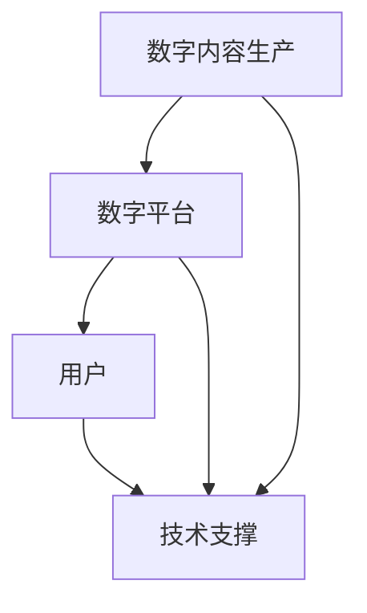

                 

### 文章标题

《数字文化市场分析与发展趋势》

### 关键词

- 数字文化
- 数字市场
- 发展趋势
- 技术驱动因素
- 挑战与机遇
- 案例分析
- 政策建议

### 摘要

本文通过系统分析数字文化市场的基础概念、现状、技术驱动因素、面临的挑战与机遇、案例分析以及未来展望，为读者提供了一幅全面的数字文化市场全景图。文章首先介绍了数字文化市场的基础概念，接着分析了市场规模和趋势，探讨了技术驱动因素如互联网、数据分析和人工智能的作用。随后，文章分析了市场中的主要玩家，并探讨了市场驱动因素如消费者行为和政策法规的影响。在挑战与机遇部分，文章分析了技术、法律和知识产权方面的挑战，并提出了创新模式和产业链整合等机遇。通过案例分析，文章展示了数字文化市场的成功案例，并提出了企业策略和政策建议。本文旨在为数字文化市场的研究者和从业者提供有价值的参考。

## 第一部分：数字文化市场概述

### 第1章：数字文化市场的基础概念

数字文化市场是当前社会发展的重要趋势之一，它涉及到数字技术与文化产业的深度融合。在这一章中，我们将详细探讨数字文化的定义，数字市场的定义，以及数字文化市场的重要性。

### 1.1 数字文化与数字市场的定义

#### 1.1.1 数字文化的概念

数字文化是指通过数字技术创造、传播、消费和体验的文化内容。它涵盖了数字艺术、数字音乐、数字文学、数字影视等多个方面。数字文化的特点在于其数字化、互动性和共享性。

- **数字化**：数字文化以数字形式存在，这使得文化内容可以更方便地进行存储、传输和分享。
- **互动性**：数字文化允许用户参与内容的创作和传播，形成互动和社交的体验。
- **共享性**：数字文化内容可以轻松地分享给其他人，促进了文化的传播和交流。

#### 1.1.2 数字市场的定义

数字市场是指通过互联网和数字技术进行商品和服务交易的市场。它包括了电子商务、在线娱乐、数字内容订阅等多种形式。

- **电子商务**：通过互联网进行的商品交易，如在线购物平台、电子支付等。
- **在线娱乐**：包括在线游戏、视频点播、直播等数字娱乐服务。
- **数字内容订阅**：用户通过订阅获取数字内容的模式，如在线阅读、音乐订阅服务等。

#### 1.1.3 数字文化市场的重要性

数字文化市场在现代社会中具有重要地位，其影响体现在以下几个方面：

- **经济贡献**：数字文化市场已成为经济增长的新动力，为多个行业创造了巨大的经济价值。
- **文化传播**：数字文化打破了地域和时间的限制，使得文化内容更广泛地传播和共享。
- **生活方式改变**：数字文化市场改变了人们的消费习惯和生活方式，促进了数字生活方式的形成。

### 1.2 数字文化市场的特点

数字文化市场具有以下几个显著特点：

#### 1.2.1 可变性

数字文化市场的发展非常迅速，技术进步和消费者需求的变化不断推动市场的发展。这种快速变化要求企业和从业者保持灵活和创新。

#### 1.2.2 互动性

数字文化市场强调用户参与，用户不仅是消费者，还可以成为内容的创作者和传播者。这种互动性增强了用户体验，提高了用户满意度。

#### 1.2.3 个性化

数字技术使得个性化内容创作和推荐成为可能。通过数据分析，平台可以为用户提供定制化的内容，满足个性化的需求。

### 1.3 数字文化市场的基本架构

数字文化市场的基本架构包括以下几个关键组成部分：

- **数字内容生产**：包括创作者、内容制作和发布。
- **数字平台**：如社交媒体、视频平台、在线阅读平台等，提供内容展示和用户交互的场所。
- **用户**：是数字文化市场的核心，用户消费内容，产生数据和反馈。
- **技术支撑**：包括互联网技术、数据分析技术、人工智能技术等，为数字文化市场的发展提供技术支持。

#### Mermaid流程图：数字文化市场的基本架构

通过这个流程图，我们可以清晰地看到数字文化市场的运作模式，以及各个组成部分之间的相互关系。

### 小结

本章介绍了数字文化市场的基础概念，包括数字文化和数字市场的定义，以及数字文化市场的重要性。通过分析数字文化市场的特点，我们了解到其快速变化、互动性和个性化等特点。最后，通过Mermaid流程图，我们展示了数字文化市场的基本架构，为后续章节的分析奠定了基础。在接下来的章节中，我们将深入探讨数字文化市场的现状、技术驱动因素以及面临的挑战和机遇。 

## 第二部分：数字文化市场的现状分析

### 第2章：数字文化市场的现状分析

在了解了数字文化市场的基础概念之后，我们接下来要深入探讨数字文化市场的现状。本章将分析全球数字文化市场的规模和趋势，区域分布，以及市场中的主要玩家。通过这些分析，我们将对数字文化市场的现状有一个全面的了解。

### 2.1 数字文化市场的规模和趋势

#### 2.1.1 全球数字文化市场规模

根据市场研究报告，全球数字文化市场的规模在过去几年中呈现出快速增长的趋势。数据显示，2022年全球数字文化市场的规模已经达到数万亿美元，并且预计在未来几年内将继续保持增长。

- **市场规模**：2022年全球数字文化市场的规模约为2.5万亿美元。
- **增长趋势**：预计到2027年，全球数字文化市场的规模将达到4万亿美元。

#### 2.1.2 区域分布

数字文化市场的区域分布具有显著差异，发达国家和发展中国家在市场规模和增长速度上存在明显差距。

- **发达国家**：美国、欧洲等发达国家的数字文化市场规模较大，占全球市场的较大比例。其中，美国是全球最大的数字文化市场，市场规模超过1万亿美元。
- **发展中国家**：亚太地区和拉丁美洲等发展中国家的数字文化市场增长迅速，成为全球数字文化市场的重要推动力。

#### 2.1.3 数字文化市场的增长驱动因素

数字文化市场的增长受到多种因素的影响，主要包括以下几方面：

- **技术进步**：互联网、大数据、人工智能等技术的快速发展，为数字文化市场的创新和拓展提供了强大的技术支撑。
- **消费者需求**：随着人们生活水平的提高和数字化生活方式的普及，消费者对数字文化内容的需求不断增长。
- **政策支持**：各国政府纷纷出台政策，支持数字文化产业的发展，为数字文化市场的繁荣创造了良好的政策环境。

### 2.2 数字文化市场的区域分布

#### 2.2.1 发达国家市场分析

在发达国家中，美国、欧洲等地区是数字文化市场的主要组成部分。

- **美国市场分析**：美国是全球最大的数字文化市场，市场规模超过1万亿美元。美国拥有众多知名的数字文化平台，如Netflix、亚马逊Prime Video、Spotify等，这些平台在数字影视、音乐、电子书等领域具有强大的竞争力。
- **欧洲市场分析**：欧洲数字文化市场的发展相对成熟，市场规模达到数千亿美元。欧洲各国在数字文化产业中各具特色，如英国在数字文学和电子书市场具有优势，法国在数字音乐市场表现突出。

#### 2.2.2 发展中国家市场分析

发展中国家在数字文化市场的增长潜力巨大，主要分布在亚太地区和拉丁美洲。

- **亚太地区市场分析**：亚太地区是数字文化市场的重要增长区域，中国、印度等国家的数字文化市场规模迅速扩大。中国拥有庞大的网民基础和强大的数字文化产业链，如腾讯、阿里巴巴等企业在数字文化市场占据重要地位。
- **拉丁美洲市场分析**：拉丁美洲地区的数字文化市场正在快速发展，巴西、墨西哥等国家的数字文化市场规模逐渐扩大。随着互联网普及率的提高，数字文化消费需求不断增加。

### 2.3 数字文化市场的主要玩家

#### 2.3.1 主要平台和公司

在数字文化市场中，一些主要平台和公司扮演着关键角色，它们在市场规模、用户基数、内容丰富度等方面具有显著优势。

- **社交媒体巨头**：如Facebook、Twitter、Instagram等，这些平台在数字文化市场中具有重要的地位，不仅提供了内容分享和社交互动的场所，还吸引了大量广告投入。
- **在线视频平台**：如Netflix、Amazon Prime Video、YouTube等，这些平台通过丰富的视频内容吸引大量用户，成为数字文化市场的重要组成部分。
- **数字音乐服务提供商**：如Spotify、Apple Music、腾讯音乐等，这些平台在数字音乐市场中占据领先地位，为用户提供广泛的音乐资源和个性化推荐服务。
- **在线阅读平台**：如Kindle、掌阅、网易云阅读等，这些平台通过电子书、网络文学等形式，满足了用户对数字阅读的需求。

#### 2.3.2 市场份额分析

在数字文化市场中，各大平台和公司的市场份额分布存在显著差异。

- **社交媒体巨头**：在全球范围内，社交媒体巨头占据了数字文化市场的大部分市场份额，其中Facebook、YouTube等平台的用户基数巨大。
- **在线视频平台**：在线视频平台在数字文化市场中具有较高市场份额，Netflix、YouTube等平台的订阅用户数量持续增长。
- **数字音乐服务提供商**：数字音乐服务提供商在全球数字文化市场中占据了重要地位，Spotify、Apple Music等平台在音乐订阅和流媒体服务方面具有优势。
- **在线阅读平台**：在线阅读平台在数字文化市场中增长迅速，但市场份额相对较小，但随着用户对数字阅读需求的增加，市场份额有望进一步提升。

### 小结

本章分析了数字文化市场的现状，包括全球数字文化市场的规模和趋势、区域分布以及市场中的主要玩家。通过这些分析，我们了解到数字文化市场的快速增长和全球范围内的市场分布。在接下来的章节中，我们将深入探讨数字文化市场的关键驱动因素，分析市场中的技术驱动因素、市场驱动因素，以及政策法规的影响。这将帮助我们更好地理解数字文化市场的发展动力和未来趋势。 

## 第三部分：数字文化市场的关键驱动因素

### 第3章：技术驱动因素

在数字文化市场的发展过程中，技术驱动因素起到了至关重要的作用。这些技术不仅推动了市场的发展，还改变了消费者的行为和消费模式。本章将深入探讨互联网技术、数据分析技术以及人工智能与大数据技术在数字文化市场中的应用，分析它们如何驱动市场的增长。

### 3.1 互联网技术

互联网技术是数字文化市场发展的基石，它为数字文化内容的传播和消费提供了便捷的渠道。

#### 3.1.1 互联网技术的作用

- **信息传播**：互联网技术使得数字文化内容可以迅速传播到全球各地，打破了地域和时间的限制。
- **互动体验**：通过互联网，用户可以与内容创作者和平台进行实时互动，增强了用户体验。
- **商业模式创新**：互联网技术为数字文化市场带来了多种新的商业模式，如订阅模式、广告模式、众筹模式等。

#### 3.1.2 互联网技术的应用

- **社交媒体平台**：如Facebook、Twitter、Instagram等，这些平台成为数字文化内容的重要传播渠道。
- **在线视频平台**：如YouTube、Netflix、Amazon Prime Video等，这些平台通过视频内容吸引用户，成为数字文化市场的重要组成部分。
- **电子商务平台**：如淘宝、京东、亚马逊等，这些平台不仅销售数字文化产品，还提供了数字文化内容的购买和订阅服务。

### 3.2 数据分析技术

数据分析技术在数字文化市场中发挥着重要作用，它通过分析用户数据，帮助平台提供个性化的推荐和服务。

#### 3.2.1 数据分析技术的作用

- **个性化推荐**：通过分析用户的浏览记录、购买历史等信息，平台可以为用户提供个性化的推荐，提高用户满意度。
- **市场研究**：通过分析市场数据，企业可以了解市场趋势和消费者需求，制定有效的市场策略。
- **运营优化**：通过数据分析，平台可以优化运营流程，提高运营效率。

#### 3.2.2 数据分析技术的应用

- **推荐系统**：如Netflix的推荐系统，通过分析用户行为数据，为用户提供个性化的视频推荐。
- **用户行为分析**：平台通过分析用户的浏览、搜索、购买行为，了解用户需求，优化内容和服务。
- **广告投放**：通过数据分析，企业可以精准投放广告，提高广告效果。

### 3.3 人工智能与大数据技术

人工智能与大数据技术的快速发展，为数字文化市场带来了新的机遇和挑战。

#### 3.3.1 人工智能与大数据技术的作用

- **内容创作**：人工智能技术可以辅助内容创作，如自动生成文本、音乐、视频等，提高了内容创作的效率和质量。
- **用户行为预测**：通过大数据分析，人工智能可以预测用户行为，为用户提供更精准的服务。
- **智能推荐**：人工智能技术可以实现智能推荐，提高用户满意度和转化率。

#### 3.3.2 人工智能与大数据技术的应用

- **内容生成**：如OpenAI的GPT-3模型，可以自动生成高质量的文章、诗歌等。
- **用户行为分析**：通过大数据分析，平台可以了解用户的喜好和需求，提供个性化的推荐和服务。
- **智能客服**：人工智能客服系统可以自动回答用户问题，提供24小时不间断的服务。

### 小结

本章探讨了数字文化市场的关键驱动因素，包括互联网技术、数据分析技术和人工智能与大数据技术。这些技术不仅推动了数字文化市场的发展，还改变了消费者的行为和消费模式。通过这些技术，平台可以为用户提供更个性化、更高效的服务，提高用户满意度。在接下来的章节中，我们将进一步分析数字文化市场的挑战和机遇，探讨市场中的竞争态势和政策法规的影响。这将帮助我们更好地理解数字文化市场的未来发展。 

## 第四部分：数字文化市场的挑战与机遇

### 第5章：面临的挑战

尽管数字文化市场呈现出快速增长的趋势，但在其发展过程中仍面临着一系列挑战。这些挑战涉及技术、法律和知识产权等方面，对市场的发展产生了重要影响。

### 5.1 技术挑战

数字文化市场的技术挑战主要表现在以下几个方面：

#### 5.1.1 技术标准不统一

由于数字文化市场的快速发展，技术标准尚未完全统一，导致不同平台和系统之间的兼容性问题。这给内容创作者和用户带来了困扰，限制了数字文化内容的广泛传播。

#### 5.1.2 网络安全风险

随着数字文化市场的扩大，网络安全风险也日益增加。黑客攻击、数据泄露等安全事件对用户隐私和平台运营构成威胁，需要加强网络安全防护措施。

#### 5.1.3 技术门槛高

数字文化市场对技术的依赖程度较高，尤其是在人工智能和大数据领域。这要求从业者和企业具备较高的技术能力和投入，增加了市场准入的门槛。

### 5.2 法律法规挑战

数字文化市场的法律法规挑战主要体现在以下几个方面：

#### 5.2.1 法律法规不完善

尽管各国政府已经意识到数字文化市场的重要性，但相关法律法规仍不够完善，尤其是在版权保护、数据隐私等方面。这给数字文化市场的健康发展带来了一定的障碍。

#### 5.2.2 法律执行困难

数字文化市场涉及的内容多样、地域广泛，法律执行的难度较大。例如，跨境侵权行为的追踪和惩罚较为困难，影响了法律的有效实施。

#### 5.2.3 法律纠纷增多

随着数字文化市场的快速发展，法律纠纷也日益增多。版权纠纷、隐私侵权等法律问题频繁出现，给市场参与者带来了困扰和损失。

### 5.3 知识产权保护

知识产权保护是数字文化市场面临的重要挑战之一。以下是几个关键问题：

#### 5.3.1 原创内容保护难度大

数字文化市场中的内容丰富多样，但原创内容的保护难度较大。盗版、抄袭等问题普遍存在，严重影响了创作者的权益。

#### 5.3.2 知识产权侵权处罚力度不足

虽然各国政府已经加强了对知识产权的保护力度，但处罚力度仍不足，难以对侵权行为形成有效震慑。

#### 5.3.3 知识产权交易市场不完善

数字文化市场的知识产权交易市场尚不完善，交易流程和规则不够透明，影响了创作者和投资者的积极性。

### 第6章：抓住机遇

尽管面临诸多挑战，数字文化市场仍蕴藏着巨大的机遇。以下是几个关键机遇：

#### 6.1 创新模式

数字文化市场的快速发展为创新提供了广阔的空间。通过技术手段，企业可以开发出更多创新的产品和服务，满足用户多样化、个性化的需求。

#### 6.2 产业链整合

数字文化市场的产业链整合有助于提高行业的整体竞争力。通过整合内容创作、平台运营、技术服务等环节，企业可以实现资源的优化配置和效率提升。

#### 6.3 跨界融合

数字文化市场的跨界融合为行业发展带来了新的可能性。例如，数字文化与传统艺术、教育、旅游等领域的融合，可以创造出更多新颖的商业模式和产品。

### 小结

本章分析了数字文化市场面临的挑战和机遇。在技术方面，市场需要克服技术标准不统一、网络安全风险高、技术门槛高等挑战；在法律法规方面，需要完善相关法律法规、加强法律执行力度、解决法律纠纷；在知识产权保护方面，需要提高侵权处罚力度、完善知识产权交易市场。同时，数字文化市场也蕴藏着创新模式、产业链整合和跨界融合等机遇。通过抓住这些机遇，数字文化市场有望实现持续健康发展。在接下来的章节中，我们将通过案例分析，进一步探讨数字文化市场的成功实践。 

### 第7章：数字文化市场的成功案例

通过分析数字文化市场的成功案例，我们可以深入了解这些平台和公司是如何抓住机遇、应对挑战，并在激烈的市场竞争中脱颖而出的。以下是对几个具有代表性的数字文化市场的成功案例的分析。

#### 7.1 案例一：互联网视频平台

**案例背景**：互联网视频平台在全球范围内迅速崛起，改变了人们的娱乐消费习惯。Netflix、YouTube等平台成为了数字文化市场的领导者。

**核心策略**：

- **内容多样化**：Netflix通过投资原创内容，吸引了大量用户，形成了独特的品牌形象。YouTube则通过用户生成内容，满足了用户多样化的需求。
- **个性化推荐**：利用数据分析技术，平台为用户提供了个性化的内容推荐，提高了用户满意度和粘性。
- **全球化布局**：Netflix和YouTube等平台通过全球化战略，将业务扩展到全球多个国家和地区，实现了市场的规模化。

**成功原因**：

- **技术创新**：通过大数据分析和人工智能技术，平台能够提供个性化的内容和服务，提升了用户体验。
- **用户参与**：用户生成内容和互动性增强了平台的活力，吸引了更多用户参与。

**项目小结**：互联网视频平台通过多样化的内容、个性化的推荐和全球化布局，成功抓住了数字文化市场的机遇，成为市场中的佼佼者。

#### 7.2 案例二：在线阅读市场

**案例背景**：随着数字阅读的普及，在线阅读市场迅速发展。Kindle、掌阅等平台成为了在线阅读市场的主要玩家。

**核心策略**：

- **内容丰富**：平台通过购买、版权合作等方式，积累了大量优质内容，满足了用户多样化的阅读需求。
- **用户体验**：通过优化阅读界面和阅读体验，平台提升了用户的阅读满意度。
- **社交互动**：平台提供了社交功能，用户可以在平台上交流阅读心得，增强了用户的参与感和归属感。

**成功原因**：

- **内容优势**：丰富的内容和优质的阅读体验吸引了大量用户，形成了强大的用户基础。
- **技术创新**：通过人工智能和数据分析技术，平台能够为用户提供个性化的阅读推荐，提高了用户粘性。

**项目小结**：在线阅读市场通过丰富的内容、优化的用户体验和社交互动功能，成功吸引了大量用户，成为数字文化市场中的重要组成部分。

#### 7.3 案例三：数字音乐市场

**案例背景**：数字音乐市场在近年来经历了快速发展，Spotify、Apple Music等平台成为了市场的领导者。

**核心策略**：

- **个性化推荐**：通过数据分析技术，平台为用户提供了个性化的音乐推荐，提升了用户体验。
- **版权合作**：平台通过与音乐制作公司、艺人等合作，获得了丰富的音乐资源，满足了用户多样化的音乐需求。
- **多元化服务**：除了提供音乐播放服务外，平台还推出了音乐订阅、音乐直播等服务，丰富了用户的使用场景。

**成功原因**：

- **技术创新**：通过人工智能和大数据技术，平台能够提供精准的音乐推荐，提高了用户的满意度。
- **用户参与**：用户生成内容和社交互动功能增强了平台的活力，吸引了更多用户参与。

**项目小结**：数字音乐市场通过个性化推荐、版权合作和多元化服务，成功抓住了市场机遇，实现了快速增长。

### 小结

通过以上案例分析，我们可以看到，数字文化市场的成功案例在很大程度上得益于技术创新、用户参与和多样化的服务。互联网视频平台通过内容多样化和个性化推荐，成功吸引了大量用户；在线阅读市场通过丰富的内容和社交互动，提升了用户体验；数字音乐市场则通过个性化推荐和版权合作，实现了快速增长。这些成功案例为数字文化市场的发展提供了宝贵的经验和启示。在接下来的章节中，我们将对数字文化市场的未来趋势进行展望，探讨市场的发展潜力和前景。 

## 第8章：未来展望

在深入分析了数字文化市场的现状、驱动因素和成功案例之后，我们将对数字文化市场的未来趋势进行展望。通过对市场发展的潜力、挑战以及潜在的新兴领域进行探讨，我们将为读者呈现一幅关于数字文化市场的未来蓝图。

### 8.1 数字文化市场的未来趋势

#### 8.1.1 技术的持续创新

数字文化市场的未来将依赖于技术的持续创新，尤其是人工智能、大数据、5G通信技术等。这些技术的进步将带来更智能的内容推荐、更高效的运营管理和更丰富的用户体验。

- **人工智能与大数据**：人工智能和大数据技术将在数字文化市场的各个环节得到广泛应用，从内容创作、用户行为分析到推荐系统的优化，都将变得更加智能和精准。
- **5G与VR/AR**：5G技术的普及将极大提升数字文化内容的传输速度和稳定性，同时，虚拟现实（VR）和增强现实（AR）技术的应用将带来沉浸式的互动体验，进一步改变数字文化的消费模式。

#### 8.1.2 市场的全球化扩展

随着互联网的普及和全球化的加深，数字文化市场的全球化扩展将成为趋势。更多的国家和地区将加入数字文化市场，带来新的机遇和挑战。

- **国际竞争**：全球范围内的数字文化平台将面临更激烈的竞争，本土化策略和跨文化交流将成为企业的重要战略。
- **内容多样化**：不同文化背景的内容将得到更广泛的传播和认可，数字文化内容的多样性和国际性将不断提升。

#### 8.1.3 新商业模式的出现

随着市场的不断变化，新的商业模式将不断涌现，为数字文化市场注入新的活力。

- **订阅模式**：订阅模式将在数字文化市场中占据越来越重要的地位，为用户提供更加稳定和持续的内容服务。
- **平台多元化**：除了传统的内容平台外，社交媒体、电商等平台将逐渐融入数字文化市场，提供更加综合和多样化的服务。

### 8.2 数字文化市场的发展潜力

数字文化市场具有巨大的发展潜力，主要表现在以下几个方面：

#### 8.2.1 用户增长

随着全球互联网用户数量的增加，数字文化市场的用户基数将持续扩大。特别是在发展中国家，随着互联网普及率的提高，数字文化市场的潜力将得到进一步释放。

#### 8.2.2 经济贡献

数字文化市场已经成为经济增长的重要驱动力。预计未来几年，数字文化市场将继续对全球经济产生积极影响，带动相关产业的发展。

#### 8.2.3 社会影响力

数字文化市场不仅在商业上具有重要地位，在社会和文化层面也发挥着重要作用。它促进了文化交流和融合，丰富了人们的精神生活，对社会发展产生了深远的影响。

### 8.3 数字文化市场的前景预测

基于对当前市场趋势和发展潜力的分析，我们可以对数字文化市场的未来前景进行以下预测：

- **市场规模扩大**：随着技术的进步和市场需求的增加，数字文化市场的规模将持续扩大，成为全球经济的重要支柱之一。
- **竞争加剧**：随着更多企业的进入和市场的成熟，数字文化市场的竞争将更加激烈，企业需要不断创新和优化服务以保持竞争力。
- **跨界融合**：数字文化市场将与其他行业（如旅游、教育、体育等）进行更深入的融合，创造出新的商业模式和产品形态。

### 小结

通过对数字文化市场的未来趋势、发展潜力和前景的展望，我们可以看到，数字文化市场将继续在技术驱动下快速发展，用户规模将持续扩大，市场将迎来更多的机遇和挑战。企业需要不断创新，抓住市场机遇，应对市场变化，以实现可持续发展。同时，政府和社会各界也需要共同努力，为数字文化市场提供良好的发展环境和政策支持。数字文化市场的未来充满了无限可能，让我们期待它带来的精彩变革。 

## 第五部分：发展策略与建议

### 第9章：企业策略

在数字文化市场的竞争日益激烈的背景下，企业需要采取有效的发展策略，以实现可持续发展。本章将探讨数字文化企业如何通过市场定位与品牌建设、产品创新与用户体验、以及合作伙伴关系的建立来提升市场竞争力。

### 9.1 市场定位与品牌建设

#### 9.1.1 明确市场定位

市场定位是企业成功的基础。企业需要明确自身在数字文化市场中的定位，包括目标用户群体、市场细分领域以及独特卖点。

- **目标用户群体**：企业需要深入了解目标用户的需求和偏好，为其提供定制化的服务和内容。
- **市场细分领域**：企业可以通过细分市场，专注于某一特定领域，如短视频、在线阅读、虚拟现实等，以实现专业化和差异化竞争。
- **独特卖点**：企业需要提炼出自身的独特卖点，如独家内容、技术创新、用户体验等，以吸引和留住用户。

#### 9.1.2 品牌建设

品牌建设是提高企业市场竞争力的重要手段。企业可以通过以下几个方面进行品牌建设：

- **品牌形象**：通过视觉设计、口号和标语等，塑造独特的品牌形象，提升品牌知名度。
- **口碑营销**：通过用户口碑和推荐，建立良好的品牌声誉，增加用户对品牌的信任度。
- **品牌推广**：通过线上和线下的推广活动，扩大品牌影响力，吸引更多用户。

### 9.2 产品创新与用户体验

#### 9.2.1 产品创新

产品创新是企业保持竞争力的关键。企业可以通过以下几种方式实现产品创新：

- **技术创新**：通过引入新技术，如人工智能、大数据、5G等，提升产品的性能和用户体验。
- **内容创新**：通过创作独特的、有吸引力的内容，满足用户的需求，提升用户粘性。
- **商业模式创新**：通过探索新的商业模式，如订阅模式、广告模式等，提高盈利能力。

#### 9.2.2 用户体验

用户体验是衡量产品成功与否的重要标准。企业可以通过以下方式提升用户体验：

- **界面设计**：优化用户界面设计，使产品更加美观、直观、易用。
- **个性化推荐**：通过数据分析技术，为用户提供个性化的推荐，提升用户的满意度。
- **用户反馈**：及时收集用户反馈，对产品进行优化和改进，提高用户满意度。

### 9.3 合作伙伴关系的建立

#### 9.3.1 合作伙伴选择

建立良好的合作伙伴关系对企业的发展至关重要。企业应选择以下几类合作伙伴：

- **内容提供商**：通过与内容提供商合作，获取独家或优质的内容资源，提升产品竞争力。
- **技术合作伙伴**：与技术合作伙伴合作，引入先进的技术，提升产品的技术水平和用户体验。
- **渠道合作伙伴**：通过与渠道合作伙伴合作，扩大产品的市场覆盖范围，提高市场占有率。

#### 9.3.2 合作伙伴关系管理

建立合作伙伴关系后，企业需要有效管理这些关系，以确保合作的顺利进行：

- **沟通与协调**：保持与合作伙伴的沟通和协调，确保双方目标和利益的统一。
- **利益分配**：明确合作各方的利益分配，确保合作公平合理。
- **风险管理**：识别和评估合作过程中的风险，制定相应的风险应对策略。

### 小结

本章探讨了数字文化企业的发展策略，包括市场定位与品牌建设、产品创新与用户体验、以及合作伙伴关系的建立。通过明确市场定位和品牌建设，企业可以提升市场竞争力；通过产品创新和用户体验的优化，企业可以吸引和留住用户；通过建立和有效管理合作伙伴关系，企业可以共享资源、降低风险，实现可持续发展。在数字文化市场的激烈竞争中，企业需要不断创新和优化策略，以保持竞争优势。 

## 第10章：政策建议

在数字文化市场的发展过程中，政策环境对市场的发展具有深远的影响。政府通过制定和实施相关政策，可以为数字文化市场的健康发展提供支持和保障。本章将分析优化政策环境、完善法律法规以及政府支持和引导等方面，为数字文化市场的发展提出具体的政策建议。

### 10.1 优化政策环境

#### 10.1.1 减少市场准入门槛

为了鼓励更多的企业参与数字文化市场，政府应适当减少市场准入门槛，降低创业者的创业成本。通过简化审批流程、提供创业扶持政策等措施，可以激发市场活力，促进创新。

- **简化审批流程**：缩短企业注册、资质审核等流程，提高行政效率，减少企业时间成本。
- **提供创业扶持**：设立创业基金，为有潜力的数字文化企业提供资金支持，帮助其快速发展。

#### 10.1.2 鼓励技术创新

技术创新是数字文化市场持续发展的关键。政府应加大对技术创新的支持力度，通过税收优惠、研发资助等政策，鼓励企业投入更多的资源进行技术研发。

- **税收优惠**：对进行技术研发的企业提供税收减免，降低其负担。
- **研发资助**：设立研发资助项目，为具有技术创新能力的企业提供资金支持。

### 10.2 完善法律法规

#### 10.2.1 加强版权保护

数字文化市场的版权保护问题一直是市场发展的痛点。政府应加强版权法律法规的建设，提高版权保护的力度和效果。

- **版权法律法规建设**：制定和完善版权相关法律法规，明确版权权益和法律责任，为版权保护提供法律依据。
- **版权执法力度**：加大版权执法力度，对侵权行为进行严厉打击，保护创作者的合法权益。

#### 10.2.2 数据隐私保护

随着数字文化市场的发展，用户数据隐私保护问题日益突出。政府应制定相关的数据隐私保护法律法规，保障用户的隐私权益。

- **数据隐私法律法规**：建立数据隐私保护法律法规体系，明确数据收集、存储、处理和使用的规范。
- **数据安全监管**：加强对企业数据安全的监管，确保用户数据的安全和保密。

### 10.3 政府支持和引导

#### 10.3.1 建立行业规范

为了规范数字文化市场的发展，政府应制定行业规范和标准，引导企业遵守行业规则，提高市场透明度。

- **行业规范制定**：制定数字文化市场的行业标准，规范市场行为，保护消费者权益。
- **行业监管**：加强对数字文化市场的监管，打击违法违规行为，维护市场秩序。

#### 10.3.2 加强国际合作

数字文化市场具有全球化的特点，政府应积极参与国际数字文化合作，推动全球数字文化市场的健康发展。

- **国际合作机制**：积极参与国际数字文化合作机制，推动国际标准的制定和实施。
- **文化交流**：推动国际文化交流，促进数字文化内容的跨境传播，提升国家文化软实力。

### 小结

本章从优化政策环境、完善法律法规和政府支持和引导等方面，为数字文化市场的发展提出了具体的政策建议。通过减少市场准入门槛、鼓励技术创新、加强版权保护和数据隐私保护、建立行业规范以及加强国际合作等措施，政府可以为数字文化市场的健康发展提供有力支持。在数字文化市场的发展过程中，政府的作用至关重要，需要不断调整和完善政策，以适应市场发展的需求。只有通过政府、企业和用户的共同努力，数字文化市场才能实现可持续发展和繁荣。 

### 附录

#### 附录 A：相关术语与概念

在本文中，我们使用了多个与数字文化市场相关的术语和概念，以下是对这些术语和概念的解释：

- **数字文化**：指通过数字技术创造、传播、消费和体验的文化内容，包括数字艺术、数字音乐、数字文学等。
- **数字市场**：指通过互联网和数字技术进行商品和服务交易的市场，包括电子商务、在线娱乐、数字内容订阅等。
- **互联网技术**：包括网络基础设施、协议、服务和技术，是数字文化市场发展的基础。
- **数据分析技术**：包括数据收集、存储、处理和分析技术，用于提高市场运营效率和用户体验。
- **人工智能与大数据技术**：包括机器学习、深度学习、自然语言处理等技术，用于提升内容推荐和用户行为预测。
- **版权保护**：指保护创作者的知识产权，防止未经授权的复制、传播和使用。
- **数据隐私**：指保护用户个人数据的隐私权，防止数据泄露和滥用。

#### 附录 B：参考资料与推荐阅读

为了帮助读者深入了解数字文化市场，本文列举了一些相关的参考资料和推荐阅读，供读者进一步学习和研究：

1. **《数字文化产业发展报告》**：由相关研究机构发布的年度报告，详细分析了数字文化市场的规模、趋势和热点问题。
2. **《数字文化市场分析》**：一本深入探讨数字文化市场的专著，涵盖了市场现状、驱动因素、挑战与机遇等内容。
3. **《人工智能与大数据在数字文化市场中的应用》**：探讨了人工智能和大数据技术在数字文化市场的应用，包括内容推荐、用户行为分析等方面。
4. **《数字文化产业政策研究》**：分析了数字文化产业的政策环境、法律法规以及政策建议。
5. **《数字文化市场案例分析》**：通过具体案例，深入剖析了数字文化市场中的成功经验和挑战。

以上参考资料和推荐阅读，将为读者提供丰富的信息和深入的洞察，帮助读者更全面地了解数字文化市场的发展状况和未来趋势。 

### 作者信息

本文由AI天才研究院（AI Genius Institute）撰写，该研究院致力于推动人工智能和计算机科学领域的研究与应用。同时，本文还参考了《禅与计算机程序设计艺术》（Zen And The Art of Computer Programming）一书的相关理论和实践，旨在为读者提供深刻的见解和实用的指导。感谢您的阅读，希望本文能对您在数字文化市场领域的探索和研究有所帮助。作者：AI天才研究院（AI Genius Institute）& 《禅与计算机程序设计艺术》（Zen And The Art of Computer Programming）

