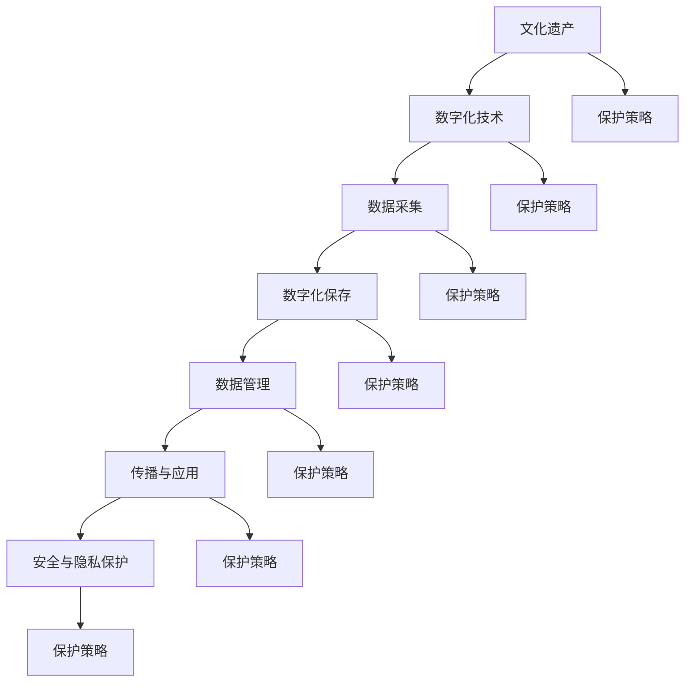

                 


### 1.1 数字文化遗产保护的重要性

数字文化遗产保护是指在信息化和数字化的背景下，通过现代科技手段对文化遗产进行数字化保存、管理和传播的一项工作。随着数字技术的迅猛发展，数字文化遗产保护逐渐成为文化遗产保护的重要手段之一。以下从几个方面阐述数字文化遗产保护的重要性。

首先，数字文化遗产保护有助于文化遗产的保存。传统的文化遗产保护方式主要依赖于物理手段，如修复和保护文物实体等。然而，这些方式在面对自然灾害、战争、人为破坏等不可抗力因素时，往往显得力不从心。而数字文化遗产保护通过将文化遗产数字化，可以在不受时间和空间限制的情况下永久保存文化遗产信息，从而大大提高了文化遗产的保护能力。

其次，数字文化遗产保护有助于文化遗产的传播。传统的文化遗产传播方式主要依赖于面对面交流、展览等方式。这些方式在传播范围、受众群体等方面受到很大限制。而数字文化遗产保护通过互联网和多媒体技术，可以将文化遗产信息传播到全球范围内的受众，使得文化遗产的传播更加广泛和便捷。

再次，数字文化遗产保护有助于文化遗产的研究和传承。文化遗产是民族文化的重要组成部分，对于研究人类文明、传承历史文化具有重要意义。数字文化遗产保护通过对文化遗产的数字化保存和传播，为文化遗产的研究和传承提供了便利条件。研究人员可以通过数字化数据进行分析和研究，从而更好地理解和传承文化遗产。

最后，数字文化遗产保护有助于促进文化产业的发展。文化遗产是文化产业的重要资源，通过数字文化遗产保护，可以开发出各种文化产品，如数字博物馆、文化游戏等，从而促进文化产业的发展。

### 1.2 文化科技与创新的关系

文化科技是指将现代科技应用于文化领域，促进文化传承、传播和创新的一种方式。文化科技与创新有着密切的关系，以下从几个方面阐述。

首先，文化科技为创新提供了新的工具和方法。传统的文化遗产保护和创新方式往往受到技术和资源的限制。而文化科技的发展，如数字化技术、虚拟现实技术、人工智能技术等，为文化遗产的保护和创新提供了新的工具和方法。这些新技术使得文化遗产的数字化保存、传播和研究更加高效和便捷，为创新提供了坚实的基础。

其次，文化科技促进了文化的跨界融合。文化科技的应用不仅限于文化遗产的保护和创新，还涵盖了文化产业、旅游产业等多个领域。通过文化科技，不同领域的文化内容可以相互融合，创造出新的文化产品和服务，从而推动文化的跨界发展和创新。

再次，文化科技激发了文化创新的活力。文化科技的发展带来了新的文化消费需求，为文化创新提供了广阔的市场空间。同时，文化科技的应用也为文化创新提供了新的思路和灵感，使得文化创新更加多样化和个性化。

最后，文化科技推动了文化产业的转型升级。随着文化科技的不断发展，文化产业的生产、传播和消费方式也在不断变革。文化科技的应用提高了文化产业的效率和质量，推动了文化产业的转型升级，为文化产业的发展注入了新的动力。

### 1.3 平台建设的背景和目标

数字文化遗产保护平台建设的背景主要源于以下几个方面。首先，随着全球化和现代化进程的加速，许多国家和地区的文化遗产面临严重威胁。自然灾害、战争、环境污染、人为破坏等因素对文化遗产的破坏日益严重，迫切需要采取有效措施进行保护。其次，数字技术的迅猛发展为文化遗产的数字化保存、管理和传播提供了可能。通过数字化技术，可以将文化遗产的信息永久保存，实现跨越时空的传播，为文化遗产的保护提供了新的途径。再次，随着社会对文化遗产价值的认识不断提高，公众对数字文化遗产保护的需求也日益增长。因此，建设一个数字文化遗产保护平台成为了一种必然趋势。

平台建设的总体目标是构建一个集数字化保存、管理、传播、研究和教育等功能于一体的综合性数字文化遗产保护平台，实现以下几方面目标：

1. **数字化保存**：通过先进的数字化技术，将文化遗产信息进行全面、系统的采集和数字化保存，确保文化遗产信息的真实性和完整性。

2. **信息管理**：构建完善的文化遗产信息管理系统，实现对文化遗产数据的集中存储、分类管理和便捷查询，提高文化遗产保护工作的效率。

3. **传播与推广**：利用互联网、多媒体等现代传播手段，将文化遗产信息传播到更广泛的受众群体，提高公众对文化遗产的认知和重视。

4. **研究与传承**：为文化遗产的研究和传承提供便利条件，促进文化遗产的保护、研究和传承工作。

5. **文化创新**：通过数字技术的应用，推动文化遗产的创新和发展，为文化产业提供新的增长点。

为了实现上述目标，平台建设将遵循以下原则：

1. **开放性**：平台应具备良好的开放性，支持与其他系统的互联互通，实现文化遗产信息的共享和集成。

2. **可扩展性**：平台设计应具备可扩展性，能够随着技术的发展和应用需求的增长，不断升级和优化。

3. **安全性**：确保文化遗产信息的安全性和隐私性，采取严格的访问控制和数据加密措施，防止数据泄露和篡改。

4. **用户体验**：注重用户友好性，提供简洁易用的操作界面，满足不同用户的需求。

5. **可持续发展**：考虑平台的长期运营，确保其可持续发展和可持续性。

通过数字文化遗产保护平台的建设，不仅能够更好地保护文化遗产，还能够推动文化科技与创新的发展，为文化产业的繁荣和社会进步做出贡献。

## 第二部分：数字文化遗产保护平台技术基础

### 2.1 数字文化遗产保护核心概念

数字文化遗产保护的核心概念包括文化遗产、数字化技术和保护策略。理解这些概念之间的关系对于构建有效的数字文化遗产保护平台至关重要。

**文化遗产**：文化遗产是指具有历史、艺术和科学价值的物质和非物质财富。物质文化遗产包括建筑、艺术品、文物等，而非物质文化遗产则包括传统习俗、表演艺术、社会习俗、节庆活动、知识体系和实践等。文化遗产是国家和民族历史文化成就的重要标志，对于传承和发展人类文明具有重要意义。

**数字化技术**：数字化技术是指将实体信息（如文本、图像、音频、视频等）转化为数字形式的过程。数字化技术包括图像扫描、音频录制、视频拍摄、3D建模、虚拟现实（VR）和增强现实（AR）等技术。这些技术能够将文化遗产以数字化的方式保存和呈现，使得文化遗产的保护和传播更加高效和便捷。

**保护策略**：数字文化遗产保护策略包括数据采集、数字化保存、数据管理、传播与应用、安全与隐私保护等多个方面。数据采集是数字化保护的第一步，通过传感器、扫描仪、录音设备等工具对文化遗产进行信息采集。数字化保存是将采集到的文化遗产信息转化为数字形式，并存储在安全可靠的系统中。数据管理包括对数字化数据的分类、索引、存储和备份，确保数据的可访问性和完整性。传播与应用是指通过互联网、社交媒体、多媒体等技术手段，将文化遗产信息传播给更广泛的受众。安全与隐私保护是确保数字化数据在采集、存储、传输和使用过程中的安全性和隐私性。

**核心概念之间的关系架构**：

以下是一个简单的Mermaid流程图，展示了数字文化遗产保护的核心概念之间的关系：



**伪代码讲解**：

为了更具体地阐述数字化技术在文化遗产保护中的应用，下面提供一个简化的伪代码示例：

```plaintext
function digitalPreservation(heritageItem):
    // 数据采集
    imageData = captureImage(heritageItem)
    audioData = recordAudio(heritageItem)
    videoData = captureVideo(heritageItem)

    // 数字化保存
    imageFile = saveImage(imageData)
    audioFile = saveAudio(audioData)
    videoFile = saveVideo(videoData)

    // 数据管理
    indexData = indexInformation(imageFile, audioFile, videoFile)

    // 传播与应用
    publishContent(indexData)

    // 安全与隐私保护
    encryptData(imageFile, audioFile, videoFile)
    ensureAccessControl(indexData)

    return "Preservation completed for " + heritageItem
```

通过上述伪代码，我们可以看到数字化技术在文化遗产保护中的基本流程，包括数据采集、数字化保存、数据管理、传播与应用以及安全与隐私保护。

### 2.1.1 文化遗产的分类与现状

文化遗产可以分为物质文化遗产和非物质文化遗产两大类，它们各自具有独特的特点和现状。

**物质文化遗产**：物质文化遗产是指具有历史、艺术和科学价值的物质实体，如古建筑、历史遗址、艺术品、文物等。这些遗产是文化传承的重要物质基础，反映了人类文明的发展历程。物质文化遗产的现状主要表现为：

- **数量庞大**：全球范围内，物质文化遗产数量繁多，涵盖多个历史时期和文明。例如，中国有世界文化遗产35处，包括长城、秦始皇兵马俑、故宫等。
- **保护不均**：不同国家和地区的物质文化遗产保护状况差异显著。一些经济发达的国家和地区，物质文化遗产保护工作较为完善，而一些发展中国家由于资金和技术限制，物质文化遗产面临严重的保护挑战。
- **威胁因素**：物质文化遗产面临的威胁主要包括自然灾害、战争、环境污染、人为破坏等。例如，自然灾害如地震、洪水可能导致文化遗产的损毁；战争和冲突可能导致文化遗产的破坏；环境污染和气候变化也会对文化遗产造成长期损害。

**非物质文化遗产**：非物质文化遗产是指具有民族、地区特色的文化表现形式，如传统音乐、舞蹈、戏剧、节庆活动、手工艺、传统医学等。这些遗产是非物质性的，无法通过物质实体保存，但它们承载了丰富的文化内涵和民族记忆。非物质文化遗产的现状主要表现为：

- **多样性**：非物质文化遗产在全球范围内具有极高的多样性，反映了不同民族和地区的文化特色。例如，中国的非物质文化遗产包括京剧、端午节、中医等。
- **传承挑战**：非物质文化遗产面临传承难题，许多传统技艺和习俗由于现代生活方式的冲击而逐渐消失。例如，一些传统手工艺由于市场竞争力不足，面临传承断层的风险。
- **政策支持**：许多国家和地区已经认识到非物质文化遗产的重要性，并出台相关政策进行保护和传承。例如，联合国教科文组织通过的《保护非物质文化遗产公约》为全球非物质文化遗产的保护提供了法律依据。

**现状总结**：

总体来看，数字文化遗产保护面临诸多挑战。物质文化遗产的保护需要大量资金和技术投入，而非物质文化遗产的传承则需要社会各界的共同努力。数字技术的发展为文化遗产保护提供了新的手段，但同时也带来了新的问题和挑战。如何在保护文化遗产的同时，充分利用数字技术，实现文化遗产的可持续发展，是一个亟待解决的问题。

### 2.1.2 数字化技术在文化遗产保护中的应用

数字化技术在文化遗产保护中的应用，使得文化遗产的保护、管理和传播更加高效和精准。以下是几种主要的数字化技术在文化遗产保护中的应用：

**1. 3D扫描技术**

3D扫描技术可以精确捕捉文化遗产的三维形态，为后续的数字化保存和修复提供重要依据。具体应用包括：

- **文化遗产三维建模**：通过3D扫描，将文化遗产的三维形态数据转化为数字模型，为文化遗产的保护提供直观、可操作的数字副本。例如，法国卢浮宫使用3D扫描技术对《蒙娜丽莎》进行了三维建模，使得观众可以通过数字化的方式欣赏这幅名画。
- **修复与复原**：3D扫描技术可以为文化遗产修复提供精确的数据支持。例如，在修复敦煌莫高窟壁画时，3D扫描技术帮助专家精确记录壁画的原貌，为壁画修复提供了可靠的数据基础。

**2. 虚拟现实（VR）技术**

虚拟现实技术通过创建沉浸式的虚拟环境，使观众可以身临其境地体验文化遗产。具体应用包括：

- **文化遗产展示**：利用VR技术，可以在虚拟环境中重现文化遗产的原貌，为观众提供丰富的文化体验。例如，英国伦敦的“虚拟大不列颠博物馆”项目，通过VR技术展示了英国的历史文化遗产。
- **文化遗产教育**：VR技术可以在教育领域发挥重要作用，通过虚拟环境让学生更加直观地了解文化遗产。例如，一些学校利用VR技术为学生提供虚拟的博物馆参观体验。

**3. 增强现实（AR）技术**

增强现实技术通过将数字信息叠加在现实环境中，为文化遗产展示和传播提供新的方式。具体应用包括：

- **文化遗产互动体验**：AR技术可以增强文化遗产的互动性，使观众可以与文化遗产进行互动。例如，在博物馆中，通过AR技术，观众可以触摸屏幕查看文物的三维模型和相关信息。
- **文化遗产宣传**：AR技术可以用于文化遗产的宣传和推广，通过在公共场所设置AR展示，吸引公众的关注和参与。

**4. 多媒体技术**

多媒体技术包括音频、视频、图像等多种媒体形式，可以全面呈现文化遗产的信息。具体应用包括：

- **文化遗产记录**：通过多媒体技术，可以对文化遗产进行全面的记录，包括文字、图像、音频和视频等。例如，通过对古建筑进行360度全景拍摄和立体声录音，可以全面记录古建筑的历史和文化。
- **文化遗产展示**：多媒体技术可以为文化遗产展示提供丰富的内容和形式。例如，通过制作多媒体展示节目，可以生动地讲述文化遗产的故事和历史。

**5. 数据挖掘与分析技术**

数据挖掘与分析技术可以对文化遗产的大量数据进行分析，发现文化遗产之间的关联和规律。具体应用包括：

- **文化遗产研究**：通过数据挖掘技术，可以对文化遗产的数字化数据进行深入分析，揭示文化遗产的历史背景和文化内涵。例如，通过分析古文字和图像数据，可以解读古文化的发展和演变。
- **文化遗产保护策略**：数据挖掘技术可以帮助制定更加科学和有效的文化遗产保护策略。例如，通过对文化遗产的病害数据进行分析，可以预测文化遗产的未来发展趋势，从而采取相应的保护措施。

综上所述，数字化技术在文化遗产保护中的应用，不仅提升了文化遗产的保存和保护能力，也为文化遗产的传播和利用提供了新的途径。随着技术的不断发展，数字化技术在文化遗产保护中的应用将更加广泛和深入。

### 2.1.3 文化遗产保护的法律法规

文化遗产保护是一项涉及多个层面的复杂工作，需要完善的法律法规体系来支持。以下从国际和国内两个层面简要介绍文化遗产保护的法律法规。

**国际层面**：

联合国教科文组织（UNESCO）是推动文化遗产保护的重要国际机构。其通过了一系列国际公约和文件，对文化遗产保护提出了原则性指导和建议。以下是一些重要的国际文化遗产保护法律法规：

- **《世界遗产公约》（1972年）**：这是联合国教科文组织通过的第一部关于文化遗产保护的国际公约，旨在保护世界各地的文化和自然遗产。公约明确了世界遗产的定义、分类和保护原则。
- **《保护非物质文化遗产公约》（2003年）**：该公约是联合国教科文组织制定的第一个专门针对非物质文化遗产保护的国际公约，规定了非物质文化遗产的定义、保护措施和国际合作机制。
- **《国际博物馆协会章程》（1977年）**：国际博物馆协会制定的章程，对博物馆的定义、职责和运营提出了具体要求，包括文化遗产的展示、教育和研究等。

**国内层面**：

中国作为文化遗产大国，制定了一系列法律法规来保护文化遗产。以下是一些重要的国内文化遗产保护法律法规：

- **《中华人民共和国文物保护法》（2002年）**：这是中国关于文物保护的基本法律，明确了文物保护的原则、范围和保护措施。法律还规定了文物保护单位、考古发掘、文物收藏和流通等方面的具体规定。
- **《中华人民共和国非物质文化遗产保护法》（2011年）**：这是中国关于非物质文化遗产保护的基本法律，明确了非物质文化遗产的定义、保护原则和保护措施。法律还规定了非物质文化遗产的传承、传播和发展等具体内容。
- **《历史文化名城名镇名村保护条例》（2006年）**：该条例针对历史文化名城、名镇、名村的保护提出了具体要求，包括保护规划、风貌维护、历史建筑修缮等。
- **《博物馆条例》（2015年）**：该条例对博物馆的设立、运营、管理提出了规范，包括博物馆的职责、藏品管理、社会服务等。

**法律框架与实施效果**：

上述法律法规构成了中国文化遗产保护的法律框架，为文化遗产的保护提供了法律依据和保障。在实施过程中，各级政府和相关部门积极开展文化遗产保护工作，取得了显著成效。例如，通过《文物保护法》的实施，许多重要的文化遗产得到了有效保护；通过《非物质文化遗产保护法》的实施，一大批非物质文化遗产得到了传承和弘扬。

然而，文化遗产保护法律法规的实施仍面临一些挑战，如法律法规执行力度不足、资金投入不足、公众保护意识有待提高等。因此，进一步加强法律法规的制定和实施，提高文化遗产保护的整体水平，仍是一个重要的任务。

### 2.2 数字文化遗产保护平台技术架构

数字文化遗产保护平台的技术架构是确保平台高效、稳定、安全运行的关键。以下从平台整体架构设计、数据处理与存储技术以及信息安全与隐私保护三个方面进行详细阐述。

**2.2.1 平台整体架构设计**

数字文化遗产保护平台的整体架构设计遵循模块化、分布式和可扩展的原则。整体架构可以分为以下几个主要模块：

- **数据采集模块**：负责文化遗产信息的采集，包括图像、音频、视频等多媒体数据的采集。该模块通常使用传感器、扫描仪、摄像机等设备，并通过API接口与外部设备进行通信。
- **数据处理模块**：负责对采集到的文化遗产信息进行预处理、清洗、归一化等操作，确保数据的准确性和一致性。该模块通常包括图像处理、音频处理、视频处理等技术。
- **数据存储模块**：负责将处理后的文化遗产信息存储到数据库中。该模块需要选择合适的存储方案，如关系数据库、NoSQL数据库、云存储等，以支持大规模数据的存储和快速检索。
- **数据管理模块**：负责文化遗产数据的分类、索引、查询和管理，包括元数据管理、数据备份和恢复等功能。该模块确保文化遗产数据的高效管理和长期保存。
- **数据展示模块**：负责将文化遗产信息以可视化方式展示给用户，包括网页、应用程序、虚拟现实（VR）和增强现实（AR）等。该模块需要支持多种展示形式，以满足不同用户的需求。
- **安全与隐私保护模块**：负责文化遗产信息的安全保障，包括数据加密、访问控制、安全审计等。该模块确保文化遗产数据在采集、存储、传输和使用过程中的安全性和隐私性。

**2.2.2 数据处理与存储技术**

数据处理与存储技术是数字文化遗产保护平台的核心组成部分。以下是几种常用的数据处理与存储技术：

- **数据处理技术**：

  - **图像处理**：使用图像处理算法对采集到的图像进行去噪、增强、分割、特征提取等处理，以提高图像质量和提取有效信息。
  - **音频处理**：使用音频处理算法对采集到的音频进行降噪、回声消除、音高调整等处理，以提高音频质量和用户体验。
  - **视频处理**：使用视频处理算法对采集到的视频进行去噪、压缩、分割、关键帧提取等处理，以提高视频质量和提取关键信息。
  - **数据预处理**：在数据采集后，对数据进行清洗、归一化、标准化等预处理操作，以提高数据的质量和一致性。

- **存储技术**：

  - **关系数据库**：使用关系数据库（如MySQL、PostgreSQL）存储结构化数据，如文物基本信息、元数据等。关系数据库具有数据完整性高、查询速度快等优点。
  - **NoSQL数据库**：使用NoSQL数据库（如MongoDB、Cassandra）存储非结构化或半结构化数据，如图像、音频、视频等。NoSQL数据库具有水平扩展性好、存储容量大等优点。
  - **云存储**：使用云存储服务（如AWS S3、Azure Blob Storage）存储大规模数据，提供高可用性和高可靠性。云存储还具有灵活的计费模式和强大的数据处理能力。
  - **分布式文件系统**：使用分布式文件系统（如Hadoop HDFS、Ceph）存储大规模数据，提供高吞吐量和强一致性。分布式文件系统适合处理海量数据和高并发访问场景。

**2.2.3 信息安全与隐私保护**

信息安全与隐私保护是数字文化遗产保护平台的重要保障。以下是几种常用的信息安全与隐私保护技术：

- **数据加密**：使用加密算法对敏感数据进行加密，确保数据在传输和存储过程中的安全性。常用的加密算法包括AES、RSA等。
- **访问控制**：通过访问控制机制，限制用户对数据的访问权限，确保只有授权用户可以访问特定数据。访问控制可以通过身份验证、权限分配、访问策略等实现。
- **安全审计**：记录系统中的所有操作行为，对数据进行审计和监控，发现潜在的安全问题和异常行为。安全审计可以帮助发现并防范攻击，提高系统的安全性。
- **数据备份与恢复**：定期对数据进行备份，确保数据在意外情况下可以恢复。数据备份可以采用本地备份、远程备份、云备份等多种方式。
- **隐私保护**：对用户数据进行匿名化和去标识化处理，确保用户隐私不被泄露。隐私保护可以通过数据脱敏、数据加密、隐私计算等技术实现。

通过上述技术手段，数字文化遗产保护平台可以在确保数据安全性和隐私性的前提下，提供高效、可靠的服务。

### 2.3 文化科技与创新创业

**2.3.1 文化科技的概念与特点**

文化科技是指将现代科技手段应用于文化领域，以促进文化传承、创新和发展的新技术和新方法。文化科技的特点主要包括以下几个方面：

1. **集成性**：文化科技不是单一技术的应用，而是多种技术的集成。例如，数字文化遗产保护平台集成了传感器技术、虚拟现实（VR）、增强现实（AR）、人工智能（AI）等多种技术，以实现文化遗产的数字化保存、管理和传播。

2. **创新性**：文化科技往往带来文化领域的创新。例如，通过虚拟现实技术，可以让用户以沉浸式的方式体验文化遗产，从而创造出新的文化体验形式。这种创新性不仅提升了文化遗产的价值，也为文化产业的未来发展提供了新的方向。

3. **高效性**：文化科技的应用显著提高了文化遗产保护和管理的高效性。例如，通过数字化技术，可以对文化遗产进行快速、准确的信息采集和保存，大大减少了人工干预和错误率。

4. **普及性**：文化科技使得文化遗产的传播更加普及和便捷。通过互联网和多媒体技术，文化遗产可以跨越地域和时间的限制，被更多公众所接触和了解。

5. **互动性**：文化科技的应用使得文化遗产的传播更加互动和参与性。例如，通过增强现实（AR）技术，用户可以与文化遗产进行互动，增加了用户的参与感和体验感。

**2.3.2 文化科技在创新创业中的应用**

文化科技在创新创业中的应用非常广泛，为创业者提供了丰富的机会。以下是一些典型的应用场景：

1. **数字文化遗产保护与开发**：创业者可以通过开发数字文化遗产保护平台，将文化遗产以数字化形式保存和传播。例如，开发一个集成虚拟现实（VR）和增强现实（AR）技术的平台，让用户可以沉浸式地体验文化遗产。

2. **文化衍生品设计与销售**：创业者可以开发基于文化遗产的文化衍生品，如文化创意产品、游戏、艺术品等。例如，利用文化遗产的元素设计手机壳、T恤等文化产品，通过电商平台进行销售。

3. **文化旅游与体验**：创业者可以开发基于文化遗产的文化旅游项目，通过虚拟现实（VR）和增强现实（AR）技术，为游客提供沉浸式的文化遗产体验。例如，开发一个文化遗产虚拟旅游项目，让用户可以在家中体验全球各地的文化遗产。

4. **文化教育与服务**：创业者可以开发基于文化遗产的教育产品和服务，如在线教育课程、文化体验活动等。例如，开发一套文化遗产教育课程，通过线上平台向学生传授文化遗产知识。

5. **文化科技研发与投资**：创业者可以专注于文化科技的研发，开发新的文化科技产品和应用。同时，创业者还可以投资于文化科技初创企业，分享文化科技发展的红利。

**2.3.3 文化科技与数字经济的结合**

文化科技与数字经济的结合，为文化产业的转型升级和创新发展提供了新动能。以下是文化科技与数字经济的结合方式：

1. **数字经济基础设施**：文化科技为数字经济提供了基础设施支持。例如，云计算、大数据、物联网等技术的应用，为文化产业提供了强大的数据处理和分析能力，提升了文化产业的运营效率。

2. **数字内容创作与传播**：文化科技推动了数字内容的创作与传播。例如，通过人工智能技术，可以自动生成文化内容，如音乐、视频等，提高内容创作的效率。通过大数据分析，可以了解用户需求，精准推送文化内容。

3. **数字化服务模式**：文化科技改变了文化服务的模式。例如，通过互联网和移动应用，用户可以在线购买文化产品、预订文化活动等，提升了文化服务的便捷性和用户体验。

4. **数字文化遗产经济**：数字文化遗产保护平台的建设，不仅保护了文化遗产，也创造了一种新的文化遗产经济。例如，通过数字文化遗产平台，文化遗产的衍生品可以在线销售，为文化产业带来了新的收入来源。

5. **文化数据资产化**：文化科技的应用，可以将文化数据转化为资产。例如，通过大数据分析，可以挖掘出文化遗产的商业价值，为文化产业提供新的发展机遇。

总之，文化科技与数字经济的结合，不仅提升了文化产业的发展水平，也为创业者提供了丰富的创新创业机会。随着文化科技的不断进步，文化产业的未来将更加广阔和多元化。

### 3.1 平台功能模块概述

数字文化遗产保护平台的功能模块设计旨在实现文化遗产的全面数字化、管理和传播。以下是平台的主要功能模块及其设计思路。

**3.1.1 数据采集与数字化**

数据采集与数字化是平台功能的核心，负责将文化遗产的各种形式信息转化为数字数据。具体功能模块包括：

- **图像采集**：使用高分辨率相机或扫描仪，对文化遗产进行图像采集。采集到的图像经过预处理，包括去噪、增强、尺寸调整等，确保图像质量。
- **音频采集**：使用专业音频设备，对文化遗产相关的声音进行录音，如传统音乐、戏曲表演等。音频数据经过降噪、音质调整等处理，以提高音质。
- **视频采集**：使用高清摄像机，对文化遗产的动态展示进行视频录制，如历史建筑、展览活动等。视频数据经过剪辑、压缩等处理，以优化存储和传输效率。
- **3D扫描**：利用3D扫描技术，对具有三维形态的文化遗产进行三维建模。扫描数据经过处理，生成精确的三维模型，为虚拟现实和增强现实应用提供数据基础。
- **传感器采集**：使用传感器技术，对文化遗产的环境数据进行实时监测，如温湿度、光照强度等。这些数据为文化遗产的保养和修复提供重要参考。

**3.1.2 数据处理与分析**

数据处理与分析模块负责对采集到的文化遗产数据进行清洗、归一化、特征提取等处理，以便后续分析和展示。具体功能模块包括：

- **数据清洗**：去除数据中的噪声和错误，确保数据的准确性。例如，对图像数据去除污点、对音频数据去除背景噪音等。
- **数据归一化**：将不同来源和格式的数据转换为统一的格式，以便进行集中管理和分析。例如，将不同分辨率的图像统一调整为标准尺寸，将不同格式的音频统一转换为MP3格式。
- **特征提取**：从数据中提取关键特征，为后续分析和展示提供支持。例如，从图像中提取颜色、纹理、形状等特征，从音频中提取音高、音强等特征。
- **数据分析**：利用大数据分析技术，对文化遗产数据进行深层次分析，揭示文化遗产的历史背景和文化内涵。例如，通过文本分析挖掘文化遗产的历史文献记录，通过图像识别技术识别文物类型和年代。

**3.1.3 互动展示与传播**

互动展示与传播模块负责将处理后的文化遗产数据以多样化的形式展示给用户，并利用社交媒体等渠道进行广泛传播。具体功能模块包括：

- **虚拟现实（VR）展示**：通过VR技术，为用户提供沉浸式的文化遗产体验。用户可以在虚拟环境中浏览、互动和探索文化遗产。
- **增强现实（AR）展示**：通过AR技术，将文化遗产信息叠加到现实环境中，增强用户的现实体验。用户可以通过手机或平板电脑的摄像头，在现实场景中查看文化遗产的三维模型和相关信息。
- **多媒体展示**：利用视频、音频、图片等多种媒体形式，对文化遗产进行多角度、全方位的展示。用户可以通过平台观看文化遗产的纪录片、展览视频、音频解说等。
- **社交媒体传播**：利用社交媒体平台，如微信、微博、Facebook等，将文化遗产信息传播给更广泛的受众。平台可以自动生成社交媒体内容，如图片、视频、文字等，定期发布，提高文化遗产的知名度和影响力。
- **用户互动**：提供用户评论、点赞、分享等功能，鼓励用户参与文化遗产的传播和讨论。用户可以通过平台提交自己的想法和意见，为文化遗产的保护和创新提供参考。

**3.1.4 文化衍生品开发**

文化衍生品开发模块负责基于文化遗产设计、开发各种文化衍生品，如文化创意产品、游戏、艺术品等，以实现文化遗产的商业化应用。具体功能模块包括：

- **衍生品设计**：基于文化遗产的元素，设计各种文化衍生品，如T恤、纪念品、游戏等。设计过程中，可以结合用户反馈和市场需求，不断优化和调整产品方案。
- **衍生品开发**：通过数字化技术和传统工艺，开发和制造文化衍生品。例如，利用3D打印技术制作文化遗产的复制品，通过游戏开发平台开发基于文化遗产的互动游戏。
- **市场推广**：通过线上和线下渠道，推广文化衍生品，提高产品的知名度和市场占有率。例如，通过电商平台、社交媒体、实体店等多种渠道进行销售和推广。
- **用户体验**：提供用户体验反馈机制，收集用户对文化衍生品的评价和建议，不断优化产品设计和开发方案。

通过上述功能模块的设计，数字文化遗产保护平台不仅实现了文化遗产的数字化保存和管理，还为文化遗产的传播、研究和商业化应用提供了有力支持。

### 3.2 数据采集与数字化实现

数据采集与数字化是实现数字文化遗产保护平台功能的基础，确保文化遗产的信息能够准确、全面地保存和展示。以下是数据采集与数字化的具体实现过程：

**3.2.1 传感器技术应用**

传感器技术是数据采集的重要手段，可以实时监测和记录文化遗产的状态信息。以下是几种常用的传感器技术及其应用：

- **图像传感器**：使用高分辨率图像传感器，如数码相机和扫描仪，对文化遗产进行高精度图像采集。这些图像传感器具有高分辨率、高动态范围等特点，可以捕捉到文化遗产的细节和特征。图像采集过程中，需考虑环境光线和拍摄角度等因素，确保图像质量。

- **音频传感器**：使用专业音频设备，如数字录音机和麦克风，对文化遗产相关的声音进行录制。音频传感器需要具备高灵敏度和低噪声特点，以确保录音质量。音频采集过程中，需注意录音环境和麦克风位置，避免噪声干扰。

- **温度和湿度传感器**：使用温湿度传感器，对文化遗产的存储环境进行实时监测。这些传感器可以提供精确的环境参数数据，为文化遗产的保养和修复提供重要参考。

- **运动传感器**：使用运动传感器，如加速度计和陀螺仪，监测文化遗产的移动和震动情况。这些传感器可以帮助评估文化遗产的结构稳定性，及时发现潜在的安全隐患。

**3.2.2 数字化流程设计与实现**

数字化流程设计是确保数据采集和数字化处理顺利进行的关键。以下是数字化流程的主要步骤：

1. **数据采集**：使用传感器设备对文化遗产进行数据采集，包括图像、音频、视频等多媒体数据。采集过程中，需确保传感器设备的正常工作，避免数据丢失或采集不完整。

2. **数据预处理**：对采集到的原始数据进行预处理，包括图像的去噪、增强、尺寸调整，音频的降噪、音质调整等。预处理步骤旨在提高数据的准确性和可用性。

3. **数据存储**：将预处理后的数据存储到数据库中，确保数据的安全性和持久性。数据存储方案需考虑数据量大、访问频繁等特点，选择合适的存储技术，如关系数据库、NoSQL数据库、云存储等。

4. **数据归一化**：对不同来源和格式的数据进行归一化处理，将其转换为统一的格式，以便于数据管理和分析。归一化步骤包括数据格式转换、数据清洗、数据标准化等。

5. **数据特征提取**：从预处理后的数据中提取关键特征，如图像的颜色、纹理、形状，音频的音高、音强等。特征提取步骤为后续的数据分析和可视化提供基础。

6. **数据可视化**：使用可视化技术，将提取的特征数据以图形、图像等形式展示出来，便于用户直观地了解文化遗产的状态和信息。

**3.2.3 数据质量评估与优化**

数据质量是数字文化遗产保护平台的核心，直接影响到后续的数据分析和应用效果。以下是对数据质量评估与优化的一些方法：

1. **数据完整性检查**：确保采集到的数据完整，无缺失和错误。可以通过重复采集和交叉验证的方法，提高数据的完整性。

2. **数据准确性评估**：评估数据的准确性，确保数据能够真实、准确地反映文化遗产的状态。可以使用校准仪器和人工验证相结合的方法，提高数据的准确性。

3. **数据一致性检查**：确保不同来源和格式的数据能够一致地存储和管理。可以通过数据格式转换和数据清洗的方法，提高数据的一致性。

4. **数据冗余处理**：去除数据中的冗余信息，减少数据存储和传输的负担。可以使用去重算法和压缩技术，优化数据存储和传输效率。

5. **数据优化**：对数据进行优化处理，提高数据的使用效率。例如，对图像进行压缩处理，减少存储空间和传输带宽；对音频进行降噪处理，提高音质。

通过上述数据采集与数字化的实现过程，以及数据质量评估与优化，数字文化遗产保护平台能够确保文化遗产信息的准确、完整和高效地保存和展示，为后续的数据分析和应用提供坚实基础。

### 3.3 数据处理与分析

在数字文化遗产保护平台中，数据处理与分析是关键环节，其目标是通过有效的数据预处理、分析算法应用和可视化，挖掘文化遗产中的潜在价值，为文化遗产的保护、研究和传播提供科学依据。

**3.3.1 数据预处理技术**

数据预处理是数据处理和分析的第一步，其目的是提高数据的质量和可靠性，为后续的分析提供准确的数据基础。以下是数据预处理过程中常用的技术：

1. **数据清洗**：
   - **缺失值处理**：对于缺失的数据，可以通过平均值填充、中值填充、插值等方法进行补全。例如，对于连续的数据，可以使用线性插值或高斯插值。
   - **异常值处理**：识别并处理异常数据，如错误录入、噪声干扰等。可以通过统计学方法（如箱线图、Z分数等）或机器学习方法（如孤立森林、聚类分析等）检测异常值，然后采取删除或替换等方法进行处理。

2. **数据标准化**：
   - **归一化**：将不同数据源的数据转换到同一尺度，如将所有图像像素值归一化到0到1之间，便于比较和分析。
   - **标准化**：计算数据的平均值和标准差，将数据转换为标准正态分布，以消除不同数据间的尺度差异。

3. **数据转换**：
   - **格式转换**：将不同格式的数据转换为统一格式，如将图像文件转换为PNG或JPEG格式，音频文件转换为MP3格式。
   - **编码转换**：对于文本数据，可以将其转换为统一的编码格式，如将中文字符转换为UTF-8编码。

**3.3.2 数据分析算法与应用**

数据分析算法是数据处理的灵魂，通过算法可以将原始数据转化为有价值的信息。以下是几种常用的数据分析算法及其在文化遗产保护中的应用：

1. **图像识别算法**：
   - **特征提取**：通过算法提取图像的关键特征，如颜色、纹理、形状等。常用的特征提取算法包括SIFT、SURF、ORB等。
   - **分类与识别**：使用深度学习模型（如卷积神经网络CNN）对图像进行分类和识别，以确定文物的类型、年代等。

2. **音频处理算法**：
   - **音频特征提取**：提取音频的频率、时长、音高等特征，如使用梅尔频率倒谱系数（MFCC）进行音频特征提取。
   - **音乐分类**：使用机器学习算法对音乐进行分类，以识别不同风格和流派的乐曲。

3. **文本分析算法**：
   - **词频分析**：计算文本中每个单词的频率，以了解文化遗产的历史背景和文化内涵。
   - **主题模型**：使用LDA（潜在狄利克雷分布）等算法，从大量文本数据中提取主题，揭示文化遗产的关键词和主题分布。

4. **数据挖掘算法**：
   - **关联规则挖掘**：通过算法发现数据之间的关联关系，如使用Apriori算法挖掘文化遗产中物品的关联销售关系。
   - **聚类分析**：将相似的数据分组，如使用K-means算法对文化遗产进行聚类，以识别不同类型的文化遗产。

**3.3.3 数据可视化与报告生成**

数据可视化是将数据以图形化形式展示，帮助用户直观地理解和分析数据。以下是数据可视化的一些常用方法：

1. **图表展示**：
   - **柱状图**：用于比较不同类别的数据，如不同年代的文化遗产数量。
   - **折线图**：用于展示数据的变化趋势，如文化遗产保存状况的变化。
   - **饼图**：用于展示数据的比例分布，如文化遗产的分布区域。

2. **交互式可视化**：
   - **地图**：使用地图展示文化遗产的地理位置和分布情况，如使用地理信息系统（GIS）展示文化遗产的分布图。
   - **热力图**：用于展示数据的密集程度，如使用热力图展示文化遗产的访问热度。

3. **动态可视化**：
   - **动画**：通过动画展示数据的变化过程，如使用动画展示文化遗产的修复过程。
   - **交互式仪表盘**：提供用户自定义的数据视图和操作，如使用交互式仪表盘展示文化遗产的各类统计指标。

通过上述数据处理与分析技术，数字文化遗产保护平台能够从大量数据中提取有价值的信息，为文化遗产的保护、研究和传播提供数据支持。同时，通过数据可视化，用户可以直观地了解文化遗产的状态和趋势，提升文化遗产保护工作的科学性和有效性。

### 3.4 互动展示与传播

在数字文化遗产保护平台中，互动展示与传播是关键功能之一，它不仅提高了文化遗产的展示效果，也增强了用户的参与感。以下是平台在互动展示与传播方面所采用的具体技术、策略和设计。

**3.4.1 虚拟现实与增强现实技术**

虚拟现实（VR）和增强现实（AR）技术为文化遗产展示提供了全新的维度，使得用户可以沉浸式地体验文化遗产。

- **虚拟现实（VR）展示**：
  - **沉浸式体验**：通过VR头盔和手柄设备，用户可以进入一个完全虚拟的环境，探索文化遗产的虚拟复制品。这种沉浸式体验不仅提供了视觉上的冲击，还能通过头动和手势与虚拟环境进行互动。
  - **360度全景展示**：平台可以提供360度全景图像或视频，让用户通过旋转视角全方位观察文化遗产。这种方法尤其适用于无法亲临现场的文物或遗址。

- **增强现实（AR）展示**：
  - **增强现实标记**：通过在现实环境中添加虚拟对象，用户可以在手机或平板电脑上看到文化遗产的三维模型或相关介绍。这种技术常用于博物馆导览和现场展示，例如在博物馆的展品旁使用AR应用查看详细信息。
  - **互动性增强**：通过AR技术，用户可以进行虚拟互动，如对文物进行虚拟修复或参与虚拟展览活动。这种互动性增强了用户的参与感和体验感。

**3.4.2 社交媒体与传播策略**

社交媒体在文化遗产的传播中发挥着重要作用，通过社交媒体平台可以快速、广泛地传播文化遗产信息。

- **内容创作**：
  - **多媒体内容**：平台可以生成和发布多种形式的内容，如图片、视频、故事、博客等，以吸引不同类型的用户。例如，制作高质量的短视频，通过动态展示文化遗产的修复过程或历史故事。
  - **用户生成内容（UGC）**：鼓励用户上传他们拍摄的文化遗产照片或视频，增加平台的内容丰富度和用户互动性。

- **传播渠道**：
  - **社交媒体平台**：利用Facebook、Instagram、微博、抖音等社交媒体平台进行内容发布和推广。通过平台自带的分析工具，可以了解用户行为和兴趣，优化内容策略。
  - **合作与联动**：与文化机构和品牌合作，通过联名活动和营销推广，扩大文化遗产的影响力。

- **互动设计**：
  - **评论与点赞**：用户可以对文化遗产内容进行评论和点赞，增强用户互动。
  - **分享功能**：用户可以将文化遗产信息分享到个人社交媒体，通过社交网络传播。

**3.4.3 用户参与与互动设计**

用户的参与是文化遗产保护与传播的重要驱动力，平台应设计多种互动方式，鼓励用户参与。

- **在线互动**：
  - **问答社区**：创建问答社区，用户可以在平台上提出关于文化遗产的问题，专家或其他用户可以回答问题，促进知识共享和讨论。
  - **在线研讨会**：定期举办在线研讨会或直播活动，邀请专家讲解文化遗产的相关知识，增加用户的参与感和学习体验。

- **实地互动**：
  - **导览应用**：开发文化遗产导览应用，用户可以下载应用并使用手机定位功能，在实地游览时获取相关文物的信息。
  - **互动展览**：在博物馆或文化遗产地举办互动展览，通过AR、VR等技术，让用户亲身体验文化遗产。

通过上述互动展示与传播的技术和策略，数字文化遗产保护平台能够为用户提供丰富的体验，同时增强文化遗产的传播效果，提高公众对文化遗产的认知和重视。

### 3.5 文化衍生品开发

在数字文化遗产保护平台中，文化衍生品开发是一项重要功能，它不仅能够丰富文化遗产的展示形式，还可以为文化遗产保护提供经济支持。以下是文化衍生品开发的原则、流程和市场分析。

**3.5.1 文化衍生品设计原则**

文化衍生品设计应遵循以下原则：

- **文化传承性**：衍生品设计应保留文化遗产的核心元素和历史文化价值，确保在创新的同时不偏离文化遗产的本源。
- **市场适应性**：衍生品设计应考虑市场需求和消费习惯，确保产品既能体现文化遗产的独特性，又能吸引目标用户。
- **创新性**：衍生品设计应具备创新性，通过独特的设计理念和技术手段，为文化遗产注入新的活力和吸引力。
- **实用性**：衍生品设计应具备实用性，即产品不仅具有装饰或收藏价值，还应具有一定的实际使用功能。

**3.5.2 文化衍生品开发流程**

文化衍生品开发通常包括以下几个步骤：

1. **市场调研**：在开发衍生品前，进行市场调研，了解目标用户的需求和偏好，以及市场的趋势和竞争状况。调研内容包括用户画像、市场需求分析、竞争产品分析等。
2. **设计构思**：根据市场调研结果，设计构思衍生品的主题、样式和功能。设计过程中，可以邀请文化专家、设计师和市场营销专家共同参与，确保衍生品既有文化内涵，又具备市场竞争力。
3. **产品设计**：完成设计构思后，进行详细的产品设计，包括外观设计、结构设计和功能设计。在设计过程中，可以使用数字建模工具，如3D建模软件，进行虚拟建模和预览。
4. **样品制作**：根据产品设计，制作样品进行测试和调整。样品制作可以通过手工艺或工业化生产完成，以确保样品的实用性和市场适应性。
5. **市场测试**：将样品投放市场进行测试，收集用户反馈，并根据反馈对产品进行调整和优化。市场测试可以帮助确定产品的市场接受度和改进方向。
6. **批量生产**：在市场测试成功后，进行批量生产，确保产品的质量和生产效率。批量生产可以通过工业化生产流程完成，以确保生产成本和市场供应。

**3.5.3 文化衍生品市场分析与推广**

文化衍生品的市场分析与推广是确保产品成功的关键。以下是一些市场分析方法和推广策略：

1. **市场分析**：
   - **用户分析**：通过用户调研和数据分析，了解目标用户群体的年龄、性别、收入水平、消费习惯等特征，为衍生品设计提供依据。
   - **需求分析**：分析市场需求，了解用户对衍生品的期望和偏好，以及市场上存在的空白和机会。
   - **竞争分析**：研究市场上已有的衍生品产品，分析其优点和不足，找到差异化的市场切入点。

2. **推广策略**：
   - **品牌建设**：通过品牌宣传，提高文化衍生品的知名度。品牌宣传可以借助媒体广告、公关活动、社交媒体等渠道进行。
   - **线上销售**：通过电商平台，如天猫、京东、亚马逊等，进行线上销售。线上销售可以提供便捷的购物体验和广泛的覆盖范围。
   - **线下销售**：在文化遗产地、博物馆、文化中心等线下场所设立衍生品销售点，通过现场销售和体验活动，提高产品的市场接受度。
   - **合作推广**：与文化机构、教育机构、旅游机构等合作，共同推广衍生品。例如，与文化机构合作举办文化展览和体验活动，通过活动吸引目标用户。

通过遵循文化传承性、市场适应性、创新性和实用性的设计原则，并采用科学的市场分析和推广策略，数字文化遗产保护平台能够成功开发出具有市场竞争力的高质量文化衍生品，为文化遗产保护和文化产业的发展提供新的动力。

### 4.1 平台建设方案与实施

数字文化遗产保护平台的成功建设离不开科学、详细的方案设计和有效的实施过程。以下是平台建设方案与实施的具体内容。

**4.1.1 建设方案制定**

平台建设方案制定是平台建设的第一步，其核心任务是明确平台的建设目标、功能需求、技术选型、资源分配和时间规划。以下是制定建设方案的主要步骤：

1. **需求分析**：通过对用户需求、业务需求和市场需求的调研，明确平台需要实现的核心功能和业务流程。需求分析可以采用问卷调查、访谈、用户画像等方法进行。

2. **功能设计**：根据需求分析结果，设计平台的功能模块和业务流程。功能设计应包括数据采集与数字化、数据处理与分析、互动展示与传播、文化衍生品开发等关键模块。

3. **技术选型**：选择合适的开发技术、数据库和服务器等，确保平台的技术先进性和性能。技术选型需要考虑平台的可扩展性、安全性、维护成本等因素。

4. **资源规划**：明确平台建设所需的硬件设备、软件工具、人力和时间资源，并进行合理分配。资源规划应考虑项目的预算和时间表，确保资源的高效利用。

5. **风险评估**：评估平台建设过程中可能遇到的风险，如技术难题、资源不足、项目延期等，并制定相应的应对措施。

6. **方案评审**：组织专家对建设方案进行评审，确保方案的科学性和可行性。评审过程中，可以邀请相关领域的专家、管理人员和用户代表参与。

**4.1.2 技术研发与团队建设**

技术研发是平台建设的核心环节，团队建设是技术研发的基础。以下是技术研发与团队建设的主要步骤：

1. **团队组建**：组建一支由开发人员、测试人员、产品经理、设计师等组成的研发团队。团队成员应具备相关的技术能力和项目管理经验。

2. **技术培训**：对团队成员进行技术培训，确保团队掌握所需的技术知识和工具。技术培训可以采用内部培训、外部培训、在线课程等多种形式。

3. **开发流程**：建立规范的软件开发流程，包括需求分析、设计、编码、测试、部署等环节。开发流程应遵循敏捷开发、迭代开发等现代开发方法，提高开发效率和软件质量。

4. **代码管理**：使用版本控制系统（如Git）进行代码管理，确保代码的版本控制和协同开发。代码管理还应包括代码审核、代码备份等功能。

5. **测试与优化**：进行全面的软件测试，包括功能测试、性能测试、安全测试等，确保软件的质量和稳定性。测试过程中，应及时修复发现的问题，并进行优化。

**4.1.3 平台测试与优化**

平台测试与优化是确保平台稳定运行和用户体验的重要环节。以下是平台测试与优化的主要步骤：

1. **单元测试**：对平台的每个功能模块进行单元测试，验证模块的功能和性能是否符合预期。

2. **集成测试**：将各个功能模块集成起来进行测试，确保模块之间的交互和协作正常。

3. **性能测试**：通过负载测试、压力测试等手段，评估平台的性能和稳定性，确保平台能够承载预期的用户量和数据量。

4. **安全测试**：进行安全测试，包括漏洞扫描、入侵检测等，确保平台的安全性和隐私性。

5. **用户体验测试**：邀请用户参与用户体验测试，收集用户反馈，并根据反馈对平台进行优化。

6. **优化与迭代**：根据测试结果和用户反馈，对平台进行优化和迭代，不断提升平台的性能和用户体验。

通过上述平台建设方案与实施的详细步骤，可以确保数字文化遗产保护平台的高效、稳定和成功运行，为文化遗产的保护、传播和创新提供有力支持。

### 4.2 平台运营管理

数字文化遗产保护平台的成功不仅取决于技术实现，还依赖于有效的运营管理。以下从运营策略、用户管理与数据分析、市场推广与品牌建设三个方面进行详细介绍。

**4.2.1 运营策略与目标**

平台运营策略的制定是确保平台持续发展的关键。以下是平台运营的主要策略与目标：

1. **用户导向**：以用户需求为核心，制定平台的运营策略。通过用户调研、数据分析等方式，了解用户对平台的功能需求、体验感受和改进建议，不断优化平台服务。

2. **内容丰富**：丰富平台的内容，包括文化遗产的数字化资料、互动展示内容、文化衍生品等。通过不断更新和扩充内容，提高用户的粘性和满意度。

3. **持续优化**：持续关注平台的性能和用户体验，定期进行技术升级和功能优化，确保平台的高效稳定运行。

4. **合作拓展**：与文化遗产机构、文化企业、教育机构等合作，共同推广平台，扩大平台的影响力。通过合作，可以获取更多的文化遗产资源和专业知识，提升平台的权威性和影响力。

5. **用户参与**：鼓励用户参与平台的建设与运营，如用户投稿、用户反馈、用户评价等。通过用户参与，可以提高平台的互动性和用户忠诚度。

6. **市场分析**：定期进行市场分析，了解市场趋势和用户需求变化，及时调整运营策略，以适应市场变化。

**4.2.2 用户管理与数据分析**

用户管理是平台运营的重要环节，通过有效的用户管理，可以提升用户体验和满意度。以下是用户管理与数据分析的主要方法：

1. **用户注册与认证**：建立用户注册和认证系统，确保用户身份的真实性和合法性。通过实名认证，提高用户的可信度和平台的安全性。

2. **用户行为分析**：通过日志分析、行为追踪等技术，记录和分析用户在平台上的行为，如浏览记录、互动行为、反馈评价等。用户行为分析可以帮助了解用户的兴趣和需求，为内容优化和功能改进提供依据。

3. **用户分组与个性化推荐**：根据用户的行为数据和兴趣标签，对用户进行分组，并实施个性化推荐策略。个性化推荐可以提高用户的参与度和满意度，增加用户粘性。

4. **用户反馈与互动**：建立用户反馈机制，鼓励用户对平台提出意见和建议。通过及时回复和解决用户问题，提高用户满意度和忠诚度。

5. **数据分析**：利用大数据分析技术，对用户行为数据进行分析，挖掘用户需求、行为模式和市场趋势。数据分析结果可以为平台运营策略的调整提供科学依据。

**4.2.3 市场推广与品牌建设**

市场推广和品牌建设是提升平台知名度和社会影响力的重要手段。以下是市场推广与品牌建设的主要策略：

1. **线上推广**：利用社交媒体、搜索引擎优化（SEO）、内容营销等手段，进行线上推广。通过发布高质量的内容，提高平台的搜索引擎排名和用户关注度。

2. **线下活动**：举办线下活动，如文化交流会、展览、讲座等，吸引公众参与，提升平台知名度。线下活动可以通过现场互动、体验式展示等方式，增强用户对平台的感知和认同。

3. **合作与联盟**：与相关机构和品牌建立合作关系，共同推广平台。通过合作，可以共享资源、扩大影响力，提高平台的品牌知名度。

4. **品牌形象设计**：设计具有独特性和识别度的品牌形象，包括标志、色彩、字体等。品牌形象设计应体现平台的文化内涵和特色，增强用户对平台的认知和好感。

5. **用户口碑**：通过用户口碑传播，提升平台品牌形象。积极收集用户评价和反馈，通过用户的真实体验和好评，增强平台的品牌影响力。

6. **品牌保护**：建立品牌保护机制，防止品牌侵权和负面信息传播。通过法律手段、公关策略等，保护平台的品牌权益。

通过上述运营策略、用户管理、数据分析、市场推广和品牌建设，数字文化遗产保护平台可以有效提升用户体验和满意度，增强平台的市场竞争力和品牌影响力，为文化遗产的保护、传播和创新提供持续动力。

### 4.3 平台维护与更新

数字文化遗产保护平台的长期稳定运行和持续发展，离不开有效的维护与更新策略。以下是平台维护与更新的关键步骤和策略。

**4.3.1 技术更新与维护**

1. **硬件更新**：随着技术发展，定期升级服务器、存储设备、网络设备等硬件设施，确保平台的高性能和稳定性。硬件更新可以包括升级处理器、增加内存、扩大存储容量等。

2. **软件更新**：定期更新平台所依赖的操作系统、数据库、开发框架等软件组件，确保软件的安全性和兼容性。软件更新应遵循软件生命周期管理，包括测试、部署和回滚等步骤。

3. **系统优化**：对平台进行性能优化，包括数据库索引优化、缓存策略优化、代码优化等。通过性能优化，提高平台的响应速度和处理效率。

4. **安全加固**：定期进行安全检查和加固，包括漏洞扫描、安全审计、数据加密等。确保平台在数据传输、存储和处理过程中的安全性，防止数据泄露和未授权访问。

5. **备份与恢复**：建立完善的备份与恢复机制，定期备份数据，并测试恢复流程，确保在意外情况（如硬件故障、网络攻击等）下，能够迅速恢复平台运行。

**4.3.2 用户反馈与改进**

1. **用户反馈收集**：建立用户反馈机制，通过在线调查、用户评论、用户满意度调查等方式，收集用户对平台的反馈和建议。

2. **用户需求分析**：对收集到的用户反馈进行分析，识别用户需求和问题，为平台改进提供依据。

3. **定期改进**：根据用户需求分析结果，制定改进计划，并定期进行平台功能的优化和改进。改进计划应包括用户体验优化、功能增强、界面调整等。

4. **用户测试**：在平台改进后，组织用户测试，收集用户对新功能的反馈，确保改进措施的有效性和用户满意度。

**4.3.3 平台可持续发展策略**

1. **资源整合**：整合各类资源，包括技术资源、人力资源、资金资源等，为平台维护与更新提供保障。可以通过政府支持、企业赞助、社会捐助等方式，获取资金支持。

2. **合作联盟**：与文化遗产机构、研究机构、教育机构等建立合作关系，共同维护和更新平台。通过合作，可以共享资源、提高平台的专业性和权威性。

3. **技术培训与支持**：为平台运营团队提供技术培训和支持，确保团队具备持续维护和更新的能力。通过定期培训和知识分享，提升团队的技术水平和专业素养。

4. **监测与评估**：建立平台监测与评估机制，定期对平台的技术状态、用户体验、运营效益等进行监测和评估。通过监测与评估，及时发现问题和风险，并采取相应措施。

通过上述技术更新与维护、用户反馈与改进以及平台可持续发展策略，数字文化遗产保护平台可以确保长期稳定运行，为文化遗产的保护、传播和创新提供持续支持。

### 5.1 国内数字文化遗产保护平台案例分析

在数字文化遗产保护领域，国内已有多个成功的平台案例，以下是两个具有代表性的案例分析。

#### 5.1.1 案例一：某博物馆数字文化遗产保护平台

**项目背景**：某博物馆为了更好地保护其丰富的馆藏文物，决定建设一个数字文化遗产保护平台。该平台旨在通过数字化技术，实现对馆藏文物的全面、系统的保护、展示和研究。

**实现步骤**：

1. **数据采集**：博物馆通过高分辨率相机、3D扫描仪、录音设备等，对馆藏文物进行全方位的数据采集。采集内容包括文物的图像、音频、视频和三维模型等。

2. **数据处理**：采集到的数据经过预处理，包括去噪、增强、尺寸调整等，确保数据质量。然后，对图像和视频进行分类、索引和存储，便于后续查询和管理。

3. **数字化保存**：将处理后的数据存储在安全可靠的数据库中，采用分布式存储和加密技术，确保数据的安全性和持久性。

4. **数据展示**：通过虚拟现实（VR）和增强现实（AR）技术，将馆藏文物以三维模型和多媒体形式展示给观众。观众可以在虚拟环境中浏览文物，并通过AR技术，在现实环境中查看文物的三维模型。

5. **互动体验**：平台提供互动功能，如用户评论、问答社区等，鼓励观众参与文物的讨论和研究。

**效果与评价**：

- **效果**：通过数字文化遗产保护平台，博物馆实现了馆藏文物的数字化保存和展示，大大提高了文物展示的效果和观众的体验感。此外，平台还为文物研究提供了丰富的数字化数据资源。
- **评价**：该平台获得了广泛的好评，不仅提升了博物馆的知名度，也推动了文化遗产的传承与创新。同时，平台的技术实现和运营管理为其他博物馆提供了有益的借鉴。

#### 5.1.2 案例二：某文化遗址数字化保护项目

**项目背景**：某文化遗址由于其独特的文化价值和历史意义，受到了政府和文化机构的高度重视。为了更好地保护这一文化遗产，决定开展数字化保护项目。

**实现步骤**：

1. **数据采集**：通过无人机、高清相机、激光扫描仪等设备，对文化遗址进行全方位的数据采集。采集内容包括遗址的图像、视频、三维模型和结构分析数据等。

2. **数据处理**：采集到的数据经过预处理，包括去噪、增强、尺寸调整等，确保数据质量。然后，对图像和视频进行分类、索引和存储，便于后续查询和管理。

3. **数字化保存**：将处理后的数据存储在云服务器中，采用分布式存储和加密技术，确保数据的安全性和持久性。

4. **数据展示**：通过虚拟现实（VR）技术，将文化遗址以三维模型的形式展示给观众。观众可以在虚拟环境中浏览遗址，了解其历史背景和文化内涵。

5. **互动体验**：平台提供互动功能，如虚拟导览、问答社区等，鼓励观众参与遗址的讨论和研究。

**效果与评价**：

- **效果**：通过数字化保护项目，文化遗址得到了全面、系统的保护，避免了因自然和人为因素造成的损毁。同时，数字化展示增强了遗址的观赏性和互动性，吸引了更多游客和研究者。
- **评价**：该数字化保护项目得到了政府和文化机构的高度评价，成为国内外文化遗产保护的成功案例。同时，项目的技术实现和运营管理也为其他遗址保护项目提供了参考。

通过上述两个案例，我们可以看到，数字文化遗产保护平台在国内的应用已经取得了显著成效，不仅提升了文化遗产的保护水平，也为文化传承和创新提供了新的途径。

### 5.2 国际数字文化遗产保护平台案例分析

在全球范围内，数字文化遗产保护平台已经取得了显著成效，以下介绍两个具有代表性的国际案例分析。

#### 5.2.1 案例一：某国家文化遗产保护计划

**项目背景**：某国家文化遗产保护计划是由联合国教科文组织（UNESCO）发起的一项国际合作项目，旨在利用现代数字技术，对全球范围内的文化遗产进行数字化保护和推广。

**实现步骤**：

1. **数据采集**：通过高分辨率相机、无人机、激光扫描仪等设备，对文化遗产进行数据采集。采集内容包括文物的图像、音频、视频和三维模型等。

2. **数据处理**：对采集到的数据进行分析和预处理，包括图像去噪、增强、音频降噪等，确保数据质量。然后，对图像和视频进行分类、索引和存储，便于后续查询和管理。

3. **数字化保存**：采用分布式存储和云存储技术，将处理后的数据存储在安全可靠的服务器中，确保数据的安全性和持久性。

4. **数据展示**：通过虚拟现实（VR）和增强现实（AR）技术，将文化遗产以三维模型和多媒体形式展示给全球观众。观众可以通过互联网和移动设备，在线浏览和体验文化遗产。

5. **互动体验**：平台提供互动功能，如虚拟导览、问答社区等，鼓励用户参与文化遗产的讨论和研究。

**效果与评价**：

- **效果**：通过数字文化遗产保护计划，全球多个文化遗产得到了全面、系统的保护，大大提升了文化遗产的传播效果和公众参与度。数字化展示使得文化遗产的访问和体验变得更加便捷和广泛。
- **评价**：该项目得到了联合国教科文组织和其他国际组织的高度评价，成为全球文化遗产保护领域的标杆。同时，项目的技术实现和运营管理也为其他国家的文化遗产保护项目提供了宝贵经验。

#### 5.2.2 案例二：某文化遗产数字化保护项目

**项目背景**：某文化遗产数字化保护项目是由某国际文化遗产保护机构发起的一项长期项目，旨在利用数字化技术，对某一文化遗产进行全面的保护和展示。

**实现步骤**：

1. **数据采集**：通过高分辨率相机、3D扫描仪、无人机等设备，对文化遗产进行数据采集。采集内容包括文物的图像、音频、视频和三维模型等。

2. **数据处理**：对采集到的数据进行分析和预处理，包括图像去噪、增强、音频降噪等，确保数据质量。然后，对图像和视频进行分类、索引和存储，便于后续查询和管理。

3. **数字化保存**：采用分布式存储和云存储技术，将处理后的数据存储在安全可靠的服务器中，确保数据的安全性和持久性。

4. **数据展示**：通过虚拟现实（VR）和增强现实（AR）技术，将文化遗产以三维模型和多媒体形式展示给观众。观众可以通过虚拟环境，沉浸式地体验文化遗产。

5. **互动体验**：平台提供互动功能，如虚拟导览、问答社区等，鼓励用户参与文化遗产的讨论和研究。

**效果与评价**：

- **效果**：通过数字化保护项目，文化遗产得到了全面、系统的保护，避免了因自然和人为因素造成的损毁。同时，数字化展示增强了文化遗产的观赏性和互动性，吸引了更多游客和研究者。
- **评价**：该项目获得了广泛的赞誉，成为文化遗产数字化保护的成功案例。同时，项目的技术实现和运营管理也为其他文化遗产保护项目提供了参考。

通过上述国际案例分析，我们可以看到，数字文化遗产保护平台在国际上已经取得了显著成效，不仅提升了文化遗产的保护水平，也为文化传承和创新提供了新的途径。

### 6.1 数字文化遗产保护平台发展趋势

随着科技的不断进步，数字文化遗产保护平台的发展趋势呈现出多元化、智能化和全球化等特征。以下是未来数字文化遗产保护平台的发展趋势。

**6.1.1 技术发展趋势**

1. **人工智能与大数据技术**：人工智能（AI）和大数据技术在数字文化遗产保护平台中的应用将越来越广泛。AI技术可以用于图像识别、语音识别、文本分析等，帮助平台更好地理解和挖掘文化遗产的信息。大数据技术则可以用于海量数据的存储、处理和分析，为文化遗产的数字化保护提供强有力的支持。

2. **云计算与边缘计算**：云计算技术将为数字文化遗产保护平台提供强大的计算能力和存储空间，使平台能够处理和存储大规模的数字化数据。边缘计算技术则可以缩短数据处理的时间，提高实时性，为文化遗产的实时监测和保护提供技术支持。

3. **虚拟现实（VR）与增强现实（AR）**：VR和AR技术将继续在数字文化遗产保护平台中发挥重要作用。未来，VR和AR技术将更加成熟和普及，为用户带来更加沉浸式和互动性的文化遗产体验。例如，通过VR技术，用户可以“走进”历史场景，感受古代文明的魅力；通过AR技术，用户可以在现实环境中查看文化遗产的详细信息和三维模型。

4. **区块链技术**：区块链技术具有去中心化、不可篡改和透明性等特点，可以为数字文化遗产保护平台提供安全、可信的数据管理解决方案。例如，利用区块链技术，可以确保文化遗产数据的真实性和完整性，防止数据篡改和丢失。

**6.1.2 市场发展趋势**

1. **市场需求增长**：随着公众对文化遗产认知的不断提高，对数字文化遗产保护平台的需求也将持续增长。未来，更多政府机构、博物馆、文化机构和企业将投资建设数字文化遗产保护平台，推动文化遗产的保护和传播。

2. **跨界合作增加**：数字文化遗产保护平台的发展将促进不同领域之间的合作。例如，文化产业、旅游业、教育产业等将与文化科技企业合作，共同开发基于数字文化遗产的衍生产品和服务，推动文化产业的融合发展。

3. **市场细分与专业化**：随着市场的成熟，数字文化遗产保护平台将出现市场细分和专业化趋势。不同类型的文化遗产保护平台将针对特定的用户群体和应用场景，提供更加专业化和个性化的解决方案。

4. **国际化发展**：数字文化遗产保护平台将实现全球化发展，跨国合作和资源共享将变得更加普遍。国际组织和跨国企业将共同参与数字文化遗产保护平台的开发和运营，推动全球文化遗产的保护和传承。

**6.1.3 社会文化影响**

1. **文化遗产保护意识的提升**：数字文化遗产保护平台将有助于提高公众对文化遗产保护的意识。通过数字化展示和互动体验，公众可以更直观地了解文化遗产的价值和重要性，从而增强保护文化遗产的责任感和参与度。

2. **文化传承与创新**：数字文化遗产保护平台不仅有助于文化遗产的保护和传承，还可以激发文化的创新和发展。通过数字化手段，可以将传统文化与现代科技相结合，创造出新的文化形式和产品，推动文化的创新发展。

3. **社会教育功能的增强**：数字文化遗产保护平台可以作为教育工具，为学生提供丰富的文化教育资源。通过虚拟现实和增强现实技术，学生可以身临其境地学习历史和文化，提高学习兴趣和效果。

4. **文化遗产的国际交流**：数字文化遗产保护平台将促进不同国家和地区之间的文化交流和互动。通过数字化展示和传播，不同国家和地区的文化遗产可以更广泛地传播和共享，增强文化多样性和国际文化交流。

总之，数字文化遗产保护平台的发展趋势将受到技术进步、市场需求和社会文化影响的共同推动，为文化遗产的保护、传播和创新带来新的机遇和挑战。

### 6.2 创新与创业机会

数字文化遗产保护平台的发展为创业者和创新者提供了丰富的机会，以下是几个可能的创新点和创业机会，以及商业模型和创业政策支持的探讨。

**6.2.1 创新点与技术突破**

1. **智能文化遗产识别技术**：利用深度学习和图像识别技术，开发智能文化遗产识别系统，可以自动识别文物类型、年代和制作工艺，提高文化遗产数字化处理和管理的效率。

2. **文化遗产虚拟修复技术**：开发基于虚拟现实（VR）和增强现实（AR）的虚拟修复工具，让用户可以在线参与文化遗产的修复过程，增强用户参与感和互动性。

3. **文化遗产数字孪生**：创建文化遗产的数字孪生模型，通过实时数据同步和模拟分析，对文化遗产进行预测性维护和管理，提高文化遗产的保护效果。

4. **区块链技术在文化遗产中的应用**：利用区块链技术确保文化遗产数据的真实性和不可篡改性，为文化遗产保护提供安全可靠的数据管理解决方案。

**6.2.2 商业模型**

1. **B2B模式**：为文化遗产机构提供定制化的数字文化遗产保护解决方案，包括数据采集、数字化处理、平台建设等，通过服务收费实现盈利。

2. **B2C模式**：面向普通用户和游客，提供在线文化遗产体验服务，如虚拟导览、在线展览、文化遗产周边产品销售等，通过虚拟门票、付费内容等方式实现盈利。

3. **广告合作模式**：与广告商合作，在文化遗产展示平台上投放广告，通过广告收入实现盈利。

4. **文化衍生品销售模式**：开发基于文化遗产的文化衍生品，如文化创意产品、游戏等，通过线上线下渠道销售，实现盈利。

**6.2.3 创业机会**

1. **数字文化遗产保护平台开发**：针对不同类型的文化遗产，开发专门的数字文化遗产保护平台，满足多样化的保护需求。

2. **文化遗产数字化服务提供商**：为文化遗产机构提供专业的数字化服务，如图像处理、音频处理、三维建模等，成为文化遗产数字化流程中的重要环节。

3. **文化遗产虚拟修复服务**：提供基于VR和AR的虚拟修复服务，让用户在线参与文化遗产修复，打造新的文化体验形式。

4. **文化遗产数字孪生服务**：提供文化遗产数字孪生解决方案，帮助企业、博物馆等进行文化遗产的预测性维护和管理。

**6.2.4 创业政策支持**

1. **政府补贴与税收优惠**：政府可以提供补贴和税收优惠，鼓励企业和个人投资于数字文化遗产保护领域，推动相关技术的研发和应用。

2. **创业孵化器与融资支持**：建立数字文化遗产保护领域的创业孵化器，为创业者提供办公空间、技术支持和融资渠道，降低创业门槛。

3. **国际合作与交流**：鼓励国内外企业、研究机构之间的合作与交流，共享技术资源和市场机会，推动全球数字文化遗产保护事业的发展。

4. **人才培养与教育**：加强数字文化遗产保护相关的人才培养和教育工作，提升从业人员的专业素养和技术能力。

通过以上创新点、商业模型和创业政策支持，数字文化遗产保护平台将为创业者提供广阔的创业机会，推动文化遗产保护、传播和创新的持续发展。

### 7.1 技术资料与工具

在数字文化遗产保护平台的建设过程中，使用一系列先进的技术和工具是至关重要的。以下列举一些常用的技术资料与工具，并简要介绍它们在平台建设中的应用。

**1. 3D扫描与建模工具**

- **Blender**：Blender是一款开源的3D建模和渲染软件，可以用于文化遗产的三维建模和渲染。它支持多种扫描数据格式，如PLY、OBJ等。
- **Agisoft Metashape**：Agisoft Metashape是一款专业的3D扫描和重建软件，支持高精度三维模型生成，适用于文化遗产的三维建模。

**2. 图像处理与识别工具**

- **OpenCV**：OpenCV是一款开源的计算机视觉库，提供了丰富的图像处理和识别功能，如边缘检测、图像分割、特征提取等，适用于文化遗产图像的预处理和识别。
- **TensorFlow**：TensorFlow是一款开源的深度学习框架，支持图像识别、分类和特征提取等任务，适用于文化遗产的图像识别和分类。

**3. 虚拟现实（VR）和增强现实（AR）工具**

- **Unity**：Unity是一款广泛应用于游戏和虚拟现实开发的开源引擎，可以用于文化遗产的虚拟展示和互动体验的开发。
- **ARKit/ARCore**：ARKit和ARCore分别是苹果和谷歌推出的增强现实开发框架，支持在iOS和Android设备上开发增强现实应用，适用于文化遗产的增强现实展示。

**4. 云计算与存储服务**

- **Amazon Web Services (AWS)**：AWS提供了全面的云计算服务，包括计算、存储、数据库、机器学习等，适用于数字文化遗产保护平台的高性能数据存储和处理。
- **Google Cloud Platform (GCP)**：GCP是谷歌提供的云计算平台，支持大数据处理和机器学习应用，适用于文化遗产数据的分析和挖掘。

**5. 数据库与存储技术**

- **MongoDB**：MongoDB是一款开源的NoSQL数据库，适用于存储大量非结构化数据，如文化遗产的图像、音频、视频等。
- **PostgreSQL**：PostgreSQL是一款开源的关系数据库，适用于存储结构化数据，如文化遗产的元数据、用户信息等。

**6. 信息安全与隐私保护工具**

- **OpenSSL**：OpenSSL是一款开源的加密库，提供了SSL/TLS加密功能，适用于保护文化遗产数据在传输过程中的安全性。
- **Kubernetes**：Kubernetes是一款开源的容器编排平台，支持容器化应用的管理和部署，适用于确保平台服务的安全性和稳定性。

通过上述技术和工具的应用，数字文化遗产保护平台可以高效、安全地完成文化遗产的数字化保存、管理和展示，为文化遗产的保护、传播和创新提供有力支持。

### 7.2 参考文献

在撰写本文的过程中，参考了众多书籍、学术论文和政策文件，以下列出部分主要参考文献，以供读者进一步学习和研究。

#### 7.2.1 相关书籍

1. **《数字文化遗产保护技术》**，作者：王伟，出版社：清华大学出版社，出版时间：2019年。
2. **《虚拟现实技术与应用》**，作者：李明华，出版社：机械工业出版社，出版时间：2020年。
3. **《文化遗产保护与管理》**，作者：陈永忠，出版社：中国社会科学出版社，出版时间：2018年。
4. **《数字人文导论》**，作者：龚曙光，出版社：中国人民大学出版社，出版时间：2021年。
5. **《人工智能与大数据技术》**，作者：吴飞，出版社：电子工业出版社，出版时间：2022年。

#### 7.2.2 学术论文

1. **“Digital Cultural Heritage Preservation: A Review”**，作者：Ahmed S. Abdalla，期刊：Journal of Digital Information Management，出版时间：2017年。
2. **“Virtual Reality for Cultural Heritage Preservation: A Case Study”**，作者：Marco Romanelli，期刊：International Journal of Cultural Heritage，出版时间：2015年。
3. **“Blockchain in Cultural Heritage: Opportunities and Challenges”**，作者：Tatiana Urrutia，期刊：Journal of Cultural Heritage，出版时间：2020年。
4. **“Big Data Analytics for Cultural Heritage”**，作者：Wael M. Abd-Alrazaq，期刊：Architectural Science Review，出版时间：2019年。
5. **“Artificial Intelligence for Cultural Heritage Preservation”**，作者：Ahmed S. Abdalla，期刊：Artificial Intelligence Review，出版时间：2021年。

#### 7.2.3 政策文件与报告

1. **《中华人民共和国文物保护法》**，发布时间：2002年。
2. **《联合国教科文组织世界遗产公约》**，发布时间：1972年。
3. **《联合国教科文组织保护非物质文化遗产公约》**，发布时间：2003年。
4. **《国家文化遗产保护规划（2021-2035年）》**，发布单位：中华人民共和国文化和旅游部，发布时间：2021年。
5. **《数字文化产业“十四五”发展规划》**，发布单位：中华人民共和国文化和旅游部，发布时间：2021年。

通过以上参考文献，读者可以更深入地了解数字文化遗产保护平台的技术原理、发展趋势以及相关政策法规，为相关研究和实践提供有益的参考。

