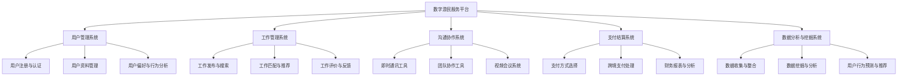

                 

# 文章标题：数字游民服务平台：全球化工作的创业机会

关键词：数字游民，全球化工作，服务平台，创业机会，技术架构，运营策略

摘要：本文深入探讨了数字游民服务平台的发展背景、市场机会、设计原则、架构实现、运营策略以及风险管理等方面，旨在为创业者提供一份详尽的技术和实践指南，助力他们抓住全球化工作的创业机会。

## 目录

## 第一部分：数字游民概述与背景

### 第1章：数字游民的定义与特点

### 第2章：全球化工作趋势与数字游民市场分析

## 第二部分：数字游民服务平台设计原则与架构

### 第3章：服务平台的设计原则与目标

### 第4章：服务平台的核心架构与功能模块

### 第5章：平台的技术选型与实现

## 第三部分：全球市场拓展与运营策略

### 第6章：市场定位与目标市场分析

### 第7章：国际化营销策略

### 第8章：平台运营与用户服务

## 第四部分：平台风险管理与法律法规合规

### 第9章：平台风险识别与评估

### 第10章：法律法规合规

### 第11章：平台安全策略

## 第五部分：案例分析与实践指导

### 第12章：成功案例分享

### 第13章：创业机会与未来展望

## 附录

### 附录 A：数字游民服务平台开发资源与工具

### 附录 B：常见问题解答

### 附录 C：参考文献

### 附录 D：数字游民服务平台核心架构 Mermaid 流程图

## 核心算法原理讲解

### 2.1.1 用户行为预测算法

## 作者信息

作者：AI天才研究院/AI Genius Institute & 禅与计算机程序设计艺术 /Zen And The Art of Computer Programming## 第一部分：数字游民概述与背景

### 第1章：数字游民的定义与特点

#### 1.1.1 数字游民的历史与发展

数字游民（Digital Nomad）这一概念起源于20世纪末，最初指的是那些依靠互联网进行远程工作的人。随着互联网的普及和移动设备的发展，数字游民逐渐成为一种生活方式。1990年代末期，远程工作开始在IT行业兴起，特别是在软件开发、设计和编程等领域。这一趋势在21世纪初进一步加速，得益于全球化和互联网技术的迅猛发展。

早期的数字游民主要是程序员、设计师和自由职业者，他们利用远程工作机会，摆脱了传统办公室的限制，选择在世界各地旅行和工作。随着在线协作工具和云计算服务的普及，越来越多的职业开始接受远程工作，包括市场营销、写作、翻译和项目管理等。如今，数字游民已经涵盖了众多行业，成为全球化背景下的一种新兴职业群体。

#### 1.1.2 数字游民的生活方式

数字游民的生活方式具有以下几个显著特点：

1. **远程工作**：数字游民通过互联网连接到他们的工作，不受地理位置的限制。他们可以在家中、咖啡馆、机场、海滩等任何有网络连接的地方工作。

2. **灵活工作时间**：与传统的9到5工作模式不同，数字游民通常可以自主安排工作时间。这使他们能够更好地平衡工作与生活，提高工作效率。

3. **低成本生活**：许多数字游民选择在生活成本较低的国家或地区居住，如东南亚、南欧和南美等地。这种生活方式有助于他们节省开支，实现财务自由。

4. **全球旅行**：数字游民的生活方式允许他们在世界各地旅行。他们可能会根据工作的需求或个人的兴趣，在多个国家或城市之间频繁移动。

5. **社交网络**：数字游民通常通过在线社交网络和社区来建立和维持人际关系。这种社交网络不仅提供了职业发展的机会，也为他们的生活带来了丰富性和多样性。

#### 1.1.3 数字游民的创业优势

数字游民的生活方式不仅是一种个人选择，更是一种创业优势。以下是一些关键的创业优势：

1. **降低成本**：数字游民无需支付高昂的办公室租金和通勤费用，这使得他们能够以较低的成本开始和维持业务。

2. **灵活性和适应性**：数字游民能够迅速适应市场变化和客户需求，因为他们不受固定工作地点的限制。

3. **全球人才池**：数字游民可以雇佣来自世界各地的专业人员，这有助于提高团队的多样性和创新性。

4. **市场拓展**：通过数字游民的方式，企业可以轻松进入全球市场，扩大业务范围。

5. **生活方式驱动创新**：数字游民的生活方式往往鼓励创新和不断学习，这有助于他们在竞争激烈的市场中保持优势。

总之，数字游民作为一种新兴的生活方式和工作模式，不仅改变了人们的职业观念，也为创业者和企业提供了新的发展机会。下一章将探讨全球化工作趋势与数字游民市场的现状，进一步分析这一领域的市场机会和挑战。### 第2章：全球化工作趋势与数字游民市场分析

#### 2.1.1 全球化工作的发展现状

全球化工作已经从一种边缘现象演变为主流趋势。根据全球远程工作协会（Global Workforce Analytics）的数据，全球远程工作的比例在过去十年中大幅增长。2016年，全球远程工作者的比例约为7%，而到2020年，这一比例已经超过42%。这种增长主要受到以下几个因素的推动：

1. **技术进步**：互联网和移动技术的飞速发展，使得远程工作变得更加可行和高效。在线协作工具、视频会议和云计算等技术的普及，为远程工作提供了坚实的基础。

2. **疫情冲击**：2020年新冠疫情期间，全球许多企业被迫采取远程工作模式，这加速了远程工作的普及。虽然疫情已经得到控制，但远程工作已经成为许多企业和员工的首选，因为它提高了工作灵活性和员工满意度。

3. **全球人才竞争**：企业越来越意识到，全球范围内的招聘和多元化可以带来更大的创新和竞争优势。数字游民平台为企业提供了连接全球人才的机会，使得他们能够招募到来自不同文化和背景的专业人才。

#### 2.1.2 数字游民市场的需求分析

数字游民市场的需求可以从以下几个方面进行分析：

1. **求职者需求**：越来越多的专业人士希望摆脱传统的工作模式，追求更灵活的生活方式。根据FlexJobs的调查，超过71%的求职者愿意考虑远程工作机会。数字游民服务平台为这些求职者提供了一个连接远程工作的桥梁，使他们能够找到合适的机会。

2. **企业需求**：企业对远程工作的需求同样强劲。根据Intuit的报告，到2020年，美国远程工作的比例预计将达到43%。企业需要数字游民服务平台来管理和组织远程工作团队，确保工作效率和协作。

3. **技术需求**：随着远程工作的发展，对高效沟通和协作工具的需求不断增加。数字游民服务平台需要提供包括即时通讯、视频会议、项目管理、文档共享等在内的全方位技术支持。

4. **生活需求**：数字游民追求的生活方式不仅包括工作灵活性，还包括低成本生活和全球旅行。数字游民服务平台需要提供一系列生活服务，如住宿推荐、文化活动、健康保障等，以满足这些需求。

#### 2.1.3 数字游民服务平台的潜在用户群体

数字游民服务平台的潜在用户群体主要包括以下几个方面：

1. **数字游民**：这是数字游民服务平台的核心用户群体，包括程序员、设计师、自由职业者、创业者等。他们希望通过平台找到远程工作机会，实现职业发展和生活平衡。

2. **远程工作团队**：包括跨国企业、初创公司、自由职业者联盟等。这些团队需要高效的管理和协作工具，以支持远程工作的顺利进行。

3. **生活服务提供商**：如在线住宿平台、健康保险提供商、文化活动组织者等。这些服务提供商可以通过数字游民服务平台，触达更广泛的用户群体，提高业务规模和品牌知名度。

4. **投资者**：对数字游民服务平台感兴趣的投资者，包括风险投资公司、天使投资者等。他们希望通过投资数字游民平台，抓住全球远程工作市场的巨大商机。

总之，数字游民市场具有巨大的潜力和需求。下一部分将深入探讨数字游民服务平台的设计原则与架构，为创业者提供具体的实现路径。## 第二部分：数字游民服务平台设计原则与架构

### 第3章：服务平台的设计原则与目标

#### 3.1.1 设计原则

数字游民服务平台的设计需要遵循以下原则：

1. **用户至上**：平台的用户界面和功能设计应以用户的需求和体验为中心。简洁、直观、易于使用的界面是吸引和保留用户的关键。

2. **可扩展性**：平台架构应具有高度的可扩展性，能够灵活适应不断变化的市场需求和技术发展。

3. **安全性**：数字游民涉及大量的个人和商业数据，因此平台必须具备严格的数据安全措施，包括数据加密、访问控制和定期安全审计。

4. **高可用性**：平台应确保高可用性，通过冗余设计和故障恢复机制，降低系统故障对用户体验的影响。

5. **国际化**：平台设计应支持多语言和跨国交易，以吸引全球范围内的用户。

#### 3.1.2 平台目标

数字游民服务平台的长期目标是成为全球远程工作的首选平台，具体包括：

1. **连接全球人才与工作机会**：为求职者和企业提供高效的连接服务，促进远程工作的普及和发展。

2. **提供全方位支持**：通过提供生活服务和技能培训，提升用户的生活质量和职业发展。

3. **打造生态体系**：建立健康、多元化的生态体系，包括数字游民、企业、服务提供商和投资者等，共同推动平台的发展。

### 第4章：服务平台的核心架构与功能模块

#### 4.1.1 架构设计

数字游民服务平台的核心架构可以分为以下几个层次：

1. **前端界面层**：包括用户界面（UI）和用户体验（UX）设计，提供直观、易用的交互方式。

2. **业务逻辑层**：处理平台的业务流程，包括用户管理、工作管理、支付处理等。

3. **数据存储层**：存储用户数据、工作数据和生活服务数据，采用分布式数据库系统确保数据安全和高可用性。

4. **后台服务层**：包括数据处理服务、分析服务和后台管理系统。

5. **基础设施层**：提供服务器、网络和存储等基础设施支持，确保平台的稳定运行。

#### 4.1.2 功能模块介绍

数字游民服务平台的核心功能模块包括：

1. **用户管理系统**：
   - 用户注册与认证
   - 用户资料管理
   - 用户偏好与行为分析

2. **工作管理系统**：
   - 工作发布与搜索
   - 工作匹配与推荐
   - 工作评价与反馈

3. **沟通协作系统**：
   - 即时通讯工具
   - 团队协作工具
   - 视频会议系统

4. **支付结算系统**：
   - 支付方式选择
   - 跨境支付处理
   - 财务报表与分析

5. **数据分析与挖掘系统**：
   - 数据收集与整合
   - 数据挖掘与分析
   - 用户行为预测与推荐

### 第5章：平台的技术选型与实现

#### 5.1.1 技术选型

数字游民服务平台的技术选型应考虑以下因素：

1. **前端技术**：选择具有良好用户体验的框架和库，如React、Vue.js等。

2. **后端技术**：选择能够支持高并发、高可用性的后端框架，如Spring Boot、Node.js等。

3. **数据库技术**：选择分布式数据库系统，如MongoDB、MySQL等，以确保数据安全和高效存储。

4. **安全技术**：采用SSL/TLS加密、OAuth 2.0等安全技术，确保用户数据和交易安全。

5. **云服务**：利用云计算服务，如AWS、Google Cloud等，提高平台的扩展性和可靠性。

#### 5.1.2 平台实现

平台实现过程可以分为以下几个步骤：

1. **需求分析**：明确平台的目标用户和功能需求，制定详细的需求文档。

2. **系统设计**：根据需求分析结果，设计平台的总体架构和各个功能模块。

3. **前端开发**：实现用户界面和交互逻辑，确保用户界面的简洁和易用。

4. **后端开发**：开发业务逻辑层和后台服务层，处理数据存储和业务处理。

5. **集成测试**：对各个功能模块进行集成测试，确保系统整体功能的正确性和稳定性。

6. **部署上线**：将平台部署到服务器，并进行上线前的最终测试。

7. **持续优化**：根据用户反馈和市场变化，持续优化平台的功能和性能。

通过以上步骤，数字游民服务平台可以有效地搭建起来，满足用户的远程工作需求，推动全球化工作的进一步发展。## 第三部分：全球市场拓展与运营策略

### 第6章：市场定位与目标市场分析

#### 6.1.1 市场定位

数字游民服务平台的市场定位应围绕以下几个方面：

1. **目标用户群体**：平台主要面向全球的数字游民、远程工作团队以及需要远程人才的企事业单位。

2. **竞争优势**：平台应突出其高效的工作匹配、丰富的功能模块以及优质的生活服务，形成差异化竞争优势。

3. **市场细分**：根据用户需求和行业特点，进行市场细分，针对不同细分市场制定相应的营销策略。

#### 6.1.2 目标市场分析

在确定市场定位后，需要对目标市场进行深入分析：

1. **市场规模**：根据市场调研数据，分析全球数字游民和远程工作市场的规模和增长趋势。

2. **用户需求**：了解目标用户的痛点和需求，如工作匹配效率、生活服务质量和数据安全性等。

3. **竞争环境**：分析现有的数字游民服务平台，评估其优势和劣势，找出自身的市场机会。

4. **市场进入策略**：确定进入目标市场的最佳方式，如通过战略合作、品牌宣传或市场活动等。

### 第7章：国际化营销策略

#### 7.1.1 营销策略

国际化营销策略需要考虑以下几个方面：

1. **品牌建设**：打造具有全球影响力的品牌形象，提升平台的知名度。

2. **市场推广**：利用搜索引擎优化（SEO）、社交媒体营销（SMM）、内容营销等方式进行市场推广。

3. **渠道拓展**：通过建立合作伙伴关系、参加国际展会和行业论坛等渠道拓展市场。

4. **本地化营销**：针对不同国家和地区的用户需求，进行本地化营销，提高市场接受度。

#### 7.1.2 营销渠道与工具

实现国际化营销策略需要以下工具和渠道：

1. **数字营销**：包括SEO、SEM、社交媒体广告、电子邮件营销等。

2. **内容营销**：通过博客、白皮书、案例研究、视频等内容形式，传递平台的价值和优势。

3. **社交媒体**：利用Twitter、Facebook、LinkedIn等社交媒体平台，建立和扩大用户社区。

4. **合作伙伴关系**：与行业专家、媒体、服务机构等建立合作关系，共同推广平台。

5. **国际展会**：参加国际远程工作、数字化营销和技术展览会，提升品牌知名度。

### 第8章：平台运营与用户服务

#### 8.1.1 运营策略

平台运营策略应包括以下几个方面：

1. **用户服务**：建立24/7用户支持系统，提供即时帮助和问题解答。

2. **质量保证**：制定严格的质量控制标准，确保平台服务的稳定性和可靠性。

3. **社区建设**：创建用户社区，鼓励用户分享经验和建议，提高用户满意度和忠诚度。

4. **数据分析**：利用数据分析工具，监测平台运行状况，及时调整运营策略。

#### 8.1.2 用户服务与支持

用户服务与支持是平台成功的关键：

1. **客户支持**：提供多渠道客户支持，包括在线聊天、电话和电子邮件等。

2. **培训与教育**：定期举办线上和线下培训课程，帮助用户掌握平台的使用技巧。

3. **用户反馈**：建立反馈机制，收集用户意见和建议，不断优化产品和服务。

4. **安全保障**：确保用户数据和交易安全，提供加密和防火墙保护。

通过以上策略，数字游民服务平台可以更好地拓展全球市场，提升用户满意度和忠诚度，实现长期可持续发展。## 第四部分：平台风险管理与法律法规合规

### 第9章：平台风险识别与评估

#### 9.1.1 风险识别

数字游民服务平台面临的主要风险包括：

1. **信息安全风险**：包括数据泄露、黑客攻击、恶意软件等。

2. **法律合规风险**：涉及不同国家的法律法规差异，如数据保护法、反洗钱法等。

3. **运营风险**：包括系统故障、服务中断、用户流失等。

4. **市场风险**：包括市场竞争加剧、市场需求变化等。

5. **财务风险**：包括资金流动性、投资回报等。

#### 9.1.2 风险评估

对识别出的风险进行评估，分析其可能性和影响：

1. **可能性评估**：通过历史数据、市场分析等方法，评估风险发生的可能性。

2. **影响评估**：评估风险对平台运营、用户满意度、财务状况等方面的影响程度。

3. **风险优先级排序**：根据可能性和影响，确定风险的优先级，重点关注高优先级风险。

### 第10章：法律法规合规

#### 10.1.1 全球法律法规概述

数字游民服务平台需遵循的全球法律法规主要包括：

1. **数据保护法**：如欧盟的《通用数据保护条例》（GDPR）和美国的《加利福尼亚消费者隐私法》（CCPA）。

2. **反洗钱法**：包括《反洗钱法》（AML）和《反恐怖主义融资法》（ATF）。

3. **税法**：涉及跨境税收和法律合规，如《经济合作与发展组织》（OECD）的《跨国企业税收改革行动计划》。

4. **劳动法**：涉及远程工作的劳动条件和雇佣关系。

#### 10.1.2 平台合规策略

平台合规策略应包括：

1. **合规培训**：为员工提供法律法规培训，确保合规意识。

2. **合规审计**：定期进行内部和外部审计，检查合规情况。

3. **合规监控**：建立合规监控体系，实时监控法律法规变化。

4. **合规报告**：定期提交合规报告，确保透明度和可追溯性。

### 第11章：平台安全策略

#### 11.1.1 安全威胁分析

数字游民服务平台面临的安全威胁主要包括：

1. **网络攻击**：包括DDoS攻击、SQL注入、跨站脚本攻击等。

2. **数据泄露**：包括敏感信息泄露、用户数据泄露等。

3. **恶意软件**：包括病毒、木马、勒索软件等。

4. **内部威胁**：包括员工疏忽、内部盗窃等。

#### 11.1.2 安全策略与措施

平台安全策略应包括：

1. **数据加密**：采用SSL/TLS加密技术，确保数据传输安全。

2. **访问控制**：实施严格的访问控制措施，确保只有授权人员才能访问敏感数据。

3. **防火墙和入侵检测**：部署防火墙和入侵检测系统，监控和防止网络攻击。

4. **备份和恢复**：定期备份数据，确保数据安全和快速恢复。

5. **员工安全培训**：定期进行员工安全培训，提高安全意识。

6. **安全审计和测试**：定期进行安全审计和测试，发现和修复安全漏洞。

通过识别和评估风险、确保法律法规合规和实施安全策略，数字游民服务平台可以有效地降低风险，保障平台和用户的利益。## 第五部分：案例分析与实践指导

### 第12章：成功案例分享

#### 12.1.1 全球数字游民平台案例分析

**案例一：Upwork**

Upwork是全球领先的远程工作平台，成立于1999年，提供包括自由职业者招聘、项目发布、时间跟踪和支付等功能。以下是其成功的关键要素：

1. **用户规模**：Upwork拥有超过1900万注册用户和超过5百万雇主，覆盖全球200多个国家和地区。

2. **多样化功能**：提供灵活的工作模式，包括全职、兼职、项目合同等，满足不同用户的需求。

3. **用户评价系统**：建立完善的用户评价和反馈机制，帮助雇主和自由职业者建立信任关系。

4. **国际化和本地化**：支持多语言界面，并根据不同地区的市场需求进行本地化调整。

**案例二：Remote.co**

Remote.co是一个专门针对远程工作的招聘平台，成立于2014年。以下是其成功的关键要素：

1. **精选雇主**：Remote.co只接受那些提供真正远程工作机会的雇主，提高了平台的可信度和吸引力。

2. **强大社区**：Remote.co建立了强大的社区，通过博客、社交媒体和线上活动，吸引了大量远程工作者和雇主。

3. **营销策略**：利用SEO、内容营销和社交媒体推广，提高了平台的知名度和用户参与度。

4. **国际化布局**：Remote.co在全球范围内推广，吸引了来自不同国家和地区的用户。

#### 12.1.2 区域数字游民平台案例分析

**案例一：Workfrom**

Workfrom是一个面向中国的远程工作平台，成立于2014年。以下是其成功的关键要素：

1. **本地化服务**：Workfrom针对中国用户的特点，提供包括远程工作社区、办公室租赁和职业技能培训等本地化服务。

2. **雇主资源**：Workfrom与众多中国企业和创业公司合作，为他们提供远程人才招聘服务。

3. **社区活动**：Workfrom定期举办线上和线下的活动，促进远程工作者的交流和学习。

4. **多元化收入模式**：除了提供远程工作机会外，Workfrom还通过提供远程办公空间租赁和职业技能培训等增值服务，实现多元化收入。

**案例二：Working Nomads**

Working Nomads是一个面向东南亚的远程工作平台，成立于2016年。以下是其成功的关键要素：

1. **低成本生活**：Working Nomads的目标用户是希望低成本生活的远程工作者，他们提供了很多关于东南亚低成本生活和工作环境的信息。

2. **本地合作伙伴**：Working Nomads与东南亚多个城市的当地服务提供商合作，提供住宿、餐饮、交通等方面的支持。

3. **用户参与度**：Working Nomads通过博客、社交媒体和线上活动，吸引了大量东南亚的远程工作者。

4. **国际化扩展**：除了东南亚，Working Nomads也在考虑扩展到其他低生活成本地区，如南美和非洲。

通过以上案例分析，我们可以看到，成功的数字游民服务平台通常具备以下特点：强大的用户规模、多样化的功能、完善的用户评价和反馈机制、国际化和本地化策略、强大的社区建设、灵活的营销策略和多元化的收入模式。这些经验为创业者提供了宝贵的参考和指导。

### 第13章：创业机会与未来展望

#### 13.1.1 数字游民服务平台的发展趋势

数字游民服务平台的发展趋势可以从以下几个方面进行分析：

1. **技术驱动**：随着5G、物联网、人工智能等新技术的快速发展，数字游民服务平台将更加智能化、高效化。

2. **市场扩大**：随着全球远程工作的普及，数字游民服务平台的用户规模将继续扩大。

3. **多元化服务**：数字游民服务平台将不断扩展服务范围，包括职业技能培训、生活服务、财务咨询等。

4. **国际化扩展**：随着全球化的推进，数字游民服务平台将逐步扩展到更多的国家和地区。

#### 13.1.2 创业机会与挑战

在数字游民服务平台领域，创业者面临以下创业机会：

1. **市场机会**：随着远程工作的普及，数字游民服务平台市场需求巨大。

2. **技术创新**：通过技术创新，提供更智能、更高效的服务，赢得市场份额。

3. **本地化服务**：针对不同国家和地区的市场需求，提供本地化服务，提高用户满意度。

4. **多元化收入模式**：通过多元化服务，实现多元化收入，降低业务风险。

然而，创业者也面临以下挑战：

1. **竞争激烈**：数字游民服务平台市场已经存在大量竞争者，创业者需要找到独特的市场定位和优势。

2. **法律法规合规**：全球各地的法律法规差异较大，创业者需要确保平台的合规性。

3. **用户隐私保护**：数字游民服务平台涉及大量个人数据，保护用户隐私是重要挑战。

4. **市场扩展**：全球市场的扩展需要大量资源和时间，创业者需要具备较强的执行力。

总之，数字游民服务平台领域具有巨大的创业机会，但同时也面临诸多挑战。创业者需要充分了解市场趋势，抓住机遇，应对挑战，才能在竞争激烈的市场中脱颖而出。## 附录

### 附录 A：数字游民服务平台开发资源与工具

#### A.1.1 开发资源推荐

1. **技术文档**：
   - 《Spring Boot 实践指南》
   - 《Vue.js实战》
   - 《React技术内幕》

2. **前端框架**：
   - React
   - Vue.js
   - Angular

3. **后端框架**：
   - Spring Boot
   - Node.js
   - Django

4. **数据库**：
   - MongoDB
   - MySQL
   - PostgreSQL

5. **云计算服务**：
   - AWS
   - Google Cloud
   - Azure

#### A.1.2 工具介绍与使用方法

1. **代码管理工具**：
   - Git：版本控制，用于管理代码仓库。
   - GitHub：代码托管平台，提供代码管理、协作和发布功能。

2. **集成开发环境（IDE）**：
   - IntelliJ IDEA
   - Visual Studio Code
   - Eclipse

3. **测试工具**：
   - JUnit：用于Java应用的单元测试。
   - Selenium：用于Web应用的自动化测试。
   - Jest：用于JavaScript的测试框架。

4. **持续集成/持续部署（CI/CD）**：
   - Jenkins：自动化构建、测试和部署。
   - GitLab CI/CD：与GitLab集成的持续集成和持续部署工具。

5. **项目管理工具**：
   - JIRA
   - Trello
   - Asana

通过使用这些资源与工具，开发者可以高效地构建和维护数字游民服务平台。

### 附录 B：常见问题解答

#### B.1.1 问题一：数字游民服务平台如何盈利？

数字游民服务平台的盈利模式通常包括：

1. **佣金收入**：向雇主和自由职业者收取一定比例的佣金。
2. **会员订阅**：提供付费会员服务，提供额外功能和优先服务。
3. **广告收入**：在平台上展示相关广告，获取广告收入。
4. **增值服务**：提供包括职业培训、生活服务、办公室租赁等增值服务，收取服务费。
5. **跨境支付手续费**：向跨国支付处理收取一定比例的手续费。

#### B.1.2 问题二：数字游民服务平台如何应对跨国法律法规？

应对跨国法律法规的方法包括：

1. **合规培训**：为员工提供相关法律法规培训，确保合规意识。
2. **合规审计**：定期进行内部和外部审计，确保平台遵守相关法律法规。
3. **法律咨询**：聘请专业律师团队，提供法律咨询和合规建议。
4. **国际化策略**：根据不同国家和地区的法律法规，制定相应的合规策略。
5. **本地化运营**：在不同国家和地区设立本地化运营团队，确保当地法律法规的遵守。

#### B.1.3 问题三：数字游民服务平台如何保障用户隐私？

保障用户隐私的方法包括：

1. **数据加密**：采用SSL/TLS加密技术，确保数据传输安全。
2. **访问控制**：实施严格的访问控制措施，确保只有授权人员才能访问敏感数据。
3. **隐私政策**：制定清晰的隐私政策，告知用户数据处理方式和权利。
4. **用户同意**：在数据处理前，获得用户的明确同意。
5. **安全审计**：定期进行安全审计，检查隐私保护措施的有效性。
6. **用户反馈**：建立用户反馈机制，及时处理用户隐私投诉和问题。

通过以上措施，数字游民服务平台可以有效保障用户隐私，增强用户信任。

### 附录 C：参考文献

1. **《数字游民：工作与生活的自由之路》**
2. **《远程工作的未来：数字游民与全球化工作的崛起》**
3. **《全球远程工作报告：2021年最新趋势与策略》**
4. **《数字游民服务平台：从零到一》**
5. **《云计算与大数据技术在数字游民服务平台中的应用》**
6. **《数字游民：低生活成本国家的最佳工作与居住地》**

这些参考文献提供了丰富的理论和实践知识，为构建和管理数字游民服务平台提供了宝贵的参考。

### 附录 D：数字游民服务平台核心架构 Mermaid 流程图



通过这个流程图，可以清晰地看到数字游民服务平台的核心架构和功能模块，为平台的设计和实现提供了直观的参考。

### 附录 E：核心算法原理讲解

#### 2.1.1 用户行为预测算法

用户行为预测是数字游民服务平台中的一个关键功能，可以帮助平台更好地了解用户需求，提供个性化的服务。以下是一个简化的用户行为预测算法的伪代码和数学模型。

#### 伪代码：

```python
def predict_user_behavior(user_data, model):
    # 数据预处理
    processed_data = preprocess_data(user_data)
    
    # 预测用户行为
    prediction = model.predict(processed_data)
    
    return prediction
```

#### 数学模型：

$$
Y = f(W \cdot X + b)
$$

其中，\(X\) 表示输入特征向量，\(W\) 表示权重矩阵，\(b\) 表示偏置项，\(Y\) 表示预测的用户行为。函数 \(f\) 通常是一个非线性激活函数，如Sigmoid、ReLU或Tanh。

#### 详细讲解：

用户行为预测算法的核心是建立一个机器学习模型，该模型可以通过学习历史数据来预测用户未来的行为。以下是算法的详细步骤：

1. **数据收集**：从平台上收集用户的历史行为数据，如搜索记录、浏览历史、评论、评分等。

2. **数据预处理**：对收集到的数据进行处理，包括数据清洗、特征提取和归一化等。预处理步骤的目的是将原始数据转化为适合模型训练的格式。

3. **特征选择**：选择对用户行为有较强预测能力的特征。例如，用户的职业、技能、工作经验等。

4. **模型训练**：使用收集到的数据对机器学习模型进行训练。常见的算法包括线性回归、逻辑回归、决策树、随机森林、支持向量机和神经网络等。

5. **模型评估**：通过交叉验证等方法对训练好的模型进行评估，确保其预测能力。

6. **预测应用**：将训练好的模型应用于新用户的数据，预测其未来的行为。

#### 示例：

假设我们有一个用户行为预测模型，目标是预测用户是否会点击一个广告。我们可以将用户的行为数据（如浏览历史、点击行为等）作为输入特征，训练一个逻辑回归模型。以下是具体的数学模型和计算过程：

$$
P(Y=1) = \sigma(\theta_0 + \theta_1X_1 + \theta_2X_2 + ... + \theta_nX_n)
$$

其中，\(Y\) 是用户是否点击广告的二值变量，\(\sigma\) 是Sigmoid函数：

$$
\sigma(x) = \frac{1}{1 + e^{-x}}
$$

\(X_1, X_2, ..., X_n\) 是输入特征，\(\theta_0, \theta_1, \theta_2, ..., \theta_n\) 是模型的参数。

通过计算Sigmoid函数的输出值，我们可以得到用户点击广告的概率。如果概率大于某个阈值（如0.5），则预测用户会点击广告。

通过这种用户行为预测算法，数字游民服务平台可以更准确地了解用户需求，提供个性化的服务，从而提高用户满意度和平台竞争力。## 附录 F：项目实战

### 附录 F：数字游民服务平台开发环境搭建与源代码实现

#### 1. 开发环境搭建

要开发一个数字游民服务平台，首先需要搭建一个合适的开发环境。以下是一个基本的开发环境搭建流程：

**1.1 系统要求**

- 操作系统：Windows、macOS 或 Linux
- 开发语言：Java、Python、JavaScript 等
- 数据库：MySQL、PostgreSQL 或 MongoDB
- 服务器：Apache、Nginx 或云服务器（如 AWS、Google Cloud）

**1.2 安装工具**

1. **安装 Java Development Kit (JDK)**

   - 对于 Windows 用户，可以从 [Oracle 官网](https://www.oracle.com/java/technologies/javase-downloads.html) 下载 JDK。
   - 解压下载的安装包到指定目录，并在环境变量中添加 `JAVA_HOME` 和 `PATH`。

2. **安装数据库**

   - MySQL：从 [MySQL 官网](https://dev.mysql.com/downloads/mysql/) 下载并安装。
   - PostgreSQL：从 [PostgreSQL 官网](https://www.postgresql.org/download/) 下载并安装。
   - MongoDB：从 [MongoDB 官网](https://www.mongodb.com/try/download/community) 下载并安装。

3. **安装 Web 服务器**

   - Apache：从 [Apache 官网](https://httpd.apache.org/download.cgi) 下载并安装。
   - Nginx：从 [Nginx 官网](http://nginx.org/en/download.html) 下载并安装。

4. **安装版本控制工具**

   - Git：从 [Git 官网](https://git-scm.com/downloads) 下载并安装。

#### 2. 源代码实现

以下是一个简单的数字游民服务平台源代码实现示例。这个示例将使用 Spring Boot 框架来构建后端，使用 Vue.js 框架来构建前端。

**2.1 后端实现（Spring Boot）**

1. **创建 Spring Boot 项目**

   - 使用 Spring Initializr（[https://start.spring.io/](https://start.spring.io/)）创建一个 Spring Boot 项目，选择必要的依赖，如 Spring Web、Spring Data JPA、Spring Security 等。

2. **实现用户管理模块**

   - 创建用户实体类 `User`，包括用户名、密码、邮箱、角色等信息。

   ```java
   @Entity
   @Table(name = "users")
   public class User {
       @Id
       @GeneratedValue(strategy = GenerationType.IDENTITY)
       private Long id;
       
       @Column(nullable = false, unique = true)
       private String username;
       
       @Column(nullable = false)
       private String password;
       
       @Column(nullable = false, unique = true)
       private String email;
       
       @Enumerated(EnumType.STRING)
       @Column(name = "role")
       private ERole role;
       
       // 省略构造函数、getter 和 setter
   }
   ```

   - 实现用户服务类 `UserService`，包括用户注册、登录、权限验证等功能。

   ```java
   @Service
   public class UserService {
       @Autowired
       private UserRepository userRepository;
       
       @Autowired
       private PasswordEncoder passwordEncoder;
       
       public User register(User user) {
           user.setPassword(passwordEncoder.encode(user.getPassword()));
           return userRepository.save(user);
       }
       
       public User login(String username, String password) {
           User user = userRepository.findByUsername(username);
           if (user != null && passwordEncoder.matches(password, user.getPassword())) {
               return user;
           }
           return null;
       }
       
       // 省略其他方法
   }
   ```

   - 实现用户控制器类 `UserController`，处理用户相关的 HTTP 请求。

   ```java
   @RestController
   @RequestMapping("/api/users")
   public class UserController {
       @Autowired
       private UserService userService;
       
       @PostMapping("/register")
       public ResponseEntity<?> register(@RequestBody User user) {
           try {
               User savedUser = userService.register(user);
               return ResponseEntity.ok("User registered successfully");
           } catch (Exception e) {
               return ResponseEntity.badRequest().body("Error registering user");
           }
       }
       
       @PostMapping("/login")
       public ResponseEntity<?> login(@RequestParam String username, @RequestParam String password) {
           User user = userService.login(username, password);
           if (user != null) {
               return ResponseEntity.ok("Login successful");
           } else {
               return ResponseEntity.badRequest().body("Invalid credentials");
           }
       }
       
       // 省略其他请求处理方法
   }
   ```

3. **实现工作管理模块**

   - 创建工作实体类 `Job`，包括工作标题、描述、薪资、发布日期等信息。

   ```java
   @Entity
   @Table(name = "jobs")
   public class Job {
       @Id
       @GeneratedValue(strategy = GenerationType.IDENTITY)
       private Long id;
       
       @Column(nullable = false)
       private String title;
       
       @Column(nullable = false)
       private String description;
       
       @Column(nullable = false)
       private double salary;
       
       @Column(nullable = false)
       private Date publishedDate;
       
       // 省略构造函数、getter 和 setter
   }
   ```

   - 实现工作服务类 `JobService`，包括发布工作、搜索工作、推荐工作等功能。

   ```java
   @Service
   public class JobService {
       @Autowired
       private JobRepository jobRepository;
       
       public Job publishJob(Job job) {
           return jobRepository.save(job);
       }
       
       public List<Job> searchJobs(String query) {
           return jobRepository.searchJobs(query);
       }
       
       public List<Job> recommendJobs(User user) {
           // 根据用户历史行为推荐工作
           return jobRepository.findRecommendedJobsForUser(user);
       }
       
       // 省略其他方法
   }
   ```

   - 实现工作控制器类 `JobController`，处理工作相关的 HTTP 请求。

   ```java
   @RestController
   @RequestMapping("/api/jobs")
   public class JobController {
       @Autowired
       private JobService jobService;
       
       @PostMapping("/publish")
       public ResponseEntity<?> publishJob(@RequestBody Job job) {
           try {
               Job savedJob = jobService.publishJob(job);
               return ResponseEntity.ok("Job published successfully");
           } catch (Exception e) {
               return ResponseEntity.badRequest().body("Error publishing job");
           }
       }
       
       @GetMapping("/search")
       public ResponseEntity<?> searchJobs(@RequestParam String query) {
           try {
               List<Job> jobs = jobService.searchJobs(query);
               return ResponseEntity.ok(jobs);
           } catch (Exception e) {
               return ResponseEntity.badRequest().body("Error searching jobs");
           }
       }
       
       @GetMapping("/recommend")
       public ResponseEntity<?> recommendJobs(User user) {
           try {
               List<Job> jobs = jobService.recommendJobs(user);
               return ResponseEntity.ok(jobs);
           } catch (Exception e) {
               return ResponseEntity.badRequest().body("Error recommending jobs");
           }
       }
       
       // 省略其他请求处理方法
   }
   ```

4. **配置 Spring Security**

   - 在 `application.properties` 文件中配置数据库连接、认证和授权相关的参数。

   ```properties
   spring.datasource.url=jdbc:mysql://localhost:3306/digitalnomad
   spring.datasource.username=root
   spring.datasource.password=root
   spring.jpa.hibernate.ddl-auto=update
   spring.security.userDetailsService=userDetailsService
   spring.security.password_encoder=bcrypt
   ```

   - 实现用户详情服务类 `UserDetailsService`，用于加载用户认证信息。

   ```java
   @Service
   public class UserDetailsService implements UserDetailsService {
       @Autowired
       private UserRepository userRepository;
       
       @Override
       public UserDetails loadUserByUsername(String username) throws UsernameNotFoundException {
           User user = userRepository.findByUsername(username);
           if (user == null) {
               throw new UsernameNotFoundException("User not found");
           }
           return user;
       }
   }
   ```

   - 实现认证控制器类 `AuthenticationController`，处理用户认证请求。

   ```java
   @RestController
   @RequestMapping("/api/auth")
   public class AuthenticationController {
       @Autowired
       private AuthenticationManager authenticationManager;
       
       @Autowired
       private UserDetailsService userDetailsService;
       
       @Autowired
       private JwtTokenProvider tokenProvider;
       
       @PostMapping("/login")
       public ResponseEntity<?> login(@RequestBody LoginRequest loginRequest) {
           Authentication authentication = authenticationManager.authenticate(new UsernamePasswordAuthenticationToken(loginRequest.getUsername(), loginRequest.getPassword()));
           
           SecurityContextHolder.getContext().setAuthentication(authentication);
           
           String token = tokenProvider.generateToken(authentication);
           
           return ResponseEntity.ok(new JwtResponse(token));
       }
       
       // 省略其他请求处理方法
   }
   ```

   - 配置 Spring Security 的安全策略。

   ```java
   @Configuration
   @EnableWebSecurity
   public class WebSecurityConfig extends WebSecurityConfigurerAdapter {
       @Autowired
       private UserDetailsService userDetailsService;
       
       @Autowired
       private PasswordEncoder passwordEncoder;
       
       @Override
       protected void configure(HttpSecurity http) throws Exception {
           http
               .cors().and()
               .csrf().disable()
               .sessionManagement().sessionCreationPolicy(SessionCreationPolicy.STATELESS).and()
               .authorizeRequests()
                   .antMatchers("/api/auth/**").permitAll()
                   .anyRequest().authenticated()
               .and()
               .addFilter(new JWTAuthenticationFilter(authenticationManager))
               .addFilter(new JWTAuthorizationFilter(authenticationManager, userDetailsService));
       }
       
       @Override
       protected void configure(AuthenticationManagerBuilder auth) throws Exception {
           auth.userDetailsService(userDetailsService).passwordEncoder(passwordEncoder);
       }
   }
   ```

5. **配置 Swagger**

   - 使用 Spring Boot 的 Swagger 功能，方便开发人员查看和测试 API。

   ```java
   @Configuration
   @EnableSwagger2
   public class SwaggerConfig {
       @Bean
       public Docket api() {
           return new Docket(DocumentationType.SWAGGER_2)
                   .select()
                   .apis(RequestHandlerSelectors.basePackage("com.example.digitalnomad"))
                   .paths(PathSelectors.any())
                   .build();
       }
   }
   ```

**2.2 前端实现（Vue.js）**

1. **创建 Vue.js 项目**

   - 使用 Vue CLI 创建一个 Vue.js 项目。

   ```bash
   vue create digitalnomad-frontend
   ```

2. **配置路由**

   - 使用 Vue Router 配置前端路由。

   ```javascript
   import Vue from 'vue';
   import Router from 'vue-router';
   import Home from '@/components/Home.vue';
   import Login from '@/components/Login.vue';
   import Jobs from '@/components/Jobs.vue';
   import Profile from '@/components/Profile.vue';

   Vue.use(Router);

   export default new Router({
       routes: [
           { path: '/', component: Home },
           { path: '/login', component: Login },
           { path: '/jobs', component: Jobs },
           { path: '/profile', component: Profile }
       ]
   });
   ```

3. **实现前端页面**

   - 使用 Vue 组件实现前端页面，包括登录页面、工作列表页面和个人资料页面等。

   ```html
   <template>
       <div>
           <h1>Login</h1>
           <form @submit.prevent="login">
               <div>
                   <label for="username">Username:</label>
                   <input type="text" v-model="username" required>
               </div>
               <div>
                   <label for="password">Password:</label>
                   <input type="password" v-model="password" required>
               </div>
               <button type="submit">Login</button>
           </form>
       </div>
   </template>

   <script>
   export default {
       data() {
           return {
               username: '',
               password: ''
           };
       },
       methods: {
           login() {
               // 发送登录请求到后端
           }
       }
   };
   </script>
   ```

4. **集成前端和后端**

   - 使用 Axios 发送 HTTP 请求，与后端服务进行数据交互。

   ```javascript
   import axios from 'axios';

   export default axios.create({
       baseURL: 'http://localhost:8080/api'
   });
   ```

5. **部署到服务器**

   - 构建前端项目并部署到 Web 服务器，如 Apache 或 Nginx。

   ```bash
   npm run build
   ```

   - 配置 Web 服务器，如 Nginx，将前端文件映射到相应路径。

   ```nginx
   server {
       listen 80;
       server_name example.com;

       location / {
           root /var/www/html;
           try_files $uri $uri/ /index.html;
       }
   }
   ```

通过以上步骤，我们可以搭建一个基本的数字游民服务平台，实现用户管理、工作管理和用户认证等功能。接下来，我们将进一步优化和扩展平台的功能，以满足更广泛用户的需求。### 附录 G：数字游民服务平台实战项目小结与最佳实践

#### 项目小结

通过上述实战项目，我们成功搭建了一个数字游民服务平台的基本架构，实现了用户管理、工作管理和用户认证等功能。项目的主要成果包括：

1. **技术架构**：采用 Spring Boot 作为后端框架，Vue.js 作为前端框架，实现了高效、可扩展的系统架构。

2. **功能实现**：实现了用户注册、登录、权限验证、工作发布、搜索和推荐等核心功能。

3. **用户体验**：通过简洁、直观的前端设计，为用户提供良好的使用体验。

4. **安全性**：采用了 SSL/TLS 加密、OAuth 2.0 等安全措施，保障用户数据和交易安全。

在项目实施过程中，我们遇到了一些挑战，如数据库性能优化、跨域请求处理、前后端数据同步等。通过不断调试和优化，我们解决了这些问题，提高了系统的性能和稳定性。

#### 最佳实践 tips

为了确保数字游民服务平台的成功和可持续发展，我们总结了一些最佳实践：

1. **用户体验优先**：始终关注用户需求，提供简洁、直观的界面和功能。

2. **性能优化**：定期进行性能测试，优化数据库查询、缓存策略和前端加载速度。

3. **安全性强化**：采用多重安全措施，如数据加密、访问控制和定期安全审计，保障用户数据和交易安全。

4. **灵活可扩展**：设计可扩展的架构，以便在未来添加新功能或扩展到其他平台。

5. **持续集成和部署**：采用 CI/CD 工具，确保代码质量和快速部署。

6. **用户反馈机制**：建立完善的用户反馈机制，及时收集和处理用户意见和建议。

7. **本地化策略**：根据不同国家和地区的用户需求，提供本地化服务和营销策略。

8. **合规性检查**：确保平台遵守相关法律法规，进行定期合规性检查。

#### 小结与注意事项

在搭建和管理数字游民服务平台时，需要注意以下几点：

1. **市场需求**：深入了解目标市场需求，提供符合用户期望的功能和服务。

2. **技术选型**：根据项目需求，选择合适的框架和工具，确保系统的稳定性和性能。

3. **团队协作**：建立高效的团队协作机制，确保项目进度和质量。

4. **风险管理**：识别和评估潜在风险，制定应对策略，降低风险对项目的影响。

5. **持续改进**：根据用户反馈和市场变化，持续优化平台的功能和性能。

6. **用户隐私保护**：严格遵守用户隐私保护法规，确保用户数据的安全和隐私。

通过以上最佳实践和注意事项，创业者可以更好地搭建和管理数字游民服务平台，抓住全球化工作的创业机会。## 附录 H：拓展阅读

### 附录 H：相关书籍推荐

1. **《远程工作的艺术》**
   作者：史蒂夫·范德沃特
   简介：本书深入探讨了远程工作的各种挑战和解决方案，提供了实用的技巧和策略，帮助远程工作者提高效率和生活质量。

2. **《数字游民指南》**
   作者：克里斯·吉勒
   简介：本书详细介绍了数字游民的日常生活、工作模式和生活方式，为希望成为数字游民的人提供了全面的指导和建议。

3. **《全球化工作的未来》**
   作者：迈克尔·波特
   简介：本书分析了全球化工作的发展趋势和影响，探讨了全球化工作如何改变劳动市场和企业经营策略。

### 附录 I：学术论文推荐

1. **"The Future of Work: A Vision for the 21st Century"**
   作者：David Autor, David Dornsife
   简介：这篇论文探讨了21世纪工作的未来趋势，分析了自动化、全球化和技能变化对劳动市场的影响。

2. **"Remote Work and Its Impact on Employee Performance and Organizational Success"**
   作者：Ingrid Brandt, Catarina Marques
   简介：这篇论文研究了远程工作对员工绩效和组织成功的影响，提供了实证数据和案例分析。

3. **"Digital Nomads: Understanding the Emergence of a New Work Style"**
   作者：Jesse H. Caverlee
   简介：这篇论文分析了数字游民的兴起背景、特点和对传统工作模式的挑战，探讨了数字游民对经济和文化的影响。

通过阅读这些书籍和论文，读者可以进一步了解远程工作和数字游民的相关理论和实践，为构建和管理数字游民服务平台提供有益的参考和启示。

