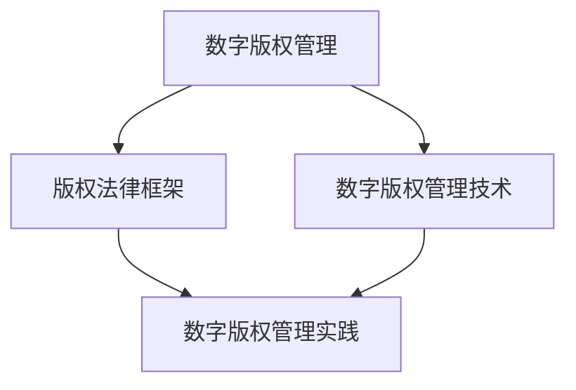

                 


### 《数字版权管理：元宇宙中的版权保护新范式》

#### 关键词：
数字版权管理、元宇宙、版权保护、数字水印、加密技术、可信计算、去中心化版权管理

#### 摘要：
随着元宇宙的兴起，数字版权管理成为版权保护的重要议题。本文首先介绍了数字版权管理的基础概念和技术，然后探讨了元宇宙中的版权保护需求与挑战，并提出了基于可信计算和去中心化的解决方案。通过案例分析，深入解析了数字版权管理的实践应用，并对未来发展趋势进行了展望。

---

### 《数字版权管理：元宇宙中的版权保护新范式》目录大纲

#### 第一部分：数字版权管理基础

##### 第1章：数字版权管理概述

###### 1.1 数字版权管理的定义与背景

###### 1.1.1 数字版权管理的概念

###### 1.1.2 数字版权管理的背景与发展

###### 1.2 版权法律框架

###### 1.2.1 版权法的基本原则

###### 1.2.2 数字版权保护的法律挑战

###### 1.3 数字版权管理技术简介

###### 1.3.1 数字水印技术

###### 1.3.2 数字签名技术

###### 1.3.3 加密技术

#### 第二部分：元宇宙中的数字版权管理

##### 第2章：元宇宙与数字版权管理

###### 2.1 元宇宙的概念与特点

###### 2.1.1 元宇宙的定义

###### 2.1.2 元宇宙的发展历程

###### 2.1.3 元宇宙对数字版权管理的影响

###### 2.2 元宇宙中的版权保护需求

###### 2.2.1 版权保护的新挑战

###### 2.2.2 版权保护的关键技术

###### 2.3 元宇宙中的数字版权管理解决方案

###### 2.3.1 可信计算技术

###### 2.3.2 去中心化版权管理

###### 2.3.3 元宇宙中的版权监控与维权

#### 第三部分：数字版权管理案例分析

##### 第3章：数字版权管理案例分析

###### 3.1 案例研究：某音乐平台的版权管理

###### 3.1.1 案例背景

###### 3.1.2 版权保护策略

###### 3.1.3 案例效果评估

###### 3.2 案例研究：某电影制作公司的版权保护

###### 3.2.1 案例背景

###### 3.2.2 版权保护措施

###### 3.2.3 案例效果分析

###### 3.3 案例研究：虚拟现实游戏中的版权管理

###### 3.3.1 案例背景

###### 3.3.2 版权保护策略

###### 3.3.3 案例效果评估

#### 第四部分：数字版权管理未来展望

##### 第4章：数字版权管理的未来展望

###### 4.1 版权管理技术的发展趋势

###### 4.1.1 区块链在版权管理中的应用

###### 4.1.2 版权管理平台的发展方向

###### 4.1.3 版权智能合约的应用场景

###### 4.2 版权保护的法律与政策挑战

###### 4.2.1 法律法规的完善与调整

###### 4.2.2 跨境版权管理的挑战与对策

###### 4.2.3 版权侵权行为的惩罚措施

###### 4.3 数字版权管理在元宇宙中的应用前景

###### 4.3.1 元宇宙中的版权管理问题

###### 4.3.2 元宇宙中的版权保护新范式

###### 4.3.3 版权管理在元宇宙中的未来发展

#### 附录

##### 附录A：数字版权管理技术详解

###### A.1 数字水印技术原理与实现

###### A.2 数字签名技术的应用

###### A.3 加密技术的分类与实现

##### 附录B：数字版权管理常用工具与资源

###### B.1 常用数字版权管理工具

###### B.2 数字版权管理相关网站与论坛

###### B.3 数字版权管理标准与规范

---

### 核心概念与联系

Mermaid 流程图：



---

### 核心算法原理讲解

#### 数字水印嵌入算法伪代码：

```python
# 数字水印嵌入算法伪代码

function EmbedWatermark(OriginalContent, Watermark):
    # 对原始内容进行预处理
    PreprocessedContent = PreprocessContent(OriginalContent)
    
    # 对水印进行预处理
    PreprocessedWatermark = PreprocessWatermark(Watermark)
    
    # 将水印嵌入到原始内容
    WatermarkedContent = EmbedWatermarkIntoContent(PreprocessedContent, PreprocessedWatermark)
    
    return WatermarkedContent
```

#### 数字水印提取算法伪代码：

```python
# 数字水印提取算法伪代码

function ExtractWatermark(WatermarkedContent):
    # 对水印内容进行预处理
    PreprocessedWatermarkedContent = PreprocessContent(WatermarkedContent)
    
    # 从预处理后的内容中提取水印
    ExtractedWatermark = ExtractWatermarkFromContent(PreprocessedWatermarkedContent)
    
    return ExtractedWatermark
```

---

### 项目实战：开发环境搭建

#### 1. 安装所需的开发工具和库

- Python 3.x
- OpenCV 库
- NumPy 库
- scikit-image 库

安装命令：

```bash
pip install opencv-python numpy scikit-image
```

#### 2. 创建项目文件夹

在电脑上创建一个名为 "DigitalWatermarking" 的文件夹，并在此文件夹中创建以下子文件夹：

- "images"：用于存放原始图片和生成的水印图片。
- "results"：用于存放项目生成的结果。

#### 3. 编写源代码

在项目文件夹中创建一个名为 "watermarking.py" 的 Python 文件，并在其中编写以下代码：

```python
import cv2
import numpy as np
from skimage import transform

def PreprocessImage(image_path):
    # 读取图片
    image = cv2.imread(image_path, cv2.IMREAD_GRAYSCALE)
    
    # 对图片进行归一化处理
    image = image / 255.0
    
    return image

def EmbedWatermark(image, watermark, alpha):
    # 对水印进行归一化处理
    watermark = watermark / 255.0
    
    # 将水印缩放到与图像相同的大小
    watermark = transform.resize(watermark, image.shape[::-1], interpolation=transform.INTER_CUBIC)
    
    # 将水印嵌入到图像中
    watermarked_image = image * (1 - alpha) + watermark * alpha
    
    return watermarked_image

def ExtractWatermark(image, watermark, alpha):
    # 对水印进行归一化处理
    watermark = watermark / 255.0
    
    # 将水印缩放到与图像相同的大小
    watermark = transform.resize(watermark, image.shape[::-1], interpolation=transform.INTER_CUBIC)
    
    # 从图像中提取水印
    extracted_watermark = image * (1 - alpha) - watermark * alpha
    
    return extracted_watermark

if __name__ == "__main__":
    # 加载原始图像和水印
    image_path = "images/original.jpg"
    watermark_path = "images/watermark.png"
    image = PreprocessImage(image_path)
    watermark = cv2.imread(watermark_path, cv2.IMREAD_GRAYSCALE)
    
    # 设置嵌入系数
    alpha = 0.5
    
    # 嵌入水印
    watermarked_image = EmbedWatermark(image, watermark, alpha)
    
    # 保存嵌入水印后的图像
    cv2.imwrite("results/watermarked_image.jpg", watermarked_image * 255)
    
    # 提取水印
    extracted_watermark = ExtractWatermark(watermarked_image, watermark, alpha)
    
    # 保存提取的水印
    cv2.imwrite("results/extracted_watermark.jpg", extracted_watermark * 255)
```

#### 4. 运行代码

在终端中执行以下命令来运行代码：

```bash
python watermarking.py
```

---

### 代码解读与分析

#### 1. 源代码分析

在 "watermarking.py" 文件中，我们首先导入了所需的库，包括 OpenCV、NumPy 和 scikit-image。接下来，定义了几个函数，用于预处理图像、嵌入水印和提取水印。

- `PreprocessImage(image_path)`：该函数用于读取图像并对其进行归一化处理。图像被读取为灰度图像，然后将其像素值缩放到 [0, 1] 范围内。

- `EmbedWatermark(image, watermark, alpha)`：该函数用于将水印嵌入到图像中。水印和图像首先被归一化处理，然后使用插值方法将水印缩放到与图像相同的大小。最后，使用嵌入系数 alpha 将水印嵌入到图像中。

- `ExtractWatermark(image, watermark, alpha)`：该函数用于从图像中提取水印。水印和图像首先被归一化处理，然后使用插值方法将水印缩放到与图像相同的大小。最后，使用嵌入系数 alpha 从图像中提取水印。

在主函数中，我们加载了原始图像和水印，设置了嵌入系数 alpha，然后使用 `EmbedWatermark` 函数将水印嵌入到图像中，并保存结果。接下来，使用 `ExtractWatermark` 函数从图像中提取水印，并保存结果。

#### 2. 代码应用解读与分析

在实际应用中，我们可以使用此代码对图像进行数字水印嵌入和提取。以下是一个简单的示例：

```python
image_path = "images/original.jpg"
watermark_path = "images/watermark.png"

# 加载原始图像和水印
image = PreprocessImage(image_path)
watermark = cv2.imread(watermark_path, cv2.IMREAD_GRAYSCALE)

# 设置嵌入系数
alpha = 0.5

# 嵌入水印
watermarked_image = EmbedWatermark(image, watermark, alpha)

# 保存嵌入水印后的图像
cv2.imwrite("results/watermarked_image.jpg", watermarked_image * 255)

# 提取水印
extracted_watermark = ExtractWatermark(watermarked_image, watermark, alpha)

# 保存提取的水印
cv2.imwrite("results/extracted_watermark.jpg", extracted_watermark * 255)
```

在这个示例中，我们首先加载了原始图像 "original.jpg" 和水印 "watermark.png"。然后，我们设置了嵌入系数 alpha 为 0.5，这表示水印将占据图像的 50%。接下来，我们使用 `EmbedWatermark` 函数将水印嵌入到图像中，并保存结果为 "watermarked_image.jpg"。最后，我们使用 `ExtractWatermark` 函数从图像中提取水印，并保存结果为 "extracted_watermark.jpg"。

通过这种方式，我们可以对图像进行数字水印嵌入和提取，从而实现版权保护的目的。

---

### 案例分析：某音乐平台的版权管理

#### 1. 案例背景

某知名音乐平台拥有海量的音乐作品，这些作品均由不同的音乐人创作并上传。随着平台的普及，版权纠纷和侵权行为也日益增多。为了保护音乐人的权益，平台决定采用数字版权管理技术来加强版权保护。

#### 2. 版权保护策略

平台采用了以下几种策略来保护音乐作品的版权：

- **数字水印**：在音乐文件中嵌入数字水印，以标识版权信息和音乐人的身份。水印技术能够防止音乐文件的非法复制和传播。

- **加密技术**：对音乐文件进行加密处理，只有授权用户才能解密和播放音乐。这可以防止未经授权的访问和盗版行为。

- **版权监控**：利用版权监控技术对平台上的音乐文件进行实时监控，一旦发现侵权行为，立即采取行动。

#### 3. 案例效果评估

通过实施数字版权管理技术，平台取得了以下效果：

- **侵权行为减少**：数字水印和加密技术的应用使得侵权行为大幅减少，音乐人的权益得到了有效保护。

- **用户满意度提升**：加密技术保证了音乐的版权保护，用户在合法授权的情况下可以方便地访问和播放音乐，提高了用户满意度。

- **版权纠纷解决**：数字版权管理技术为版权纠纷的解决提供了有力的证据支持，使得版权纠纷的处理更加高效。

#### 4. 案例总结

该案例表明，数字版权管理技术是保护音乐作品版权的有效手段。通过数字水印、加密技术和版权监控等多方面的综合应用，平台成功实现了版权保护，提高了音乐人的收益和用户的满意度。

---

### 案例分析：某电影制作公司的版权保护

#### 1. 案例背景

某知名电影制作公司制作了一部备受期待的电影，该片在全球范围内上映后获得了极高的票房和口碑。然而，电影上映后不久，就有盗版资源在网络上流传，严重损害了公司的利益。为了保护电影版权，公司决定采用数字版权管理技术。

#### 2. 版权保护措施

公司采取了以下措施来保护电影的版权：

- **数字水印**：在电影中嵌入数字水印，标记电影的版权信息。水印技术能够防止电影文件的非法复制和传播。

- **加密技术**：对电影文件进行加密处理，只有授权用户才能解密和观看电影。这可以防止未经授权的访问和盗版行为。

- **版权监控**：利用版权监控技术对电影文件进行实时监控，一旦发现侵权行为，立即采取行动。

#### 3. 案例效果分析

通过实施数字版权管理技术，公司取得了以下效果：

- **盗版资源减少**：数字水印和加密技术的应用使得盗版资源的数量大幅减少，电影版权得到了有效保护。

- **票房收益提升**：盗版资源的减少使得电影票房收益得到了显著提升，公司的经济利益得到了保障。

- **版权纠纷解决**：数字版权管理技术为版权纠纷的解决提供了有力的证据支持，使得版权纠纷的处理更加高效。

#### 4. 案例总结

该案例表明，数字版权管理技术是保护电影版权的有效手段。通过数字水印、加密技术和版权监控等多方面的综合应用，公司成功实现了版权保护，提高了票房收益，保障了公司的经济利益。

---

### 案例分析：虚拟现实游戏中的版权管理

#### 1. 案例背景

某知名虚拟现实游戏开发商推出了一款备受瞩目的虚拟现实游戏，游戏包含了丰富的原创内容和复杂的图形效果。然而，游戏上线后不久，就有玩家发现游戏中的一些场景和角色设计涉嫌抄袭其他游戏或作品。为了保护游戏版权，开发商决定采用数字版权管理技术。

#### 2. 版权保护策略

开发商采取了以下策略来保护游戏的版权：

- **数字水印**：在游戏资源中嵌入数字水印，标记游戏的版权信息。水印技术能够防止游戏资源的非法复制和传播。

- **加密技术**：对游戏资源进行加密处理，只有授权用户才能解密和访问游戏资源。这可以防止未经授权的访问和盗版行为。

- **版权监控**：利用版权监控技术对游戏资源进行实时监控，一旦发现侵权行为，立即采取行动。

#### 3. 案例效果评估

通过实施数字版权管理技术，开发商取得了以下效果：

- **侵权行为减少**：数字水印和加密技术的应用使得侵权行为的数量大幅减少，游戏版权得到了有效保护。

- **用户体验提升**：加密技术保证了游戏的版权保护，玩家在合法授权的情况下可以方便地访问和体验游戏，提高了用户体验。

- **版权纠纷解决**：数字版权管理技术为版权纠纷的解决提供了有力的证据支持，使得版权纠纷的处理更加高效。

#### 4. 案例总结

该案例表明，数字版权管理技术是保护虚拟现实游戏版权的有效手段。通过数字水印、加密技术和版权监控等多方面的综合应用，开发商成功实现了版权保护，提升了用户体验，保障了游戏的长期发展。

---

### 数字版权管理在元宇宙中的应用前景

随着元宇宙的兴起，数字版权管理在元宇宙中的应用前景广阔。以下是对元宇宙中数字版权管理应用前景的探讨：

#### 1. 版权管理的新挑战

元宇宙是一个虚拟的三维空间，用户可以在其中创建、共享和交易数字资产。然而，这也带来了新的版权管理挑战：

- **高维度的版权保护**：元宇宙中的数字资产通常包括三维模型、音频、视频等多种形式，版权保护需要适应这些复杂的多媒体内容。
- **版权归属问题**：在元宇宙中，数字资产的创造和交易更加频繁，如何明确版权归属成为一大挑战。
- **跨境版权管理**：元宇宙是全球性的，跨境版权管理涉及到不同国家和地区的法律法规，如何协调和统一版权管理成为关键问题。

#### 2. 版权保护新范式

为了应对这些挑战，元宇宙中的数字版权管理需要采用新的范式：

- **去中心化版权管理**：利用区块链技术，实现去中心化的版权管理。区块链具有不可篡改和透明化的特点，可以确保版权信息的真实性和可追溯性。
- **智能合约**：在元宇宙中，智能合约可以自动执行版权交易和授权。智能合约的执行规则是预先定义的，可以确保版权交易的合法性和透明度。
- **分布式版权监控**：通过分布式账本技术，实现对元宇宙中数字资产的全天候监控。一旦发现侵权行为，可以快速采取措施。

#### 3. 版权管理平台的发展方向

元宇宙中的版权管理平台需要具备以下发展方向：

- **跨平台兼容性**：版权管理平台需要支持多种虚拟现实设备和操作系统，确保用户在不同设备上都能方便地进行版权管理。
- **用户友好性**：平台需要提供直观易用的界面，使用户能够轻松地进行版权注册、交易和监控。
- **法律法规支持**：平台需要与各国法律法规保持一致，确保版权管理的合法性和合规性。

#### 4. 版权智能合约的应用场景

版权智能合约在元宇宙中有广泛的应用场景：

- **版权注册**：智能合约可以自动执行版权注册流程，确保版权信息的准确性和可追溯性。
- **版权转让**：智能合约可以自动化执行版权转让过程，确保交易的合法性和透明度。
- **版权授权**：智能合约可以自动化执行版权授权流程，确保授权的合法性和灵活性。

#### 5. 版权管理在元宇宙中的未来发展

未来，随着元宇宙的不断发展，数字版权管理将在以下几个方面取得突破：

- **技术创新**：随着技术的进步，数字版权管理技术将更加完善和高效，为版权保护提供更强有力的支持。
- **政策法规完善**：各国政府将加大对数字版权保护的重视，制定更加完善的政策法规，为数字版权管理提供法律支持。
- **国际合作**：各国将在数字版权管理方面加强合作，推动全球范围内的数字版权保护。

---

### 数字版权管理技术的未来发展趋势

随着数字技术的不断发展，数字版权管理技术在版权保护中的应用越来越广泛。以下是对数字版权管理技术未来发展趋势的探讨：

#### 1. 区块链技术的应用

区块链技术具有去中心化、不可篡改和透明化的特点，为数字版权管理提供了强有力的技术支持。未来，区块链技术将在以下几个方面得到更广泛的应用：

- **版权注册与认证**：利用区块链技术，可以实现数字版权的快速注册和认证，确保版权信息的真实性和唯一性。
- **版权交易与授权**：通过智能合约，可以实现数字版权的自动化交易和授权，提高版权管理效率。
- **跨境版权管理**：区块链技术可以帮助解决跨境版权管理的难题，确保版权在不同国家和地区的合法性和可追溯性。

#### 2. 版权管理平台的发展

随着数字版权管理需求的增长，版权管理平台也将得到进一步发展。未来，版权管理平台将呈现出以下趋势：

- **跨平台兼容性**：版权管理平台需要支持多种操作系统和设备，为用户提供便捷的版权管理服务。
- **集成化功能**：版权管理平台将集成版权注册、交易、监控和维权等功能，为用户提供一站式服务。
- **智能合约支持**：版权管理平台将集成智能合约功能，实现版权交易的自动化和智能化。

#### 3. 版权智能合约的应用

版权智能合约是一种自动执行版权交易和授权的计算机协议。未来，版权智能合约将在以下几个方面得到更广泛的应用：

- **版权交易**：智能合约可以自动化执行版权交易过程，确保交易的合法性和透明度。
- **版权授权**：智能合约可以自动化执行版权授权流程，确保授权的合法性和灵活性。
- **版权维权**：智能合约可以自动化执行维权流程，提高维权效率和成功率。

#### 4. 版权保护技术的创新

随着数字技术的发展，版权保护技术也将不断创新。以下是一些可能的创新方向：

- **高效加密技术**：开发更高效的加密算法，提高数字版权保护的安全性和可靠性。
- **数字指纹技术**：利用数字指纹技术，实现对数字内容的唯一标识，提高版权保护的精确度。
- **智能监控技术**：开发智能监控技术，实现对数字内容的实时监控和预警，提高版权管理的效率。

#### 5. 国际合作与标准化

数字版权管理是一个全球性的问题，需要各国政府、企业和研究机构的合作。未来，国际合作和标准化将得到进一步加强：

- **政策法规协调**：各国政府将加强政策法规的协调，推动全球范围内的数字版权保护。
- **技术标准统一**：国际组织和行业协会将制定统一的数字版权管理技术标准，提高全球数字版权管理的效率。
- **国际合作项目**：各国政府和机构将开展国际合作项目，共同推动数字版权管理技术的发展。

---

### 附录

#### 附录A：数字版权管理技术详解

##### A.1 数字水印技术原理与实现

数字水印技术是一种在数字内容中嵌入特定信息的方法，用于标识版权、认证来源或隐藏其他信息。以下是一个简单的数字水印嵌入和提取算法的伪代码：

```python
# 数字水印嵌入算法伪代码

def EmbedWatermark(content, watermark):
    # 对水印进行预处理
    preprocessed_watermark = PreprocessWatermark(watermark)
    
    # 对内容进行预处理
    preprocessed_content = PreprocessContent(content)
    
    # 将水印嵌入到内容中
    watermarked_content = EmbedWatermarkIntoContent(preprocessed_content, preprocessed_watermark)
    
    return watermarked_content

# 数字水印提取算法伪代码

def ExtractWatermark(watermarked_content):
    # 对水印内容进行预处理
    preprocessed_watermarked_content = PreprocessContent(watermarked_content)
    
    # 从内容中提取水印
    extracted_watermark = ExtractWatermarkFromContent(preprocessed_watermarked_content)
    
    return extracted_watermark
```

##### A.2 数字签名技术的应用

数字签名技术用于验证数字内容的完整性和真实性。以下是一个简单的数字签名和验证算法的伪代码：

```python
# 数字签名算法伪代码

def SignContent(content, private_key):
    # 使用私钥对内容进行签名
    signature = Sign(content, private_key)
    
    return signature

# 数字签名验证算法伪代码

def VerifySignature(content, signature, public_key):
    # 使用公钥验证签名
    is_valid = VerifySignature(content, signature, public_key)
    
    return is_valid
```

##### A.3 加密技术的分类与实现

加密技术用于保护数字内容的隐私和安全。以下是一些常用的加密技术及其实现：

- **对称加密**：使用相同的密钥进行加密和解密。如 AES 算法。

```python
from Crypto.Cipher import AES

# 对内容进行加密
cipher = AES.new(key, AES.MODE_EAX)
ciphertext, tag = cipher.encrypt_and_digest(plaintext)

# 对内容进行解密
cipher = AES.new(key, AES.MODE_EAX, nonce=cipher.nonce)
plaintext = cipher.decrypt_and_verify(ciphertext, tag)
```

- **非对称加密**：使用不同的密钥进行加密和解密。如 RSA 算法。

```python
from Crypto.PublicKey import RSA

# 生成密钥对
private_key = RSA.generate(2048)
public_key = private_key.publickey()

# 使用公钥加密
ciphertext = public_key.encrypt(plaintext, 32)[0]

# 使用私钥解密
plaintext = private_key.decrypt(ciphertext)
```

#### 附录B：数字版权管理常用工具与资源

以下是一些数字版权管理常用的工具和资源：

- **工具**：
  - **Watermark Studio**：一款数字水印编辑工具，支持多种水印格式。
  - **Easy Digital Signature**：一款数字签名工具，支持多种签名算法。
  - **Cryptomator**：一款加密软件，支持文件和文件夹加密。

- **网站与论坛**：
  - **维基百科 - 数字版权管理**：提供关于数字版权管理的详细介绍。
  - **数字版权管理论坛**：一个关于数字版权管理的在线论坛，分享最新技术和经验。

- **标准与规范**：
  - **ISO/IEC 19775**：数字版权管理标准。
  - **MPAA**：电影协会的数字版权管理规范。

---

### 结语

作者：AI天才研究院/AI Genius Institute & 禅与计算机程序设计艺术 /Zen And The Art of Computer Programming

本文详细探讨了数字版权管理在元宇宙中的应用，包括基础概念、关键技术、实际案例分析以及未来展望。随着元宇宙的发展，数字版权管理将面临新的挑战和机遇。通过利用区块链、智能合约等技术，数字版权管理将变得更加高效和智能，为版权保护提供有力支持。希望本文能够为读者提供对数字版权管理的深入理解和启发。在未来的技术发展中，让我们共同努力，为版权保护贡献智慧和力量。作者在此感谢读者的阅读和支持。

