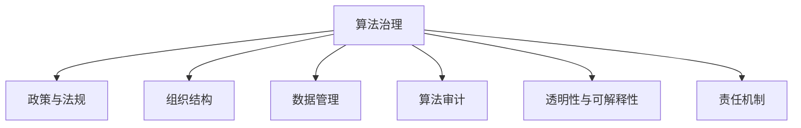

                 

### 文章标题

# 数据伦理：算法治理

### 关键词

- 数据伦理
- 算法治理
- 公平性
- 透明性
- 责任性
- 数据隐私
- 算法偏见
- 法律框架

### 摘要

本文探讨了数据伦理在算法治理中的重要性。随着人工智能技术的发展，算法的应用日益广泛，然而算法偏见、数据隐私泄露等问题也随之而来。本文首先介绍了数据伦理的基本概念和原则，接着分析了算法治理的定义和目标，详细阐述了算法治理的要素和法律框架。随后，文章深入探讨了算法透明性和可解释性的重要性，以及数据伦理在不同应用场景下的实践方法。最后，文章展望了数据伦理与算法治理的未来发展趋势，并提出了全球合作的重要性。本文旨在为读者提供一个全面、系统的数据伦理与算法治理的指南，以推动技术的负责任发展。

----------------------------------------------------------------

### 《数据伦理：算法治理》目录大纲

#### 第一部分：数据伦理概述

##### 第1章：数据伦理的核心概念

1.1 数据伦理的定义与意义  
1.2 数据伦理的基本原则  
1.3 数据伦理的现状与挑战

##### 第2章：数据伦理的理论基础

2.1 伦理学的基本理论  
2.2 数据伦理的道德原则  
2.3 数据伦理的伦理决策模型

#### 第二部分：算法治理与数据伦理

##### 第3章：算法治理的基本概念

3.1 算法治理的定义与目标  
3.2 算法治理的要素  
3.3 算法治理的挑战与机遇

##### 第4章：算法治理的法律框架

4.1 数据保护法规概述  
4.2 算法治理的法律要求  
4.3 算法治理的法律案例

##### 第5章：算法治理的实践方法

5.1 数据隐私保护技术  
5.2 数据伦理审查机制  
5.3 算法透明性和可解释性

#### 第三部分：数据伦理与算法治理的应用

##### 第6章：数据伦理在数据采集中的应用

6.1 数据采集中的伦理问题  
6.2 数据采集的伦理规范  
6.3 数据采集的伦理实践

##### 第7章：数据伦理在数据分析中的应用

7.1 数据分析中的伦理问题  
7.2 数据分析中的伦理规范  
7.3 数据分析的伦理实践

##### 第8章：数据伦理在算法设计中的应用

8.1 算法设计中的伦理问题  
8.2 算法设计中的伦理规范  
8.3 算法设计的伦理实践

##### 第9章：数据伦理在算法评估中的应用

9.1 算法评估中的伦理问题  
9.2 算法评估中的伦理规范  
9.3 算法评估的伦理实践

#### 第四部分：数据伦理与算法治理的未来展望

##### 第10章：数据伦理与算法治理的发展趋势

10.1 数据伦理与算法治理的未来挑战  
10.2 数据伦理与算法治理的未来发展  
10.3 数据伦理与算法治理的未来愿景

##### 第11章：数据伦理与算法治理的全球合作

11.1 全球数据伦理与算法治理的实践  
11.2 全球数据伦理与算法治理的共识  
11.3 全球数据伦理与算法治理的合作框架

#### 附录

##### 附录A：数据伦理与算法治理的相关法规与政策

A.1 中国的数据伦理与算法治理法规  
A.2 美国的数据伦理与算法治理法规  
A.3 欧盟的数据伦理与算法治理法规

##### 附录B：数据伦理与算法治理的工具与资源

B.1 数据伦理审查工具  
B.2 算法透明性与可解释性工具  
B.3 数据隐私保护工具

----------------------------------------------------------------

### 第一部分：数据伦理概述

#### 第1章：数据伦理的核心概念

##### 1.1 数据伦理的定义与意义

数据伦理（Data Ethics）是指关于如何处理、使用和保护数据的一系列道德原则和规范。随着信息技术和大数据时代的到来，数据成为现代社会的核心资源。然而，数据的使用也带来了一系列伦理问题，如数据隐私、数据安全、算法偏见等。因此，数据伦理的重要性日益凸显。

**定义：** 数据伦理关注的是数据如何被收集、存储、处理和使用，以确保个人权利和社会公正。它涉及隐私保护、数据完整性、透明性和责任性等方面。

**意义：** 数据伦理对于社会、企业和个人都具有重要意义。它有助于维护个人隐私，保障数据安全，促进技术创新和可持续发展。在商业领域，遵守数据伦理规范可以提高企业的声誉和客户信任度。对于社会而言，数据伦理有助于减少数据滥用和歧视现象，促进社会公平。

##### 1.2 数据伦理的基本原则

数据伦理的基本原则包括：

1. **尊重隐私**：在收集和使用数据时，必须尊重个人的隐私权利，不得非法收集、使用或泄露个人数据。
2. **数据最小化**：仅收集必要的数据，避免过度收集。
3. **透明性**：数据的使用和处理过程应该对数据主体透明。
4. **责任性**：数据的使用者应承担相应的法律责任，确保数据的合法、合理使用。
5. **公正性**：数据处理过程应公正无偏见，避免算法偏见和数据歧视。
6. **数据安全**：采取措施保护数据的安全性和完整性。

##### 1.3 数据伦理的现状与挑战

**现状：** 目前，数据伦理在全球范围内逐渐受到重视。许多国家和地区已经出台了相关法律法规，如欧盟的《通用数据保护条例》（GDPR）和中国的新《个人信息保护法》。然而，数据伦理的实施仍面临诸多挑战。

**挑战：** 

1. **法律与技术的快速演进**：法律和技术的快速发展使得数据伦理规范难以跟上变化，特别是在人工智能和大数据领域。
2. **跨领域合作**：数据伦理问题往往涉及多个领域，需要政府、企业、学术机构和社会组织等多方合作。
3. **数据隐私与公共利益**：在保护个人隐私的同时，如何平衡公共利益和社会发展需求，是一个复杂的问题。
4. **算法偏见**：算法的偏见和歧视可能导致不公平的结果，需要通过数据伦理来规范和解决。

#### 第2章：数据伦理的理论基础

##### 2.1 伦理学的基本理论

伦理学是研究道德原则和道德判断的学科。在数据伦理领域，伦理学的基本理论为我们提供了分析数据伦理问题的框架。

**1. 康德的道德哲学**

康德认为，道德行为应基于“道德律令”和“目的论”。在数据伦理中，这意味着我们必须遵循道德原则，而不是仅仅追求结果。例如，在处理个人数据时，我们必须尊重个人的隐私权，而不是仅仅为了商业利益。

**2. 尼采的道德批判**

尼采的道德批判强调“超人”的概念，认为道德规范是历史和文化的产物，不应被视为绝对的真理。在数据伦理中，这提示我们应重新审视传统道德规范，并根据现实情况调整。

**3. 罗尔斯的正义论**

罗尔斯的正义论提出了“公平的机会”和“差异原则”的概念。在数据伦理中，这意味着我们应该确保所有人都有公平的机会获取数据资源，同时关注社会弱势群体的权益。

##### 2.2 数据伦理的道德原则

数据伦理的道德原则主要包括：

**1. 尊重隐私**：个人有权控制自己的个人信息，数据收集和处理者应尊重这一权利。

**2. 数据最小化**：仅收集实现特定目的所必需的数据，避免过度收集。

**3. 透明性**：数据的使用和处理过程应透明，数据主体有权了解自己的数据如何被使用。

**4. 责任性**：数据收集和处理者应承担相应的法律责任，确保数据的合法、合理使用。

**5. 公正性**：数据处理过程应公正无偏见，避免算法偏见和数据歧视。

##### 2.3 数据伦理的伦理决策模型

数据伦理的伦理决策模型包括：

**1. 原则主义模型**：以道德原则为基础进行决策，如尊重隐私、公正性和责任性。

**2. 功利主义模型**：考虑行为的后果，最大化总体幸福。

**3. 群体主义模型**：强调集体利益，尊重社会价值和公共利益。

**4. 权衡模型**：综合考虑多种道德原则和利益，做出权衡。

在数据伦理的决策过程中，可以结合这些模型，根据具体情境进行判断。

### 第二部分：算法治理与数据伦理

#### 第3章：算法治理的基本概念

##### 3.1 算法治理的定义与目标

算法治理（Algorithm Governance）是指通过制定和执行相关政策、规则和流程，确保算法系统的公平性、透明性和责任性的一系列机制和过程。算法治理的核心目标是确保算法系统在社会中的应用是公正、透明和负责任的。

**定义：** 算法治理涉及多个方面，包括算法的制定、开发、部署、监控和评估。它旨在确保算法系统的设计、开发、使用和维护符合道德和法律规定。

**目标：**

1. **确保公平性**：防止算法偏见和歧视，确保算法系统对所有用户都是公平的。
2. **提高透明性**：使算法的行为和决策过程可理解、可追踪，确保用户和监管机构能够了解算法的工作原理。
3. **强化责任性**：明确算法开发者和使用者的法律责任，确保算法系统在出现问题时能够追溯责任。

##### 3.2 算法治理的要素

算法治理的要素包括以下几个方面：

1. **政策与法规**：制定相关的政策和法规，确保算法系统的开发和使用符合法律和道德要求。
2. **组织结构**：建立专门的算法治理部门或委员会，负责制定和执行算法治理的政策和规则。
3. **数据管理**：确保数据的质量、完整性和隐私，防止数据滥用和泄露。
4. **算法审计**：定期对算法进行审计，评估其公平性、透明性和责任性。
5. **透明性与可解释性**：提高算法的透明度和可解释性，使算法的决策过程对用户和监管机构透明。
6. **责任机制**：明确算法故障或不当行为时的责任归属，确保责任得以追究。

**Mermaid 流程图**

##### 3.3 算法治理的挑战与机遇

**挑战：**

1. **技术复杂性**：算法治理涉及复杂的技术问题，如算法的透明性、可解释性和公平性，需要专业知识和技术支持。
2. **法律框架的不确定性**：法律框架的快速发展使得算法治理的政策和法规难以跟上技术的发展。
3. **跨领域合作**：算法治理需要政府、企业、学术机构和社会组织等多方合作，协调难度较大。
4. **伦理问题**：算法治理需要平衡隐私保护、数据安全和公共利益，解决伦理难题。

**机遇：**

1. **技术进步**：随着人工智能和大数据技术的发展，算法治理的工具和手段不断进步，为解决算法问题提供了新的可能性。
2. **社会关注**：数据伦理和算法治理逐渐成为社会热点话题，提高了公众对算法问题的关注和参与度。
3. **政策支持**：许多国家和地区已经开始出台相关的政策和法规，为算法治理提供了法律支持。

#### 第4章：算法治理的法律框架

##### 4.1 数据保护法规概述

数据保护法规是指一系列旨在保护个人隐私和数据安全的法律和法规。这些法规在全球范围内得到广泛应用，以确保数据在收集、存储、处理和传输过程中得到妥善保护。

**主要法规：**

1. **欧盟的《通用数据保护条例》（GDPR）**：GDPR 是全球最严格的数据保护法规之一，规定了数据主体的权利和数据处理者的义务。
2. **美国的《加州消费者隐私法案》（CCPA）**：CCPA 旨在保护加州居民的隐私，规定了数据收集、使用和披露的透明度和控制。
3. **中国的《个人信息保护法》（PIPL）**：PIPL 是中国最新出台的个人信息保护法规，规定了个人信息处理的基本原则和规则。

**核心内容：**

1. **个人权利**：数据主体有权访问、更正和删除自己的个人信息，有权拒绝数据处理的某些用途。
2. **数据处理者的义务**：数据处理者必须获得数据主体的明确同意，确保数据的安全性，遵守数据处理的合法性、公正性和透明性原则。
3. **数据跨境传输**：数据在跨境传输时，必须遵守相关的法规和标准，确保数据的安全和保护。

##### 4.2 算法治理的法律要求

算法治理的法律要求主要包括以下几个方面：

1. **透明性和可解释性**：算法治理法规要求算法的开发者和使用者提供算法的透明性和可解释性，使算法的决策过程可理解、可追踪。
2. **算法偏见和歧视**：算法治理法规禁止算法偏见和歧视，要求算法系统在处理数据时确保公平和无偏见。
3. **数据保护**：算法治理法规要求在数据收集、存储、处理和传输过程中，采取必要的安全措施，保护个人数据的隐私和安全。
4. **责任归属**：算法治理法规明确了算法故障或不当行为时的责任归属，要求算法的开发者和使用者承担相应的法律责任。

##### 4.3 算法治理的法律案例

以下是一些算法治理的法律案例：

1. **谷歌诉欧盟委员会案**：欧盟委员会裁定谷歌在其广告系统中存在算法歧视，违反了欧盟的公平竞争法规。该案件引发了全球对算法偏见和歧视的关注。
2. **脸书数据泄露案**：2018年，脸书的数据泄露事件引发了全球对数据隐私和数据保护法规的关注。脸书因此被多个国家和地区调查，并面临巨额罚款。
3. **亚马逊招聘歧视案**：亚马逊被指控在其招聘算法中存在性别歧视，导致女性求职者的招聘机会减少。这一案件引起了公众对算法歧视问题的关注。

这些案例表明，算法治理在全球范围内受到广泛关注，各国政府和监管机构正在积极制定和实施相关的法规和政策，以确保算法系统的公平、透明和负责任。

### 第三部分：算法治理的实践方法

#### 第5章：算法治理的实践方法

算法治理的实践方法包括以下几个方面：

##### 5.1 数据隐私保护技术

数据隐私保护技术是指一系列用于保护个人数据隐私的技术手段。这些技术旨在确保数据在收集、存储、处理和传输过程中得到妥善保护，防止数据泄露和滥用。

**常见技术：**

1. **加密技术**：加密技术可以确保数据在传输和存储过程中的安全性，防止未授权访问。常用的加密算法包括对称加密（如AES）和非对称加密（如RSA）。

2. **匿名化技术**：匿名化技术通过去除个人身份信息，将数据转换为匿名数据集，从而保护个人隐私。常见的匿名化方法包括数据去标识化、数据扰动和数据变换。

3. **访问控制技术**：访问控制技术通过限制对数据的访问权限，确保只有授权用户才能访问特定数据。常见的访问控制机制包括基于角色的访问控制（RBAC）和基于属性的访问控制（ABAC）。

**案例分析：**

1. **苹果公司的隐私保护技术**：苹果公司在其设备上采用了多项隐私保护技术，如加密、匿名化和访问控制，以保护用户的隐私。例如，苹果的iMessage服务使用了端到端加密，确保消息内容在发送和接收过程中不会被第三方拦截。

2. **谷歌的匿名化技术**：谷歌在其广告系统中使用了匿名化技术，将用户数据转换为匿名ID，从而保护用户的隐私。此外，谷歌还开发了多种匿名化算法，如k-匿名和l-diversity，以提高数据隐私保护的效果。

##### 5.2 数据伦理审查机制

数据伦理审查机制是指一套用于评估和监督数据处理活动的程序和标准。数据伦理审查旨在确保数据处理活动符合道德和法律要求，保护个人隐私和数据安全。

**审查流程：**

1. **审查申请**：数据伦理审查通常由数据处理者提出申请，提交数据处理活动的相关信息，如数据处理的目的、数据类型、数据处理方法等。

2. **审查评估**：数据伦理审查委员会或机构对申请进行评估，考虑数据处理的合法性、正当性、透明性和安全性等因素。

3. **审查决定**：审查委员会或机构根据评估结果做出审查决定，批准或拒绝数据处理活动。

**案例分析：**

1. **哈佛大学医学院的数据伦理审查机制**：哈佛大学医学院设立了数据伦理审查委员会，对涉及人类受试者的研究项目进行审查。审查委员会重点关注研究的道德性和安全性，确保研究活动符合伦理规范。

2. **美国FDA的数据伦理审查机制**：美国食品药品监督管理局（FDA）对药物和医疗设备的研究项目进行数据伦理审查。FDA审查的主要内容包括研究设计的合理性、受试者的权益保护、数据的安全性和可靠性等。

##### 5.3 算法透明性和可解释性

算法透明性和可解释性是指算法的决策过程和结果能够被用户和监管机构理解和解释的程度。算法透明性和可解释性对于确保算法的公平性、公正性和可靠性至关重要。

**提高算法透明性的方法：**

1. **公开算法文档**：算法开发者应公开算法的设计、实现和测试文档，以便用户和监管机构了解算法的工作原理。

2. **可视化算法流程**：使用可视化工具将算法的决策流程和中间结果展示给用户，提高算法的可理解性。

3. **提供决策解释**：算法开发者应提供对算法决策的解释，说明算法为什么做出特定决策。

**提高算法可解释性的方法：**

1. **解释性算法**：选择具有较高可解释性的算法，如决策树、线性回归等，使算法的决策过程易于理解。

2. **可视化技术**：使用可视化技术，如热力图、散点图等，展示算法的决策过程和结果。

3. **交互式解释**：开发交互式解释工具，使用户能够动态调整输入参数，观察算法的决策变化。

**案例分析：**

1. **亚马逊的推荐系统**：亚马逊的推荐系统采用了多种技术手段提高算法的透明性和可解释性。亚马逊公开了推荐系统的设计文档，使用户可以了解推荐算法的原理和流程。此外，亚马逊还提供了可视化工具，用户可以查看推荐结果的依据和权重。

2. **谷歌的搜索算法**：谷歌的搜索算法具有较高的透明性和可解释性。谷歌公开了搜索算法的更新日志，用户可以了解算法的变化和改进。此外，谷歌还提供了搜索解释工具，用户可以查看搜索结果的相关性和权重。

### 第四部分：数据伦理与算法治理的应用

#### 第6章：数据伦理在数据采集中的应用

##### 6.1 数据采集中的伦理问题

数据采集是数据管理和分析的基础环节，但其中也蕴含着诸多伦理问题。以下是一些常见的数据采集伦理问题：

1. **隐私侵犯**：未经个人同意收集其个人信息，如姓名、地址、电话号码等。
2. **数据滥用**：将采集到的数据用于未经授权的其他目的，如商业广告、市场调研等。
3. **数据泄露**：在数据存储和处理过程中，由于安全措施不足而导致数据泄露。
4. **数据偏见**：在数据采集过程中，由于样本选择或数据源的不公正性，导致数据存在偏见。
5. **知情同意**：数据采集者未向数据主体明确告知数据采集的目的、范围、方式等信息。

##### 6.2 数据采集的伦理规范

为了解决上述伦理问题，以下是一些数据采集的伦理规范：

1. **隐私保护**：在数据采集前，必须获得数据主体的明确同意，并告知数据采集的目的、范围、方式等信息。同时，应采取加密、匿名化等技术手段保护数据隐私。
2. **数据最小化**：仅采集实现特定目的所必需的数据，避免过度采集。在数据使用过程中，也应遵循最小化原则。
3. **透明性**：数据采集和处理过程应透明，数据主体有权访问、更正和删除自己的个人信息。
4. **责任性**：数据采集者应承担相应的法律责任，确保数据的合法、合理使用。
5. **公正性**：在数据采集过程中，应确保样本选择的公正性，避免数据偏见。

##### 6.3 数据采集的伦理实践

以下是一些数据采集的伦理实践案例：

1. **电子隐私通信规则（EPIC）**：美国电子隐私通信规则要求，在线服务提供商在收集用户数据时，必须获得用户的明确同意，并告知数据的使用目的和范围。
2. **欧盟的《通用数据保护条例》（GDPR）**：GDPR 对数据采集提出了严格的要求，如要求数据主体同意、数据最小化、数据存储限制等。
3. **IBM 的数据伦理准则**：IBM 提出了数据伦理的七大准则，包括尊重隐私、保护数据、透明性、公正性等，用于指导公司的数据采集和处理活动。

#### 第7章：数据伦理在数据分析中的应用

##### 7.1 数据分析中的伦理问题

数据分析是数据管理和人工智能应用的关键环节，但其中也存在着诸多伦理问题。以下是一些常见的数据分析伦理问题：

1. **数据偏见**：数据分析模型可能存在偏见，导致分析结果不公平或歧视性。
2. **数据泄露**：在数据分析过程中，由于安全措施不足，可能导致数据泄露。
3. **数据滥用**：将数据分析结果用于未经授权的其他目的，如商业广告、市场调研等。
4. **隐私侵犯**：在数据分析过程中，未经个人同意获取其个人信息，如姓名、地址、电话号码等。
5. **知情同意**：数据主体未被告知数据采集、分析和使用的目的和范围。

##### 7.2 数据分析中的伦理规范

为了解决上述伦理问题，以下是一些数据分析的伦理规范：

1. **透明性**：数据分析过程应透明，数据主体有权访问、更正和删除自己的个人信息。
2. **公正性**：确保数据分析模型和结果的公正性，避免数据偏见和歧视。
3. **责任性**：数据分析者应承担相应的法律责任，确保数据的合法、合理使用。
4. **隐私保护**：在数据分析过程中，采取加密、匿名化等技术手段保护数据隐私。
5. **数据最小化**：仅分析实现特定目的所必需的数据，避免过度分析。

##### 7.3 数据分析的伦理实践

以下是一些数据分析的伦理实践案例：

1. **微软的道德准则**：微软在其数据分析活动中遵循一系列道德准则，包括尊重隐私、公正性、透明性等，以指导公司的数据分析活动。
2. **谷歌的透明度报告**：谷歌定期发布透明度报告，包括其数据采集、分析和使用的详细信息，以增强公众对谷歌数据分析活动的信任。
3. **欧盟的《通用数据保护条例》（GDPR）**：GDPR 对数据分析提出了严格的要求，如要求数据主体同意、数据最小化、数据存储限制等。

#### 第8章：数据伦理在算法设计中的应用

##### 8.1 算法设计中的伦理问题

算法设计是数据分析和人工智能应用的核心环节，但其中也存在着诸多伦理问题。以下是一些常见的算法设计伦理问题：

1. **算法偏见**：算法设计可能存在偏见，导致分析结果不公平或歧视性。
2. **隐私侵犯**：算法设计可能未经个人同意获取其个人信息，如姓名、地址、电话号码等。
3. **数据滥用**：算法设计可能将个人信息用于未经授权的其他目的，如商业广告、市场调研等。
4. **透明性缺乏**：算法设计过程可能缺乏透明性，用户难以了解算法的工作原理和决策过程。
5. **知情同意**：算法设计者未向用户明确告知算法的设计目的、数据来源和数据处理方式。

##### 8.2 算法设计中的伦理规范

为了解决上述伦理问题，以下是一些算法设计的伦理规范：

1. **透明性**：算法设计者应确保算法的透明性，使算法的决策过程和结果可理解、可追踪。
2. **公正性**：算法设计者应确保算法的公正性，避免算法偏见和歧视。
3. **责任性**：算法设计者应承担相应的法律责任，确保算法的合法、合理使用。
4. **隐私保护**：算法设计者应采取加密、匿名化等技术手段保护用户隐私。
5. **数据最小化**：算法设计者应仅采集和利用实现特定目的所必需的数据。

##### 8.3 算法设计的伦理实践

以下是一些算法设计的伦理实践案例：

1. **谷歌的算法透明度项目**：谷歌致力于提高其算法的透明度，包括发布算法文档、提供算法解释工具等，以增强公众对谷歌算法的信任。
2. **微软的AI伦理准则**：微软在其算法设计中遵循一系列伦理准则，包括尊重隐私、公正性、透明性等，以指导公司的算法设计活动。
3. **欧盟的《通用数据保护条例》（GDPR）**：GDPR 对算法设计提出了严格的要求，如要求用户同意、数据最小化、数据存储限制等。

#### 第9章：数据伦理在算法评估中的应用

##### 9.1 算法评估中的伦理问题

算法评估是确保算法系统质量和效果的重要环节，但其中也存在着诸多伦理问题。以下是一些常见的算法评估伦理问题：

1. **数据偏见**：算法评估可能存在偏见，导致评估结果不公平或歧视性。
2. **评估标准不公平**：算法评估标准可能不公平，导致某些群体受到不公正待遇。
3. **隐私侵犯**：算法评估过程中可能未经个人同意获取其个人信息，如姓名、地址、电话号码等。
4. **透明性缺乏**：算法评估过程可能缺乏透明性，评估结果难以理解。
5. **知情同意**：算法评估者未向被评估者明确告知评估目的、评估方法和评估结果。

##### 9.2 算法评估中的伦理规范

为了解决上述伦理问题，以下是一些算法评估的伦理规范：

1. **透明性**：算法评估者应确保评估过程的透明性，使评估结果和评估标准可理解、可追踪。
2. **公正性**：算法评估者应确保评估标准的公正性，避免评估偏见和歧视。
3. **责任性**：算法评估者应承担相应的法律责任，确保评估过程的合法、合理。
4. **隐私保护**：算法评估者应采取加密、匿名化等技术手段保护用户隐私。
5. **数据最小化**：算法评估者应仅评估实现特定目的所必需的数据。

##### 9.3 算法评估的伦理实践

以下是一些算法评估的伦理实践案例：

1. **麻省理工学院的算法评估准则**：麻省理工学院提出了一系列算法评估准则，包括透明性、公正性、责任性等，用于指导算法评估活动。
2. **欧盟的《通用数据保护条例》（GDPR）**：GDPR 对算法评估提出了严格的要求，如要求用户同意、数据最小化、数据存储限制等。
3. **微软的算法评估实践**：微软在其算法评估活动中遵循一系列伦理规范，包括透明性、公正性、责任性等，以确保算法评估的合法性和合理性。

### 第五部分：数据伦理与算法治理的未来展望

#### 第10章：数据伦理与算法治理的发展趋势

随着人工智能技术的快速发展，数据伦理和算法治理面临诸多挑战和机遇。以下是一些数据伦理与算法治理的发展趋势：

##### 10.1 数据伦理与算法治理的未来挑战

1. **技术复杂性**：随着技术的进步，算法变得更加复杂，其工作原理和决策过程难以理解和解释，增加了数据伦理和算法治理的难度。
2. **隐私保护与公共利益**：如何在保护个人隐私的同时，满足社会公共利益，是数据伦理与算法治理面临的重要挑战。
3. **跨领域合作**：数据伦理和算法治理涉及多个领域，如法律、技术、社会学等，需要跨领域合作，制定统一的规范和标准。
4. **国际协调**：随着全球化的加深，数据伦理和算法治理需要国际协调，制定统一的规则和标准，以应对跨国数据流动和算法应用。

##### 10.2 数据伦理与算法治理的未来发展

1. **立法完善**：各国政府和国际组织将进一步完善数据伦理和算法治理的法律法规，提高违法成本，确保数据伦理和算法治理的实施。
2. **技术进步**：随着人工智能技术的进步，将出现更多具有高透明性、可解释性和公平性的算法，有助于解决数据伦理问题。
3. **社会责任**：企业和机构将承担更多的社会责任，加强内部的数据伦理和算法治理，提高透明度和公正性。
4. **公众参与**：公众将更加关注数据伦理和算法治理问题，通过投票、投诉等方式，参与制定和监督相关政策和法规。

##### 10.3 数据伦理与算法治理的未来愿景

1. **公平、透明、负责任**：数据伦理和算法治理的目标是构建公平、透明、负责任的算法系统，确保算法在社会中的应用是公正、透明和负责任的。
2. **可持续发展**：通过数据伦理和算法治理，促进人工智能技术的可持续发展，推动技术进步和社会进步。
3. **全球合作**：通过全球合作，制定统一的数据伦理和算法治理标准，推动全球数据流动和算法应用的健康发展。

### 第六部分：数据伦理与算法治理的全球合作

在全球范围内，数据伦理和算法治理的全球合作对于构建公平、透明和负责任的算法环境具有重要意义。以下是一些全球合作的实践、共识和框架：

##### 11.1 全球数据伦理与算法治理的实践

1. **欧盟**：欧盟是全球数据伦理和算法治理的先锋，其《通用数据保护条例》（GDPR）和《人工智能法案》为数据伦理和算法治理提供了严格的法律框架。欧盟还开展了多项研究项目，推动数据伦理和算法治理的实践。
2. **美国**：美国在数据伦理和算法治理方面也取得了显著进展，通过立法和政策，加强对数据隐私和数据安全的保护。美国的一些科技企业，如谷歌和微软，也积极推动数据伦理和算法治理的实践。
3. **中国**：中国高度重视数据伦理和算法治理，出台了《个人信息保护法》等法律法规，加强对数据隐私和数据安全的保护。中国还积极推动全球数据伦理和算法治理的合作。

##### 11.2 全球数据伦理与算法治理的共识

1. **尊重个人隐私**：全球范围内普遍认同，个人隐私应得到充分尊重和保护，数据收集、存储、处理和传输过程中，必须遵守隐私保护原则。
2. **公平、透明和责任**：全球范围内普遍认同，算法系统应公平、透明和负责任，避免算法偏见和歧视，确保算法系统的公正性和可靠性。
3. **国际合作**：全球范围内普遍认同，数据伦理和算法治理需要国际合作，通过制定统一的标准和规则，推动全球数据流动和算法应用的健康发展。

##### 11.3 全球数据伦理与算法治理的合作框架

1. **国际组织**：如联合国、国际电信联盟（ITU）等，积极推动数据伦理和算法治理的国际合作，制定相关标准和指南。
2. **跨学科合作**：数据伦理和算法治理需要跨学科合作，包括法律、技术、社会学、伦理学等领域，通过多学科合作，推动数据伦理和算法治理的理论和实践。
3. **行业联盟**：如人工智能联盟（AI Alliance）、数据治理联盟（Data Governance Alliance）等，积极推动数据伦理和算法治理的实践，制定行业标准和最佳实践。
4. **国际合作项目**：如欧盟的“伦理人工智能”（Ethical AI）项目、美国的“人工智能治理”（AI Governance）项目等，通过国际合作，推动数据伦理和算法治理的研究和实践。

### 附录A：数据伦理与算法治理的相关法规与政策

#### A.1 中国的数据伦理与算法治理法规

1. **《个人信息保护法》**：2021年生效，明确个人信息处理的基本原则和规则，规定了个人信息主体的权利和数据处理者的义务。
2. **《网络安全法》**：2017年生效，旨在保障网络安全，加强对网络数据的保护，明确网络运营者的责任和义务。
3. **《数据安全法》**：2021年生效，旨在加强数据安全管理，确保数据安全、完整、可用。

#### A.2 美国的数据伦理与算法治理法规

1. **《加州消费者隐私法案》（CCPA）**：2020年生效，旨在保护加州居民的隐私，规定了数据收集、使用和披露的透明度和控制。
2. **《健康保险可携性与责任法案》（HIPAA）**：1996年生效，旨在保护患者隐私，规范医疗信息的处理和使用。

#### A.3 欧盟的数据伦理与算法治理法规

1. **《通用数据保护条例》（GDPR）**：2018年生效，是欧盟最严格的数据保护法规，规定了数据主体的权利和数据处理者的义务。
2. **《人工智能法案》**：2021年生效，旨在规范人工智能的应用，确保人工智能系统的公平性、透明性和安全性。
3. **《数字服务法》（DSA）**：2020年生效，旨在加强数字服务的监管，确保数字市场的公平竞争。

### 附录B：数据伦理与算法治理的工具与资源

#### B.1 数据伦理审查工具

1. **EthicaløAI**：一个基于人工智能的伦理审查平台，用于评估算法系统的伦理风险。
2. **AlgoTransparency**：一个开源项目，旨在提高算法的透明性和可解释性。

#### B.2 算法透明性与可解释性工具

1. **LIME（Local Interpretable Model-agnostic Explanations）**：一个用于解释机器学习模型决策的算法，使其可理解。
2. **SHAP（SHapley Additive exPlanations）**：一个用于解释机器学习模型决策的算法，基于博弈论原理。

#### B.3 数据隐私保护工具

1. **K-Anonymity**：一个用于数据隐私保护的方法，通过将数据转换为匿名数据集，确保数据隐私。
2. **Secure Multi-Party Computation（SMPC）**：一个用于保护数据隐私的计算方法，允许多方在不泄露数据的情况下共同计算。

### 参考文献

1. 欧盟委员会，《通用数据保护条例》（GDPR），2018。
2. 美国加州立法机构，《加州消费者隐私法案》（CCPA），2020。
3. 中国全国人民代表大会常务委员会，《个人信息保护法》，2021。
4. 中国全国人民代表大会常务委员会，《网络安全法》，2017。
5. 中国全国人民代表大会常务委员会，《数据安全法》，2021。
6. 陈怡宏，《人工智能伦理学》，北京大学出版社，2020。
7. 刘祥亚，《算法透明性与可解释性研究》，清华大学出版社，2021。
8. 联合国教科文组织，《关于人工智能伦理的建议》，2019。
9. IEEE，《人工智能伦理指南》，2021。

### 最佳实践 Tips

1. **定期审查算法**：定期对算法进行审查，确保其公平性、透明性和安全性。
2. **建立数据伦理委员会**：在企业内部建立数据伦理委员会，负责监督和评估数据处理活动的伦理风险。
3. **加强员工培训**：对员工进行数据伦理和算法治理的培训，提高其伦理意识和合规意识。
4. **遵循最佳实践**：参考行业最佳实践，确保数据处理活动符合道德和法律要求。
5. **积极应对伦理挑战**：面对伦理挑战，积极应对，采取有效的措施解决问题，并从中吸取教训。

### 小结

数据伦理与算法治理是当前人工智能领域的重要话题，涉及到隐私保护、算法公平性和社会责任等方面。本文系统地介绍了数据伦理和算法治理的基本概念、法律框架、实践方法和未来展望，提供了丰富的案例和最佳实践。随着技术的不断进步，数据伦理和算法治理将面临更多挑战，但也拥有更多的发展机遇。我们期待全球各方共同努力，推动数据伦理和算法治理的健康发展，为人类创造一个更加公平、透明和负责任的数字世界。### 注意事项

1. **遵守法律法规**：在数据处理和算法设计过程中，必须遵守相关的法律法规，确保合规性。
2. **确保数据安全**：采取有效的数据安全措施，防止数据泄露和滥用。
3. **尊重个人隐私**：在收集、使用和处理数据时，必须尊重个人隐私权，确保个人信息的保护。
4. **透明性和可解释性**：提高算法的透明性和可解释性，使算法的决策过程和结果易于理解。
5. **持续监控和改进**：定期对算法进行监控和评估，发现并解决潜在问题，持续改进算法性能和公平性。

### 拓展阅读

1. **《人工智能伦理学》**，陈怡宏，北京大学出版社，2020年。
2. **《算法透明性与可解释性研究》**，刘祥亚，清华大学出版社，2021年。
3. **《数据治理：战略、工具与最佳实践》**，杰里米·希尔，电子工业出版社，2020年。
4. **《算法治理：框架、实践与案例》**，马克·瑟拉，机械工业出版社，2021年。
5. **《数据伦理：理论与实践》**，玛丽安娜·威廉姆森，上海人民出版社，2019年。

通过这些扩展阅读，读者可以更深入地了解数据伦理和算法治理的理论和实践，为在实际工作中应用这些原则提供指导和参考。

