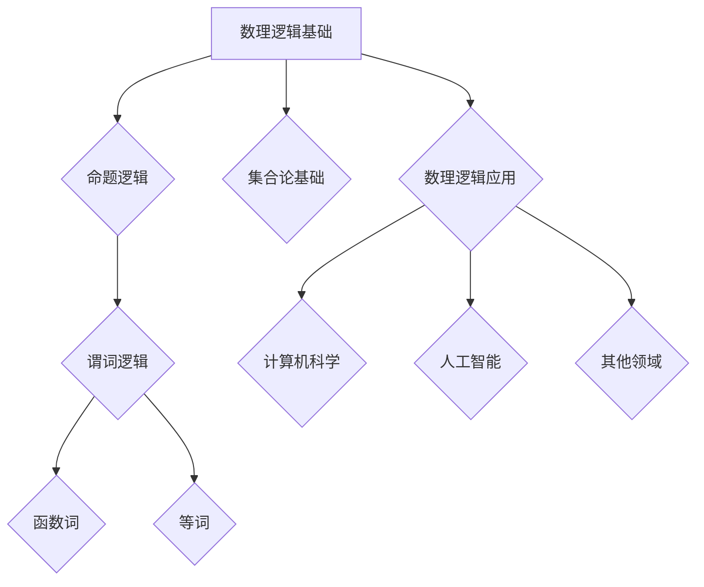

                 


### 文章标题：数理逻辑：函数词、等词

#### 关键词：数理逻辑，函数词，等词，命题逻辑，谓词逻辑，集合论，计算机科学，人工智能

#### 摘要：
本文深入探讨了数理逻辑中的两个重要概念——函数词和等词。通过对数理逻辑基础知识的介绍，我们逐步了解了命题逻辑和谓词逻辑的基本概念及其推理规则。随后，我们详细阐述了函数词和等词的定义、性质及其分类。最后，本文展示了数理逻辑在计算机科学和人工智能领域的广泛应用，并通过实际案例和代码实现进行了深入剖析。

---

# 《数理逻辑：函数词、等词》

## 第一部分：数理逻辑基础

### 第1章：数理逻辑概述

#### 1.1 数理逻辑的发展历程

数理逻辑作为现代逻辑学的基础，起源于古希腊时期的形式逻辑。19世纪末，数学家乔治·坎特洛维奇首次提出了数理逻辑的概念，并在20世纪得到了迅速发展。数理逻辑的研究使得数学的证明过程变得严谨，也为计算机科学和人工智能的发展提供了理论基础。

#### 1.2 数理逻辑的基本概念

数理逻辑主要研究命题、推理和证明。其中，命题是逻辑的基本单位，推理是推导命题之间关系的逻辑过程，证明则是通过推理证明某个命题的真实性。

#### 1.3 数理逻辑的应用领域

数理逻辑在多个领域有着广泛的应用。在计算机科学中，数理逻辑被用于计算机程序逻辑、形式语言与自动机、计算机网络逻辑基础等方面。在人工智能领域，数理逻辑被用于逻辑推理、机器学习中的逻辑表示、自然语言处理中的逻辑分析等方面。

### 第2章：命题逻辑

#### 2.1 命题逻辑的基本概念

命题逻辑是数理逻辑的起点，主要研究命题的真假及其之间的关系。命题逻辑中的基本概念包括命题、逻辑运算符、逻辑公式等。

#### 2.2 命题逻辑的基本公式

命题逻辑的基本公式包括等价式、蕴含式、反证式、析取式和合取式等。这些公式可以用于证明命题之间的关系。

#### 2.3 命题逻辑的推理规则

命题逻辑的推理规则包括推理规则、归纳推理和假设推理等。这些规则可以帮助我们从已知命题推导出新的命题。

### 第3章：谓词逻辑

#### 3.1 谓词逻辑的基本概念

谓词逻辑是数理逻辑的核心，主要研究对象之间的属性和关系。谓词逻辑中的基本概念包括谓词、个体、关系、量词等。

#### 3.2 谓词逻辑的基本公式

谓词逻辑的基本公式包括谓词公式、量化公式、命题公式等。这些公式可以用于表示复杂的关系和属性。

#### 3.3 谓词逻辑的推理规则

谓词逻辑的推理规则包括推理规则、全称量词推理规则、存在量词推理规则等。这些规则可以帮助我们从已知谓词公式推导出新的谓词公式。

### 第4章：集合论基础

#### 4.1 集合的基本概念

集合论是数理逻辑的基础，主要研究集合及其运算。集合的基本概念包括集合、元素、子集、交集、并集、补集等。

#### 4.2 集合的基本运算

集合的基本运算包括交集、并集、补集、笛卡尔积等。这些运算可以用于表示集合之间的关系和组合。

#### 4.3 集合的公理系统

集合的公理系统包括公理集合论、谓词集合论等。这些公理系统可以用于证明集合的性质和关系。

## 第二部分：函数词和等词

### 第5章：函数词的概念

#### 5.1 函数的定义

函数是一种从定义域到值域的映射，其特点是每个定义域中的元素都有唯一的值域对应元素。

#### 5.2 函数的性质

函数的性质包括单射性、满射性和双射性等。这些性质可以用于区分不同的函数。

#### 5.3 函数的分类

函数的分类包括线性函数、非线性函数、有界函数、无界函数等。这些分类可以用于分析函数的性质和特点。

### 第6章：等词的概念

#### 6.1 等词的定义

等词是一种表示对象之间等价的逻辑运算符，其特点是等价关系具有自反性、对称性和传递性。

#### 6.2 等词的性质

等词的性质包括等价关系的性质、等价类的定义等。这些性质可以用于分析等词在逻辑表达中的应用。

#### 6.3 等词的分类

等词的分类包括等值等词、等价等词、全等等词等。这些分类可以用于区分不同的等词。

### 第7章：函数词与等词的运用

#### 7.1 函数词在逻辑表达中的应用

函数词在逻辑表达中可以用于表示对象之间的映射关系和函数关系。其应用包括逻辑公式、谓词逻辑等。

#### 7.2 等词在逻辑证明中的应用

等词在逻辑证明中可以用于表示对象之间的等价关系和关系传递性。其应用包括逻辑证明、集合论等。

#### 7.3 函数词与等词在数学定理证明中的应用

函数词与等词在数学定理证明中可以用于表示对象之间的映射关系和等价关系。其应用包括数学证明、代数等。

## 第三部分：数理逻辑在计算机科学中的应用

### 第8章：数理逻辑在计算机科学中的应用

#### 8.1 计算机程序逻辑

计算机程序逻辑是计算机科学的核心，主要研究程序的正确性、可靠性和效率。其应用包括程序设计、软件工程等。

#### 8.2 形式语言与自动机

形式语言与自动机是计算机科学的基础，主要研究语言的形式化表示和自动机的计算能力。其应用包括编译原理、算法设计等。

#### 8.3 计算机网络的逻辑基础

计算机网络的逻辑基础是计算机网络的核心，主要研究网络协议、路由算法等。其应用包括网络工程、网络安全等。

### 第9章：数理逻辑在人工智能中的应用

#### 9.1 人工智能中的逻辑推理

人工智能中的逻辑推理是人工智能的核心，主要研究逻辑推理的方法和应用。其应用包括自然语言处理、知识表示等。

#### 9.2 机器学习中的逻辑表示

机器学习中的逻辑表示是机器学习的基础，主要研究逻辑表示的方法和应用。其应用包括逻辑回归、支持向量机等。

#### 9.3 自然语言处理中的逻辑分析

自然语言处理中的逻辑分析是自然语言处理的核心，主要研究逻辑分析的方法和应用。其应用包括语义分析、情感分析等。

### 第10章：数理逻辑在其他领域中的应用

#### 10.1 数理逻辑在经济学中的应用

数理逻辑在经济学中的应用是经济学的方法论基础，主要研究经济学中的逻辑推理、模型构建等。其应用包括微观经济学、宏观经济学等。

#### 10.2 数理逻辑在哲学中的应用

数理逻辑在哲学中的应用是哲学的方法论基础，主要研究哲学中的逻辑推理、概念分析等。其应用包括形而上学、认识论等。

#### 10.3 数理逻辑在法律中的应用

数理逻辑在法律中的应用是法律的方法论基础，主要研究法律中的逻辑推理、证据分析等。其应用包括刑法、民法等。

## 附录

### 附录A：数理逻辑符号表

附录A提供了数理逻辑中常用的符号及其含义，包括命题符号、谓词符号、量词符号等。

### 附录B：数理逻辑习题集

附录B收集了数理逻辑中的一些经典习题，包括命题逻辑、谓词逻辑、集合论等。

### 附录C：数理逻辑参考资料

附录C列出了数理逻辑的相关参考资料，包括经典教材、论文、专著等。

---

### Mermaid 流�程图



### 核心算法原理讲解

#### 谓词逻辑的基本公式

谓词逻辑的基本公式包括以下几种：

1. 等价式

   $$ P \leftrightarrow Q $$

   表示命题 $P$ 和 $Q$ 等价。

2. 蕴含式

   $$ P \rightarrow Q $$

   表示命题 $P$ 蕴含 $Q$。

3. 反证式

   $$ \neg P \rightarrow Q $$

   表示命题 $P$ 的否定蕴含 $Q$。

4. 析取式

   $$ P \vee Q $$

   表示命题 $P$ 或 $Q$。

5. 合取式

   $$ P \wedge Q $$

   表示命题 $P$ 和 $Q$ 同时为真。

这些公式可以根据逻辑推理规则进行推导。

### 数学模型和数学公式

#### 函数的定义

函数是一种从定义域到值域的映射，其特点是每个定义域中的元素都有唯一的值域对应元素。可以用以下数学公式定义函数：

$$ f: A \rightarrow B $$

其中，$A$ 是定义域，$B$ 是值域，$f$ 是函数。

函数的三个基本性质如下：

1. 单射性（Injective）

   $$ \forall x_1, x_2 \in A, \ f(x_1) = f(x_2) \rightarrow x_1 = x_2 $$

   表示如果两个输入得到相同的输出，那么这两个输入必须相等。

2. 满射性（Surjective）

   $$ \forall y \in B, \ \exists x \in A, \ f(x) = y $$

   表示对于值域中的每个元素，都存在定义域中的一个元素映射到它。

3. 双射性（Bijective）

   $$ \text{函数是单射性和满射性的结合} $$

   表示函数是可逆的，即每个值域中的元素都有唯一的前驱。

### 项目实战

#### 代码实际案例和详细解释说明

```python
# 导入数学库
import numpy as np

# 定义函数
def f(x):
    return x**2

# 定义输入值
x = np.array([1, 2, 3, 4, 5])

# 计算输出值
y = f(x)

# 打印结果
print(y)
```

以上代码实现了函数 $f(x) = x^2$ 的定义和计算。其中，`numpy` 库用于处理数组，`f` 函数用于计算输入值 $x$ 的平方。在计算过程中，我们首先定义了一个输入值数组 `x`，然后调用 `f` 函数计算输出值数组 `y`。最后，我们使用 `print` 函数打印输出结果。

通过这个案例，我们可以看到函数在编程中的实现和应用。函数的定义和计算是编程中非常基础的部分，熟练掌握函数的基本概念和计算方法对于编写高效的代码至关重要。

### 最佳实践 tips、小结、注意事项、拓展阅读等内容

#### 最佳实践 tips

1. 在进行数理逻辑学习和应用时，要注重对基本概念的理解和掌握。只有深入理解基本概念，才能更好地应用数理逻辑解决问题。

2. 在编写代码时，要遵循良好的编程规范和命名习惯。清晰、简洁的代码可以更好地表达逻辑和思路，提高代码的可读性和可维护性。

3. 在解决实际问题时，要灵活运用数理逻辑的基本原理和方法。通过分析问题的本质和特点，选择合适的数理逻辑工具和方法进行求解。

#### 小结

本文深入探讨了数理逻辑中的函数词和等词的概念、性质及其应用。通过介绍数理逻辑的基础知识，我们了解了命题逻辑和谓词逻辑的基本概念和推理规则。同时，我们还介绍了函数词和等词的定义、性质和分类，以及数理逻辑在计算机科学和人工智能领域的应用。最后，通过实际案例和代码实现，我们展示了数理逻辑在编程中的具体应用。

#### 注意事项

1. 在进行数理逻辑学习和应用时，要注重理论联系实际。通过解决实际问题，加深对数理逻辑的理解和掌握。

2. 在编写代码时，要注意代码的效率和可维护性。尽量使用高效、简洁的算法和数据结构，避免编写冗长、复杂的代码。

3. 在解决实际问题时，要充分考虑问题的规模和复杂性。选择合适的算法和工具，进行有效的计算和推理。

#### 拓展阅读

1. 《数理逻辑基础教程》 - 该书系统地介绍了数理逻辑的基本概念、推理规则和公理系统，适合作为数理逻辑的入门教材。

2. 《计算机科学中的数理逻辑》 - 该书详细阐述了数理逻辑在计算机科学中的应用，包括计算机程序逻辑、形式语言与自动机、计算机网络逻辑基础等方面。

3. 《人工智能中的数理逻辑》 - 该书探讨了数理逻辑在人工智能中的应用，包括逻辑推理、机器学习中的逻辑表示、自然语言处理中的逻辑分析等方面。

---

作者：AI天才研究院/AI Genius Institute & 禅与计算机程序设计艺术 /Zen And The Art of Computer Programming

