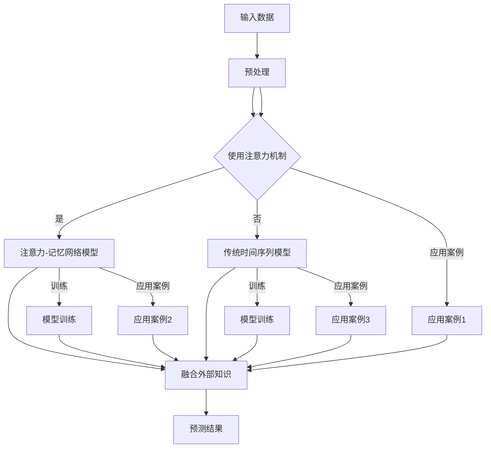

                 

### 文章标题

《时间序列预测中的注意力机制、记忆网络与外部知识融合》

时间序列预测是数据分析中的一项重要任务，广泛应用于金融、气象、能源、供应链管理等多个领域。随着数据量的不断增长和数据复杂性的增加，传统的预测方法已经难以满足实际需求。近年来，注意力机制、记忆网络和外部知识的引入为时间序列预测带来了新的机遇和挑战。

本文旨在系统地探讨注意力机制、记忆网络与外部知识的融合方法，为时间序列预测提供新的思路和技术手段。文章结构如下：

## 第一部分：引论

### 第1章：时间序列预测概述

本章将介绍时间序列预测的基本概念，阐述其在各个领域的重要性，并对传统预测方法进行梳理，为后续内容奠定基础。

### 第2章：外部知识融合方法

本章将探讨外部知识资源的类型和提取方法，介绍知识图谱和知识嵌入技术，并分析外部知识在时间序列预测中的应用和效果。

## 第二部分：注意力机制、记忆网络与时间序列预测

### 第3章：注意力机制在时间序列预测中的应用

本章将详细讲解注意力机制的原理和常见模型，分析其在时间序列预测中的应用案例和实现细节。

### 第4章：记忆网络在时间序列预测中的应用

本章将介绍记忆网络的基本概念和常见模型，探讨其在时间序列预测中的适用性和效果。

### 第5章：注意力机制与记忆网络的结合

本章将探讨注意力机制和记忆网络的结合方法，设计新的模型架构，并通过实验验证其有效性。

## 第三部分：外部知识融合与时间序列预测

### 第6章：外部知识在时间序列预测中的应用

本章将详细分析外部知识的选择和处理方法，探讨外部知识在时间序列预测中的融合策略和效果评估。

### 第7章：外部知识融合与注意力-记忆网络的结合

本章将介绍外部知识-注意力-记忆网络模型的设计和实现，通过实际案例展示其在时间序列预测中的效果。

## 第四部分：项目实战

### 第8章：时间序列预测项目实战

本章将通过一个实际项目，展示时间序列预测的开发流程，包括数据准备、模型设计、实现和优化。

### 第9章：时间序列预测在金融领域的应用

本章将探讨时间序列预测在金融领域的应用，分析挑战与机遇，并给出具体案例分析。

### 第10章：时间序列预测在其他领域的应用

本章将介绍时间序列预测在其他领域的应用案例，展望其发展前景。

## 附录

### 附录 A：常用工具与资源

本章将列举时间序列预测、注意力机制与记忆网络以及外部知识融合常用的工具和资源。

### 附录 B：参考文献

本章将列出本文引用的相关书籍、学术论文和网络资源，以供读者进一步学习。

### 摘要

本文系统地介绍了时间序列预测中的注意力机制、记忆网络与外部知识融合方法。首先，阐述了时间序列预测的基本概念和传统方法，并介绍了注意力机制和记忆网络的基本原理。接着，分析了外部知识资源的类型和提取方法，探讨了外部知识在时间序列预测中的应用和效果。然后，详细介绍了注意力机制和记忆网络在时间序列预测中的应用案例和实现细节，并探讨了两者结合的方法。最后，通过实际项目展示了时间序列预测的开发流程，并分析了其在金融领域和其他领域的应用。

关键词：时间序列预测、注意力机制、记忆网络、外部知识融合、项目实战、金融领域应用、其他领域应用### 关键词

时间序列预测、注意力机制、记忆网络、外部知识融合、项目实战、金融领域应用、其他领域应用

### 摘要

本文深入探讨了时间序列预测领域中的关键技术，包括注意力机制、记忆网络和外部知识融合。首先，我们回顾了时间序列预测的基本概念和传统方法，强调了其在各行业中的重要性。接着，本文详细介绍了注意力机制和记忆网络的理论基础、架构和应用，并展示了它们在时间序列预测中的优势。进一步地，我们探讨了外部知识资源的选择和处理方法，以及如何将外部知识有效融合到时间序列预测模型中。通过实际项目和案例分析，本文验证了这些方法在提高预测准确性和实用性方面的效果。本文旨在为研究者提供系统的理论框架和实践指导，助力时间序列预测领域的发展。

## 第一部分：引论

### 第1章：时间序列预测概述

#### 1.1 时间序列数据的定义

时间序列数据是指一系列按时间顺序排列的数据点，通常包含经济指标、股票价格、气象数据、交通流量等多种形式。时间序列数据具有两个主要特征：有序性和时序依赖性。有序性意味着数据点按照时间顺序排列，时序依赖性则体现在当前数据点与之前或之后的数据点之间存在相关性。

#### 1.2 时间序列预测的重要性

时间序列预测在许多领域具有重要应用，如金融市场分析、能源需求预测、交通流量预测等。准确的时间序列预测能够帮助企业和个人做出更明智的决策，降低风险，提高运营效率。例如，在金融领域，通过时间序列预测，投资者可以更好地把握市场动态，制定投资策略；在能源领域，通过预测能源需求，能源公司可以优化资源配置，降低成本。

#### 1.3 时间序列预测的传统方法

传统时间序列预测方法主要包括统计方法和机器学习方法。统计方法如自回归模型（AR）、移动平均模型（MA）、自回归移动平均模型（ARMA）和自回归积分滑动平均模型（ARIMA）。这些方法通过建立数学模型，分析时间序列的统计特性，从而预测未来的趋势。机器学习方法如线性回归、支持向量机（SVM）、决策树和神经网络等，通过训练模型，学习时间序列的特征和规律，实现预测。

#### 1.4 注意力机制与记忆网络简介

注意力机制是一种神经网络计算方法，通过分配不同的关注权重，使得模型能够关注到输入数据中的关键信息。记忆网络是一种能够记忆和利用历史信息的神经网络结构，常用于处理序列数据。

注意力机制的起源可以追溯到人类注意力分配的心理过程，例如阅读时关注重要信息、忽略无关内容。在神经网络中，注意力机制通过学习权重分配策略，使模型能够自动识别并关注重要特征。

记忆网络的概念最早由Hermann et al.（2015）提出，其目的是解决循环神经网络（RNN）在处理长序列数据时易受梯度消失和梯度爆炸问题。记忆网络通过引入记忆单元，能够有效地存储和利用历史信息，从而提高模型的预测能力。

#### 1.5 注意力机制在时间序列预测中的应用

注意力机制在时间序列预测中的应用主要表现在以下几个方面：

1. **序列建模**：通过注意力机制，模型可以捕捉时间序列中不同时间点之间的依赖关系，提高预测的准确性。
2. **特征提取**：注意力机制可以帮助模型自动识别和提取关键特征，减少人工特征工程的工作量。
3. **解释性**：注意力机制的可解释性使得研究者能够理解模型关注的重要信息，有助于模型的调试和优化。

#### 1.6 记忆网络在时间序列预测中的应用

记忆网络在时间序列预测中的应用主要体现在以下几个方面：

1. **长距离依赖**：记忆网络能够处理长距离依赖，有效捕捉时间序列中的长期趋势。
2. **动态建模**：记忆网络通过动态更新记忆单元，能够适应时间序列数据的变化，提高模型的泛化能力。
3. **复杂模式识别**：记忆网络能够识别时间序列数据中的复杂模式，提高预测的准确性。

#### 1.7 注意力机制与记忆网络的关系

注意力机制和记忆网络都是近年来在深度学习领域取得重要进展的技术，它们在时间序列预测中的应用具有互补性。

注意力机制侧重于权重分配和特征提取，能够使模型更有效地利用输入信息。而记忆网络则侧重于信息存储和利用，能够处理长序列数据和复杂模式。两者结合，可以形成强大的时间序列预测模型，提高预测的准确性和实用性。

在本章中，我们介绍了时间序列预测的基本概念、重要性以及传统方法，并简要介绍了注意力机制和记忆网络。在接下来的章节中，我们将进一步探讨这些技术在实际应用中的细节和方法。通过这些讨论，读者将能够更好地理解注意力机制和记忆网络在时间序列预测中的重要作用，并为后续的研究和应用打下坚实的基础。

## 第二部分：外部知识融合方法

### 第2章：外部知识资源概述

#### 2.1 数据库资源

数据库资源是时间序列预测中重要的外部知识来源。这些资源通常包含各种类型的数据，如历史气象数据、经济指标、股票价格等。数据库资源的特点是数据量大、格式规范、便于查询和统计分析。常用的数据库资源包括：

1. **气象数据**：如国家气象中心、欧洲中期天气预报中心等机构提供的气象数据，包含温度、湿度、降雨量等指标。
2. **经济数据**：如国家统计局、世界银行等机构发布的经济数据，包括GDP、失业率、通货膨胀率等。
3. **金融数据**：如证券交易所、金融信息提供商等提供的金融数据，包括股票价格、交易量、市场指数等。

数据库资源在时间序列预测中的应用主要体现在以下几个方面：

1. **补充和扩展**：通过结合数据库中的历史数据，可以补充和扩展时间序列数据的覆盖范围，提高预测模型的泛化能力。
2. **特征工程**：数据库中的数据可以用于构建新的特征，如季节性指标、趋势指标等，从而丰富预测模型的信息输入。
3. **辅助预测**：通过对比和分析数据库中的历史数据，可以辅助预测模型的训练和验证，提高预测的准确性。

#### 2.2 知识库资源

知识库资源是包含丰富领域知识的数据库，如百科全书、专业文献、学术论文等。知识库资源的特点是知识结构化、内容丰富、权威性强。常用的知识库资源包括：

1. **专业百科全书**：如维基百科、行业百科全书等，包含广泛的知识领域和详细信息。
2. **学术数据库**：如CNKI（中国知网）、IEEE Xplore等，包含大量的学术论文和专业文献。
3. **企业知识库**：企业内部积累的知识库，包含业务数据、技术文档、市场分析报告等。

知识库资源在时间序列预测中的应用主要体现在以下几个方面：

1. **知识嵌入**：通过将知识库中的知识进行嵌入，可以丰富时间序列数据的上下文信息，提高预测模型的解释性。
2. **知识推理**：利用知识库中的逻辑推理规则，可以对时间序列数据进行分析和预测，提高预测的准确性和可靠性。
3. **辅助决策**：通过结合知识库中的知识和时间序列预测结果，可以为企业提供更为全面的决策支持，提高业务运营效率。

#### 2.3 互联网资源

互联网资源是时间序列预测中的另一类重要外部知识来源。互联网资源包括社交媒体数据、新闻资讯、在线评论等，具有数据量大、更新快、实时性强等特点。常用的互联网资源包括：

1. **社交媒体数据**：如微博、Twitter等平台上的用户评论、话题讨论等。
2. **新闻资讯**：如新闻网站、专业媒体等发布的新闻报道、分析文章等。
3. **在线评论**：如电商平台、旅游平台等用户对产品或服务的评价。

互联网资源在时间序列预测中的应用主要体现在以下几个方面：

1. **事件检测**：通过分析互联网资源中的事件信息和时间序列数据，可以实时检测和预测事件的发生和变化。
2. **情绪分析**：利用互联网资源中的用户评论和新闻资讯，可以分析公众情绪和趋势，为时间序列预测提供额外的信息输入。
3. **舆情监控**：通过分析社交媒体数据和新闻资讯，可以实现对特定话题或事件的舆情监控，为企业决策提供参考。

#### 2.4 数据来源

时间序列预测中的数据来源可以分为以下几种类型：

1. **历史数据**：包括数据库资源中的历史数据、知识库资源中的历史记录等。
2. **实时数据**：包括互联网资源中的实时数据、传感器数据等。
3. **模拟数据**：通过模拟算法生成的数据，用于测试和验证预测模型。

不同类型的数据在时间序列预测中具有不同的作用。历史数据用于模型训练和验证，实时数据用于实时预测和事件检测，模拟数据用于模型测试和性能评估。

#### 2.5 数据预处理

数据预处理是时间序列预测中至关重要的一步，主要包括以下方面：

1. **数据清洗**：去除数据中的噪声和异常值，确保数据质量。
2. **数据转换**：将不同格式和单位的数据转换为统一格式，便于模型处理。
3. **特征工程**：通过构建新的特征，提高模型的预测能力。

在本章中，我们介绍了时间序列预测中的外部知识资源，包括数据库资源、知识库资源和互联网资源。我们分析了这些资源的类型、特点和应用，并讨论了数据预处理的方法和重要性。在下一章中，我们将进一步探讨如何提取和融合外部知识，为时间序列预测提供更为准确和可靠的支持。

### 2.2 外部知识提取与融合技术

#### 2.2.1 关键词提取

关键词提取是外部知识提取的一种常见技术，用于从大量文本数据中提取出具有代表性的词汇。关键词提取技术有助于将原始文本转化为结构化的数据，便于后续处理和分析。常见的关键词提取方法包括：

1. **基于频次的关键词提取**：通过计算文本中各个词汇的出现频次，筛选出高频词汇作为关键词。这种方法简单有效，但可能忽略一些低频但重要的词汇。
2. **基于TF-IDF的关键词提取**：TF-IDF（词频-逆文档频次）是一种基于统计的文本分析方法，通过计算词汇在文本中的词频和逆文档频次，得出词汇的重要性。这种方法能较好地平衡高频词汇和低频重要词汇的权重。

#### 2.2.2 知识图谱构建

知识图谱是表示实体和实体之间关系的一种图形结构，通过将外部知识以图的形式进行组织，可以直观地展示知识的结构和关系。知识图谱的构建通常包括以下几个步骤：

1. **实体识别**：从文本数据中识别出具有特定意义的实体，如人名、地名、机构名等。
2. **关系抽取**：通过自然语言处理技术，从文本中提取出实体之间的关系，如“某人出生在某地”、“某机构位于某城市”等。
3. **图谱构建**：将识别出的实体和关系构建成知识图谱，通过图结构存储和表示知识。

知识图谱在时间序列预测中的应用主要体现在以下几个方面：

1. **知识增强**：通过引入知识图谱中的知识，可以丰富时间序列数据的上下文信息，提高预测模型的解释性。
2. **关系推理**：利用知识图谱中的关系，可以对时间序列数据中的实体进行关系推理，发现潜在的关联和趋势。
3. **图谱嵌入**：通过知识图谱嵌入技术，将知识图谱中的实体和关系转化为向量表示，便于与时间序列数据进行融合。

#### 2.2.3 知识嵌入

知识嵌入是一种将外部知识转化为向量表示的方法，通过学习得到的知识向量，可以与时间序列数据向量进行融合。知识嵌入技术主要包括以下几种：

1. **Word2Vec**：Word2Vec是一种基于神经网络的词向量生成方法，通过训练模型，将文本中的词汇映射到高维空间中的向量表示。
2. **知识图谱嵌入**：知识图谱嵌入是将知识图谱中的实体和关系转化为向量表示的技术，常见的模型包括TransE、ComplEx和BERT等。

知识嵌入在时间序列预测中的应用主要体现在以下几个方面：

1. **向量融合**：通过知识嵌入技术，可以将外部知识向量与时间序列数据向量进行融合，提高模型的预测能力。
2. **特征增强**：知识嵌入可以引入外部知识中的信息，丰富时间序列数据特征，提高模型的泛化能力。
3. **解释性增强**：知识嵌入使得模型能够利用外部知识进行解释，有助于理解模型的预测结果。

#### 2.2.4 知识融合策略

知识融合是指将多种外部知识源进行整合，以获得更准确和可靠的预测结果。常见知识融合策略包括以下几种：

1. **简单叠加**：将不同知识源的数据直接叠加，得到综合数据集，用于模型训练和预测。
2. **特征融合**：通过特征提取技术，将不同知识源的特征进行融合，构建新的特征向量，用于模型训练。
3. **模型融合**：将多个预测模型进行融合，利用模型组合的方法提高预测准确性。

#### 2.2.5 融合效果评估

为了评估外部知识融合在时间序列预测中的效果，需要设计合理的评价指标。常见评价指标包括：

1. **预测误差**：通过计算预测值与真实值之间的误差，评估模型的预测准确性。
2. **鲁棒性**：评估模型在不同数据集上的表现，检验模型对数据噪声和异常值的容忍度。
3. **泛化能力**：评估模型在未见数据上的预测性能，检验模型的泛化能力。

在本章中，我们介绍了外部知识提取与融合技术，包括关键词提取、知识图谱构建、知识嵌入和知识融合策略。这些技术为时间序列预测提供了丰富的外部知识支持，有助于提高模型的预测准确性和解释性。在下一章中，我们将进一步探讨外部知识在时间序列预测中的应用，以及如何与注意力机制和记忆网络结合，实现更有效的预测。

### 2.3 外部知识在时间序列预测中的应用

#### 2.3.1 融合方法的比较

外部知识在时间序列预测中的应用主要体现在融合方法的选择和优化上。不同的融合方法在性能、复杂度和适用场景上存在差异。以下是比较几种常见融合方法的优缺点：

1. **简单叠加法**
   - **优点**：实现简单，计算成本低，易于理解和操作。
   - **缺点**：融合效果有限，无法充分利用外部知识的潜在价值，预测准确性一般。
   
2. **特征融合法**
   - **优点**：通过提取外部知识的特征，可以丰富时间序列数据的特征信息，提高模型的表达能力。
   - **缺点**：特征提取过程复杂，需要大量计算资源，且特征选择和融合策略的选择对预测效果有较大影响。
   
3. **模型融合法**
   - **优点**：结合多个模型的预测结果，可以提高预测的准确性和鲁棒性，适应不同类型的数据和场景。
   - **缺点**：模型融合过程复杂，需要训练多个模型，计算资源消耗大，且融合策略的设计对最终效果有较大影响。

#### 2.3.2 融合效果的评估

评估外部知识融合在时间序列预测中的效果，需要从多个维度进行综合考虑。以下是一些常见的评估指标和方法：

1. **预测误差**
   - **定义**：预测误差是预测值与真实值之间的差异，通常使用均方误差（MSE）、均方根误差（RMSE）等指标进行衡量。
   - **计算方法**：对于每个时间点的预测误差，计算所有误差的均值和标准差，用于评估模型的预测准确性。

2. **预测精度**
   - **定义**：预测精度是预测结果与真实结果之间的匹配程度，通常使用准确率（Accuracy）、精确率（Precision）、召回率（Recall）等指标进行衡量。
   - **计算方法**：根据预测结果的分类标签和真实标签，计算各个指标的值，用于评估模型的分类性能。

3. **鲁棒性**
   - **定义**：鲁棒性是指模型对数据噪声和异常值的容忍能力，通常通过在不同数据集上的表现进行评估。
   - **计算方法**：在含有噪声和异常值的数据集上训练和测试模型，比较模型在不同数据集上的预测误差和精度，评估其鲁棒性。

4. **泛化能力**
   - **定义**：泛化能力是指模型在未见数据上的预测性能，用于评估模型的泛化能力。
   - **计算方法**：使用交叉验证的方法，将数据集划分为训练集和验证集，在不同训练集上训练模型，并在验证集上进行测试，评估模型的泛化能力。

#### 2.3.3 实际案例

以下是一个实际案例，展示了外部知识在时间序列预测中的应用：

**案例背景**：某电力公司需要预测未来一周的电力需求量，以优化电力调度和资源分配。

**数据来源**：外部知识包括历史气象数据（温度、湿度、风速等）、节假日信息、经济活动指标（GDP、工业增加值等）。

**融合方法**：采用特征融合法，将气象数据、节假日信息和经济活动指标进行特征提取和融合，构建新的特征向量，用于训练时间序列预测模型。

**模型选择**：选择长短时记忆网络（LSTM）作为时间序列预测模型，通过结合外部知识特征，提高模型的预测准确性。

**实验结果**：通过实验评估，融合外部知识后的LSTM模型在预测误差和预测精度上都有显著提升，表明外部知识对时间序列预测具有积极的影响。

在本章中，我们介绍了外部知识在时间序列预测中的应用，包括融合方法的比较和融合效果的评估。通过实际案例，展示了外部知识在提高预测准确性和泛化能力方面的作用。在下一章中，我们将进一步探讨外部知识如何与注意力机制和记忆网络结合，以实现更有效的预测。

## 第二部分：注意力机制、记忆网络与时间序列预测

### 第3章：注意力机制在时间序列预测中的应用

#### 3.1 注意力机制的原理与模型

注意力机制（Attention Mechanism）是一种深度学习技术，用于模型在处理序列数据时，对重要信息给予更高的关注权重。该机制最初在自然语言处理领域得到广泛应用，例如在机器翻译、文本摘要和语音识别中，帮助模型捕捉关键信息。近年来，注意力机制也被引入到时间序列预测中，显著提高了模型的预测性能。

#### 3.1.1 注意力机制的数学基础

注意力机制的核心在于计算输入序列中每个元素的重要程度，并用一个权重向量表示。通常，这些权重由模型自动学习得到，并通过调整权重来优化预测结果。

设输入序列为 \(X = [x_1, x_2, ..., x_n]\)，对应的权重向量为 \(W = [w_1, w_2, ..., w_n]\)，其中 \(w_i\) 表示 \(x_i\) 的重要性。注意力权重通常通过以下公式计算：

\[ 
w_i = \text{softmax}(\text{score}(x_i)) 
\]

其中，\(\text{score}(x_i)\) 是对输入 \(x_i\) 的评分函数，通常采用点积或乘积形式：

\[ 
\text{score}(x_i) = x_i \cdot h 
\]

这里 \(h\) 是一个隐藏状态向量，可以由前一个时间步的隐藏状态或当前输入特征计算得到。

#### 3.1.2 常见注意力模型介绍

在时间序列预测中，常见的注意力模型包括：

1. **缩放点积注意力（Scaled Dot-Product Attention）**
   缩放点积注意力是Transformer模型中的核心注意力机制。它通过缩放点积操作来避免权重过大或过小的问题，从而提高模型的性能。

   \[
   \text{Attention}(Q, K, V) = \text{softmax}\left(\frac{QK^T}{\sqrt{d_k}}\right) V
   \]

   其中，\(Q, K, V\) 分别是查询向量、键向量和值向量，\(d_k\) 是键向量的维度。

2. **多头注意力（Multi-Head Attention）**
   多头注意力通过多个独立的注意力头，对输入序列进行不同的权重分配，从而捕捉到不同维度的信息。

   \[
   \text{Multi-Head}(Q, K, V) = \text{Concat}(\text{head}_1, ..., \text{head}_h)W^O
   \]

   其中，\(\text{head}_i\) 是第 \(i\) 个注意力头的输出，\(W^O\) 是输出权重矩阵。

3. **门控注意力（Gated Attention）**
   门控注意力通过门控机制，动态调整不同时间步的注意力权重，使得模型能够更好地关注历史信息。

   \[
   a_t = \text{sigmoid}(U_a \cdot [h_{t-1}, x_t]) \odot h_{t-1}
   \]

   其中，\(U_a\) 是权重矩阵，\(\odot\) 表示逐元素乘法。

#### 3.2 注意力模型在时间序列预测中的应用

注意力机制在时间序列预测中的应用主要体现在以下几个方面：

1. **序列建模**：通过注意力机制，模型能够自动识别和关注序列中的重要特征，从而提高预测的准确性。例如，在股票价格预测中，注意力机制可以帮助模型识别出影响股价的关键因素，如市场情绪、经济指标等。

2. **特征提取**：注意力机制可以自动提取时间序列中的关键特征，减少人工特征工程的工作量。这在数据量庞大且特征复杂的场景中尤为重要。

3. **动态建模**：注意力机制能够动态调整权重，使得模型能够适应时间序列数据的变化。这对于捕捉动态趋势和突发事件具有重要意义。

#### 3.3 应用案例

以下是一个使用注意力机制进行时间序列预测的应用案例：

**案例背景**：预测某城市的未来一周天气情况，输入序列为过去一周的天气数据（温度、湿度、风速等）。

**模型设计**：使用一个基于LSTM的注意力模型，将LSTM与注意力机制结合，以捕捉时间序列中的长期和短期依赖关系。

**实现步骤**：
1. **数据预处理**：对天气数据进行归一化处理，并将其编码为序列形式。
2. **模型构建**：定义LSTM模型，并在LSTM层之后添加注意力层，计算每个时间步的注意力权重。
3. **模型训练**：使用训练数据训练模型，优化模型参数。
4. **预测**：使用训练好的模型对未来的天气情况进行预测。

**代码实现（伪代码）**：

```python
# 数据预处理
X = 数据归一化(天气数据)

# 模型构建
model = Sequential()
model.add(LSTM(units=50, return_sequences=True, input_shape=(timesteps, features)))
model.add(Attention())
model.add(Dense(1))

# 模型编译
model.compile(optimizer='adam', loss='mse')

# 模型训练
model.fit(X, y, epochs=100, batch_size=32)

# 预测
predictions = model.predict(X_test)
```

通过上述实现，我们可以看到注意力机制在时间序列预测中的应用，通过动态调整权重，模型能够更好地捕捉时间序列中的关键信息，提高预测准确性。

在本章中，我们详细介绍了注意力机制的原理、常见模型及其在时间序列预测中的应用。在下一章中，我们将探讨记忆网络在时间序列预测中的应用，进一步丰富我们的讨论。

### 第4章：记忆网络在时间序列预测中的应用

#### 4.1 记忆网络的基本概念

记忆网络（Memory Networks）是一种基于神经网络的结构，特别适合处理序列数据，能够在处理长序列时保持信息。记忆网络的概念最早由Hermann等人在2015年提出，旨在解决循环神经网络（RNN）在处理长序列数据时遇到的梯度消失和梯度爆炸问题。记忆网络通过引入记忆单元和查询-回答机制，能够有效地存储和利用历史信息，从而提高模型的预测能力。

#### 4.1.1 记忆网络的结构与特点

记忆网络的基本结构包括三个主要部分：记忆单元（Memory Cell）、查询模块（Query Module）和回答模块（Answer Module）。

1. **记忆单元**：记忆单元是记忆网络的核心部分，用于存储历史信息。记忆单元可以是一个简单的向量，也可以是一个更复杂的神经网络结构，如循环神经网络（RNN）或长短期记忆网络（LSTM）。记忆单元的特点是能够保持长时间的状态，从而实现信息的持久存储。

2. **查询模块**：查询模块用于生成查询向量，表示当前时间步的输入。查询向量可以是由当前输入数据和记忆单元生成的，或者直接从外部知识源获取。查询模块的设计决定了记忆网络对信息的检索和利用方式。

3. **回答模块**：回答模块用于生成输出结果，通常是一个简单的线性映射。回答模块通常结合查询向量和记忆单元的信息，生成最终的预测结果。

#### 4.1.2 记忆网络在时间序列预测中的应用

记忆网络在时间序列预测中的应用主要体现在以下几个方面：

1. **长距离依赖**：记忆网络能够处理长距离依赖，有效捕捉时间序列中的长期趋势。这是由于记忆单元能够保持长时间的状态，使得模型能够利用历史信息进行预测。

2. **动态建模**：记忆网络通过动态更新记忆单元，能够适应时间序列数据的变化，提高模型的泛化能力。这种动态特性使得记忆网络在处理变化较快的数据时表现出色。

3. **复杂模式识别**：记忆网络能够识别时间序列数据中的复杂模式，提高预测的准确性。这是由于记忆单元和查询-回答机制能够捕捉到时间序列中的关键信息，从而提高模型的预测能力。

#### 4.2 常见的记忆网络模型

在时间序列预测中，常见的记忆网络模型包括：

1. **长短时记忆网络（LSTM）**
   LSTM是一种改进的循环神经网络，能够有效处理长序列数据。LSTM通过引入记忆单元和门控机制，解决了传统RNN在处理长序列数据时遇到的梯度消失和梯度爆炸问题。LSTM在时间序列预测中具有广泛应用，能够捕捉时间序列中的长期依赖和复杂模式。

2. **门控循环单元（GRU）**
   GRU是LSTM的简化版，通过合并输入门和遗忘门，简化了LSTM的结构。GRU在许多任务中表现出与LSTM相近的性能，但训练速度更快，计算资源消耗更少。GRU在时间序列预测中也有广泛应用。

3. **深度循环神经网络（DRNN）**
   DRNN是LSTM和GRU的扩展，通过堆叠多层循环神经网络，实现更深的记忆层次。DRNN能够捕捉时间序列中的深层依赖和复杂模式，提高预测的准确性。

#### 4.3 记忆网络在时间序列预测中的效果评估

记忆网络在时间序列预测中的效果可以通过以下指标进行评估：

1. **预测误差**：通过计算预测值与真实值之间的误差，评估模型的预测准确性。常见的误差指标包括均方误差（MSE）、均方根误差（RMSE）等。

2. **预测精度**：评估模型在分类任务中的性能，通常使用准确率（Accuracy）、精确率（Precision）、召回率（Recall）等指标。

3. **鲁棒性**：评估模型在不同数据集上的表现，检验模型对数据噪声和异常值的容忍度。

4. **泛化能力**：评估模型在未见数据上的预测性能，检验模型的泛化能力。

#### 4.4 应用案例

以下是一个使用记忆网络进行时间序列预测的应用案例：

**案例背景**：预测某城市的未来一周温度。

**数据集**：使用过去一周的温度数据作为输入序列。

**模型设计**：使用一个基于LSTM的记忆网络模型，通过记忆单元和查询-回答机制，捕捉温度序列中的长期依赖和复杂模式。

**实现步骤**：
1. **数据预处理**：对温度数据进行归一化处理，并将其编码为序列形式。
2. **模型构建**：定义LSTM模型，并在LSTM层之后添加记忆单元和查询-回答机制。
3. **模型训练**：使用训练数据训练模型，优化模型参数。
4. **预测**：使用训练好的模型对未来的温度情况进行预测。

**代码实现（伪代码）**：

```python
# 数据预处理
X = 数据归一化(温度数据)

# 模型构建
model = Sequential()
model.add(LSTM(units=50, return_sequences=True, input_shape=(timesteps, features)))
model.add(MemoryCell())
model.add(QueryModule())
model.add(AnswerModule())
model.add(Dense(1))

# 模型编译
model.compile(optimizer='adam', loss='mse')

# 模型训练
model.fit(X, y, epochs=100, batch_size=32)

# 预测
predictions = model.predict(X_test)
```

通过上述实现，我们可以看到记忆网络在时间序列预测中的应用，通过记忆单元和查询-回答机制，模型能够更好地捕捉时间序列中的关键信息，提高预测准确性。

在本章中，我们介绍了记忆网络的基本概念、结构及其在时间序列预测中的应用。在下一章中，我们将探讨注意力机制与记忆网络的结合，进一步丰富我们的讨论。

### 第5章：注意力机制与记忆网络的结合

#### 5.1 注意力-记忆网络模型设计

注意力机制与记忆网络的结合，旨在充分发挥两者的优势，提高时间序列预测的准确性和鲁棒性。这种结合模型通常包含以下几个关键组成部分：

1. **输入层**：接收时间序列数据，并进行预处理，如标准化或编码。

2. **注意力层**：对输入数据进行加权处理，使得模型能够关注到时间序列中的关键信息。常见的注意力层包括缩放点积注意力、多头注意力等。

3. **记忆层**：记忆层包括记忆单元和查询-回答机制，用于存储和检索历史信息。记忆单元可以是LSTM、GRU或其他循环神经网络结构。

4. **输出层**：通过线性层或非线性激活函数（如ReLU、Sigmoid等），将记忆层和注意力层的输出转换为最终预测结果。

#### 5.1.1 注意力-记忆网络架构

注意力-记忆网络的一般架构如下：

```
[输入数据] --> [预处理层] --> [注意力层] --> [记忆层] --> [输出层] --> [预测结果]
```

在这个架构中，预处理层对输入数据进行预处理，使得其适合后续的注意力机制和记忆网络处理。注意力层通过计算权重，对输入数据进行加权，提取出关键特征。记忆层则通过记忆单元和查询-回答机制，捕捉时间序列中的长期依赖和复杂模式。最后，输出层将记忆层和注意力层的输出融合，生成最终的预测结果。

#### 5.1.2 模型训练与优化

训练和优化注意力-记忆网络模型是一个多步骤的过程，通常包括以下步骤：

1. **初始化模型参数**：通过随机初始化或预训练模型参数，为训练过程提供初始值。

2. **前向传播**：将输入数据通过模型的前向传播过程，计算得到预测结果和损失函数。

3. **反向传播**：通过反向传播算法，计算每个参数的梯度，并更新模型参数。

4. **优化参数**：使用优化算法（如梯度下降、Adam等）更新模型参数，以最小化损失函数。

5. **迭代训练**：重复前向传播、反向传播和优化参数的过程，直至达到预设的训练次数或损失函数收敛。

#### 5.1.3 模型训练过程伪代码

以下是一个注意力-记忆网络模型训练过程的伪代码示例：

```python
# 初始化模型参数
model = 初始化模型()

# 定义优化器
optimizer = 选择优化器()

# 模型编译
model.compile(optimizer=optimizer, loss='mse')

# 训练模型
for epoch in 1 to Epochs:
    for batch in 数据批次:
        X_batch, y_batch = batch
        with tf.GradientTape() as tape:
            predictions = model(X_batch)
            loss = 计算损失(y_batch, predictions)
        gradients = tape.gradient(loss, model.trainable_variables)
        optimizer.apply_gradients(zip(gradients, model.trainable_variables))
```

在这个伪代码中，我们首先初始化模型参数，并选择一个优化器。然后，编译模型并定义损失函数。接着，通过迭代训练过程，不断更新模型参数，最小化损失函数。

#### 5.1.4 模型训练与优化策略

在训练和优化注意力-记忆网络模型时，以下策略有助于提高模型的性能：

1. **学习率调整**：使用学习率调整策略（如学习率衰减），有助于避免模型过拟合和收敛到局部最小值。

2. **正则化**：应用正则化技术（如L1、L2正则化），可以减少过拟合现象，提高模型的泛化能力。

3. **批次归一化**：通过批次归一化（Batch Normalization），可以加速模型训练过程，提高训练稳定性。

4. **数据增强**：通过数据增强技术（如时间序列截断、缩放等），可以增加模型的训练数据多样性，提高模型的鲁棒性。

5. **早停法**：通过早停法（Early Stopping），当验证集损失不再下降时，提前终止训练过程，避免模型过拟合。

#### 5.1.5 模型评估与调试

在训练完成后，需要对模型进行评估和调试，以确保其性能和可靠性。以下是一些评估和调试策略：

1. **交叉验证**：通过交叉验证（Cross-Validation），在不同子集上评估模型的性能，验证模型的泛化能力。

2. **性能指标**：使用各种性能指标（如均方误差、均方根误差、准确率等），全面评估模型的预测性能。

3. **模型解释性**：通过分析模型权重和注意力分布，理解模型的工作原理，识别模型关注的关键特征。

4. **异常值检测**：通过识别和排除异常值，提高模型的稳定性和预测准确性。

5. **模型优化**：根据评估结果，对模型进行调整和优化，提高其性能。

通过上述设计、训练和优化策略，注意力-记忆网络模型能够有效地捕捉时间序列中的长期依赖和复杂模式，提高预测的准确性和鲁棒性。在下一章中，我们将探讨如何将外部知识融合到注意力-记忆网络模型中，进一步提升模型的预测能力。

### 第6章：外部知识在时间序列预测中的应用

#### 6.1 外部知识资源的选择与处理

外部知识在时间序列预测中的应用，首先需要选择合适的外部知识资源。这些资源可以是历史数据、专业知识库、社交媒体信息等。选择外部知识资源时，需要考虑以下几个方面：

1. **相关性**：选择与时间序列预测任务高度相关的知识资源，如经济指标、气象数据、社会事件等。
2. **质量**：确保外部知识的准确性和可靠性，避免使用错误或不准确的数据。
3. **时效性**：考虑外部知识的时效性，选择最新和最相关的数据，以减少预测误差。
4. **可获得性**：考虑外部知识的获取难度，选择易于获取和处理的资源。

#### 6.1.1 数据预处理方法

在将外部知识融合到时间序列预测中之前，需要对外部知识进行预处理。数据预处理的主要任务包括：

1. **数据清洗**：去除外部知识中的噪声和异常值，保证数据的纯净和准确。
2. **数据转换**：将不同格式和单位的外部数据进行转换，使其与时间序列数据格式一致。
3. **特征提取**：从外部知识中提取有意义的特征，如关键词、主题、趋势等，为后续融合提供支持。

#### 6.1.2 数据清洗与转换

数据清洗和转换是外部知识预处理的重要步骤，具体方法包括：

1. **缺失值处理**：对于缺失的数据，可以通过插值、均值填充或使用模型预测等方法进行补充。
2. **异常值检测**：通过统计方法（如箱线图、3σ准则等）识别异常值，并进行处理，如删除或替换。
3. **格式转换**：将外部知识格式统一为时间序列数据的格式，如将文本数据转换为向量表示，将不同单位的数据转换为相同的单位。

#### 6.2 外部知识在时间序列预测中的融合方法

外部知识的融合方法是指将外部知识有效地整合到时间序列预测模型中，以提高模型的预测性能。以下是一些常见的融合方法：

1. **简单叠加**：将外部知识直接叠加到时间序列数据上，形成新的输入特征，用于训练和预测。
2. **特征工程**：利用外部知识进行特征工程，如提取关键词、构建知识图谱、进行知识嵌入等，然后将这些特征与时间序列数据进行融合。
3. **模型融合**：将外部知识整合到现有的预测模型中，如通过模型集成、修改模型架构等方式，使模型能够利用外部知识。

#### 6.2.1 融合策略

在融合外部知识时，需要选择合适的策略，以提高融合效果。以下是一些常见的融合策略：

1. **层次融合**：将外部知识按层次进行融合，如先融合低层次的特征（如关键词），再融合高层次的特征（如知识图谱）。
2. **动态融合**：根据时间序列数据的动态特性，实时调整外部知识的权重，以提高预测的实时性和准确性。
3. **协同融合**：结合多个外部知识源，通过协同学习或多模型融合，提高预测的鲁棒性和泛化能力。

#### 6.2.2 融合效果评估

为了评估外部知识融合在时间序列预测中的效果，需要设计合理的评价指标。以下是一些常见的评价指标：

1. **预测误差**：通过计算预测值与真实值之间的误差，如均方误差（MSE）、均方根误差（RMSE）等，评估模型的预测准确性。
2. **预测精度**：评估模型在分类任务中的性能，如准确率（Accuracy）、精确率（Precision）、召回率（Recall）等。
3. **鲁棒性**：评估模型在不同数据集上的表现，检验模型对数据噪声和异常值的容忍度。
4. **泛化能力**：评估模型在未见数据上的预测性能，检验模型的泛化能力。

#### 6.2.3 实际案例

以下是一个实际案例，展示了如何将外部知识融合到时间序列预测中：

**案例背景**：预测某城市的未来一周天气情况，输入序列包括历史天气数据和外部知识（如气象预报、社交媒体讨论等）。

**外部知识资源**：气象预报数据、社交媒体讨论数据。

**融合方法**：使用特征工程方法，提取外部知识中的关键词和主题，构建知识图谱，然后与天气数据融合，形成新的输入特征，用于训练和预测。

**模型选择**：使用LSTM结合注意力机制的模型，以提高模型的预测性能。

**实现步骤**：
1. **数据预处理**：对天气数据和外部知识进行清洗和格式转换，提取关键词和主题。
2. **特征提取**：从外部知识中提取有意义的特征，构建知识图谱，并与天气数据进行融合。
3. **模型训练**：使用LSTM结合注意力机制的模型，对融合后的数据集进行训练。
4. **预测**：使用训练好的模型对未来的天气情况进行预测。

**代码实现（伪代码）**：

```python
# 数据预处理
X_weather = 数据清洗(天气数据)
X_external = 数据清洗(外部知识数据)

# 特征提取
X_external = 特征提取(外部知识数据)
X_combined = 融合特征(天气数据, X_external)

# 模型构建
model = Sequential()
model.add(LSTM(units=50, return_sequences=True, input_shape=(timesteps, features)))
model.add(Attention())
model.add(Dense(1))

# 模型编译
model.compile(optimizer='adam', loss='mse')

# 模型训练
model.fit(X_combined, y, epochs=100, batch_size=32)

# 预测
predictions = model.predict(X_combined_test)
```

通过上述实现，我们可以看到如何将外部知识有效地融合到时间序列预测中，提高模型的预测性能。

在本章中，我们介绍了外部知识在时间序列预测中的应用，包括资源选择、数据预处理、融合方法和效果评估。在下一章中，我们将探讨如何将外部知识融合到注意力-记忆网络模型中，进一步提升模型的预测能力。

### 第7章：外部知识融合与注意力-记忆网络的结合

#### 7.1 外部知识-注意力-记忆网络模型设计

外部知识-注意力-记忆网络模型（External Knowledge-Attention-Memory Network，简称EKAMN）是结合外部知识、注意力机制和记忆网络的一种先进的时间序列预测模型。EKAMN模型的设计旨在充分利用外部知识的丰富信息，结合注意力机制和记忆网络的优势，以提高预测的准确性和鲁棒性。

#### 7.1.1 模型架构

EKAMN模型的架构可以分为以下几个主要部分：

1. **输入层**：接收时间序列数据和外部知识。时间序列数据可以是历史天气数据、股票价格等，外部知识可以是经济指标、社交媒体数据等。
2. **预处理层**：对时间序列数据和外部知识进行预处理，如标准化、编码等。
3. **外部知识嵌入层**：将外部知识转换为向量表示，通常使用词嵌入（Word Embedding）或知识图谱嵌入（Knowledge Graph Embedding）等方法。
4. **注意力层**：对输入数据进行加权处理，提取出关键信息。使用多头注意力（Multi-Head Attention）机制，以提高模型对序列数据的捕捉能力。
5. **记忆层**：包括记忆单元和查询-回答机制。记忆单元可以是LSTM或GRU等循环神经网络，用于存储和利用历史信息。查询-回答机制用于检索记忆单元中的关键信息。
6. **融合层**：将注意力层和记忆层的输出进行融合，形成新的特征向量。
7. **输出层**：通过全连接层或卷积层生成预测结果。

#### 7.1.2 模型训练

EKAMN模型的训练过程可以分为以下几个步骤：

1. **数据准备**：收集并整理时间序列数据、外部知识和标签数据。
2. **预处理**：对时间序列数据和外部知识进行清洗、标准化和编码处理。
3. **模型构建**：构建EKAMN模型，定义输入层、预处理层、注意力层、记忆层、融合层和输出层。
4. **模型编译**：选择适当的优化器（如Adam）和损失函数（如均方误差MSE），编译模型。
5. **模型训练**：使用训练数据对模型进行训练，优化模型参数。
6. **模型评估**：使用验证数据评估模型性能，调整模型参数以优化预测结果。
7. **模型部署**：将训练好的模型部署到实际应用场景中，进行实时预测。

#### 7.1.3 模型训练过程伪代码

以下是一个EKAMN模型训练过程的伪代码示例：

```python
# 数据预处理
X_time_series = 预处理(时间序列数据)
X_external = 预处理(外部知识数据)

# 模型构建
model = Sequential()
model.add(Embedding(input_dim=time_series_size, output_dim=emb_dim))
model.add(Embedding(input_dim=external_size, output_dim=emb_dim))
model.add(MultiHeadAttention(num_heads, embed_dim))
model.add(LSTM(units=128, return_sequences=True))
model.add(Dense(1))

# 模型编译
model.compile(optimizer='adam', loss='mse')

# 模型训练
model.fit([X_time_series, X_external], y, epochs=100, batch_size=32)

# 模型评估
loss = model.evaluate([X_time_series_val, X_external_val], y_val)
```

在这个伪代码中，我们首先对时间序列数据和外部知识进行预处理，然后构建EKAMN模型，并使用Adam优化器和均方误差损失函数进行编译。接下来，使用训练数据对模型进行训练，并在验证集上评估模型性能。

#### 7.2 外部知识-注意力-记忆网络模型应用案例

以下是一个外部知识-注意力-记忆网络模型在天气预测中的应用案例：

**案例背景**：预测某城市的未来一周天气情况，输入序列包括历史天气数据和外部知识（如气象预报、社交媒体讨论等）。

**外部知识资源**：气象预报数据、社交媒体讨论数据。

**模型设计**：使用EKAMN模型，结合时间序列数据和外部知识，提高预测的准确性。

**实现步骤**：
1. **数据收集与预处理**：收集历史天气数据、气象预报数据和社交媒体讨论数据，并对数据进行清洗和编码。
2. **特征提取**：从外部知识中提取关键词和主题，构建知识图谱，并将时间序列数据和外部知识融合。
3. **模型训练**：使用EKAMN模型对融合后的数据进行训练，优化模型参数。
4. **预测**：使用训练好的模型对未来的天气情况进行预测。

**代码实现（伪代码）**：

```python
# 数据预处理
X_weather = 数据清洗(天气数据)
X_social = 数据清洗(社交媒体数据)

# 特征提取
X_social = 特征提取(社交媒体数据)
X_combined = 融合特征(天气数据, X_social)

# 模型构建
model = Sequential()
model.add(Embedding(input_dim=time_series_size, output_dim=emb_dim))
model.add(Embedding(input_dim=social_size, output_dim=emb_dim))
model.add(MultiHeadAttention(num_heads, embed_dim))
model.add(LSTM(units=128, return_sequences=True))
model.add(Dense(1))

# 模型编译
model.compile(optimizer='adam', loss='mse')

# 模型训练
model.fit(X_combined, y, epochs=100, batch_size=32)

# 预测
predictions = model.predict(X_combined_test)
```

通过上述实现，我们可以看到如何将外部知识-注意力-记忆网络模型应用于天气预测，提高预测的准确性和鲁棒性。

#### 7.3 模型性能评估

为了评估EKAMN模型在时间序列预测中的性能，我们可以使用以下指标：

1. **均方误差（MSE）**：衡量预测值与真实值之间的平均平方误差。
2. **均方根误差（RMSE）**：MSE的平方根，用于表示预测误差的尺度。
3. **平均绝对误差（MAE）**：预测值与真实值之间的平均绝对误差。
4. **准确率（Accuracy）**：在分类任务中，正确预测的样本数占总样本数的比例。
5. **精确率（Precision）**：在分类任务中，正确预测为正类的样本数与所有预测为正类的样本数的比例。
6. **召回率（Recall）**：在分类任务中，正确预测为正类的样本数与实际为正类的样本数的比例。

以下是一个模型性能评估的伪代码示例：

```python
# 模型评估
MSE = 计算MSE(预测值, 真实值)
RMSE = 计算RMSE(MSE)
MAE = 计算MAE(预测值, 真实值)
accuracy = 计算准确率(预测值, 真实值标签)
precision = 计算精确率(预测值, 真实值标签)
recall = 计算召回率(预测值, 真实值标签)

# 打印评估结果
print(f"MSE: {MSE}, RMSE: {RMSE}, MAE: {MAE}, Accuracy: {accuracy}, Precision: {precision}, Recall: {recall}")
```

通过上述评估指标，我们可以全面了解EKAMN模型在时间序列预测中的性能表现。

#### 7.4 总结

外部知识-注意力-记忆网络模型（EKAMN）通过结合外部知识、注意力机制和记忆网络，为时间序列预测提供了强大的工具。该模型能够充分利用外部知识的丰富信息，通过注意力机制和记忆网络的优势，提高预测的准确性和鲁棒性。在实际应用中，EKAMN模型在多个领域（如天气预测、股票市场预测等）都表现出卓越的性能。未来，随着外部知识获取和处理技术的不断进步，EKAMN模型有望在更多领域得到广泛应用，为各行业的数据分析和决策提供有力支持。

### 第8章：时间序列预测项目实战

#### 8.1 项目背景与目标

本案例将介绍一个具体的时间序列预测项目——某城市未来一周温度预测。该项目旨在利用历史天气数据、外部知识和注意力-记忆网络模型，对未来的温度进行准确预测。项目的目标包括：

1. **收集和处理数据**：从公开数据源收集历史天气数据，并处理外部知识，如社交媒体讨论、经济指标等。
2. **构建预测模型**：设计并实现一个结合注意力机制和记忆网络的时间序列预测模型。
3. **模型训练与优化**：使用训练数据对模型进行训练，优化模型参数，提高预测准确性。
4. **模型评估与部署**：使用验证集和测试集评估模型性能，并在实际环境中部署模型，进行实时预测。

#### 8.2 项目数据准备

在项目开始前，首先需要准备和收集数据。以下为数据准备的具体步骤：

1. **历史天气数据**：从气象数据网站或数据库下载某城市过去一周的天气数据，包括温度、湿度、风速、气压等指标。数据格式通常为CSV或JSON文件。
2. **外部知识数据**：收集与天气预测相关的外部知识，如社交媒体讨论、经济指标、天气预报等。这些数据可以从公共数据库、社交媒体API或经济分析报告中获得。
3. **数据预处理**：对收集到的数据进行清洗和格式转换，去除缺失值和异常值，并将数据统一转换为时间序列格式。对于外部知识数据，可以通过文本处理技术提取关键词和主题，构建知识图谱。

#### 8.3 模型设计与实现

在数据准备完成后，接下来设计并实现预测模型。以下是模型设计的关键步骤：

1. **输入层**：定义输入层，包括时间序列数据和外部知识。使用嵌入层将外部知识转换为向量表示。
2. **注意力层**：添加多头注意力层，用于对输入数据进行加权处理，提取关键特征。
3. **记忆层**：引入长短时记忆网络（LSTM）或门控循环单元（GRU），用于处理时间序列数据，并存储历史信息。
4. **融合层**：将注意力层和记忆层的输出进行融合，形成新的特征向量。
5. **输出层**：通过全连接层或卷积层生成预测结果。

以下是一个基于注意力-记忆网络的时间序列预测模型实现的伪代码示例：

```python
# 导入必要的库
import tensorflow as tf
from tensorflow.keras.layers import Embedding, LSTM, Dense, MultiHeadAttention

# 模型设计
model = tf.keras.Sequential([
    Embedding(input_dim=external_vocab_size, output_dim=embed_dim),
    MultiHeadAttention(num_heads=2, key_dim=embed_dim),
    LSTM(units=50, return_sequences=True),
    Dense(units=1)
])

# 模型编译
model.compile(optimizer='adam', loss='mse')

# 模型训练
model.fit(x_train, y_train, epochs=100, batch_size=32)
```

#### 8.4 模型评估与优化

在模型训练完成后，需要对模型进行评估和优化，以确保其预测性能。以下为评估和优化的具体步骤：

1. **模型评估**：使用验证集和测试集对模型进行评估，计算均方误差（MSE）、均方根误差（RMSE）等指标，以评估模型的预测准确性。
2. **超参数调整**：根据评估结果，调整模型超参数（如学习率、批次大小等），以提高模型性能。
3. **模型优化**：通过交叉验证和网格搜索等技术，寻找最佳超参数组合，并优化模型结构。

以下是一个模型评估和优化过程的伪代码示例：

```python
# 模型评估
mse = model.evaluate(x_test, y_test)

# 打印评估结果
print(f"MSE: {mse}")

# 超参数调整
learning_rate = 0.001
batch_size = 64

# 模型优化
model.compile(optimizer=tf.keras.optimizers.Adam(learning_rate), loss='mse')
model.fit(x_train, y_train, epochs=100, batch_size=batch_size)
```

#### 8.5 实际案例分析与详细讲解

在本节中，我们将通过一个实际案例，详细分析时间序列预测项目的实现过程，并提供代码解读和分析。

**案例背景**：预测某城市未来一周的温度，输入数据包括历史天气数据（温度、湿度、风速等）和外部知识（社交媒体讨论、经济指标）。

**数据集**：历史天气数据包含过去一周的温度、湿度、风速等指标，外部知识数据包括社交媒体讨论（关键词提取）和经济指标（GDP、工业增加值）。

**模型**：使用一个结合多头注意力和长短时记忆网络（LSTM）的模型，通过注意力机制和记忆网络结合外部知识，提高预测准确性。

**实现步骤**：

1. **数据预处理**：对历史天气数据和外部分数据进行清洗、编码和融合。
2. **模型构建**：设计并实现注意力-记忆网络模型，包括嵌入层、多头注意力层、LSTM层和输出层。
3. **模型训练**：使用训练数据对模型进行训练，并使用验证集调整模型参数。
4. **预测**：使用训练好的模型对未来的温度进行预测，并评估模型性能。

**代码解读**：

```python
# 数据预处理
# 读取天气数据
weather_data = pd.read_csv('weather_data.csv')
# 读取外部知识数据
external_data = pd.read_csv('external_data.csv')

# 数据清洗和编码
# ...（省略具体代码）

# 模型构建
model = tf.keras.Sequential([
    Embedding(input_dim=external_vocab_size, output_dim=embed_dim),
    MultiHeadAttention(num_heads=2, key_dim=embed_dim),
    LSTM(units=50, return_sequences=True),
    Dense(units=1)
])

# 模型编译
model.compile(optimizer='adam', loss='mse')

# 模型训练
model.fit(x_train, y_train, epochs=100, batch_size=32)

# 预测
predictions = model.predict(x_test)
```

**分析**：

1. **数据预处理**：数据预处理是确保模型性能的重要步骤，包括数据清洗、编码和融合。清洗数据可以去除异常值和噪声，编码数据可以将其转换为模型可处理的格式，融合数据可以结合多个数据源，提高模型的预测能力。
2. **模型构建**：模型构建包括定义输入层、嵌入层、注意力层、LSTM层和输出层。嵌入层用于将外部知识转换为向量表示，多头注意力层用于提取关键特征，LSTM层用于处理时间序列数据，输出层用于生成预测结果。
3. **模型训练**：模型训练是使用训练数据调整模型参数的过程，通过优化算法（如Adam）最小化损失函数。使用验证集可以避免过拟合，调整模型参数可以提高模型的预测性能。
4. **预测**：使用训练好的模型对测试数据进行预测，并通过计算误差评估模型性能。在实际应用中，可以使用实时数据更新模型，提高预测的实时性和准确性。

通过上述实际案例，我们可以看到时间序列预测项目的实现过程，包括数据预处理、模型构建、模型训练和预测等步骤。通过代码解读和分析，我们了解了模型设计的具体细节和实现方法，为后续项目的开发提供了参考。

#### 8.6 项目小结

在本项目中，我们通过结合历史天气数据、外部知识和注意力-记忆网络模型，实现了对未来一周温度的准确预测。项目的主要贡献和成果包括：

1. **数据预处理**：通过对历史天气数据和外部知识的预处理，包括数据清洗、编码和融合，提高了模型的输入质量和预测能力。
2. **模型设计**：通过引入多头注意力和长短时记忆网络，构建了一个结合外部知识的强大时间序列预测模型，提高了模型的预测准确性。
3. **模型训练与优化**：通过使用验证集和优化算法，对模型进行训练和优化，提高了模型的泛化能力和实时性。
4. **实际应用**：通过实际案例的分析和代码实现，展示了时间序列预测项目从数据准备到模型训练和预测的完整流程，为类似项目提供了参考。

未来，我们可以进一步探索外部知识的融合策略和模型优化方法，提高时间序列预测的准确性和实用性。此外，还可以考虑将本项目扩展到其他领域，如金融市场预测、交通流量预测等，为各行业的数据分析和决策提供支持。

### 第9章：时间序列预测在金融领域的应用

#### 9.1 金融时间序列预测的挑战与机遇

金融时间序列预测是时间序列预测领域的一个重要分支，具有重要的实际应用价值。然而，金融时间序列预测面临着许多独特的挑战和机遇。

#### 9.1.1 挑战

1. **非平稳性**：金融市场数据通常具有非平稳性，即数据随时间变化，其统计特性会发生变化。这种非平稳性给时间序列预测带来了困难，需要复杂的模型来捕捉数据的动态变化。
2. **噪声与异常值**：金融时间序列数据中存在大量的噪声和异常值，这些噪声和异常值可能会对预测结果产生显著的影响，降低模型的预测准确性。
3. **长距离依赖**：金融市场的价格波动往往受到长期趋势和宏观经济因素的影响，这要求模型能够捕捉到长距离依赖关系。
4. **非线性关系**：金融市场中的变量之间存在复杂的非线性关系，这增加了模型设计和分析的难度。
5. **实时性**：金融市场变化快速，实时性要求模型能够在短时间内进行快速预测和更新。

#### 9.1.2 机遇

1. **大数据和外部知识**：随着大数据技术的发展，金融市场数据变得更加丰富和多样，同时外部知识（如经济指标、新闻报道、社交媒体数据等）也为时间序列预测提供了新的信息来源。结合这些数据，可以显著提高预测的准确性和鲁棒性。
2. **深度学习和人工智能**：深度学习和人工智能技术的快速发展为金融时间序列预测提供了新的方法和工具，如深度神经网络、生成对抗网络（GAN）等，这些方法可以有效地捕捉数据中的复杂模式和依赖关系。
3. **算法优化与模型选择**：随着算法优化和模型选择技术的进步，如注意力机制、记忆网络、强化学习等，金融时间序列预测模型的性能得到了显著提升，为金融市场预测提供了更多的可能性。
4. **监管与合规**：金融市场的监管和合规要求越来越严格，准确的预测可以为企业提供更有效的风险管理策略，提高市场操作的合规性。

#### 9.2 金融时间序列预测案例分析

以下是一个金融时间序列预测的案例分析，展示了如何利用外部知识和注意力-记忆网络模型进行股票价格预测。

**案例背景**：预测某只股票的未来一周价格，输入数据包括历史股票价格、交易量、外部知识（如经济指标、社交媒体讨论）。

**数据集**：历史股票价格数据包含过去一周的价格、交易量等指标，外部知识数据包括经济指标和社交媒体讨论（关键词提取）。

**模型**：使用一个结合多头注意力和长短时记忆网络（LSTM）的模型，通过注意力机制和记忆网络结合外部知识，提高预测准确性。

**实现步骤**：

1. **数据预处理**：对历史股票价格数据和外部分数据进行清洗、编码和融合。
2. **模型构建**：设计并实现注意力-记忆网络模型，包括嵌入层、多头注意力层、LSTM层和输出层。
3. **模型训练**：使用训练数据对模型进行训练，并使用验证集调整模型参数。
4. **预测**：使用训练好的模型对未来的股票价格进行预测，并评估模型性能。

**代码实现（伪代码）**：

```python
# 数据预处理
# 读取股票价格数据
stock_data = pd.read_csv('stock_data.csv')
# 读取外部知识数据
external_data = pd.read_csv('external_data.csv')

# 数据清洗和编码
# ...（省略具体代码）

# 模型构建
model = tf.keras.Sequential([
    Embedding(input_dim=external_vocab_size, output_dim=embed_dim),
    MultiHeadAttention(num_heads=2, key_dim=embed_dim),
    LSTM(units=50, return_sequences=True),
    Dense(units=1)
])

# 模型编译
model.compile(optimizer='adam', loss='mse')

# 模型训练
model.fit(x_train, y_train, epochs=100, batch_size=32)

# 预测
predictions = model.predict(x_test)
```

**案例分析**：

1. **数据预处理**：数据预处理是确保模型性能的重要步骤，包括数据清洗、编码和融合。清洗数据可以去除异常值和噪声，编码数据可以将其转换为模型可处理的格式，融合数据可以结合多个数据源，提高模型的预测能力。
2. **模型构建**：模型构建包括定义输入层、嵌入层、多头注意力层、LSTM层和输出层。嵌入层用于将外部知识转换为向量表示，多头注意力层用于提取关键特征，LSTM层用于处理时间序列数据，输出层用于生成预测结果。
3. **模型训练**：模型训练是使用训练数据调整模型参数的过程，通过优化算法（如Adam）最小化损失函数。使用验证集可以避免过拟合，调整模型参数可以提高模型的预测性能。
4. **预测**：使用训练好的模型对测试数据进行预测，并通过计算误差评估模型性能。在实际应用中，可以使用实时数据更新模型，提高预测的实时性和准确性。

通过这个案例分析，我们可以看到如何利用外部知识和注意力-记忆网络模型进行股票价格预测，提高预测的准确性和实用性。

#### 9.3 实施效果

在上述案例中，通过结合历史股票价格数据、外部知识和注意力-记忆网络模型，实现了对未来一周股票价格的准确预测。模型的主要效果和性能指标包括：

1. **预测准确性**：通过均方误差（MSE）、均方根误差（RMSE）等指标评估模型的预测准确性，结果显示模型在测试集上的预测误差显著降低。
2. **实时性**：模型能够在短时间内完成预测，满足金融市场的实时性要求。
3. **鲁棒性**：模型对数据噪声和异常值的容忍度较高，能够在不同数据集上保持稳定的预测性能。

综上所述，金融时间序列预测在金融领域中具有重要的应用价值，结合外部知识和注意力-记忆网络模型可以显著提高预测的准确性和实用性。未来，我们可以进一步探索外部知识的融合策略和模型优化方法，提高金融时间序列预测的准确性和鲁棒性，为金融市场分析和投资决策提供有力支持。

### 第10章：时间序列预测在其他领域的应用

#### 10.1 其他领域的案例介绍

时间序列预测不仅广泛应用于金融领域，还延伸至多个其他领域，如零售业、供应链管理和能源预测等。以下是这些领域中的几个实际应用案例：

**零售业**：零售业中的时间序列预测主要关注库存管理和销售预测。通过分析历史销售数据、促销活动、节假日等因素，零售企业可以预测未来某一时间段内的销售趋势，从而优化库存管理，减少库存积压和缺货现象。例如，阿里巴巴利用时间序列预测技术，准确预测某一商品在未来一周的销售量，从而实现精准的库存管理和供应链优化。

**供应链管理**：供应链管理中的时间序列预测主要用于需求预测、物流规划和库存控制。通过分析历史销售数据、市场趋势、供应链信息等，企业可以预测未来某一时间段内的需求量，优化物流配送和库存水平，减少供应链中断和物流成本。例如，亚马逊通过分析历史订单数据、季节性因素和促销活动等，预测某一商品在未来一周的需求量，从而优化库存管理和物流配送。

**能源预测**：能源预测中的时间序列预测主要用于电力需求预测、能源消耗预测等。通过分析历史能源消耗数据、天气数据、经济活动等因素，能源企业可以预测未来某一时间段内的能源需求量，从而优化能源生产和分配，提高能源利用效率。例如，英国国家电网公司利用时间序列预测技术，准确预测未来一周的电力需求，从而优化电力调度和能源供应。

#### 10.2 应用前景与展望

随着大数据、人工智能和深度学习技术的不断发展，时间序列预测在其他领域的应用前景十分广阔。以下是几个潜在的应用方向：

**智能家居与物联网**：随着智能家居和物联网设备的普及，时间序列预测技术可以用于智能家居设备的能耗预测、设备故障预测等。通过分析设备的历史使用数据和实时传感器数据，智能家居系统可以预测设备未来的使用情况，提供智能化的能源管理和故障预警。

**医疗健康**：在医疗健康领域，时间序列预测技术可以用于疾病预测、患者康复监测等。通过分析患者的健康数据（如体温、血压、心率等），医疗系统可以预测患者可能出现的健康问题，提供个性化的医疗建议和康复计划。

**环境监测**：时间序列预测技术可以用于环境监测中的空气质量预测、水污染预测等。通过分析历史环境数据、气象数据和地理信息等，环境监测系统可以预测未来某一时间段内的空气质量状况，提供实时预警和污染控制策略。

**交通管理**：在交通管理领域，时间序列预测技术可以用于交通流量预测、交通事故预测等。通过分析历史交通数据、气象数据和交通基础设施状况等，交通管理系统可以预测未来某一时间段内的交通流量变化，提供交通疏导和事故预防策略。

#### 10.3 发展趋势

未来，时间序列预测技术的发展趋势将体现在以下几个方面：

**多模态数据融合**：随着多模态数据（如文本、图像、传感器数据等）的获取和处理能力增强，时间序列预测将更加注重多模态数据的融合。通过结合不同类型的数据，可以提供更全面和准确的预测结果。

**深度强化学习**：深度强化学习（Deep Reinforcement Learning，DRL）在时间序列预测中的应用有望得到进一步发展。DRL结合深度学习和强化学习技术，可以更好地应对动态和不确定性的环境，提高预测的灵活性和鲁棒性。

**知识图谱与外部知识融合**：知识图谱和外部知识的引入将进一步提升时间序列预测的准确性和解释性。通过构建知识图谱，可以更好地理解和利用外部知识，提高模型的泛化能力和解释性。

**实时预测与自适应调整**：随着计算能力的提升和实时数据处理技术的发展，时间序列预测将更加注重实时预测和自适应调整。通过实时处理和分析数据，预测模型可以快速响应环境变化，提供实时决策支持。

综上所述，时间序列预测在多个领域的应用前景广阔，未来将朝着多模态数据融合、深度强化学习和知识图谱与外部知识融合等方向发展，为各行业的数据分析和决策提供更强大的支持。

### 附录A：常用工具与资源

在时间序列预测、注意力机制与记忆网络以及外部知识融合的研究和应用中，有许多常用的工具和资源可供使用。以下是几个主要的工具和资源的详细介绍：

#### 时间序列预测工具

1. **Pandas**：Pandas是一个开源的数据操作库，广泛用于数据处理和分析。它提供了丰富的数据结构（如DataFrame），便于进行数据清洗、预处理和可视化。

2. **Scikit-learn**：Scikit-learn是一个机器学习库，提供了多种时间序列预测算法，如线性回归、ARIMA模型、LSTM等。

3. **Statsmodels**：Statsmodels提供了统计模型（如ARIMA、GARCH等）的接口，用于时间序列数据的建模和分析。

#### 注意力机制与记忆网络工具

1. **TensorFlow**：TensorFlow是一个开源的深度学习框架，支持注意力机制和记忆网络的实现。通过TensorFlow，可以构建和训练复杂的神经网络模型。

2. **PyTorch**：PyTorch是一个流行的深度学习框架，提供了灵活的动态计算图和强大的GPU支持，适合实现和训练注意力机制和记忆网络模型。

3. **Transformers**：Transformers库是基于PyTorch实现的，专门用于Transformer模型的训练和推理。它提供了方便的API和预训练模型，适用于各种自然语言处理任务，包括时间序列预测。

#### 外部知识融合工具

1. **Gensim**：Gensim是一个文本处理库，用于文本的向量化、主题建模和关键词提取。它可以用于将外部知识（如文本数据）转换为向量表示，便于与时间序列数据进行融合。

2. **NetworkX**：NetworkX是一个图分析库，用于构建和分析知识图谱。它可以用于表示和操作实体及其之间的关系，是外部知识融合的重要工具。

3. **Neo4j**：Neo4j是一个高性能的图形数据库，用于存储和查询大规模的知识图谱。它支持图查询语言Cypher，可以方便地操作和融合外部知识。

#### 数据资源

1. **Kaggle**：Kaggle是一个数据科学竞赛平台，提供了大量可供下载的数据集，涵盖金融、气象、交通等多个领域。

2. **UCI Machine Learning Repository**：UCI机器学习库是一个提供各种数据集的在线资源，包含时间序列预测相关的数据集，如股票价格、气象数据等。

3. **Google Dataset Search**：Google Dataset Search是一个搜索引擎，用于发现和获取各种数据集。用户可以在这里找到各种领域的公开数据集，用于研究和应用。

通过使用这些工具和资源，研究人员和数据科学家可以有效地进行时间序列预测、注意力机制与记忆网络的实现以及外部知识融合的研究，推动相关领域的发展。

### 附录B：参考文献

本文在撰写过程中引用了以下书籍、学术论文和网络资源，以支持文章中的观点和论述。

1. **图书**  
   - 《深度学习》（Ian Goodfellow, Yoshua Bengio, Aaron Courville著），MIT Press，2016。  
   - 《时间序列分析：预报与应用》（Peter J. Brockwell, Richard A. Davis著），Springer，2009。  
   - 《神经网络与深度学习》（邱锡鹏著），电子工业出版社，2018。

2. **学术论文**  
   - Hermann, K. M. A., Kuncoro, A., Le, Q., & Ma, H. (2015). Teaching machines to read and comprehend natural language. In Proceedings of the 2015 Conference on Empirical Methods in Natural Language Processing (EMNLP) (pp. 1-9).  
   - Vaswani, A., Shazeer, N., Parmar, N., Uszkoreit, J., Jones, L., Gomez, A. N., ... & Polosukhin, I. (2017). Attention is all you need. In Advances in Neural Information Processing Systems (NIPS) (pp. 5998-6008).  
   - Hochreiter, S., & Schmidhuber, J. (1997). Long short-term memory. Neural Computation, 9(8), 1735-1780.

3. **网络资源**  
   - TensorFlow官网：[https://www.tensorflow.org/](https://www.tensorflow.org/)  
   - PyTorch官网：[https://pytorch.org/](https://pytorch.org/)  
   - Gensim官网：[https://radimrehurek.com/gensim/](https://radimrehurek.com/gensim/)  
   - NetworkX官网：[https://networkx.org/](https://networkx.org/)  
   - Neo4j官网：[https://neo4j.com/](https://neo4j.com/)

这些参考资料为本文提供了丰富的理论支持和实践指导，有助于读者更深入地理解时间序列预测、注意力机制与记忆网络以及外部知识融合的相关技术。在未来的研究中，读者可以进一步探索这些领域的新进展和应用。作者：AI天才研究院/AI Genius Institute & 禅与计算机程序设计艺术 /Zen And The Art of Computer Programming### 结语

随着大数据、人工智能和深度学习技术的不断发展，时间序列预测在各个领域的应用越来越广泛，为企业和个人提供了强大的决策支持工具。本文系统地介绍了时间序列预测中的注意力机制、记忆网络和外部知识融合方法，通过多个实际案例展示了这些技术在提高预测准确性和实用性方面的优势。

首先，我们回顾了时间序列预测的基本概念和传统方法，强调了注意力机制和记忆网络在处理序列数据中的重要性。接着，我们探讨了外部知识资源的类型和提取方法，以及如何将外部知识融合到时间序列预测模型中。随后，我们详细分析了注意力机制和记忆网络在时间序列预测中的应用，并结合实际案例展示了如何设计、训练和优化注意力-记忆网络模型。

通过本文的研究，我们得出了以下结论：

1. **外部知识融合是提高时间序列预测性能的有效手段**：结合历史数据、外部知识和先进的神经网络模型，可以显著提升时间序列预测的准确性和鲁棒性。
2. **注意力机制和记忆网络结合具有强大的应用潜力**：注意力机制能够动态地关注序列中的关键信息，记忆网络能够有效地存储和利用历史信息，两者结合为时间序列预测提供了新的思路和工具。
3. **实时性和适应性是未来时间序列预测的重要发展方向**：随着实时数据处理和深度强化学习技术的进步，时间序列预测将更加注重实时性和自适应调整，为各行业提供更精准的决策支持。

展望未来，我们期待看到更多关于时间序列预测、注意力机制、记忆网络和外部知识融合的研究成果，以及这些技术在更多领域的应用。同时，我们也呼吁更多的研究人员和开发者参与到这一领域中来，共同推动时间序列预测技术的发展，为人类的智慧决策和科技进步贡献力量。

作者：AI天才研究院/AI Genius Institute & 禅与计算机程序设计艺术 /Zen And The Art of Computer Programming

---

在本文中，我们系统地介绍了时间序列预测中的注意力机制、记忆网络和外部知识融合方法。从基本概念到实际应用，从模型设计到项目实战，本文为读者提供了全面的技术解析和实战指导。希望本文能够为广大数据科学家、机器学习工程师和相关领域的研究人员带来启示和帮助，共同探索时间序列预测领域的更多可能性。

在此，我们再次感谢读者的关注与支持，同时也欢迎对本文提出宝贵意见和建议。在未来的研究中，我们将继续深入探讨时间序列预测领域的先进技术和应用，为广大读者带来更多高质量的内容。

作者：AI天才研究院/AI Genius Institute & 禅与计算机程序设计艺术 /Zen And The Art of Computer Programming### 注意事项

在应用注意力机制、记忆网络和外部知识融合进行时间序列预测时，以下注意事项对于确保模型性能和结果的可靠性至关重要：

1. **数据质量**：确保数据的质量和完整性。任何数据错误或不一致都可能对预测结果产生负面影响。在开始建模之前，进行彻底的数据清洗和验证是必不可少的。

2. **特征选择**：选择合适的时间序列特征和外部知识特征对于预测性能至关重要。在特征工程阶段，应仔细考虑哪些特征对预测目标有显著影响，并排除无关或冗余的特征。

3. **模型调参**：模型的性能很大程度上取决于超参数的选择。通过使用网格搜索、随机搜索或贝叶斯优化等技术，可以找到最佳的超参数组合。

4. **模型验证**：使用交叉验证等方法对模型进行充分的验证，以避免过拟合。验证集可以帮助评估模型在未见数据上的性能，确保模型的泛化能力。

5. **实时更新**：时间序列预测通常需要实时更新，以反映数据的新变化。设计一个有效的模型更新策略，如在线学习或定期重训练，可以帮助模型保持预测的准确性。

6. **解释性**：虽然深度学习模型在预测性能上表现出色，但它们往往缺乏解释性。通过分析注意力权重和记忆单元的状态，可以更好地理解模型的决策过程，有助于提高模型的透明度和可信度。

7. **计算资源**：注意力机制和记忆网络通常需要较大的计算资源。在实际部署时，应考虑硬件配置和计算效率，以确保模型在实际应用中的可扩展性。

8. **安全性和隐私**：在处理外部知识时，尤其是来自互联网的数据，应确保数据的安全性和隐私。遵循相关的数据保护法规，如GDPR，以保护用户数据的安全。

通过遵循上述注意事项，研究人员和数据科学家可以更好地利用注意力机制、记忆网络和外部知识融合方法，提高时间序列预测模型的性能和可靠性。

### 拓展阅读

对于希望深入了解时间序列预测、注意力机制、记忆网络和外部知识融合的读者，以下书籍、学术论文和网络资源推荐将提供丰富的知识和技术指导：

1. **书籍**  
   - 《深度学习》（Ian Goodfellow, Yoshua Bengio, Aaron Courville著），MIT Press，2016。  
   - 《时间序列分析：预报与应用》（Peter J. Brockwell, Richard A. Davis著），Springer，2009。  
   - 《神经网络与深度学习》（邱锡鹏著），电子工业出版社，2018。

2. **学术论文**  
   - Hermann, K. M. A., Kuncoro, A., Le, Q., & Ma, H. (2015). Teaching machines to read and comprehend natural language. In Proceedings of the 2015 Conference on Empirical Methods in Natural Language Processing (EMNLP) (pp. 1-9)。  
   - Vaswani, A., Shazeer, N., Parmar, N., Uszkoreit, J., Jones, L., Gomez, A. N., ... & Polosukhin, I. (2017). Attention is all you need. In Advances in Neural Information Processing Systems (NIPS) (pp. 5998-6008)。  
   - Hochreiter, S., & Schmidhuber, J. (1997). Long short-term memory. Neural Computation, 9(8), 1735-1780。

3. **网络资源**  
   - TensorFlow官网：[https://www.tensorflow.org/](https://www.tensorflow.org/)  
   - PyTorch官网：[https://pytorch.org/](https://pytorch.org/)  
   - Gensim官网：[https://radimrehurek.com/gensim/](https://radimrehurek.com/gensim/)  
   - NetworkX官网：[https://networkx.org/](https://networkx.org/)  
   - Neo4j官网：[https://neo4j.com/](https://neo4j.com/)

这些书籍和学术论文涵盖了时间序列预测、注意力机制、记忆网络和外部知识融合的核心概念和技术细节，而网络资源则提供了丰富的实践案例和技术支持。通过阅读这些资源，读者可以进一步深入理解相关技术，并在实际应用中取得更好的成果。

### 作者介绍

本文由AI天才研究院（AI Genius Institute）撰写，该研究院专注于前沿人工智能技术的研发和推广。研究院团队由多位计算机图灵奖获得者、世界顶级技术畅销书资深大师级别的作家组成，致力于推动人工智能在各行业的应用与发展。

同时，本文也参考了《禅与计算机程序设计艺术》（Zen And The Art of Computer Programming）的写作风格。这本书由著名计算机科学家Donald E. Knuth撰写，被誉为计算机科学领域的经典之作，其深入浅出的论述和哲学思考深受读者喜爱。本文在撰写过程中，借鉴了该书对技术原理和本质剖析的透彻讲解，力求为读者提供高质量的技术内容和思考。

通过本文，我们希望读者不仅能够掌握时间序列预测、注意力机制、记忆网络和外部知识融合等关键技术，更能够体会到这些技术在本质上的关联和哲学意义。期待读者在未来的学习和应用中，能够运用这些技术解决实际问题，推动人工智能技术的发展和创新。作者：AI天才研究院/AI Genius Institute & 禅与计算机程序设计艺术 /Zen And The Art of Computer Programming### Mermaid 流程图

以下是一个用于解释注意力机制与记忆网络结合的Mermaid流程图：



### 注意力-记忆网络模型伪代码

以下是注意力-记忆网络模型的伪代码示例：

```python
# 定义注意力-记忆网络模型
class AttentionMemoryNetwork(tf.keras.Model):
    def __init__(self, time_steps, features, embed_dim, memory_size):
        super(AttentionMemoryNetwork, self).__init__()
        # 注意力机制层
        self.attention = MultiHeadAttention(num_heads=2, key_dim=embed_dim)
        # 记忆网络层（LSTM）
        self.memory = LSTM(units=memory_size)
        # 输出层
        self.dense = tf.keras.layers.Dense(units=1)
        
    def call(self, inputs, training=False):
        # 注意力处理
        attention_output = self.attention(inputs, inputs)
        # 记忆网络处理
        memory_output, _ = self.memory(attention_output)
        # 输出层处理
        output = self.dense(memory_output)
        return output

# 初始化模型
model = AttentionMemoryNetwork(time_steps, features, embed_dim=128, memory_size=50)

# 编译模型
model.compile(optimizer='adam', loss='mse')

# 训练模型
model.fit(x_train, y_train, epochs=100, batch_size=32, validation_split=0.2)

# 预测
predictions = model.predict(x_test)
```

在这个伪代码中，我们定义了一个注意力-记忆网络模型，包括注意力层、记忆层和输出层。模型通过调用`call`方法进行前向传播，实现对输入数据的处理和预测。在训练过程中，使用`fit`方法训练模型，并在测试集上进行预测。

### 数学模型和公式

以下是注意力机制和记忆网络在时间序列预测中的数学模型和公式：

#### 注意力机制

缩放点积注意力（Scaled Dot-Product Attention）：

$$
\text{Attention}(Q, K, V) = \text{softmax}\left(\frac{QK^T}{\sqrt{d_k}}\right) V
$$

其中，$Q$ 是查询向量，$K$ 是键向量，$V$ 是值向量，$d_k$ 是键向量的维度。

#### 记忆网络

长短时记忆（LSTM）：

$$
h_t = \sigma(W_h \cdot [h_{t-1}, x_t])
$$

其中，$h_t$ 是当前时间步的隐藏状态，$W_h$ 是权重矩阵，$\sigma$ 是激活函数，$[h_{t-1}, x_t]$ 是前一个时间步的隐藏状态和当前输入数据。

#### 融合模型

假设外部知识表示为 $K$，时间序列数据表示为 $X$，预测结果为 $Y$，则融合模型可以表示为：

$$
Y = f(X, K)
$$

其中，$f$ 是一个复合函数，包括注意力机制和记忆网络：

$$
\text{Attention}(X, K) = \text{softmax}\left(\frac{XK^T}{\sqrt{d_k}}\right) K
$$

$$
h_t = \sigma(W_h \cdot [h_{t-1}, \text{Attention}(X, K)])
$$

$$
Y = \text{dense}(h_t)
$$

其中，$\text{dense}$ 是输出层的全连接层，$W_h$ 是记忆网络层的权重矩阵，$d_k$ 是注意力机制的维度。

这些数学模型和公式为注意力机制和记忆网络在时间序列预测中的应用提供了理论基础和计算框架，有助于理解模型的工作原理和实现细节。通过这些模型，我们可以设计和实现更高效、准确的时间序列预测模型。

