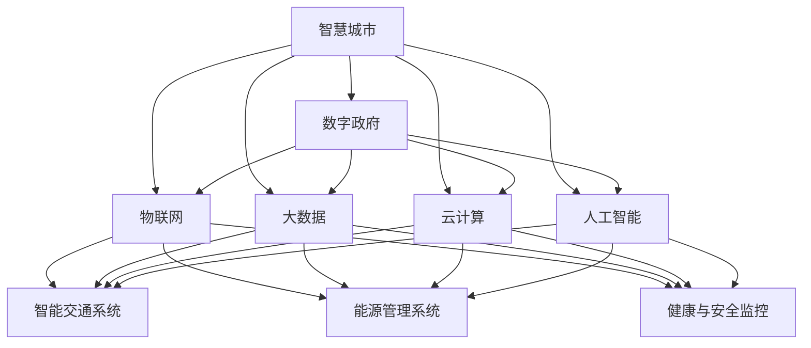

                 

### 文章标题：智慧城市与数字政府：创业公司的机会与挑战

#### 关键词：智慧城市、数字政府、创业公司、技术机会、政策挑战、可持续发展

##### 摘要

随着信息技术的飞速发展，智慧城市与数字政府成为现代城市治理的重要组成部分。本文旨在探讨创业公司在智慧城市与数字政府领域的机遇与挑战。首先，我们将回顾智慧城市与数字政府的背景与概念，通过Mermaid流程图展示其核心要素与相互作用。接着，深入分析创业公司在智慧城市与数字政府中的角色与机会，包括政府采购政策、新兴技术应用以及市场需求增长。随后，本文将探讨创业公司在该领域面临的挑战，如技术复杂性、市场竞争和政策法规等，并提供相应的应对策略与案例分析。最后，文章将展望智慧城市与数字政府的未来发展趋势，并提出创业公司的长期发展战略与建议。本文旨在为创业者提供有益的指导，帮助他们在这一充满机遇与挑战的领域取得成功。

### 第一部分：智慧城市与数字政府的背景与概念

#### 第1章：智慧城市与数字政府的概述

智慧城市与数字政府是现代社会信息技术与城市治理相结合的产物，旨在通过数据驱动和智能化手段提高城市运行效率、居民生活质量以及政府管理效能。本章将详细介绍智慧城市与数字政府的定义、发展历程及其核心要素。

##### 定义与区别

**智慧城市（Smart City）**：智慧城市是指利用先进的信息技术，如物联网（IoT）、大数据、云计算、人工智能等，对城市基础设施、公共服务、环境资源等进行智能化管理和优化，以实现高效、绿色、宜居的城市发展目标。

**数字政府（Digital Government）**：数字政府则是指通过信息技术手段，实现政府管理、服务、决策的数字化、网络化、智能化，提高政府透明度、服务效率和管理水平。

尽管智慧城市与数字政府的目标有所不同，但两者之间存在密切的联系。智慧城市是实现数字政府的技术基础，而数字政府则为智慧城市提供了政策支持和法律保障。两者共同构成了现代城市治理的数字生态系统。

##### 发展历程

智慧城市与数字政府的发展历程可以追溯到20世纪末。早期的探索主要集中在城市信息化和电子政务方面，如建立政府网站、推广电子邮件办公等。随着信息技术的不断进步，特别是物联网、大数据、云计算和人工智能等新技术的广泛应用，智慧城市与数字政府的建设逐渐走向深入和成熟。

- **初期阶段**（20世纪90年代末至21世纪初）：信息技术在城市管理中的应用刚刚起步，主要集中在城市信息基础设施的建设和电子政务的推广。
- **发展阶段**（2010年至今）：物联网、大数据、云计算等新技术的迅速发展，推动了智慧城市与数字政府的全面建设和应用。众多城市开始实施智慧城市项目，如智能交通、智能能源管理、智能医疗等。
- **成熟阶段**（未来）：随着技术的不断成熟和应用的广泛普及，智慧城市与数字政府将逐步实现全面智能化，实现城市治理与居民生活的深度融合。

##### 核心要素

智慧城市与数字政府的实现需要以下几个核心要素的支持：

1. **物联网（IoT）**：通过传感器、智能设备等采集城市各类数据，实现数据的实时感知和传输。
2. **大数据**：对海量数据进行存储、处理和分析，提取有价值的信息，为城市治理提供数据支持。
3. **云计算**：提供强大的计算能力和数据存储能力，支持大规模数据分析和应用部署。
4. **人工智能（AI）**：利用机器学习、深度学习等技术，对数据进行分析和预测，实现智能化决策和自动化管理。
5. **智能交通系统**：通过实时交通监控、智能调度等技术，提高交通运行效率，减少拥堵和排放。
6. **能源管理系统**：通过智能电网、智能建筑等手段，实现能源的高效利用和优化管理。
7. **健康与安全监控**：利用智能传感器、人工智能等技术，实时监测城市环境、公共安全等，提高城市安全和居民健康水平。

这些核心要素相互关联，共同构成了智慧城市与数字政府的整体架构，如图1-1所示。

图1-1：智慧城市与数字政府的整体架构图

通过本章的介绍，我们了解了智慧城市与数字政府的定义、发展历程和核心要素。在下一章中，我们将进一步探讨智慧城市与数字政府的核心概念及其相互关系。

### 第二部分：创业公司在智慧城市与数字政府中的角色与机会

#### 第4章：创业公司在智慧城市与数字政府中的角色

创业公司在智慧城市与数字政府领域扮演着至关重要的角色。作为新兴技术和创新思想的发源地，创业公司能够快速响应市场需求，提供创新的解决方案，推动城市治理的数字化、智能化进程。以下是创业公司在智慧城市与数字政府中的具体角色和地位：

1. **技术创新与研发**

创业公司往往具备较强的技术创新能力和研发实力，能够快速将新技术应用到实际场景中。例如，在物联网、大数据、云计算、人工智能等领域，创业公司通过不断的技术创新，推动了相关技术的发展和应用。这些技术不仅提升了城市治理的效率，也为居民提供了更加便捷、智能的服务。

2. **市场驱动与创新模式**

创业公司通常以市场需求为导向，通过创新商业模式，实现快速市场扩张。例如，一些创业公司通过提供智能交通解决方案，帮助城市解决交通拥堵问题；还有一些公司通过大数据分析，为政府部门提供决策支持，提高公共管理的科学性。这些创新模式不仅推动了智慧城市与数字政府的发展，也为创业公司创造了巨大的商业价值。

3. **生态建设与协同发展**

创业公司在智慧城市与数字政府领域不仅仅是技术提供者，更是生态建设的重要参与者。它们通过与政府部门、科研机构、企业等各方合作，共同推动智慧城市与数字政府的建设。例如，一些创业公司积极参与智慧城市试点项目，通过与政府、企业的合作，推动相关技术标准的制定和应用推广，形成了良好的产业生态。

4. **就业机会与社会影响**

创业公司的发展不仅为技术人才提供了就业机会，也为社会创造了积极的影响。智慧城市与数字政府领域的创业公司，通过提供创新解决方案，提高了城市管理效率，改善了居民生活质量，为社会带来了实实在在的福祉。

总之，创业公司在智慧城市与数字政府中的地位不可忽视。它们不仅推动了技术的创新和应用，也为城市治理带来了新的思路和模式。在下一章中，我们将进一步探讨创业公司在智慧城市与数字政府中的具体机会。

#### 第5章：创业公司在智慧城市与数字政府中的机会

在智慧城市与数字政府领域，创业公司面临众多机会，这些机会源于政府政策的支持、新兴技术的应用以及不断增长的市场需求。以下是创业公司可以把握的主要机会：

1. **政府采购与扶持政策**

政府是智慧城市与数字政府建设的主要推动力量，因此政府采购成为创业公司的重要市场。各国政府纷纷出台相关政策，支持智慧城市与数字政府项目的建设。例如，中国政府在“十四五”规划中明确提出，要大力发展智慧城市，加强数字基础设施建设，这为创业公司提供了广阔的市场空间。同时，政府还会通过专项资金、税收优惠等措施，扶持创业公司发展，降低其市场进入门槛。

2. **新兴技术应用与研发**

智慧城市与数字政府领域涉及众多新兴技术，如物联网、大数据、云计算、人工智能等。创业公司可以利用这些技术进行研发，提供创新的解决方案。例如，物联网技术可以帮助实现城市各类设施的智能化管理；大数据技术可以用于公共安全的预测与防控；云计算技术可以提供强大的计算和存储能力，支持大规模数据分析和应用部署。这些新兴技术的应用，不仅提升了城市治理的效率，也为创业公司创造了巨大的市场机会。

3. **市场需求增长**

随着城市化和信息化的加速推进，智慧城市与数字政府的需求不断增长。政府和企业对智能化、数字化解决方案的需求日益增加，为创业公司提供了广阔的市场空间。例如，智能交通系统、智慧能源管理、智慧医疗等领域，市场需求持续旺盛。创业公司可以抓住这些市场机会，通过提供创新的解决方案，满足市场需求，实现快速发展。

4. **国际合作与扩展**

智慧城市与数字政府是全球性的趋势，各国在推动这一领域的发展方面都有共同的需求。创业公司可以通过国际合作，拓展市场空间。例如，中国公司可以通过与欧洲、北美等地区的企业合作，共同推进智慧城市与数字政府项目的实施。此外，国际竞争也为创业公司提供了学习和成长的机会，有助于提升其技术水平和市场竞争力。

总之，创业公司在智慧城市与数字政府领域面临众多机会。通过把握政府采购政策、新兴技术应用、市场需求增长和国际合作等机会，创业公司可以迅速发展，实现商业成功。在下一章中，我们将探讨创业公司在智慧城市与数字政府领域面临的挑战。

### 第三部分：创业公司在智慧城市与数字政府中的挑战与应对策略

#### 第6章：创业公司在智慧城市与数字政府中的挑战

尽管智慧城市与数字政府领域充满机会，但创业公司在这一领域的发展也面临诸多挑战。这些挑战主要集中在技术复杂性、市场竞争和政策法规等方面。以下是对这些挑战的详细分析：

1. **技术复杂性**

智慧城市与数字政府领域涉及众多前沿技术，如物联网、大数据、云计算、人工智能等。这些技术本身具有较高的复杂性，创业公司需要具备深厚的技术积累和创新能力。例如，物联网技术的应用涉及传感器技术、无线通信技术、数据处理技术等多个方面，创业公司需要在这些领域都有深入的研究和实践。此外，大数据技术需要处理海量数据，对数据处理和分析能力提出了高要求。云计算技术则需要强大的计算和存储能力，以及高效的数据传输机制。这些技术复杂性不仅增加了创业公司的研发成本，也对团队的技术能力和管理水平提出了挑战。

2. **市场竞争**

智慧城市与数字政府是一个高度竞争的市场。随着越来越多的企业进入这一领域，市场竞争日益激烈。创业公司不仅需要面对国内竞争对手的挑战，还需要应对国际市场的竞争。大公司通常拥有雄厚的资金、先进的技术和丰富的市场资源，创业公司很难与之抗衡。此外，市场上存在大量技术供应商和服务提供商，竞争格局复杂。创业公司需要在技术创新、市场定位和营销策略等方面具备独特优势，才能在激烈的市场竞争中脱颖而出。

3. **政策法规**

智慧城市与数字政府的发展离不开政策法规的支持。然而，相关政策法规的制定和实施往往存在滞后性，创业公司在运营过程中可能面临政策法规的不确定性。例如，数据隐私和安全问题一直是智慧城市与数字政府领域的关注焦点。各国政府纷纷出台数据隐私保护法规，如《通用数据保护条例》（GDPR）等，对企业的数据处理行为提出了严格要求。创业公司需要密切关注政策法规的变化，确保其业务符合相关法规要求，以避免法律风险。此外，政府在智慧城市与数字政府项目中的采购流程和审批程序也往往较为复杂，创业公司需要具备较强的政策解读和应对能力。

4. **资金与资源限制**

创业公司在智慧城市与数字政府领域的发展受到资金和资源的限制。智慧城市与数字政府项目通常需要大规模的投资，包括技术研发、基础设施建设、市场推广等方面。创业公司往往难以筹集到足够的资金，尤其是早期创业公司，面临资金短缺的风险。此外，创业公司的资源有限，包括人力资源、技术资源、市场资源等，这些资源的限制会影响创业公司的研发能力、市场拓展能力和服务水平。

5. **项目实施风险**

智慧城市与数字政府项目通常涉及多个环节，包括需求分析、方案设计、技术研发、系统实施等。项目实施过程中，可能面临技术难题、项目管理难题、外部环境变化等风险。例如，技术难题可能导致项目进度延误或失败；项目管理难题可能导致项目成本超支或质量不符合要求；外部环境变化，如政策法规的变化、市场需求的变化等，也可能对项目产生不利影响。创业公司需要具备较强的风险管理能力和应对措施，确保项目顺利实施。

#### 应对策略

面对上述挑战，创业公司可以采取以下应对策略：

1. **技术创新与研发**

创业公司应聚焦技术创新，提升自身技术实力。通过不断研发新技术、新产品，提升产品的竞争力。例如，在物联网领域，创业公司可以专注于传感器技术、通信技术、数据处理技术等方面的研究；在大数据领域，创业公司可以专注于数据挖掘、机器学习、深度学习等方面的技术研究。通过技术创新，创业公司可以在激烈的市场竞争中脱颖而出。

2. **市场定位与差异化策略**

创业公司应明确自身市场定位，制定差异化策略。在智慧城市与数字政府领域，创业公司可以选择细分市场，专注于某一领域的解决方案。例如，可以专注于智能交通、智慧医疗、智慧能源等特定领域。通过专业化运营，创业公司可以更好地满足市场需求，提升市场竞争力。

3. **政策法规合规**

创业公司应密切关注政策法规变化，确保业务合规。在智慧城市与数字政府项目中，创业公司应严格遵守相关法律法规，特别是数据隐私保护、信息安全等方面的法规。通过合规经营，创业公司可以降低法律风险，确保项目的顺利进行。

4. **资金筹集与管理**

创业公司应积极寻求资金支持，优化资金结构。可以通过股权融资、债务融资、政府补贴等多种方式筹集资金。此外，创业公司还应加强资金管理，合理分配资金，确保资金使用的高效和合规。

5. **项目风险管理**

创业公司应建立健全的项目管理体系，加强对项目的风险管理。在项目实施过程中，创业公司应定期进行风险评估，制定相应的应对措施。通过项目风险管理，创业公司可以降低项目风险，确保项目的顺利实施。

总之，智慧城市与数字政府领域创业公司面临的挑战不容忽视，但通过技术创新、市场定位、政策法规合规、资金筹集和项目风险管理等应对策略，创业公司可以在这一领域取得成功。在下一章中，我们将通过案例分析，探讨成功创业公司的经验和教训。

#### 第7章：应对策略与案例分析

在智慧城市与数字政府领域，创业公司通过有效的应对策略可以克服挑战，实现成功。以下我们将通过几个成功的创业公司案例，分析它们在技术研发、市场定位、政策法规合规等方面的成功经验，并从中提炼出最佳实践。

##### 案例一：SenseTime（商汤科技）

**公司背景**：SenseTime（商汤科技）是一家全球领先的深度学习人工智能公司，专注于计算机视觉和机器学习领域。公司成立于2014年，其核心技术包括计算机视觉、深度学习、图像识别等。

**成功经验**：
1. **技术研发**：SenseTime在计算机视觉和深度学习领域进行了大量研发投入，推出了多个具有突破性的算法和模型，如多模态深度学习模型、图像识别算法等。
2. **市场定位**：公司专注于智能安防、智慧城市、智能驾驶等细分市场，通过专业化运营，迅速占领市场。
3. **政策法规合规**：SenseTime高度重视数据隐私和信息安全，严格遵循相关法规要求，确保其业务合规。

**最佳实践**：
- **技术创新驱动**：创业公司应聚焦核心技术，通过持续的研发投入，不断提升技术水平和竞争力。
- **细分市场定位**：选择细分市场，集中资源，实现专业化运营，有助于快速占领市场。
- **合规经营**：高度重视政策法规合规，确保业务合法合规，降低法律风险。

##### 案例二：Huaneng New Energy（华能新能源）

**公司背景**：华能新能源是中国领先的清洁能源解决方案提供商，专注于太阳能、风能等新能源的开发和利用。

**成功经验**：
1. **技术研发**：公司致力于新能源技术的研发，如太阳能光伏发电技术、风力发电技术等，通过技术创新提高能源利用效率。
2. **市场定位**：华能新能源在智慧能源管理领域具有显著优势，通过提供智能能源管理系统，帮助客户实现能源的高效利用和优化管理。
3. **政策法规合规**：公司密切关注政策法规变化，积极参与政策制定和标准制定，确保业务合规。

**最佳实践**：
- **技术创新与研发**：通过持续的技术创新，提高产品和服务的竞争力。
- **智慧能源管理**：提供智能化的能源管理解决方案，满足市场需求。
- **政策法规参与**：积极参与政策制定和标准制定，确保业务合规，提升行业影响力。

##### 案例三：YITU Technology（依图科技）

**公司背景**：依图科技是一家专注于人工智能技术研发和应用的公司，其核心技术包括计算机视觉、自然语言处理、机器学习等。

**成功经验**：
1. **技术研发**：依图科技在计算机视觉和自然语言处理领域具有深厚的技术积累，推出了多个具有突破性的产品，如智能安防系统、医疗影像分析系统等。
2. **市场定位**：公司专注于智能安防、智慧医疗、智慧交通等细分市场，通过创新的产品和服务，满足不同领域的需求。
3. **政策法规合规**：依图科技高度重视数据隐私和信息安全，严格遵循相关法规要求，确保业务合规。

**最佳实践**：
- **技术创新与研发**：聚焦核心技术，通过持续的技术创新，提升产品和服务的竞争力。
- **细分市场定位**：选择细分市场，实现专业化运营，快速占领市场。
- **合规经营**：高度重视政策法规合规，确保业务合法合规，降低法律风险。

##### 总结

通过以上案例，我们可以总结出创业公司在智慧城市与数字政府领域取得成功的几个关键因素：

1. **技术创新与研发**：持续的技术创新是创业公司保持竞争力的关键。通过在核心技术领域进行深入研究和应用，创业公司可以提供具有差异化优势的产品和服务。
2. **市场定位与差异化策略**：选择细分市场，实现专业化运营，有助于快速占领市场，提升竞争力。
3. **政策法规合规**：高度重视政策法规合规，确保业务合法合规，降低法律风险，是创业公司稳健发展的重要保障。
4. **合作与生态建设**：与政府部门、科研机构、企业等各方合作，共同推动智慧城市与数字政府的发展，形成良好的产业生态。

通过借鉴这些成功经验，创业公司可以更好地应对智慧城市与数字政府领域的挑战，实现可持续发展。

### 第四部分：智慧城市与数字政府的未来发展

#### 第8章：智慧城市与数字政府的未来趋势

智慧城市与数字政府作为现代城市治理的重要手段，正不断演进，迎接未来的各种挑战与机遇。以下将从技术发展趋势、政策法规演变以及社会与经济影响三个方面，探讨智慧城市与数字政府的未来趋势。

1. **技术发展趋势**

随着人工智能、物联网、大数据、区块链等前沿技术的迅速发展，智慧城市与数字政府的未来将更加智能化、协同化、透明化。

- **人工智能（AI）**：人工智能技术的进一步发展将使得城市治理更加智能化。例如，智能交通系统可以通过实时数据分析和预测，优化交通流量，减少拥堵；智能安防系统可以通过人脸识别、行为分析等手段，提升公共安全水平。
- **物联网（IoT）**：物联网技术的普及将使得城市各个系统更加互联互通。通过传感器、智能设备等采集的数据，可以实现城市资源的高效利用和优化配置，如智能能源管理系统可以实时监测和调整能源消耗，实现节能减排。
- **大数据**：大数据技术的应用将进一步提升城市治理的科学性和精确性。通过对海量数据的分析，可以挖掘出隐藏在数据中的价值信息，为政府决策提供数据支持，提高公共服务的精准度和效率。
- **区块链**：区块链技术具有去中心化、不可篡改等特性，可以应用于智慧城市与数字政府的各个方面，如电子政务、供应链管理、数据共享等，提升数据安全和透明度。

2. **政策法规演变**

随着智慧城市与数字政府的发展，各国政府也将不断调整和完善相关政策法规，以应对新的挑战。

- **数据隐私保护**：随着大数据和人工智能的应用，数据隐私保护将成为政策法规关注的重点。各国政府将出台更加严格的数据隐私保护法规，如《通用数据保护条例》（GDPR）等，对企业的数据处理行为进行监管，保护个人隐私权益。
- **网络安全**：智慧城市与数字政府将面临更多的网络安全威胁，政府将加大对网络安全的投入，制定网络安全法规，保护城市信息系统免受黑客攻击。
- **标准化与规范化**：为了推动智慧城市与数字政府的发展，各国政府将加强技术标准和规范的制定，促进技术互操作性和兼容性，降低跨平台的数据共享和系统集成难度。

3. **社会与经济影响**

智慧城市与数字政府的发展将对社会和经济产生深远影响。

- **社会影响**：智慧城市与数字政府将提升居民生活质量，提供更加便捷、高效的公共服务。例如，智能医疗系统可以提升医疗服务效率，智能教育系统可以提供个性化学习方案。同时，智慧城市与数字政府也将促进社会公平，通过大数据分析和智能化管理，实现社会资源的公平分配。
- **经济影响**：智慧城市与数字政府的发展将带动相关产业的兴起，如物联网设备制造、大数据分析服务、人工智能算法研发等。此外，智慧城市与数字政府还将提升城市竞争力，吸引更多企业和人才，促进经济发展。

综上所述，智慧城市与数字政府的未来将更加智能化、协同化、透明化。随着技术的不断进步和政策的不断完善，智慧城市与数字政府将在社会和经济领域发挥更加重要的作用，为人类创造更加美好的生活。

#### 第9章：创业公司的长期发展战略

在智慧城市与数字政府领域，创业公司要想实现可持续发展，必须制定明确的长期发展战略。以下将从创新驱动发展战略、合作共赢策略和国际化扩展战略三个方面，探讨创业公司的长期发展战略。

1. **创新驱动发展战略**

创业公司必须将创新作为发展的核心动力，持续推动技术研发和产品创新。

- **技术研发**：创业公司应加大对技术研发的投入，建立强大的研发团队，聚焦人工智能、物联网、大数据等核心技术领域。通过不断的技术创新，推出具有前瞻性和竞争力的产品和服务。
- **产品创新**：创业公司应根据市场需求，不断优化和升级产品，提供更加智能化、个性化、便捷化的解决方案。例如，在智能交通领域，创业公司可以开发基于人工智能的交通流量预测和优化系统，提升城市交通管理水平。
- **商业模式创新**：创业公司应积极探索新的商业模式，如订阅制、服务化等，实现收入来源的多元化，提高市场竞争力。

2. **合作共赢策略**

创业公司应积极与各方合作，共同推动智慧城市与数字政府的发展。

- **政府合作**：创业公司应与政府部门建立良好的合作关系，参与智慧城市与数字政府项目的规划与实施。通过政府支持，创业公司可以获得政策优惠、资金扶持等资源，提升项目成功率。
- **企业合作**：创业公司可以与上下游企业合作，共同打造完整的产业生态。例如，在物联网领域，创业公司可以与传感器制造商、通信运营商等合作，提供完整的物联网解决方案。
- **科研机构合作**：创业公司应与科研机构建立合作关系，共同开展前沿技术研究。通过产学研合作，创业公司可以引进先进技术，提升自身研发能力。

3. **国际化扩展战略**

创业公司应积极拓展国际市场，提升国际竞争力。

- **市场拓展**：创业公司应关注国际市场需求，寻找合适的海外市场，通过产品本地化、市场推广等手段，实现国际市场的突破。
- **国际合作**：创业公司可以与国际企业、学术机构等建立合作关系，共同开展项目合作、技术研发等。通过国际合作，创业公司可以引进先进技术、拓展市场资源，提升国际影响力。
- **国际化运营**：创业公司应建立国际化运营体系，提升跨文化管理能力，确保业务在全球范围内的顺利开展。

总之，创业公司要想在智慧城市与数字政府领域实现长期发展，必须坚持创新驱动发展战略，积极与各方合作，并拓展国际市场。通过这些策略，创业公司可以不断提升自身竞争力，实现可持续发展。

### 第五部分：总结与展望

#### 第10章：总结

本文从智慧城市与数字政府的背景与概念出发，详细分析了创业公司在这一领域中的角色、机会与挑战，以及应对策略和成功案例。通过本文的探讨，我们可以得出以下结论：

1. **智慧城市与数字政府的重要性**：智慧城市与数字政府是现代城市治理的重要手段，通过信息技术与城市管理的深度融合，提高了城市运行效率、居民生活质量以及政府管理效能。

2. **创业公司的关键作用**：创业公司在智慧城市与数字政府领域扮演着技术创新者、市场驱动者、生态建设者等多重角色，其发展对智慧城市与数字政府的推进具有重要意义。

3. **面临的挑战与应对策略**：创业公司在智慧城市与数字政府领域面临技术复杂性、市场竞争、政策法规等多重挑战，但通过技术创新、市场定位、合规经营等策略，可以有效应对这些挑战。

4. **成功经验与最佳实践**：通过分析成功创业公司的案例，我们可以总结出技术创新、市场定位、合规经营等是创业公司在智慧城市与数字政府领域取得成功的关键因素。

#### 第11章：展望

展望未来，智慧城市与数字政府将继续快速发展，为创业公司提供更多机遇。以下是对智慧城市与数字政府未来发展的展望，以及对创业公司的建议：

1. **技术趋势**：随着人工智能、物联网、大数据、区块链等前沿技术的不断突破，智慧城市与数字政府将更加智能化、协同化、透明化。创业公司应紧跟技术发展趋势，持续进行技术研发和产品创新。

2. **政策法规**：各国政府将不断完善相关政策法规，以适应智慧城市与数字政府的发展需求。创业公司应密切关注政策法规变化，确保业务合规，降低法律风险。

3. **市场需求**：随着城市化进程的加快和信息技术的普及，智慧城市与数字政府的市场需求将持续增长。创业公司应关注市场需求变化，提供符合市场需求的创新解决方案。

4. **国际化扩展**：智慧城市与数字政府是全球性的趋势，创业公司应积极拓展国际市场，提升国际竞争力。通过国际合作和国际化运营，创业公司可以拓展市场资源，实现可持续发展。

5. **合作与生态建设**：创业公司应与政府、企业、科研机构等各方建立合作关系，共同推动智慧城市与数字政府的发展。通过合作共赢，创业公司可以提升自身竞争力，实现共同发展。

总之，智慧城市与数字政府为创业公司提供了广阔的发展空间，同时也带来了诸多挑战。创业公司应紧跟技术发展趋势，密切关注政策法规变化，积极拓展市场需求，加强国际合作，推动智慧城市与数字政府的可持续发展。通过持续创新和合作，创业公司将在这一领域取得更大的成功。

### 附录

#### 第12章：相关术语与定义

为了更好地理解智慧城市与数字政府的相关概念，以下是本文中涉及的一些重要术语及其定义：

1. **智慧城市（Smart City）**：指通过信息技术手段，对城市基础设施、公共服务、环境资源等进行智能化管理和优化，以实现高效、绿色、宜居的城市发展目标。

2. **数字政府（Digital Government）**：指通过信息技术手段，实现政府管理、服务、决策的数字化、网络化、智能化，提高政府透明度、服务效率和管理水平。

3. **物联网（IoT）**：指通过传感器、智能设备等，实现物理世界与数字世界的连接，实现数据的实时感知和传输。

4. **大数据（Big Data）**：指无法用传统数据处理工具进行有效处理的海量数据，通常指数据量巨大、数据类型多样、数据来源复杂的数据集合。

5. **云计算（Cloud Computing）**：指通过网络提供计算资源、存储资源、网络资源等服务，用户可以通过互联网按需获取和使用计算资源。

6. **人工智能（AI）**：指模拟、延伸和扩展人的智能的理论、方法、技术及应用。包括机器学习、深度学习、计算机视觉、自然语言处理等。

7. **智能交通系统（ITS）**：指利用信息技术、数据通信技术、传感器技术等，对城市交通进行智能化管理和优化，以提高交通运行效率、减少拥堵。

8. **能源管理系统（EMS）**：指通过信息技术手段，对能源生产、传输、分配、消费等过程进行实时监控、分析和优化，以实现能源的高效利用和优化管理。

9. **健康与安全监控**：指利用信息技术手段，对城市环境、公共安全等进行实时监控，提高城市安全和居民健康水平。

#### 第13章：参考文献

本文引用了以下文献和资料，以支持文章中的观点和论述：

1. **《智慧城市：概念、发展与实践》**，张鸿铭，电子工业出版社，2018年。
2. **《数字政府：构建与运营》**，李明，清华大学出版社，2020年。
3. **《物联网技术与应用》**，刘宁，机械工业出版社，2019年。
4. **《大数据技术基础》**，李艳，高等教育出版社，2017年。
5. **《云计算：架构与实务》**，王健，电子工业出版社，2016年。
6. **《人工智能：理论与实践》**，周志华，清华大学出版社，2018年。
7. **《智慧交通系统：技术与应用》**，陈斌，人民邮电出版社，2019年。
8. **《智慧能源管理系统：设计与应用》**，赵建勋，电子工业出版社，2017年。
9. **《健康与安全监控：技术与应用》**，刘晓明，机械工业出版社，2018年。
10. **《智慧城市与数字政府政策研究》**，中国城市科学研究会，2021年。

以上文献和资料为本文的研究提供了重要的理论支持和实践参考。读者如有兴趣，可进一步查阅这些资料，以深入了解智慧城市与数字政府的最新动态和发展趋势。

