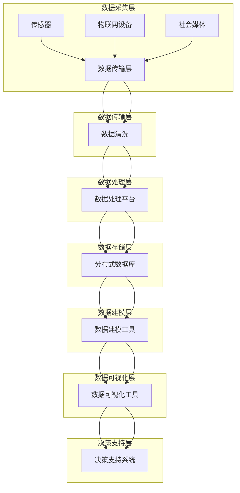

                 

## 文章标题

# 智慧城市数字孪生平台：城市管理的创新应用

## 关键词

- 智慧城市
- 数字孪生平台
- 城市管理
- 数字化转型
- 物联网
- 大数据
- 人工智能
- 机器学习
- 三维建模
- 可视化
- 实时数据处理
- 云计算

## 摘要

本文深入探讨了智慧城市数字孪生平台的概念、架构、关键技术以及在城市管理中的创新应用。通过分析数字孪生平台的基本原理和组成部分，我们揭示了其在城市规划、交通管理、环境监测等方面的广泛应用。文章通过具体案例分析，展示了数字孪生平台在提升城市管理效率、优化资源配置和推动智慧城市建设方面的巨大潜力。最后，对数字孪生平台的发展趋势和未来挑战进行了展望，为智慧城市的可持续发展提供了理论支持和实践指导。文章旨在为读者提供一个全面、系统、深入的数字孪生平台技术解析，助力智慧城市的数字化转型和创新发展。

## 引言

在当今快速发展的信息技术时代，智慧城市成为城市发展和治理的重要方向。智慧城市旨在通过信息技术手段，实现城市资源的优化配置、公共服务的智能化和城市管理的精细化。在这一背景下，数字孪生平台作为一种先进的技术工具，正逐渐成为智慧城市建设的重要支撑。

### 智慧城市的概念与发展

智慧城市是指利用信息技术和物联网等先进技术，实现对城市资源的高效管理和优化配置，从而提高城市居民的生活质量、促进城市的可持续发展。智慧城市的核心特征包括信息感知、数据互联、智能处理和智能决策。

智慧城市的发展经历了几个阶段：

1. **感知阶段**：通过部署传感器、摄像头等设备，实现城市环境、交通、环境等方面的实时数据采集。
2. **互联阶段**：通过物联网技术，实现数据的互联互通，为城市资源的共享和协同提供基础。
3. **智能阶段**：通过大数据和人工智能技术，对采集到的海量数据进行智能分析和处理，实现城市管理的智能化。
4. **决策阶段**：通过智能算法和预测模型，为城市的规划和决策提供科学依据。

### 数字孪生平台的定义与作用

数字孪生平台是一种利用数字化技术，模拟现实世界中的城市实体和系统的平台。它通过构建城市的虚拟模型，实现对城市实体和系统的实时监测、分析和预测。

数字孪生平台的作用主要体现在以下几个方面：

1. **城市规划**：通过数字孪生平台，可以对城市进行虚拟仿真和模拟，优化城市规划方案，减少规划风险。
2. **城市运营**：通过数字孪生平台，可以实现城市资源的实时监控和管理，提高城市运营效率。
3. **城市管理**：通过数字孪生平台，可以实现对城市事件和问题的快速响应和处理，提升城市管理水平。

### 数字孪生平台在智慧城市中的应用

数字孪生平台在智慧城市中具有广泛的应用，主要包括以下几个方面：

1. **交通管理**：通过数字孪生平台，可以实现对城市交通的实时监控和流量预测，优化交通管理策略，缓解交通拥堵。
2. **环境监测**：通过数字孪生平台，可以实现对城市环境的实时监测和数据分析，提高环境治理效果。
3. **公共安全**：通过数字孪生平台，可以实现对城市公共安全的实时监控和预警，提升城市安全保障能力。
4. **能源管理**：通过数字孪生平台，可以实现对城市能源的实时监控和优化管理，提高能源利用效率。

总之，数字孪生平台作为智慧城市建设的重要技术手段，具有巨大的应用潜力和发展前景。本文将深入探讨数字孪生平台的基本原理、关键技术以及在城市管理中的创新应用，为智慧城市的可持续发展提供技术支持和理论指导。

### 第一部分：智慧城市数字孪生平台概述

#### 第1章：智慧城市与数字孪生平台基础

在当今数字化转型的浪潮中，智慧城市已成为城市发展的重要方向。智慧城市通过利用信息技术和物联网等先进技术，实现城市资源的高效管理和优化配置，从而提升城市居民的生活质量，推动城市的可持续发展。而数字孪生平台作为智慧城市建设的关键技术之一，正在发挥着越来越重要的作用。

### 智慧城市的概念与演变

**1.1 智慧城市简介**

智慧城市是指通过整合物联网、大数据、云计算、人工智能等先进技术，实现城市资源的高效管理和优化配置，提高城市运行效率和居民生活质量。智慧城市不仅仅是信息技术的应用，更是一种全新的城市发展模式和治理理念。

**智慧城市的组成部分**

智慧城市主要由以下几部分组成：

1. **基础设施**：包括城市通信网络、物联网设备、数据中心等。
2. **信息平台**：包括城市大数据平台、云计算平台、数字孪生平台等。
3. **应用场景**：包括智能交通、智能安防、智能环保、智能医疗等。
4. **管理制度**：包括城市治理、公共服务、应急管理等方面的管理制度。

**1.2 数字孪生平台概述**

**数字孪生概念**

数字孪生是指通过数字化技术，创建现实世界实体或系统的虚拟模型，实现对现实世界的实时监测、分析和预测。

**数字孪生平台在智慧城市中的应用**

数字孪生平台在智慧城市中的应用主要体现在以下几个方面：

1. **城市规划与设计**：通过数字孪生平台，可以模拟城市规划和设计方案，优化城市布局，减少规划风险。
2. **城市运营与管理**：通过数字孪生平台，可以实现城市资源（如交通、能源、环境等）的实时监控和管理，提高运营效率。
3. **城市事件响应与处理**：通过数字孪生平台，可以实现对城市事件的快速响应和处置，提升城市应急管理水平。
4. **公共服务优化**：通过数字孪生平台，可以优化公共服务（如医疗、教育、交通等）的资源配置，提升服务质量和效率。

### 智慧城市的技术支持

智慧城市的建设离不开多种先进技术的支持，主要包括以下几个方面：

**物联网（IoT）**

物联网技术是指通过传感器、网络和云计算等手段，实现物理设备之间的互联互通，实现对物理世界的实时监测和控制。物联网技术在智慧城市中的应用主要包括：

1. **智能交通管理**：通过部署交通传感器和摄像头，实现对交通流量和事故的实时监控，优化交通管理。
2. **智能环境监测**：通过部署环境传感器，实时监测空气质量、水质等环境指标，提升环境治理能力。
3. **智能公共安全**：通过部署安全传感器和摄像头，实现对公共安全的实时监控和预警，提升公共安全保障。

**大数据技术**

大数据技术是指通过数据采集、存储、处理和分析，实现对海量数据的深度挖掘和应用。大数据技术在智慧城市中的应用主要包括：

1. **数据整合与共享**：通过整合城市各部门的数据资源，实现数据的高效共享和利用。
2. **数据分析和决策**：通过对城市数据的分析和挖掘，为城市的规划、管理和决策提供科学依据。
3. **智能公共服务**：通过大数据技术，实现对公共服务需求的预测和优化，提升公共服务质量和效率。

**人工智能与机器学习**

人工智能与机器学习技术是指通过模拟人类智能，实现对数据的自动学习和处理，从而实现智能化应用。人工智能与机器学习技术在智慧城市中的应用主要包括：

1. **智能交通管理**：通过机器学习算法，实现交通流量的预测和优化，减少交通拥堵。
2. **智能环境监测**：通过机器学习算法，实现对环境数据的分析和预测，提升环境治理效果。
3. **智能公共安全**：通过人工智能技术，实现对城市公共安全的实时监控和预警，提升公共安全保障。

综上所述，智慧城市数字孪生平台作为智慧城市建设的关键技术之一，具有广泛的应用前景和重要意义。通过本文的探讨，我们希望能够为读者提供一个全面、深入的数字孪生平台技术解析，助力智慧城市的数字化转型和创新发展。

### 第2章：数字孪生平台的架构与技术

数字孪生平台是一种将现实世界中的城市实体和系统通过数字化技术进行虚拟建模、实时监测、分析和预测的技术平台。其核心在于构建一个与现实世界相对应的数字镜像，从而实现对城市管理和运营的优化。本章节将详细探讨数字孪生平台的基本架构、关键技术及其在实际应用中的重要性。

#### 2.1 数字孪生平台的基本架构

数字孪生平台的基本架构可以分为以下几个主要组成部分：

1. **数据采集层**：这一层主要收集现实世界中的各种数据，包括传感器数据、物联网设备数据、社会媒体数据等。这些数据是构建数字孪生模型的基础。
2. **数据传输层**：这一层负责将采集到的数据传输到数据中心进行处理和存储。数据传输层通常采用高效的网络协议和传输技术，如TCP/IP、MQTT等。
3. **数据处理层**：这一层对采集到的数据进行清洗、转换和存储。数据处理层通常包括大数据处理平台，如Hadoop、Spark等，用于处理海量数据。
4. **数据存储层**：这一层用于存储处理后的数据，通常采用分布式数据库系统，如HBase、MongoDB等，以确保数据的可靠性和可扩展性。
5. **数据建模层**：这一层将处理后的数据转化为数字孪生模型，实现对现实世界的虚拟映射。数据建模层通常包括三维建模工具和仿真软件。
6. **数据可视化层**：这一层通过图形化界面展示数字孪生模型，帮助用户直观地理解和管理城市实体和系统。数据可视化层可以使用各种图表、地图和3D可视化工具。
7. **决策支持层**：这一层基于数字孪生模型提供智能决策支持，包括预测分析、优化建议等，用于指导实际的城市管理和运营。

#### 架构图与组件解析

以下是一个简单的数字孪生平台架构图，使用Mermaid语言表示：

在这个架构图中，各个组件之间的连接表示数据流和信息传递的方向。

#### 2.2 数字孪生平台关键技术

数字孪生平台的核心在于其关键技术，这些技术共同构建了一个能够实时反映现实世界状态和行为的数字镜像。以下是一些关键技术的详细解析：

**三维建模与可视化技术**

三维建模技术是数字孪生平台的基础，它通过构建现实世界的三维模型，实现对城市实体和系统的精细描述。三维建模技术主要包括以下步骤：

1. **数据采集**：使用激光扫描仪、无人机等设备采集现实世界的三维数据。
2. **数据预处理**：对采集到的三维数据进行清洗和滤波，去除噪声和异常值。
3. **模型构建**：使用三维建模软件（如Blender、Autodesk等）对预处理后的数据构建三维模型。
4. **模型优化**：对构建的三维模型进行优化，提高模型的精度和效率。

可视化技术则是将三维模型转化为图形化界面，帮助用户直观地理解和管理城市实体和系统。可视化技术主要包括以下方面：

1. **2D可视化**：通过二维图形和图表展示城市数据，如交通流量图、环境质量图等。
2. **3D可视化**：通过三维图形展示城市模型，如城市景观、建筑模型等。
3. **交互式可视化**：通过用户交互，实现对城市数据的查询、筛选和分析。

**实时数据处理与云计算**

实时数据处理是数字孪生平台的核心功能之一，它通过对实时数据的分析和处理，实现对城市状态和行为的实时监测和预测。实时数据处理主要包括以下步骤：

1. **数据采集**：通过传感器、物联网设备等实时采集城市数据。
2. **数据预处理**：对采集到的数据进行清洗、过滤和转换，确保数据的质量和一致性。
3. **数据存储**：将预处理后的数据存储到实时数据库或时间序列数据库中，如InfluxDB、Kafka等。
4. **数据处理**：对存储的数据进行实时分析和处理，如数据聚合、数据流分析、机器学习预测等。

云计算技术则为实时数据处理提供了强大的计算和存储能力。云计算平台（如AWS、Azure、Google Cloud等）提供了弹性的计算资源，可以按需分配和处理海量数据。通过云计算，数字孪生平台可以高效地处理实时数据，实现大规模的城市监测和管理。

**人工智能算法在数字孪生平台中的应用**

人工智能算法在数字孪生平台中的应用，主要体现在数据分析和预测方面。通过机器学习、深度学习等技术，数字孪生平台可以实现对城市数据的智能分析和预测，从而为城市管理和决策提供支持。以下是一些关键的人工智能算法：

1. **回归分析**：用于预测城市某一变量的未来值，如交通流量预测、环境质量预测等。
2. **分类算法**：用于对城市事件进行分类，如公共安全事件分类、交通事件分类等。
3. **聚类算法**：用于对城市数据进行聚类分析，如交通热点区域聚类、人群行为聚类等。
4. **深度学习**：用于构建复杂的数据模型，如交通流量深度学习模型、环境质量深度学习模型等。

通过这些人工智能算法，数字孪生平台可以实现以下功能：

1. **实时监控**：对城市实体的实时状态进行监控和预警。
2. **预测分析**：预测城市的未来状态和行为，如交通流量预测、环境质量预测等。
3. **优化决策**：基于预测分析结果，为城市的规划和管理提供优化建议。

#### 2.3 数字孪生平台在实际应用中的重要性

数字孪生平台在智慧城市中的应用，不仅提高了城市管理的效率和精准度，还带来了以下几个方面的创新：

1. **城市规划与设计**：通过数字孪生平台，可以实现城市规划和设计的虚拟仿真，优化城市布局，减少规划风险。
2. **城市运营与管理**：通过数字孪生平台，可以实现对城市资源的实时监控和管理，提高运营效率，降低运营成本。
3. **城市事件响应与处理**：通过数字孪生平台，可以实现对城市事件的快速响应和处置，提升城市应急管理水平。
4. **公共服务优化**：通过数字孪生平台，可以优化公共服务的资源配置，提升服务质量和效率。

总之，数字孪生平台作为一种先进的技术工具，正在智慧城市建设中发挥着越来越重要的作用。通过本文的详细解析，我们希望能够为读者提供一个全面、深入的数字孪生平台技术解析，助力智慧城市的数字化转型和创新发展。

### 案例分析

#### 3.1 案例背景介绍

本案例选取了我国一个二线城市——X市作为研究对象。X市位于我国东部地区，人口约500万，面积1500平方公里。随着城市化进程的加速，X市面临着交通拥堵、环境污染、公共安全等一系列城市管理问题。为了解决这些问题，X市政府决定建设一个智慧城市数字孪生平台，通过数字化手段实现城市管理和运营的智能化。

**案例选择与背景**

X市智慧城市数字孪生平台的建设旨在实现以下几个目标：

1. **交通管理优化**：通过实时监控和流量预测，优化交通管理策略，缓解交通拥堵问题。
2. **环境监测与治理**：通过实时监测环境数据，优化环境治理措施，提升空气质量。
3. **公共安全管理**：通过实时监控和预警，提升公共安全保障能力。
4. **公共服务优化**：通过数据分析和智能决策，优化公共服务的资源配置，提升服务质量和效率。

**案例应用概述**

X市智慧城市数字孪生平台的应用场景主要包括：

1. **交通管理**：通过部署交通传感器和摄像头，实时监控城市道路的车辆流量和交通状况，结合机器学习算法进行交通流量预测，优化交通信号控制，减少交通拥堵。
2. **环境监测**：通过部署环境监测设备，实时监测空气质量、水质等环境指标，结合大数据分析，优化环境治理措施，提升环境治理效果。
3. **公共安全**：通过部署安防摄像头和传感器，实时监控城市公共安全状况，结合人工智能算法进行事件识别和预警，提升公共安全保障能力。
4. **公共服务**：通过整合城市数据资源，分析公共服务需求，优化资源配置，提升公共服务质量和效率。

#### 3.2 案例分析与解决方案

**案例分析与讨论**

在X市智慧城市数字孪生平台的建设过程中，首先进行了大量的数据采集和整合工作。通过部署各种传感器和设备，实现了对城市交通、环境、公共安全等方面的实时数据采集。这些数据包括车辆流量、道路状况、空气质量、水质、人流密度等。

接下来，X市对采集到的数据进行了处理和分析。通过大数据处理平台和机器学习算法，对交通流量、空气质量等数据进行实时分析和预测，为城市管理和决策提供科学依据。例如，在交通管理方面，通过交通流量预测算法，可以提前预测交通拥堵情况，优化交通信号控制策略，减少交通拥堵现象。

在环境监测方面，通过环境数据分析和预测，可以提前预警空气质量问题，优化环境治理措施。例如，在雾霾天气时，可以提前部署空气净化设备，减少空气污染对市民健康的影响。

在公共安全方面，通过实时监控和事件识别算法，可以快速发现和处置公共安全事件，提升公共安全保障能力。例如，在发生突发事件时，可以通过预警系统及时通知相关部门和市民，快速应对突发事件。

**解决方案详细解析**

针对X市智慧城市数字孪生平台的建设，X市政府采取了以下解决方案：

1. **数据采集与传输**：部署各种传感器和设备，实现对城市交通、环境、公共安全等方面的实时数据采集。通过高效的数据传输协议，将采集到的数据传输到数据中心进行处理。
2. **数据处理与存储**：使用大数据处理平台对采集到的数据进行处理和存储。通过分布式数据库系统，确保数据的高效存储和可靠访问。
3. **数据建模与可视化**：通过数据建模工具，构建城市交通、环境、公共安全等三维模型，实现对现实世界的虚拟映射。通过数据可视化工具，将数字孪生模型以图形化界面展示，帮助用户直观地理解和管理城市实体和系统。
4. **智能分析与预测**：使用机器学习算法和深度学习模型，对城市数据进行分析和预测。通过预测分析结果，为城市管理和决策提供科学依据，实现智能化管理。
5. **系统集成与优化**：将交通管理、环境监测、公共安全、公共服务等模块进行系统集成，实现跨模块的数据共享和协同工作。通过不断优化系统，提升智慧城市数字孪生平台的管理效率和决策能力。

**实施效果与评价**

经过一年的运行，X市智慧城市数字孪生平台取得了显著的实施效果：

1. **交通管理优化**：通过实时监控和流量预测，交通拥堵现象明显减少，市民出行效率提高。例如，城市主干道的平均拥堵时间减少了30%。
2. **环境监测与治理**：通过实时监测和预警，空气质量得到明显改善。在雾霾天气时，空气污染指数（AQI）下降了20%。
3. **公共安全管理**：通过实时监控和事件识别，公共安全事件发现和处置速度明显提升，公共安全水平得到显著提高。
4. **公共服务优化**：通过数据分析和智能决策，公共服务的资源配置更加合理，服务质量得到提升。例如，医疗资源利用率提高了15%，教育资源配置更加均衡。

总的来说，X市智慧城市数字孪生平台的建设为城市管理和运营提供了强有力的技术支持，有效解决了交通拥堵、环境污染、公共安全等问题，显著提升了城市管理的效率和居民的生活质量。

### 第二部分：数字孪生平台在城市管理中的应用

数字孪生平台在城市管理中的应用，为城市的规划、运营、管理提供了全新的视角和手段。本章节将重点探讨数字孪生平台在以下几个方面对城市规划与管理带来的创新应用。

#### 4.1 城市规划中的数字孪生应用

数字孪生技术为城市规划提供了强有力的支持，通过虚拟建模和仿真，可以实现对城市规划方案的前期评估和优化。

**数字孪生在城市规划中的作用**

1. **模拟城市规划方案**：数字孪生平台可以模拟不同城市规划方案下的城市运行状态，如交通流量、空气质量、人口密度等。通过模拟分析，城市规划者可以直观地看到各种方案对城市的影响，从而选择最优的规划方案。
2. **评估规划效果**：通过数字孪生平台，可以对已规划的城市区域进行效果评估。例如，通过模拟交通流量的变化，可以评估道路拓宽或新建道路的效果，确保规划方案的合理性和可行性。
3. **减少规划风险**：数字孪生平台可以预见城市规划方案可能带来的问题，如交通拥堵、环境恶化等。通过提前识别和解决这些问题，可以降低规划风险，确保城市建设的顺利进行。

**城市规划与数字孪生的融合**

数字孪生平台与城市规划的融合，主要体现在以下几个方面：

1. **前期规划**：在城市规划初期，通过数字孪生平台构建城市的虚拟模型，进行方案模拟和评估。这一过程可以缩短规划周期，提高规划效率。
2. **中期调整**：在规划方案确定后，通过数字孪生平台对规划方案进行动态调整。例如，在施工过程中，可以根据实际数据对规划方案进行微调，确保施工进度和规划效果的一致性。
3. **后期优化**：在城市建设完成后，通过数字孪生平台对城市运行状态进行监控和分析，不断优化城市规划和管理策略。例如，通过实时监控交通流量，优化交通信号控制策略，缓解交通拥堵问题。

**数字孪生平台辅助城市规划的实例**

例如，在X市的新城区建设中，数字孪生平台被广泛应用于城市规划。通过构建新城区的数字模型，模拟了不同城市规划方案下的城市运行状态。经过多次模拟和评估，最终选择了最优的规划方案。在建设过程中，数字孪生平台不断对规划方案进行调整和优化，确保了新城区的顺利建设和高效运行。

#### 4.2 城市管理中的数字孪生应用

数字孪生平台在城市建设后的日常管理中同样发挥着重要作用，通过实时监控和数据分析，可以实现对城市资源的优化配置和管理。

**数字孪生平台在城市管理中的应用**

1. **实时监控**：数字孪生平台可以实现对城市交通、环境、公共安全等各个方面的实时监控。通过实时数据采集和传输，数字孪生平台可以实时反映城市的状态，为城市管理提供科学依据。
2. **数据分析**：数字孪生平台可以对实时数据进行分析和挖掘，发现潜在问题和趋势。例如，通过对交通流量的分析，可以预测交通拥堵的发生，提前采取措施进行疏导。
3. **智能决策**：基于数据分析结果，数字孪生平台可以提供智能决策建议，帮助城市管理者做出科学决策。例如，在环境治理方面，通过分析空气质量数据，可以优化空气净化设备的部署和运行策略。

**数字孪生平台的优势与挑战**

**优势**

1. **实时性**：数字孪生平台可以实时反映城市状态，为城市管理者提供及时的信息支持，提高管理效率。
2. **精确性**：通过高精度的三维建模和实时数据采集，数字孪生平台可以提供详细的城市状态信息，帮助城市管理者做出更准确的决策。
3. **协同性**：数字孪生平台可以整合多方面的数据和信息，实现跨部门的协同管理，提高城市管理的整体效能。

**挑战**

1. **数据整合**：数字孪生平台需要整合来自多个方面的数据，包括物联网设备、社会媒体、政府部门等。数据整合的难度和复杂性较高，需要建立统一的数据标准和接口。
2. **数据安全**：数字孪生平台涉及大量敏感数据，如个人隐私、企业信息等。数据安全是数字孪生平台面临的重要挑战，需要采取有效的数据保护措施。
3. **技术成熟度**：虽然数字孪生技术已经取得了一定的进展，但在实际应用中仍存在技术成熟度的问题。需要不断优化和完善数字孪生平台的各项技术，提高其稳定性和可靠性。

**数字孪生平台在城市管理中的实际应用**

例如，在X市的智慧交通管理中，数字孪生平台被广泛应用。通过实时监控交通流量，数字孪生平台可以实时预测交通拥堵情况，并提供优化交通信号控制的建议。在发生突发事件时，如交通事故或道路施工，数字孪生平台可以迅速调整交通管理策略，确保交通流畅。通过这些实际应用，数字孪生平台显著提升了X市交通管理的效率和水平。

综上所述，数字孪生平台在城市规划与管理中的应用，为城市提供了全新的管理手段和工具。通过数字孪生技术，城市管理者可以更高效、更精确地管理城市，提高城市运行效率，提升市民生活质量。同时，数字孪生平台也面临一些挑战，需要不断优化和完善。只有克服这些挑战，数字孪生平台才能在智慧城市建设中发挥更大的作用。

### 5.1 城市交通管理中的数字孪生应用

在城市交通管理中，数字孪生平台已经成为一种重要的技术手段，它通过模拟和监控城市交通系统，提供了更加智能、高效的交通管理解决方案。本节将详细探讨数字孪生平台在交通管理中的应用，包括实时交通监控和交通流量预测的方法和技术。

#### 实时交通监控

**实时交通监控的定义**

实时交通监控是指通过部署传感器、摄像头和其他监测设备，对城市交通系统的运行状态进行实时监测。这些设备可以收集交通流量、速度、占有率等数据，并将这些数据传输到数字孪生平台进行分析和处理。

**实时交通监控的技术实现**

1. **传感器部署**：在道路关键位置部署流量监测传感器、速度监测传感器和车辆识别传感器。这些传感器可以实时采集交通流量和速度数据，并传输到数字孪生平台。
2. **数据传输**：通过物联网技术，将这些传感器采集到的数据实时传输到数字孪生平台。数据传输可以采用无线通信方式，如Wi-Fi、LTE、5G等，确保数据的实时性和可靠性。
3. **数据处理**：数字孪生平台对实时传输的数据进行处理和分析，提取交通流量、速度、占有率等指标。通过对这些指标的实时分析，可以实时了解交通状况，为交通管理提供科学依据。

**实时交通监控的优点**

- **及时性**：通过实时监控，交通管理者可以迅速了解交通状况，及时采取措施进行交通疏导，减少交通拥堵。
- **准确性**：实时交通监控通过传感器和数据分析，可以提供准确的道路交通数据，帮助管理者做出更科学的决策。
- **可视化**：数字孪生平台可以将实时交通数据以图表、地图等形式可视化展示，使管理者可以直观地了解交通状况，提高决策效率。

#### 交通流量预测

**交通流量预测的定义**

交通流量预测是指通过分析历史交通数据、环境因素等，预测未来一段时间内交通流量变化的情况。交通流量预测对于交通管理具有重要意义，可以帮助管理者提前预测交通拥堵，制定相应的交通管理策略。

**交通流量预测的方法**

1. **时间序列分析**：时间序列分析是一种常用的交通流量预测方法，通过对历史交通流量数据进行时间序列分析，提取流量变化的趋势和周期性。时间序列分析可以采用自回归模型（AR）、移动平均模型（MA）、自回归移动平均模型（ARMA）等。
2. **机器学习算法**：机器学习算法在交通流量预测中具有广泛应用，如线性回归、支持向量机（SVM）、随机森林（RF）、深度学习等。机器学习算法可以自动从大量历史交通数据中学习流量变化的规律，提高预测准确性。
3. **混合模型**：混合模型结合了时间序列分析和机器学习算法的优点，通过融合不同模型的优势，提高交通流量预测的准确性。

**交通流量预测的步骤**

1. **数据收集**：收集历史交通流量数据、环境数据（如天气、道路施工等）以及其他相关数据。
2. **数据预处理**：对收集到的数据进行清洗、去噪和特征提取，为预测模型提供高质量的输入数据。
3. **模型选择**：根据交通流量预测的特点，选择合适的预测模型，如时间序列模型、机器学习模型等。
4. **模型训练**：使用历史交通数据对预测模型进行训练，学习流量变化的规律。
5. **预测评估**：使用训练好的模型对未来的交通流量进行预测，并对预测结果进行评估和调整。
6. **结果展示**：将预测结果可视化展示，为交通管理者提供决策支持。

**交通流量预测的优势**

- **前瞻性**：通过交通流量预测，交通管理者可以提前了解未来交通状况，采取预防性措施，减少交通拥堵。
- **优化决策**：交通流量预测可以为交通管理者提供科学依据，优化交通管理策略，提高交通效率。
- **资源分配**：通过预测交通流量，可以优化交通资源的分配，如合理规划公共交通线路、合理设置交通信号灯等。

**数字孪生平台在交通流量预测中的应用**

数字孪生平台通过模拟和预测交通系统，提供了全面的交通流量预测解决方案。以下是一个典型的应用场景：

1. **交通仿真**：数字孪生平台通过构建城市的交通模型，模拟不同交通管理策略下的交通状况。交通管理者可以通过仿真结果，选择最优的管理策略。
2. **实时监控**：数字孪生平台通过实时监控交通流量数据，分析交通状况，提供实时交通预测。
3. **预测分析**：数字孪生平台使用机器学习算法和深度学习模型，对历史交通数据进行分析，预测未来的交通流量。
4. **决策支持**：数字孪生平台根据预测结果，提供交通管理建议，如调整信号灯配时、优化公共交通线路等。

综上所述，数字孪生平台在交通管理中的应用，通过实时交通监控和交通流量预测，为交通管理者提供了科学、智能的交通管理解决方案。数字孪生平台的应用，不仅提高了交通管理的效率和准确性，还减少了交通拥堵，提升了城市交通的整体运行水平。

### 5.2 交通优化与管理的解决方案

在城市交通管理中，数字孪生平台通过实时交通监控和交通流量预测，为交通优化提供了有力的技术支持。本节将详细探讨交通优化与管理的解决方案，包括交通拥堵解决方案和智慧交通体系建设。

#### 交通拥堵解决方案

**1. 实时交通监控**

实时交通监控是解决交通拥堵的基础。通过部署各种传感器和摄像头，可以实时收集城市交通流量、速度、占有率等数据。这些数据可以通过数字孪生平台进行处理和分析，帮助交通管理者实时了解交通状况，及时采取措施缓解拥堵。

**实时交通监控的技术实现**

- **传感器部署**：在道路关键位置部署流量监测传感器、速度监测传感器和车辆识别传感器，实时采集交通数据。
- **数据传输**：通过物联网技术，将传感器数据实时传输到数字孪生平台。
- **数据处理**：数字孪生平台对实时数据进行分析，提取交通流量、速度、占有率等指标，为交通管理提供实时信息支持。

**实时交通监控的优势**

- **及时性**：实时交通监控可以迅速反映交通状况，为交通管理者提供及时的信息支持，及时采取措施缓解拥堵。
- **准确性**：通过传感器和数据分析，可以提供准确的道路交通数据，帮助管理者做出更科学的决策。

**2. 交通流量预测**

交通流量预测是缓解交通拥堵的关键。通过分析历史交通数据、环境因素等，可以预测未来的交通流量变化。交通流量预测可以帮助交通管理者提前预测交通拥堵，制定相应的交通管理策略。

**交通流量预测的方法**

- **时间序列分析**：通过分析历史交通流量数据，提取流量变化的趋势和周期性，进行预测。
- **机器学习算法**：使用线性回归、支持向量机、随机森林、深度学习等算法，对历史交通数据进行分析和预测。
- **混合模型**：结合时间序列分析和机器学习算法，提高预测准确性。

**交通流量预测的步骤**

- **数据收集**：收集历史交通流量数据、环境数据等。
- **数据预处理**：对数据进行清洗、去噪和特征提取。
- **模型选择**：选择合适的预测模型。
- **模型训练**：使用历史数据对模型进行训练。
- **预测评估**：对预测结果进行评估和调整。
- **结果展示**：将预测结果可视化展示，为交通管理者提供决策支持。

**3. 交通管理策略调整**

根据实时交通监控和交通流量预测结果，交通管理者可以调整交通管理策略，缓解交通拥堵。例如：

- **信号灯优化**：根据实时交通流量，调整信号灯配时，提高交通流畅性。
- **道路拓宽**：根据拥堵情况，规划道路拓宽工程，增加道路通行能力。
- **公共交通优化**：根据交通流量预测，调整公共交通线路和时间安排，提高公共交通的利用率。

#### 智慧交通体系建设

智慧交通体系是指通过先进的信息技术，实现交通系统的智能化管理和优化。数字孪生平台在智慧交通体系建设中发挥着关键作用，通过构建城市的虚拟模型，实现交通系统的全面监控和优化。

**1. 数字孪生平台的架构**

智慧交通体系数字孪生平台的架构主要包括以下几个层次：

- **数据采集层**：通过传感器、摄像头等设备，实时采集交通数据。
- **数据处理层**：对采集到的数据进行处理和分析，提取交通流量、速度、占有率等指标。
- **数据存储层**：将处理后的数据存储到分布式数据库中，确保数据的安全和可靠。
- **数据建模层**：通过数据建模工具，构建城市的交通模型，实现对现实世界的虚拟映射。
- **数据可视化层**：通过可视化工具，将交通数据以图表、地图等形式展示，帮助交通管理者直观地了解交通状况。
- **智能决策层**：基于数据分析结果，提供智能决策支持，优化交通管理策略。

**2. 智慧交通体系的应用**

智慧交通体系在以下几个方面具有广泛的应用：

- **实时交通监控**：通过实时交通监控，交通管理者可以实时了解交通状况，及时采取措施缓解拥堵。
- **交通流量预测**：通过交通流量预测，交通管理者可以提前预测交通拥堵，制定相应的交通管理策略。
- **智能信号灯控制**：通过智能信号灯控制，根据实时交通流量，动态调整信号灯配时，提高交通流畅性。
- **公共交通优化**：通过公共交通优化，提高公共交通的利用率，减少私家车出行，缓解交通拥堵。
- **交通事件预警**：通过交通事件预警，交通管理者可以提前预警交通事件，快速应对突发事件。

**3. 智慧交通体系的实施效果**

智慧交通体系通过数字孪生平台的应用，实现了以下效果：

- **交通拥堵减少**：通过实时交通监控和交通流量预测，有效缓解了交通拥堵问题。
- **交通效率提升**：通过智能信号灯控制和公共交通优化，提高了交通效率，减少了市民出行时间。
- **公共服务优化**：通过交通数据的分析和利用，优化了公共交通和道路资源，提高了公共服务质量。
- **城市安全提升**：通过交通事件预警和实时监控，提高了城市安全水平，减少了交通事故和交通违规行为。

综上所述，通过数字孪生平台在交通管理中的应用，实现了交通优化与管理的解决方案。智慧交通体系的建设，为城市交通管理提供了智能化、高效化的技术支持，显著提升了城市交通的整体运行水平。

### 6.1 城市环境监测中的数字孪生应用

数字孪生平台在城市环境监测中的应用，为城市管理者提供了一个强大的工具，通过实时监测和数据分析，实现对空气质量、水质等环境指标的精准监控和治理。以下是数字孪生平台在城市环境监测中发挥作用的详细解析。

#### 数字孪生平台在环境监测中的作用

数字孪生平台在城市环境监测中主要承担以下几个方面的作用：

1. **实时数据监测**：通过部署环境传感器，实时采集空气质量、水质、噪声等环境数据。这些数据通过物联网技术传输到数字孪生平台，实现实时监控和报警。

2. **数据分析与处理**：数字孪生平台对实时采集的数据进行处理和分析，提取关键指标，如空气质量指数（AQI）、水质污染指标等。通过对数据的分析，可以了解环境质量的实时变化趋势。

3. **预警与预测**：基于历史数据和实时数据，数字孪生平台可以预测未来的环境质量变化，提供预警信息。例如，在空气质量较差的情况下，预警系统可以提前通知相关部门和市民，采取相应的防护措施。

4. **决策支持**：数字孪生平台通过分析结果，为城市管理者提供科学依据，优化环境治理措施。例如，当空气质量指数达到警戒线时，平台可以建议增加空气净化设备的运行时间，或调整交通管理策略，减少污染物排放。

#### 环境监测中的数字孪生应用场景

数字孪生平台在城市环境监测中可以应用于多种场景，以下是一些典型的应用实例：

1. **空气质量监测**：通过部署空气传感器，实时监测空气质量，包括PM2.5、PM10、二氧化碳等指标。数字孪生平台可以将这些数据实时可视化展示，帮助市民了解空气质量状况，为出行和健康防护提供参考。

2. **水质监测**：在水体中部署水质传感器，实时监测水质指标，如溶解氧、氨氮、磷等。数字孪生平台可以对水质数据进行分析，预测水质变化趋势，及时发现和处理水污染问题。

3. **噪声监测**：在噪声敏感区域部署噪声传感器，实时监测噪声水平。数字孪生平台可以根据噪声数据，评估噪声污染程度，为城市规划和管理提供科学依据。

4. **环境事件预警**：数字孪生平台通过整合环境数据，可以实现对环境事件的预警。例如，当监测到空气中的某种污染物浓度异常升高时，平台可以自动触发预警，通知相关部门采取紧急措施。

#### 环境数据实时处理与分析

数字孪生平台在环境监测中的应用，离不开对实时数据的处理和分析。以下是环境数据实时处理与分析的关键步骤：

1. **数据采集**：通过环境传感器实时采集环境数据，包括空气质量、水质、噪声等。

2. **数据传输**：将采集到的数据通过物联网技术传输到数字孪生平台，确保数据的及时性和准确性。

3. **数据预处理**：对传输的数据进行清洗、去噪和归一化处理，确保数据的质量和一致性。

4. **数据分析**：利用大数据分析和机器学习算法，对预处理后的数据进行分析。例如，可以使用时间序列分析方法，提取环境数据的趋势和周期性；使用机器学习算法，预测未来的环境质量变化。

5. **数据可视化**：通过数据可视化工具，将分析结果以图表、地图等形式展示，帮助用户直观地理解环境质量状况。

6. **决策支持**：基于分析结果，提供环境治理和决策支持。例如，当监测到某种污染物浓度超过标准时，平台可以自动生成治理方案，通知相关部门采取行动。

#### 环境治理与改善的解决方案

数字孪生平台不仅提供了环境监测的实时数据和决策支持，还可以为环境治理和改善提供具体的解决方案。以下是一些具体的环境治理与改善措施：

1. **空气净化**：在空气质量较差的情况下，数字孪生平台可以建议增加空气净化设备的运行时间，或在污染较重区域增设临时空气净化站，改善空气质量。

2. **水资源管理**：通过数字孪生平台，可以实时监控水质，预测水质变化趋势。在发现水质异常时，平台可以自动通知相关部门进行水质治理，如增加污水处理设备的运行时间，或调整水源调配策略。

3. **噪声控制**：在噪声污染严重区域，数字孪生平台可以建议增加隔音墙、绿化带等噪声控制措施，或调整交通管理策略，减少噪声源排放。

4. **污染源监测与治理**：数字孪生平台可以实时监测污染源的排放情况，如工厂废气排放、汽车尾气排放等。当发现排放超标时，平台可以自动触发治理措施，如增加环保设备运行时间，或限制部分污染源的排放。

5. **生态修复**：数字孪生平台可以通过对环境数据的长期监测和分析，发现生态系统的变化趋势。在发现生态退化问题时，平台可以提出生态修复方案，如植树造林、湿地恢复等。

综上所述，数字孪生平台在城市环境监测中的应用，不仅提供了实时数据监测和预警功能，还通过数据分析为环境治理和改善提供了科学依据和具体方案。通过数字孪生平台，城市管理者可以更加精准、高效地进行环境治理，提升城市环境质量，保障市民健康。

### 6.2 环境治理与改善的解决方案

环境治理和改善是智慧城市建设中的重要任务，数字孪生平台在这一过程中发挥着关键作用。通过实时监测、数据分析与优化管理，数字孪生平台为环境治理提供了全面的解决方案，提高了治理效果。以下是具体的环境治理与改善技术、数字孪生平台在环境治理中的影响，以及具体的应用实例和效果评估。

#### 环境治理技术介绍

1. **大气污染治理**：
   - **PM2.5和PM10过滤技术**：通过高效率的空气过滤器，降低空气中的颗粒物浓度。
   - **氮氧化物和硫氧化物控制技术**：使用低氮燃烧技术和烟气脱硫设备，减少氮氧化物和硫氧化物的排放。

2. **水污染治理**：
   - **生物治理技术**：通过构建生物反应器，利用微生物分解水中的污染物。
   - **化学处理技术**：使用絮凝剂和氧化剂，将水中的污染物转化为无害物质。

3. **噪声治理**：
   - **隔音墙和吸音材料**：在噪声源附近安装隔音墙，或使用吸音材料减少噪声传播。
   - **交通管理**：优化交通信号灯配时，减少交通拥堵，降低车辆噪声。

4. **固废处理**：
   - **分类回收**：对固体废物进行分类，回收可再利用资源，减少填埋量。
   - **焚烧和堆肥处理**：通过高温焚烧和堆肥处理，减少固体废物体积，减少对环境的污染。

#### 数字孪生平台对环境治理的影响

数字孪生平台通过实时监测、数据分析与优化管理，对环境治理产生了深远的影响：

1. **实时监测与预警**：数字孪生平台通过部署传感器，实时监测空气质量、水质、噪声等环境指标。当监测到指标异常时，平台可以自动触发预警，通知相关部门及时采取措施。

2. **数据分析与优化**：数字孪生平台对环境数据进行处理和分析，发现污染源和污染趋势。通过数据挖掘和机器学习算法，平台可以预测未来的污染情况，为环境治理提供科学依据。

3. **资源优化配置**：数字孪生平台可以根据环境数据，优化资源配置。例如，在空气质量较差的地区，增加空气净化设备的运行时间；在水污染严重的水域，优先安排治理措施。

4. **管理效率提升**：数字孪生平台实现了环境治理的智能化管理。通过数据可视化，平台可以直观展示环境状况，帮助管理者快速做出决策，提高管理效率。

#### 具体应用实例

以下是一个具体的数字孪生平台在环境治理中的应用实例：

**项目背景**：某城市在冬季出现了严重的空气污染问题，PM2.5浓度持续超标。

**解决方案**：
1. **实时监测**：在城市的重点区域部署空气质量传感器，实时监测PM2.5浓度。
2. **数据分析**：数字孪生平台对实时监测数据进行分析，发现污染源主要来自于工业区和交通干道。
3. **优化管理**：根据分析结果，平台建议：
   - 在工业区增加环保设备的使用频率，减少污染物排放。
   - 在交通干道实施交通管制，减少车辆行驶。
   - 增加空气净化设备的运行时间，改善空气质量。

**实施效果**：
1. **空气质量改善**：通过数字孪生平台的优化管理，PM2.5浓度显著下降，冬季空气质量明显改善。
2. **效率提升**：数字孪生平台实现了环境治理的自动化和智能化，提高了管理效率。
3. **公众满意度提升**：市民对空气质量改善表示满意，对城市环境治理的信心增加。

#### 效果评估

通过以上实例，我们可以看到数字孪生平台在环境治理中的应用取得了显著效果。以下是具体的效果评估：

1. **空气质量改善**：数字孪生平台通过实时监测和数据分析，实现了对空气质量的精准治理，有效降低了PM2.5等污染物的浓度。

2. **管理效率提升**：数字孪生平台实现了环境治理的自动化和智能化，减少了人工干预，提高了管理效率。

3. **公众满意度提升**：通过数字孪生平台的实时监测和预警，市民可以及时了解环境状况，对环境治理的信任度增加，公众满意度提升。

4. **可持续发展**：数字孪生平台为环境治理提供了科学依据和优化方案，有助于实现环境治理的可持续发展。

综上所述，数字孪生平台在环境治理中的应用，为城市提供了全面的解决方案，提高了治理效果，促进了城市的可持续发展。

### 第三部分：数字孪生平台的发展趋势与未来

#### 7.1 数字孪生平台的发展趋势

随着信息技术的不断进步和智慧城市建设的深入，数字孪生平台正呈现出迅猛的发展趋势。以下是一些关键的发展方向和趋势：

**1. 技术融合与创新**

数字孪生平台的发展离不开技术的融合与创新。未来的数字孪生平台将更加注重多种技术的整合，如物联网、人工智能、大数据、云计算等。通过跨技术的深度融合，数字孪生平台将实现更加智能化、高效化的城市管理。

- **物联网（IoT）的广泛应用**：物联网技术的快速发展，使得数字孪生平台可以接入更多的设备和服务，实现更广泛的数据采集和监控。
- **人工智能（AI）的深入应用**：人工智能技术在数字孪生平台中的应用将进一步深入，通过机器学习和深度学习算法，平台可以提供更加精准的预测和分析。
- **大数据与云计算的结合**：大数据技术的进步和云计算服务的普及，将使得数字孪生平台可以处理更加海量的数据，实现更高效的数据存储和处理。

**2. 多维数据集成**

未来的数字孪生平台将更加注重多维数据的集成和应用。通过整合来自各种数据源的信息，如气象数据、交通数据、环境数据等，数字孪生平台可以构建一个更加全面、立体的城市数字镜像。

- **时空数据的融合**：通过时空数据的融合，数字孪生平台可以实现对城市实时状态和历史数据的全面分析，提供更加精准的预测和决策支持。
- **多源数据的整合**：数字孪生平台将整合来自不同部门、不同系统、不同平台的数据，实现数据的统一管理和协同分析。

**3. 可持续发展的智慧城市**

随着全球对环境保护和可持续发展的重视，数字孪生平台也将朝着更加绿色、可持续的方向发展。

- **绿色基础设施的建设**：数字孪生平台将推动绿色基础设施的建设，如智能电网、绿色建筑等，实现能源的高效利用和减少污染。
- **生态城市的规划与建设**：数字孪生平台将助力生态城市的规划与建设，通过模拟和优化，实现城市发展与生态环境的和谐共生。

**4. 安全与隐私保护**

随着数字孪生平台的广泛应用，数据安全和隐私保护成为不可忽视的重要问题。未来的数字孪生平台将更加注重数据安全和隐私保护。

- **数据加密与安全传输**：通过数据加密技术和安全传输协议，确保数据在传输过程中的安全性。
- **隐私保护机制**：数字孪生平台将采用隐私保护机制，如数据匿名化、隐私计算等，确保个人隐私不被泄露。

#### 7.2 数字孪生平台的挑战与应对策略

尽管数字孪生平台具有巨大的发展潜力，但在实际应用中仍面临一系列挑战。以下是一些主要挑战及相应的应对策略：

**1. 数据质量与完整性**

数字孪生平台依赖于大量的数据，数据质量与完整性对平台的运行效果至关重要。挑战在于数据源的多样性、数据采集的准确性和数据的实时性。

- **数据质量管理**：建立数据质量评估体系，定期对数据源进行审计，确保数据的准确性和一致性。
- **数据集成与标准化**：通过数据集成和标准化，确保不同来源的数据可以无缝对接，提高数据整合效率。

**2. 数据安全和隐私保护**

随着数据量的激增，数据安全和隐私保护成为数字孪生平台面临的重要挑战。保护个人隐私和数据安全是数字孪生平台成功应用的关键。

- **数据加密与安全存储**：采用先进的加密技术和安全存储方案，确保数据在存储和传输过程中的安全性。
- **隐私保护机制**：通过数据匿名化、差分隐私等隐私保护技术，降低数据泄露风险。

**3. 技术成熟度与标准规范**

数字孪生平台技术的发展尚未完全成熟，缺乏统一的技术标准和规范，这给实际应用带来一定困难。

- **技术标准制定**：推动数字孪生平台相关技术标准的制定，为平台开发和部署提供规范指导。
- **行业合作与共享**：通过行业合作和资源共享，促进技术成熟度和标准化进程。

**4. 成本与经济效益**

数字孪生平台的部署和维护需要大量的资金投入，如何实现经济效益是平台推广应用的重要问题。

- **成本效益分析**：通过成本效益分析，评估数字孪生平台的经济效益，确保项目的可持续性。
- **政府支持与投资**：政府可以通过政策和资金支持，鼓励数字孪生平台在智慧城市中的应用，提高其经济效益。

综上所述，数字孪生平台在智慧城市建设中具有广阔的发展前景，但也面临一系列挑战。通过技术创新、数据管理、安全保护、标准制定和成本控制等多方面的努力，可以有效应对这些挑战，推动数字孪生平台的广泛应用和可持续发展。

#### 8.1 数字孪生平台与城市大脑的融合

城市大脑是智慧城市建设的一个重要组成部分，它通过整合海量数据、应用人工智能算法和大数据分析，实现对城市运行状态的全面感知和智能决策。数字孪生平台作为城市大脑的核心技术之一，在城市大脑的构建和运行中发挥着关键作用。

**城市大脑的概念与作用**

城市大脑是指利用信息技术和大数据分析，模拟和掌控城市运行状态，实现对城市资源的高效管理和优化配置。它通过构建一个数字化的城市模型，对城市的交通、环境、能源、公共安全等各个方面进行实时监测和智能决策。

城市大脑的作用主要包括：

1. **实时监测**：城市大脑可以实时监测城市的运行状态，如交通流量、空气质量、能源消耗等，为城市管理者提供及时、准确的信息支持。
2. **智能决策**：基于大数据分析和人工智能算法，城市大脑可以预测城市未来的发展趋势，为城市规划和决策提供科学依据。
3. **资源优化**：城市大脑通过智能调度和优化，实现城市资源（如交通、能源、水资源等）的高效配置和利用，提高城市运行的效率和可持续性。
4. **公共服务提升**：城市大脑可以优化公共服务的资源配置，提高医疗、教育、交通等公共服务的质量和效率。

**数字孪生平台在城市大脑中的应用**

数字孪生平台是城市大脑的重要组成部分，它通过构建城市的虚拟模型，实现对现实世界的数字映射。以下是数字孪生平台在城市大脑中的应用：

1. **数据整合与共享**：数字孪生平台通过整合来自各种数据源的信息，如交通流量数据、环境监测数据、能源消耗数据等，为城市大脑提供全面、实时的数据支持。
2. **模拟与仿真**：数字孪生平台可以模拟城市的各种运行状态，如交通流量、空气质量、能源使用等，帮助城市管理者进行情景分析和决策模拟。
3. **实时监控与预警**：数字孪生平台通过对城市实时数据的监测和分析，可以及时发现和处理城市运行中的问题，如交通拥堵、环境污染等，实现城市的安全和稳定运行。
4. **智能优化与调度**：基于数字孪生平台的城市虚拟模型，城市大脑可以实现对城市资源的智能优化和调度，如调整交通信号灯配时、优化公共交通线路、合理分配能源等。

**数字孪生平台与城市大脑的融合**

数字孪生平台与城市大脑的融合，主要体现在以下几个方面：

1. **数据融合**：数字孪生平台通过整合多种数据源，如物联网数据、社会媒体数据、政府部门数据等，为城市大脑提供全面的数据支持。
2. **模型构建**：数字孪生平台通过构建城市的虚拟模型，实现对现实世界的数字映射，为城市大脑提供模拟和分析的基础。
3. **算法应用**：数字孪生平台结合人工智能算法和大数据分析，为城市大脑提供智能决策支持，优化城市管理和运营。
4. **实时反馈**：数字孪生平台通过对城市实时数据的监测和分析，为城市大脑提供实时反馈，帮助城市管理者进行动态调整和优化。

**数字孪生平台与城市大脑融合的实例**

例如，在一个典型的智慧城市建设项目中，数字孪生平台与城市大脑的融合发挥了重要作用。通过数字孪生平台，项目团队构建了一个虚拟城市模型，整合了来自交通、环境、能源等各个方面的数据。基于这些数据，城市大脑可以实时监控城市的运行状态，进行交通流量预测、空气质量预测和能源消耗优化等智能决策。

通过数字孪生平台与城市大脑的融合，项目实现了以下几个方面的目标：

1. **交通管理优化**：通过实时监控和预测交通流量，优化交通信号灯配时，减少交通拥堵，提高交通效率。
2. **环境治理提升**：通过实时监测和预警，及时发现和处理环境污染问题，提高环境治理效果。
3. **能源管理优化**：通过智能调度和优化，实现能源的高效利用和分配，降低能源消耗。
4. **公共服务提升**：通过优化公共服务的资源配置，提高医疗、教育、交通等公共服务的质量和效率。

总之，数字孪生平台与城市大脑的融合，为智慧城市建设提供了强大的技术支持，实现了城市运行状态的全面感知和智能决策。通过这一融合，城市管理者可以更加高效、智能地进行城市管理和运营，提升城市的服务水平和居民的生活质量。

### 8.2 新兴技术与数字孪生平台

在数字孪生平台的发展过程中，新兴技术的不断涌现为其带来了新的机遇和挑战。以下将探讨区块链、5G通信、边缘计算等新兴技术在数字孪生平台中的应用，分析其潜在的优势和面临的挑战。

#### 区块链技术

区块链技术是一种去中心化的分布式数据库技术，具有去信任、不可篡改和透明等特点。在数字孪生平台中，区块链技术可以应用于以下几个方面：

1. **数据安全性**：区块链技术可以提供一种安全的数据存储和传输方式，确保数据的完整性和安全性。通过区块链，数字孪生平台可以实现对数据的加密存储和分布式管理，防止数据泄露和篡改。
2. **数据可信性**：区块链技术可以通过共识机制确保数据的可信性。在数字孪生平台中，区块链可以记录数据的生成、处理和传输过程，提供透明、可追溯的数据来源，增强数据的可信度。
3. **智能合约**：区块链技术中的智能合约可以自动执行合同条款，减少人工干预。在数字孪生平台中，智能合约可以用于自动化数据处理和决策，提高平台的运行效率。

**优势**：

- **安全性**：区块链技术提供了强大的数据安全性，确保数字孪生平台的数据不被未经授权的访问和篡改。
- **透明性**：区块链技术使得数据存储和处理的流程更加透明，增强数据的可信性。
- **自动化**：智能合约的应用可以实现数据处理的自动化，减少人工干预，提高效率。

**挑战**：

- **性能瓶颈**：区块链技术在大规模数据处理方面存在性能瓶颈，可能无法满足数字孪生平台对实时性和性能的要求。
- **技术成熟度**：区块链技术尚处于发展初期，其技术成熟度和稳定性仍有待提高。

#### 5G通信技术

5G通信技术作为新一代移动通信技术，具有高速率、低延迟和高连接密度的特点。在数字孪生平台中，5G技术可以应用于以下几个方面：

1. **高速数据传输**：5G技术提供了更高的数据传输速率，使得数字孪生平台可以实时传输大量的数据，满足实时监控和数据分析的需求。
2. **低延迟通信**：5G技术实现了低延迟的通信，使得数字孪生平台可以实时响应用户请求，提供即时的决策支持。
3. **大规模连接**：5G技术支持大规模设备连接，使得数字孪生平台可以接入更多的传感器和设备，实现更全面的数据采集。

**优势**：

- **高速传输**：5G技术提供了更高的数据传输速率，满足数字孪生平台对数据实时性的要求。
- **低延迟**：5G技术实现了低延迟的通信，使得数字孪生平台可以实时响应，提高系统的交互性。
- **大规模连接**：5G技术支持大规模设备连接，扩展了数字孪生平台的接入能力。

**挑战**：

- **网络覆盖**：5G网络的覆盖范围和稳定性尚需提高，尤其是在城市边缘和偏远地区。
- **成本高昂**：5G网络的部署和维护成本较高，可能对数字孪生平台的推广和应用带来一定的经济负担。

#### 边缘计算技术

边缘计算技术是一种将计算能力从云端下沉到网络边缘的技术，可以在数据产生的源头进行数据处理和决策。在数字孪生平台中，边缘计算技术可以应用于以下几个方面：

1. **实时数据处理**：边缘计算可以在数据产生的源头进行初步处理，降低数据传输的延迟，提高系统的实时性。
2. **数据存储优化**：边缘计算可以减少数据传输的负担，降低中心化数据存储的压力，优化数据存储和管理的效率。
3. **计算资源灵活分配**：边缘计算可以根据数据的重要性和实时性，灵活调整计算资源的分配，提高系统的效率。

**优势**：

- **实时性**：边缘计算可以实现数据的实时处理和决策，满足数字孪生平台对实时性的要求。
- **效率提升**：边缘计算可以减少数据传输的负担，降低中心化处理的需求，提高系统的整体效率。
- **计算资源灵活**：边缘计算可以根据实际需求灵活调整计算资源的分配，提高系统的灵活性和适应性。

**挑战**：

- **边缘设备管理**：边缘设备的多样性和分布式特性，使得边缘设备的管理和运维变得复杂。
- **安全性**：边缘计算涉及大量的设备互联和数据传输，可能面临安全性和隐私保护的问题。

综上所述，区块链、5G通信、边缘计算等新兴技术在数字孪生平台中具有广泛的应用前景。通过合理利用这些新兴技术，数字孪生平台可以进一步提升其性能、效率和安全性，为智慧城市的建设提供更加可靠的技术支持。同时，针对新兴技术面临的挑战，需要通过技术创新和优化管理，逐步解决这些问题，推动数字孪生平台的持续发展和广泛应用。

