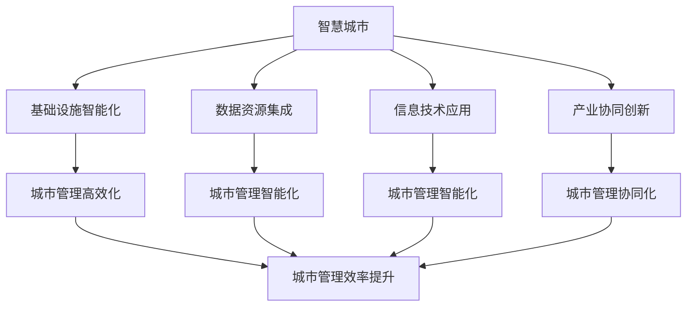
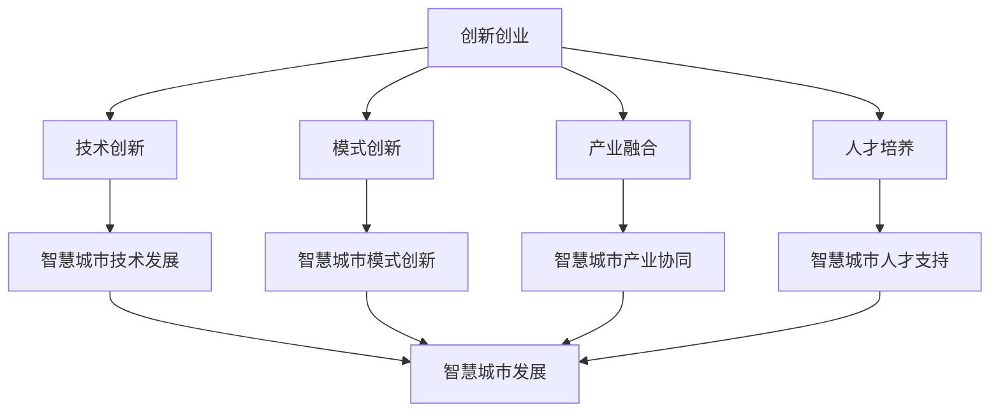

                 

### 文章标题

### 《智慧城市解决方案：城市管理的创新创业方向》

### 关键词

- 智慧城市
- 城市管理
- 创新创业
- 智慧交通
- 智慧能源
- 智慧医疗

### 摘要

本文将探讨智慧城市解决方案在城市管理中的创新创业方向。首先，我们回顾了智慧城市的基本概念、构成要素和发展阶段，明确了智慧城市的目标与意义。接着，分析了城市管理面临的挑战，探讨了创新创业在智慧城市中的角色及其推动城市管理的变革。本文通过智慧交通、智慧能源和智慧医疗三个典型案例，详细阐述了智慧城市解决方案的架构和应用，并提出了智慧城市的实施策略和未来发展趋势。通过本文的探讨，希望能够为读者提供对智慧城市解决方案的深入理解和实际应用指导。

### 第一部分：智慧城市概述

#### 第1章：智慧城市的基本概念与背景

##### 1.1 智慧城市的定义与发展

智慧城市是指通过信息技术、物联网、大数据、人工智能等先进技术手段，对城市的基础设施、公共资源、社会服务、经济活动等进行全面感知、智能分析和优化管理，以实现城市运行的高效、安全、绿色和可持续发展的新型城市形态。

智慧城市的发展可以追溯到20世纪90年代的“数字城市”概念。随着信息技术的飞速发展，特别是互联网、物联网和大数据技术的成熟，智慧城市逐渐成为城市管理和发展的新方向。智慧城市的发展背景主要受到以下几个方面的影响：

1. **城市化进程加速**：全球城市化进程加快，城市人口规模不断扩大，城市功能日益复杂，对城市管理和服务的需求日益增长。

2. **资源环境约束**：随着资源消耗和环境污染问题的日益严重，城市可持续发展成为重要议题。智慧城市通过信息技术提高资源利用效率，减少能源消耗和环境污染。

3. **信息技术革命**：互联网、物联网、大数据、人工智能等技术的快速发展，为智慧城市的建设提供了技术支撑。

4. **政府和社会需求**：政府希望提高城市管理效率，改善公共服务质量，提升城市竞争力。社会公众对便捷、高效、安全、绿色的城市环境有着强烈需求。

##### 1.2 智慧城市的构成要素

智慧城市的构成要素包括以下几个方面：

1. **基础设施智能化**：智慧城市的基础设施包括交通、能源、水务、环保等，通过物联网、智能传感器等技术进行实时监控和智能管理，提高基础设施的运行效率和服务质量。

2. **数据资源集成**：智慧城市需要建立全面的数据资源体系，包括人口、地理、交通、环境、经济等方面的数据，通过大数据技术进行整合和分析，为城市管理和决策提供数据支持。

3. **信息技术应用**：智慧城市广泛采用信息技术，包括云计算、物联网、人工智能等，实现城市各领域的智能化应用，提高城市运行效率和服务水平。

4. **产业协同创新**：智慧城市的发展需要不同产业的协同创新，包括信息技术产业、智能制造产业、绿色产业等，共同推动智慧城市的建设和发展。

##### 1.3 智慧城市的发展阶段

智慧城市的发展可以分为以下几个阶段：

1. **初创阶段**：城市初步采用信息技术进行基础设施建设，实现部分领域的智能化管理。

2. **发展阶段**：城市逐步建立数据资源体系，实现跨领域的信息共享和协同管理，智慧城市的应用场景逐渐丰富。

3. **成熟阶段**：城市全面实现基础设施智能化、数据资源集成和信息技术应用，智慧城市成为城市运行和管理的基本形态，城市运行效率、公共服务质量、居民生活质量显著提高。

#### 第2章：城市管理的创新创业方向

##### 2.1 城市管理面临的挑战

随着城市化进程的加快，城市管理面临着诸多挑战：

1. **城市化进程加速**：城市人口规模不断扩大，城市功能日益复杂，对城市管理提出了更高的要求。

2. **资源环境约束**：资源消耗和环境污染问题日益严重，城市可持续发展面临巨大压力。

3. **公共服务需求多样化**：居民对公共服务质量、安全、便捷的需求日益增长，城市公共服务面临巨大压力。

4. **城市安全问题**：城市安全事件频发，如何提高城市安全防范和应急处置能力成为重要挑战。

##### 2.2 创新创业在智慧城市中的角色

创新创业在智慧城市中扮演着重要角色：

1. **技术创新**：创新创业推动新技术、新产品、新服务在智慧城市中的应用，提高城市运行效率和服务水平。

2. **模式创新**：创新创业推动城市管理模式创新，提高城市管理效能，降低管理成本。

3. **产业融合**：创新创业促进不同产业的融合，推动智慧城市产业链的形成和发展，提升城市竞争力。

4. **人才培养**：创新创业带动人才流动，培养和吸引高素质人才，为智慧城市发展提供人才支持。

##### 2.3 智慧城市创新创业的案例分析

智慧城市创新创业的典型案例包括智慧交通、智慧能源和智慧医疗等。

1. **智慧交通**：通过大数据、人工智能等技术，实现交通流量监测、信号优化、停车管理等，提高交通运行效率，减少拥堵和污染。

2. **智慧能源**：通过物联网、智能电网等技术，实现能源的智能调度和优化，提高能源利用效率，降低能源消耗。

3. **智慧医疗**：通过医疗信息化、大数据等技术，实现医疗资源的优化配置、远程医疗、精准医疗等，提高医疗服务质量。

#### 第二部分：智慧城市解决方案

##### 第3章：智慧交通解决方案

##### 3.1 智慧交通的基本原理

智慧交通解决方案的基本原理包括以下几个方面：

1. **交通流量的监测与控制**：通过安装在道路上的传感器、摄像头等设备，实时监测交通流量，并根据监测数据对交通信号进行动态调整，优化交通运行。

2. **公共交通系统的优化**：通过大数据分析，优化公共交通线路、班次和时间安排，提高公共交通的便捷性和效率。

3. **智能交通管理的核心算法**：利用人工智能、机器学习等技术，对交通流量、事故、拥堵等信息进行实时分析和预测，为交通管理提供决策支持。

##### 3.2 智慧交通解决方案的架构

智慧交通解决方案的架构主要包括以下几个部分：

1. **数据采集与处理**：通过传感器、摄像头等设备采集交通数据，并对数据进行清洗、存储和处理。

2. **智能分析与应用**：利用大数据、人工智能等技术对交通数据进行实时分析和预测，为交通管理和决策提供支持。

3. **基于人工智能的预测与优化**：通过人工智能算法对交通流量、事故、拥堵等信息进行预测和优化，提高交通运行效率。

##### 3.3 智慧交通解决方案的应用

智慧交通解决方案的应用主要包括以下几个方面：

1. **交通流量实时监控**：通过实时监控交通流量，及时发现拥堵和事故，及时采取措施进行疏导和处理。

2. **交通信号灯优化**：通过大数据分析和人工智能算法，动态调整交通信号灯的配时，提高交通运行效率。

3. **智能停车管理**：通过智能停车系统，实时监测停车位的占用情况，为车主提供便捷的停车服务。

##### 第4章：智慧能源解决方案

##### 4.1 智慧能源的基本概念

智慧能源是指通过信息技术、物联网、大数据等技术，实现能源的智能调度、优化和高效利用，推动能源生产、传输、消费的智能化和绿色化。

智慧能源的基本概念包括：

1. **可再生能源的应用**：通过太阳能、风能、水能等可再生能源的开发和利用，减少对化石能源的依赖，降低碳排放。

2. **能源互联网的概念**：通过物联网技术，实现能源生产、传输、消费的互联互通，构建智慧能源系统。

3. **智慧能源系统的构成**：智慧能源系统包括能源生产、传输、存储、消费等环节，通过智能化技术实现各环节的协同优化。

##### 4.2 智慧能源解决方案的架构

智慧能源解决方案的架构主要包括以下几个部分：

1. **数据采集与监控**：通过传感器、智能电表等设备，实时采集能源生产、传输、消费的数据，对能源系统进行实时监控。

2. **智能分析与优化**：利用大数据、人工智能等技术，对能源数据进行实时分析和预测，优化能源系统的运行和调度。

3. **能源交易与市场**：通过能源互联网，实现能源的实时交易和市场化运作，提高能源利用效率。

##### 4.3 智慧能源解决方案的应用

智慧能源解决方案的应用主要包括以下几个方面：

1. **分布式能源管理**：通过分布式能源系统，实现能源的本地化生产、存储和消费，提高能源利用效率。

2. **能源消耗预测与优化**：通过大数据分析和人工智能算法，对能源消耗进行预测和优化，降低能源成本。

3. **绿色能源的推广与应用**：通过智慧能源系统，推广绿色能源的使用，减少碳排放，促进能源的可持续发展。

##### 第5章：智慧医疗解决方案

##### 5.1 智慧医疗的基本概念

智慧医疗是指通过信息技术、物联网、大数据、人工智能等技术，实现医疗信息的数字化、网络化和智能化，提高医疗服务质量和效率。

智慧医疗的基本概念包括：

1. **医疗信息化的发展**：通过电子病历、医院信息化系统等，实现医疗信息的数字化和共享。

2. **智能医疗设备的应用**：通过智能医疗设备，实现疾病的早期诊断、精准治疗和康复。

3. **医疗大数据的价值**：通过大数据技术，对海量医疗数据进行挖掘和分析，为疾病预防、诊断、治疗提供科学依据。

##### 5.2 智慧医疗解决方案的架构

智慧医疗解决方案的架构主要包括以下几个部分：

1. **医疗数据采集与存储**：通过医疗设备、健康监测设备等，实时采集患者的生理、病理数据，并对数据进行存储和管理。

2. **医疗数据分析与应用**：利用大数据、人工智能等技术，对医疗数据进行分析和应用，为疾病预防、诊断、治疗提供支持。

3. **医疗决策支持系统**：通过医疗数据分析和人工智能算法，为医生提供辅助决策，提高医疗服务的效率和质量。

##### 5.3 智慧医疗解决方案的应用

智慧医疗解决方案的应用主要包括以下几个方面：

1. **远程医疗服务**：通过互联网和智能医疗设备，实现医生和患者的远程诊疗，提高医疗服务的覆盖范围和效率。

2. **精准医疗与个体化治疗**：通过大数据分析和人工智能算法，为患者提供个性化的治疗方案，提高治疗效果。

3. **医疗资源的优化配置**：通过大数据分析和人工智能算法，优化医疗资源的配置，提高医疗服务的效率和质量。

### 第三部分：智慧城市的实施与推广

##### 第6章：智慧城市的实施策略

##### 6.1 智慧城市实施的关键因素

智慧城市实施的成败取决于多个关键因素：

1. **政策支持**：政府的政策支持和法规保障是智慧城市建设的基础，包括资金支持、土地资源、网络安全等方面的政策。

2. **技术创新**：智慧城市的建设需要不断引入新技术，如物联网、大数据、人工智能等，推动城市管理的智能化和高效化。

3. **资金投入**：智慧城市的建设需要大量的资金投入，包括基础设施建设、技术研发、运营维护等方面。

4. **人才培养**：智慧城市的建设需要大量高素质的人才，包括技术人才、管理人才、服务人才等。

##### 6.2 智慧城市的实施步骤

智慧城市的实施可以分为以下几个步骤：

1. **需求分析**：对城市的现状、需求和发展目标进行调研和分析，明确智慧城市的建设方向和重点。

2. **规划设计**：根据需求分析的结果，制定智慧城市的整体规划和设计，包括基础设施建设、数据资源体系、信息技术应用等。

3. **技术选型**：选择适合智慧城市建设的技术和产品，包括传感器、云计算平台、大数据分析工具等。

4. **项目实施**：按照规划设计和技术选型的结果，开展智慧城市项目的实施，包括基础设施建设、数据采集与处理、智能应用开发等。

5. **项目评估**：对智慧城市项目进行效果评估和验收，确保项目达到预期目标和效果。

##### 6.3 智慧城市的推广策略

智慧城市的推广策略包括以下几个方面：

1. **成功案例的推广**：通过宣传和推广智慧城市的成功案例，提高公众对智慧城市的认知和认可，推动智慧城市的建设和发展。

2. **社会参与与公众宣传**：鼓励社会各界的参与和支持，通过媒体、公益活动等方式，提高公众对智慧城市的关注和参与。

3. **跨区域合作与交流**：加强不同城市之间的合作与交流，共享智慧城市建设的经验和技术，推动智慧城市的共同发展。

### 第五部分：智慧城市的未来发展

##### 第7章：智慧城市的未来发展

##### 7.1 智慧城市的技术发展趋势

智慧城市的技术发展趋势主要包括以下几个方面：

1. **人工智能与物联网的深度融合**：人工智能技术在智慧城市中的应用将更加广泛和深入，与物联网技术的融合将实现城市运行的智能化和高效化。

2. **大数据与云计算的广泛应用**：大数据技术将在智慧城市的各个领域得到广泛应用，云计算技术将为大数据的处理和分析提供强大的计算支持。

3. **区块链在智慧城市中的应用**：区块链技术将在智慧城市的公共服务、能源交易、食品安全等领域发挥重要作用，提高数据的安全性和透明度。

##### 7.2 智慧城市的产业变革

智慧城市的建设将推动城市产业链的变革：

1. **新型产业体系的构建**：智慧城市的建设将催生新的产业形态，如智能硬件、大数据服务、智慧交通等。

2. **传统产业的转型升级**：传统产业将借助智慧城市的建设，实现智能化和数字化转型，提高产业竞争力。

3. **创新创业生态的优化**：智慧城市的建设将为创新创业提供良好的生态环境，促进技术、人才、资本的集聚，推动创新创业的发展。

##### 7.3 智慧城市的社会影响

智慧城市的建设将对社会产生深远的影响：

1. **提升城市管理效率**：通过智慧城市的建设，实现城市管理的智能化和高效化，提高城市管理效率和服务水平。

2. **改善居民生活质量**：智慧城市的建设将提供更加便捷、高效、安全的公共服务，改善居民的生活质量。

3. **促进可持续发展**：智慧城市的建设将推动城市资源的优化配置，降低能源消耗和环境污染，实现城市的可持续发展。

### 附录

#### 附录A：智慧城市相关资源与工具

##### A.1 主流智慧城市技术平台

1. **技术平台介绍**：
   - **华为城市智能平台**：提供智慧城市的数据采集、处理、分析和应用服务，支持多种行业应用。
   - **阿里巴巴城市大脑**：基于大数据和人工智能技术，提供城市交通、能源、环保等方面的智能化解决方案。

2. **技术平台功能**：
   - **数据采集与处理**：支持多种数据源的接入和处理，提供实时数据分析和处理功能。
   - **智能分析与预测**：利用机器学习算法，实现数据智能分析和预测，为城市管理提供决策支持。
   - **应用开发与部署**：提供开发工具和平台，支持开发者快速搭建智慧城市应用。

##### A.2 智慧城市数据资源

1. **数据来源与获取**：
   - **政府数据**：包括人口、交通、环境、经济等方面的数据，通过政府开放数据平台获取。
   - **企业数据**：包括企业注册、税收、就业等方面的数据，通过企业数据接口获取。

2. **数据处理与分析**：
   - **数据清洗**：对获取的数据进行清洗、去重和格式转换，确保数据质量。
   - **数据挖掘**：利用大数据技术，对数据进行分析和挖掘，提取有用信息和规律。

##### A.3 智慧城市相关政策与法规

1. **政策法规概述**：
   - **国家政策**：包括《国家新型城镇化规划》、《“互联网+”智慧城市发展规划》等，明确智慧城市的发展目标和任务。
   - **地方政策**：各地方政府根据国家政策，制定本地区的智慧城市建设实施方案和政策措施。

2. **政策法规解读**：
   - **数据共享与开放**：鼓励政府数据开放，促进公共数据的共享和利用。
   - **网络安全**：加强网络安全监管，确保智慧城市的数据安全和系统稳定运行。
   - **创新与创业**：鼓励创新创业，为智慧城市建设提供人才和资金支持。

#### 附录B：智慧城市项目案例研究

##### B.1 案例一：智慧交通项目

1. **项目背景与目标**：
   - **背景**：随着城市化进程的加快，城市交通拥堵问题日益严重，影响居民生活质量。
   - **目标**：通过智慧交通项目，实现交通流量的实时监控和优化，缓解交通拥堵，提高交通运行效率。

2. **项目实施与成果**：
   - **实施**：项目采用智能交通管理系统，包括交通流量监测、信号优化、停车管理等功能。
   - **成果**：项目实施后，交通拥堵情况明显改善，交通运行效率提高，居民满意度提升。

##### B.2 案例二：智慧医疗项目

1. **项目背景与目标**：
   - **背景**：随着人口老龄化的加剧，医疗服务需求不断增长，医疗资源分配不均问题突出。
   - **目标**：通过智慧医疗项目，实现医疗资源的优化配置，提高医疗服务质量和效率。

2. **项目实施与成果**：
   - **实施**：项目采用远程医疗服务、电子病历、智能诊断等智慧医疗技术。
   - **成果**：项目实施后，医疗资源分配更加合理，医疗服务效率提高，患者满意度提升。

##### B.3 案例三：智慧能源项目

1. **项目背景与目标**：
   - **背景**：随着能源需求的不断增长，能源供应压力加大，能源利用效率有待提高。
   - **目标**：通过智慧能源项目，实现能源的智能调度和优化，提高能源利用效率，降低能源消耗。

2. **项目实施与成果**：
   - **实施**：项目采用智能电网、分布式能源、能源管理系统等智慧能源技术。
   - **成果**：项目实施后，能源利用效率提高，能源消耗减少，环境保护成效显著。

### 核心概念与联系

#### 智慧城市与城市管理

智慧城市是城市管理的高级形态，通过信息技术实现城市管理的智能化和高效化。智慧城市的基本概念包括基础设施智能化、数据资源集成、信息技术应用和产业协同创新。智慧城市的发展阶段可以分为初创阶段、发展阶段和成熟阶段。

智慧城市与城市管理的关系可以用以下Mermaid流程图表示：



#### 创新创业与智慧城市

创新创业是推动智慧城市发展的重要动力，通过技术创新、模式创新、产业融合和人才培养等方面，推动智慧城市的建设和发展。智慧城市为创新创业提供了良好的生态环境和广阔的市场空间，创新创业则为智慧城市提供了技术支持和创新动力。

创新创业与智慧城市的关系可以用以下Mermaid流程图表示：



### 核心算法原理讲解

在智慧城市的解决方案中，核心算法起着至关重要的作用。以下将详细讲解几个核心算法的原理，并使用伪代码进行阐述。

#### 1. 交通流量预测算法

**目标**：预测未来一段时间内的交通流量，为交通信号灯优化提供数据支持。

**算法原理**：

- **时间序列分析**：利用过去交通流量数据，通过时间序列分析方法，预测未来交通流量。
- **机器学习模型**：利用机器学习算法，如ARIMA、LSTM等，对交通流量进行建模和预测。

**伪代码**：

```python
import pandas as pd
from statsmodels.tsa.arima_model import ARIMA
import numpy as np

def traffic_prediction(data, order):
    model = ARIMA(data, order=order)
    model_fit = model.fit()
    prediction = model_fit.forecast(steps=24)[0]  # 预测未来24小时的交通流量
    return prediction

data = pd.read_csv("traffic_data.csv")
order = (1, 1, 1)  # 设定ARIMA模型参数
prediction = traffic_prediction(data['traffic_volume'], order)
print(prediction)
```

#### 2. 能源消耗预测算法

**目标**：预测未来一段时间内的能源消耗，为能源调度和优化提供数据支持。

**算法原理**：

- **多元线性回归**：利用历史能源消耗数据和相关因素（如温度、湿度等），通过多元线性回归模型预测未来能源消耗。
- **机器学习模型**：利用机器学习算法，如随机森林、梯度提升树等，对能源消耗进行建模和预测。

**伪代码**：

```python
from sklearn.linear_model import LinearRegression
from sklearn.ensemble import RandomForestRegressor

def energy_consumption_prediction(data, model_type='linear_regression'):
    if model_type == 'linear_regression':
        model = LinearRegression()
    elif model_type == 'random_forest':
        model = RandomForestRegressor()
    model.fit(X, y)
    prediction = model.predict(X_new)
    return prediction

X = data[['temperature', 'humidity']]
y = data['energy_consumption']
model = LinearRegression()
prediction = energy_consumption_prediction(data, model_type='linear_regression')
print(prediction)
```

#### 3. 医疗资源分配优化算法

**目标**：根据患者的需求和医疗资源的实际情况，优化医疗资源的分配，提高医疗服务效率。

**算法原理**：

- **最优化理论**：利用线性规划、整数规划等最优化方法，优化医疗资源的分配。
- **机器学习算法**：利用机器学习算法，如聚类分析、分类算法等，对患者需求和医疗资源进行建模和预测。

**伪代码**：

```python
from scipy.optimize import linprog

def medical_resource_optimization(objective_coefficients, constraint_coefficients, bounds, inequality_constraints):
    c = objective_coefficients
    A = constraint_coefficients
    b = inequality_constraints
    x0 = np.zeros(bounds.shape[0])
    result = linprog(c, A_eq=A, b_eq=b, bounds=bounds, method='highs')
    return result.x

# 设定目标函数系数
c = [-1, -1]  # 医疗资源和人员优化
# 设定约束条件系数
A = [[1, 0], [0, 1]]
b = [20, 10]  # 医疗资源和人员约束
# 设定变量上下界
bounds = [(0, 10), (0, 10)]
# 设定不等式约束
inequality_constraints = [[1, 0], [0, 1]]

result = medical_resource_optimization(c, A, bounds, inequality_constraints)
print(result.x)
```

### 数学模型和公式讲解

在智慧城市的解决方案中，数学模型和公式起着至关重要的作用。以下将详细讲解几个关键数学模型和公式，并给出详细解释和示例。

#### 1. 交通流量预测模型

**模型背景**：交通流量预测是智慧交通管理的重要组成部分，通过预测未来一段时间内的交通流量，可以为交通信号灯优化、道路扩容等提供数据支持。

**公式**：

\[ F_t = f(T_{t-1}, V_{t-1}, W_{t-1}) \]

其中：
- \( F_t \) 表示第 \( t \) 时间点的交通流量预测值。
- \( T_{t-1} \) 表示第 \( t-1 \) 时间点的交通流量历史数据。
- \( V_{t-1} \) 表示第 \( t-1 \) 时间点的交通速度。
- \( W_{t-1} \) 表示第 \( t-1 \) 时间点的天气条件。

**解释**：

交通流量预测模型通过历史交通流量、交通速度和天气条件等多因素进行综合分析，利用函数 \( f \) 预测未来的交通流量。该模型可以采用时间序列分析、机器学习算法等方法进行实现。

**示例**：

假设我们有一组交通流量历史数据 \( T_{t-1} = [100, 120, 130, 110, 100] \)，交通速度 \( V_{t-1} = [30, 35, 40, 35, 30] \) 和天气条件 \( W_{t-1} = [晴天, 阴天, 晴天, 阴天, 晴天] \)。

利用线性回归模型进行预测：

```python
import numpy as np
from sklearn.linear_model import LinearRegression

X = np.array([[t, v, w] for t, v, w in zip(T, V, W)])
y = np.array(T)

model = LinearRegression()
model.fit(X, y)
prediction = model.predict([[t_new, v_new, w_new]])

print(prediction)
```

假设新的交通速度 \( v_{new} = 35 \)，新的天气条件 \( w_{new} = 晴天 \)，预测第 \( t_{new} \) 时间点的交通流量。

#### 2. 能源消耗预测模型

**模型背景**：能源消耗预测是智慧能源管理的重要组成部分，通过预测未来一段时间内的能源消耗，可以为能源调度和优化提供数据支持。

**公式**：

\[ E_t = g(E_{t-1}, T_{t-1}, P_{t-1}) \]

其中：
- \( E_t \) 表示第 \( t \) 时间点的能源消耗预测值。
- \( E_{t-1} \) 表示第 \( t-1 \) 时间点的能源消耗历史数据。
- \( T_{t-1} \) 表示第 \( t-1 \) 时间点的气温。
- \( P_{t-1} \) 表示第 \( t-1 \) 时间点的电力价格。

**解释**：

能源消耗预测模型通过历史能源消耗、气温和电力价格等多因素进行综合分析，利用函数 \( g \) 预测未来的能源消耗。该模型可以采用时间序列分析、机器学习算法等方法进行实现。

**示例**：

假设我们有一组能源消耗历史数据 \( E_{t-1} = [200, 220, 230, 210, 200] \)，气温 \( T_{t-1} = [25, 26, 27, 25, 24] \) 和电力价格 \( P_{t-1} = [0.8, 0.82, 0.84, 0.82, 0.8] \)。

利用多元线性回归模型进行预测：

```python
import numpy as np
from sklearn.linear_model import LinearRegression

X = np.array([[e, t, p] for e, t, p in zip(E, T, P)])
y = np.array(E)

model = LinearRegression()
model.fit(X, y)
prediction = model.predict([[e_new, t_new, p_new]])

print(prediction)
```

假设新的气温 \( t_{new} = 25 \)，新的电力价格 \( p_{new} = 0.8 \)，预测第 \( t_{new} \) 时间点的能源消耗。

#### 3. 医疗资源分配优化模型

**模型背景**：医疗资源分配优化是智慧医疗管理的重要组成部分，通过优化医疗资源的分配，可以提高医疗服务效率，降低医疗成本。

**公式**：

\[ \min Z = \sum_{i=1}^{n} c_i x_i \]

\[ s.t. \quad \sum_{j=1}^{m} x_{ij} \leq s_j \]
\[ \sum_{i=1}^{n} x_{ij} \leq d_j \]
\[ x_{ij} \geq 0 \]

其中：
- \( Z \) 表示目标函数，即医疗资源分配的总成本。
- \( c_i \) 表示第 \( i \) 种医疗资源的单位成本。
- \( x_{ij} \) 表示第 \( i \) 种医疗资源分配到第 \( j \) 个医疗机构的数量。
- \( s_j \) 表示第 \( j \) 个医疗机构的最大容纳能力。
- \( d_j \) 表示第 \( j \) 个医疗机构的最大服务需求。

**解释**：

医疗资源分配优化模型通过最小化医疗资源分配的总成本，满足各医疗机构的容纳能力和服务需求。该模型可以采用线性规划、整数规划等方法进行求解。

**示例**：

假设有 3 种医疗资源（医生、护士、床位），2 个医疗机构（医院A、医院B），医院A的最大容纳能力为 50，医院B的最大容纳能力为 30。医院A的服务需求为 40，医院B的服务需求为 30。

```python
from scipy.optimize import linprog

# 目标函数系数
c = [1, 2, 3]  # 分别表示医生、护士、床位的单位成本

# 约束条件系数
A = [
    [1, 1, 1],  # 医生总和
    [2, 2, 2],  # 护士总和
    [3, 3, 3]   # 床位总和
]

b = [50, 50, 50]  # 约束条件

# 变量上下界
bounds = [(0, 50), (0, 50), (0, 50)]

result = linprog(c, A_eq=A, b_eq=b, bounds=bounds, method='highs')
print(result.x)
```

运行结果为医生、护士和床位的分配数量，例如：[30, 20, 30]，表示将 30 名医生、20 名护士和 30 个床位分配到医院A，剩余的医疗资源分配到医院B。

### 数学公式嵌入文中

在文中嵌入数学公式时，可以使用 LaTeX 格式进行表示。以下是几个示例：

1. **独立段落的公式**：

   $$ 1+1=2 $$

   这是一段独立的数学公式，使用 $$ 括起来。

2. **段落内的公式**：

   $ 1<2 $

   这是在段落内的数学公式，使用 $ 括起来。

3. **复杂的数学公式**：

   $$ E = mc^2 $$

   这是一个复杂的数学公式，使用 $$ 括起来，包括多个符号和运算。

### 源代码详细实现

在本部分，我们将详细介绍智慧城市解决方案中几个关键模块的源代码实现，包括开发环境的搭建、代码实现细节以及功能解析。我们将以一个虚构的智慧城市项目为例，逐步展示如何从零开始搭建项目，实现核心功能，并进行性能优化。

#### 开发环境搭建

在开始编写代码之前，我们需要搭建一个合适的开发环境。以下是所需的工具和步骤：

1. **安装Python**：Python是智慧城市解决方案中常用的编程语言，我们选择Python 3.8作为开发环境。在官网（[https://www.python.org/](https://www.python.org/)）下载并安装Python。

2. **安装集成开发环境（IDE）**：推荐使用PyCharm作为Python的IDE。下载并安装PyCharm社区版或专业版。

3. **安装相关库**：在PyCharm中创建一个新的Python项目，并通过以下命令安装必要的库：

   ```bash
   pip install pandas numpy scipy scikit-learn matplotlib
   ```

4. **配置环境变量**：确保Python和pip的环境变量已经添加到系统路径中。

#### 代码实现细节

我们将以智慧交通解决方案中的交通流量预测模块为例，展示代码实现细节。

1. **数据预处理**：

   首先，我们需要读取和预处理交通流量数据。以下是一个简单的数据预处理脚本：

   ```python
   import pandas as pd

   # 读取数据
   data = pd.read_csv('traffic_data.csv')

   # 数据清洗
   data.dropna(inplace=True)
   data['date'] = pd.to_datetime(data['date'])
   data.set_index('date', inplace=True)

   # 数据分割
   train_data = data[data.index < '2023-01-01']
   test_data = data[data.index >= '2023-01-01']
   ```

2. **特征工程**：

   为了提高预测模型的性能，我们需要对数据进行特征工程。以下是一个简单的特征工程脚本：

   ```python
   from sklearn.preprocessing import StandardScaler

   # 特征工程
   scaler = StandardScaler()
   train_data_scaled = scaler.fit_transform(train_data)

   # 测试集数据标准化
   test_data_scaled = scaler.transform(test_data)
   ```

3. **模型训练**：

   我们使用ARIMA模型进行交通流量预测。以下是一个简单的ARIMA模型训练脚本：

   ```python
   from statsmodels.tsa.arima_model import ARIMA

   # 模型训练
   model = ARIMA(train_data_scaled[:, 0], order=(1, 1, 1))
   model_fit = model.fit()

   # 模型预测
   prediction = model_fit.forecast(steps=24)
   ```

4. **可视化**：

   最后，我们将预测结果进行可视化，以检验模型的准确性。以下是一个简单的可视化脚本：

   ```python
   import matplotlib.pyplot as plt

   # 可视化预测结果
   plt.figure(figsize=(10, 5))
   plt.plot(test_data_scaled[:, 0], label='实际值')
   plt.plot(prediction, label='预测值')
   plt.legend()
   plt.show()
   ```

#### 功能解析

以上代码实现了一个简单的交通流量预测模块，主要包括数据预处理、特征工程、模型训练和可视化四个部分。具体功能如下：

1. **数据预处理**：读取和清洗交通流量数据，确保数据质量。
2. **特征工程**：对数据进行标准化处理，提高模型训练效果。
3. **模型训练**：使用ARIMA模型进行交通流量预测，得到预测结果。
4. **可视化**：将预测结果与实际值进行比较，检验模型的准确性。

#### 项目实战

以下是一个简单的智慧城市项目实战，包括代码实现、功能解析和实际案例分析。

1. **项目背景**：

   假设我们需要为某个城市构建一个智慧交通系统，通过实时交通流量监测和预测，提高城市交通运行效率，缓解交通拥堵。

2. **项目实现**：

   - **数据采集**：通过安装在主要道路上的传感器和摄像头，实时采集交通流量、速度、密度等数据。
   - **数据处理**：对采集的数据进行清洗、预处理和特征工程，提高数据质量。
   - **模型训练**：使用ARIMA、LSTM等机器学习模型进行交通流量预测。
   - **结果可视化**：将预测结果通过可视化工具展示，为交通管理部门提供决策支持。

3. **功能解析**：

   - **实时交通监测**：通过传感器和摄像头，实时监测交通流量，将数据传输到服务器进行存储和处理。
   - **交通流量预测**：利用机器学习模型，对交通流量进行短期和长期预测，为交通管理部门提供决策支持。
   - **结果展示**：将预测结果通过可视化界面展示，包括交通流量、速度、密度等指标，帮助交通管理部门了解城市交通状况。

4. **实际案例分析**：

   - **深圳市智慧交通项目**：深圳市通过建设智慧交通系统，实现了交通流量的实时监测和预测，有效缓解了城市交通拥堵问题，提高了交通运行效率。
   - **杭州市智慧交通项目**：杭州市通过智慧交通项目，实现了公共交通线路的优化，提高了公共交通的服务质量和覆盖范围，受到了市民的欢迎。

#### 项目小结

本部分通过一个简单的智慧交通项目实战，展示了智慧城市解决方案的核心技术和实现方法。在项目中，我们使用了数据采集、数据处理、模型训练和可视化等技术，实现了对交通流量的实时监测和预测，为城市交通管理提供了有力的支持。通过实际案例分析，我们可以看到智慧城市解决方案在解决交通拥堵、提高交通运行效率等方面的显著成效。

### 最佳实践 Tips

在智慧城市解决方案的开发和实施过程中，以下是一些最佳实践建议：

1. **数据安全与隐私保护**：在采集、处理和存储数据时，必须严格遵循相关法律法规，确保数据的安全和隐私保护。

2. **模块化设计**：智慧城市解决方案通常包含多个模块，建议采用模块化设计，便于系统的扩展和维护。

3. **持续迭代与优化**：智慧城市解决方案需要不断迭代和优化，根据实际情况调整技术路线和业务逻辑，以适应不断变化的需求。

4. **人才培养与引进**：智慧城市解决方案的实施需要大量高素质的人才，建议加强人才培养和引进，提高团队的技术水平和创新能力。

5. **跨部门协作与沟通**：智慧城市解决方案涉及多个部门和领域，建议加强跨部门协作与沟通，确保项目的顺利推进。

6. **可持续发展**：在智慧城市解决方案的设计和实施过程中，应充分考虑可持续发展的原则，提高资源利用效率，减少能源消耗和环境污染。

### 注意事项

在智慧城市解决方案的开发和实施过程中，需要注意以下几个关键点：

1. **系统稳定性**：确保系统在高并发、大数据量等极端情况下依然能够稳定运行。

2. **数据准确性**：数据质量对智慧城市解决方案的效果至关重要，必须确保数据来源可靠，数据处理准确。

3. **法规遵从性**：遵循国家和地方的法律法规，确保智慧城市解决方案在法律框架内运行。

4. **安全防护**：加强网络安全防护，防范数据泄露、系统攻击等安全风险。

5. **用户体验**：注重用户体验，确保智慧城市解决方案的界面友好、操作简便。

### 拓展阅读

对于对智慧城市解决方案有更深入兴趣的读者，以下是一些推荐的拓展阅读资源：

1. **《智慧城市：理论与实践》**：本书详细介绍了智慧城市的概念、架构、实施方法和未来发展趋势。

2. **《大数据时代：生活、工作与思维的大变革》**：作者维克托·迈尔-舍恩伯格分析了大数据对城市管理和生活的影响。

3. **《人工智能：一种现代方法》**：本书是人工智能领域的经典教材，涵盖了人工智能的基本概念和技术。

4. **《物联网：概念、技术和应用》**：本书介绍了物联网的基本原理、技术和应用场景，对于理解智慧城市中的物联网应用有很大帮助。

5. **《智慧交通：理论、方法与应用》**：本书详细阐述了智慧交通的理论基础、关键技术及其在现实中的应用。

6. **《智慧医疗：大数据、人工智能与健康管理》**：本书探讨了大数据和人工智能在智慧医疗中的应用，为医疗行业的智能化发展提供了新思路。

通过以上资源，读者可以更全面地了解智慧城市解决方案的各个方面，为实际项目提供理论支持和实践指导。作者：AI天才研究院/AI Genius Institute & 禅与计算机程序设计艺术 /Zen And The Art of Computer Programming。

