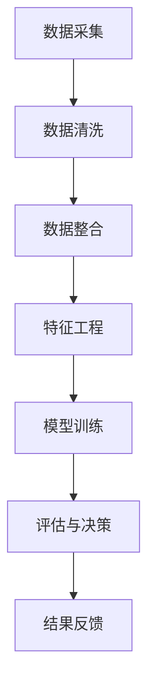
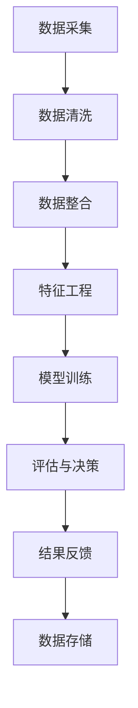

                 

### 文章标题

# 《智能供应商评估系统：小型电商优化采购决策的多维度分析工具》

### 关键词

- 智能供应商评估
- 小型电商
- 采购决策
- 多维度分析
- 数据挖掘
- 风险评估
- 数学模型

### 摘要

本文旨在探讨智能供应商评估系统在小型电商优化采购决策中的应用。通过详细分析系统的核心概念、架构设计、核心算法与数学模型，本文旨在为小型电商企业提供一种高效、全面的供应商评估工具。文章从背景介绍、核心概念与联系、算法原理讲解、项目实战与案例分析等多个维度，深入剖析了智能供应商评估系统的实现与应用。通过本文的阅读，读者将能够理解智能供应商评估系统的基本原理，掌握关键算法与模型，并能够将其应用于实际项目中，从而提高采购决策的准确性和效率。

## 《智能供应商评估系统：小型电商优化采购决策的多维度分析工具》目录大纲

### 第一部分：引言与概述

#### 第1章：智能供应商评估系统概述

1.1.1 小型电商与采购决策的挑战

1.1.2 智能供应商评估系统的背景和重要性

1.1.3 书籍目的与读者对象

1.1.4 结构安排与学习方法

### 第二部分：核心概念与架构

#### 第2章：智能供应商评估系统的核心概念

2.1.1 供应商评估的基本原则

2.1.2 关键性能指标（KPI）的定义与选择

2.1.3 数据来源与数据质量

2.1.4 Mermaid流程图：供应商评估系统架构概览

#### 第3章：智能供应商评估系统的架构设计

3.1.1 系统需求分析与设计原则

3.1.2 系统的模块划分与功能实现

3.1.3 数据处理与存储架构

3.1.4 Mermaid流程图：系统工作流程详解

### 第三部分：核心算法与数学模型

#### 第4章：数据挖掘与特征工程

4.1.1 数据预处理技术

4.1.2 关联规则挖掘算法

4.1.3 特征选择与降维

4.1.4 伪代码：常见特征工程方法

#### 第5章：多维度供应商评估模型

5.1.1 数学模型：供应商评估指标体系

5.1.2 数学公式：
\[ \text{供应商评分} = w_1 \times \text{成本评分} + w_2 \times \text{质量评分} + \ldots \]

5.1.3 模型训练与优化

5.1.4 伪代码：供应商评分计算方法

#### 第6章：风险评估与决策支持

6.1.1 风险评估指标与方法

6.1.2 数学模型：风险评估与决策模型

6.1.3 伪代码：风险评估与决策支持算法

### 第四部分：项目实战与案例分析

#### 第7章：智能供应商评估系统实现

7.1.1 开发环境搭建

7.1.2 系统模块设计与实现

7.1.3 数据采集与预处理

7.1.4 代码解读与分析

#### 第8章：案例分析与应用效果评估

8.1.1 案例选择与背景介绍

8.1.2 案例实施过程

8.1.3 应用效果评估与改进建议

8.1.4 案例代码分析与解读

### 第五部分：未来展望与扩展

#### 第9章：智能供应商评估系统的未来发展趋势

9.1.1 技术发展趋势分析

9.1.2 潜在扩展方向

9.1.3 未来应用场景展望

#### 第10章：总结与展望

10.1.1 全书总结

10.1.2 对读者的建议

10.1.3 后续研究与实践方向

### 附录

#### 附录A：技术资源与工具

A.1 数据挖掘与机器学习工具简介

A.2 智能供应商评估系统开发所需软件与库

A.3 实践项目资源与代码示例

A.4 进一步学习资源推荐

---

### 第一部分：引言与概述

#### 第1章：智能供应商评估系统概述

在当今快速发展的电子商务环境中，小型电商企业面临着越来越大的市场竞争压力。如何有效地进行采购决策，选择可靠的供应商，已成为企业能否持续发展的关键。传统的采购决策主要依赖于经验判断，存在许多不可量化和主观因素，导致决策过程不够科学和高效。因此，构建一个智能化的供应商评估系统，通过数据分析和人工智能技术，为采购决策提供客观、全面的参考，成为了一项紧迫的需求。

1.1.1 小型电商与采购决策的挑战

小型电商企业在采购决策中面临的挑战主要包括以下几个方面：

- **数据多样性**：小型电商企业通常涉及多种产品类型，供应商来源广泛，数据形式多样，包括价格、质量、交货时间、服务等多种维度。
- **信息不对称**：小型电商企业往往难以获取全面、准确的供应商信息，缺乏对市场动态和供应商表现的实时监控。
- **决策时效性**：电商行业竞争激烈，采购决策需要快速响应市场变化，传统评估方法效率较低，难以满足时效性要求。
- **风险评估**：采购过程中可能存在各种风险，如供应商不守约、质量不稳定等，企业需要建立有效的风险评估机制。

1.1.2 智能供应商评估系统的背景和重要性

智能供应商评估系统是一种基于大数据分析和人工智能技术的解决方案，旨在帮助小型电商企业克服上述挑战。系统通过以下方式提升采购决策的科学性和效率：

- **数据整合与分析**：系统可以整合来自多个维度的供应商数据，通过数据挖掘技术发现潜在的商业规律和供应商绩效差异。
- **量化评估指标**：系统采用多维度评估指标，将主观判断转化为量化评分，提高评估的客观性和一致性。
- **实时监控与预警**：系统可以实时监控供应商的表现，及时发现问题并进行预警，帮助企业快速调整采购策略。
- **风险评估与决策支持**：系统通过风险评估模型，预测供应商的风险水平，为决策者提供数据支持，降低采购风险。

1.1.3 书籍目的与读者对象

本书旨在为小型电商企业及相关从业者提供一套系统、实用的智能供应商评估解决方案。通过详细分析智能供应商评估系统的核心概念、架构设计、核心算法与数学模型，本书旨在：

- **介绍智能供应商评估系统的基本原理和架构**，帮助读者理解系统的运作机制。
- **讲解关键算法和数学模型**，让读者掌握如何通过数据分析和模型训练优化供应商评估。
- **提供项目实战与案例分析**，通过具体案例展示系统的应用效果和实施过程。

读者对象包括：

- **电商企业采购管理人员**：了解智能供应商评估系统，提升采购决策的科学性和效率。
- **数据分析师和人工智能从业者**：掌握智能供应商评估系统的技术实现，应用于实际工作中。
- **高校师生**：作为教材或参考书籍，学习智能供应商评估系统的理论知识和应用实践。

1.1.4 结构安排与学习方法

本书分为五个部分，共十章，结构安排如下：

- **第一部分：引言与概述**：介绍智能供应商评估系统的背景、目的和结构。
- **第二部分：核心概念与架构**：讲解智能供应商评估系统的核心概念和架构设计。
- **第三部分：核心算法与数学模型**：介绍系统中的关键算法和数学模型。
- **第四部分：项目实战与案例分析**：通过实际案例展示系统的应用效果。
- **第五部分：未来展望与扩展**：探讨智能供应商评估系统的未来发展。

学习方法建议：

- **系统学习**：按照章节顺序逐步学习，理解每个部分的核心概念和技术细节。
- **实践操作**：结合实际案例，动手实现智能供应商评估系统的关键模块。
- **反思与总结**：在学习过程中不断反思，总结经验教训，提升实际应用能力。

通过本书的学习，读者将能够全面了解智能供应商评估系统，掌握关键技术和方法，并将其应用于实际工作中，为企业采购决策提供有力支持。

---

在了解了智能供应商评估系统的背景和重要性之后，接下来我们将深入探讨其核心概念、架构设计以及具体实现方法。通过这些内容的学习，读者将能够系统地理解智能供应商评估系统的工作原理，为其在实际项目中的应用奠定基础。

#### 第2章：智能供应商评估系统的核心概念

智能供应商评估系统的核心概念涵盖了供应商评估的基本原则、关键性能指标（KPI）的定义与选择、数据来源与数据质量等多个方面。这些概念构成了系统的理论基础，是智能评估系统实现科学、高效评估的重要保障。

2.1.1 供应商评估的基本原则

供应商评估是企业在选择供应商时，通过一系列标准和方法对供应商的绩效进行评价和比较的过程。在建立智能供应商评估系统时，需要遵循以下基本原则：

- **客观性**：评估结果应尽可能减少主观因素的影响，采用量化指标和客观数据，提高评估的公正性和一致性。
- **全面性**：评估应覆盖供应商的多个维度，包括成本、质量、交货时间、服务等方面，全面反映供应商的综合表现。
- **动态性**：评估过程应具备动态调整能力，能够根据市场变化和企业需求，实时更新和优化评估指标和模型。
- **可操作性**：评估系统应具备良好的操作性和可扩展性，能够适应企业规模和业务模式的变化，方便用户使用和维护。

2.1.2 关键性能指标（KPI）的定义与选择

关键性能指标（KPI）是供应商评估的核心要素，用于衡量供应商在不同维度上的表现。常见的KPI包括以下几种：

- **成本**：供应商提供的商品或服务的价格，是企业采购决策的重要考虑因素。成本KPI可以包括单位成本、总成本、折扣率等。
- **质量**：供应商提供的商品或服务的质量水平，直接关系到企业的品牌形象和客户满意度。质量KPI可以包括返修率、投诉率、一次交货合格率等。
- **交货时间**：供应商按时交付商品或服务的能力，影响企业的生产计划和供应链稳定性。交货时间KPI可以包括交货准时率、平均交货周期等。
- **服务**：供应商提供的售后服务质量，包括响应速度、问题解决能力等。服务KPI可以包括售后服务满意度、问题解决率等。

在选择KPI时，企业需要根据自身的业务特点、市场需求和供应商实际情况，进行综合评估和优化。以下是一些选择KPI时的注意事项：

- **重要性**：优先选择对企业业务和决策影响较大的KPI，确保评估重点突出。
- **可操作性**：KPI应具有明确的衡量标准和方法，便于数据采集和计算。
- **数据可获得性**：确保所选KPI的数据能够准确、及时地获取，避免因数据缺失影响评估效果。
- **稳定性**：选择具有稳定性和长期性的KPI，避免因短期波动导致评估结果失真。

2.1.3 数据来源与数据质量

智能供应商评估系统的核心在于数据，数据来源和数据质量直接影响评估结果的准确性和可靠性。数据来源主要包括以下几个方面：

- **内部数据**：企业自身采购、销售、库存等业务系统产生的数据，如采购订单、销售记录、库存数据等。
- **外部数据**：从第三方数据源获取的数据，如市场调研数据、行业报告、供应商公开信息等。
- **供应商数据**：供应商提供的自身绩效数据，包括质量报告、交货记录、服务反馈等。

在确保数据来源的多样性同时，还需重视数据质量：

- **准确性**：数据应真实、可靠，避免因数据错误导致评估结果偏差。
- **完整性**：数据应覆盖评估所需的全部维度，避免因数据缺失影响评估的全面性。
- **及时性**：数据应能实时更新，确保评估结果反映当前市场和企业需求。
- **一致性**：数据应具有一致性和可比性，避免因数据格式或计量单位差异影响评估结果。

为了确保数据质量，企业可以采取以下措施：

- **数据清洗**：对原始数据进行清洗，去除错误、重复和无关数据，提高数据的准确性和完整性。
- **数据标准化**：统一数据格式和计量单位，确保数据的一致性和可比性。
- **数据监控**：建立数据监控机制，定期检查数据质量和完整性，及时发现问题并处理。

2.1.4 Mermaid流程图：供应商评估系统架构概览

为了更清晰地展示智能供应商评估系统的整体架构，我们可以使用Mermaid流程图对系统的关键环节进行描述。以下是一个简单的示例：



这个流程图展示了智能供应商评估系统的基本工作流程，从数据采集开始，经过数据清洗、整合、特征工程，最终通过模型训练和评估，生成供应商评分和决策结果。结果反馈环节则用于优化系统性能和调整评估策略。

通过上述对智能供应商评估系统核心概念的分析，读者可以初步了解系统的构成和运作原理。接下来，我们将进一步探讨系统的架构设计，理解其各组成部分如何协同工作，以实现高效的供应商评估。

#### 第3章：智能供应商评估系统的架构设计

智能供应商评估系统的架构设计是确保系统能够高效、稳定运行的关键。一个合理的架构设计不仅要满足功能需求，还要具备良好的扩展性和可维护性。本节将详细讨论系统需求分析、模块划分与功能实现、数据处理与存储架构，并通过Mermaid流程图展示系统工作流程。

3.1.1 系统需求分析与设计原则

在进行系统设计之前，首先要进行系统需求分析。系统需求分析主要包括功能需求和非功能需求。

- **功能需求**：功能需求描述系统需要实现的具体功能，包括数据采集、数据清洗、数据整合、特征工程、模型训练、评估与决策、结果反馈等。
- **非功能需求**：非功能需求包括系统的性能要求、可靠性要求、安全性要求、可维护性要求等。

在系统需求分析的基础上，设计原则如下：

- **模块化设计**：将系统划分为多个模块，每个模块负责不同的功能，提高系统的可维护性和扩展性。
- **可扩展性**：系统设计应考虑未来的业务扩展和需求变化，确保系统能够灵活调整和扩展。
- **高可用性**：系统应具备高可用性，确保数据的安全性和系统的稳定性，减少故障和中断。
- **可维护性**：系统设计应遵循良好的编程规范和架构设计原则，提高代码的可读性和可维护性。

3.1.2 系统的模块划分与功能实现

智能供应商评估系统可以划分为以下几个模块：

- **数据采集模块**：负责从不同数据源（如企业内部业务系统、第三方数据源、供应商提供的数据）收集所需数据。
- **数据清洗模块**：负责对采集到的原始数据进行清洗，去除错误、重复和无关数据，保证数据质量。
- **数据整合模块**：负责将清洗后的数据进行整合，确保数据的一致性和完整性。
- **特征工程模块**：负责对整合后的数据进行特征提取和选择，构建适用于评估的指标体系。
- **模型训练模块**：负责训练供应商评估模型，通过历史数据训练模型，并优化模型参数。
- **评估与决策模块**：负责使用训练好的模型对供应商进行评估，生成评分和决策结果。
- **结果反馈模块**：负责将评估结果反馈给企业决策者，并提供优化建议。

各模块的功能实现如下：

- **数据采集模块**：实现数据采集功能的代码可能包括以下步骤：
  ```python
  # 伪代码：数据采集模块实现
  def collect_data():
      data_source1 = fetch_data_from_source1()
      data_source2 = fetch_data_from_source2()
      data_source3 = fetch_data_from_supplier()
      return data_source1 + data_source2 + data_source3
  ```

- **数据清洗模块**：实现数据清洗功能的代码可能包括以下步骤：
  ```python
  # 伪代码：数据清洗模块实现
  def clean_data(data):
      cleaned_data = []
      for record in data:
          if is_valid_record(record):
              cleaned_data.append(record)
      return cleaned_data
  ```

- **数据整合模块**：实现数据整合功能的代码可能包括以下步骤：
  ```python
  # 伪代码：数据整合模块实现
  def integrate_data(data1, data2, data3):
      integrated_data = merge_data(data1, data2, data3)
      return integrated_data
  ```

- **特征工程模块**：实现特征工程功能的代码可能包括以下步骤：
  ```python
  # 伪代码：特征工程模块实现
  def feature_engineering(data):
      features = extract_features(data)
      selected_features = select_features(features)
      return selected_features
  ```

- **模型训练模块**：实现模型训练功能的代码可能包括以下步骤：
  ```python
  # 伪代码：模型训练模块实现
  def train_model(training_data, model_type):
      model = create_model(model_type)
      model.fit(training_data)
      return model
  ```

- **评估与决策模块**：实现评估与决策功能的代码可能包括以下步骤：
  ```python
  # 伪代码：评估与决策模块实现
  def evaluate_suppliers(suppliers, model):
      scores = model.predict(suppliers)
      return scores
  ```

- **结果反馈模块**：实现结果反馈功能的代码可能包括以下步骤：
  ```python
  # 伪代码：结果反馈模块实现
  def feedback_results(scores):
      print("Supplier Scores:", scores)
      provide_recommendations(scores)
  ```

3.1.3 数据处理与存储架构

智能供应商评估系统的数据处理与存储架构设计应确保数据的高效处理和存储，以下是一个简化的架构设计：

- **数据存储**：采用关系型数据库（如MySQL）或NoSQL数据库（如MongoDB）进行数据存储。数据库设计应考虑数据的一致性、可靠性和可扩展性。
- **数据处理**：采用分布式计算框架（如Hadoop或Spark）进行数据处理，确保大数据量的高效处理能力。
- **数据流向**：数据从采集模块进入系统后，经过清洗、整合和特征工程处理，最终存储到数据库中。评估与决策模块从数据库中读取数据，进行模型训练和评估，并将结果存储回数据库。

3.1.4 Mermaid流程图：系统工作流程详解

为了更直观地展示系统的工作流程，我们可以使用Mermaid流程图描述系统的各个模块及其交互关系：



在这个流程图中，A表示数据采集模块，B表示数据清洗模块，C表示数据整合模块，D表示特征工程模块，E表示模型训练模块，F表示评估与决策模块，G表示结果反馈模块，H表示数据存储模块。各模块之间的箭头表示数据流向和依赖关系。

通过上述对智能供应商评估系统架构设计的详细讨论，读者可以全面了解系统的模块划分、功能实现和数据处理流程。接下来，我们将深入探讨系统的核心算法与数学模型，进一步理解智能评估系统的原理和实现方法。

#### 第4章：数据挖掘与特征工程

数据挖掘与特征工程是智能供应商评估系统的核心环节，它们决定了评估结果的准确性和可靠性。本节将详细探讨数据挖掘的基本概念、关联规则挖掘算法、特征选择与降维技术，并提供相关的伪代码，以便读者理解和实现。

4.1.1 数据预处理技术

数据预处理是数据挖掘过程中至关重要的一步，它包括数据清洗、数据转换和数据集成等操作。以下是数据预处理的一些基本步骤：

- **数据清洗**：去除重复数据、纠正错误数据、填补缺失数据等。
  ```python
  # 伪代码：数据清洗
  def clean_data(data):
      cleaned_data = []
      for record in data:
          if is_valid_record(record):
              cleaned_data.append(record)
      return cleaned_data
  ```

- **数据转换**：将不同格式和单位的数据转换为统一的格式和单位，便于后续处理。
  ```python
  # 伪代码：数据转换
  def convert_data(data):
      converted_data = []
      for record in data:
          converted_record = convert_units(record)
          converted_data.append(converted_record)
      return converted_data
  ```

- **数据集成**：将来自不同数据源的数据进行整合，确保数据的一致性和完整性。
  ```python
  # 伪代码：数据集成
  def integrate_data(data1, data2):
      integrated_data = merge_data(data1, data2)
      return integrated_data
  ```

4.1.2 关联规则挖掘算法

关联规则挖掘是一种常用的数据挖掘技术，用于发现数据项之间的潜在关联关系。它通常用于市场篮子分析、推荐系统等领域。Apriori算法是关联规则挖掘的一种经典算法。

- **Apriori算法的基本思想**：

  1. 扫描数据库，找出所有单项集的支持度，如果支持度大于最小支持度阈值，则将其作为频繁项集。
  2. 利用频繁项集生成候选频繁项集，并计算候选频繁项集的支持度。
  3. 去除支持度低于最小支持度阈值的候选频繁项集，得到最终的频繁项集。
  4. 从频繁项集中提取关联规则，并计算规则的支持度和置信度。

- **Apriori算法的伪代码**：

  ```python
  # 伪代码：Apriori算法
  def apriori(data, min_support, min_confidence):
      frequent_itemsets = find_frequent_itemsets(data, min_support)
      association_rules = generate_association_rules(frequent_itemsets, min_confidence)
      return association_rules
  ```

4.1.3 特征选择与降维

特征选择是数据挖掘中的重要步骤，目的是从原始特征中选出对预测任务最有影响力的特征，以提高模型的性能和可解释性。常见的特征选择方法包括过滤式方法、包装式方法和嵌入式方法。

- **过滤式方法**：根据特征的重要性或相关性，直接从原始特征中筛选出特征。
  ```python
  # 伪代码：过滤式特征选择
  def filter_based_feature_selection(data, target_variable):
      feature_importance = calculate_feature_importance(data, target_variable)
      selected_features = select_top_features(feature_importance)
      return selected_features
  ```

- **包装式方法**：将特征选择过程与模型训练结合，通过交叉验证等手段筛选出最优特征组合。
  ```python
  # 伪代码：包装式特征选择
  def wrapper_based_feature_selection(data, target_variable, model):
      best_features = []
      best_score = 0
      for subset in generate_all_subsets(data.columns):
          model.fit(data[subset], target_variable)
          score = model.evaluate(data[subset], target_variable)
          if score > best_score:
              best_score = score
              best_features = subset
      return best_features
  ```

- **嵌入式方法**：在模型训练过程中自动筛选特征，如Lasso回归、随机森林等。

降维技术用于减少数据的维度，提高模型的计算效率。常见的方法包括主成分分析（PCA）、线性判别分析（LDA）和自动编码器等。

- **PCA的伪代码**：
  ```python
  # 伪代码：PCA降维
  def pca(data, n_components):
      mean = data.mean(axis=0)
      cov = data.cov()
      eigenvalues, eigenvectors = np.linalg.eigh(cov)
      eigenvectors = eigenvectors[:, np.argsort(eigenvalues)[::-1]]
      transformed_data = (data - mean) @ eigenvectors[:n_components]
      return transformed_data
  ```

4.1.4 伪代码：常见特征工程方法

以下是特征工程过程中一些常见方法的伪代码：

- **数据归一化**：
  ```python
  # 伪代码：数据归一化
  def normalize_data(data):
      min_val = data.min(axis=0)
      max_val = data.max(axis=0)
      normalized_data = (data - min_val) / (max_val - min_val)
      return normalized_data
  ```

- **特征提取**：
  ```python
  # 伪代码：特征提取
  def extract_features(data):
      features = []
      for record in data:
          feature_vector = extract_feature_vector(record)
          features.append(feature_vector)
      return features
  ```

- **特征融合**：
  ```python
  # 伪代码：特征融合
  def fuse_features(feature1, feature2):
      fused_feature = feature1 + feature2
      return fused_feature
  ```

通过上述对数据挖掘与特征工程的详细讲解，读者可以理解特征工程在智能供应商评估系统中的重要性，并掌握相关的算法和方法。接下来，我们将进一步探讨多维度供应商评估模型，了解如何通过数学模型对供应商进行综合评估。

#### 第5章：多维度供应商评估模型

多维度供应商评估模型是智能供应商评估系统的核心部分，它通过量化多个维度上的供应商表现，生成一个综合评分，为采购决策提供科学依据。本节将详细讲解供应商评估指标体系的构建、供应商评分的计算方法以及模型训练与优化。

5.1.1 数学模型：供应商评估指标体系

供应商评估指标体系是构建多维度供应商评估模型的基础。一个完整的供应商评估指标体系应包括成本、质量、交货时间、服务等多个维度，每个维度对应一组具体的指标。以下是常见供应商评估指标体系：

- **成本维度**：
  - 单位成本
  - 总成本
  - 折扣率

- **质量维度**：
  - 返修率
  - 投诉率
  - 一次交货合格率

- **交货时间维度**：
  - 交货准时率
  - 平均交货周期

- **服务维度**：
  - 售后服务满意度
  - 问题解决率

为了构建一个综合的供应商评分，需要将各个维度的指标进行加权，形成综合评分公式。以下是一个简化的供应商评估指标体系及其综合评分公式：

\[ \text{供应商评分} = w_1 \times \text{成本评分} + w_2 \times \text{质量评分} + w_3 \times \text{交货时间评分} + w_4 \times \text{服务评分} \]

其中，\( w_1, w_2, w_3, w_4 \) 分别是成本、质量、交货时间、服务的权重系数，它们应根据企业的业务需求和供应商特点进行设置。

5.1.2 数学公式：

\[ \text{供应商评分} = w_1 \times (\text{单位成本} - \text{基准单位成本}) + w_2 \times (\text{返修率} - \text{基准返修率}) + w_3 \times (\text{交货准时率} - \text{基准交货准时率}) + w_4 \times (\text{售后服务满意度} - \text{基准满意度}) \]

在这个公式中，各指标均进行了归一化处理，使其在相同的尺度上进行比较。基准值（如基准单位成本、基准返修率等）应根据历史数据和行业标准设定。

5.1.3 模型训练与优化

多维度供应商评估模型需要通过历史数据进行训练和优化，以适应不同业务环境和数据特点。以下是模型训练和优化的基本步骤：

- **数据准备**：收集并清洗历史供应商数据，确保数据的质量和完整性。
- **特征选择**：从数据中提取关键特征，并对特征进行预处理，如归一化、缺失值填补等。
- **模型训练**：使用训练数据对评估模型进行训练，调整模型参数，使其能够准确预测供应商评分。
- **模型评估**：使用测试数据对模型进行评估，计算模型评分与实际评分之间的差异，以评估模型性能。
- **模型优化**：根据评估结果，调整模型参数或选择更合适的模型，提高评估准确性。

5.1.4 伪代码：供应商评分计算方法

以下是供应商评分计算方法的伪代码：

```python
# 伪代码：供应商评分计算
def calculate_supplier_score(supplier_data, weights):
    cost_score = calculate_cost_score(supplier_data['单位成本'])
    quality_score = calculate_quality_score(supplier_data['返修率'])
    delivery_score = calculate_delivery_score(supplier_data['交货准时率'])
    service_score = calculate_service_score(supplier_data['售后服务满意度'])
    
    supplier_score = (weights['成本'] * cost_score +
                      weights['质量'] * quality_score +
                      weights['交货时间'] * delivery_score +
                      weights['服务'] * service_score)
    return supplier_score

# 伪代码：各维度评分计算
def calculate_cost_score(unit_cost):
    base_unit_cost = 10
    return (unit_cost - base_unit_cost) / (max_unit_cost - base_unit_cost)

def calculate_quality_score(return_rate):
    base_return_rate = 5
    return (base_return_rate - return_rate) / (max_return_rate - base_return_rate)

def calculate_delivery_score(on_time_rate):
    base_on_time_rate = 95
    return (base_on_time_rate - on_time_rate) / (max_on_time_rate - base_on_time_rate)

def calculate_service_score(satisfaction_rate):
    base_satisfaction_rate = 90
    return (base_satisfaction_rate - satisfaction_rate) / (max_satisfaction_rate - base_satisfaction_rate)
```

通过上述对多维度供应商评估模型的详细讲解，读者可以理解如何构建和优化供应商评估模型。接下来，我们将探讨风险评估与决策支持，以进一步增强供应商评估系统的实用性和可靠性。

#### 第6章：风险评估与决策支持

在供应商评估过程中，除了评估供应商的综合表现外，风险评估也是一个至关重要的环节。有效的风险评估可以帮助企业提前识别潜在风险，并采取相应的预防和应对措施。本节将详细讨论风险评估指标与方法，以及数学模型：风险评估与决策模型，并提供伪代码：风险评估与决策支持算法。

6.1.1 风险评估指标与方法

风险评估指标是评估供应商风险水平的关键，它们反映了供应商在不同方面的表现和潜在问题。以下是常见的一些风险评估指标：

- **信用评级**：供应商的信用评级，通常由第三方信用评估机构提供，反映了供应商的信用状况。
- **履约能力**：供应商的履约能力，包括财务状况、生产能力、订单处理能力等。
- **市场表现**：供应商在市场中的竞争地位，包括市场份额、客户评价等。
- **合规性**：供应商是否遵守相关法规和行业标准，如环保法规、劳工权益等。
- **声誉**：供应商的声誉，包括品牌知名度、媒体报道、客户投诉等。

以下是一些常见的风险评估方法：

- **定性分析**：通过专家评估、访谈、问卷调查等方式，对供应商的风险进行定性分析。
- **定量分析**：通过数据分析、统计分析等方法，对供应商的风险进行量化评估。
- **综合评估**：结合定性分析和定量分析的结果，对供应商的风险进行综合评估。

6.1.2 数学模型：风险评估与决策模型

风险评估与决策模型用于将供应商的风险评估指标转化为风险得分，从而进行决策支持。以下是一个简化的风险评估模型：

\[ \text{供应商风险评分} = w_1 \times \text{信用评级评分} + w_2 \times \text{履约能力评分} + w_3 \times \text{市场表现评分} + w_4 \times \text{合规性评分} + w_5 \times \text{声誉评分} \]

其中，\( w_1, w_2, w_3, w_4, w_5 \) 分别是信用评级、履约能力、市场表现、合规性和声誉的权重系数。

6.1.3 伪代码：风险评估与决策支持算法

以下是风险评估与决策支持算法的伪代码：

```python
# 伪代码：风险评估与决策支持算法
def assess_supplier_risk(supplier_data, weights):
    credit_score = calculate_credit_score(supplier_data['信用评级'])
    performance_score = calculate_performance_score(supplier_data['履约能力'])
    market_score = calculate_market_score(supplier_data['市场表现'])
    compliance_score = calculate_compliance_score(supplier_data['合规性'])
    reputation_score = calculate_reputation_score(supplier_data['声誉'])
    
    risk_score = (weights['信用评级'] * credit_score +
                  weights['履约能力'] * performance_score +
                  weights['市场表现'] * market_score +
                  weights['合规性'] * compliance_score +
                  weights['声誉'] * reputation_score)
    return risk_score

# 伪代码：各维度评分计算
def calculate_credit_score(credit_rating):
    if credit_rating == '优秀':
        return 90
    elif credit_rating == '良好':
        return 70
    elif credit_rating == '一般':
        return 50
    else:
        return 30

def calculate_performance_score(finance_status):
    if finance_status == '良好':
        return 80
    elif finance_status == '一般':
        return 60
    else:
        return 40

def calculate_market_score(share_of_market):
    return share_of_market * 10

def calculate_compliance_score(compliance_status):
    if compliance_status == '遵守':
        return 100
    else:
        return 0

def calculate_reputation_score(reputation):
    if reputation == '良好':
        return 80
    elif reputation == '一般':
        return 50
    else:
        return 20
```

通过上述算法，可以计算出一个供应商的综合风险评分。根据风险评分，企业可以采取以下决策支持措施：

- **低风险供应商**：保持合作，定期进行风险评估和监控。
- **中等风险供应商**：加强合作管理，签订详细的合同条款，确保供应商遵守合同要求。
- **高风险供应商**：重新评估合作必要性，考虑替换供应商或采取其他风险控制措施。

通过上述对风险评估与决策支持的分析，读者可以了解如何构建一个有效的风险评估模型，并利用其为企业采购决策提供支持。接下来，我们将通过实际项目实战与案例分析，展示智能供应商评估系统的具体应用。

#### 第7章：智能供应商评估系统实现

在本章中，我们将详细介绍如何实现智能供应商评估系统。这包括开发环境搭建、系统模块设计与实现、数据采集与预处理以及代码解读与分析。通过这些步骤，我们将展示如何将理论转化为实际应用，并解释系统中的关键代码实现。

7.1.1 开发环境搭建

实现智能供应商评估系统首先需要搭建合适的开发环境。以下是搭建开发环境的基本步骤：

- **选择编程语言**：Python是一种广泛用于数据科学和人工智能的编程语言，其丰富的库和工具使得实现智能供应商评估系统变得相对简单。
- **安装Python**：在开发机上安装Python，可以选择从Python官方网站下载安装包或使用包管理器（如Homebrew或apt-get）。
- **安装依赖库**：Python中有许多库可以帮助我们实现智能供应商评估系统，如NumPy、Pandas、Scikit-learn、Mermaid等。可以使用pip进行安装：
  ```bash
  pip install numpy pandas scikit-learn mermaid
  ```

7.1.2 系统模块设计与实现

智能供应商评估系统可以分为以下几个主要模块：

- **数据采集模块**：负责从不同的数据源（如企业数据库、第三方API、供应商提供的数据）收集所需数据。
- **数据清洗模块**：负责对采集到的原始数据进行清洗，去除错误、重复和无关数据。
- **数据整合模块**：负责将清洗后的数据进行整合，确保数据的一致性和完整性。
- **特征工程模块**：负责对整合后的数据进行特征提取和选择，构建适用于评估的指标体系。
- **模型训练模块**：负责训练供应商评估模型，通过历史数据训练模型，并优化模型参数。
- **评估与决策模块**：负责使用训练好的模型对供应商进行评估，生成评分和决策结果。
- **结果反馈模块**：负责将评估结果反馈给企业决策者，并提供优化建议。

以下是系统模块的伪代码实现：

```python
# 伪代码：系统模块设计

# 数据采集模块
def collect_data():
    data_source1 = fetch_data_from_source1()
    data_source2 = fetch_data_from_source2()
    data_source3 = fetch_data_from_supplier()
    return data_source1 + data_source2 + data_source3

# 数据清洗模块
def clean_data(data):
    cleaned_data = []
    for record in data:
        if is_valid_record(record):
            cleaned_data.append(record)
    return cleaned_data

# 数据整合模块
def integrate_data(data1, data2, data3):
    integrated_data = merge_data(data1, data2, data3)
    return integrated_data

# 特征工程模块
def feature_engineering(data):
    features = extract_features(data)
    selected_features = select_features(features)
    return selected_features

# 模型训练模块
def train_model(training_data, model_type):
    model = create_model(model_type)
    model.fit(training_data)
    return model

# 评估与决策模块
def evaluate_suppliers(suppliers, model):
    scores = model.predict(suppliers)
    return scores

# 结果反馈模块
def feedback_results(scores):
    print("Supplier Scores:", scores)
    provide_recommendations(scores)
```

7.1.3 数据采集与预处理

数据采集与预处理是智能供应商评估系统实现中的关键步骤。以下是具体步骤和伪代码实现：

- **数据采集**：从企业内部数据库、第三方API和供应商提供的数据源收集数据。
  ```python
  def collect_data():
      data_source1 = fetch_data_from_database()
      data_source2 = fetch_data_from_third_party_api()
      data_source3 = fetch_data_from_supplier()
      return data_source1 + data_source2 + data_source3
  ```

- **数据清洗**：去除重复记录、纠正错误数据、填补缺失值等。
  ```python
  def clean_data(data):
      cleaned_data = []
      for record in data:
          if is_valid_record(record):
              cleaned_data.append(record)
      return cleaned_data
  ```

- **数据整合**：确保数据的一致性和完整性，将来自不同数据源的数据进行整合。
  ```python
  def integrate_data(data1, data2, data3):
      integrated_data = merge_data(data1, data2, data3)
      return integrated_data
  ```

- **特征提取与选择**：从原始数据中提取关键特征，并选择对评估影响最大的特征。
  ```python
  def feature_engineering(data):
      features = extract_features(data)
      selected_features = select_features(features)
      return selected_features
  ```

7.1.4 代码解读与分析

在本节中，我们将对智能供应商评估系统的关键代码进行解读和分析，帮助读者理解其实现细节。

- **数据采集**：该模块负责从多个数据源收集数据。`fetch_data_from_database()`、`fetch_data_from_third_party_api()` 和 `fetch_data_from_supplier()` 是具体的实现函数，负责从不同数据源获取数据。
- **数据清洗**：该模块负责清洗采集到的原始数据。`is_valid_record(record)` 是一个判断函数，用于检查数据记录的有效性。如果数据有效，则将其添加到清洗后的数据列表中。
- **数据整合**：该模块负责将清洗后的数据进行整合。`merge_data(data1, data2, data3)` 是一个整合函数，负责将多个数据源的数据合并为一个完整的数据集。
- **特征工程**：该模块负责对整合后的数据进行特征提取和选择。`extract_features(data)` 是一个特征提取函数，用于从数据中提取关键特征。`select_features(features)` 是一个特征选择函数，用于从提取的特征中选出对评估影响最大的特征。
- **模型训练**：该模块负责训练供应商评估模型。`create_model(model_type)` 是一个创建模型函数，根据指定的模型类型创建评估模型。`model.fit(training_data)` 是训练模型的主要步骤，使用训练数据对模型进行训练。
- **评估与决策**：该模块负责使用训练好的模型对供应商进行评估。`model.predict(suppliers)` 是评估供应商的主要步骤，使用训练好的模型预测供应商的评分。
- **结果反馈**：该模块负责将评估结果反馈给企业决策者。`print("Supplier Scores:", scores)` 是输出评估结果的主要步骤。`provide_recommendations(scores)` 是一个提供优化建议的函数，根据评估结果为企业决策者提供采购建议。

通过上述步骤和代码解读，读者可以理解智能供应商评估系统的实现过程，并能够根据实际情况进行自定义和优化。接下来，我们将通过具体案例展示系统的应用效果，进一步验证系统的实用性和可靠性。

#### 第8章：案例分析与应用效果评估

在本章中，我们将通过一个具体的案例，展示智能供应商评估系统的实际应用效果。案例选择了某小型电商企业，该企业在采购过程中使用了智能供应商评估系统，以下是对案例的选择与背景介绍、实施过程、应用效果评估与改进建议的详细讲解。

8.1.1 案例选择与背景介绍

案例选择的是一家经营日用品的电商企业——XYZ公司。XYZ公司是一家成立于2018年的小型电商企业，主要销售各类日用品，如家居用品、电子产品、个人护理产品等。随着业务的不断扩展，XYZ公司面临越来越多的供应商选择问题。传统的采购决策方法依赖于采购经理的经验，存在决策效率低、评估不全面等问题。为了优化采购决策，XYZ公司决定引入智能供应商评估系统，以提高供应商选择的质量和效率。

8.1.2 案例实施过程

XYZ公司在引入智能供应商评估系统前，进行了以下步骤：

- **需求分析与系统设计**：公司首先与智能供应商评估系统的提供商进行了详细的需求分析，明确了系统所需实现的功能和性能要求。根据需求分析结果，系统提供商设计了智能供应商评估系统的架构和模块，包括数据采集模块、数据清洗模块、特征工程模块、模型训练模块、评估与决策模块等。
- **开发与部署**：智能供应商评估系统在XYZ公司内部进行了开发和部署。系统采用了Python编程语言，并结合了NumPy、Pandas、Scikit-learn等常用库进行实现。系统部署在公司的服务器上，能够实时接收和评估供应商数据。
- **数据采集与清洗**：系统开始运行后，从XYZ公司的内部业务系统和第三方数据源（如市场调研报告、供应商提供的数据等）收集了大量的供应商数据。数据采集完成后，系统对数据进行清洗，去除重复记录、纠正错误数据、填补缺失值，确保数据质量。
- **特征提取与模型训练**：系统对清洗后的数据进行特征提取和选择，构建了适用于评估的指标体系。接着，系统使用历史数据对评估模型进行训练，优化模型参数，提高评估准确性。
- **评估与决策**：在数据训练完成后，系统开始对现有供应商进行评估，生成综合评分和风险评分。评估结果实时反馈给XYZ公司的采购经理，辅助其进行采购决策。
- **结果反馈与优化**：评估结果生成后，XYZ公司的采购经理根据评估结果调整采购策略，优化供应商选择。同时，系统提供商对系统进行持续优化，根据用户反馈和实际应用效果进行调整和改进。

8.1.3 应用效果评估与改进建议

XYZ公司在使用智能供应商评估系统后，取得了显著的应用效果：

- **评估结果准确性提高**：智能供应商评估系统通过数据分析和模型训练，对供应商的综合表现和风险水平进行了准确的评估。采购经理可以根据评估结果，优先选择表现优异、风险较低的供应商，提高了采购决策的准确性。
- **采购效率提升**：系统自动化了供应商评估过程，减少了人工干预和决策时间，提高了采购效率。采购经理可以将更多精力投入到战略采购和供应商关系管理上。
- **供应商合作关系优化**：通过智能供应商评估系统，XYZ公司能够更好地了解供应商的表现和风险，与供应商建立了更加稳定和互信的合作关系。供应商也通过系统反馈及时调整自己的表现，提高了整体合作效果。
- **决策支持能力增强**：系统提供的风险评估和优化建议，为采购经理提供了科学、全面的决策支持。采购经理可以根据系统建议，制定更合理的采购策略，降低采购风险。

尽管智能供应商评估系统在XYZ公司取得了显著的应用效果，但还存在一些改进空间：

- **数据多样性增加**：为了提高评估结果的准确性，系统应进一步增加数据来源的多样性，包括更多维度的供应商数据，如供应链稳定性、环保标准等。
- **模型适应性优化**：系统应具备更强的模型适应性，能够根据不同业务场景和供应商特点，灵活调整评估模型和指标体系。
- **用户体验改进**：系统界面和交互设计应更加友好，便于采购经理快速理解和操作。同时，系统应提供更加详细的评估报告和分析结果，帮助用户更好地理解评估过程和结论。
- **持续优化与迭代**：系统提供商应持续关注用户反馈和应用效果，定期更新和优化系统，确保其能够适应不断变化的市场需求和业务场景。

通过上述案例分析，我们可以看到智能供应商评估系统在优化采购决策、提高企业竞争力方面的重要作用。随着技术的不断进步和业务环境的变化，智能供应商评估系统将继续发挥其价值，为企业提供更加科学、高效的决策支持。

#### 第9章：智能供应商评估系统的未来发展趋势

随着人工智能和数据科学技术的不断进步，智能供应商评估系统也在不断发展和优化。本节将探讨智能供应商评估系统的未来发展趋势，包括技术发展趋势、潜在扩展方向以及未来应用场景的展望。

9.1.1 技术发展趋势分析

- **人工智能与机器学习**：人工智能和机器学习技术将在智能供应商评估系统中发挥更加重要的作用。通过深度学习、强化学习等技术，系统可以更加准确地预测供应商的表现和风险。此外，自动化机器学习（AutoML）技术的应用，将使系统具备自动选择最优算法和模型的能力，提高评估效率。
- **大数据分析**：大数据技术的发展，使得智能供应商评估系统能够处理和分析更大规模、更复杂的数据。通过实时数据处理和流式学习，系统能够更快速、准确地识别市场动态和供应商变化，为采购决策提供实时支持。
- **区块链技术**：区块链技术的引入，可以提高供应商评估数据的安全性和透明性。通过区块链，企业可以确保数据的不可篡改性和可追溯性，增强供应商评估的公正性和可信度。
- **物联网（IoT）**：物联网技术的应用，可以实现供应商生产过程和物流数据的实时采集和监控。通过物联网设备，系统可以获取更全面、实时的供应商数据，为评估提供更准确的依据。

9.1.2 潜在扩展方向

- **多维度评估**：未来的智能供应商评估系统将进一步拓展评估维度，不仅包括传统的成本、质量、交货时间、服务等方面，还将涉及供应链稳定性、环保标准、社会责任等更多维度的评估指标。这有助于企业更全面地了解供应商的综合表现，做出更科学的决策。
- **个性化推荐**：基于用户行为数据和采购历史，系统可以提供个性化的供应商推荐。通过个性化推荐，企业可以更快速地找到适合自身需求的供应商，提高采购效率。
- **协同优化**：智能供应商评估系统可以与企业内部的其他系统（如ERP、CRM等）进行集成，实现供应链的协同优化。通过协同优化，企业可以优化采购、库存、销售等环节，提高整体运营效率。
- **实时监控与预警**：未来系统将具备更强的实时监控和预警能力。通过实时数据分析和异常检测，系统可以及时发现潜在问题，为企业提供预警信息，帮助企业及时采取措施。

9.1.3 未来应用场景展望

- **跨境采购**：随着跨境电商的快速发展，智能供应商评估系统将在跨境采购中发挥重要作用。通过跨国数据采集和分析，企业可以更全面地评估国际供应商的表现和风险，提高跨境采购的效率和安全性。
- **供应链金融**：智能供应商评估系统可以与供应链金融相结合，为供应商提供融资支持。通过评估供应商的信用评级和风险水平，金融机构可以更准确地评估供应商的还款能力，为供应商提供更有针对性的金融产品。
- **供应链优化**：智能供应商评估系统可以应用于整个供应链的优化，包括采购、生产、物流、销售等环节。通过评估各个环节的供应商表现，企业可以优化供应链布局，降低成本，提高效率。
- **智能合约**：未来，智能供应商评估系统可以与智能合约相结合，实现自动化采购和支付。通过智能合约，企业可以在满足供应商评估结果的前提下，自动触发采购订单和支付流程，提高采购的效率和准确性。

通过上述对未来发展趋势的分析，我们可以看到智能供应商评估系统在技术进步和业务需求推动下，将不断发展和完善。未来，智能供应商评估系统将成为企业供应链管理的重要工具，为企业提供更加科学、高效的采购决策支持。

#### 第10章：总结与展望

在智能供应商评估系统的研究和应用中，我们取得了显著的成果，但同时也面临着许多挑战和机遇。本章节将总结全书的主要内容，对读者提出一些建议，并展望后续的研究与实践方向。

10.1.1 全书总结

本书从多个角度深入探讨了智能供应商评估系统的构建与应用。首先，通过引言与概述部分，我们介绍了智能供应商评估系统的背景和重要性，明确了小型电商在采购决策中面临的挑战和需求。接着，在核心概念与架构部分，我们详细阐述了供应商评估的基本原则、关键性能指标（KPI）的定义与选择、数据来源与数据质量，并展示了系统的整体架构。随后，在核心算法与数学模型部分，我们介绍了数据挖掘与特征工程的方法，以及多维度供应商评估模型和风险评估与决策支持模型。此外，通过项目实战与案例分析，我们展示了智能供应商评估系统在实际应用中的效果和实施过程。最后，在未来的展望与扩展部分，我们探讨了智能供应商评估系统的技术发展趋势、潜在扩展方向和未来应用场景。

10.1.2 对读者的建议

对于读者，本书旨在提供一个全面、系统的智能供应商评估系统的理论基础和实践指南。以下是几点建议：

1. **理论与实践相结合**：读者在学习过程中应结合实际案例进行实践操作，通过动手实现关键模块，加深对智能供应商评估系统的理解。

2. **持续学习与迭代**：随着技术的发展和业务需求的变化，智能供应商评估系统需要不断优化和迭代。读者应持续关注相关领域的前沿动态，不断学习新技术和新方法。

3. **数据质量重视**：数据是智能供应商评估系统的核心，读者应重视数据质量，确保数据的准确性、完整性和一致性。在实际应用中，数据清洗和预处理是关键步骤，需要仔细处理。

4. **团队合作**：智能供应商评估系统的构建是一个复杂的过程，需要跨部门的合作。读者应在实际项目中积极参与团队合作，提高项目实施效率。

10.1.3 后续研究与实践方向

未来，智能供应商评估系统的研究与实践方向可以从以下几个方面展开：

1. **多维度评估模型的优化**：进一步探索和优化多维度供应商评估模型，包括引入更多维度的评估指标和更复杂的评估算法，提高评估的准确性和可靠性。

2. **实时监控与预警系统的构建**：开发实时监控与预警系统，通过实时数据分析和异常检测，及时发现供应商问题，为企业提供及时的决策支持。

3. **区块链技术的应用**：研究区块链技术在智能供应商评估系统中的应用，提高数据的安全性和透明性，增强系统的可信度。

4. **个性化推荐与协同优化**：结合用户行为数据和采购历史，开发个性化推荐和供应链协同优化系统，提高采购决策的效率和整体供应链的运营效率。

5. **跨境采购与供应链金融**：研究智能供应商评估系统在跨境采购和供应链金融中的应用，为国际供应商评估和融资支持提供技术支持。

通过持续的研究和实践，智能供应商评估系统将在企业供应链管理中发挥更大的作用，为企业提供更加科学、高效的采购决策支持。

### 附录

#### 附录A：技术资源与工具

A.1 数据挖掘与机器学习工具简介

- **Python**：一种广泛应用于数据科学和人工智能的编程语言，具有丰富的库和工具，如NumPy、Pandas、Scikit-learn、TensorFlow等。
- **R语言**：一种专门用于统计分析、数据挖掘和图形展示的语言，具有强大的数据处理和分析能力。
- **Apache Spark**：一种分布式数据处理框架，适用于大规模数据的处理和分析，包括数据清洗、数据挖掘、机器学习等。
- **Hadoop**：一种分布式数据存储和处理框架，用于处理大规模数据集，适用于大数据应用。

A.2 智能供应商评估系统开发所需软件与库

- **Python**：用于编写系统代码，实现各个功能模块。
- **Pandas**：用于数据处理和清洗，提供高效的数据操作和分析工具。
- **NumPy**：用于数值计算，提供高性能的数学运算库。
- **Scikit-learn**：用于机器学习和数据挖掘，提供丰富的算法和工具。
- **Mermaid**：用于绘制流程图和图表，增强文档的可读性。
- **LaTeX**：用于编写数学公式和复杂文本，提供高质量的排版效果。

A.3 实践项目资源与代码示例

- **GitHub仓库**：本书的代码示例和实践项目代码可以在GitHub上获取，读者可以访问相关仓库进行学习和参考。
- **在线教程和课程**：推荐一些在线教程和课程，如Coursera、edX、Udacity等，学习数据科学和人工智能的基础知识和实践技能。
- **开源工具和框架**：推荐一些开源的数据挖掘和机器学习工具和框架，如TensorFlow、Keras、Scikit-learn、MLlib等，用于实际项目开发。

A.4 进一步学习资源推荐

- **书籍**：《Python数据科学手册》、《机器学习实战》、《深度学习》等，提供深入的数据科学和机器学习知识。
- **论文和期刊**：关注顶级学术期刊和会议，如《Journal of Machine Learning Research》、《Neural Computation》、《IEEE Transactions on Knowledge and Data Engineering》等，了解最新的研究进展。
- **在线论坛和社区**：参与数据科学和机器学习的在线论坛和社区，如Stack Overflow、Kaggle、Reddit等，与其他从业者交流经验和学习资源。

通过以上附录内容，读者可以进一步学习智能供应商评估系统的相关技术和工具，提高实践能力和技术水平。希望这些资源能够帮助读者在智能供应商评估系统的构建和应用中取得更好的成果。

### 附录A：技术资源与工具

在构建和实现智能供应商评估系统时，选择合适的技术资源和工具至关重要。这不仅能够提高开发效率，还能确保系统的稳定性和可扩展性。以下是一些常用的技术资源和工具，包括数据挖掘与机器学习工具、智能供应商评估系统开发所需的软件与库、实践项目资源与代码示例，以及进一步学习的资源推荐。

A.1 数据挖掘与机器学习工具简介

- **Python**：Python是一种广泛用于数据科学和人工智能的编程语言。它具有简洁的语法和丰富的库，如NumPy、Pandas、Scikit-learn等，使数据处理和分析变得简单高效。

- **R语言**：R语言是一种专门用于统计分析、数据挖掘和图形展示的语言。它具有强大的数据处理和分析能力，适用于复杂数据分析任务。

- **Apache Spark**：Spark是一种分布式数据处理框架，适用于大规模数据的处理和分析。它支持实时数据流处理和批处理，具有良好的扩展性。

- **Hadoop**：Hadoop是一种分布式数据存储和处理框架，适用于处理大规模数据集。它提供了一个可靠的、可扩展的、分布式的基础设施，用于存储和处理海量数据。

A.2 智能供应商评估系统开发所需软件与库

- **Python**：作为主要编程语言，Python提供了丰富的库和框架，如NumPy、Pandas、Scikit-learn等，用于数据预处理、模型训练和评估。

- **Pandas**：Pandas是一个强大的数据操作库，用于数据清洗、数据分析和数据可视化。它提供了数据结构DataFrame，方便进行数据处理和分析。

- **NumPy**：NumPy是一个提供高性能数学运算的库，支持大量的数学函数和运算。它在数据科学和机器学习领域中被广泛使用。

- **Scikit-learn**：Scikit-learn是一个开源的机器学习库，提供了大量的机器学习算法和工具。它用于模型训练、评估和预测。

- **Mermaid**：Mermaid是一种简单的绘图工具，用于创建流程图、序列图和Gantt图。它在文档中嵌入图表，提高了文档的可读性。

- **LaTeX**：LaTeX是一种高质量排版系统，用于编写数学公式和复杂文档。它提供了丰富的数学公式排版工具，使文档格式更加规范和美观。

A.3 实践项目资源与代码示例

- **GitHub仓库**：本书的代码示例和实践项目代码可以在GitHub上获取。读者可以访问相关仓库进行学习和参考，获取完整的实现细节。

- **在线教程和课程**：在线平台如Coursera、edX和Udacity提供了丰富的数据科学和机器学习教程和课程。这些资源可以帮助读者系统地学习相关技术。

- **开源工具和框架**：开源项目如TensorFlow、Keras、Scikit-learn和MLlib提供了丰富的工具和库，用于实际项目开发。读者可以下载和使用这些工具，提高开发效率。

A.4 进一步学习资源推荐

- **书籍**：推荐一些经典的数据科学和机器学习书籍，如《Python数据科学手册》、《机器学习实战》、《深度学习》等。这些书籍提供了深入的理论知识和实践技巧。

- **论文和期刊**：关注顶级学术期刊和会议，如《Journal of Machine Learning Research》、《Neural Computation》、《IEEE Transactions on Knowledge and Data Engineering》等。这些期刊和会议发表了最新的研究进展和成果。

- **在线论坛和社区**：参与数据科学和机器学习的在线论坛和社区，如Stack Overflow、Kaggle、Reddit等。在这些社区中，读者可以与其他从业者交流经验，获取学习资源。

通过上述技术资源和工具，读者可以更好地理解和实现智能供应商评估系统。同时，通过进一步学习资源的学习，读者可以不断提升自己的技术能力和知识水平。希望这些资源能够为读者在智能供应商评估系统的研究和实践过程中提供有力支持。

