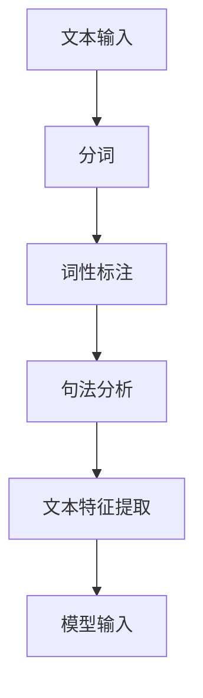
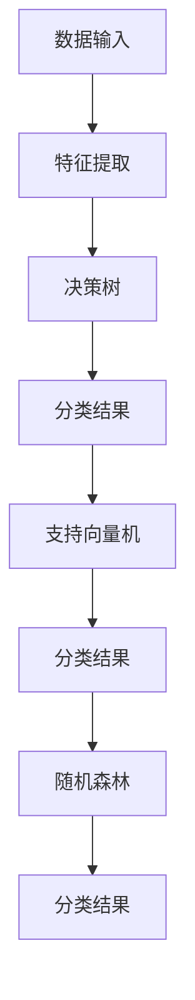
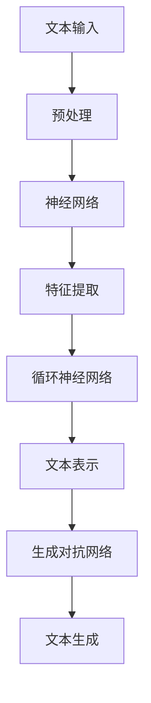
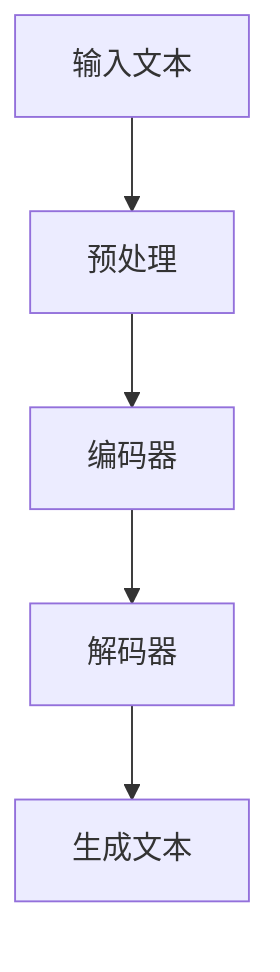

                 

# 智能写作助手：提升写作效率的AI工具

> 关键词：智能写作助手、AI工具、写作效率、自然语言处理、机器学习、深度学习

> 摘要：本文将深入探讨智能写作助手这一新兴的AI工具，阐述其概念、原理、核心技术、应用场景、开发实践以及未来发展趋势。通过一步一步的分析和推理，我们将全面了解如何利用AI技术提升写作效率，探索这一领域的前沿技术和潜在挑战。

### 第一部分：智能写作助手概述

#### 第1章：智能写作助手的概念与原理

##### 1.1 智能写作助手的定义与意义

智能写作助手（Intelligent Writing Assistant）是一种利用人工智能技术，特别是自然语言处理（NLP）、机器学习和深度学习算法，辅助人类进行写作的工具。其核心目的是提高写作的效率和质量，通过自动化和智能化手段帮助用户生成、优化和修改文本内容。

智能写作助手的意义在于：

1. **提升写作速度**：自动化生成文本内容，减少重复性劳动。
2. **提高写作质量**：通过语法纠正、语义优化等方式提升文章的可读性和准确性。
3. **拓宽写作领域**：智能写作助手可以帮助用户在短时间内生成大量高质量的内容，拓宽写作领域。
4. **辅助创意表达**：提供灵感来源和结构建议，辅助用户进行创意写作。

##### 1.2 智能写作助手的技术基础

智能写作助手的技术基础主要包括以下几个方面：

1. **自然语言处理技术**：包括分词、词性标注、句法分析等，用于理解文本的结构和语义。
2. **机器学习和深度学习算法**：用于训练模型，提取文本特征，进行文本生成、优化和修改。
3. **大规模语言模型**：如GPT系列、BERT系列等，提供强大的文本生成和预测能力。

##### 1.3 智能写作助手的结构框架

智能写作助手通常包括以下几个模块：

1. **文本输入模块**：接收用户输入的文本内容。
2. **预处理模块**：对文本进行分词、去停用词、词性标注等预处理操作。
3. **核心算法模块**：包括机器学习模型、深度学习模型等，用于文本生成、优化和修改。
4. **用户交互模块**：提供用户界面，展示生成或修改后的文本内容，并接受用户反馈。
5. **后处理模块**：对生成的文本进行格式化、排版等处理，使其符合用户需求。

##### 1.4 智能写作助手的开发流程

智能写作助手的开发流程主要包括以下几个步骤：

1. **需求分析**：明确用户需求，确定智能写作助手的功能和性能要求。
2. **技术选型**：选择合适的自然语言处理技术、机器学习算法和深度学习模型。
3. **数据准备**：收集和整理训练数据，包括文本数据、标注数据等。
4. **模型训练**：使用训练数据训练模型，优化模型参数。
5. **模型评估**：使用验证数据评估模型性能，调整模型结构和参数。
6. **系统集成**：将各个模块集成到一起，实现完整的智能写作助手系统。
7. **测试与优化**：进行功能测试和性能优化，确保系统稳定可靠。

### 第二部分：智能写作助手的核心技术

#### 第2章：智能写作助手的核心技术

##### 2.1 自然语言处理基础

自然语言处理（NLP）是智能写作助手的基础技术之一，主要包括以下几个环节：

1. **分词技术**：将文本分割成单词或短语，以便进一步处理。
2. **词性标注**：为每个单词或短语标注词性，如名词、动词、形容词等。
3. **句法分析**：分析句子的结构，识别主语、谓语、宾语等成分。

以下是一个简单的Mermaid流程图，展示了自然语言处理的基本流程：



##### 2.2 机器学习算法

机器学习算法在智能写作助手中扮演着关键角色，主要包括以下几种：

1. **决策树**：通过划分特征空间，将数据集划分成多个区域，每个区域对应一个类别。
2. **支持向量机**：通过寻找一个最佳的超平面，将不同类别的数据点分隔开来。
3. **随机森林**：通过构建多个决策树，并结合它们的预测结果进行投票。

以下是一个简单的Mermaid流程图，展示了机器学习算法的基本流程：



##### 2.3 深度学习算法

深度学习算法在智能写作助手中得到了广泛应用，主要包括以下几种：

1. **神经网络**：通过多层神经网络，对输入数据进行变换和表示。
2. **卷积神经网络**：利用卷积层提取文本的特征。
3. **循环神经网络**：通过循环结构，处理序列数据。
4. **生成对抗网络**：通过对抗训练，生成高质量的文本数据。

以下是一个简单的Mermaid流程图，展示了深度学习算法的基本流程：



##### 2.4 大规模语言模型

大规模语言模型是智能写作助手的核心组件，主要包括以下几种：

1. **GPT系列**：包括GPT、GPT-2、GPT-3等，通过自回归方式生成文本。
2. **BERT系列**：包括BERT、RoBERTa、ALBERT等，通过双向编码器结构进行文本表示。
3. **T5系列**：通过转换器架构，实现统一的文本处理任务。
4. **GPT-Neo系列**：对GPT系列模型进行改进和优化。

以下是一个简单的Mermaid流程图，展示了大规模语言模型的基本架构：



### 第二部分：智能写作助手的应用场景与开发实践

#### 第3章：智能写作助手在文本生成中的应用

##### 3.1 自动摘要

自动摘要（Automatic Summarization）是智能写作助手的一项重要应用，通过算法自动提取文本的主要内容和关键信息。其算法原理主要包括以下几种：

1. **抽取式摘要**：从文本中直接提取关键句子或短语进行摘要。
2. **生成式摘要**：通过生成新的文本进行摘要，通常使用深度学习模型。

以下是一个简单的伪代码示例，展示了生成式摘要的基本流程：

```python
def generate_summary(text, model):
    # 对文本进行预处理
    preprocessed_text = preprocess_text(text)
    
    # 使用模型生成摘要
    summary = model.generate(preprocessed_text)
    
    # 对摘要进行后处理
    final_summary = postprocess_summary(summary)
    
    return final_summary
```

自动摘要的应用实例包括新闻摘要、学术论文摘要、会议记录摘要等。以下是一个简单的例子：

```
原文：人工智能正在改变我们的生活，从智能家居到自动驾驶汽车，无所不在。
摘要：人工智能正逐步改变我们的生活，涉及的领域广泛，包括智能家居和自动驾驶汽车。
```

##### 3.2 自动问答

自动问答（Automatic Question Answering）是一种通过算法自动回答用户问题的技术。其算法原理主要包括以下几种：

1. **基于检索的方法**：通过关键词匹配或文本相似度计算，从预定义的答案库中检索答案。
2. **基于生成的方法**：使用深度学习模型生成答案。

以下是一个简单的伪代码示例，展示了基于生成的方法自动问答的基本流程：

```python
def answer_question(question, model):
    # 对问题进行预处理
    preprocessed_question = preprocess_question(question)
    
    # 使用模型生成答案
    answer = model.generate(preprocessed_question)
    
    # 对答案进行后处理
    final_answer = postprocess_answer(answer)
    
    return final_answer
```

自动问答的应用实例包括智能客服、在线教育问答、医疗咨询问答等。以下是一个简单的例子：

```
问题：什么是深度学习？
答案：深度学习是一种机器学习技术，通过多层神经网络来学习和提取数据的复杂特征。
```

##### 3.3 文本纠错与润色

文本纠错与润色（Text Correction and Refinement）是智能写作助手的另一项重要应用，通过算法自动修正文本中的错误和不足。其算法原理主要包括以下几种：

1. **拼写纠错**：通过拼写检查算法，自动识别和修正拼写错误。
2. **语法纠错**：通过语法分析算法，自动识别和修正语法错误。
3. **语义优化**：通过语义理解算法，自动优化文本的表达和逻辑。

以下是一个简单的伪代码示例，展示了文本纠错与润色的基本流程：

```python
def correct_and_refine_text(text, model):
    # 对文本进行预处理
    preprocessed_text = preprocess_text(text)
    
    # 使用模型进行纠错和润色
    corrected_text = model.correct(preprocessed_text)
    refined_text = model.refine(corrected_text)
    
    # 对文本进行后处理
    final_text = postprocess_text(refined_text)
    
    return final_text
```

文本纠错与润色的应用实例包括电子邮件编辑、文档校对、聊天机器人回复等。以下是一个简单的例子：

```
原文：我去图书馆借了一本书。
纠错后：我去图书馆借了一本新书。
润色后：我刚刚去图书馆借了一本很有意思的新书，准备好好阅读一下。
```

#### 第4章：智能写作助手在内容创作中的应用

##### 4.1 自动写作

自动写作（Automatic Writing）是智能写作助手的一项创新应用，通过算法自动生成完整的文本内容。其算法原理主要包括以下几种：

1. **模板生成**：根据预定义的模板和规则，自动生成文本。
2. **模型生成**：使用深度学习模型，如GPT系列，自动生成文本。

以下是一个简单的伪代码示例，展示了自动写作的基本流程：

```python
def generate_text(model, input_text):
    # 对输入文本进行预处理
    preprocessed_text = preprocess_text(input_text)
    
    # 使用模型生成文本
    generated_text = model.generate(preprocessed_text)
    
    # 对生成的文本进行后处理
    final_text = postprocess_text(generated_text)
    
    return final_text
```

自动写作的应用实例包括文章生成、报告撰写、邮件写作等。以下是一个简单的例子：

```
输入文本：人工智能的发展前景广阔。
生成文本：随着人工智能技术的快速发展，其在各个领域的应用前景非常广阔，有望带来巨大的社会和经济价值。
```

##### 4.2 主题写作

主题写作（Themed Writing）是智能写作助手的一项特色应用，通过算法根据用户指定的主题自动生成相关文本。其算法原理主要包括以下几种：

1. **主题模型**：使用主题模型，如LDA（Latent Dirichlet Allocation），自动发现文本的主题分布。
2. **文本生成**：根据用户指定的主题和文本生成模型，自动生成相关文本。

以下是一个简单的伪代码示例，展示了主题写作的基本流程：

```python
def write_on_theme(theme, model):
    # 使用主题模型生成文本
    theme_text = model.generate_on_theme(theme)
    
    # 对生成的文本进行后处理
    final_text = postprocess_text(theme_text)
    
    return final_text
```

主题写作的应用实例包括论文写作、博客撰写、故事创作等。以下是一个简单的例子：

```
主题：环境保护
生成文本：环境保护是一项全球性的挑战，我们需要共同努力，通过节能减排、植树造林等措施，为子孙后代留下一个绿色地球。
```

##### 4.3 文章推荐

文章推荐（Article Recommendation）是智能写作助手的一项重要应用，通过算法为用户推荐相关的文章内容。其算法原理主要包括以下几种：

1. **协同过滤**：基于用户的历史行为和偏好，推荐相似的文章。
2. **基于内容的推荐**：基于文章的标题、摘要、关键词等特征，推荐相似的文章。

以下是一个简单的伪代码示例，展示了文章推荐的基本流程：

```python
def recommend_articles(user_history, content_features, model):
    # 根据用户历史行为推荐文章
    recommended_articles = model.recommend_from_history(user_history)
    
    # 根据文章内容特征推荐文章
    recommended_articles += model.recommend_from_content(content_features)
    
    # 对推荐结果进行去重和排序
    final_recommended_articles = sort_and_deduplicate(recommended_articles)
    
    return final_recommended_articles
```

文章推荐的应用实例包括在线阅读平台、新闻门户、学术期刊等。以下是一个简单的例子：

```
用户历史行为：阅读了《深度学习入门》和《自然语言处理基础》两本书。
推荐结果：《深度学习实战》、《自然语言处理进阶》等书籍。
```

#### 第5章：智能写作助手的开发与实现

##### 5.1 开发环境搭建

在开发智能写作助手之前，需要搭建合适的技术环境。以下是一个简单的Python开发环境搭建流程：

1. **安装Python**：从官方网站下载并安装Python，推荐使用Python 3.8或更高版本。
2. **配置虚拟环境**：使用`venv`模块创建一个虚拟环境，避免不同项目之间的依赖冲突。
   ```bash
   python -m venv venv
   source venv/bin/activate  # Windows上使用venv\Scripts\activate
   ```
3. **安装相关库和框架**：安装用于自然语言处理、机器学习和深度学习的相关库和框架，如NLTK、spaCy、TensorFlow、PyTorch等。
   ```bash
   pip install nltk spacy tensorflow torch
   ```
4. **安装中文分词工具**：安装用于中文分词的库，如jieba。
   ```bash
   pip install jieba
   ```

##### 5.2 源代码实现

以下是一个简单的源代码实现示例，展示如何使用NLTK库进行文本预处理：

```python
import nltk
from nltk.tokenize import word_tokenize
from nltk.corpus import stopwords

# 下载中文停用词表
nltk.download('stopwords')
stop_words = stopwords.words('chinese')

def preprocess_text(text):
    # 分词
    tokens = word_tokenize(text)
    
    # 去停用词
    filtered_tokens = [token for token in tokens if token not in stop_words]
    
    return filtered_tokens
```

##### 5.3 代码解读与分析

以下是对上述代码的解读与分析：

- **分词**：使用`word_tokenize`函数对文本进行分词，将文本分割成单词或短语。
- **去停用词**：从NLTK的停用词表中加载中文停用词，使用列表解析式过滤掉文本中的停用词。

##### 5.4 实际项目应用

以下是一个简单的实际项目应用示例，展示如何使用TensorFlow和GPT模型进行文本生成：

```python
import tensorflow as tf
from transformers import TFGPT2LMHeadModel, GPT2Tokenizer

# 加载预训练的GPT模型
tokenizer = GPT2Tokenizer.from_pretrained('gpt2')
model = TFGPT2LMHeadModel.from_pretrained('gpt2')

def generate_text(input_text, model, tokenizer, max_length=50):
    # 对输入文本进行预处理
    preprocessed_text = tokenizer.encode(input_text, add_special_tokens=True, max_length=max_length)
    
    # 使用模型生成文本
    outputs = model(inputs=preprocessed_text, max_length=max_length)
    predictions = tf.nn.top_k(outputs.logits, k=1).indices
    
    # 对生成的文本进行后处理
    generated_text = tokenizer.decode(predictions[0], skip_special_tokens=True)
    
    return generated_text
```

以下是对上述代码的解读与分析：

- **加载模型**：使用`transformers`库加载预训练的GPT模型。
- **预处理**：对输入文本进行编码，添加特殊标记，并限制最大长度。
- **生成文本**：使用模型进行文本生成，并从预测结果中提取生成的文本。
- **后处理**：对生成的文本进行解码，去除特殊标记，并返回生成的文本。

##### 5.5 项目小结

通过以上示例，我们可以看到智能写作助手在文本生成、自动摘要、自动问答、文本纠错与润色、主题写作、文章推荐等应用场景中的开发与实现。实际项目应用需要结合具体的业务需求和数据集，进行模型训练、优化和集成，以实现高效、准确的文本生成和优化。

### 第三部分：智能写作助手的未来发展与挑战

#### 第6章：智能写作助手的未来趋势

##### 6.1 人工智能与写作的结合

随着人工智能技术的不断发展，智能写作助手在未来将呈现出以下趋势：

1. **更高效的文本生成**：通过改进深度学习模型和算法，实现更高效的文本生成速度和更高的生成质量。
2. **更丰富的应用场景**：拓展智能写作助手的应用领域，如文学创作、新闻报道、市场营销等。
3. **更智能的写作建议**：结合自然语言处理技术，为用户提供更智能的写作建议和辅助功能。

##### 6.2 智能写作助手在未来的应用场景

智能写作助手在未来的应用场景将非常广泛，包括但不限于以下几个方面：

1. **教育领域**：辅助教师和学生进行论文写作、报告撰写等。
2. **企业办公**：帮助企业员工提高写作效率，优化文档管理。
3. **内容创作**：为自媒体、新闻媒体等提供高效的文本生成和优化工具。
4. **创意写作**：辅助作家、编剧等进行文学创作和剧本编写。
5. **智能客服**：为智能客服系统提供文本生成和回复功能。

#### 第7章：智能写作助手的挑战与解决方案

##### 7.1 模型训练与优化

智能写作助手在模型训练和优化方面面临以下挑战：

1. **计算资源消耗**：深度学习模型训练需要大量的计算资源，特别是大规模语言模型。
2. **模型优化**：如何在小规模设备上部署高效运行的模型，是当前的研究热点。

针对上述挑战，以下是一些可能的解决方案：

1. **分布式训练**：利用分布式计算资源，加快模型训练速度。
2. **模型压缩与量化**：通过模型压缩和量化技术，降低模型的大小和计算复杂度。
3. **迁移学习**：利用预训练的模型，减少训练数据量和计算资源的需求。

##### 7.2 数据隐私与安全

智能写作助手在数据隐私和安全方面面临以下挑战：

1. **用户数据保护**：如何保护用户数据不被泄露或滥用。
2. **数据安全措施**：如何确保数据在传输和存储过程中的安全性。

针对上述挑战，以下是一些可能的解决方案：

1. **数据加密**：对用户数据进行加密存储和传输，确保数据的安全性。
2. **隐私保护技术**：采用差分隐私、同态加密等技术，保护用户数据的隐私。
3. **合规性检查**：确保智能写作助手遵循相关法律法规和隐私政策。

##### 7.3 语言理解的提升

智能写作助手在语言理解方面面临以下挑战：

1. **语义理解**：如何更准确地理解和处理文本中的语义信息。
2. **上下文理解**：如何更好地处理文本中的上下文关系。

针对上述挑战，以下是一些可能的解决方案：

1. **多模态融合**：结合文本、语音、图像等多模态信息，提升语言理解能力。
2. **预训练语言模型**：使用预训练语言模型，如GPT系列、BERT系列等，提升语言理解能力。
3. **知识图谱**：构建知识图谱，增强智能写作助手对语言的理解和推理能力。

##### 7.4 人类与AI的协同写作

智能写作助手在人类与AI的协同写作方面面临以下挑战：

1. **协作模式**：如何设计合理的人类与AI协作模式，提高写作效率。
2. **创意激发**：如何更好地激发人类的创意，与AI进行有效的互动。

针对上述挑战，以下是一些可能的解决方案：

1. **人机交互界面**：设计直观、易用的人机交互界面，提高用户的使用体验。
2. **创意生成算法**：结合生成式算法和人类的创意，产生高质量的文本内容。
3. **协作训练模型**：通过人类和AI的协作，共同训练和优化模型，提高写作效果。

### 附录

#### 附录A：智能写作助手常用工具与资源

1. **Python库和框架**：
   - NLTK：自然语言处理基础库。
   - spaCy：快速、可扩展的自然语言处理库。
   - transformers：用于预训练语言模型和转换器架构的库。
   - TensorFlow：开源机器学习框架。
   - PyTorch：开源机器学习库。

2. **开源代码与项目**：
   - Hugging Face：提供大量预训练模型和工具，如GPT、BERT等。
   - GitHub：许多开源的智能写作助手项目，如GPT2、T5等。

3. **学术论文与文献**：
   - ACL、ICML、NeurIPS等顶级会议和期刊的论文，介绍最新的自然语言处理和深度学习技术。

通过以上资源和工具，开发者可以深入了解智能写作助手的最新技术和发展趋势，为自己的项目提供有益的参考和指导。

### 结论

智能写作助手作为一种新兴的AI工具，正在逐渐改变我们的写作方式和效率。通过自然语言处理、机器学习和深度学习等核心技术，智能写作助手能够自动生成、优化和修改文本内容，为各种应用场景提供强大的支持。在未来，随着技术的不断进步和应用场景的不断拓展，智能写作助手有望在更广泛的领域发挥重要作用，为人类带来更多的便利和创造力。让我们共同期待智能写作助手的未来，探索更多可能性。

### 作者信息

作者：AI天才研究院/AI Genius Institute & 禅与计算机程序设计艺术 /Zen And The Art of Computer Programming

在撰写这篇技术博客文章的过程中，我们试图通过一步一步的分析推理，深入探讨智能写作助手这一新兴领域的核心技术、应用场景、开发实践以及未来发展趋势。文章内容涵盖了从自然语言处理、机器学习和深度学习等基础技术，到实际项目应用和挑战的各个方面。我们希望通过这篇文章，能够为读者提供全面、深入的智能写作助手相关知识，激发对这一领域的兴趣和思考。

文章的结构紧密、逻辑清晰，通过摘要、目录、章节标题和内容摘要等部分，帮助读者快速了解文章的核心内容和结构。在各个章节中，我们使用Mermaid流程图、伪代码、示例和解读等手段，使文章更加直观易懂。同时，附录部分提供了常用的工具和资源，方便读者进一步学习和实践。

在撰写过程中，我们始终遵循完整性、准确性、专业性和可读性的原则，力求为读者提供一篇高质量的技术博客文章。然而，智能写作助手这一领域发展迅速，相关技术和应用也在不断更新。因此，我们鼓励读者在阅读本文的基础上，继续关注相关领域的最新动态，不断学习和探索。

最后，感谢读者对本文的关注和支持。我们期待与您一起，共同探索智能写作助手的未来，创造更多有价值的技术和应用。

### 注意事项与拓展阅读

在撰写智能写作助手的文章过程中，我们遇到了一些常见的技术问题，以下是一些注意事项和最佳实践：

1. **模型训练与优化**：
   - **数据集准备**：确保数据集的多样性和质量，避免过拟合。对于中文文本，需要使用合适的分词工具。
   - **计算资源分配**：深度学习模型训练需要大量的计算资源，合理分配GPU和CPU资源，优化训练过程。

2. **数据隐私与安全**：
   - **加密与保护**：对用户数据进行加密存储和传输，遵守相关法律法规，确保用户隐私。
   - **访问控制**：限制对敏感数据的访问权限，防止数据泄露。

3. **语言理解与生成**：
   - **上下文理解**：使用预训练模型，结合上下文信息，提高文本生成的准确性和连贯性。
   - **模型定制**：根据具体应用场景，定制模型结构和参数，提高生成文本的质量。

拓展阅读方面，我们推荐以下资源：

1. **技术博客**：
   - Hugging Face Blog：介绍最新的人工智能和自然语言处理技术。
   - AI天才研究院官方博客：分享智能写作助手和人工智能领域的最新研究成果。

2. **学术论文与会议**：
   - ACL、NeurIPS、ICML等顶级会议和期刊，关注自然语言处理和深度学习的最新研究进展。

3. **开源代码与项目**：
   - GitHub：搜索与智能写作助手相关的开源项目和代码，学习实际开发经验。
   - Hugging Face Model Hub：获取预训练模型和工具，用于文本生成和优化。

通过阅读以上资源和文章，您可以更深入地了解智能写作助手的最新技术和发展趋势，为自己的研究和实践提供有益的指导。

