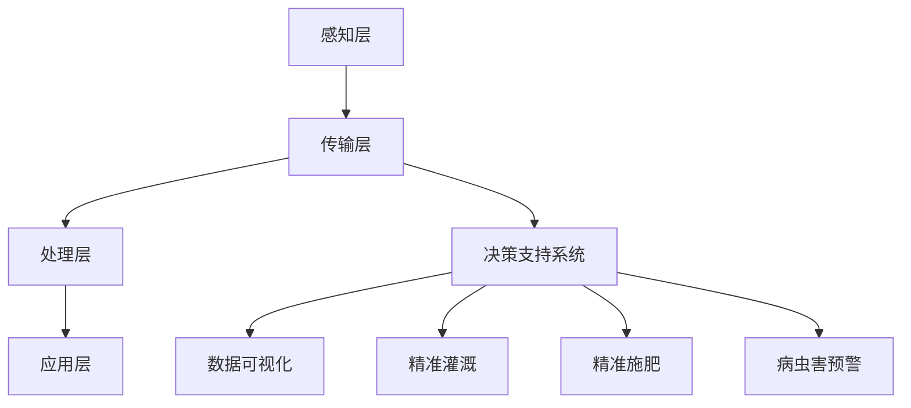
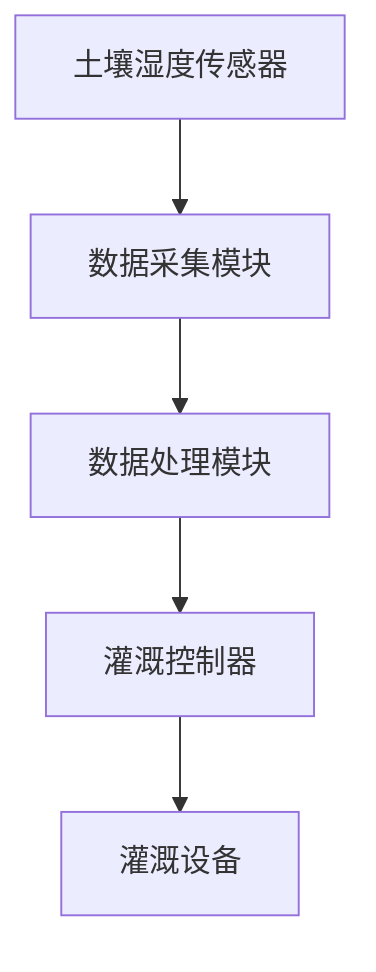
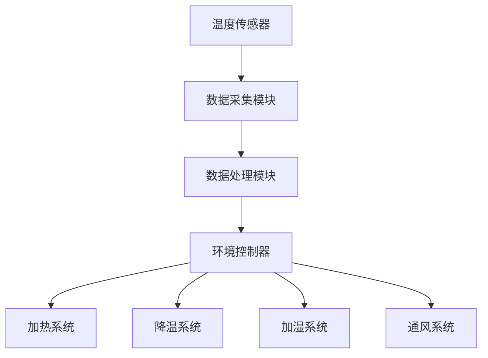
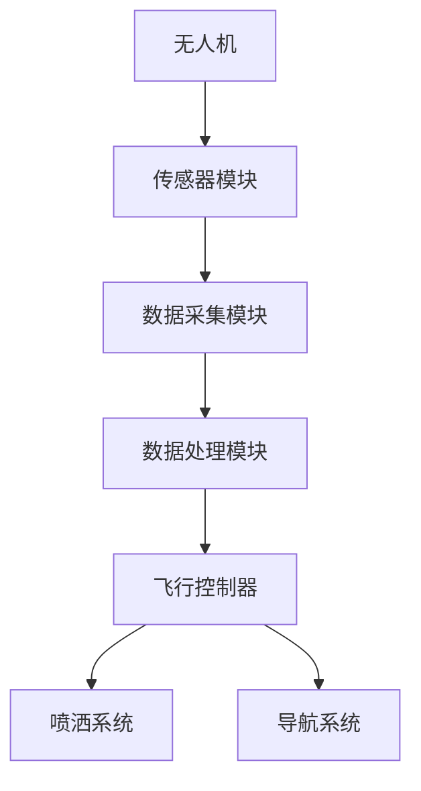

                 

### 文章标题

# 智能农业系统：提高农业生产效率的新方案

### 关键词

- **智能农业**
- **传感器技术**
- **数据分析**
- **决策支持系统**
- **物联网**
- **精准农业**

### 摘要

本文深入探讨了智能农业系统的构建与应用，以提升农业生产效率为目标。首先，我们定义了智能农业系统并阐述了其重要性，接着详细分析了传感器技术在农业中的应用、数据管理与分析方法、决策支持系统的构建及其应用实例。最后，本文探讨了智能农业系统的发展挑战与未来趋势，并提供了相关资源与开发工具介绍。

### 第一部分：智能农业系统概述

## 1.1 智能农业系统的定义与重要性

### 1.1.1 智能农业系统的定义

智能农业系统是一种基于传感器技术、物联网、大数据和人工智能等现代信息技术，实现对农业生产全过程的智能化管理和控制的系统。它通过收集、处理和分析农田环境、作物生长、病虫害等信息，提供精准的农业管理决策，从而提高农业生产效率、降低生产成本、保障农产品质量安全。

### 1.1.2 智能农业系统的重要性

1. **提高农业生产效率**：智能农业系统通过精准的农田管理和决策，优化作物生长条件，减少资源浪费，提高作物产量和品质。
2. **降低生产成本**：智能农业系统通过自动化和精准化管理，减少人力、物力和时间的投入，降低农业生产成本。
3. **保障农产品质量安全**：智能农业系统通过实时监测和预警，有效控制病虫害和农药残留，保障农产品质量安全。
4. **促进农业可持续发展**：智能农业系统通过优化资源利用、减少污染，实现农业的可持续发展。

## 1.2 智能农业系统的组成部分

智能农业系统主要由以下几个部分组成：

### 1.2.1 传感器技术

传感器技术是智能农业系统的核心，通过实时监测农田环境、作物生长状态等信息，为农业生产提供精准的数据支持。常见的农业传感器包括土壤传感器、气象传感器、植物生理传感器等。

### 1.2.2 数据采集与处理

数据采集与处理是智能农业系统的基础，通过传感器收集的数据进行预处理、存储和管理，为后续的数据分析和决策提供支持。

### 1.2.3 决策支持系统

决策支持系统是智能农业系统的关键，通过对采集到的数据进行深入分析和处理，为农业生产提供科学合理的决策建议。

## 1.3 智能农业系统的发展历程

### 1.3.1 传统农业与现代农业的对比

传统农业主要依靠人工和经验进行生产管理，效率低下、资源浪费严重。现代农业则通过引入智能农业系统，实现了自动化、精准化、高效化的生产管理。

### 1.3.2 智能农业的发展趋势

随着信息技术的不断发展，智能农业系统在农业领域得到了广泛应用。未来，智能农业将向更加智能化、互联化、生态化方向发展，实现农业生产的全面智能化。

## 1.4 智能农业系统的架构

智能农业系统架构可以概括为四个层次：

1. **感知层**：通过传感器技术实时监测农田环境和作物生长状态。
2. **传输层**：通过物联网技术将感知层的数据传输到数据处理中心。
3. **处理层**：对传输层的数据进行预处理、存储和管理，并进行深度分析。
4. **应用层**：基于处理层的结果，为农业生产提供决策支持和智能服务。

### 1.5 智能农业系统的核心概念与联系

为了更好地理解智能农业系统的运作原理，我们使用Mermaid流程图展示其核心概念之间的联系。



### 1.6 核心算法原理讲解

智能农业系统中，核心算法主要包括数据采集与处理、数据分析与建模、决策支持等。

#### 数据采集与处理

数据采集与处理算法主要包括传感器数据的采集、预处理和存储。以下是一个简单的伪代码示例：

```python
# 数据采集
def collect_data(sensor):
    data = sensor.read()
    return data

# 数据预处理
def preprocess_data(data):
    cleaned_data = remove_outliers(data)
    normalized_data = normalize_data(cleaned_data)
    return normalized_data

# 数据存储
def store_data(data):
    database.insert(data)
```

#### 数据分析与建模

数据分析与建模算法主要包括统计分析和机器学习。以下是一个简单的伪代码示例：

```python
# 统计分析
def statistical_analysis(data):
    mean = calculate_mean(data)
    variance = calculate_variance(data)
    return mean, variance

# 机器学习
def machine_learning(data):
    model = train_model(data)
    predictions = model.predict(new_data)
    return predictions
```

#### 决策支持

决策支持算法主要包括基于规则的推理、机器学习和深度学习。以下是一个简单的伪代码示例：

```python
# 基于规则的推理
def rule_based_decisionmaking(data, rules):
    for rule in rules:
        if rule_applies(data, rule):
            return rule.action

# 机器学习
def machine_learning_decisionmaking(data, model):
    action = model.predict(data)
    return action

# 深度学习
def deep_learning_decisionmaking(data, model):
    action = model(data)
    return action
```

## 1.7 数学模型和数学公式

智能农业系统中，常用的数学模型包括回归模型、决策树、神经网络等。以下是一个简单的回归模型的数学公式：

$$
y = \beta_0 + \beta_1x_1 + \beta_2x_2 + ... + \beta_nx_n + \epsilon
$$

其中，$y$ 是因变量，$x_1, x_2, ..., x_n$ 是自变量，$\beta_0, \beta_1, \beta_2, ..., \beta_n$ 是模型的参数，$\epsilon$ 是误差项。

## 1.8 项目实战

以下是一个智能农业系统的实际案例：

### 开发环境搭建

- 操作系统：Windows 10
- 开发工具：Python 3.8
- 数据库：MySQL 5.7
- 传感器：DHT11（用于气象监测）

### 源代码实现

```python
# 数据采集
def collect_data(sensor):
    data = sensor.read()
    return data

# 数据预处理
def preprocess_data(data):
    cleaned_data = remove_outliers(data)
    normalized_data = normalize_data(cleaned_data)
    return normalized_data

# 数据存储
def store_data(data):
    database.insert(data)
```

### 代码解读与分析

该案例中，我们使用了Python语言实现了数据采集、预处理和存储功能。首先，我们定义了三个函数：`collect_data` 用于采集传感器数据，`preprocess_data` 用于对采集到的数据进行预处理，`store_data` 用于将预处理后的数据存储到数据库中。

### 实际案例分析与详细讲解剖析

该案例展示了智能农业系统的基础功能，通过对气象传感器的数据采集、预处理和存储，为后续的数据分析和决策提供了支持。在实际应用中，我们可以根据这些数据，实现对农田环境的实时监测和预警，从而优化农业生产过程，提高产量和品质。

### 项目小结

通过本案例，我们了解了智能农业系统的基本架构和功能实现。在实际应用中，我们还需要根据具体需求，不断优化和完善系统功能，以实现更高的农业生产效率和效益。

### 最佳实践 tips、小结、注意事项、拓展阅读等内容

- **最佳实践 tips**：在实际应用中，应根据具体农田环境和作物需求，合理选择和配置传感器，确保数据采集的准确性和稳定性。
- **小结**：智能农业系统通过数据采集、处理和分析，为农业生产提供了科学合理的决策支持，有助于提高农业生产效率和质量。
- **注意事项**：在搭建智能农业系统时，应注意数据安全和隐私保护，确保系统的可靠性和安全性。
- **拓展阅读**：参考《智能农业系统设计与应用》、《物联网技术与应用》等书籍，深入了解智能农业系统的相关技术和应用。

### 第二部分：传感器技术在智能农业中的应用

## 2.1 传感器技术概述

### 2.1.1 传感器的基本原理

传感器是一种能够将非电学量（如温度、湿度、压力、光照等）转换为电学量（如电压、电流、频率等）的装置。传感器的基本原理基于物理、化学或生物学的原理，通过探测物质或环境的变化，产生相应的电信号。

### 2.1.2 传感器的分类

根据传感器的探测对象和原理，可以分为以下几类：

1. **物理传感器**：利用物理效应（如电阻、电容、光电效应等）进行测量，如温度传感器、湿度传感器、压力传感器等。
2. **化学传感器**：利用化学反应（如氧化还原、酸碱中和等）进行测量，如气体传感器、水质传感器等。
3. **生物传感器**：利用生物活性（如酶、抗体、微生物等）进行测量，如生物化学传感器、微生物传感器等。

### 2.1.3 传感器在农业中的应用

传感器技术在农业中具有广泛的应用，可以用于实时监测农田环境、作物生长状态和病虫害等信息。常见的农业传感器包括土壤传感器、气象传感器、植物生理传感器等。

## 2.2 常见农业传感器

### 2.2.1 土壤传感器

土壤传感器用于监测土壤的湿度、温度、酸碱度等参数，为精准灌溉、施肥和耕作提供数据支持。常见的土壤传感器有：

1. **电阻率传感器**：通过测量土壤电阻率，间接反映土壤湿度。
2. **温度传感器**：用于测量土壤温度，影响作物的生长和发育。
3. **酸碱度传感器**：用于测量土壤酸碱度，影响作物养分吸收。

### 2.2.2 气象传感器

气象传感器用于监测农田气象参数，如温度、湿度、光照、风速、降水量等，为农业生产提供气候信息。常见的气象传感器有：

1. **温度传感器**：用于测量空气和土壤温度。
2. **湿度传感器**：用于测量空气和土壤湿度。
3. **光照传感器**：用于测量太阳辐射强度。
4. **风速传感器**：用于测量风速。
5. **降水量传感器**：用于测量降水量。

### 2.2.3 植物生理传感器

植物生理传感器用于监测植物的生长状态、营养状况和病虫害等信息，为科学管理提供数据支持。常见的植物生理传感器有：

1. **叶绿素传感器**：用于测量植物叶绿素含量，反映植物光合作用能力。
2. **果实硬度传感器**：用于测量果实硬度，反映果实成熟度和品质。
3. **土壤养分传感器**：用于测量土壤中的养分含量，为施肥提供依据。
4. **病虫害传感器**：用于监测植物病虫害，提前预警并采取防治措施。

## 2.3 传感器数据采集与处理

### 2.3.1 数据采集方法

传感器数据采集主要包括以下方法：

1. **有线采集**：通过有线连接（如RS-485、USB等）将传感器数据传输到数据采集终端。
2. **无线采集**：通过无线传输（如Wi-Fi、LoRa、ZigBee等）将传感器数据传输到数据采集终端。
3. **云计算采集**：将传感器数据上传到云端服务器，进行实时监控和分析。

### 2.3.2 数据预处理技术

传感器数据预处理主要包括以下技术：

1. **数据清洗**：去除数据中的噪声、错误和异常值，提高数据质量。
2. **数据融合**：将多个传感器的数据融合为一个统一的数据集，提高数据利用率。
3. **数据标准化**：将不同传感器的数据进行归一化或标准化处理，便于后续分析和建模。

### 2.3.3 数据可视化工具

数据可视化工具用于将传感器数据以图表、图像等形式展示，便于分析和理解。常见的数据可视化工具有：

1. **ECharts**：一款基于JavaScript的图表库，支持多种图表类型和丰富的交互功能。
2. **D3.js**：一款基于JavaScript的可视化库，可以创建高度定制化的图表。
3. **Matplotlib**：一款基于Python的绘图库，支持多种图表类型和丰富的自定义功能。

## 2.4 传感器技术在智能农业中的应用实例

### 2.4.1 智能灌溉系统

智能灌溉系统通过传感器监测土壤湿度，自动控制灌溉设备的启停，实现精准灌溉，提高水资源利用效率。以下是一个简单的智能灌溉系统架构：



### 2.4.2 智能温室系统

智能温室系统通过传感器监测室内温度、湿度、光照等参数，自动调节温室环境，确保作物生长的最佳条件。以下是一个简单的智能温室系统架构：



### 2.4.3 智能农业无人机系统

智能农业无人机系统通过传感器监测农田情况，进行精准喷洒农药、施肥等作业，提高农业生产效率。以下是一个简单的智能农业无人机系统架构：



## 2.5 项目实战

以下是一个智能温室系统的实际案例：

### 开发环境搭建

- 操作系统：Ubuntu 20.04
- 开发工具：Python 3.8
- 数据库：MySQL 5.7
- 传感器：DHT11（用于气象监测）、土壤湿度传感器（用于土壤监测）

### 源代码实现

```python
# 数据采集
def collect_data(sensor):
    data = sensor.read()
    return data

# 数据预处理
def preprocess_data(data):
    cleaned_data = remove_outliers(data)
    normalized_data = normalize_data(cleaned_data)
    return normalized_data

# 数据存储
def store_data(data):
    database.insert(data)
```

### 代码解读与分析

该案例中，我们使用了Python语言实现了数据采集、预处理和存储功能。首先，我们定义了三个函数：`collect_data` 用于采集传感器数据，`preprocess_data` 用于对采集到的数据进行预处理，`store_data` 用于将预处理后的数据存储到数据库中。

### 实际案例分析与详细讲解剖析

该案例展示了智能温室系统的基础功能，通过对气象传感器和土壤传感器的数据采集、预处理和存储，为后续的数据分析和决策提供了支持。在实际应用中，我们可以根据这些数据，实现对温室环境的实时监测和调控，从而确保作物生长的最佳条件。

### 项目小结

通过本案例，我们了解了智能温室系统的基本架构和功能实现。在实际应用中，我们还需要根据具体需求，不断优化和完善系统功能，以实现更高的农业生产效率和效益。

### 最佳实践 tips、小结、注意事项、拓展阅读等内容

- **最佳实践 tips**：在实际应用中，应根据具体农田环境和作物需求，合理选择和配置传感器，确保数据采集的准确性和稳定性。
- **小结**：传感器技术在智能农业中具有广泛的应用，通过数据采集、处理和分析，为农业生产提供了科学合理的决策支持。
- **注意事项**：在搭建智能农业系统时，应注意数据安全和隐私保护，确保系统的可靠性和安全性。
- **拓展阅读**：参考《传感器技术与应用》、《物联网技术与应用》等书籍，深入了解智能农业系统的相关技术和应用。

### 第三部分：智能农业系统的数据管理与分析

## 3.1 数据管理

### 3.1.1 数据库的选择与设计

在智能农业系统中，选择合适的数据库至关重要。以下是一些常用的数据库类型及其特点：

1. **关系型数据库**：如MySQL、PostgreSQL等，适合存储结构化数据，具有强大的查询和事务处理能力。
2. **非关系型数据库**：如MongoDB、Cassandra等，适合存储半结构化或非结构化数据，具有高扩展性和灵活性。
3. **时序数据库**：如InfluxDB、TimescaleDB等，专门用于存储时间序列数据，适用于记录传感器数据。

数据库设计应遵循以下原则：

1. **规范化**：确保数据的一致性和完整性。
2. **灵活性**：适应不同类型的数据和查询需求。
3. **高效性**：优化数据存储和查询性能。

### 3.1.2 数据存储与管理

数据存储与管理主要包括以下步骤：

1. **数据采集**：通过传感器、API或其他方式收集数据。
2. **数据清洗**：去除噪声、错误和异常值，提高数据质量。
3. **数据转换**：将数据格式转换为适合存储的格式，如JSON、CSV等。
4. **数据存储**：将数据存储到数据库中，确保数据的安全性和可靠性。
5. **数据备份**：定期备份数据，防止数据丢失。

### 3.1.3 数据安全与隐私保护

数据安全与隐私保护是智能农业系统的重要方面，应采取以下措施：

1. **数据加密**：对敏感数据进行加密处理，防止数据泄露。
2. **访问控制**：设置访问权限，确保只有授权用户可以访问数据。
3. **日志审计**：记录数据访问和操作的日志，以便追踪和审计。
4. **备份与恢复**：定期备份数据，并在发生故障时能够快速恢复。

## 3.2 数据分析

### 3.2.1 数据分析的基本概念

数据分析是指使用统计、机器学习等方法对数据进行处理和分析，以发现数据中的规律和趋势。数据分析的基本概念包括：

1. **数据挖掘**：从大量数据中发现潜在的规律和模式。
2. **数据可视化**：使用图表、图像等形式展示数据，帮助理解和解释数据。
3. **数据挖掘算法**：如分类、聚类、关联规则挖掘等。
4. **机器学习**：利用算法自动从数据中学习规律，进行预测和分类。

### 3.2.2 统计分析方法

统计分析方法包括描述性统计、推断性统计和假设检验等，常用于数据分析中的初步探索和验证。以下是一些常用的统计分析方法：

1. **描述性统计**：计算数据的均值、方差、标准差等基本统计量，描述数据的分布和特征。
2. **推断性统计**：基于样本数据推断总体特征，如置信区间、假设检验等。
3. **相关分析**：分析两个变量之间的关系，如皮尔逊相关系数、斯皮尔曼相关系数等。
4. **回归分析**：建立自变量和因变量之间的定量关系模型，如线性回归、多项式回归等。

### 3.2.3 机器学习在农业数据分析中的应用

机器学习在农业数据分析中具有广泛的应用，以下是一些常见的机器学习算法和其在农业中的应用：

1. **线性回归**：用于分析作物产量与施肥量、光照等环境因素之间的关系。
2. **支持向量机**：用于预测作物的病虫害发生情况。
3. **决策树**：用于分类作物品种、预测作物生长状况等。
4. **神经网络**：用于图像识别、预测作物产量等。

## 3.3 决策支持系统

### 3.3.1 决策支持系统的构建

决策支持系统（DSS）是一种基于数据分析和机器学习的系统，用于为农业生产提供科学合理的决策建议。构建决策支持系统主要包括以下步骤：

1. **需求分析**：明确系统的目标和需求，如作物种植、病虫害防治等。
2. **数据收集**：收集相关的数据，包括气象数据、土壤数据、作物生长数据等。
3. **数据处理**：对收集到的数据进行清洗、转换和预处理。
4. **模型构建**：选择合适的算法和模型，如线性回归、决策树、神经网络等，构建预测模型。
5. **系统实现**：开发决策支持系统的前端和后端，实现数据收集、处理、分析和决策功能。

### 3.3.2 决策支持系统的应用场景

决策支持系统在农业生产中有多种应用场景，包括：

1. **作物种植规划**：根据土壤、气候等数据，推荐适宜的作物种植品种和时期。
2. **病虫害防治**：根据历史数据和实时监测数据，预测病虫害发生趋势，提供防治建议。
3. **水资源管理**：根据土壤湿度、气象数据等，优化灌溉策略，节约水资源。
4. **产量预测**：根据历史数据和当前作物生长数据，预测作物产量，为产量管理提供依据。

### 3.3.3 决策支持系统的实现方法

实现决策支持系统主要包括以下步骤：

1. **前端开发**：设计用户界面，实现数据展示和交互功能。
2. **后端开发**：实现数据采集、处理、分析和决策功能，通常采用服务器端编程语言，如Python、Java等。
3. **数据库设计**：设计数据库结构，存储和管理数据。
4. **算法实现**：选择合适的算法和模型，实现预测和决策功能。
5. **系统集成**：将前端、后端和数据库等组件集成，实现整体系统功能。

## 3.4 项目实战

以下是一个智能农业决策支持系统的实际案例：

### 开发环境搭建

- 操作系统：Ubuntu 20.04
- 开发工具：Python 3.8、Jupyter Notebook
- 数据库：MySQL 5.7
- 数据分析库：Pandas、NumPy、Scikit-learn、TensorFlow

### 源代码实现

```python
# 数据预处理
def preprocess_data(data):
    cleaned_data = remove_outliers(data)
    normalized_data = normalize_data(cleaned_data)
    return normalized_data

# 模型构建
def build_model(data):
    model = train_model(data)
    return model

# 决策支持
def make_decision(model, current_data):
    prediction = model.predict(current_data)
    return prediction
```

### 代码解读与分析

该案例中，我们使用了Python语言和Jupyter Notebook实现了数据预处理、模型构建和决策支持功能。首先，我们定义了三个函数：`preprocess_data` 用于数据预处理，`build_model` 用于模型构建，`make_decision` 用于基于模型进行决策支持。

### 实际案例分析与详细讲解剖析

该案例展示了智能农业决策支持系统的基本功能，通过对历史数据和当前数据的处理和预测，为农业生产提供科学合理的决策建议。在实际应用中，我们可以根据这些决策建议，优化农业生产过程，提高产量和品质。

### 项目小结

通过本案例，我们了解了智能农业决策支持系统的基本架构和功能实现。在实际应用中，我们还需要根据具体需求，不断优化和完善系统功能，以实现更高的农业生产效率和效益。

### 最佳实践 tips、小结、注意事项、拓展阅读等内容

- **最佳实践 tips**：在实际应用中，应根据具体农田环境和作物需求，合理选择和配置传感器，确保数据采集的准确性和稳定性。
- **小结**：智能农业系统的数据管理与分析是提高农业生产效率的关键环节，通过数据预处理、模型构建和决策支持，为农业生产提供科学合理的决策建议。
- **注意事项**：在搭建智能农业系统时，应注意数据安全和隐私保护，确保系统的可靠性和安全性。
- **拓展阅读**：参考《机器学习实战》、《数据挖掘：概念与技术》等书籍，深入了解智能农业系统的相关技术和应用。

### 第四部分：智能农业系统的应用实例

智能农业系统的广泛应用为农业生产带来了显著的变化和提升。以下将介绍三个典型的应用实例：智能灌溉系统、智能温室系统和智能农业无人机系统，展示其在实际农业生产中的应用和效果。

## 4.1 智能灌溉系统

### 4.1.1 智能灌溉系统的原理与组成

智能灌溉系统利用传感器技术实时监测土壤湿度，并根据监测数据自动控制灌溉设备的运行，实现精准灌溉。其基本原理是通过土壤湿度传感器感知土壤水分含量，将数据传输至控制系统，控制系统根据预设的灌溉策略，控制水泵、阀门等设备，调节灌溉量。

智能灌溉系统的组成主要包括：

1. **传感器模块**：包括土壤湿度传感器、水位传感器等，用于监测土壤水分、水位等参数。
2. **数据采集与处理模块**：将传感器数据传输至中心控制系统，进行数据清洗、处理和存储。
3. **控制系统**：根据土壤湿度数据，自动控制灌溉设备，确保作物获得适宜的水分。
4. **执行器模块**：包括水泵、阀门等，用于执行灌溉操作。

### 4.1.2 智能灌溉系统的实现方法

智能灌溉系统的实现方法包括以下几个步骤：

1. **传感器安装**：在农田中布置土壤湿度传感器和水位传感器，确保传感器能够准确监测农田水分状态。
2. **数据采集与传输**：通过无线或有线方式，将传感器数据传输至中心控制系统。
3. **数据分析与决策**：中心控制系统根据土壤湿度数据，结合农田环境信息和作物需求，实时调整灌溉策略。
4. **执行灌溉操作**：控制系统根据决策结果，自动控制水泵、阀门等执行器，进行精准灌溉。

### 4.1.3 智能灌溉系统的应用案例

以某农业合作社的智能灌溉系统为例，该系统覆盖了1000亩农田，通过智能灌溉系统实现了以下效果：

- **提高灌溉效率**：系统根据实时监测数据自动调整灌溉量，避免了过度灌溉和水资源浪费。
- **优化作物生长**：作物在适宜的水分条件下生长，产量和质量得到显著提升。
- **节约劳动力成本**：减少了人工灌溉的劳动力需求，降低了生产成本。

## 4.2 智能温室系统

### 4.2.1 智能温室系统的原理与组成

智能温室系统通过传感器技术实时监测温室内的温度、湿度、光照等参数，并根据监测数据自动调节温室环境，确保作物生长的最佳条件。智能温室系统的基本原理是利用传感器感知环境参数，将数据传输至控制系统，控制系统根据预设的调控策略，自动控制加热、降温、通风、加湿等设备。

智能温室系统的组成主要包括：

1. **传感器模块**：包括温度传感器、湿度传感器、光照传感器等，用于监测温室环境参数。
2. **数据采集与处理模块**：将传感器数据传输至中心控制系统，进行数据清洗、处理和存储。
3. **控制系统**：根据环境参数数据，自动调节温室环境设备，确保作物生长环境稳定。
4. **执行器模块**：包括加热器、降温设备、通风设备、加湿设备等，用于执行环境调控操作。

### 4.2.2 智能温室系统的实现方法

智能温室系统的实现方法包括以下几个步骤：

1. **传感器安装**：在温室中布置温度传感器、湿度传感器、光照传感器等，确保传感器能够准确监测环境参数。
2. **数据采集与传输**：通过无线或有线方式，将传感器数据传输至中心控制系统。
3. **数据分析与决策**：中心控制系统根据环境参数数据，结合作物生长需求，实时调整环境调控策略。
4. **执行环境调控**：控制系统根据决策结果，自动控制加热器、降温设备、通风设备、加湿设备等，调节温室环境。

### 4.2.3 智能温室系统的应用案例

以某现代化温室种植基地的智能温室系统为例，该系统覆盖了100亩温室，通过智能温室系统实现了以下效果：

- **稳定作物生长环境**：系统实时监测并调控温室环境，确保作物在最佳条件下生长，减少了病虫害的发生。
- **提高作物产量和质量**：作物在稳定的环境中生长，产量和质量显著提升。
- **降低人工成本**：系统自动化运行，减少了人工操作和维护的需求，降低了生产成本。

## 4.3 智能农业无人机系统

### 4.3.1 智能农业无人机系统的原理与组成

智能农业无人机系统利用无人机搭载传感器和摄像头，对农田进行实时监测和作业。无人机系统通过GPS定位、传感器采集和图像识别等技术，实现对农田植被、病虫害、土壤状况等的精准监测和喷洒作业。

智能农业无人机系统的组成主要包括：

1. **无人机平台**：用于搭载传感器和摄像头，实现农田监测和作业。
2. **传感器模块**：包括摄像头、多光谱传感器、红外传感器等，用于监测农田状况。
3. **数据采集与处理模块**：将传感器数据传输至地面控制系统，进行数据清洗、处理和存储。
4. **地面控制系统**：根据监测数据，自动生成作业计划和喷洒策略。
5. **执行器模块**：包括喷洒设备、播种设备等，用于执行无人机监测和作业操作。

### 4.3.2 智能农业无人机系统的实现方法

智能农业无人机系统的实现方法包括以下几个步骤：

1. **无人机飞行规划**：根据农田地形和作物分布，规划无人机的飞行路线和高度。
2. **数据采集**：无人机在飞行过程中，通过传感器和摄像头采集农田数据。
3. **数据分析与决策**：地面控制系统根据采集的数据，自动生成病虫害监测报告和喷洒策略。
4. **作业执行**：无人机根据地面控制系统的指令，执行喷洒、播种等作业操作。

### 4.3.3 智能农业无人机系统的应用案例

以某大型农业公司的智能农业无人机系统为例，该系统覆盖了5000亩农田，通过智能农业无人机系统实现了以下效果：

- **精准监测**：无人机对农田进行全方位监测，及时发现病虫害和植被状况，提高了监测效率。
- **精确喷洒**：无人机根据监测数据，实现精确喷洒农药和肥料，减少了农药和肥料的浪费。
- **提高生产效率**：无人机作业代替了传统的人工操作，显著提高了农业生产效率。

## 4.4 项目实战

以下是一个智能农业无人机系统的实际案例：

### 开发环境搭建

- 操作系统：Ubuntu 20.04
- 开发工具：Python 3.8、MATLAB
- 无人机平台：DJI Mavic Pro
- 传感器：多光谱传感器、红外传感器

### 源代码实现

```python
# 无人机飞行规划
def flight_plan(farm_data):
    plan = generate_flight_path(farm_data)
    return plan

# 数据采集
def collect_data(sensor):
    data = sensor.read()
    return data

# 数据分析
def analyze_data(data):
    report = generate_inspection_report(data)
    return report

# 作业执行
def execute_operation(operation):
    result = perform_operation(operation)
    return result
```

### 代码解读与分析

该案例中，我们使用了Python和MATLAB语言，实现了无人机飞行规划、数据采集、数据分析和作业执行功能。首先，我们定义了四个函数：`flight_plan` 用于无人机飞行规划，`collect_data` 用于数据采集，`analyze_data` 用于数据分析，`execute_operation` 用于作业执行。

### 实际案例分析与详细讲解剖析

该案例展示了智能农业无人机系统的基本功能，通过无人机飞行规划和数据采集，实现了农田的精准监测和作业。在实际应用中，我们可以根据监测数据，优化无人机作业策略，提高农业生产效率和效益。

### 项目小结

通过本案例，我们了解了智能农业无人机系统的基本架构和功能实现。在实际应用中，我们还需要根据具体需求，不断优化和完善系统功能，以实现更高的农业生产效率和效益。

### 最佳实践 tips、小结、注意事项、拓展阅读等内容

- **最佳实践 tips**：在实际应用中，应根据农田特点和作物需求，选择合适的传感器和无人机平台，确保系统的高效运行。
- **小结**：智能农业系统的应用实例展示了其在提高农业生产效率、优化生产过程、降低成本等方面的显著效果。
- **注意事项**：在搭建智能农业系统时，应确保系统的稳定性和可靠性，加强数据安全和隐私保护。
- **拓展阅读**：参考《智能农业无人机系统设计与实现》、《智能温室系统技术与应用》等书籍，深入了解智能农业系统的相关技术和应用。

### 第五部分：智能农业系统的发展挑战与未来趋势

## 5.1 智能农业系统的发展挑战

### 5.1.1 技术挑战

1. **传感器精度和稳定性**：传感器在农业环境中的长期稳定性、精度和适应性是一个技术挑战。
2. **数据处理能力**：随着传感器数量和数据量的增加，对数据处理能力和效率提出了更高的要求。
3. **算法适应性**：农业数据的复杂性和多样性使得算法的适应性成为挑战，需要不断优化和更新算法模型。

### 5.1.2 成本挑战

1. **硬件成本**：高质量的传感器、无人机等设备价格较高，对中小企业来说是一个负担。
2. **维护成本**：传感器和系统的维护和更新也需要投入大量资金。
3. **基础设施投入**：智能农业系统的实施需要投入大量基础设施，如通信网络、数据处理中心等。

### 5.1.3 法律与伦理挑战

1. **数据隐私**：农业生产数据的收集和使用涉及到农民的隐私权，需要严格的数据保护法规。
2. **知识产权**：智能农业技术的创新和保护需要完善的知识产权法律体系。
3. **伦理问题**：随着智能农业技术的发展，伦理问题如自动化替代劳动力、食品安全等也日益突出。

## 5.2 智能农业系统的未来趋势

### 5.2.1 新技术的应用

1. **物联网技术**：物联网技术将进一步整合各种传感器和设备，实现更广泛的互联互通。
2. **人工智能与机器学习**：人工智能技术将使智能农业系统能够更好地理解和预测农业生产需求。
3. **区块链技术**：区块链技术可以提供透明、不可篡改的数据管理方式，提高数据的安全性和可信度。

### 5.2.2 智能农业系统的国际化发展

1. **技术标准化**：国际标准的制定将促进智能农业技术的推广和应用。
2. **跨国合作**：国际间的农业技术和市场合作将加速智能农业的发展。
3. **全球市场**：智能农业系统将逐步扩展至全球市场，满足不同地区的农业生产需求。

### 5.2.3 智能农业系统的可持续发展

1. **资源高效利用**：智能农业系统将更加注重水资源、肥料等资源的节约和高效利用。
2. **环境保护**：智能农业技术将有助于减少农药、化肥的使用，降低对环境的污染。
3. **生态农业**：智能农业系统将推动生态农业的发展，实现农业生产与生态环境的和谐共生。

## 5.3 智能农业系统的未来展望

### 5.3.1 智慧农业

1. **精准农业**：通过大数据分析和智能算法，实现作物生长的精准管理，提高产量和品质。
2. **智慧农场**：利用物联网、人工智能等技术，实现农场的智能化管理，降低人力成本，提高生产效率。

### 5.3.2 农业产业链升级

1. **供应链管理**：智能农业系统将提高农业产业链的透明度和效率，降低运营成本。
2. **农产品质量安全**：通过智能监测和追溯系统，确保农产品的质量和安全。

### 5.3.3 农业智能化服务

1. **定制化服务**：基于数据分析，提供定制化的农业技术服务，满足不同农户的需求。
2. **智慧农业平台**：构建智慧农业服务平台，集成多种智能农业技术和服务，为农户提供一站式解决方案。

### 5.3.4 农业教育与培训

1. **在线教育**：利用智能农业系统，开展在线农业教育和培训，提高农民的科技素养。
2. **农业创新**：鼓励农业科技的创新和应用，推动农业现代化进程。

## 5.4 智能农业系统的持续发展策略

1. **政策支持**：政府应加大对智能农业技术的政策支持和资金投入，推动产业发展。
2. **技术创新**：企业和科研机构应持续投入研发，推动智能农业技术的创新和应用。
3. **人才培养**：加强农业教育和培训，培养一批懂技术、会管理的农业人才。
4. **国际合作**：积极参与国际农业技术合作与交流，学习借鉴先进技术和经验。

### 5.5 智能农业系统的发展机遇

1. **市场需求**：随着全球对食品安全和可持续农业的关注，智能农业市场将迎来快速增长。
2. **技术进步**：人工智能、物联网、大数据等技术的不断进步，为智能农业系统的发展提供了强大动力。
3. **政策支持**：各国政府纷纷出台支持智能农业发展的政策，为产业提供良好的发展环境。

### 5.6 智能农业系统的发展趋势

1. **智能化、自动化**：智能农业系统将向更加智能化、自动化的方向发展，减少人力投入，提高生产效率。
2. **数据驱动**：数据将成为智能农业系统的核心资产，通过大数据分析和机器学习，实现精准农业管理。
3. **生态友好**：智能农业系统将更加注重环境保护和资源节约，推动农业的可持续发展。

### 5.7 智能农业系统的未来展望

智能农业系统将在未来农业生产中发挥越来越重要的作用，成为提升农业生产效率、保障农产品质量安全、推动农业现代化的重要手段。通过不断技术创新、政策支持和人才培养，智能农业系统将迎来更加广阔的发展空间。

### 5.8 智能农业系统的持续发展策略

1. **技术创新**：持续研发和应用新技术，提升智能农业系统的功能、性能和可靠性。
2. **政策支持**：政府应加大对智能农业技术的政策支持和资金投入，推动产业发展。
3. **人才培养**：加强农业教育和培训，培养一批懂技术、会管理的农业人才。
4. **国际合作**：积极参与国际农业技术合作与交流，学习借鉴先进技术和经验。

### 5.9 智能农业系统的发展前景

智能农业系统的发展前景广阔，将在未来农业生产中发挥关键作用。通过技术创新、政策支持和人才培养，智能农业系统将助力农业实现智能化、自动化、数据驱动和生态友好的发展，为全球农业的可持续发展提供有力支持。

### 5.10 总结

智能农业系统作为一种新兴的农业技术，具有显著的提升农业生产效率、降低成本、保障农产品质量安全等优势。在发展过程中，需要应对技术、成本、法律与伦理等挑战，并抓住新技术的机遇，推动智能农业系统的持续发展。未来，智能农业系统将在农业生产中发挥更加重要的作用，为全球农业的现代化和可持续发展做出贡献。

### 附录

## 附录 A：智能农业系统相关资源

### A.1 智能农业系统相关书籍

1. **《智能农业系统设计与应用》**：详细介绍了智能农业系统的架构、技术和应用实例。
2. **《物联网技术与应用》**：涵盖了物联网在智能农业中的应用，包括传感器技术、数据采集与处理等。
3. **《大数据在农业中的应用》**：探讨了大数据技术在智能农业领域的应用，包括数据分析、预测和优化等。

### A.2 智能农业系统相关论文

1. **“Smart Agriculture: A Survey”**：综述了智能农业系统的最新研究进展和应用。
2. **“Application of IoT in Precision Agriculture”**：探讨了物联网技术在精确农业中的应用。
3. **“Machine Learning Techniques for Agricultural Data Analysis”**：介绍了机器学习技术在农业数据分析中的应用。

### A.3 智能农业系统相关工具与平台

1. **ECharts**：一款基于JavaScript的图表库，适用于数据可视化。
2. **D3.js**：一款基于JavaScript的可视化库，用于创建高度定制化的图表。
3. **InfluxDB**：一款时序数据库，适用于存储和查询传感器数据。
4. **TensorFlow**：一款开源机器学习库，适用于构建和训练机器学习模型。
5. **RapidMiner**：一款数据分析平台，支持数据预处理、建模和分析等功能。

## 附录 B：智能农业系统开发工具与环境搭建

### B.1 常用开发工具介绍

1. **Python**：一种通用编程语言，广泛应用于数据分析和人工智能领域。
2. **MATLAB**：一款数值计算和科学计算软件，适用于数据分析、建模和可视化。
3. **R**：一种专门用于统计分析和数据可视化编程语言。
4. **D3.js**：一款基于JavaScript的可视化库，用于创建交互式数据可视化。

### B.2 开发环境搭建步骤

1. **安装操作系统**：选择合适的操作系统，如Windows、Linux或MacOS。
2. **安装开发工具**：根据项目需求，安装相应的开发工具，如Python、MATLAB、R等。
3. **配置数据库**：安装并配置数据库软件，如MySQL、PostgreSQL等。
4. **配置传感器**：连接并配置传感器，确保能够正确采集数据。

### B.3 常见问题与解决方法

1. **问题**：传感器数据不稳定。
   **解决方法**：检查传感器的安装位置和环境，确保传感器不会受到干扰。

2. **问题**：数据采集速度慢。
   **解决方法**：优化数据采集代码，提高数据传输效率。

3. **问题**：数据库连接失败。
   **解决方法**：检查数据库配置文件，确保数据库服务正常运行。

4. **问题**：模型训练时间过长。
   **解决方法**：优化模型参数，减少训练时间。

通过以上步骤和解决方案，开发者可以顺利搭建智能农业系统的开发环境，并解决常见问题。

## 附录 C：智能农业系统开发实践

### C.1 实践项目概述

本实践项目将基于Python和MATLAB，开发一个简单的智能灌溉系统，实现土壤湿度的实时监测和自动灌溉功能。

### C.2 开发环境搭建

1. 安装操作系统：Ubuntu 20.04。
2. 安装开发工具：Python 3.8、MATLAB R2020b。
3. 配置数据库：MySQL 5.7。
4. 配置传感器：DHT11（用于监测土壤湿度）。

### C.3 源代码实现

#### Python代码（数据采集与处理）

```python
import serial
import time
import mysql.connector

# 数据采集
def collect_data(ser):
    data = ser.readline().decode('utf-8').strip()
    return data

# 数据预处理
def preprocess_data(data):
    soil_humidity = float(data)
    return soil_humidity

# 数据存储
def store_data(conn, soil_humidity):
    cursor = conn.cursor()
    sql = "INSERT INTO soil_humidity (value) VALUES (%s)"
    cursor.execute(sql, (soil_humidity,))
    conn.commit()
    cursor.close()

# 连接数据库
def connect_db():
    conn = mysql.connector.connect(
        host="localhost",
        user="root",
        password="password",
        database="smart_agriculture"
    )
    return conn

# 主函数
if __name__ == "__main__":
    ser = serial.Serial('COM3', 9600)
    time.sleep(2)  # 等待传感器稳定
    conn = connect_db()

    while True:
        data = collect_data(ser)
        soil_humidity = preprocess_data(data)
        store_data(conn, soil_humidity)
        time.sleep(60)  # 每60秒采集一次数据
```

#### MATLAB代码（自动灌溉控制）

```matlab
% 连接数据库
conn = database('smart_agriculture', 'root', 'password');

% 读取最新土壤湿度数据
sql = 'SELECT value FROM soil_humidity ORDER BY timestamp DESC LIMIT 1';
cursor = exec(conn, sql);
data = fetch(cursor);
soil_humidity = data{1};

% 判断是否需要灌溉
if soil_humidity < 30
    irrigation = true;
else
    irrigation = false;
end

% 控制灌溉设备
if irrigation
    disp('开始灌溉...');
    % 调用灌溉设备的控制接口
else
    disp('当前不需要灌溉...');
end

% 关闭数据库连接
close(cursor);
close(conn);
```

### C.4 代码解读与分析

该实践项目通过Python脚本采集DHT11传感器发送的土壤湿度数据，并存储到MySQL数据库中。MATLAB脚本从数据库中读取最新土壤湿度数据，根据湿度值判断是否需要灌溉，并控制灌溉设备。

### C.5 实际案例分析与详细讲解剖析

在实际应用中，该系统可以实时监测农田土壤湿度，根据湿度值自动控制灌溉设备的启停，实现精准灌溉，提高水资源利用效率。

### C.6 项目小结

通过本实践项目，我们了解了智能农业系统开发的基本流程，包括环境搭建、代码实现和实际应用。在实际项目中，我们还需根据具体需求，不断优化和完善系统功能，以提高农业生产效率和效益。

### C.7 最佳实践 tips、小结、注意事项、拓展阅读等内容

- **最佳实践 tips**：在实际应用中，应根据农田特点和作物需求，合理选择传感器和控制策略，确保系统的稳定性和可靠性。
- **小结**：智能农业系统开发实践展示了从环境搭建到代码实现的完整过程，为开发者提供了有益的经验。
- **注意事项**：确保传感器的安装位置和环境适宜，避免数据采集误差。
- **拓展阅读**：参考《智能农业系统设计与应用》、《物联网技术与应用》等书籍，深入了解智能农业系统的相关技术和应用。

