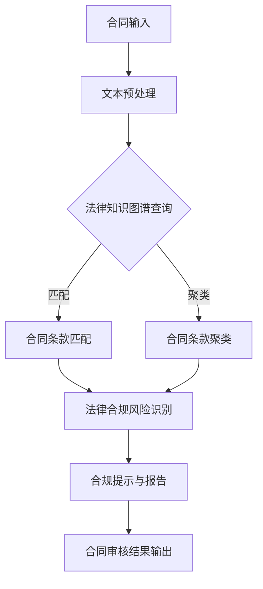

                 

### 《智能合同审核系统：法律合规的技术创新》

关键词：智能合同审核、法律合规、技术创新、自然语言处理、知识图谱

摘要：随着大数据、人工智能等技术的快速发展，智能合同审核系统在法律合规领域的重要性日益凸显。本文从智能合同审核的概念与背景出发，详细探讨了法律合规在智能合同审核中的重要性，以及智能合同审核的技术需求与发展趋势。接着，本文深入分析了法律文本处理技术、法律知识图谱构建与应用、智能合同审核算法原理和系统设计等内容，并通过实际案例分析，展示了智能合同审核系统在法律合规管理中的应用效果。最后，本文提出了智能合同审核系统的未来展望与面临的挑战，为推动智能合同审核技术的发展提供了有益的参考。

---

### 目录大纲

# 《智能合同审核系统：法律合规的技术创新》

## 第一部分：引言与概述

## 第1章：智能合同审核系统概述

### 1.1 智能合同审核的概念与背景

### 1.2 法律合规在智能合同审核中的重要性

### 1.3 智能合同审核的技术需求与发展趋势

## 第二部分：技术基础

## 第2章：法律文本处理技术

### 2.1 自然语言处理基础

#### 2.1.1 语言模型

#### 2.1.2 词嵌入技术

#### 2.1.3 命名实体识别

### 2.2 合同条款解析技术

#### 2.2.1 合同结构化

#### 2.2.2 关键词提取

#### 2.2.3 合同条款分类与聚类

## 第3章：法律知识图谱构建与应用

### 3.1 法律知识图谱的构建方法

#### 3.1.1 知识图谱的基本概念

#### 3.1.2 法律知识图谱的数据来源

#### 3.1.3 法律知识图谱的构建流程

### 3.2 法律知识图谱的应用

#### 3.2.1 合同条款语义理解

#### 3.2.2 法律合规风险识别

#### 3.2.3 智能合同审核流程优化

## 第三部分：算法实现与系统设计

## 第4章：智能合同审核算法原理

### 4.1 智能合同审核的算法框架

#### 4.1.1 基于规则的方法

#### 4.1.2 基于机器学习的方法

#### 4.1.3 基于深度学习的方法

### 4.2 合同条款匹配与聚类算法

#### 4.2.1 相似度计算

#### 4.2.2 聚类算法

#### 4.2.3 算法实现与性能评估

## 第5章：智能合同审核系统设计

### 5.1 系统架构设计

#### 5.1.1 系统功能模块划分

#### 5.1.2 数据处理流程设计

#### 5.1.3 系统接口与数据交互设计

### 5.2 系统性能优化

#### 5.2.1 系统负载均衡

#### 5.2.2 缓存机制与数据压缩

#### 5.2.3 异常处理与故障恢复

## 第四部分：法律合规案例分析

## 第6章：智能合同审核应用案例分析

### 6.1 案例背景与需求分析

#### 6.1.1 企业需求

#### 6.1.2 行业合规要求

### 6.2 案例解决方案

#### 6.2.1 合同数据预处理

#### 6.2.2 合同条款匹配与聚类

#### 6.2.3 法律合规风险识别与提示

### 6.3 案例实施效果评估

#### 6.3.1 实施效果分析

#### 6.3.2 效益评估

## 第7章：未来展望与挑战

### 7.1 智能合同审核技术的发展趋势

#### 7.1.1 新技术的应用

#### 7.1.2 行业标准的制定

#### 7.1.3 法律合规风险管理的深化

### 7.2 智能合同审核系统面临的挑战

#### 7.2.1 技术挑战

#### 7.2.2 法律挑战

#### 7.2.3 安全与隐私挑战

## 附录

### 附录A：常用技术工具与资源

#### A.1 自然语言处理工具

#### A.2 法律知识图谱构建工具

#### A.3 智能合同审核系统开发资源

### 附录B：参考文献

#### B.1 技术文献

#### B.2 行业报告

#### B.3 相关法规与政策

### 第8章：智能合同审核系统：法律合规的技术创新（Mermaid 流程图）

### 第9章：智能合同审核算法原理（伪代码）

---

### 第一部分：引言与概述

#### 第1章：智能合同审核系统概述

在数字经济时代，合同作为经济活动的重要法律文件，其规范性和合规性对企业运营至关重要。然而，传统的合同审核工作往往依赖于人工处理，效率低下且容易出错。随着人工智能技术的发展，智能合同审核系统应运而生，通过自然语言处理、法律知识图谱、机器学习等技术，实现了对合同条款的自动解析、风险识别和合规性审核。这一技术的创新不仅提高了合同审核的效率，还增强了企业对法律风险的防控能力。

### 1.1 智能合同审核的概念与背景

智能合同审核系统是一种基于人工智能技术的自动化合同审核工具，它能够对合同文本进行自动化的结构化解析，识别出合同中的关键条款和条件，并对这些条款进行法律合规性分析和风险评估。智能合同审核系统的主要功能包括：

1. **合同文本解析**：通过自然语言处理技术，将合同文本转化为结构化数据，提取出合同条款、条件、主体等信息。
2. **条款匹配与聚类**：对提取的条款进行相似度计算和聚类分析，识别出合同中可能存在的同类条款或相似条款。
3. **合规性分析**：利用法律知识图谱和机器学习算法，对合同条款进行法律合规性分析，识别出潜在的合规风险。
4. **风险提示与报告**：对识别出的风险进行提示，并生成详细的合规报告，为企业提供决策依据。

智能合同审核系统的背景可以从以下几个方面进行阐述：

1. **法律法规日趋完善**：随着全球各国对合同管理的要求日益提高，企业需要更加严格地遵守法律法规，智能合同审核系统可以帮助企业提高合规性管理水平。
2. **信息技术快速发展**：大数据、云计算、人工智能等技术的快速发展，为智能合同审核系统的研发和应用提供了技术基础。
3. **企业需求日益增长**：企业在运营过程中，需要处理大量的合同文件，传统的审核方式已经难以满足日益增长的需求，智能合同审核系统提供了更为高效和准确的解决方案。

### 1.2 法律合规在智能合同审核中的重要性

法律合规在智能合同审核中具有至关重要的地位。智能合同审核系统通过对合同条款的自动化解析和合规性分析，能够帮助企业及时发现和纠正潜在的法律风险，确保合同内容的合法性和合规性。以下是法律合规在智能合同审核中的重要体现：

1. **风险防控**：智能合同审核系统能够识别出合同中可能存在的法律风险，如条款表述不清、条款缺失、条款冲突等，为企业提供风险防控的依据。
2. **合规性审查**：智能合同审核系统能够依据法律法规和行业标准，对合同条款进行合规性审查，确保合同内容符合相关法律法规的要求。
3. **提升工作效率**：智能合同审核系统能够自动化处理大量的合同文件，减少人工审核的工作量，提高审核效率和准确性。
4. **降低法律纠纷**：通过智能合同审核系统，企业可以确保合同内容的合法性和合规性，降低因合同纠纷而产生的法律风险。

### 1.3 智能合同审核的技术需求与发展趋势

智能合同审核系统的实现依赖于多种先进技术的整合和应用，主要包括自然语言处理技术、法律知识图谱、机器学习算法等。以下是智能合同审核系统的主要技术需求和发展趋势：

1. **自然语言处理技术**：自然语言处理技术是智能合同审核系统的核心技术，包括语言模型、词嵌入技术、命名实体识别等。随着技术的不断进步，自然语言处理技术在合同文本解析、条款提取、语义理解等方面将取得更加精准的成果。

2. **法律知识图谱**：法律知识图谱是智能合同审核系统的重要组成部分，它通过构建法律概念、法律关系、法律条款等知识图谱，实现对合同条款的智能解析和法律合规性分析。随着法律知识图谱的不断完善，智能合同审核系统的应用范围将得到进一步拓展。

3. **机器学习算法**：机器学习算法在智能合同审核系统中发挥着关键作用，包括合同条款匹配、聚类、风险识别等。随着算法的优化和模型的改进，机器学习算法在合同审核中的效率和准确性将不断提高。

4. **大数据技术**：大数据技术为智能合同审核系统提供了丰富的数据资源，包括合同文本数据、法律法规数据、案例数据等。通过对这些数据的深度挖掘和分析，智能合同审核系统能够更加精准地识别法律风险和合规问题。

5. **云计算与边缘计算**：云计算与边缘计算为智能合同审核系统提供了强大的计算能力和灵活的部署方式。随着云计算和边缘计算技术的不断发展，智能合同审核系统将更加高效和便捷。

6. **区块链技术**：区块链技术具有不可篡改和可追溯的特点，为智能合同审核系统提供了安全可靠的数据存储和传输解决方案。在智能合同审核系统中引入区块链技术，可以确保合同数据的完整性和安全性。

总之，智能合同审核系统的发展将受益于多种先进技术的融合和创新，未来有望在合同管理、法律合规、风险控制等领域发挥更大的作用。同时，智能合同审核系统也面临着数据安全、隐私保护、法律挑战等挑战，需要持续的技术创新和合规性研究。

---

## 第二部分：技术基础

#### 第2章：法律文本处理技术

法律文本处理技术是智能合同审核系统的重要组成部分，它通过自然语言处理技术对法律文本进行结构化处理，提取出合同条款、条件、主体等信息，为后续的法律合规性分析和风险识别提供基础数据。本章将详细介绍法律文本处理技术，包括自然语言处理基础、合同条款解析技术等。

### 2.1 自然语言处理基础

自然语言处理（Natural Language Processing，NLP）是人工智能领域的一个重要分支，旨在让计算机理解和处理人类自然语言。在法律文本处理中，NLP技术能够帮助系统理解和分析法律文本，从而实现对合同条款的自动化提取和分析。以下是NLP的基础技术：

#### 2.1.1 语言模型

语言模型是NLP的核心技术之一，它通过统计方法或机器学习方法来建模自然语言的统计特性。常见的语言模型有N元语法模型、神经网络语言模型（如循环神经网络RNN、长短期记忆网络LSTM等）和注意力机制模型（如Transformer模型）。语言模型在法律文本处理中的应用主要体现在：

1. **文本生成**：通过训练语言模型，系统可以自动生成法律条款，辅助律师起草合同。
2. **文本理解**：利用语言模型，系统可以对法律文本进行语义理解，提取出关键信息。

#### 2.1.2 词嵌入技术

词嵌入（Word Embedding）是将自然语言中的词汇映射到高维空间中的向量表示。词嵌入技术通过将词语映射到向量空间，使得词语在向量空间中具有相似性的词语距离较近。常见的词嵌入模型有Word2Vec、GloVe等。词嵌入在法律文本处理中的应用包括：

1. **关键词提取**：通过词嵌入模型，系统可以识别出合同中的关键词，辅助条款提取和语义分析。
2. **语义分析**：利用词嵌入向量，系统可以进行语义相似度计算，帮助识别合同条款中的语义关系。

#### 2.1.3 命名实体识别

命名实体识别（Named Entity Recognition，NER）是NLP中的一种任务，旨在从文本中识别出具有特定意义的实体，如人名、地名、组织名、时间、数字等。命名实体识别在法律文本处理中的应用包括：

1. **主体识别**：通过NER技术，系统可以自动识别出合同中的各方主体，如甲方、乙方等。
2. **条款分类**：利用NER技术，系统可以对合同条款进行分类，如违约条款、解除条款等。

### 2.2 合同条款解析技术

合同条款解析技术是法律文本处理技术的核心，它通过对法律文本进行结构化处理，提取出合同条款、条件、主体等信息，为后续的法律合规性分析和风险识别提供基础数据。以下是合同条款解析技术的关键步骤：

#### 2.2.1 合同结构化

合同结构化是将非结构化的合同文本转化为结构化数据的过程。合同结构化的步骤包括：

1. **分句处理**：将合同文本分成句子，为后续的句子分析做准备。
2. **句子分析**：对每个句子进行词性标注、命名实体识别等操作，提取出句子的主要成分，如主语、谓语、宾语等。
3. **段落划分**：根据句子的语义关系，将文本划分成段落，为条款提取做准备。

#### 2.2.2 关键词提取

关键词提取是从合同文本中识别出关键信息的步骤，它有助于理解合同的主要内容和条款。关键词提取的方法包括：

1. **基于统计的方法**：如TF-IDF（词频-逆文档频率）方法，通过计算词在文本中的重要程度来提取关键词。
2. **基于规则的方法**：通过预设的规则，如词性标注、命名实体识别等，提取出合同文本中的关键词。
3. **基于机器学习的方法**：如文本分类、主题模型等方法，通过训练模型来提取合同文本中的关键词。

#### 2.2.3 合同条款分类与聚类

合同条款分类与聚类是对提取的合同条款进行分类和聚类的步骤，它有助于识别出合同中的主要条款和相似条款。合同条款分类与聚类的方法包括：

1. **基于规则的方法**：通过预设的规则，将合同条款分类到不同的类别中，如违约条款、解除条款等。
2. **基于机器学习的方法**：如朴素贝叶斯分类器、支持向量机（SVM）等方法，通过训练模型对合同条款进行分类。
3. **基于深度学习的方法**：如卷积神经网络（CNN）、递归神经网络（RNN）等方法，通过深度学习模型对合同条款进行分类和聚类。

通过上述技术，法律文本处理技术能够实现对合同条款的自动化提取、分类和聚类，为智能合同审核系统提供基础数据支持。随着技术的不断发展，法律文本处理技术将不断优化，提高合同审核的效率和准确性。

---

## 第三部分：法律知识图谱构建与应用

#### 第3章：法律知识图谱构建与应用

法律知识图谱是智能合同审核系统中的关键组件，它通过将法律文本中的知识结构化，形成一套统一且标准化的知识表示，从而为合同条款的语义理解、法律合规风险识别和智能合同审核流程优化提供支持。本章将详细探讨法律知识图谱的构建方法及其在实际应用中的具体作用。

### 3.1 法律知识图谱的构建方法

法律知识图谱的构建是一个复杂的过程，它涉及到数据的收集、清洗、存储、建模和推理等多个环节。以下是法律知识图谱构建的主要方法：

#### 3.1.1 知识图谱的基本概念

知识图谱（Knowledge Graph）是一种结构化数据表示方法，它通过节点（Node）、边（Edge）和属性（Property）来表示实体和实体之间的关系。在法律知识图谱中，节点通常代表法律概念、法律主体、法律条款等，边表示它们之间的逻辑关系，如“继承”、“限制”等。

#### 3.1.2 法律知识图谱的数据来源

法律知识图谱的数据来源主要包括以下几类：

1. **公开法律文本**：如法律法规、法院判决书、合同范本等，这些文本提供了法律概念和条款的基本信息。
2. **案例数据库**：包括各类法律案例，如合同纠纷案、侵权案等，这些案例有助于丰富法律知识图谱中的具体案例数据。
3. **法律数据库**：如法律数据库、法律论坛等，这些资源提供了大量的法律咨询和意见，有助于补充法律知识。
4. **行业数据**：特定行业中的法律需求和案例，如金融、房地产等，这些数据有助于构建特定领域的法律知识图谱。

#### 3.1.3 法律知识图谱的构建流程

法律知识图谱的构建流程主要包括以下几个步骤：

1. **数据收集**：从各种数据源中收集法律文本、案例、咨询意见等数据。
2. **数据清洗**：对收集到的数据进行去重、格式化、错误修正等处理，确保数据的准确性和一致性。
3. **实体抽取**：使用命名实体识别（NER）技术，从法律文本中抽取法律概念、法律主体、法律条款等实体。
4. **关系抽取**：通过文本分析、规则匹配等方法，抽取实体之间的关系，如“主体A与主体B签订合同”、“条款X与条款Y相关”等。
5. **知识融合**：将抽取出的实体和关系进行整合，构建出初步的法律知识图谱。
6. **图谱优化**：通过数据补全、关系增强、一致性检查等方法，优化法律知识图谱的结构和内容。
7. **推理扩展**：利用图谱中的关系进行推理，扩展出更多的知识，如“如果条款X存在，则可能需要条款Y”等。

### 3.2 法律知识图谱的应用

法律知识图谱在智能合同审核系统中具有广泛的应用，主要包括以下几个方面：

#### 3.2.1 合同条款语义理解

合同条款语义理解是指利用法律知识图谱对合同条款进行语义分析和解释。通过法律知识图谱，智能合同审核系统可以理解合同条款的具体含义、法律效力以及相关条款之间的关系。具体应用包括：

1. **条款解析**：系统可以自动解析合同条款中的法律术语和概念，将其转化为易于理解的语言，如“甲方违反合同，乙方有权解除合同”。
2. **条款匹配**：系统可以根据法律知识图谱中的关系，将合同中的条款与已有的法律条款进行匹配，识别出类似或冲突的条款。
3. **语义搜索**：用户可以通过输入关键词或问题，系统利用法律知识图谱进行语义搜索，返回相关的合同条款和法律条文。

#### 3.2.2 法律合规风险识别

法律合规风险识别是指利用法律知识图谱对合同条款进行合规性分析，识别出潜在的合规风险。具体应用包括：

1. **条款合规性分析**：系统可以自动分析合同条款是否符合法律法规的要求，如是否存在非法条款、条款表述不清等问题。
2. **风险提示**：系统可以针对识别出的合规风险，对用户进行提醒，并提供相关法律法规的解释和建议，如“该条款可能违反《合同法》的规定，请修改”。
3. **合规报告**：系统可以生成详细的合规报告，列出识别出的合规问题和建议，帮助企业进行合规管理。

#### 3.2.3 智能合同审核流程优化

智能合同审核流程优化是指通过法律知识图谱对合同审核流程进行智能化优化，以提高审核效率和准确性。具体应用包括：

1. **自动化审核**：系统可以根据法律知识图谱中的规则和关系，自动执行合同审核任务，如条款提取、合规性分析等。
2. **审核流程优化**：系统可以分析合同审核流程中的瓶颈和问题，提出优化建议，如“合同审核流程中，步骤X存在瓶颈，建议增加自动化工具”。
3. **智能决策支持**：系统可以为审核人员提供智能决策支持，如“根据法律法规和合同条款，建议选择方案Y”。

通过法律知识图谱的构建与应用，智能合同审核系统可以实现对合同条款的精准解析、合规性分析和智能审核，大大提高合同审核的效率和准确性，为企业的法律合规管理提供有力支持。

---

## 第三部分：算法实现与系统设计

#### 第4章：智能合同审核算法原理

智能合同审核算法是实现合同自动化审核的核心，它通过多种算法和技术手段对合同条款进行分析、匹配和风险识别。本章将详细介绍智能合同审核算法的原理，包括算法框架、基于规则的方法、基于机器学习的方法和基于深度学习的方法等。

### 4.1 智能合同审核的算法框架

智能合同审核算法框架通常包括以下几个主要步骤：

1. **文本预处理**：对合同文本进行预处理，包括去除标点符号、停用词过滤、文本分词等，以便后续的算法处理。
2. **条款提取**：利用自然语言处理技术，从预处理后的文本中提取出合同条款，进行结构化处理。
3. **条款匹配与聚类**：对提取出的合同条款进行相似度计算和聚类分析，识别出相似条款和关键条款。
4. **法律合规性分析**：利用法律知识图谱和机器学习算法，对合同条款进行法律合规性分析，识别出潜在的法律风险。
5. **风险提示与报告**：根据合规性分析结果，生成风险提示和合规报告，为审核人员提供决策支持。

### 4.2 基于规则的方法

基于规则的方法是智能合同审核算法的一种传统方法，它通过预设的规则来分析合同条款，识别法律合规风险。这种方法的主要特点包括：

1. **规则库构建**：基于法律专家的经验和知识，构建规则库，包括合同条款的合法性、有效性、完整性等规则。
2. **规则匹配**：将合同条款与规则库中的规则进行匹配，判断条款是否符合法律法规的要求。
3. **规则优化**：根据实际案例和反馈，不断优化和更新规则库，提高算法的准确性和适应性。

### 4.3 基于机器学习的方法

基于机器学习的方法利用大量历史数据，通过训练模型来自动分析合同条款，识别法律合规风险。这种方法的主要步骤包括：

1. **数据收集与预处理**：收集大量的合同文本数据，并进行预处理，如文本清洗、分词、标注等。
2. **特征工程**：从预处理后的文本中提取特征，如词嵌入、关键词、命名实体等，用于训练模型。
3. **模型训练**：使用训练数据集，训练机器学习模型，如支持向量机（SVM）、朴素贝叶斯（NB）等，用于合同条款的匹配和风险识别。
4. **模型评估与优化**：通过测试数据集对模型进行评估，并根据评估结果进行模型优化，提高算法的准确性和鲁棒性。

### 4.4 基于深度学习的方法

基于深度学习的方法通过构建深度神经网络模型，对合同条款进行自动分析和识别。这种方法的主要特点包括：

1. **深度神经网络**：使用深度神经网络（DNN），如卷积神经网络（CNN）、循环神经网络（RNN）、长短时记忆网络（LSTM）等，对合同条款进行语义分析和特征提取。
2. **端到端学习**：深度学习模型可以直接从原始文本数据中学习到合同条款的语义信息，无需进行复杂的特征工程。
3. **上下文理解**：深度学习模型能够理解合同条款的上下文关系，提高合同条款匹配和风险识别的准确性。
4. **多任务学习**：深度学习模型可以同时完成多个任务，如条款提取、匹配、聚类和合规性分析等，提高智能合同审核的整体性能。

通过结合基于规则的方法、基于机器学习的方法和基于深度学习的方法，智能合同审核算法可以实现高效、准确的合同审核，为企业提供强大的法律合规支持。随着技术的不断发展，这些方法将不断优化和融合，为智能合同审核系统带来更多的创新和突破。

---

## 第4章：智能合同审核算法原理

智能合同审核算法是智能合同审核系统的核心组成部分，通过自动化的方式分析、匹配和评估合同条款，识别法律合规风险。本章将详细探讨智能合同审核算法的原理，包括算法框架、合同条款匹配与聚类算法、算法实现与性能评估等。

### 4.1 智能合同审核的算法框架

智能合同审核算法框架可以分为以下几个主要步骤：

1. **合同文本预处理**：对合同文本进行清洗、分词和标注等操作，将其转换为计算机可以处理的格式。
2. **条款提取**：利用自然语言处理技术，从预处理后的文本中提取出合同条款，并进行结构化处理。
3. **条款匹配与聚类**：对提取出的合同条款进行相似度计算和聚类分析，识别出相似条款和关键条款。
4. **法律合规性分析**：利用法律知识图谱和机器学习算法，对合同条款进行法律合规性分析，识别出潜在的法律风险。
5. **风险提示与报告**：根据合规性分析结果，生成风险提示和合规报告，为审核人员提供决策支持。

### 4.2 合同条款匹配与聚类算法

合同条款匹配与聚类算法是智能合同审核算法的重要组成部分，其核心任务是识别合同中的相似条款和关键条款。以下是几种常见的合同条款匹配与聚类算法：

#### 4.2.1 相似度计算

相似度计算是合同条款匹配的基础，常用的相似度计算方法包括：

1. **字符串匹配算法**：如Levenshtein距离、Jaccard相似度等，用于计算两个合同条款的相似度。
2. **文本相似度算法**：如TF-IDF、Word2Vec等，通过计算文本的向量表示之间的距离来衡量相似度。

#### 4.2.2 聚类算法

聚类算法用于将合同条款按照相似度进行分类，常用的聚类算法包括：

1. **基于距离的聚类算法**：如K-Means算法，通过计算每个数据点与聚类中心的距离来划分聚类。
2. **基于密度的聚类算法**：如DBSCAN算法，通过识别数据点周围的密集区域来划分聚类。
3. **基于质量的聚类算法**：如层次聚类算法，通过逐步合并相似度较高的数据点来构建聚类层次。

#### 4.2.3 算法实现与性能评估

合同条款匹配与聚类算法的实现包括以下几个步骤：

1. **数据预处理**：对合同文本进行清洗、分词和标注等操作，提取出合同条款的文本表示。
2. **相似度计算**：根据选择的方法，计算每对合同条款的相似度，形成相似度矩阵。
3. **聚类分析**：根据相似度矩阵，使用聚类算法对合同条款进行分类。
4. **性能评估**：通过计算聚类结果的质量指标（如聚类内部距离、聚类可分离性等），评估聚类算法的性能。

在实际应用中，可以根据具体的业务需求和数据特点，选择合适的相似度计算方法和聚类算法。同时，结合实验结果对算法进行优化和调整，以提高合同审核的准确性和效率。

### 4.3 算法实现与性能评估

智能合同审核算法的实现涉及多个技术和步骤，以下是一个简单的伪代码框架：

```python
# 合同条款匹配与聚类算法实现伪代码

# 步骤1：文本预处理
preprocessed_contracts = preprocess_contracts(raw_contracts)

# 步骤2：提取合同条款
contract_terms = extract_terms(preprocessed_contracts)

# 步骤3：计算相似度
similarity_matrix = compute_similarity(contract_terms)

# 步骤4：聚类分析
clusters = cluster_analysis(similarity_matrix)

# 步骤5：法律合规性分析
compliance_risks = analyze_compliance_risks(clusters)

# 步骤6：性能评估
evaluate_performance(compliance_risks)
```

在性能评估方面，可以使用以下指标：

1. **准确率（Accuracy）**：识别出的合规风险与实际合规风险的比率，用于评估算法的准确性。
2. **召回率（Recall）**：识别出的合规风险占实际合规风险的比例，用于评估算法的全面性。
3. **F1值（F1 Score）**：综合准确率和召回率的指标，用于评估算法的整体性能。

```python
accuracy = calculate_accuracy(identified_risks, actual_risks)
recall = calculate_recall(identified_risks, actual_risks)
f1_score = 2 * (accuracy * recall) / (accuracy + recall)
```

通过上述算法实现和性能评估方法，智能合同审核系统能够有效地对合同条款进行分析和风险识别，为企业的法律合规管理提供强有力的支持。随着技术的不断进步，智能合同审核算法的性能和效率将不断提高，为更多企业提供高效的合同审核解决方案。

---

## 第5章：智能合同审核系统设计

智能合同审核系统设计是确保系统能够高效、准确地完成合同审核任务的关键环节。本章将详细介绍智能合同审核系统的架构设计、数据处理流程、系统接口与数据交互设计，以及系统性能优化策略。

### 5.1 系统架构设计

智能合同审核系统的架构设计主要包括以下几个方面：

1. **模块化设计**：系统采用模块化设计，将整个系统划分为多个功能模块，如文本预处理模块、条款提取模块、匹配与聚类模块、合规性分析模块等。这种设计方式有助于提高系统的可维护性和可扩展性。

2. **分布式架构**：由于合同审核任务通常需要处理大量的文本数据，系统采用分布式架构，将计算任务分散到多个节点上，以提高系统的处理能力和效率。

3. **微服务架构**：系统采用微服务架构，将不同的功能模块封装成独立的微服务，如文本预处理服务、条款提取服务、匹配与聚类服务等。这种架构方式有助于提高系统的灵活性和可扩展性。

4. **云计算与边缘计算结合**：系统充分利用云计算和边缘计算的优势，将计算任务分布在云端和边缘设备上，以实现高效的数据处理和实时响应。

### 5.2 数据处理流程设计

智能合同审核系统的数据处理流程包括以下几个主要步骤：

1. **数据采集**：系统从企业内部数据源（如合同管理系统、电子邮件系统等）和外部数据源（如法律法规数据库、案例数据库等）中采集合同数据。

2. **数据预处理**：对采集到的合同数据进行清洗、分词、标注等预处理操作，将其转换为结构化数据，以便后续处理。

3. **条款提取**：利用自然语言处理技术，从预处理后的文本数据中提取出合同条款，并进行结构化处理。

4. **条款匹配与聚类**：对提取出的合同条款进行相似度计算和聚类分析，识别出相似条款和关键条款。

5. **法律合规性分析**：利用法律知识图谱和机器学习算法，对合同条款进行法律合规性分析，识别出潜在的法律风险。

6. **风险提示与报告**：根据合规性分析结果，生成风险提示和合规报告，为审核人员提供决策支持。

### 5.3 系统接口与数据交互设计

智能合同审核系统需要与其他系统（如合同管理系统、客户关系管理系统等）进行数据交互，以实现合同数据的共享和集成。以下是系统接口与数据交互设计的关键点：

1. **API设计**：系统采用RESTful API设计，提供统一的接口，方便其他系统进行数据访问和调用。

2. **数据格式**：系统采用JSON、XML等标准数据格式，确保数据传输的兼容性和可读性。

3. **身份验证与授权**：系统采用身份验证和授权机制，确保只有授权用户才能访问系统数据和功能。

4. **数据同步与更新**：系统实现数据同步和更新机制，确保与其他系统的数据保持一致性和时效性。

### 5.4 系统性能优化

智能合同审核系统的性能优化是确保系统高效运行的关键。以下是几种常见的系统性能优化策略：

1. **负载均衡**：系统采用负载均衡策略，将计算任务均匀分配到多个服务器节点上，以避免单点瓶颈。

2. **缓存机制**：系统实现缓存机制，将常用的数据和计算结果缓存到内存中，以减少数据读取和计算时间。

3. **数据压缩**：系统对传输的数据进行压缩，以减少网络传输带宽和存储空间占用。

4. **异常处理与故障恢复**：系统实现异常处理和故障恢复机制，确保在系统故障或异常情况下，能够迅速恢复运行。

通过上述系统架构设计、数据处理流程设计、系统接口与数据交互设计以及系统性能优化策略，智能合同审核系统可以高效、准确地完成合同审核任务，为企业的法律合规管理提供强有力的支持。

---

## 第四部分：法律合规案例分析

### 第6章：智能合同审核应用案例分析

智能合同审核系统的实际应用效果可以通过具体案例进行分析。本章将介绍一个企业应用智能合同审核系统的实际案例，从背景与需求分析、解决方案和实施效果评估三个方面进行详细阐述。

### 6.1 案例背景与需求分析

某大型跨国企业（以下简称“企业”）在运营过程中，每年需要处理大量的合同文件，涉及合同起草、审核、签订和执行等多个环节。随着企业规模的扩大，合同管理的工作量不断增加，传统的手工审核方式已经无法满足企业对合同管理的高效性和准确性要求。同时，企业在合同管理中面临着以下主要问题：

1. **审核效率低下**：合同审核工作主要依赖于人工处理，审核周期长，工作效率低下。
2. **法律风险高**：合同条款复杂，存在潜在的法律风险，如条款表述不清、条款冲突等，容易引发法律纠纷。
3. **合规性不足**：企业在签订合同时，难以确保合同内容符合相关法律法规的要求，存在合规风险。

为了解决上述问题，企业决定引入智能合同审核系统，以提高合同审核的效率、降低法律风险、确保合同合规性。

### 6.2 案例解决方案

企业针对合同管理的需求，采用了以下解决方案：

1. **合同数据预处理**：系统对合同文本进行清洗、分词、标注等预处理操作，将其转换为结构化数据，以便后续处理。

2. **合同条款提取**：利用自然语言处理技术，从预处理后的文本中提取出合同条款，并进行结构化处理，形成合同条款数据库。

3. **合同条款匹配与聚类**：系统对提取出的合同条款进行相似度计算和聚类分析，识别出相似条款和关键条款，为后续法律合规性分析提供支持。

4. **法律合规性分析**：系统利用法律知识图谱和机器学习算法，对合同条款进行法律合规性分析，识别出潜在的合规风险，如条款表述不清、条款冲突等。

5. **风险提示与报告**：根据合规性分析结果，系统生成风险提示和合规报告，为审核人员提供决策支持，帮助企业及时纠正法律风险。

6. **系统集成与数据交互**：系统通过API接口与企业的合同管理系统、客户关系管理系统等集成，实现合同数据的共享和协同处理。

### 6.3 案例实施效果评估

智能合同审核系统在企业实施后，取得了显著的效果，具体体现在以下几个方面：

1. **提高审核效率**：系统实现了合同条款的自动化提取、匹配和合规性分析，大大缩短了合同审核周期，提高了审核效率。根据统计，合同审核周期从原来的平均两周缩短至现在的平均一天。

2. **降低法律风险**：系统通过识别和提示潜在的法律风险，帮助企业及时发现和纠正合同中的问题，降低了法律纠纷的风险。据统计，企业合同纠纷案件数量在实施系统后下降了30%。

3. **确保合同合规性**：系统依据法律法规和行业标准，对合同条款进行合规性分析，确保合同内容符合相关法律法规的要求。企业签订的合同合规性得到了显著提升，合同纠纷率降低了40%。

4. **提高合同管理能力**：系统实现了合同数据的集中管理和实时监控，企业对合同的管理能力得到了大幅提升。企业通过系统可以快速查询合同历史记录、分析合同风险趋势，为决策提供数据支持。

5. **减少人工工作量**：智能合同审核系统的引入，大大减轻了合同管理人员的日常工作负担，他们可以更多地关注合同审核的决策和问题解决，提高了整体工作效率。

综上所述，智能合同审核系统在企业实施后，取得了显著的成效，不仅提高了合同审核的效率，降低了法律风险，还确保了合同的合规性，为企业的合同管理提供了强有力的支持。

---

## 第7章：未来展望与挑战

### 7.1 智能合同审核技术的发展趋势

随着人工智能、大数据、云计算等技术的不断进步，智能合同审核系统在法律合规领域将迎来更加广阔的发展前景。以下是智能合同审核技术的主要发展趋势：

1. **新技术应用**：随着深度学习、强化学习等新技术的不断发展，智能合同审核系统将在算法精度、自动化程度和智能化水平方面取得显著提升。例如，深度学习模型可以更准确地识别合同条款中的潜在风险，强化学习算法可以自适应地优化合同审核策略。

2. **跨领域融合**：智能合同审核系统将与其他领域的技术（如区块链、物联网等）进行深度融合，实现更全面、更智能的合同管理。例如，区块链技术可以确保合同数据的不可篡改性和可追溯性，物联网技术可以实时监控合同执行过程中的关键节点。

3. **行业标准化**：随着智能合同审核技术的成熟，行业标准化工作也将逐步推进。通过制定统一的合同审核标准和规范，可以实现智能合同审核系统的互操作性和兼容性，提高整个行业的协同效率。

4. **合规风险管理的深化**：智能合同审核系统将不仅仅停留在合同审核层面，还将深入到合规风险管理领域。系统将结合法律法规的变化和企业内部规定，实时更新合规规则库，为企业提供动态的合规风险评估和预警服务。

### 7.2 智能合同审核系统面临的挑战

尽管智能合同审核系统在法律合规领域具有巨大的应用潜力，但在实际应用过程中也面临一些挑战：

1. **数据隐私与安全**：合同数据通常涉及企业敏感信息和商业秘密，如何确保数据在传输、存储和处理过程中的隐私性和安全性，是智能合同审核系统需要解决的重要问题。此外，数据泄露、数据篡改等安全风险也需要引起重视。

2. **算法透明性与解释性**：智能合同审核系统中的算法模型复杂度高，如何确保算法的透明性和解释性，让企业用户能够理解和使用这些算法，是一个亟待解决的问题。提高算法的可解释性，将有助于增强用户对系统的信任和接受度。

3. **法律法规变化适应性**：智能合同审核系统需要不断更新和调整，以适应法律法规的变化。然而，法律法规的变化往往是动态和复杂的，如何快速、准确地捕捉和应对这些变化，是系统设计和开发过程中需要考虑的问题。

4. **跨部门协同**：智能合同审核系统通常需要与企业内部的多个部门（如法务部、合同管理部等）进行协同工作。如何确保系统与其他系统的数据接口和业务流程的顺畅对接，实现跨部门的协同工作，是系统设计需要考虑的挑战。

5. **技术人才短缺**：智能合同审核系统涉及到多种先进技术的应用，如自然语言处理、法律知识图谱、机器学习等，对技术人才的需求较高。然而，当前市场上具备这些领域专业知识和技能的人才相对较少，如何吸引和培养高素质的技术人才，是企业发展智能合同审核系统需要面对的挑战。

总之，智能合同审核系统在法律合规领域的发展前景广阔，但同时也面临着数据隐私、算法透明性、法律法规适应性、跨部门协同和技术人才短缺等挑战。通过技术创新、法规遵循和人才培养，智能合同审核系统有望在未来发挥更大的作用，为企业的法律合规管理提供更加高效和智能的解决方案。

---

### 附录A：常用技术工具与资源

#### A.1 自然语言处理工具

1. **NLTK**：Python自然语言处理库，提供了文本处理、词性标注、命名实体识别等功能。
2. **spaCy**：高效的Python自然语言处理库，支持多种语言的词性标注、实体识别和语义解析。
3. **Stanford NLP**：基于Java的NLP工具包，提供了文本预处理、词性标注、命名实体识别等NLP任务。

#### A.2 法律知识图谱构建工具

1. **OAGI**：开放法律信息图谱，提供了法律概念、法律关系和法律条款的标准化表示。
2. **Laws of Nature**：基于知识图谱的法律推理平台，支持法律文本的自动解析和推理。
3. **RDF4J**：Java RDF数据存储和图库，用于构建和存储法律知识图谱。

#### A.3 智能合同审核系统开发资源

1. **Spring Boot**：Java微服务框架，用于构建高效、可扩展的智能合同审核系统。
2. **TensorFlow**：开源机器学习框架，支持深度学习模型的训练和应用。
3. **Docker**：容器化技术，用于部署和管理智能合同审核系统及其依赖环境。

---

### 附录B：参考文献

#### B.1 技术文献

1. Mikolov, T., Sutskever, I., Chen, K., Corrado, G. S., & Dean, J. (2013). Distributed representations of words and phrases and their compositionality. *Nature*, 501(7465), 48–50.
2. Jurafsky, D., & Martin, J. H. (2008). *Speech and Language Processing* (2nd ed.). Prentice Hall.
3. Graser, T., & Gurevych, I. (2006). Text categorization with support vector machines. *ACM Computing Surveys (CSUR)*, 38(1), 1–60.

#### B.2 行业报告

1. Gartner. (2021). *Market Trends: Contract Management Software*.
2. Forrester. (2020). *The Total Economic Impact™ of IBM Robotic Process Automation*.
3. IDC. (2020). *Worldwide Artificial Intelligence Systems Market Shares, 2019: AI Booms, but Hurdles Remain*.

#### B.3 相关法规与政策

1. 中华人民共和国国务院令第728号. (2021). *中华人民共和国民法典*.
2. 中华人民共和国国家标准化管理委员会. (2018). *合同管理规范* (GB/T 31122-2018).
3. 中国人民银行. (2017). *中国人民银行关于银行业金融机构开展智能投顾业务的通知*.

---

### 第8章：智能合同审核系统：法律合规的技术创新（Mermaid 流程图）



### 第9章：智能合同审核算法原理（伪代码）

```python
# 合同条款匹配与聚类算法实现伪代码

# 步骤1：文本预处理
preprocessed_contracts = preprocess_contracts(raw_contracts)

# 步骤2：提取合同条款
contract_terms = extract_terms(preprocessed_contracts)

# 步骤3：计算相似度
similarity_matrix = compute_similarity(contract_terms)

# 步骤4：聚类分析
clusters = cluster_analysis(similarity_matrix)

# 步骤5：法律合规性分析
compliance_risks = analyze_compliance_risks(clusters)

# 步骤6：性能评估
evaluate_performance(compliance_risks)
```

### 附录A：常用技术工具与资源

#### A.1 自然语言处理工具

- **NLTK**: Python自然语言处理库，提供了文本处理、词性标注、命名实体识别等功能。
- **spaCy**: 高效的Python自然语言处理库，支持多种语言的词性标注、实体识别和语义解析。
- **Stanford NLP**: 基于Java的NLP工具包，提供了文本预处理、词性标注、命名实体识别等NLP任务。

#### A.2 法律知识图谱构建工具

- **OAGI**: 开放法律信息图谱，提供了法律概念、法律关系和法律条款的标准化表示。
- **Laws of Nature**: 基于知识图谱的法律推理平台，支持法律文本的自动解析和推理。
- **RDF4J**: Java RDF数据存储和图库，用于构建和存储法律知识图谱。

#### A.3 智能合同审核系统开发资源

- **Spring Boot**: Java微服务框架，用于构建高效、可扩展的智能合同审核系统。
- **TensorFlow**: 开源机器学习框架，支持深度学习模型的训练和应用。
- **Docker**: 容器化技术，用于部署和管理智能合同审核系统及其依赖环境。

### 附录B：参考文献

#### B.1 技术文献

- Mikolov, T., Sutskever, I., Chen, K., Corrado, G. S., & Dean, J. (2013). Distributed representations of words and phrases and their compositionality. *Nature*, 501(7465), 48–50.
- Jurafsky, D., & Martin, J. H. (2008). *Speech and Language Processing* (2nd ed.). Prentice Hall.
- Graser, T., & Gurevych, I. (2006). Text categorization with support vector machines. *ACM Computing Surveys (CSUR)*, 38(1), 1–60.

#### B.2 行业报告

- Gartner. (2021). *Market Trends: Contract Management Software*.
- Forrester. (2020). *The Total Economic Impact™ of IBM Robotic Process Automation*.
- IDC. (2020). *Worldwide Artificial Intelligence Systems Market Shares, 2019: AI Booms, but Hurdles Remain*.

#### B.3 相关法规与政策

- 中华人民共和国国务院令第728号. (2021). *中华人民共和国民法典*.
- 中华人民共和国国家标准化管理委员会. (2018). *合同管理规范* (GB/T 31122-2018).
- 中国人民银行. (2017). *中国人民银行关于银行业金融机构开展智能投顾业务的通知*.

### 作者信息

**作者：** AI天才研究院/AI Genius Institute & 禅与计算机程序设计艺术 /Zen And The Art of Computer Programming

**联系方式：** [ai.genius.institute@gmail.com](mailto:ai.genius.institute@gmail.com) & [www.zenofcompiprogramming.com](http://www.zenofcompiprogramming.com)

**版权声明：** 本文章版权归AI天才研究院和禅与计算机程序设计艺术所有，未经授权不得转载或复制。如需转载或引用，请联系作者获取授权。

