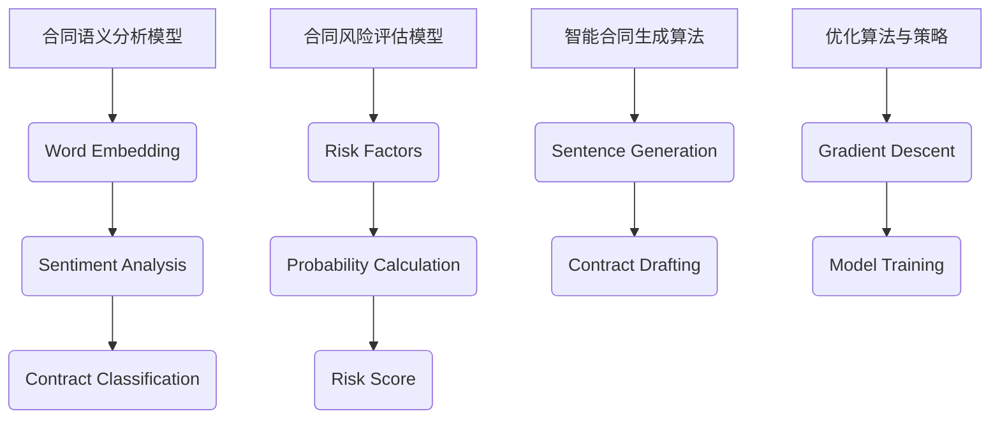

                 

### 文章标题

# 《智能合同管理系统：简化法律流程的创新工具》

### 关键词

- 智能合同管理系统
- 法律流程简化
- 自然语言处理
- 人工智能算法
- 合同自动化分析

### 摘要

本文旨在探讨智能合同管理系统在简化法律流程中的创新应用。通过引入自然语言处理和人工智能算法，智能合同管理系统能够自动化合同解析、风险分析和生成建议，从而显著提高合同管理效率。本文将首先介绍智能合同管理系统的基本概念和背景，随后深入分析其架构设计、核心技术、数学模型及算法，并分享实际项目案例和开发经验。最后，我们将总结智能合同管理系统的优势、局限性和未来发展方向，为读者提供全面的技术洞察和应用指南。

### 《智能合同管理系统：简化法律流程的创新工具》目录大纲

#### 第一部分：引言与背景

## 1.1 智能合同管理系统概述

### 1.1.1 智能合同管理系统的定义

智能合同管理系统是一种利用先进的人工智能技术和自然语言处理方法，对合同文本进行自动化分析、处理和管理的系统。它通过智能解析合同条款，自动识别合同关键信息，进行风险分析和决策支持，从而简化合同管理流程，提升工作效率。

### 1.1.2 智能合同管理系统的意义

智能合同管理系统在法律领域具有重要的意义。首先，它能够提高合同管理的效率和准确性，减少人工干预和错误。其次，它能够降低合同管理的成本，为企业节约资源。此外，智能合同管理系统还能够提供实时监控和预警功能，帮助企业和律师及时应对合同纠纷和风险。

### 1.1.3 智能合同管理系统的现状与发展趋势

智能合同管理系统已经初步显示出其强大的应用潜力。随着人工智能技术的不断进步，智能合同管理系统的功能将更加完善，应用场景将更加广泛。未来，智能合同管理系统有望成为企业法律合规管理的重要工具，推动法律流程的全面智能化。

## 1.2 法律流程简化的需求分析

### 1.2.1 法律流程中存在的问题

传统的法律流程中存在诸多问题，如流程复杂、效率低下、成本高昂等。尤其是在合同管理方面，人工审核和录入合同信息容易出错，导致合同纠纷和损失。因此，简化和优化法律流程成为当前法律行业的迫切需求。

### 1.2.2 智能合同管理系统如何简化法律流程

智能合同管理系统通过自动化合同分析、风险管理和决策支持等功能，能够有效简化法律流程。例如，系统可以自动识别合同条款中的关键信息，进行智能归类和标注，从而简化合同审核和备案流程。同时，系统还可以对合同文本进行智能分析，识别潜在的法律风险，并提供相应的风险管理建议。

### 1.2.3 智能合同管理系统在法律领域的应用潜力

智能合同管理系统在法律领域具有广泛的应用潜力。首先，它可以为企业提供高效的合同管理解决方案，降低合同管理成本。其次，它可以为律师事务所提供智能化的法律咨询服务，提升法律服务效率。此外，智能合同管理系统还可以应用于跨境交易、招投标等场景，为企业和个人提供便捷、高效的法律服务。

#### 第二部分：智能合同管理系统的设计与实现

## 2.1 智能合同管理系统架构设计

### 2.1.1 系统架构概述

智能合同管理系统通常采用分层架构设计，包括数据层、服务层和展现层。数据层负责存储和管理合同数据；服务层提供合同分析、风险管理和决策支持等功能；展现层则为用户提供友好的操作界面和可视化数据展示。

### 2.1.2 数据层设计

数据层设计主要包括合同数据的存储结构和索引策略。通常，合同数据存储在关系数据库或分布式文件系统中，以支持高效的读取和写入操作。同时，使用全文索引技术，如 Elasticsearch，可以提高合同文本的搜索和匹配速度。

### 2.1.3 服务层设计

服务层设计是智能合同管理系统的核心部分，包括自然语言处理、人工智能算法和合同自动化分析等模块。服务层通过接口与数据层和展现层交互，实现合同数据的处理和分析。

### 2.1.4 展现层设计

展现层设计旨在为用户提供友好的操作界面和可视化数据展示。通常，展现层采用前端技术，如 React 或 Angular，实现动态的界面交互和实时数据更新。同时，使用可视化库，如 D3.js 或 ECharts，展示合同分析结果和风险指标。

## 2.2 智能合同管理系统核心技术

### 2.2.1 自然语言处理技术

自然语言处理（NLP）技术是智能合同管理系统的基础，包括文本分类、情感分析、命名实体识别和文本生成等。通过 NLP 技术，系统能够自动解析合同文本，提取关键信息，并进行智能分析。

### 2.2.2 人工智能算法

人工智能算法是智能合同管理系统智能化的关键，包括深度学习、强化学习和遗传算法等。这些算法用于合同文本的语义分析、风险评估和智能决策。

### 2.2.3 合同解析与自动化分析

合同解析与自动化分析模块是智能合同管理系统的核心功能，通过 NLP 和人工智能算法，系统能够自动提取合同条款、分类合同类型、识别潜在风险等。

### 2.2.4 智能决策与建议系统

智能决策与建议系统基于合同分析和风险评估结果，为用户提供智能化的合同管理建议，如合同条款优化、风险防范措施等。

## 2.3 数学模型和算法详解

### 2.3.1 合同语义分析模型

合同语义分析模型是一种基于深度学习的文本分类模型，用于自动分类合同类型和提取合同条款的关键信息。常见的模型包括卷积神经网络（CNN）和循环神经网络（RNN）。

### 2.3.2 合同风险评估模型

合同风险评估模型是一种基于机器学习的风险评估模型，用于识别合同中的潜在风险并评估风险程度。常见的模型包括逻辑回归、决策树和支持向量机（SVM）。

### 2.3.3 智能合同生成算法

智能合同生成算法是一种基于自然语言生成的文本生成模型，用于自动生成合同文本。常见的模型包括生成对抗网络（GAN）和 Transformer。

### 2.3.4 优化算法与策略

优化算法与策略用于智能合同管理系统的参数调整和模型优化。常见的优化算法包括梯度下降、随机梯度下降（SGD）和 Adam 优化器。

## 2.4 数学模型和算法伪代码

以下是智能合同管理系统中的数学模型和算法伪代码示例：



### 2.5 数学模型和算法举例说明

以下是智能合同管理系统中的数学模型和算法举例说明：

#### 2.5.1 合同语义分析示例

使用卷积神经网络（CNN）进行合同语义分析，伪代码如下：

```python
# 合同语义分析模型
def contract_semantic_analysis(text):
    # 文本预处理
    preprocessed_text = preprocess_text(text)
    
    # 词嵌入
    embedded_text = word_embedding(preprocessed_text)
    
    # 卷积神经网络模型
    model = create_cnn_model(embedded_text)
    
    # 预测合同类型
    contract_type = model.predict(preprocessed_text)
    
    return contract_type
```

#### 2.5.2 合同风险评估示例

使用逻辑回归进行合同风险评估，伪代码如下：

```python
# 合同风险评估模型
def contract_risk_assessment(contract):
    # 提取风险因素
    risk_factors = extract_risk_factors(contract)
    
    # 计算风险概率
    risk_probability = logistic_regression(risk_factors)
    
    # 评估风险得分
    risk_score = calculate_risk_score(risk_probability)
    
    return risk_score
```

#### 2.5.3 智能合同生成示例

使用生成对抗网络（GAN）进行智能合同生成，伪代码如下：

```python
# 智能合同生成算法
def contract_generation(input_text):
    # 文本预处理
    preprocessed_text = preprocess_text(input_text)
    
    # 生成对抗网络模型
    generator = create_gan_generator(preprocessed_text)
    
    # 生成合同文本
    generated_text = generator.generate(preprocessed_text)
    
    return generated_text
```

#### 2.5.4 优化算法应用示例

使用梯度下降优化模型参数，伪代码如下：

```python
# 优化算法与策略
def optimize_model(model, loss_function, learning_rate):
    # 初始化模型参数
    model.init_params()
    
    # 梯度下降优化
    for epoch in range(num_epochs):
        # 计算损失函数
        loss = loss_function(model)
        
        # 更新模型参数
        model.update_params(loss, learning_rate)
        
        # 打印训练进度
        print(f"Epoch {epoch}: Loss = {loss}")
```

#### 第三部分：项目实战

## 3.1 实际案例解析

### 3.1.1 案例一：企业间的智能合同管理系统应用

在某大型企业中，智能合同管理系统被用于简化企业间的合同管理流程。该系统通过自动化合同分析、分类和存储，提高了合同管理的效率和准确性。同时，系统提供的风险预警功能帮助企业在合同签订前识别潜在风险，降低了法律纠纷和损失。

### 3.1.2 案例二：智能合同管理系统在律师事务所的应用

某知名律师事务所采用智能合同管理系统，为客户提供智能化的法律咨询服务。该系统通过自动化合同解析和风险分析，提高了合同审核和管理的效率。同时，系统生成的合同条款建议和风险管理报告，为律师提供有力的决策支持，提升了法律服务质量和客户满意度。

### 3.1.3 案例三：跨境交易中的智能合同管理系统应用

在跨境交易中，智能合同管理系统被应用于简化合同管理和风险控制。系统通过自动化的合同翻译、分类和风险评估，提高了跨境交易的效率和安全性。同时，系统提供的智能决策建议，帮助企业和金融机构在交易过程中降低风险，提高了业务成功率。

## 3.2 开发环境搭建

### 3.2.1 开发环境准备

智能合同管理系统的开发环境包括操作系统、编程语言、数据库和开发工具等。通常，开发环境如下：

- 操作系统：Linux 或 macOS
- 编程语言：Python、JavaScript 或 Java
- 数据库：MySQL、PostgreSQL 或 MongoDB
- 开发工具：Visual Studio Code、PyCharm 或 IntelliJ IDEA

### 3.2.2 数据集准备

智能合同管理系统需要大量的合同数据用于训练和测试模型。数据集可以从公开数据集、企业内部数据或第三方数据提供商获取。数据集应包括合同文本、合同类型、风险因素等。

### 3.2.3 工具与框架安装

开发智能合同管理系统需要安装相关工具和框架，如 TensorFlow、PyTorch、Elasticsearch 等。安装方法可参考官方文档或开源社区提供的安装教程。

## 3.3 源代码实现与解读

### 3.3.1 源代码结构介绍

智能合同管理系统的源代码结构通常包括数据层、服务层和展现层。数据层负责数据存储和管理；服务层提供合同分析、风险管理和决策支持等功能；展现层为用户提供操作界面和可视化数据展示。

### 3.3.2 关键代码解读

以下为智能合同管理系统中的关键代码解读：

```python
# 数据层：合同数据存储与管理
class ContractDatabase:
    def __init__(self, database_url):
        self.database_url = database_url
        self.connection = connect_to_database(self.database_url)
    
    def save_contract(self, contract):
        # 保存合同数据到数据库
        save_to_database(self.connection, contract)
    
    def load_contract(self, contract_id):
        # 加载合同数据
        return load_from_database(self.connection, contract_id)
```

```java
// 服务层：合同语义分析
public class ContractSemanticAnalysis {
    public String analyzeContract(String contractText) {
        // 文本预处理
        String preprocessedText = preprocessText(contractText);
        
        // 词嵌入
        int[] embeddedText = wordEmbedding(preprocessedText);
        
        // 合同分类
        String contractType = contractClassifier.classify(embeddedText);
        
        return contractType;
    }
}
```

```javascript
// 展现层：合同风险监控
function displayRiskScore(riskScore) {
    // 更新风险分数显示
    document.getElementById("riskScore").textContent = riskScore;
    
    // 判断风险等级并设置颜色
    if (riskScore > 80) {
        document.getElementById("riskScore").style.color = "red";
    } else if (riskScore > 50) {
        document.getElementById("riskScore").style.color = "yellow";
    } else {
        document.getElementById("riskScore").style.color = "green";
    }
}
```

### 3.3.3 代码优化与分析

在智能合同管理系统的开发过程中，代码优化是提高系统性能和可维护性的关键。以下为代码优化示例：

```python
# 代码优化：减少数据库连接次数
class ContractDatabase:
    def __init__(self, database_url):
        self.database_url = database_url
        self.connection = connect_to_database(self.database_url)
    
    def save_contract(self, contract):
        # 使用数据库连接池，减少连接次数
        with self.connection池 as connection:
            save_to_database(connection, contract)
    
    def load_contract(self, contract_id):
        # 使用数据库连接池，减少连接次数
        with self.connection池 as connection:
            return load_from_database(connection, contract_id)
```

```java
// 代码优化：使用线程池提高处理效率
public class ContractProcessor {
    private ExecutorService executorService = Executors.newFixedThreadPool(10);
    
    public void processContract(String contractText) {
        executorService.submit(() -> {
            // 合同预处理
            String preprocessedText = preprocessText(contractText);
            
            // 合同分类
            String contractType = contractClassifier.classify(preprocessedText);
            
            // 存储合同数据
            contractDatabase.save_contract(contractType);
        });
    }
}
```

## 3.4 代码解读与分析

### 3.4.1 数据层实现解析

数据层主要负责合同数据的存储和管理。在智能合同管理系统中，数据层通常采用关系数据库或分布式文件系统。以下是数据层实现的解析：

- **关系数据库实现**：

```python
# 使用 MySQL 数据库存储合同数据
class ContractDatabase:
    def __init__(self, database_url):
        self.database_url = database_url
        self.connection = connect_to_database(self.database_url)
    
    def save_contract(self, contract):
        # 创建合同表
        create_contract_table(self.connection)
        
        # 插入合同数据
        insert_contract(self.connection, contract)
    
    def load_contract(self, contract_id):
        # 查询合同数据
        return select_contract(self.connection, contract_id)
```

- **分布式文件系统实现**：

```python
# 使用 HDFS 存储合同数据
class ContractDatabase:
    def __init__(self, hdfs_url):
        self.hdfs_url = hdfs_url
        self.hdfs = HDFS(self.hdfs_url)
    
    def save_contract(self, contract):
        # 将合同数据保存到 HDFS
        save_to_hdfs(self.hdfs, contract)
    
    def load_contract(self, contract_id):
        # 从 HDFS 读取合同数据
        return load_from_hdfs(self.hdfs, contract_id)
```

### 3.4.2 服务层实现解析

服务层是智能合同管理系统的核心部分，负责合同数据的处理和分析。以下是服务层实现的解析：

- **自然语言处理模块**：

```python
# 自然语言处理模块
class NLPService:
    def __init__(self, nlp_model):
        self.nlp_model = nlp_model
    
    def analyze_contract(self, contract_text):
        # 提取关键词
        keywords = extract_keywords(contract_text)
        
        # 提取实体
        entities = extract_entities(contract_text)
        
        # 分析合同条款
        clauses = analyze_clauses(contract_text)
        
        return keywords, entities, clauses
```

- **人工智能算法模块**：

```python
# 人工智能算法模块
class AIAlgorithmService:
    def __init__(self, algorithm_model):
        self.algorithm_model = algorithm_model
    
    def classify_contract(self, contract_data):
        # 合同分类
        contract_type = self.algorithm_model.classify(contract_data)
        
        return contract_type
    
    def assess_risk(self, contract_data):
        # 风险评估
        risk_score = self.algorithm_model.assess_risk(contract_data)
        
        return risk_score
```

### 3.4.3 展现层实现解析

展现层是智能合同管理系统与用户交互的界面。以下是展现层实现的解析：

- **前端实现**：

```javascript
// 前端代码：合同列表展示
function display_contract_list(contracts) {
    const contract_list = document.getElementById("contract_list");
    
    contracts.forEach(contract => {
        const li = document.createElement("li");
        li.textContent = contract.title;
        contract_list.appendChild(li);
    });
}

// 前端代码：合同详情展示
function display_contract_details(contract) {
    const contract_details = document.getElementById("contract_details");
    contract_details.innerHTML = `
        <h2>${contract.title}</h2>
        <p>${contract.content}</p>
    `;
}
```

- **后端实现**：

```python
# 后端代码：RESTful API
from flask import Flask, jsonify, request

app = Flask(__name__)

@app.route("/contracts", methods=["GET"])
def get_contracts():
    contracts = contract_service.get_all_contracts()
    return jsonify(contracts)

@app.route("/contracts/<int:contract_id>", methods=["GET"])
def get_contract(contract_id):
    contract = contract_service.get_contract(contract_id)
    return jsonify(contract)

if __name__ == "__main__":
    app.run()
```

#### 第四部分：总结与展望

## 4.1 智能合同管理系统总结

### 4.1.1 系统特点

智能合同管理系统的特点包括：

- **自动化合同分析**：通过自然语言处理和人工智能算法，自动提取合同关键信息，进行智能分类和标注。
- **高效的风险管理**：对合同文本进行风险分析和评估，提供智能化的风险管理建议。
- **实时监控与预警**：实时监控合同状态，及时发现潜在风险，为企业提供预警信息。
- **跨平台支持**：支持多种操作系统和浏览器，方便用户使用。

### 4.1.2 系统优势

智能合同管理系统的优势包括：

- **提高工作效率**：自动化合同管理，减少人工干预，提高合同处理效率。
- **降低管理成本**：通过智能化分析，减少合同纠纷和损失，降低法律风险。
- **提升决策质量**：智能化的风险分析和决策支持，帮助企业和律师做出更准确的决策。

### 4.1.3 系统局限性与改进方向

智能合同管理系统也存在一定的局限性，如：

- **准确性有待提高**：智能合同管理系统的分析结果可能受到自然语言处理技术的限制，存在一定程度的误差。
- **数据隐私问题**：合同数据可能涉及企业敏感信息，需要确保数据的安全和隐私。
- **模型依赖性**：智能合同管理系统依赖于先进的算法和大量数据，模型更新和训练需要大量的计算资源和时间。

改进方向包括：

- **提高算法准确性**：通过改进自然语言处理技术和人工智能算法，提高合同分析结果的准确性。
- **增强数据安全措施**：加强数据加密和访问控制，确保合同数据的安全和隐私。
- **优化模型训练和部署**：使用分布式计算和云计算技术，提高模型训练和部署的效率。

## 4.2 法律流程简化的未来展望

### 4.2.1 智能合同管理系统的发展趋势

随着人工智能技术的不断发展，智能合同管理系统将在法律流程简化中发挥更加重要的作用。未来发展趋势包括：

- **人工智能技术的深化应用**：智能合同管理系统将结合更多人工智能技术，如深度学习和强化学习，提高合同分析和管理能力。
- **跨行业应用**：智能合同管理系统将在更多行业和场景中得到应用，如金融、房地产、医疗等。
- **开放共享平台**：智能合同管理系统将构建开放共享平台，促进法律流程的全面智能化。

### 4.2.2 法律流程简化的潜力与挑战

法律流程简化的潜力在于：

- **提高效率**：通过自动化和智能化手段，大幅提高法律流程的效率，降低成本。
- **降低风险**：通过智能化的风险分析和预警，帮助企业预防和应对法律风险。

法律流程简化的挑战包括：

- **技术瓶颈**：智能合同管理系统的准确性和技术稳定性仍需提高。
- **法律法规更新**：随着法律法规的不断完善和更新，智能合同管理系统需要不断调整和优化。
- **数据隐私保护**：合同数据涉及企业敏感信息，数据隐私保护面临严峻挑战。

### 4.2.3 智能合同管理系统在法律领域的未来应用场景

未来，智能合同管理系统将在法律领域有广泛的应用场景，包括：

- **合同管理**：自动化合同生成、审核、备案和存储，提高合同管理效率。
- **法律咨询**：提供智能化的法律咨询和风险评估，帮助企业和个人应对法律纠纷。
- **跨境交易**：简化跨境合同管理流程，提高跨境交易的安全性和效率。
- **智能裁判**：辅助法官进行案件分析和判决，提高司法效率。

## 附录

### 附录 A：相关工具与资源

#### A.1 开源框架与工具

- **TensorFlow**：用于深度学习的开源框架，支持多种神经网络架构和算法。
- **PyTorch**：用于深度学习的开源框架，具有灵活的动态计算图和高效的模型训练。
- **Elasticsearch**：用于全文搜索和实时分析的分布式搜索引擎。
- **Flask**：用于构建 Web 应用程序的开源框架。

#### A.2 数据集与案例资源

- **Kaggle**：提供丰富的机器学习数据集和竞赛案例。
- **OpenSubtitles**：包含大量电影和电视剧字幕数据，可用于自然语言处理任务。
- **Stanford NLP Group**：提供多种自然语言处理数据集和工具。

#### A.3 学术论文与研究报告

- **《自然语言处理技术综述》**：介绍自然语言处理的基本概念和技术。
- **《人工智能在法律领域的应用研究》**：探讨人工智能在法律领域的应用前景和挑战。
- **《智能合同管理系统设计与实现》**：详细讨论智能合同管理系统的架构设计和技术实现。

### 附录 B：数学公式与算法说明

#### B.1 合同语义分析模型

- **文本分类模型**：
  $$ \text{合同类型} = \text{softmax}(\text{模型}(\text{合同文本})) $$
  
- **语义相似度计算**：
  $$ \text{相似度} = \text{cosine}(\text{合同文本}，\text{标准文本}) $$

#### B.2 合同风险评估模型

- **逻辑回归模型**：
  $$ \text{风险概率} = \frac{1}{1 + \text{exp}(-\text{模型}(\text{风险因素}))} $$

- **风险得分计算**：
  $$ \text{风险得分} = \text{模型}(\text{风险概率}) $$

#### B.3 智能合同生成算法

- **生成对抗网络（GAN）**：
  $$ \text{生成器}：\text{G}(\text{噪声}) \rightarrow \text{合同文本} $$
  $$ \text{判别器}：\text{D}(\text{合同文本}) \rightarrow \text{概率} $$

#### B.4 优化算法与策略

- **梯度下降优化**：
  $$ \text{参数} = \text{参数} - \text{学习率} \times \text{梯度} $$

- **Adam优化器**：
  $$ m_t = \beta_1 m_{t-1} + (1 - \beta_1) \frac{\partial L}{\partial \theta} $$
  $$ v_t = \beta_2 v_{t-1} + (1 - \beta_2) (\frac{\partial L}{\partial \theta} - m_t)^2 $$
  $$ \theta = \theta - \frac{\text{学习率}}{\sqrt{1 - \beta_2^t} (1 - \beta_1^t)} \times \frac{m_t}{\sqrt{v_t} + \epsilon} $$

**作者信息：**

作者：AI天才研究院/AI Genius Institute & 禅与计算机程序设计艺术 /Zen And The Art of Computer Programming

