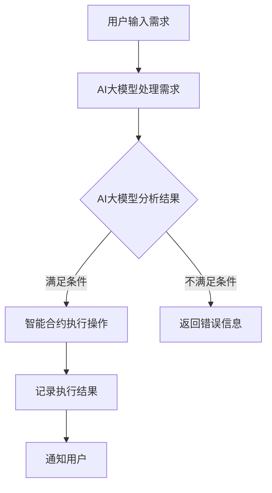

                 

### 文章标题

《智能合约与AI大模型：区块链领域的新机遇》

关键词：智能合约、AI大模型、区块链技术、技术原理、应用实例、未来趋势

摘要：本文深入探讨了智能合约与AI大模型的结合及其在区块链领域的新机遇。文章首先概述了智能合约和AI大模型的发展背景和核心概念，然后详细分析了两者的基础原理和技术实现。接着，文章阐述了智能合约与AI大模型结合的原理与优势，以及面临的挑战和解决方案。随后，文章通过实际应用实例展示了两者结合的效果和潜力，最后对未来的发展趋势进行了展望，并提出了相关安全性的对策和建议。本文旨在为读者提供一个全面、系统的智能合约与AI大模型结合的技术分析，帮助理解其在区块链领域的重要性。

---

### 第一部分：智能合约与AI大模型基础

#### 第1章：智能合约与AI大模型概述

##### 1.1 智能合约与AI大模型的发展背景

###### 1.1.1 区块链技术的发展历程

区块链技术自2008年比特币的诞生以来，经历了从实验性技术到全球范围内广泛关注和应用的过程。区块链的去中心化、不可篡改和透明性等特点，使得其在金融、供应链管理、医疗等多个领域展现出了巨大的潜力。智能合约作为区块链技术的核心组件之一，它的出现标志着区块链技术从简单的价值传输工具向复杂的应用平台转变。

智能合约的概念起源于1995年，由逻辑学家尼克·萨博（Nick Szabo）提出。他定义智能合约为一套以计算机代码形式表示的协议，该协议自动执行、控制或记录符合协议条款的交易或行为。智能合约通过编程逻辑确保在满足特定条件时自动执行相应的操作，无需依赖第三方中介。

随着区块链技术的不断发展，智能合约的应用场景也在不断拓展。早期的智能合约主要集中在简单、标准化的金融交易领域，例如去中心化交易平台、数字资产交易等。近年来，随着智能合约平台的成熟和技术的进步，智能合约的应用已经延伸到更多复杂的业务场景，如供应链金融、物联网、版权管理等领域。

###### 1.1.2 智能合约的概念与特点

智能合约是一种在区块链上执行的计算机协议，其本质是通过代码实现业务逻辑，从而自动执行合同条款。与传统的纸质合同相比，智能合约具有以下几个显著特点：

1. **去中心化**：智能合约运行在区块链网络中，不依赖于任何中央机构，这使得智能合约具备高度的去中心化特性。
2. **透明性**：区块链是一个公开的分布式账本，智能合约的执行过程对所有网络参与者透明可见，确保了合同执行的公正性和可信度。
3. **自动化**：智能合约基于代码执行，可以在满足特定条件时自动执行预定的操作，从而避免了人为干预和执行偏差。
4. **不可篡改**：由于区块链的特性，智能合约一旦执行，其内容便不可更改，保证了合同条款的严格执行。

智能合约的这些特点，使其在处理金融交易、供应链管理、版权保护等场景中具有明显的优势，能够提高交易的效率、降低成本、增强信任。

###### 1.1.3 AI大模型的发展及其影响

人工智能（AI）作为当代最具变革性的技术之一，其发展速度之快，影响范围之广，使得AI已经成为许多行业转型升级的重要驱动力。AI大模型，特别是深度学习模型的兴起，极大地推动了人工智能技术的应用和发展。

AI大模型，尤其是基于神经网络的大规模模型，通过学习海量的数据，可以自动识别复杂模式、进行预测和决策。这些模型的应用，不仅改变了传统的数据处理方式，还开创了诸多新的业务模式和机会。例如，在金融领域，AI大模型可以用于风险评估、信用评分、市场预测等；在医疗领域，AI大模型可以辅助诊断、制定治疗方案；在工业领域，AI大模型可以优化生产流程、提高产品质量。

近年来，随着计算能力的提升、数据规模的扩大和算法的进步，AI大模型的应用越来越广泛，其影响也越来越深远。特别是在区块链领域，AI大模型的应用为智能合约带来了新的机遇和挑战。

##### 1.2 智能合约与AI大模型的核心概念

###### 1.2.1 智能合约的定义与工作原理

智能合约是一种运行在区块链网络上的计算机协议，它通过预设的条件和逻辑规则，自动执行符合合同条款的交易或行为。智能合约的基本工作原理可以概括为以下几个步骤：

1. **编写代码**：开发者使用特定的编程语言（如Solidity、Vyper等）编写智能合约的代码，定义合同条款和执行逻辑。
2. **部署合约**：将编写的智能合约代码上传到区块链网络，并通过特定的交易将其部署到区块链上。
3. **交互执行**：当满足智能合约预设的条件时，区块链网络中的节点会自动执行相应的操作，如转移数字资产、更新状态变量等。
4. **记录结果**：智能合约执行的结果会被永久记录在区块链上，供所有网络参与者查询和验证。

智能合约的关键特性包括去中心化、透明性、自动化和不可篡改性。这些特性使得智能合约在处理高价值、高风险交易时，能够提供更高的安全性和效率。

###### 1.2.2 AI大模型的概念与主要类型

AI大模型是指通过深度学习等算法，在大量数据上训练得到的具有强大学习能力的人工智能模型。这些模型通常具有以下几种类型：

1. **神经网络模型**：包括卷积神经网络（CNN）、循环神经网络（RNN）、长短时记忆网络（LSTM）等，广泛应用于图像识别、语音识别、自然语言处理等领域。
2. **生成对抗网络（GAN）**：由生成器和判别器组成，用于生成逼真的数据，常用于图像生成、文本生成等场景。
3. **强化学习模型**：通过学习环境和目标，自动优化策略，用于游戏、自动驾驶等复杂决策场景。

AI大模型的核心在于其通过学习海量数据，能够自动发现和提取复杂的模式，从而进行高精度的预测和决策。这种能力，使得AI大模型在各个领域都展现出了巨大的应用潜力。

###### 1.2.3 智能合约与AI大模型的结合与优势

智能合约与AI大模型的结合，可以极大地拓展智能合约的应用范围和功能。具体来说，这种结合带来了以下几个显著优势：

1. **增强智能合约的决策能力**：通过AI大模型，智能合约可以自动学习和适应复杂的环境，提高决策的精度和效率。
2. **优化智能合约的执行流程**：AI大模型可以优化智能合约的执行流程，减少人为干预，提高执行效率和透明度。
3. **增强智能合约的安全性和鲁棒性**：AI大模型可以用于智能合约的安全审计和漏洞检测，提高智能合约的安全性和可靠性。
4. **拓展智能合约的应用场景**：AI大模型的应用，使得智能合约能够应用于更多复杂的业务场景，如智能投资、供应链管理、医疗健康等。

总的来说，智能合约与AI大模型的结合，为区块链技术带来了新的发展机遇，也为各种业务场景提供了更高效、更智能的解决方案。

##### 1.3 主流智能合约平台与AI大模型技术

###### 1.3.1 智能合约平台综述

目前，市场上存在多个主流的智能合约平台，各具特色，支持不同的编程语言和生态系统。以下是几个主要的智能合约平台：

1. **Ethereum**：以太坊是当前最流行的智能合约平台之一，其采用了Solidity编程语言，支持复杂的智能合约开发。以太坊的智能合约生态系统非常丰富，包括各种去中心化应用（DApps）和智能合约框架。
2. **EOS**：EOS是一个高性能的智能合约平台，采用了C++编程语言，致力于实现大规模去中心化应用。EOS引入了委托权益证明（DPOS）共识机制，能够实现高吞吐量的交易处理。
3. **Binance Smart Chain**：BSC是基于Ethereum智能合约平台的扩展，采用了BEP20代币标准，支持智能合约和去中心化金融（DeFi）应用。BSC具有快速、低成本的交易特性，吸引了大量的开发者。
4. **Tron**：Tron是一个基于Java编程语言的智能合约平台，旨在创建一个全球范围内的去中心化内容娱乐系统。Tron通过支持智能合约，实现了内容的创作、分发和交易的去中心化。

这些智能合约平台各有优劣，选择合适的平台需要根据具体的应用场景和需求进行权衡。

###### 1.3.2 AI大模型技术综述

AI大模型技术的发展，主要依赖于深度学习和神经网络等算法的进步。以下是几种主要的AI大模型技术：

1. **深度学习模型**：深度学习模型，特别是卷积神经网络（CNN）、循环神经网络（RNN）和长短时记忆网络（LSTM），在图像识别、自然语言处理等领域取得了显著的成果。通过训练大规模的数据集，这些模型能够自动学习和提取复杂的模式。
2. **生成对抗网络（GAN）**：GAN由生成器和判别器组成，通过对抗训练生成逼真的数据。GAN在图像生成、视频合成等场景中展示了强大的应用能力。
3. **强化学习模型**：强化学习模型通过学习环境和目标，自动优化策略，常用于游戏、自动驾驶等领域。强化学习模型能够处理复杂的动态环境，并作出最优决策。
4. **迁移学习与联邦学习**：迁移学习和联邦学习是解决数据隐私和保护的重要技术。迁移学习通过在已有模型的基础上进行微调，实现了模型在不同数据集上的高效训练。联邦学习通过分布式训练，保护了数据隐私，同时实现了模型优化。

这些技术为AI大模型的应用提供了多种选择，使得AI大模型能够在不同的场景中发挥其优势。

###### 1.3.3 主流智能合约平台与AI大模型的兼容性分析

智能合约平台与AI大模型的兼容性，是两者结合的关键。目前，主流智能合约平台在AI大模型的支持方面存在一定的差异：

1. **Ethereum**：以太坊是支持AI大模型最成熟的智能合约平台之一。开发者可以在以太坊上部署AI模型合约，并利用智能合约的触发机制，实现AI驱动的智能合约。以太坊的智能合约生态系统丰富，为AI大模型的应用提供了广泛的支持。
2. **EOS**：EOS支持智能合约，但其主要关注点是提高交易处理能力和降低成本，对于AI大模型的支持相对较弱。开发者需要在EOS上自行实现AI模型，并通过智能合约进行调用。
3. **Binance Smart Chain**：BSC作为以太坊的扩展，同样支持智能合约和AI大模型。开发者可以利用BSC的低成本优势，部署AI大模型，并利用智能合约实现自动化操作。
4. **Tron**：Tron支持智能合约，但其主要应用场景是内容娱乐领域。开发者需要在Tron上自行实现AI模型，并通过智能合约进行调用。

总体来说，以太坊是当前支持AI大模型最全面的智能合约平台。其他平台虽然也有一定的支持，但在生态系统和社区活跃度方面，相对较弱。

##### 1.4 智能合约与AI大模型的应用场景

###### 1.4.1 智能合约在金融领域的应用

智能合约在金融领域的应用非常广泛，通过自动化和去中心化的方式，提高了交易效率和安全性。以下是智能合约在金融领域的一些典型应用：

1. **去中心化金融（DeFi）**：DeFi通过智能合约实现了金融服务的去中心化，如贷款、交易、投资等。智能合约自动执行交易规则，确保了交易的安全性和透明性。
2. **数字资产管理**：智能合约可以用于管理数字资产，如代币发行、转账、交易等。通过智能合约，数字资产的转移和交易变得更加高效和透明。
3. **保险与理赔**：智能合约可以自动执行保险合同的条款，如自动理赔。在满足特定条件时，智能合约会自动释放保险金，减少了人为干预和欺诈风险。
4. **跨境支付**：智能合约可以简化跨境支付流程，通过自动化和去中心化的方式，提高了支付的速度和安全性。智能合约确保了支付过程中的透明性和不可篡改性。

###### 1.4.2 AI大模型在供应链管理中的应用

AI大模型在供应链管理中发挥着重要作用，通过自动化和智能化的方式，提高了供应链的效率和管理水平。以下是AI大模型在供应链管理中的一些典型应用：

1. **需求预测**：AI大模型可以通过学习历史数据，预测未来的需求变化，帮助供应链管理者做出更精准的库存管理决策，减少库存积压和缺货风险。
2. **物流优化**：AI大模型可以优化物流路线和运输计划，减少运输成本，提高运输效率。例如，通过路径优化算法，智能合约可以自动选择最优的物流路线。
3. **风险管理**：AI大模型可以用于风险评估和管理，通过分析供应链中的各种风险因素，预测潜在的风险并制定相应的应对策略。
4. **供应链金融**：AI大模型可以用于供应链金融风控，如贷款风险评估、信用评分等。通过智能合约，可以自动化地进行贷款审核和放款，提高金融服务的效率。

###### 1.4.3 智能合约与AI大模型在其他领域的应用探讨

除了金融和供应链管理，智能合约与AI大模型在其他领域也有广泛的应用潜力：

1. **医疗健康**：智能合约可以用于医疗记录的管理和共享，确保数据的真实性和安全性。AI大模型可以用于疾病预测、诊断和治疗方案制定，提高医疗服务的质量和效率。
2. **司法与法律**：智能合约可以用于合同管理、诉讼流程管理等方面，提高法律事务的效率和透明度。AI大模型可以用于法律文本分析、案例推理等，辅助法律工作者做出更准确的决策。
3. **版权管理**：智能合约可以用于数字版权的管理和交易，确保版权的归属和交易的透明性。AI大模型可以用于版权内容的识别和保护，减少版权侵权行为。
4. **能源管理**：智能合约可以用于能源交易和管理，如智能电网、分布式能源系统等。AI大模型可以用于能源需求的预测和管理，提高能源利用效率和可持续性。

智能合约与AI大模型的结合，为各个领域带来了新的机遇和挑战，其应用场景将不断拓展，为人类社会带来更多的价值。

---

**Mermaid 流程图示例：智能合约与AI大模型结合的工作流程**



**智能合约原理与机制**

智能合约是一种自动执行的计算机协议，其运行在区块链网络中。智能合约的工作流程主要包括以下几个步骤：

1. **编写代码**：开发者使用特定的编程语言（如Solidity）编写智能合约的代码，定义合同条款和执行逻辑。
2. **部署合约**：将编写的智能合约代码上传到区块链网络，并通过特定的交易将其部署到区块链上。
3. **交互执行**：当满足智能合约预设的条件时，区块链网络中的节点会自动执行相应的操作，如转移数字资产、更新状态变量等。
4. **记录结果**：智能合约执行的结果会被永久记录在区块链上，供所有网络参与者查询和验证。

智能合约的核心机制包括：

1. **事件日志**：智能合约在执行过程中，会生成一系列的事件日志，记录下所有关键操作的执行情况。这些日志对后续的审计和调试至关重要。
2. **状态变量**：智能合约维护一系列的状态变量，用于记录执行过程中的关键数据，如余额、合同条款等。
3. **存储空间**：智能合约需要一定的存储空间来保存代码和数据。不同区块链平台的存储空间限制不同，开发者需要在设计智能合约时充分考虑存储需求。

智能合约的执行环境通常由以下几部分组成：

1. **虚拟机**：智能合约的执行环境通常是一个虚拟机，如EVM（以太坊虚拟机）。虚拟机负责解释和执行智能合约的代码。
2. **节点网络**：区块链网络中的所有节点都会参与智能合约的执行和验证。节点通过共识算法和网络通信，确保智能合约的执行结果一致。
3. **安全机制**：智能合约的执行环境需要具备一定的安全机制，以防止恶意攻击和漏洞利用。常见的安全机制包括访问控制、代码审计、加密算法等。

智能合约的安全性是开发过程中必须重点关注的问题。以下是一些常见的智能合约安全漏洞和防护策略：

1. **重入攻击**：恶意代码可以在执行过程中多次调用自身，导致资金被盗。防护策略包括使用“检查-提款-检查”模式（Check-Call-Transfer）。
2. **整数溢出**：整数运算错误可能导致智能合约的执行结果与预期不符。防护策略包括使用安全的数学库和限制操作数的大小。
3. **未授权访问**：恶意用户可以未授权访问智能合约的内部数据或执行操作。防护策略包括使用访问控制和权限管理。
4. **代码漏洞**：智能合约代码中可能存在各种漏洞，如缓冲区溢出、拒绝服务攻击等。防护策略包括代码审计和漏洞扫描。

通过深入理解和应用这些原理和机制，开发者可以设计出安全、高效、可靠的智能合约，为区块链应用提供坚实的基础。

### AI大模型原理与架构

##### 3.1 AI大模型原理与架构

AI大模型，特别是深度学习模型，是当前人工智能领域的研究热点和应用核心。它们通过学习海量数据，能够自动识别复杂模式、进行预测和决策。下面，我们将从基本原理、层次结构、学习与优化方法等方面，详细阐述AI大模型的原理与架构。

###### 3.1.1 AI大模型的基本原理

AI大模型是基于神经网络（Neural Networks）的复杂算法。神经网络是一种模拟生物神经系统的计算模型，通过大量的神经元和神经元之间的连接（即权重）来学习和处理信息。深度学习（Deep Learning）是神经网络的一种扩展，通过增加神经网络的层数，使其能够学习更复杂、更抽象的特征。

AI大模型的基本原理可以概括为以下几点：

1. **数据输入**：AI大模型首先接收输入数据，这些数据可以是图像、文本、音频等各种形式。
2. **特征提取**：通过多层神经网络，模型对输入数据进行特征提取和转换，每一层都会提取更高层次的特征。
3. **非线性变换**：神经网络通过非线性变换（如ReLU、Sigmoid、Tanh等）来增强模型的表示能力。
4. **损失函数**：模型通过比较预测结果与真实结果，使用损失函数（如均方误差、交叉熵等）计算预测误差。
5. **反向传播**：模型使用反向传播算法更新权重，最小化损失函数，优化模型的参数。

###### 3.1.2 AI大模型的层次结构

AI大模型通常具有多个层次，每个层次负责提取不同级别的特征。以下是AI大模型常见的层次结构：

1. **输入层**：接收外部输入，如图像、文本或音频。
2. **隐藏层**：对输入数据进行特征提取和转换，每个隐藏层都可以提取更高层次的特征。
3. **输出层**：根据提取的特征进行分类、预测或决策。

常见的AI大模型层次结构包括：

1. **单层感知器**：最简单的神经网络结构，仅包含输入层和输出层，用于简单的线性分类任务。
2. **多层感知器**：包含多个隐藏层，可以处理更复杂的非线性分类和回归问题。
3. **卷积神经网络（CNN）**：通过卷积层和池化层，特别适合处理图像数据。
4. **循环神经网络（RNN）**：通过时间步和隐藏状态，适合处理序列数据。
5. **长短时记忆网络（LSTM）**：是RNN的扩展，可以解决长序列依赖问题。
6. **生成对抗网络（GAN）**：由生成器和判别器组成，用于生成真实的数据。
7. **变分自编码器（VAE）**：通过概率模型生成数据，适用于数据压缩和生成任务。

###### 3.1.3 AI大模型的学习与优化方法

AI大模型的学习过程主要包括数据预处理、模型初始化、前向传播、反向传播和参数优化等步骤。

1. **数据预处理**：包括数据清洗、归一化、数据增强等操作，以提高模型的泛化能力和鲁棒性。
2. **模型初始化**：初始化模型参数，通常采用随机初始化或启发式方法，以避免梯度消失或爆炸问题。
3. **前向传播**：将输入数据通过模型网络，逐层计算输出结果，同时记录每个层次的中间结果和梯度信息。
4. **反向传播**：利用链式法则，计算损失函数关于模型参数的梯度，反向传播至模型的每个层次。
5. **参数优化**：使用梯度下降（Gradient Descent）或其变种（如随机梯度下降、Adam优化器等），更新模型参数，最小化损失函数。

AI大模型的优化方法主要包括：

1. **梯度下降**：最简单的优化方法，通过梯度方向更新参数，逐渐逼近最优解。
2. **随机梯度下降（SGD）**：在每个训练样本上计算梯度，更新参数，适用于小批量数据。
3. **批量梯度下降**：在每个训练样本上计算梯度，更新参数，适用于大数据集。
4. **Adam优化器**：结合了SGD和动量法的优点，适用于大规模模型。
5. **自适应优化器**：如RMSprop、Adadelta等，通过自适应学习率优化模型。

通过这些学习与优化方法，AI大模型能够不断改进其性能，从数据中学习到复杂的模式，并在各种任务中取得优异的表现。

---

**神经网络算法的伪代码示例**

```plaintext
// 输入：X（输入数据），W（权重），b（偏置），a（激活函数）
// 输出：y_pred（预测结果）

// 前向传播
for each layer in network:
    z = X * W + b
    a = activate(z)

// 反向传播
for each layer in reversed network:
    delta = (a - y) * activate_derivative(z)
    dW = delta * X
    db = delta
    X = W

// 更新参数
W = W - learning_rate * dW
b = b - learning_rate * db
```

**数学模型和公式详细讲解**

在AI大模型中，数学模型和公式是核心组成部分，用于描述模型的计算过程和优化方法。以下是几个关键的数学模型和公式的详细讲解：

1. **损失函数**

   损失函数用于衡量模型预测结果与真实结果之间的差距。常见的损失函数包括均方误差（MSE）和交叉熵（Cross Entropy）。

   - **均方误差（MSE）**：

     $$MSE = \frac{1}{n}\sum_{i=1}^{n}(y_i - \hat{y}_i)^2$$

     其中，\(y_i\)为真实标签，\(\hat{y}_i\)为模型预测值，\(n\)为样本数量。

   - **交叉熵（Cross Entropy）**：

     $$H(y, \hat{y}) = -\sum_{i=1}^{n}y_i \log(\hat{y}_i)$$

     其中，\(y_i\)为真实标签的概率分布，\(\hat{y}_i\)为模型预测值的概率分布。

2. **反向传播算法**

   反向传播算法用于计算损失函数关于模型参数的梯度，并更新参数以最小化损失函数。其核心公式包括：

   - **前向传播**：

     $$z^{(l)} = \sum_{j} W^{(l)}_{ji}a^{(l-1)}_j + b^{(l)}$$

     $$a^{(l)} = \sigma(z^{(l)})$$

     其中，\(z^{(l)}\)为第\(l\)层的中间值，\(a^{(l)}\)为第\(l\)层的输出值，\(\sigma\)为激活函数，\(W^{(l)}_{ji}\)为权重，\(b^{(l)}\)为偏置。

   - **反向传播**：

     $$\delta^{(l)} = (\sigma'(z^{(l)}) \cdot (z^{(l+1)} - \delta^{(l+1)}))$$

     $$dW^{(l)} = \delta^{(l)}a^{(l-1)}^T$$

     $$db^{(l)} = \delta^{(l)}$$

     其中，\(\delta^{(l)}\)为误差项，\(\sigma'(\cdot)\)为激活函数的导数。

3. **梯度下降优化**

   梯度下降是一种优化算法，用于更新模型参数，使其接近最优解。其核心公式为：

   $$\theta = \theta - \alpha \nabla_\theta J(\theta)$$

   其中，\(\theta\)为模型参数，\(\alpha\)为学习率，\(J(\theta)\)为损失函数。

通过这些数学模型和公式，AI大模型能够实现有效的学习与优化，从而在各类任务中取得优异的性能。

**举例说明**

假设我们有一个简单的线性回归模型，用于预测房价。输入特征为房屋面积（\(x\)），输出为房价（\(y\)）。我们的目标是找到最佳拟合直线，即找到权重（\(w\)）和偏置（\(b\)），使得预测误差最小。

1. **数据集**：

   - 输入特征 \(x\)：\[100, 200, 300, 400, 500\]
   - 输出标签 \(y\)：\[200, 400, 600, 800, 1000\]

2. **损失函数**：

   采用均方误差（MSE）作为损失函数：

   $$MSE = \frac{1}{5}\sum_{i=1}^{5}(y_i - (wx_i + b))^2$$

3. **前向传播**：

   初始化权重 \(w\) 和偏置 \(b\)，例如 \(w = 1, b = 0\)。通过前向传播计算预测值：

   $$y_pred = wx_i + b$$

   对于每个输入特征 \(x_i\)，计算预测值：

   - 当 \(x = 100\) 时，\(y_pred = 100 \cdot 1 + 0 = 100\)
   - 当 \(x = 200\) 时，\(y_pred = 200 \cdot 1 + 0 = 200\)
   - 当 \(x = 300\) 时，\(y_pred = 300 \cdot 1 + 0 = 300\)
   - 当 \(x = 400\) 时，\(y_pred = 400 \cdot 1 + 0 = 400\)
   - 当 \(x = 500\) 时，\(y_pred = 500 \cdot 1 + 0 = 500\)

4. **反向传播**：

   通过反向传播计算权重 \(w\) 和偏置 \(b\) 的梯度：

   $$\delta_w = \frac{1}{5}\sum_{i=1}^{5}(y_i - y_pred)x_i$$

   $$\delta_b = \frac{1}{5}\sum_{i=1}^{5}(y_i - y_pred)$$

   例如，对于 \(x = 100, y = 200\)，计算梯度：

   $$\delta_w = \frac{1}{5}(200 - 100) \cdot 100 = 100$$

   $$\delta_b = \frac{1}{5}(200 - 100) = 20$$

5. **参数更新**：

   使用梯度下降更新权重 \(w\) 和偏置 \(b\)：

   $$w = w - \alpha \cdot \delta_w$$

   $$b = b - \alpha \cdot \delta_b$$

   例如，设学习率 \(\alpha = 0.1\)，更新权重和偏置：

   $$w = 1 - 0.1 \cdot 100 = -9$$

   $$b = 0 - 0.1 \cdot 20 = -2$$

通过多次迭代更新，我们可以找到最佳拟合直线，使得预测误差最小。

---

**最佳实践 Tips、小结、注意事项、拓展阅读**

**最佳实践 Tips**：

- 在设计智能合约时，应尽可能简化代码，减少潜在的漏洞和攻击面。
- 定期进行代码审计和安全测试，及时发现并修复安全漏洞。
- 使用多个外部审计机构进行安全评估，以提高智能合约的安全性。
- 设计智能合约时，应充分考虑存储需求和优化数据结构，以提高性能和可扩展性。

**小结**：

智能合约与AI大模型的结合，为区块链技术带来了新的发展机遇。通过智能合约，AI大模型可以在区块链网络中实现自动化和去中心化的操作，提高效率和安全。然而，这种结合也带来了新的挑战，如安全性和性能问题。开发者需要在设计过程中充分考虑这些问题，并采取有效的策略进行解决。

**注意事项**：

- 在使用AI大模型进行智能合约操作时，应确保模型本身的准确性和鲁棒性。
- 智能合约与AI大模型的结合可能涉及大量的计算资源，开发者需要合理规划资源分配。
- 在部署智能合约时，应充分考虑网络的稳定性和交易费用。

**拓展阅读**：

- 《智能合约：设计和部署指南》
- 《深度学习：推荐算法与实战》
- 《区块链技术与应用》

通过深入学习这些资料，开发者可以更好地理解和应用智能合约与AI大模型结合的技术，为区块链应用提供更高效、更智能的解决方案。

