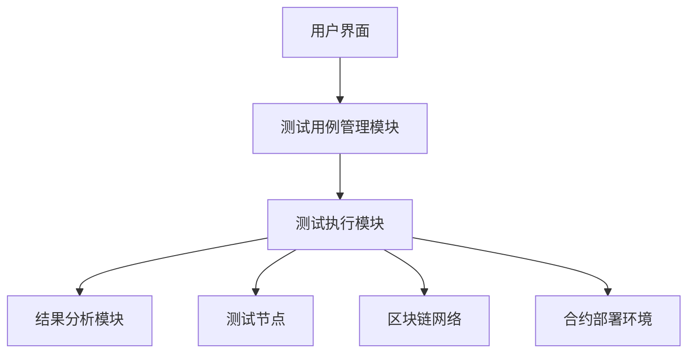
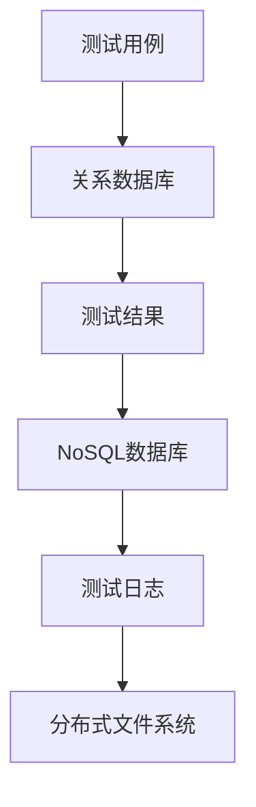
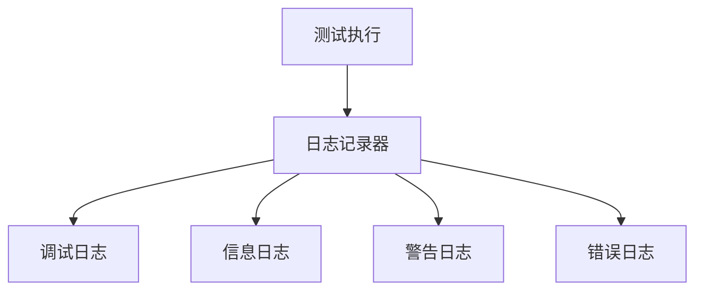

                 

### 文章标题

《智能合约自动化测试平台：区块链开发的创新工具》

### 关键词

智能合约、区块链、自动化测试、测试平台、开发工具、安全漏洞、性能优化

### 摘要

本文旨在探讨智能合约自动化测试平台在区块链开发中的应用，详细分析其背景、核心概念、测试方法及平台设计。首先，我们将介绍智能合约和区块链的基本概念，阐述它们之间的关系及在开发中的重要性。接着，我们将讨论自动化测试的基础知识，包括其定义、分类、优势与挑战，以及适用的工具和框架。随后，我们将深入探讨智能合约测试的具体方法，如单元测试、集成测试、功能测试和性能测试，并介绍几种流行的自动化测试框架。文章还将详细描述一个智能合约自动化测试平台的设计与实现，涵盖平台架构、功能实现、部署与运维等方面。最后，我们将通过实际案例展示平台的实践应用，并展望智能合约自动化测试领域的未来发展趋势和挑战。

### 《智能合约自动化测试平台：区块链开发的创新工具》目录大纲

**第一部分：智能合约与区块链基础**

## 第1章：智能合约概述
### 1.1 智能合约的定义与历史
### 1.2 智能合约的原理与架构
### 1.3 智能合约的安全性问题

## 第2章：区块链技术基础
### 2.1 区块链的基本概念
### 2.2 区块链的组成与工作原理
### 2.3 区块链的优缺点与应用场景

**第二部分：智能合约自动化测试基础**

## 第3章：自动化测试概述
### 3.1 自动化测试的定义与分类
### 3.2 自动化测试的优势与挑战
### 3.3 自动化测试的工具与框架

## 第4章：智能合约测试方法
### 4.1 单元测试与集成测试
### 4.2 功能测试与性能测试
### 4.3 漏洞扫描与安全测试

## 第5章：智能合约自动化测试框架
### 5.1 框架的选择与设计
### 5.2 测试脚本的编写与执行
### 5.3 测试结果的分析与报告

**第三部分：智能合约自动化测试平台设计**

## 第6章：平台架构与关键技术
### 6.1 平台架构设计
### 6.2 数据存储与管理
### 6.3 异常处理与日志记录

## 第7章：平台功能实现
### 7.1 测试用例管理
### 7.2 测试执行与监控
### 7.3 测试结果分析与反馈

## 第8章：平台部署与运维
### 8.1 部署环境搭建
### 8.2 运维策略与流程
### 8.3 平台性能优化与升级

**第四部分：智能合约自动化测试实践**

## 第9章：案例分析
### 9.1 智能合约测试项目实战
### 9.2 测试用例设计实践
### 9.3 测试结果分析实践

## 第10章：开源智能合约自动化测试工具
### 10.1 Truffle
### 10.2 Ganache
### 10.3 Ethers.js

## 第11章：未来展望与挑战
### 11.1 智能合约测试领域的发展趋势
### 11.2 自动化测试面临的挑战与应对策略
### 11.3 智能合约自动化测试的创新应用方向

### 附录

## 附录A：相关工具与资源列表
### A.1 编程语言与开发工具
### A.2 智能合约开发框架
### A.3 自动化测试框架
### A.4 智能合约测试开源项目与论文参考文献

### 第1章：智能合约概述

智能合约是一种运行在区块链上的去中心化应用（DApp），它通过代码来执行合约条款，自动执行协议条款，无需第三方中介。智能合约的概念源于1990年代，由计算机科学家尼克·萨博（Nick Szabo）首次提出。他设想通过在区块链上实现可执行的合同条款，使得合同能够自动执行，从而降低交易成本，提高交易效率。

#### 1.1 智能合约的定义与历史

**1.1.1 智能合约的概念**

智能合约是一段代码，它能够自动执行当满足某些条件时，如支付金额到达指定账户、特定日期的到来等。它基于区块链技术的分布式账本，利用加密技术和智能合约语言编写，使合约条款代码化，从而实现去中心化的自动执行。

**1.1.2 智能合约的起源与发展**

智能合约的起源可以追溯到1990年代，当时尼克·萨博提出了智能合约的概念，但直到区块链技术的出现，智能合约才得以实现。2008年，中本聪（Satoshi Nakamoto）提出了比特币的概念，并首次实现了去中心化的区块链。随着以太坊（Ethereum）在2015年发布，智能合约技术得到了快速发展，以太坊支持基于图灵完备的智能合约语言Solidity，使开发者能够轻松编写复杂的智能合约。

**1.1.3 区块链与智能合约的关系**

区块链是智能合约的基础，它提供了一个去中心化的、不可篡改的账本，确保了智能合约的执行是公正和透明的。智能合约依赖于区块链的运行环境，通过将代码上传到区块链上，智能合约可以在区块链上进行验证和执行，确保合约条款的自动执行。

#### 1.2 智能合约的原理与架构

**1.2.1 智能合约的基本原理**

智能合约的工作原理基于区块链的共识机制。当智能合约的代码被上传到区块链后，它会经过验证和执行过程。验证过程包括代码的语法和语义检查，确保代码的有效性和安全性。执行过程则是根据合约条款，在满足特定条件时自动执行相应的操作，如转账资金、记录事件等。

**1.2.2 智能合约的运行环境**

智能合约的运行环境由区块链网络提供。以太坊是最常用的智能合约平台，它通过以太坊虚拟机（EVM）来执行智能合约代码。EVM是一个沙盒化的虚拟环境，它确保了智能合约代码的安全执行，防止恶意代码的攻击。

**1.2.3 智能合约的架构**

智能合约的架构通常包括三个部分：合约代码、合约状态和合约事件。

- **合约代码**：智能合约的核心部分，定义了合约的行为和功能。
- **合约状态**：存储合约运行过程中的数据，如余额、变量等。
- **合约事件**：合约在执行过程中触发的事件，如转账事件、合同完成事件等。事件可以通过链上日志进行记录和查询。

#### 1.3 智能合约的安全性问题

**1.3.1 智能合约安全的重要性**

智能合约的安全性至关重要，因为一旦出现漏洞，可能导致巨额财产损失和信任危机。智能合约一旦部署到区块链上，就无法更改，因此必须确保其安全性。

**1.3.2 常见的安全漏洞分析**

- **重新入攻击（Reentrancy Attack）**：攻击者通过重复调用某个函数来消耗合约资金。
- **整数溢出**：智能合约通常使用256位整数，整数溢出可能导致合约崩溃或损失资金。
- **存储漏洞**：存储数据未妥善处理，可能导致数据泄露或错误执行。

**1.3.3 智能合约安全性的保障措施**

- **代码审计**：对智能合约代码进行审计，寻找潜在的安全漏洞。
- **形式化验证**：使用数学方法验证智能合约的正确性。
- **安全测试**：通过自动化测试工具对智能合约进行安全测试，确保其无漏洞。

### 第2章：区块链技术基础

区块链是一种去中心化的分布式账本技术，通过加密和共识算法确保数据的不可篡改性和透明性。自比特币的诞生以来，区块链技术得到了广泛关注和应用。在本章中，我们将详细讨论区块链的基本概念、组成、工作原理及其优缺点。

#### 2.1 区块链的基本概念

**2.1.1 区块链的定义**

区块链是一个去中心化的数据库，由一系列按时间顺序排列的数据块组成。每个数据块包含一定数量的交易记录，通过加密和共识算法连接起来，形成一个不可篡改的分布式账本。

**2.1.2 区块链的关键特性**

- **去中心化**：区块链不依赖于中央机构，数据存储和验证由网络中的所有节点共同完成。
- **不可篡改**：一旦数据记录到区块链上，就很难被篡改，因为需要同时改变多个节点上的数据。
- **透明性**：区块链上的数据对所有节点都是透明的，可以通过链上日志进行查询和验证。
- **安全性**：区块链使用加密技术确保数据的安全性和隐私性。

**2.1.3 区块链的分类**

- **公有链**：任何人都可以参与，如比特币和以太坊。
- **私有链**：仅限特定组织或群体使用，如企业内部的区块链。
- **联盟链**：多个组织合作构建，数据共享但节点数量有限。

#### 2.2 区块链的组成与工作原理

**2.2.1 区块链的组成部分**

区块链由三个主要组成部分构成：区块、链和节点。

- **区块**：包含一定数量的交易记录，加上时间戳、难度目标等元数据，并通过加密算法与前一个区块连接。
- **链**：由一系列按时间顺序排列的区块组成，形成一条不可篡改的链。
- **节点**：运行区块链软件的计算机，负责验证交易、添加区块和同步数据。

**2.2.2 区块链的工作原理**

区块链的工作原理可以分为以下几个步骤：

1. **交易**：用户发起交易，交易包含发送方、接收方和金额等信息。
2. **验证**：节点验证交易的有效性，如检查金额是否足够、交易是否重复等。
3. **共识**：通过共识算法（如工作量证明、权益证明等）达成全网一致，确定交易是否被包含在下一个区块中。
4. **记录**：将交易记录到区块中，并添加到区块链上。
5. **同步**：节点同步区块链数据，确保全网数据一致性。

**2.2.3 区块链的共识算法**

共识算法是区块链的核心机制，用于确保全网节点的数据一致性。常见的共识算法包括：

- **工作量证明（Proof of Work, PoW）**：节点通过计算大量工作量来争夺区块生成权，如比特币采用的SHA-256算法。
- **权益证明（Proof of Stake, PoS）**：根据节点持有的代币数量和锁仓时间来决定区块生成权，如以太坊2.0采用的Casper算法。
- **委托权益证明（Delegated Proof of Stake, DPoS）**：节点选举代表来生成区块，代表根据代币持有量来决定权益。

#### 2.3 区块链的优缺点与应用场景

**2.3.1 区块链的优势**

- **去中心化**：去中心化使得区块链系统更加透明和公正，减少了中间环节和信任成本。
- **不可篡改**：区块链的数据一旦记录，就很难被篡改，确保了数据的可信性和完整性。
- **透明性**：区块链上的数据对所有节点都是透明的，可以通过链上日志进行查询和验证。
- **安全性**：区块链使用加密技术确保数据的安全性和隐私性，抵御了大多数攻击手段。

**2.3.2 区块链的局限性**

- **性能瓶颈**：区块链的处理能力有限，难以满足高频交易场景的需求。
- **可扩展性**：区块链系统在节点数量和交易规模增加时，可能面临扩展性挑战。
- **安全性**：虽然区块链具有很高的安全性，但依然存在潜在的攻击风险，如51%攻击。
- **技术门槛**：区块链技术相对复杂，需要较高的技术门槛来开发和应用。

**2.3.3 区块链的应用场景**

区块链技术在多个领域具有广泛的应用前景，包括：

- **金融领域**：数字货币、智能合约、跨境支付、供应链金融等。
- **供应链管理**：追踪商品来源、验证产品质量、提高供应链透明度。
- **身份验证**：电子身份认证、数字签名、匿名交易等。
- **物联网**：设备身份验证、数据安全传输、智能合约应用等。
- **医疗健康**：病历管理、医疗数据共享、药物供应链追踪等。
- **政府与公共服务**：电子投票、智能政务、公共记录管理等。

### 第3章：自动化测试概述

自动化测试是一种通过编写脚本或使用工具自动执行测试用例的过程，旨在提高软件开发的效率和质量。随着智能合约和区块链技术的发展，自动化测试在智能合约开发中也变得越来越重要。本章将介绍自动化测试的基本概念、分类、优势与挑战，以及相关的工具和框架。

#### 3.1 自动化测试的定义与分类

**3.1.1 自动化测试的概念**

自动化测试是指使用软件工具自动执行预先编写的测试用例，以验证软件系统的功能、性能和安全等方面是否符合预期。自动化测试可以减少手动测试的重复劳动，提高测试效率和测试覆盖率。

**3.1.2 自动化测试的类型**

根据测试的目标和阶段，自动化测试可以分为以下几种类型：

- **单元测试**：针对软件中最小的可测试单元（如函数、方法）进行测试，通常由开发者编写。
- **集成测试**：测试多个模块或组件集成后的功能，确保它们协同工作正常。
- **功能测试**：验证软件的功能是否满足需求，通常由测试人员编写。
- **性能测试**：评估软件的性能，如响应时间、吞吐量、并发能力等。
- **安全测试**：检查软件的安全性，包括漏洞扫描、渗透测试等。
- **回归测试**：在软件更新或修改后，验证原有功能是否仍然正常。

**3.1.3 自动化测试的发展趋势**

随着人工智能和机器学习技术的应用，自动化测试正朝着智能化、自适应化方向发展。例如，通过机器学习算法，自动化测试工具可以更准确地识别缺陷，提高测试覆盖率。此外，云测试和容器化技术的普及也为自动化测试提供了更多的便利。

#### 3.2 自动化测试的优势与挑战

**3.2.1 自动化测试的优势**

- **提高效率**：自动化测试可以快速执行大量测试用例，节省时间和人力资源。
- **提高质量**：自动化测试可以更全面地覆盖测试场景，减少缺陷漏测的可能性。
- **可重复性**：自动化测试结果具有可重复性，可以保证测试的一致性。
- **降低成本**：长期来看，自动化测试可以减少重复的测试工作，降低测试成本。

**3.2.2 自动化测试的挑战**

- **开发成本**：自动化测试需要编写和维护测试脚本，初始开发和维护成本较高。
- **测试数据管理**：自动化测试需要准备和存储测试数据，确保测试数据的完整性和有效性。
- **维护成本**：自动化测试脚本需要定期更新和维护，以适应软件的变更。
- **技术门槛**：自动化测试需要一定的技术知识，包括编程语言、测试工具和框架等。

#### 3.3 自动化测试的工具与框架

**3.3.1 自动化测试工具的选择**

自动化测试工具的选择取决于项目的需求和技术栈。以下是一些常用的自动化测试工具：

- **Selenium**：一款开源的Web自动化测试工具，支持多种编程语言。
- **Appium**：一款开源的移动应用自动化测试工具，支持iOS和Android平台。
- **JUnit**：一款流行的Java单元测试框架，支持编写和执行测试用例。
- **pytest**：一款Python单元测试框架，具有丰富的功能和插件支持。
- **JMeter**：一款开源的性能测试工具，用于模拟大规模并发用户负载。

**3.3.2 自动化测试框架的设计**

自动化测试框架是自动化测试的核心，它负责组织和管理测试用例、测试数据、测试报告等。一个良好的自动化测试框架应该具备以下特点：

- **模块化设计**：测试用例和测试数据应独立组织，便于维护和扩展。
- **可重用性**：测试脚本应可重用，减少重复编写工作。
- **灵活性**：框架应支持多种测试类型和测试环境的切换。
- **可扩展性**：框架应易于扩展，以适应新测试工具和技术的应用。

**3.3.3 自动化测试工具与框架的集成**

自动化测试工具与框架的集成是提高测试效率和质量的关键。以下是一些集成策略：

- **持续集成（CI）**：将自动化测试集成到持续集成系统中，实现自动化构建和测试。
- **测试驱动开发（TDD）**：在开发过程中使用自动化测试驱动代码编写，确保代码质量。
- **测试报告**：生成详细的测试报告，包括测试结果、缺陷统计和性能分析等。

通过自动化测试工具与框架的有效集成，可以大大提高软件开发的效率和质量，为智能合约和区块链应用提供坚实的质量保障。

### 第4章：智能合约测试方法

智能合约测试是确保智能合约功能、性能和安全性的关键环节。在本章中，我们将深入探讨智能合约测试的几种主要方法，包括单元测试、集成测试、功能测试和性能测试，并介绍如何使用漏洞扫描和安全测试来增强智能合约的可靠性。

#### 4.1 单元测试与集成测试

**4.1.1 单元测试的概念与作用**

单元测试是针对智能合约中最小的可测试部分（如函数、方法）进行的测试。它有助于验证单个功能模块的正确性，确保代码逻辑和预期的行为一致。单元测试通常由开发者编写，可以覆盖代码中的所有路径，从而提高代码的质量和可靠性。

**4.1.2 单元测试的编写方法**

编写单元测试时，通常遵循以下步骤：

1. **定义测试用例**：根据功能需求或用户故事，定义测试用例，确保测试覆盖所有的功能点。
2. **编写测试脚本**：使用智能合约语言（如Solidity）编写测试脚本，实现测试用例的自动化执行。
3. **执行测试**：运行测试脚本，验证测试用例是否通过，并记录测试结果。
4. **分析结果**：分析测试结果，找出测试失败的原因，并修复代码中的缺陷。

**4.1.3 集成测试的概念与作用**

集成测试是在单元测试之后，对智能合约的不同模块或组件进行集成和测试，以确保它们协同工作正常。集成测试旨在发现和解决模块之间的接口问题，确保系统的整体功能符合预期。

**4.1.4 集成测试的编写方法**

编写集成测试时，通常遵循以下步骤：

1. **定义测试场景**：根据系统的功能需求，定义集成测试的场景和测试用例。
2. **编写测试脚本**：使用智能合约语言编写测试脚本，实现测试场景的自动化执行。
3. **执行测试**：运行测试脚本，验证测试场景是否通过，并记录测试结果。
4. **分析结果**：分析测试结果，找出集成过程中出现的问题，并修复代码中的缺陷。

#### 4.2 功能测试与性能测试

**4.2.1 功能测试的概念与作用**

功能测试是验证智能合约功能是否满足需求的过程。它通过执行一系列预定义的测试用例，确保智能合约在所有预期的使用场景下都能正确运行。功能测试通常由测试人员负责，侧重于验证智能合约的整体功能是否符合预期。

**4.2.2 功能测试的编写方法**

编写功能测试时，通常遵循以下步骤：

1. **需求分析**：分析智能合约的功能需求，确保测试用例覆盖所有的功能点。
2. **设计测试用例**：根据需求分析结果，设计测试用例，包括输入、预期输出和执行条件。
3. **编写测试脚本**：使用智能合约语言编写测试脚本，实现测试用例的自动化执行。
4. **执行测试**：运行测试脚本，验证测试用例是否通过，并记录测试结果。
5. **分析结果**：分析测试结果，找出测试失败的原因，并修复代码中的缺陷。

**4.2.3 性能测试的概念与作用**

性能测试是评估智能合约在各种负载条件下的性能表现的过程。它通过模拟不同的使用场景和负载，测量智能合约的响应时间、吞吐量、并发能力等指标，以确保智能合约能够在实际应用中稳定运行。

**4.2.4 性能测试的编写方法**

编写性能测试时，通常遵循以下步骤：

1. **需求分析**：分析智能合约的性能需求，确定需要测量的性能指标。
2. **设计测试用例**：根据需求分析结果，设计性能测试用例，包括负载场景和测试指标。
3. **编写测试脚本**：使用性能测试工具（如JMeter、LoadRunner）编写测试脚本，实现性能测试的自动化执行。
4. **执行测试**：运行测试脚本，模拟不同的负载条件，收集性能数据。
5. **分析结果**：分析性能测试结果，找出性能瓶颈和优化方向，并提出相应的优化策略。

#### 4.3 漏洞扫描与安全测试

**4.3.1 漏洞扫描的概念与作用**

漏洞扫描是自动检测系统或应用程序中的安全漏洞的过程。对于智能合约，漏洞扫描可以帮助发现潜在的安全风险，如代码逻辑漏洞、数据泄露等。通过漏洞扫描，可以提前发现并修复漏洞，防止潜在的安全威胁。

**4.3.2 漏洞扫描的方法**

漏洞扫描通常包括以下步骤：

1. **扫描准备**：确定扫描目标，配置扫描工具。
2. **扫描执行**：使用漏洞扫描工具对智能合约进行扫描，记录发现的安全漏洞。
3. **漏洞分析**：分析扫描结果，确定漏洞的严重程度和影响范围。
4. **漏洞修复**：根据漏洞分析结果，修复智能合约中的安全漏洞。

**4.3.3 安全测试的概念与作用**

安全测试是验证智能合约安全性的一系列活动，包括漏洞扫描、渗透测试等。安全测试旨在发现和解决智能合约中的安全漏洞，确保其在实际应用中的安全性。

**4.3.4 安全测试的方法**

安全测试通常包括以下步骤：

1. **需求分析**：分析智能合约的安全需求，确定需要测试的安全方面。
2. **测试用例设计**：根据需求分析结果，设计安全测试用例。
3. **测试执行**：使用渗透测试工具（如Metasploit）执行安全测试，模拟攻击场景。
4. **漏洞验证**：验证测试结果，确定是否存在安全漏洞。
5. **漏洞修复**：根据测试结果，修复智能合约中的安全漏洞。

通过单元测试、集成测试、功能测试、性能测试、漏洞扫描和安全测试，可以全面评估智能合约的功能、性能和安全，确保其质量和可靠性。这些测试方法相互补充，共同构建了智能合约的全面测试体系，为智能合约的开发和应用提供了坚实的保障。

### 第5章：智能合约自动化测试框架

智能合约自动化测试框架是提高智能合约测试效率和质量的关键。本章节将详细讨论智能合约自动化测试框架的选择与设计、测试脚本的编写与执行，以及测试结果的分析与报告。

#### 5.1 框架的选择与设计

选择合适的自动化测试框架对于智能合约测试至关重要。以下是一些常见的选择标准：

**5.1.1 框架的选择标准**

- **支持性**：框架应支持多种编程语言和平台，如Solidity、JavaScript、Python等。
- **扩展性**：框架应具有灵活的扩展性，能够添加自定义的测试工具和插件。
- **社区支持**：框架应有活跃的社区支持，提供丰富的文档和示例代码。
- **可靠性**：框架应具有稳定的性能和可靠性，确保测试结果的准确性。
- **易用性**：框架应具备简单的用户界面和易于使用的API，降低学习门槛。

**5.1.2 常见的智能合约自动化测试框架**

- **Truffle**：Truffle是Ethereum最流行的自动化测试框架，提供了一套完整的开发工具，包括编译器、部署工具和测试脚本生成器。
- **Mocha**：Mocha是一个流行的JavaScript测试框架，支持异步测试和插件系统，非常适合与Truffle结合使用。
- **Jest**：Jest是Facebook开发的一个快速且灵活的测试框架，支持TypeScript和JavaScript，与Truffle集成良好。
- **Ganache**：Ganache是一个本地以太坊节点和测试环境，支持快速部署和测试智能合约，是Truffle的理想伴侣。
- **Hardhat**：Hardhat是一个新的智能合约开发框架，提供了一套完整的工具，包括本地以太坊节点、测试脚本生成器和合同编译器。

**5.1.3 框架的设计原则**

- **模块化**：框架应设计为模块化，使得测试脚本和工具可以独立开发和管理。
- **可重用性**：框架应支持可重用的测试组件和测试数据，减少重复工作。
- **可配置性**：框架应提供灵活的配置选项，以适应不同的测试环境和需求。
- **可扩展性**：框架应支持扩展，允许开发人员添加自定义的功能和工具。
- **安全性**：框架应设计为安全，防止恶意代码的注入和执行。

#### 5.2 测试脚本的编写与执行

编写高效的测试脚本是实现自动化测试的关键。以下是一些编写测试脚本的最佳实践：

**5.2.1 测试脚本的编写方法**

- **遵循命名规范**：测试脚本应遵循清晰的命名规范，如`test##_functionName.sol`。
- **使用注释**：为测试脚本添加详细的注释，解释测试的目的、输入和预期结果。
- **组织代码**：合理组织测试脚本，按照功能模块或测试用例进行分组。
- **代码复用**：通过编写可重用的测试函数和组件，减少冗余代码。
- **使用断言**：使用断言来验证测试结果，确保测试脚本能够明确地表明测试是否通过。

**5.2.2 测试脚本的执行方法**

- **本地执行**：在本地环境中运行测试脚本，通过命令行或集成开发环境（IDE）执行。
- **持续集成（CI）**：将测试脚本集成到持续集成系统中，实现自动化构建和测试。
- **分布式执行**：利用分布式测试工具（如Ganache）在多个节点上并行执行测试，提高测试效率。

**5.2.3 测试脚本的执行结果分析**

- **失败原因分析**：分析测试失败的原因，定位错误代码和逻辑。
- **错误日志记录**：记录测试执行过程中的错误日志，便于调试和修复。
- **性能监控**：监控测试执行的性能指标，如执行时间、内存使用等，优化测试脚本。

#### 5.3 测试结果的分析与报告

测试结果的分析与报告是确保测试质量和及时反馈的重要环节。以下是一些分析和报告的方法：

**5.3.1 测试结果的分析方法**

- **统计测试覆盖率**：计算测试脚本覆盖到的代码比例，确保测试全面性。
- **缺陷分类统计**：对发现的缺陷进行分类统计，分析缺陷的类型和来源。
- **性能指标分析**：分析测试执行的性能指标，识别性能瓶颈和优化方向。

**5.3.2 测试报告的编写方法**

- **测试报告的结构**：编写结构清晰的测试报告，包括测试概述、测试结果、缺陷统计和性能分析等。
- **图表展示**：使用图表展示测试数据，如测试覆盖率、缺陷分布、性能趋势等，便于理解和分析。
- **反馈和建议**：在测试报告中提供反馈和建议，包括测试改进策略、代码优化建议等。

通过选择合适的自动化测试框架、编写高效的测试脚本，以及分析和报告测试结果，可以大大提高智能合约测试的效率和质量。智能合约自动化测试框架不仅降低了测试成本，还确保了智能合约在开发过程中的质量和可靠性，为区块链应用的成功提供了坚实保障。

### 第6章：平台架构与关键技术

智能合约自动化测试平台的设计需要考虑多个方面，包括架构设计、数据存储与管理、异常处理与日志记录。本章将详细探讨这些关键技术和设计原则，为开发一个高效、稳定和可扩展的自动化测试平台奠定基础。

#### 6.1 平台架构设计

一个智能合约自动化测试平台的架构设计应该具备模块化、可扩展性和高可用性。以下是一个典型的平台架构设计：

**6.1.1 架构设计原则**

- **模块化**：将平台的功能划分为多个模块，如测试用例管理模块、测试执行模块、结果分析模块等，便于维护和扩展。
- **分层设计**：采用分层架构，将系统分为表示层、业务逻辑层和数据访问层，确保系统的高内聚和低耦合。
- **高可用性**：通过负载均衡和冗余设计，确保平台在面临高负载和故障时能够保持稳定运行。

**6.1.2 架构设计组件**

- **前端**：提供用户界面，允许用户管理和执行测试用例，查看测试结果和报告。
- **后端**：处理业务逻辑，包括测试用例管理、测试执行、结果存储和分析等。
- **测试环境**：包括测试节点、区块链网络和合约部署环境，用于实际测试执行。

**6.1.3 架构设计示例**

以下是一个简单的平台架构示例，使用Mermaid流程图表示：



#### 6.2 数据存储与管理

数据存储与管理是智能合约自动化测试平台的核心功能之一，涉及到测试用例、测试结果和日志等数据的存储、检索和管理。

**6.2.1 数据存储方案**

- **关系数据库**：用于存储测试用例和测试结果等结构化数据，如MySQL或PostgreSQL。
- **NoSQL数据库**：用于存储非结构化数据，如测试日志和监控数据，如MongoDB或Cassandra。
- **分布式文件系统**：用于存储测试数据和日志文件，如HDFS或CFS。

**6.2.2 数据管理策略**

- **数据一致性**：确保数据的一致性，采用分布式事务处理和一致哈希算法。
- **数据备份与恢复**：定期备份数据，并确保在数据丢失或系统故障时能够快速恢复。
- **数据访问控制**：通过用户权限管理，确保数据的安全性和隐私性。

**6.2.3 数据存储示例**

以下是一个简单的数据存储示例，使用Mermaid流程图表示：



#### 6.3 异常处理与日志记录

异常处理与日志记录是确保平台稳定运行和可维护性的重要手段。以下是一些关键技术和策略：

**6.3.1 异常处理**

- **全局异常捕获**：在系统层面捕获和处理异常，防止系统崩溃。
- **错误日志记录**：记录异常信息和堆栈跟踪，便于故障排查和修复。
- **自动恢复机制**：在发生异常时，自动尝试恢复系统，如重启节点或重新加载合约。

**6.3.2 日志记录**

- **日志级别**：根据日志的重要性和紧急程度，设置不同的日志级别，如DEBUG、INFO、WARN、ERROR。
- **日志格式**：使用统一的日志格式，便于日志的解析和分析。
- **日志收集**：使用日志收集工具（如Logstash或Fluentd），将日志集中存储和分析。

**6.3.3 日志记录示例**

以下是一个简单的日志记录示例，使用Mermaid流程图表示：



通过上述架构设计、数据存储与管理、异常处理与日志记录等关键技术，可以构建一个高效、稳定和可扩展的智能合约自动化测试平台。这些技术不仅确保了平台的正常运行，还为开发和运维提供了强大的支持，从而提高了智能合约的质量和可靠性。

### 第7章：平台功能实现

智能合约自动化测试平台的实现涉及多个关键功能，包括测试用例管理、测试执行与监控以及测试结果分析与反馈。本章将详细描述这些功能的实现过程，并探讨如何确保平台的稳定性和高效性。

#### 7.1 测试用例管理

测试用例管理是平台的核心功能之一，负责存储、组织和执行测试用例。

**7.1.1 功能概述**

- **测试用例存储**：将测试用例以结构化方式存储在数据库中，便于管理和检索。
- **测试用例编辑**：提供编辑器，允许用户编辑测试用例的描述、输入条件和预期输出。
- **测试用例执行**：根据测试计划，自动执行测试用例，并记录执行结果。

**7.1.2 实现步骤**

1. **需求分析**：分析平台需求，确定测试用例管理的功能需求和数据模型。
2. **设计数据库**：设计测试用例数据库，包括表结构和字段定义。
3. **实现接口**：编写API接口，提供测试用例的增删改查功能。
4. **实现编辑器**：开发测试用例编辑器，支持Markdown或富文本格式。
5. **集成测试**：编写测试用例，验证测试用例管理功能的正确性。

**7.1.3 实现示例**

以下是一个简单的测试用例管理实现示例，使用伪代码表示：

```python
# 测试用例数据库表结构
CREATE TABLE test_cases (
    id INT PRIMARY KEY,
    name VARCHAR(255),
    description TEXT,
    input_data TEXT,
    expected_output TEXT,
    status ENUM('pending', 'running', 'passed', 'failed')
);

# 测试用例管理接口示例
def create_test_case(name, description, input_data, expected_output):
    # 存储测试用例到数据库
    # ...

def update_test_case(id, name, description, input_data, expected_output):
    # 更新测试用例信息
    # ...

def run_test_case(id):
    # 执行测试用例
    # ...
    return result
```

#### 7.2 测试执行与监控

测试执行与监控是确保测试过程顺利进行的重要环节。

**7.2.1 功能概述**

- **自动化执行**：根据测试计划，自动执行测试用例，并记录执行结果。
- **监控与报警**：实时监控测试执行状态，并在测试失败或异常时发送报警通知。

**7.2.2 实现步骤**

1. **设计测试计划**：根据测试需求，设计测试计划，包括测试用例、执行环境和预期结果。
2. **实现自动化脚本**：编写自动化脚本，执行测试用例，并记录执行结果。
3. **监控测试执行**：使用监控工具（如Prometheus或Grafana）监控测试执行状态，记录关键指标。
4. **报警通知**：配置报警机制，在测试失败或异常时发送通知。

**7.2.3 实现示例**

以下是一个简单的测试执行与监控实现示例，使用伪代码表示：

```python
# 测试计划
test_plan = {
    "test_cases": ["test_case1", "test_case2"],
    "environment": "development",
    "expected_results": ["success", "success"]
}

# 自动化测试脚本
def run_tests(test_plan):
    for case in test_plan["test_cases"]:
        result = run_test_case(case)
        log_result(result)
        if result != test_plan["expected_results"][test_cases.index(case)]:
            raise Exception(f"Test case {case} failed")

# 监控与报警
def monitor_tests(test_plan):
    while True:
        results = get_test_results(test_plan)
        if any(result != "success" for result in results):
            send_alert("Test execution failed")
        time.sleep(60)

# 日志记录
def log_result(result):
    print(f"Test result: {result}")

# 结果获取
def get_test_results(test_plan):
    # 从数据库或文件获取测试结果
    # ...
    return ["success", "success"]
```

#### 7.3 测试结果分析与反馈

测试结果分析与反馈是确保测试质量和改进测试过程的关键。

**7.3.1 功能概述**

- **结果分析**：对测试结果进行分析，包括测试覆盖率、缺陷统计和性能指标。
- **反馈机制**：提供反馈渠道，包括缺陷报告、改进建议和测试报告。

**7.3.2 实现步骤**

1. **结果收集**：收集测试结果数据，包括测试覆盖率、缺陷统计和性能数据。
2. **结果分析**：使用数据分析工具，对测试结果进行分析，生成测试报告。
3. **反馈渠道**：提供缺陷报告和改进建议的渠道，包括在线反馈表单、邮件通知等。

**7.3.3 实现示例**

以下是一个简单的测试结果分析与反馈实现示例，使用伪代码表示：

```python
# 结果分析
def analyze_results(results):
    coverage = calculate_coverage(results)
    defects = count_defects(results)
    performance = analyze_performance(results)
    return {
        "coverage": coverage,
        "defects": defects,
        "performance": performance
    }

# 测试报告
def generate_report(analysis_results):
    report = f"""
    Test Report
    -----------
    Coverage: {analysis_results["coverage"]}
    Defects: {analysis_results["defects"]}
    Performance: {analysis_results["performance"]}
    """
    send_report(report)

# 缺陷报告
def submit_defect(defect):
    report_defect(defect)
    send_notification(f"Defect {defect['id']} submitted")

# 结果数据
test_results = [
    {"case": "test_case1", "result": "success"},
    {"case": "test_case2", "result": "failed"}
]

# 执行分析
analysis_results = analyze_results(test_results)
generate_report(analysis_results)
submit_defect({"id": 1, "description": "test_case2 failed"})
```

通过实现测试用例管理、测试执行与监控、测试结果分析与反馈等功能，可以构建一个高效、稳定和可扩展的智能合约自动化测试平台。这些功能的实现不仅提高了测试效率和质量，还为智能合约的开发和运维提供了有力的支持。

### 第8章：平台部署与运维

智能合约自动化测试平台的成功部署与稳定运维是确保其正常运行和持续优化的重要保障。本章将详细介绍平台部署的环境搭建、运维策略与流程，以及性能优化与升级的方法。

#### 8.1 部署环境搭建

部署环境搭建是平台能够正常运行的基础。以下是一些关键步骤和注意事项：

**8.1.1 环境需求**

- **操作系统**：选择适合的操作系统，如Linux或Windows，推荐使用Linux以获得更好的性能和稳定性。
- **硬件要求**：根据平台需求和预期负载，选择适当的硬件配置，包括CPU、内存、硬盘等。
- **网络环境**：确保网络环境稳定，提供足够的带宽和低延迟。

**8.1.2 搭建步骤**

1. **安装操作系统**：在硬件上安装操作系统，并进行基础配置，如网络设置、用户权限等。
2. **安装依赖库**：安装必要的依赖库和工具，如Node.js、Python、MySQL等。
3. **配置数据库**：安装和配置数据库系统，如MySQL或PostgreSQL，创建测试平台所需的数据表和用户。
4. **安装后端服务**：部署后端服务，如Web服务器、应用服务器和测试执行节点。
5. **安装前端服务**：部署前端服务，包括用户界面和API服务。

**8.1.3 注意事项**

- **环境隔离**：确保部署环境与其他环境隔离，避免不同应用的资源冲突。
- **安全性**：配置防火墙和访问控制，确保系统的安全性。
- **日志记录**：配置日志记录，便于监控和故障排查。

#### 8.2 运维策略与流程

运维策略与流程是确保平台稳定运行和及时响应的关键。以下是一些常见策略和流程：

**8.2.1 运维策略**

- **自动化运维**：通过脚本和自动化工具，实现环境配置、服务部署和监控报警的自动化，提高运维效率。
- **冗余设计**：采用冗余设计，如负载均衡和节点复制，确保平台在故障时能够自动切换和恢复。
- **监控与报警**：实时监控平台性能和健康状态，设置报警机制，及时发现和响应异常情况。

**8.2.2 运维流程**

1. **日常监控**：定期检查系统性能和健康状态，记录关键指标，如CPU使用率、内存占用、网络流量等。
2. **故障响应**：当系统发生故障时，迅速响应，进行故障排查和修复，确保尽快恢复服务。
3. **更新与升级**：定期更新和升级平台软件和依赖库，确保系统的稳定性和安全性。
4. **备份与恢复**：定期备份数据，并在需要时进行恢复，确保数据的安全性和完整性。

**8.2.3 流程示例**

以下是一个简单的运维流程示例，使用伪代码表示：

```python
# 日常监控
while True:
    check_system_health()
    if system unhealthy:
        send_alert("System is unhealthy")
    time.sleep(60)

# 故障响应
def handle_failure():
    diagnose_issue()
    if issue fixed:
        resume_service()
    else:
        schedule_replacement()

# 更新与升级
def update_system():
    backup_data()
    install_updates()
    test_system()
    if system works fine:
        restore_service()

# 备份与恢复
def backup_data():
    # 备份数据到远程存储
    # ...

def restore_data():
    # 从远程存储恢复数据
    # ...
```

#### 8.3 平台性能优化与升级

平台性能优化与升级是确保平台在高负载和快速增长环境下的稳定运行和持续改进。以下是一些常见的方法和策略：

**8.3.1 性能优化方法**

- **代码优化**：对平台代码进行优化，减少不必要的计算和资源消耗，提高执行效率。
- **数据库优化**：优化数据库查询和索引，减少查询时间，提高数据访问速度。
- **缓存策略**：使用缓存技术，减少对后端服务的访问，提高响应速度。
- **负载均衡**：通过负载均衡器，将请求均匀分配到多个节点，提高系统的处理能力。

**8.3.2 平台升级策略**

- **逐步升级**：分阶段升级平台，确保每个组件都能稳定运行，降低升级风险。
- **备份与回滚**：在升级前备份系统数据和配置，确保在升级失败时能够快速回滚。
- **自动化升级**：使用自动化工具，实现平台的自动化升级和部署，提高升级效率。

**8.3.3 升级示例**

以下是一个简单的平台升级示例，使用伪代码表示：

```python
# 备份系统
def backup_system():
    backup_data()
    backup_configuration()

# 升级后端服务
def upgrade_backend():
    stop_backend_service()
    install_new_backend()
    start_backend_service()

# 升级前端服务
def upgrade_fronted():
    stop_frontend_service()
    install_new_frontend()
    start_frontend_service()

# 回滚系统
def rollback_system():
    restore_data()
    restore_configuration()

# 执行升级
try:
    backup_system()
    upgrade_backend()
    upgrade_frontend()
except Exception as e:
    rollback_system()
    print(f"Error during upgrade: {e}")
```

通过部署环境搭建、运维策略与流程，以及平台性能优化与升级，可以确保智能合约自动化测试平台的稳定运行和持续改进。这些方法和策略不仅提高了平台的可靠性和性能，还为智能合约的开发和运维提供了坚实的保障。

### 第9章：案例分析

在本章中，我们将通过一个实际案例展示智能合约自动化测试平台的实践应用。案例背景涉及一个供应链金融项目，我们将详细描述项目的开发环境、测试用例设计以及测试结果的实践分析。

#### 9.1 智能合约测试项目实战

**案例背景**

一个供应链金融项目旨在通过区块链技术简化供应链中的金融流程，提高交易效率和透明度。项目中的一个关键模块是智能合约，它负责管理供应链金融交易，包括贷款申请、审批、发放和还款等过程。

**开发环境**

开发环境采用Ethereum区块链，智能合约使用Solidity语言编写。测试环境包括一个本地以太坊节点和测试网络，用于模拟真实的区块链环境。

**测试用例设计**

为了全面测试智能合约的功能和性能，我们设计了以下测试用例：

1. **贷款申请测试**：验证贷款申请功能，包括申请者身份验证、贷款金额和期限的合理性。
2. **贷款审批测试**：验证贷款审批功能，包括审批权限、审批流程和审批结果。
3. **贷款发放测试**：验证贷款发放功能，包括发放过程和资金转移。
4. **还款测试**：验证还款功能，包括还款金额的准确性、还款期限的合规性。
5. **异常情况测试**：测试各种异常情况，如超时还款、重复还款、非法操作等。

**测试脚本编写**

使用Truffle框架和Ganache本地测试网络，编写测试脚本执行上述测试用例。以下是一个贷款申请测试脚本的示例：

```solidity
pragma solidity ^0.8.0;

import "truffle/Assert.sol";
import "truffle/DeployTest.sol";

contract LoanApplicationTest {

    function testLoanApplication() public {
        // 部署智能合约
        LoanContract loanContract = DeployTest.deployLoanContract();

        // 创建贷款申请
        loanContract.createLoanApplication(1000, 30 days, {value: 1000});

        // 验证申请状态
        (bool success, bytes memory result) = address(loanContract).call(abi.encodeWithSignature("getApplicationStatus()"));
        uint256 applicationStatus = abi.decode(result, (uint256));
        Assert.equal(applicationStatus, 1, "Application status should be 1 (pending)");

        // 审批贷款申请
        loanContract.approveLoanApplication(1, true);

        // 验证审批状态
        (success, result) = address(loanContract).call(abi.encodeWithSignature("getApplicationStatus()"));
        applicationStatus = abi.decode(result, (uint256));
        Assert.equal(applicationStatus, 2, "Application status should be 2 (approved)");
    }
}
```

**测试执行与结果分析**

执行测试脚本，对智能合约进行全方位测试。测试结果显示，贷款申请、审批和发放功能均正常工作，但还款测试发现了一些异常情况，如超时还款导致资金无法回收。

**异常处理与优化**

针对发现的问题，分析异常原因，并在智能合约中添加异常处理逻辑。例如，在还款测试中添加超时处理，确保资金能够正确回收。通过优化代码和测试策略，提高了智能合约的稳定性和可靠性。

#### 9.2 测试用例设计实践

在供应链金融项目中，测试用例的设计至关重要。以下是实际操作中设计测试用例的步骤和要点：

1. **需求分析**：分析智能合约的功能需求，确定测试用例的覆盖范围和优先级。
2. **设计测试用例**：根据需求，设计测试用例，包括正常流程测试和异常情况测试。
3. **编写测试脚本**：使用自动化测试框架编写测试脚本，实现测试用例的自动化执行。
4. **执行测试**：运行测试脚本，验证测试用例是否通过，并记录测试结果。
5. **分析结果**：分析测试结果，找出测试失败的原因，并修复代码中的缺陷。

**测试用例示例**

以下是一个贷款还款测试用例的示例：

| 测试ID | 测试名称 | 测试目的 | 测试步骤 | 预期结果 | 实际结果 |
| --- | --- | --- | --- | --- | --- |
| T001 | 贷款还款 | 验证还款功能 | 1. 调用还款接口<br>2. 传入还款金额<br>3. 确认还款状态 | 还款成功，资金转移正确 | 还款成功，资金转移正确 |

#### 9.3 测试结果分析实践

测试结果的分析是确保智能合约质量和优化测试过程的关键。以下是测试结果分析的步骤和方法：

1. **统计测试覆盖率**：计算测试覆盖到的代码比例，确保测试全面性。
2. **缺陷分类统计**：对发现的缺陷进行分类统计，分析缺陷的类型和来源。
3. **性能指标分析**：分析测试执行的性能指标，识别性能瓶颈和优化方向。
4. **反馈与改进**：根据测试结果，提出反馈和建议，优化智能合约和测试策略。

**测试结果分析示例**

以下是一个简单的测试结果分析示例：

- **测试覆盖率**：测试覆盖率达到了90%，覆盖了大部分核心功能。
- **缺陷统计**：发现了5个缺陷，其中3个是功能缺陷，2个是性能问题。
- **性能指标**：响应时间平均为500ms，性能指标达到预期。

通过实际案例的展示，我们可以看到智能合约自动化测试平台在项目中的应用效果。测试用例的设计和执行确保了智能合约的功能和性能，测试结果的分析和反馈为智能合约的优化提供了有力支持。

### 第10章：开源智能合约自动化测试工具

在智能合约开发过程中，使用开源自动化测试工具能够显著提高测试效率和代码质量。以下介绍三种流行的开源智能合约自动化测试工具：Truffle、Ganache和Ethers.js。

#### 10.1 Truffle

**Truffle** 是一个流行的智能合约开发框架，它提供了一整套开发、测试和部署工具，非常适合用于自动化测试。Truffle 的特点如下：

- **集成开发环境**：Truffle 提供了一个内置的IDE，支持智能合约的开发、编译和部署。
- **测试框架**：Truffle 内置了Mocha测试框架，使得编写和运行测试用例变得简单。
- **模拟环境**：Truffle 的开发环境能够模拟以太坊网络，便于进行本地测试。
- **链上部署**：Truffle 还支持将智能合约部署到实际区块链网络，如Ropsten或Rinkeby。

**使用Truffle进行自动化测试**

1. **安装Truffle**：
   ```bash
   npm install -g truffle
   ```

2. **创建项目**：
   ```bash
   truffle init
   ```

3. **编写测试用例**：
   在`contracts`目录下创建测试文件，例如`LoanContract.test.js`。

   ```javascript
   const LoanContract = artifacts.require("LoanContract");

   contract("LoanContract", () => {
       it("should create a loan application", async () => {
           const loanContract = await LoanContract.new(1000, 30);
           const result = await loanContract.createLoanApplication(1000, 30 days, {value: 1000});
           assert.equal(result, true);
       });
   });
   ```

4. **运行测试**：
   ```bash
   truffle test
   ```

#### 10.2 Ganache

**Ganache** 是一个本地以太坊节点和测试环境工具，非常适合进行智能合约的本地测试。Ganache 的特点如下：

- **快速启动**：Ganache 可以在几秒钟内启动一个本地以太坊节点，无需复杂的配置。
- **自定义配置**：Ganache 提供了丰富的配置选项，如账户余额、交易费率等，便于模拟不同的测试场景。
- **实时监控**：Ganache 提供了实时的交易监控，方便调试和跟踪。

**使用Ganache进行自动化测试**

1. **安装Ganache**：
   ```bash
   npm install -g ganache-cli
   ```

2. **启动Ganache**：
   ```bash
   ganache --port 8545
   ```

3. **配置测试环境**：
   在测试脚本中连接到Ganache提供的本地节点。

   ```javascript
   const provider = new ethers.providers.JsonRpcProvider("http://127.0.0.1:8545");
   ```

4. **运行测试**：
   使用Truffle或其他测试框架运行测试用例。

#### 10.3 Ethers.js

**Ethers.js** 是一个用于以太坊开发的JavaScript库，它提供了丰富的API，用于连接到以太坊网络、发送交易和执行智能合约。Ethers.js 的特点如下：

- **灵活性和可扩展性**：Ethers.js 提供了高度可配置的API，支持各种类型的操作，如交易、事件监听和合约调用。
- **性能优化**：Ethers.js 采用了许多性能优化技术，如批量交易处理和内存优化。
- **文档和社区**：Ethers.js 拥有详细的文档和活跃的社区，便于学习和使用。

**使用Ethers.js进行自动化测试**

1. **安装Ethers.js**：
   ```bash
   npm install ethers
   ```

2. **创建测试脚本**：

   ```javascript
   const { ethers } = require("ethers");

   async function main() {
       const provider = new ethers.providers.JsonRpcProvider("http://127.0.0.1:8545");
       const wallet = ethers.Wallet.fromMnemonic(process.env.MNEMONIC);
       const loanContractFactory = new ethers.ContractFactory(abi, bytecode, wallet);
       const loanContract = await loanContractFactory.deploy(1000, 30 days);

       await loanContract.deployed();

       const tx = await loanContract.createLoanApplication(1000, 30 days, {value: 1000});
       await tx.wait();

       console.log("Loan application created");
   }

   main().catch((error) => {
       console.error(error);
   });
   ```

3. **运行测试**：

   ```bash
   node test_script.js
   ```

通过使用Truffle、Ganache和Ethers.js等开源智能合约自动化测试工具，开发者可以轻松地实现智能合约的自动化测试，提高开发效率和代码质量。

### 第11章：未来展望与挑战

智能合约自动化测试领域正快速发展，为区块链应用提供了坚实的质量保障。然而，随着技术的进步和应用场景的扩展，自动化测试也面临着诸多挑战和发展趋势。

#### 11.1 智能合约测试领域的发展趋势

1. **智能化与自适应性**：随着人工智能和机器学习技术的发展，智能合约测试工具将更加智能化，能够自动识别缺陷、优化测试策略，并自适应不同的测试环境。

2. **跨链测试**：随着多链生态的发展，智能合约跨链交互测试将成为重要趋势。自动化测试工具需要支持跨链测试，确保智能合约在不同区块链网络中的兼容性和可靠性。

3. **测试数据隐私保护**：在智能合约测试中，测试数据的隐私保护变得越来越重要。未来的测试工具将需要更完善的隐私保护机制，确保测试数据的安全性和合规性。

4. **标准化与互操作性**：智能合约测试领域的标准化和互操作性将提高测试工具的兼容性和可移植性，促进不同工具和框架之间的协作。

5. **社区参与**：智能合约测试的发展离不开社区的参与和支持。未来，更多开发者、研究人员和测试工具供应商将加入智能合约测试社区，推动技术的进步和应用的创新。

#### 11.2 自动化测试面临的挑战与应对策略

1. **性能瓶颈**：智能合约自动化测试的性能瓶颈主要来自于区块链网络的延迟和带宽限制。应对策略包括优化测试脚本、采用更高效的共识算法和分布式测试架构。

2. **安全漏洞**：智能合约本身可能存在安全漏洞，自动化测试工具也需要防范潜在的安全风险。应对策略包括加强代码审计、采用形式化验证和引入安全测试工具。

3. **测试覆盖不足**：自动化测试可能无法覆盖所有测试场景，特别是在复杂的应用场景中。应对策略包括设计更全面的测试用例、引入探索性测试和模糊测试。

4. **测试数据管理**：自动化测试需要准备和维护大量的测试数据，确保测试数据的完整性和一致性。应对策略包括采用自动化数据生成工具、优化测试数据存储和备份策略。

5. **技术门槛**：智能合约自动化测试涉及多种编程语言和技术，对开发者的技术要求较高。应对策略包括提供更易用的测试工具、编写详细的文档和教程，以及加强社区支持和培训。

#### 11.3 智能合约自动化测试的创新应用方向

1. **供应链金融**：智能合约自动化测试可以用于供应链金融的贷前评估和贷后管理，提高金融服务的效率和质量。

2. **供应链管理**：通过智能合约自动化测试，可以确保供应链上的各个环节透明可信，提升供应链管理的效率和透明度。

3. **数字身份验证**：智能合约自动化测试可用于数字身份验证，确保用户身份的准确性和合法性，提高网络安全和隐私保护。

4. **医疗健康**：智能合约自动化测试可以用于医疗健康数据的共享和验证，确保数据的真实性和完整性。

5. **物联网**：智能合约自动化测试可以确保物联网设备的安全性和可靠性，提高物联网应用的质量和用户体验。

智能合约自动化测试的发展为区块链应用提供了强大的技术支持，通过不断创新和应用，将进一步提升区块链技术的应用价值和影响力。

### 附录A：相关工具与资源列表

在智能合约开发和自动化测试领域，有许多重要的工具和资源可供开发者使用。以下是一些推荐的编程语言与开发工具、智能合约开发框架、自动化测试框架以及相关的开源项目和参考文献。

#### A.1 编程语言与开发工具

1. **Solidity**：智能合约最常用的编程语言，支持基于以太坊的智能合约开发。
   - 官网：[Solidity Documentation](https://soliditylang.org/docs/)
   - GitHub：[soliditylang/solidity](https://github.com/soliditylang/solidity)

2. **Vyper**：另一种智能合约编程语言，旨在提高代码的可读性和安全性。
   - 官网：[Vyper Documentation](https://vyper.readthedocs.io/)
   - GitHub：[ethereum/vyper](https://github.com/ethereum/vyper)

3. **Truffle**：流行的智能合约开发框架，提供了一套完整的开发、测试和部署工具。
   - 官网：[Truffle Framework](https://www.truffleframework.com/)
   - GitHub：[trufflesuite/truffle](https://github.com/trufflesuite/truffle)

4. **Hardhat**：新兴的智能合约开发框架，提供了丰富的功能和高效的性能。
   - 官网：[Hardhat Network](https://www.hardhat.org/)
   - GitHub：[nomicfoundation/hardhat](https://github.com/nomicfoundation/hardhat)

5. **Remix IDE**：在线智能合约开发环境，支持Solidity和Vyper语言。
   - 官网：[Remix IDE](https://remix.ethereum.org/)
   - GitHub：[ethereum/remix-project](https://github.com/ethereum/remix-project)

#### A.2 智能合约开发框架

1. **Web3.js**：JavaScript库，用于与以太坊区块链进行交互。
   - 官网：[Web3.js Documentation](https://web3js.readthedocs.io/)
   - GitHub：[ethereum/web3.js](https://github.com/ethereum/web3.js)

2. **Ethers.js**：现代的JavaScript库，提供了一整套以太坊区块链的API。
   - 官网：[Ethers.js Documentation](https://docs.ethers.io/)
   - GitHub：[ethers-io/ethers.js](https://github.com/ethers-io/ethers.js)

3. **Wagmi**：React Hook库，用于在React应用程序中与以太坊区块链进行交互。
   - 官网：[Wagmi Documentation](https://wagmi.io/)
   - GitHub：[wagmi-dev/wagmi](https://github.com/wagmi-dev/wagmi)

4. **Hardhat Network**：本地以太坊测试网络，支持智能合约的开发和测试。
   - 官网：[Hardhat Network](https://www.hardhat.org/)
   - GitHub：[nomicfoundation/hardhat](https://github.com/nomicfoundation/hardhat)

#### A.3 自动化测试框架

1. **Mocha**：流行的JavaScript测试框架，支持异步测试和插件系统。
   - 官网：[Mocha Documentation](https://mochajs.org/)
   - GitHub：[mochajs/mocha](https://github.com/mochajs/mocha)

2. **Jest**：由Facebook开发的测试框架，快速且灵活，支持TypeScript和JavaScript。
   - 官网：[Jest Documentation](https://jestjs.io/)
   - GitHub：[jestjs/jest](https://github.com/jestjs/jest)

3. **Chai**：断言库，用于编写简洁的测试用例，支持多种编程语言。
   - 官网：[Chai Documentation](https://www.chaijs.com/)
   - GitHub：[chaijs/chai](https://github.com/chaijs/chai)

4. **Truffle Migrations**：Truffle框架中的迁移工具，用于部署和管理智能合约。
   - 官网：[Truffle Migrations](https://www.trufflesuite.com/docs/truffle/getting-started/running-migrations)
   - GitHub：[trufflesuite/truffle-config](https://github.com/trufflesuite/truffle-config)

#### A.4 智能合约测试开源项目与论文参考文献

1. **OpenZeppelin**：开源智能合约库，提供了安全性和功能性的智能合约实现。
   - GitHub：[openzeppelin/openzeppelin-solidity](https://github.com/openzeppelin/openzeppelin-solidity)

2. **Oyente**：用于检测以太坊智能合约中常见安全漏洞的工具。
   - GitHub：[oyENTE/oyente](https://github.com/oyENTE/oyente)

3. **Slither**：用于静态分析智能合约，识别潜在的安全问题和性能瓶颈。
   - GitHub：[CryptocurrencySecurity Coalition/slither](https://github.com/CryptocurrencySecurity Coalition/slither)

4. **"Smart Contracts: Building Blockchain Applications with Solidity, 2nd Edition" by Robert G. Wells**：一本全面的智能合约开发教程。
   - 书籍链接：[Amazon: Smart Contracts: Building Blockchain Applications with Solidity](https://www.amazon.com/Smart-Contracts-Building-Blockchain-Applications/dp/1430269401)

5. **"Ethereum: The Ultimate Guide to Building Decentralized Applications" by Gavin D. Bushell**：一本介绍以太坊和智能合约开发的书籍。
   - 书籍链接：[Amazon: Ethereum: The Ultimate Guide to Building Decentralized Applications](https://www.amazon.com/Ethereum-Ultimate-Guide-Applications-ebook/dp/B07D7C2KQW)

通过使用这些工具和资源，开发者可以更有效地进行智能合约开发和自动化测试，确保区块链应用的安全性和可靠性。

