                 

### 摘要

智能城市建设已成为全球各大城市发展的核心方向，而AI大模型作为当前人工智能领域的核心技术，正深刻地改变着城市管理和运营的模式。本文将系统地探讨AI大模型在智能城市建设中的应用，从智能交通系统、智慧安防、智慧能源、智慧环境监测等多个方面展开论述。首先，文章将介绍智能城市和AI大模型的基本概念及它们之间的内在联系。接着，深入剖析AI大模型的技术基础，包括机器学习、深度学习、自然语言处理和计算机视觉等关键技术。在此基础上，文章将通过具体的应用案例，详细讲解AI大模型在智能城市建设中的实际应用，包括智能交通系统的优化、智慧安防的升级、智慧能源的智能化管理以及智慧环境监测的精确化。最后，文章将总结AI大模型在智能城市建设中的综合应用，分析面临的挑战并提出解决方案，为未来的智能城市建设提供有益的参考。通过本文的阅读，读者将全面了解AI大模型在智能城市建设中的重要作用和未来发展趋势。

### 目录大纲

1. **智能城市建设中的AI大模型概述**
    - **第1章：智能城市与AI大模型概述**
        - 1.1 智能城市简介
        - 1.2 AI大模型简介
        - 1.3 AI大模型与智能城市的关系
2. **AI大模型技术基础**
    - **第2章：AI大模型技术原理**
        - 2.1 机器学习与深度学习基础
        - 2.2 自然语言处理
        - 2.3 大规模预训练模型
        - 2.4 计算机视觉
3. **AI大模型在智能城市建设中的应用**
    - **第3章：智能交通系统**
        - 3.1 智能交通系统简介
        - 3.2 AI大模型在智能交通中的应用
        - 3.3 交通大数据分析
    - **第4章：智慧安防**
        - 4.1 智慧安防简介
        - 4.2 AI大模型在智慧安防中的应用
        - 4.3 智慧安防系统的建设与运营
    - **第5章：智慧能源**
        - 5.1 智慧能源简介
        - 5.2 AI大模型在智慧能源中的应用
        - 5.3 智慧能源系统的建设与运营
    - **第6章：智慧环境监测**
        - 6.1 智慧环境监测简介
        - 6.2 AI大模型在智慧环境监测中的应用
        - 6.3 智慧环境监测系统的建设与运营
    - **第7章：智慧城市建设中的AI大模型综合应用**
        - 7.1 智慧城市中的AI大模型集成与应用
        - 7.2 智慧城市建设中的挑战与解决方案

通过这一详细的目录大纲，读者可以清晰地了解文章的整体结构和内容安排，为后续章节的学习奠定基础。

#### 第一部分：智能城市建设中的AI大模型概述

智能城市建设是现代城市发展的重要方向，它依托于先进的信息技术和人工智能技术，旨在通过数据采集、分析和应用，实现城市管理的智能化、高效化和可持续发展。智能城市的概念不仅仅局限于技术上的创新，更强调以人为核心，提升居民的生活质量和社会福祉。

### 第1章：智能城市与AI大模型概述

#### 1.1 智能城市简介

智能城市，通常被定义为通过信息通信技术和互联网将城市的各项基础设施、公共服务和居民生活进行数字化、智能化整合，从而实现更高效、更安全、更可持续的城市发展模式。智能城市的核心目标是利用数据和技术手段优化资源配置，提高城市运作效率，改善城市环境，提升居民生活质量。

智能城市的组成部分主要包括以下几个方面：

- **基础设施**：包括交通、能源、水资源等城市基础设施的智能化升级。
- **公共服务**：如智慧医疗、智慧教育、智慧安防等领域的智能化应用。
- **数据平台**：构建城市级数据平台，实现数据的统一收集、存储、处理和分析。
- **智能管理**：通过大数据分析、人工智能技术等实现城市管理和决策的智能化。

#### 1.1.1 智能城市的定义与发展历程

智能城市的概念起源于20世纪末，随着信息技术的快速发展，特别是互联网、物联网、大数据和人工智能等技术的成熟，智能城市建设开始逐渐从理论走向实践。早期智能城市的建设主要集中于发达国家，如美国的智慧城市计划、新加坡的智慧国家计划等。

随着全球化进程的加快和技术成本的降低，智能城市建设逐渐在全球范围内推广。我国也在近年来提出并推动多个智慧城市的试点项目，如深圳、杭州、武汉等地，取得了显著成效。

#### 1.1.2 智能城市的组成部分

智能城市的组成部分可以归纳为以下几个方面：

1. **交通系统**：通过智能交通系统，实现交通流量管理、公共交通优化和智能停车等，提升交通效率和安全性。
2. **能源管理**：通过智能电网、智能建筑等实现能源的高效利用和管理，降低能源消耗和环境污染。
3. **公共服务**：利用人工智能和大数据技术提升医疗、教育、安防等公共服务领域的效率和质量。
4. **环境保护**：通过智能环境监测系统，实时监测城市环境质量，及时采取环境治理措施。
5. **社会治理**：利用大数据和人工智能技术，实现城市安全监控、应急管理和社会服务等领域的智能化。

#### 1.2 AI大模型简介

AI大模型，通常指的是具有大规模参数和复杂结构的机器学习模型，如深度学习模型、自然语言处理模型和计算机视觉模型等。这些模型通过在大量数据上训练，能够捕捉到数据中的潜在规律和模式，从而在各类任务中表现出出色的性能。

AI大模型的特点包括：

- **大规模参数**：AI大模型通常包含数百万甚至数十亿个参数，这使得它们能够捕捉到复杂的输入数据特征。
- **深度结构**：AI大模型通常采用深度神经网络架构，通过多层神经网络对输入数据进行逐层抽象和特征提取。
- **自适应学习**：AI大模型能够通过不断的学习和调整参数，以适应不同的任务和数据分布。

#### 1.2.1 AI大模型的定义与特点

AI大模型的定义可以概括为：一种具有大规模参数和复杂结构的机器学习模型，通过在大量数据上训练，能够在多种任务中实现高精度的预测和分类。其特点包括：

1. **强大的表示能力**：通过深度神经网络结构，AI大模型能够捕捉到输入数据的复杂模式和特征，实现高精度的预测和分类。
2. **自适应学习**：AI大模型能够通过自我调整参数，适应不同的任务和数据分布，从而提高模型的泛化能力。
3. **高计算成本**：由于AI大模型包含大量的参数和深度结构，训练和部署这些模型通常需要强大的计算资源和时间。

#### 1.2.2 AI大模型的应用场景

AI大模型在各个领域都有着广泛的应用场景，以下是一些典型的应用案例：

1. **自然语言处理**：如机器翻译、情感分析、问答系统等。
2. **计算机视觉**：如图像分类、目标检测、图像生成等。
3. **语音识别**：如语音转文字、语音合成等。
4. **医疗健康**：如疾病预测、药物研发、医疗影像分析等。
5. **金融科技**：如风险控制、信用评分、量化交易等。

#### 1.2.3 AI大模型在智能城市建设中的价值

AI大模型在智能城市建设中具有巨大的价值，主要表现在以下几个方面：

1. **提升城市管理效率**：通过AI大模型，城市管理者可以更准确地预测和规划，从而提高城市管理的效率和效果。
2. **改善居民生活质量**：AI大模型的应用可以提升公共服务的质量，如智能交通、智慧医疗、智慧安防等，从而提升居民的生活质量。
3. **促进可持续发展**：通过AI大模型对能源、环境等数据的分析和预测，可以优化资源分配和环境保护措施，促进城市的可持续发展。

#### 1.3 AI大模型与智能城市的关系

AI大模型与智能城市之间存在着密切的联系和相互促进作用。一方面，智能城市的建设为AI大模型提供了丰富的数据资源和应用场景；另一方面，AI大模型的应用为智能城市的各项功能提供了强大的技术支持。

1. **数据驱动的智能决策**：智能城市通过传感器、摄像头等设备收集大量数据，AI大模型通过对这些数据进行处理和分析，帮助城市管理者做出更加精准和高效的决策。
2. **提升城市运营效率**：AI大模型在交通管理、能源管理、环境监测等方面可以显著提升城市运营效率，减少资源浪费和环境污染。
3. **实现个性化服务**：通过AI大模型对居民行为数据的分析，可以为居民提供个性化的公共服务，如智能交通导航、健康咨询等，提升居民满意度。

#### 1.3.1 AI大模型在智能城市中的作用

AI大模型在智能城市中发挥着关键作用，具体表现在以下几个方面：

1. **数据分析和预测**：AI大模型可以处理和分析海量数据，从中提取有价值的信息和趋势，为城市管理和决策提供支持。
2. **智能化服务**：通过AI大模型，可以实现智能交通、智慧医疗、智慧安防等领域的智能化服务，提高公共服务质量。
3. **优化资源配置**：AI大模型可以帮助城市管理者优化资源配置，如交通流量管理、能源供应管理、水资源管理等，提高资源利用效率。

#### 1.3.2 AI大模型对智能城市的影响

AI大模型对智能城市的影响是深远和广泛的，具体表现在以下几个方面：

1. **技术变革**：AI大模型的出现和应用，推动了智能城市技术的创新和进步，为城市的可持续发展提供了新的动力。
2. **产业升级**：AI大模型的应用促进了相关产业的发展，如人工智能、大数据、物联网等，为城市带来了新的经济增长点。
3. **社会变革**：AI大模型的应用改变了人们的生活方式和社会结构，如智慧医疗、智慧教育、智慧安防等，提升了居民的生活质量和幸福感。

#### 1.3.3 智能城市与AI大模型的发展趋势

智能城市与AI大模型的发展趋势表现出以下几个特点：

1. **技术融合**：智能城市和AI大模型将进一步融合，形成更加智能化、高效化的城市管理体系。
2. **数据驱动的决策**：随着数据采集和处理技术的进步，智能城市将更加依赖于数据驱动的决策模式。
3. **多元化应用**：AI大模型将在更多领域得到应用，如智慧农业、智慧物流、智慧环保等，推动各行各业的智能化转型。
4. **可持续发展**：智能城市与AI大模型的应用将更加注重可持续发展，如绿色能源、环境监测等，实现经济效益和社会效益的双赢。

通过以上章节的介绍，读者可以全面了解智能城市与AI大模型的基本概念、应用价值和未来发展趋势，为后续章节的深入学习奠定基础。

### 第一部分总结

在智能城市建设中，AI大模型扮演着至关重要的角色。智能城市通过信息技术和人工智能技术实现基础设施、公共服务和居民生活的智能化整合，而AI大模型则为这一过程提供了强大的技术支撑。通过介绍智能城市的定义、发展历程和组成部分，以及AI大模型的定义、特点和作用，读者可以初步了解智能城市与AI大模型之间的关系和相互促进的作用。接下来，本文将深入探讨AI大模型的技术基础，进一步揭示其在智能城市建设中的核心作用。

### 第二部分：AI大模型技术基础

AI大模型的成功离不开坚实的技术基础，其中包括机器学习、深度学习、自然语言处理和计算机视觉等关键技术。本部分将逐步分析这些技术原理，并探讨它们如何为AI大模型提供支持。

#### 第2章：AI大模型技术原理

#### 2.1 机器学习与深度学习基础

**2.1.1 机器学习基本概念**

机器学习（Machine Learning）是一门研究如何让计算机通过数据学习并改进自身性能的学科。其核心思想是让计算机从数据中自动学习规律，无需显式编程。机器学习的基本概念包括：

- **模型**：机器学习中的模型是对数据规律的抽象表示，如线性回归模型、决策树模型等。
- **训练数据**：用于训练模型的输入和输出数据集。
- **损失函数**：衡量模型预测结果与真实值之间差异的函数，如均方误差（MSE）。
- **优化算法**：用于调整模型参数以最小化损失函数的算法，如梯度下降算法。

**2.1.2 深度学习基本原理**

深度学习（Deep Learning）是机器学习的一个分支，主要基于多层神经网络结构。其核心思想是通过多层的非线性变换，将输入数据逐步抽象为高层次的语义表示。深度学习的基本原理包括：

- **神经网络架构**：深度学习模型由多个神经网络层组成，包括输入层、隐藏层和输出层。
- **激活函数**：用于引入非线性变换，常见的激活函数有Sigmoid、ReLU、Tanh等。
- **反向传播算法**：用于计算模型参数的梯度，并更新参数以最小化损失函数。

**2.1.3 神经网络架构**

神经网络（Neural Network）是深度学习模型的基础，其结构通常包括以下几部分：

- **神经元**：神经网络的基本计算单元，负责接收输入、计算输出。
- **权重**：神经元之间的连接强度，用于调节输入数据的贡献。
- **偏置**：用于引入非线性，使模型能够拟合更复杂的函数。
- **层**：神经网络按照功能可以分为输入层、隐藏层和输出层。

神经网络的工作原理是通过多层非线性变换，将输入数据逐步转换为输出数据。每一层都通过激活函数对前一层的输出进行非线性变换，从而实现数据的逐步抽象和特征提取。

**2.2 自然语言处理**

自然语言处理（Natural Language Processing，NLP）是人工智能的一个重要分支，主要研究如何使计算机理解和处理自然语言。NLP的基本概念和技术包括：

- **词嵌入（Word Embedding）**：将单词映射为向量表示，以捕捉单词的语义信息。
- **序列模型（Sequence Model）**：用于处理文本序列的数据模型，如循环神经网络（RNN）和长短时记忆网络（LSTM）。
- **注意力机制（Attention Mechanism）**：用于解决序列数据中长距离依赖问题，提高模型的建模能力。
- **转换器架构（Transformer Architecture）**：一种基于注意力机制的序列建模框架，广泛应用于机器翻译、文本生成等任务。

自然语言处理的核心目标是使计算机能够理解和生成人类语言，其应用场景包括机器翻译、情感分析、文本分类、命名实体识别等。

**2.2.1 词嵌入技术**

词嵌入是将单词映射为高维向量表示的一种技术，主要目的是捕捉单词的语义信息。常见的词嵌入方法包括：

- **基于分布的方法**：如Word2Vec，通过分析单词在语料库中的分布特征，生成单词的向量表示。
- **基于矩阵分解的方法**：如Word2Vec的改进版本，通过矩阵分解技术，将词向量和上下文信息联系起来。

**2.2.2 序列模型与注意力机制**

序列模型是处理文本序列数据的基本模型，主要包括：

- **循环神经网络（RNN）**：通过递归结构处理文本序列，能够捕捉序列中的依赖关系。
- **长短时记忆网络（LSTM）**：对RNN的改进，通过门控机制解决长距离依赖问题。

注意力机制是一种用于解决序列数据中长距离依赖问题的技术，其主要思想是让模型在处理每个时间步时，关注不同的输入信息。注意力机制广泛应用于机器翻译、文本生成等任务，能够显著提高模型的性能。

**2.2.3 转换器架构**

转换器（Transformer）架构是一种基于注意力机制的序列建模框架，其核心思想是将序列数据转换为矩阵表示，并通过自注意力机制计算序列之间的依赖关系。转换器架构广泛应用于机器翻译、文本生成等任务，表现出优异的性能。

**2.3 大规模预训练模型**

大规模预训练模型是当前AI领域的一个热点研究方向，其核心思想是通过在大量数据上预训练模型，然后针对具体任务进行微调，从而实现高性能的模型训练。大规模预训练模型的主要技术包括：

- **预训练（Pre-training）**：在大量无标签数据上对模型进行训练，使其具备通用的语言理解和生成能力。
- **微调（Fine-tuning）**：在预训练模型的基础上，针对具体任务进行微调，调整模型参数以适应特定任务。
- **自监督学习（Self-supervised Learning）**：利用数据中的潜在信息，无需人工标注，自动生成训练数据。

大规模预训练模型的应用场景包括自然语言处理、计算机视觉、音频处理等，其成功案例包括GPT、BERT等。

**2.3.1 预训练的概念与意义**

预训练是指在大规模数据集上对模型进行训练，使其获得通用的知识和特征表示。预训练的意义在于：

- **提升模型性能**：通过预训练，模型能够学习到大量的通用知识和规律，从而在下游任务中表现出更好的性能。
- **减少标注数据需求**：预训练模型可以利用无标签数据进行训练，减少对标注数据的依赖，降低数据标注成本。

**2.3.2 自监督学习方法**

自监督学习是一种无需人工标注数据，利用数据中的潜在信息进行训练的方法。其核心思想是利用数据中的自然结构，自动生成训练数据。常见的自监督学习方法包括：

- **预测目标（Prediction Task）**：如预测下一个单词、预测图像中的对象等。
- **对比学习（Contrastive Learning）**：如通过对比不同样本之间的差异，学习到有效的特征表示。

**2.3.3 迁移学习与微调技术**

迁移学习是指将预训练模型在特定任务上的知识迁移到新的任务上，从而提升新任务的性能。迁移学习的核心思想是利用预训练模型学习到的通用特征表示，提高模型对新任务的适应能力。

微调技术是在预训练模型的基础上，针对新任务进行细粒度的参数调整，以适应具体任务。微调技术通常包括以下步骤：

- **加载预训练模型**：加载预训练好的模型权重。
- **调整模型结构**：根据新任务的需求，对模型结构进行适当调整。
- **训练与评估**：在新数据集上对模型进行训练和评估，调整超参数以达到最佳性能。

**2.4 计算机视觉**

计算机视觉（Computer Vision）是AI领域的一个重要分支，主要研究如何使计算机理解和解释视觉信息。计算机视觉的基本概念和技术包括：

- **图像识别（Image Recognition）**：通过模型对图像中的对象进行分类和识别。
- **目标检测（Object Detection）**：检测图像中的对象并标注其位置。
- **图像分割（Image Segmentation）**：将图像中的对象分割为不同的区域。
- **图像生成（Image Generation）**：根据输入数据生成新的图像。

计算机视觉的核心技术包括：

- **卷积神经网络（CNN）**：用于处理图像数据的神经网络，通过卷积操作和池化操作，实现对图像的特征提取。
- **生成对抗网络（GAN）**：一种通过对抗训练生成图像的模型，广泛应用于图像生成和增强学习。

通过以上章节，读者可以全面了解AI大模型的技术基础，包括机器学习、深度学习、自然语言处理和计算机视觉等关键技术，以及大规模预训练模型的基本原理和应用方法。这些技术构成了AI大模型强大的能力基础，为智能城市建设中的各种应用提供了有力支持。

#### 第二部分总结

AI大模型的成功离不开其坚实的技术基础，包括机器学习、深度学习、自然语言处理和计算机视觉等关键领域。通过机器学习和深度学习，AI大模型能够从大量数据中自动学习规律，构建出高精度的预测和分类模型；自然语言处理则使AI大模型能够理解和生成人类语言，为智能城市建设中的各种语言相关应用提供支持；计算机视觉则使AI大模型能够理解和解释视觉信息，为智能交通、智慧安防等领域提供重要的技术支撑。此外，大规模预训练模型通过自监督学习和迁移学习等技术，进一步提升了AI大模型的表现能力和适应性。这些技术基础为AI大模型在智能城市建设中的广泛应用提供了坚实的基础，为后续章节的深入探讨奠定了重要基础。

#### 第三部分：AI大模型在智能城市建设中的应用

在智能城市建设中，AI大模型的应用不仅提升了城市管理效率，还显著改善了居民生活质量，并推动了城市的可持续发展。本部分将重点探讨AI大模型在智能交通系统、智慧安防、智慧能源和智慧环境监测等领域的具体应用，通过实际案例和具体应用效果的分析，展示AI大模型在这些领域的重要作用。

### 第3章：智能交通系统

#### 3.1 智能交通系统简介

智能交通系统（Intelligent Transportation System，ITS）是指通过信息技术、通信技术、传感器技术和人工智能技术等，对城市交通进行全面监控、管理和服务的一种综合交通体系。智能交通系统的目标是通过优化交通流量、减少交通拥堵、提高公共交通效率和提升交通安全，实现城市交通的智能化管理。

智能交通系统的组成部分主要包括：

- **交通信息采集系统**：通过传感器、摄像头、路侧单元等设备，实时采集交通流量、路况、车辆速度等信息。
- **交通信号控制系统**：利用人工智能技术对交通信号进行智能调控，优化交通流量。
- **公共交通系统**：通过智能化调度和管理，提高公共交通的运行效率和乘客体验。
- **智能停车场系统**：提供智能停车指引和停车收费服务，缓解停车难题。
- **交通安全监控系统**：利用视频监控、雷达等设备，实时监测交通安全状况，预防交通事故。

#### 3.2 AI大模型在智能交通中的应用

AI大模型在智能交通系统中发挥着至关重要的作用，其应用主要包括以下几个方面：

**3.2.1 交通流量预测**

交通流量预测是智能交通系统中的关键任务之一，通过预测未来一段时间内的交通流量，有助于交通管理部门提前采取调控措施，缓解交通拥堵。AI大模型利用大量的历史交通数据，结合时间、天气、节假日等因素，通过深度学习技术进行交通流量预测。以下是一个简单的伪代码示例：

```python
# 交通流量预测伪代码
def traffic_prediction(data, model):
    # 输入历史交通数据和预训练的AI大模型
    features = preprocess_data(data)
    # 数据预处理，提取关键特征
    predictions = model.predict(features)
    # 使用AI大模型进行预测
    return predictions

# 示例数据
historical_data = load_historical_traffic_data()

# 预测未来交通流量
predicted_traffic = traffic_prediction(historical_data, trained_model)
```

**3.2.2 路网拥堵分析**

路网拥堵分析是智能交通系统中的另一项重要任务，通过实时监测和分析路网中的交通流量和路况信息，发现拥堵区域并提出解决方案。AI大模型利用神经网络技术，对路网中的流量数据进行实时分析，识别拥堵现象，并提供相应的调控建议。以下是一个简化的神经网络模型架构：

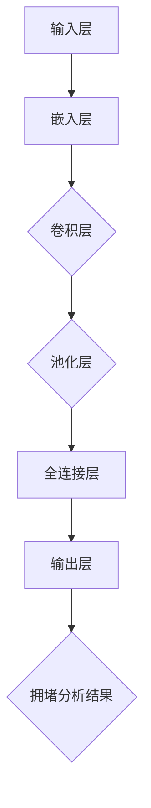

**3.2.3 智能交通信号控制**

智能交通信号控制是智能交通系统中的核心功能之一，通过AI大模型对交通流量和路况信息的实时分析，自动调整交通信号灯的时长和切换策略，以优化交通流量。以下是一个简单的伪代码示例：

```python
# 智能交通信号控制伪代码
def traffic_light_control(traffic_data, model):
    # 输入实时交通数据和预训练的AI大模型
    features = preprocess_traffic_data(traffic_data)
    # 数据预处理
    control_strategy = model.predict(features)
    # 获取智能交通信号控制策略
    return control_strategy

# 示例数据
realtime_traffic_data = get_realtime_traffic_data()

# 调用智能交通信号控制策略
traffic_light_strategy = traffic_light_control(realtime_traffic_data, trained_model)
```

**3.3 交通大数据分析**

智能交通系统产生大量的交通数据，包括车辆位置、速度、交通流量、路况等信息。通过AI大模型对交通大数据进行分析，可以挖掘出交通模式、规律和异常情况，为交通管理提供科学依据。以下是一个简化的交通大数据分析流程：

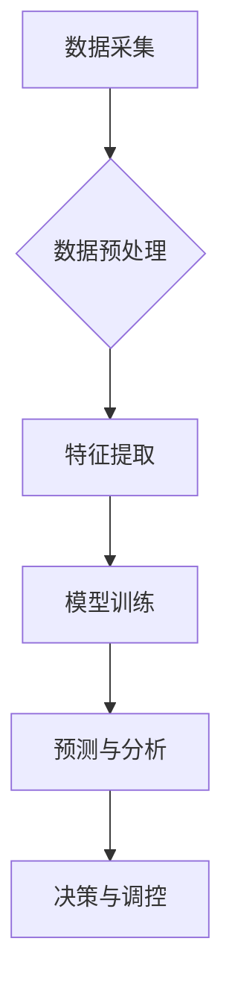

#### 3.3.1 交通数据采集与处理

交通数据采集是智能交通系统的第一步，通过传感器、摄像头等设备，实时采集交通流量、车辆速度、路况等信息。采集到的数据通常包含噪声和不完整信息，因此需要进行预处理，如数据清洗、去噪、补全等。以下是一个简化的数据预处理流程：

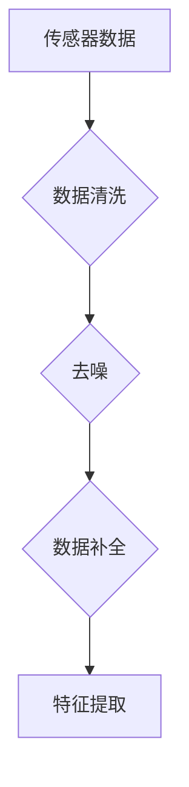

#### 3.3.2 交通数据可视化

交通数据可视化是将交通数据以图形化的形式呈现，帮助交通管理人员和决策者更直观地理解和分析交通状况。常见的交通数据可视化方法包括柱状图、折线图、热力图等。以下是一个简单的交通数据可视化示例：

```python
import matplotlib.pyplot as plt
import seaborn as sns

# 示例数据
traffic_data = load_traffic_data()

# 绘制交通流量柱状图
plt.figure(figsize=(10, 6))
sns.barplot(x='road_id', y='traffic_volume', data=traffic_data)
plt.xlabel('Road ID')
plt.ylabel('Traffic Volume')
plt.title('Traffic Volume by Road')
plt.show()

# 绘制交通流量热力图
plt.figure(figsize=(10, 6))
sns.heatmap(traffic_data.corr(), annot=True, cmap='coolwarm')
plt.xlabel('Feature')
plt.ylabel('Feature')
plt.title('Feature Correlation')
plt.show()
```

#### 3.3.3 交通大数据挖掘

交通大数据挖掘是从大量交通数据中提取有价值信息和知识的过程，如交通模式、出行行为等。通过机器学习和数据挖掘技术，可以对交通数据进行分析和挖掘，发现潜在规律和趋势。以下是一个简化的交通大数据挖掘流程：

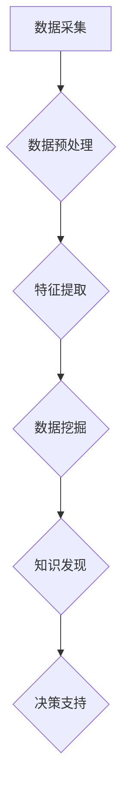

### 第4章：智慧安防

#### 4.1 智慧安防简介

智慧安防是利用信息技术、物联网、人工智能等技术，实现城市安全管理的智能化、自动化和高效化。智慧安防的目标是通过实时监测、智能分析、及时预警和快速响应，提高城市安全防范能力，保障人民群众的生命财产安全。

智慧安防系统的组成部分主要包括：

- **视频监控系统**：通过摄像头、视频分析技术，实现实时监控和事件记录。
- **智能报警系统**：通过传感器、报警设备等，实现实时报警和联动响应。
- **智能分析系统**：通过人工智能技术，对视频、音频等数据进行实时分析和智能识别。
- **数据管理系统**：用于存储、管理和分析大量安防数据，提供数据支持和决策依据。
- **应急指挥系统**：通过可视化技术和大数据分析，实现应急事件的快速响应和协调指挥。

#### 4.2 AI大模型在智慧安防中的应用

AI大模型在智慧安防系统中发挥着重要作用，其主要应用包括：

**4.2.1 人脸识别**

人脸识别是智慧安防系统中的关键技术之一，通过AI大模型对人脸图像进行识别和验证，可以实现身份认证、人员跟踪和异常行为检测等应用。以下是一个简化的人脸识别流程：

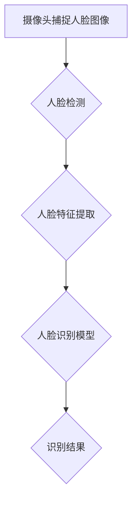

**4.2.2 视频行为分析**

视频行为分析是通过AI大模型对视频数据进行分析，识别和检测异常行为，如盗窃、暴力事件等。以下是一个简化的视频行为分析流程：

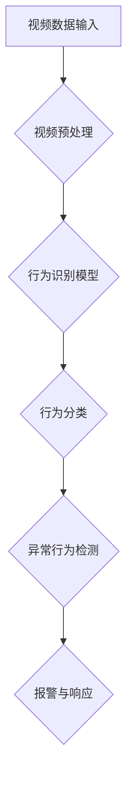

**4.2.3 智能警报与预警**

智能警报与预警是通过AI大模型对视频监控数据进行分析，实时监测异常情况，并在发现潜在威胁时及时发出警报。以下是一个简化的智能警报与预警流程：

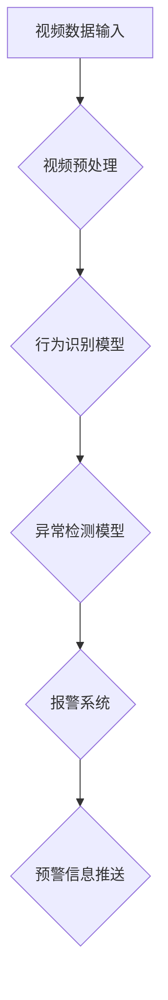

#### 4.3 智慧安防系统的建设与运营

智慧安防系统的建设与运营包括以下几个关键环节：

**4.3.1 智慧安防系统的架构设计**

智慧安防系统的架构设计是系统建设的基础，主要包括：

- **感知层**：通过传感器、摄像头等设备，实时感知和采集环境信息。
- **传输层**：通过通信网络，将感知层采集到的数据传输到数据中心。
- **平台层**：通过大数据分析、人工智能等技术，对传输层的数据进行处理和分析。
- **应用层**：通过用户界面、应急指挥系统等，提供数据可视化和决策支持。

**4.3.2 智慧安防系统的数据安全与隐私保护**

智慧安防系统涉及大量个人隐私信息，如人脸图像、行为数据等，因此数据安全与隐私保护至关重要。以下是一些常见的数据安全与隐私保护措施：

- **数据加密**：对存储和传输的数据进行加密，确保数据不被非法访问。
- **访问控制**：通过身份验证和权限控制，确保只有授权人员可以访问数据。
- **数据匿名化**：对个人隐私信息进行匿名化处理，减少隐私泄露风险。
- **安全审计**：定期进行安全审计，及时发现和纠正安全隐患。

**4.3.3 智慧安防系统的可持续运营**

智慧安防系统的可持续运营包括：

- **运维管理**：定期维护和更新系统设备，确保系统的稳定运行。
- **培训与支持**：对系统操作人员进行培训，提供技术支持和故障排除服务。
- **数据管理**：建立数据管理制度，确保数据的安全、完整和可用性。
- **升级与优化**：根据用户需求和新技术发展，定期对系统进行升级和优化，提高系统性能。

### 第5章：智慧能源

#### 5.1 智慧能源简介

智慧能源（Smart Energy）是指通过信息技术、物联网和人工智能技术，实现能源生产、传输、分配和消费的智能化管理。智慧能源的目标是通过优化能源资源配置、提高能源利用效率、降低能源消耗和减少环境污染，推动能源产业的转型升级和可持续发展。

智慧能源的分类主要包括：

- **智能发电**：利用可再生能源和高效发电技术，实现清洁、低碳、高效的能源生产。
- **智能传输**：通过智能电网技术，实现电力传输的高效、安全、可靠。
- **智能分配**：通过能源管理平台，实现能源的合理分配和调度，满足不同用户的需求。
- **智能消费**：通过智能能源设备，实现用户用电行为的智能化管理和优化。

#### 5.2 AI大模型在智慧能源中的应用

AI大模型在智慧能源系统中发挥着关键作用，其主要应用包括：

**5.2.1 能源需求预测**

能源需求预测是智慧能源管理的重要任务之一，通过AI大模型对历史能源数据和实时环境因素进行分析，预测未来的能源需求。以下是一个简化的能源需求预测流程：

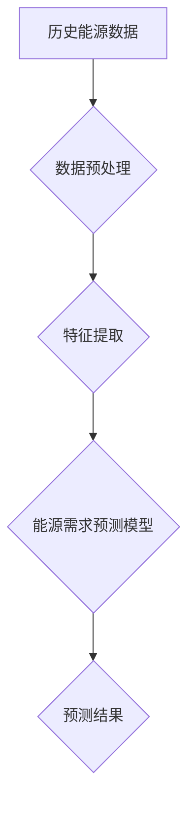

**5.2.2 能源供应优化**

能源供应优化是通过AI大模型对能源供应系统进行分析和优化，实现能源资源的合理配置和高效利用。以下是一个简化的能源供应优化流程：

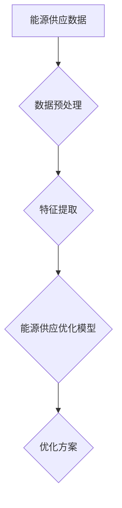

**5.2.3 能源管理智能化**

能源管理智能化是通过AI大模型实现能源管理系统的高度智能化，包括能源监控、数据分析、决策支持等功能。以下是一个简化的能源管理智能化流程：

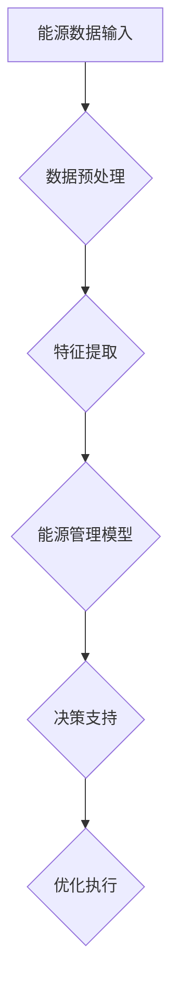

#### 5.3 智慧能源系统的建设与运营

智慧能源系统的建设与运营包括以下几个关键环节：

**5.3.1 智慧能源系统的架构设计**

智慧能源系统的架构设计是系统建设的基础，主要包括：

- **感知层**：通过传感器、智能电表等设备，实时采集能源数据。
- **传输层**：通过通信网络，将感知层采集到的数据传输到能源管理平台。
- **平台层**：通过大数据分析、人工智能等技术，对传输层的数据进行处理和分析。
- **应用层**：通过用户界面、能源管理平台等，提供数据可视化和决策支持。

**5.3.2 智慧能源系统的数据采集与处理**

智慧能源系统的数据采集与处理是系统运行的关键，主要包括：

- **数据采集**：通过传感器、智能电表等设备，实时采集能源数据。
- **数据预处理**：对采集到的数据进行清洗、去噪、归一化等预处理操作。
- **数据存储**：将预处理后的数据存储在数据库或数据仓库中，供后续分析和应用。

**5.3.3 智慧能源系统的运营与维护**

智慧能源系统的运营与维护包括：

- **系统运维**：定期维护和更新系统设备，确保系统的稳定运行。
- **数据分析**：对系统运行数据进行分析，发现潜在问题和优化机会。
- **决策支持**：根据数据分析结果，提供决策支持和优化方案。
- **用户服务**：为用户提供能源使用建议和优化方案，提高用户满意度。

### 第6章：智慧环境监测

#### 6.1 智慧环境监测简介

智慧环境监测是通过信息技术、物联网和人工智能技术，对城市环境质量进行实时监测、分析和预警的一种智能化环境管理手段。智慧环境监测的目标是通过数据驱动的方式，提高环境监测的精度和效率，为城市环境保护和管理提供科学依据。

智慧环境监测的主要任务包括：

- **空气质量监测**：实时监测空气中的有害物质，如PM2.5、PM10、二氧化碳等，评估空气质量状况。
- **水质监测**：实时监测水体中的污染物，如重金属、有机物、微生物等，评估水质状况。
- **噪声监测**：实时监测城市中的噪声水平，评估噪声污染状况。
- **生态环境监测**：监测城市绿地、湿地等生态环境，评估生态环境状况。

#### 6.2 AI大模型在智慧环境监测中的应用

AI大模型在智慧环境监测中发挥着重要作用，其主要应用包括：

**6.2.1 空气质量监测**

空气质量监测是智慧环境监测的核心任务之一，通过AI大模型对空气质量数据进行实时分析和预测，评估空气污染状况并提供预警。以下是一个简化的空气质量监测流程：

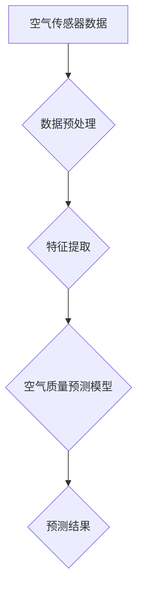

**6.2.2 水质监测**

水质监测是通过AI大模型对水质数据进行实时分析和预测，评估水质状况并提供预警。以下是一个简化的水质监测流程：

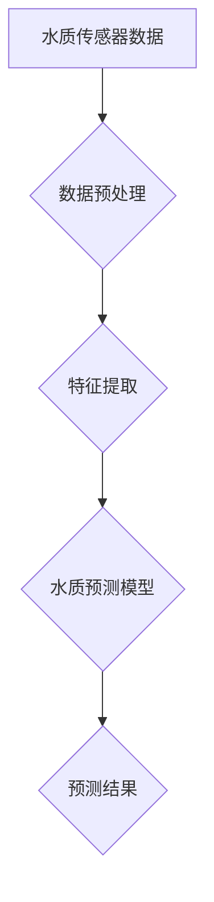

**6.2.3 噪声监测**

噪声监测是通过AI大模型对噪声数据进行实时分析和预测，评估噪声污染状况并提供预警。以下是一个简化的噪声监测流程：

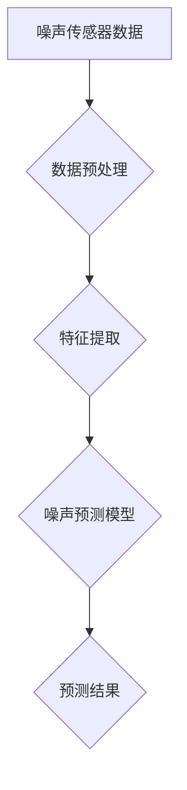

#### 6.3 智慧环境监测系统的建设与运营

智慧环境监测系统的建设与运营包括以下几个关键环节：

**6.3.1 智慧环境监测系统的架构设计**

智慧环境监测系统的架构设计是系统建设的基础，主要包括：

- **感知层**：通过传感器、监测设备等，实时采集环境数据。
- **传输层**：通过通信网络，将感知层采集到的数据传输到环境监测平台。
- **平台层**：通过大数据分析、人工智能等技术，对传输层的数据进行处理和分析。
- **应用层**：通过用户界面、环境监测平台等，提供数据可视化和决策支持。

**6.3.2 智慧环境监测系统的数据采集与处理**

智慧环境监测系统的数据采集与处理是系统运行的关键，主要包括：

- **数据采集**：通过传感器、监测设备等，实时采集环境数据。
- **数据预处理**：对采集到的数据进行清洗、去噪、归一化等预处理操作。
- **数据存储**：将预处理后的数据存储在数据库或数据仓库中，供后续分析和应用。

**6.3.3 智慧环境监测系统的数据可视化与分析**

智慧环境监测系统的数据可视化与分析是系统应用的重要环节，主要包括：

- **数据可视化**：通过图表、地图等可视化手段，展示环境监测数据。
- **数据分析**：通过统计分析、机器学习等技术，对环境监测数据进行分析和预测。
- **决策支持**：根据数据分析结果，提供决策支持和优化方案。

### 第三部分总结

AI大模型在智能城市建设中的广泛应用，不仅提升了城市管理的效率和效果，还显著改善了居民生活质量，并推动了城市的可持续发展。通过具体应用案例的分析，我们可以看到AI大模型在智能交通系统、智慧安防、智慧能源和智慧环境监测等领域的出色表现。AI大模型通过对大量数据的分析和预测，实现了交通流量预测、路网拥堵分析、智能交通信号控制、交通大数据分析等功能，提升了城市交通管理的效率和安全性。同时，AI大模型在智慧安防系统中的人脸识别、视频行为分析、智能警报与预警等应用，大大提高了城市的安全防范能力。在智慧能源系统中，AI大模型通过能源需求预测、能源供应优化和能源管理智能化，实现了能源资源的合理配置和高效利用。在智慧环境监测中，AI大模型通过空气质量监测、水质监测、噪声监测等应用，提高了环境监测的精度和效率，为城市环境保护和管理提供了科学依据。通过这些实际应用案例，我们可以看到AI大模型在智能城市建设中的重要价值和广阔前景。

### 第四部分：AI大模型在智慧城市建设中的综合应用

在智慧城市建设中，AI大模型不仅能够在交通、安防、能源和环境监测等单一领域发挥重要作用，还可以通过集成和协同应用，实现城市管理的整体优化和智能化升级。本部分将探讨AI大模型在智慧城市建设中的综合应用，分析其集成与应用方案，并探讨AI大模型在智慧城市中的协同作用。

#### 7.1 智慧城市中的AI大模型集成与应用

AI大模型的集成与应用是实现智慧城市智能化管理的关键。通过将不同领域的AI大模型进行整合，可以构建一个统一的城市智能管理系统，实现多领域的协同作战。以下是智慧城市中AI大模型集成与应用的几个关键步骤：

**7.1.1 数据整合与共享**

数据是AI大模型的基础，实现数据整合与共享是集成AI大模型的第一步。智慧城市中涉及多种类型的数据，如交通数据、安防数据、能源数据和环境数据等。通过建立城市数据平台，实现数据的统一存储、管理和共享，为AI大模型提供全面、准确的数据支持。

**7.1.2 模型选择与优化**

根据不同的应用需求，选择适合的AI大模型，并进行优化。例如，在交通流量预测中，可以使用深度学习模型；在视频行为分析中，可以使用卷积神经网络（CNN）；在能源需求预测中，可以使用时间序列预测模型。对选定的模型进行性能优化，提高预测精度和效率。

**7.1.3 模型集成与协同**

将不同领域的AI大模型进行集成，构建一个统一的智能管理系统。通过数据流和控制流的设计，实现不同模型之间的协同工作。例如，在交通管理和能源管理中，可以共享交通流量数据和能源需求预测结果，实现交通信号控制和能源供应优化的协同。

**7.1.4 模型部署与优化**

将训练好的AI大模型部署到实际应用环境中，并通过持续监测和反馈，对模型进行优化。例如，通过实时数据流，对交通信号控制模型进行调整，使其更好地适应交通状况的变化。

#### 7.1.5 智能决策与响应

通过AI大模型的集成应用，实现智能决策与响应。例如，在突发事件（如交通事故、自然灾害）发生时，智慧城市系统可以实时分析交通、安防、能源和环境等数据，快速响应并制定应对策略，确保城市运行的安全和稳定。

**7.1.6 应用实例**

以下是一个智慧城市中AI大模型集成与应用的实例：

- **智能交通管理**：通过集成交通流量预测、智能交通信号控制和交通大数据分析，实现交通流的优化管理。在高峰期，交通信号系统能够根据实时交通数据，动态调整信号时长，减少拥堵，提高通行效率。
- **智慧能源管理**：通过集成能源需求预测、能源供应优化和能源管理智能化，实现能源资源的合理配置和高效利用。例如，在夏季高峰用电期，能源管理系统可以根据预测的电力需求，提前调整电网负荷，确保电力供应的稳定。
- **环境监测与治理**：通过集成空气质量监测、水质监测和噪声监测，实现环境质量的实时监测和预警。当环境指标超出正常范围时，系统可以自动发出警报，并通知相关部门进行治理。

#### 7.1.7 智慧城市中的AI大模型协同作用

AI大模型在智慧城市中的协同作用体现在多个方面：

- **资源共享**：不同领域的AI大模型可以共享数据资源，提高数据利用效率。例如，交通系统可以共享环境监测数据，以便进行交通流量预测和信号控制。
- **任务协同**：多个AI大模型可以共同完成任务，提高任务完成效率。例如，在突发事件处理中，AI大模型可以协同工作，进行交通调控、资源调配和应急响应。
- **优化决策**：通过AI大模型的协同作用，可以实现更准确的预测和更优化的决策。例如，智慧城市系统可以根据实时数据和多个模型的协同结果，动态调整城市运行策略，提高城市管理的效率和效果。

#### 7.2 智慧城市建设中的技术挑战与解决方案

在智慧城市建设中，AI大模型的应用面临着一系列技术挑战。以下是一些主要挑战及其解决方案：

**7.2.1 数据质量问题**

智慧城市中涉及大量数据，但数据质量参差不齐，存在噪声、缺失和错误等问题。解决方案包括：

- **数据清洗与预处理**：通过数据清洗和预处理技术，去除噪声和错误数据，确保数据质量。
- **数据融合**：通过数据融合技术，将不同来源的数据进行整合，提高数据的完整性和一致性。

**7.2.2 模型可解释性**

AI大模型通常是一个“黑盒”，其决策过程难以解释和理解。解决方案包括：

- **模型可解释性技术**：通过引入模型可解释性技术，如LIME、SHAP等，提高模型的可解释性。
- **可视化分析**：通过数据可视化技术，展示模型的决策过程和结果，帮助用户理解模型的决策逻辑。

**7.2.3 模型适应性**

智慧城市中的环境和需求不断变化，要求AI大模型具备良好的适应性。解决方案包括：

- **迁移学习**：通过迁移学习技术，利用已训练好的模型在新任务上进行微调，提高模型的适应性。
- **在线学习**：通过在线学习技术，实时更新模型参数，使其能够适应环境变化。

**7.2.4 模型安全性与隐私保护**

AI大模型在处理大量数据时，存在安全性和隐私保护的问题。解决方案包括：

- **数据加密**：对敏感数据进行加密，确保数据传输和存储的安全。
- **隐私保护技术**：通过隐私保护技术，如差分隐私、同态加密等，保护用户隐私。

**7.2.5 模型部署与维护**

AI大模型的部署和维护是一个复杂的过程，需要解决计算资源、硬件设备、系统稳定性等问题。解决方案包括：

- **云计算与边缘计算**：通过云计算和边缘计算技术，实现AI大模型的分布式部署和高效运行。
- **自动化运维**：通过自动化运维技术，实现AI大模型的自动化部署、监控和运维。

#### 7.2.6 政策与法规挑战

智慧城市建设中的AI大模型应用还需要面对政策与法规的挑战，如数据共享、隐私保护、责任归属等。解决方案包括：

- **政策法规制定**：通过制定相关政策和法规，明确数据共享、隐私保护等问题的处理方式。
- **法律咨询与服务**：提供法律咨询服务，帮助企业和政府机构解决AI大模型应用中的法律问题。

### 第四部分总结

通过本部分的探讨，我们可以看到AI大模型在智慧城市建设中的综合应用，不仅提升了城市管理的效率和效果，还推动了城市的智能化和可持续发展。AI大模型的集成与应用，实现了交通、安防、能源和环境监测等领域的协同作战，提高了城市管理的整体水平。同时，AI大模型在智慧城市建设中面临的挑战，如数据质量、模型可解释性、模型安全性与隐私保护等，也需要通过技术创新和政策法规的完善来应对。通过持续的研究和探索，我们相信AI大模型在智慧城市建设中将发挥越来越重要的作用，为人类创造更加美好的城市生活。

### 总结与展望

#### 总体总结

智能城市建设离不开AI大模型这一核心技术。通过本文的详细探讨，我们可以清晰地看到AI大模型在智能交通系统、智慧安防、智慧能源和智慧环境监测等多个领域中的广泛应用，以及其在城市管理中的整体协同作用。AI大模型不仅提高了交通流量的预测准确性、安防系统的精准度、能源管理的效率和环境监测的精度，还通过数据整合与共享，实现了城市管理的智能化和高效化。

在技术层面，本文介绍了机器学习、深度学习、自然语言处理和计算机视觉等AI大模型的基础技术，并详细阐述了这些技术在智能城市建设中的应用。通过实际案例和伪代码示例，我们深入了解了AI大模型在各个具体应用场景中的工作原理和实现方法。

在挑战与解决方案方面，本文分析了数据质量、模型可解释性、模型安全性与隐私保护等AI大模型应用中的主要挑战，并提出了相应的技术措施和政策建议。这为未来智能城市建设中的AI大模型应用提供了有价值的参考。

#### 未来发展趋势

未来，AI大模型在智能城市建设中的应用将呈现出以下几个发展趋势：

1. **技术的进一步融合**：随着5G、边缘计算和物联网等技术的发展，AI大模型将与其他前沿技术进一步融合，实现更加智能化的城市管理。

2. **数据驱动的决策模式**：AI大模型将在更大规模的数据集上进行训练，通过数据驱动的决策模式，实现更加精准和高效的城市管理。

3. **个性化与自适应服务**：AI大模型将根据用户行为和需求，提供更加个性化、自适应的服务，提升居民的生活质量。

4. **跨界应用与协同作战**：AI大模型将跨越不同领域，实现多领域的协同作战，进一步提升城市管理的整体效能。

5. **政策与法规的完善**：随着AI大模型应用的深入，相关政策与法规将逐步完善，为AI大模型在智能城市建设中的应用提供更加稳定和可靠的法律保障。

#### 结论

总之，AI大模型在智能城市建设中具有不可替代的重要作用。通过持续的技术创新和政策支持，AI大模型将为智能城市建设注入新的活力，推动城市管理的智能化和可持续发展，为人类创造更加美好的城市生活。

### 作者信息

作者：AI天才研究院/AI Genius Institute & 禅与计算机程序设计艺术 /Zen And The Art of Computer Programming

