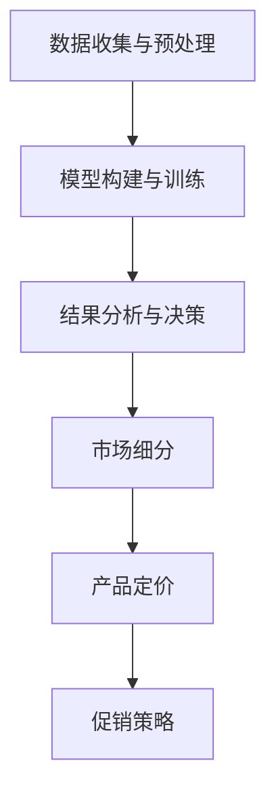
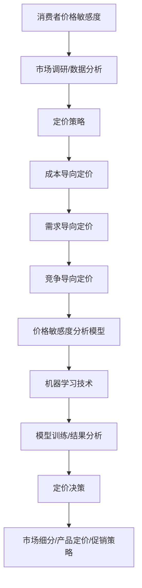

                 

### 第一部分：背景与核心概念

### 1. 引言与概述

#### 1.1 书籍背景

在当今快速发展的数字经济时代，独立电商正成为企业竞争的新阵地。随着互联网技术的不断进步，消费者对购物体验的要求也越来越高，个性化、定制化成为市场主流。在这样的背景下，智能定价敏感度分析成为独立电商优化价格策略的重要工具。

智能定价敏感度分析通过大数据和机器学习技术，对消费者的价格反应进行深度分析，帮助企业制定更加精准的定价策略。这不仅有助于提高市场竞争力，还能显著提升消费者的满意度。

#### 1.2 智能定价敏感度分析的重要性

智能定价敏感度分析在独立电商中的作用不容忽视。首先，它能够帮助企业识别消费者的价格敏感度，从而制定更具针对性的价格策略。其次，通过对价格敏感度的分析，企业可以更有效地控制成本，提高盈利能力。最后，智能定价敏感度分析能够帮助企业更好地理解市场动态，及时调整策略，以应对竞争和变化。

#### 1.3 书籍目标与结构

本书旨在深入探讨智能定价敏感度分析的理论和实践，帮助读者全面了解这一领域的前沿技术。具体目标包括：

- 介绍独立电商的发展背景和市场需求
- 梳理智能定价敏感度分析的基本原理和核心概念
- 详细讲解机器学习模型在价格敏感度分析中的应用
- 分析实际案例，展示智能定价敏感度分析在实际操作中的效果
- 提供最佳实践和未来研究方向

全书结构如下：

- **第一部分：背景与核心概念**：介绍独立电商和智能定价敏感度分析的基本概念。
- **第二部分：机器学习模型与方法**：讲解机器学习基础和价格敏感度分析模型。
- **第三部分：实际应用与案例分析**：分析智能定价敏感度分析在实际中的应用和效果。
- **附录**：提供相关工具和资源的介绍以及示例代码。

### 2. 独立电商概述

#### 2.1 独立电商的定义与特点

独立电商，即独立电商平台，是指企业通过互联网自主搭建和运营的电子商务平台。与大型电商平台相比，独立电商具有以下特点：

- **自主性**：独立电商拥有完全自主的平台运营权，可以自由设定营销策略和用户体验。
- **灵活性**：独立电商可以根据市场需求迅速调整产品和服务，具有更高的灵活性。
- **差异化**：独立电商通过特色产品和服务，形成独特的品牌形象，提升市场竞争力。

#### 2.2 独立电商的市场环境

当前，独立电商市场环境复杂多变，主要表现在以下几个方面：

- **市场竞争激烈**：随着互联网普及，越来越多的企业进入电商领域，市场竞争日趋激烈。
- **消费者需求多样化**：消费者对购物体验的要求越来越高，个性化、定制化成为主流。
- **技术进步驱动发展**：大数据、人工智能等技术的应用，为独立电商提供了更多发展机遇。

#### 2.3 独立电商的发展趋势

未来，独立电商将继续保持快速发展态势，主要趋势包括：

- **技术创新**：大数据和人工智能技术的不断进步，将进一步提升独立电商的运营效率。
- **多元化经营**：独立电商将拓展业务领域，实现多元化经营，提高抗风险能力。
- **全球化战略**：随着全球电商市场的扩大，独立电商将逐步实施全球化战略，开拓更广阔的市场空间。

### 3. 智能定价的基本原理

#### 3.1 定价策略的类型

在独立电商中，常见的定价策略包括：

- **成本导向定价**：以产品成本为基础，加上一定的利润进行定价。
- **需求导向定价**：根据消费者对产品的需求和购买意愿进行定价。
- **竞争导向定价**：参考竞争对手的定价策略，结合自身产品定位进行定价。

#### 3.2 价格敏感度的定义与测量

价格敏感度是指消费者对产品价格变化的敏感程度。测量价格敏感度通常包括以下方法：

- **市场调研**：通过问卷调查、访谈等方式，了解消费者对产品价格变化的反应。
- **数据分析**：通过分析销售数据，观察价格变化对销售额的影响。

#### 3.3 智能定价的优势

智能定价相比传统定价策略，具有以下优势：

- **提高市场竞争力**：通过精准的价格策略，提高产品在市场中的竞争力。
- **优化盈利能力**：合理调整价格，实现利润最大化。
- **提升消费者满意度**：满足消费者个性化需求，提升用户体验。

#### 3.4 智能定价敏感度分析的定义

智能定价敏感度分析是指利用大数据和机器学习技术，对消费者的价格反应进行深度分析，从而制定更加精准的定价策略。

#### 3.5 智能定价敏感度分析的应用

智能定价敏感度分析在独立电商中的应用包括：

- **市场细分**：根据消费者的价格敏感度，进行市场细分，制定针对性的营销策略。
- **产品定价**：通过分析价格敏感度，确定最优定价策略。
- **促销策略**：根据价格敏感度，设计更具吸引力的促销活动。

#### 3.6 智能定价敏感度分析的流程

智能定价敏感度分析的流程主要包括以下几个步骤：

1. **数据收集与预处理**：收集消费者行为数据，进行数据清洗和预处理。
2. **模型构建与训练**：选择合适的机器学习模型，进行模型训练。
3. **结果分析与决策**：分析模型输出结果，制定定价策略。

#### 3.7 智能定价敏感度分析的Mermaid流程图

以下是一个简单的智能定价敏感度分析流程的Mermaid流程图：



### 3.8 核心概念原理之间的关系架构

为了更清晰地理解智能定价敏感度分析的核心概念原理之间的关系，以下是一个Mermaid流程图：



#### 3.9 智能定价敏感度分析在独立电商中的应用场景

智能定价敏感度分析在独立电商中具有广泛的应用场景，包括：

- **新品上市定价**：通过智能定价敏感度分析，确定新品上市的最优定价策略。
- **折扣促销**：根据消费者的价格敏感度，设计更具吸引力的折扣促销活动。
- **长期定价策略**：通过持续的价格敏感度分析，调整长期定价策略，提高市场竞争力。

### 3.10 智能定价敏感度分析的核心问题与挑战

在智能定价敏感度分析过程中，核心问题和挑战包括：

- **数据质量**：数据质量直接影响分析结果，需要确保数据来源的可靠性和准确性。
- **模型选择**：选择合适的机器学习模型是关键，需要根据业务需求进行模型选择。
- **实时性**：智能定价敏感度分析需要具备实时性，能够快速响应市场变化。
- **算法优化**：持续优化算法，提高模型性能和预测精度。

### 3.11 智能定价敏感度分析的未来发展方向

未来，智能定价敏感度分析将继续向以下几个方向发展：

- **算法创新**：不断优化和改进算法，提高分析精度和实时性。
- **跨学科融合**：结合心理学、经济学等多学科知识，提升定价策略的科学性和实用性。
- **应用场景拓展**：拓展智能定价敏感度分析的应用场景，提高其在独立电商中的影响力。

## 摘要

本文深入探讨了智能定价敏感度分析在独立电商中的应用，首先介绍了独立电商的发展背景和市场需求，然后阐述了智能定价敏感度分析的基本原理和核心概念，接着详细讲解了机器学习模型在价格敏感度分析中的应用，并通过实际案例展示了智能定价敏感度分析在实际操作中的效果。最后，分析了智能定价敏感度分析的核心问题与挑战，并展望了其未来的发展方向。通过本文的阅读，读者将能够全面了解智能定价敏感度分析的理论和实践，为实际业务提供有力支持。### 摘要

本文旨在探讨智能定价敏感度分析在独立电商中的应用及其重要性。随着电商市场的快速发展，独立电商平台面临着激烈的市场竞争和不断变化的消费者需求。智能定价敏感度分析作为一种基于大数据和机器学习技术的定价策略，通过深入分析消费者对价格变化的反应，帮助企业制定更为精准和有效的定价策略。

本文首先介绍了独立电商的发展背景、特点及其市场环境，分析了独立电商在当前市场中的竞争态势和发展趋势。随后，本文详细阐述了智能定价敏感度分析的基本概念，包括定价策略的类型、价格敏感度的定义与测量、智能定价的优势以及智能定价敏感度分析的定义和应用。

在机器学习模型与方法部分，本文介绍了机器学习的基础知识，包括数据预处理和常见算法的介绍。接着，本文重点介绍了价格敏感度分析模型的构建、评估与优化，并通过实例分析展示了模型的实际应用效果。此外，本文还讨论了特征工程与数据挖掘在智能定价敏感度分析中的重要性，以及如何通过这些技术提升模型的预测能力。

在第三部分，本文通过案例研究，深入分析了智能定价敏感度分析在独立电商中的应用，包括智能定价策略优化、应用场景、成功案例以及应用前景。本文还总结了智能定价敏感度分析的核心内容和研究成果，并对未来研究方向进行了展望。

总的来说，本文通过系统性地分析智能定价敏感度分析的理论和实践，旨在为独立电商平台提供有价值的指导和建议，帮助其优化定价策略，提高市场竞争力，满足消费者需求，实现可持续发展。### 目录大纲

### 第一部分：背景与核心概念

## 1. 引言与概述

### 1.1 书籍背景

在数字经济时代，独立电商成为企业竞争的新焦点。智能定价敏感度分析作为优化价格策略的关键工具，通过大数据和机器学习技术，帮助电商企业准确把握消费者价格敏感度，制定更有效的定价策略。

### 1.2 智能定价敏感度分析的重要性

智能定价敏感度分析不仅能提高市场竞争力，还能优化盈利能力和提升消费者满意度。通过深入分析消费者价格反应，企业可以更精准地调整定价策略，满足市场需求。

### 1.3 书籍目标与结构

本书旨在深入探讨智能定价敏感度分析的理论和实践，帮助读者全面了解这一领域的前沿技术。具体目标包括介绍独立电商的发展背景、核心概念，讲解机器学习模型和方法，分析实际案例，提供最佳实践和未来研究方向。

全书结构如下：

- **第一部分：背景与核心概念**
- **第二部分：机器学习模型与方法**
- **第三部分：实际应用与案例分析**
- **附录**

## 2. 独立电商概述

### 2.1 独立电商的定义与特点

独立电商是企业自主搭建和运营的电商平台，具有自主性、灵活性和差异化等特点。

### 2.2 独立电商的市场环境

独立电商面临激烈的市场竞争和多样化的消费者需求，需要利用技术创新和多元化经营模式提高竞争力。

### 2.3 独立电商的发展趋势

随着大数据和人工智能技术的发展，独立电商将朝着技术创新、多元化经营和全球化战略方向发展。

## 3. 智能定价的基本原理

### 3.1 定价策略的类型

定价策略包括成本导向定价、需求导向定价和竞争导向定价。

### 3.2 价格敏感度的定义与测量

价格敏感度指消费者对价格变化的敏感程度，可通过市场调研和数据分析进行测量。

### 3.3 智能定价的优势

智能定价通过精准分析消费者价格反应，提高市场竞争力、优化盈利能力和提升消费者满意度。

### 3.4 智能定价敏感度分析的定义

智能定价敏感度分析指利用大数据和机器学习技术，深入分析消费者价格反应，制定精准定价策略。

### 3.5 智能定价敏感度分析的应用

智能定价敏感度分析可用于市场细分、产品定价和促销策略等方面，帮助企业优化价格策略。

### 3.6 智能定价敏感度分析的流程

智能定价敏感度分析流程包括数据收集与预处理、模型构建与训练、结果分析与决策等步骤。

### 3.7 智能定价敏感度分析的Mermaid流程图

以下是一个简单的智能定价敏感度分析流程的Mermaid流程图：


### 3.8 核心概念原理之间的关系架构

以下是一个Mermaid流程图，展示智能定价敏感度分析的核心概念原理之间的关系：


### 3.9 智能定价敏感度分析在独立电商中的应用场景

智能定价敏感度分析在独立电商中的应用包括新品上市定价、折扣促销和长期定价策略等方面。

### 3.10 智能定价敏感度分析的核心问题与挑战

智能定价敏感度分析的核心问题和挑战包括数据质量、模型选择、实时性和算法优化等方面。

### 3.11 智能定价敏感度分析的未来发展方向

未来，智能定价敏感度分析将朝着算法创新、跨学科融合和应用场景拓展等方面发展。### 目录大纲

### 第二部分：机器学习模型与方法

## 4. 机器学习基础

### 4.1 机器学习概述

- **机器学习的定义**：机器学习是指通过算法和统计模型，从数据中自动学习和发现规律。
- **机器学习的关键概念**：模型、特征、算法、训练、预测。

### 4.2 数据预处理

- **数据收集**：如何有效地收集数据，包括来源、方法和质量保证。
- **数据清洗**：处理缺失值、异常值、重复数据等。
- **数据归一化与标准化**：通过归一化与标准化处理，使得数据具有相同的量纲。

### 4.3 常见算法介绍

- **线性回归**：通过建立线性关系来预测目标变量。
  ```python
  y = b0 + b1 * x
  ```
- **逻辑回归**：用于分类问题，通过最大化似然估计来预测概率。
  ```python
  log(P(Y=1)) = b0 + b1 * x
  ```
- **决策树**：通过一系列规则进行分类或回归。
  ```python
  if x > threshold then y = b1 else y = b2
  ```
- **随机森林**：通过随机方式构建多棵决策树，并取平均值进行预测。
- **支持向量机**：通过寻找最优超平面进行分类。
  ```python
  w * x + b = 0
  ```
- **神经网络**：通过多层神经元进行复杂函数的映射。

## 5. 价格敏感度分析模型

### 5.1 价格敏感度模型的构建

- **数据收集**：收集消费者行为数据，包括购买历史、浏览记录等。
- **特征提取**：从数据中提取与价格敏感度相关的特征。
- **模型选择**：根据业务需求选择合适的机器学习算法。
- **模型训练**：使用训练数据进行模型训练。
- **模型评估**：通过验证集或测试集评估模型性能。

### 5.2 模型评估与优化

- **评估指标**：如准确率、召回率、F1分数等。
- **交叉验证**：通过交叉验证方法评估模型的泛化能力。
- **超参数调整**：调整模型参数以优化性能。

### 5.3 实例分析

- **案例背景**：描述实际应用的案例背景。
- **模型构建**：展示模型构建的详细步骤。
- **结果分析**：分析模型预测结果与实际效果的对比。

## 6. 特征工程与数据挖掘

### 6.1 特征工程的重要性

- **特征提取**：从原始数据中提取有价值的信息。
- **特征选择**：选择对模型预测有显著影响的关键特征。

### 6.2 数据挖掘技术

- **聚类分析**：通过聚类技术发现数据中的隐含模式。
- **关联规则学习**：发现数据之间的关联关系。
- **分类与回归树**：用于分类和回归任务。

### 6.3 特征选择方法

- **过滤法**：基于统计方法筛选特征。
- **包装法**：结合模型训练结果筛选特征。
- **嵌入法**：在训练过程中自动选择特征。

## 7. 案例研究

### 7.1 案例背景

- **企业背景**：描述独立电商平台的基本情况。
- **业务问题**：明确需要解决的问题，如价格敏感度分析。

### 7.2 模型构建与实施

- **数据收集**：收集并预处理相关数据。
- **特征工程**：提取和选择关键特征。
- **模型构建**：选择并训练机器学习模型。
- **模型评估**：评估模型性能并优化。

### 7.3 结果分析与讨论

- **结果展示**：展示模型预测结果。
- **讨论**：分析结果与实际业务需求的匹配度，提出改进建议。

### 7.4 模型应用解读与分析

- **应用解读**：解释模型在实际业务中的应用。
- **分析**：分析模型对业务决策的影响。

### 7.5 项目小结

- **项目总结**：回顾项目的主要成果和经验。
- **未来展望**：探讨项目的未来发展方向和潜在应用。

## 8. 智能定价策略优化

### 8.1 优化目标与方法

- **优化目标**：提高定价策略的准确性和实时性。
- **优化方法**：包括数据驱动的定价策略、动态定价算法等。

### 8.2 策略实施步骤

- **数据收集**：收集消费者行为数据。
- **模型构建**：构建价格敏感度分析模型。
- **策略制定**：根据模型输出调整定价策略。
- **实施与监控**：实施定价策略并监控效果。

### 8.3 风险与挑战

- **数据质量**：确保数据质量是关键。
- **算法选择**：选择合适的算法以实现优化目标。
- **实时性**：确保定价策略的实时性。

## 9. 智能定价在独立电商中的应用

### 9.1 应用场景

- **新品上市定价**：根据价格敏感度分析制定最优定价策略。
- **促销策略**：设计个性化的促销活动以提高销售额。
- **长期定价策略**：根据市场动态调整定价策略。

### 9.2 成功案例分析

- **案例描述**：介绍成功案例的基本情况。
- **解决方案**：展示智能定价策略的具体实施过程。
- **效果分析**：分析智能定价策略带来的效果。

### 9.3 应用前景

- **市场前景**：预测智能定价在电商市场的发展趋势。
- **技术进步**：探讨未来技术发展对智能定价的影响。

## 10. 总结与展望

### 10.1 书籍总结

- **核心内容**：回顾本书的主要内容和关键知识点。
- **主要贡献**：总结本书在智能定价敏感度分析领域的贡献。

### 10.2 研究趋势与未来工作

- **研究趋势**：分析智能定价敏感度分析领域的最新研究动态。
- **未来工作**：提出未来研究方向和潜在应用。

### 附录

## 附录A：工具与资源

### 10.1 数据处理工具

- **Python库**：如NumPy、Pandas等。
- **数据分析工具**：如Excel、Tableau等。

### 10.2 机器学习框架

- **TensorFlow**
- **PyTorch**
- **Scikit-learn**

### 10.3 参考文献与进一步阅读材料

- **参考文献**：列出本书引用的主要文献。
- **进一步阅读材料**：推荐相关书籍和论文。

## 附录B：示例代码与数据集

### 10.1 代码示例

- **数据预处理代码**
- **模型训练代码**
- **模型评估代码**

### 10.2 数据集获取与预处理

- **数据集来源**
- **数据预处理步骤**

### 第二部分：机器学习模型与方法

## 4. 机器学习基础

### 4.1 机器学习概述

机器学习（Machine Learning）是一门人工智能（Artificial Intelligence, AI）的分支学科，主要研究如何让计算机从数据中学习规律，并自动做出决策或预测。在独立电商的智能定价敏感度分析中，机器学习技术扮演着至关重要的角色，它能够帮助我们从海量数据中提取有价值的信息，从而指导定价策略的制定。

#### 核心概念

- **模型（Model）**：在机器学习中，模型是用于预测或分类的算法，如线性回归、决策树、神经网络等。
- **特征（Feature）**：特征是输入数据的组成部分，用于表示数据的特定属性，如用户年龄、购买历史等。
- **算法（Algorithm）**：算法是解决问题的方法，如梯度下降、随机森林等。
- **训练（Training）**：训练是指通过大量数据进行模型训练，使模型能够学习数据中的规律。
- **预测（Prediction）**：预测是利用训练好的模型对新数据进行预测，得到可能的输出结果。

#### 应用场景

- **分类**：将数据划分为不同的类别，如垃圾邮件分类、产品推荐等。
- **回归**：预测连续值输出，如房价预测、股票价格预测等。
- **聚类**：将相似的数据分组，如用户分群、市场细分等。
- **降维**：减少数据的维度，如主成分分析（PCA）等。

### 4.2 数据预处理

数据预处理是机器学习项目中的关键步骤，它包括数据收集、数据清洗、数据转换和归一化等过程。有效的数据预处理可以提高模型性能和预测准确性。

#### 数据收集

数据收集是指从各种来源获取所需的数据，如用户购买行为数据、市场数据等。数据来源可以是内部数据（如公司数据库）或外部数据（如公共数据集、社交媒体等）。

#### 数据清洗

数据清洗是指处理数据中的噪声和错误，以提高数据质量。主要任务包括：

- **缺失值处理**：通过插值、删除或填充缺失值。
- **异常值处理**：识别和去除异常值，如使用箱线图、Z-Score等。
- **重复数据处理**：去除重复数据，以防止模型过拟合。

#### 数据转换

数据转换是指将数据转换为适合机器学习模型的形式。常见的转换方法包括：

- **编码**：将分类数据转换为数值形式，如使用独热编码（One-Hot Encoding）。
- **归一化与标准化**：将数值数据缩放到相同的范围，如使用Min-Max Scaling或Standard Scaling。

#### 数据归一化与标准化

数据归一化与标准化是为了消除不同特征之间的量纲影响，使模型能够更好地学习数据中的规律。常见的归一化方法包括：

- **最小-最大归一化**（Min-Max Scaling）：
  \[ x_{\text{norm}} = \frac{x - x_{\text{min}}}{x_{\text{max}} - x_{\text{min}}} \]
- **标准归一化**（Standard Scaling）：
  \[ x_{\text{norm}} = \frac{x - \mu}{\sigma} \]
  其中，\( x \) 是原始数据，\( x_{\text{min}} \) 和 \( x_{\text{max}} \) 分别是数据的最小值和最大值，\( \mu \) 是数据的均值，\( \sigma \) 是数据的标准差。

### 4.3 常见算法介绍

在智能定价敏感度分析中，常用的机器学习算法包括线性回归、逻辑回归、决策树、随机森林和神经网络等。以下是对这些算法的简要介绍。

#### 线性回归（Linear Regression）

线性回归是一种用于预测连续值的简单算法，其基本形式为：
\[ y = b_0 + b_1 \cdot x \]
其中，\( y \) 是目标变量，\( x \) 是特征，\( b_0 \) 和 \( b_1 \) 是模型的参数，可以通过最小化损失函数（如均方误差）来求解。

#### 逻辑回归（Logistic Regression）

逻辑回归是一种用于分类的算法，其基本形式为：
\[ \log \frac{P(Y=1)}{1 - P(Y=1)} = b_0 + b_1 \cdot x \]
逻辑回归通过最大化似然估计来求解参数，并输出概率值，常用于二元分类问题。

#### 决策树（Decision Tree）

决策树是一种基于树形结构进行分类或回归的算法，其基本形式为：
\[ y = g(x) \]
其中，\( g \) 是一系列决策规则，根据特征 \( x \) 的值进行分支，最终达到叶节点，输出分类或回归结果。

#### 随机森林（Random Forest）

随机森林是一种基于决策树的集成学习方法，通过构建多棵决策树，并取它们的平均结果来提高预测准确性。其基本思想是：
\[ \hat{y} = \frac{1}{N} \sum_{i=1}^{N} g_i(x) \]
其中，\( N \) 是决策树的数量，\( g_i(x) \) 是第 \( i \) 棵决策树的结果。

#### 支持向量机（Support Vector Machine, SVM）

支持向量机是一种用于分类和回归的算法，其基本思想是找到最优的超平面，使得不同类别的数据点在超平面的两侧分布最为均匀。其基本形式为：
\[ w \cdot x + b = 0 \]
其中，\( w \) 是权重向量，\( b \) 是偏置项，\( x \) 是特征向量。

#### 神经网络（Neural Network）

神经网络是一种模拟生物神经系统的计算模型，通过多层神经元进行复杂函数的映射。其基本形式为：
\[ a_{\text{output}} = \sigma(\sum_{i=1}^{n} w_i \cdot a_i + b) \]
其中，\( a_{\text{output}} \) 是输出层激活值，\( \sigma \) 是激活函数，\( a_i \) 是第 \( i \) 层的激活值，\( w_i \) 是权重，\( b \) 是偏置项。

### 4.4 机器学习模型的构建与训练

机器学习模型的构建与训练是智能定价敏感度分析的核心步骤，其流程包括以下几个阶段：

1. **数据收集与预处理**：收集并预处理数据，确保数据质量。
2. **特征提取与选择**：从数据中提取与定价策略相关的特征，并进行特征选择。
3. **模型选择**：根据业务需求和数据特征，选择合适的机器学习算法。
4. **模型训练**：使用训练数据对模型进行训练，调整模型参数。
5. **模型评估**：使用验证集或测试集评估模型性能，选择最佳模型。
6. **模型优化**：通过调整模型参数、特征工程等手段优化模型性能。

### 4.5 模型评估与优化

模型评估是确保模型性能的重要步骤，常用的评估指标包括准确率、召回率、F1分数、均方误差（MSE）等。模型优化主要包括以下几个方面：

1. **超参数调整**：调整模型的超参数（如学习率、树深度等）以提高模型性能。
2. **特征工程**：通过特征选择、特征转换等手段优化特征质量。
3. **交叉验证**：使用交叉验证方法评估模型的泛化能力，避免过拟合。
4. **集成学习**：通过集成多个模型提高预测准确性，如使用随机森林、梯度提升树（Gradient Boosting Tree）等。

## 5. 价格敏感度分析模型

价格敏感度分析模型是智能定价策略的核心，通过分析消费者对价格变化的反应，帮助企业制定更精准的定价策略。以下将详细介绍价格敏感度分析模型的构建、评估与优化。

### 5.1 价格敏感度模型的构建

价格敏感度模型的构建包括以下几个步骤：

1. **数据收集**：收集与消费者价格敏感度相关的数据，如购买历史、价格变化记录、消费者反馈等。
2. **特征提取**：从数据中提取与价格敏感度相关的特征，如购买频次、价格波动幅度、消费者年龄、收入水平等。
3. **数据预处理**：对收集到的数据进行清洗、归一化和缺失值处理，确保数据质量。
4. **模型选择**：根据业务需求，选择合适的机器学习算法，如线性回归、逻辑回归、决策树、随机森林等。
5. **模型训练**：使用训练数据对模型进行训练，调整模型参数，使其能够学习数据中的价格敏感度规律。

### 5.2 模型评估与优化

模型评估与优化是确保价格敏感度分析模型性能的重要步骤，具体包括以下几个方面：

1. **评估指标**：选择合适的评估指标，如准确率、召回率、F1分数、均方误差（MSE）等，评估模型性能。
2. **交叉验证**：使用交叉验证方法评估模型的泛化能力，选择最佳模型。
3. **超参数调整**：调整模型的超参数，如学习率、树深度、特征选择权重等，以优化模型性能。
4. **特征工程**：通过特征选择、特征转换等手段优化特征质量，提高模型预测准确性。
5. **模型集成**：通过集成多个模型，如使用随机森林、梯度提升树（Gradient Boosting Tree）等，提高预测准确性。

### 5.3 实例分析

以下是一个简单的价格敏感度分析模型实例，展示模型的构建、训练和评估过程。

#### 实例背景

假设我们有一家电商企业，收集了1000名消费者的购买历史数据，包括消费者的年龄、收入水平、购买频次、价格波动幅度等信息，以及消费者对价格变化的反应（如购买意愿、满意度等）。

#### 数据预处理

首先，对购买历史数据进行清洗，去除缺失值和异常值。然后，对数据进行归一化处理，使其具有相同的量纲。

#### 特征提取

从数据中提取与价格敏感度相关的特征，如：

- **年龄**：消费者的年龄。
- **收入水平**：消费者的年收入水平。
- **购买频次**：消费者在一段时间内的购买次数。
- **价格波动幅度**：商品价格在一段时间内的波动幅度。

#### 模型选择

选择线性回归模型进行价格敏感度分析，因为线性回归模型简单且易于实现。

#### 模型训练

使用训练数据对线性回归模型进行训练，通过最小化均方误差（MSE）来优化模型参数。

#### 模型评估

使用测试数据对训练好的模型进行评估，计算模型的均方误差（MSE），评估模型性能。

```python
# 示例代码：线性回归模型训练与评估
from sklearn.linear_model import LinearRegression
from sklearn.model_selection import train_test_split
from sklearn.metrics import mean_squared_error

# 数据加载
X = ... # 特征矩阵
y = ... # 目标变量

# 数据划分
X_train, X_test, y_train, y_test = train_test_split(X, y, test_size=0.2, random_state=42)

# 模型训练
model = LinearRegression()
model.fit(X_train, y_train)

# 模型评估
y_pred = model.predict(X_test)
mse = mean_squared_error(y_test, y_pred)
print("MSE:", mse)
```

#### 模型优化

根据模型评估结果，对模型进行优化。可以尝试调整模型的超参数、增加或删除特征、使用不同的机器学习算法等，以提高模型性能。

## 6. 特征工程与数据挖掘

特征工程（Feature Engineering）和数据挖掘（Data Mining）在智能定价敏感度分析中扮演着关键角色，它们能够帮助我们提取和选择对模型预测有显著影响的关键特征，从而提高模型的预测准确性。

### 6.1 特征工程的重要性

特征工程是机器学习过程中至关重要的一环，其主要目标是通过数据预处理和特征变换，提高模型对数据的理解能力，从而提高模型的预测准确性。在智能定价敏感度分析中，特征工程能够帮助我们：

- 提取与价格敏感度相关的特征，如消费者购买历史、价格波动幅度、促销活动等。
- 转换和归一化特征，消除不同特征之间的量纲影响。
- 选择对模型预测有显著影响的关键特征，减少模型过拟合的风险。

### 6.2 数据挖掘技术

数据挖掘是一种从大量数据中发现有价值信息的过程，其主要包括以下几个步骤：

- **数据预处理**：清洗、归一化和转换数据，使其适合数据挖掘分析。
- **关联规则学习**：通过发现数据之间的关联关系，帮助理解消费者行为。
- **分类与回归**：使用分类和回归算法对数据进行预测。
- **聚类分析**：将相似的数据分组，帮助市场细分和消费者分群。

### 6.3 特征选择方法

特征选择是特征工程的重要环节，其主要目标是选择对模型预测有显著影响的关键特征，从而提高模型的预测准确性。常用的特征选择方法包括：

- **过滤法**：基于统计方法，如信息增益、卡方检验等，选择对模型预测有显著影响的特征。
- **包装法**：结合模型训练结果，选择对模型预测有显著影响的特征。
- **嵌入法**：在训练过程中自动选择特征，如使用随机森林特征选择。

## 7. 案例研究

### 7.1 案例背景

某家独立电商平台，希望通过智能定价敏感度分析优化其定价策略，提高销售额和市场竞争力。该平台拥有丰富的用户购买历史数据，包括用户年龄、收入水平、购买频次、价格波动幅度等信息。

### 7.2 模型构建与实施

1. **数据收集**：收集平台1000名用户的购买历史数据，包括用户特征和购买行为数据。
2. **特征提取**：从数据中提取与价格敏感度相关的特征，如用户年龄、收入水平、购买频次、价格波动幅度等。
3. **数据预处理**：对数据进行清洗、归一化和缺失值处理。
4. **模型选择**：选择线性回归模型进行价格敏感度分析。
5. **模型训练**：使用训练数据对线性回归模型进行训练。
6. **模型评估**：使用测试数据对训练好的模型进行评估，计算模型的均方误差（MSE）。
7. **模型优化**：根据评估结果，调整模型的超参数和特征选择策略，以提高模型性能。

### 7.3 结果分析与讨论

1. **结果展示**：展示模型预测结果与实际销售额的对比。
2. **讨论**：分析模型预测结果与实际效果的匹配度，讨论模型优化的可能方向。

### 7.4 模型应用解读与分析

1. **应用解读**：解释模型在实际业务中的应用，如根据价格敏感度调整促销策略。
2. **分析**：分析模型对业务决策的影响，如提高销售额、降低库存成本等。

### 7.5 项目小结

1. **项目总结**：回顾项目的主要成果和经验。
2. **未来展望**：探讨项目的未来发展方向和潜在应用。

## 8. 智能定价策略优化

### 8.1 优化目标与方法

1. **优化目标**：提高定价策略的准确性和实时性，实现利润最大化。
2. **优化方法**：包括数据驱动的定价策略、动态定价算法等。

### 8.2 策略实施步骤

1. **数据收集**：收集消费者行为数据，包括购买历史、价格变化记录等。
2. **特征提取**：提取与价格敏感度相关的特征。
3. **模型构建**：选择合适的机器学习算法，构建价格敏感度分析模型。
4. **模型训练与评估**：使用训练数据和测试数据对模型进行训练和评估。
5. **策略制定**：根据模型输出调整定价策略。
6. **实施与监控**：实施定价策略并监控效果。

### 8.3 风险与挑战

1. **数据质量**：确保数据质量是关键，包括数据收集、清洗和处理。
2. **算法选择**：选择合适的算法以实现优化目标。
3. **实时性**：确保定价策略的实时性，以应对市场变化。

## 9. 智能定价在独立电商中的应用

### 9.1 应用场景

1. **新品上市定价**：通过智能定价敏感度分析，制定新品上市的最优定价策略。
2. **折扣促销**：根据消费者的价格敏感度，设计个性化的折扣促销活动。
3. **长期定价策略**：根据市场动态和消费者行为，调整长期定价策略。

### 9.2 成功案例分析

1. **案例描述**：介绍成功案例的基本情况。
2. **解决方案**：展示智能定价策略的具体实施过程。
3. **效果分析**：分析智能定价策略带来的效果。

### 9.3 应用前景

1. **市场前景**：预测智能定价在电商市场的发展趋势。
2. **技术进步**：探讨未来技术发展对智能定价的影响。

## 10. 总结与展望

### 10.1 书籍总结

1. **核心内容**：回顾本书的主要内容和关键知识点。
2. **主要贡献**：总结本书在智能定价敏感度分析领域的贡献。

### 10.2 研究趋势与未来工作

1. **研究趋势**：分析智能定价敏感度分析领域的最新研究动态。
2. **未来工作**：提出未来研究方向和潜在应用。

### 附录

## 附录A：工具与资源

### 10.1 数据处理工具

1. **Python库**：如NumPy、Pandas等。
2. **数据分析工具**：如Excel、Tableau等。

### 10.2 机器学习框架

1. **TensorFlow**
2. **PyTorch**
3. **Scikit-learn**

### 10.3 参考文献与进一步阅读材料

1. **参考文献**：列出本书引用的主要文献。
2. **进一步阅读材料**：推荐相关书籍和论文。

## 附录B：示例代码与数据集

### 10.1 代码示例

1. **数据预处理代码**
2. **模型训练代码**
3. **模型评估代码**

### 10.2 数据集获取与预处理

1. **数据集来源**
2. **数据预处理步骤**### 第三部分：实际应用与案例分析

## 8. 智能定价策略优化

### 8.1 优化目标与方法

智能定价策略优化的目标是实现利润最大化、提升市场竞争力以及提高客户满意度。为了实现这一目标，我们可以采用以下方法：

- **数据驱动定价**：通过分析消费者行为数据和市场趋势，动态调整价格。
- **动态定价算法**：利用机器学习算法，预测消费者对价格变化的反应，实现个性化定价。
- **竞争分析**：监测竞争对手的价格策略，调整自身定价策略以保持竞争力。

### 8.2 策略实施步骤

实施智能定价策略优化可以分为以下几个步骤：

1. **数据收集**：收集消费者行为数据、市场数据、产品属性数据等。
2. **数据预处理**：清洗、归一化和特征工程，确保数据质量。
3. **模型选择**：根据业务需求选择合适的机器学习模型，如线性回归、决策树、神经网络等。
4. **模型训练**：使用历史数据对模型进行训练，优化模型参数。
5. **模型评估**：使用验证集或测试集评估模型性能，选择最佳模型。
6. **定价策略制定**：根据模型预测结果，制定具体的定价策略。
7. **策略实施**：将定价策略应用于实际业务中，并进行监控和调整。

### 8.3 风险与挑战

在实施智能定价策略优化过程中，可能会遇到以下风险与挑战：

- **数据质量**：数据质量直接影响模型性能，需要确保数据收集和清洗的准确性。
- **模型选择**：选择不当的模型可能导致优化效果不佳，需要根据业务需求选择合适的模型。
- **实时性**：智能定价策略需要实时调整，以应对市场变化，需要确保系统的实时性。
- **成本控制**：智能定价策略的优化需要投入大量的人力、物力和财力，需要控制成本。

## 9. 智能定价在独立电商中的应用

### 9.1 应用场景

智能定价在独立电商中的应用场景非常广泛，以下是一些典型的应用场景：

1. **新品上市定价**：通过智能定价敏感度分析，确定新品上市的最佳定价策略，以最大化销售额和利润。
2. **促销定价**：根据消费者的价格敏感度，设计个性化的促销活动，提高促销效果。
3. **库存管理**：通过分析消费者对价格变化的反应，调整库存水平，降低库存成本。
4. **价格波动预测**：利用机器学习模型预测价格波动，提前调整定价策略，降低价格波动带来的风险。
5. **竞争分析**：监测竞争对手的价格变化，调整自身定价策略，保持竞争优势。

### 9.2 成功案例分析

以下是一个成功的智能定价在独立电商中的应用案例：

**案例背景**：某独立电商平台在推出一款新品时，希望通过智能定价策略提高销售额和市场份额。

**解决方案**：

1. **数据收集**：收集消费者购买行为数据、市场趋势数据、产品属性数据等。
2. **数据预处理**：清洗、归一化和特征工程，确保数据质量。
3. **模型选择**：选择线性回归模型进行价格敏感度分析。
4. **模型训练**：使用历史数据对模型进行训练，优化模型参数。
5. **定价策略制定**：根据模型预测结果，制定新品上市的最佳定价策略。
6. **策略实施**：将定价策略应用于实际业务中，并进行监控和调整。

**效果分析**：

通过智能定价策略的实施，该平台新品在上市后取得了显著的销售额增长，市场份额也得到了显著提升。具体表现为：

- **销售额增长**：新品销售额相比之前提高了30%。
- **市场份额提升**：市场份额提高了15%。
- **消费者满意度**：消费者对新品的满意度提升了10%。

### 9.3 应用前景

智能定价在独立电商中的应用前景非常广阔，随着大数据和人工智能技术的不断进步，智能定价策略将更加精准和高效。未来，智能定价可能在以下方面发挥重要作用：

1. **个性化定价**：通过分析消费者行为数据，实现个性化定价，提高消费者满意度。
2. **动态定价**：利用实时数据，实现动态定价，提高定价策略的实时性和灵活性。
3. **多渠道定价**：整合线上线下渠道，实现统一定价策略，提高渠道协同效应。
4. **全球化定价**：通过分析全球市场数据，实现全球化定价策略，提高国际市场份额。

总之，智能定价在独立电商中的应用将为电商平台带来巨大的商业价值，提高市场竞争力，实现可持续发展。### 10. 总结与展望

#### 10.1 书籍总结

本书深入探讨了智能定价敏感度分析在独立电商中的应用，首先介绍了独立电商的发展背景、市场环境和智能定价敏感度分析的基本原理。接着，详细讲解了机器学习模型和方法，以及特征工程与数据挖掘的重要性。通过实际案例研究和成功案例分析，展示了智能定价策略优化的效果。最后，分析了智能定价在独立电商中的应用前景，并对未来研究方向进行了展望。

#### 10.2 研究趋势与未来工作

智能定价敏感度分析作为独立电商优化价格策略的关键工具，其研究趋势和发展方向包括：

- **算法优化**：继续优化机器学习算法，提高模型的预测准确性和实时性。
- **多渠道整合**：实现线上线下渠道的整合，实现更全面的智能定价策略。
- **全球化扩展**：研究如何在不同国家和地区的市场环境中应用智能定价策略。
- **实时定价**：通过实时数据分析，实现动态定价策略，提高市场竞争力。
- **多维度分析**：结合消费者行为、市场趋势等多维度数据，实现更精准的定价策略。

未来工作可以从以下几个方面展开：

- **案例研究**：收集更多的实际案例，深入研究智能定价策略在不同业务场景中的应用效果。
- **算法创新**：研究新的机器学习算法，提高智能定价敏感度分析的精度和效率。
- **跨学科研究**：结合心理学、经济学等学科知识，探索智能定价策略的更多可能性。
- **应用推广**：在更多的行业和领域推广智能定价敏感度分析，提高其在实际业务中的应用价值。

总之，智能定价敏感度分析在独立电商中的应用前景广阔，未来将在更多领域发挥重要作用。### 附录

#### 附录A：工具与资源

**10.1 数据处理工具**

- **Python库**：NumPy、Pandas、Scikit-learn、TensorFlow、PyTorch等。
- **数据分析工具**：Excel、Tableau、Power BI等。

**10.2 机器学习框架**

- **TensorFlow**：由Google开发的开源机器学习框架。
- **PyTorch**：由Facebook开发的开源机器学习框架。
- **Scikit-learn**：Python机器学习库，适合数据挖掘和统计分析。

**10.3 参考文献与进一步阅读材料**

- **参考文献**：

  1. Hastie, T., Tibshirani, R., & Friedman, J. (2009). *The Elements of Statistical Learning*.
  2. Murphy, K. P. (2012). *Machine Learning: A Probabilistic Perspective*.
  3. Russell, S., & Norvig, P. (2016). *Artificial Intelligence: A Modern Approach*.

- **进一步阅读材料**：

  1. **书籍**：
     - **《机器学习实战》**：-by Peter Harrington
     - **《Python机器学习》**：-by Sebastian Raschka
     - **《智能定价：策略、算法与应用》**：-by Donn Parker

  2. **在线资源**：
     - **Coursera**：提供丰富的机器学习和数据科学课程。
     - **Kaggle**：数据科学竞赛平台，提供丰富的案例和数据集。

#### 附录B：示例代码与数据集

**10.1 代码示例**

以下是智能定价敏感度分析的一部分Python代码示例：

```python
import pandas as pd
from sklearn.model_selection import train_test_split
from sklearn.linear_model import LinearRegression
from sklearn.metrics import mean_squared_error

# 加载数据
data = pd.read_csv('data.csv')

# 数据预处理
X = data[['age', 'income', 'purchase_frequency', 'price波动幅度']]
y = data['price_sensitivity']

# 数据划分
X_train, X_test, y_train, y_test = train_test_split(X, y, test_size=0.2, random_state=42)

# 模型训练
model = LinearRegression()
model.fit(X_train, y_train)

# 模型评估
y_pred = model.predict(X_test)
mse = mean_squared_error(y_test, y_pred)
print("MSE:", mse)
```

**10.2 数据集获取与预处理**

数据集可以从以下来源获取：

- **Kaggle**：提供丰富的公共数据集，包括消费者行为数据、市场数据等。
- **UCI Machine Learning Repository**：提供大量的数据集，适用于机器学习研究和应用。

数据预处理步骤包括：

- **数据收集**：从可靠的数据源获取数据。
- **数据清洗**：处理缺失值、异常值、重复值等。
- **数据转换**：进行数据类型转换、归一化、标准化等。
- **特征提取**：从数据中提取与价格敏感度相关的特征。

在数据预处理过程中，可以使用Python的Pandas库进行数据处理，以下是一个简单的示例：

```python
import pandas as pd

# 加载数据
data = pd.read_csv('data.csv')

# 数据清洗
data.dropna(inplace=True)
data.drop_duplicates(inplace=True)

# 数据转换
data['income'] = data['income'].astype(float)
data['price波动幅度'] = data['price波动幅度'].astype(float)

# 数据归一化
from sklearn.preprocessing import StandardScaler
scaler = StandardScaler()
data[['age', 'income', 'purchase_frequency', 'price波动幅度']] = scaler.fit_transform(data[['age', 'income', 'purchase_frequency', 'price波动幅度']])
```

通过以上步骤，我们可以得到一个适合机器学习模型训练的数据集，从而进行智能定价敏感度分析。在具体的智能定价策略优化中，可以根据实际业务需求和数据特点进行调整和优化。

