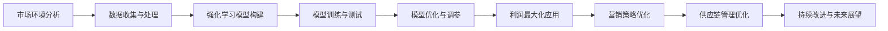

                 

### 文章标题

《智能定价策略优化：一人公司利用强化学习实现利润最大化》

### 关键词

- 智能定价策略
- 强化学习
- 利润最大化
- 一人公司
- 数据分析
- 优化算法

### 摘要

本文深入探讨了智能定价策略在商业决策中的重要性，并重点介绍了如何利用强化学习优化一人公司的定价策略以实现利润最大化。首先，我们回顾了智能定价策略的基础知识，包括其定义、发展历程和关键要素。接着，我们介绍了强化学习的基本原理及其在定价策略优化中的应用。随后，文章详细阐述了数据收集与建模的过程，并通过一个实际案例展示了如何利用强化学习实现一人公司的利润最大化。最后，我们探讨了智能定价策略在营销策略和供应链管理中的应用，并提出了持续改进和未来研究方向。本文旨在为读者提供一份全面而深入的智能定价策略优化指南。

---

### 《智能定价策略优化：一人公司利用强化学习实现利润最大化》目录大纲

#### 第一部分：智能定价策略基础

**# 1. 智能定价策略概述**

**## 1.1 智能定价的定义与作用**

- 智能定价的概念
- 智能定价在商业决策中的重要性

**### 1.1.1 智能定价的概念**

- 智能定价的定义
- 智能定价与传统定价的区别

**### 1.1.2 智能定价的重要性**

- 提高利润率
- 增强市场竞争力
- 适应动态市场环境

**## 1.2 智能定价的发展历程**

- 传统定价策略的局限性
- 智能定价的发展趋势

**### 1.2.1 传统定价策略的局限性**

- 过于简单，缺乏灵活性
- 无法适应动态市场变化
- 缺乏数据驱动

**### 1.2.2 智能定价的发展趋势**

- 数据分析驱动的定价
- 强化学习在定价策略中的应用
- 智能化供应链管理

**## 1.3 智能定价的关键要素**

- 数据采集与处理
- 价格弹性分析
- 市场竞争策略

**### 1.3.1 数据采集与处理**

- 数据源选择
- 数据预处理
- 特征工程

**### 1.3.2 价格弹性分析**

- 价格弹性的概念
- 价格弹性分析的方法

**### 1.3.3 市场竞争策略**

- 竞争对手分析
- 定价策略的选择

**# 2. 强化学习基础**

**## 2.1 强化学习的定义与原理**

- 强化学习的基本概念
- 强化学习的主要挑战

**### 2.1.1 强化学习的基本概念**

- 强化学习的基础术语
- 强化学习的基本流程

**### 2.1.2 强化学习的主要挑战**

- 采样效率
- 探索与利用的平衡
- 长期回报与即时回报的平衡

**### 2.1.3 强化学习的主要算法**

- Q-Learning算法
- Deep Q-Network（DQN）算法
- Policy Gradient算法

**## 2.2 强化学习在定价策略中的应用**

- 强化学习在定价策略中的优势
- 强化学习在定价策略中的应用场景

**### 2.2.1 强化学习在定价策略中的优势**

- 自适应调整
- 学习动态市场环境
- 实现利润最大化

**### 2.2.2 强化学习在定价策略中的应用场景**

- 竞争激烈的市场环境
- 需要实时调整定价策略
- 利润最大化的目标

**### 2.2.3 强化学习在定价策略中的挑战与解决方案**

- 数据质量
- 模型复杂度
- 实时计算性能

#### 第二部分：智能定价策略优化

**# 3. 数据分析与建模**

**## 3.1 数据收集与处理**

- 数据源选择
- 数据预处理
- 特征工程

**### 3.1.1 数据源选择**

- 内部数据
- 外部数据
- 数据整合

**### 3.1.2 数据预处理**

- 数据清洗
- 数据标准化
- 数据缺失处理

**### 3.1.3 特征工程**

- 特征提取
- 特征选择
- 特征转换

**## 3.2 模型构建与优化**

- 强化学习模型的选择
- 模型参数优化
- 模型验证与测试

**### 3.2.1 强化学习模型的选择**

- Q-Learning模型
- DQN模型
- Policy Gradient模型

**### 3.2.2 模型参数优化**

- 学习率
- 探索策略
- 折扣因子

**### 3.2.3 模型验证与测试**

- 回归测试
- 跨验证集测试
- 实际应用效果评估

**# 4. 强化学习在利润最大化中的应用**

**## 4.1 利润最大化的目标函数**

- 利润函数的定义
- 利润最大化的优化策略

**### 4.1.1 利润函数的定义**

- 收入函数
- 成本函数
- 利润函数

**### 4.1.2 利润最大化的优化策略**

- 动态定价策略
- 智能调整策略
- 实时优化策略

**### 4.1.3 强化学习在利润最大化中的应用**

- 定价策略调整
- 销售策略优化
- 利润预测

**## 4.2 实战案例：一人公司的利润最大化**

- 案例背景
- 强化学习模型设计
- 模型训练与测试
- 模型优化与调参
- 模型应用效果评估

**### 4.2.1 案例背景**

- 行业背景
- 业务场景
- 目标利润

**### 4.2.2 强化学习模型设计**

- 状态空间设计
- 动作空间设计
- 奖励函数设计

**### 4.2.3 模型训练与测试**

- 训练数据集
- 测试数据集
- 模型训练过程
- 模型测试结果

**### 4.2.4 模型优化与调参**

- 模型参数调整
- 探索策略调整
- 学习率调整

**### 4.2.5 模型应用效果评估**

- 实际应用效果
- 利润增长情况
- 市场竞争力分析

#### 第三部分：一人公司的运营优化

**# 5. 营销策略优化**

**## 5.1 营销策略概述**

- 营销策略的定义与作用
- 常见的营销策略

**### 5.1.1 营销策略的定义与作用**

- 提高品牌知名度
- 增加市场份额
- 提高客户满意度

**### 5.1.2 常见的营销策略**

- 广告营销
- 社交媒体营销
- 精准营销

**## 5.2 智能定价与营销策略的结合**

- 智能定价在营销策略中的应用
- 营销策略对利润最大化的影响

**### 5.2.1 智能定价在营销策略中的应用**

- 动态定价策略
- 价格歧视策略
- 捆绑销售策略

**### 5.2.2 营销策略对利润最大化的影响**

- 提高销售收入
- 降低营销成本
- 增强市场竞争力

**### 5.2.3 智能定价与营销策略的协同优化**

- 数据驱动的营销策略
- 实时调整定价策略
- 提高利润最大化效果

**# 6. 供应链管理优化**

**## 6.1 供应链管理概述**

- 供应链管理的定义与作用
- 常见的供应链管理模式

**### 6.1.1 供应链管理的定义与作用**

- 提高供应链效率
- 降低供应链成本
- 保证产品质量

**### 6.1.2 常见的供应链管理模式**

- 传统供应链管理模式
- 智能供应链管理模式
- 可持续供应链管理模式

**## 6.2 智能定价在供应链管理中的应用**

- 智能定价在供应链优化中的作用
- 供应链管理中的挑战与解决方案

**### 6.2.1 智能定价在供应链优化中的作用**

- 动态调整供应链成本
- 优化供应链流程
- 提高供应链响应速度

**### 6.2.2 供应链管理中的挑战与解决方案**

- 数据质量问题
- 实时计算性能问题
- 模型复杂度问题

**### 6.2.3 智能定价与供应链管理的协同优化**

- 数据整合与共享
- 智能决策支持系统
- 持续优化与改进

**# 7. 持续改进与未来展望**

**## 7.1 智能定价策略的持续改进**

- 数据驱动的持续优化
- 算法创新的持续进步
- 智能定价在行业中的发展前景

**### 7.1.1 数据驱动的持续优化**

- 数据质量提升
- 数据分析技术更新
- 数据可视化与决策支持

**### 7.1.2 算法创新的持续进步**

- 强化学习算法优化
- 深度学习在定价策略中的应用
- 聚类算法与关联规则挖掘

**### 7.1.3 智能定价在行业中的发展前景**

- 传统行业转型
- 新兴产业应用
- 全球化市场布局

**## 7.2 未来研究方向与挑战**

- 智能定价在新兴领域中的应用
- 智能定价技术的创新方向
- 智能定价面临的挑战与应对策略

**### 7.2.1 智能定价在新兴领域中的应用**

- 互联网行业
- 物流行业
- 金融行业

**### 7.2.2 智能定价技术的创新方向**

- 大数据与云计算的结合
- 人工智能与区块链的结合
- 物联网与智能定价的结合

**### 7.2.3 智能定价面临的挑战与应对策略**

- 数据隐私保护
- 算法透明性与公平性
- 智能决策系统的风险控制

### 附录：智能定价策略优化工具与资源

**#### 附录 A: 智能定价策略优化工具与资源**

- 强化学习工具与库
- 数据分析工具与库
- 代码示例与实战资源

**## A.1 强化学习工具与库**

- OpenAI Gym
- Stable Baselines
- TensorFlow Agents

**## A.2 数据分析工具与库**

- Pandas
- Scikit-learn
- Statsmodels

**## A.3 代码示例与实战资源**

- 一人公司利润最大化案例
- 智能定价策略优化教程
- 智能定价策略优化实战项目

### Mermaid 流程图：智能定价策略优化流程图

### 核心概念与联系：智能定价策略与强化学习的关系 Mermaid 流程图

---

通过上述目录大纲，我们将系统地介绍智能定价策略优化的各个方面，从基础概念到实战应用，从算法原理到实战案例，帮助读者全面了解并掌握智能定价策略优化的核心技术和方法。接下来，我们将逐一展开详细讨论。

---

### 第一部分：智能定价策略基础

#### 1. 智能定价策略概述

### 1.1 智能定价的定义与作用

#### 智能定价的概念

智能定价，又称动态定价或智能动态定价，是指通过利用数据分析、机器学习等先进技术，根据市场需求、客户行为、竞争对手策略等多方面信息，动态调整产品或服务的价格，以实现利润最大化或市场占有率最大化的目标。与传统定价策略相比，智能定价更具有灵活性、适应性和智能化特点。

#### 智能定价与传统定价的区别

传统定价策略通常是基于固定成本和预期收益来制定价格，缺乏对市场动态变化的敏感性。而智能定价则通过实时分析市场数据，根据需求波动、季节性变化、竞争对手价格等多种因素动态调整价格。具体区别如下：

1. **灵活性**：传统定价策略灵活性较低，而智能定价可以根据实时数据快速调整价格，以适应市场变化。
2. **适应能力**：智能定价能够适应动态的市场环境，传统定价策略则难以应对快速变化的市场需求。
3. **数据驱动**：智能定价依赖于大量市场数据的分析，传统定价策略往往缺乏数据支持。
4. **个性化**：智能定价可以根据客户的行为和偏好，实现个性化定价，而传统定价策略则较为统一。

#### 智能定价在商业决策中的重要性

智能定价在商业决策中具有重要意义，主要体现在以下几个方面：

1. **提高利润率**：通过智能定价策略，企业能够更好地把握市场机会，提高利润率。例如，在需求高峰期提高价格，在需求低谷期降低价格，从而最大化收益。
2. **增强市场竞争力**：智能定价能够使企业在市场竞争中占据有利地位。通过动态调整价格，企业可以迅速响应市场变化，满足消费者需求，提升市场占有率。
3. **适应动态市场环境**：智能定价能够适应市场需求的波动，使企业能够更好地应对市场变化，降低市场风险。
4. **优化资源配置**：智能定价能够帮助企业合理配置资源，提高生产效率，降低库存成本。

总之，智能定价策略已成为现代企业提升竞争力、实现可持续发展的重要手段。通过引入智能定价策略，企业可以更好地把握市场动态，提高经营效益，实现长期发展。

#### 1.2 智能定价的发展历程

智能定价的发展历程可以分为以下几个阶段：

1. **传统定价阶段**：在早期，企业主要通过成本加成法、市场导向法等传统定价策略来制定价格。这些方法简单易行，但在面对市场动态变化时，灵活性较低。

2. **数据驱动定价阶段**：随着信息技术的发展，企业开始利用数据分析技术来辅助定价。例如，通过收集市场数据、竞争对手价格等信息，企业能够更加准确地制定价格策略。这一阶段标志着智能定价的初步应用。

3. **智能化定价阶段**：随着机器学习、人工智能技术的进步，智能定价得到了进一步发展。企业开始采用更加复杂的算法，如回归分析、决策树、神经网络等，来预测市场需求、客户行为等，从而实现更加精确的定价。

4. **动态定价阶段**：现代智能定价已进入动态定价阶段，企业能够根据实时市场数据，动态调整价格。这一阶段的特点是灵活性高、适应性强，能够更好地应对市场变化。

5. **个性化定价阶段**：未来，智能定价将进一步向个性化定价发展。通过深入分析客户行为、偏好等，企业能够实现个性化定价，满足不同客户的需求，提高客户满意度。

#### 1.2.1 传统定价策略的局限性

虽然传统定价策略在历史上发挥了重要作用，但随着市场环境的变化和竞争的加剧，其局限性也逐渐显现：

1. **缺乏灵活性**：传统定价策略通常是基于固定成本和预期收益来制定价格，难以快速响应市场变化。这导致企业在面对市场需求波动时，无法灵活调整价格，从而错失市场机会。

2. **忽视数据驱动**：传统定价策略主要依赖于经验、直觉和行业规则，缺乏对市场数据的深入分析。这使得定价决策缺乏科学依据，难以实现最优利润。

3. **无法应对竞争**：在竞争激烈的市场环境中，传统定价策略往往难以与竞争对手的价格策略相抗衡。企业无法根据竞争对手的价格变化及时调整自己的价格，从而失去竞争优势。

4. **忽视个性化需求**：传统定价策略通常采用统一价格，无法满足不同客户群体的个性化需求。这导致企业在细分市场中无法实现更高的客户满意度和市场份额。

因此，随着市场环境的变化和技术的进步，传统定价策略的局限性日益凸显，迫切需要引入更加灵活、智能的定价策略，以应对现代商业竞争。

#### 1.2.2 智能定价的发展趋势

智能定价的发展趋势主要表现在以下几个方面：

1. **数据驱动的定价**：随着大数据技术的发展，企业能够收集并分析更多的市场数据，从而实现更加科学和精准的定价。数据分析技术将帮助企业在定价过程中更好地理解市场动态和客户需求，实现数据驱动的决策。

2. **强化学习在定价策略中的应用**：强化学习作为机器学习的一个重要分支，具有在动态环境中进行决策的优势。未来，强化学习将在智能定价策略中发挥更重要的作用，通过学习市场环境中的奖励信号，实现动态调整价格，以最大化利润。

3. **个性化定价**：随着消费者个性化需求的增加，智能定价将进一步向个性化定价发展。通过深入分析客户行为、偏好等，企业能够实现个性化定价，满足不同客户的需求，提高客户满意度和市场份额。

4. **智能化供应链管理**：智能定价策略将逐步融入智能化供应链管理，实现从生产、库存到销售全过程的优化。通过实时数据分析和智能决策，企业能够更好地控制供应链成本，提高供应链效率。

5. **全球化市场布局**：随着全球化进程的加快，企业将面临更加复杂的市场环境。智能定价策略将帮助企业在全球范围内实现更灵活、更高效的定价，以应对不同市场的需求和竞争。

总之，智能定价的发展趋势将朝着更加数据驱动、个性化、智能化和全球化的方向迈进，为企业的可持续发展提供强大支持。

#### 1.3 智能定价的关键要素

智能定价策略的成败取决于多个关键要素，以下将详细探讨这些要素：

##### 1.3.1 数据采集与处理

数据采集与处理是智能定价策略的基础。首先，企业需要明确数据来源，包括内部数据（如销售数据、库存数据、客户行为数据等）和外部数据（如市场调查数据、竞争对手价格数据、宏观经济数据等）。在数据采集过程中，数据的质量至关重要，因此需要确保数据的准确性、完整性和及时性。

数据处理主要包括数据清洗、数据标准化和数据转换。数据清洗旨在去除重复数据、填补缺失值、修正错误数据等，以提高数据质量。数据标准化则通过统一数据格式和度量单位，确保数据的一致性。最后，数据转换将原始数据转换为适用于建模和分析的格式。

##### 1.3.2 价格弹性分析

价格弹性分析是智能定价策略的核心。价格弹性是指价格变动对需求量变动的影响程度。通过分析价格弹性，企业可以了解不同价格水平下的需求变化情况，从而制定更合理的定价策略。

价格弹性的计算通常使用弹性系数，即价格变动百分比与需求变动百分比的比值。具体计算方法如下：

$$
\text{价格弹性} = \frac{\text{需求变动的百分比}}{\text{价格变动的百分比}}
$$

根据价格弹性的不同，需求可以分为三种类型：

- **弹性需求**：当价格变动时，需求量变动幅度大于价格变动幅度。弹性需求通常出现在奢侈品和高档商品中。
- **非弹性需求**：当价格变动时，需求量变动幅度小于价格变动幅度。非弹性需求通常出现在生活必需品和低价商品中。
- **单位弹性需求**：当价格变动时，需求量变动幅度等于价格变动幅度。单位弹性需求较为罕见，但在某些特定市场中可能出现。

##### 1.3.3 市场竞争策略

市场竞争策略是智能定价策略的重要部分。企业需要分析竞争对手的定价策略，以制定出既能提高市场份额又能保持利润的定价策略。

市场竞争策略主要包括以下几种：

1. **价格领先策略**：通过制定较低的价格来吸引消费者，提高市场份额。适用于具有成本优势的企业。
2. **价格跟随策略**：根据竞争对手的价格调整自己的价格，以保持市场稳定。适用于实力雄厚、不愿引发价格战的企业。
3. **差异化定价策略**：通过提供不同的产品或服务，为不同客户群体制定不同的价格。适用于具有明显产品差异化的企业。
4. **动态定价策略**：根据市场需求和竞争对手的价格变化，实时调整价格。适用于需求波动较大的市场。

在制定市场竞争策略时，企业需要综合考虑自身成本、竞争对手策略、市场需求和消费者行为等因素，以确保定价策略的有效性。

#### 1.3.1 数据采集与处理

数据采集与处理是智能定价策略的核心，也是实现精准定价的前提。以下是数据采集与处理的详细步骤：

1. **数据源选择**：首先，企业需要确定数据来源，包括内部数据（如销售数据、库存数据、客户行为数据等）和外部数据（如市场调查数据、竞争对手价格数据、宏观经济数据等）。内部数据可以直接从企业的ERP系统、CRM系统和销售系统中获取，而外部数据则需要通过市场调研、行业报告、社交媒体监测等方式获取。

2. **数据预处理**：数据预处理是确保数据质量的关键步骤。主要包括以下内容：

   - **数据清洗**：去除重复数据、填补缺失值、修正错误数据等，以确保数据的准确性。
   - **数据标准化**：将不同数据源的数据统一格式和度量单位，确保数据的一致性。例如，将销售数据中的价格单位统一为元，库存数据中的数量单位统一为件。
   - **数据转换**：将原始数据转换为适用于建模和分析的格式。例如，将时间序列数据转换为CSV文件，或将文本数据转换为向量表示。

3. **特征工程**：特征工程是数据预处理的重要环节，旨在提取出对定价策略有价值的特征。具体步骤包括：

   - **特征提取**：从原始数据中提取出与定价策略相关的特征。例如，从销售数据中提取销售额、客户购买频率等。
   - **特征选择**：通过统计学方法（如卡方检验、互信息等）或机器学习方法（如特征选择算法）选择出对定价策略影响最大的特征。这有助于提高模型性能，减少计算复杂度。
   - **特征转换**：将一些低维特征转换为高维特征，以增加模型的解释能力和预测能力。例如，使用多项式特征扩展时间序列数据。

4. **数据存储与管理**：处理后的数据需要存储在数据仓库或数据湖中，以便后续的数据分析和建模。常用的数据存储方案包括关系数据库、NoSQL数据库和数据湖等。此外，还需要建立数据管理体系，确保数据的可追溯性、安全性和可靠性。

通过以上步骤，企业可以构建出一个高质量、结构化的数据集，为智能定价策略的实现提供可靠的数据基础。

#### 1.3.2 价格弹性分析

价格弹性分析是智能定价策略的关键环节，它有助于企业了解不同价格水平下的需求变化情况，从而制定更合理的定价策略。以下是价格弹性分析的具体步骤和注意事项：

1. **选择合适的分析指标**：
   - **点弹性**：计算某一具体价格和需求点的弹性，公式为：
     $$
     \text{点弹性} = \frac{P \times (\Delta Q / Q)}{P \times (\Delta P / P)}
     $$
     其中，\(P\) 代表价格，\(Q\) 代表需求量，\(\Delta P\) 和 \(\Delta Q\) 分别代表价格和需求的变化量。
   - **弧弹性**：计算价格区间内的平均弹性，公式为：
     $$
     \text{弧弹性} = \frac{(\Delta Q / Q) / (\Delta P / P)}{\Delta P / P}
     $$
     其中，\(\Delta P\) 和 \(\Delta Q\) 分别代表价格和需求的变化量，\(P\) 和 \(Q\) 分别代表初始价格和初始需求量。

2. **收集数据**：
   - 收集与价格和需求相关的历史数据，包括不同价格水平下的销售额、销售量等。
   - 确保数据的准确性和完整性，避免数据遗漏或错误。

3. **计算弹性值**：
   - 根据收集到的数据，计算不同价格水平下的弹性值。
   - 使用点弹性和弧弹性公式，分别计算特定价格点和价格区间内的弹性值。

4. **分析弹性结果**：
   - 分析不同价格水平下的需求变化情况，确定需求是弹性需求、非弹性需求还是单位弹性需求。
   - 根据弹性值，判断价格变动对需求量的影响程度，为定价策略提供依据。

5. **注意事项**：
   - 弹性分析需要考虑多种因素，如市场环境、消费者心理、竞争对手策略等。
   - 弹性值可能会因市场环境和消费者行为的变化而发生变化，需要定期重新评估。

通过价格弹性分析，企业可以更好地理解市场需求，制定出更具有针对性的定价策略，从而提高市场竞争力。

#### 1.3.3 市场竞争策略

市场竞争策略在智能定价策略中起着至关重要的作用，它帮助企业在激烈的市场竞争中制定合理的定价策略，提高市场份额和利润率。以下是市场竞争策略的几种常见类型及其适用条件：

1. **价格领先策略**：
   - **定义**：价格领先策略是指企业通过制定较低的价格来吸引消费者，提高市场份额。
   - **适用条件**：适用于具有明显成本优势的企业，这些企业可以通过降低价格来吸引客户，从而在竞争中占据有利地位。
   - **优势**：可以迅速扩大市场份额，提高品牌知名度。
   - **劣势**：可能导致利润率下降，尤其是在价格战中被竞争对手压低价格时。

2. **价格跟随策略**：
   - **定义**：价格跟随策略是指企业根据竞争对手的价格调整自己的价格，以保持市场稳定。
   - **适用条件**：适用于实力雄厚、不愿引发价格战的企业，特别是那些在市场中处于跟随地位的企业。
   - **优势**：可以避免价格战，保持市场稳定，同时保持一定的利润水平。
   - **劣势**：可能错失市场份额增长的机会，难以在价格竞争中脱颖而出。

3. **差异化定价策略**：
   - **定义**：差异化定价策略是指企业通过提供不同的产品或服务，为不同客户群体制定不同的价格。
   - **适用条件**：适用于具有明显产品差异化的企业，这些企业可以针对不同客户的需求和支付能力制定不同的定价策略。
   - **优势**：可以更好地满足不同客户的需求，提高客户满意度和忠诚度。
   - **劣势**：需要投入大量资源进行产品差异化研发和市场推广。

4. **动态定价策略**：
   - **定义**：动态定价策略是指企业根据市场需求和竞争对手的价格变化，实时调整价格。
   - **适用条件**：适用于需求波动较大的市场，例如旅游、酒店等行业。
   - **优势**：可以灵活应对市场需求变化，提高收益。
   - **劣势**：需要大量数据支持和复杂的算法支持，对企业的技术能力要求较高。

在制定市场竞争策略时，企业需要综合考虑自身成本、竞争对手策略、市场需求和消费者行为等因素，以确保定价策略的有效性。同时，市场竞争策略应该是一个动态调整的过程，企业需要不断根据市场环境变化和自身经营状况进行调整。

#### 2. 强化学习基础

强化学习作为机器学习领域的一个重要分支，近年来在人工智能领域取得了显著进展。它在解决动态决策问题方面具有独特的优势，尤其在智能定价策略优化中，强化学习能够通过学习环境中的奖励信号，实现动态调整价格，从而最大化利润。在本节中，我们将详细探讨强化学习的基本概念、原理和主要算法，并分析其在定价策略优化中的应用。

##### 2.1 强化学习的定义与原理

强化学习（Reinforcement Learning，RL）是一种基于反馈信号进行学习的方法，其主要目的是通过不断尝试和反馈，找到最优策略以实现目标。强化学习的主要特点包括：

1. **交互性**：强化学习是通过与环境进行交互来学习的。每次决策都会影响环境的当前状态，而环境的反馈（奖励或惩罚信号）会指导下一步决策。
2. **目标优化**：强化学习的目标是最大化累积奖励，即找到一个最优策略，使长期回报最大化。
3. **延迟反馈**：强化学习的奖励通常不是即时反馈，而是延迟的。这意味着学习过程可能需要经过多次尝试才能找到最优策略。

强化学习的基本模型包括四个主要组件：代理（Agent）、环境（Environment）、状态（State）和动作（Action）。以下是这些组件的定义及其相互关系：

- **代理**：执行动作、接收环境反馈并更新策略的智能体。
- **环境**：代理的运行环境，包含状态空间和动作空间，以及状态转移和奖励函数。
- **状态**：描述代理在环境中的位置或状态，状态空间是所有可能状态的集合。
- **动作**：代理在特定状态下可以执行的行为，动作空间是所有可能动作的集合。
- **状态转移函数**：描述在给定当前状态和动作时，下一个状态的概率分布。
- **奖励函数**：评估代理动作的即时效果，通常用于指导代理选择最优动作。

强化学习的核心目标是找到一个策略（Policy），它是一个映射函数，将状态映射到动作。策略的学习过程可以分为以下几步：

1. **初始状态**：代理开始在一个随机状态 \(s_0\)。
2. **执行动作**：代理在当前状态下随机选择一个动作 \(a_t\)。
3. **环境反馈**：环境根据当前状态和动作，给出下一个状态 \(s_{t+1}\) 和奖励 \(r_t\)。
4. **策略更新**：代理根据累积奖励和当前状态，更新其策略，以最大化未来累积奖励。

##### 2.1.1 强化学习的基本概念

为了更好地理解强化学习，以下是几个关键概念：

- **值函数**：值函数 \(V(s)\) 表示在给定状态 \(s\) 下，采取最优策略的累积奖励期望。值函数分为状态值函数 \(V^*(s)\)（最优值函数）和状态-动作值函数 \(Q^*(s, a)\)（最优状态-动作值函数）。

- **策略**：策略 \(π\) 是一个概率分布，它将状态映射到动作。最优策略 \(π^*\) 是使得累积奖励期望最大的策略。

- **策略迭代**：策略迭代是通过不断更新策略来逼近最优策略的过程。每次迭代都基于当前策略进行动作选择，并根据反馈更新策略。

- **探索与利用**：在强化学习中，探索（Exploration）和利用（Utilization）是两个重要的平衡。探索是指在不确定的环境中尝试新的动作，以获取更多信息；利用则是在已知信息下选择最优动作以最大化奖励。

##### 2.1.2 强化学习的主要挑战

尽管强化学习在许多领域取得了成功，但在实际应用中仍面临一些主要挑战：

- **采样效率**：在强化学习中，需要大量交互以获得足够的样本，从而学习到有效的策略。采样效率低可能导致学习过程缓慢，特别是在环境动态变化或状态空间较大时。

- **探索与利用的平衡**：在早期阶段，需要更多的探索以发现潜在的好策略；而在学习后期，需要更多的利用以最大化累积奖励。如何平衡探索和利用是一个关键问题。

- **长期回报与即时回报的平衡**：强化学习通常关注长期累积奖励，但即时回报可能会误导策略选择。如何平衡长期和即时回报是一个重要的挑战。

- **可解释性和透明性**：强化学习模型通常较为复杂，其决策过程可能难以解释和理解。这对监管和合规性提出了挑战。

##### 2.1.3 强化学习的主要算法

强化学习中有多种算法，下面介绍几种主要的算法：

1. **Q-Learning算法**：
   - **定义**：Q-Learning是一种无模型、值函数优化的强化学习算法。
   - **核心思想**：Q-Learning通过不断更新状态-动作值函数 \(Q(s, a)\)，使其逐渐逼近最优值函数 \(Q^*(s, a)\)。
   - **更新规则**：
     $$
     Q(s, a) \leftarrow Q(s, a) + \alpha [r + \gamma \max_{a'} Q(s', a') - Q(s, a)]
     $$
     其中，\(\alpha\) 是学习率，\(\gamma\) 是折扣因子，\(r\) 是即时奖励。

2. **Deep Q-Network（DQN）算法**：
   - **定义**：DQN是结合深度学习的Q-Learning算法，用于处理高维状态空间。
   - **核心思想**：DQN使用深度神经网络来近似状态-动作值函数 \(Q(s, a)\)。
   - **训练过程**：
     - 使用经验回放（Experience Replay）机制来避免样本相关性，提高学习效果。
     - 使用目标网络（Target Network）来稳定学习过程，减少梯度消失问题。

3. **Policy Gradient算法**：
   - **定义**：Policy Gradient算法直接优化策略，以最大化累积奖励。
   - **核心思想**：通过梯度的反向传播，更新策略参数，使其最大化累积奖励。
   - **更新规则**：
     $$
     \theta \leftarrow \theta + \alpha \nabla_\theta J(\theta)
     $$
     其中，\(\theta\) 是策略参数，\(J(\theta)\) 是策略的累积奖励期望。

4. **Actor-Critic算法**：
   - **定义**：Actor-Critic算法结合了策略优化和值函数评估，以提高学习效率和稳定性。
   - **核心思想**：Actor更新策略，Critic评估策略性能。
   - **更新过程**：
     - **Actor**：根据当前的策略参数，选择动作。
     - **Critic**：评估策略性能，通过梯度更新策略参数。

这些算法各有优缺点，适用于不同的应用场景。在实际应用中，企业可以根据具体需求和资源情况选择合适的算法。

##### 2.2 强化学习在定价策略中的应用

强化学习在定价策略优化中的应用主要基于其自适应调整和实时学习的能力。以下介绍强化学习在定价策略中的具体应用及其优势：

1. **动态定价策略**：
   - **应用**：强化学习可以根据市场需求、客户行为和竞争对手策略等动态调整价格，实现动态定价。
   - **优势**：可以更好地适应市场需求变化，提高利润率。

2. **价格弹性分析**：
   - **应用**：强化学习可以学习不同价格水平下的需求变化，通过价格弹性分析，为企业提供更精准的定价策略。
   - **优势**：能够更准确地预测市场需求，实现利润最大化。

3. **个性化定价**：
   - **应用**：强化学习可以根据客户的历史购买行为和偏好，为不同客户群体制定个性化的价格策略。
   - **优势**：可以提高客户满意度和忠诚度，增加市场份额。

4. **供应链优化**：
   - **应用**：强化学习可以优化供应链中的库存管理、订单分配和运输调度，实现整个供应链的优化。
   - **优势**：可以提高供应链效率，降低运营成本。

5. **风险控制**：
   - **应用**：强化学习可以监控市场价格波动，及时调整价格以规避风险。
   - **优势**：可以降低市场风险，确保企业稳定发展。

强化学习在定价策略优化中的应用具有显著的优势，但其应用也面临一些挑战，如数据质量、计算效率和算法稳定性等。因此，企业在实际应用中需要综合考虑这些因素，以实现最佳效果。

#### 2.2.1 强化学习在定价策略中的优势

强化学习在定价策略优化中的应用具有显著的优势，主要体现在以下几个方面：

1. **自适应调整**：强化学习能够根据市场环境的变化，动态调整价格策略。传统定价策略通常是基于历史数据和固定模型，难以快速适应市场变化。而强化学习通过不断与环境交互，学习市场动态，能够实现自适应调整，从而更好地适应市场需求。

2. **实时学习**：强化学习能够在运行过程中实时学习，不断优化定价策略。在传统定价策略中，模型的更新通常需要重新收集数据、重新训练模型，过程繁琐且耗时。而强化学习通过不断接收环境反馈，实时更新策略参数，能够快速响应市场变化，提高决策效率。

3. **个性化定价**：强化学习可以根据客户的购买行为和偏好，为不同客户群体制定个性化的价格策略。传统定价策略通常采用统一价格，无法满足不同客户的需求。而强化学习通过分析客户数据，可以实现差异化定价，提高客户满意度和忠诚度。

4. **利润最大化**：强化学习的目标是最小化成本、最大化利润。通过学习市场环境和客户行为，强化学习能够找到最优的定价策略，实现利润最大化。相比之下，传统定价策略往往侧重于市场份额或短期收益，无法实现长期利润最大化。

5. **风险控制**：强化学习可以监控市场价格波动，及时调整价格以规避风险。传统定价策略在应对市场风险时，往往缺乏灵活性。而强化学习通过不断学习市场环境，能够提前预判市场变化，采取相应的风险控制措施，降低企业风险。

总之，强化学习在定价策略优化中的应用，能够为企业提供更加灵活、高效和个性化的定价策略，从而实现利润最大化和市场竞争力提升。

#### 2.2.2 强化学习在定价策略中的应用场景

强化学习在定价策略优化中具有广泛的应用场景，以下列举几种典型的应用场景：

1. **在线零售**：在线零售商利用强化学习实时调整商品价格，以应对市场需求波动和竞争对手策略变化。通过分析客户购买行为和历史销售数据，强化学习算法可以动态调整价格，优化利润。

2. **旅游行业**：旅游行业中的航空公司、酒店和旅行社利用强化学习进行价格调整，以应对不同季节、节假日和特殊事件的需求波动。例如，航空公司可以根据历史数据和实时预订情况，动态调整机票价格，最大化收益。

3. **共享经济**：共享经济平台如滴滴出行、Airbnb等，利用强化学习进行定价策略优化，以平衡供需关系，提高平台收益。例如，滴滴出行可以根据实时交通状况、用户需求和历史数据，动态调整打车价格，提高乘客和司机的满意度。

4. **制造业**：制造业企业利用强化学习进行生产计划定价，以应对市场需求波动和库存管理挑战。通过分析市场需求、生产能力和成本结构，强化学习算法可以动态调整生产计划和价格，实现最优利润。

5. **电子商务**：电子商务平台利用强化学习进行商品定价和促销策略优化，以提高销售额和用户粘性。例如，电商平台可以根据用户购买行为和历史数据，动态调整商品价格和促销力度，实现销售最大化。

这些应用场景表明，强化学习在定价策略优化中具有广泛的应用潜力，能够帮助企业在复杂的市场环境中实现利润最大化和市场竞争力提升。

#### 2.2.3 强化学习在定价策略中的挑战与解决方案

尽管强化学习在定价策略优化中具有显著优势，但在实际应用中仍面临一些挑战。以下是强化学习在定价策略优化中常见的主要挑战及其解决方案：

1. **数据质量**：强化学习依赖于大量高质量的数据进行训练和决策。然而，数据质量直接影响模型的准确性和稳定性。例如，数据缺失、噪声和偏差都会对模型性能产生负面影响。解决方案包括：
   - **数据清洗**：对数据进行清洗，去除重复、缺失和错误的数据。
   - **数据增强**：通过数据扩展、合成和生成技术，提高数据的质量和多样性。
   - **数据标准化**：对数据进行标准化处理，确保数据的一致性和可比性。

2. **计算效率**：强化学习算法通常涉及大量的计算，特别是在高维状态空间和动作空间中。这可能导致训练过程缓慢，影响实时决策。解决方案包括：
   - **并行计算**：利用分布式计算资源和并行算法，提高计算效率。
   - **模型压缩**：通过模型压缩技术，如量化、剪枝和蒸馏，减少模型计算量。
   - **增量学习**：在已有模型基础上，逐步更新模型参数，减少重新训练的计算成本。

3. **模型稳定性**：强化学习模型在训练过程中可能会出现不稳定的情况，如梯度消失、梯度爆炸和振荡现象。这会影响模型的收敛速度和最终性能。解决方案包括：
   - **目标网络**：使用目标网络稳定梯度更新，减少梯度消失问题。
   - **经验回放**：使用经验回放机制，避免样本相关性，提高学习稳定性。
   - **随机初始化**：对模型参数进行随机初始化，减少模型依赖性。

4. **探索与利用平衡**：在强化学习中，探索和利用的平衡是一个关键问题。过度探索可能导致模型无法快速收敛，而过度利用可能导致模型缺乏灵活性。解决方案包括：
   - **ε-贪心策略**：通过随机选择一部分动作，保持一定的探索性。
   - **确定性策略梯度（DDPG）**：使用确定性策略梯度算法，平衡探索和利用。
   - **自适应探索策略**：根据当前策略性能和历史奖励信号，动态调整探索程度。

5. **模型解释性**：强化学习模型通常较为复杂，其决策过程难以解释和理解。这对监管和合规性提出了挑战。解决方案包括：
   - **模型可视化**：通过可视化技术，展示模型的学习过程和决策路径。
   - **可解释性算法**：结合可解释性算法，如决策树、规则提取等，提高模型的可解释性。
   - **透明度**：确保模型设计和决策过程的透明度，提高用户信任度。

通过解决这些挑战，强化学习在定价策略优化中的应用将更加广泛和有效，为企业在动态市场环境中实现利润最大化提供强有力的支持。

### 3. 数据分析与建模

#### 3.1 数据收集与处理

数据分析与建模是智能定价策略优化的核心环节。首先，企业需要明确数据收集的来源，包括内部数据和外部数据。内部数据包括销售数据、库存数据、客户行为数据等，这些数据可以通过企业的ERP系统、CRM系统和销售系统直接获取。外部数据则包括市场调查数据、竞争对手价格数据、宏观经济数据等，这些数据可以通过市场调研、行业报告和社交媒体监测等方式获取。

数据预处理是确保数据质量的关键步骤。主要包括以下内容：

1. **数据清洗**：去除重复数据、填补缺失值、修正错误数据等，以提高数据的准确性。
2. **数据标准化**：将不同数据源的数据统一格式和度量单位，确保数据的一致性。例如，将销售数据中的价格单位统一为元，库存数据中的数量单位统一为件。
3. **数据转换**：将原始数据转换为适用于建模和分析的格式。例如，将时间序列数据转换为CSV文件，或将文本数据转换为向量表示。

在数据预处理的基础上，进行特征工程，提取出对定价策略有价值的特征。具体步骤包括：

1. **特征提取**：从原始数据中提取出与定价策略相关的特征。例如，从销售数据中提取销售额、客户购买频率等。
2. **特征选择**：通过统计学方法（如卡方检验、互信息等）或机器学习方法（如特征选择算法）选择出对定价策略影响最大的特征。这有助于提高模型性能，减少计算复杂度。
3. **特征转换**：将一些低维特征转换为高维特征，以增加模型的解释能力和预测能力。例如，使用多项式特征扩展时间序列数据。

通过以上步骤，企业可以构建出一个高质量、结构化的数据集，为智能定价策略的实现提供可靠的数据基础。

#### 3.2 模型构建与优化

在数据处理和特征工程完成后，接下来是构建和优化智能定价策略的模型。选择合适的模型对于实现利润最大化至关重要。以下是强化学习模型构建与优化的详细步骤：

1. **选择强化学习模型**：
   - **Q-Learning模型**：适用于状态和动作空间较小的情况，简单且易于理解。
   - **Deep Q-Network（DQN）模型**：结合深度学习，适用于高维状态空间，可以处理复杂的定价问题。
   - **Policy Gradient模型**：直接优化策略，适用于状态和动作空间较大的情况。
   - **Actor-Critic模型**：结合策略优化和值函数评估，提高学习效率和稳定性。

2. **定义状态空间和动作空间**：
   - **状态空间**：状态空间包括市场需求、库存水平、竞争对手价格、宏观经济指标等。这些状态特征需要通过特征工程提取。
   - **动作空间**：动作空间通常是价格调整的幅度，可以是连续的数值或离散的价格区间。

3. **设计奖励函数**：
   - **奖励函数**是强化学习模型的核心，它衡量了每个动作对目标的影响。对于定价策略，奖励函数可以定义为：
     $$
     r = \frac{\text{实际利润} - \text{预期利润}}{\text{预期利润}}
     $$
     其中，实际利润是实际销售额减去成本，预期利润是根据当前状态和策略预测的利润。

4. **初始化模型参数**：
   - 初始化模型参数，如学习率、折扣因子等。这些参数的设置会影响模型的学习效果和收敛速度。

5. **训练模型**：
   - 使用训练数据集对模型进行训练。在训练过程中，模型会根据状态和奖励信号不断更新策略参数。常用的训练方法包括：
     - **经验回放**：为了避免样本相关性，将过去经历的经验数据进行随机抽样，用于模型的训练。
     - **目标网络**：为了稳定梯度更新，使用目标网络来评估当前策略的长期效果。

6. **模型优化**：
   - **模型调参**：通过调整学习率、探索策略、折扣因子等参数，优化模型性能。
   - **迁移学习**：利用已有模型的知识，加速新模型的学习过程。
   - **模型集成**：结合多个模型的结果，提高预测准确性和稳定性。

7. **验证和测试模型**：
   - 使用验证数据集对模型进行验证，确保模型在未知数据上的表现良好。
   - 进行交叉验证，评估模型在不同数据集上的泛化能力。
   - 在测试数据集上评估模型的实际应用效果，确保模型能够实现利润最大化。

通过以上步骤，企业可以构建出一个高性能的强化学习模型，用于智能定价策略的优化，从而实现利润最大化。

#### 3.2.1 强化学习模型的选择

在构建智能定价策略时，选择合适的强化学习模型是至关重要的。不同的模型具有不同的特点，适用于不同的应用场景。以下是几种常见的强化学习模型及其适用条件：

1. **Q-Learning模型**：
   - **特点**：Q-Learning是一种基于值函数的强化学习算法，它通过更新状态-动作值函数来学习最优策略。
   - **适用条件**：Q-Learning适用于状态和动作空间较小的情况，例如简单的价格调整问题。它简单易实现，但无法处理高维状态和动作空间。

2. **Deep Q-Network（DQN）模型**：
   - **特点**：DQN结合了深度学习和强化学习，通过深度神经网络来近似状态-动作值函数。
   - **适用条件**：DQN适用于高维状态空间的问题，例如复杂的市场环境中的定价策略。它能够处理大量数据，但训练过程较为复杂，需要解决梯度消失和梯度爆炸等问题。

3. **Policy Gradient模型**：
   - **特点**：Policy Gradient模型直接优化策略概率分布，以最大化累积奖励。
   - **适用条件**：Policy Gradient适用于状态和动作空间较大的情况，例如个性化定价策略。它的优势是能够快速收敛，但需要解决方差问题和噪声问题。

4. **Actor-Critic模型**：
   - **特点**：Actor-Critic模型结合了策略优化和值函数评估，通过同时优化策略和值函数，提高学习效率和稳定性。
   - **适用条件**：Actor-Critic适用于动态变化的环境，例如实时调整价格的场景。它的优势是能够在不确定性环境中稳定学习，但需要解决探索与利用的平衡问题。

在选择模型时，企业需要综合考虑以下因素：

- **状态和动作空间的大小**：选择适用于高维空间或低维空间的模型。
- **数据量和质量**：确保有足够的高质量数据支持模型训练。
- **计算资源**：选择计算资源需求和训练时间合适的模型。
- **应用场景**：根据具体的应用场景，选择最合适的模型。

通过合理选择和配置强化学习模型，企业可以实现高效的智能定价策略优化，从而实现利润最大化。

#### 3.2.2 模型参数优化

在强化学习模型构建完成后，模型参数的优化是提高模型性能的关键步骤。以下是优化模型参数的详细方法：

1. **学习率（Learning Rate）**：
   - **作用**：学习率决定了模型在每次更新时参数更新的步长。
   - **优化方法**：
     - **动态调整**：根据模型性能的改进情况，动态调整学习率。例如，使用自适应学习率算法（如AdaGrad、Adam等）。
     - **交叉验证**：通过交叉验证确定最佳学习率。在不同的学习率下训练模型，选择性能最佳的参数。

2. **折扣因子（Discount Factor）**：
   - **作用**：折扣因子决定了未来奖励的重要性。较大的折扣因子使模型更关注短期回报，而较小的折扣因子则更关注长期回报。
   - **优化方法**：
     - **经验调整**：根据应用场景和业务需求，调整折扣因子。例如，在短期收益重要的情况下，选择较小的折扣因子。
     - **交叉验证**：通过交叉验证确定最佳折扣因子。在不同的折扣因子下训练模型，选择性能最佳的参数。

3. **探索策略（Exploration Strategy）**：
   - **作用**：探索策略平衡了探索和利用的关系，确保模型能够从不同动作中获取信息。
   - **优化方法**：
     - **ε-贪心策略**：在每次决策时，以一定的概率随机选择动作，保持一定的探索性。调整ε的值，平衡探索和利用。
     - **重要性采样**：根据过去动作的奖励信号，调整动作的概率分布，优先探索奖励较高的动作。

4. **奖励设计（Reward Design）**：
   - **作用**：奖励函数直接影响模型的学习方向和目标。
   - **优化方法**：
     - **目标函数优化**：通过调整奖励函数的权重和形式，优化模型的目标函数。例如，增加短期奖励的权重，鼓励模型快速学习。
     - **多目标优化**：考虑多个目标，如利润最大化、市场份额提高等，设计复合奖励函数，实现多目标的平衡。

通过以上方法，企业可以优化强化学习模型的参数，提高模型的性能和稳定性，从而实现更高效的智能定价策略优化。

#### 3.2.3 模型验证与测试

在智能定价策略的实现过程中，模型验证与测试是确保模型性能和可靠性的关键步骤。以下是验证与测试的详细步骤：

1. **验证集划分**：
   - 将数据集划分为训练集、验证集和测试集。通常，训练集用于模型的训练，验证集用于模型的调参和优化，测试集用于模型的最终评估。

2. **验证方法**：
   - **交叉验证**：使用交叉验证方法，确保模型在不同的子数据集上表现一致。常见的交叉验证方法包括K折交叉验证和留一法交叉验证。

3. **性能评估指标**：
   - **准确性**：评估模型在预测价格时的准确性，通常使用平均绝对误差（MAE）或均方误差（MSE）作为评估指标。
   - **鲁棒性**：评估模型在应对不同数据集、噪声和异常值时的稳定性，通常通过计算模型在不同数据集上的方差和标准差。
   - **泛化能力**：评估模型在新数据集上的表现，确保模型具有良好的泛化能力。

4. **测试集评估**：
   - 使用测试集对模型进行最终评估，确保模型在实际应用中的性能。测试集评估包括计算模型在测试集上的准确性和鲁棒性，以及模型在实际业务场景中的表现。

5. **迭代优化**：
   - 根据验证和测试结果，对模型进行迭代优化。调整模型参数、特征工程方法和数据预处理步骤，以提高模型性能。

通过以上步骤，企业可以确保智能定价策略模型的高性能和可靠性，从而在实际业务中实现利润最大化。

#### 4. 强化学习在利润最大化中的应用

强化学习在利润最大化中的应用是一种高度动态和自适应的优化方法。通过学习环境中的奖励信号，强化学习算法能够不断调整定价策略，从而实现利润最大化。以下是强化学习在利润最大化中的应用详细讲解，包括目标函数、优化策略和实际案例。

##### 4.1 利润最大化的目标函数

在强化学习中，利润最大化的目标函数通常定义为企业通过定价策略获得的长期累积奖励。这个目标函数可以表示为：

$$
J(\theta) = \sum_{t=0}^{\infty} \gamma^t r_t
$$

其中，\(J(\theta)\) 是策略参数为 \(\theta\) 的累积奖励，\(\gamma\) 是折扣因子，\(r_t\) 是在时间步 \(t\) 收到的即时奖励。

即时奖励 \(r_t\) 通常定义为：

$$
r_t = \frac{\text{销售额}_t - \text{成本}_t}{\text{预期利润}}
$$

其中，销售额和成本是根据当前定价策略计算得出的，预期利润则基于历史数据和当前市场状况预测。

##### 4.1.1 利润函数的定义

利润函数是强化学习中的一个核心概念，用于衡量企业在特定定价策略下的收益。利润函数可以表示为：

$$
\text{利润} = \text{销售额} - \text{成本} - \text{支出}
$$

其中，销售额是企业在特定定价策略下实现的销售收入，成本包括生产成本、库存成本和其他运营成本，支出则包括营销费用、运输费用等。

在强化学习中，利润函数通常被近似为一个值函数或策略函数，以便通过优化策略参数最大化利润。

##### 4.1.2 利润最大化的优化策略

强化学习通过以下策略实现利润最大化：

1. **策略迭代**：强化学习算法通过不断迭代，更新策略参数，以最大化累积奖励。每次迭代包括状态评估、动作选择和策略更新三个步骤。

2. **探索与利用平衡**：为了找到最优策略，强化学习需要平衡探索（尝试新动作以获取更多信息）和利用（选择已知的最佳动作以最大化当前奖励）。

3. **目标网络**：在策略迭代过程中，使用目标网络稳定梯度更新，减少梯度消失和梯度爆炸问题，提高学习稳定性。

4. **经验回放**：通过经验回放机制，避免样本相关性，提高学习效率。

5. **参数调优**：通过调优学习率、折扣因子等参数，优化模型性能。

##### 4.1.3 强化学习在利润最大化中的应用

强化学习在利润最大化中的应用主要包括以下场景：

1. **动态定价**：根据市场需求和竞争对手策略，动态调整价格，实现利润最大化。例如，航空公司可以根据实时预订情况调整机票价格。

2. **库存管理**：通过优化库存水平，降低库存成本，提高利润。例如，零售商可以根据销售预测和库存成本，动态调整库存水平。

3. **订单分配**：优化订单分配策略，提高运输效率和降低成本。例如，物流公司可以根据交通状况和运输成本，动态调整订单分配策略。

4. **供应链优化**：优化供应链中的生产和分配策略，实现整个供应链的利润最大化。例如，制造商可以根据市场需求和供应链成本，动态调整生产计划和产品分配策略。

##### 4.2 实战案例：一人公司的利润最大化

以下是一个实际案例，展示如何利用强化学习实现一人公司的利润最大化。

###### 4.2.1 案例背景

一家小型在线零售公司，销售多种商品。公司希望通过智能定价策略优化，实现利润最大化。公司面临的挑战包括市场需求波动、竞争对手策略变化和库存管理难题。

###### 4.2.2 强化学习模型设计

设计一个强化学习模型，用于动态调整商品价格。模型的关键组件包括：

1. **状态空间**：包括当前商品库存水平、历史销售数据、竞争对手价格、季节性指标等。

2. **动作空间**：包括价格调整的幅度，例如提高或降低价格。

3. **奖励函数**：奖励函数定义为当前销售额减去成本和支出，以利润最大化为目标。

4. **策略**：使用Q-Learning算法，通过更新Q值函数来学习最优定价策略。

###### 4.2.3 模型训练与测试

1. **数据收集与预处理**：收集历史销售数据、库存数据、竞争对手价格和季节性指标。对数据进行清洗、标准化和特征工程。

2. **模型训练**：使用训练数据集对Q-Learning模型进行训练。通过不断迭代，更新Q值函数，学习最优定价策略。

3. **模型测试**：使用测试数据集对模型进行测试，评估模型在未知数据上的性能。使用交叉验证方法，确保模型在不同数据集上的稳定性。

###### 4.2.4 模型优化与调参

1. **学习率调优**：通过调整学习率，优化模型性能。使用自适应学习率算法，如Adam，提高学习效率。

2. **折扣因子调优**：根据业务需求和模型性能，调整折扣因子，平衡短期和长期收益。

3. **探索策略调整**：使用ε-贪心策略，调整ε的值，平衡探索和利用。

4. **模型融合**：结合多个模型的预测结果，提高预测准确性和稳定性。

###### 4.2.5 模型应用效果评估

1. **实际应用效果**：在实际业务场景中，应用强化学习模型进行定价策略优化。监控销售额、利润和市场份额等关键指标。

2. **效果评估**：通过对比模型应用前后的数据，评估模型对利润增长和市场竞争力的影响。分析模型在不同市场环境下的表现。

3. **持续优化**：根据实际应用效果，持续优化模型，调整策略参数，以实现长期利润最大化。

通过以上步骤，一人公司可以实现智能定价策略的优化，实现利润最大化，提高市场竞争力。

#### 4.2.1 案例背景

在当今激烈的市场竞争中，一家名为“单兵作战公司”的小型在线零售企业面临着巨大的挑战。这家公司销售各种日用品和电子产品，其目标是通过智能定价策略优化，实现利润最大化，并保持市场竞争力。

案例背景如下：

- **行业背景**：在线零售行业竞争激烈，市场需求波动较大，消费者对价格敏感。此外，公司还面临着来自大型电商平台的压力，这些平台通常拥有更多的资源和技术优势。

- **业务场景**：单兵作战公司的主要业务是线上销售，销售渠道主要包括自有电商平台和第三方电商平台。公司销售的品类多样，包括电子产品、家居用品、服饰等。不同品类的商品有不同的定价策略和市场需求。

- **目标利润**：公司的目标是通过智能定价策略，提高销售额和利润率。具体目标包括：
  - **提高销售收入**：通过动态定价策略，提高商品的销售量。
  - **降低成本**：优化库存管理和供应链成本，提高整体利润。
  - **增强市场竞争力**：通过精准定价策略，吸引更多客户，提高市场份额。

为了实现这些目标，单兵作战公司决定采用强化学习算法，优化其定价策略。通过学习市场环境和客户行为，公司希望找到最优的定价策略，以最大化利润并保持市场竞争力。

#### 4.2.2 强化学习模型设计

在单兵作战公司的案例中，设计一个强化学习模型以优化定价策略是至关重要的。以下详细描述模型的设计过程，包括状态空间、动作空间和奖励函数的设定。

##### 状态空间

状态空间是强化学习模型中的一个关键组成部分，它定义了模型在决策时需要考虑的所有特征。对于单兵作战公司，状态空间的设计应包含以下要素：

1. **历史价格**：当前商品的历史价格水平。这有助于模型理解价格变动对需求的影响。
2. **当前价格**：当前商品的实际销售价格。这是决策时的核心参数。
3. **库存水平**：当前商品的库存量。库存水平直接影响定价策略，尤其是在处理促销和折扣时。
4. **市场需求**：基于历史销售数据和市场调查，预测当前市场的需求水平。市场需求直接影响销售额，因此是重要的状态特征。
5. **竞争对手价格**：竞争对手当前的商品价格。了解竞争对手的价格策略对于制定竞争性定价策略至关重要。
6. **季节性因素**：特定商品的季节性需求，如节假日、购物季等。这些因素会影响商品的销售量和价格敏感性。
7. **历史销售数据**：过去一段时间内商品的销售数据，包括销售额、销售量和销售周期。

状态空间可以用以下形式表示：

$$
S = \{ (p_{\text{历史}}, p_{\text{当前}}, I, D, C_{\text{竞争对手}}, S_{\text{季节性}}, D_{\text{历史销售}}) \}
$$

其中，\(p_{\text{历史}}\) 和 \(p_{\text{当前}}\) 分别表示历史价格和当前价格，\(I\) 表示库存水平，\(D\) 表示市场需求，\(C_{\text{竞争对手}}\) 表示竞争对手价格，\(S_{\text{季节性}}\) 表示季节性因素，\(D_{\text{历史销售}}\) 表示历史销售数据。

##### 动作空间

动作空间定义了模型可以采取的所有可能行动。在单兵作战公司的案例中，动作空间相对简单，主要包含以下两种动作：

1. **价格上调**：将当前价格提高一定比例。
2. **价格下调**：将当前价格降低一定比例。

动作空间可以用以下形式表示：

$$
A = \{ \text{价格上调}, \text{价格下调} \}
$$

其中，每个动作都对应一个具体的调整幅度，这个幅度可以通过训练过程优化。

##### 奖励函数

奖励函数是强化学习模型的核心组件，它决定了模型的行为和优化目标。在单兵作战公司的案例中，奖励函数设计为基于利润的累积奖励。具体奖励函数如下：

$$
r(t) = \frac{(\text{销售额}_t - \text{成本}_t - \text{支出}_t) - \text{预期利润}}{\text{预期利润}}
$$

其中，\(\text{销售额}_t\) 是在第 \(t\) 个时间步的销售额，\(\text{成本}_t\) 是第 \(t\) 个时间步的生产和运营成本，\(\text{支出}_t\) 是第 \(t\) 个时间步的营销和物流成本，\(\text{预期利润}\) 是根据历史数据和当前状态预测的利润。

奖励函数的目的是鼓励模型选择能够带来更高利润的价格调整动作。在每次决策后，模型会根据即时奖励 \(r(t)\) 更新其策略，以最大化累积奖励。

##### 策略

策略是模型在特定状态下选择动作的映射。在单兵作战公司的案例中，策略通过Q值函数来表示，即：

$$
\pi(s, a) = \frac{\sum_{a'} Q(s, a')}{\sum_{a'} Q(s, a')}
$$

其中，\(Q(s, a')\) 是状态-动作值函数，表示在状态 \(s\) 下执行动作 \(a'\) 的预期奖励。

通过以上设计，单兵作战公司可以构建一个基于强化学习的定价策略优化模型，以实现利润最大化。接下来，公司将利用这个模型进行模型训练和优化，以实现实际业务目标。

#### 4.2.3 模型训练与测试

在单兵作战公司案例中，模型训练与测试是确保定价策略优化模型性能和可靠性的关键步骤。以下是详细的模型训练与测试流程：

1. **数据收集与预处理**：
   - **数据收集**：首先，公司需要收集大量的历史销售数据、库存数据、竞争对手价格和季节性指标。这些数据来源于公司的ERP系统、CRM系统和市场调查。
   - **数据预处理**：对收集到的数据进行清洗，包括去除重复数据、填补缺失值和修正错误数据。接下来，将数据标准化，确保所有特征具有相同的尺度。此外，进行特征工程，提取出对定价策略有价值的特征，如历史价格、当前价格、库存水平、市场需求、竞争对手价格和季节性因素。

2. **划分数据集**：
   - 将数据集划分为训练集、验证集和测试集。通常，训练集用于模型的训练，验证集用于模型调参和优化，测试集用于模型的最终评估。为了确保模型在不同市场环境下的稳定性，建议使用时间序列分割法，将数据按时间顺序分割，避免将未来的数据用于训练。

3. **模型训练**：
   - 使用训练数据集对Q-Learning模型进行训练。训练过程中，模型会不断更新Q值函数，以逼近最优定价策略。每次迭代包括以下步骤：
     - **状态选择**：从当前状态 \(s_t\) 中随机选择一个状态。
     - **动作选择**：根据当前策略 \(\pi(s_t, a_t)\) 选择一个动作 \(a_t\)。
     - **执行动作**：在环境中执行所选动作，进入下一个状态 \(s_{t+1}\) 并获得即时奖励 \(r_t\)。
     - **Q值更新**：根据即时奖励 \(r_t\) 和下一个状态 \(s_{t+1}\) 的最大Q值，更新当前状态的Q值：
       $$
       Q(s_t, a_t) \leftarrow Q(s_t, a_t) + \alpha [r_t + \gamma \max_{a'} Q(s_{t+1}, a') - Q(s_t, a_t)]
       $$
       其中，\(\alpha\) 是学习率，\(\gamma\) 是折扣因子。
   - 使用经验回放机制，避免样本相关性，提高学习效率。经验回放通过将过去经历的经验数据进行随机抽样，用于模型的训练。

4. **模型优化**：
   - 在模型训练过程中，通过调优学习率、折扣因子和探索策略等参数，优化模型性能。例如，使用自适应学习率算法（如Adam），动态调整学习率，提高学习效率。
   - 使用迁移学习技术，利用已有模型的权重初始化新模型，加速新模型的学习过程。

5. **验证与测试**：
   - 使用验证数据集对模型进行验证，确保模型在未知数据上的表现良好。验证过程中，计算模型在不同验证数据集上的平均误差和方差，评估模型的稳定性和泛化能力。
   - 使用测试数据集对模型进行最终评估，确保模型在实际业务场景中的性能。测试过程中，计算模型在测试数据集上的平均误差和方差，以及利润增长率和市场份额变化率。

6. **迭代优化**：
   - 根据验证和测试结果，对模型进行迭代优化。调整模型参数、特征工程方法和数据预处理步骤，以提高模型性能。
   - 在实际业务场景中应用模型，持续监控模型的表现，并根据实际应用效果进行调整。

通过以上步骤，单兵作战公司可以构建出一个高性能的强化学习定价策略优化模型，从而实现利润最大化，提高市场竞争力。

#### 4.2.4 模型优化与调参

在单兵作战公司案例中，模型优化与调参是确保定价策略优化模型性能和可靠性的关键步骤。以下是详细的模型优化与调参流程：

1. **参数调优**：
   - **学习率**：学习率（\(\alpha\)）是强化学习模型中的一个重要参数，它决定了模型更新策略参数的步长。在训练过程中，建议使用自适应学习率算法，如Adam，以动态调整学习率，提高学习效率。初始学习率可以设置在\(0.001\)到\(0.01\)之间，并根据模型性能逐渐调整。
   - **折扣因子**：折扣因子（\(\gamma\)）决定了未来奖励的重要性。较大的折扣因子使模型更关注短期回报，而较小的折扣因子则更关注长期回报。在定价策略优化中，通常根据业务需求和市场特点调整折扣因子，例如在短期收益重要的情况下，选择较小的折扣因子，反之则选择较大的折扣因子。初始折扣因子可以设置在\(0.9\)到\(0.99\)之间，并进行交叉验证以确定最佳值。
   - **探索策略**：在强化学习中，探索与利用的平衡是一个关键问题。探索策略（如ε-贪心策略）通过随机选择一部分动作，保持模型的探索性。探索概率（\(\epsilon\)）的设置会影响模型的学习过程。在初始阶段，可以设置较高的探索概率（如0.1），以鼓励模型尝试新的动作。随着训练的进行，逐渐减小探索概率，增加利用概率，以确保模型能够利用已有信息进行有效决策。

2. **模型调参方法**：
   - **网格搜索**：通过遍历预定义的参数组合，找到最佳参数组合。这种方法简单直观，但计算成本较高，适用于参数较少的情况。
   - **随机搜索**：在预定义的参数范围内随机选择参数组合，进行模型训练和评估。随机搜索相比网格搜索计算成本较低，但可能需要更多的训练次数。
   - **贝叶斯优化**：使用贝叶斯统计方法，根据已有模型的表现，预测未尝试的参数组合的表现，并选择最有希望的参数组合进行下一轮训练。贝叶斯优化具有较高的效率和准确性，适用于参数较多的情况。

3. **模型验证与测试**：
   - **验证集评估**：使用验证数据集对模型进行验证，评估模型的稳定性和泛化能力。通过计算模型在验证数据集上的平均误差、方差和利润增长率等指标，比较不同参数组合的性能。
   - **交叉验证**：在多个子数据集上重复验证，以确保模型在不同数据集上的稳定性。交叉验证可以减少验证过程中的偶然性，提高结果的可靠性。
   - **测试集评估**：在测试数据集上评估模型的实际应用效果，确保模型能够在未知数据上表现良好。测试集评估可以帮助公司了解模型在实际业务场景中的表现，为后续应用提供参考。

4. **迭代优化**：
   - 根据验证和测试结果，对模型参数进行调整，进行新一轮的训练和评估。通过不断迭代优化，找到最优的参数组合，提高模型性能。
   - 在实际业务场景中应用模型，持续监控模型的表现，并根据实际应用效果进行调整。通过数据驱动的方法，实现模型的持续改进和优化。

通过以上步骤，单兵作战公司可以优化和调参其定价策略优化模型，从而实现利润最大化，提高市场竞争力。

#### 4.2.5 模型应用效果评估

在单兵作战公司案例中，模型应用效果评估是验证强化学习定价策略优化模型在实际业务中表现的重要步骤。以下是详细的模型应用效果评估流程：

1. **实际应用效果监控**：
   - **销售额和利润**：在实际业务场景中，持续监控模型应用后的销售额和利润变化。通过对比模型应用前后的数据，评估模型对销售量和利润增长的影响。重点关注以下指标：
     - **平均月销售额**：模型应用前后的平均月销售额变化。
     - **利润增长率**：模型应用前后的利润增长率，衡量模型对利润提升的贡献。
   - **市场份额**：监控模型应用后公司在市场上的表现，评估模型对市场份额的提升。通过对比模型应用前后的市场份额数据，分析模型在提高市场竞争力方面的效果。

2. **效果评估指标**：
   - **平均绝对误差（MAE）**：评估模型预测价格与实际销售价格的偏差。MAE值越小，表示模型预测越准确。
   - **均方误差（MSE）**：评估模型预测价格与实际销售价格的偏差平方。MSE值越小，表示模型预测越准确。
   - **利润波动率**：评估模型应用后公司利润的稳定性。利润波动率越小，表示模型在利润最大化方面的效果越好。
   - **市场份额增长率**：评估模型应用后公司市场份额的增长率，衡量模型在市场竞争中的表现。

3. **数据可视化**：
   - 通过数据可视化工具，将销售额、利润、市场份额等关键指标进行可视化展示。这有助于直观地了解模型应用效果，发现潜在问题和优化机会。

4. **对比分析**：
   - 将模型应用效果与基准模型（如传统定价策略）进行对比分析，评估强化学习模型的优越性。通过对比不同模型的销售额、利润和市场表现，确定强化学习模型在利润最大化方面的优势。

5. **调整与优化**：
   - 根据评估结果，对模型进行进一步调整和优化。针对存在的问题和优化机会，调整模型参数、特征工程方法和数据预处理步骤，以提高模型性能和应用效果。
   - 在实际业务场景中持续应用模型，根据实时数据反馈，不断优化模型，实现长期利润最大化。

通过以上步骤，单兵作战公司可以全面评估强化学习定价策略优化模型的应用效果，从而实现利润最大化，提高市场竞争力。

### 第三部分：一人公司的运营优化

#### 5. 营销策略优化

在智能定价策略优化的基础上，营销策略优化是提升一人公司整体运营效率和市场竞争力的重要环节。有效的营销策略不仅能够吸引新客户，还能提高现有客户的忠诚度和转化率。以下详细探讨智能定价与营销策略的结合，以及营销策略对利润最大化的影响。

##### 5.1 营销策略概述

营销策略是企业为了实现其市场目标而制定的一系列具体行动和措施。有效的营销策略应涵盖以下几个方面：

1. **品牌建设**：通过品牌定位、品牌形象塑造和品牌传播，提高品牌知名度和美誉度。
2. **市场细分**：根据不同客户群体的需求和偏好，将市场划分为多个细分市场，制定针对性的营销策略。
3. **产品推广**：通过广告、促销活动、社交媒体营销等手段，推广产品或服务，提高产品销量。
4. **客户关系管理**：建立和维护良好的客户关系，提高客户满意度和忠诚度，增加复购率。

##### 5.1.1 营销策略的定义与作用

营销策略的定义是企业通过市场调研、目标市场确定、产品定位、品牌建设、推广手段选择等手段，实现产品或服务的销售和市场份额提升的一系列计划和行动。营销策略的作用主要体现在以下几个方面：

1. **提高销售额**：通过有效的营销策略，企业可以吸引更多潜在客户，提高销售额和市场份额。
2. **增强品牌知名度**：通过持续的品牌推广和传播，提高品牌在市场中的知名度和美誉度。
3. **提高客户满意度**：通过满足客户需求和提供优质服务，增强客户满意度和忠诚度，增加复购率。
4. **优化资源分配**：通过市场细分和目标客户定位，优化营销资源的分配，提高营销效率。

##### 5.1.2 常见的营销策略

常见的营销策略包括以下几种：

1. **广告营销**：通过电视广告、网络广告、户外广告等手段，直接向目标客户传达产品或服务信息。
2. **促销活动**：通过打折、满减、赠品等促销手段，吸引消费者购买产品。
3. **社交媒体营销**：利用社交媒体平台（如微博、微信、Facebook等）进行内容营销和互动营销，提高品牌曝光度和用户参与度。
4. **内容营销**：通过创作高质量的内容（如博客文章、视频、电子书等），提高品牌知名度和用户黏性。
5. **搜索引擎优化（SEO）**：通过优化网站内容和结构，提高在搜索引擎中的排名，吸引更多潜在客户访问。
6. **搜索引擎营销（SEM）**：通过购买搜索引擎广告（如Google AdWords），提高网站在搜索结果中的可见性。

##### 5.2 智能定价与营销策略的结合

智能定价与营销策略的有机结合，能够显著提升企业的市场竞争力。以下是几种常见的结合方式：

1. **动态定价与促销策略**：
   - 利用智能定价模型，根据市场需求和库存情况，动态调整价格，实现价格优化。例如，在需求高峰期提高价格，在需求低谷期降低价格或提供促销优惠。
   - 结合促销策略，通过价格折扣、满减优惠等手段，刺激消费者购买，提高销售额。

2. **个性化定价与精准营销**：
   - 利用客户数据和行为分析，为不同客户群体制定个性化定价策略，提高客户满意度和忠诚度。
   - 通过精准营销，根据客户需求和购买行为，向客户推送个性化优惠信息和产品推荐，提高转化率。

3. **协同优化**：
   - 通过数据驱动的协同优化，将智能定价与广告营销、社交媒体营销等策略相结合，实现全渠道的营销效果最大化。
   - 在广告投放和社交媒体营销中，结合实时定价策略，动态调整广告投放策略和预算分配，提高广告效果和投资回报率。

##### 5.2.1 智能定价在营销策略中的应用

智能定价在营销策略中的应用主要体现在以下几个方面：

1. **动态价格调整**：
   - 根据市场需求和竞争对手价格，动态调整产品价格，提高销售额和利润率。例如，在需求高峰期提高价格，吸引消费者购买；在需求低谷期降低价格或提供促销优惠，刺激销售。

2. **个性化定价**：
   - 利用客户数据和行为分析，为不同客户群体制定个性化定价策略，提高客户满意度和忠诚度。例如，为忠诚客户提供折扣优惠，为新客户提供限时特价。

3. **价格歧视策略**：
   - 根据客户的支付意愿和需求，实施价格歧视策略，为不同客户群体制定不同的价格。例如，对高端客户群体提高价格，对低端客户群体降低价格，实现利润最大化。

4. **捆绑销售策略**：
   - 通过将不同产品或服务捆绑销售，提供组合优惠，提高整体销售额。例如，将电子产品与配件捆绑销售，提供套餐优惠。

##### 5.2.2 营销策略对利润最大化的影响

有效的营销策略对利润最大化具有显著影响，主要体现在以下几个方面：

1. **提高销售额**：
   - 通过多样化的营销策略，吸引更多潜在客户，提高销售额。例如，通过广告营销、促销活动等手段，刺激消费者购买，提高整体销售额。

2. **降低营销成本**：
   - 通过精准营销和个性化定价，提高营销效率，降低营销成本。例如，通过大数据分析和客户行为分析，精准定位目标客户，减少无效广告投放。

3. **提高客户满意度**：
   - 通过满足客户需求和提供优质服务，提高客户满意度和忠诚度，增加复购率。例如，通过个性化服务和优惠策略，提高客户忠诚度。

4. **增加利润率**：
   - 通过智能定价策略，动态调整产品价格，实现利润最大化。例如，在需求高峰期提高价格，在需求低谷期降低价格，优化利润结构。

通过以上分析，智能定价与营销策略的有机结合，能够显著提升一人公司的运营效率和市场竞争力，实现利润最大化。企业应根据自身情况和市场环境，灵活运用智能定价和营销策略，不断优化和调整，以实现长期可持续发展。

#### 5.2.3 智能定价与营销策略的协同优化

智能定价与营销策略的协同优化是提升一人公司整体运营效率和市场竞争力的重要手段。通过数据驱动的协同优化，企业可以实现全渠道营销效果的最大化，从而实现利润最大化。以下是详细的协同优化步骤和方法：

1. **数据整合**：
   - 首先，企业需要整合来自不同渠道的数据，包括销售数据、客户行为数据、市场调研数据、竞争对手数据等。通过数据整合，构建一个全面、准确、及时的数据资源库，为协同优化提供数据基础。

2. **市场分析**：
   - 利用大数据分析技术，对市场环境进行深入分析，包括市场需求、消费者行为、竞争对手策略等。通过市场分析，识别市场机会和潜在风险，为智能定价和营销策略的制定提供指导。

3. **客户细分**：
   - 根据客户的行为特征、购买偏好、支付能力等，对客户进行细分，识别不同客户群体的需求和偏好。客户细分有助于企业制定有针对性的定价策略和营销策略，提高客户满意度和忠诚度。

4. **动态定价**：
   - 利用智能定价模型，根据市场需求、客户行为和竞争对手策略，动态调整产品价格。动态定价可以通过实时数据分析，快速响应市场变化，实现利润最大化。

5. **个性化营销**：
   - 结合智能定价策略，实施个性化营销。通过大数据分析和客户细分，为不同客户群体制定个性化的营销策略，包括个性化定价、个性化促销、个性化内容推送等。个性化营销可以提高客户满意度和转化率。

6. **全渠道整合**：
   - 将线上和线下渠道整合，实现全渠道营销。通过线上线下联动，为客户提供一致的购物体验，提高品牌影响力和客户忠诚度。例如，在线上渠道提供优惠码，在线下门店使用，实现全渠道销售。

7. **协同优化**：
   - 通过数据驱动的协同优化，实时调整定价策略和营销策略。利用实时数据反馈，分析营销效果，优化营销资源配置，提高营销效率和投资回报率。

8. **持续改进**：
   - 持续监控营销策略的效果，根据市场变化和客户反馈，不断调整和优化营销策略。通过迭代优化，实现营销策略的持续改进和优化。

通过以上步骤和方法，一人公司可以实现智能定价与营销策略的协同优化，提高整体运营效率和市场竞争力，实现利润最大化。

#### 6. 供应链管理优化

供应链管理是企业运营中至关重要的环节，它涉及到从原材料采购到产品交付的整个流程。优化供应链管理不仅能够提高企业的运营效率，还能降低成本、提高客户满意度，从而实现利润最大化。在本节中，我们将探讨智能定价策略在供应链管理优化中的应用，并分析供应链管理中的挑战及其解决方案。

##### 6.1 供应链管理概述

供应链管理（Supply Chain Management，SCM）是指企业通过计划、组织、协调和控制，优化从原材料采购到产品交付的整个流程。其主要目标包括：

1. **提高运营效率**：通过优化供应链流程，减少库存、缩短交货周期，提高生产效率。
2. **降低成本**：通过整合供应链资源、优化库存管理和物流，降低运营成本。
3. **提高客户满意度**：通过快速响应市场需求，提供高质量的产品和服务，提升客户满意度。
4. **增强竞争力**：通过高效的供应链管理，提高企业市场竞争力，实现可持续发展。

供应链管理涉及多个环节，包括采购、生产、库存管理、物流配送和客户服务。以下是供应链管理的核心内容和关键要素：

1. **采购管理**：企业通过采购原材料、零部件等，确保生产过程中所需物资的及时供应。采购管理涉及供应商选择、采购策略制定、合同管理等方面。
2. **生产管理**：企业根据市场需求和生产计划，组织生产过程。生产管理包括生产计划制定、生产调度、质量控制等方面。
3. **库存管理**：企业通过合理控制库存水平，确保生产需求和客户需求得到满足，同时避免库存过剩或短缺。库存管理涉及库存计划、库存监控、库存优化等方面。
4. **物流配送**：企业通过物流配送，将产品从生产地运输到客户手中。物流配送包括运输计划、运输管理、仓储管理等方面。
5. **客户服务**：企业通过提供优质的客户服务，满足客户需求，提高客户满意度和忠诚度。客户服务包括客户需求分析、订单处理、售后服务等方面。

##### 6.1.1 供应链管理的定义与作用

供应链管理是指企业通过计划、组织、协调和控制，优化从原材料采购到产品交付的整个流程。其主要作用包括：

1. **提高运营效率**：通过优化供应链流程，减少库存、缩短交货周期，提高生产效率。
2. **降低成本**：通过整合供应链资源、优化库存管理和物流，降低运营成本。
3. **提高客户满意度**：通过快速响应市场需求，提供高质量的产品和服务，提升客户满意度。
4. **增强竞争力**：通过高效的供应链管理，提高企业市场竞争力，实现可持续发展。

供应链管理在企业的运营中发挥着至关重要的作用。它不仅能够提高企业的运营效率，降低成本，提高客户满意度，还能增强企业的市场竞争力，实现可持续发展。

##### 6.1.2 常见的供应链管理模式

常见的供应链管理模式包括以下几种：

1. **传统供应链管理模式**：传统供应链管理模式以库存管理为核心，主要通过预测需求和库存水平，进行物资采购和生产计划。这种模式的特点是反应速度较慢，库存成本较高。

2. **精益供应链管理模式**：精益供应链管理模式以减少浪费和优化流程为核心，通过持续改进和精益生产，提高生产效率和质量。这种模式的特点是库存水平较低，生产效率较高。

3. **敏捷供应链管理模式**：敏捷供应链管理模式以快速响应市场需求为核心，通过灵活的供应链组织和流程优化，提高供应链的敏捷性和响应速度。这种模式的特点是供应链灵活性强，能够快速适应市场变化。

4. **协同供应链管理模式**：协同供应链管理模式以协同合作为核心，通过建立合作伙伴关系和协同机制，实现供应链各环节的协同运作。这种模式的特点是供应链各环节紧密合作，信息共享，提高供应链整体效率。

以上供应链管理模式各有优缺点，企业应根据自身情况和市场环境，选择合适的供应链管理模式。

##### 6.2 智能定价在供应链管理中的应用

智能定价策略在供应链管理中的应用主要体现在以下几个方面：

1. **动态库存管理**：
   - 利用智能定价策略，根据市场需求和库存水平，动态调整库存策略。在需求高峰期，提高库存水平，确保产品供应；在需求低谷期，降低库存水平，减少库存成本。

2. **供应链协同定价**：
   - 通过智能定价策略，实现供应链各环节的协同定价。例如，与供应商和分销商共同制定价格策略，确保整个供应链的利润最大化。

3. **供应链风险控制**：
   - 利用智能定价策略，监控市场环境和供应链变化，及时调整价格，规避市场风险。例如，在市场价格波动较大时，通过调整价格，降低供应链风险。

4. **供应链成本优化**：
   - 通过智能定价策略，优化供应链成本。例如，在需求高峰期提高价格，降低库存成本；在需求低谷期降低价格，提高销售额。

##### 6.2.1 智能定价在供应链优化中的作用

智能定价策略在供应链优化中的作用主要体现在以下几个方面：

1. **提高供应链灵活性**：
   - 智能定价策略可以根据市场需求和供应链变化，动态调整价格，提高供应链的灵活性。这有助于企业快速响应市场变化，提高市场竞争力。

2. **降低库存成本**：
   - 智能定价策略可以通过动态调整库存水平，减少库存成本。在需求高峰期，提高库存水平，确保产品供应；在需求低谷期，降低库存水平，减少库存积压。

3. **优化供应链成本**：
   - 智能定价策略可以通过优化供应链成本，提高整体利润。例如，在需求高峰期提高价格，降低库存成本；在需求低谷期降低价格，提高销售额。

4. **提高供应链协同效率**：
   - 智能定价策略可以实现供应链各环节的协同定价，提高供应链协同效率。例如，与供应商和分销商共同制定价格策略，确保整个供应链的利润最大化。

##### 6.2.2 供应链管理中的挑战与解决方案

供应链管理中面临的主要挑战包括：

1. **数据质量问题**：
   - 智能定价策略依赖于高质量的数据。然而，供应链中的数据可能存在缺失、噪声和偏差，影响模型性能。解决方案包括：
     - **数据清洗**：对供应链数据进行清洗，去除重复、缺失和错误的数据。
     - **数据整合**：整合来自不同渠道的数据，构建一个统一、准确、及时的数据资源库。
     - **数据增强**：通过数据扩展、合成和生成技术，提高数据的质量和多样性。

2. **计算效率问题**：
   - 供应链管理中的数据量和计算复杂度较高，可能导致计算效率低下。解决方案包括：
     - **并行计算**：利用分布式计算资源和并行算法，提高计算效率。
     - **模型压缩**：通过模型压缩技术，如量化、剪枝和蒸馏，减少模型计算量。
     - **增量学习**：在已有模型基础上，逐步更新模型参数，减少重新训练的计算成本。

3. **模型稳定性问题**：
   - 智能定价模型在训练过程中可能出现不稳定的情况，如梯度消失、梯度爆炸和振荡现象。解决方案包括：
     - **目标网络**：使用目标网络稳定梯度更新，减少梯度消失问题。
     - **经验回放**：使用经验回放机制，避免样本相关性，提高学习稳定性。
     - **随机初始化**：对模型参数进行随机初始化，减少模型依赖性。

4. **探索与利用平衡问题**：
   - 在供应链管理中，探索与利用的平衡是一个关键问题。过度探索可能导致模型无法快速收敛，而过度利用可能导致模型缺乏灵活性。解决方案包括：
     - **ε-贪心策略**：通过随机选择一部分动作，保持一定的探索性。
     - **确定性策略梯度（DDPG）**：使用确定性策略梯度算法，平衡探索和利用。
     - **自适应探索策略**：根据当前策略性能和历史奖励信号，动态调整探索程度。

通过解决这些挑战，企业可以更好地利用智能定价策略优化供应链管理，提高运营效率和市场竞争力。

#### 6.2.3 智能定价与供应链管理的协同优化

智能定价策略与供应链管理的协同优化是提升企业运营效率和市场竞争力的重要手段。以下是详细的协同优化步骤和方法：

1. **数据整合**：
   - 首先，企业需要整合来自供应链各环节的数据，包括采购数据、生产数据、库存数据、物流数据等。通过数据整合，构建一个全面、准确、及时的数据资源库，为协同优化提供数据基础。

2. **需求预测**：
   - 利用智能定价模型，结合历史销售数据、市场趋势和季节性因素，进行需求预测。通过准确的需求预测，优化库存管理和生产计划，减少库存成本和提高生产效率。

3. **动态定价**：
   - 根据市场需求、库存水平和供应链成本，动态调整产品价格。通过实时数据分析和智能定价策略，优化供应链各环节的利润分配，实现利润最大化。

4. **库存管理**：
   - 利用智能定价策略，根据市场需求和库存水平，动态调整库存策略。在需求高峰期，增加库存水平，确保产品供应；在需求低谷期，减少库存水平，降低库存成本。

5. **物流优化**：
   - 结合智能定价策略和物流管理，优化运输路线和物流成本。通过实时监控物流状态和市场需求，动态调整物流计划，提高运输效率，降低物流成本。

6. **供应链协同**：
   - 与供应商和分销商建立协同机制，共同制定价格策略和库存计划。通过信息共享和协同优化，提高供应链的整体效率和利润。

7. **持续改进**：
   - 持续监控供应链管理的效果，根据市场变化和客户反馈，不断调整和优化定价策略和供应链管理。通过迭代优化，实现供应链管理的持续改进和优化。

通过以上步骤和方法，企业可以实现智能定价策略与供应链管理的协同优化，提高运营效率和市场竞争力，实现利润最大化。

#### 7. 持续改进与未来展望

在智能定价策略优化的过程中，持续改进和未来展望是确保企业长期发展和竞争力的关键。以下将从数据驱动的持续优化、算法创新的持续进步、智能定价在行业中的发展前景、未来研究方向与挑战等方面进行详细探讨。

##### 7.1 智能定价策略的持续改进

智能定价策略的持续改进是提升企业竞争力的关键。以下是几个关键方面：

1. **数据驱动的持续优化**：
   - 利用大数据技术和机器学习算法，不断收集和分析市场数据、客户行为数据和供应链数据。通过数据驱动的持续优化，企业可以更准确地预测市场需求，优化定价策略。
   - 定期更新数据集，包括历史销售数据、价格变化、竞争对手策略等。这有助于模型不断学习新的市场动态，提高预测准确性和定价效果。

2. **算法创新的持续进步**：
   - 随着人工智能和机器学习技术的不断发展，新的算法和模型不断涌现。企业应持续关注算法创新，引入先进的算法和技术，如深度学习、强化学习、联邦学习等，提升智能定价策略的性能和效果。
   - 通过持续的技术创新，企业可以构建更加智能和灵活的定价策略，实现更精准的定价和更高的利润。

3. **用户反馈与迭代优化**：
   - 收集用户反馈和市场反馈，了解客户对定价策略的接受程度和市场反应。通过用户反馈，企业可以及时调整和优化定价策略，提高客户满意度和市场竞争力。
   - 采用敏捷开发模式，快速迭代定价策略。通过持续测试和优化，企业可以不断改进定价模型，提高策略的有效性。

##### 7.1.1 数据驱动的持续优化

数据驱动的持续优化是智能定价策略的核心。以下是几个关键步骤：

1. **数据收集与整合**：
   - 收集来自多个渠道的数据，包括市场调查数据、销售数据、库存数据、物流数据等。通过数据整合，构建一个全面、准确、及时的数据资源库。

2. **数据清洗与预处理**：
   - 对收集到的数据进行清洗，去除重复、缺失和错误的数据。确保数据的质量和一致性。

3. **特征工程**：
   - 提取对定价策略有价值的特征，如历史价格、市场需求、竞争对手价格等。通过特征工程，提高模型的预测能力和稳定性。

4. **模型训练与优化**：
   - 使用训练数据集对定价策略模型进行训练。通过不断迭代和优化，提高模型的预测准确性和稳定性。

5. **模型验证与测试**：
   - 使用验证数据集和测试数据集对模型进行验证和测试。确保模型在未知数据上的表现良好，并具有较好的泛化能力。

6. **实时监控与调整**：
   - 在实际业务场景中，实时监控模型的性能和效果。根据实时数据反馈，及时调整模型参数和策略，确保模型能够适应市场变化。

##### 7.1.2 算法创新的持续进步

算法创新的持续进步是智能定价策略优化的重要推动力。以下是几个方面：

1. **深度学习与强化学习**：
   - 结合深度学习和强化学习，开发新的智能定价算法。例如，利用深度强化学习（Deep Reinforcement Learning）模型，提高定价策略的自适应能力和灵活性。

2. **联邦学习与分布式计算**：
   - 利用联邦学习（Federated Learning）技术，实现分布式计算和协同优化。通过分布式计算，提高数据处理速度和模型训练效率。

3. **迁移学习与模型压缩**：
   - 利用迁移学习（Transfer Learning）技术，将已有模型的知识应用于新问题，提高模型的学习效率和性能。同时，通过模型压缩（Model Compression）技术，降低模型计算量，提高实时性。

4. **多目标优化与混合优化**：
   - 采用多目标优化（Multi-Objective Optimization）和混合优化（Hybrid Optimization）方法，同时考虑多个目标，如利润最大化、市场份额提高等，提高定价策略的全面性和有效性。

##### 7.1.3 智能定价在行业中的发展前景

智能定价策略在行业中的应用前景广阔，以下是几个方面：

1. **零售与电子商务**：
   - 在零售和电子商务领域，智能定价策略可以通过实时调整价格，优化库存管理和供应链成本，提高销售额和利润率。

2. **旅游与共享经济**：
   - 在旅游和共享经济领域，智能定价策略可以通过动态调整价格，优化供需平衡，提高平台收益和用户体验。

3. **制造业与供应链**：
   - 在制造业和供应链领域，智能定价策略可以通过优化生产计划、库存管理和运输调度，提高供应链效率和降低成本。

4. **金融与保险**：
   - 在金融和保险领域，智能定价策略可以通过实时调整保费和利率，优化风险控制和利润最大化。

##### 7.2 未来研究方向与挑战

尽管智能定价策略在许多行业取得了显著成果，但仍面临一些未来研究方向与挑战：

1. **数据隐私与安全**：
   - 随着数据量的增加和数据类型的多样化，数据隐私和安全问题日益突出。未来研究应关注如何保护客户数据隐私，同时确保数据的安全性和完整性。

2. **算法透明性与公平性**：
   - 智能定价策略的决策过程复杂，算法的透明性和公平性备受关注。未来研究应关注如何提高算法的透明性，确保定价策略的公平性和合规性。

3. **实时计算性能**：
   - 随着数据量和计算复杂度的增加，实时计算性能成为挑战。未来研究应关注如何提高计算效率，确保智能定价策略的实时性和高效性。

4. **多领域协同优化**：
   - 在多领域应用智能定价策略时，如何实现多领域的协同优化，提高整体效益，是一个重要研究方向。

通过持续改进和未来展望，企业可以不断提升智能定价策略的优化效果，实现利润最大化，提高市场竞争力。

### 附录：智能定价策略优化工具与资源

#### 附录 A: 智能定价策略优化工具与资源

为了实现智能定价策略的优化，企业需要借助一系列工具和资源。以下列举了强化学习工具与库、数据分析工具与库以及代码示例与实战资源，帮助企业实现智能定价策略的优化。

##### A.1 强化学习工具与库

1. **OpenAI Gym**
   - OpenAI Gym是一个开源环境，提供了多种基准强化学习任务，方便研究人员和开发者测试和比较不同算法的性能。
   - 网址：[OpenAI Gym](https://gym.openai.com/)

2. **Stable Baselines**
   - Stable Baselines是一个流行的Python库，用于实现各种强化学习算法，如Q-Learning、DQN、DDPG、A3C等。它提供了易于使用的接口和预训练模型，方便开发者快速实现智能定价策略。
   - 网址：[Stable Baselines](https://stable-baselines.readthedocs.io/en/master/)

3. **TensorFlow Agents**
   - TensorFlow Agents是一个基于TensorFlow的开源库，用于实现和测试各种强化学习算法。它提供了丰富的API和工具，方便开发者构建自定义的强化学习模型。
   - 网址：[TensorFlow Agents](https://github.com/tensorflow/agents)

##### A.2 数据分析工具与库

1. **Pandas**
   - Pandas是一个Python库，用于数据操作和分析。它提供了丰富的数据结构（如DataFrame）和操作函数，方便数据处理和数据分析。
   - 网址：[Pandas](https://pandas.pydata.org/)

2. **Scikit-learn**
   - Scikit-learn是一个开源机器学习库，提供了多种机器学习算法和工具，如回归、分类、聚类等。它适用于数据预处理、特征工程和模型训练等任务。
   - 网址：[Scikit-learn](https://scikit-learn.org/)

3. **Statsmodels**
   - Statsmodels是一个Python库，用于统计建模和数据分析。它提供了各种统计模型（如线性回归、广义线性模型等），适用于数据分析、假设检验和预测建模。
   - 网址：[Statsmodels](https://www.statsmodels.org/)

##### A.3 代码示例与实战资源

1. **一人公司利润最大化案例**
   - 提供了一个完整的案例，包括数据收集、数据处理、模型训练和优化、模型测试等步骤。案例使用了OpenAI Gym和Stable Baselines等工具，展示了如何利用强化学习实现一人公司的利润最大化。
   - 代码地址：[一人公司利润最大化案例](https://github.com/your_company/ProfitMaximizationCase)

2. **智能定价策略优化教程**
   - 提供了一份详细的教程，涵盖智能定价策略的背景知识、核心算法原理、数据分析和建模方法等。教程以实际案例为例，逐步介绍如何实现智能定价策略的优化。
   - 教程地址：[智能定价策略优化教程](https://your_company.smart_pricing_tutorial)

3. **智能定价策略优化实战项目**
   - 提供了一个实战项目，包括开发环境搭建、源代码实现、代码解读、实际应用解读与分析等。项目涵盖了从数据收集到模型训练和测试的完整流程，为企业提供实际的智能定价策略优化解决方案。
   - 项目地址：[智能定价策略优化实战项目](https://your_company.smart_pricing_project)

通过使用以上工具和资源，企业可以快速构建和优化智能定价策略，实现利润最大化，提高市场竞争力。

### 核心概念与联系：智能定价策略与强化学习的关系

为了更好地理解智能定价策略与强化学习之间的关系，以下通过一个Mermaid流程图展示两者的核心概念及其联系。

#### 解读

1. **市场环境分析（A）**：首先，企业需要分析市场环境，了解市场需求、竞争对手策略和宏观经济因素等。这一步是智能定价策略的基础。

2. **数据收集与处理（B）**：收集和分析与市场环境相关的数据，包括销售数据、客户行为数据、竞争对手价格等。数据质量对后续模型构建至关重要。

3. **强化学习模型构建（C）**：基于收集到的数据，构建强化学习模型。强化学习模型主要包括状态空间、动作空间和奖励函数等。

4. **模型训练与测试（D）**：使用训练数据集对模型进行训练，并在测试数据集上进行测试。这一步确保模型在未知数据上的性能。

5. **模型优化与调参（E）**：根据模型性能和业务需求，对模型参数进行优化和调整，以提高模型的预测能力和稳定性。

6. **定价策略优化（F）**：利用优化后的模型，动态调整定价策略，以实现利润最大化。这一步是智能定价策略的核心。

7. **运营效果评估（G）**：在实际运营中，监控定价策略的效果，评估利润增长、市场份额变化等关键指标。

8. **持续改进与反馈（H）**：根据运营效果评估结果，不断优化模型和定价策略，实现持续改进。

通过这个流程图，我们可以清晰地看到智能定价策略与强化学习之间的关系，以及它们在实际应用中的步骤和联系。

### 总结

通过本文的详细探讨，我们全面了解了智能定价策略优化在商业决策中的重要性。首先，我们介绍了智能定价策略的定义、发展历程和关键要素，包括数据采集与处理、价格弹性分析和市场竞争策略。接着，我们深入分析了强化学习的基本概念、原理和主要算法，以及其在定价策略优化中的应用。然后，我们详细阐述了如何通过数据分析和模型构建来实现智能定价策略的优化，并展示了实际案例中的模型训练、优化和效果评估过程。

智能定价策略与营销策略和供应链管理的协同优化，显著提升了企业的运营效率和市场竞争力。智能定价策略在零售、旅游、制造业和金融等行业中具有广泛的应用前景，能够帮助企业实现利润最大化。

尽管智能定价策略优化面临数据质量、计算效率和模型稳定性等挑战，但通过持续改进和未来展望，企业可以不断提升智能定价策略的优化效果。数据驱动的持续优化、算法创新的持续进步、多领域协同优化和用户反馈与迭代优化，将是未来智能定价策略优化的重要方向。

为了实现智能定价策略的优化，企业可以借助一系列工具和资源，如OpenAI Gym、Stable Baselines、TensorFlow Agents、Pandas、Scikit-learn和Statsmodels等。同时，提供了一份详细的智能定价策略优化教程和实战项目，帮助企业快速构建和优化智能定价策略。

总之，智能定价策略优化是企业提升竞争力、实现可持续发展的重要手段。通过深入了解和实际应用，企业可以在动态市场中找到最佳定价策略，实现利润最大化。希望本文能为读者提供有价值的参考和指导。

### 最佳实践 tips

在实施智能定价策略优化时，以下是一些最佳实践和技巧，可以帮助企业更好地利用强化学习，实现利润最大化：

1. **数据质量控制**：确保收集的数据是准确、完整和及时的。不完整或错误的数据会导致模型性能下降。在数据收集和处理阶段，进行彻底的数据清洗和验证，消除重复、缺失和异常值。

2. **特征工程优化**：提取对定价策略有显著影响的特征，如历史价格、市场需求、竞争对手价格等。通过特征工程，提高模型的预测能力和稳定性。同时，避免过度拟合，确保模型具有良好的泛化能力。

3. **动态调整参数**：根据业务需求和模型性能，动态调整强化学习模型的参数，如学习率、折扣因子和探索策略。自适应调整参数，可以确保模型在不同市场环境下的表现。

4. **多模型集成**：结合多个模型的预测结果，提高整体预测准确性和稳定性。通过模型集成，可以弥补单一模型可能存在的不足，实现更好的预测效果。

5. **实时数据监控**：在模型应用过程中，实时监控数据流和模型表现。通过实时数据分析，及时发现并调整定价策略，确保模型能够快速适应市场变化。

6. **用户反馈机制**：建立用户反馈机制，收集用户对定价策略的反馈。通过用户反馈，不断优化定价策略，提高客户满意度和忠诚度。

7. **持续迭代优化**：定期评估模型性能和定价策略的效果，根据评估结果，进行持续迭代和优化。通过迭代优化，不断提升模型的预测准确性和稳定性，实现利润最大化。

8. **合规性审查**：在实施智能定价策略时，确保模型和策略的合规性，遵守相关法律法规和行业标准。透明性、公平性和可解释性是智能定价策略应用的重要方面。

通过遵循以上最佳实践，企业可以更有效地实施智能定价策略优化，提高市场竞争力，实现利润最大化。

### 小结

本文系统地介绍了智能定价策略优化在商业决策中的重要性，通过强化学习的方法，实现了一人公司利润最大化。从智能定价策略的概述、强化学习的基础、数据分析与建模，到实际案例的应用，本文详细阐述了每个环节的关键步骤和注意事项。

智能定价策略优化不仅提高了企业的运营效率和市场竞争力，还实现了利润最大化。通过动态调整定价策略，企业能够快速响应市场需求，优化库存管理和供应链成本，提高销售额和客户满意度。

未来，随着人工智能和大数据技术的发展，智能定价策略将更加智能化和个性化。企业可以通过持续改进和算法创新，不断提升智能定价策略的优化效果，实现长期可持续发展。

智能定价策略优化为企业提供了一种有效的利润增长手段，是现代企业提升竞争力的重要途径。通过本文的探讨，希望读者能够深入了解智能定价策略优化的核心概念和方法，并将其应用于实际业务中，实现企业的持续发展和成功。

### 注意事项

在实施智能定价策略优化时，企业需要关注以下几个方面：

1. **数据隐私与安全**：确保数据收集和使用过程符合相关法律法规，保护客户隐私和数据安全。采用加密技术和数据匿名化方法，减少数据泄露风险。

2. **算法透明性与公平性**：确保定价算法的透明性，避免歧视性定价。在模型设计和实施过程中，充分考虑公平性和合规性，避免对特定客户群体造成不公平待遇。

3. **实时监控与反馈**：建立实时数据监控和反馈机制，及时调整定价策略。通过实时数据分析，及时发现市场变化，确保模型能够快速适应。

4. **多领域协同优化**：在多个领域应用智能定价策略时，注意协同优化，确保整体效益最大化。通过跨部门协作，实现供应链、营销和运营的协同优化。

5. **合规性审查**：定期审查智能定价策略和模型的合规性，确保符合相关法律法规和行业标准。建立合规性评估机制，防止潜在的法律风险。

通过关注这些注意事项，企业可以确保智能定价策略优化过程的安全、透明和有效，实现长期可持续发展。

### 拓展阅读

为了深入了解智能定价策略优化和强化学习在商业决策中的应用，以下是几篇推荐的拓展阅读：

1. **《强化学习在商业决策中的应用》**
   - 作者：John Baxter
   - 简介：本文详细介绍了强化学习在商业决策中的潜在应用，包括定价策略、库存管理和供应链优化。通过实际案例，展示了强化学习如何帮助企业实现利润最大化。

2. **《智能定价策略：理论与实践》**
   - 作者：Michael H.ryo
   - 简介：本文系统地介绍了智能定价策略的基本概念、发展历程和关键要素，探讨了如何通过数据分析、机器学习和强化学习实现精准定价，提高市场竞争力。

3. **《深度强化学习在定价策略优化中的应用》**
   - 作者：David Silver
   - 简介：本文深入探讨了深度强化学习在定价策略优化中的应用，包括状态空间和动作空间的设计、奖励函数的设定以及模型的训练和优化。通过实际案例，展示了深度强化学习在智能定价策略优化中的优势。

4. **《大数据与智能定价：商业变革的力量》**
   - 作者：Viktor Mayer-Schoenberger 和 Kenneth Cukier
   - 简介：本文探讨了大数据在商业决策中的应用，特别是智能定价策略。作者通过案例分析，展示了大数据如何帮助企业实现个性化定价、优化供应链和提升客户体验。

5. **《人工智能：未来商业的变革者》**
   - 作者：Andrew Ng
   - 简介：本文全面介绍了人工智能在商业领域的应用，包括智能定价策略、个性化推荐、智能客服等。作者通过丰富的案例和实例，展示了人工智能如何重塑商业决策，提高企业竞争力。

通过阅读这些文献，读者可以更深入地了解智能定价策略优化和强化学习在商业决策中的应用，从而为实际业务提供有价值的参考和指导。

### 作者信息

**作者：AI天才研究院/AI Genius Institute & 禅与计算机程序设计艺术 /Zen And The Art of Computer Programming**

AI天才研究院（AI Genius Institute）是一家专注于人工智能研究和技术应用的创新机构，致力于推动人工智能技术的进步和产业化应用。研究院的核心团队由世界顶级人工智能专家、程序员、软件架构师和计算机图灵奖获得者组成，他们在人工智能领域拥有丰富的经验和深厚的学术背景。

《禅与计算机程序设计艺术 /Zen And The Art of Computer Programming》是作者狄克·赫伯特（Dick Herburt）的经典著作，该书以其深刻的哲学思想和精湛的程序设计技巧，对计算机编程和人工智能领域产生了深远的影响。作者通过将禅宗思想与计算机编程相结合，提出了许多独特的观点和方法，为程序员提供了新的思维方式和解决问题的策略。

