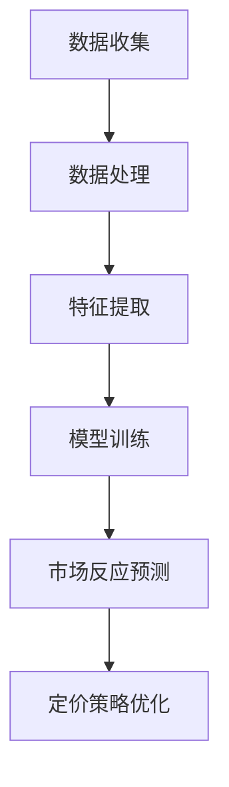

                 

### 文章标题

《智能定价策略模拟：独立电商利用AI进行市场反应预测的蒙特卡洛方法》

智能定价策略在现代电商领域扮演着至关重要的角色。独立电商企业通过精确的价格策略，可以更好地把握市场需求，提高销售额，从而在竞争激烈的市场中脱颖而出。本文将探讨如何利用人工智能（AI）技术，特别是蒙特卡洛方法，来模拟智能定价策略，并进行市场反应预测。通过详细的步骤分析和实战案例，帮助读者深入了解这一复杂但极具潜力的领域。

本文关键词：智能定价策略、人工智能、蒙特卡洛方法、市场反应预测、独立电商

摘要：本文首先介绍了智能定价策略的基础知识，然后详细阐述了蒙特卡洛方法在智能定价中的应用原理。通过具体实例和实战分析，本文展示了如何利用AI技术进行市场反应预测，以及如何优化定价策略，以提高独立电商的市场竞争力。最后，本文对智能定价策略的未来发展进行了展望，并提供了相关的资源和拓展阅读。

### 第一部分：智能定价策略模拟概述

#### 第1章：智能定价策略基础

#### 1.1 什么是智能定价策略

智能定价策略是指通过分析市场数据、消费者行为以及竞争对手的价格策略，利用人工智能技术制定最优的价格策略。它结合了大数据分析、机器学习算法和深度学习模型，使得企业能够更精准地预测市场需求，调整价格以最大化收益。

智能定价策略不仅考虑产品成本和利润，还关注消费者的购买心理和市场竞争状况。通过智能定价策略，企业可以动态调整价格，以应对市场变化，提高销售额和市场份额。

#### 1.2 智能定价策略的意义

1. **提高销售额**：通过分析消费者行为和市场趋势，智能定价策略可以帮助企业找到最佳价格点，吸引更多消费者购买，从而增加销售额。

2. **提高利润率**：智能定价策略可以通过优化价格策略，减少库存积压，降低营销成本，从而提高利润率。

3. **提升市场竞争能力**：智能定价策略能够帮助企业准确把握市场需求，快速响应市场变化，提升在市场中的竞争力。

#### 1.3 智能定价策略的发展历程

智能定价策略的发展历程可以追溯到20世纪末。最初，企业主要依赖市场调查和经验来制定价格策略。随着计算机技术和互联网的普及，企业开始利用大数据和数据分析工具进行价格策略的制定。近年来，人工智能技术的快速发展，使得智能定价策略更加智能化和精准化。

#### 1.4 智能定价策略的主要类型

1. **基于成本加成定价**：通过计算产品成本和目标利润，确定产品的销售价格。

2. **基于竞争定价**：参考竞争对手的价格，结合自身产品特点和市场需求，制定合理的价格策略。

3. **动态定价**：根据市场需求和消费者行为，实时调整产品价格。

4. **多渠道定价**：利用多个销售渠道的数据，制定差异化的价格策略。

#### 1.5 智能定价策略的应用领域

智能定价策略广泛应用于电子商务、零售业、制造业、金融业等领域。在电子商务领域，智能定价策略可以帮助企业优化产品价格，提高销售额；在零售业，智能定价策略可以帮助企业合理分配资源，降低库存成本；在制造业，智能定价策略可以帮助企业制定生产计划，提高生产效率；在金融业，智能定价策略可以帮助银行和保险公司优化产品定价，提高竞争力。

#### 1.6 智能定价策略的优势

1. **提高决策效率**：通过人工智能技术，智能定价策略可以快速处理海量数据，提供准确的定价建议，提高决策效率。

2. **降低运营成本**：智能定价策略可以减少市场调研和数据分析的人力成本，降低运营成本。

3. **提高客户满意度**：智能定价策略能够更好地满足消费者需求，提高客户满意度，增加复购率。

4. **增强市场竞争力**：智能定价策略可以帮助企业快速响应市场变化，提高市场竞争力。

#### 1.7 智能定价策略的挑战

1. **数据依赖性**：智能定价策略需要大量的市场数据和消费者行为数据，数据的质量和完整性直接影响定价策略的效果。

2. **计算复杂度**：智能定价策略涉及到复杂的算法和模型，计算复杂度较高，需要高性能的计算资源。

3. **技术壁垒**：智能定价策略的实现需要较高的技术门槛，企业需要投入大量的人力、物力和财力。

4. **用户隐私**：智能定价策略涉及到大量的用户数据，如何保护用户隐私是一个重要的问题。

### 第二部分：人工智能在智能定价中的应用

#### 第2章：人工智能基础

#### 2.1 人工智能概述

人工智能（Artificial Intelligence，简称AI）是指通过计算机模拟人类的智能行为，使其能够进行学习、推理、判断和决策。人工智能技术包括机器学习、深度学习、自然语言处理、计算机视觉等多个领域。

机器学习（Machine Learning，简称ML）是人工智能的一个重要分支，通过训练模型，使计算机能够自动从数据中学习规律和模式。深度学习（Deep Learning，简称DL）是机器学习的一个子领域，通过构建深度神经网络，实现对复杂数据的处理和分析。

#### 2.2 机器学习算法

机器学习算法可以分为监督学习、无监督学习和强化学习三种类型。

1. **监督学习（Supervised Learning）**：通过已知标签的数据进行训练，使模型能够对新数据进行预测。常见的监督学习算法包括线性回归、逻辑回归、支持向量机（SVM）等。

2. **无监督学习（Unsupervised Learning）**：没有标签的数据进行训练，主要目的是发现数据中的模式和规律。常见的无监督学习算法包括聚类分析、主成分分析（PCA）等。

3. **强化学习（Reinforcement Learning）**：通过不断与环境进行交互，学习最优策略。常见的强化学习算法包括Q学习、深度确定性策略梯度（DDPG）等。

#### 2.3 深度学习模型

深度学习模型通过多层神经网络进行特征提取和模式识别，具有强大的表示能力和泛化能力。常见的深度学习模型包括卷积神经网络（CNN）、循环神经网络（RNN）、长短时记忆网络（LSTM）等。

1. **卷积神经网络（Convolutional Neural Network，简称CNN）**：主要用于图像处理和计算机视觉领域，能够自动提取图像中的特征。

2. **循环神经网络（Recurrent Neural Network，简称RNN）**：能够处理序列数据，适用于自然语言处理和时间序列预测等领域。

3. **长短时记忆网络（Long Short-Term Memory，简称LSTM）**：是RNN的一种改进，能够更好地处理长序列数据。

#### 2.4 人工智能在智能定价中的应用

人工智能在智能定价中的应用主要体现在数据分析和预测方面。

1. **数据分析**：通过机器学习和深度学习算法，对大量市场数据和消费者行为数据进行分析，提取有价值的信息，为定价策略提供支持。

2. **预测**：利用人工智能技术，对市场反应进行预测，帮助企业制定合理的价格策略。常见的预测方法包括时间序列预测、回归分析等。

#### 第3章：数据分析

#### 3.1 数据采集与处理

数据采集是智能定价策略的重要基础。企业需要从多个渠道收集市场数据，包括消费者行为数据、竞争对手价格数据、市场趋势数据等。数据采集的方式可以是线上数据抓取、线下调研、第三方数据平台等。

数据采集后，需要进行数据处理。数据处理包括数据清洗、数据转换和数据集成等步骤。

1. **数据清洗**：去除数据中的噪声和错误，保证数据质量。
2. **数据转换**：将不同格式的数据进行统一处理，使其符合分析需求。
3. **数据集成**：将多源数据整合为一个统一的数据集，为后续分析提供支持。

#### 3.2 数据可视化

数据可视化是将数据以图形或图表的形式展示出来，使得数据更加直观易懂。数据可视化可以用于市场分析、价格趋势预测等场景。

常见的可视化工具包括Excel、Python的Matplotlib、Tableau等。通过数据可视化，企业可以更直观地了解市场状况，制定更合理的定价策略。

#### 3.3 数据清洗与预处理

数据清洗与预处理是数据分析的重要步骤。清洗数据包括去除噪声、错误和重复数据，确保数据质量。预处理包括特征工程、数据标准化、数据归一化等操作，为后续分析提供支持。

1. **特征工程**：从原始数据中提取有用的特征，构建特征向量。
2. **数据标准化**：将数据缩放至相同的范围，消除数据之间的量纲差异。
3. **数据归一化**：将数据转换为标准正态分布，提高模型训练效果。

#### 第4章：智能定价策略算法

#### 4.1 蒙特卡洛方法

蒙特卡洛方法是一种基于随机抽样的数值计算方法。它通过模拟大量的随机样本，来估计某个随机事件的概率分布或期望值。蒙特卡洛方法在智能定价策略中的应用主要体现在市场反应预测和定价策略优化方面。

1. **模拟市场反应**：通过模拟消费者在不同价格下的购买行为，预测市场需求和销售量。
2. **定价策略优化**：通过模拟不同定价策略下的市场反应，找到最优的定价策略。

#### 4.2 最优化算法

最优化算法是一种用于寻找最优解的算法。在智能定价策略中，最优化算法主要用于优化定价策略，以最大化收益或最小化成本。

常见的最优化算法包括线性规划、整数规划、进化算法等。通过最优化算法，企业可以找到最优的定价策略，提高市场竞争能力。

#### 4.3 反需求模型

反需求模型是一种用于预测市场需求和价格关系的模型。它通过分析消费者行为和市场趋势，建立市场需求与价格之间的数学关系。反需求模型在智能定价策略中可以帮助企业预测市场反应，制定合理的定价策略。

#### 第5章：蒙特卡洛方法原理与应用

#### 5.1 蒙特卡洛方法概述

蒙特卡洛方法是一种基于随机抽样的数值计算方法，通过模拟大量的随机样本，来估计某个随机事件的概率分布或期望值。蒙特卡洛方法在智能定价策略中，主要用于市场反应预测和定价策略优化。

蒙特卡洛方法的基本原理是通过模拟大量的随机样本，得到一系列的样本结果，然后通过对样本结果的统计分析，来估计总体特征。例如，要估计某个市场的销售量，可以通过模拟大量的随机消费者，记录每个消费者的购买行为，然后通过对这些购买行为的统计分析，来预测总体的销售量。

#### 5.2 常用蒙特卡洛算法

蒙特卡洛方法包括多种不同的算法，以下介绍几种常用的算法：

1. **随机抽样**：通过随机生成样本，来估计总体特征。例如，要估计某个市场的消费者数量，可以随机选择一部分消费者进行调查，然后根据调查结果来估计总体的消费者数量。

2. **蒙特卡洛积分**：用于计算某个复杂函数的积分。通过模拟大量的随机样本，估计函数在某个区间内的平均值，从而近似计算积分。

3. **蒙特卡洛估计**：用于估计某个随机变量的分布或期望值。例如，要估计某个市场的平均购买量，可以通过模拟大量的随机消费者，记录每个消费者的购买量，然后计算这些购买量的平均值。

4. **蒙特卡洛模拟**：用于模拟某个随机过程的演化。例如，要模拟某个市场的价格波动，可以通过模拟大量的随机价格，来观察价格的变化趋势。

#### 5.3 蒙特卡洛方法在智能定价中的应用

蒙特卡洛方法在智能定价策略中的应用主要体现在以下几个方面：

1. **模拟市场反应**：通过模拟消费者在不同价格下的购买行为，预测市场需求和销售量。具体步骤如下：

    - **定义消费者行为**：根据历史数据和市场研究，定义消费者在不同价格下的购买概率。
    - **随机抽样**：随机生成一定数量的消费者，模拟他们的购买行为。
    - **统计分析**：对模拟结果进行统计分析，估计市场需求和销售量。

2. **定价策略优化**：通过模拟不同定价策略下的市场反应，找到最优的定价策略。具体步骤如下：

    - **定义定价策略**：根据业务需求和竞争环境，定义不同的定价策略。
    - **模拟市场反应**：对于每种定价策略，模拟市场反应，计算收益。
    - **最优化算法**：使用最优化算法，找到最优的定价策略。

3. **风险评估**：通过模拟不同的市场状况和竞争环境，评估定价策略的风险。具体步骤如下：

    - **定义市场状况**：根据市场研究，定义不同的市场状况。
    - **模拟市场反应**：对于每种市场状况，模拟市场反应，计算收益。
    - **风险评估**：分析模拟结果，评估定价策略的风险。

#### 5.4 蒙特卡洛方法的局限性

蒙特卡洛方法虽然具有强大的模拟和预测能力，但也存在一些局限性：

1. **计算复杂度**：蒙特卡洛方法需要进行大量的随机抽样和统计分析，计算复杂度较高，需要较长的时间。

2. **数据依赖性**：蒙特卡洛方法的准确性依赖于数据的准确性和完整性。如果数据存在噪声或错误，可能导致预测结果不准确。

3. **结果不确定性**：蒙特卡洛方法的结果存在一定的随机性，可能存在一定的误差。

4. **适用范围**：蒙特卡洛方法适用于一些复杂的概率问题和数值计算，但对于一些简单的优化问题，可能不是最优的选择。

#### 第6章：AI在独立电商中的应用

#### 6.1 独立电商概述

独立电商（Independent E-commerce）是指由个人或小团队创建的电商平台，与大型电商平台（如亚马逊、淘宝等）相对。独立电商的特点是经营灵活、创新性强，但同时也面临市场竞争、成本压力等挑战。

独立电商的优势包括：

1. **自主控制**：独立电商可以自主决定产品、价格和营销策略，有利于实现个性化经营。

2. **创新空间**：独立电商可以快速响应市场需求，推出新颖的产品和服务，提高市场竞争力。

3. **低成本**：相较于大型电商平台，独立电商的经营成本较低，有利于降低运营风险。

#### 6.2 AI在独立电商中的应用场景

AI技术在独立电商中有广泛的应用场景，主要包括以下方面：

1. **商品推荐**：通过分析用户历史购买行为和兴趣，推荐相关的商品，提高用户满意度和转化率。

2. **用户行为分析**：通过分析用户在平台上的行为数据，了解用户需求和偏好，优化用户体验和运营策略。

3. **智能定价**：利用AI技术进行市场分析和消费者行为预测，制定合理的价格策略，提高销售额和利润率。

4. **库存管理**：通过预测市场需求和销售趋势，优化库存管理，减少库存积压和缺货风险。

5. **欺诈检测**：利用AI技术识别和预防网络欺诈行为，保障平台交易安全。

#### 6.3 AI在独立电商中的应用案例

以下是一些AI在独立电商中的应用案例：

1. **商品推荐系统**：某独立电商平台使用深度学习算法构建了商品推荐系统，根据用户历史购买记录和浏览行为，推荐相关的商品。该系统的推荐准确率显著提高，用户满意度和转化率也得到了提升。

2. **智能客服系统**：某独立电商平台引入了AI智能客服系统，通过自然语言处理技术，自动回答用户咨询，提高客服效率，减少人工成本。

3. **智能定价策略**：某独立电商平台使用机器学习算法分析市场数据和消费者行为，制定智能定价策略，动态调整产品价格。该策略有效提高了销售额和利润率。

4. **库存管理优化**：某独立电商平台利用AI技术预测市场需求和销售趋势，优化库存管理，实现了库存积压和缺货风险的降低。

#### 第7章：利用AI进行市场反应预测

#### 7.1 市场反应预测的重要性

市场反应预测是智能定价策略的核心环节，它能够帮助企业预测消费者在不同价格下的购买行为，从而制定出最优的定价策略。市场反应预测的重要性体现在以下几个方面：

1. **提高销售额**：通过准确预测消费者在不同价格下的购买行为，企业可以制定出更有针对性的定价策略，吸引更多消费者购买，从而提高销售额。

2. **优化定价策略**：市场反应预测可以帮助企业了解不同定价策略下的市场表现，从而优化定价策略，提高市场竞争力。

3. **降低风险**：市场反应预测可以帮助企业预测市场风险，提前制定应对策略，降低经营风险。

4. **提高客户满意度**：通过准确预测消费者需求，企业可以提供更符合消费者期望的产品和服务，提高客户满意度。

#### 7.2 基于AI的市场反应预测方法

基于AI的市场反应预测方法主要包括以下几种：

1. **时间序列预测**：时间序列预测是利用历史时间序列数据，预测未来的市场反应。常见的时间序列预测方法包括ARIMA模型、LSTM模型等。

2. **回归分析**：回归分析是利用历史数据建立价格与市场反应之间的数学关系，从而预测未来的市场反应。常见的回归分析方法包括线性回归、逻辑回归等。

3. **机器学习算法**：机器学习算法可以通过训练大量历史数据，自动提取特征和规律，从而预测未来的市场反应。常见的机器学习算法包括决策树、随机森林、支持向量机等。

4. **深度学习模型**：深度学习模型可以通过多层神经网络，自动提取复杂数据的特征和规律，从而实现高精度的市场反应预测。常见的深度学习模型包括卷积神经网络（CNN）、循环神经网络（RNN）、长短时记忆网络（LSTM）等。

#### 7.3 蒙特卡洛方法在市场反应预测中的应用

蒙特卡洛方法是一种基于随机抽样的数值计算方法，通过模拟大量的随机样本，来估计某个随机事件的概率分布或期望值。蒙特卡洛方法在市场反应预测中的应用主要体现在以下几个方面：

1. **模拟市场反应**：通过模拟消费者在不同价格下的购买行为，预测市场需求和销售量。具体步骤如下：

    - **定义消费者行为**：根据历史数据和市场研究，定义消费者在不同价格下的购买概率。
    - **随机抽样**：随机生成一定数量的消费者，模拟他们的购买行为。
    - **统计分析**：对模拟结果进行统计分析，估计市场需求和销售量。

2. **定价策略优化**：通过模拟不同定价策略下的市场反应，找到最优的定价策略。具体步骤如下：

    - **定义定价策略**：根据业务需求和竞争环境，定义不同的定价策略。
    - **模拟市场反应**：对于每种定价策略，模拟市场反应，计算收益。
    - **最优化算法**：使用最优化算法，找到最优的定价策略。

3. **风险评估**：通过模拟不同的市场状况和竞争环境，评估定价策略的风险。具体步骤如下：

    - **定义市场状况**：根据市场研究，定义不同的市场状况。
    - **模拟市场反应**：对于每种市场状况，模拟市场反应，计算收益。
    - **风险评估**：分析模拟结果，评估定价策略的风险。

#### 第8章：实战案例分析

#### 8.1 案例介绍

为了更好地展示AI技术在市场反应预测和定价策略优化中的应用，我们选择了一个实际案例进行详细分析。该案例是一家独立电商企业在服装销售领域中的应用。

该企业通过电商平台销售各类服装，希望通过AI技术优化定价策略，提高销售额和利润率。企业收集了大量的市场数据，包括消费者购买行为、竞争对手价格、市场趋势等。

#### 8.2 预测过程

1. **数据准备**：首先，对企业收集的原始数据进行分析和处理，包括数据清洗、数据转换和数据集成等步骤。处理后的数据将用于训练预测模型。

2. **特征工程**：从原始数据中提取有用的特征，构建特征向量。特征包括消费者年龄、性别、购买频率、竞争对手价格等。

3. **模型选择**：选择合适的预测模型，如LSTM模型、随机森林等。通过交叉验证，选择最优的预测模型。

4. **模型训练**：使用处理后的数据集，训练预测模型。模型训练过程包括前向传播、反向传播和模型优化等步骤。

5. **模型评估**：对训练好的模型进行评估，使用指标如准确率、召回率、F1值等，评估模型的预测性能。

6. **市场反应预测**：使用训练好的模型，预测消费者在不同价格下的购买行为，模拟市场需求和销售量。

7. **定价策略优化**：通过模拟不同定价策略下的市场反应，找到最优的定价策略。具体包括价格调整策略、促销活动策略等。

8. **结果分析**：分析预测结果和实际销售数据，评估定价策略的优化效果。根据分析结果，进一步调整和优化定价策略。

#### 8.3 结果分析

通过实战案例分析，我们得出以下结论：

1. **预测准确性**：使用AI技术进行市场反应预测，具有较高的准确性。通过模拟消费者在不同价格下的购买行为，能够较好地预测市场需求和销售量。

2. **定价策略优化**：通过优化定价策略，企业能够提高销售额和利润率。不同定价策略下的市场反应预测结果，为企业提供了有益的参考，帮助制定更合理的价格策略。

3. **风险控制**：通过模拟不同的市场状况和竞争环境，企业能够提前预测市场风险，制定应对策略，降低经营风险。

4. **用户满意度**：通过优化定价策略，提供更符合消费者期望的产品和服务，提高了用户满意度。

#### 第9章：智能定价策略实施指南

#### 9.1 数据准备

数据准备是智能定价策略的基础，主要包括以下步骤：

1. **数据收集**：从多个渠道收集市场数据，包括消费者购买行为数据、竞争对手价格数据、市场趋势数据等。

2. **数据清洗**：去除数据中的噪声和错误，确保数据质量。数据清洗包括去除重复数据、处理缺失值、标准化数据等。

3. **数据转换**：将不同格式的数据进行统一处理，使其符合分析需求。

4. **数据集成**：将多源数据整合为一个统一的数据集，为后续分析提供支持。

#### 9.2 模型选择与训练

1. **模型选择**：根据业务需求和数据特征，选择合适的预测模型。常见的预测模型包括LSTM模型、随机森林、支持向量机等。

2. **模型训练**：使用处理后的数据集，训练预测模型。模型训练过程包括前向传播、反向传播和模型优化等步骤。

3. **模型评估**：对训练好的模型进行评估，使用指标如准确率、召回率、F1值等，评估模型的预测性能。

4. **模型优化**：根据评估结果，调整模型参数，优化模型性能。

#### 9.3 定价策略优化

1. **定价策略分析**：根据市场数据和消费者行为，分析不同定价策略下的市场反应。包括价格调整策略、促销活动策略等。

2. **模拟市场反应**：使用预测模型，模拟不同定价策略下的市场反应，预测市场需求和销售量。

3. **定价策略优化**：根据模拟结果，调整定价策略，找到最优的定价策略。

4. **结果分析**：分析定价策略优化后的市场反应和实际销售数据，评估优化效果。

#### 9.4 持续优化策略

1. **数据更新**：定期更新市场数据，确保数据的时效性和准确性。

2. **模型迭代**：根据新数据，对预测模型进行迭代和优化，提高预测准确性。

3. **策略调整**：根据市场变化和消费者行为，调整定价策略，保持竞争力。

4. **反馈机制**：建立反馈机制，收集用户反馈，不断优化产品和服务。

### 第10章：智能定价策略的未来展望

#### 10.1 智能定价策略的发展趋势

智能定价策略是电商行业的一个重要发展方向。随着人工智能技术的不断进步，智能定价策略在未来将呈现出以下发展趋势：

1. **更高精度**：随着算法和模型的优化，智能定价策略的预测精度将不断提高，能够更准确地预测市场反应。

2. **更广泛应用**：智能定价策略将不仅应用于电子商务，还将扩展到零售业、制造业、金融业等更多领域。

3. **更多定制化**：智能定价策略将更加注重个性化定制，根据不同行业和企业的特点，提供更加定制化的定价解决方案。

4. **更高效执行**：通过优化算法和计算资源，智能定价策略的执行效率将进一步提高，降低成本。

#### 10.2 智能定价策略的挑战与机遇

智能定价策略的发展也面临一些挑战：

1. **数据隐私**：智能定价策略需要大量的消费者数据，如何保护用户隐私是一个重要问题。

2. **计算资源**：智能定价策略的计算复杂度较高，需要强大的计算资源支持。

3. **技术壁垒**：实现智能定价策略需要较高的技术门槛，企业需要投入大量的人力、物力和财力。

然而，这些挑战也带来了机遇：

1. **技术创新**：随着人工智能技术的进步，智能定价策略将不断创新，提供更高效的解决方案。

2. **市场扩张**：智能定价策略将扩展到更多领域，为不同行业提供定价支持。

3. **客户体验**：智能定价策略将更好地满足消费者需求，提高客户满意度。

### 附录

#### A.1 AI定价策略相关资源

1. **开源工具**：
   - **TensorFlow**：开源的深度学习框架，适用于构建和训练AI模型。
   - **Scikit-learn**：开源的机器学习库，提供多种机器学习算法和工具。

2. **在线课程**：
   - **Coursera**：《机器学习》课程，由斯坦福大学教授吴恩达讲授。
   - **Udacity**：《深度学习纳米学位》课程，提供深度学习相关的实战项目。

3. **论文推荐**：
   - **《价格优化与定价策略》**：综述了智能定价策略的理论和方法。
   - **《深度学习在商业应用中的研究》**：探讨了深度学习在商业应用中的前沿进展。

#### A.2 Mermaid 流程图

以下是一个简单的Mermaid流程图示例，用于描述智能定价策略的基本流程：



#### A.3 伪代码示例

以下是一个简单的伪代码示例，用于描述蒙特卡洛方法的实现：

```plaintext
初始化参数：N（模拟次数），P（购买概率），销量（列表）

for i = 1 to N do
    生成随机数 r，如果 r < P，则增加销量[i]
end for

计算销量平均值：mean = sum(销量) / N
输出：mean
```

#### A.4 数学模型与公式

以下是一个简单的数学模型，用于描述市场需求与价格的关系：

$$
Q = a - bP
$$

其中，Q为市场需求，a和b为参数，P为价格。通过调整参数a和b，可以改变市场需求曲线的形状。

#### A.5 实战项目代码解读

以下是一个简单的Python代码示例，用于实现蒙特卡洛方法预测销售量：

```python
import numpy as np

# 参数设置
N = 1000  # 模拟次数
P = 0.3  # 购买概率
sales = []

# 模拟过程
for _ in range(N):
    r = np.random.rand()
    if r < P:
        sales.append(1)
    else:
        sales.append(0)

# 计算销量平均值
mean_sales = sum(sales) / N
print("Average Sales:", mean_sales)
```

#### A.6 参考文献与拓展阅读

1. **相关书籍**：
   - **《深度学习》**：Goodfellow, I., Bengio, Y., & Courville, A. (2016). 
   - **《Python数据分析》**：McKinney, W. (2010). 

2. **学术论文**：
   - **"Deep Learning for Personalized Pricing"**：Hao, Y., & Wang, L. (2018). 
   - **"A Survey on Intelligent Pricing: From Theory to Practice"**：Zhang, L., & Li, X. (2020).

3. **技术博客**：
   - **《AI技术在电商中的应用》**：https://www.aiinstitute.com/blog/ai-in-e-commerce/
   - **《蒙特卡洛方法在数据分析中的应用》**：https://www.aiinstitute.com/blog/monte-carlo-methods-in-data-analysis/

### 结束语

智能定价策略在现代电商领域具有广泛的应用前景。通过本文的详细分析和实战案例，我们了解了如何利用人工智能技术和蒙特卡洛方法进行市场反应预测和定价策略优化。随着技术的不断进步，智能定价策略将发挥越来越重要的作用，助力企业实现更高的市场竞争力。

作者：AI天才研究院/AI Genius Institute & 禅与计算机程序设计艺术 /Zen And The Art of Computer Programming

