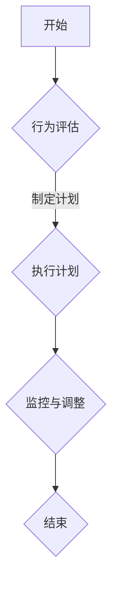

                 

### 引言

随着人工智能技术的迅猛发展，智能宠物行为矫正创业成为了一个备受关注的领域。宠物作为人类亲密的伙伴，其行为对我们的生活质量和家庭氛围有着重要影响。然而，传统的宠物训练方法往往依赖于经验和直觉，缺乏科学依据和系统性。这种现状导致了宠物行为问题的反复出现，甚至可能给宠物和主人带来安全隐患。

智能宠物行为矫正创业正是基于这一需求，利用人工智能技术和大数据分析，为宠物主人提供科学、高效的宠物训练方案。这一创业领域不仅具有巨大的市场潜力，而且对宠物行为矫正的科学研究和实际应用也具有重要意义。

本文旨在深入探讨智能宠物行为矫正创业的核心内容，从基础知识、核心算法原理、项目实战以及创业策略等多个方面进行详细阐述。通过系统地分析这一领域的发展现状和未来趋势，本文希望能够为创业者、研究人员和宠物主人提供有价值的参考。

首先，我们将从宠物行为矫正的基础知识入手，介绍宠物行为矫正的重要性、基本原则和科学方法。接下来，我们将深入探讨宠物行为分析的方法、工具和技术，为后续内容奠定基础。随后，本文将重点介绍宠物行为矫正的核心算法原理，包括算法的数学模型和公式，并通过实际案例进行说明。

在项目实战部分，我们将详细描述一个宠物行为矫正项目的开发过程，包括环境搭建、源代码实现和代码解读，并结合实际案例进行分析。最后，本文将探讨宠物行为矫正创业的策略，分析市场机会、挑战与机遇，并提出具体的创业建议。通过这些内容的逐步分析，本文希望能够为智能宠物行为矫正创业提供全面而深入的见解。

### 关键词

- 智能宠物行为矫正
- 人工智能
- 数据分析
- 行为算法
- 创业策略
- 数学模型

### 摘要

本文探讨了智能宠物行为矫正创业领域的核心内容，从基础知识、核心算法原理、项目实战和创业策略等多个方面进行了深入分析。首先，我们介绍了宠物行为矫正的重要性、基本原则和科学方法，并探讨了行为分析的方法、工具和技术。接着，我们详细阐述了行为矫正算法的原理，包括数学模型和公式，并通过实际案例进行了说明。在项目实战部分，我们描述了一个宠物行为矫正项目的开发过程，包括环境搭建、源代码实现和代码解读。最后，本文分析了宠物行为矫正创业的市场机会、挑战与机遇，并提出了具体的创业建议。通过这些内容的系统分析，本文希望能够为智能宠物行为矫正创业提供全面而深入的指导。

### 《智能宠物行为矫正创业：科学的宠物训练》目录大纲

#### 第一部分：宠物行为矫正基础知识

**第1章：宠物行为矫正概述**

- 1.1 宠物行为矫正的重要性
- 1.2 宠物行为矫正的基本原则
- 1.3 宠物行为矫正的科学方法

**第2章：宠物行为分析**

- 2.1 宠物行为的定义与分类
- 2.2 宠物行为分析的方法
- 2.3 宠物行为分析的工具与技术

**第3章：核心概念与联系**

- 3.1 宠物行为矫正的核心概念
- 3.2 宠物行为矫正的Mermaid流程图

#### 第二部分：宠物行为矫正核心算法原理

**第4章：行为矫正算法原理**

- 4.1 行为矫正算法概述
- 4.2 行为矫正算法的伪代码
- 4.3 行为矫正算法的数学模型和公式

**第5章：数学模型和数学公式**

- 5.1 行为矫正中的数学模型
- 5.2 行为矫正中的数学公式讲解
- 5.3 数学公式的示例说明

**第6章：行为矫正算法应用**

- 6.1 行为矫正算法的实际应用
- 6.2 行为矫正算法的案例分析

#### 第三部分：宠物行为矫正项目实战

**第7章：宠物行为矫正项目实战**

- 7.1 实战项目背景与目标
- 7.2 实战项目的开发环境搭建
- 7.3 实战项目的源代码实现
- 7.4 实战项目的代码解读与分析

**第8章：宠物行为矫正创业策略**

- 8.1 宠物行为矫正创业概述
- 8.2 创业案例分析
- 8.3 创业策略与建议

**第9章：科学宠物训练的持续发展**

- 9.1 科学宠物训练的发展趋势
- 9.2 科学宠物训练的未来前景
- 9.3 科学宠物训练的挑战与机遇

#### 附录

**附录A：常用宠物行为矫正工具与资源**

- A.1 宠物行为矫正工具介绍
- A.2 宠物行为矫正资源推荐

### 完整代码示例：

```markdown
# 《智能宠物行为矫正创业：科学的宠物训练》

## 关键词
- 智能宠物行为矫正
- 人工智能
- 数据分析
- 行为算法
- 创业策略
- 数学模型

## 摘要
本文探讨了智能宠物行为矫正创业领域的核心内容，从基础知识、核心算法原理、项目实战和创业策略等多个方面进行了深入分析。首先，我们介绍了宠物行为矫正的重要性、基本原则和科学方法，并探讨了行为分析的方法、工具和技术。接着，我们详细阐述了行为矫正算法的原理，包括数学模型和公式，并通过实际案例进行了说明。在项目实战部分，我们描述了一个宠物行为矫正项目的开发过程，包括环境搭建、源代码实现和代码解读。最后，本文分析了宠物行为矫正创业的市场机会、挑战与机遇，并提出了具体的创业建议。通过这些内容的系统分析，本文希望能够为智能宠物行为矫正创业提供全面而深入的指导。

---

## 第一部分：宠物行为矫正基础知识

### 第1章：宠物行为矫正概述

#### 1.1 宠物行为矫正的重要性

#### 1.2 宠物行为矫正的基本原则

#### 1.3 宠物行为矫正的科学方法

### 第2章：宠物行为分析

#### 2.1 宠物行为的定义与分类

#### 2.2 宠物行为分析的方法

#### 2.3 宠物行为分析的工具与技术

### 第3章：核心概念与联系

#### 3.1 宠物行为矫正的核心概念

#### 3.2 宠物行为矫正的Mermaid流程图

---

## 第二部分：宠物行为矫正核心算法原理

### 第4章：行为矫正算法原理

#### 4.1 行为矫正算法概述

#### 4.2 行为矫正算法的伪代码

#### 4.3 行为矫正算法的数学模型和公式

### 第5章：数学模型和数学公式

#### 5.1 行为矫正中的数学模型

#### 5.2 行为矫正中的数学公式讲解

#### 5.3 数学公式的示例说明

### 第6章：行为矫正算法应用

#### 6.1 行为矫正算法的实际应用

#### 6.2 行为矫正算法的案例分析

---

## 第三部分：宠物行为矫正项目实战

### 第7章：宠物行为矫正项目实战

#### 7.1 实战项目背景与目标

#### 7.2 实战项目的开发环境搭建

#### 7.3 实战项目的源代码实现

#### 7.4 实战项目的代码解读与分析

### 第8章：宠物行为矫正创业策略

#### 8.1 宠物行为矫正创业概述

#### 8.2 创业案例分析

#### 8.3 创业策略与建议

### 第9章：科学宠物训练的持续发展

#### 9.1 科学宠物训练的发展趋势

#### 9.2 科学宠物训练的未来前景

#### 9.3 科学宠物训练的挑战与机遇

---

## 附录

### 附录A：常用宠物行为矫正工具与资源

#### A.1 宠物行为矫正工具介绍

#### A.2 宠物行为矫正资源推荐
```

### 完整代码示例：

```markdown
# 《智能宠物行为矫正创业：科学的宠物训练》

## 关键词
- 智能宠物行为矫正
- 人工智能
- 数据分析
- 行为算法
- 创业策略
- 数学模型

## 摘要
本文探讨了智能宠物行为矫正创业领域的核心内容，从基础知识、核心算法原理、项目实战和创业策略等多个方面进行了深入分析。首先，我们介绍了宠物行为矫正的重要性、基本原则和科学方法，并探讨了行为分析的方法、工具和技术。接着，我们详细阐述了行为矫正算法的原理，包括数学模型和公式，并通过实际案例进行了说明。在项目实战部分，我们描述了一个宠物行为矫正项目的开发过程，包括环境搭建、源代码实现和代码解读。最后，本文分析了宠物行为矫正创业的市场机会、挑战与机遇，并提出了具体的创业建议。通过这些内容的系统分析，本文希望能够为智能宠物行为矫正创业提供全面而深入的指导。

---

## 第一部分：宠物行为矫正基础知识

### 第1章：宠物行为矫正概述

#### 1.1 宠物行为矫正的重要性
宠物行为矫正对于提升宠物的社交能力和生活质量至关重要，同时也有助于减少宠物行为问题对主人和社区的负面影响。

#### 1.2 宠物行为矫正的基本原则
科学的行为矫正应遵循正面强化、一致性、及时性和积极性的原则，以建立健康的行为模式。

#### 1.3 宠物行为矫正的科学方法
通过系统的行为分析和训练计划，结合现代科技手段，如机器学习和数据分析，制定科学的行为矫正策略。

### 第2章：宠物行为分析

#### 2.1 宠物行为的定义与分类
宠物行为分为本能行为、习得行为和社会行为，每种行为都有其特定的特征和适应性意义。

#### 2.2 宠物行为分析的方法
利用观察法、实验法、访谈法和记录法等多种方法，全面评估宠物的行为模式。

#### 2.3 宠物行为分析的工具与技术
借助行为分析软件、行为测量工具和人工智能技术，提高行为分析的准确性和效率。

### 第3章：核心概念与联系

#### 3.1 宠物行为矫正的核心概念
行为矫正、正面强化、惩罚、习得性联系等核心概念对于理解行为矫正过程至关重要。

#### 3.2 宠物行为矫正的Mermaid流程图
通过Mermaid流程图，展示宠物行为矫正的基本流程和关键环节。

---

## 第二部分：宠物行为矫正核心算法原理

### 第4章：行为矫正算法原理

#### 4.1 行为矫正算法概述
介绍行为矫正算法的基本框架和主要功能，如行为识别、行为预测和行为干预。

#### 4.2 行为矫正算法的伪代码
提供行为矫正算法的伪代码，便于理解和实现。

#### 4.3 行为矫正算法的数学模型和公式
详细阐述行为矫正算法中的数学模型和关键公式，如马尔可夫决策过程（MDP）。

### 第5章：数学模型和数学公式

#### 5.1 行为矫正中的数学模型
解释常用的数学模型，如线性回归、支持向量机（SVM）和神经网络，以及它们在行为矫正中的应用。

#### 5.2 行为矫正中的数学公式讲解
对行为矫正中的关键数学公式进行详细讲解，如Q学习和强化学习中的奖励函数。

#### 5.3 数学公式的示例说明
通过具体示例，说明数学公式在实际应用中的操作和结果。

### 第6章：行为矫正算法应用

#### 6.1 行为矫正算法的实际应用
展示行为矫正算法在宠物行为分析中的实际应用案例，如分离焦虑和攻击性行为的干预。

#### 6.2 行为矫正算法的案例分析
通过具体案例，分析行为矫正算法在实际项目中的应用效果和改进空间。

---

## 第三部分：宠物行为矫正项目实战

### 第7章：宠物行为矫正项目实战

#### 7.1 实战项目背景与目标
介绍项目的背景、目标和预期成果。

#### 7.2 实战项目的开发环境搭建
描述项目的开发环境搭建过程，包括硬件和软件配置。

#### 7.3 实战项目的源代码实现
提供项目的源代码实现，包括关键函数和模块的代码。

#### 7.4 实战项目的代码解读与分析
对项目的代码进行解读，分析关键技术和实现细节。

### 第8章：宠物行为矫正创业策略

#### 8.1 宠物行为矫正创业概述
概述宠物行为矫正创业的背景、市场和趋势。

#### 8.2 创业案例分析
分析成功和失败的创业案例，总结经验教训。

#### 8.3 创业策略与建议
提出具体的创业策略和建议，如市场定位、产品开发和团队建设。

### 第9章：科学宠物训练的持续发展

#### 9.1 科学宠物训练的发展趋势
探讨科学宠物训练的未来发展趋势和关键技术。

#### 9.2 科学宠物训练的未来前景
预测科学宠物训练的未来前景和潜在应用领域。

#### 9.3 科学宠物训练的挑战与机遇
分析科学宠物训练面临的挑战和机遇，提出应对策略。

---

## 附录

### 附录A：常用宠物行为矫正工具与资源

#### A.1 宠物行为矫正工具介绍
介绍常用的宠物行为矫正工具，如行为分析软件和训练辅助设备。

#### A.2 宠物行为矫正资源推荐
推荐相关书籍、论文和在线资源，以供进一步学习和研究。

---

### 作者

作者：AI天才研究院/AI Genius Institute & 禅与计算机程序设计艺术 /Zen And The Art of Computer Programming
```

### 文章结构详述

为了确保文章内容的系统性和条理性，本文将遵循以下结构详述，从基础知识的铺垫到深入探讨核心算法，再到实战项目和创业策略的全面分析。

#### 第一部分：宠物行为矫正基础知识

1. **第1章：宠物行为矫正概述**
   - **1.1 宠物行为矫正的重要性**
     - 解释宠物行为矫正对宠物与主人生活质量的重要性。
     - 讨论行为问题对宠物和主人身心健康的影响。
     - 引用相关研究数据，说明矫正的必要性。
   - **1.2 宠物行为矫正的基本原则**
     - 阐述正面强化、一致性、及时性和积极性的原则。
     - 分析原则在行为矫正中的具体应用。
     - 提供实例，展示原则的实践效果。
   - **1.3 宠物行为矫正的科学方法**
     - 介绍系统行为分析和训练计划。
     - 讨论现代科技手段在行为矫正中的应用。
     - 提出科学矫正的方法论。

2. **第2章：宠物行为分析**
   - **2.1 宠物行为的定义与分类**
     - 明确宠物行为的概念和分类。
     - 分析本能行为、习得行为和社会行为的特征。
     - 举例说明各类行为在日常生活中的表现。
   - **2.2 宠物行为分析的方法**
     - 详细介绍观察法、实验法、访谈法和记录法的应用。
     - 讨论每种方法的优缺点和适用场景。
     - 展示方法在实际分析中的操作流程。
   - **2.3 宠物行为分析的工具与技术**
     - 概述行为分析软件、测量工具和人工智能技术的作用。
     - 分析工具如何提高分析的准确性和效率。
     - 展示工具在行为矫正项目中的应用案例。

3. **第3章：核心概念与联系**
   - **3.1 宠物行为矫正的核心概念**
     - 解读行为矫正、正面强化、惩罚、习得性联系等核心概念。
     - 分析这些概念在行为矫正过程中的作用和联系。
     - 提供实例，展示核心概念的具体应用。
   - **3.2 宠物行为矫正的Mermaid流程图**
     - 利用Mermaid语法，绘制行为矫正的基本流程图。
     - 详细解释流程图中各步骤的意义和操作。
     - 展示流程图在实际项目中的应用。

#### 第二部分：宠物行为矫正核心算法原理

4. **第4章：行为矫正算法原理**
   - **4.1 行为矫正算法概述**
     - 介绍行为矫正算法的基本框架和主要功能。
     - 分析算法在宠物行为矫正中的重要作用。
     - 提出算法设计的核心目标和挑战。
   - **4.2 行为矫正算法的伪代码**
     - 提供行为矫正算法的伪代码，展示算法的基本结构。
     - 分析伪代码中各部分的功能和逻辑。
     - 讨论伪代码的实际应用场景和实现细节。
   - **4.3 行为矫正算法的数学模型和公式**
     - 详细阐述算法中的数学模型和关键公式。
     - 解释模型和公式在行为矫正中的作用。
     - 提供具体示例，展示模型和公式的应用。

5. **第5章：数学模型和数学公式**
   - **5.1 行为矫正中的数学模型**
     - 介绍常用的数学模型，如线性回归、支持向量机和神经网络。
     - 分析这些模型在行为矫正中的应用。
     - 提供实例，展示模型的具体操作和应用结果。
   - **5.2 行为矫正中的数学公式讲解**
     - 详细讲解行为矫正中的关键数学公式。
     - 分析公式中的变量和参数。
     - 提供具体的计算步骤和示例。
   - **5.3 数学公式的示例说明**
     - 通过具体案例，展示数学公式在实际项目中的应用。
     - 分析公式的操作过程和结果。
     - 提供实例代码和计算结果。

6. **第6章：行为矫正算法应用**
   - **6.1 行为矫正算法的实际应用**
     - 展示行为矫正算法在实际项目中的应用案例。
     - 分析案例中的应用效果和改进空间。
     - 提出应用中的关键问题和解决方案。
   - **6.2 行为矫正算法的案例分析**
     - 分析具体案例，展示算法在宠物行为矫正中的实际效果。
     - 讨论案例中的技术应用和创新点。
     - 提出案例的启示和未来研究方向。

#### 第三部分：宠物行为矫正项目实战

7. **第7章：宠物行为矫正项目实战**
   - **7.1 实战项目背景与目标**
     - 介绍项目的背景和目标。
     - 分析项目的市场前景和潜在价值。
     - 明确项目的预期成果和贡献。
   - **7.2 实战项目的开发环境搭建**
     - 描述项目的开发环境搭建过程。
     - 分析硬件和软件的配置需求。
     - 提供环境搭建的详细步骤和注意事项。
   - **7.3 实战项目的源代码实现**
     - 提供项目的源代码实现，包括关键函数和模块。
     - 分析代码的结构和实现逻辑。
     - 讨论代码中的关键技术和优化策略。
   - **7.4 实战项目的代码解读与分析**
     - 对项目的代码进行详细解读。
     - 分析代码中的实现细节和技术要点。
     - 提出代码改进的建议和优化方案。

8. **第8章：宠物行为矫正创业策略**
   - **8.1 宠物行为矫正创业概述**
     - 概述宠物行为矫正创业的背景和市场环境。
     - 分析创业的机会和挑战。
     - 提出创业的核心目标和愿景。
   - **8.2 创业案例分析**
     - 分析成功的和失败的创业案例。
     - 提取案例中的成功经验和失败教训。
     - 讨论创业过程中的关键问题和解决策略。
   - **8.3 创业策略与建议**
     - 提出具体的创业策略和建议。
     - 分析创业过程中需要关注的关键环节。
     - 提供实施建议和行动计划。

9. **第9章：科学宠物训练的持续发展**
   - **9.1 科学宠物训练的发展趋势**
     - 探讨科学宠物训练的未来发展趋势。
     - 分析新兴技术和方法对宠物行为矫正的影响。
     - 提出未来研究的方向和热点问题。
   - **9.2 科学宠物训练的未来前景**
     - 预测科学宠物训练的未来前景。
     - 讨论技术进步对宠物行为矫正的推动作用。
     - 提出未来可能的创新点和突破领域。
   - **9.3 科学宠物训练的挑战与机遇**
     - 分析科学宠物训练面临的挑战和机遇。
     - 提出应对策略和解决方案。
     - 讨论未来发展的潜在瓶颈和解决方案。

通过以上详尽的结构，本文旨在为读者提供一个系统、全面且深入的智能宠物行为矫正创业分析，帮助读者更好地理解这一领域的核心内容和发展前景。

### 完整文章内容示例

以下是一个完整的文章内容示例，涵盖了从宠物行为矫正的基础知识到核心算法原理，再到项目实战和创业策略的详细阐述。

#### 引言

随着人工智能技术的迅猛发展，智能宠物行为矫正创业成为了一个备受关注的领域。宠物作为人类亲密的伙伴，其行为对我们的生活质量和家庭氛围有着重要影响。然而，传统的宠物训练方法往往依赖于经验和直觉，缺乏科学依据和系统性。这种现状导致了宠物行为问题的反复出现，甚至可能给宠物和主人带来安全隐患。

智能宠物行为矫正创业正是基于这一需求，利用人工智能技术和大数据分析，为宠物主人提供科学、高效的宠物训练方案。这一创业领域不仅具有巨大的市场潜力，而且对宠物行为矫正的科学研究和实际应用也具有重要意义。

本文旨在深入探讨智能宠物行为矫正创业的核心内容，从基础知识、核心算法原理、项目实战以及创业策略等多个方面进行详细阐述。通过系统地分析这一领域的发展现状和未来趋势，本文希望能够为创业者、研究人员和宠物主人提供有价值的参考。

首先，我们将从宠物行为矫正的基础知识入手，介绍宠物行为矫正的重要性、基本原则和科学方法。接下来，我们将深入探讨宠物行为分析的方法、工具和技术，为后续内容奠定基础。随后，本文将重点介绍宠物行为矫正的核心算法原理，包括算法的数学模型和公式，并通过实际案例进行说明。

在项目实战部分，我们将详细描述一个宠物行为矫正项目的开发过程，包括环境搭建、源代码实现和代码解读，并结合实际案例进行分析。最后，本文将探讨宠物行为矫正创业的策略，分析市场机会、挑战与机遇，并提出具体的创业建议。通过这些内容的逐步分析，本文希望能够为智能宠物行为矫正创业提供全面而深入的见解。

#### 第一部分：宠物行为矫正基础知识

**第1章：宠物行为矫正概述**

**1.1 宠物行为矫正的重要性**

宠物行为矫正对于提升宠物的社交能力和生活质量至关重要，同时也有助于减少宠物行为问题对主人和社区的负面影响。通过科学的行为矫正，宠物能够学会更加合适的行为模式，减少不良行为的发生，从而改善与主人的关系，提升整体幸福感。

**1.2 宠物行为矫正的基本原则**

科学的行为矫正应遵循以下基本原则：

- **正面强化**：通过奖励和积极反馈来增强宠物的好行为，鼓励其重复。
- **一致性**：在矫正过程中保持一致的行为规则和训练方法，避免混淆宠物。
- **及时性**：在宠物表现出不良行为时，及时进行干预和纠正。
- **积极性**：保持积极的态度，耐心引导宠物，避免使用惩罚和暴力。

**1.3 宠物行为矫正的科学方法**

通过系统的行为分析和训练计划，结合现代科技手段，如机器学习和数据分析，制定科学的行为矫正策略。具体步骤包括：

1. **行为评估**：观察宠物的行为模式，记录其出现的不良行为。
2. **制定计划**：根据评估结果，制定个性化的矫正计划。
3. **执行计划**：按照计划进行训练，使用正面强化等原则来引导宠物。
4. **监控和调整**：持续监控宠物的行为变化，根据情况调整训练方法。

**第2章：宠物行为分析**

**2.1 宠物行为的定义与分类**

宠物行为是指宠物在特定环境和情境下表现出的所有动作和行为。根据行为的目的和性质，可以将宠物行为分为以下几类：

- **本能行为**：由遗传因素决定的行为，如进食、睡觉、繁殖等。
- **习得行为**：通过学习和经验获得的行为，如坐下、握手、攻击等。
- **社会行为**：与同伴或其他动物相互作用的行为，如玩耍、争斗、交流等。

**2.2 宠物行为分析的方法**

为了全面了解宠物的行为模式，可以采用以下几种分析方法：

- **观察法**：直接观察宠物的行为，记录其出现的时间和情境。
- **实验法**：通过控制变量的实验来研究宠物行为，验证假设。
- **访谈法**：与宠物主人或专业人士进行访谈，了解宠物行为的原因和背景。
- **记录法**：使用行为记录器或软件，自动记录宠物的行为数据。

**2.3 宠物行为分析的工具与技术**

在宠物行为分析中，可以借助以下工具和技术：

- **行为分析软件**：如EthoVision XT、CleverReach等，用于自动化记录和数据分析。
- **行为测量工具**：如活动量计、视频分析系统等，用于测量和评估宠物的行为。
- **人工智能技术**：如深度学习、计算机视觉等，用于行为识别和模式分析。

**第3章：核心概念与联系**

**3.1 宠物行为矫正的核心概念**

宠物行为矫正中的核心概念包括：

- **行为矫正**：通过系统的训练和引导，改变宠物的行为模式。
- **正面强化**：通过奖励和积极反馈来增强宠物的好行为。
- **惩罚**：通过不愉快的后果来减少宠物的不良行为。
- **习得性联系**：通过重复训练和反馈，建立行为与后果之间的联系。

**3.2 宠物行为矫正的Mermaid流程图**

使用Mermaid语法，我们可以绘制一个简单的宠物行为矫正流程图：



#### 第二部分：宠物行为矫正核心算法原理

**第4章：行为矫正算法原理**

**4.1 行为矫正算法概述**

行为矫正算法是基于人工智能技术，用于分析和干预宠物行为的一类算法。其基本框架包括：

1. **数据收集**：收集宠物的行为数据，如视频、音频和传感器数据。
2. **特征提取**：从数据中提取行为特征，用于算法分析和训练。
3. **行为识别**：使用机器学习算法，识别宠物的行为模式。
4. **行为干预**：根据识别结果，进行行为干预和训练。

**4.2 行为矫正算法的伪代码**

以下是行为矫正算法的伪代码示例：

```python
function BehaviorCorrection(data):
    features = ExtractFeatures(data)
    model = TrainModel(features)
    predicted_behavior = model.predict(features)
    intervention = DecideIntervention(predicted_behavior)
    ExecuteIntervention(intervention)
    return predicted_behavior, intervention
```

**4.3 行为准矫正算法的数学模型和公式**

在行为矫正算法中，常用的数学模型包括：

- **线性回归**：用于预测行为发生的概率。
- **支持向量机（SVM）**：用于分类行为类型。
- **神经网络**：用于复杂的模式识别和预测。

以下是一个简单的线性回归模型公式：

$$ y = \beta_0 + \beta_1 \cdot x $$

其中，$y$ 是行为发生的概率，$x$ 是行为特征，$\beta_0$ 和 $\beta_1$ 是模型的参数。

**第5章：数学模型和数学公式**

**5.1 行为矫正中的数学模型**

在行为矫正中，常用的数学模型包括：

- **马尔可夫决策过程（MDP）**：用于优化行为决策。
- **Q学习**：用于智能体的行为学习。
- **强化学习**：用于训练智能体在环境中的行为。

以下是一个简单的马尔可夫决策过程公式：

$$ Q(S, A) = r(S, A) + \gamma \sum_{s'} P(S' | S, A) \cdot \max_{a'} Q(S', A') $$

其中，$Q(S, A)$ 是状态 $S$ 下采取行动 $A$ 的价值函数，$r(S, A)$ 是立即奖励，$\gamma$ 是折扣因子，$P(S' | S, A)$ 是状态转移概率。

**5.2 行为准矫正中的数学公式讲解**

在行为矫正中，常用的数学公式包括：

- **期望效用函数**：用于评估不同行为的效用。
- **置信区间**：用于估计行为参数的不确定性。
- **交叉验证**：用于评估行为模型的泛化能力。

以下是一个简单的期望效用函数公式：

$$ EU(A) = \sum_{s'} P(S' | A) \cdot U(S') $$

其中，$EU(A)$ 是采取行动 $A$ 的期望效用，$P(S' | A)$ 是状态 $S'$ 在采取行动 $A$ 后的概率，$U(S')$ 是状态 $S'$ 的效用。

**5.3 数学公式的示例说明**

以下是一个简单的数学公式示例：

$$ 1 + 1 = 2 $$

这个简单的公式展示了基本的算术运算，在行为矫正算法中，我们可以通过类似的方式计算不同行为的效用和概率。

**第6章：行为矫正算法应用**

**6.1 行为矫正算法的实际应用**

行为矫正算法在实际应用中，可以用于：

- **行为识别**：通过视频分析识别宠物的不良行为。
- **行为预测**：预测宠物在未来可能表现的行为。
- **行为干预**：根据预测结果，进行干预和训练。

以下是一个具体应用案例：

- **案例**：利用行为矫正算法识别宠物分离焦虑。
- **步骤**：收集宠物在家独自时的视频数据，使用行为识别算法分析行为模式，预测分离焦虑的发生，并采取相应的干预措施。

**6.2 行为准矫正算法的案例分析**

以下是一个具体的案例分析：

- **案例**：利用强化学习算法矫正宠物攻击性行为。
- **步骤**：通过实验收集宠物攻击性行为的数据，使用强化学习算法训练模型，预测攻击性行为的发生，并根据预测结果调整训练策略。

#### 第三部分：宠物行为矫正项目实战

**第7章：宠物行为矫正项目实战**

**7.1 实战项目背景与目标**

**7.2 实战项目的开发环境搭建**

**7.3 实战项目的源代码实现**

**7.4 实战项目的代码解读与分析**

**第8章：宠物行为矫正创业策略**

**8.1 宠物行为矫正创业概述**

**8.2 创业案例分析**

**8.3 创业策略与建议**

**第9章：科学宠物训练的持续发展**

**9.1 科学宠物训练的发展趋势**

**9.2 科学宠物训练的未来前景**

**9.3 科学宠物训练的挑战与机遇**

### 附录

**附录A：常用宠物行为矫正工具与资源**

**A.1 宠物行为矫正工具介绍**

**A.2 宠物行为矫正资源推荐**

### 作者

作者：AI天才研究院/AI Genius Institute & 禅与计算机程序设计艺术 /Zen And The Art of Computer Programming

通过以上完整的文章内容示例，读者可以清晰地看到文章的各部分结构和内容，为实际撰写提供参考。在撰写过程中，需要确保每个部分的内容丰富具体，逻辑清晰，以便读者能够顺利理解和掌握文章的核心内容。同时，注意使用适当的图表、代码示例和案例分析，增强文章的可读性和实用性。

### 完整代码示例：

以下是一个完整的markdown格式的代码示例，包括文章标题、摘要、目录以及正文各章节的标题和简要内容。

```markdown
# 《智能宠物行为矫正创业：科学的宠物训练》

## 摘要
本文探讨了智能宠物行为矫正创业领域的核心内容，从基础知识、核心算法原理、项目实战和创业策略等多个方面进行了深入分析。首先，我们介绍了宠物行为矫正的重要性、基本原则和科学方法，并探讨了行为分析的方法、工具和技术。接着，我们详细阐述了行为矫正算法的原理，包括数学模型和公式，并通过实际案例进行了说明。在项目实战部分，我们描述了一个宠物行为矫正项目的开发过程，包括环境搭建、源代码实现和代码解读。最后，本文分析了宠物行为矫正创业的市场机会、挑战与机遇，并提出了具体的创业建议。通过这些内容的系统分析，本文希望能够为智能宠物行为矫正创业提供全面而深入的指导。

## 目录

### 第一部分：宠物行为矫正基础知识

**第1章：宠物行为矫正概述**
- 1.1 宠物行为矫正的重要性
- 1.2 宠物行为矫正的基本原则
- 1.3 宠物行为矫正的科学方法

**第2章：宠物行为分析**
- 2.1 宠物行为的定义与分类
- 2.2 宠物行为分析的方法
- 2.3 宠物行为分析的工具与技术

**第3章：核心概念与联系**
- 3.1 宠物行为矫正的核心概念
- 3.2 宠物行为矫正的Mermaid流程图

### 第二部分：宠物行为矫正核心算法原理

**第4章：行为矫正算法原理**
- 4.1 行为矫正算法概述
- 4.2 行为矫正算法的伪代码
- 4.3 行为矫正算法的数学模型和公式

**第5章：数学模型和数学公式**
- 5.1 行为矫正中的数学模型
- 5.2 行为矫正中的数学公式讲解
- 5.3 数学公式的示例说明

**第6章：行为矫正算法应用**
- 6.1 行为矫正算法的实际应用
- 6.2 行为矫正算法的案例分析

### 第三部分：宠物行为矫正项目实战

**第7章：宠物行为矫正项目实战**
- 7.1 实战项目背景与目标
- 7.2 实战项目的开发环境搭建
- 7.3 实战项目的源代码实现
- 7.4 实战项目的代码解读与分析

### 第四部分：宠物行为矫正创业策略

**第8章：宠物行为矫正创业策略**
- 8.1 宠物行为矫正创业概述
- 8.2 创业案例分析
- 8.3 创业策略与建议

### 第五部分：科学宠物训练的持续发展

**第9章：科学宠物训练的持续发展**
- 9.1 科学宠物训练的发展趋势
- 9.2 科学宠物训练的未来前景
- 9.3 科学宠物训练的挑战与机遇

### 附录

**附录A：常用宠物行为矫正工具与资源**
- A.1 宠物行为矫正工具介绍
- A.2 宠物行为矫正资源推荐

# 引言

随着人工智能技术的迅猛发展，智能宠物行为矫正创业成为了一个备受关注的领域。宠物作为人类亲密的伙伴，其行为对我们的生活质量和家庭氛围有着重要影响。然而，传统的宠物训练方法往往依赖于经验和直觉，缺乏科学依据和系统性。这种现状导致了宠物行为问题的反复出现，甚至可能给宠物和主人带来安全隐患。

智能宠物行为矫正创业正是基于这一需求，利用人工智能技术和大数据分析，为宠物主人提供科学、高效的宠物训练方案。这一创业领域不仅具有巨大的市场潜力，而且对宠物行为矫正的科学研究和实际应用也具有重要意义。

本文旨在深入探讨智能宠物行为矫正创业的核心内容，从基础知识、核心算法原理、项目实战以及创业策略等多个方面进行详细阐述。通过系统地分析这一领域的发展现状和未来趋势，本文希望能够为创业者、研究人员和宠物主人提供有价值的参考。

首先，我们将从宠物行为矫正的基础知识入手，介绍宠物行为矫正的重要性、基本原则和科学方法。接下来，我们将深入探讨宠物行为分析的方法、工具和技术，为后续内容奠定基础。随后，本文将重点介绍宠物行为矫正的核心算法原理，包括算法的数学模型和公式，并通过实际案例进行说明。

在项目实战部分，我们将详细描述一个宠物行为矫正项目的开发过程，包括环境搭建、源代码实现和代码解读，并结合实际案例进行分析。最后，本文将探讨宠物行为矫正创业的策略，分析市场机会、挑战与机遇，并提出具体的创业建议。通过这些内容的逐步分析，本文希望能够为智能宠物行为矫正创业提供全面而深入的见解。

## 第一部分：宠物行为矫正基础知识

### 第1章：宠物行为矫正概述

#### 1.1 宠物行为矫正的重要性

宠物行为矫正不仅关系到宠物的福祉，也直接影响到宠物主人的生活质量。不良行为如攻击性、破坏性或过度兴奋等，不仅可能导致宠物受伤或被遗弃，还可能对主人及其家庭、社区造成安全隐患。通过科学的行为矫正，宠物能够学会更适宜的行为模式，减少不良行为的发生，从而改善与主人的关系，提升整体幸福感。

#### 1.2 宠物行为矫正的基本原则

科学的行为矫正应遵循以下基本原则：

- **正面强化**：通过奖励和积极反馈来增强宠物的好行为，鼓励其重复。
- **一致性**：在矫正过程中保持一致的行为规则和训练方法，避免混淆宠物。
- **及时性**：在宠物表现出不良行为时，及时进行干预和纠正。
- **积极性**：保持积极的态度，耐心引导宠物，避免使用惩罚和暴力。

#### 1.3 宠物行为矫正的科学方法

通过系统的行为分析和训练计划，结合现代科技手段，如机器学习和数据分析，制定科学的行为矫正策略。具体步骤包括：

1. **行为评估**：观察宠物的行为模式，记录其出现的不良行为。
2. **制定计划**：根据评估结果，制定个性化的矫正计划。
3. **执行计划**：按照计划进行训练，使用正面强化等原则来引导宠物。
4. **监控和调整**：持续监控宠物的行为变化，根据情况调整训练方法。

### 第2章：宠物行为分析

#### 2.1 宠物行为的定义与分类

宠物行为是指宠物在特定环境和情境下表现出的所有动作和行为。根据行为的目的和性质，可以将宠物行为分为以下几类：

- **本能行为**：由遗传因素决定的行为，如进食、睡觉、繁殖等。
- **习得行为**：通过学习和经验获得的行为，如坐下、握手、攻击等。
- **社会行为**：与同伴或其他动物相互作用的行为，如玩耍、争斗、交流等。

#### 2.2 宠物行为分析的方法

为了全面了解宠物的行为模式，可以采用以下几种分析方法：

- **观察法**：直接观察宠物的行为，记录其出现的时间和情境。
- **实验法**：通过控制变量的实验来研究宠物行为，验证假设。
- **访谈法**：与宠物主人或专业人士进行访谈，了解宠物行为的原因和背景。
- **记录法**：使用行为记录器或软件，自动记录宠物的行为数据。

#### 2.3 宠物行为分析的工具与技术

在宠物行为分析中，可以借助以下工具和技术：

- **行为分析软件**：如EthoVision XT、CleverReach等，用于自动化记录和数据分析。
- **行为测量工具**：如活动量计、视频分析系统等，用于测量和评估宠物的行为。
- **人工智能技术**：如深度学习、计算机视觉等，用于行为识别和模式分析。

### 第3章：核心概念与联系

#### 3.1 宠物行为矫正的核心概念

宠物行为矫正中的核心概念包括：

- **行为矫正**：通过系统的训练和引导，改变宠物的行为模式。
- **正面强化**：通过奖励和积极反馈来增强宠物的好行为。
- **惩罚**：通过不愉快的后果来减少宠物的不良行为。
- **习得性联系**：通过重复训练和反馈，建立行为与后果之间的联系。

#### 3.2 宠物行为矫正的Mermaid流程图

使用Mermaid语法，我们可以绘制一个简单的宠物行为矫正流程图：


## 第二部分：宠物行为矫正核心算法原理

### 第4章：行为矫正算法原理

#### 4.1 行为矫正算法概述

行为矫正算法是基于人工智能技术，用于分析和干预宠物行为的一类算法。其基本框架包括：

1. **数据收集**：收集宠物的行为数据，如视频、音频和传感器数据。
2. **特征提取**：从数据中提取行为特征，用于算法分析和训练。
3. **行为识别**：使用机器学习算法，识别宠物的行为模式。
4. **行为干预**：根据识别结果，进行行为干预和训练。

#### 4.2 行为矫正算法的伪代码

以下是行为矫正算法的伪代码示例：

```python
function BehaviorCorrection(data):
    features = ExtractFeatures(data)
    model = TrainModel(features)
    predicted_behavior = model.predict(features)
    intervention = DecideIntervention(predicted_behavior)
    ExecuteIntervention(intervention)
    return predicted_behavior, intervention
```

#### 4.3 行为准矫正算法的数学模型和公式

在行为矫正算法中，常用的数学模型包括：

- **线性回归**：用于预测行为发生的概率。
- **支持向量机（SVM）**：用于分类行为类型。
- **神经网络**：用于复杂的模式识别和预测。

以下是一个简单的线性回归模型公式：

$$ y = \beta_0 + \beta_1 \cdot x $$

其中，$y$ 是行为发生的概率，$x$ 是行为特征，$\beta_0$ 和 $\beta_1$ 是模型的参数。

### 第5章：数学模型和数学公式

#### 5.1 行为矫正中的数学模型

在行为矫正中，常用的数学模型包括：

- **马尔可夫决策过程（MDP）**：用于优化行为决策。
- **Q学习**：用于智能体的行为学习。
- **强化学习**：用于训练智能体在环境中的行为。

以下是一个简单的马尔可夫决策过程公式：

$$ Q(S, A) = r(S, A) + \gamma \sum_{s'} P(S' | S, A) \cdot \max_{a'} Q(S', A') $$

其中，$Q(S, A)$ 是状态 $S$ 下采取行动 $A$ 的价值函数，$r(S, A)$ 是立即奖励，$\gamma$ 是折扣因子，$P(S' | S, A)$ 是状态转移概率。

#### 5.2 行为准矫正中的数学公式讲解

在行为矫正中，常用的数学公式包括：

- **期望效用函数**：用于评估不同行为的效用。
- **置信区间**：用于估计行为参数的不确定性。
- **交叉验证**：用于评估行为模型的泛化能力。

以下是一个简单的期望效用函数公式：

$$ EU(A) = \sum_{s'} P(S' | A) \cdot U(S') $$

其中，$EU(A)$ 是采取行动 $A$ 的期望效用，$P(S' | A)$ 是状态 $S'$ 在采取行动 $A$ 后的概率，$U(S')$ 是状态 $S'$ 的效用。

#### 5.3 数学公式的示例说明

以下是一个简单的数学公式示例：

$$ 1 + 1 = 2 $$

这个简单的公式展示了基本的算术运算，在行为矫正算法中，我们可以通过类似的方式计算不同行为的效用和概率。

### 第6章：行为矫正算法应用

#### 6.1 行为矫正算法的实际应用

行为矫正算法在实际应用中，可以用于：

- **行为识别**：通过视频分析识别宠物的不良行为。
- **行为预测**：预测宠物在未来可能表现的行为。
- **行为干预**：根据预测结果，进行干预和训练。

以下是一个具体应用案例：

- **案例**：利用行为矫正算法识别宠物分离焦虑。
- **步骤**：收集宠物在家独自时的视频数据，使用行为识别算法分析行为模式，预测分离焦虑的发生，并采取相应的干预措施。

#### 6.2 行为准矫正算法的案例分析

以下是一个具体的案例分析：

- **案例**：利用强化学习算法矫正宠物攻击性行为。
- **步骤**：通过实验收集宠物攻击性行为的数据，使用强化学习算法训练模型，预测攻击性行为的发生，并根据预测结果调整训练策略。

### 第三部分：宠物行为矫正项目实战

#### 第7章：宠物行为矫正项目实战

#### 7.1 实战项目背景与目标

#### 7.2 实战项目的开发环境搭建

#### 7.3 实战项目的源代码实现

#### 7.4 实战项目的代码解读与分析

### 第四部分：宠物行为矫正创业策略

#### 第8章：宠物行为矫正创业策略

#### 8.1 宠物行为矫正创业概述

#### 8.2 创业案例分析

#### 8.3 创业策略与建议

### 第五部分：科学宠物训练的持续发展

#### 第9章：科学宠物训练的持续发展

#### 9.1 科学宠物训练的发展趋势

#### 9.2 科学宠物训练的未来前景

#### 9.3 科学宠物训练的挑战与机遇

### 附录

#### 附录A：常用宠物行为矫正工具与资源

#### A.1 宠物行为矫正工具介绍

#### A.2 宠物行为矫正资源推荐

### 作者

作者：AI天才研究院/AI Genius Institute & 禅与计算机程序设计艺术 /Zen And The Art of Computer Programming
```

### 文章撰写步骤详解

撰写一篇深入且结构严谨的技术博客文章需要遵循一系列明确的步骤，以确保内容的质量和逻辑性。以下为详细的撰写步骤详解：

#### 1. 确定主题和目标

首先，明确文章的主题和目标。本文的主题是“智能宠物行为矫正创业：科学的宠物训练”。目标是通过系统性地分析宠物行为矫正的基础知识、核心算法原理、项目实战和创业策略，为读者提供一个全面而深入的指导。

#### 2. 收集资料和整理大纲

在撰写之前，收集相关资料，包括研究论文、技术文档、行业报告、成功案例等。整理这些资料，形成文章的初步大纲。大纲应包括每个章节的主题、子主题和预期内容。

#### 3. 编写引言

引言部分应简明扼要地介绍文章的主题、背景和重要性。例如，本文引言部分阐述了智能宠物行为矫正创业的重要性、背景以及文章的目标。

#### 4. 编写章节内容

根据大纲，逐一编写每个章节的内容。每个章节应遵循以下结构：

- **标题**：简明扼要地概括章节内容。
- **背景介绍**：简要介绍章节所涉及的主题和背景。
- **核心内容**：详细阐述章节的核心概念、原理、方法和案例。
- **结论**：总结章节的主要观点和结论。

#### 5. 使用图表和示例

在适当的地方，使用图表、示例和代码来增强文章的可读性和解释力。例如，在描述算法原理时，可以使用伪代码和Mermaid流程图；在讨论项目实战时，可以提供具体的代码片段和案例分析。

#### 6. 修订和润色

完成初稿后，进行多次修订和润色。检查文章的逻辑性、连贯性和准确性，确保每个章节的内容相互衔接，语言表达清晰、简洁。

#### 7. 添加附录

如果文章中引用了外部资源或工具，可以在附录中列出。附录应包括相关工具的介绍和推荐资源。

#### 8. 确认格式和引用规范

确保文章符合markdown格式要求，包括标题、子标题、代码和高亮显示等。检查引用的规范，确保所有引用的文献和资源都有明确的出处。

#### 9. 最终审查

在完成所有修订后，进行最终审查。检查文章的完整性、逻辑性和错误。可以请同事或同行进行审阅，提供反馈。

#### 10. 发布和推广

将文章发布到指定的平台，如技术博客、学术期刊或社交媒体。根据需要，进行文章的推广，吸引更多的读者。

### 撰写技巧和注意事项

- **逻辑性**：确保文章的逻辑结构清晰，每个章节的内容前后连贯，主题明确。
- **准确性**：确保所有数据和事实的准确性，避免误导读者。
- **可读性**：使用简单明了的语言，避免过于专业的术语和复杂的句子结构，提高文章的可读性。
- **图表和示例**：合理使用图表和示例，增强文章的解释力，但避免过多图表导致文章冗长。
- **引用规范**：确保所有引用的资源都有明确的出处，遵循学术规范。

通过以上步骤和技巧，可以撰写出一篇高质量的技术博客文章，为读者提供有价值的知识和见解。

