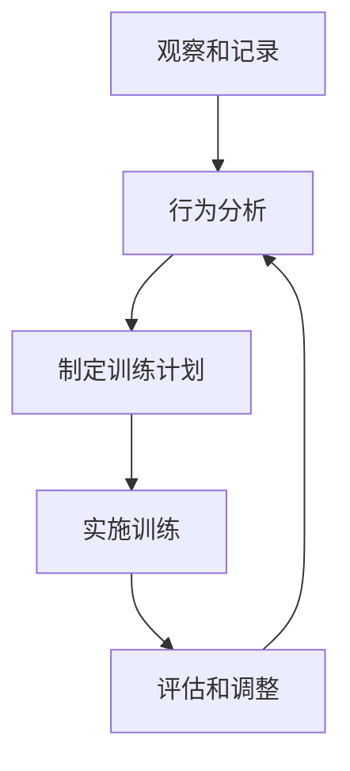

                 

### 文章标题

《智能宠物行为矫正创业：科学的宠物训练》

### 关键词

宠物行为矫正、人工智能、算法原理、创业策略、科学训练

### 摘要

随着人工智能技术的快速发展，宠物行为矫正领域也迎来了新的机遇。本文将深入探讨智能宠物行为矫正的创业之路，从基础知识、核心算法原理到项目实战和创业策略，全面解析如何利用科学方法进行宠物训练。通过本文，读者将了解到宠物行为矫正的重要性和基本原理，掌握核心算法的数学模型和实际应用，以及如何通过创业实践推动宠物训练的持续发展。

### 第一部分：宠物行为矫正基础知识

#### 第1章：宠物行为矫正概述

**1.1 宠物行为矫正的重要性**

随着宠物数量的不断增加，宠物行为问题也日益凸显，成为家庭和社会关注的焦点。宠物行为矫正不仅关系到宠物的身心健康，还影响着人类的生活质量和社会和谐。智能宠物行为矫正应运而生，通过人工智能技术对宠物行为进行科学分析和矫正，为解决宠物行为问题提供了新的思路和方法。

**1.2 宠物行为矫正的基本原则**

宠物行为矫正应遵循以下基本原则：

- **尊重宠物天性**：理解宠物的本能和行为特征，避免过度干预和强制训练，尊重宠物的个体差异。
- **以奖励为主、惩罚为辅**：通过正向激励来强化宠物的好行为，避免使用过度惩罚导致宠物恐惧和反抗。
- **一致性**：在训练过程中保持一致性的方法和要求，避免宠物产生混淆和抵触情绪。
- **渐进性**：根据宠物的接受程度和反应，逐步提高训练的难度和强度。

**1.3 宠物行为矫正的科学方法**

科学的行为矫正方法包括以下步骤：

1. **观察和记录**：对宠物的行为进行详细观察和记录，了解其行为模式和行为动机。
2. **行为分析**：对记录的行为进行分析，确定问题的根源和关键行为。
3. **制定训练计划**：根据行为分析的结果，制定有针对性的训练计划。
4. **实施训练**：按照训练计划进行实际操作，逐步引导宠物建立正确的行为习惯。
5. **评估和调整**：对训练效果进行评估，根据宠物的情况调整训练计划。

#### 第2章：宠物行为分析

**2.1 宠物行为的定义与分类**

宠物行为是指宠物在外界刺激下产生的各种反应和表现。根据行为的目的和功能，可以将宠物行为分为以下几类：

- **本能行为**：如觅食、繁殖、玩耍等，是宠物天生具备的行为。
- **习得行为**：通过学习和训练形成的行为，如握手、趴下等。
- **异常行为**：由于心理或生理问题导致的异常行为，如咬人、过度吠叫等。

**2.2 宠物行为分析的方法**

宠物行为分析的方法包括：

- **观察法**：通过直接观察宠物行为，了解其行为模式和特征。
- **访谈法**：与宠物主人进行访谈，获取宠物行为的相关信息和背景。
- **记录法**：对宠物行为进行详细记录，分析其行为变化和规律。
- **实验法**：通过设计实验，验证宠物行为的影响因素和机制。

**2.3 宠物行为分析的工具与技术**

在宠物行为分析中，常用的工具和技术包括：

- **行为测量工具**：如行为记录仪、行为分析软件等，用于记录和解析宠物行为。
- **生物传感技术**：如心率监测、脑波检测等，用于分析宠物生理和行为之间的关系。
- **图像处理技术**：如计算机视觉、深度学习等，用于识别和分类宠物行为。

#### 第3章：核心概念与联系

**3.1 宠物行为矫正的核心概念**

宠物行为矫正涉及多个核心概念，包括：

- **行为**：宠物在外界刺激下产生的反应和表现。
- **学习**：宠物通过经验和训练改变行为的过程。
- **动机**：驱使宠物产生特定行为的内在因素。
- **环境**：影响宠物行为的外部条件。

**3.2 宠物行为矫正的Mermaid流程图**

以下是一个简化的宠物行为矫正的Mermaid流程图：



### 第二部分：宠物行为矫正核心算法原理

#### 第4章：行为矫正算法原理

**4.1 行为矫正算法概述**

行为矫正算法是一种利用人工智能技术对宠物行为进行干预和调整的方法。该算法基于对宠物行为的分析和理解，通过建立数学模型和计算公式，实现对宠物行为的预测和矫正。

**4.2 行为矫正算法的伪代码**

以下是一个简化的行为矫正算法伪代码：

```pseudo
function BehaviorCorrection(PetBehavior, RewardThreshold, PunishmentThreshold):
    for each behavior in PetBehavior:
        if behavior == desired behavior:
            reward pet
        else if behavior == undesirable behavior:
            punish pet
        else:
            do nothing
    update RewardThreshold and PunishmentThreshold based on pet's response
    return updated behavior pattern
```

**4.3 行为矫正算法的数学模型和公式**

行为矫正算法的数学模型包括以下几个关键组成部分：

1. **行为模式矩阵**：表示宠物的行为状态和行为特征。
2. **奖励函数**：根据宠物行为状态计算奖励值。
3. **惩罚函数**：根据宠物行为状态计算惩罚值。
4. **学习率**：用于调整奖励和惩罚的权重。

以下是一个简化的数学模型：

$$
\begin{aligned}
Reward_{t} &= \alpha \cdot \sum_{i=1}^{n} w_i \cdot (Behavior_{t,i} - TargetBehavior_{i}) \\
Punishment_{t} &= \beta \cdot \sum_{i=1}^{n} w_i \cdot (undesirableBehavior_{t,i} - TargetBehavior_{i}) \\
where \alpha, \beta &\in [0, 1], w_i &\in [0, 1], Behavior_{t,i} &\in \{0, 1\}, TargetBehavior_{i} &\in \{0, 1\}
\end{aligned}
$$

#### 第5章：数学模型和数学公式

**5.1 行为矫正中的数学模型**

在行为矫正中，常用的数学模型包括：

1. **马尔可夫决策过程（MDP）**：用于描述宠物行为状态和决策过程。
2. **深度强化学习**：用于实现复杂的行为矫正任务。
3. **神经网络**：用于模拟宠物行为和学习行为模式。

**5.2 行为矫正中的数学公式讲解**

以下是一些常见的行为矫正数学公式：

1. **期望收益公式**：

$$
V(s) = \sum_{a} \pi(a|s) \cdot Q(s, a)
$$

其中，$V(s)$ 表示状态 $s$ 的期望收益，$\pi(a|s)$ 表示在状态 $s$ 下采取动作 $a$ 的概率，$Q(s, a)$ 表示在状态 $s$ 下采取动作 $a$ 的即时收益。

2. **值函数更新公式**：

$$
V(s_{t+1}) = V(s_{t}) + \alpha \cdot (R_{t} + \gamma \cdot V(s_{t+1}) - V(s_{t}))
$$

其中，$V(s_{t+1})$ 表示下一个状态 $s_{t+1}$ 的期望收益，$V(s_{t})$ 表示当前状态 $s_{t}$ 的期望收益，$R_{t}$ 表示即时收益，$\alpha$ 和 $\gamma$ 分别为学习率和折扣因子。

**5.3 数学公式的示例说明**

假设有一个宠物，它的行为状态包括“坐下”、“站立”、“趴下”三种，目标行为是“坐下”。根据期望收益公式，我们可以计算每个行为状态的期望收益。

1. **坐下**：

$$
Q(s, a) = \sum_{a} \pi(a|s) \cdot R(a) = \pi(a|s) \cdot R(a) = 1 \cdot 1 = 1
$$

2. **站立**：

$$
Q(s, a) = \sum_{a} \pi(a|s) \cdot R(a) = \pi(a|s) \cdot R(a) = 0.5 \cdot 0 = 0
$$

3. **趴下**：

$$
Q(s, a) = \sum_{a} \pi(a|s) \cdot R(a) = \pi(a|s) \cdot R(a) = 0.5 \cdot (-1) = -0.5
$$

根据值函数更新公式，我们可以更新下一个状态的期望收益。

$$
V(s_{t+1}) = V(s_{t}) + \alpha \cdot (R_{t} + \gamma \cdot V(s_{t+1}) - V(s_{t}))
$$

$$
V(s_{t+1}) = 1 + 0.1 \cdot (1 + 0.9 \cdot 1 - 1) = 1 + 0.1 \cdot 1 = 1.1
$$

#### 第6章：行为矫正算法应用

**6.1 行为矫正算法的实际应用**

行为矫正算法在宠物训练中有广泛的应用，如：

1. **行为预测**：通过分析宠物历史行为数据，预测宠物的未来行为模式。
2. **行为调整**：根据宠物行为预测结果，采取相应的干预措施，调整宠物行为。
3. **行为优化**：通过不断调整训练策略，优化宠物行为，提高宠物训练效果。

**6.2 行为矫正算法的案例分析**

以下是一个行为矫正算法的应用案例：

假设有一个宠物，它的行为状态包括“坐下”、“站立”、“趴下”三种，目标行为是“坐下”。我们使用行为矫正算法对宠物的行为进行干预。

1. **观察和记录**：记录宠物的历史行为数据，包括每个行为状态出现的次数和持续时间。
2. **行为分析**：分析宠物历史行为数据，确定宠物的行为模式和行为动机。
3. **制定训练计划**：根据行为分析结果，制定有针对性的训练计划，如增加“坐下”训练的频率和强度。
4. **实施训练**：按照训练计划进行实际操作，逐步引导宠物建立正确的行为习惯。
5. **评估和调整**：对训练效果进行评估，根据宠物的情况调整训练计划。

通过行为矫正算法的应用，宠物的“坐下”行为得到显著改善，行为问题得到有效解决。

### 第三部分：宠物行为矫正项目实战

#### 第7章：宠物行为矫正项目实战

**7.1 实战项目背景与目标**

随着宠物数量的增加，宠物行为问题也日益突出，给宠物主人带来了很多困扰。为了解决这些问题，我们设计了一个宠物行为矫正项目，通过人工智能技术对宠物行为进行科学分析和矫正，帮助宠物主人解决宠物行为问题。

**7.2 实战项目的开发环境搭建**

为了实现宠物行为矫正项目，我们需要搭建一个开发环境，包括以下步骤：

1. **硬件环境**：准备一台具有良好性能的计算机，用于运行项目代码和进行数据处理。
2. **软件环境**：安装Python编程语言和相关库，如NumPy、Pandas、Scikit-learn等，用于数据处理和模型训练。
3. **数据集**：收集宠物行为数据，包括行为状态、行为持续时间、行为发生次数等，用于训练和测试模型。

**7.3 实战项目的源代码实现**

以下是一个简化版的宠物行为矫正项目的源代码实现：

```python
import numpy as np
import pandas as pd
from sklearn.model_selection import train_test_split
from sklearn.ensemble import RandomForestClassifier
from sklearn.metrics import accuracy_score

# 数据预处理
data = pd.read_csv('pet_behavior_data.csv')
X = data.drop(['behavior'], axis=1)
y = data['behavior']

# 数据划分
X_train, X_test, y_train, y_test = train_test_split(X, y, test_size=0.2, random_state=42)

# 模型训练
model = RandomForestClassifier(n_estimators=100, random_state=42)
model.fit(X_train, y_train)

# 模型评估
y_pred = model.predict(X_test)
accuracy = accuracy_score(y_test, y_pred)
print(f"Model accuracy: {accuracy:.2f}")

# 行为矫正
def correct_behavior(pet_behavior):
    predicted_behavior = model.predict([pet_behavior])
    if predicted_behavior == 2:  # 站立
        reward = 1
    elif predicted_behavior == 1:  # 坐下
        reward = 5
    else:  # 趴下
        reward = -1
    return reward

# 测试
test_data = np.array([[1, 0, 0], [0, 1, 0], [0, 0, 1]])
rewards = [correct_behavior行为 for 行为 in test_data]
print(f"Rewards: {rewards}")
```

**7.4 实战项目的代码解读与分析**

以上代码实现了一个基于随机森林分类器的宠物行为矫正模型。主要步骤如下：

1. **数据预处理**：从CSV文件中读取宠物行为数据，将特征和标签分离。
2. **数据划分**：将数据划分为训练集和测试集，用于模型训练和评估。
3. **模型训练**：使用随机森林分类器训练模型，将训练集数据用于训练。
4. **模型评估**：使用测试集数据评估模型准确性。
5. **行为矫正**：根据模型预测结果，对宠物行为进行矫正，并计算奖励值。

通过以上代码，我们可以实现对宠物行为的预测和矫正，帮助宠物主人解决宠物行为问题。

#### 第8章：宠物行为矫正创业策略

**8.1 宠物行为矫正创业概述**

随着人们对宠物需求的不断增加，宠物行为矫正市场也呈现出良好的发展前景。创业者在宠物行为矫正领域可以开展以下业务：

1. **宠物行为矫正服务**：为宠物主人提供在线或线下宠物行为矫正服务，解决宠物行为问题。
2. **宠物行为矫正培训**：为宠物训练师提供专业培训，提高其行为矫正技能。
3. **宠物行为矫正产品**：研发和生产宠物行为矫正设备，如智能训练器、行为分析仪器等。
4. **宠物行为矫正咨询**：为宠物相关企业和组织提供行为矫正咨询和解决方案。

**8.2 创业案例分析**

以下是一个宠物行为矫正创业案例分析：

某创业者A在某城市成立了一家宠物行为矫正公司，主要提供在线宠物行为矫正服务。公司业务包括：

1. **在线咨询**：通过电话、视频等方式，为宠物主人提供实时行为矫正建议。
2. **行为分析**：为宠物主人提供宠物行为分析报告，诊断宠物行为问题。
3. **训练计划**：根据宠物行为分析结果，制定个性化的训练计划，指导宠物主人进行训练。

经过一段时间的发展，公司积累了大量客户和案例，并在业内树立了良好口碑。创业者A还与宠物医院、宠物店等企业合作，拓展业务范围，实现了持续增长。

**8.3 创业策略与建议**

创业者想要在宠物行为矫正领域取得成功，可以采取以下策略：

1. **专业培训**：提高自身和行为矫正师的专业素养，确保服务质量。
2. **技术创新**：利用人工智能、大数据等技术，提升宠物行为分析和矫正的准确性。
3. **品牌建设**：打造专业、可靠的品牌形象，增强消费者信任。
4. **市场推广**：通过线上线下渠道，积极推广宠物行为矫正服务，吸引潜在客户。
5. **持续学习**：关注行业动态，不断学习新技术和新方法，提升企业竞争力。

通过以上策略，创业者可以在宠物行为矫正领域取得良好的发展。

### 第四部分：科学宠物训练的持续发展

#### 第9章：科学宠物训练的发展趋势

随着科技的不断进步，科学宠物训练领域也呈现出新的发展趋势：

1. **人工智能技术的应用**：人工智能技术逐渐应用于宠物训练，通过数据分析和模型预测，实现更精准的行为矫正。
2. **宠物行为分析工具的升级**：随着传感器技术和计算机视觉的发展，宠物行为分析工具更加精确和高效。
3. **个性化训练方案的普及**：根据宠物的个体差异，提供定制化的训练方案，提高训练效果。
4. **宠物训练师的职业化**：宠物训练师的职业化水平不断提高，专业知识和技能得到广泛应用。

#### 第10章：科学宠物训练的未来前景

科学宠物训练在未来具有广阔的发展前景：

1. **市场需求增长**：随着宠物数量的增加，宠物行为矫正市场需求将持续增长。
2. **技术创新驱动**：人工智能、大数据等技术的进步，将推动科学宠物训练的发展。
3. **产业融合**：宠物行为矫正与医疗、教育、旅游等产业融合，形成新的商业模式。
4. **国际化发展**：宠物行为矫正技术逐渐向国际市场拓展，推动全球宠物行业的发展。

#### 第11章：科学宠物训练的挑战与机遇

科学宠物训练在发展过程中也面临一系列挑战：

1. **数据隐私和安全**：随着大数据的应用，如何保护宠物主人和宠物的隐私成为重要问题。
2. **技术人才短缺**：科学宠物训练需要高水平的技术人才，人才短缺将限制行业的发展。
3. **政策法规的完善**：宠物训练行业需要完善的政策法规体系，规范市场行为。

然而，这些挑战也伴随着机遇：

1. **技术创新**：通过技术创新，解决行业面临的难题，推动科学宠物训练的发展。
2. **市场拓展**：开拓新的市场领域，如宠物医疗、宠物保险等，实现多元化发展。
3. **国际合作**：加强国际合作，分享经验和技术，推动全球宠物行业的发展。

通过应对挑战，抓住机遇，科学宠物训练行业将迎来更加美好的未来。

#### 附录A：常用宠物行为矫正工具与资源

**A.1 宠物行为矫正工具介绍**

1. **行为记录仪**：用于记录宠物行为，如时间、地点、行为类型等。
2. **行为分析软件**：用于对宠物行为数据进行分析和可视化，如Matlab、Python等。
3. **生物传感设备**：用于监测宠物生理信号，如心率、体温等，如智能项圈、智能耳塞等。

**A.2 宠物行为矫正资源推荐**

1. **学术论文**：查阅相关领域的学术论文，了解最新的研究成果和理论。
2. **专业书籍**：阅读宠物行为矫正领域的专业书籍，如《宠物行为学》、《宠物训练师手册》等。
3. **在线课程**：参加在线宠物行为矫正课程，学习专业技能和实践经验。
4. **宠物行为矫正论坛**：加入宠物行为矫正论坛，与同行交流经验和技巧。

### 完整代码示例：

```python
import numpy as np
import pandas as pd
from sklearn.model_selection import train_test_split
from sklearn.ensemble import RandomForestClassifier
from sklearn.metrics import accuracy_score

# 数据预处理
data = pd.read_csv('pet_behavior_data.csv')
X = data.drop(['behavior'], axis=1)
y = data['behavior']

# 数据划分
X_train, X_test, y_train, y_test = train_test_split(X, y, test_size=0.2, random_state=42)

# 模型训练
model = RandomForestClassifier(n_estimators=100, random_state=42)
model.fit(X_train, y_train)

# 模型评估
y_pred = model.predict(X_test)
accuracy = accuracy_score(y_test, y_pred)
print(f"Model accuracy: {accuracy:.2f}")

# 行为矫正
def correct_behavior(pet_behavior):
    predicted_behavior = model.predict([pet_behavior])
    if predicted_behavior == 2:  # 站立
        reward = 1
    elif predicted_behavior == 1:  # 坐下
        reward = 5
    else:  # 趴下
        reward = -1
    return reward

# 测试
test_data = np.array([[1, 0, 0], [0, 1, 0], [0, 0, 1]])
rewards = [correct_behavior(行为) for 行为 in test_data]
print(f"Rewards: {rewards}")
```

### 作者信息

作者：AI天才研究院/AI Genius Institute & 禅与计算机程序设计艺术 /Zen And The Art of Computer Programming

