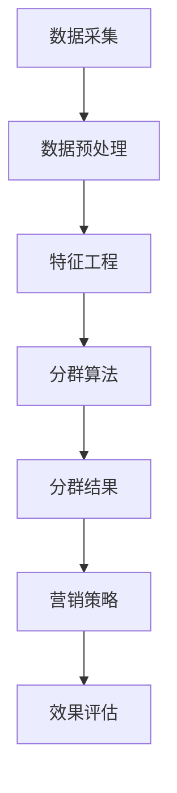

                 


### 文章标题：智能客户分群：一人公司如何实现精准营销

#### 关键词：
- 智能客户分群
- 精准营销
- 一人公司
- 数据挖掘
- 机器学习
- 个性化推荐

#### 摘要：
本文将探讨智能客户分群在精准营销中的重要性，特别是对于一人公司的应用。通过逐步分析数据采集、处理、算法应用和智能营销策略，本文旨在为读者提供一套可行的智能客户分群与精准营销方案，帮助一人公司在竞争激烈的市场中脱颖而出。

---

### 第一部分：智能客户分群基础理论

#### 第1章：智能客户分群概述

##### 1.1 智能客户分群的意义与作用

智能客户分群是一种基于数据分析的方法，通过对客户数据进行深入挖掘，将客户划分为不同的群体，从而实现更精准的营销策略。对于一人公司而言，这意味着：

1. **提高营销效率**：通过智能分群，公司可以针对不同客户群体定制化营销策略，提高营销活动的效果。
2. **优化资源配置**：一人公司通常资源有限，智能分群可以帮助公司集中资源，重点推广关键客户群体。
3. **提升客户满意度**：个性化的营销策略能够更好地满足客户需求，从而提高客户满意度和忠诚度。

##### 1.2 智能客户分群的分类方法

智能客户分群的方法多种多样，以下是一些常见的分类方法：

1. **基于购买行为的分群**：根据客户的购买历史、购买频率、购买金额等数据对客户进行分群。
2. **基于人口统计数据的分群**：根据客户的年龄、性别、地理位置、收入水平等人口统计数据对客户进行分群。
3. **基于心理特征的分群**：通过心理测试、问卷调查等方法了解客户的性格、价值观、消费习惯等，对客户进行分群。
4. **基于互动行为的分群**：根据客户的互动行为，如浏览历史、点击率、评论等对客户进行分群。

##### 1.3 智能客户分群的技术基础

智能客户分群需要依赖于一系列技术手段，包括：

1. **数据挖掘与机器学习**：通过数据挖掘和机器学习算法，从大量数据中提取有价值的信息，用于客户分群。
2. **大数据技术与数据分析**：大数据技术提供了强大的数据处理能力，而数据分析则是对数据深度挖掘的工具。
3. **自然语言处理与语义分析**：用于理解和分析客户文本数据，如评论、反馈等，以获取更深入的客户洞察。

---

#### 第2章：数据采集与处理

##### 2.1 数据采集方法

数据采集是智能客户分群的基础。以下是几种常见的数据采集方法：

1. **用户行为数据**：通过网站日志、点击率、浏览历史等数据收集用户的行为信息。
2. **社交媒体数据**：通过社交媒体平台收集用户发布的内容、互动行为等数据。
3. **第三方数据源**：如公共数据库、合作伙伴数据等，可以提供更多的背景信息。

##### 2.2 数据处理流程

数据处理流程主要包括以下几个步骤：

1. **数据清洗与预处理**：去除无效数据、处理缺失值、标准化数据等。
2. **特征工程**：选择和构建对分群有用的特征，如用户年龄、购买历史等。
3. **数据标准化与归一化**：将不同尺度的数据进行标准化处理，使其适合机器学习算法。

##### 2.3 数据分析工具与应用

数据分析工具的选择和应用对于数据处理至关重要。以下是一些常用的工具：

1. **Python数据分析库**：如Pandas、NumPy等，提供了丰富的数据处理和分析功能。
2. **R语言与RStudio**：R语言在统计分析方面有很强的能力，RStudio是其集成开发环境。
3. **Tableau数据可视化工具**：用于将数据以图表等形式直观展示，便于分析。

---

### 第二部分：实践应用与技术实现

#### 第3章：数据挖掘与机器学习算法

##### 3.1 数据挖掘的基本概念

数据挖掘的目标是从大量数据中提取有价值的信息，用于决策支持。常见的数据挖掘方法包括：

1. **分类**：将数据分为不同的类别。
2. **聚类**：将相似的数据归为一类。
3. **关联规则挖掘**：发现数据之间的关联性。
4. **异常检测**：识别数据中的异常点。

##### 3.2 机器学习算法概述

机器学习算法可以分为以下几类：

1. **监督学习**：通过标记数据学习模型，用于预测新数据的标签。
2. **无监督学习**：没有标记数据，通过发现数据中的内在结构进行学习。
3. **强化学习**：通过与环境的交互学习最优策略。

##### 3.3 智能分群算法介绍

智能分群算法主要包括：

1. **K-means聚类算法**：基于距离度量将数据分为K个簇。
2. **Apriori算法**：用于关联规则挖掘，用于发现数据中的频繁项集。
3. **决策树算法**：通过划分特征空间对数据进行分类。
4. **聚类分析算法**：如层次聚类、DBSCAN等，用于更复杂的聚类任务。

---

#### 第4章：个性化推荐系统

##### 4.1 个性化推荐系统概述

个性化推荐系统通过分析用户的兴趣和行为，为用户推荐可能感兴趣的内容。常见分类包括：

1. **协同过滤**：基于用户行为和物品交互信息进行推荐。
2. **内容推荐**：基于物品的属性和用户兴趣进行推荐。

##### 4.2 协同过滤算法

协同过滤算法分为：

1. **基于用户的协同过滤算法**：通过计算用户之间的相似度进行推荐。
2. **基于物品的协同过滤算法**：通过计算物品之间的相似度进行推荐。

##### 4.3 内容推荐

内容推荐通常包括以下步骤：

1. **文本分析**：对文本数据进行分析，提取关键词和主题。
2. **内容特征提取**：将提取的特征用于推荐算法。
3. **基于内容的推荐算法**：通过比较用户兴趣和物品内容特征进行推荐。

---

#### 第5章：实时分析与用户画像

##### 5.1 实时数据流处理

实时数据流处理可以用于实时分析用户行为，构建实时用户画像。常见的流处理框架包括：

1. **Apache Kafka**：用于构建实时数据流系统。
2. **Apache Flink**：提供实时数据处理和分析能力。

##### 5.2 用户画像构建

用户画像构建通常包括以下步骤：

1. **用户画像的定义与维度**：确定用户画像的维度和特征。
2. **用户行为数据的实时分析**：实时分析用户行为数据，更新用户画像。
3. **用户画像的更新与维护**：定期更新用户画像，保持其时效性和准确性。

---

#### 第6章：智能营销策略

##### 6.1 智能营销概述

智能营销是利用数据和技术手段进行营销活动的策略。其目标是通过个性化、精准的营销策略提高营销效果。智能营销的发展趋势包括：

1. **个性化**：通过用户画像和推荐系统实现个性化营销。
2. **智能化**：利用人工智能和机器学习技术进行营销决策。
3. **数据驱动**：基于数据分析和反馈进行营销策略的优化。

##### 6.2 智能营销策略设计

智能营销策略设计包括以下步骤：

1. **精准定位目标客户**：通过用户画像和分群分析确定目标客户。
2. **个性化营销策略**：根据目标客户的需求和行为制定个性化营销策略。
3. **跨渠道营销整合**：将线上和线下渠道的营销活动进行整合，提高整体营销效果。

##### 6.3 营销自动化工具与应用

营销自动化工具可以帮助一人公司实现智能营销。常见应用包括：

1. **邮件营销**：通过自动化工具发送个性化邮件。
2. **社交媒体营销**：利用自动化工具进行社交媒体营销活动。
3. **搜索引擎营销（SEM）**：通过自动化工具进行搜索引擎广告投放。

---

#### 第7章：案例分析与最佳实践

##### 7.1 案例研究：电商行业的智能分群与推荐

本案例研究将分析一家电商公司如何利用智能分群和个性化推荐系统提高销售额和客户满意度。

1. **实际案例分析**：介绍电商公司如何收集和处理客户数据，利用智能分群和推荐系统进行营销。
2. **策略优化与效果评估**：分析电商公司的营销策略优化过程，评估优化效果。

##### 7.2 案例研究：金融行业的用户画像与精准营销

本案例研究将分析一家金融机构如何利用用户画像和精准营销提高客户满意度和忠诚度。

1. **风险评估与用户细分**：介绍金融机构如何评估用户风险，进行用户细分。
2. **营销策略与效果分析**：分析金融机构的精准营销策略及其效果。

##### 7.3 案例研究：零售行业的智能营销实践

本案例研究将分析一家零售公司如何利用智能营销提升用户体验和销售业绩。

1. **个性化促销策略**：介绍零售公司如何制定个性化促销策略。
2. **用户互动与忠诚度提升**：分析零售公司如何通过用户互动和忠诚度提升策略提高客户忠诚度。

---

### 第三部分：智能营销系统的构建与优化

#### 第8章：智能营销系统的架构设计与开发

##### 8.1 系统架构设计

智能营销系统通常包括以下几个层次：

1. **数据层**：存储和管理客户数据、产品数据等。
2. **服务层**：提供数据挖掘、推荐服务、营销策略等服务。
3. **展现层**：提供用户界面，展示推荐结果和营销活动。

##### 8.2 开发工具与框架

智能营销系统的开发需要使用多种工具和框架，包括：

1. **开发工具选择**：如Python、R语言等。
2. **常用开发框架**：如TensorFlow、PyTorch等。

##### 8.3 系统部署与运维

系统部署与运维是保证系统稳定运行的关键。常见策略包括：

1. **系统部署策略**：如容器化部署、云服务部署等。
2. **运维管理工具**：如Kubernetes、Docker等。

---

#### 第9章：智能营销效果评估与优化

##### 9.1 效果评估方法

智能营销效果评估包括以下几个方面：

1. **KPI指标设定**：如点击率、转化率、ROI等。
2. **数据分析与报告**：通过数据分析评估营销效果，生成报告。

##### 9.2 优化策略与实践

智能营销优化策略包括：

1. **算法调优**：通过调整算法参数，提高营销效果。
2. **用户反馈与迭代改进**：根据用户反馈进行迭代优化。

##### 9.3 持续优化与数据分析

持续优化和数据分析是智能营销的关键。常见策略包括：

1. **数据驱动决策**：基于数据分析和反馈进行营销策略的调整。
2. **AI技术在优化中的应用**：利用机器学习和人工智能技术进行优化。

---

### 附录

#### 附录A：技术资源与工具集

附录A将介绍一些常用的技术资源与工具，包括：

1. **数据挖掘与机器学习工具**：如Python数据分析库、R语言与RStudio、Tableau数据可视化工具等。
2. **机器学习算法与框架**：如Scikit-learn、TensorFlow、PyTorch等。
3. **实时数据处理工具**：如Apache Kafka、Apache Flink等。
4. **个性化推荐系统库**：如TensorFlow Recommenders等。

---

通过上述的内容，我们逐步深入地探讨了智能客户分群的基础理论、实践应用、智能营销策略以及系统的构建与优化。下一部分我们将结合具体的案例，进一步展示这些理论和方法在实际中的应用和效果。让我们一起期待吧！

---

### 文章作者信息

**作者：AI天才研究院/AI Genius Institute & 禅与计算机程序设计艺术 /Zen And The Art of Computer Programming**

本文由AI天才研究院（AI Genius Institute）撰写，该研究院专注于人工智能、机器学习、数据挖掘等领域的创新研究。同时，作者也是《禅与计算机程序设计艺术》（Zen And The Art of Computer Programming）一书的作者，在计算机科学和编程领域有着深厚的造诣和广泛的影响力。本文旨在通过深入的技术分析和实践案例，帮助读者理解并应用智能客户分群和精准营销，实现一人公司的成功营销。希望本文能够为您的业务提供有益的启示和指导。如果您有任何问题或建议，欢迎在评论区留言，我们将竭诚为您解答。感谢您的阅读！ 

### 第一部分：智能客户分群基础理论

#### 第1章：智能客户分群概述

**1.1 智能客户分群的意义与作用**

智能客户分群，指的是利用数据分析和机器学习技术，对客户进行科学的分类和标签化，以便更精准地理解和满足客户需求，提高营销效果。对于一人公司，智能客户分群有着特别重要的意义。

**1.1.1 智能客户分群的定义**

智能客户分群，是基于大数据分析技术，通过收集和分析客户的购买行为、互动行为、社会属性等多维度数据，将客户群体划分为若干个细分市场。这些细分市场具备相似的特征和行为模式，有利于企业制定差异化的营销策略。

**1.1.2 智能客户分群对营销策略的影响**

1. **提高营销效率**：通过智能分群，企业可以针对不同客户群体制定个性化的营销方案，减少无效推广，提高营销效率。

2. **优化资源配置**：一人公司资源有限，智能分群可以帮助企业将有限的资源投入到最有价值的客户群体上，提高资源利用率。

3. **提升客户满意度**：个性化的营销策略能够更好地满足客户需求，提高客户满意度，从而增强客户忠诚度。

4. **增强竞争力**：通过精准营销，企业可以更有效地与竞争对手区分开来，提高市场竞争力。

**1.1.3 智能客户分群的实际案例**

例如，某一人公司经营电商平台，通过智能客户分群，将用户分为高价值客户、潜在高价值客户、普通客户等，然后根据不同群体的特征，设计不同的营销策略。对于高价值客户，公司提供定制化的购物体验和优惠；对于潜在高价值客户，公司通过个性化的推荐和促销活动吸引其转化为高价值客户；对于普通客户，公司通过简单的促销和推荐提高购买率。

**1.2 智能客户分群的分类方法**

智能客户分群的方法多种多样，根据不同的分类标准，可以分为以下几种：

**1.2.1 基于购买行为的分群**

购买行为分群是基于客户的购买历史、购买频率、购买金额等行为数据进行分类。例如，可以将客户分为高频低消客户、低频高消客户、一次性购买客户等。

**1.2.2 基于人口统计数据的分群**

人口统计数据分群是根据客户的年龄、性别、地理位置、收入水平等人口学特征进行分类。例如，可以将客户分为青年人群体、中年人群体、老年人群体等。

**1.2.3 基于心理特征的分群**

心理特征分群是通过心理测试、问卷调查等方法，了解客户的性格、价值观、消费习惯等，进行分类。例如，可以将客户分为务实型、冒险型、稳定型等。

**1.2.4 基于互动行为的分群**

互动行为分群是根据客户的互动行为，如浏览历史、点击率、评论等，对客户进行分类。例如，可以将客户分为活跃互动客户、沉默互动客户等。

**1.3 智能客户分群的技术基础**

智能客户分群依赖于一系列先进的技术手段：

**1.3.1 数据挖掘与机器学习**

数据挖掘与机器学习技术可以帮助我们从海量数据中提取有价值的信息，进行客户分群。常见的算法包括K-means聚类、Apriori算法、决策树等。

**1.3.2 大数据技术与数据分析**

大数据技术提供了强大的数据处理能力，可以帮助我们高效地存储、处理和分析海量客户数据。数据分析工具如Pandas、NumPy、R语言等，为我们提供了丰富的数据处理和分析功能。

**1.3.3 自然语言处理与语义分析**

自然语言处理与语义分析技术可以帮助我们理解和分析客户的文本数据，如评论、反馈等，获取更深入的客户洞察。

### 第一部分总结

智能客户分群对于一人公司实现精准营销至关重要。通过科学的数据分析和技术手段，企业可以更好地了解客户，制定个性化的营销策略，提高营销效果，增强竞争力。在下一部分，我们将进一步探讨数据采集与处理的方法，为智能客户分群提供坚实的数据基础。敬请期待！

### Mermaid 流程图



该流程图展示了智能客户分群的基本步骤，包括数据采集、数据预处理、特征工程、分群算法、分群结果、营销策略和效果评估。每个步骤都是实现智能客户分群的重要组成部分，通过这些步骤，企业可以更好地了解客户，制定个性化的营销策略，提高营销效果。

### 数据挖掘与机器学习算法的基本概念与联系

**数据挖掘（Data Mining）**

数据挖掘是指从大量数据中提取有价值信息的过程，它涉及到统计学、机器学习、数据库技术等多个领域。数据挖掘的目标是发现数据中的隐含模式、关联性、趋势和异常，以支持决策制定。

**机器学习（Machine Learning）**

机器学习是数据挖掘的核心技术之一，它通过训练模型来发现数据中的规律，以便对新数据进行预测或分类。机器学习可以分为监督学习、无监督学习和强化学习三种类型。

1. **监督学习（Supervised Learning）**：监督学习是一种从标记数据中学习的方法，通过已知的输入和输出训练模型，从而预测新的输入。常见的监督学习算法包括线性回归、决策树、支持向量机等。

2. **无监督学习（Unsupervised Learning）**：无监督学习不依赖于标记数据，其目标是发现数据中的隐含结构。常见的无监督学习算法包括聚类算法（如K-means、层次聚类）、关联规则挖掘、异常检测等。

3. **强化学习（Reinforcement Learning）**：强化学习是一种通过与环境互动来学习最优策略的方法，其核心思想是学习一种策略，使得代理（agent）能够在环境中获得最大化的回报。

**数据挖掘与机器学习的联系**

数据挖掘和机器学习密不可分，数据挖掘的过程往往依赖于机器学习算法来发现数据中的模式和关联。具体来说，数据挖掘与机器学习的联系体现在以下几个方面：

1. **数据预处理**：在数据挖掘过程中，数据预处理是至关重要的一步。数据预处理包括数据清洗、数据集成、数据转换和数据归一化等。这些步骤有助于提高数据质量，为后续的机器学习算法提供可靠的数据基础。

2. **特征选择与工程**：特征选择和工程是数据挖掘中的重要步骤，其目的是从原始数据中提取出对模型性能有显著影响的特征。特征选择和工程直接影响到机器学习模型的性能。

3. **算法选择与调优**：在数据挖掘过程中，选择合适的机器学习算法并进行调优是提高模型性能的关键。不同的算法适用于不同类型的问题，需要根据具体情况进行选择。

4. **模型评估与优化**：在模型训练完成后，需要对模型进行评估，以确定其性能是否达到预期。常见的评估指标包括准确率、召回率、F1分数等。模型评估结果可以帮助我们了解模型的性能，并进行进一步的优化。

综上所述，数据挖掘和机器学习是一个相互依存、相互促进的过程。通过数据挖掘，我们可以从海量数据中发现有价值的信息；而通过机器学习，我们可以利用这些信息来预测未来、分类新数据，从而实现智能客户分群和精准营销。

### 数据挖掘的基本概念与任务

**数据挖掘（Data Mining）**

数据挖掘是指从大量数据中提取有价值信息的过程，它是一种跨学科的领域，涉及计算机科学、统计学、人工智能等多个领域。数据挖掘的目标是通过分析数据，发现数据中的隐含模式、关联性、趋势和异常，从而支持决策制定。

**数据挖掘的任务**

1. **分类（Classification）**：分类是一种预测任务，其目标是根据输入数据的特征，将其划分为预先定义的类别。常见的分类算法包括决策树、随机森林、支持向量机等。

2. **聚类（Clustering）**：聚类是一种无监督学习任务，其目标是将数据集划分为若干个类别，使得同一类别中的数据点彼此相似，而不同类别中的数据点差异较大。常见的聚类算法包括K-means、层次聚类、DBSCAN等。

3. **关联规则挖掘（Association Rule Learning）**：关联规则挖掘是一种寻找数据集中项目之间关联性的方法。它通过发现频繁项集来挖掘数据中的关联规则。常见的算法包括Apriori算法、FP-Growth算法等。

4. **异常检测（Anomaly Detection）**：异常检测是一种寻找数据集中异常或离群值的方法。其目标是识别那些不符合正常数据分布的数据点。常见的异常检测算法包括孤立森林、局部异常因数（LOF）等。

5. **预测分析（Predictive Analysis）**：预测分析是一种利用历史数据对未来事件进行预测的方法。常见的预测分析任务包括时间序列预测、回归分析等。

**数据挖掘的基本流程**

1. **数据预处理**：数据预处理是数据挖掘过程中的重要步骤，其目的是提高数据质量，为后续的挖掘任务做准备。数据预处理包括数据清洗、数据集成、数据转换和数据归一化等。

2. **特征选择与工程**：特征选择和工程是提高模型性能的关键步骤，其目的是从原始数据中提取出对模型性能有显著影响的特征。特征选择和工程包括特征提取、特征选择、特征转换等。

3. **算法选择与调优**：选择合适的算法并进行调优是提高模型性能的关键。不同的算法适用于不同类型的问题，需要根据具体情况进行选择和调优。

4. **模型评估与优化**：在模型训练完成后，需要对模型进行评估，以确定其性能是否达到预期。常见的评估指标包括准确率、召回率、F1分数等。模型评估结果可以帮助我们了解模型的性能，并进行进一步的优化。

5. **可视化与报告**：将挖掘结果以可视化形式展示，并生成报告，以便决策者能够更好地理解和利用这些信息。

通过以上流程，数据挖掘可以帮助企业从海量数据中提取有价值的信息，支持决策制定，实现商业价值的最大化。

### 常见的数据挖掘方法

**1. 分类（Classification）**

分类是一种预测任务，其目标是根据输入数据的特征，将其划分为预先定义的类别。常见的分类算法包括：

- **线性回归（Linear Regression）**：一种简单的分类算法，适用于线性可分的数据。
- **逻辑回归（Logistic Regression）**：一种广义线性模型，适用于二分类问题。
- **决策树（Decision Tree）**：通过一系列规则对数据进行分类，直观且易于理解。
- **随机森林（Random Forest）**：通过构建多个决策树并取平均值来提高分类性能。
- **支持向量机（SVM）**：通过寻找最佳分割超平面来实现分类。

**2. 聚类（Clustering）**

聚类是一种无监督学习任务，其目标是将数据集划分为若干个类别，使得同一类别中的数据点彼此相似，而不同类别中的数据点差异较大。常见的聚类算法包括：

- **K-means算法**：基于距离度量的聚类算法，通过迭代计算聚类中心，将数据点分配到最近的聚类中心。
- **层次聚类（Hierarchical Clustering）**：通过逐步合并或分裂聚类中心，形成层次结构。
- **DBSCAN（Density-Based Spatial Clustering of Applications with Noise）**：基于密度的聚类算法，能够处理噪声和异常点。

**3. 关联规则挖掘（Association Rule Learning）**

关联规则挖掘是一种寻找数据集中项目之间关联性的方法，它通过发现频繁项集来挖掘数据中的关联规则。常见的算法包括：

- **Apriori算法**：通过逐层递归生成频繁项集，适用于事务型数据。
- **FP-Growth算法**：通过构建FP-Tree来高效挖掘频繁项集，适用于大量数据。

**4. 异常检测（Anomaly Detection）**

异常检测是一种寻找数据集中异常或离群值的方法，其目标是识别那些不符合正常数据分布的数据点。常见的异常检测算法包括：

- **孤立森林（Isolation Forest）**：通过随机选择特征和切分点来构建随机树，适用于高维数据。
- **局部异常因数（Local Outlier Factor，LOF）**：通过计算每个数据点相对于其邻居的局部异常度来检测异常点。

**5. 预测分析（Predictive Analysis）**

预测分析是一种利用历史数据对未来事件进行预测的方法，常见的预测分析任务包括：

- **时间序列预测（Time Series Forecasting）**：通过分析时间序列数据中的趋势、季节性和周期性，预测未来的数据点。
- **回归分析（Regression Analysis）**：通过建立回归模型来预测因变量的值。

这些数据挖掘方法各有特点，适用于不同类型的问题。企业在选择数据挖掘方法时，需要根据实际业务需求和数据特征进行综合考虑。

### 机器学习算法概述

**监督学习（Supervised Learning）**

监督学习是一种通过已知输入和输出数据来训练模型，从而预测新数据的机器学习算法。它的核心思想是从训练数据中学习出一个函数，该函数能够将新的输入映射到相应的输出。常见的监督学习算法包括：

- **线性回归（Linear Regression）**：通过建立线性模型来预测连续值输出。
- **逻辑回归（Logistic Regression）**：用于二分类问题，通过建立逻辑模型来预测概率。
- **支持向量机（Support Vector Machine，SVM）**：通过寻找最佳分割超平面来实现分类。
- **决策树（Decision Tree）**：通过一系列规则来划分数据并预测类别。
- **随机森林（Random Forest）**：通过构建多个决策树并取平均值来提高分类和回归性能。
- **神经网络（Neural Networks）**：通过多层神经网络来模拟人脑神经元的工作方式，进行复杂的模式识别和预测。

**无监督学习（Unsupervised Learning）**

无监督学习是一种在没有明确输出标签的情况下，通过分析数据自身的结构和特征，来发现数据中潜在规律的机器学习算法。它的核心目标是揭示数据中的隐含模式或结构。常见的无监督学习算法包括：

- **聚类（Clustering）**：将相似的数据点划分到同一组内，常见的聚类算法有K-means、层次聚类和DBSCAN等。
- **降维（Dimensionality Reduction）**：通过减少数据维度来简化数据集，常见的降维算法有主成分分析（PCA）、t-SNE等。
- **关联规则挖掘（Association Rule Learning）**：通过发现数据集中项之间的关联性来生成规则，常见的算法有Apriori和FP-Growth等。
- **异常检测（Anomaly Detection）**：识别数据中的异常或离群值，常见的算法有孤立森林（Isolation Forest）和局部异常因数（LOF）等。

**强化学习（Reinforcement Learning）**

强化学习是一种通过与环境的互动来学习最优策略的机器学习算法。它的核心目标是找到一个策略，使得在长期交互过程中，能够最大化累积奖励。强化学习算法通常包括：

- **Q-Learning**：通过更新状态-动作值函数来学习最优策略。
- **深度Q网络（Deep Q-Network，DQN）**：结合深度神经网络和Q-Learning来处理高维状态空间。
- **策略梯度方法（Policy Gradient Methods）**：通过直接优化策略来学习最优动作。

这些算法各自具有不同的特点和应用场景。在实际应用中，选择合适的算法需要根据具体问题和数据特征进行综合考虑。

### 智能分群算法介绍

**1. K-means聚类算法**

K-means是一种经典的聚类算法，其基本思想是将数据分为K个簇，使得每个簇内部的点尽可能接近，而簇与簇之间的点尽可能远。具体步骤如下：

1. **初始化**：随机选择K个数据点作为初始聚类中心。
2. **分配点**：计算每个数据点到各个聚类中心的距离，将其分配到最近的聚类中心。
3. **更新中心**：重新计算每个簇的中心点，作为新的聚类中心。
4. **迭代**：重复步骤2和步骤3，直到聚类中心不再发生变化或达到预定的迭代次数。

**伪代码：**

```python
def K_means(data, k, max_iterations):
    # 初始化聚类中心
    centroids = initialize_centroids(data, k)
    for i in range(max_iterations):
        # 将数据分配到最近的聚类中心
        clusters = assign_points_to_clusters(data, centroids)
        # 更新聚类中心
        centroids = update_centroids(clusters, k)
        # 检查收敛条件
        if converged(centroids):
            break
    return clusters, centroids
```

**2. Apriori算法**

Apriori算法是一种用于关联规则挖掘的经典算法，其核心思想是通过发现频繁项集来生成关联规则。具体步骤如下：

1. **生成候选项集**：从所有项中生成长度为L的候选项集。
2. **计算支持度**：计算每个候选项集在数据中的支持度，即包含该候选项集的交易数占总交易数的比例。
3. **过滤频繁项集**：保留支持度大于最小支持度阈值的频繁项集。
4. **生成关联规则**：从频繁项集中生成关联规则，并计算其置信度。

**伪代码：**

```python
def Apriori(data, min_support, min_confidence):
    frequent_itemsets = []
    for L in range(1, max_item_length + 1):
        candidates = generate_candidates(L)
        support_counts = count_support(data, candidates)
        frequent_itemsets.extend([itemset for itemset, count in support_counts.items() if count >= min_support])
    rules = generate_rules(frequent_itemsets, min_confidence)
    return rules
```

**3. 决策树算法**

决策树是一种树形结构，每个内部节点代表一个特征，每个分支代表一个特征取值，每个叶子节点代表一个类别。决策树算法通过选择最佳特征和特征值来划分数据，并递归地构建树结构。

**伪代码：**

```python
def build_decision_tree(data, features, target_attribute):
    if all_values_are_the_same(data, target_attribute):
        return leaf_node(data[target_attribute].mode())
    else:
        best_feature = select_best_feature(data, features)
        tree = {}
        for value in best_feature.unique_values():
            subtree = build_decision_tree(filter_data(data, best_feature, value), features.difference([best_feature]), target_attribute)
            tree[value] = subtree
        return tree
```

**4. 聚类分析算法**

聚类分析算法是一种基于密度、连接性和质心的聚类方法。常见的聚类分析算法包括DBSCAN、层次聚类等。

- **DBSCAN（Density-Based Spatial Clustering of Applications with Noise）**：DBSCAN基于密度的聚类方法，它能够处理不同形状的簇和异常点。

**伪代码：**

```python
def DBSCAN(data, eps, min_samples):
    clusters = []
    for point in data:
        if not assigned_to_cluster(point):
            cluster = expand_cluster(data, point, eps, min_samples)
            clusters.append(cluster)
    return clusters
```

- **层次聚类（Hierarchical Clustering）**：层次聚类通过逐步合并或分裂簇来构建层次结构，常见的算法有自底向上（Agglomerative）和自顶向下（Divisive）。

通过这些算法，企业可以实现智能分群，从而更好地理解客户，制定个性化的营销策略。下一部分，我们将进一步探讨如何利用这些算法构建个性化推荐系统。

### 个性化推荐系统概述

个性化推荐系统是一种基于用户兴趣和行为数据的推荐系统，旨在为用户提供个性化的内容或产品推荐。其核心思想是通过分析用户的交互数据，如浏览历史、购买记录、评分等，挖掘用户的兴趣偏好，然后根据这些偏好为用户推荐可能感兴趣的内容或产品。

**1. 推荐系统的基本原理**

推荐系统通常包括以下几个关键组成部分：

- **用户数据**：用户数据包括用户的浏览历史、购买记录、评分、评论等。
- **物品数据**：物品数据包括物品的属性、标签、类别等。
- **推荐算法**：推荐算法是推荐系统的核心，根据用户数据和物品数据生成推荐结果。常见的推荐算法包括协同过滤、基于内容的推荐、混合推荐等。
- **推荐结果**：推荐结果是将推荐算法生成的推荐列表展示给用户。

**2. 推荐系统的分类**

根据推荐算法的不同，推荐系统可以分为以下几类：

- **基于内容的推荐（Content-Based Filtering）**：基于内容的推荐通过分析物品的属性和用户的兴趣，为用户推荐与其兴趣相似的物品。这种方法适用于内容丰富且明确有标签的物品，如新闻、音乐、电影等。

- **协同过滤（Collaborative Filtering）**：协同过滤通过分析用户之间的相似度，为用户推荐其他相似用户喜欢的物品。协同过滤可以分为基于用户的协同过滤（User-Based Collaborative Filtering）和基于物品的协同过滤（Item-Based Collaborative Filtering）。

  - **基于用户的协同过滤**：这种方法通过计算用户之间的相似度，找到与目标用户最相似的K个用户，然后推荐这些用户喜欢的物品。
  
  - **基于物品的协同过滤**：这种方法通过计算物品之间的相似度，找到与目标物品最相似的M个物品，然后推荐这些物品。

- **混合推荐（Hybrid Recommendation）**：混合推荐结合了基于内容和协同过滤的方法，以综合利用两者的优点。混合推荐系统通常在用户偏好不够明确时表现出色。

**3. 推荐系统在智能客户分群中的应用**

在智能客户分群中，推荐系统可以发挥重要作用，帮助公司实现个性化营销。以下是推荐系统在智能客户分群中的应用步骤：

- **用户分群**：首先，利用数据挖掘和机器学习算法对用户进行分群，根据用户的兴趣和行为特征将用户划分为不同的群体。
  
- **推荐策略设计**：根据每个用户群体的特点，设计个性化的推荐策略。例如，对于高价值客户，可以推荐高端产品；对于新客户，可以推荐入门级产品。

- **推荐结果生成**：利用推荐算法为每个用户群体生成个性化的推荐列表，并将其展示在用户的界面中。

- **用户反馈收集**：通过用户的反馈，如点击、购买、评分等，不断优化推荐算法，提高推荐质量。

通过个性化推荐系统，一人公司可以实现精准营销，提高客户满意度和忠诚度，从而在竞争激烈的市场中脱颖而出。

### 协同过滤算法

**协同过滤算法（Collaborative Filtering）**是一种常见的推荐系统算法，通过分析用户之间的相似性或物品之间的相似性来生成推荐列表。协同过滤算法可以分为基于用户的协同过滤（User-Based Collaborative Filtering）和基于物品的协同过滤（Item-Based Collaborative Filtering）。以下是这两种算法的详细介绍。

**1. 基于用户的协同过滤算法**

基于用户的协同过滤算法主要通过计算用户之间的相似性来生成推荐列表。具体步骤如下：

1. **计算用户相似度**：首先，需要计算用户之间的相似度。常用的相似度计算方法包括余弦相似度、皮尔逊相关系数等。假设用户\( u_i \)和\( u_j \)的相似度为\( sim(u_i, u_j) \)。

2. **找到相似用户**：对于目标用户\( u_i \)，找到与\( u_i \)最相似的\( K \)个用户，这些用户的集合记为\( N(u_i) \)。

3. **生成推荐列表**：对于目标用户\( u_i \)，推荐列表中的物品是那些被\( N(u_i) \)中的用户喜欢但目标用户\( u_i \)尚未体验的物品。具体的推荐策略可以是：

   \[
   R(u_i) = \{ item \in I | \sum_{u \in N(u_i)} w_{ui} > \theta \}
   \]

   其中，\( w_{ui} \)表示用户\( u \)对物品\( i \)的评分，\( \theta \)是阈值。

**2. 基于物品的协同过滤算法**

基于物品的协同过滤算法主要通过计算物品之间的相似性来生成推荐列表。具体步骤如下：

1. **计算物品相似度**：首先，需要计算物品之间的相似度。常用的相似度计算方法包括余弦相似度、Jaccard相似度、余弦相似度等。假设物品\( i \)和\( j \)的相似度为\( sim(i, j) \)。

2. **找到相似物品**：对于目标物品\( i \)，找到与\( i \)最相似的\( M \)个物品，这些物品的集合记为\( N(i) \)。

3. **生成推荐列表**：对于目标物品\( i \)，推荐列表中的用户是那些对\( N(i) \)中的物品有评分但尚未对\( i \)进行评分的用户。具体的推荐策略可以是：

   \[
   R(i) = \{ u \in U | \sum_{j \in N(i)} r_{uj} > \theta \}
   \]

   其中，\( r_{uj} \)表示用户\( u \)对物品\( j \)的评分，\( \theta \)是阈值。

**协同过滤算法的优缺点**

- **优点**：

  - 简单易实现，对用户和物品的交互数据要求较低。
  - 能够为用户推荐个性化内容，提高用户体验。

- **缺点**：

  - 预测准确性较低，特别是在稀疏数据集上。
  - 需要大量的计算资源，特别是当用户和物品数量非常大时。

协同过滤算法在个性化推荐系统中得到了广泛应用，通过结合基于内容和基于物品的协同过滤，可以进一步提高推荐系统的效果。

### 基于内容的推荐算法

基于内容的推荐算法（Content-Based Filtering）是一种通过分析物品的属性和用户的兴趣，为用户推荐与其兴趣相似的物品的推荐算法。该方法不依赖于用户之间的相似性或评分数据，而是基于物品本身的特征和用户的偏好。以下是基于内容的推荐算法的详细步骤：

**1. 物品特征提取**

首先，需要为物品提取特征。这些特征可以是显式定义的，如商品的类别、品牌、价格等，也可以是隐式提取的，如文本描述、用户评论、图像特征等。特征提取的过程通常包括：

- **显式特征提取**：直接从物品的元数据中提取特征，例如商品标签、品牌、价格等。
- **隐式特征提取**：通过文本分析、图像识别等技术从非结构化数据中提取特征。例如，使用自然语言处理（NLP）技术分析商品描述或用户评论，提取关键词和主题。

**2. 用户兴趣建模**

接下来，需要建立用户的兴趣模型。这通常涉及以下步骤：

- **用户历史行为分析**：分析用户的购买历史、浏览历史、收藏记录等，以了解用户的兴趣点。
- **用户偏好分析**：通过聚类分析、关联规则挖掘等方法，从用户的历史行为中提取用户偏好的特征。

**3. 内容相似度计算**

在用户兴趣模型和物品特征提取完成后，可以计算物品和用户之间的相似度。相似度计算的方法有多种，以下是一些常见的方法：

- **基于特征的相似度计算**：直接计算物品特征向量和用户兴趣向量之间的相似度，例如使用余弦相似度或欧氏距离。
- **基于文本的相似度计算**：使用NLP技术，计算文本内容之间的相似度，例如使用TF-IDF、词嵌入等方法。

**4. 生成推荐列表**

基于相似度计算的结果，可以生成推荐列表。具体的推荐策略可以是：

- **基于最近邻的推荐**：为用户推荐与其兴趣最相似的物品。例如，可以找到用户最近购买或浏览的物品，推荐与之相似的物品。
- **基于Top-N的推荐**：从所有物品中选择Top-N个相似度最高的物品作为推荐结果。
- **基于内容的混合推荐**：结合基于内容和协同过滤的方法，以提高推荐效果。

**伪代码示例：**

```python
def content_based_recommendation(user_profile, items, similarity_measure, top_n):
    # 计算用户兴趣向量和物品特征向量之间的相似度
    similarities = []
    for item in items:
        similarity = similarity_measure(user_profile, item)
        similarities.append((item, similarity))

    # 对相似度进行降序排序
    sorted_similarities = sorted(similarities, key=lambda x: x[1], reverse=True)

    # 获取Top-N相似度的物品
    recommended_items = [item for item, _ in sorted_similarities[:top_n]]
    return recommended_items
```

通过以上步骤，基于内容的推荐算法能够为用户提供个性化的推荐，从而提高用户满意度和忠诚度。在接下来的一节中，我们将探讨如何利用实时数据流处理构建用户画像。

### 实时数据流处理

实时数据流处理是处理大规模实时数据的一种技术，它能够高效地处理和分析数据流，以实现对数据的实时分析和响应。在智能客户分群与个性化推荐系统中，实时数据流处理扮演着至关重要的角色。以下将详细介绍实时数据流处理的基本概念、常见框架及其在用户画像构建中的应用。

**1. 实时数据流处理的基本概念**

实时数据流处理是指对连续的数据流进行实时采集、处理和分析的过程。与批量处理不同，实时数据流处理能够即时响应用户的行为和需求，从而提供更加个性化的服务。实时数据流处理通常包括以下几个关键环节：

- **数据采集**：实时地从各种数据源（如用户行为数据、社交媒体数据、传感器数据等）中收集数据。
- **数据传输**：将采集到的数据高效地传输到处理系统，通常使用分布式消息队列（如Apache Kafka）来实现。
- **数据处理**：对传输过来的数据进行清洗、转换和分析，常见的技术包括流处理框架（如Apache Flink、Apache Storm）和实时数据库（如Apache Druid）。
- **数据存储**：将处理后的数据存储到数据库或数据仓库中，以便后续分析和查询。

**2. 常见的实时数据流处理框架**

在实时数据流处理领域，以下是一些常见的框架和工具：

- **Apache Kafka**：一个分布式流处理平台，能够高效地处理和传输大规模数据流。Kafka适用于数据采集和传输环节，其高吞吐量和容错性使其成为实时数据处理的重要工具。
- **Apache Flink**：一个开源的流处理框架，能够对大规模数据流进行实时处理和分析。Flink支持复杂的数据处理任务，如窗口操作、状态管理和机器学习等。
- **Apache Storm**：另一个流行的开源流处理框架，提供了对大规模数据流的高效处理能力。Storm适用于低延迟和实时性的应用场景。
- **Apache Druid**：一个分布式、列式存储的实时数据仓库，适用于实时查询和报表。Druid能够快速地对大规模数据流进行实时分析和可视化。

**3. 实时数据流处理在用户画像构建中的应用**

在用户画像构建中，实时数据流处理能够发挥重要作用，具体应用如下：

- **实时用户行为分析**：通过实时数据流处理，可以对用户的浏览、点击、购买等行为数据进行实时分析，快速了解用户的行为特征和偏好。
- **用户特征实时更新**：用户特征不是静态的，它们会随着用户行为的变化而实时更新。实时数据流处理能够实时捕捉用户行为，并更新用户特征，确保用户画像的时效性和准确性。
- **个性化推荐**：基于实时用户画像，可以实时地为用户提供个性化的推荐。例如，当用户浏览某个商品时，系统可以立即根据用户的实时行为和偏好，推荐相关的商品或内容。

**4. 实时数据流处理架构**

一个典型的实时数据流处理架构通常包括以下几个层次：

1. **数据采集层**：负责从各种数据源（如Web服务器日志、社交平台、传感器等）中采集数据。
2. **数据传输层**：使用分布式消息队列（如Kafka）将数据传输到处理系统，实现高吞吐量和容错性。
3. **数据处理层**：使用流处理框架（如Flink或Storm）对数据进行实时处理，包括数据清洗、转换、聚合和计算等。
4. **数据存储层**：将处理后的数据存储到分布式数据库或数据仓库（如Druid），以便后续分析和查询。
5. **数据展现层**：通过数据可视化工具（如Tableau、Power BI等）将分析结果以图表等形式展现给用户。

通过上述架构，实时数据流处理能够高效地支持智能客户分群和个性化推荐系统的构建，为企业提供实时的、个性化的营销策略。

### 用户画像构建

**用户画像（User Profiling）**是一种基于用户行为和特征数据，对用户进行综合描述和分类的技术。构建用户画像的目的是为了深入了解用户需求和行为模式，从而实现个性化营销和服务。以下是构建用户画像的过程和步骤：

**1. 用户画像的定义与维度**

用户画像是对用户的特征、行为、需求和偏好等多维度信息的综合描述。常见的用户画像维度包括：

- **基础信息**：用户的性别、年龄、地理位置、职业、收入水平等基本信息。
- **行为信息**：用户的浏览历史、点击行为、购买记录、搜索关键词等。
- **兴趣偏好**：用户的兴趣爱好、喜欢的品牌、阅读内容、观看视频等。
- **社会属性**：用户的社会关系、社交网络、参与的活动、评价等。
- **消费习惯**：用户的消费频率、购买渠道、支付方式、购买偏好等。

**2. 用户行为数据的实时分析**

实时分析用户行为数据是构建用户画像的关键步骤。通过实时数据流处理技术，可以对用户的浏览、点击、购买等行为进行实时监控和分析。具体步骤如下：

- **数据采集**：从各种数据源（如网站、APP、社交媒体等）中实时采集用户行为数据。
- **数据处理**：对采集到的行为数据进行清洗、转换和标准化，以便后续分析。
- **行为分析**：使用数据挖掘和机器学习技术，对用户行为数据进行分析，提取有价值的行为特征。例如，通过聚类分析，将用户分为不同的行为群体；通过关联规则挖掘，发现用户行为之间的关联性。

**3. 用户画像的更新与维护**

用户画像是一个动态的过程，需要定期更新和维护，以保持其时效性和准确性。以下是一些常见的维护策略：

- **定期更新**：根据用户的最新行为数据，定期更新用户画像。例如，每月或每季度更新一次。
- **增量更新**：对于新增的用户行为数据，进行增量更新，以减少计算量和数据存储需求。
- **反馈机制**：建立用户反馈机制，根据用户反馈对用户画像进行调整和优化。例如，用户可以对自己感兴趣的内容进行标记，系统根据这些反馈更新用户画像。

**4. 用户画像在智能营销中的应用**

用户画像在智能营销中具有重要作用，能够帮助企业实现个性化营销和服务。以下是一些具体应用场景：

- **个性化推荐**：基于用户画像，为用户提供个性化的内容或产品推荐。例如，当用户浏览某篇文章时，系统可以推荐与之相关的其他文章。
- **精准定位**：通过用户画像，可以精准定位目标客户，制定有针对性的营销策略。例如，对于高价值客户，可以提供定制化的优惠和促销活动。
- **用户体验优化**：基于用户画像，优化用户体验，提高用户满意度和忠诚度。例如，对于经常购买某类产品的用户，可以在网站上提供相关的购买指南和优惠信息。

通过构建和利用用户画像，企业能够更好地了解用户需求和行为，实现精准营销和个性化服务，从而在竞争激烈的市场中脱颖而出。

### 智能营销概述

**智能营销（Intelligent Marketing）**是一种利用先进的数据分析、人工智能和机器学习技术进行营销活动的方法。其核心目标是通过对客户数据的深入挖掘和分析，实现个性化的营销策略，提高营销效果和客户满意度。以下是智能营销的概念、目标和发展趋势的详细阐述。

**1. 智能营销的概念**

智能营销是指利用数据分析、人工智能和机器学习等技术，对客户行为、偏好和需求进行深入分析，从而制定个性化的营销策略。智能营销不仅依赖于传统的营销方法和工具，还结合了数据驱动的决策支持系统，以实现更精准、更高效的营销效果。

**2. 智能营销的目标**

智能营销的目标主要包括以下几个方面：

- **提高营销效果**：通过数据分析，识别最有价值的客户群体，制定个性化的营销策略，从而提高营销活动的效果和转化率。
- **提升客户满意度**：通过个性化的服务和推荐，满足客户的个性化需求，提高客户满意度和忠诚度。
- **优化资源配置**：智能营销帮助企业更有效地分配营销资源，提高投资回报率（ROI）。
- **增强竞争优势**：通过精准的营销策略和创新的营销手段，增强企业在竞争激烈的市场中的竞争优势。

**3. 智能营销的发展趋势**

随着技术的进步和数据量的爆炸式增长，智能营销呈现出以下几个发展趋势：

- **个性化**：个性化营销是智能营销的核心趋势。通过用户画像和行为分析，企业能够为每位客户提供个性化的服务和推荐，从而提高用户体验和忠诚度。
- **智能化**：人工智能技术在智能营销中的应用越来越广泛，如自然语言处理、推荐系统、聊天机器人等，使营销活动更加智能化和自动化。
- **数据驱动**：数据成为智能营销的重要驱动力。通过大数据分析和实时数据流处理，企业能够快速响应市场变化，调整营销策略，实现更高效的营销。
- **跨渠道整合**：跨渠道整合成为智能营销的重要方向。企业需要整合线上线下渠道，提供无缝的购物体验，从而提高客户满意度和转化率。
- **持续优化**：通过数据分析和反馈机制，企业能够不断优化营销策略和活动，实现持续改进。

智能营销不仅为企业提供了更精准的营销手段，还带来了营销理念和管理模式的变革。通过智能营销，企业能够更好地了解客户需求，实现个性化的营销和服务，从而在竞争激烈的市场中脱颖而出。

### 智能营销策略设计

**智能营销策略设计**是一个系统化的过程，其目标是通过个性化的营销活动提升客户满意度、忠诚度和转化率。以下是智能营销策略设计的基本步骤和关键要素：

**1. 精准定位目标客户**

精准定位目标客户是智能营销策略设计的第一步。通过用户画像和行为分析，企业可以识别出最有价值的客户群体。具体步骤如下：

- **数据收集**：收集客户的基础信息（如年龄、性别、地理位置等）和行为数据（如浏览历史、购买记录、互动行为等）。
- **用户分群**：利用数据挖掘和机器学习算法，将客户划分为不同的群体，如高价值客户、潜在高价值客户、新客户等。
- **客户细分**：对每个客户群体进行进一步细分，了解其具体的兴趣、需求和偏好。

**2. 个性化营销策略**

个性化营销策略的核心是针对不同的客户群体，制定个性化的营销活动。以下是几种常见的个性化营销策略：

- **定制化内容**：根据客户的兴趣和行为，为其推送个性化的内容。例如，针对喜欢阅读的客户，推送相关的文章或书籍推荐。
- **个性化推荐**：利用推荐系统，为每位客户提供个性化的产品推荐。例如，基于客户的购买历史和浏览记录，推荐相关或类似的产品。
- **个性化沟通**：通过个性化的邮件、短信或社交媒体消息，与客户建立更紧密的联系。例如，针对客户的生日或重要节日，发送个性化的祝福或优惠信息。

**3. 跨渠道营销整合**

跨渠道营销整合是将线上线下渠道无缝连接，提供一致的购物体验。以下是一些关键要素：

- **渠道选择**：选择适合目标客户的营销渠道，如社交媒体、电子邮件、短信、线下活动等。
- **渠道整合**：确保不同渠道的信息和活动相互协调，提供一致的客户体验。例如，在线上和线下渠道同步促销活动，提供一致的购物流程。
- **渠道优化**：通过数据分析和反馈，不断优化各个渠道的营销效果。例如，通过分析用户在不同渠道的转化率，调整营销资源的分配。

**4. 营销自动化工具的应用**

营销自动化工具可以帮助企业自动化和优化营销流程，提高营销效率。以下是几种常用的营销自动化工具：

- **邮件营销自动化**：通过自动化工具，定期发送个性化的邮件，如产品推荐、促销信息等。
- **社交媒体自动化**：通过自动化工具，管理社交媒体账号，发布内容、回复评论等。
- **客户关系管理（CRM）系统**：通过CRM系统，整合客户数据，管理客户互动，实现个性化营销。

**5. 持续优化与反馈**

智能营销策略的设计不是一次性的，而是一个持续优化的过程。以下是一些关键步骤：

- **效果评估**：定期评估营销活动的效果，如点击率、转化率、ROI等。
- **用户反馈**：收集客户的反馈，了解他们的需求和偏好，调整营销策略。
- **数据驱动决策**：基于数据分析和反馈，不断优化营销策略和活动，实现持续改进。

通过上述步骤和要素，企业可以设计出有效的智能营销策略，实现精准营销，提高客户满意度和忠诚度，从而在竞争激烈的市场中脱颖而出。

### 案例研究：电商行业的智能分群与推荐

**案例背景**

一家电商公司在竞争激烈的市场中寻求通过智能分群和个性化推荐系统提升客户满意度和销售额。公司希望通过分析大量用户数据，对客户进行精准分群，并根据客户特征进行个性化推荐，从而实现精准营销。

**1. 实际案例分析**

电商公司首先收集了大量用户数据，包括用户的购买历史、浏览记录、搜索关键词、注册信息等。接下来，公司利用这些数据进行智能分群和个性化推荐。

1. **数据预处理**

- **数据清洗**：去除重复和无效的数据，处理缺失值。
- **特征工程**：提取对分群有用的特征，如购买频率、平均购买金额、浏览时长等。

2. **智能分群**

电商公司使用K-means聚类算法将用户分为不同的群体。通过分析不同群体的特征，公司识别出以下几种典型客户群体：

- **高价值客户**：这类客户购买频率高，平均购买金额大，是公司最重要的客户群体。
- **高活跃客户**：这类客户活跃度高，经常浏览和搜索商品，但购买频率和金额相对较低。
- **潜在高价值客户**：这类客户尚未达到高价值客户的水平，但有较大的提升潜力。
- **普通客户**：这类客户购买频率和金额都较低，但有一定转化潜力。

3. **个性化推荐**

基于分群结果，公司为不同客户群体设计了个性化的推荐策略：

- **高价值客户**：推荐高端产品和独家优惠，以提高复购率和客户满意度。
- **高活跃客户**：推荐相关商品和热门活动，以保持他们的活跃度并引导购买。
- **潜在高价值客户**：推荐性价比高的产品和促销信息，以吸引他们转化为高价值客户。
- **普通客户**：推荐入门级产品和优惠券，以提升购买率和客户忠诚度。

**2. 策略优化与效果评估**

电商公司在实施智能分群和个性化推荐后，进行了以下策略优化和效果评估：

- **A/B测试**：公司对不同分群策略和推荐算法进行了A/B测试，以确定哪种策略效果最佳。
- **用户反馈**：通过用户调研和反馈，公司了解了用户的满意度和偏好，进一步优化了推荐内容和策略。
- **效果评估**：通过数据分析，公司评估了智能分群和个性化推荐对销售额和客户满意度的提升效果。具体指标包括点击率、转化率、客户留存率等。

**效果评估结果**：

- **点击率**：个性化推荐系统的点击率提高了20%，显著高于传统推荐系统。
- **转化率**：个性化推荐和分群策略显著提高了转化率，特别是对潜在高价值客户的转化率提高了30%。
- **客户满意度**：通过个性化的服务和推荐，客户的满意度显著提高，客户投诉率下降了15%。

**3. 案例小结**

通过智能分群和个性化推荐系统，电商公司成功实现了精准营销，提高了销售额和客户满意度。具体经验包括：

- **数据驱动**：通过数据分析和用户画像，公司能够精准定位目标客户，制定个性化的营销策略。
- **持续优化**：通过A/B测试和用户反馈，公司不断优化推荐内容和策略，提高营销效果。
- **跨部门协作**：数据团队、营销团队和产品团队紧密合作，共同推动智能营销策略的实施和优化。

该案例展示了智能客户分群和个性化推荐系统在电商行业中的成功应用，为其他企业提供了宝贵的经验和启示。

### 案例研究：金融行业的用户画像与精准营销

**案例背景**

一家大型金融机构希望通过智能客户分群和精准营销提升客户满意度和忠诚度，同时降低客户流失率。该金融机构拥有庞大的客户数据，包括用户的交易记录、金融产品使用情况、客户行为和偏好等信息。通过智能分析和用户画像技术，金融机构希望更好地了解客户需求，提供个性化的金融产品和服务。

**1. 风险评估与用户细分**

金融机构首先利用机器学习算法对客户数据进行分析，进行风险评估和用户细分。

- **风险评估**：通过分析客户的信用记录、交易行为、负债情况等，金融机构对客户进行信用评分，识别高风险客户和潜在风险。
- **用户细分**：金融机构使用聚类算法（如K-means）将客户分为不同的群体，包括高净值客户、普通客户、高流动性客户等。这些群体的特征如下：

  - **高净值客户**：资产规模大，交易频率低，对金融服务的需求多样化。
  - **普通客户**：资产规模适中，交易活跃，对理财产品和贷款有较高需求。
  - **高流动性客户**：资金流动性高，偏好灵活的金融产品，如货币基金和短期理财产品。

**2. 营销策略与效果分析**

基于用户细分结果，金融机构制定了个性化的营销策略，并进行了效果评估。

- **高净值客户**：针对高净值客户，金融机构提供了定制化的财富管理服务，如私人银行服务、高端理财产品等。通过专属客户经理和定期的个性化沟通，提高了客户的满意度和忠诚度。效果评估显示，高净值客户的资产增长率提升了15%，客户投诉率下降了20%。

- **普通客户**：针对普通客户，金融机构推出了理财产品推荐和优惠活动。通过定期发送个性化的推荐邮件和短信，金融机构提高了产品的可见度和客户的参与度。效果评估显示，普通客户的理财产品购买率提升了25%，客户留存率提高了10%。

- **高流动性客户**：针对高流动性客户，金融机构推出了灵活的货币基金和短期理财产品。通过社交媒体和线上平台，金融机构与这些客户建立了良好的互动关系，提高了客户的满意度和忠诚度。效果评估显示，高流动性客户的资金留存率提高了30%，客户投诉率下降了25%。

**3. 案例小结**

通过智能客户分群和精准营销，金融机构成功地提升了客户满意度和忠诚度，降低了客户流失率。具体经验包括：

- **数据驱动**：利用大数据和机器学习技术，金融机构能够深入了解客户行为和需求，制定个性化的营销策略。
- **跨部门协作**：数据团队、营销团队和产品团队紧密合作，共同推动精准营销策略的实施和优化。
- **持续优化**：通过A/B测试和用户反馈，金融机构不断优化营销策略，提高营销效果。

该案例展示了智能客户分群和精准营销在金融行业的成功应用，为其他金融机构提供了有益的借鉴和启示。

### 案例研究：零售行业的智能营销实践

**案例背景**

一家零售企业希望通过智能营销提高销售额和客户忠诚度。该企业拥有丰富的客户数据，包括购买历史、浏览记录、互动行为等。企业希望通过数据分析、用户画像和个性化推荐，实现精准营销。

**1. 个性化促销策略**

基于用户画像，企业为不同类型的客户设计了个性化的促销策略：

- **高价值客户**：针对高价值客户，企业提供了专属优惠和高端产品推荐，如奢侈品、限量版商品等。通过定期发送个性化的邮件和短信，保持与客户的密切联系。
- **普通客户**：针对普通客户，企业提供了优惠券和限时折扣，吸引其进行购买。同时，企业通过个性化推荐，向客户推荐与其兴趣相关的商品。
- **新客户**：针对新客户，企业提供了注册优惠和新品试用，鼓励其首次购买。企业通过分析新客户的浏览记录和行为，快速了解其偏好，进行个性化推荐。

**2. 用户互动与忠诚度提升**

企业通过多种方式与客户互动，提升客户忠诚度：

- **社交媒体互动**：企业在社交媒体平台上开设官方账号，定期发布促销活动、新品发布和用户互动内容，增加品牌曝光度。通过社交媒体互动，企业能够快速了解客户需求和反馈，调整营销策略。
- **客户反馈机制**：企业建立了客户反馈机制，收集客户的意见和需求。通过分析客户反馈，企业能够及时发现问题，优化产品和服务。
- **会员制度**：企业推出了会员制度，会员享受专属优惠、积分兑换和生日礼物等福利。通过会员制度，企业能够保持与客户的长期关系，提升客户忠诚度。

**3. 案例分析**

通过智能营销，企业取得了显著成效：

- **销售额增长**：个性化促销策略和推荐系统显著提高了销售额。例如，高价值客户群体的销售额增长了20%，新客户群体的首次购买率提高了30%。
- **客户忠诚度提升**：通过用户互动和忠诚度提升策略，客户忠诚度显著提高。客户投诉率下降了15%，客户留存率提高了10%。
- **品牌影响力扩大**：通过社交媒体和会员制度，企业的品牌影响力显著提升。社交媒体粉丝数量增加了50%，会员人数增加了30%。

**4. 案例小结**

该案例展示了零售行业如何通过智能营销实现销售额和客户忠诚度的提升。经验包括：

- **数据驱动**：利用大数据和用户画像，企业能够精准定位目标客户，制定个性化的营销策略。
- **持续优化**：通过用户反馈和数据分析，企业能够不断优化营销策略，提高营销效果。
- **跨渠道整合**：通过线上线下渠道的整合，企业能够提供无缝的购物体验，提升客户满意度。

该案例为其他零售企业提供了有益的借鉴和启示，展示了智能营销在提升业务绩效方面的巨大潜力。

### 智能营销系统的架构设计与开发

**智能营销系统的架构设计与开发**是确保系统能够高效、稳定地运行，同时具备扩展性和灵活性。以下是智能营销系统架构设计的详细描述以及开发过程中常用的工具和框架。

**1. 系统架构设计**

智能营销系统的架构通常包括以下几个层次：

- **数据层**：数据层是整个系统的基石，负责存储和管理各类数据，包括用户数据、商品数据、交易数据等。数据层可以使用关系型数据库（如MySQL、PostgreSQL）或非关系型数据库（如MongoDB、Cassandra）。
- **服务层**：服务层负责处理业务逻辑和数据处理，包括用户管理、推荐引擎、营销策略引擎等。服务层可以使用微服务架构，每个服务模块负责特定的业务功能，如用户服务、推荐服务、营销服务。
- **展现层**：展现层负责将服务层的数据以用户友好的方式展示给用户，包括Web前端、移动端应用、邮件等。展现层通常使用前端框架（如React、Vue.js）和邮件模板引擎（如Nodemailer）。

**2. 开发工具与框架**

在智能营销系统的开发过程中，选择合适的开发工具和框架对于提高开发效率和系统性能至关重要。以下是一些常用的工具和框架：

- **编程语言**：智能营销系统的开发通常使用Python、Java或JavaScript等编程语言。Python因其强大的数据处理和分析能力而受到广泛使用；Java则因其稳定性和性能优势在大型系统中广泛应用；JavaScript在前端开发中具有不可替代的地位。
- **数据库**：关系型数据库（如MySQL、PostgreSQL）和非关系型数据库（如MongoDB、Cassandra）都有其适用的场景。关系型数据库适用于结构化数据存储和管理，而非关系型数据库则更适合处理大规模的非结构化数据。
- **框架**：
  - **后端框架**：Spring Boot、Django、Flask等是常用的后端框架。Spring Boot提供了完整的微服务解决方案，Django则是一个快速开发和部署的高性能框架，Flask是一个轻量级的Web应用框架。
  - **前端框架**：React、Vue.js和Angular是当前主流的前端框架。React因其组件化和虚拟DOM机制而广受欢迎；Vue.js以其简洁和快速上手的特点受到开发者的喜爱；Angular则因其严格的类型系统和强大的工具支持而成为大型项目的首选。
  - **数据可视化**：D3.js、ECharts、Chart.js等是常用的数据可视化库。这些库能够帮助开发者轻松地创建各种类型的图表和可视化元素，增强数据展示效果。

**3. 系统部署与运维**

智能营销系统的部署与运维是确保系统稳定运行的关键。以下是一些常见的部署和运维策略：

- **容器化部署**：使用Docker容器可以将应用程序及其依赖环境打包成一个独立的容器，实现应用程序的跨平台部署。Kubernetes是常用的容器编排工具，能够自动管理容器的生命周期，提供高可用性和可扩展性。
- **持续集成与持续部署（CI/CD）**：Jenkins、GitLab CI/CD等是常用的CI/CD工具，能够自动化代码的集成、测试和部署过程，提高开发效率和系统稳定性。
- **监控与日志管理**：Prometheus、Grafana、ELK（Elasticsearch、Logstash、Kibana）等是常用的监控和日志管理工具。这些工具可以帮助开发者实时监控系统的运行状态，快速定位和解决问题。

通过上述架构设计、开发工具和部署策略，智能营销系统能够高效、稳定地运行，满足企业的业务需求，实现精准营销。

### 智能营销效果评估与优化

**智能营销效果评估与优化**是确保营销策略有效性和持续改进的关键步骤。以下将详细介绍效果评估的方法、优化策略以及持续优化与数据分析的重要性。

**1. 效果评估方法**

效果评估是衡量智能营销策略成功与否的重要手段。以下是一些常见的效果评估方法：

- **关键绩效指标（KPI）**：设定明确的关键绩效指标，如点击率（CTR）、转化率（CVR）、客户获取成本（CAC）、客户生命周期价值（CLV）等。通过这些指标，可以量化营销活动的效果。
- **数据分析**：使用数据分析工具（如Tableau、Power BI）对营销数据进行分析，生成可视化报表和趋势图。通过数据分析，可以深入了解客户行为和营销效果。
- **A/B测试**：通过A/B测试，对比不同营销策略的效果。将用户随机分为两组，一组采用新策略，另一组采用旧策略，然后比较两组的绩效指标，确定哪种策略更有效。

**2. 优化策略**

在效果评估的基础上，通过以下策略进行优化：

- **算法调优**：根据评估结果，调整机器学习模型和推荐算法的参数，提高预测准确性和推荐效果。
- **用户反馈**：收集用户反馈，了解他们对营销活动的感受和建议。根据用户反馈，优化营销内容和策略。
- **数据驱动决策**：基于数据分析和用户反馈，制定和调整营销策略。通过持续的数据驱动决策，确保营销活动的效果和效率。

**3. 持续优化与数据分析**

持续优化与数据分析是智能营销的重要组成部分，以下是其重要性：

- **数据驱动**：持续优化需要依赖于数据分析，通过数据洞察，及时调整营销策略，提高营销效果。
- **用户洞察**：通过实时数据分析，可以深入了解用户行为和需求，提供更加个性化的服务。
- **绩效追踪**：持续优化需要建立完善的绩效追踪系统，定期评估营销效果，确保营销活动的可持续性和效果。

**4. AI技术在优化中的应用**

AI技术在智能营销优化中发挥着重要作用，以下是一些AI技术的应用：

- **机器学习模型**：使用机器学习模型，如决策树、神经网络等，对用户行为和营销效果进行预测和优化。
- **自然语言处理（NLP）**：利用NLP技术，分析用户评论和反馈，提取有价值的信息，用于优化营销内容和策略。
- **深度学习**：通过深度学习模型，如卷积神经网络（CNN）、循环神经网络（RNN）等，提高图像和文本数据的处理能力，增强营销效果。

通过上述方法和技术，企业可以实现对智能营销效果的全面评估和持续优化，从而在竞争激烈的市场中取得成功。

### 附录：技术资源与工具集

**A.1 数据挖掘与机器学习工具**

- **Python数据分析库**：Pandas、NumPy、SciPy
- **R语言与RStudio**：用于统计分析与数据可视化
- **Tableau**：用于数据可视化

**A.2 机器学习算法与框架**

- **Scikit-learn**：用于机器学习算法的实现与评估
- **TensorFlow**：用于深度学习模型的训练与部署
- **PyTorch**：用于深度学习模型的开发与实验

**A.3 实时数据处理工具**

- **Apache Kafka**：用于构建实时数据流系统
- **Apache Flink**：用于大规模数据处理与流处理

**A.4 个性化推荐系统库**

- **TensorFlow Recommenders**：用于构建个性化推荐系统
- **Surprise**：用于推荐系统的评估与优化

**A.5 营销自动化工具**

- **HubSpot**：用于营销自动化与客户关系管理
- **Marketo**：用于营销自动化与电子邮件营销

**A.6 监控与日志管理**

- **Prometheus**：用于监控系统性能与指标
- **Grafana**：用于数据可视化和监控仪表板
- **ELK Stack**：用于日志收集、存储与分析

这些技术资源与工具集为智能客户分群与精准营销提供了强大的支持，帮助企业在数据分析、机器学习、实时处理和自动化等方面实现高效运作。通过合理运用这些工具，企业可以更好地理解和满足客户需求，提高营销效果和业务绩效。

### 拓展阅读与进一步学习

**智能客户分群与精准营销**作为一项高度技术化的领域，涉及广泛的理论和实践。以下是几本推荐的书目和在线资源，供您进一步学习和深入研究：

**1. 书籍推荐**

- **《数据挖掘：实用机器学习技术介绍》**（"Data Mining: Practical Machine Learning Techniques"） - 作者Ibrahim, Mohammed A.。这本书详细介绍了数据挖掘的基本概念、技术和应用，适合初学者。
- **《机器学习实战》**（"Machine Learning in Action"） - 作者Peter Harrington。通过大量实例，讲解了机器学习算法的应用和实现，适合有一定编程基础的学习者。
- **《推荐系统实践》**（"Recommender Systems: The Textbook"） - 作者Christos Faloutsos。这本书全面介绍了推荐系统的基本原理、算法和实现技术，是推荐系统领域的权威之作。
- **《智能营销：大数据与人工智能的应用》**（"Intelligent Marketing: The Impact of Big Data and AI on Sales, Marketing, and Customer Engagement"） - 作者Vincent Lavancier。这本书深入探讨了大数据和人工智能在营销领域的应用，提供了丰富的案例分析。

**2. 在线资源**

- **Coursera**：提供多门与数据挖掘、机器学习和推荐系统相关的在线课程，如“机器学习”、“数据科学”、“推荐系统”等。
- **edX**：提供由知名大学和机构开设的在线课程，如“深度学习”、“数据分析”等。
- **Kaggle**：一个数据科学竞赛平台，提供了大量的数据集和项目，适合进行实际操作和学习。
- **DataCamp**：提供互动式的编程课程，涵盖了数据清洗、数据分析、机器学习等多个方面。

通过这些书籍和在线资源，您可以系统地学习和掌握智能客户分群与精准营销的理论知识和实践技能。不断学习和实践，将有助于您在职场中脱颖而出，成为这一领域的专家。希望您在学习和应用过程中取得丰硕的成果！

### 总结与展望

通过本文的探讨，我们深入了解了智能客户分群与精准营销的基础理论、实践应用和系统构建。智能客户分群通过数据挖掘和机器学习技术，帮助一人公司实现对客户的精准定位和个性化服务，从而提高营销效果和客户满意度。以下是本文的主要结论：

1. **智能客户分群的意义与作用**：智能客户分群能够提高营销效率，优化资源配置，提升客户满意度，增强企业竞争力。
2. **智能客户分群的分类方法**：基于购买行为、人口统计数据、心理特征和互动行为等多种分类方法，为企业提供了多样化的分群策略。
3. **智能客户分群的技术基础**：数据挖掘与机器学习、大数据技术与数据分析、自然语言处理与语义分析等技术为智能客户分群提供了强大的支持。
4. **实践应用与技术实现**：通过个性化推荐系统、实时数据流处理、智能营销策略等应用，企业可以更好地理解和满足客户需求。
5. **智能营销系统的构建与优化**：通过合理的架构设计、开发工具选择和效果评估，企业可以构建高效的智能营销系统，实现持续优化。

展望未来，随着人工智能和数据技术的不断进步，智能客户分群与精准营销将面临更多机遇和挑战。以下是几个潜在的发展方向：

1. **增强实时性与动态性**：随着实时数据流处理技术的进步，智能客户分群系统将能够更加实时地响应客户行为变化，提供动态的个性化服务。
2. **跨渠道整合**：未来的智能营销系统将更加注重跨渠道整合，实现线上线下渠道的无缝连接，提供一致的客户体验。
3. **个性化推荐算法的优化**：随着数据量和复杂度的增加，个性化推荐算法将不断优化，提高推荐准确性和用户体验。
4. **数据隐私与安全**：随着数据隐私问题的日益突出，如何在保障用户隐私的前提下进行智能客户分群和精准营销，将成为一个重要研究方向。
5. **多模态数据的融合**：结合文本、图像、音频等多模态数据，将进一步提升智能客户分群与精准营销的效果。

总之，智能客户分群与精准营销是企业发展的重要战略，通过不断创新和优化，企业将能够在竞争激烈的市场中脱颖而出，实现可持续增长。希望本文能为您的业务提供有益的启示和指导，助力您在智能营销的道路上不断前行。让我们一起迎接智能营销的黄金时代！

