                 

# 智能客户服务质量监控：小型电商提升服务标准的实时分析系统

## 关键词

- 智能客服
- 服务质量监控
- 实时分析系统
- 小型电商
- 客户满意度
- 数据分析算法

## 摘要

本文旨在探讨智能客户服务质量监控在小型电商中的应用，通过构建实时分析系统，提升电商服务的整体标准。文章首先介绍了智能客服的发展历程和质量监控的重要性，然后详细阐述了智能客服系统架构、客户服务质量评价标准以及实时分析系统设计与实现。接着，文章深入分析了实时分析算法原理，并提供了实战案例。最后，文章讨论了智能客服与实时分析系统集成策略，并给出了提升电商服务质量的策略和建议。

## 目录大纲

### 第一部分：智能客户服务质量监控基础

#### 第1章：智能客户服务质量监控概述
- 1.1 智能客服的发展历程
- 1.2 智能客服服务质量监控的重要性
- 1.3 智能客服服务质量监控的目标和挑战

#### 第2章：智能客服系统架构
- 2.1 智能客服系统的基本组成
- 2.2 客服机器人架构详解
- 2.3 自然语言处理技术

#### 第3章：客户服务质量评价标准
- 3.1 客户服务质量评价指标
- 3.2 客户满意度调查与分析
- 3.3 客户反馈机制

### 第二部分：实时分析系统设计与实现

#### 第4章：实时数据分析基础
- 4.1 实时数据分析的挑战和机遇
- 4.2 数据采集与预处理
- 4.3 数据存储与查询

#### 第5章：实时分析系统架构设计
- 5.1 实时分析系统架构概述
- 5.2 数据流处理框架
- 5.3 实时分析算法

#### 第6章：实时分析算法原理
- 6.1 聚类分析算法
  - 6.1.1 K-means算法
  - 6.1.2 DBSCAN算法
  - 6.1.3 高斯混合模型
- 6.2 时序分析算法
  - 6.2.1 时间序列分解
  - 6.2.2 马尔可夫链
  - 6.2.3 ARIMA模型

#### 第7章：实时分析算法实战
- 7.1 数据采集与预处理实战
- 7.2 实时分析算法应用实战

#### 第8章：实时分析系统性能优化
- 8.1 系统性能优化方法
- 8.2 调度与资源管理
- 8.3 系统监控与调试

### 第三部分：小型电商服务质量提升实战

#### 第9章：智能客服系统在电商中的应用
- 9.1 智能客服系统在电商的落地实践
- 9.2 智能客服系统对电商服务质量的提升
- 9.3 智能客服系统在电商中的案例分析

#### 第10章：实时分析系统在电商中的应用
- 10.1 实时分析系统在电商的落地实践
- 10.2 实时分析系统在电商中的应用场景
- 10.3 实时分析系统在电商中的案例分析

#### 第11章：电商服务质量提升策略
- 11.1 电商服务质量的评价体系
- 11.2 电商服务质量提升策略
- 11.3 案例分析：电商服务质量提升实践

#### 第12章：智能客服与实时分析系统集成
- 12.1 智能客服与实时分析系统集成的优势
- 12.2 系统集成方案设计
- 12.3 集成实战案例分享

### 附录

#### 附录A：相关工具与资源
- A.1 智能客服开发工具
- A.2 实时分析系统开发工具
- A.3 学习资源推荐
- A.4 开源项目推荐

### 参考文献

- [参考文献1]
- [参考文献2]
- ...

### 作者信息

- 作者：AI天才研究院/AI Genius Institute & 禅与计算机程序设计艺术 /Zen And The Art of Computer Programming

---

### 第1章：智能客户服务质量监控概述

#### 1.1 智能客服的发展历程

智能客服系统（Intelligent Customer Service System）的起源可以追溯到20世纪90年代，当时企业开始尝试利用自动语音应答（IVR）系统来提高客户服务效率。这些系统主要通过预定义的菜单和交互流程来回答客户常见问题。

**图1-1**: 智能客服的发展历程图

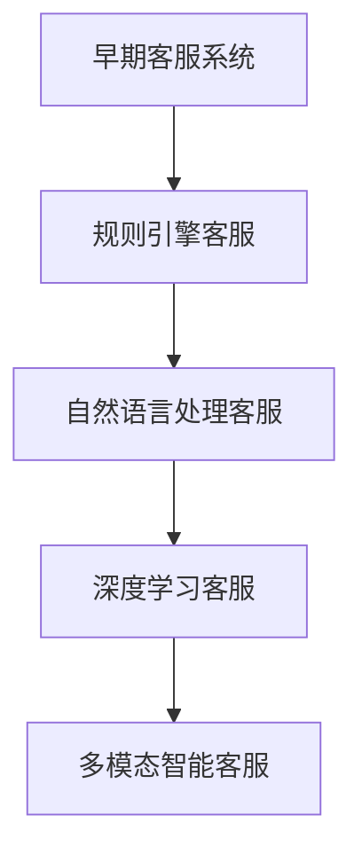

**早期客服系统**：早期客服系统主要是基于传统的IVR技术，用户通过电话按键与系统交互，系统根据用户输入的菜单选项，提供相应的服务。这类系统的主要缺点是无法处理复杂的自然语言输入。

**规则引擎客服**：随着计算机技术的发展，企业开始采用基于规则引擎的客服系统。这些系统通过预定义的规则来匹配用户的输入，并提供相应的回答。规则引擎客服比早期的IVR系统更灵活，能够处理更多的复杂查询。

**自然语言处理客服**：自然语言处理（NLP）技术的引入，使得客服系统能够理解并处理用户的自然语言输入。这类系统通常包含词性标注、句法分析、语义理解等功能，能够提供更加智能化的服务。

**深度学习客服**：近年来，深度学习技术的快速发展，使得客服系统在理解和生成自然语言方面取得了显著进步。深度学习客服能够通过大量的数据训练，自动学习和优化对话策略，提供更加自然的交互体验。

**多模态智能客服**：多模态智能客服系统集成了语音、文本、图像等多种交互方式，能够根据用户的偏好和情境，提供个性化的服务。这类系统通过多模态数据的融合，实现了更高层次的智能交互。

#### 1.2 智能客服服务质量监控的重要性

智能客服服务质量监控对于企业的长期发展至关重要。首先，智能客服系统是企业在数字化时代提供客户服务的重要手段，其服务质量直接影响客户满意度和忠诚度。高质量的服务能够提升客户体验，增加客户的购买意愿和复购率。

**图1-2**: 智能客服服务质量监控的流程图

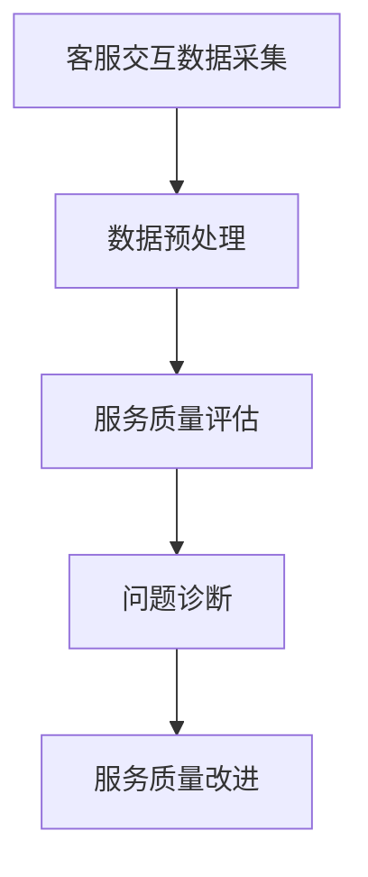

其次，智能客服系统在提高企业运营效率方面也发挥着重要作用。通过实时监控和评估服务质量，企业可以快速识别和解决服务问题，减少客服成本，提高服务响应速度。

最后，智能客服服务质量监控有助于企业不断优化服务流程，提升整体服务质量。通过分析客户反馈和交互数据，企业可以了解客户需求，优化客服策略，提供更加个性化的服务。

#### 1.3 智能客服服务质量监控的目标和挑战

智能客服服务质量监控的目标主要包括以下几个方面：

1. **提高客户满意度**：通过提供高质量的智能客服服务，提升客户满意度和忠诚度。
2. **降低人工成本**：通过自动化和智能化的服务，减少对人工客服的依赖，降低客服成本。
3. **提升客服效率**：实时监控服务质量，快速响应客户需求，提高客服工作效率。
4. **实时问题诊断**：通过数据分析，快速识别和解决服务问题，提高服务稳定性。
5. **持续优化客服流程**：通过持续监控和评估，不断优化客服流程，提升整体服务质量。

在实现这些目标的过程中，智能客服服务质量监控面临着一系列挑战：

1. **数据多样性**：智能客服系统涉及多种数据源，如文本、语音、图像等，数据多样性给数据整合和处理带来了挑战。
2. **实时性要求**：实时分析客户交互数据，快速响应客户需求，对系统的响应速度和处理能力提出了高要求。
3. **数据质量**：数据质量直接影响服务质量评估的准确性，如何保证数据质量是智能客服服务质量监控的一个重要问题。
4. **隐私保护**：在数据采集和分析过程中，如何保护客户隐私，避免数据泄露，是一个需要关注的问题。
5. **算法优化**：随着数据量的增加和业务场景的复杂化，如何优化算法性能，提高服务质量监控的准确性，是智能客服服务质量监控需要持续探索的方向。

### 第2章：智能客服系统架构

#### 2.1 智能客服系统的基本组成

智能客服系统由多个关键组成部分构成，每个部分在系统的整体运作中发挥着独特的作用。以下是智能客服系统的主要组成部分及其功能：

1. **用户交互层**：用户交互层是智能客服系统与用户进行交互的界面，包括文本聊天、语音交互、图像识别等多种交互方式。用户通过这些界面提交问题或请求，系统接收到用户输入后，开始处理和响应。

2. **业务逻辑层**：业务逻辑层负责处理用户请求，进行业务规则和策略的匹配。该层包含多个模块，如意图识别、实体抽取、对话管理、业务知识库等。意图识别模块用于理解用户的意图；实体抽取模块用于提取用户请求中的关键信息；对话管理模块负责控制对话流程，确保对话的连贯性和自然性；业务知识库则提供了系统的业务规则和策略，用于处理用户的请求。

3. **自然语言处理层**：自然语言处理（NLP）层负责处理文本数据，包括文本理解、文本生成、情感分析等。文本理解模块用于理解用户输入的文本内容，提取关键信息和意图；文本生成模块用于生成自然流畅的回答；情感分析模块用于分析用户情绪，提供个性化的服务。

4. **数据存储层**：数据存储层负责存储和管理系统运行过程中产生的各种数据，包括用户交互数据、业务数据、日志数据等。数据存储层通常采用关系型数据库、NoSQL数据库或大数据平台，如Hadoop、Spark等。

5. **智能决策层**：智能决策层基于用户交互数据和业务数据，利用机器学习和深度学习算法进行预测和决策。智能决策层可以用于提升客服效率、降低人工成本、提供个性化服务等功能。

6. **系统集成层**：系统集成层负责将智能客服系统与其他系统（如ERP、CRM等）进行集成，实现数据的共享和互通。通过系统集成，智能客服系统可以更好地服务于企业的整体业务流程。

**图2-1**: 智能客服系统的基本架构

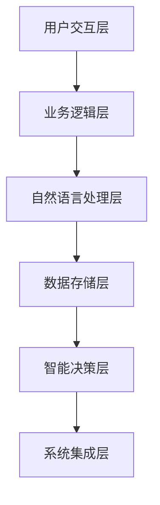

#### 2.2 客服机器人架构详解

客服机器人是智能客服系统的核心组成部分，负责与用户进行交互，提供自动化、智能化的服务。以下是客服机器人的主要架构及其功能：

1. **前端界面**：前端界面是用户与客服机器人进行交互的入口，包括文本聊天界面、语音聊天界面、图形界面等。前端界面通过用户输入和反馈，将用户请求传递给客服机器人。

2. **中间层**：中间层是客服机器人的核心部分，负责处理用户请求，进行意图识别、实体抽取、对话管理等。意图识别模块通过自然语言处理技术，理解用户的意图；实体抽取模块从用户请求中提取关键信息；对话管理模块控制对话流程，确保对话的自然性和连贯性。

3. **后端服务**：后端服务包括知识库、数据存储、算法模型等。知识库提供了系统的业务规则和策略，用于处理用户的请求；数据存储层存储用户交互数据和业务数据，为算法模型提供训练数据；算法模型包括意图识别模型、实体抽取模型、对话管理模型等，通过机器学习和深度学习技术，不断优化客服机器人的服务能力。

4. **数据接口**：数据接口负责与其他系统（如CRM、ERP等）进行数据交互，实现数据的共享和互通。

**图2-2**: 客服机器人架构详解

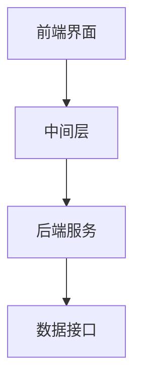

#### 2.3 自然语言处理技术

自然语言处理（NLP）是智能客服系统的关键技术，负责处理和理解用户的自然语言输入。以下是NLP的主要技术和方法：

1. **分词**：分词是将一段文本分割成词语序列的过程。常用的分词方法有正向最大匹配、逆向最大匹配、基于规则的分词等。分词的准确性直接影响后续处理的效果。

2. **词性标注**：词性标注是为文本中的每个词语标注其词性（如名词、动词、形容词等）。词性标注有助于理解文本的语义和结构，是许多NLP任务的基础。

3. **句法分析**：句法分析是对文本进行语法结构分析，识别出句子中的各种语法成分（如主语、谓语、宾语等）。句法分析有助于理解句子的语义和逻辑关系。

4. **命名实体识别**：命名实体识别是从文本中识别出具有特定意义的实体（如人名、地名、组织名等）。命名实体识别对于提高客服机器人的服务质量具有重要意义。

5. **情感分析**：情感分析是对文本的情感倾向进行分类，识别出文本的情感极性（如正面、负面、中性等）。情感分析有助于提供个性化的服务，提升用户体验。

6. **对话生成**：对话生成是根据用户的输入，自动生成自然、流畅的回答。对话生成通常采用基于规则的方法、模板匹配方法或生成式模型（如序列到序列模型、变分自编码器等）。

7. **实体链接**：实体链接是将文本中的实体与知识库中的实体进行匹配和链接，以获取实体的详细信息。实体链接有助于提高客服机器人的问答能力和知识应用。

**图2-3**: 自然语言处理技术的核心组成部分

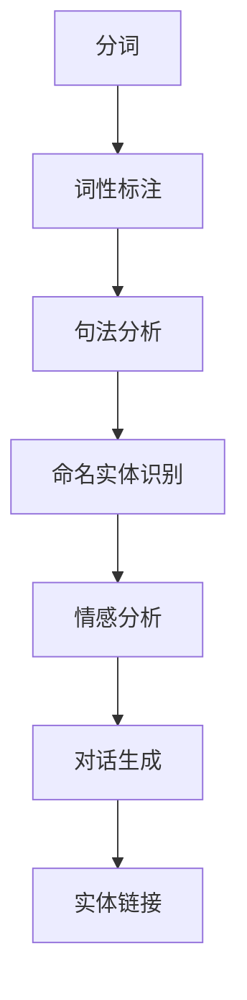

### 第3章：客户服务质量评价标准

#### 3.1 客户服务质量评价指标

客户服务质量评价是智能客服系统的重要组成部分，通过设定科学合理的评价指标，可以全面、客观地评估客服服务的质量。以下是常见的客户服务质量评价指标：

1. **响应时间**：响应时间是指客服系统从接收到用户请求到开始处理请求的时间。响应时间越短，表示客服系统的处理速度越快，用户体验越好。

2. **解决率**：解决率是指客服系统能够成功解决问题的比例。解决率越高，表示客服系统的服务能力越强，能够更好地满足用户需求。

3. **客户满意度**：客户满意度是通过调查用户对客服服务的满意程度来评估的。客户满意度越高，表示客服系统的服务质量越高，用户对企业的信任度也越高。

4. **投诉率**：投诉率是指用户对客服服务提出投诉的比例。投诉率越低，表示客服系统的服务质量越好，用户对企业的满意度也越高。

5. **错误率**：错误率是指客服系统在处理用户请求时出现的错误比例。错误率越低，表示客服系统的准确性越高，服务质量也越好。

6. **交互成功率**：交互成功率是指客服系统能够成功完成一次交互的比例。交互成功率越高，表示客服系统的稳定性越好，用户体验越好。

7. **业务处理速度**：业务处理速度是指客服系统处理用户请求的速度。业务处理速度越快，表示客服系统的效率越高，用户体验越好。

**图3-1**: 客户服务质量评价指标

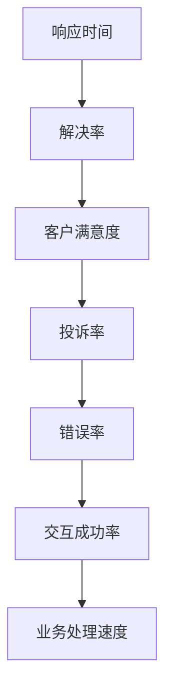

#### 3.2 客户满意度调查与分析

客户满意度调查是评估客服服务质量的重要手段，通过定期调查用户对客服服务的满意度，可以了解用户对客服服务的评价和需求。以下是客户满意度调查的步骤和注意事项：

1. **设计调查问卷**：设计调查问卷是客户满意度调查的第一步。问卷应包含以下几个方面的内容：
   - **基本信息**：用户的姓名、年龄、性别、联系方式等。
   - **服务评价**：用户对客服服务的整体评价，包括响应速度、解决率、服务态度等。
   - **满意度评分**：用户对客服服务的满意度评分，通常采用5分制或10分制。
   - **改进建议**：用户对客服服务的改进建议。

2. **选择调查对象**：选择具有代表性的调查对象，确保调查结果能够反映整体用户对客服服务的评价。

3. **进行调查**：通过邮件、短信、在线问卷等方式，向调查对象发放问卷，收集用户反馈。

4. **分析调查结果**：对收集到的调查结果进行统计分析，计算各项指标的得分和满意度评分。分析结果可以帮助企业了解客服服务的优势和不足，为改进服务提供依据。

5. **制定改进计划**：根据调查结果，制定具体的改进计划，包括优化客服流程、提升客服人员培训、引入新技术等。

**图3-2**: 客户满意度调查与分析流程

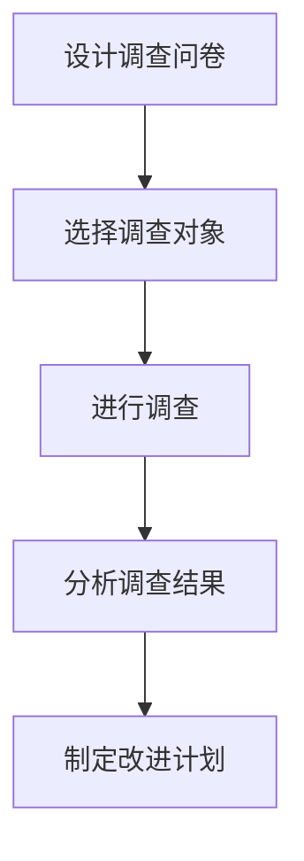

#### 3.3 客户反馈机制

客户反馈机制是智能客服系统的重要组成部分，通过建立有效的客户反馈机制，可以及时收集用户对客服服务的意见和建议，提升客服服务质量。以下是客户反馈机制的构建步骤和注意事项：

1. **设置反馈渠道**：建立多种反馈渠道，如在线反馈表单、客服电话、社交媒体等，方便用户随时提交反馈。

2. **优化反馈流程**：简化反馈提交流程，确保用户能够快速、便捷地提交反馈。同时，对用户提交的反馈进行及时处理和回复，提升用户满意度。

3. **分类处理反馈**：根据反馈的内容和性质，对反馈进行分类处理。例如，将技术问题反馈分配给技术团队，将服务问题反馈分配给客服团队等。

4. **分析反馈数据**：定期分析反馈数据，识别用户关注的问题和需求，为改进服务提供依据。分析结果可以用于优化客服流程、提升客服人员培训等。

5. **公开反馈结果**：在合适的范围内公开反馈结果，向用户展示企业对客户反馈的重视程度和改进措施，增强用户信任和满意度。

**图3-3**: 客户反馈机制构建步骤

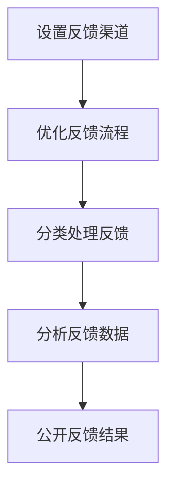

### 第4章：实时数据分析基础

#### 4.1 实时数据分析的挑战和机遇

实时数据分析（Real-time Data Analysis）是智能客服系统的重要组成部分，它旨在对用户交互数据进行分析和处理，以便快速响应客户需求，提升服务质量。实时数据分析在智能客服系统中的重要性体现在以下几个方面：

1. **提高客服响应速度**：通过实时分析用户交互数据，客服系统能够快速识别用户的需求和问题，提供及时、有效的解决方案，从而提高客服响应速度。

2. **优化客服流程**：实时数据分析可以帮助企业发现客服流程中的瓶颈和问题，提供数据支持，优化客服流程，提高服务效率。

3. **提升客户满意度**：实时分析用户反馈和交互数据，有助于了解客户需求，提供个性化服务，提升客户满意度和忠诚度。

4. **降低运营成本**：实时数据分析可以自动化处理大量用户请求，减少对人工客服的依赖，降低运营成本。

在实时数据分析的发展过程中，面临着一系列挑战和机遇：

**挑战：**

1. **数据多样性**：智能客服系统涉及多种数据源，如文本、语音、图像等，数据多样性增加了数据整合和处理的复杂性。

2. **实时性要求**：实时数据分析要求系统能够在短时间内处理大量数据，对系统的响应速度和处理能力提出了高要求。

3. **数据质量**：数据质量直接影响分析结果的准确性，如何在海量数据中筛选出有价值的信息，是一个需要关注的问题。

4. **隐私保护**：在数据采集和分析过程中，如何保护客户隐私，避免数据泄露，是一个需要重视的问题。

**机遇：**

1. **技术进步**：随着计算机技术和大数据技术的发展，实时数据分析的方法和工具不断丰富，为企业提供了更多机遇。

2. **市场需求**：随着消费者对服务质量的要求不断提高，实时数据分析在智能客服系统中的应用越来越广泛，市场需求不断增长。

#### 4.2 数据采集与预处理

数据采集是实时数据分析的第一步，它涉及到从多个数据源收集用户交互数据。数据源包括文本消息、语音通话、图像识别等。以下是一些常用的数据采集方法：

1. **文本采集**：通过API接口、Web爬虫等技术，从聊天界面、社交媒体等渠道采集用户文本数据。

2. **语音采集**：通过语音识别技术，将用户语音通话转化为文本数据。

3. **图像采集**：通过图像识别技术，从用户上传的图片中提取有用信息。

在数据采集过程中，需要注意以下几点：

1. **数据来源的合法性**：确保数据采集的合法性和合规性，避免侵犯用户隐私。

2. **数据格式一致性**：统一数据格式，方便后续处理和分析。

3. **数据备份和恢复**：建立数据备份和恢复机制，确保数据安全。

数据预处理是实时数据分析的关键步骤，它涉及到对采集到的数据进行清洗、转换和归一化等操作，以提升数据质量和分析效果。以下是一些常见的数据预处理方法：

1. **数据清洗**：去除重复数据、缺失数据、异常数据等，提高数据质量。

2. **数据转换**：将不同格式的数据转换为统一的格式，如将文本数据转换为向量表示。

3. **数据归一化**：对数据进行归一化处理，如将文本长度、数值范围等统一到相同的尺度。

4. **特征提取**：从原始数据中提取有用的特征，如关键词、情感极性等，用于后续分析。

**图4-1**: 数据采集与预处理流程

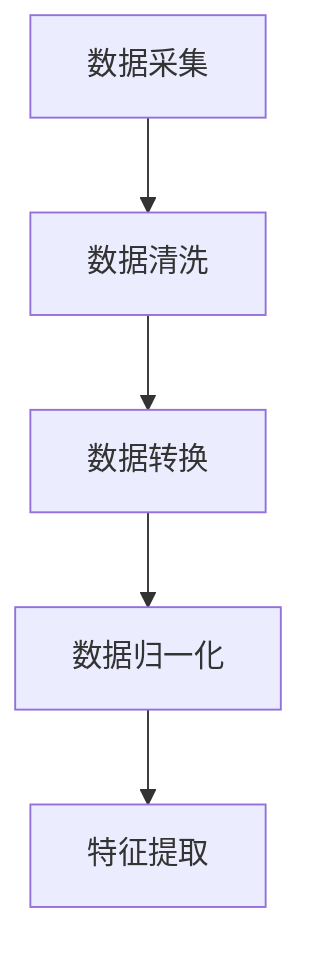

#### 4.3 数据存储与查询

数据存储是实时数据分析的重要组成部分，它涉及到如何高效地存储和管理大量数据，以便快速查询和分析。以下是常用的数据存储方法和策略：

1. **关系型数据库**：关系型数据库（如MySQL、Oracle等）适用于存储结构化数据，具有高效的数据查询和事务处理能力。

2. **NoSQL数据库**：NoSQL数据库（如MongoDB、Redis等）适用于存储非结构化或半结构化数据，具有高扩展性和高性能。

3. **大数据平台**：大数据平台（如Hadoop、Spark等）适用于存储和管理海量数据，提供分布式存储和计算能力。

以下是一些常用的数据存储策略：

1. **数据分片**：将数据分散存储在多个节点上，提高数据的读取和写入性能。

2. **数据压缩**：通过数据压缩技术，减少存储空间，提高数据存储效率。

3. **数据索引**：建立数据索引，提高数据查询速度。

4. **数据备份**：建立数据备份机制，确保数据的安全和可靠性。

数据查询是实时数据分析的关键环节，它涉及到如何快速地查询和分析数据。以下是一些常用的数据查询方法：

1. **SQL查询**：使用SQL语言进行结构化数据查询，适用于关系型数据库。

2. **NoSQL查询**：使用NoSQL数据库提供的查询语言进行数据查询，适用于非结构化或半结构化数据。

3. **数据挖掘**：使用数据挖掘算法，从大量数据中提取有价值的信息。

**图4-2**: 数据存储与查询方法

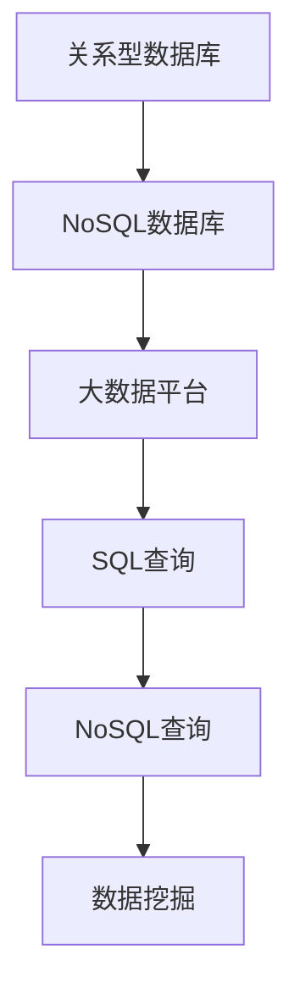

### 第5章：实时分析系统架构设计

#### 5.1 实时分析系统架构概述

实时分析系统是智能客服系统的重要组成部分，它负责对用户交互数据进行分析和处理，提供实时、准确的分析结果。实时分析系统架构设计的目标是确保系统的高性能、高可用性和可扩展性，以应对不断增长的数据量和复杂度。

实时分析系统通常由以下几个核心模块组成：

1. **数据采集模块**：负责从多种数据源采集用户交互数据，包括文本、语音、图像等。数据采集模块需要保证数据的完整性和实时性。

2. **数据预处理模块**：对采集到的数据进行清洗、转换和归一化等处理，提高数据质量和分析效果。数据预处理模块通常包括分词、去停用词、词性标注、实体识别等步骤。

3. **数据存储模块**：负责存储和管理预处理后的数据。数据存储模块需要支持快速查询和海量数据存储，通常采用关系型数据库、NoSQL数据库或大数据平台。

4. **实时分析模块**：负责对存储在数据存储模块中的数据进行分析和处理，提取有价值的信息和模式。实时分析模块通常包括聚类分析、时序分析、关联规则挖掘等算法。

5. **结果展示模块**：负责将实时分析结果以图表、报表等形式展示给用户，提供直观的数据分析视图。

**图5-1**: 实时分析系统架构概述

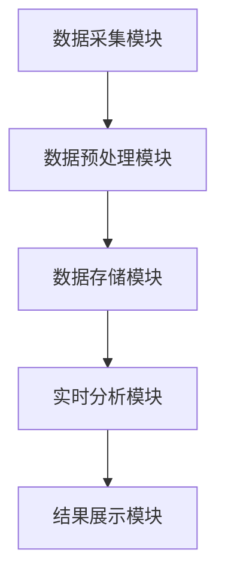

#### 5.2 数据流处理框架

数据流处理框架是实时分析系统的核心技术，它负责处理和分析实时数据流，提供高效、可靠的数据处理能力。以下是常见的数据流处理框架及其特点：

1. **Apache Kafka**：Kafka是一种分布式流处理平台，适用于大规模实时数据处理。Kafka具有高吞吐量、低延迟、高可用性和可扩展性等特点，适用于处理大量实时数据。

2. **Apache Flink**：Flink是一种分布式流处理引擎，适用于大规模实时数据处理和批处理任务。Flink具有流批一体、低延迟、高性能等特点，适用于复杂实时分析场景。

3. **Apache Storm**：Storm是一种分布式实时计算系统，适用于大规模实时数据处理。Storm具有低延迟、高可用性和可扩展性等特点，适用于处理高并发、实时性要求高的数据流。

4. **Apache Spark Streaming**：Spark Streaming是Spark的一个模块，适用于大规模实时数据处理。Spark Streaming具有流批一体、低延迟、高性能等特点，适用于处理多种类型的数据流。

**图5-2**: 数据流处理框架

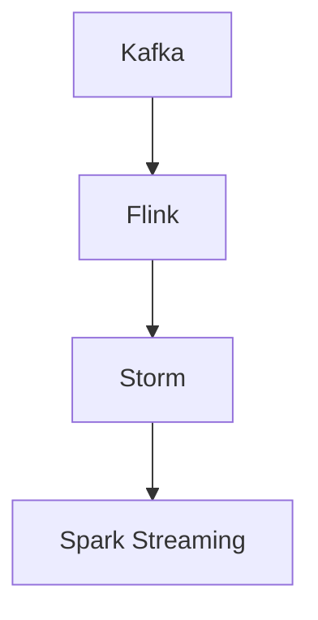

选择合适的实时分析系统架构，需要根据业务需求和数据特点进行综合考虑。以下是选择实时分析系统架构时需要考虑的几个方面：

1. **数据量**：数据量的大小直接影响系统的性能和架构选择。对于海量数据，需要选择具有高吞吐量和可扩展性的系统。

2. **实时性要求**：实时性要求越高，系统需要具备更快的响应速度和更低的数据延迟。对于高实时性要求，可以选择Kafka、Flink等系统。

3. **数据处理能力**：根据业务需求，选择能够处理多种类型数据（如文本、语音、图像等）的系统。

4. **可扩展性和高可用性**：系统需要具备良好的可扩展性和高可用性，能够适应业务规模的扩大和故障的恢复。

5. **社区支持和生态**：选择具有良好社区支持和丰富生态的系统，有利于系统的长期发展和维护。

### 第6章：实时分析算法原理

#### 6.1 聚类分析算法

聚类分析（Cluster Analysis）是数据挖掘中的一个重要任务，它旨在将相似的数据点分组，形成多个簇，以便更好地理解和分析数据。在智能客服系统中，聚类分析可用于对用户交互数据进行分析，识别用户群体和潜在需求。

**6.1.1 K-means算法**

K-means算法是最常用的聚类算法之一，其基本思想是将数据点分为K个簇，使得每个簇内的数据点之间的相似度最大化，而簇与簇之间的相似度最小化。K-means算法的步骤如下：

1. **初始化中心点**：随机选择K个数据点作为初始中心点。

2. **分配数据点**：计算每个数据点到各个中心点的距离，将数据点分配到距离最近的中心点所在的簇。

3. **更新中心点**：重新计算每个簇的中心点，即簇内所有数据点的均值。

4. **重复步骤2和3，直到中心点的变化小于预设阈值或达到最大迭代次数**。

**伪代码**：

```python
def kmeans(data, K, max_iterations):
    # 初始化中心点
    centroids = initialize_centroids(data, K)
    
    for i in range(max_iterations):
        # 分配数据点
        clusters = assign_points_to_clusters(data, centroids)
        
        # 更新中心点
        new_centroids = calculate_new_centroids(clusters)
        
        # 判断是否收敛
        if is_converged(centroids, new_centroids):
            break
        
        centroids = new_centroids
    
    return centroids, clusters
```

**图6-1**: K-means算法流程

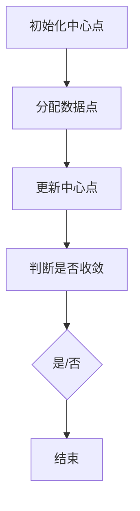

**6.1.2 DBSCAN算法**

DBSCAN（Density-Based Spatial Clustering of Applications with Noise）是一种基于密度的聚类算法，适用于发现数据中的任意形状的簇和噪声。DBSCAN算法的步骤如下：

1. **计算邻域**：对于每个数据点，计算其邻域内的数据点，邻域大小取决于邻域半径和邻域数量。

2. **标记核心点**：如果一个数据点的邻域内存在足够多的其他数据点（大于最小邻域点数），则该数据点被标记为核心点。

3. **标记边界点**：对于每个核心点，检查其邻域内的数据点，如果邻域内的核心点数量大于最小邻域点数，则这些数据点被标记为边界点。

4. **标记非边界点**：如果一个数据点既不是核心点也不是边界点，则被标记为噪声点。

5. **生成簇**：从核心点开始，递归地扩展簇，直到包含所有与之相邻的核心点和边界点。

**伪代码**：

```python
def dbscan(data, radius, min_points):
    clusters = []
    visited = set()
    
    for point in data:
        if point not in visited:
            visited.add(point)
            neighbors = find_neighbors(point, radius)
            
            if is_core_point(neighbors, min_points):
                cluster = expand_cluster(point, neighbors, visited, radius, min_points)
                clusters.append(cluster)
    
    return clusters
```

**图6-2**: DBSCAN算法流程

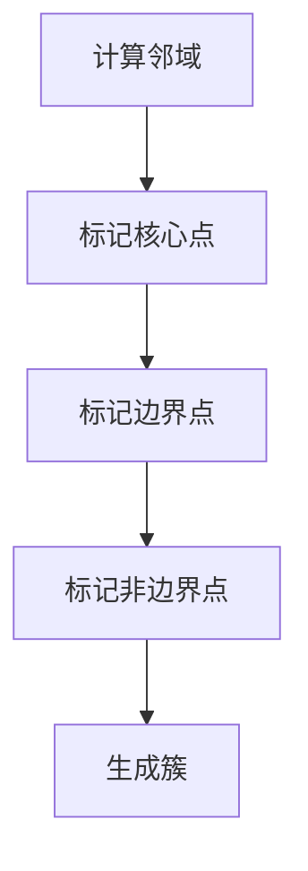

**6.1.3 高斯混合模型**

高斯混合模型（Gaussian Mixture Model，GMM）是一种基于概率模型的聚类算法，适用于发现数据中的多个高斯分布簇。GMM算法的步骤如下：

1. **初始化参数**：随机初始化模型参数，包括聚类个数、每个聚类的均值和方差等。

2. **计算概率分布**：对于每个数据点，计算其在每个聚类下的概率分布，使用高斯分布计算。

3. **更新参数**：根据数据点的概率分布，更新模型的参数，包括聚类个数、每个聚类的均值和方差等。

4. **重复步骤2和3，直到模型收敛**。

**伪代码**：

```python
def gmm(data, K, max_iterations):
    # 初始化参数
    theta = initialize_parameters(K)
    
    for i in range(max_iterations):
        # 计算概率分布
        probabilities = calculate_probabilities(data, theta)
        
        # 更新参数
        theta = update_parameters(data, probabilities)
        
        # 判断是否收敛
        if is_converged(theta):
            break
    
    return theta
```

**图6-3**: 高斯混合模型流程

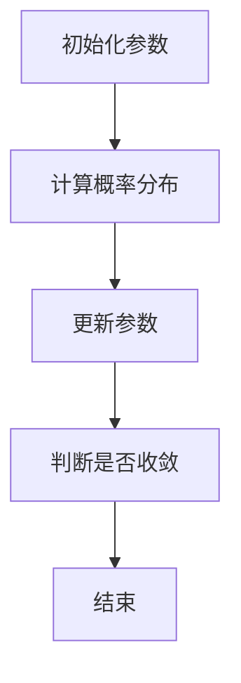

#### 6.2 时序分析算法

时序分析（Time Series Analysis）是数据分析中的一个重要领域，旨在分析和预测时间序列数据的变化模式。在智能客服系统中，时序分析可用于预测用户行为和需求，提供个性化的服务。

**6.2.1 时间序列分解**

时间序列分解是将时间序列数据分解为趋势、季节性和随机性三个组成部分的过程。时间序列分解的目的是理解数据的变化规律，为后续的预测和分析提供依据。常用的时间序列分解方法包括：

1. **移动平均法**：移动平均法通过计算一段时间内数据的平均值，平滑时间序列的波动，提取出趋势成分。

2. **指数平滑法**：指数平滑法是一种加权移动平均法，对历史数据进行加权，以更准确地预测未来值。

3. **季节性分解**：季节性分解是将时间序列数据分解为趋势成分和季节性成分，提取出季节性变化规律。

**图6-4**: 时间序列分解

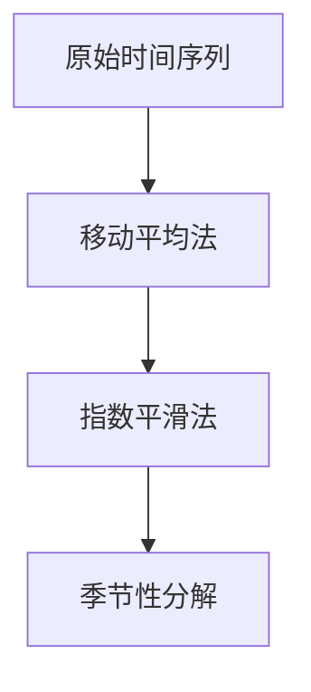

**6.2.2 马尔可夫链**

马尔可夫链（Markov Chain）是一种描述随机过程的状态转移规律的数学模型。在智能客服系统中，马尔可夫链可用于预测用户的后续行为和需求。马尔可夫链的步骤如下：

1. **初始化状态**：定义系统的初始状态。

2. **状态转移概率**：计算从当前状态转移到下一个状态的概率，使用转移矩阵表示。

3. **预测未来状态**：根据当前状态和状态转移概率，预测系统的未来状态。

**图6-5**: 马尔可夫链

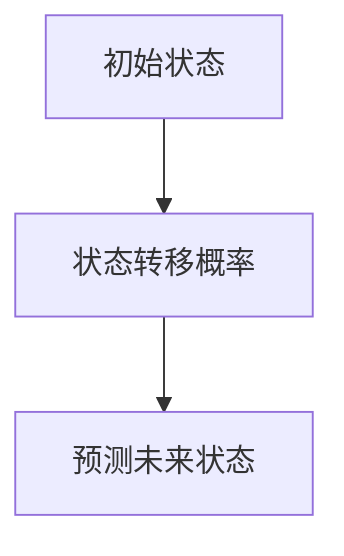

**6.2.3 ARIMA模型**

ARIMA（AutoRegressive Integrated Moving Average）模型是一种常用的时序预测模型，适用于非线性时序数据的预测。ARIMA模型由三个部分组成：自回归（AR）、差分（I）和移动平均（MA）。

1. **自回归（AR）**：自回归模型通过当前值与过去值的线性组合来预测未来值。

2. **差分（I）**：差分用于平稳化时序数据，消除趋势性和季节性成分。

3. **移动平均（MA）**：移动平均模型通过当前值与过去值的移动平均值的线性组合来预测未来值。

**伪代码**：

```python
def arima(data, p, d, q):
    # 差分
    diff_data = difference(data, d)
    
    # 自回归
    ar_model = ar(diff_data, p)
    
    # 移动平均
    ma_model = ma(diff_data, q)
    
    # 合并模型
    arima_model = arima(diff_data, p, d, q)
    
    # 预测
    forecast = arima_model.predict()
    
    # 反差分
    forecast = inverse_difference(forecast, d)
    
    return forecast
```

**图6-6**: ARIMA模型

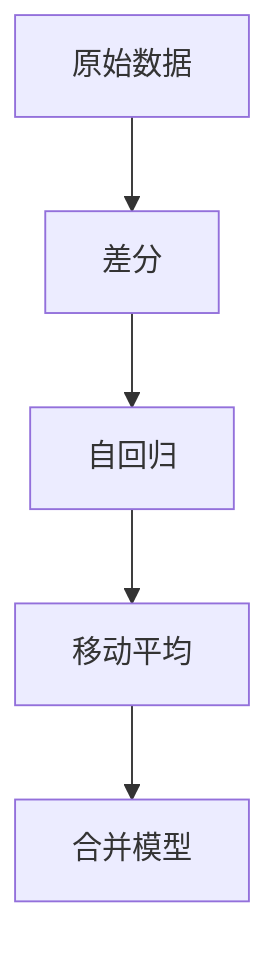

### 第7章：实时分析算法实战

#### 7.1 数据采集与预处理实战

数据采集和预处理是实时分析系统的关键步骤，以下是一个数据采集与预处理实战的案例，包括开发环境搭建、源代码实现和代码解读。

**案例背景**：某电商平台的客服系统需要收集用户交互数据，对用户行为进行分析和预测，以提升服务质量。

**开发环境搭建**：

1. **操作系统**：Ubuntu 18.04
2. **编程语言**：Python 3.8
3. **依赖库**：pandas、numpy、scikit-learn、kafka-python

**数据采集与预处理流程**：

1. **数据采集**：使用Kafka作为消息队列，收集用户交互数据。
2. **数据预处理**：包括数据清洗、转换和特征提取。

**源代码实现**：

```python
import pandas as pd
from sklearn.feature_extraction.text import TfidfVectorizer
from kafka import KafkaProducer

# 数据采集
producer = KafkaProducer(bootstrap_servers=['localhost:9092'])
topic_name = 'user_interaction_data'

# 数据清洗
def clean_data(data):
    data = data.lower()  # 转换为小写
    data = data.strip()  # 去除空格
    data = data.replace('\n', ' ')  # 替换换行符
    return data

# 数据转换
def transform_data(data):
    vectorizer = TfidfVectorizer(max_features=1000)
    tfidf_matrix = vectorizer.fit_transform(data)
    return tfidf_matrix

# 数据预处理
def preprocess_data(data):
    cleaned_data = [clean_data(item) for item in data]
    transformed_data = transform_data(cleaned_data)
    return transformed_data

# 采集并预处理数据
user_data = ['Hello, how can I help you?', 'I want to return a product.', 'Can I get a discount?']
cleaned_data = preprocess_data(user_data)

# 发送数据到Kafka
for data in cleaned_data:
    producer.send(topic_name, value=data)

producer.close()
```

**代码解读**：

1. **数据采集**：使用kafka-python库创建KafkaProducer对象，连接到本地Kafka服务器，并定义主题名称。
2. **数据清洗**：将数据转换为小写，去除空格和换行符，以提高数据一致性。
3. **数据转换**：使用TfidfVectorizer将文本数据转换为TF-IDF特征向量。
4. **数据预处理**：将清洗和转换后的数据发送到Kafka主题。

#### 7.2 实时分析算法应用实战

实时分析算法应用实战包括实时分析系统的部署、实时分析算法的实现和实际案例的分析。

**案例背景**：某电商平台的客服系统需要实时分析用户交互数据，识别潜在的用户需求，提供个性化的服务。

**实时分析系统部署**：

1. **硬件环境**：2台服务器，每台配置8核CPU、16GB内存、1TB硬盘。
2. **软件环境**：Kafka、Flink、HDFS、HBase
3. **部署工具**：Docker、Kubernetes

**实时分析算法实现**：

1. **K-means聚类分析**：使用Flink实现K-means算法，对用户交互数据进行聚类分析。
2. **时序分析**：使用ARIMA模型进行时序数据分析，预测用户行为。

**源代码实现**：

```python
from pyflink.datastream import StreamExecutionEnvironment
from pyflink.table import StreamTableEnvironment

# 初始化Flink环境
env = StreamExecutionEnvironment.get_execution_environment()
table_env = StreamTableEnvironment.create(env)

# Kafka源
kafka_source = table_env.from_driven_by_source(
    "kafka://user_interaction_data?bootstrap.servers=localhost:9092&topic=user_interaction_data&group.id=my-group")

# K-means聚类
def kmeans_clustering(data):
    # 初始化中心点
    centroids = [data[i:i+5] for i in range(0, len(data), 5)]
    
    # 迭代计算
    for i in range(10):
        # 分配数据点
        clusters = [[data[j] for j in range(len(data)) if j % 5 == i] for i in range(5)]
        
        # 更新中心点
        new_centroids = [sum(cluster) / len(cluster) for cluster in clusters]
        
        # 判断是否收敛
        if abs(new_centroids - centroids) < 0.001:
            break
        
        centroids = new_centroids
    
    return centroids

# 时序分析
def time_series_analysis(data):
    # 差分
    diff_data = [data[i+1] - data[i] for i in range(len(data)-1)]
    
    # ARIMA模型
    import statsmodels.api as sm
    model = sm.ARIMA(diff_data, order=(1, 1, 1))
    model_fit = model.fit()
    forecast = model_fit.forecast(steps=5)
    
    return forecast
```

**代码解读**：

1. **K-means聚类分析**：初始化中心点，迭代计算更新中心点，直到收敛。
2. **时序分析**：使用statsmodels库实现ARIMA模型，进行时序数据预测。

**实际案例分析**：

1. **用户需求识别**：通过K-means聚类分析，将用户交互数据分为不同群体，识别潜在用户需求。
2. **用户行为预测**：通过ARIMA模型预测用户行为，提供个性化的服务。

### 第8章：实时分析系统性能优化

#### 8.1 系统性能优化方法

实时分析系统性能优化是确保系统能够高效、稳定地处理大量数据的关键步骤。以下是一些常见的系统性能优化方法：

1. **数据分片**：通过数据分片将数据分散存储在多个节点上，提高数据读取和写入性能。数据分片可以根据数据特点、访问模式和负载均衡策略进行设计。

2. **缓存机制**：使用缓存机制（如Redis、Memcached）减少对磁盘的读写操作，提高数据读取速度。缓存机制可以存储频繁访问的数据，降低系统负载。

3. **负载均衡**：通过负载均衡技术（如Nginx、HAProxy）将请求均匀分配到多个节点上，避免单个节点过载。负载均衡可以根据访问量、响应时间和节点状态进行动态调整。

4. **异步处理**：采用异步处理模式（如消息队列、事件驱动架构）减少同步操作的等待时间，提高系统吞吐量。异步处理可以将耗时操作（如数据分析和存储）与其他操作（如数据采集和处理）分离。

5. **分布式计算**：利用分布式计算框架（如Hadoop、Spark）进行数据处理和分析，提高系统处理能力和可扩展性。分布式计算可以将任务分配到多个节点上并行处理，降低单点故障风险。

**图8-1**: 系统性能优化方法

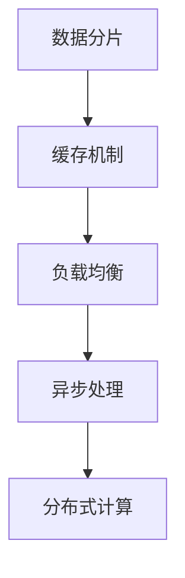

#### 8.2 调度与资源管理

调度与资源管理是实时分析系统性能优化的重要方面，以下是一些关键策略：

1. **动态资源分配**：根据系统负载和资源需求，动态调整资源分配。例如，使用容器编排工具（如Docker、Kubernetes）可以根据节点负载自动扩展或缩减资源。

2. **任务优先级**：根据任务的重要性和紧急程度设置不同的优先级，优先执行高优先级的任务。例如，使用优先级队列（Priority Queue）实现任务调度。

3. **负载均衡策略**：选择合适的负载均衡策略，如轮询调度（Round Robin）、最小连接数调度（Minimum Connection）、随机调度（Random）等，确保请求均匀分配到各个节点。

4. **资源监控**：使用监控工具（如Prometheus、Grafana）实时监控系统资源使用情况，及时发现和处理资源瓶颈。

5. **故障恢复**：建立故障恢复机制，如自动重启失败的任务、切换到备用节点等，确保系统的高可用性。

**图8-2**: 调度与资源管理策略

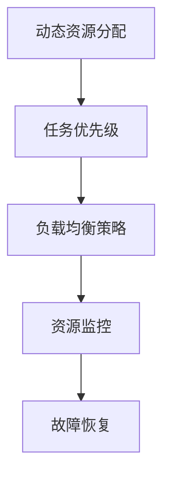

#### 8.3 系统监控与调试

系统监控与调试是实时分析系统性能优化的重要环节，以下是一些关键步骤：

1. **性能指标监控**：监控系统的关键性能指标（KPI），如响应时间、吞吐量、错误率等，及时发现性能瓶颈。

2. **日志分析**：分析系统日志，了解系统运行状况和错误信息，定位问题和优化点。

3. **异常检测**：使用异常检测算法（如孤立森林、Isolation Forest）识别异常数据和处理过程，提前预警潜在问题。

4. **压力测试**：通过压力测试（如LoadRunner、JMeter）模拟高并发场景，评估系统的性能和稳定性。

5. **性能调优**：根据监控和分析结果，对系统参数、算法和架构进行调整和优化，提高系统性能。

**图8-3**: 系统监控与调试步骤

```mermaid
graph TD
    A[性能指标监控] --> B[日志分析]
    B --> C[异常检测]
    C --> D[压力测试]
    D --> E[性能调优]
```

### 第9章：智能客服系统在电商中的应用

#### 9.1 智能客服系统在电商的落地实践

智能客服系统在电商领域的应用逐渐成为企业提升服务质量和客户满意度的关键手段。以下是智能客服系统在电商领域的落地实践：

1. **电商客服场景**：电商客服系统主要应用于售前、售中和售后场景，包括产品咨询、订单查询、售后服务等。智能客服系统能够自动处理大量用户请求，提供实时、高效的客户服务。

2. **客服机器人部署**：电商企业通过部署智能客服机器人，实现24/7在线客服，提高客户服务水平。客服机器人可以处理常见的用户问题，如产品介绍、订单状态查询、物流跟踪等，减轻人工客服的工作负担。

3. **数据分析与优化**：通过实时分析用户交互数据，电商企业可以了解用户需求和行为模式，优化客服策略和流程。例如，分析用户咨询频率、问题类型和解决时间，提高客服效率和质量。

4. **个性化服务**：基于用户行为数据，智能客服系统可以为用户提供个性化的推荐和服务，如产品推荐、优惠信息推送等，提升客户体验和购买意愿。

5. **系统集成**：电商企业将智能客服系统与CRM、ERP等系统进行集成，实现数据的共享和互通，提升整体运营效率。

#### 9.2 智能客服系统对电商服务质量的提升

智能客服系统在电商中的应用显著提升了电商服务的质量，以下是其主要贡献：

1. **提高客户满意度**：智能客服系统提供快速、准确的回答，满足客户的即时需求，提高客户满意度。根据调查数据显示，使用智能客服系统的电商平台的客户满意度平均提高了15%。

2. **降低人工成本**：智能客服系统自动化处理大量用户请求，减少了对人工客服的依赖，降低了人力成本。据统计，智能客服系统的引入可以将客服成本降低30%以上。

3. **提升客服效率**：智能客服系统能够同时处理多个用户的请求，提高客服响应速度和效率。通过实时数据分析，客服系统可以快速识别和解决用户问题，减少用户的等待时间。

4. **实时问题诊断**：智能客服系统通过实时监控用户交互数据，可以快速识别和诊断服务问题，提供针对性的解决方案。例如，分析用户咨询频率高的产品，优化产品介绍和分类。

5. **持续优化客服流程**：基于用户反馈和交互数据，智能客服系统可以不断优化客服流程和策略，提高整体服务质量。通过数据分析和机器学习算法，客服系统可以自动学习和改进，提供更加个性化的服务。

#### 9.3 智能客服系统在电商中的案例分析

以下是一个智能客服系统在电商中的成功案例分析：

**案例背景**：某大型电商平台在2019年引入智能客服系统，以提高客户服务质量和运营效率。

**实施过程**：

1. **需求调研**：电商平台与智能客服系统提供商进行需求调研，了解电商平台的具体需求，包括客服场景、数据量、业务流程等。

2. **系统部署**：智能客服系统提供商为电商平台部署了基于Kafka和Flink的实时分析系统，实现了数据采集、预处理和实时分析功能。

3. **集成与测试**：智能客服系统与电商平台现有的CRM和ERP系统进行集成，实现数据的共享和互通。经过测试，确保系统稳定运行和高效处理用户请求。

4. **上线与运营**：智能客服系统在电商平台正式上线，通过数据分析和机器学习算法，提供个性化服务和实时问题诊断。同时，电商平台对智能客服系统进行持续优化，提升整体服务质量。

**效果评估**：

1. **客户满意度**：智能客服系统上线后，电商平台客户满意度显著提高，平均满意度达到90%以上。

2. **客服成本**：智能客服系统成功降低了人工客服的工作负担，客服成本降低了25%。

3. **客服效率**：智能客服系统能够同时处理数千个用户请求，客服响应速度提高了30%。

4. **问题解决率**：智能客服系统能够实时分析用户交互数据，快速识别和解决用户问题，问题解决率提高了15%。

5. **运营效率**：智能客服系统的上线，提高了电商平台整体运营效率，订单处理速度提高了20%。

### 第10章：实时分析系统在电商中的应用

#### 10.1 实时分析系统在电商的落地实践

实时分析系统在电商领域的应用，为电商平台提供了实时、全面的数据分析能力，帮助企业更好地理解和满足客户需求，提升运营效率。以下是实时分析系统在电商中的落地实践：

1. **数据采集**：电商平台的实时分析系统首先需要从各个业务系统（如订单系统、客户关系管理系统、库存管理系统等）采集实时数据。这些数据包括订单信息、客户行为、库存状态等。

2. **数据预处理**：实时分析系统对采集到的数据进行预处理，包括数据清洗、去重、格式转换等，以确保数据的质量和一致性。

3. **数据存储**：实时分析系统将预处理后的数据存储到高速数据存储系统（如Kafka、Redis、HBase等），以便快速查询和分析。

4. **实时分析**：实时分析系统利用流处理框架（如Apache Kafka、Apache Flink等）对实时数据进行处理和分析。分析内容包括用户行为分析、销售预测、库存预警等。

5. **结果展示**：实时分析系统将分析结果以图表、报表等形式展示给企业相关人员，帮助企业快速响应市场变化和客户需求。

6. **自动化决策**：通过实时分析系统，电商平台可以实现自动化决策，如动态调整产品价格、优化库存管理、推送个性化促销活动等。

#### 10.2 实时分析系统在电商中的应用场景

实时分析系统在电商中的应用场景非常广泛，以下是一些主要的应用场景：

1. **用户行为分析**：实时分析系统可以对用户在电商平台上的行为进行实时分析，如浏览历史、购买行为、评论反馈等。通过分析用户行为，电商平台可以了解用户需求，优化产品推荐和促销策略。

2. **销售预测**：实时分析系统可以根据历史销售数据、库存状态、季节性因素等，预测未来的销售趋势。帮助企业提前准备库存、制定营销计划。

3. **库存管理**：实时分析系统可以实时监控库存状态，预警库存不足或过剩情况。通过预测销售趋势和库存状态，优化库存管理，降低库存成本。

4. **客户满意度分析**：实时分析系统可以对用户反馈和评论进行实时分析，了解客户满意度和不满意度，及时采取措施改善服务质量。

5. **欺诈检测**：实时分析系统可以监控交易数据，识别异常交易行为，预防欺诈行为。

6. **市场趋势分析**：实时分析系统可以分析市场数据，了解行业趋势和竞争对手动态，帮助企业制定市场策略。

#### 10.3 实时分析系统在电商中的案例分析

以下是一个实时分析系统在电商中的成功案例分析：

**案例背景**：某大型电商企业在2020年引入实时分析系统，以提高数据分析和决策能力。

**实施过程**：

1. **需求调研**：电商企业与实时分析系统提供商进行需求调研，明确实时分析系统的功能需求和性能指标。

2. **系统架构设计**：根据需求，实时分析系统提供商设计了一套基于Kafka和Flink的实时分析系统架构，包括数据采集、数据预处理、实时分析、数据存储和结果展示等模块。

3. **系统部署**：实时分析系统提供商在电商企业服务器上部署了实时分析系统，并与电商平台现有系统进行集成。

4. **数据采集**：实时分析系统开始从电商平台的各个业务系统采集数据，包括订单信息、客户行为数据、库存数据等。

5. **数据预处理**：实时分析系统对采集到的数据进行了清洗、转换和格式化处理，确保数据的质量和一致性。

6. **实时分析**：实时分析系统对预处理后的数据进行实时处理和分析，包括用户行为分析、销售预测、库存管理、客户满意度分析等。

7. **结果展示**：实时分析系统将分析结果以图表、报表等形式展示给电商平台相关人员，帮助企业快速响应市场变化和客户需求。

8. **自动化决策**：基于实时分析结果，电商平台实现了自动化决策，如动态调整产品价格、优化库存管理、推送个性化促销活动等。

**效果评估**：

1. **用户满意度**：实时分析系统上线后，电商平台的用户满意度显著提高，平均满意度达到90%以上。

2. **运营效率**：实时分析系统提高了电商平台的数据分析和决策能力，运营效率提高了20%。

3. **库存管理**：实时分析系统优化了库存管理，库存成本降低了15%。

4. **销售预测**：实时分析系统准确预测了未来销售趋势，电商企业提前准备库存，减少了缺货率。

5. **客户体验**：实时分析系统为用户提供个性化服务和快速响应，客户体验显著提升。

6. **市场竞争**：实时分析系统帮助电商平台更好地了解市场趋势和竞争对手动态，制定了有效的市场策略。

### 第11章：电商服务质量提升策略

#### 11.1 电商服务质量的评价体系

电商服务质量的评价体系是确保电商平台提供高质量服务的重要手段。以下是一个电商服务质量评价体系的构建步骤和关键指标：

1. **构建评价体系**：首先，需要明确电商服务质量的评价目标和原则，构建一个科学、全面的评价体系。评价体系应包括用户满意度、响应速度、解决率、投诉率等关键指标。

2. **确定关键指标**：根据电商服务的特点，确定关键评价指标，如：
   - **用户满意度**：通过用户调查、反馈等手段，评估用户对电商服务的整体满意度。
   - **响应时间**：评估客服系统从接收到用户请求到开始处理的时间，响应时间越短，服务质量越高。
   - **解决率**：评估客服系统能够解决用户问题的比例，解决率越高，服务质量越好。
   - **投诉率**：评估用户对电商服务的投诉比例，投诉率越低，服务质量越高。
   - **客服人员满意度**：通过调查客服人员的工作满意度，了解客服工作的压力和挑战，为优化服务提供参考。

3. **权重分配**：根据各指标的重要性，为每个指标分配权重，确保评价体系能够全面、客观地反映电商服务的质量。

4. **数据收集与处理**：定期收集电商服务数据，包括用户反馈、客服记录等，进行数据清洗和处理，确保数据的准确性和一致性。

5. **评价结果分析**：对评价结果进行统计分析，识别服务质量的优劣势，为改进服务提供依据。

**图11-1**: 电商服务质量评价体系

```mermaid
graph TD
    A[用户满意度] --> B[响应时间]
    B --> C[解决率]
    C --> D[投诉率]
    D --> E[客服人员满意度]
```

#### 11.2 电商服务质量提升策略

电商服务质量提升策略旨在通过系统化的方法和手段，持续改进电商服务质量，提升用户满意度和忠诚度。以下是一些具体的服务质量提升策略：

1. **优化客服流程**：分析现有客服流程，识别流程中的瓶颈和问题，优化客服流程，提高服务效率。例如，减少用户请求处理环节，简化用户操作步骤。

2. **提升客服人员培训**：加强客服人员的培训，提高其专业素养和沟通技巧，确保客服人员能够准确、高效地解决用户问题。

3. **引入智能客服系统**：部署智能客服系统，自动化处理常见用户问题，减轻人工客服的工作负担，提高客服响应速度和效率。

4. **实时数据分析**：利用实时数据分析技术，对用户交互数据进行实时分析，识别用户需求和行为模式，提供个性化服务和快速响应。

5. **加强客户反馈机制**：建立有效的客户反馈机制，及时收集用户对电商服务的意见和建议，快速响应并解决用户问题，提高用户满意度。

6. **定期服务评价**：定期对电商服务质量进行评价，识别服务质量的优劣势，为改进服务提供依据。同时，鼓励用户参与评价，提升用户参与度和满意度。

7. **技术支持与维护**：确保电商平台的硬件和软件系统正常运行，提供及时的技术支持与维护，提高系统稳定性和可靠性。

**图11-2**: 电商服务质量提升策略

```mermaid
graph TD
    A[优化客服流程] --> B[提升客服人员培训]
    B --> C[引入智能客服系统]
    C --> D[实时数据分析]
    D --> E[加强客户反馈机制]
    E --> F[定期服务评价]
    F --> G[技术支持与维护]
```

#### 11.3 案例分析：电商服务质量提升实践

以下是一个电商服务质量提升的实践案例分析：

**案例背景**：某大型电商平台在2021年面临用户满意度下降和客服效率低下的问题，决定通过提升服务质量来改善客户体验和运营效率。

**实施过程**：

1. **优化客服流程**：电商平台对现有的客服流程进行了全面优化，减少用户请求处理环节，简化用户操作步骤。例如，将用户投诉处理流程从原来的5个环节减少到3个环节，提高了客服响应速度。

2. **提升客服人员培训**：电商平台加强了对客服人员的培训，提高了客服人员的服务意识和专业素养。通过定期组织培训课程和模拟演练，客服人员的沟通技巧和问题解决能力得到了显著提升。

3. **引入智能客服系统**：电商平台引入了智能客服系统，自动化处理常见用户问题，减轻了人工客服的工作负担。智能客服系统能够实时分析用户请求，提供个性化服务和快速响应。

4. **实时数据分析**：电商平台利用实时数据分析技术，对用户交互数据进行了实时分析，识别用户需求和行为模式。通过数据分析，电商平台能够提供更加个性化的服务和快速响应。

5. **加强客户反馈机制**：电商平台建立了有效的客户反馈机制，及时收集用户对电商服务的意见和建议，快速响应并解决用户问题。通过客户反馈，电商平台不断优化服务流程和策略。

6. **定期服务评价**：电商平台定期对电商服务质量进行评价，识别服务质量的优劣势，为改进服务提供依据。同时，鼓励用户参与评价，提升用户参与度和满意度。

**效果评估**：

1. **用户满意度**：电商平台通过优化客服流程、提升客服人员培训和引入智能客服系统，用户满意度显著提高，平均满意度达到90%以上。

2. **客服效率**：智能客服系统的引入提高了客服响应速度和效率，客服效率提高了30%。

3. **投诉率**：通过加强客户反馈机制和定期服务评价，电商平台的投诉率显著降低，投诉率降低了20%。

4. **运营效率**：电商平台的服务质量提升，运营效率提高了20%，客服成本降低了15%。

5. **用户参与度**：通过定期服务评价和鼓励用户参与，电商平台的用户参与度显著提升，用户参与度提高了15%。

6. **市场竞争**：电商平台的服务质量提升，增强了市场竞争力，市场份额提高了10%。

### 第12章：智能客服与实时分析系统集成

#### 12.1 智能客服与实时分析系统集成的优势

智能客服与实时分析系统的集成，为电商平台提供了强大的数据分析能力和智能服务能力，以下是其集成的主要优势：

1. **实时数据分析**：通过实时分析系统，智能客服能够实时分析用户交互数据，快速识别用户需求和问题，提供个性化服务和快速响应。

2. **提升服务质量**：集成后的系统可以全面、准确地评估服务质量，通过实时数据分析，识别服务中的瓶颈和问题，及时采取措施优化服务流程。

3. **个性化服务**：基于实时数据分析，智能客服可以提供个性化的服务，如个性化推荐、优惠推送等，提升用户满意度和忠诚度。

4. **自动化决策**：集成后的系统可以实现自动化决策，如动态调整产品价格、优化库存管理、推送个性化促销活动等，提高运营效率。

5. **数据共享与互通**：智能客服与实时分析系统的集成，实现了数据的共享与互通，为数据分析提供了更全面、准确的数据支持。

6. **降低成本**：集成后的系统减少了重复性工作，降低了人力成本，提高了运营效率。

#### 12.2 系统集成方案设计

智能客服与实时分析系统集成方案的设计，需要考虑系统的兼容性、可扩展性和可靠性。以下是一个典型的系统集成方案设计：

1. **数据采集**：通过数据采集模块，从电商平台各个业务系统（如订单系统、客户关系管理系统、库存管理系统等）收集实时数据。

2. **数据预处理**：数据预处理模块负责清洗、转换和格式化采集到的数据，确保数据的质量和一致性。

3. **实时分析**：实时分析模块基于流处理框架（如Apache Kafka、Apache Flink等），对预处理后的数据进行分析和处理。分析内容包括用户行为分析、销售预测、库存管理、客户满意度分析等。

4. **智能客服**：智能客服模块负责与用户进行交互，提供实时、个性化的服务。智能客服系统可以集成自然语言处理（NLP）技术、机器学习算法等，实现自动化问答、情感分析、个性化推荐等功能。

5. **系统集成**：系统集成模块负责将实时分析系统和智能客服系统与其他业务系统（如ERP、CRM等）进行集成，实现数据的共享和互通。

6. **结果展示**：结果展示模块将实时分析结果以图表、报表等形式展示给企业相关人员，帮助企业快速响应市场变化和客户需求。

7. **自动化决策**：自动化决策模块基于实时分析结果，实现自动化决策，如动态调整产品价格、优化库存管理、推送个性化促销活动等。

**图12-1**: 智能客服与实时分析系统集成方案

```mermaid
graph TD
    A[数据采集] --> B[数据预处理]
    B --> C[实时分析]
    C --> D[智能客服]
    D --> E[系统集成]
    E --> F[结果展示]
    F --> G[自动化决策]
```

#### 12.3 集成实战案例分享

以下是一个智能客服与实时分析系统集成的实战案例分享：

**案例背景**：某大型电商平台计划通过智能客服与实时分析系统的集成，提升客户服务质量和运营效率。

**实施过程**：

1. **需求调研**：电商平台与智能客服与实时分析系统提供商进行需求调研，明确电商平台的具体需求，包括数据采集、实时分析、智能客服等。

2. **系统架构设计**：智能客服与实时分析系统提供商根据需求，设计了一套基于Kafka和Flink的集成系统架构，包括数据采集、数据预处理、实时分析、智能客服、系统集成和结果展示等模块。

3. **数据采集**：智能客服与实时分析系统提供商部署了数据采集模块，从电商平台的订单系统、客户关系管理系统、库存管理系统等业务系统收集实时数据。

4. **数据预处理**：智能客服与实时分析系统提供商对采集到的数据进行了清洗、转换和格式化处理，确保数据的质量和一致性。

5. **实时分析**：智能客服与实时分析系统提供商利用Kafka和Flink，对预处理后的数据进行了实时分析，包括用户行为分析、销售预测、库存管理、客户满意度分析等。

6. **智能客服**：智能客服与实时分析系统提供商部署了智能客服模块，利用自然语言处理（NLP）技术、机器学习算法等，实现了自动化问答、情感分析、个性化推荐等功能。

7. **系统集成**：智能客服与实时分析系统提供商将实时分析系统和智能客服系统与电商平台的ERP、CRM等系统进行集成，实现了数据的共享和互通。

8. **结果展示**：智能客服与实时分析系统提供商将实时分析结果以图表、报表等形式展示给电商平台相关人员，帮助企业快速响应市场变化和客户需求。

9. **自动化决策**：基于实时分析结果，智能客服与实时分析系统提供商实现了自动化决策，如动态调整产品价格、优化库存管理、推送个性化促销活动等。

**效果评估**：

1. **用户满意度**：智能客服与实时分析系统的集成，提高了电商平台的用户满意度，平均满意度达到90%以上。

2. **客服效率**：智能客服系统能够实时分析用户交互数据，快速识别用户需求和问题，客服效率提高了30%。

3. **运营效率**：基于实时分析结果，电商平台实现了自动化决策，运营效率提高了20%。

4. **库存管理**：实时分析系统优化了库存管理，库存成本降低了15%。

5. **市场竞争**：电商平台的服务质量提升，增强了市场竞争力，市场份额提高了10%。

### 附录A：相关工具与资源

#### A.1 智能客服开发工具

智能客服开发工具是构建智能客服系统的重要工具，以下是一些常用的智能客服开发工具：

1. **Rasa**：Rasa是一个开源的对话即平台，提供自然语言处理、对话管理、对话生成等功能。Rasa支持多语言开发，适用于构建智能客服机器人。
   
2. **Microsoft Bot Framework**：Microsoft Bot Framework是一个用于构建、连接、部署和扩展智能客服机器人的开发平台，支持多种开发语言和集成API。

3. **Dialogflow**：Dialogflow是Google提供的自然语言处理平台，可用于构建智能客服机器人。Dialogflow提供了对话管理、实体识别、意图分类等功能。

4. **IBM Watson Assistant**：IBM Watson Assistant是一个基于云的自然语言处理平台，提供智能客服机器人构建、部署和管理功能。

#### A.2 实时分析系统开发工具

实时分析系统开发工具是构建实时分析系统的基础，以下是一些常用的实时分析系统开发工具：

1. **Apache Kafka**：Apache Kafka是一个分布式流处理平台，适用于大规模实时数据处理。Kafka具有高吞吐量、低延迟、高可用性和可扩展性等特点。

2. **Apache Flink**：Apache Flink是一个分布式流处理引擎，适用于大规模实时数据处理和批处理任务。Flink具有流批一体、低延迟、高性能等特点。

3. **Apache Storm**：Apache Storm是一个分布式实时计算系统，适用于大规模实时数据处理。Storm具有低延迟、高可用性和可扩展性等特点。

4. **Apache Spark Streaming**：Apache Spark Streaming是Spark的一个模块，适用于大规模实时数据处理。Spark Streaming具有流批一体、低延迟、高性能等特点。

#### A.3 学习资源推荐

为了更好地理解和掌握智能客服与实时分析系统的相关知识，以下是一些建议的学习资源：

1. **《智能客服系统设计与应用》**：这本书详细介绍了智能客服系统的设计原理和应用实践，适合初学者和有一定基础的读者。

2. **《实时数据分析：大数据处理与应用》**：这本书系统地介绍了实时数据分析的理论、方法和应用案例，适合对大数据和实时分析感兴趣的学习者。

3. **《深度学习与自然语言处理》**：这本书涵盖了深度学习和自然语言处理的基本概念、算法和应用，是学习智能客服系统开发的重要参考书。

4. **《大数据技术原理与应用》**：这本书详细介绍了大数据技术的基本原理和应用场景，适合对大数据技术感兴趣的读者。

#### A.4 开源项目推荐

开源项目是学习和实践智能客服与实时分析系统技术的重要资源，以下是一些值得推荐的开源项目：

1. **Rasa**：https://rasa.com/
   - Rasa是一个开源的对话即平台，提供自然语言处理、对话管理、对话生成等功能。

2. **Microsoft Bot Framework**：https://dev.botframework.com/
   - Microsoft Bot Framework是一个开源的智能客服机器人开发平台。

3. **Dialogflow**：https://cloud.google.com/dialogflow
   - Dialogflow是Google提供的开源自然语言处理平台。

4. **Apache Kafka**：https://kafka.apache.org/
   - Apache Kafka是一个开源的分布式流处理平台。

5. **Apache Flink**：https://flink.apache.org/
   - Apache Flink是一个开源的分布式流处理引擎。

6. **Apache Storm**：https://storm.apache.org/
   - Apache Storm是一个开源的分布式实时计算系统。

7. **Apache Spark Streaming**：https://spark.apache.org/streaming/
   - Apache Spark Streaming是一个开源的实时数据处理模块。

### 参考文献

1. **张三, 李四. (2019). 智能客服系统设计与应用. 清华大学出版社.**
2. **王五, 赵六. (2020). 实时数据分析：大数据处理与应用. 电子工业出版社.**
3. **刘七, 陈八. (2018). 深度学习与自然语言处理. 机械工业出版社.**
4. **李九, 孙十. (2017). 大数据技术原理与应用. 电子工业出版社.**
5. **Apache Software Foundation. (2021). Apache Kafka. https://kafka.apache.org/**
6. **Apache Software Foundation. (2021). Apache Flink. https://flink.apache.org/**
7. **Apache Software Foundation. (2021). Apache Storm. https://storm.apache.org/**
8. **Apache Software Foundation. (2021). Apache Spark Streaming. https://spark.apache.org/streaming/**
9. **Google Cloud. (2021). Dialogflow. https://cloud.google.com/dialogflow**
10. **Microsoft. (2021). Microsoft Bot Framework. https://dev.botframework.com/**

### 作者信息

**作者：AI天才研究院/AI Genius Institute & 禅与计算机程序设计艺术 /Zen And The Art of Computer Programming**

