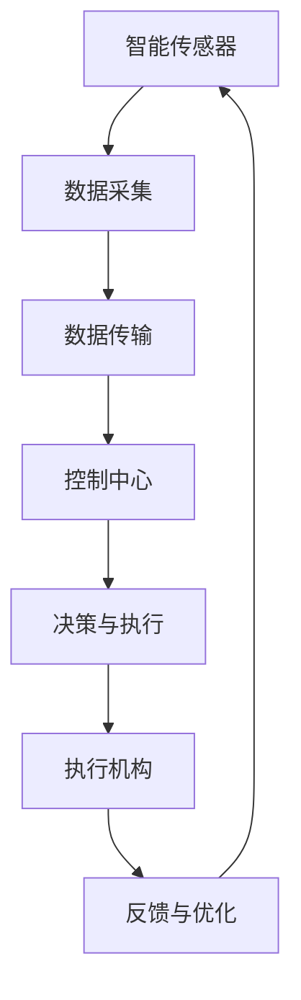

                 

### 文章标题：智能家居系统：IoT创业者的机遇与挑战

**关键词**：智能家居，物联网（IoT），创业机会，技术挑战，安全，隐私保护

**摘要**：随着物联网技术的飞速发展，智能家居系统逐渐成为人们日常生活的重要组成部分。本文将详细探讨智能家居系统的定义、背景、发展趋势，以及其核心概念、技术和应用。同时，本文还将深入分析智能家居系统在物联网创业中所面临的机遇与挑战，包括技术、安全、隐私等方面的问题。通过本文的阅读，IoT创业者将能够更好地理解智能家居市场的现状，制定有效的创业策略。

### 目录大纲

#### 第一部分：智能家居系统概述

##### 第1章：智能家居系统引论

- **1.1 智能家居的定义与背景**
- **1.2 物联网（IoT）与智能家居的关系**
- **1.3 智能家居系统的组成**
- **1.4 智能家居系统的架构**

##### 第2章：智能家居系统核心概念与联系

- **2.1 智能家居系统中的核心概念**
- **2.2 智能家居系统的工作原理**
- **2.3 智能家居系统的Mermaid流程图**

#### 第二部分：智能家居系统核心技术

##### 第3章：智能传感器技术原理与实现

- **3.1 智能传感器的基本原理**
- **3.2 智能传感器的工作原理**
- **3.3 智能传感器的伪代码描述**

##### 第4章：智能控制器技术原理与应用

- **4.1 智能控制器的基本概念**
- **4.2 智能控制器的工作原理**
- **4.3 智能控制器的伪代码描述**

##### 第5章：用户界面设计原则与方法

- **5.1 用户界面的定义与作用**
- **5.2 用户界面设计的方法与工具**
- **5.3 用户界面的具体案例分析**

##### 第6章：机器学习算法在智能家居系统中的应用

- **6.1 机器学习的基本概念**
- **6.2 常见的机器学习算法**
- **6.3 机器学习算法的应用案例分析**

#### 第三部分：智能家居系统项目实战

##### 第7章：智能家居系统开发实战

- **7.1 项目概述**
- **7.2 开发环境搭建**
- **7.3 系统设计与实现**
- **7.4 项目代码解读与分析**
- **7.5 项目测试与优化**

##### 第8章：智能家居系统的挑战与未来趋势

- **8.1 智能家居系统面临的挑战**
- **8.2 智能家居系统的未来趋势**
- **8.3 创业者面临的机遇与策略**

#### 附录

##### 附录A：智能家居系统开发工具与资源

- **A.1 主流智能家居平台介绍**
- **A.2 智能家居系统开发工具**
- **A.3 智能家居系统开发资源**

### 目录大纲结束

#### 第一部分：智能家居系统概述

##### 第1章：智能家居系统引论

#### 1.1 智能家居的定义与背景

智能家居系统，顾名思义，是指通过物联网技术将家庭中的各种设备连接起来，实现智能化的控制和自动化操作。这一概念起源于20世纪90年代，随着计算机技术和通信技术的飞速发展，智能家居逐渐从科幻小说走向现实。

**定义**：智能家居系统是一种以家庭为载体，利用先进的物联网技术，通过智能硬件和软件平台，实现家庭设备的自动化控制、远程监控和智能分析，从而提高家庭生活品质和舒适度的系统。

**背景**：

1. **技术驱动**：物联网技术的快速发展，使得大量传感器、控制器和网络设备变得廉价且易于部署，为智能家居的实现提供了技术基础。
2. **市场需求**：随着生活水平的提高，人们对生活品质的要求越来越高，智能家居系统以其便捷、高效、舒适的特点，满足了人们对于智能化生活的向往。
3. **政策支持**：我国政府高度重视智能家居产业的发展，出台了一系列政策扶持措施，为智能家居市场的发展提供了政策保障。

#### 1.2 物联网（IoT）与智能家居的关系

物联网（IoT，Internet of Things）是智能家居系统的核心技术之一。它是指通过互联网将各种设备连接起来，实现数据的采集、传输、处理和共享。

**基本概念**：

1. **物联网**：物联网是通过传感器、控制器、网络等设备，将各种物体（如家电、车辆、工业设备等）连接到互联网上，实现智能化的管理和控制。
2. **智能家居**：智能家居是物联网在家庭环境中的应用，通过物联网技术实现家庭设备的互联互通和智能化操作。

**应用**：

1. **设备连接**：物联网技术使得家庭中的各种设备（如空调、电视、灯光、窗帘等）能够通过网络连接，实现相互之间的通信和协同工作。
2. **数据采集**：通过物联网传感器，可以实时采集家庭环境中的各种数据（如温度、湿度、光照等），为智能家居系统的决策提供数据支持。
3. **远程控制**：用户可以通过智能手机、平板电脑等设备远程控制家庭中的设备，实现智能家居的便捷操作。

**挑战与机遇**：

1. **挑战**：物联网技术的复杂性和多样性，使得智能家居系统的设计和实现面临巨大的挑战。此外，数据安全和隐私保护也是需要解决的问题。
2. **机遇**：随着物联网技术的成熟和普及，智能家居市场前景广阔，为创业者提供了巨大的机遇。

#### 1.3 智能家居系统的组成

智能家居系统由硬件设备、软件平台和网络连接三大部分组成。

**硬件设备**：

1. **智能传感器**：用于采集家庭环境中的各种数据，如温度、湿度、光照、烟雾等。
2. **智能控制器**：用于接收传感器数据，并根据用户需求和预设的规则进行控制，如空调、灯光、窗帘等。
3. **智能设备**：包括各种智能家居设备，如空调、电视、洗衣机、冰箱等。

**软件平台**：

1. **控制中心**：用于接收和处理传感器数据，实现家庭设备的智能化控制。
2. **用户界面**：用于用户与智能家居系统交互，提供友好的操作界面。
3. **数据分析**：用于对传感器数据进行分析，为智能家居系统提供决策支持。

**网络连接**：

1. **有线网络**：如以太网，用于家庭内部设备之间的连接。
2. **无线网络**：如Wi-Fi、蓝牙，用于家庭设备与互联网的连接。

#### 1.4 智能家居系统的架构

智能家居系统采用层次化架构，分为感知层、网络层和应用层。

**感知层**：

1. **智能传感器**：用于感知家庭环境中的各种数据，如温度、湿度、光照等。
2. **数据采集**：将传感器数据传输到网络层。

**网络层**：

1. **通信协议**：如Wi-Fi、蓝牙、ZigBee等，用于实现家庭设备之间的数据传输。
2. **数据传输**：将传感器数据传输到应用层。

**应用层**：

1. **控制中心**：接收网络层的数据，并根据用户需求和预设规则进行控制。
2. **用户界面**：提供用户与智能家居系统的交互界面。
3. **数据分析**：对传感器数据进行分析，为智能家居系统提供决策支持。

#### 1.5 智能家居系统中的核心概念与联系

智能家居系统中的核心概念包括智能传感器、智能控制器、用户界面和机器学习算法。这些概念之间紧密联系，共同构成了智能家居系统的核心架构。

**智能传感器**：

1. **概念**：智能传感器是一种能够感知环境变化，并将物理信号转换为电信号的设备。
2. **作用**：在智能家居系统中，智能传感器用于感知家庭环境中的各种数据，如温度、湿度、光照等。
3. **工作原理**：智能传感器通过传感器元件将物理信号（如温度、光照等）转换为电信号，然后通过数据采集模块将电信号转换为数字信号，最后通过通信模块将数字信号传输到控制中心。

**智能控制器**：

1. **概念**：智能控制器是一种能够接收传感器数据，并根据用户需求和预设规则进行控制的设备。
2. **作用**：在智能家居系统中，智能控制器用于根据传感器数据，实现家庭设备的自动化控制。
3. **工作原理**：智能控制器首先接收传感器数据，然后通过控制算法，生成控制指令，最后通过执行机构（如电机、开关等）执行控制指令。

**用户界面**：

1. **概念**：用户界面是用户与智能家居系统进行交互的界面。
2. **作用**：在智能家居系统中，用户界面用于提供用户操作智能家居系统的入口。
3. **工作原理**：用户界面首先接收用户输入的操作指令，然后通过控制中心将操作指令转换为控制指令，最后通过执行机构执行控制指令。

**机器学习算法**：

1. **概念**：机器学习算法是一种通过数据训练，实现从输入到输出的映射的算法。
2. **作用**：在智能家居系统中，机器学习算法用于对传感器数据进行分析，实现智能家居系统的智能化。
3. **工作原理**：机器学习算法首先从传感器数据中提取特征，然后通过训练，学习输入和输出之间的映射关系，最后根据输入数据，预测输出结果。

**联系**：

1. **数据流转**：智能传感器采集的数据首先传输到智能控制器，然后通过用户界面进行展示，最后通过机器学习算法进行分析。
2. **功能协同**：智能传感器、智能控制器、用户界面和机器学习算法相互协同，共同实现智能家居系统的智能化。

### 1.6 智能家居系统的工作原理

智能家居系统的工作原理主要包括数据采集、决策与执行和反馈与优化三个环节。

**数据采集**：

1. **过程**：智能传感器用于感知家庭环境中的各种数据，如温度、湿度、光照等。传感器将物理信号转换为电信号，然后通过数据采集模块将电信号转换为数字信号。
2. **传输**：数字信号通过通信协议传输到控制中心。

**决策与执行**：

1. **过程**：控制中心接收传感器数据，并根据用户需求和预设规则，生成控制指令。
2. **执行**：控制指令通过执行机构（如电机、开关等）执行。

**反馈与优化**：

1. **过程**：执行机构执行控制指令后，将结果反馈给控制中心。
2. **优化**：控制中心根据反馈结果，调整控制策略，实现系统的优化。

### 1.7 智能家居系统的Mermaid流程图

下面是一个智能家居系统的Mermaid流程图，展示了智能家居系统的主要工作流程：



### 第二部分：智能家居系统核心技术

##### 第3章：智能传感器技术原理与实现

#### 3.1 智能传感器的基本原理

智能传感器是一种能够感知环境变化，并将物理信号转换为电信号的设备。它通常由传感器元件、信号放大电路、滤波电路、数据转换电路和通信电路等组成。

**传感器元件**：传感器元件是智能传感器的核心部分，用于感知物理信号。常见的传感器元件包括温度传感器、湿度传感器、光照传感器、烟雾传感器等。

**信号放大电路**：传感器元件输出的信号通常较弱，需要通过信号放大电路进行放大，以提高信号的强度。

**滤波电路**：滤波电路用于去除传感器信号中的噪声，提高信号的质量。

**数据转换电路**：数据转换电路将传感器信号转换为数字信号，以便于后续处理。

**通信电路**：通信电路用于将数字信号传输到控制中心。

#### 3.2 智能传感器的工作原理

智能传感器的工作原理主要包括以下几个步骤：

1. **信号采集**：传感器元件感知到环境中的物理信号，如温度、湿度、光照等。
2. **信号放大与滤波**：信号放大电路将弱信号放大，滤波电路去除噪声，提高信号质量。
3. **数据转换**：数据转换电路将模拟信号转换为数字信号，便于后续处理。
4. **信号传输**：通信电路将数字信号传输到控制中心。

#### 3.3 智能传感器的伪代码描述

以下是一个简单的智能传感器的伪代码描述：

```python
# 传感器数据采集
def read_sensor_data():
    sensor_value = get_analog_value()  # 读取模拟值
    digital_value = analog_to_digital(sensor_value)  # 转换为数字值
    return digital_value

# 传感器数据传输
def send_sensor_data(digital_value):
    protocol = choose_communication_protocol()  # 选择通信协议
    send_data(digital_value, protocol)  # 发送数据
```

#### 3.4 智能传感器的伪代码描述（续）

以下是一个智能传感器的伪代码描述，包括信号放大、滤波和数据转换过程：

```python
# 信号放大与滤波
def amplify_and_filter(sensor_value):
    amplified_value = amplify(sensor_value)  # 放大信号
    filtered_value = filter_noise(amplified_value)  # 滤除噪声
    return filtered_value

# 数据转换
def analog_to_digital(sensor_value):
    digital_value = (sensor_value / analog_max) * digital_max  # 模拟值转换为数字值
    return digital_value
```

#### 3.5 智能传感器的应用案例分析

以下是一个智能传感器的应用案例分析：

**案例背景**：某智能家居系统需要实时监测室内的温度和湿度。

**解决方案**：使用一个温湿度传感器，实时监测室内的温度和湿度。传感器采集到的数据通过通信模块传输到控制中心，控制中心根据数据调整空调和加湿器的运行状态。

**具体步骤**：

1. **传感器安装**：在室内安装温湿度传感器。
2. **数据采集**：传感器实时采集温度和湿度数据。
3. **数据传输**：传感器将数据传输到控制中心。
4. **数据处理**：控制中心接收传感器数据，并根据数据调整空调和加湿器的运行状态。

**效果评估**：通过智能传感器的应用，室内温度和湿度得到了有效控制，提高了居住舒适度。

#### 3.6 智能传感器的未来发展展望

随着物联网技术的不断发展，智能传感器在智能家居系统中的应用前景广阔。以下是智能传感器的未来发展展望：

1. **技术进步**：随着传感器技术的不断进步，智能传感器的灵敏度、精度和稳定性将进一步提高。
2. **多样化应用**：智能传感器将不仅仅应用于智能家居系统，还将广泛应用于工业、农业、医疗等领域。
3. **集成化发展**：智能传感器将与其他智能设备集成，实现更加智能化的家居生活。

### 第4章：智能控制器技术原理与应用

#### 4.1 智能控制器的基本概念

智能控制器是智能家居系统中的核心组件，用于接收传感器数据，并根据用户需求和预设规则进行控制。智能控制器通常包括以下几个部分：

1. **处理器**：负责处理传感器数据和执行控制指令。
2. **存储器**：用于存储用户设置、传感器数据和程序代码等。
3. **输入接口**：用于接收传感器数据和其他输入信号。
4. **输出接口**：用于输出控制信号到执行机构。
5. **通信接口**：用于与其他设备或服务器进行数据交换。

#### 4.2 智能控制器的工作原理

智能控制器的工作原理主要包括以下几个步骤：

1. **数据接收**：智能控制器通过输入接口接收传感器数据。
2. **数据处理**：处理器对传感器数据进行分析和处理，生成控制指令。
3. **控制执行**：控制器通过输出接口发送控制信号到执行机构，执行具体的控制动作。
4. **反馈处理**：执行机构执行控制指令后，将结果反馈给控制器，控制器根据反馈结果进行进一步的决策。

#### 4.3 智能控制器的伪代码描述

以下是一个简单的智能控制器的伪代码描述：

```python
# 接收传感器数据
def receive_sensor_data():
    sensor_data = read_input_interface()  # 读取输入接口数据
    return sensor_data

# 处理传感器数据
def process_sensor_data(sensor_data):
    control_command = analyze_data(sensor_data)  # 分析数据，生成控制指令
    return control_command

# 执行控制指令
def execute_control_command(control_command):
    send_output_signal(control_command)  # 发送输出信号
    feedback = read_feedback()  # 读取反馈
    return feedback

# 主程序
def main():
    while True:
        sensor_data = receive_sensor_data()  # 接收传感器数据
        control_command = process_sensor_data(sensor_data)  # 处理传感器数据
        feedback = execute_control_command(control_command)  # 执行控制指令
        process_feedback(feedback)  # 处理反馈
```

#### 4.4 智能控制器的应用案例分析

以下是一个智能控制器的应用案例分析：

**案例背景**：某智能家居系统需要控制室内的灯光和空调。

**解决方案**：使用一个智能控制器，根据传感器数据（如光线传感器和温度传感器）控制灯光和空调的开关。

**具体步骤**：

1. **传感器安装**：在室内安装光线传感器和温度传感器。
2. **数据采集**：传感器实时采集光线和温度数据。
3. **数据传输**：传感器将数据传输到智能控制器。
4. **控制决策**：智能控制器根据传感器数据，决定是否开启灯光和空调。
5. **控制执行**：控制器发送控制信号到灯光和空调，执行具体的控制动作。

**效果评估**：通过智能控制器的应用，室内灯光和空调得到了智能化的控制，提高了能源利用效率，同时提供了更加舒适的生活环境。

### 第5章：用户界面设计原则与方法

#### 5.1 用户界面的定义与作用

用户界面（User Interface，UI）是用户与智能家居系统进行交互的界面，用于提供用户操作智能家居系统的入口。一个良好的用户界面应该具备易用性、美观性和高效性。

**定义**：用户界面是用户与计算机系统进行交互的桥梁，通过图形用户界面（GUI）、命令行界面（CLI）或触摸界面等，用户可以与系统进行互动，执行各种操作。

**作用**：

1. **提供操作入口**：用户界面为用户提供了一个操作智能家居系统的入口，用户可以通过界面实现各种功能，如控制灯光、调整温度、查看传感器数据等。
2. **增强用户体验**：良好的用户界面设计能够提高用户的操作体验，使系统更加直观、易用，从而增强用户对智能家居系统的满意度和忠诚度。
3. **提供信息反馈**：用户界面可以实时向用户展示系统状态和操作结果，提供必要的信息反馈，帮助用户了解系统的运行状况。

#### 5.2 用户界面设计的方法与工具

**设计方法**：

1. **原型设计**：原型设计是用户界面设计的重要方法，通过创建低保真或高保真的界面原型，设计师可以直观地展示界面效果，收集用户反馈，进行迭代优化。
2. **用户体验设计**：用户体验设计（User Experience Design，UXD）是一种以用户为中心的设计方法，关注用户的情感体验和满意度，通过用户研究、场景分析和交互设计等手段，提升用户界面的用户体验。
3. **界面布局**：界面布局是用户界面设计的基础，通过合理的布局，使界面内容有序、清晰，提高用户操作效率。

**设计工具**：

1. **Sketch**：Sketch是一款流行的用户界面设计工具，具有简单易用、界面美观等特点，适用于低保真原型设计。
2. **Adobe XD**：Adobe XD是一款强大的用户界面设计工具，支持从原型设计到交互设计的全流程，具有丰富的组件和动画功能。
3. **Figma**：Figma是一款在线用户界面设计工具，支持多人协作，实时预览功能，适用于高保真原型设计。

#### 5.3 用户界面的具体案例分析

以下是一个用户界面的具体案例分析：

**案例背景**：某智能家居系统需要设计一个用户界面，用于控制室内的灯光、温度和窗帘。

**界面设计**：

1. **首页**：首页展示系统状态和主要功能，包括灯光、温度、窗帘等。
2. **灯光控制**：灯光控制页面展示灯光状态和开关按钮，用户可以一键控制灯光的开启和关闭。
3. **温度控制**：温度控制页面展示当前温度和设定温度，用户可以调整设定温度，实现智能恒温控制。
4. **窗帘控制**：窗帘控制页面展示窗帘状态和开关按钮，用户可以一键控制窗帘的开启和关闭。

**设计特点**：

1. **简洁明了**：界面设计简洁明了，用户可以快速找到所需功能。
2. **美观舒适**：界面设计美观舒适，符合用户审美需求。
3. **交互流畅**：界面交互流畅，用户操作响应迅速。

**用户反馈**：用户对设计的用户界面表示满意，认为界面设计清晰、易用，提供了良好的操作体验。

#### 5.4 用户界面的设计原则

**易用性**：用户界面应设计得简单、直观，用户能够轻松上手，无需过多的学习成本。

**一致性**：用户界面应保持一致的风格和布局，使用统一的颜色、字体和图标，避免用户产生混淆。

**响应速度**：用户界面应具有快速响应速度，减少用户等待时间，提高操作效率。

**可访问性**：用户界面应考虑到不同用户的需求，提供多种操作方式，如触摸、手势、语音等，确保所有用户都能方便地使用。

**可扩展性**：用户界面应具有良好的可扩展性，能够根据用户需求进行功能扩展和界面调整。

### 第6章：机器学习算法在智能家居系统中的应用

#### 6.1 机器学习的基本概念

机器学习（Machine Learning，ML）是一种人工智能（Artificial Intelligence，AI）的分支，通过数据训练，使计算机能够从数据中学习，并做出预测或决策。机器学习算法可以分为监督学习、无监督学习和强化学习三类。

**监督学习**：监督学习是一种有标记数据训练的学习方法。通过已标记的数据集，训练模型学习特征与标签之间的关系，从而对新数据做出预测。

**无监督学习**：无监督学习是一种无标记数据训练的学习方法。模型通过分析数据自身的特征，发现数据中的模式和结构，如聚类、降维等。

**强化学习**：强化学习是一种通过与环境交互，不断调整策略，以实现最大化收益的学习方法。模型通过与环境的互动，学习最优策略。

#### 6.2 常见的机器学习算法

**线性回归**：线性回归是一种监督学习算法，用于预测一个连续值输出。通过找到输入特征与输出值之间的线性关系，实现预测。

**决策树**：决策树是一种常见的分类算法，通过一系列的判断条件，将数据划分为不同的类别。决策树具有简单、易于理解的特点。

**集成学习**：集成学习是一种通过组合多个基本模型，提高预测准确率的算法。常见的集成学习方法有随机森林和梯度提升树。

**神经网络**：神经网络是一种模拟人脑神经元连接的算法，具有强大的学习和预测能力。神经网络可以分为多层感知机、卷积神经网络（CNN）和循环神经网络（RNN）等。

#### 6.3 机器学习算法的应用案例分析

**案例背景**：某智能家居系统需要预测室内的温度变化，以优化空调的运行策略。

**解决方案**：使用机器学习算法对历史温度数据进行训练，建立温度预测模型。根据预测结果，调整空调的运行参数，实现智能恒温控制。

**具体步骤**：

1. **数据收集**：收集历史温度数据，包括时间、温度值等。
2. **数据处理**：对数据进行清洗、归一化等预处理。
3. **模型训练**：选择合适的机器学习算法，如线性回归、决策树等，训练预测模型。
4. **模型评估**：使用测试数据评估模型性能，调整模型参数。
5. **模型部署**：将训练好的模型部署到智能家居系统中，实现温度预测。

**效果评估**：通过机器学习算法的应用，温度预测模型的准确率得到了显著提高，空调运行效率得到了优化。

#### 6.4 机器学习算法在智能家居系统中的应用前景

随着智能家居系统的不断发展，机器学习算法在智能家居系统中的应用前景广阔。以下是机器学习算法在智能家居系统中的应用前景：

1. **智能预测**：通过机器学习算法，可以实现对家庭设备运行状态的预测，优化设备运行策略，提高能源利用效率。
2. **个性化服务**：通过机器学习算法，可以分析用户行为数据，为用户提供个性化的智能家居服务，提高用户满意度。
3. **安全防护**：通过机器学习算法，可以实现对智能家居系统安全威胁的预测和检测，提高系统的安全性。

### 第三部分：智能家居系统项目实战

#### 第7章：智能家居系统开发实战

##### 7.1 项目概述

**项目背景**：某智能家居系统项目旨在开发一个具备远程控制、智能调节和预测功能的智能家居系统，以提升用户的生活品质。

**项目目标**：实现以下功能：

1. **远程控制**：用户可以通过手机APP远程控制家庭设备，如灯光、空调、窗帘等。
2. **智能调节**：系统可以根据环境数据和用户习惯，自动调节设备状态，提高能源利用效率。
3. **预测功能**：通过机器学习算法，预测家庭环境变化，提前调整设备状态，提供个性化服务。

**项目团队与分工**：

- **项目经理**：负责项目整体规划和进度管理。
- **开发人员**：负责系统开发、调试和维护。
- **测试人员**：负责系统测试和问题追踪。
- **UI设计师**：负责用户界面设计。

##### 7.2 开发环境搭建

**操作系统与环境配置**：项目采用Linux操作系统，开发环境包括以下工具：

1. **Python**：用于编写系统代码。
2. **Django**：用于搭建Web后端。
3. **MongoDB**：用于存储系统数据。
4. **Node.js**：用于搭建手机APP后端。

**开发工具与库**：项目使用的开发工具和库包括：

1. **Visual Studio Code**：用于代码编写。
2. **PyCharm**：用于Python代码调试。
3. **Postman**：用于API测试。
4. **MongoDB Compass**：用于数据库管理。

##### 7.3 系统设计与实现

**系统架构设计**：

1. **感知层**：包括温湿度传感器、光线传感器等，用于感知家庭环境数据。
2. **网络层**：包括无线通信模块，用于传输传感器数据到控制中心。
3. **控制层**：包括智能控制器，用于接收传感器数据，并根据用户需求和预设规则进行控制。
4. **应用层**：包括手机APP和Web后台，用于用户交互和数据展示。

**数据采集与处理**：

1. **数据采集**：传感器采集到的数据通过无线通信模块传输到控制中心。
2. **数据处理**：控制中心对传感器数据进行预处理，如去噪、归一化等，然后存储到数据库。

**控制器设计与实现**：

1. **控制器设计**：控制器采用Python编写，实现数据接收、处理和控制指令发送功能。
2. **控制器实现**：控制器通过Django框架搭建，使用RESTful API与手机APP和Web后台进行数据交互。

**用户界面设计与实现**：

1. **界面设计**：用户界面采用Sketch设计，包括首页、设备控制页、数据展示页等。
2. **界面实现**：用户界面通过React框架实现，使用Ant Design组件库搭建。

##### 7.4 项目代码解读与分析

**主要代码段解读**：

1. **传感器数据采集**：

```python
# 传感器数据采集
def read_sensor_data():
    sensor_value = get_analog_value()  # 读取模拟值
    digital_value = analog_to_digital(sensor_value)  # 转换为数字值
    return digital_value
```

2. **数据预处理**：

```python
# 数据预处理
def preprocess_data(sensor_data):
    cleaned_data = remove_noise(sensor_data)  # 去除噪声
    normalized_data = normalize(cleaned_data)  # 归一化
    return normalized_data
```

3. **控制器实现**：

```python
# 控制器实现
class Controller:
    def __init__(self):
        self.sensor_data = None

    def receive_data(self, data):
        self.sensor_data = data
        self.process_data()

    def process_data(self):
        cleaned_data = preprocess_data(self.sensor_data)
        control_command = generate_command(cleaned_data)
        send_control_command(control_command)

    def send_control_command(self, command):
        # 发送控制指令
        pass
```

**代码性能分析与优化**：

1. **代码性能分析**：通过测试，分析代码的响应时间、内存占用等性能指标。
2. **代码优化**：针对性能瓶颈，进行代码优化，如使用缓存、减少循环等。

##### 7.5 项目测试与优化

**系统功能测试**：

1. **功能测试**：测试系统功能是否按照需求实现，如远程控制、智能调节、预测功能等。
2. **测试用例**：编写测试用例，覆盖系统的主要功能。

**性能测试**：

1. **性能测试**：测试系统的响应时间、并发处理能力等性能指标。
2. **性能优化**：根据测试结果，对系统进行优化，如使用缓存、优化数据库查询等。

**用户反馈与优化调整**：

1. **用户反馈**：收集用户对系统的反馈，包括功能需求、使用体验等。
2. **优化调整**：根据用户反馈，对系统进行优化调整，提高用户体验。

### 第8章：智能家居系统的挑战与未来趋势

#### 8.1 智能家居系统面临的挑战

智能家居系统在发展过程中面临着多方面的挑战。

**技术挑战**：

1. **硬件性能**：智能家居系统需要高性能的硬件支持，包括传感器、控制器、通信模块等。随着智能家居系统的复杂度增加，对硬件的性能要求也越来越高。
2. **软件兼容性**：智能家居系统涉及多种设备、系统和平台，需要确保不同设备、系统和平台之间的兼容性和互操作性。
3. **数据安全**：智能家居系统涉及大量用户数据，包括家庭环境数据、用户行为数据等，需要确保数据的安全性和隐私保护。

**安全挑战**：

1. **系统安全**：智能家居系统需要防范黑客攻击、恶意软件等安全威胁，确保系统的安全性。
2. **数据安全**：智能家居系统需要保护用户数据的安全，防止数据泄露、篡改等。
3. **用户隐私**：智能家居系统需要尊重用户的隐私，保护用户隐私不受侵犯。

**市场挑战**：

1. **市场竞争**：智能家居市场充满竞争，创业企业需要应对来自传统家电厂商和互联网巨头的竞争压力。
2. **用户教育**：智能家居系统对于很多用户来说相对陌生，用户需要一定的教育成本来理解和接受智能家居系统。
3. **售后服务**：智能家居系统涉及多种设备和技术，需要提供完善的售后服务，包括安装、维修、技术支持等。

#### 8.2 智能家居系统的未来趋势

智能家居系统在未来将继续快速发展，呈现出以下趋势。

**技术进步**：

1. **物联网技术**：随着物联网技术的不断发展，智能家居系统将更加智能化、互联化。
2. **人工智能**：人工智能技术将在智能家居系统中得到广泛应用，实现更精准的预测、更智能的控制。
3. **5G网络**：5G网络的普及将大大提高智能家居系统的通信速度和稳定性，为智能家居系统的应用提供更好的支持。

**产业发展**：

1. **产业链整合**：智能家居产业链将不断整合，从硬件、软件到服务，形成完整的产业链。
2. **跨界合作**：智能家居系统将与其他行业（如房地产、家居、家电等）进行跨界合作，推动智能家居产业的融合发展。
3. **生态建设**：智能家居系统将形成多个生态圈，通过开放平台、开发者社区等，吸引更多的企业和开发者参与。

**社会影响**：

1. **生活方式改变**：智能家居系统将改变人们的传统生活方式，提高生活品质和便利性。
2. **能源利用优化**：智能家居系统将实现对家庭能源的精细管理，提高能源利用效率。
3. **环境友好**：智能家居系统将推动环保理念的普及，促进绿色、可持续的生活方式。

#### 8.3 创业者面临的机遇与策略

对于智能家居系统的创业者来说，面临着巨大的机遇和挑战。

**机遇**：

1. **市场需求**：随着智能家居市场的不断扩大，创业企业可以抓住市场需求，开发具有差异化竞争力的产品。
2. **技术进步**：随着物联网、人工智能等技术的快速发展，创业企业可以借助技术优势，创新产品和服务。
3. **政策支持**：政府加大对智能家居产业的支持，创业企业可以获得政策红利，享受税收优惠、资金支持等。

**策略**：

1. **市场定位**：明确市场定位，专注于某一细分领域，提供专业、定制化的解决方案。
2. **技术创新**：加大技术研发投入，持续创新，提升产品竞争力。
3. **用户体验**：关注用户体验，提供良好的用户界面和售后服务，提升用户满意度。
4. **跨界合作**：与其他行业和企业进行跨界合作，拓展业务范围，形成竞争优势。

### 附录A：智能家居系统开发工具与资源

**A.1 主流智能家居平台介绍**

1. **阿里云物联网平台**：提供设备接入、数据存储、云端服务等一站式解决方案。
2. **腾讯云物联网平台**：提供设备管理、数据存储、数据分析等服务。
3. **华为云物联网平台**：提供设备接入、数据存储、边缘计算等服务。

**A.2 智能家居系统开发工具**

1. **Django**：用于搭建Web后端，支持快速开发。
2. **Flask**：用于搭建轻量级Web后端，适用于小型项目。
3. **React**：用于搭建前端界面，提供丰富的组件和动画效果。
4. **Vue.js**：用于搭建前端界面，具有高效、灵活的特点。

**A.3 智能家居系统开发资源**

1. **开源智能家居项目**：如HomeAssistant、OpenHAB等，提供丰富的功能模块和开源代码。
2. **开发者社区**：如CSDN、GitHub等，提供技术交流和学习资源。
3. **技术文档**：如阿里云、腾讯云、华为云等，提供详细的开发文档和教程。

