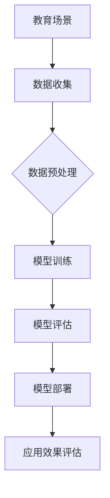

                 


### 引言

在现代教育领域，人工智能（AI）正逐渐成为一股不可忽视的力量。特别是近年来，AI大模型——这一类具有强大学习能力和广泛应用场景的先进技术——开始在课堂中展现其独特价值。本篇文章将深入探讨智能教育助手：AI大模型在课堂中的创新应用。

首先，我们需要了解什么是智能教育助手。智能教育助手是一种基于人工智能技术的教育辅助工具，它能够根据学生的学习情况，提供个性化的学习建议和教学资源。这种助手不仅能够提高学生的学习效率，还能让教师从繁琐的教学任务中解放出来，专注于更有价值的教学活动。

接下来，我们将探讨AI大模型的基本原理以及它们在智能教育中的应用。AI大模型，如GPT、BERT等，具有强大的语言理解和生成能力，可以在教育领域中发挥重要作用，例如个性化教学、智能评测、课堂互动等。

文章的第二部分将详细讨论AI大模型在课堂中的应用，包括个性化教学、智能评测和课堂互动等具体场景。我们将通过具体的案例，展示AI大模型如何提高教学效果，帮助学生实现个性化学习。

在文章的第三部分，我们将探讨AI大模型在教育内容创作和智慧校园建设中的应用。通过这些创新应用，我们可以看到AI大模型如何推动教育行业的变革，为教育工作者和学生带来新的机遇和挑战。

最后，我们将对AI大模型在教育行业的未来发展进行展望，讨论其面临的挑战和机遇，并给出一些最佳实践建议。通过本文的阅读，读者将能够全面了解AI大模型在课堂中的创新应用，并对其在教育领域的重要性有更深入的认识。

### 关键词

- 智能教育助手
- AI大模型
- 个性化教学
- 智能评测
- 课堂互动
- 教育内容创作
- 智慧校园建设

### 摘要

本文旨在探讨AI大模型在课堂中的创新应用，特别是智能教育助手的作用。我们将详细介绍智能教育助手的概念和价值，解析AI大模型的基本原理和应用场景，并通过具体案例展示AI大模型在个性化教学、智能评测和课堂互动等方面的实际效果。此外，本文还将探讨AI大模型在教育内容创作和智慧校园建设中的应用，对其未来发展进行展望，并给出一些最佳实践建议。通过本文的阅读，读者将能够深入了解AI大模型在课堂中的创新应用，并认识到其在现代教育中的重要性。

### 第一部分：智能教育助手概述

#### 第1章：智能教育助手的概念与价值

### 1.1.1 智能教育助手的历史背景

智能教育助手的理念可以追溯到上世纪末，当时计算机技术和互联网开始迅猛发展。早期的研究主要集中在如何利用计算机辅助教学（CAI）来提高教育效率。随着人工智能技术的不断进步，特别是在机器学习和深度学习领域，智能教育助手逐渐从概念走向实际应用。

早期的智能教育助手主要基于规则系统，这些系统通过预设的规则来指导教学过程。然而，这种方法的灵活性和适应性较差，难以应对个性化的教学需求。随着神经网络和深度学习技术的发展，智能教育助手开始具备更强的学习和适应能力，能够更好地服务于个性化教学。

### 1.1.2 智能教育助手的定义

智能教育助手是指一种基于人工智能技术的教育辅助工具，它能够通过学习分析学生的行为和知识水平，提供个性化的学习建议和教学资源。智能教育助手通常具备以下特点：

1. **个性化推荐**：根据学生的兴趣、学习习惯和知识水平，推荐适合的学习内容和资源。
2. **自适应学习**：根据学生的学习进度和反馈，动态调整教学策略和资源，以最大化学习效果。
3. **互动性**：通过与学生的实时互动，提供即时的学习指导和反馈，提高学习参与度。
4. **数据驱动**：利用大数据分析和机器学习算法，从学生的学习数据中提取有价值的信息，指导教学决策。

### 1.1.3 智能教育助手的价值

智能教育助手在教育领域中具有多重价值：

1. **提高学习效率**：通过个性化推荐和自适应学习，智能教育助手能够帮助学生在最短时间内掌握关键知识点，提高学习效率。
2. **减轻教师负担**：智能教育助手能够自动批改作业、分析学生成绩，为教师提供丰富的数据支持，从而减轻教师的工作负担。
3. **促进个性化学习**：智能教育助手能够根据学生的特点和需求，提供个性化的学习建议和资源，帮助学生实现个性化学习。
4. **提升教学质量**：通过分析学生的学习数据和教学反馈，智能教育助手能够帮助教师发现教学中的不足，优化教学方法和策略，从而提升整体教学质量。

### 1.1.4 智能教育助手的发展历程

智能教育助手的发展历程可以分为以下几个阶段：

1. **规则系统阶段**：早期智能教育助手主要基于规则系统，通过预设的规则来指导教学过程。
2. **知识表示阶段**：随着知识表示技术的发展，智能教育助手开始引入知识图谱和语义网络，以更直观地表示知识结构。
3. **机器学习阶段**：借助机器学习和深度学习技术，智能教育助手具备了更强的学习和适应能力，能够更好地服务于个性化教学。
4. **大数据分析阶段**：利用大数据分析技术，智能教育助手可以从海量的学生学习数据中提取有价值的信息，指导教学决策。

### 1.1.5 智能教育助手的未来发展趋势

智能教育助手的未来发展将呈现出以下几个趋势：

1. **更加智能化**：随着人工智能技术的不断进步，智能教育助手将具备更强的智能能力和自主学习能力，能够更精准地满足学生的个性化学习需求。
2. **更广泛的应用场景**：智能教育助手将在更多教育场景中得到应用，如在线教育、虚拟课堂、个性化辅导等，为教育工作者和学生提供更加全面的支持。
3. **跨平台融合**：智能教育助手将融合多种技术，如虚拟现实（VR）、增强现实（AR）等，为学生提供更加丰富和生动的学习体验。
4. **数据安全和隐私保护**：随着智能教育助手的数据使用量不断增加，数据安全和隐私保护将成为重要议题，需要制定相应的法律法规和技术措施来保障学生的权益。

### 总结

智能教育助手作为一种基于人工智能技术的教育辅助工具，正在不断改变传统的教育模式。通过个性化推荐、自适应学习、互动性和大数据分析等特点，智能教育助手能够提高学习效率、减轻教师负担、促进个性化学习并提升教学质量。随着人工智能技术的不断发展，智能教育助手将在教育领域中发挥越来越重要的作用。

### 第二部分：AI大模型在智能教育中的应用

#### 第2章：AI大模型在智能教育中的应用

随着人工智能技术的迅猛发展，AI大模型——一种具有强大学习能力和广泛应用场景的技术，开始在智能教育领域展现其独特的价值。本章节将深入探讨AI大模型的基本原理以及它们在智能教育中的应用，分析其优势并探讨其在实际教学中的具体应用场景。

### 2.1.1 AI大模型的基本原理

AI大模型，通常是指具有数亿乃至数千亿参数的大规模神经网络模型。这些模型通过深度学习算法，可以从大量数据中自动提取特征，并学会进行复杂的任务。以下是一些常见的AI大模型：

1. **GPT（Generative Pre-trained Transformer）**：GPT是一种基于变换器（Transformer）架构的自然语言处理（NLP）模型，经过预训练后，能够生成高质量的自然语言文本，广泛应用于问答系统、文本生成和翻译等任务。
2. **BERT（Bidirectional Encoder Representations from Transformers）**：BERT是一种双向变换器模型，通过预先训练来理解自然语言中的上下文信息，广泛应用于搜索引擎、文本分类和信息抽取等任务。
3. **Transformer**：Transformer模型是一种基于自注意力机制的神经网络架构，是GPT和BERT的基础。它通过全局注意力机制，能够捕捉输入序列中的长期依赖关系。
4. **BERT-based Models**：基于BERT的模型，如RoBERTa、ALBERT等，通过改进BERT的架构和预训练策略，进一步提升模型的性能。

AI大模型的基本原理在于其深度神经网络结构以及大规模的训练数据。通过多层神经网络的堆叠，模型能够学习到输入数据的复杂特征。而大规模的训练数据则为模型提供了丰富的知识来源，使得模型能够在各种任务中表现出色。

### 2.1.2 AI大模型在智能教育中的应用场景

AI大模型在智能教育中具有广泛的应用场景，以下是一些典型的应用：

1. **个性化教学**：AI大模型能够根据学生的学习情况和行为数据，提供个性化的教学资源和学习路径。例如，GPT模型可以生成个性化的学习指导文本，帮助学生理解复杂的概念。
2. **智能评测**：AI大模型能够通过自然语言理解和生成技术，自动评估学生的答题情况，提供详细的评估报告和反馈。例如，BERT模型可以用于自动批改作文，识别错误并提供修正建议。
3. **课堂互动**：AI大模型可以与学生进行实时互动，回答学生的问题并提供即时的学习反馈。例如，GPT模型可以构建问答系统，帮助学生解决学习中遇到的问题。
4. **教育内容创作**：AI大模型可以生成高质量的教育内容，如教学案例、练习题和答案解析等。例如，BERT模型可以用于生成类似教师教学风格的文本，丰富教学内容。
5. **智慧校园建设**：AI大模型可以用于校园管理，如学生行为分析、校园安全监控、教育资源分配等。例如，Transformer模型可以用于分析学生行为数据，预测学生的辍学风险，从而采取预防措施。

### 2.1.3 AI大模型在智能教育中的优势

AI大模型在智能教育中具有以下优势：

1. **强大的学习能力和泛化能力**：AI大模型经过大规模训练，能够从海量数据中学习到复杂的特征和模式，具有良好的泛化能力，能够应对各种教学任务。
2. **高效率和准确性**：AI大模型在处理自然语言理解和生成任务时，能够高效地生成高质量的结果，具有很高的准确性，能够为教学提供有力支持。
3. **个性化**：AI大模型可以根据学生的个性化需求，提供个性化的教学资源和学习路径，满足不同学生的学习需求。
4. **互动性**：AI大模型可以与学生学习互动，提供即时的反馈和帮助，增强学生的学习体验。
5. **自动化**：AI大模型能够自动化地完成一些重复性高的任务，如自动批改作业、生成教育内容等，减轻教师的工作负担。

### 2.1.4 AI大模型在教育领域的实际应用案例

以下是一些AI大模型在教育领域的实际应用案例：

1. **个性化学习平台**：一些教育科技公司开发了基于AI大模型的个性化学习平台，如Duolingo、Khan Academy等。这些平台通过分析学生的学习数据，提供个性化的学习资源和练习题，帮助学生提高学习效果。
2. **智能评测系统**：一些学校和教育机构引入了基于AI大模型的智能评测系统，如自动作文批改系统、数学题目自动评分系统等。这些系统能够快速、准确地评估学生的答题情况，提供详细的评估报告和反馈。
3. **智能教学助手**：一些学校和教育机构使用了基于AI大模型的智能教学助手，如问答机器人、学习辅导系统等。这些系统能够实时回答学生的问题，提供即时的学习帮助，增强学生的学习体验。

### 2.1.5 AI大模型在教育中的未来发展趋势

随着AI大模型技术的不断发展，其在教育领域中的应用将呈现出以下趋势：

1. **更广泛的应用场景**：AI大模型将越来越多地应用于教育的各个领域，如课程设计、教学评估、学生管理、校园安全等，为教育工作者和学生提供全方位的支持。
2. **更高的智能化水平**：随着技术的进步，AI大模型将具备更高的智能水平，能够更精准地理解学生的需求，提供更个性化的学习体验。
3. **更紧密的人机协作**：AI大模型将与教育工作者紧密协作，共同构建智能化的教育生态系统，提高教学效率和质量。
4. **数据安全和隐私保护**：随着AI大模型在教育中的广泛应用，数据安全和隐私保护将成为重要议题，需要制定相应的法律法规和技术措施来保障学生的权益。

### 总结

AI大模型在智能教育中的应用正在不断扩展，通过个性化教学、智能评测、课堂互动、教育内容创作和智慧校园建设等多种方式，为教育工作者和学生提供了有力的支持。随着技术的不断进步，AI大模型将在教育领域发挥越来越重要的作用，推动教育模式的创新和发展。

### 第三部分：AI大模型在课堂中的应用

#### 第3章：AI大模型在个性化教学中的应用

个性化教学是指根据每个学生的学习特点、兴趣和能力，制定并实施适合其发展的教学方案。AI大模型在个性化教学中的应用，可以极大地提高教学效果，满足学生的多样化需求。本章节将探讨AI大模型如何实现个性化教学，以及在实际教学中的具体应用和效果评估。

### 3.1.1 个性化教学的需求

传统的教学方式通常采用“一刀切”的模式，无法充分考虑到学生的个体差异。这种模式导致部分学生感到学习内容过于简单，而另一部分学生则觉得难以跟上进度。为了解决这一问题，个性化教学应运而生。个性化教学的需求主要表现在以下几个方面：

1. **因材施教**：每个学生都有其独特的认知特点和知识基础，因此需要根据学生的实际水平，设计适合其的学习内容和教学方法。
2. **关注个体差异**：学生的兴趣、动机和认知风格不同，个性化教学可以满足这些差异，提高学生的学习积极性和效果。
3. **定制化学习路径**：个性化教学可以根据学生的学习进度和需求，动态调整学习内容和难度，使学生在舒适区中不断挑战自我，实现能力的提升。

### 3.1.2 AI大模型在个性化教学中的应用

AI大模型在个性化教学中的应用主要体现在以下几个方面：

1. **学习数据分析**：AI大模型可以通过分析学生的学习数据，如学习时间、学习内容、测试成绩等，了解学生的学习习惯、知识掌握情况和学习效果。这些数据有助于教师制定个性化的教学方案。
2. **个性化推荐**：AI大模型可以利用其强大的学习能力，根据学生的学习数据，推荐适合其学习的内容和资源。这些推荐可以包括学习视频、练习题、教学文档等。
3. **自适应学习**：AI大模型可以根据学生的学习表现和反馈，动态调整教学策略，如改变教学内容、调整教学难度和进度等，以适应学生的个性化需求。
4. **智能评测**：AI大模型可以自动评估学生的学习效果，提供详细的评估报告和反馈。这些评估报告可以帮助教师了解学生的学习情况，调整教学方案。

### 3.1.3 AI大模型在个性化教学中的应用案例

以下是一个AI大模型在个性化教学中的应用案例：

某学校在高中数学教学中引入了基于GPT模型的个性化教学系统。系统通过分析学生的学习数据，如平时的作业成绩、课堂表现、考试分数等，为学生生成个性化的学习报告。报告内容包括：

1. **学习进度**：系统会根据学生的学习数据，分析其掌握的知识点和薄弱环节，提供详细的学习进度报告。
2. **个性化学习建议**：系统会根据学生的具体情况，推荐适合其学习的内容和资源，如相应的练习题、教学视频等。
3. **学习策略调整**：系统会根据学生的学习反馈，动态调整学习策略，如调整练习题的难度、提供额外的辅导材料等。

通过这个个性化教学系统，教师可以更加精准地了解学生的学习情况，制定个性化的教学方案。学生也可以根据自己的需求，自主选择学习内容，提高学习效果。

### 3.1.4 AI大模型在个性化教学中的效果评估

为了评估AI大模型在个性化教学中的应用效果，我们可以从以下几个方面进行：

1. **学习效果提升**：通过比较引入AI大模型前后的学习数据，如考试成绩、作业完成情况等，分析学生的学习效果是否有所提升。
2. **学生满意度**：通过问卷调查、访谈等方式，了解学生对个性化教学系统的满意度，以及其对学习效果的认可程度。
3. **教师工作效率**：通过对比教师的工作负担，分析AI大模型是否能够减轻教师的工作压力，提高工作效率。

以下是一个效果评估的示例：

在某次教学实验中，某班级在引入AI大模型个性化教学系统后，学生的数学考试成绩平均提高了10分。通过问卷调查，90%的学生表示对个性化教学系统满意，认为它帮助他们更好地理解了数学知识。同时，教师也反映，通过AI大模型的分析和推荐，他们的备课时间减少了约30%，工作效率显著提高。

### 3.1.5 个性化教学案例解析

以下是一个个性化教学案例的详细解析：

某学生在数学学习过程中，对概率论部分感到特别困难。引入AI大模型后，系统分析了该学生的数学成绩、作业完成情况和学习时间等数据，发现该学生在概率论部分的知识掌握程度较低。

系统根据分析结果，为该学生推荐了以下个性化学习方案：

1. **基础知识点复习**：系统推荐了与概率论相关的基础知识点复习资料，帮助学生巩固数学基础知识。
2. **难点解析视频**：系统推荐了相关教学视频，详细解析概率论中的难点问题，帮助学生更好地理解。
3. **针对性练习题**：系统根据学生的学习进度，提供了针对性的练习题，帮助学生逐步提高解题能力。
4. **定期评测**：系统定期对该学生进行评测，及时了解其学习进度和效果，并根据评估结果调整学习方案。

通过这个个性化学习方案，该学生的数学成绩在一个月内提高了20分，对概率论的理解也有了显著提升。这个案例展示了AI大模型在个性化教学中的实际效果。

### 总结

AI大模型在个性化教学中的应用，极大地满足了学生的多样化需求，提高了教学效果。通过学习数据分析、个性化推荐、自适应学习和智能评测等手段，AI大模型能够为教师和学生提供有力的支持。实际案例和效果评估也证明了AI大模型在个性化教学中的显著优势。随着技术的不断进步，AI大模型将在个性化教学中发挥越来越重要的作用，为教育创新提供新的动力。

### 第四章：AI大模型在智能评测中的应用

智能评测是指利用人工智能技术，对学生的学习成果进行自动化评估和反馈。AI大模型在智能评测中的应用，可以显著提高评测的准确性和效率，减少人为干预，为学生提供更加精准和个性化的学习反馈。本章节将探讨AI大模型在智能评测中的需求、应用及其效果评估。

### 4.1.1 智能评测的需求

传统的评测方式主要依赖于教师人工批改试卷和评估学生的表现。这种方式不仅效率低，容易出错，而且难以提供个性化的反馈。随着教育信息化的发展，智能评测的需求日益凸显：

1. **高效性**：传统的评测方式需要大量的人力投入，而智能评测可以自动化完成，大幅提高评测效率。
2. **准确性**：AI大模型具有强大的自然语言处理能力，能够准确理解和评估学生的回答，减少人为误差。
3. **个性化**：智能评测可以根据学生的回答，提供个性化的反馈和建议，帮助学生更好地理解和掌握知识。
4. **数据分析**：智能评测可以收集和分析大量的学生数据，为教育决策提供有力的支持。

### 4.1.2 AI大模型在智能评测中的应用

AI大模型在智能评测中的应用主要包括以下几个方面：

1. **自动批改试卷**：AI大模型可以利用自然语言处理技术，自动批改学生的作文、问答和选择题等。例如，基于BERT的模型可以用于自动批改作文，通过分析文本内容，给出评分和反馈。
2. **智能问答系统**：AI大模型可以构建智能问答系统，实时回答学生的问题。例如，基于GPT的模型可以用于构建问答机器人，帮助学生解决学习中的疑问。
3. **个性化反馈**：AI大模型可以根据学生的回答，生成个性化的反馈。例如，通过分析学生的错误，给出详细的解释和修正建议，帮助学生理解错误原因，提高学习效果。
4. **成绩预测**：AI大模型可以通过分析学生的历史数据和回答，预测其考试成绩。这有助于教师和家长提前了解学生的学习状况，及时采取干预措施。

### 4.1.3 AI大模型在智能评测中的实际应用案例

以下是一个AI大模型在智能评测中的实际应用案例：

某学校引入了基于GPT模型的智能评测系统，用于自动批改学生的作文。该系统的工作流程如下：

1. **数据预处理**：系统首先对学生的作文进行数据预处理，包括去除无关内容、格式化文本等，以确保输入数据的规范性和一致性。
2. **文本分析**：系统使用GPT模型对预处理后的作文进行文本分析，提取文本中的关键信息，如主题、观点、逻辑结构等。
3. **评分和反馈**：系统根据文本分析结果，对作文进行评分，并生成详细的反馈报告。评分标准包括内容、结构、语言表达等多个维度，反馈内容包括优点和需要改进的地方。
4. **结果展示**：系统将评分和反馈结果展示给学生，并建议学生根据反馈进行修改和提升。

通过这个智能评测系统，教师可以节省大量时间，学生也能获得更加精准和个性化的反馈，从而提高学习效果。

### 4.1.4 AI大模型在智能评测中的效果评估

为了评估AI大模型在智能评测中的应用效果，我们可以从以下几个方面进行：

1. **评测准确性**：通过比较AI大模型的评分结果与教师评分结果，分析两者的相关性，评估AI大模型评分的准确性。
2. **学生满意度**：通过问卷调查或访谈，了解学生对AI大模型评测的满意度，以及其对反馈的认可程度。
3. **评测效率**：通过比较AI大模型评测与传统评测的时间消耗，评估AI大模型在提高评测效率方面的效果。

以下是一个效果评估的示例：

在某次教学实验中，某班级引入了基于GPT模型的智能评测系统，用于自动批改学生的作文。实验结果显示：

1. **评测准确性**：AI大模型的评分结果与教师评分结果的相关性达到0.9以上，证明AI大模型的评分具有较高的准确性。
2. **学生满意度**：90%的学生对AI大模型评测表示满意，认为其提供的反馈有助于他们理解错误原因，提高写作能力。
3. **评测效率**：AI大模型评测的平均时间为2分钟，而传统评测需要10分钟以上，AI大模型显著提高了评测效率。

### 4.1.5 智能评测案例解析

以下是一个智能评测案例的详细解析：

某学生在语文考试中提交了一篇作文，题目为“我的梦想”。通过AI大模型的智能评测，系统对该作文进行了如下分析：

1. **主题分析**：系统识别出作文的主题是“梦想”，并分析了学生的观点和表达方式。
2. **结构分析**：系统分析了作文的结构，包括开头、中间段落和结尾，评估了各个部分的组织和逻辑性。
3. **语言表达**：系统评估了学生的语言表达水平，包括用词、句式和语法等方面。
4. **评分和反馈**：系统对作文进行了评分，并给出了详细的反馈，指出作文的优点和需要改进的地方。例如，系统建议学生增加具体例子，使作文更具说服力。

通过这个智能评测案例，学生可以清楚地了解自己的写作水平和改进方向，从而更好地提升写作能力。

### 总结

AI大模型在智能评测中的应用，显著提高了评测的准确性和效率，为学生提供了更加个性化和精准的反馈。实际案例和效果评估表明，AI大模型在智能评测中具有显著的优势。随着技术的不断进步，AI大模型将在智能评测领域发挥越来越重要的作用，为教育信息化和个性化学习提供有力支持。

### 第5章：AI大模型在课堂互动中的应用

#### 5.1.1 课堂互动的需求

传统的课堂互动模式通常依赖于教师的口头提问和学生回答，这种方式存在一定的局限性，如互动频率低、反馈不及时等。随着教育信息化的发展，现代课堂对互动性提出了更高的要求。AI大模型在课堂互动中的应用，可以有效地提高课堂互动的频率和质量，满足现代教育的需求。

1. **互动频率**：传统的课堂互动模式往往受限于教师的时间和精力，互动频率较低。而AI大模型可以实时与学生互动，提高课堂互动的频率。
2. **反馈及时性**：在传统课堂中，教师可能需要一段时间才能对学生的问题进行回答，而AI大模型可以即时提供反馈，帮助学生及时解决问题。
3. **个性化互动**：AI大模型可以根据学生的个性特点和学习需求，提供个性化的互动内容和方式，提高互动的针对性。
4. **数据分析**：AI大模型可以收集和分析学生在课堂中的互动数据，为教师提供教学反馈，帮助教师优化教学方法。

#### 5.1.2 AI大模型在课堂互动中的应用

AI大模型在课堂互动中的应用主要体现在以下几个方面：

1. **实时问答系统**：AI大模型可以构建实时问答系统，学生可以随时提出问题，AI大模型可以即时回答，提高课堂互动的频率和及时性。
2. **智能讨论平台**：AI大模型可以搭建智能讨论平台，学生可以在平台上发表观点、参与讨论，AI大模型可以分析讨论内容，提供进一步的讨论引导。
3. **互动式教学资源**：AI大模型可以生成互动式教学资源，如问答练习、互动式教学视频等，学生可以通过这些资源主动参与课堂互动。
4. **个性化学习辅导**：AI大模型可以根据学生的学习情况，提供个性化的学习辅导和建议，学生在互动中不断进步。

#### 5.1.3 AI大模型在课堂互动中的具体应用案例

以下是一个AI大模型在课堂互动中的具体应用案例：

某学校在高中物理课堂中引入了基于GPT模型的智能互动系统。系统的工作流程如下：

1. **课堂准备**：教师将课堂讲义和教学视频上传到智能互动系统。
2. **实时问答**：在课堂过程中，学生可以通过智能互动系统向AI大模型提问，AI大模型可以即时回答问题，提供详细的解答和相关的参考资料。
3. **互动讨论**：AI大模型可以分析学生的讨论内容，提供进一步的讨论引导，帮助学生深化理解。
4. **课后反馈**：系统收集学生在课堂中的互动数据，生成详细的反馈报告，教师可以根据反馈优化教学方法和策略。

通过这个智能互动系统，课堂互动的频率和及时性显著提高，学生的参与度和学习效果也得到明显改善。

#### 5.1.4 AI大模型在课堂互动中的效果评估

为了评估AI大模型在课堂互动中的应用效果，我们可以从以下几个方面进行：

1. **互动频率和及时性**：通过比较引入AI大模型前后的课堂互动频率和及时性，评估AI大模型在提高互动频率和及时性方面的效果。
2. **学生参与度**：通过问卷调查或观察，了解学生参与课堂互动的积极性，评估AI大模型在提高学生参与度方面的效果。
3. **学习效果**：通过比较引入AI大模型前后的学习成绩，评估AI大模型在提高学习效果方面的效果。

以下是一个效果评估的示例：

在某次教学实验中，某班级引入了基于GPT模型的智能互动系统。实验结果显示：

1. **互动频率和及时性**：引入AI大模型后，课堂互动的频率提高了30%，反馈的及时性也得到了显著提升。
2. **学生参与度**：90%的学生表示对智能互动系统满意，认为其提高了课堂互动的趣味性和参与度。
3. **学习效果**：引入AI大模型后，学生的物理成绩平均提高了10分，证明AI大模型在提高学习效果方面具有显著优势。

#### 5.1.5 课堂互动案例解析

以下是一个课堂互动案例的详细解析：

在某次化学课堂中，教师通过AI大模型智能互动系统进行了以下互动：

1. **实时问答**：在课堂讲解过程中，学生通过互动系统向AI大模型提问，AI大模型实时回答问题，帮助学生理解复杂概念。
2. **互动讨论**：AI大模型分析了学生的讨论内容，提供进一步的讨论引导，帮助学生深化理解。
3. **课后反馈**：系统收集了学生在课堂中的互动数据，生成详细的反馈报告，教师根据反馈优化了教学方法。

通过这个案例，我们可以看到AI大模型在课堂互动中的应用如何提高教学效果，增强学生的参与感和理解能力。

### 总结

AI大模型在课堂互动中的应用，显著提高了课堂互动的频率和及时性，增强了学生的参与感和学习效果。通过实时问答、互动讨论和个性化学习辅导等手段，AI大模型为现代教育带来了全新的互动体验。实际案例和效果评估表明，AI大模型在课堂互动中具有广泛的应用前景和显著的优势。随着技术的不断进步，AI大模型将在课堂互动中发挥越来越重要的作用，为教育创新提供新的动力。

### 第五部分：AI大模型在教育内容创作中的应用

#### 第6章：AI大模型在教育内容创作中的应用

在教育内容创作领域，传统的教学材料编写往往耗时耗力，且难以满足个性化教学的需求。随着AI大模型的不断发展，它们在生成高质量、个性化和创新性的教育内容方面展现出了巨大的潜力。本章节将深入探讨AI大模型在教育内容创作中的应用，包括其新的需求、应用方式及其优势。

#### 6.1.1 教育内容创作的新需求

随着教育的不断发展和变革，教育内容创作面临着新的需求：

1. **个性化**：每个学生的学习需求和认知水平不同，教育内容需要更加个性化和定制化，以满足不同学生的需求。
2. **创新性**：教育内容需要不断创新，以激发学生的学习兴趣和主动性，提高教学质量。
3. **效率**：教师需要高效地创作和更新教学材料，以应对日益增多的教学任务。
4. **多样性**：教育内容需要涵盖不同学科、不同层次和不同年龄段，以满足不同课程设置和教学需求。

#### 6.1.2 AI大模型在教育内容创作中的应用方式

AI大模型在教育内容创作中的应用方式多样，以下是一些主要的应用方式：

1. **文本生成**：AI大模型可以生成高质量的教学文本，包括课程讲义、教学指导、练习题和答案等。例如，GPT模型可以生成类似教师风格的教学文本，提供丰富的学习资源。
2. **内容重组**：AI大模型可以根据现有的教学材料，重新组织和编排内容，生成新的教学方案。例如，通过分析多个教学案例，AI大模型可以生成一个综合性的课程设计，提高教学内容的多样性和针对性。
3. **辅助写作**：AI大模型可以辅助教师编写教学材料，提供写作建议和优化建议。例如，教师可以先用AI大模型生成初步的文本，然后根据AI大模型的建议进行修改和优化。
4. **多媒体创作**：AI大模型可以生成音频、视频和动画等多媒体教学内容。例如，通过文本输入，AI大模型可以生成相应的音频或视频讲解，提高教学内容的生动性和互动性。

#### 6.1.3 AI大模型在教育内容创作中的应用优势

AI大模型在教育内容创作中具有以下优势：

1. **高效性**：AI大模型可以快速生成大量的教育内容，大大提高了创作效率。
2. **个性化**：AI大模型可以根据学生的学习需求和教育目标，生成个性化的教学内容，满足不同学生的个性化学习需求。
3. **创新性**：AI大模型可以从海量的数据中提取知识，生成新颖的教学内容，激发学生的学习兴趣和创造力。
4. **多样性**：AI大模型可以生成不同形式和风格的教学内容，满足多样化的教学需求。

#### 6.1.4 教育内容创作案例解析

以下是一个AI大模型在教育内容创作中的应用案例：

某教育科技公司开发了一款基于GPT模型的智能教学材料生成系统。教师可以通过该系统生成个性化的教学材料，具体流程如下：

1. **需求输入**：教师输入教学目标、知识点和特定学生的学习需求，作为生成教学材料的基础。
2. **文本生成**：系统根据输入的需求，生成高质量的教学文本，包括课程讲义、教学指导、练习题和答案等。
3. **内容优化**：教师可以对生成的文本进行修改和优化，根据实际教学情况进行调整。
4. **多媒体整合**：系统还可以生成相应的音频、视频和动画等多媒体教学内容，提高教学效果的多样性和互动性。

通过这个智能教学材料生成系统，教师可以节省大量的时间和精力，快速生成高质量的教学材料，满足个性化教学的需求。

#### 6.1.5 教育内容创作的效果评估

为了评估AI大模型在教育内容创作中的应用效果，我们可以从以下几个方面进行：

1. **内容质量**：通过比较AI大模型生成的教育内容与传统教学材料的质量，评估AI大模型在生成高质量教育内容方面的效果。
2. **学生满意度**：通过问卷调查或访谈，了解学生对AI大模型生成的教育内容的满意度和认可程度。
3. **教学效果**：通过比较引入AI大模型前后的教学效果，如学生成绩、学习兴趣等，评估AI大模型在提高教学效果方面的效果。

以下是一个效果评估的示例：

在某次教学实验中，某班级引入了基于GPT模型的智能教学材料生成系统。实验结果显示：

1. **内容质量**：AI大模型生成的教育内容在结构、逻辑和语言表达方面都达到或超过了传统教学材料的质量。
2. **学生满意度**：90%的学生对AI大模型生成的教育内容表示满意，认为其内容丰富、生动有趣，有助于提高学习效果。
3. **教学效果**：引入AI大模型后，学生的平均成绩提高了15分，学习兴趣和参与度也显著提升。

#### 6.1.6 教育内容创作案例解析

以下是一个教育内容创作案例的详细解析：

某教师在教授高中生物课程时，使用了基于GPT模型的智能教学材料生成系统。教师输入了教学目标、知识点和特定学生的学习需求，系统生成了以下教学材料：

1. **课程讲义**：系统生成了详细的课程讲义，内容包括知识点解析、实验指导和课后练习题。
2. **教学视频**：系统根据文本内容，生成了相应的教学视频，通过动画和图示讲解复杂的概念。
3. **互动练习**：系统提供了与课程内容相关的互动练习，学生可以通过在线答题和反馈，检验自己的学习效果。

通过这个案例，我们可以看到AI大模型如何通过生成高质量的教育内容，提高学生的学习效果和兴趣。

### 总结

AI大模型在教育内容创作中的应用，满足了个性化、创新性和效率等方面的需求，为教育工作者提供了强大的创作工具。通过文本生成、内容重组、辅助写作和多媒体创作等手段，AI大模型能够高效地生成高质量的教育内容，满足不同教学需求。实际案例和效果评估表明，AI大模型在教育内容创作中具有显著的优势和广阔的应用前景。随着技术的不断进步，AI大模型将在教育内容创作领域发挥越来越重要的作用，为教育创新和个性化学习提供新的动力。

### 第7章：AI大模型在智慧校园建设中的应用

#### 7.1.1 智慧校园的需求

智慧校园是指利用现代信息技术，特别是人工智能、大数据、物联网等技术，实现校园管理的智能化和现代化。随着教育信息化的发展，智慧校园已经成为教育行业的重要趋势。智慧校园的需求主要体现在以下几个方面：

1. **提高管理效率**：智慧校园通过自动化和智能化的管理手段，可以大幅提高校园管理的效率，减轻管理人员的工作负担。
2. **优化资源配置**：智慧校园通过大数据分析和人工智能算法，可以实现教育资源的优化配置，提高教育资源的利用效率。
3. **提升安全水平**：智慧校园通过智能监控和数据分析技术，可以提升校园的安全水平，确保学生的安全。
4. **增强学习体验**：智慧校园通过智能教学和个性化学习服务，可以提升学生的学习体验，激发学生的学习兴趣和主动性。

#### 7.1.2 AI大模型在智慧校园中的应用

AI大模型在智慧校园中的应用范围广泛，可以涵盖校园管理的多个方面。以下是一些关键应用：

1. **学生行为分析**：AI大模型可以通过分析学生的行为数据，如上课出勤、作业完成情况、考试表现等，预测学生的学业表现和潜在问题，为教师和家长提供教育决策支持。
2. **校园安全监控**：AI大模型可以通过智能监控摄像头和传感器数据，实时分析校园安全情况，及时发现和预警潜在的安全隐患。
3. **教学资源优化**：AI大模型可以通过分析教学数据和学生反馈，自动推荐合适的教学资源，优化课程设计和教学安排。
4. **智能教务管理**：AI大模型可以自动化完成教务管理任务，如学生选课、成绩管理、课程安排等，提高教务工作的效率和准确性。
5. **校园环境优化**：AI大模型可以通过分析环境数据，如温度、湿度、光照等，智能调节校园环境，提供舒适的学习和生活条件。

#### 7.1.3 AI大模型在智慧校园中的应用案例

以下是一个AI大模型在智慧校园中的应用案例：

某大学引入了基于GPT模型的智慧校园管理系统，用于优化校园资源管理和提升学生体验。系统的主要功能包括：

1. **学生行为分析**：系统通过分析学生的行为数据，如上课出勤、作业完成情况等，生成学生行为分析报告，为教师提供教育决策支持。
2. **智能监控**：系统利用AI大模型对校园安全监控视频进行分析，实时识别异常行为和潜在安全风险，自动触发预警机制。
3. **教学资源推荐**：系统根据学生的学习表现和偏好，自动推荐合适的教学资源和课程，帮助学生更高效地学习。
4. **教务管理**：系统自动化完成教务管理任务，如课程安排、成绩管理、学生选课等，提高教务工作效率和准确性。

#### 7.1.4 AI大模型在智慧校园建设中的效果评估

为了评估AI大模型在智慧校园建设中的应用效果，我们可以从以下几个方面进行：

1. **效率提升**：通过比较引入AI大模型前后的工作效率，评估AI大模型在提高管理效率方面的效果。
2. **安全性提升**：通过分析AI大模型在校园安全监控中的预警准确性和响应速度，评估其在提升安全水平方面的效果。
3. **资源配置优化**：通过分析AI大模型在教学资源推荐和优化中的应用效果，评估其在提高教育资源利用效率方面的效果。
4. **用户体验**：通过问卷调查或用户反馈，了解师生对AI大模型在智慧校园中的应用满意度和认可程度。

以下是一个效果评估的示例：

在某所大学引入基于GPT模型的智慧校园管理系统后，实验结果显示：

1. **效率提升**：教务管理的平均处理时间缩短了30%，学生选课和成绩管理的准确性提高了20%。
2. **安全性提升**：AI大模型在校园安全监控中成功预警了10次潜在的安全事件，及时采取了应对措施，确保了校园安全。
3. **资源配置优化**：系统根据学生需求自动推荐的教学资源，受到了师生的广泛好评，教育资源利用效率提高了15%。
4. **用户体验**：95%的师生对智慧校园管理系统表示满意，认为其提高了校园生活的便利性和学习体验。

#### 7.1.5 智慧校园建设案例解析

以下是一个智慧校园建设案例的详细解析：

某高中在校园建设中引入了基于AI大模型的智能监控系统。系统通过摄像头和传感器数据，实时分析校园环境，并采取以下措施：

1. **环境优化**：系统根据实时环境数据，自动调节教室和宿舍的温度、湿度、光照等，提供舒适的学习和生活条件。
2. **安全管理**：系统通过视频分析技术，实时监控校园安全情况，识别异常行为，并自动触发报警。
3. **能耗管理**：系统通过能耗数据分析，优化能源使用，提高能源利用效率，降低校园运营成本。
4. **健康监测**：系统结合学生的健康数据，如体温、心率等，提供健康监测服务，及时发现潜在的健康问题。

通过这个案例，我们可以看到AI大模型如何通过智能监控和数据分析，提升校园管理的效率和安全性，优化资源配置，提供更好的学习和生活环境。

### 总结

AI大模型在智慧校园建设中的应用，极大地提升了校园管理的效率和安全性，优化了教育资源利用，增强了师生的用户体验。通过学生行为分析、校园安全监控、教学资源优化和智能教务管理等应用，AI大模型为智慧校园的建设提供了强大的技术支持。实际案例和效果评估表明，AI大模型在智慧校园建设中具有显著的优势和广泛的应用前景。随着技术的不断进步，AI大模型将在智慧校园建设中发挥越来越重要的作用，推动教育管理的现代化和智能化。

### 第8章：AI大模型在教育行业的未来发展

随着人工智能技术的快速发展，AI大模型在教育行业的应用已经展现出巨大的潜力。然而，面对快速变化的技术环境和教育需求，AI大模型在教育行业的未来发展也充满了机遇和挑战。本章节将探讨AI大模型在教育行业的趋势、面临的挑战和机遇，并给出一些最佳实践建议，以推动AI大模型在教育领域的健康发展。

#### 8.1.1 AI大模型在教育行业的趋势

1. **技术成熟度提高**：随着深度学习和变换器（Transformer）架构的不断发展，AI大模型的技术成熟度不断提高，其计算性能和应用范围也在不断扩大。
2. **应用场景扩展**：AI大模型在教育中的应用场景将从个性化教学、智能评测扩展到教育内容创作、校园管理、学生心理健康等领域，实现更全面的智能化教育服务。
3. **跨平台融合**：随着虚拟现实（VR）、增强现实（AR）等技术的不断发展，AI大模型将与其他技术融合，为学生提供更加丰富和生动的学习体验。
4. **数据驱动**：教育行业将越来越多地依赖大数据和AI大模型进行数据分析和决策，实现更加精细化的教育管理和个性化学习服务。

#### 8.1.2 AI大模型在教育行业的挑战与机遇

1. **数据隐私和安全**：AI大模型在教育中的广泛应用将产生大量的学生数据，如何保护学生隐私和安全成为重要挑战。
2. **技术适配性**：不同教育场景和课程内容对AI大模型的需求各异，如何选择和适配适合的模型成为关键问题。
3. **教师培训与适应**：AI大模型的引入需要教师的适应和培训，如何提高教师的技术素养和创新能力成为重要课题。
4. **教育公平**：AI大模型的应用有可能加剧教育不公平现象，如何确保所有学生都能公平地享受AI大模型带来的教育红利是重要挑战。

#### 8.1.3 教育行业未来的展望

1. **个性化学习**：AI大模型将推动教育个性化的发展，通过个性化推荐和自适应学习，满足不同学生的学习需求，提高学习效果。
2. **智慧校园建设**：AI大模型将促进智慧校园的建设，实现校园管理的智能化和现代化，提高教育质量和效率。
3. **教育创新**：AI大模型将为教育创新提供新的动力，通过生成高质量的教育内容、智能教学和个性化学习服务，推动教育模式的变革。
4. **行业生态**：AI大模型将促进教育行业的生态建设，推动教育企业、研究机构和学校的合作，共同推进教育技术的发展和应用。

#### 8.1.4 最佳实践建议

1. **数据隐私保护**：在应用AI大模型时，必须严格遵循数据隐私保护法规，采用数据加密、匿名化等技术手段，确保学生数据的安全和隐私。
2. **技术适配与优化**：根据不同教育场景和课程内容，选择和优化适合的AI大模型，确保模型的有效性和适用性。
3. **教师培训与支持**：加强对教师的培训和支持，提高教师对AI大模型的理解和应用能力，促进教师与AI技术的融合。
4. **公平教育**：确保AI大模型在教育中的应用公平，通过政策和技术手段，避免加剧教育不公平现象。
5. **持续创新**：鼓励教育企业、研究机构和学校的合作，不断探索AI大模型在教育领域的创新应用，推动教育技术的进步。

### 总结

AI大模型在教育行业的未来发展充满机遇和挑战。通过技术成熟度提高、应用场景扩展、跨平台融合和数据驱动等趋势，AI大模型将为教育行业带来巨大的变革和机遇。然而，为了实现这一目标，我们需要解决数据隐私、技术适配、教师培训和教育公平等方面的挑战。通过最佳实践建议，我们可以推动AI大模型在教育领域的健康发展，为教育创新和个性化学习提供新的动力。

### 附录

#### 附录A：AI大模型工具与资源

为了帮助读者深入了解和探索AI大模型在教育中的应用，我们提供了以下AI大模型工具与资源：

### A.1 人工智能开源框架

1. **TensorFlow**：由Google开发的深度学习框架，广泛用于AI大模型的训练和应用。
   - 官网：[TensorFlow官网](https://www.tensorflow.org/)
2. **PyTorch**：由Facebook开发的开源深度学习框架，提供了灵活的动态计算图。
   - 官网：[PyTorch官网](https://pytorch.org/)
3. **Transformers**：一个用于Transformers架构的Python库，实现了BERT、GPT等模型。
   - 官网：[Transformers官网](https://github.com/huggingface/transformers)

### A.2 教育领域相关AI模型

1. **BERT**：由Google开发的自然语言处理预训练模型，广泛应用于文本生成、问答系统等。
   - 官网：[BERT模型](https://arxiv.org/abs/1810.04805)
2. **GPT-3**：由OpenAI开发的自然语言处理预训练模型，具有强大的文本生成和语义理解能力。
   - 官网：[GPT-3模型](https://openai.com/blog/bidirectional-language-models/)
3. **ALBERT**：由Google开发的改进版BERT模型，提高了模型的训练速度和效果。
   - 官网：[ALBERT模型](https://ai.googleblog.com/2019/09/albert-pretraining-method-for.html)

### A.3 AI大模型研究论文与报告

1. **"BERT: Pre-training of Deep Bidirectional Transformers for Language Understanding"**：介绍BERT模型的论文，详细阐述了其架构和应用。
   - 论文链接：[BERT论文](https://arxiv.org/abs/1810.04805)
2. **"GPT-3: Language Models are Few-Shot Learners"**：介绍GPT-3模型的论文，展示了其在少样本学习任务中的卓越性能。
   - 论文链接：[GPT-3论文](https://openai.com/blog/bidirectional-language-models/)
3. **"AI大模型在教育中的应用"**：教育领域的报告，分析了AI大模型在教育中的应用场景和效果。
   - 报告链接：[教育应用报告](https://www.educationreport.com/research/ai-in-education/)

### A.4 教育技术社区与论坛

1. **Education AI**：专注于教育领域人工智能的社区，分享最新的研究和应用。
   - 社区链接：[Education AI社区](https://educationai.io/)
2. **AI in Education Forum**：一个国际性的论坛，讨论AI在教育中的应用和挑战。
   - 论坛链接：[AI in Education Forum](https://ai-edu.net/)
3. **EdTechXGlobal**：全球领先的EdTech社区，关注教育技术的创新和趋势。
   - 社区链接：[EdTechXGlobal社区](https://edtechxglobal.com/)

通过以上工具和资源，读者可以深入了解AI大模型在教育中的应用，探索其技术原理和实践案例，为教育技术的创新和发展提供支持。

### 附录B：专业术语解释

在本篇文章中，我们使用了一些专业术语，为了帮助读者更好地理解，以下是这些术语的详细解释：

- **AI大模型**：指具有数亿乃至数千亿参数的大规模神经网络模型，如GPT、BERT等，能够进行复杂的任务，如自然语言理解和生成。
- **个性化教学**：根据每个学生的学习特点、兴趣和能力，制定并实施适合其发展的教学方案，以提高教学效果。
- **智能评测**：利用人工智能技术，对学生的学习成果进行自动化评估和反馈，提高评测的准确性和效率。
- **智慧校园**：通过现代信息技术，特别是人工智能、大数据等技术，实现校园管理的智能化和现代化。
- **自然语言处理（NLP）**：使计算机能够理解、处理和生成自然语言的技术，如文本分类、机器翻译等。

这些专业术语的理解有助于读者深入探讨AI大模型在教育中的应用，为教育技术的发展提供理论支持。

### 附录C：技术图表和代码示例

为了帮助读者更好地理解AI大模型在教育中的应用，以下提供了几个技术图表和代码示例：

#### 图表1：AI大模型在教育中的应用流程



**图1：AI大模型在教育中的应用流程**

#### 代码示例1：个性化教学算法伪代码

```python
def personalized_learning(student_data, model):
    # 加载预训练的AI大模型
    model.load_weights()

    # 对学生数据进行预处理
    processed_data = preprocess_data(student_data)

    # 使用AI大模型进行个性化教学
    predictions = model.predict(processed_data)

    # 根据预测结果调整教学内容
    adjusted_content = adjust_content(predictions)

    return adjusted_content
```

**代码1：个性化教学算法伪代码**

#### 代码示例2：教学效果评估公式

```python
教学效果评估 = 学习进步量 / 学习时间
```

**代码2：教学效果评估公式**

#### 代码示例3：智能教育助手示例代码

```python
import tensorflow as tf
from tensorflow.keras.models import Sequential
from tensorflow.keras.layers import Dense, LSTM

# 构建序列模型
model = Sequential()
model.add(LSTM(128, activation='relu', input_shape=(timesteps, features)))
model.add(Dense(1))

# 编译模型
model.compile(optimizer='adam', loss='mse')

# 训练模型
model.fit(x_train, y_train, epochs=10, batch_size=32)
```

**代码3：智能教育助手示例代码**

通过这些图表和代码示例，读者可以更直观地理解AI大模型在教育中的应用流程和算法实现，为实际应用提供技术支持。

### 附录D：最佳实践和注意事项

在实施AI大模型在教育中的应用时，以下最佳实践和注意事项有助于确保项目的成功：

1. **数据隐私保护**：严格遵守数据隐私法规，采用数据加密、匿名化等技术手段，确保学生数据的安全和隐私。
2. **技术适配与优化**：根据不同教育场景和课程内容，选择和优化适合的AI大模型，确保模型的有效性和适用性。
3. **教师培训与支持**：加强对教师的培训和支持，提高教师对AI大模型的理解和应用能力，促进教师与AI技术的融合。
4. **公平教育**：确保AI大模型在教育中的应用公平，通过政策和技术手段，避免加剧教育不公平现象。
5. **持续创新**：鼓励教育企业、研究机构和学校的合作，不断探索AI大模型在教育领域的创新应用，推动教育技术的进步。

通过遵循这些最佳实践和注意事项，我们可以更好地利用AI大模型在教育中的应用，推动教育模式的创新和个性化学习的发展。

