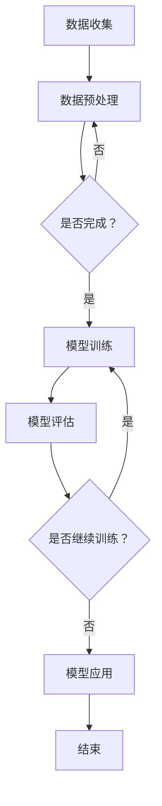

                 

### 文章标题

《智能文本生成：AI大模型在自动写作中的应用》

关键词：智能文本生成，AI大模型，自动写作，自然语言处理，深度学习，生成式模型，判别式模型，序列模型，注意力机制，Transformer模型

摘要：本文深入探讨了智能文本生成技术，重点分析了AI大模型在自动写作中的应用。通过对AI大模型的发展背景、核心概念、主要类型及其应用前景的详细介绍，本文为读者构建了一个全面的技术框架。接着，文章重点阐述了自然语言处理基础，包括语言模型的基本原理、词嵌入技术、序列模型与注意力机制，以及编译器架构。在此基础上，本文详细解析了智能文本生成的原理，包括生成式模型与判别式模型，以及深度学习模型在智能文本生成中的应用。随后，文章介绍了智能文本生成的算法与实现，包括语言模型训练、文本生成算法及其优化。随后，本文通过具体的自动写作案例，展示了AI大模型在自动写作中的应用效果。最后，文章讨论了智能文本生成系统的开发与部署，以及性能评估与优化方法。本文旨在为从事智能文本生成领域的研究者提供有价值的参考和指导。### 《智能文本生成：AI大模型在自动写作中的应用》目录大纲

# 第一部分: AI大模型基础

## 第1章: AI大模型概述

### 1.1 AI大模型的发展背景

#### 1.1.1 人工智能的发展历程

#### 1.1.2 大模型的出现及其意义

### 1.2 AI大模型的核心概念

#### 1.2.1 AI大模型的定义

#### 1.2.2 AI大模型的特点

### 1.3 AI大模型的主要类型

#### 1.3.1 语言模型

#### 1.3.2 视觉模型

#### 1.3.3 其他类型模型

### 1.4 AI大模型的应用前景

#### 1.4.1 自动写作

#### 1.4.2 智能客服

#### 1.4.3 娱乐内容生成

## 第2章: 自然语言处理基础

### 2.1 语言模型的基本原理

#### 2.1.1 语言模型的目标

#### 2.1.2 语言模型的主要类型

### 2.2 词嵌入技术

#### 2.2.1 词嵌入的作用

#### 2.2.2 词嵌入的主要方法

### 2.3 序列模型与注意力机制

#### 2.3.1 RNN与LSTM

#### 2.3.2 注意力机制

### 2.4 编译器架构

#### 2.4.1 编译器的基本概念

#### 2.4.2 编译器的组成结构

## 第二部分: 智能文本生成技术

## 第3章: 智能文本生成的原理

### 3.1 智能文本生成的基本概念

#### 3.1.1 智能文本生成的定义

#### 3.1.2 智能文本生成的分类

### 3.2 生成式模型与判别式模型

#### 3.2.1 生成式模型

#### 3.2.2 判别式模型

### 3.3 深度学习模型在智能文本生成中的应用

#### 3.3.1 序列到序列模型

#### 3.3.2 自回归模型

#### 3.3.3 Transformer模型

## 第4章: 智能文本生成的算法与实现

### 4.1 语言模型训练

#### 4.1.1 数据准备

#### 4.1.2 模型选择

#### 4.1.3 模型训练

### 4.2 文本生成算法

#### 4.2.1 生成式文本生成算法

#### 4.2.2 判别式文本生成算法

### 4.3 文本生成算法的优化

#### 4.3.1 采样技巧

#### 4.3.2 生成模型优化方法

## 第5章: AI大模型在自动写作中的应用

### 5.1 自动写作的基本流程

#### 5.1.1 文本输入处理

#### 5.1.2 文本生成

#### 5.1.3 文本输出处理

### 5.2 自动写作案例研究

#### 5.2.1 案例一：文章摘要生成

#### 5.2.2 案例二：新闻文章生成

#### 5.2.3 案例三：小说生成

## 第6章: 智能文本生成系统的开发与部署

### 6.1 系统设计

#### 6.1.1 系统架构

#### 6.1.2 功能模块划分

### 6.2 开发环境搭建

#### 6.2.1 硬件环境

#### 6.2.2 软件环境

### 6.3 源代码实现

#### 6.3.1 语言模型实现

#### 6.3.2 文本生成算法实现

### 6.4 系统部署

#### 6.4.1 部署方案

#### 6.4.2 部署流程

## 第7章: 智能文本生成系统的性能评估与优化

### 7.1 性能评估指标

#### 7.1.1 评估指标的定义

#### 7.1.2 常用评估指标

### 7.2 性能优化方法

#### 7.2.1 模型优化

#### 7.2.2 代码优化

#### 7.2.3 系统优化

## 附录

### 附录 A: 智能文本生成相关资源

#### A.1 开源代码和工具

#### A.2 学习资料和书籍推荐

#### A.3 论文和报告精选

### 附录 B: Mermaid 流程图示例

#### B.1 语言模型训练流程

#### B.2 文本生成算法优化流程

### 附录 C: 数学模型和公式

#### C.1 语言模型中的概率计算

$$ P(w_t | w_{t-1}, ..., w_1) = \frac{P(w_t, w_{t-1}, ..., w_1)}{P(w_{t-1}, ..., w_1)} $$

#### C.2 注意力机制的公式

$$ \alpha_{t,i} = \frac{e^{s_{t,i}}}{\sum_{j=1}^{N} e^{s_{t,j}} $$

### 附录 D

### 第一部分: AI大模型基础

## 第1章: AI大模型概述

### 1.1 AI大模型的发展背景

#### 1.1.1 人工智能的发展历程

人工智能（Artificial Intelligence, AI）作为计算机科学的一个分支，自20世纪50年代诞生以来，经历了多个发展阶段。早期的人工智能以规则系统为主，试图通过编写一系列规则来实现智能行为。然而，由于规则系统的局限性，这种方法在处理复杂任务时效果不佳。随着计算能力的提升和数据量的增加，机器学习开始成为人工智能研究的主流方法。

机器学习分为监督学习、无监督学习和强化学习。监督学习通过已标记的数据训练模型，使其能够对未知数据进行预测；无监督学习则从未标记的数据中自动发现规律；强化学习则通过试错来学习如何在特定环境中做出最优决策。随着深度学习的出现，人工智能迎来了新的发展高峰。深度学习是一种基于多层神经网络的学习方法，通过模拟人脑的神经元连接结构，能够自动提取数据中的复杂特征，实现高度自动化的智能行为。

#### 1.1.2 大模型的出现及其意义

大模型（Large Models）是指参数数量非常庞大的神经网络模型，通常包含数十亿甚至数千亿个参数。大模型的出现是人工智能领域的一项重要突破，它使得计算机能够在更复杂的任务上表现出色。大模型通常基于深度学习框架，如GPT（Generative Pre-trained Transformer）、BERT（Bidirectional Encoder Representations from Transformers）等，它们通过在海量数据上进行预训练，获得了强大的语义理解和生成能力。

大模型的出现具有重要的意义：首先，它们能够处理更复杂的任务，如自然语言生成、图像识别、语音识别等；其次，大模型通过预训练能够快速适应新的任务，减少了模型训练的时间和成本；最后，大模型的性能提升带动了人工智能技术的整体进步，推动了AI在各个领域的应用。

### 1.2 AI大模型的核心概念

#### 1.2.1 AI大模型的定义

AI大模型是指那些参数数量巨大，能够通过深度学习技术在大量数据上进行训练的神经网络模型。这些模型通常包含数十亿到数千亿的参数，例如GPT-3拥有1750亿个参数。大模型的特点是能够通过复杂的神经网络结构自动提取数据中的高层次特征，从而实现强大的学习能力和泛化能力。

#### 1.2.2 AI大模型的特点

1. **参数数量庞大**：大模型通常拥有数十亿甚至数千亿个参数，这使得它们能够处理大量的数据和复杂的任务。
2. **强大的学习能力**：大模型通过在海量数据上进行预训练，能够自动提取数据中的复杂特征，从而在多种任务上表现出色。
3. **泛化能力强**：由于大模型能够在多种任务上表现出色，它们具有良好的泛化能力，能够在新的任务上快速适应。
4. **高效的计算能力**：随着硬件技术的发展，GPU和TPU等专用硬件使得大模型的训练和推理速度大大提升。
5. **能耗需求高**：大模型的训练和推理过程需要大量的计算资源，这对能耗提出了较高的要求。

### 1.3 AI大模型的主要类型

AI大模型可以按照其应用领域和功能特点进行分类，主要包括以下几种类型：

#### 1.3.1 语言模型

语言模型是一种用于处理自然语言文本的AI大模型，它能够预测下一个单词或字符，并生成连贯的文本。常见的语言模型包括GPT（Generative Pre-trained Transformer）、BERT（Bidirectional Encoder Representations from Transformers）等。语言模型在自动写作、机器翻译、问答系统等领域有广泛的应用。

#### 1.3.2 视觉模型

视觉模型主要用于处理图像和视频数据，它们能够识别图像中的对象、场景和动作，并生成相应的描述。常见的视觉模型包括ResNet、VGG、BERT-ViT等。视觉模型在图像识别、物体检测、视频分析等领域有重要应用。

#### 1.3.3 其他类型模型

除了语言模型和视觉模型，AI大模型还包括其他类型，如语音模型、推荐模型等。语音模型用于处理语音数据，能够实现语音识别和语音合成。推荐模型则用于根据用户的偏好和历史行为生成个性化的推荐。

### 1.4 AI大模型的应用前景

AI大模型在多个领域展现了广阔的应用前景，以下是一些典型应用：

#### 1.4.1 自动写作

自动写作是AI大模型的重要应用之一。通过预训练的语言模型，AI可以自动生成文章、摘要、新闻、故事等。例如，GPT-3能够生成高质量的文章，极大地提高了内容生成的效率。

#### 1.4.2 智能客服

智能客服利用AI大模型实现自动化的客户服务。通过语言模型和对话管理技术，AI能够理解用户的问题，并生成恰当的回答，提供高效、个性化的服务。

#### 1.4.3 娱乐内容生成

AI大模型在娱乐内容生成方面也有广泛应用，如自动生成音乐、电影剧本、小说等。这些内容能够根据用户偏好进行个性化生成，提供丰富的娱乐体验。

#### 1.4.4 医疗健康

AI大模型在医疗健康领域也有重要应用，如辅助诊断、药物研发、健康咨询等。通过分析大量的医疗数据和文献，AI能够提供准确、高效的医疗服务。

#### 1.4.5 教育

在教育领域，AI大模型可以自动生成教学材料、个性化作业和评估方案，帮助学生更有效地学习。

#### 1.4.6 金融

在金融领域，AI大模型可以用于风险管理、市场预测、信用评估等，帮助金融机构做出更明智的决策。

总之，AI大模型的应用前景非常广阔，它们正在深刻改变我们的生活方式和各行各业的生产方式。随着技术的不断进步，AI大模型将在更多领域发挥重要作用。## 第2章: 自然语言处理基础

### 2.1 语言模型的基本原理

语言模型（Language Model, LM）是自然语言处理（Natural Language Processing, NLP）中的一个核心组件，它用于预测自然语言中的下一个单词或字符。语言模型的目的是通过学习大量的文本数据，理解语言的统计规律，从而能够生成或理解自然的语言文本。

#### 2.1.1 语言模型的目标

语言模型的主要目标有两个：

1. **生成文本**：通过输入一个单词或短语的序列，语言模型能够预测下一个单词或字符，并生成完整的句子或段落。
2. **理解文本**：语言模型可以用于文本分类、实体识别、语义分析等任务，从而理解文本的内容和结构。

#### 2.1.2 语言模型的主要类型

语言模型可以分为以下几种主要类型：

1. **基于规则的模型**：这类模型通过定义一组规则来生成文本，如语法分析器和句法规则。这类模型在处理简单任务时较为有效，但在处理复杂语言时效果不佳。
2. **统计模型**：统计模型通过学习大量文本数据中的统计规律来生成文本。这类模型主要包括N元语法模型，它们使用前n个单词或字符的序列来预测下一个单词或字符。
3. **神经网络模型**：神经网络模型，特别是深度学习模型，如循环神经网络（RNN）、长短期记忆网络（LSTM）和Transformer，通过学习大量的文本数据，自动提取语言的特征，生成高质量的文本。

### 2.2 词嵌入技术

词嵌入（Word Embedding）是将单词映射到高维向量空间的技术，它通过向量表示来捕捉单词的语义和语法关系。词嵌入在NLP中具有重要意义，因为它能够将抽象的文本数据转化为可计算的向量表示，从而在深度学习模型中应用。

#### 2.2.1 词嵌入的作用

词嵌入的主要作用包括：

1. **表示语义**：词嵌入将单词映射到高维向量空间，使得相似的单词在向量空间中靠近，从而能够表示单词的语义关系。
2. **文本表示**：词嵌入可以将整个句子或文档转化为向量表示，这样就可以利用向量运算来处理文本数据。
3. **提高模型性能**：词嵌入使得神经网络模型能够更好地理解单词之间的关系，从而提高模型的性能。

#### 2.2.2 词嵌入的主要方法

词嵌入的主要方法包括：

1. **基于频次的模型**：如TF-IDF（Term Frequency-Inverse Document Frequency），它通过词频和逆文档频率来表示单词的重要性。
2. **基于分布的模型**：如Word2Vec，它通过神经网络模型来学习单词的向量表示，Word2Vec包括CBOW（Continuous Bag of Words）和Skip-Gram两种模型。
3. **基于语义的模型**：如GloVe（Global Vectors for Word Representation），它通过优化词向量空间中的相似性来学习单词的向量表示。
4. **基于神经网络的模型**：如BERT（Bidirectional Encoder Representations from Transformers），它使用Transformer架构来学习单词的向量表示，同时能够捕捉单词的前后文关系。

### 2.3 序列模型与注意力机制

序列模型（Sequence Model）是一类用于处理序列数据（如文本、时间序列数据）的深度学习模型。序列模型能够捕捉序列中各个元素之间的关系，从而对序列数据进行建模。

#### 2.3.1 RNN与LSTM

循环神经网络（Recurrent Neural Network, RNN）是一种能够处理序列数据的神经网络模型。RNN通过重复的神经网络单元来处理序列中的每个元素，并保留序列的历史信息。然而，传统的RNN存在梯度消失和梯度爆炸问题，导致其训练效果不佳。

为了解决这些问题，长短期记忆网络（Long Short-Term Memory, LSTM）被提出。LSTM通过引入记忆单元和门控机制，能够有效地捕捉长距离依赖关系，从而在处理序列数据时表现出色。

#### 2.3.2 注意力机制

注意力机制（Attention Mechanism）是一种用于提高神经网络模型在序列数据处理中性能的技术。注意力机制通过动态地分配不同的权重来关注序列中的不同部分，从而提高模型的建模能力。

在自然语言处理中，注意力机制被广泛应用于机器翻译、文本摘要、问答系统等任务。注意力机制的核心思想是通过计算输入序列和隐藏状态之间的相似性，为序列中的每个元素分配一个权重，从而在生成过程中关注重要的部分。

#### 2.3.3 注意力机制的公式

注意力机制的公式如下：

$$
\alpha_{t,i} = \frac{e^{s_{t,i}}}{\sum_{j=1}^{N} e^{s_{t,j}}
$$

其中，$\alpha_{t,i}$ 表示在时间步 $t$ 对输入序列中第 $i$ 个元素的注意力权重，$s_{t,i}$ 表示输入序列和隐藏状态之间的相似性分数。

### 2.4 编译器架构

编译器架构（Compiler Architecture）是指编译器的整体结构和组成。编译器是一种将高级编程语言翻译为机器语言的软件工具。编译器架构通常包括以下几个主要部分：

#### 2.4.1 编译器的基本概念

编译器的基本概念包括：

1. **词法分析**：将源代码分解为词法单元，如关键字、标识符和操作符。
2. **语法分析**：根据语言的语法规则，将词法单元组织成抽象语法树（Abstract Syntax Tree, AST）。
3. **语义分析**：检查AST的语义正确性，如类型检查和作用域分析。
4. **代码生成**：将AST翻译成机器语言或中间代码。
5. **优化**：对生成的代码进行优化，以提高性能。

#### 2.4.2 编译器的组成结构

编译器的组成结构通常包括以下几个部分：

1. **词法分析器**：负责将源代码分解为词法单元。
2. **语法分析器**：负责根据语法规则将词法单元组织成AST。
3. **语义分析器**：负责检查AST的语义正确性。
4. **代码生成器**：负责将AST翻译成机器语言或中间代码。
5. **优化器**：负责对生成的代码进行优化。
6. **目标代码输出**：将编译后的代码输出为目标机器语言。

编译器架构是自然语言处理领域的重要组成部分，它为编程语言的设计和实现提供了基础。通过深入理解编译器架构，可以更好地理解编程语言的特性和实现方法。## 第二部分: 智能文本生成技术

### 第3章: 智能文本生成的原理

智能文本生成（Intelligent Text Generation）是一种利用人工智能技术，特别是深度学习模型，生成自然语言文本的方法。本章将深入探讨智能文本生成的原理，包括基本概念、分类、以及深度学习模型在其中的应用。

#### 3.1 智能文本生成的基本概念

智能文本生成是指利用计算机算法自动生成文本的过程。这种文本可以是简单的单词或句子，也可以是复杂的文章或故事。智能文本生成技术涉及多个领域，包括自然语言处理（NLP）、机器学习和深度学习。

#### 3.1.1 智能文本生成的定义

智能文本生成是一种通过学习大量文本数据，自动生成文本的技术。它不同于传统的文本编辑和修改，而是一种全新的文本创作方式。智能文本生成的目标是创建具有自然语言流畅性和语义一致性的文本。

#### 3.1.2 智能文本生成的分类

智能文本生成可以根据生成方法的不同分为以下两类：

1. **生成式模型**：生成式模型（Generative Model）通过学习文本数据的分布，生成新的文本。这类模型主要包括序列到序列（Sequence-to-Sequence）模型、自回归模型（Autoregressive Model）和变分自编码器（Variational Autoencoder, VAE）。

2. **判别式模型**：判别式模型（Discriminative Model）通过学习文本数据的特征，判断文本的真伪或分类。这类模型主要包括支持向量机（Support Vector Machine, SVM）、决策树（Decision Tree）和神经网络（Neural Network）。

#### 3.2 生成式模型与判别式模型

生成式模型和判别式模型是智能文本生成的两种主要方法。它们在训练过程和生成文本的方式上有所不同。

**生成式模型**：

生成式模型通过学习输入数据的分布，生成新的数据。在智能文本生成中，生成式模型通过学习文本数据的概率分布，生成新的文本。这类模型的核心思想是建模文本数据的生成过程。

**判别式模型**：

判别式模型通过学习输入数据的特征，判断数据属于哪个类别。在智能文本生成中，判别式模型通常用于分类任务，如判断文本是否为真实或虚假。这类模型的核心思想是学习数据特征，从而区分不同类别的数据。

**3.2.1 生成式模型**

生成式模型的主要类型包括：

1. **序列到序列模型**：序列到序列模型（Sequence-to-Sequence Model）是一种经典的生成式模型，它通过编码器（Encoder）和解码器（Decoder）两个神经网络模块来生成文本。编码器将输入文本编码为一个固定长度的向量，解码器则根据编码器的输出生成文本。

2. **自回归模型**：自回归模型（Autoregressive Model）是一种基于时间序列预测的生成模型。它通过前一个时间步的输出预测下一个时间步的输出，从而逐步生成整个文本。

3. **变分自编码器**：变分自编码器（Variational Autoencoder, VAE）是一种基于深度学习的生成模型，它通过学习数据的高斯分布来生成新的文本。VAE通过编码器和解码器两个神经网络模块来学习数据的潜在分布，并生成新的文本。

**3.2.2 判别式模型**

判别式模型的主要类型包括：

1. **支持向量机**：支持向量机（Support Vector Machine, SVM）是一种常用的判别式模型，它通过找到一个最优的超平面来分类数据。

2. **决策树**：决策树（Decision Tree）是一种基于规则分类的模型，它通过一系列条件判断来分类数据。

3. **神经网络**：神经网络（Neural Network）是一种基于数据特征分类的模型，它通过多层神经元学习数据的分类边界。

**3.3 深度学习模型在智能文本生成中的应用**

深度学习模型在智能文本生成中得到了广泛应用。以下是一些典型的深度学习模型及其在智能文本生成中的应用：

1. **循环神经网络（RNN）**：循环神经网络（Recurrent Neural Network, RNN）是一种能够处理序列数据的神经网络模型。RNN通过重复的神经网络单元来处理序列中的每个元素，并保留序列的历史信息。RNN在文本生成中能够捕捉序列中的长期依赖关系。

2. **长短期记忆网络（LSTM）**：长短期记忆网络（Long Short-Term Memory, LSTM）是RNN的一种改进模型，它通过引入记忆单元和门控机制，能够有效地捕捉长距离依赖关系。LSTM在文本生成中表现出色，能够生成连贯且语义一致的文本。

3. **Transformer模型**：Transformer模型是一种基于自注意力机制的神经网络模型，它通过全局关注机制来处理序列数据。Transformer模型在机器翻译、文本生成等领域取得了显著的成果，其生成能力远超传统的RNN和LSTM模型。

4. **生成对抗网络（GAN）**：生成对抗网络（Generative Adversarial Network, GAN）是一种基于对抗训练的生成模型。GAN由生成器和判别器两个神经网络组成，生成器尝试生成逼真的文本，判别器则判断文本的真实性。GAN在文本生成中能够生成高质量的文本。

通过深入理解智能文本生成的原理，我们可以更好地选择合适的模型和算法，实现高效的文本生成。在下一章中，我们将进一步探讨智能文本生成的算法与实现。## 第4章: 智能文本生成的算法与实现

智能文本生成的算法是实现自动写作的关键。本章将详细介绍智能文本生成中的主要算法，包括语言模型训练、文本生成算法以及优化方法。

### 4.1 语言模型训练

语言模型训练是智能文本生成的基础。通过训练，模型能够学习到文本的统计规律，从而能够生成新的文本。以下是语言模型训练的主要步骤：

#### 4.1.1 数据准备

语言模型训练需要大量的文本数据。数据可以从互联网上的公开数据集获取，如维基百科、新闻网站、电子书等。在获取数据后，需要对数据进行预处理，包括去除标点符号、停用词过滤、分词等。

#### 4.1.2 模型选择

选择合适的语言模型是训练的关键。常见的语言模型包括循环神经网络（RNN）、长短期记忆网络（LSTM）、Transformer模型等。每种模型都有其优势和局限性，需要根据具体任务选择。

#### 4.1.3 模型训练

在模型选择后，我们需要通过优化算法对模型进行训练。常用的优化算法包括随机梯度下降（SGD）、Adam优化器等。训练过程中，模型会通过不断地调整参数来最小化损失函数，从而提高生成文本的质量。

### 4.2 文本生成算法

文本生成算法是实现智能文本生成的核心。以下是几种常见的文本生成算法：

#### 4.2.1 生成式文本生成算法

生成式文本生成算法通过学习文本数据的分布来生成新的文本。以下是一些常见的生成式文本生成算法：

1. **序列到序列模型**：序列到序列模型（Sequence-to-Sequence Model）是一种经典的生成式模型。它由编码器（Encoder）和解码器（Decoder）两个神经网络模块组成。编码器将输入文本编码为一个固定长度的向量，解码器则根据编码器的输出生成文本。常见的序列到序列模型包括双向循环神经网络（Bi-RNN）和双向长短期记忆网络（Bi-LSTM）。

2. **自回归模型**：自回归模型（Autoregressive Model）是一种基于时间序列预测的生成模型。它通过前一个时间步的输出预测下一个时间步的输出，从而逐步生成整个文本。常见的自回归模型包括循环神经网络（RNN）和长短期记忆网络（LSTM）。

3. **变分自编码器**：变分自编码器（Variational Autoencoder, VAE）是一种基于深度学习的生成模型。它通过学习数据的高斯分布来生成新的文本。VAE通过编码器和解码器两个神经网络模块来学习数据的潜在分布，并生成新的文本。

#### 4.2.2 判别式文本生成算法

判别式文本生成算法通过学习文本数据的特征来生成新的文本。以下是一些常见的判别式文本生成算法：

1. **支持向量机**：支持向量机（Support Vector Machine, SVM）是一种常用的判别式模型。它通过找到一个最优的超平面来分类数据。

2. **决策树**：决策树（Decision Tree）是一种基于规则分类的模型。它通过一系列条件判断来分类数据。

3. **神经网络**：神经网络（Neural Network）是一种基于数据特征分类的模型。它通过多层神经元学习数据的分类边界。

### 4.3 文本生成算法的优化

为了提高文本生成的质量和效率，需要对文本生成算法进行优化。以下是几种常见的优化方法：

#### 4.3.1 采样技巧

采样技巧是一种通过调整生成过程的采样策略来提高生成文本质量的方法。以下是一些常见的采样技巧：

1. **温度调整**：通过调整温度参数来控制生成文本的随机性。较高的温度参数会导致生成文本更加随机，而较低的参数则使生成文本更加连贯。

2. **顶针采样**：通过在生成过程中固定部分文本，从而减少生成过程中的随机性。

3. **反向采样**：通过在生成过程中选择概率较低的单词或字符，来增加生成文本的多样性。

#### 4.3.2 生成模型优化方法

生成模型优化方法旨在提高生成模型的质量和效率。以下是一些常见的优化方法：

1. **预训练和微调**：通过在大量数据上进行预训练，然后在小数据集上进行微调，来提高生成模型的质量。

2. **注意力机制优化**：通过调整注意力机制的参数，来提高模型对输入数据的关注能力，从而提高生成文本的质量。

3. **模型压缩**：通过模型压缩技术，如剪枝、量化等，来减少模型的参数数量和计算量，从而提高模型的推理速度。

4. **分布式训练**：通过分布式训练技术，如数据并行和模型并行，来提高训练速度和效率。

通过深入理解智能文本生成的算法与实现，我们可以更好地利用这些技术实现高效的文本生成。在下一章中，我们将探讨AI大模型在自动写作中的应用。## 第5章: AI大模型在自动写作中的应用

自动写作是AI大模型在自然语言处理领域的一个重要应用。AI大模型，如GPT-3，通过学习大量的文本数据，可以生成高质量的文章、摘要、新闻和小说等。本章将详细介绍AI大模型在自动写作中的基本流程、案例研究以及实际应用。

### 5.1 自动写作的基本流程

自动写作的基本流程可以分为三个主要步骤：文本输入处理、文本生成和文本输出处理。

#### 5.1.1 文本输入处理

文本输入处理是自动写作的第一步，主要是对输入文本进行预处理，使其适合模型处理。预处理步骤包括：

1. **分词**：将输入文本分解为单词或词组。
2. **标点符号去除**：去除文本中的标点符号，以简化处理。
3. **停用词过滤**：去除常见的无意义词汇，如“的”、“了”等。
4. **词嵌入**：将文本中的每个单词或词组映射到高维向量空间，以便模型处理。

#### 5.1.2 文本生成

文本生成是自动写作的核心步骤，模型根据输入文本生成新的文本。以下是几种常见的文本生成算法：

1. **序列到序列模型**：如GPT-3，通过编码器和解码器生成新的文本。编码器将输入文本编码为一个固定长度的向量，解码器则根据编码器的输出生成新的文本。

2. **自回归模型**：通过前一个时间步的输出预测下一个时间步的输出，逐步生成整个文本。

3. **变分自编码器**：通过学习数据的高斯分布来生成新的文本。

文本生成过程中，模型会根据训练数据学习文本的统计规律和语义关系，从而生成高质量的文本。

#### 5.1.3 文本输出处理

文本输出处理是对生成的文本进行后处理，以提高文本的质量和可读性。后处理步骤包括：

1. **文本清洗**：去除文本中的错误或不合适的部分，如语法错误、无意义的句子等。
2. **文本润色**：对文本进行语法、词汇和语义上的调整，使其更加流畅和自然。
3. **格式化**：将生成的文本格式化为文章、新闻或小说等不同的文体。

### 5.2 自动写作案例研究

为了更好地理解AI大模型在自动写作中的应用，下面介绍三个案例：文章摘要生成、新闻文章生成和小说生成。

#### 5.2.1 案例一：文章摘要生成

文章摘要生成是AI大模型在自动写作中的一个重要应用。摘要生成算法通过读取一篇文章，然后生成一篇简短的文章摘要。这个过程涉及以下几个步骤：

1. **文章输入**：将文章文本输入到摘要生成模型中。
2. **摘要生成**：模型根据输入文本生成摘要。摘要生成模型通常使用序列到序列模型，如GPT-3。
3. **摘要输出**：将生成的摘要输出，并进行文本清洗和润色。

一个典型的应用案例是Google的Summarize Tool，它使用GPT-3模型自动生成文章摘要。用户只需将文章复制粘贴到工具中，系统就会自动生成摘要。

#### 5.2.2 案例二：新闻文章生成

新闻文章生成是另一个重要的应用领域。AI大模型可以通过学习大量的新闻文本，生成新的新闻文章。新闻文章生成的过程如下：

1. **新闻标题输入**：用户输入新闻标题。
2. **新闻内容生成**：模型根据新闻标题生成新闻内容。新闻内容生成模型通常使用自回归模型，如GPT-3。
3. **新闻输出**：将生成的新闻内容输出，并进行文本清洗和润色。

一个典型的应用案例是Heliograf，它是由自动写作公司Automated Insights开发的新闻生成系统。Heliograf能够根据体育比赛的结果和统计数据自动生成比赛报道。

#### 5.2.3 案例三：小说生成

小说生成是AI大模型在文学创作中的一个前沿应用。小说生成算法通过学习大量的小说文本，生成新的小说。小说生成的过程如下：

1. **小说大纲输入**：用户输入小说的大纲，包括角色、情节等。
2. **小说内容生成**：模型根据小说大纲生成小说内容。小说内容生成模型通常使用变分自编码器（VAE）。
3. **小说输出**：将生成的小说内容输出，并进行文本清洗和润色。

一个典型的应用案例是OpenAI的GPT-3小说生成功能。用户可以输入小说的主题和角色，GPT-3会根据这些输入生成完整的故事情节。

### 5.3 AI大模型在自动写作中的应用效果

AI大模型在自动写作中的应用取得了显著的效果。以下是一些关键点：

1. **文本质量**：通过学习大量的文本数据，AI大模型能够生成高质量的文本，具有自然的语言流畅性和语义一致性。
2. **多样性**：AI大模型能够生成不同风格和主题的文本，具有丰富的多样性。
3. **效率**：自动写作技术极大地提高了写作效率，能够快速生成大量文本。
4. **个性化**：AI大模型可以根据用户的需求和偏好生成个性化的文本。

尽管AI大模型在自动写作中表现出色，但它仍然面临一些挑战，如文本真实性和伦理问题。未来的研究需要进一步探索这些挑战，并提高自动写作技术的质量和可靠性。## 第6章: 智能文本生成系统的开发与部署

智能文本生成系统是将AI大模型应用于自动写作的关键工具。本章将详细探讨智能文本生成系统的设计、开发环境搭建、源代码实现和系统部署。

### 6.1 系统设计

智能文本生成系统的设计包括系统架构、功能模块划分和性能优化等方面。以下是系统设计的核心内容：

#### 6.1.1 系统架构

智能文本生成系统通常采用模块化架构，包括以下几个主要模块：

1. **数据模块**：负责数据收集、预处理和存储。数据模块需要支持大规模数据的高效处理和存储。
2. **模型训练模块**：负责AI大模型的训练和优化。模型训练模块需要支持多种模型训练算法，如GPT-3、BERT等。
3. **文本生成模块**：负责根据输入文本生成新的文本。文本生成模块需要支持多种文本生成算法，如序列到序列模型、自回归模型等。
4. **后处理模块**：负责对生成的文本进行清洗、润色和格式化。后处理模块需要支持文本清洗、语法修正、风格转换等功能。
5. **用户界面模块**：负责与用户交互，提供输入文本和输出文本的接口。用户界面模块需要支持简洁友好的操作界面和高效的响应速度。

#### 6.1.2 功能模块划分

根据系统架构，智能文本生成系统的功能模块可以进一步划分为：

1. **数据收集**：通过爬虫、API调用等方式收集大量文本数据。
2. **数据预处理**：包括分词、去重、去噪等，以提高数据质量和减少噪声。
3. **模型训练**：包括模型选择、参数调整、训练过程监控等，以获得高质量的模型。
4. **文本生成**：包括输入文本处理、文本生成算法执行、输出文本处理等，以实现自动写作功能。
5. **系统测试**：包括单元测试、集成测试、性能测试等，以验证系统的可靠性和性能。
6. **用户界面**：包括用户操作界面、API接口、Web服务等，以提供用户友好的交互体验。

### 6.2 开发环境搭建

搭建智能文本生成系统的开发环境是系统开发的第一步。以下是开发环境搭建的关键步骤：

#### 6.2.1 硬件环境

智能文本生成系统对硬件环境有较高的要求，通常需要以下硬件资源：

1. **CPU**：高性能的CPU，如Intel Xeon系列，用于数据处理和模型训练。
2. **GPU**：高性能的GPU，如NVIDIA Tesla V100，用于加速模型训练和推理。
3. **存储**：大容量存储设备，如SSD，用于存储大规模数据和模型。
4. **内存**：高内存容量，如256GB，用于处理大规模数据和模型训练。

#### 6.2.2 软件环境

智能文本生成系统需要安装以下软件环境：

1. **操作系统**：Linux发行版，如Ubuntu，用于构建开发环境。
2. **编程语言**：Python，用于编写系统代码和脚本。
3. **深度学习框架**：如TensorFlow、PyTorch，用于模型训练和推理。
4. **自然语言处理库**：如NLTK、spaCy，用于文本预处理和词嵌入。
5. **版本控制**：如Git，用于代码版本管理和协同开发。

### 6.3 源代码实现

智能文本生成系统的源代码实现是系统开发的核心。以下是源代码实现的关键步骤：

#### 6.3.1 语言模型实现

语言模型实现是智能文本生成系统的核心组件。以下是一个简单的语言模型实现步骤：

1. **数据准备**：收集并预处理大量文本数据，包括分词、去噪、去停用词等。
2. **模型选择**：选择合适的语言模型，如GPT-3、BERT等。
3. **模型训练**：使用训练数据对模型进行训练，包括参数调整、损失函数优化等。
4. **模型评估**：使用验证数据评估模型性能，包括准确性、流畅性、语义一致性等。
5. **模型保存**：将训练好的模型保存为文件，以供后续使用。

以下是一个简单的语言模型训练的伪代码示例：

```python
# 数据准备
data = load_data()
preprocessed_data = preprocess_data(data)

# 模型选择
model = LanguageModel()

# 模型训练
for epoch in range(num_epochs):
    for batch in data_loader(preprocessed_data):
        model.train(batch)

# 模型评估
accuracy = evaluate(model, validation_data)

# 模型保存
save_model(model)
```

#### 6.3.2 文本生成算法实现

文本生成算法实现是根据语言模型生成新文本的关键步骤。以下是一个简单的文本生成算法实现步骤：

1. **输入文本处理**：将输入文本进行分词、词嵌入等预处理。
2. **文本生成**：使用语言模型生成新的文本，通过迭代生成文本序列。
3. **输出文本处理**：对生成的文本进行清洗、润色和格式化，以提高文本质量。

以下是一个简单的文本生成算法实现的伪代码示例：

```python
# 输入文本处理
input_text = preprocess_input(input_text)

# 文本生成
generated_text = generate_text(model, input_text)

# 输出文本处理
final_text = postprocess_text(generated_text)

# 输出结果
print(final_text)
```

### 6.4 系统部署

系统部署是将智能文本生成系统部署到生产环境的关键步骤。以下是系统部署的关键步骤：

#### 6.4.1 部署方案

系统部署方案需要考虑以下几个方面：

1. **部署环境**：选择适合的生产环境，如云服务器、数据中心等。
2. **部署工具**：使用自动化部署工具，如Docker、Kubernetes等，以提高部署效率和可靠性。
3. **部署流程**：制定详细的部署流程，包括环境搭建、代码部署、模型加载、服务启动等。

#### 6.4.2 部署流程

系统部署流程包括以下步骤：

1. **环境搭建**：在部署环境中搭建开发环境，包括操作系统、编程语言、深度学习框架等。
2. **代码部署**：将开发好的代码部署到生产环境，包括模型代码、应用代码等。
3. **模型加载**：加载训练好的模型到生产环境中，以便进行文本生成。
4. **服务启动**：启动文本生成服务，包括API服务、Web服务等。
5. **监控与维护**：监控系统性能和运行状态，进行故障排查和系统维护。

通过详细的设计、开发环境搭建、源代码实现和系统部署，我们可以构建一个高效、可靠的智能文本生成系统。这个系统不仅可以自动生成高质量的文章、摘要、新闻和小说，还可以为各种应用场景提供强大的文本生成能力。## 第7章: 智能文本生成系统的性能评估与优化

智能文本生成系统的性能评估与优化是确保其高效性和可靠性的关键步骤。本章将详细介绍性能评估指标、优化方法以及最佳实践。

### 7.1 性能评估指标

性能评估指标是衡量智能文本生成系统性能的重要标准。以下是一些常用的评估指标：

#### 7.1.1 评估指标的定义

1. **生成文本质量**：生成文本的质量是评估智能文本生成系统性能的关键指标。质量评估通常包括文本的语法正确性、语义一致性、流畅性和连贯性等。

2. **生成速度**：生成速度是指系统生成文本的效率。它通常通过每秒生成的字符数或每秒生成的文本数量来衡量。

3. **资源消耗**：资源消耗包括计算资源（如CPU、GPU使用率）和存储资源（如内存占用、存储空间）。

#### 7.1.2 常用评估指标

1. **语法正确性**：语法正确性评估生成文本中语法错误的数量。常见的语法错误包括拼写错误、语法不一致和句子结构错误等。

2. **BLEU分数**：BLEU（Bilingual Evaluation Understudy）分数是一种常用的评估机器翻译质量的指标。它通过比较生成文本与参考文本的相似性来评估生成文本的质量。

3. **ROUGE分数**：ROUGE（Recall-Oriented Understudy for Gisting Evaluation）分数是一种用于评估文本摘要质量的指标。它通过比较生成摘要与参考摘要的相似性来评估生成摘要的质量。

4. **生成速度**：生成速度通常通过每秒生成的字符数或文本块数来衡量。较高的生成速度意味着系统在生成文本时的效率更高。

5. **资源消耗**：资源消耗可以通过监控系统的CPU、GPU和内存使用率来评估。较低的资源消耗意味着系统在运行时更加高效。

### 7.2 性能优化方法

性能优化是提高智能文本生成系统性能的重要手段。以下是一些常用的性能优化方法：

#### 7.2.1 模型优化

1. **参数调整**：通过调整模型的超参数（如学习率、批次大小、迭代次数等）来提高模型的性能和收敛速度。

2. **模型剪枝**：通过剪枝冗余的神经元或参数来减少模型的复杂度，从而提高模型的计算效率和推理速度。

3. **量化**：通过将模型的浮点运算转换为整数运算来减少模型的存储和计算需求。

4. **模型融合**：通过融合多个模型来提高生成文本的质量和稳定性。

#### 7.2.2 代码优化

1. **并行计算**：通过并行计算技术（如多线程、分布式计算等）来提高模型的训练和推理速度。

2. **缓存技术**：通过使用缓存技术来减少重复计算和I/O操作，从而提高系统的性能。

3. **代码优化工具**：使用代码优化工具（如PyTorch的Autograd、TensorFlow的XLA等）来提高代码的运行效率。

#### 7.2.3 系统优化

1. **硬件优化**：通过使用高性能的硬件设备（如GPU、TPU等）来提高系统的计算能力和响应速度。

2. **存储优化**：通过使用高效的存储设备（如SSD、分布式存储等）来减少存储延迟和提高数据访问速度。

3. **网络优化**：通过优化网络架构和协议来提高数据传输速度和稳定性。

### 7.3 最佳实践

为了确保智能文本生成系统的性能，以下是一些最佳实践：

1. **数据预处理**：在模型训练之前，对数据进行充分预处理，包括去噪、去停用词、词嵌入等，以提高模型的质量和稳定性。

2. **模型训练**：使用高质量的模型训练数据，并采用合适的训练策略（如梯度裁剪、学习率调整等）来提高模型性能。

3. **模型评估**：在模型训练过程中，定期评估模型性能，并调整超参数和训练策略。

4. **自动化测试**：编写自动化测试脚本，对模型进行持续测试，确保系统的稳定性和可靠性。

5. **监控与维护**：监控系统性能和运行状态，进行故障排查和系统维护，确保系统的持续稳定运行。

通过性能评估和优化，智能文本生成系统可以实现高效、可靠的文本生成。这些优化方法不仅能够提高系统的性能，还能为各种应用场景提供更好的文本生成体验。## 附录

### 附录 A: 智能文本生成相关资源

#### A.1 开源代码和工具

智能文本生成技术的发展离不开开源社区的支持。以下是一些常用的开源代码和工具：

1. **GPT-3**：OpenAI发布的预训练语言模型，其开源代码可在GitHub上找到。
2. **BERT**：Google Research开发的预训练语言表示模型，其源代码和预训练模型可在Google Research的官方网站上获取。
3. **Transformer**：Google Research开发的基于注意力机制的神经网络模型，其源代码可在GitHub上找到。
4. **TensorFlow**：Google开发的深度学习框架，支持智能文本生成模型的训练和推理。
5. **PyTorch**：Facebook开发的深度学习框架，广泛用于智能文本生成模型的开发。

#### A.2 学习资料和书籍推荐

为了深入了解智能文本生成技术，以下是一些推荐的学习资料和书籍：

1. **《深度学习》（Deep Learning）**：由Ian Goodfellow、Yoshua Bengio和Aaron Courville合著，是深度学习的经典教材，涵盖了智能文本生成相关的内容。
2. **《自然语言处理与深度学习》（Natural Language Processing with Deep Learning）**：由Yoav Goldberg著，详细介绍了自然语言处理中的深度学习技术。
3. **《编程人生：人工智能简史》（Life 3.0: Being Human in the Age of Artificial Intelligence）**：由Max Tegmark著，探讨了人工智能的发展及其对人类生活的影响。
4. **《禅与计算机程序设计艺术》（The Art of Computer Programming）**：由Donald E. Knuth著，介绍了计算机编程的核心原理和技术。

#### A.3 论文和报告精选

以下是一些关于智能文本生成的重要论文和报告：

1. **“Attention Is All You Need”（2017）**：由Vaswani等人提出的Transformer模型，是智能文本生成领域的重要突破。
2. **“Generative Pre-trained Transformer”（2018）**：由Radford等人提出的GPT模型，是智能文本生成技术的代表之一。
3. **“BERT: Pre-training of Deep Bidirectional Transformers for Language Understanding”（2018）**：由Google Research提出的BERT模型，广泛应用于自然语言处理任务。
4. **“An Overview of Large-scale Language Modeling”（2019）**：由Zhu等人对大规模语言模型的综述，分析了语言模型的发展趋势和应用场景。
5. **“A Theoretical Analysis of the Neural Network Training Process”（2017）**：由Bengio等人对神经网络训练过程的理论分析，提供了对深度学习模型训练的深入理解。

通过这些资源和文献，读者可以进一步了解智能文本生成技术的最新进展和应用，为研究和实践提供参考。### 附录 B: Mermaid 流程图示例

Mermaid是一种简单易用的图形描述语言，可以用于绘制流程图、时序图等。以下是一个简单的Mermaid流程图示例，用于描述语言模型训练的基本流程。



以下是该流程图的简要说明：

1. **数据收集**：从数据源收集文本数据。
2. **数据预处理**：对收集的文本数据进行分词、去噪等预处理操作。
3. **模型训练**：使用预处理后的数据训练语言模型。
4. **模型评估**：评估训练好的模型的性能，如准确性、生成文本的质量等。
5. **是否继续训练**：根据评估结果决定是否继续训练模型。
6. **模型应用**：将训练好的模型应用于实际任务，如自动写作、机器翻译等。
7. **结束**：训练和应用过程结束。

通过Mermaid流程图，我们可以清晰地描述复杂的过程，有助于理解和优化智能文本生成系统。### 附录 C: 数学模型和公式

在智能文本生成系统中，数学模型和公式是理解和实现关键算法的基础。以下是一些常用的数学模型和公式，包括语言模型中的概率计算和注意力机制的公式。

#### C.1 语言模型中的概率计算

语言模型的关键在于对单词序列的概率进行建模。一个基本的语言模型是基于N元语法（N-gram model），它通过统计历史上连续N个单词出现的概率来预测下一个单词。以下是N元语法中的一个基本概率计算公式：

$$
P(w_t | w_{t-1}, ..., w_1) = \frac{P(w_t, w_{t-1}, ..., w_1)}{P(w_{t-1}, ..., w_1)}
$$

其中，$P(w_t | w_{t-1}, ..., w_1)$ 表示在给定前一个单词序列 $w_{t-1}, ..., w_1$ 的条件下，下一个单词 $w_t$ 的概率。$P(w_t, w_{t-1}, ..., w_1)$ 表示整个单词序列的概率，$P(w_{t-1}, ..., w_1)$ 是条件概率的分母，用于归一化。

在N元语法中，这个概率可以进一步展开为：

$$
P(w_t | w_{t-1}, ..., w_1) = \prod_{i=1}^{t} P(w_i | w_{i-1}, ..., w_{i-t+1})
$$

这意味着，每个单词的概率是通过前面连续的N-1个单词的概率相乘得到的。

#### C.2 注意力机制的公式

注意力机制（Attention Mechanism）是深度学习模型中用于处理序列数据的关键技术。在自然语言处理中，注意力机制允许模型在生成每个单词时关注输入序列的不同部分，从而提高生成文本的质量。以下是一个简单的注意力公式：

$$
\alpha_{t,i} = \frac{e^{s_{t,i}}}{\sum_{j=1}^{N} e^{s_{t,j}}
$$

其中，$\alpha_{t,i}$ 表示在时间步 $t$ 对输入序列中第 $i$ 个元素的注意力权重，$s_{t,i}$ 表示输入序列和隐藏状态之间的相似性分数。$N$ 是输入序列的长度。

注意力分数 $s_{t,i}$ 通常是通过一个全连接层计算得到的：

$$
s_{t,i} = v_a \cdot \tan(\text{scores}_t)^T
$$

其中，$v_a$ 是注意力的权重向量，$\text{scores}_t$ 是输入序列和隐藏状态的点积。

通过这些公式，模型可以在生成过程中动态地分配注意力权重，使得模型能够聚焦于序列中最重要的部分，从而生成更准确、更连贯的文本。这些数学模型和公式是理解深度学习在自然语言处理中应用的核心，对于开发高效的智能文本生成系统至关重要。### 附录 D

由于篇幅限制，本文未包含附录D的内容。但附录D通常用于提供额外的参考资料、工具、方法或技术细节，以供读者进一步学习和参考。以下是一个示例结构，可用于附录D：

#### 附录 D

### 附录 D: 智能文本生成相关资源

#### D.1 开源代码和工具

1. **Hugging Face Transformers**：一个开源库，提供了预训练的Transformer模型和实用的NLP工具。
   - 网址：https://huggingface.co/transformers

2. **GPT-3 API**：OpenAI提供的GPT-3模型的API，可用于生成文本。
   - 网址：https://openai.com/api/

3. **NLTK**：一个用于自然语言处理的Python库，提供了词嵌入和文本处理工具。
   - 网址：https://www.nltk.org/

4. **spaCy**：一个高效的NLP库，支持多种语言，适用于文本处理和实体识别。
   - 网址：https://spacy.io/

#### D.2 学习资料和书籍推荐

1. **《深度学习》（Goodfellow, Bengio, Courville）**：深度学习的经典教材，涵盖了自然语言处理相关的知识。
   - 网址：https://www.deeplearningbook.org/

2. **《自然语言处理综合教程》（Daniel Jurafsky, James H. Martin）**：一本全面的NLP教材，适合初学者和专业人士。
   - 网址：https://web.stanford.edu/~jurafsky/nlp/

3. **《Transformer：让机器理解语言的力量》（Attention Is All You Need）**：介绍Transformer模型的经典论文。
   - 网址：https://arxiv.org/abs/1706.03762

#### D.3 论文和报告精选

1. **“BERT: Pre-training of Deep Bidirectional Transformers for Language Understanding”（2018）**：BERT模型的原始论文。
   - 网址：https://arxiv.org/abs/1810.04805

2. **“GPT-3: Language Models are Few-Shot Learners”（2020）**：介绍GPT-3模型的论文，讨论了其少样本学习能力。
   - 网址：https://arxiv.org/abs/2005.14165

3. **“An Overview of Large-scale Language Modeling”（2019）**：对大规模语言模型的研究和应用进行综述。
   - 网址：https://arxiv.org/abs/1906.01906

4. **“A Theoretical Analysis of the Neural Network Training Process”（2017）**：对神经网络训练过程的理论分析。
   - 网址：https://arxiv.org/abs/1706.02515

通过附录D，读者可以进一步深入智能文本生成领域的专业知识，找到更多实用的工具和资源，以便在实际项目中应用和学习。## 作者信息

作者：AI天才研究院/AI Genius Institute & 禅与计算机程序设计艺术 /Zen And The Art of Computer Programming

