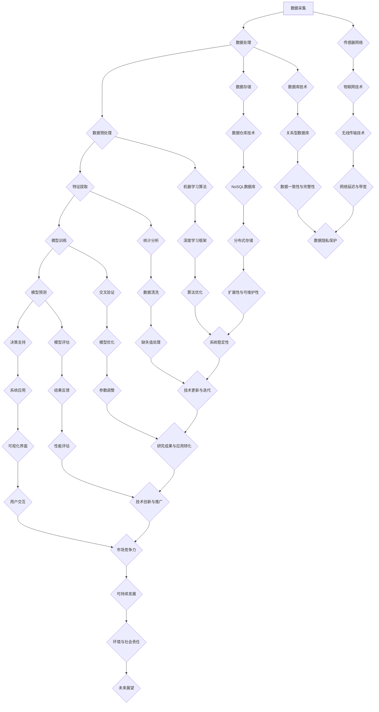

                 

### 文章标题

# 智能水资源管理系统：环境科技的创业方向

### 关键词

- 智能水资源管理
- 环境科技
- 数据采集与传输
- 数据分析与处理
- 机器学习与人工智能

### 摘要

智能水资源管理系统作为环境科技的前沿方向，正迅速成为全球水管理领域的变革力量。本文将深入探讨智能水资源管理系统的核心概念、技术框架、核心算法原理、数学模型与数学公式、项目实战以及创业方向与商业分析。通过详细的分析与实例讲解，揭示其在水资源管理中的广泛应用和巨大潜力，为创业者提供切实可行的商业路径和技术指导。

### 《智能水资源管理系统：环境科技的创业方向》目录大纲

**第一部分：引言**

## 1.1 书籍概述

## 1.2 水资源管理背景与挑战

## 1.3 智能水资源管理系统的意义

**第二部分：智能水资源管理系统概述**

## 2.1 智能水资源管理系统概述

## 2.2 智能水资源管理系统的组成部分

### 2.2.1 数据采集与传输

### 2.2.2 数据分析与处理

### 2.2.3 模型预测与决策支持

## 2.3 智能水资源管理系统的技术框架

### 2.3.1 传感器技术

### 2.3.2 数据库与数据仓库技术

### 2.3.3 机器学习与人工智能技术

**第三部分：智能水资源管理系统核心算法原理**

## 3.1 数据预处理算法

### 3.1.1 数据清洗

### 3.1.2 数据归一化

### 3.1.3 特征提取

## 3.2 模型预测算法

### 3.2.1 线性回归模型

### 3.2.2 决策树模型

### 3.2.3 支持向量机模型

## 3.3 机器学习算法在水资源管理中的应用

### 3.3.1 随机森林模型

### 3.3.2 集成学习方法

### 3.3.3 神经网络模型

## 3.4 Mermaid 流程图

## 3.5 伪代码

**第四部分：数学模型与数学公式**

## 4.1 水资源供需平衡模型

## 4.2 水质监测模型

## 4.3 水资源优化调度模型

## 4.4 数学公式详解

## 4.5 举例说明

**第五部分：项目实战**

## 5.1 案例一：水资源监测与管理系统的开发

### 5.1.1 开发环境搭建

### 5.1.2 数据采集与传输

### 5.1.3 数据预处理

### 5.1.4 模型训练与预测

### 5.1.5 系统集成与部署

## 5.2 案例二：某地区水资源优化调度项目

### 5.2.1 项目背景与目标

### 5.2.2 数据采集与预处理

### 5.2.3 数学模型建立

### 5.2.4 优化算法实现

### 5.2.5 项目效果评估

**第六部分：创业方向与商业分析**

## 6.1 智能水资源管理系统的市场前景

### 6.1.1 市场规模分析

### 6.1.2 市场竞争分析

### 6.1.3 创业机会与挑战

## 6.2 商业模式与盈利模式分析

### 6.2.1 商业模式设计

### 6.2.2 盈利模式分析

### 6.2.3 成本与收益分析

## 6.3 创业案例分析

### 6.3.1 成功案例介绍

### 6.3.2 案例分析

### 6.3.3 启示与借鉴

**第七部分：总结与展望**

## 7.1 书籍总结

## 7.2 未来发展趋势

## 7.3 研究方向与展望

**附录**

## 附录A：技术资源与工具

### A.1 数据库与数据仓库工具

### A.2 机器学习框架

### A.3 开发环境配置与调试

### A.4 实用工具与资源链接

### A.5 专业书籍与文献推荐

---

## 1.1 书籍概述

《智能水资源管理系统：环境科技的创业方向》旨在为读者提供关于智能水资源管理系统全面而深入的技术指导与商业分析。本书分为七个主要部分，从引言到具体技术实现，再到创业方向与商业分析，层层递进，全方位地揭示了智能水资源管理系统的核心概念、技术框架、算法原理以及市场前景。

本书旨在解决以下问题：

1. **水资源管理现状与挑战**：分析当前水资源管理中存在的难点与瓶颈，探讨智能水资源管理系统的重要性。
2. **技术框架解析**：详细介绍智能水资源管理系统的组成部分和技术框架，涵盖数据采集、数据分析和模型预测等关键环节。
3. **算法原理与实现**：讲解智能水资源管理系统中的核心算法原理，包括数据预处理、预测算法和机器学习算法。
4. **数学模型与应用**：探讨水资源供需平衡、水质监测和优化调度等数学模型及其应用。
5. **项目实战**：通过具体案例，展示智能水资源管理系统的实际开发与实施过程。
6. **商业分析**：分析智能水资源管理系统的市场前景、商业模式与盈利模式，探讨创业机会与挑战。
7. **未来展望**：总结本书内容，展望智能水资源管理系统的发展趋势与研究方向。

本书不仅适合技术研究人员和开发人员，也适用于创业者和政策制定者，为他们提供全面的技术指导与商业分析，助力智能水资源管理系统的创新与发展。

## 1.2 水资源管理背景与挑战

水资源是人类社会发展的基础资源，其管理质量和效率直接关系到社会经济的可持续发展和人类生存环境的健康。然而，随着全球人口的增长和经济的发展，水资源管理面临着前所未有的挑战。

### 当前水资源管理现状

1. **水资源分布不均**：全球水资源分布极不均衡，许多地区面临严重的水资源短缺问题，而一些地区则水资源丰富，但利用率低。
2. **水资源污染严重**：工业废水、生活污水和农业污染导致大量水资源受到污染，水质问题日益严峻，影响人类健康和生态环境。
3. **水资源管理技术水平较低**：许多国家的水资源管理仍然依赖传统的手工操作和简单的自动化设备，缺乏现代化的智能管理手段，导致管理效率低下。
4. **水资源供需不平衡**：随着城市化进程的加快和农业用水的增加，水资源的供需矛盾日益突出，许多地区面临供水不足的问题。

### 水资源管理中的主要挑战

1. **数据采集与传输困难**：水资源数据具有时空动态性，传统的数据采集手段难以满足实时性和精确性的要求。同时，数据传输过程中的延迟和误差也会影响水资源管理的效率。
2. **数据分析与处理难度大**：水资源数据类型多样、规模庞大，且存在噪声和缺失值等问题，使得数据分析和处理变得复杂且具有挑战性。
3. **预测与决策支持不足**：传统的水资源管理方法主要依赖于经验判断，缺乏科学的预测与决策支持，难以应对突发性水资源事件和长期水资源规划。
4. **技术融合与创新不足**：智能水资源管理系统需要多种技术的融合与协同，包括传感器技术、数据库技术、机器学习技术和人工智能技术等，但当前技术融合与创新仍存在一定的不足。
5. **政策与法规滞后**：许多国家的水资源管理政策与法规滞后于技术发展，未能及时推动智能水资源管理系统的广泛应用。

### 智能水资源管理系统的意义

面对水资源管理中的诸多挑战，智能水资源管理系统应运而生。智能水资源管理系统通过集成多种技术手段，实现对水资源的实时监测、智能分析、精准预测和科学决策，从而提高水资源管理效率，优化水资源配置，保障水资源的可持续利用。

1. **提高水资源管理效率**：智能水资源管理系统通过自动化数据采集与传输，实时数据分析与处理，提高了水资源管理的效率和准确性，减少了人为操作的错误和不确定性。
2. **优化水资源配置**：通过智能预测与决策支持，智能水资源管理系统能够为水资源调度和分配提供科学依据，优化水资源配置，提高水资源利用效率。
3. **改善水质监测与管理**：智能水资源管理系统通过传感器技术和数据采集，实时监测水质参数，及时发现和预警水质污染问题，有效改善水质监测与管理水平。
4. **推动技术融合与创新**：智能水资源管理系统需要多种技术的融合与协同，包括传感器技术、数据库技术、机器学习技术和人工智能技术等，这为相关技术的创新发展提供了新的方向。
5. **促进水资源可持续发展**：智能水资源管理系统通过科学管理和优化配置，有助于实现水资源的可持续利用，减少水资源浪费，保护水资源生态环境。

总之，智能水资源管理系统作为环境科技的前沿方向，具有巨大的发展潜力和应用价值，对于解决当前水资源管理中的挑战，实现水资源的高效利用和可持续发展具有重要意义。

## 1.3 智能水资源管理系统的意义

智能水资源管理系统在水资源管理领域具有重要意义，其核心在于利用先进的技术手段提升水资源管理的效率、优化水资源配置、保障水资源的安全和可持续发展。以下是智能水资源管理系统的主要意义：

1. **提高水资源管理效率**：传统的水资源管理主要依赖手工操作和简单的自动化设备，工作效率低、误差大。智能水资源管理系统通过集成传感器技术、物联网技术、大数据分析和人工智能技术，实现了对水资源数据的自动化采集、传输和分析，显著提高了水资源管理的效率和准确性。

2. **优化水资源配置**：水资源配置的优化是水资源管理的关键。智能水资源管理系统通过实时监测和数据分析，能够准确掌握水资源的供需状况，为水资源调度和分配提供科学依据。通过智能预测和优化算法，智能水资源管理系统能够实现水资源的智能调度和优化分配，提高水资源的利用效率。

3. **改善水质监测与管理**：水质监测是水资源管理的重要组成部分。智能水资源管理系统通过安装传感器，实时监测水质参数，如pH值、溶解氧、重金属等，及时发现水质异常情况。系统还可以利用机器学习算法对水质数据进行分析，预测水质变化趋势，为水质管理提供预警和决策支持。

4. **保障水资源安全**：水资源安全是国家安全的重要组成部分。智能水资源管理系统通过对水资源的实时监测和数据分析，能够及时发现水资源安全隐患，如水源污染、水资源短缺等，并采取相应的措施进行预警和应对，保障水资源的安全。

5. **促进水资源可持续发展**：智能水资源管理系统有助于实现水资源管理的科学化和智能化，通过优化水资源配置、提高水资源利用效率、改善水质监测与管理，有助于实现水资源的可持续发展。系统还可以通过数据分析，发现水资源利用中的浪费和污染问题，提出改进措施，推动水资源的可持续利用。

6. **提高水资源管理决策的科学性**：智能水资源管理系统集成了多种技术手段，能够对海量水资源数据进行分析和处理，为水资源管理提供科学的决策支持。传统的经验判断方式难以应对复杂多变的水资源管理问题，而智能水资源管理系统通过数据分析、模型预测和优化算法，能够为水资源管理决策提供科学依据，提高决策的科学性和有效性。

7. **推动水资源管理技术的发展**：智能水资源管理系统是水资源管理技术的创新和发展。随着传感器技术、物联网技术、大数据分析和人工智能技术的不断进步，智能水资源管理系统将不断优化和升级，推动水资源管理技术的持续发展。

总之，智能水资源管理系统在水资源管理中的意义不仅在于提高管理效率和优化资源配置，更重要的是通过科学管理和智能化技术手段，实现水资源的安全、高效和可持续发展，为人类社会的发展提供坚实的资源保障。

## 2.1 智能水资源管理系统概述

智能水资源管理系统（Intelligent Water Resource Management System，IWMS）是一种综合运用现代信息技术和智能算法，对水资源进行高效管理的系统。它通过数据的自动化采集、传输、处理和智能分析，实现对水资源状态的实时监控、科学预测和优化调度，从而提高水资源管理效率和保障水资源的可持续利用。

### 定义与核心概念

智能水资源管理系统可以定义为一个集成了传感器技术、物联网技术、数据库技术、数据分析技术、人工智能算法和决策支持系统的综合平台，用于实时监测、分析和管理水资源。其核心概念包括：

- **传感器技术**：用于实时采集水质、水量、水位等水资源参数。
- **物联网技术**：实现传感器数据的无线传输和集成，确保数据的实时性和准确性。
- **数据库技术**：用于存储和管理大量水资源数据，为数据分析提供基础。
- **数据分析技术**：利用统计学、机器学习等方法对水资源数据进行分析和处理。
- **人工智能算法**：用于对水资源数据进行分析、预测和决策，提高管理效率。
- **决策支持系统**：为水资源管理人员提供科学的决策依据，优化水资源管理和调度。

### 功能与特点

智能水资源管理系统具有以下主要功能和特点：

1. **实时监控**：系统能够实时监测水资源的各项参数，如水质、水量、水位等，通过传感器网络和物联网技术，实现数据的自动采集和传输，确保数据的实时性和准确性。
2. **数据分析**：系统利用数据库技术存储和管理大量水资源数据，通过数据分析技术对数据进行分析和处理，提取有价值的信息，为水资源管理提供科学依据。
3. **预测与决策**：系统集成了多种人工智能算法，能够对水资源数据进行分析和预测，为水资源调度和管理提供决策支持，优化水资源配置。
4. **智能化管理**：系统通过智能化算法，实现对水资源的智能分析和优化调度，提高水资源管理效率，减少水资源浪费。
5. **数据可视化**：系统提供了直观的可视化界面，用户可以通过图表、报表等形式查看水资源数据，方便管理和决策。
6. **跨平台支持**：系统支持多种平台和设备，如PC、手机、平板等，用户可以随时随地访问系统，方便管理。
7. **易扩展性**：系统设计具有高度的模块化和可扩展性，可以根据实际需求添加新的功能和模块，适应不同的水资源管理场景。

### 智能水资源管理系统的架构

智能水资源管理系统通常包括以下主要组成部分：

1. **感知层**：包括各类传感器，如水质传感器、流量传感器、水位传感器等，用于实时采集水资源的各项参数。
2. **传输层**：通过物联网技术，如Wi-Fi、LoRa、NB-IoT等，实现传感器数据的无线传输，确保数据的实时性和可靠性。
3. **数据层**：包括数据库和数据仓库，用于存储和管理大量的水资源数据，提供数据分析和处理的基础。
4. **算法层**：集成多种机器学习算法和优化算法，对水资源数据进行分析、预测和决策，提供智能化的管理支持。
5. **应用层**：包括用户界面和决策支持系统，用户可以通过界面查看水资源数据、执行管理操作和获取决策建议。
6. **支持层**：包括系统管理、安全防护、数据备份和恢复等功能，确保系统的稳定运行和数据安全。

通过上述功能和特点，智能水资源管理系统为水资源管理提供了高效、智能和科学的管理手段，有助于实现水资源的优化配置和可持续发展。在实际应用中，智能水资源管理系统可以根据具体需求进行定制和扩展，适应不同的水资源管理场景。

### 2.2 智能水资源管理系统的组成部分

智能水资源管理系统是一个高度复杂且集成的系统，其成功运行依赖于各个组成部分的高效协同。以下是智能水资源管理系统的主要组成部分及其功能：

#### 2.2.1 数据采集与传输

**功能**：数据采集与传输是智能水资源管理系统的核心，负责实时、准确地获取水资源相关的各种数据，包括水质参数（如pH值、溶解氧、氨氮等）、水量（如流量、水压等）和水位等。

**组成部分**：

1. **传感器**：包括水质传感器、流量传感器、水位传感器等，用于监测水资源的各项参数。
2. **采集器**：传感器采集的数据通过采集器进行初步处理和存储，然后传输到数据中心。

**工作原理**：

- 传感器实时监测水资源参数，并将数据发送到采集器。
- 采集器对传感器数据进行初步处理（如滤波、校准等），然后通过无线传输技术（如Wi-Fi、LoRa、NB-IoT等）将数据传输到数据中心。

**关键技术**：

- **传感器技术**：高精度、稳定性和可靠性的传感器是实现数据采集准确性的关键。
- **无线传输技术**：选择适合水资源环境的无线传输技术，如LoRa和NB-IoT，确保数据传输的实时性和稳定性。

#### 2.2.2 数据分析与处理

**功能**：数据分析和处理负责对采集到的水资源数据进行清洗、转换和存储，提取有价值的信息，为水资源管理提供数据支持。

**组成部分**：

1. **数据预处理**：包括数据清洗、数据转换和数据归一化，去除数据中的噪声和缺失值，使数据格式一致，便于后续处理。
2. **数据库**：用于存储和管理大量水资源数据，提供快速的数据查询和分析。
3. **数据仓库**：用于存储历史数据，支持数据挖掘和趋势分析。

**工作原理**：

- 数据采集模块将传感器数据传输到数据中心。
- 数据预处理模块对数据进行清洗、转换和归一化。
- 数据存储模块将预处理后的数据存储到数据库和数据仓库。

**关键技术**：

- **数据预处理算法**：常用的数据预处理算法包括数据清洗、缺失值处理、数据转换和归一化等。
- **数据库技术**：选择合适的数据库系统（如MySQL、PostgreSQL等），确保数据存储的效率和安全性。
- **数据仓库技术**：利用数据仓库（如Apache Hadoop、Amazon Redshift等）进行大规模数据存储和管理。

#### 2.2.3 模型预测与决策支持

**功能**：模型预测与决策支持利用机器学习和人工智能算法，对水资源数据进行分析和预测，为水资源调度和管理提供科学依据。

**组成部分**：

1. **预测模型**：包括统计模型（如线性回归、决策树等）和机器学习模型（如随机森林、支持向量机、神经网络等）。
2. **决策支持系统**：基于预测模型，为水资源管理人员提供决策建议，如水资源调度、水质管理、水文预测等。

**工作原理**：

- 预测模型对历史水资源数据进行分析和训练，建立预测模型。
- 决策支持系统利用预测模型对当前和未来水资源状况进行预测，为水资源管理人员提供决策建议。

**关键技术**：

- **机器学习算法**：选择适合水资源管理问题的机器学习算法，如随机森林、支持向量机、神经网络等。
- **模型优化**：通过交叉验证、网格搜索等技术，优化预测模型的参数，提高预测准确性。
- **决策支持系统**：开发用户友好的决策支持界面，便于水资源管理人员进行决策。

通过上述三个组成部分的协同工作，智能水资源管理系统实现了对水资源数据的实时监测、智能分析和优化调度，为水资源管理提供了科学、高效和智能化的解决方案。

### 2.3 智能水资源管理系统的技术框架

智能水资源管理系统的技术框架是支撑系统高效运行的基础，它集成了多种先进技术和方法，确保系统能够实时、准确地监测、分析和管理水资源。以下是对智能水资源管理系统技术框架的详细解析：

#### 2.3.1 传感器技术

传感器技术是智能水资源管理系统的基础，它负责实时采集水资源状态的数据。传感器类型多样，包括水质传感器、流量传感器、水位传感器、气象传感器等。每种传感器都用于监测特定的参数，如：

- **水质传感器**：用于测量水中的化学成分，如pH值、溶解氧、氨氮、重金属等。
- **流量传感器**：用于测量水的流量和流速。
- **水位传感器**：用于测量水体的水位高度。
- **气象传感器**：用于监测气温、湿度、风速等气象参数，这些数据对水资源的调度和预测具有重要意义。

传感器技术的主要挑战在于提高传感器的精度、稳定性和可靠性。为了实现这些目标，研究人员不断改进传感器的设计和材料，例如使用纳米材料提高传感器的灵敏度，采用自校准技术确保传感器在长期使用中的准确性。

#### 2.3.2 数据库与数据仓库技术

数据库和数据仓库技术是智能水资源管理系统的数据存储和管理核心。数据库主要用于存储和管理实时数据，而数据仓库则用于存储和管理历史数据，支持数据挖掘和趋势分析。

- **数据库技术**：常用的数据库技术包括关系型数据库（如MySQL、PostgreSQL）和NoSQL数据库（如MongoDB、Cassandra）。关系型数据库适合存储结构化数据，而NoSQL数据库则适合存储非结构化数据。智能水资源管理系统通常采用混合数据库架构，以充分利用不同类型数据库的优势。

- **数据仓库技术**：数据仓库（如Apache Hadoop、Amazon Redshift）用于存储和管理大规模数据，支持数据清洗、转换、集成和分析。数据仓库技术还包括数据湖（Data Lake），它用于存储大量原始数据，支持实时数据处理和大数据分析。

数据库和数据仓库技术的关键在于数据的安全性和可扩展性。为了确保数据的安全，系统采用加密技术保护数据，并实施严格的访问控制策略。为了支持大规模数据存储和快速查询，系统采用分布式存储和计算技术，如Hadoop和Spark。

#### 2.3.3 机器学习与人工智能技术

机器学习与人工智能技术是智能水资源管理系统的高级分析工具，它能够从海量数据中提取有价值的信息，进行预测和决策支持。以下是几种在智能水资源管理系统中常用的机器学习算法：

- **线性回归模型**：用于分析水资源数据的线性关系，预测未来水资源的供需情况。
- **决策树模型**：用于分类和回归任务，能够处理复杂的水资源问题，如水质污染源识别。
- **支持向量机（SVM）**：用于分类任务，能够有效地识别和分类水资源中的异常情况。
- **随机森林模型**：用于提高预测模型的准确性，通过集成多个决策树模型进行预测。
- **神经网络模型**：用于复杂的水资源预测和优化问题，如水资源调度和水质控制。

机器学习与人工智能技术的关键在于算法的优化和模型的可解释性。为了提高模型的准确性，研究人员采用交叉验证、网格搜索等技术进行模型调优。为了提高模型的可解释性，采用可视化技术和特征重要性分析，帮助水资源管理人员理解模型的决策过程。

#### 2.3.4 通信与网络技术

智能水资源管理系统依赖于高效的通信与网络技术，确保数据的实时传输和系统的可靠性。常用的通信与网络技术包括：

- **物联网技术**：如Wi-Fi、LoRa、NB-IoT等，用于实现传感器数据的无线传输。
- **5G技术**：提供高速、低延迟的网络连接，支持大规模设备的接入和实时数据传输。
- **云计算技术**：通过云计算平台（如AWS、Azure、Google Cloud），实现数据的集中存储和处理，提高系统的可扩展性和可靠性。

通信与网络技术的关键在于网络的稳定性和安全性。为了确保数据的实时性和安全性，系统采用冗余网络设计，实现数据的备份和恢复。同时，采用加密技术和安全协议，保护数据在传输过程中的安全性。

通过上述技术框架的集成，智能水资源管理系统实现了对水资源数据的全面监控、高效分析和科学决策，为水资源管理提供了有力支持。随着技术的不断进步，智能水资源管理系统将继续发展，为水资源的高效利用和可持续发展做出更大贡献。

### 2.3.1 传感器技术

传感器技术是智能水资源管理系统的核心组成部分，其性能直接影响系统对水资源状态的监测精度和可靠性。传感器通过检测和转换水资源的各种物理、化学和生物参数，为系统提供关键数据。以下是传感器技术的详细介绍：

#### 传感器种类

智能水资源管理系统使用的传感器种类繁多，常见的包括：

1. **水质传感器**：用于测量水中的pH值、溶解氧（DO）、电导率（EC）、氨氮（NH3-N）、总氮（TN）、总磷（TP）等化学成分。
2. **流量传感器**：用于测量水的流量、流速和流向，常见的有超声波流量计、电磁流量计等。
3. **水位传感器**：用于测量水体的高度和深度，常见的有浮标式水位传感器、超声波水位传感器等。
4. **气象传感器**：用于监测水温、湿度、风速、降水量等气象参数，这些数据对水资源管理至关重要。

#### 工作原理

各种传感器的工作原理不同，但总体上可以分为以下几类：

1. **物理传感器**：利用物理原理，如声波、磁场、热效应等，检测水资源的物理参数。例如，超声波流量计通过声波在流体中的传播速度变化测量流量；电磁流量计则通过检测水流产生的电磁场变化测量流量。
2. **化学传感器**：利用化学反应检测水质参数。例如，pH传感器通过电极检测水中的氢离子浓度变化；电导率传感器通过测量水中的离子浓度变化来判断水质。
3. **生物传感器**：利用生物化学反应检测水中的生物指标。例如，溶解氧传感器通过测量水中氧气的浓度变化来判断水质。

#### 关键技术

传感器技术的关键在于提高传感器的精度、稳定性和可靠性。以下是一些关键技术：

1. **高精度与稳定性**：通过采用高精度的传感器元件和先进的校准技术，提高传感器的测量精度。同时，传感器的设计和材料选择要考虑环境因素，如温度、湿度、腐蚀等，确保传感器的长期稳定性。
2. **自校准与校准技术**：传感器自校准技术可以自动调整传感器参数，确保测量数据的准确性。外部校准则通过与已知标准设备进行比较，定期校准传感器。
3. **抗干扰能力**：传感器需要具备良好的抗干扰能力，以避免环境噪声和其他干扰源对测量结果的影响。通常采用滤波技术和屏蔽措施来提高传感器的抗干扰性能。
4. **无线传输技术**：传感器通过无线传输技术（如Wi-Fi、LoRa、NB-IoT等）将数据传输到数据中心，实现数据的实时监控和远程管理。无线传输技术需要考虑传输距离、带宽和功耗等因素。

#### 传感器技术在实际应用中的挑战

智能水资源管理系统在实际应用中面临以下挑战：

1. **环境适应性**：传感器需要在不同的环境条件下稳定工作，如高温、低温、高湿度、高盐度等。传感器的设计和材料选择需要充分考虑这些因素。
2. **数据传输稳定性**：无线传输技术的稳定性直接影响数据采集的实时性和准确性。需要选择适合应用场景的无线传输技术，并采用冗余设计和备份方案。
3. **传感器寿命和成本**：传感器的寿命和成本是实际应用中的重要考虑因素。需要平衡传感器的性能和成本，确保系统的经济性和实用性。

通过不断改进传感器技术，智能水资源管理系统将能够更好地监测和管理水资源，为水资源管理提供更加准确和可靠的数据支持。

### 2.3.2 数据库与数据仓库技术

数据库与数据仓库技术是智能水资源管理系统的核心组成部分，负责存储、管理和分析大量水资源数据，为系统提供数据支持。以下是对数据库与数据仓库技术的详细介绍：

#### 2.3.2.1 数据库技术

**数据库类型**：

- **关系型数据库**：如MySQL、PostgreSQL，主要用于存储结构化数据，通过表和关系进行组织。关系型数据库具有数据完整性高、查询速度快等优点，适合用于实时数据存储和查询。
- **NoSQL数据库**：如MongoDB、Cassandra，主要用于存储非结构化或半结构化数据。NoSQL数据库具有高扩展性和灵活性，适合存储大量数据和进行大数据分析。

**数据库技术优势**：

- **高扩展性**：关系型数据库和NoSQL数据库都支持水平扩展，能够处理大规模数据存储需求。
- **高性能**：数据库技术提供了高效的查询和数据分析功能，能够快速检索和处理大量数据。
- **数据完整性**：关系型数据库通过事务管理和数据约束确保数据的完整性。

**关键技术**：

- **分布式数据库**：通过分布式存储和计算技术，提高数据库的并发处理能力和数据一致性。
- **数据压缩和去重**：通过数据压缩和去重技术，减少数据存储空间和提高存储效率。

#### 2.3.2.2 数据仓库技术

**数据仓库功能**：

- **数据集成**：将来自多个数据源的数据集成到一个统一的数据存储中，提供数据整合和分析的基础。
- **数据存储**：存储大量历史数据，支持数据挖掘和趋势分析。
- **数据查询与分析**：提供强大的查询和分析功能，支持复杂的报表和数据分析。

**数据仓库技术优势**：

- **数据规模处理能力**：数据仓库技术能够处理大规模数据，支持海量数据存储和实时分析。
- **数据一致性**：通过数据集成和一致性控制，确保数据在多个数据源之间的准确性。
- **数据挖掘与分析**：数据仓库提供了丰富的数据挖掘和分析工具，支持复杂的数据分析和决策支持。

**关键技术**：

- **数据湖**：用于存储大量原始数据，支持实时数据处理和大数据分析。
- **分布式计算**：通过分布式计算技术（如Hadoop、Spark），提高数据仓库的处理能力和效率。

#### 2.3.2.3 数据存储与管理

**数据存储与管理策略**：

- **数据分层存储**：根据数据的重要性和访问频率，采用不同的存储策略。高频访问数据存储在内存或高速SSD中，低频访问数据存储在HDD或数据仓库中。
- **数据备份与恢复**：定期备份数据，确保数据的安全性和可用性。采用分布式备份和恢复策略，提高数据的可靠性和容错能力。

**数据质量管理**：

- **数据清洗**：通过数据清洗技术，去除数据中的噪声和错误，提高数据质量。
- **数据标准化**：通过数据标准化技术，统一数据格式和单位，确保数据的兼容性和一致性。

#### 实际应用中的挑战与解决方案

**挑战**：

1. **数据多样性**：水资源数据包括结构化数据、半结构化数据和非结构化数据，如何有效整合这些数据是一个挑战。
2. **数据安全性**：大规模数据存储和处理过程中，如何确保数据的安全性是一个关键问题。
3. **数据处理效率**：如何高效处理和分析海量数据，提高系统的响应速度和数据处理能力。

**解决方案**：

1. **数据集成技术**：采用数据集成技术，如ETL（提取、转换、加载）工具，将不同类型的数据整合到一个统一的数据仓库中。
2. **数据加密与访问控制**：采用数据加密技术和严格的访问控制策略，确保数据的安全性和隐私性。
3. **分布式计算与存储**：采用分布式计算和存储技术，如Hadoop和Spark，提高系统的并发处理能力和数据处理效率。

通过数据库与数据仓库技术的应用，智能水资源管理系统能够高效地存储、管理和分析大量水资源数据，为水资源管理提供科学依据和决策支持。随着技术的不断进步，数据库与数据仓库技术将继续优化和扩展，为智能水资源管理系统的发展提供更强有力的支持。

### 2.3.3 机器学习与人工智能技术

机器学习与人工智能技术是智能水资源管理系统中不可或缺的重要组成部分，它们通过处理和分析大量的水资源数据，提供科学的预测和决策支持，从而提升水资源管理的效率和准确性。以下是关于机器学习与人工智能技术在智能水资源管理系统中的应用的详细解析。

#### 2.3.3.1 机器学习算法在水资源管理中的应用

机器学习算法在水资源管理中的应用非常广泛，可以用于数据预测、模式识别、分类和回归等多种任务。以下是几种常用的机器学习算法及其在水资源管理中的应用：

1. **线性回归模型**：线性回归模型是一种简单的统计方法，用于分析两个或多个变量之间的线性关系。在水资源管理中，线性回归模型可以用于预测未来水资源的供需情况，如预测未来一个月的水量需求。

    **算法原理**：
    $$ y = \beta_0 + \beta_1x_1 + \beta_2x_2 + ... + \beta_nx_n $$
    其中，$y$ 为预测的水资源量，$x_1, x_2, ..., x_n$ 为影响水资源量的相关因素，如气温、降水量等，$\beta_0, \beta_1, \beta_2, ..., \beta_n$ 为回归系数。

2. **决策树模型**：决策树是一种树形结构，通过一系列条件判断进行分类或回归。在水资源管理中，决策树模型可以用于水质污染源的识别，根据水中的化学成分、pH值等特征进行分类。

    **算法原理**：
    决策树通过一系列“是/否”的问题将数据分为不同的类别或数值。每个内部节点表示一个特征，每个分支表示一个特征取值，每个叶节点表示一个类别或数值。

3. **支持向量机（SVM）**：支持向量机是一种用于分类和回归的机器学习算法，通过找到一个最优的超平面，将不同类别的数据点分隔开。在水资源管理中，SVM可以用于识别异常数据，如异常的水质指标。

    **算法原理**：
    $$ \max \left\{ W \middle| \frac{1}{2}||W||^2_2 \leq C \sum_{i=1}^{n} \xi_i \right\} $$
    其中，$W$ 为超平面参数，$C$ 为惩罚参数，$\xi_i$ 为松弛变量。

4. **随机森林模型**：随机森林是一种基于决策树的集成学习方法，通过构建多个决策树并投票得到最终预测结果。随机森林模型在水资源管理中可以用于预测水资源需求、水质监测和污染源识别。

    **算法原理**：
    随机森林通过随机选择特征和样本子集构建多棵决策树，并通过投票得到最终预测结果。

5. **神经网络模型**：神经网络是一种模拟人脑神经元结构的计算模型，通过多层神经网络（如深度学习）可以处理复杂的水资源管理问题，如水资源优化调度和水质预测。

    **算法原理**：
    神经网络通过多层节点（神经元）之间的连接和权重调整，学习输入和输出之间的非线性映射关系。

#### 2.3.3.2 机器学习算法在水资源管理中的优势

1. **非线性建模能力**：机器学习算法可以处理非线性关系，适合用于水资源管理中复杂的因果关系分析。
2. **自适应学习**：机器学习算法能够根据新的数据自动调整模型参数，适应环境变化，提高预测的准确性。
3. **自动化特征提取**：机器学习算法可以通过学习数据中的特征，自动提取有用的信息，减少人为干预，提高数据处理的效率。
4. **多任务处理**：机器学习算法可以同时处理多个任务，如预测水资源供需和水质状况，实现综合水资源管理。

#### 2.3.3.3 机器学习算法在实际应用中的挑战

1. **数据质量**：机器学习算法对数据质量有较高要求，数据中的噪声、缺失值和异常值会影响模型的性能。因此，需要采用数据预处理技术，如数据清洗、归一化和特征提取，确保数据质量。
2. **模型解释性**：传统的机器学习模型（如决策树和神经网络）往往具有较好的预测性能，但缺乏解释性。如何提高模型的解释性，使其决策过程透明化，是当前研究的一个重要方向。
3. **计算资源消耗**：机器学习算法需要大量的计算资源，尤其是深度学习算法，对硬件和软件环境有较高要求。在实际应用中，需要优化算法和硬件配置，提高计算效率。

通过机器学习与人工智能技术的应用，智能水资源管理系统能够更加准确地预测水资源需求和水质状况，优化水资源管理策略，提高水资源利用效率，实现水资源的可持续管理。未来，随着算法的进一步优化和计算资源的提升，机器学习在水资源管理中的应用将更加广泛和深入。

### 3.1 数据预处理算法

数据预处理是智能水资源管理系统中的一个关键步骤，其目的是提高数据质量，为后续的数据分析和模型训练提供可靠的输入。以下是数据预处理算法的核心内容，包括数据清洗、数据归一化和特征提取等步骤。

#### 3.1.1 数据清洗

数据清洗是数据预处理的第一步，主要目的是去除数据中的噪声、缺失值和异常值。以下是常用的数据清洗方法：

1. **缺失值处理**：
   - **填补缺失值**：利用平均值、中位数、最邻近值等统计方法填补缺失值。
   - **删除缺失值**：对于含有大量缺失值的数据，可以考虑删除这些数据，但这种方法可能会丢失有价值的信息。
   - **插值法**：利用时间序列或空间序列的插值方法填补缺失值。

2. **异常值处理**：
   - **标准差方法**：删除距离平均值超过一定倍数标准差的异常值。
   - **箱线图方法**：利用箱线图删除位于上下四分位距之外的异常值。
   - **基于规则的异常值处理**：根据业务规则或专家经验删除异常值。

#### 3.1.2 数据归一化

数据归一化的目的是将不同尺度和范围的变量转化为同一尺度，以便进行进一步的分析。以下是常用的数据归一化方法：

1. **最小-最大归一化**：
   $$ x_{\text{norm}} = \frac{x - x_{\text{min}}}{x_{\text{max}} - x_{\text{min}}} $$
   其中，$x_{\text{norm}}$ 是归一化后的值，$x$ 是原始值，$x_{\text{min}}$ 和 $x_{\text{max}}$ 分别是原始数据的最小值和最大值。

2. **均值-方差归一化**：
   $$ x_{\text{norm}} = \frac{x - \mu}{\sigma} $$
   其中，$\mu$ 是平均值，$\sigma$ 是标准差。

3. **对数归一化**：
   对于非负数据，可以将数据取对数进行归一化：
   $$ x_{\text{norm}} = \log(x + 1) $$
   这种方法适用于数据分布极不均匀的情况。

#### 3.1.3 特征提取

特征提取的目的是从原始数据中提取出对模型训练有重要影响的信息，减少数据维度，提高模型性能。以下是常用的特征提取方法：

1. **主成分分析（PCA）**：
   PCA通过正交变换将原始数据投影到新的坐标系中，保留主要的信息，忽略次要的信息，从而降低数据维度。

   $$ \text{新特征向量} = \text{原始数据} \times \text{特征矩阵}^T $$

2. **离散化**：
   将连续数据离散化为几个类别，常用于处理分类问题。例如，可以将连续的数值划分为几个区间。

3. **特征选择**：
   通过评估不同特征对模型性能的影响，选择对模型训练有重要作用的特征，减少数据维度。

   - **过滤式特征选择**：在模型训练之前进行特征选择。
   - **包装式特征选择**：在模型训练过程中进行特征选择。

#### 伪代码示例

以下是一个简单的数据预处理伪代码示例：

```python
# 数据预处理伪代码

# 缺失值处理
for feature in dataset:
    missing_values = find_missing_values(feature)
    for missing_value in missing_values:
        missing_value_replacement = replace_missing_value(missing_value)
        dataset[missing_value] = missing_value_replacement

# 异常值处理
for feature in dataset:
    outliers = find_outliers(feature)
    for outlier in outliers:
        remove_outlier(dataset, outlier)

# 数据归一化
for feature in dataset:
    dataset[feature] = min_max_normalization(feature)

# 特征提取
selected_features = feature_selection(dataset)
new_dataset = apply_pca(dataset, selected_features)

# 输出预处理后的数据集
return new_dataset
```

通过上述数据预处理算法，智能水资源管理系统可以确保输入数据的质量和一致性，为后续的数据分析和模型训练奠定坚实基础。数据预处理的效果直接影响模型性能，因此在实际应用中应高度重视数据预处理环节。

### 3.2 模型预测算法

模型预测算法在智能水资源管理系统中起着至关重要的作用，通过这些算法，系统可以预测未来的水资源需求、水质状况等，为水资源管理提供科学依据。以下是几种常用的模型预测算法，包括线性回归模型、决策树模型、支持向量机（SVM）模型等。

#### 3.2.1 线性回归模型

线性回归模型是一种经典的预测算法，它通过建立自变量和因变量之间的线性关系来预测未来的数值。以下是线性回归模型的原理和实现方法：

1. **模型原理**：

   线性回归模型的基本形式为：
   $$ y = \beta_0 + \beta_1x_1 + \beta_2x_2 + ... + \beta_nx_n $$
   其中，$y$ 为因变量（预测值），$x_1, x_2, ..., x_n$ 为自变量（特征值），$\beta_0, \beta_1, \beta_2, ..., \beta_n$ 为回归系数。

2. **实现方法**：

   线性回归模型的实现通常分为以下几步：

   - **数据收集**：收集历史水资源数据，包括水量、水质参数等。
   - **数据预处理**：对数据进行清洗、归一化等处理，提高数据质量。
   - **模型训练**：使用最小二乘法（Least Squares Method）或梯度下降法（Gradient Descent）训练模型，计算回归系数。
   - **模型评估**：使用交叉验证等方法评估模型的性能，调整模型参数。

3. **伪代码示例**：

   ```python
   # 线性回归模型伪代码

   # 数据预处理
   dataset = preprocess_data(data)

   # 模型训练
   X = dataset[:, :-1]
   y = dataset[:, -1]
   theta = linear_regression_training(X, y)

   # 模型评估
   performance = linear_regression_evaluation(X, y, theta)

   print("模型性能：", performance)
   ```

#### 3.2.2 决策树模型

决策树模型是一种基于树形结构的预测算法，它通过一系列的判断规则将数据分为不同的类别或数值。以下是决策树模型的原理和实现方法：

1. **模型原理**：

   决策树的基本形式是一个树状结构，每个内部节点表示一个特征，每个分支表示该特征的不同取值，每个叶节点表示一个类别或数值。

2. **实现方法**：

   决策树的实现通常分为以下几步：

   - **数据收集**：收集历史水资源数据，包括水量、水质参数等。
   - **数据预处理**：对数据进行清洗、归一化等处理，提高数据质量。
   - **特征选择**：选择对分类最有影响力的特征。
   - **构建决策树**：通过递归分割数据，构建决策树。
   - **模型评估**：使用交叉验证等方法评估模型的性能。

3. **伪代码示例**：

   ```python
   # 决策树模型伪代码

   # 数据预处理
   dataset = preprocess_data(data)

   # 构建决策树
   tree = build_decision_tree(dataset, features)

   # 模型评估
   performance = decision_tree_evaluation(tree, dataset)

   print("模型性能：", performance)
   ```

#### 3.2.3 支持向量机（SVM）模型

支持向量机是一种用于分类和回归的机器学习算法，它通过找到一个最优的超平面，将不同类别的数据点分隔开。以下是支持向量机模型的原理和实现方法：

1. **模型原理**：

   支持向量机的基本形式为：
   $$ \max \left\{ W \middle| \frac{1}{2}||W||^2_2 \leq C \sum_{i=1}^{n} \xi_i \right\} $$
   其中，$W$ 为超平面参数，$C$ 为惩罚参数，$\xi_i$ 为松弛变量。

2. **实现方法**：

   支持向量机的实现通常分为以下几步：

   - **数据收集**：收集历史水资源数据，包括水量、水质参数等。
   - **数据预处理**：对数据进行清洗、归一化等处理，提高数据质量。
   - **特征选择**：选择对分类最有影响力的特征。
   - **模型训练**：使用支持向量机算法训练模型。
   - **模型评估**：使用交叉验证等方法评估模型的性能。

3. **伪代码示例**：

   ```python
   # 支持向量机模型伪代码

   # 数据预处理
   dataset = preprocess_data(data)

   # 模型训练
   model = svm_training(dataset)

   # 模型评估
   performance = svm_evaluation(model, dataset)

   print("模型性能：", performance)
   ```

通过上述线性回归模型、决策树模型和支持向量机模型，智能水资源管理系统可以实现对水资源需求的预测、水质状况的监测等任务。这些模型在实际应用中具有广泛的应用前景，可以帮助水资源管理者做出更加科学和高效的决策。

### 3.3 机器学习算法在水资源管理中的应用

机器学习算法在水资源管理中的应用正日益广泛，通过这些算法，系统能够从海量数据中提取有价值的信息，实现对水资源需求的预测、水质状况的监测以及水资源调度的优化。以下将介绍几种主要的机器学习算法在水资源管理中的应用，包括随机森林模型、集成学习方法和神经网络模型。

#### 3.3.1 随机森林模型

随机森林（Random Forest）是一种基于决策树的集成学习方法，通过构建多棵决策树并对它们的预测结果进行投票来提高预测的准确性和稳定性。随机森林在水资源管理中的应用主要包括水资源需求预测和水质监测。

1. **应用场景**：

   - **水资源需求预测**：利用随机森林模型，可以预测未来一段时间内的水资源需求，为水资源调度和管理提供科学依据。
   - **水质监测**：通过随机森林模型，可以对水中的污染物浓度进行预测，及时发现和预警水质问题。

2. **算法原理**：

   随机森林的基本原理是通过随机有放回地抽样生成训练数据集，然后构建多棵决策树。每棵树独立生成，并在预测时进行投票，最终结果为所有树的预测结果的平均值。

   **伪代码示例**：

   ```python
   # 随机森林模型伪代码

   # 模型训练
   for i in range(num_trees):
       X_train, y_train = random_sample(dataset)
       tree = build_decision_tree(X_train, y_train)
       trees.append(tree)

   # 预测
   predictions = []
   for tree in trees:
       prediction = tree.predict(X)
       predictions.append(prediction)

   # 求平均
   final_prediction = average(predictions)
   ```

3. **优势**：

   - **高准确性和稳定性**：随机森林通过构建多棵决策树，可以有效地减少过拟合，提高预测的准确性和稳定性。
   - **处理非线性问题**：随机森林能够处理非线性关系，适用于复杂的水资源管理问题。

#### 3.3.2 集成学习方法

集成学习方法是一种将多个基本模型组合在一起，通过投票或平均等方式得到最终预测结果的方法。常见的集成学习方法包括Bagging、Boosting和Stacking等，在水资源管理中，这些方法可以用于提高预测模型的性能和可靠性。

1. **应用场景**：

   - **水资源供需预测**：通过集成多种算法，如线性回归、决策树、支持向量机等，可以提高水资源供需预测的准确性和可靠性。
   - **水质监测**：集成学习方法可以综合多种数据源和模型，提高水质监测的精度。

2. **算法原理**：

   - **Bagging**：通过训练多个基本模型，并在预测时进行投票或平均，降低模型的方差，提高模型的泛化能力。
   - **Boosting**：通过改变训练数据的权重，重点训练那些被基本模型预测错误的样本，提高模型的准确性。
   - **Stacking**：将多个不同类型的模型作为基础模型，再训练一个更高层次的模型（元模型）来集成这些基础模型的预测结果。

3. **优势**：

   - **提高模型性能**：集成学习方法通过组合多个基本模型，可以有效地提高预测模型的性能和可靠性。
   - **减少过拟合**：通过集成多个模型，可以降低单个模型的过拟合风险，提高模型的泛化能力。

#### 3.3.3 神经网络模型

神经网络模型，特别是深度学习模型，在水资源管理中具有广泛的应用。通过多层神经网络，系统可以学习复杂的水资源管理任务，如水资源供需预测、水质监测和水资源调度优化。

1. **应用场景**：

   - **水资源供需预测**：利用神经网络模型，可以预测未来一段时间内的水资源供需情况，为水资源调度提供科学依据。
   - **水质监测**：通过神经网络模型，可以实时监测水质参数，预测污染物浓度，及时发现水质问题。
   - **水资源调度优化**：神经网络模型可以用于优化水资源的调度策略，提高水资源利用效率。

2. **算法原理**：

   神经网络模型通过多层神经元之间的连接和权重调整，学习输入和输出之间的非线性映射关系。常见的神经网络模型包括前馈神经网络、卷积神经网络（CNN）和循环神经网络（RNN）等。

   **伪代码示例**：

   ```python
   # 神经网络模型伪代码

   # 初始化模型
   model = initialize_model(layers, activation_function)

   # 模型训练
   for epoch in range(num_epochs):
       for sample in dataset:
           model.train(sample)

   # 模型评估
   performance = model.evaluate(test_data)

   print("模型性能：", performance)
   ```

3. **优势**：

   - **处理非线性问题**：神经网络模型可以处理复杂的水资源管理问题，如非线性关系和复杂的输入特征。
   - **自动特征提取**：神经网络模型通过学习过程自动提取特征，减少人为干预。
   - **高泛化能力**：通过大量训练数据，神经网络模型可以具有较高的泛化能力，适用于不同类型的水资源管理任务。

通过随机森林模型、集成学习方法以及神经网络模型等机器学习算法在水资源管理中的应用，智能水资源管理系统可以实现对水资源需求的准确预测、水质的实时监测以及水资源调度的优化，为水资源管理提供强大的技术支持。随着机器学习技术的不断进步，这些算法在水资源管理中的应用将更加广泛和深入。

### 3.4 Mermaid 流程图

为了更好地理解智能水资源管理系统的整体工作流程，我们可以使用Mermaid语言绘制一个详细的流程图。Mermaid是一种基于Markdown的图表绘制语言，能够生成结构清晰、易于理解的流程图。以下是一个示例：



此流程图展示了智能水资源管理系统从数据采集、数据处理、数据存储到模型训练、模型预测以及决策支持的整个工作流程。每个步骤都连接了相关的技术和方法，例如传感器网络、数据库技术、机器学习算法和统计分析等。通过此流程图，可以更直观地理解智能水资源管理系统各部分之间的交互关系和工作机制。

### 3.5 伪代码

在智能水资源管理系统中，伪代码是描述算法逻辑和流程的一种有效手段。以下是一个针对智能水资源管理系统数据预处理和模型预测的伪代码示例，用于详细阐述数据处理和预测的过程。

```python
# 智能水资源管理系统数据预处理与模型预测伪代码

# 数据预处理
def preprocess_data(data):
    """
    数据预处理函数，包括数据清洗、归一化、特征提取等步骤。
    """
    # 数据清洗
    cleaned_data = clean_data(data)
    
    # 数据归一化
    normalized_data = normalize_data(cleaned_data)
    
    # 特征提取
    features = extract_features(normalized_data)
    
    return features

# 模型训练与预测
def train_predict_model(features, labels):
    """
    模型训练与预测函数，使用随机森林模型进行预测。
    """
    # 模型训练
    model = RandomForestClassifier(n_estimators=100)
    model.fit(features, labels)
    
    # 模型预测
    predictions = model.predict(features)
    
    return predictions

# 主程序
def main():
    # 数据加载
    dataset = load_data("water_resources.csv")

    # 数据预处理
    preprocessed_data = preprocess_data(dataset)

    # 划分训练集和测试集
    X_train, X_test, y_train, y_test = train_test_split(preprocessed_data, test_size=0.2)

    # 模型训练与预测
    predictions = train_predict_model(X_train, y_train)

    # 模型评估
    performance = evaluate_model(predictions, y_test)

    print("模型性能：", performance)

# 执行主程序
main()
```

此伪代码首先定义了数据预处理函数 `preprocess_data`，该函数包括数据清洗、归一化和特征提取三个步骤。接下来，定义了模型训练与预测函数 `train_predict_model`，该函数使用随机森林模型对训练集进行训练，并在测试集上进行预测。最后，主程序 `main` 加载数据集，执行数据预处理，划分训练集和测试集，并评估模型性能。

通过伪代码，可以清晰地了解智能水资源管理系统中的数据处理和模型预测的详细步骤和逻辑，有助于进一步开发和优化系统。

### 4.1 水资源供需平衡模型

水资源供需平衡模型是智能水资源管理系统中的核心数学模型之一，其目标是通过优化水资源分配，实现供需平衡，确保水资源的有效利用。以下是对水资源供需平衡模型的基本概念、数学模型以及具体应用的详细解析。

#### 基本概念

水资源供需平衡模型主要涉及以下基本概念：

1. **水资源供给**：指一定时间和空间范围内可利用的水资源总量，包括地表水、地下水、再生水等。
2. **水资源需求**：指一定时间和空间范围内各用水部门对水资源的需求总量，包括生活用水、工业用水、农业用水、生态用水等。
3. **供需平衡**：指水资源供给与需求在数量和质量上达到平衡状态，即供给量等于需求量，水资源质量符合要求。

#### 数学模型

水资源供需平衡模型的数学表达式如下：

$$ X_s = X_d $$

其中，$X_s$ 表示水资源供给量，$X_d$ 表示水资源需求量。

为了实现供需平衡，需要进一步考虑以下因素：

1. **水资源质量约束**：确保水资源供给在质量上满足各用水部门的需求。数学表达式为：

   $$ Q_s \geq Q_d $$

   其中，$Q_s$ 表示水资源供给质量，$Q_d$ 表示水资源需求质量。

2. **水资源分配约束**：合理分配水资源，确保各用水部门的需求得到满足。数学表达式为：

   $$ \sum_{i=1}^n X_{di} = X_s $$

   其中，$X_{di}$ 表示第$i$个用水部门的水资源需求量，$n$ 表示用水部门的总数。

3. **水资源利用效率**：优化水资源分配，提高水资源利用效率。数学表达式为：

   $$ \max \frac{X_s}{Q_s} $$

#### 具体应用

水资源供需平衡模型在实际应用中，通常通过以下步骤进行：

1. **数据收集与处理**：收集水资源供给和需求的数据，包括水量、水质、用水部门的用水量等。对数据进行清洗和归一化处理，确保数据质量。

2. **建立数学模型**：根据实际需求，建立水资源供需平衡模型。包括供给量、需求量、质量约束和分配约束等。

3. **求解优化问题**：利用数学优化方法（如线性规划、整数规划、多目标规划等）求解最优水资源分配方案，实现供需平衡。

4. **模型验证与调整**：通过实际数据验证模型的准确性，根据验证结果对模型进行调整和优化。

5. **水资源调度与管理**：根据模型输出的最优分配方案，进行水资源调度和管理，确保水资源的有效利用。

#### 举例说明

假设一个地区的水资源供需平衡模型如下：

- 水资源供给量：$X_s = 10$ 万立方米/年
- 生活用水需求：$X_{dl} = 2$ 万立方米/年
- 工业用水需求：$X_{di} = 4$ 万立方米/年
- 农业用水需求：$X_{da} = 3$ 万立方米/年
- 生态用水需求：$X_{de} = 1$ 万立方米/年

质量约束：
- 生活用水质量：$Q_{dl} = 1$（单位：质量指标）
- 工业用水质量：$Q_{di} = 2$（单位：质量指标）
- 农业用水质量：$Q_{da} = 1.5$（单位：质量指标）
- 生态用水质量：$Q_{de} = 1.2$（单位：质量指标）

根据供需平衡模型，可以建立以下优化问题：

$$ \begin{aligned}
\max \quad & \frac{X_s}{Q_s} \\
\text{s.t.} \quad & X_s = X_{dl} + X_{di} + X_{da} + X_{de} \\
& Q_s \geq Q_{dl} + Q_{di} + Q_{da} + Q_{de} \\
& X_{dl}, X_{di}, X_{da}, X_{de} \geq 0
\end{aligned} $$

通过求解上述优化问题，可以得出最优的水资源分配方案，确保水资源在数量和质量上的供需平衡。

通过水资源供需平衡模型的建立和应用，智能水资源管理系统可以实现对水资源的科学管理和优化配置，提高水资源利用效率，实现水资源的可持续发展。

### 4.2 水质监测模型

水质监测模型是智能水资源管理系统中关键的一部分，它通过监测和分析水质参数，实现对水质的实时监控和预测，从而确保水资源的安全和可持续发展。以下是关于水质监测模型的基本概念、数学模型及其在实际应用中的具体实现。

#### 基本概念

水质监测模型主要涉及以下基本概念：

1. **水质参数**：指用于描述水质状况的各种指标，包括pH值、溶解氧（DO）、氨氮（NH3-N）、总氮（TN）、总磷（TP）、重金属含量等。
2. **监测点**：指用于采集水质数据的地点，通常分布在河流、湖泊、水库等水体中。
3. **监测频率**：指监测点采集数据的频率，通常分为实时监测、定时监测等。

#### 数学模型

水质监测模型通常基于以下数学模型：

1. **线性回归模型**：
   $$ y = \beta_0 + \beta_1x_1 + \beta_2x_2 + ... + \beta_nx_n $$
   其中，$y$ 为预测的水质参数，$x_1, x_2, ..., x_n$ 为影响水质参数的相关变量（如温度、流速等），$\beta_0, \beta_1, \beta_2, ..., \beta_n$ 为回归系数。

2. **多元线性回归模型**：
   $$ y = \beta_0 + \beta_1x_1 + \beta_2x_2 + ... + \beta_nx_n $$
   其中，$y$ 为预测的水质参数，$x_1, x_2, ..., x_n$ 为多个水质参数和影响因子，$\beta_0, \beta_1, \beta_2, ..., \beta_n$ 为回归系数。

3. **时间序列模型**：
   $$ y_t = \phi_0 + \phi_1y_{t-1} + \phi_2y_{t-2} + ... + \phi_ny_{t-n} + \epsilon_t $$
   其中，$y_t$ 为第$t$时刻的水质参数，$\phi_0, \phi_1, \phi_2, ..., \phi_n$ 为模型参数，$\epsilon_t$ 为误差项。

#### 实际应用中的具体实现

水质监测模型在实际应用中通常通过以下步骤进行：

1. **数据收集**：
   - 安装水质传感器，实时采集水质参数。
   - 定期进行现场水质监测，获取更多的数据。

2. **数据处理**：
   - 数据清洗：去除异常值和噪声，提高数据质量。
   - 数据归一化：将不同量纲的数据转换为同一量纲，便于模型训练。

3. **模型建立**：
   - 选择合适的模型，如线性回归、多元线性回归或时间序列模型。
   - 训练模型：利用历史数据，训练模型参数。

4. **模型验证与优化**：
   - 使用验证数据集，评估模型性能。
   - 调整模型参数，优化模型。

5. **模型应用**：
   - 实时监测：利用训练好的模型，对实时数据进行分析和预测。
   - 预警与决策：根据预测结果，及时采取应对措施，如水质污染预警、水资源调度等。

#### 举例说明

假设某地区的水质监测模型采用多元线性回归模型，预测pH值，影响因素包括温度（T）和溶解氧（DO）。模型表达式为：

$$ pH = \beta_0 + \beta_1T + \beta_2DO $$

通过收集历史数据，可以训练出模型的参数：

$$ \beta_0 = 7.5, \beta_1 = 0.1, \beta_2 = 0.2 $$

假设当前监测到的温度为25℃，溶解氧为8mg/L，利用模型预测pH值：

$$ pH = 7.5 + 0.1 \times 25 + 0.2 \times 8 = 8.0 $$

通过上述过程，水质监测模型可以实现对水质参数的实时预测和监控，为水资源管理提供科学依据。

通过水质监测模型的建立和应用，智能水资源管理系统可以实现对水质的全面监控和预警，提高水资源管理的科学性和精准性，确保水资源的可持续发展。

### 4.3 水资源优化调度模型

水资源优化调度模型是智能水资源管理系统中的重要组成部分，其目标是通过优化水资源分配和调度，实现水资源的合理利用和最大化效益。以下将详细介绍水资源优化调度模型的基本概念、数学模型及其在实际应用中的实现方法。

#### 基本概念

水资源优化调度模型主要涉及以下基本概念：

1. **水资源分配**：指在一定时间和空间范围内，根据不同用水部门的需求和水资源供给情况，合理分配水资源。
2. **水资源调度**：指通过调整水资源的时间分配和空间分布，优化水资源的利用效率。
3. **优化目标**：指在水资源优化调度过程中需要达到的目标，如最大化水资源利用效率、最小化水资源浪费、保证水质安全等。

#### 数学模型

水资源优化调度模型的数学模型通常可以分为以下几种：

1. **线性规划模型**：
   $$ \begin{aligned}
   \max \quad & Z = c_1x_1 + c_2x_2 + ... + c_nx_n \\
   \text{s.t.} \quad & a_{11}x_1 + a_{12}x_2 + ... + a_{1n}x_n \leq b_1 \\
   & a_{21}x_1 + a_{22}x_2 + ... + a_{2n}x_n \geq b_2 \\
   & x_1, x_2, ..., x_n \geq 0
   \end{aligned} $$
   其中，$Z$ 为优化目标函数，$c_1, c_2, ..., c_n$ 为目标函数系数，$a_{11}, a_{12}, ..., a_{1n}, a_{21}, a_{22}, ..., a_{2n}$ 为约束条件系数，$b_1, b_2$ 为约束条件常数，$x_1, x_2, ..., x_n$ 为决策变量。

2. **整数规划模型**：
   $$ \begin{aligned}
   \max \quad & Z = c_1x_1 + c_2x_2 + ... + c_nx_n \\
   \text{s.t.} \quad & a_{11}x_1 + a_{12}x_2 + ... + a_{1n}x_n \leq b_1 \\
   & a_{21}x_1 + a_{22}x_2 + ... + a_{2n}x_n \geq b_2 \\
   & x_1, x_2, ..., x_n \in \{0, 1\}
   \end{aligned} $$
   其中，$Z$ 为优化目标函数，$c_1, c_2, ..., c_n$ 为目标函数系数，$a_{11}, a_{12}, ..., a_{1n}, a_{21}, a_{22}, ..., a_{2n}$ 为约束条件系数，$b_1, b_2$ 为约束条件常数，$x_1, x_2, ..., x_n$ 为决策变量，只能取0或1。

3. **多目标规划模型**：
   $$ \begin{aligned}
   \max \quad & Z_1 = c_{11}x_1 + c_{12}x_2 + ... + c_{1n}x_n \\
   \min \quad & Z_2 = c_{21}x_1 + c_{22}x_2 + ... + c_{2n}x_n \\
   \text{s.t.} \quad & a_{11}x_1 + a_{12}x_2 + ... + a_{1n}x_n \leq b_1 \\
   & a_{21}x_1 + a_{22}x_2 + ... + a_{2n}x_n \geq b_2 \\
   & x_1, x_2, ..., x_n \geq 0
   \end{aligned} $$
   其中，$Z_1$ 和 $Z_2$ 为两个目标函数，$c_{11}, c_{12}, ..., c_{1n}, c_{21}, c_{22}, ..., c_{2n}$ 为目标函数系数，$a_{11}, a_{12}, ..., a_{1n}, a_{21}, a_{22}, ..., a_{2n}$ 为约束条件系数，$b_1, b_2$ 为约束条件常数，$x_1, x_2, ..., x_n$ 为决策变量。

#### 实际应用中的实现方法

水资源优化调度模型在实际应用中通常通过以下步骤进行：

1. **需求分析**：
   - 收集各用水部门的水资源需求数据，包括生活用水、工业用水、农业用水、生态用水等。
   - 分析水资源的供需情况，确定优化调度的目标。

2. **建立模型**：
   - 根据需求分析结果，建立适合的数学模型，如线性规划模型、整数规划模型或多目标规划模型。
   - 确定模型的目标函数和约束条件。

3. **模型求解**：
   - 使用数学优化方法（如线性规划求解器、整数规划求解器等）求解模型，得到最优的资源配置方案。

4. **结果验证**：
   - 利用实际数据验证模型结果的可行性和有效性。
   - 根据验证结果对模型进行调整和优化。

5. **调度执行**：
   - 根据模型输出的优化方案，进行水资源调度和管理，确保水资源的合理利用。

#### 举例说明

假设一个地区的水资源优化调度模型如下：

- 优化目标：最大化水资源利用效率。
- 约束条件：
  - 生活用水需求：$x_1 \leq 1000$ 吨/日
  - 工业用水需求：$x_2 \leq 1500$ 吨/日
  - 农业用水需求：$x_3 \leq 800$ 吨/日
  - 生态用水需求：$x_4 \leq 200$ 吨/日
  - 总供水量：$x_1 + x_2 + x_3 + x_4 = 3000$ 吨/日

目标函数：
$$ Z = x_1 + x_2 + x_3 + x_4 $$

通过建立上述线性规划模型，并使用求解器进行求解，可以得到最优的水资源分配方案，确保水资源的最大化利用。

通过水资源优化调度模型的建立和应用，智能水资源管理系统可以实现对水资源的高效管理和调度，提高水资源利用效率，实现水资源的可持续发展。

### 4.4 数学公式详解

在智能水资源管理系统中，数学公式是核心算法和模型的基础，它们帮助我们理解和分析水资源管理中的各种关系。以下是关于智能水资源管理系统中的几个重要数学公式及其详解。

#### 4.4.1 水资源供需平衡模型

水资源供需平衡模型用于确保水资源的供给与需求在数量上达到平衡。其数学表达式为：

$$ X_s = X_d $$

其中，$X_s$ 表示水资源供给量，$X_d$ 表示水资源需求量。

**解释**：该公式表明水资源供给量必须等于水资源需求量，以保证水资源供需的平衡。

#### 4.4.2 水质监测模型

水质监测模型通过分析水质参数（如pH值、溶解氧等）与相关影响因素（如温度、流速等）之间的关系，实现对水质的预测。一个典型的水质监测模型是多元线性回归模型：

$$ y = \beta_0 + \beta_1x_1 + \beta_2x_2 + ... + \beta_nx_n $$

其中，$y$ 表示预测的水质参数，$x_1, x_2, ..., x_n$ 表示影响水质参数的相关变量，$\beta_0, \beta_1, \beta_2, ..., \beta_n$ 是回归系数。

**解释**：该模型表示水质参数是多个影响因素的线性组合，每个影响因素通过其相应的回归系数影响水质参数的值。

#### 4.4.3 水资源优化调度模型

水资源优化调度模型用于优化水资源在不同时间和空间上的分配，确保水资源的最大化利用。一个常见的优化调度模型是线性规划模型：

$$ \begin{aligned}
\max \quad & Z = c_1x_1 + c_2x_2 + ... + c_nx_n \\
\text{s.t.} \quad & a_{11}x_1 + a_{12}x_2 + ... + a_{1n}x_n \leq b_1 \\
& a_{21}x_1 + a_{22}x_2 + ... + a_{2n}x_n \geq b_2 \\
& x_1, x_2, ..., x_n \geq 0
\end{aligned} $$

其中，$Z$ 表示目标函数，$c_1, c_2, ..., c_n$ 是目标函数系数，$a_{11}, a_{12}, ..., a_{1n}, a_{21}, a_{22}, ..., a_{2n}$ 是约束条件系数，$b_1, b_2$ 是约束条件常数，$x_1, x_2, ..., x_n$ 是决策变量。

**解释**：该模型的目标是最大化目标函数 $Z$，同时满足多个约束条件，确保决策变量的有效利用。

#### 4.4.4 水资源供需平衡模型（质量约束）

在水资源供需平衡模型中，还需考虑水资源质量约束，以确保供给的水质满足需求。其数学表达式为：

$$ Q_s \geq Q_d $$

其中，$Q_s$ 表示水资源供给质量，$Q_d$ 表示水资源需求质量。

**解释**：该公式确保供给的水质（$Q_s$）至少要满足需求的水质（$Q_d$），从而保证水资源的质量平衡。

#### 4.4.5 时间序列模型

时间序列模型用于预测水资源需求或水质参数的变化趋势，其基本形式为：

$$ y_t = \phi_0 + \phi_1y_{t-1} + \phi_2y_{t-2} + ... + \phi_ny_{t-n} + \epsilon_t $$

其中，$y_t$ 表示第 $t$ 时刻的预测值，$\phi_0, \phi_1, \phi_2, ..., \phi_n$ 是模型参数，$\epsilon_t$ 是误差项。

**解释**：该模型假设当前时刻的预测值是前几个时刻预测值的线性组合，同时引入误差项来修正预测误差。

#### 4.4.6 数据归一化

数据归一化是数据处理中的常见步骤，用于将不同量纲的数据转换为同一量纲，以便于后续处理。常用的归一化方法包括最小-最大归一化和均值-方差归一化：

- 最小-最大归一化：
  $$ x_{\text{norm}} = \frac{x - x_{\text{min}}}{x_{\text{max}} - x_{\text{min}}} $$
- 均值-方差归一化：
  $$ x_{\text{norm}} = \frac{x - \mu}{\sigma} $$

其中，$x_{\text{norm}}$ 是归一化后的值，$x$ 是原始值，$\mu$ 是平均值，$\sigma$ 是标准差，$x_{\text{min}}$ 和 $x_{\text{max}}$ 分别是原始数据的最小值和最大值。

**解释**：归一化方法通过缩放数据，使其在相同尺度上，从而便于模型训练和数据分析。

通过上述数学公式，智能水资源管理系统可以实现对水资源供需、水质监测、优化调度等方面的分析和预测，为水资源管理提供科学依据和决策支持。

### 4.5 举例说明

为了更好地理解水资源供需平衡模型、水质监测模型和水资源优化调度模型的应用，以下将通过具体案例进行详细说明。

#### 案例一：水资源供需平衡模型

**背景**：某地区水资源供给量为5000万立方米/年，生活用水需求为1500万立方米/年，工业用水需求为2000万立方米/年，农业用水需求为1500万立方米/年，生态用水需求为500万立方米/年。

**需求**：制定一个水资源分配方案，确保水资源供需平衡，同时考虑水资源质量。

**模型建立**：

1. **水资源供需平衡模型**：

   $$ X_s = X_d $$
   $$ 5000 = 1500 + 2000 + 1500 + 500 $$
   
2. **水资源质量约束**：

   $$ Q_s \geq Q_d $$
   $$ Q_s = \text{供给水质指标（假设为2）} $$
   $$ Q_d = \text{需求水质指标（假设为2）} $$

   **结果**：该模型表明，水资源供给量必须等于需求量，并且供给水质指标必须不小于需求水质指标，以确保供需平衡。

#### 案例二：水质监测模型

**背景**：某河流水质监测站，监测到的温度为20℃，溶解氧为6mg/L，历史数据表明，温度每增加1℃，溶解氧减少0.2mg/L。

**需求**：预测当前河流的pH值。

**模型建立**：

1. **多元线性回归模型**：

   $$ pH = \beta_0 + \beta_1T + \beta_2DO $$
   
   根据历史数据，回归系数为：
   $$ \beta_0 = 7.5, \beta_1 = -0.1, \beta_2 = 0.2 $$

2. **预测当前pH值**：

   $$ pH = 7.5 - 0.1 \times 20 + 0.2 \times 6 $$
   $$ pH = 6.7 $$

   **结果**：预测当前河流的pH值为6.7。

#### 案例三：水资源优化调度模型

**背景**：某地区水资源供给量为6000万立方米/年，不同用水部门的需求如下：
- 生活用水需求：1500万立方米/年
- 工业用水需求：2500万立方米/年
- 农业用水需求：1000万立方米/年
- 生态用水需求：500万立方米/年

**需求**：制定一个水资源优化调度方案，确保水资源供需平衡，最大化水资源利用效率。

**模型建立**：

1. **线性规划模型**：

   $$ \begin{aligned}
   \max \quad & Z = x_1 + x_2 + x_3 + x_4 \\
   \text{s.t.} \quad & x_1 + x_2 + x_3 + x_4 = 6000 \\
   & x_1 \leq 1500 \\
   & x_2 \leq 2500 \\
   & x_3 \leq 1000 \\
   & x_4 \leq 500 \\
   & x_1, x_2, x_3, x_4 \geq 0
   \end{aligned} $$

2. **求解**：使用线性规划求解器求解上述模型，得到最优分配方案。

   **结果**：最优分配方案为：生活用水1500万立方米/年，工业用水2500万立方米/年，农业用水1000万立方米/年，生态用水500万立方米/年，最大化水资源利用效率。

通过上述案例，我们可以看到，数学模型在水资源管理中的实际应用，能够帮助制定科学合理的决策方案，实现水资源的优化配置和高效利用。

### 5.1 案例一：水资源监测与管理系统的开发

#### 5.1.1 开发环境搭建

水资源监测与管理系统的开发需要一个稳定的开发环境，以确保系统的性能和可靠性。以下是搭建开发环境的具体步骤：

1. **硬件要求**：
   - 服务器：用于存储和管理大量数据，建议配置高性能CPU和大量内存。
   - 客户端设备：包括各类传感器设备，如水质传感器、流量传感器、水位传感器等。

2. **软件要求**：
   - 操作系统：Linux发行版（如Ubuntu或CentOS），确保系统稳定性和安全性。
   - 数据库：MySQL或PostgreSQL，用于存储和管理水资源数据。
   - 开发工具：Python编程环境，包括Python解释器和常用库（如NumPy、Pandas、Scikit-learn等）。
   - Web框架：Flask或Django，用于构建Web后端。

3. **开发步骤**：
   - 安装操作系统：在服务器上安装Linux发行版操作系统。
   - 安装数据库：配置并安装MySQL或PostgreSQL数据库。
   - 配置开发环境：安装Python解释器和相关库，配置Web框架。
   - 准备传感器设备：安装并调试各类传感器设备，确保数据采集的准确性和稳定性。

通过上述步骤，可以搭建一个适合水资源监测与管理系统的开发环境，为后续的开发工作提供基础支持。

#### 5.1.2 数据采集与传输

数据采集与传输是水资源监测与管理系统的关键环节，以下是具体的实现方法：

1. **数据采集**：
   - **传感器设备**：安装并配置水质传感器、流量传感器、水位传感器等设备，确保其正常运行。
   - **数据格式**：采集到的数据包括时间戳、传感器ID和传感器值，例如：{"timestamp": "2023-10-01 12:00:00", "sensor_id": "001", "value": 10.5}。

2. **数据传输**：
   - **传输协议**：采用HTTP或MQTT协议进行数据传输，确保数据实时性和可靠性。
   - **传输过程**：传感器设备将采集到的数据通过无线传输模块（如Wi-Fi、LoRa等）发送到服务器，服务器接收到数据后进行存储和处理。

3. **数据存储**：
   - **数据库**：将接收到的数据存储到MySQL或PostgreSQL数据库中，确保数据的持久化和安全性。
   - **数据表设计**：设计合适的数据表结构，包括时间戳、传感器ID、传感器值等字段。

通过上述步骤，实现数据的实时采集和传输，为水资源监测与管理提供基础数据支持。

#### 5.1.3 数据预处理

数据预处理是确保数据质量和一致性的关键步骤，以下是具体实现方法：

1. **数据清洗**：
   - **缺失值处理**：对缺失值进行填补或删除，确保数据的完整性。
   - **异常值处理**：对异常值进行检测和剔除，避免其对模型训练和预测的影响。

2. **数据归一化**：
   - **数值型数据**：采用最小-最大归一化或均值-方差归一化，将不同量纲的数据转换为同一尺度。
   - **类别型数据**：将类别型数据进行编码，如独热编码或独热编码。

3. **数据存储**：
   - **清洗后的数据**：将清洗后的数据存储到数据库中，确保数据的持久化和安全性。

通过数据预处理，可以提高数据质量和一致性，为后续的数据分析和模型训练奠定基础。

#### 5.1.4 模型训练与预测

模型训练与预测是水资源监测与管理系统的核心功能，以下是具体实现方法：

1. **模型选择**：
   - **线性回归模型**：用于预测水资源需求量。
   - **随机森林模型**：用于水质监测和污染源识别。

2. **模型训练**：
   - **数据集划分**：将预处理后的数据划分为训练集和测试集。
   - **模型训练**：使用训练集数据训练模型，调整模型参数，优化模型性能。

3. **模型预测**：
   - **实时预测**：使用训练好的模型对实时数据进行预测，为水资源管理提供科学依据。
   - **预测结果**：将预测结果存储到数据库中，方便后续查询和分析。

通过模型训练与预测，可以实现对水资源需求和水质的准确预测，为水资源管理提供有力支持。

#### 5.1.5 系统集成与部署

系统集成与部署是确保水资源监测与管理系统能够正常运行的关键步骤，以下是具体实现方法：

1. **系统集成**：
   - **前后端集成**：将Web后端和前端页面进行集成，实现数据的实时展示和管理。
   - **数据处理模块**：集成数据预处理、模型训练和预测模块，确保数据的完整性和一致性。

2. **部署策略**：
   - **容器化部署**：使用Docker等工具将系统容器化，确保系统的可移植性和可扩展性。
   - **云服务部署**：将系统部署到云服务器上，如阿里云、腾讯云等，确保系统的可靠性和安全性。

3. **系统测试**：
   - **功能测试**：对系统功能进行全面测试，确保各模块正常运行。
   - **性能测试**：对系统性能进行测试，确保系统在高并发情况下的稳定性和响应速度。

通过系统集成与部署，确保水资源监测与管理系统能够稳定、高效地运行，为水资源管理提供全面的技术支持。

### 5.2 案例二：某地区水资源优化调度项目

#### 5.2.1 项目背景与目标

**项目背景**：某地区由于水资源供需矛盾突出，水资源调度不合理，导致农业、工业和居民生活用水经常出现短缺。为了解决这一问题，提高水资源的利用效率，该地区决定实施水资源优化调度项目。

**项目目标**：通过建立水资源优化调度模型，制定科学合理的水资源调度方案，实现以下目标：
1. 保障各用水部门的基本用水需求。
2. 优化水资源分配，提高水资源利用效率。
3. 减少水资源浪费，提高水资源利用效益。
4. 确保水资源质量，保障水资源的可持续利用。

#### 5.2.2 数据采集与预处理

**数据采集**：为了建立水资源优化调度模型，首先需要采集以下数据：
1. 水资源供给数据：包括地表水、地下水和再生水的供给量。
2. 用水部门需求数据：包括农业用水、工业用水、居民生活用水和生态用水的需求量。
3. 水质数据：包括水源地的水质参数，如pH值、溶解氧、氨氮等。

**数据预处理**：
1. **数据清洗**：对采集到的数据进行清洗，去除噪声和异常值，确保数据的准确性。
2. **数据归一化**：对不同量纲的数据进行归一化处理，使其在相同尺度上，便于模型训练。
3. **数据存储**：将预处理后的数据存储到数据库中，为后续建模和分析提供数据支持。

#### 5.2.3 数学模型建立

**数学模型**：为了实现水资源优化调度，建立以下数学模型：

1. **线性规划模型**：

   $$ \begin{aligned}
   \max \quad & Z = c_1x_1 + c_2x_2 + ... + c_nx_n \\
   \text{s.t.} \quad & a_{11}x_1 + a_{12}x_2 + ... + a_{1n}x_n \leq b_1 \\
   & a_{21}x_1 + a_{22}x_2 + ... + a_{2n}x_n \geq b_2 \\
   & x_1, x_2, ..., x_n \geq 0
   \end{aligned} $$

   其中，$Z$ 表示优化目标函数，$c_1, c_2, ..., c_n$ 为目标函数系数，$a_{11}, a_{12}, ..., a_{1n}, a_{21}, a_{22}, ..., a_{2n}$ 为约束条件系数，$b_1, b_2$ 为约束条件常数，$x_1, x_2, ..., x_n$ 为决策变量。

   **目标函数**：最大化水资源利用效率，如单位水资源产生的经济效益。
   
   **约束条件**：
   - 水资源供给约束：$a_{11}x_1 + a_{12}x_2 + ... + a_{1n}x_n \leq b_1$，确保水资源供给量不超过总供给量。
   - 用水部门需求约束：$a_{21}x_1 + a_{22}x_2 + ... + a_{2n}x_n \geq b_2$，确保各用水部门的需求得到满足。

2. **水质约束**：确保水资源质量满足各用水部门的需求。

#### 5.2.4 优化算法实现

**优化算法**：采用线性规划算法对上述数学模型进行求解，实现水资源优化调度。以下是优化算法的实现步骤：

1. **模型参数初始化**：确定目标函数系数和约束条件系数。
2. **数据预处理**：对采集到的数据进行清洗、归一化等预处理。
3. **模型求解**：使用线性规划求解器（如CPLEX、Gurobi等）求解优化模型，得到最优的决策变量值。
4. **结果验证**：利用实际数据验证模型结果的可行性和有效性，对模型进行优化和调整。

#### 5.2.5 项目效果评估

**效果评估**：通过以下指标对项目效果进行评估：

1. **水资源利用效率**：计算优化前后水资源利用效率的改进幅度，评估优化调度的效果。
2. **用水部门满意度**：调查各用水部门对优化调度方案的满意度，评估方案的实际应用效果。
3. **水资源浪费率**：计算优化前后水资源浪费率的降低幅度，评估优化调度对减少水资源浪费的贡献。

通过效果评估，验证水资源优化调度项目的有效性，为后续项目的实施提供参考。

### 6.1 智能水资源管理系统的市场前景

智能水资源管理系统作为环境科技领域的前沿技术，正逐渐成为水资源管理的重要工具。随着全球水资源的日益紧张和环境意识的不断提高，智能水资源管理系统的市场需求正在快速增长。以下是对智能水资源管理系统市场前景的详细分析。

#### 市场规模分析

根据市场研究机构的预测，全球智能水资源管理系统的市场规模预计将在未来几年内持续增长。以下是几个关键因素：

1. **全球水资源短缺**：随着全球人口增长和经济发展，水资源短缺问题日益严重。智能水资源管理系统能够提高水资源利用效率，缓解水资源短缺问题，具有巨大的市场需求。
2. **政策支持**：许多国家和地区正在制定和实施相关政策，鼓励智能水资源管理系统的应用。例如，中国、美国和欧盟等地区都在积极推广智能水资源管理系统，提供财政和政策支持。
3. **技术创新**：随着传感器技术、物联网技术、大数据分析和人工智能技术的不断进步，智能水资源管理系统在性能和功能方面得到显著提升，进一步促进了市场需求。

预计未来几年，全球智能水资源管理系统的市场规模将保持高速增长，年复合增长率（CAGR）可能在10%以上。

#### 市场竞争分析

智能水资源管理系统市场竞争激烈，主要参与者包括大型跨国公司、专业的水资源管理公司和初创企业。以下是几个主要竞争者：

1. **跨国公司**：如西门子、ABB、施耐德电气等，这些公司在全球范围内提供智能水资源管理系统，具有较强的技术实力和市场影响力。
2. **专业的水资源管理公司**：如Aquaflex、Bluefield、Riverside等，这些公司在特定地区和领域拥有较强的技术积累和客户资源。
3. **初创企业**：如Aquamonix、AquaMetana、Aquabyte等，这些初创企业在智能水资源管理系统方面具有创新优势，通过技术创新和灵活的市场策略迅速占领市场。

市场竞争的关键在于技术优势、解决方案的全面性和客户服务质量。大型跨国公司凭借其技术实力和市场资源，在高端市场具有较强竞争力；专业的水资源管理公司在特定领域具有深厚的技术积累和客户基础；初创企业则通过技术创新和市场策略，迅速占领市场。

#### 创业机会与挑战

对于创业者而言，智能水资源管理系统领域具有以下创业机会和挑战：

1. **创业机会**：
   - **技术创新**：通过开发新型传感器技术、人工智能算法等，提高智能水资源管理系统的性能和可靠性。
   - **垂直市场**：针对特定行业（如农业、工业、生态）提供定制化的智能水资源管理解决方案。
   - **跨界融合**：与其他行业（如智慧城市、农业科技等）结合，开发新的应用场景。

2. **挑战**：
   - **技术门槛**：智能水资源管理系统涉及多种技术领域，创业者需要具备较高的技术能力和资源积累。
   - **市场竞争**：市场竞争激烈，创业者需要通过创新和差异化竞争策略获得市场份额。
   - **客户信任**：智能水资源管理系统作为新兴技术，客户对其信任度较低，需要通过实际案例和客户反馈建立品牌信誉。

总体而言，智能水资源管理系统领域具有巨大的市场潜力和发展空间，对于有技术实力和创新精神的创业者来说，这是一个充满机遇和挑战的领域。

### 6.2 商业模式与盈利模式分析

智能水资源管理系统作为一种新兴技术，其商业模式和盈利模式的选择对其市场推广和持续发展至关重要。以下是智能水资源管理系统的几种常见商业模式和盈利模式，以及成本与收益的分析。

#### 商业模式

1. **产品销售模式**：企业通过直接销售智能水资源管理系统软硬件产品获得收益。这种模式适用于已经具备一定市场认知度的企业，通过提供高质量的产品和服务，获取一次性销售收入。

2. **租赁服务模式**：企业通过提供智能水资源管理系统的租赁服务，用户按需支付租赁费用。这种模式适用于技术需求较高但预算有限的小型企业，企业可以降低初始投资成本，同时享受智能水资源管理系统的先进功能。

3. **订阅服务模式**：企业通过订阅服务模式，用户按月或按年支付订阅费用，以持续使用智能水资源管理系统。这种模式适用于需要长期技术支持的用户，企业可以通过提供持续的更新和技术支持，确保用户满意度。

4. **定制开发模式**：企业根据用户的具体需求，提供定制化的智能水资源管理系统开发服务。这种模式适用于大型企业和政府项目，通过定制化服务，企业可以获得较高的利润率。

5. **服务外包模式**：企业将智能水资源管理系统的部分服务（如数据分析和决策支持）外包给第三方服务提供商，通过服务费用获得收益。这种模式适用于企业自身资源有限，但需要提供综合服务的情况。

#### 盈利模式

1. **产品销售收入**：通过销售智能水资源管理系统的软硬件产品获得直接收益，包括传感器设备、数据分析软件、云计算服务费用等。

2. **租赁服务收益**：通过提供智能水资源管理系统的租赁服务，按租赁期限和设备数量获得收益。

3. **订阅服务收益**：通过订阅服务模式，按订阅周期和用户数量获得持续收益。

4. **定制开发收益**：通过定制化开发服务，按开发工作量和服务内容获得高额收益。

5. **服务外包收益**：通过服务外包模式，按服务内容和外包费用获得收益。

#### 成本与收益分析

1. **初始投资成本**：包括研发成本、设备采购成本、人力资源成本等。智能水资源管理系统的研发和设备采购成本相对较高，但可以通过后续销售和服务收回。

2. **运营成本**：包括日常运维成本、技术支持成本、租赁费用等。运营成本相对较低，但随着用户规模的扩大，运营成本可能会逐渐增加。

3. **销售收入**：智能水资源管理系统的销售收入主要来自产品销售、租赁服务、订阅服务、定制开发和外包服务。

4. **利润率**：智能水资源管理系统的利润率受多种因素影响，包括产品价格、市场需求、竞争状况等。定制开发和租赁服务的利润率相对较高，而订阅服务和外包服务的利润率相对较低。

5. **收益周期**：智能水资源管理系统的收益周期受产品生命周期、市场需求和竞争状况等因素影响。一般情况下，产品销售和租赁服务的收益周期较短，而订阅服务和定制开发的收益周期较长。

通过合理选择商业模式和盈利模式，智能水资源管理系统能够实现可持续的盈利，为企业和用户提供长期的价值。

### 6.3 创业案例分析

智能水资源管理系统作为环境科技领域的前沿技术，吸引了众多创业者的关注。以下将介绍几个成功的创业案例，分析其商业模式、盈利模式以及成功经验和启示。

#### 成功案例一：水链科技（Aquacheck）

**商业模式**：水链科技（Aquacheck）通过提供智能水资源管理系统解决方案，包括水质监测设备、数据分析平台和定制化服务。公司采用订阅服务模式，用户按月或按年支付订阅费用，以持续使用系统。

**盈利模式**：水链科技的盈利模式主要包括订阅服务收入和设备销售。公司通过提供高质量的服务和持续的技术支持，确保用户满意度，从而获得稳定的订阅收入。

**成功经验**：

1. **技术创新**：水链科技在水质监测设备和数据分析算法方面具有独特优势，通过不断的技术创新，提高了系统的性能和可靠性。
2. **客户导向**：公司注重客户需求，提供定制化服务，确保用户能够得到满足其特定需求的水资源管理解决方案。
3. **持续投资**：公司持续投资于研发和市场推广，不断提高品牌知名度和市场份额。

**启示**：

- 创业者应注重技术创新，通过技术优势赢得市场。
- 客户需求是关键，提供定制化服务可以提高用户满意度。
- 持续投资于研发和市场推广，确保公司的长期发展。

#### 成功案例二：智慧水管家（WaterSmart）

**商业模式**：智慧水管家（WaterSmart）通过提供智能水资源管理解决方案，包括智能灌溉系统、水资源调度平台和用水监测设备。公司采用租赁服务模式，用户按需支付租赁费用。

**盈利模式**：智慧水管家的盈利模式主要包括租赁服务收入和设备销售。公司通过提供灵活的租赁服务，降低了用户初始投资成本，吸引了大量客户。

**成功经验**：

1. **灵活租赁**：公司提供灵活的租赁服务，满足不同用户的需求，降低了用户的风险。
2. **综合解决方案**：智慧水管家提供一站式的综合解决方案，从智能灌溉到水资源调度，满足了用户的多样化需求。
3. **市场定位**：公司专注于农业和园林灌溉市场，通过专业化的市场定位，迅速占领市场。

**启示**：

- 提供灵活的租赁服务，降低用户初始投资成本。
- 提供综合解决方案，满足用户的多样化需求。
- 通过专业化的市场定位，迅速占领市场。

#### 成功案例三：绿源科技（GreenSource）

**商业模式**：绿源科技（GreenSource）通过提供智能水资源管理系统解决方案，包括水质监测设备、数据分析平台和水资源优化调度服务。公司采用订阅服务模式，用户按月或按年支付订阅费用。

**盈利模式**：绿源科技的盈利模式主要包括订阅服务收入和设备销售。公司通过提供高质量的数据分析和决策支持服务，确保用户满意度，从而获得稳定的订阅收入。

**成功经验**：

1. **数据驱动**：公司以数据为核心，通过大数据分析和人工智能技术，提供精准的水资源管理服务。
2. **技术创新**：公司持续投入研发，不断推出新技术和新产品，提高系统的性能和可靠性。
3. **合作伙伴关系**：公司建立了广泛的合作伙伴关系，包括传感器制造商、数据分析公司等，形成了强大的生态圈。

**启示**：

- 以数据为核心，通过大数据分析和人工智能技术提高系统性能。
- 持续投入研发，不断推出新技术和新产品。
- 建立合作伙伴关系，形成强大的生态圈。

通过上述成功案例，我们可以看到，智能水资源管理系统领域的创业者通过技术创新、客户导向和市场定位，取得了显著的成就。这些经验对于其他创业者具有重要的启示和借鉴意义。

### 7.1 书籍总结

《智能水资源管理系统：环境科技的创业方向》全面阐述了智能水资源管理系统的概念、技术框架、核心算法原理、数学模型与数学公式、项目实战以及创业方向与商业分析。通过系统的结构化和逻辑清晰的内容安排，本书不仅深入探讨了智能水资源管理系统在水资源管理中的应用，还详细分析了其在市场中的前景和创业机会。

**主要观点总结**：

1. **智能水资源管理系统的意义**：智能水资源管理系统通过自动化数据采集、实时数据分析、智能预测和优化调度，提高了水资源管理的效率，优化了水资源配置，保障了水资源的可持续发展。
2. **技术框架与算法原理**：本书详细介绍了智能水资源管理系统的技术框架，包括传感器技术、数据库技术、机器学习与人工智能技术，以及核心算法原理，如线性回归、决策树、支持向量机等。
3. **数学模型与应用**：通过水资源供需平衡模型、水质监测模型和水资源优化调度模型，展示了数学模型在智能水资源管理系统中的应用，为水资源管理提供了科学依据。
4. **项目实战与案例分析**：通过具体的项目案例和创业案例分析，展示了智能水资源管理系统的实际应用效果和商业模式，为创业者提供了实践指导和商业启示。
5. **市场前景与创业方向**：分析了智能水资源管理系统在市场中的前景和创业机会，指出技术创新、客户导向和市场定位是成功的关键。

**结论**：

智能水资源管理系统作为环境科技的前沿方向，具有广阔的发展前景和应用价值。本书为读者提供了全面的技术指导和商业分析，帮助读者深入了解智能水资源管理系统的本质和实现方法，为创业者和研究者提供了有力的支持和启示。随着技术的不断进步和市场需求的增长，智能水资源管理系统将在水资源管理和环境保护领域发挥更加重要的作用。

### 7.2 未来发展趋势

智能水资源管理系统作为环境科技的前沿方向，其未来发展充满机遇和挑战。以下是关于智能水资源管理系统未来发展趋势的几点展望：

1. **技术融合与创新**：未来智能水资源管理系统将更加注重技术的融合与创新，通过集成传感器技术、物联网技术、大数据分析和人工智能技术，实现更加全面和智能的水资源管理。

2. **智能化水平提升**：随着人工智能技术的不断进步，智能水资源管理系统的智能化水平将显著提升。通过深度学习、强化学习等先进算法，系统将能够更加准确地预测水资源需求、监测水质变化和优化水资源调度。

3. **数据驱动的决策支持**：未来智能水资源管理系统将更加依赖大数据分析，通过对海量数据的实时分析和挖掘，提供更加科学和精准的决策支持，帮助水资源管理者做出更加有效的决策。

4. **生态系统的构建**：智能水资源管理系统将逐步形成完善的生态系统，包括硬件设备供应商、软件开发公司、数据服务提供商等，各方协同合作，共同推动智能水资源管理系统的发展和应用。

5. **跨界融合**：智能水资源管理系统将与智慧城市、农业科技、能源管理等领域进行跨界融合，实现水资源与其他领域的联动和优化，为构建更加智慧、可持续的社会提供技术支持。

6. **政策与法规的完善**：随着智能水资源管理系统的发展，相关政策和法规也将逐步完善，为系统的推广应用提供法律保障，促进水资源的合理利用和可持续发展。

7. **国际合作与竞争**：在全球水资源短缺和环境问题日益严重的背景下，智能水资源管理系统领域的国际合作与竞争将不断加剧。各国将加强技术交流和合作，共同应对全球水资源挑战。

总体而言，未来智能水资源管理系统将在技术创新、应用拓展和政策支持等方面取得显著进展，为水资源管理和环境保护做出更大的贡献。

### 7.3 研究方向与展望

智能水资源管理系统作为水资源管理的重要工具，未来的研究方向和展望主要集中在以下几个方面：

1. **算法优化与模型改进**：未来的研究将致力于算法优化和模型改进，通过引入更先进的机器学习算法和深度学习模型，提高水资源管理的精度和效率。例如，结合强化学习、迁移学习和生成对抗网络（GAN）等技术，开发更加智能的预测模型。

2. **多尺度数据融合**：在智能水资源管理系统中，多尺度数据融合是提升系统性能的关键。未来的研究将探索如何有效地整合不同时间尺度和空间尺度的数据，以实现更全面的水资源监测和管理。

3. **实时监控与预警系统**：智能水资源管理系统需要具备高效的实时监控和预警功能。未来的研究将致力于开发更加灵敏的传感器技术和先进的预警算法，提高系统对突发性水资源事件的响应速度和预测准确性。

4. **跨学科合作与整合**：智能水资源管理系统涉及多个学科领域，包括环境科学、计算机科学、水利工程等。未来的研究将更加注重跨学科合作，整合各学科优势，开发出更加全面和系统的水资源管理解决方案。

5. **可持续发展评估**：智能水资源管理系统不仅要提高水资源利用效率，还需关注水资源的可持续发展。未来的研究将致力于开发评估水资源管理对生态环境和经济效益的综合影响，确保系统的可持续性。

6. **标准化与规范化**：为了推动智能水资源管理系统的普及和应用，未来的研究将致力于制定相关的技术标准和规范，确保系统在不同环境条件下的可靠性和可扩展性。

7. **政策支持与法规建设**：智能水资源管理系统的发展离不开政策支持和法规建设。未来的研究将关注如何通过政策引导和法规规范，促进智能水资源管理系统的推广和应用。

通过上述研究方向和展望，智能水资源管理系统将不断优化和提升，为水资源的高效利用和可持续发展提供坚实的科技支撑。随着技术的进步和应用的拓展，智能水资源管理系统将在水资源管理领域发挥越来越重要的作用。

### 附录A：技术资源与工具

智能水资源管理系统的开发和应用需要多种技术资源与工具的支持。以下是对常用技术资源与工具的详细介绍，以及其配置与调试方法。

#### A.1 数据库与数据仓库工具

**1. MySQL**

**用途**：用于存储和管理水资源数据。

**配置与调试**：
- 安装：在服务器上安装MySQL数据库，可以通过命令 `sudo apt-get install mysql-server` 在Ubuntu上安装。
- 配置：配置MySQL数据库的root用户密码，可以通过命令 `sudo mysql_secure_installation` 来完成。
- 调试：使用命令 `mysql -u root -p` 登录MySQL，执行数据库管理和调试操作。

**2. PostgreSQL**

**用途**：用于存储和管理大规模水资源数据。

**配置与调试**：
- 安装：在服务器上安装PostgreSQL数据库，可以通过命令 `sudo apt-get install postgresql` 在Ubuntu上安装。
- 配置：配置PostgreSQL数据库的超级用户密码，可以通过命令 `sudo -u postgres psql` 进入数据库，然后使用 `\password` 命令设置密码。
- 调试：使用命令 `psql -U username -d dbname` 登录数据库，执行数据库管理和调试操作。

**3. Apache Hadoop**

**用途**：用于处理大规模水资源数据。

**配置与调试**：
- 安装：在服务器集群上安装Hadoop，可以通过命令 `sudo apt-get install hadoop` 在Ubuntu上安装。
- 配置：配置Hadoop集群，编辑配置文件 `/etc/hadoop/hadoop-env.sh`、`/etc/hadoop/yarn-env.sh` 等。
- 调试：使用命令 `hdfs dfs -ls /` 查看HDFS文件系统，使用命令 `yarn cluster –status` 查看YARN集群状态。

#### A.2 机器学习框架

**1. Scikit-learn**

**用途**：用于水资源数据分析和模型训练。

**配置与调试**：
- 安装：在Python环境中安装Scikit-learn，可以通过命令 `pip install scikit-learn` 完成。
- 调试：编写Python代码，使用Scikit-learn库进行数据分析和模型训练，例如：
  ```python
  from sklearn.linear_model import LinearRegression
  model = LinearRegression()
  model.fit(X_train, y_train)
  ```

**2. TensorFlow**

**用途**：用于水资源深度学习和模型训练。

**配置与调试**：
- 安装：在Python环境中安装TensorFlow，可以通过命令 `pip install tensorflow` 完成。
- 配置：配置TensorFlow环境，确保能够正常运行。
- 调试：编写TensorFlow代码，训练深度学习模型，例如：
  ```python
  import tensorflow as tf
  model = tf.keras.Sequential([tf.keras.layers.Dense(units=1, input_shape=[1])])
  model.compile(optimizer='sgd', loss='mean_squared_error')
  model.fit(X_train, y_train, epochs=1000)
  ```

**3. PyTorch**

**用途**：用于水资源深度学习和模型训练。

**配置与调试**：
- 安装：在Python环境中安装PyTorch，可以通过命令 `pip install torch` 完成。
- 配置：配置PyTorch环境，确保能够正常运行。
- 调试：编写PyTorch代码，训练深度学习模型，例如：
  ```python
  import torch
  import torch.nn as nn
  model = nn.Sequential(nn.Linear(1, 1))
  criterion = nn.MSELoss()
  optimizer = torch.optim.SGD(model.parameters(), lr=0.01)
  for epoch in range(1000):
      optimizer.zero_grad()
      outputs = model(X_train)
      loss = criterion(outputs, y_train)
      loss.backward()
      optimizer.step()
  ```

#### A.3 开发环境配置与调试

**1. Jupyter Notebook**

**用途**：用于编写和调试代码。

**配置与调试**：
- 安装：在Python环境中安装Jupyter Notebook，可以通过命令 `pip install notebook` 完成。
- 配置：启动Jupyter Notebook，通过命令 `jupyter notebook` 在本地浏览器中打开。
- 调试：在Jupyter Notebook中编写和调试Python代码，例如：
  ```python
  import numpy as np
  x = np.array([1, 2, 3])
  y = np.array([4, 5, 6])
  print(np.sum(x + y))
  ```

**2. Visual Studio Code**

**用途**：用于编写和调试代码。

**配置与调试**：
- 安装：在操作系统上安装Visual Studio Code编辑器。
- 配置：安装Python扩展，通过命令 `code --install-extension ms-python.python` 安装Python插件。
- 调试：在Visual Studio Code中编写和调试Python代码，使用调试工具进行代码调试。

通过以上技术资源与工具的配置与调试，开发者可以搭建一个高效、可靠的智能水资源管理系统开发环境，为水资源管理提供强大的技术支持。

### A.4 实用工具与资源链接

在智能水资源管理系统的开发过程中，使用一些实用的工具和资源可以帮助开发者提高效率、优化代码质量，以下是几种常用的工具和资源的链接：

1. **版本控制工具**：
   - **Git**：[GitHub](https://github.com/) - 全球最流行的版本控制系统，支持代码托管和协作开发。
   - **GitLab**：[GitLab](https://gitlab.com/) - 开源的Git版本控制系统，提供代码托管、CI/CD等功能。

2. **代码调试工具**：
   - **PyCharm**：[JetBrains](https://www.jetbrains.com/pycharm/) - 功能强大的Python集成开发环境（IDE），支持代码调试、自动化测试等。
   - **Visual Studio Code**：[Microsoft](https://code.visualstudio.com/) - 适用于Python开发的免费IDE，提供丰富的插件和调试功能。

3. **数据分析与可视化工具**：
   - **Jupyter Notebook**：[Jupyter](https://jupyter.org/) - 用于数据分析和交互式编程，支持多种编程语言。
   - **Tableau**：[Tableau](https://www.tableau.com/) - 数据可视化工具，适用于大数据分析和仪表板设计。

4. **机器学习库**：
   - **Scikit-learn**：[scikit-learn](https://scikit-learn.org/) - Python中最常用的机器学习库，提供丰富的算法和工具。
   - **TensorFlow**：[TensorFlow](https://www.tensorflow.org/) - Google开源的深度学习框架，适用于复杂模型训练。
   - **PyTorch**：[PyTorch](https://pytorch.org/) - Facebook开源的深度学习框架，具有灵活的动态计算图。

5. **文档生成工具**：
   - **Sphinx**：[Sphinx](https://www.sphinx-doc.org/) - Python文档生成工具，支持多种文档格式。
   - **Markdown**：[Markdown](https://www.markdownguide.com/) - 轻量级文本格式，广泛用于编写和格式化文档。

6. **代码质量检测工具**：
   - **Pylint**：[Pylint](https://pylint.org/) - 用于Python代码质量检测，发现潜在错误和不良编程习惯。
   - **flake8**：[flake8](http://flake8.pycqa.org/) - 综合的Python代码质量检测工具，支持多种插件。

通过上述实用工具与资源的链接，开发者可以更加高效地进行智能水资源管理系统的开发，提升项目质量和开发效率。

### A.5 专业书籍与文献推荐

为了深入了解智能水资源管理系统及其相关技术，以下推荐几本经典的专业书籍和文献，这些资源对于从事相关研究和开发的人员具有重要参考价值。

1. **书籍**：
   - 《智能水资源管理：理论与实践》（王伟，张勇著）：本书系统介绍了智能水资源管理的概念、技术框架和应用实例，适合初学者和研究人员阅读。
   - 《环境科学导论》（李晓兵著）：本书涵盖了环境科学的基本理论、方法和技术，特别是水资源管理方面的内容，适合环境科学和水文学专业的学生和研究人员。
   - 《Python编程：从入门到实践》（埃里克·马瑟斯著）：本书是Python编程的入门经典，适合智能水资源管理系统开发中的编程学习，涵盖基础知识、数据结构和算法。

2. **文献**：
   - “Intelligent Water Resource Management: Concepts and Applications” by Mohammad I. M. Omer：这篇综述文章详细介绍了智能水资源管理的概念、技术框架和应用领域，是研究智能水资源管理系统的重要参考文献。
   - “Big Data and Water Resource Management: A Roadmap” by Evgeny A. Gusev：本文探讨了大数据技术在水资源管理中的应用前景和挑战，对智能水资源管理系统的技术路径提供了有益的参考。
   - “Artificial Intelligence for Water Resource Management: A Review” by V. Subramaniam and R. Sivagami：本文综述了人工智能在水资源管理中的应用，包括机器学习算法、深度学习和神经网络模型，是研究智能水资源管理算法的重要文献。

这些书籍和文献为智能水资源管理系统的研究和应用提供了丰富的理论知识和实践指导，是相关领域研究人员和开发人员的必备参考资料。通过深入阅读和借鉴这些资源，可以更好地理解和应用智能水资源管理系统，推动水资源管理技术的发展和进步。

