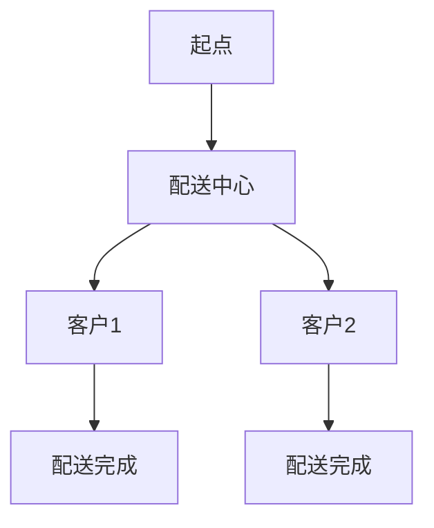

                 

### 文章标题

《智能物流配送优化：独立电商提升配送效率的车辆路径规划算法》

### 关键词

- 智能物流
- 配送优化
- 车辆路径规划
- 独立电商
- 车辆调度算法
- 时间窗优化

### 摘要

本文旨在探讨独立电商在提升配送效率方面的关键手段——车辆路径规划算法。首先，文章介绍了智能物流配送的定义、特点及其在独立电商物流配送中的重要性。接着，我们深入分析了物流配送网络规划的基础知识以及车辆路径规划算法的核心概念与分类。随后，本文重点探讨了基于时间窗的配送调度、动态配送路径优化、多机器人协同配送以及实时配送调度优化等策略。通过具体实例，文章展示了这些策略在实际中的应用效果。最后，本文通过实际案例分析和代码解读，总结了车辆路径规划算法的实现与优化方法，为独立电商提升配送效率提供了科学依据和实战指导。

## 《智能物流配送优化：独立电商提升配送效率的车辆路径规划算法》目录大纲

### 第一部分：智能物流配送优化基础

#### 第1章：智能物流配送概述

- 1.1 智能物流的定义与特点
- 1.2 独立电商物流配送的现状与挑战
- 1.3 物流配送优化的意义

#### 第2章：物流配送网络规划基础

- 2.1 物流配送网络的构建
- 2.2 节点与边的基本属性
- 2.3 物流配送网络优化目标

#### 第3章：车辆路径规划算法基础

- 3.1 车辆路径规划概述
- 3.2 车辆路径规划算法分类
- 3.3 车辆路径规划关键因素分析

### 第二部分：独立电商配送效率优化策略

#### 第4章：基于时间窗的配送调度

- 4.1 时间窗的概念与作用
- 4.2 时间窗优化算法介绍
- 4.3 实例：基于时间窗的配送调度问题

#### 第5章：动态配送路径优化

- 5.1 动态配送路径的概念
- 5.2 动态路径规划算法
- 5.3 实例：动态配送路径优化应用

#### 第6章：多机器人协同配送

- 6.1 多机器人协同配送概述
- 6.2 多机器人协同算法
- 6.3 实例：多机器人协同配送系统设计

#### 第7章：实时配送调度优化

- 7.1 实时配送调度的需求
- 7.2 实时配送调度算法
- 7.3 实例：实时配送调度系统实现

### 第三部分：车辆路径规划算法应用与实践

#### 第8章：独立电商配送效率优化案例分析

- 8.1 案例背景与目标
- 8.2 配送网络规划
- 8.3 车辆路径规划
- 8.4 配送效率评估

#### 第9章：车辆路径规划算法实现

- 9.1 实现环境搭建
- 9.2 车辆路径规划算法实现
- 9.3 调试与优化

#### 第10章：项目实战与评估

- 10.1 项目设计与实施
- 10.2 项目评估与改进
- 10.3 项目总结与展望

### 附录

#### 附录A：相关算法与工具简介

- 10.1 常见路径规划算法
- 10.2 物流配送优化工具
- 10.3 实时配送调度平台

#### 附录B：参考文献

- 10.1 相关书籍
- 10.2 学术论文
- 10.3 网络资源

### Mermaid 流程图示例：



### 伪代码示例：

```python
# 车辆路径规划伪代码
function vehicle_path_planning(route, demand):
    sorted_routes = sort(route, by=demand, descending=true)
    path = []

    for route in sorted_routes:
        if route.is_empty():
            continue
        path.append(route)

    return path
```

### 数学公式与解释示例

段落内公式：$$C_{max} = \sum_{i=1}^{n} (d_i + \delta_i)$$

独立段落公式：
$$\text{配送成本} = C_{fixed} + C_{variable}$$

其中，$C_{fixed}$为固定成本，$C_{variable}$为变量成本，$d_i$为第$i$个订单的配送距离，$\delta_i$为第$i$个订单的配送延迟成本。

### 实际案例与代码解读示例

**案例背景：** 某电商平台需要为其门店到用户的订单进行配送，现有多个配送点，每个配送点的订单量不同。

**代码实现：**

```python
# 导入相关库
import networkx as nx
from collections import defaultdict

# 创建配送网络
G = nx.Graph()

# 添加节点和边
G.add_nodes_from(['配送中心', '门店A', '门店B', '用户1', '用户2'])
G.add_edges_from([('配送中心', '门店A'), ('配送中心', '门店B'), ('门店A', '用户1'), ('门店B', '用户2')])

# 设置配送距离和延迟成本
distances = {
    ('配送中心', '门店A'): 10,
    ('配送中心', '门店B'): 15,
    ('门店A', '用户1'): 5,
    ('门店B', '用户2'): 7
}

delays = {
    ('配送中心', '门店A'): 2,
    ('配送中心', '门店B'): 3,
    ('门店A', '用户1'): 1,
    ('门店B', '用户2'): 2
}

# 车辆路径规划算法实现
def vehicle_path_planning(G, distances, delays):
    # 计算配送路径
    paths = nx.single_source_dijkstra(G, '配送中心', weight='距离')

    # 调整路径顺序，按延迟成本排序
    sorted_paths = sorted(paths.items(), key=lambda x: delays[x[0][1]], reverse=True)

    # 构建最终配送路径
    final_path = []
    for path in sorted_paths:
        if path[1] not in final_path:
            final_path.append(path[1])

    return final_path

# 运行车辆路径规划算法
optimized_path = vehicle_path_planning(G, distances, delays)

# 打印优化后的配送路径
print("优化后的配送路径：", optimized_path)
```

在上述代码中，我们首先创建了配送网络，并设定了配送距离和延迟成本。然后，使用 Dijkstra 算法计算从配送中心到各个配送点的最优路径。最后，根据延迟成本对路径进行排序，并构建最终的配送路径。通过这个案例，我们可以看到如何使用 Python 和 NetworkX 库来实现车辆路径规划算法，从而为独立电商提升配送效率提供技术支持。接下来，我们将深入探讨智能物流配送优化中的关键策略和技术。

