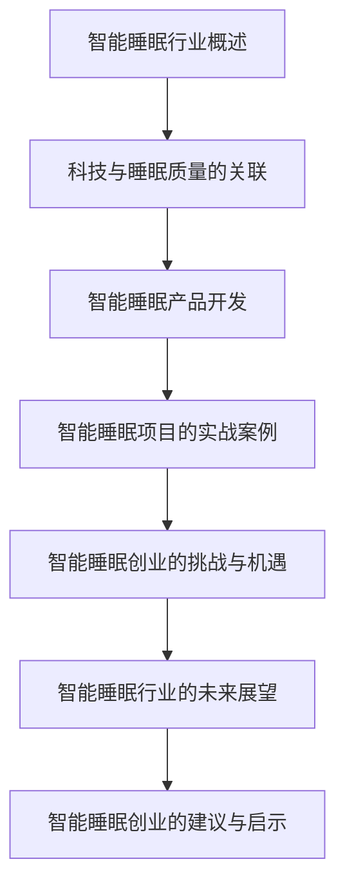

                 

## 文章标题：智能睡眠创业：科技改善睡眠质量

### 关键词：
- 智能睡眠
- 科技应用
- 睡眠质量
- 产品开发
- 创业挑战与机遇

### 摘要：
本文探讨了智能睡眠创业的背景和重要性，分析了科技在改善睡眠质量方面的作用。通过详细解读智能睡眠产品的核心功能、设计原则和开发流程，以及案例研究，本文旨在为创业者和科技爱好者提供有价值的见解和指导，帮助他们在智能睡眠领域取得成功。

## 目录大纲

### 第一部分：智能睡眠行业概述

#### 第1章：智能睡眠市场分析与现状
##### 1.1 智能睡眠市场的发展历程
##### 1.2 当前智能睡眠行业的主要参与者
##### 1.3 智能睡眠行业的市场规模与趋势

#### 第2章：科技与睡眠质量的关联
##### 2.1 睡眠质量的重要性
##### 2.2 科技对睡眠质量的影响
##### 2.3 常见科技改善睡眠质量的方法

### 第二部分：智能睡眠产品开发

#### 第3章：智能睡眠产品的核心功能
##### 3.1 睡眠监测
##### 3.2 睡眠建议
##### 3.3 睡眠环境优化

#### 第4章：智能睡眠产品的设计原则
##### 4.1 用户体验
##### 4.2 数据安全
##### 4.3 产品可持续性

#### 第5章：智能睡眠产品的开发流程
##### 5.1 需求分析与规划
##### 5.2 技术选型与架构设计
##### 5.3 测试与迭代

### 第三部分：智能睡眠项目的实战案例

#### 第6章：智能睡眠创业案例分析
##### 6.1 案例背景
##### 6.2 创业团队组建
##### 6.3 产品开发与市场推广
##### 6.4 项目成果与挑战

#### 第7章：智能睡眠项目技术实现
##### 7.1 硬件设备选型与接口设计
##### 7.2 软件架构与算法设计
##### 7.3 数据分析与可视化
##### 7.4 开发工具与开发环境搭建

### 第四部分：智能睡眠创业的挑战与机遇

#### 第8章：智能睡眠创业的挑战
##### 8.1 技术挑战
##### 8.2 市场竞争
##### 8.3 法规与伦理

#### 第9章：智能睡眠创业的机遇
##### 9.1 市场需求
##### 9.2 技术进步
##### 9.3 政策支持

### 第五部分：智能睡眠行业的未来展望

#### 第10章：智能睡眠行业的发展趋势
##### 10.1 产业链的完善
##### 10.2 新技术的应用
##### 10.3 国际市场的扩展

#### 第11章：智能睡眠创业的建议与启示
##### 11.1 创业者的素质与能力
##### 11.2 创业团队的组织与管理
##### 11.3 创业项目的可持续性
##### 11.4 智能睡眠创业的案例分析

### 附录

#### 附录A：智能睡眠相关术语解释
#### 附录B：智能睡眠产品开发指南
#### 附录C：智能睡眠创业资源链接

### Mermaid 流程图

## 第1章：智能睡眠市场分析与现状

### 1.1 智能睡眠市场的发展历程

智能睡眠市场的兴起可以追溯到21世纪初，当时人们对健康和生活方式的关注度逐渐提高。随着科技的发展，尤其是物联网、可穿戴设备和数据分析技术的进步，智能睡眠产品开始进入人们的日常生活。早期的智能睡眠设备主要功能包括简单的睡眠监测和数据分析，而随着技术的不断成熟，智能睡眠产品的功能越来越丰富，涵盖了睡眠质量评估、健康建议、睡眠环境优化等多个方面。

在过去的十年里，智能睡眠市场经历了快速的发展。根据市场研究公司的数据，全球智能睡眠市场的规模在2020年达到了数十亿美元，预计在未来几年内将继续保持高速增长。这一增长得益于消费者对健康意识的提高、科技产品的普及以及医疗保健领域的需求增加。

### 1.2 当前智能睡眠行业的主要参与者

智能睡眠行业的参与者包括硬件制造商、软件开发公司、医疗服务提供商和初创企业。其中，硬件制造商如Fitbit、Apple和Samsung等公司，通过推出智能手表和智能手环等可穿戴设备，为用户提供睡眠监测和数据跟踪功能。软件开发公司则专注于提供智能睡眠应用程序，如Google Nest和SleepScore等，通过整合硬件设备和数据分析，为用户提供全面的睡眠管理解决方案。

医疗服务提供商如SleepScore Labs和SleepCycle等，通过提供专业的睡眠评估和建议，帮助用户改善睡眠质量。初创企业则在这个领域积极创新，推出了一系列新颖的智能睡眠产品，如智能床垫、智能枕头和智能灯光系统等。

### 1.3 智能睡眠行业的市场规模与趋势

根据市场研究公司的数据，全球智能睡眠市场的规模在2020年已经达到数十亿美元，并且预计在未来几年内将继续保持高速增长。这一增长趋势受到多个因素的推动，包括消费者对健康和睡眠质量的关注、科技产品的普及、以及医疗保健领域对智能睡眠技术的需求。

此外，随着智能睡眠产品的功能越来越丰富，用户对其的接受度也在不断提高。越来越多的消费者开始将智能睡眠产品作为日常生活的一部分，这进一步推动了市场的发展。未来，智能睡眠行业将继续受益于技术进步、市场需求的增加以及政策支持的加强。

### 第2章：科技与睡眠质量的关联

#### 2.1 睡眠质量的重要性

睡眠质量对人体健康有着至关重要的影响。良好的睡眠有助于身体和大脑的恢复，提高记忆力和认知功能，增强免疫力，降低患病风险。睡眠质量差则可能导致疲劳、注意力不集中、情绪波动、体重增加等多种健康问题。

根据世界卫生组织的报告，全球约三分之一的人口存在睡眠障碍，这给个人和社会带来了巨大的负担。提高睡眠质量已成为全球健康领域的重要议题，而科技在这一过程中发挥着关键作用。

#### 2.2 科技对睡眠质量的影响

科技在改善睡眠质量方面发挥着重要作用，主要表现在以下几个方面：

1. **睡眠监测与数据分析**：智能睡眠设备能够监测用户的睡眠模式，如睡眠时长、深度、觉醒次数等，通过数据分析提供个性化的睡眠建议。
   
2. **睡眠环境优化**：通过智能家居技术，用户可以远程控制睡眠环境，如调节室温、光线和噪音，以创造更有利于睡眠的环境。

3. **睡眠习惯管理**：智能应用可以帮助用户培养良好的睡眠习惯，如设定合理的睡眠时间、减少使用电子设备等。

4. **心理健康支持**：科技产品不仅能够监测用户的睡眠状况，还可以提供心理健康支持，如放松训练、睡眠指导等。

#### 2.3 常见科技改善睡眠质量的方法

以下是几种常见的科技改善睡眠质量的方法：

1. **可穿戴设备**：如智能手表和智能手环，可以监测用户的睡眠模式，并提供实时反馈和改进建议。

2. **智能床垫和枕头**：这些设备通过内置传感器监测用户的睡姿和睡眠质量，并自动调整以提供更舒适的睡眠环境。

3. **智能灯光系统**：通过调节光线亮度和色温，帮助用户创造更适合睡眠的环境。

4. **智能音箱和应用程序**：提供放松音乐、睡眠故事和呼吸指导等功能，帮助用户更快入睡。

5. **远程医疗咨询**：通过视频会议和远程监测，医生可以提供专业的睡眠咨询和治疗方案。

通过这些科技手段，用户可以更好地了解自己的睡眠状况，采取有效的措施改善睡眠质量，从而提高整体健康水平。

### 第3章：智能睡眠产品的核心功能

智能睡眠产品通过多种核心功能帮助用户监测、分析和改善睡眠质量。以下是智能睡眠产品的三个主要核心功能：

#### 3.1 睡眠监测

睡眠监测是智能睡眠产品的核心功能之一，旨在通过记录和分析用户的睡眠模式，为用户提供关于睡眠质量的数据和反馈。以下是睡眠监测的几个关键方面：

1. **监测指标**：
   - **睡眠时长**：记录用户在夜间实际睡眠的时间长度。
   - **睡眠深度**：监测用户在不同阶段的睡眠深度，包括浅睡眠、深睡眠和快速眼动（REM）睡眠。
   - **觉醒次数**：记录用户在夜间醒来的次数和持续时间。
   - **心率、呼吸和体温**：一些高端设备可以监测这些生理指标，以进一步分析用户的睡眠质量。

2. **监测技术**：
   - **加速度传感器**：用于检测用户的运动和睡姿。
   - **心电图（ECG）**：监测用户的心率和心律。
   - **呼吸传感器**：通过声音或压力变化监测用户的呼吸状况。
   - **温度传感器**：监测环境温度和用户体温。

3. **监测数据的处理与分析**：
   - **数据采集**：通过传感器收集睡眠数据。
   - **数据传输**：将数据无线传输到智能手机或电脑。
   - **数据分析**：使用算法分析数据，生成睡眠报告和改进建议。

#### 3.2 睡眠建议

智能睡眠产品不仅监测用户的睡眠模式，还提供个性化的睡眠建议，帮助用户改善睡眠质量。以下是一些常见的睡眠建议：

1. **睡眠问题的诊断**：
   - 根据监测数据，分析用户可能存在的睡眠问题，如失眠、睡眠中断、睡眠呼吸暂停等。

2. **睡前习惯的建议**：
   - 提供建议，如睡前避免使用电子设备、保持规律的作息时间、进行放松活动等。

3. **睡眠环境的优化**：
   - 根据用户的睡眠数据，提供关于睡眠环境优化的建议，如调整床垫硬度、控制室温、使用噪音消除设备等。

#### 3.3 睡眠环境优化

睡眠环境对睡眠质量有着重要影响，智能睡眠产品通过以下方式帮助用户优化睡眠环境：

1. **睡眠房温度控制**：
   - 智能恒温器可以调节房间温度，以提供一个舒适的睡眠环境。研究表明，温度在15-20摄氏度之间对睡眠最为有利。

2. **光照调节**：
   - 智能灯光系统能够调节光线亮度和色温，模拟日出和日落，帮助用户调整生物钟，促进更高质量的睡眠。

3. **噪音控制**：
   - 一些智能睡眠设备内置噪音消除功能，可以通过播放白噪声或自然环境声音来减少环境噪音，帮助用户更快入睡。

通过这些核心功能，智能睡眠产品不仅帮助用户了解自己的睡眠状况，还提供具体的改善建议和措施，从而全面提升用户的睡眠质量。

### 第4章：智能睡眠产品的设计原则

智能睡眠产品的设计不仅要考虑功能实现，还要注重用户体验、数据安全和产品的可持续性。以下是智能睡眠产品设计中需要遵循的关键原则：

#### 4.1 用户体验

用户体验（User Experience, UX）是智能睡眠产品设计过程中至关重要的一个方面。一个优秀的用户体验可以让用户更容易接受和使用产品，从而达到提高睡眠质量的目的。以下是一些关键的设计原则：

1. **用户需求分析**：
   - 设计团队需要深入了解目标用户的需求和痛点，通过用户调研、访谈和数据分析等方法获取信息。
   - 需求分析应包括用户对睡眠监测、建议和睡眠环境优化的期望，以及他们在使用智能睡眠产品时的使用习惯和偏好。

2. **用户界面设计**：
   - 用户界面（User Interface, UI）设计应简洁直观，避免复杂的操作流程，确保用户能够轻松上手。
   - 设计应注重信息传达的清晰性，通过适当的图标、颜色和文字说明帮助用户快速理解功能和使用方法。
   - 应用响应速度和流畅度也是用户体验的重要方面，确保用户在使用过程中不会遇到卡顿或错误。

3. **易用性测试**：
   - 在产品设计阶段，应进行易用性测试（Usability Testing），邀请实际用户参与，观察他们在使用产品时的反馈和操作行为。
   - 根据测试结果，对设计进行迭代优化，解决用户在使用过程中遇到的问题，提高产品的易用性。

#### 4.2 数据安全

数据安全是智能睡眠产品设计过程中必须考虑的重要问题。用户的数据不仅包含个人的健康信息，还可能涉及支付信息和隐私信息，因此确保数据的安全性至关重要。以下是一些关键的设计原则：

1. **数据收集与处理**：
   - 在设计阶段，应明确数据收集的必要性和合法性，确保只收集对改善睡眠质量有用的数据。
   - 数据处理过程中，应采取加密措施，确保数据在传输和存储过程中的安全。

2. **数据存储与保护**：
   - 数据应存储在安全的服务器上，采取多种安全措施，如防火墙、加密存储、定期备份等。
   - 应制定严格的数据访问控制策略，确保只有授权人员才能访问和处理数据。

3. **用户隐私保护**：
   - 设计应遵循隐私保护法规，如GDPR（通用数据保护条例），确保用户的隐私权得到尊重和保护。
   - 应向用户提供透明的隐私政策，明确数据收集、存储和使用的方式，以及用户的权利。

#### 4.3 产品可持续性

智能睡眠产品的可持续性设计旨在减少产品对环境的影响，同时确保产品的长期可用性和社会价值。以下是一些关键的设计原则：

1. **环境影响**：
   - 在设计过程中，应考虑产品的整个生命周期，从原材料选择、制造、使用到废弃处理，尽量减少对环境的影响。
   - 优先使用环保材料和可再生资源，减少废物产生。

2. **资源利用**：
   - 设计应考虑能源效率和资源优化，如使用低功耗芯片、智能能源管理等。
   - 产品应设计为可升级和可修复，延长使用寿命，减少更换频率。

3. **社会责任**：
   - 设计应体现企业的社会责任，如提供公平的工作条件、支持公益项目等。
   - 应积极参与社会公益事业，如提供免费的健康咨询或支持睡眠障碍患者的康复项目。

通过遵循上述设计原则，智能睡眠产品不仅能够提供高质量的睡眠解决方案，还能满足用户对安全性、可持续性和社会责任的需求，从而在竞争激烈的市场中脱颖而出。

### 第5章：智能睡眠产品的开发流程

智能睡眠产品的开发是一个复杂而系统化的过程，涵盖了多个阶段，包括需求分析、技术选型、架构设计、测试与迭代等。以下是智能睡眠产品开发的具体流程：

#### 5.1 需求分析与规划

需求分析是智能睡眠产品开发的第一步，旨在明确产品功能和性能要求。以下是一些关键步骤：

1. **用户调研**：
   - 通过问卷调查、访谈和观察等方式，了解用户对睡眠监测、建议和环境优化的需求。
   - 调研应覆盖不同年龄、性别和职业背景的用户，以确保需求的全面性和多样性。

2. **市场分析**：
   - 研究竞争对手的产品特点和用户反馈，分析市场趋势和潜在需求。
   - 识别市场上的空白点和机会，确定产品的差异化策略。

3. **功能规划**：
   - 根据用户调研和市场分析结果，确定产品的核心功能和扩展功能。
   - 确保功能设计既满足用户需求，又具有实际可操作性。

4. **技术可行性分析**：
   - 评估现有技术能否满足产品需求，如传感器技术、数据分析算法等。
   - 分析技术实现的成本和难度，制定合理的技术路线。

#### 5.2 技术选型与架构设计

技术选型是智能睡眠产品开发的核心环节，决定了产品的性能、可靠性和可扩展性。以下是一些关键步骤：

1. **硬件选型**：
   - 选择适合的传感器和通信模块，如加速度传感器、心率传感器和Wi-Fi模块。
   - 考虑硬件的功耗、精度和可靠性，确保能够稳定运行。

2. **软件选型**：
   - 选择合适的操作系统和开发框架，如Android、iOS和Flutter。
   - 确保软件能够高效地处理和分析大量数据，并具备良好的用户体验。

3. **架构设计**：
   - 设计分布式架构，确保数据的实时性和安全性。
   - 架构应支持横向扩展，以应对用户量的增加。

4. **系统集成**：
   - 将硬件和软件集成到产品中，确保各个模块之间能够无缝协作。
   - 进行初步的功能测试，验证产品是否满足设计要求。

#### 5.3 测试与迭代

测试与迭代是智能睡眠产品开发过程中不可或缺的一环，旨在发现和修复问题，提高产品质量。以下是一些关键步骤：

1. **单元测试**：
   - 对每个模块进行独立的测试，确保其功能正确无误。
   - 使用测试框架（如JUnit、pytest）编写测试用例，确保测试覆盖率达到100%。

2. **集成测试**：
   - 将各个模块集成在一起进行测试，验证系统功能和性能。
   - 重点关注模块间的接口和交互，确保数据传输和功能调用无误。

3. **性能测试**：
   - 对产品的性能进行评估，如数据处理速度、响应时间等。
   - 通过压力测试和负载测试，确保产品在高并发情况下仍能稳定运行。

4. **用户测试**：
   - 邀请实际用户参与测试，收集用户体验和反馈。
   - 根据用户反馈，对产品进行优化和改进。

5. **迭代开发**：
   - 根据测试结果，对产品进行迭代开发，修复问题并引入新功能。
   - 持续进行测试与迭代，确保产品的稳定性和用户体验。

通过上述开发流程，智能睡眠产品能够从需求分析到最终上市，不断优化和完善，为用户提供高质量的睡眠解决方案。

### 第6章：智能睡眠创业案例分析

#### 6.1 案例背景

智能睡眠创业领域的首个成功案例之一是SleepScore Labs，这是一家成立于2013年的美国公司，致力于通过科技手段提升人们的睡眠质量。创始团队由一位睡眠科学家和几位具有技术背景的成员组成，他们共同意识到科技在改善睡眠质量方面具有巨大潜力，但市场上的产品往往缺乏科学依据和用户体验。

SleepScore Labs的初始目标是通过结合先进的睡眠监测技术和数据分析算法，开发一款能够准确评估睡眠质量的智能应用。他们希望通过这种方式，帮助用户了解自己的睡眠状况，并提供个性化的改善建议。

#### 6.2 创业团队组建

SleepScore Labs的创业团队由多位具有跨学科背景的成员组成，这为公司的技术创新和产品开发提供了坚实的基础。以下是团队的主要成员及其角色：

1. **首席科学官（CSO）**：负责公司的科学研究和产品研发，他是睡眠医学领域的专家，拥有多年的研究经验。
2. **首席技术官（CTO）**：负责公司的技术架构和开发工作，他拥有丰富的软件开发和数据分析经验。
3. **首席执行官（CEO）**：负责公司的战略规划、市场推广和业务拓展，他具有丰富的创业和管理经验。
4. **首席运营官（COO）**：负责公司的日常运营和管理，确保公司高效运转。

此外，SleepScore Labs还雇佣了其他关键岗位的专业人员，如市场营销经理、财务分析师和客户支持团队，以支持公司的整体发展。

#### 6.3 产品开发与市场推广

SleepScore Labs的产品开发过程可以分为以下几个阶段：

1. **研发阶段**：
   - 团队首先进行了大量的研究工作，分析了现有的睡眠监测技术和市场产品，确定了产品的核心功能和关键技术。
   - 他们开发了一款基于人工智能算法的睡眠分析引擎，能够通过分析用户的睡眠数据，提供准确的睡眠质量评估和建议。

2. **测试阶段**：
   - 在产品研发过程中，团队进行了多次用户测试，收集了大量的用户反馈，不断优化产品功能，提升用户体验。
   - 通过与睡眠医学专家的合作，团队确保了产品科学性和准确性的同时，也增加了用户的信任度。

3. **市场推广阶段**：
   - SleepScore Labs通过多种渠道进行市场推广，包括在线广告、社交媒体营销和线下展会等。
   - 他们与多家医疗保健机构和保险公司建立了合作关系，将产品推广到更广泛的用户群体。

#### 6.4 项目成果与挑战

SleepScore Labs在智能睡眠创业领域取得了显著的成果：

1. **项目成果**：
   - 公司开发的智能睡眠应用已经在全球范围内获得了数百万用户的下载和使用。
   - 产品得到了用户和行业的广泛认可，包括多项技术和产品奖项。
   - 公司成功获得了多轮融资，融资总额超过数千万美元。

2. **挑战**：
   - **技术挑战**：在产品研发过程中，团队遇到了多种技术难题，如数据采集的准确性、算法的优化和系统的稳定性等。
   - **市场挑战**：市场竞争激烈，SleepScore Labs需要不断推出新功能，以保持市场竞争力。
   - **法规与伦理挑战**：涉及用户健康数据的处理和隐私保护，团队需要严格遵守相关法规，确保用户的数据安全和隐私。

通过这些挑战，SleepScore Labs不断成长和壮大，为全球用户提供高质量的智能睡眠解决方案。

### 第7章：智能睡眠项目技术实现

智能睡眠项目的技术实现是构建成功产品的关键，涵盖了硬件设备选型、软件架构与算法设计、数据分析和可视化等多个方面。以下是智能睡眠项目技术实现的具体内容：

#### 7.1 硬件设备选型与接口设计

1. **硬件设备选型**：
   - **传感器**：选择适合的传感器是智能睡眠设备的核心，常用的传感器包括加速度传感器、心率传感器、呼吸传感器和温度传感器。这些传感器能够捕捉用户的睡眠状态和生理指标。
   - **通信模块**：为了实现数据的实时传输和远程访问，选择合适的通信模块至关重要。常见的通信模块包括Wi-Fi、蓝牙和Zigbee等。Wi-Fi模块适用于需要远程数据传输的应用，而蓝牙模块适合短距离的数据传输。
   - **电池寿命**：考虑到用户使用习惯，选择低功耗的硬件组件能够延长设备的电池寿命，提升用户体验。

2. **接口设计**：
   - **硬件接口**：智能睡眠设备通常需要与传感器、通信模块和电源模块等硬件组件进行连接。设计合理的接口可以简化硬件集成，提高设备的可靠性和稳定性。
   - **软件接口**：通过设计标准化的硬件接口，可以实现硬件组件与软件系统的无缝集成，方便后续的软件开发和维护。

#### 7.2 软件架构与算法设计

1. **软件架构**：
   - **分布式架构**：智能睡眠项目通常采用分布式架构，将数据处理和存储分布在多个节点上，以提高系统的性能和可靠性。
   - **微服务架构**：通过将系统划分为多个独立的微服务，可以更好地实现模块化和可扩展性，便于后续的功能扩展和维护。
   - **云服务集成**：将部分功能部署在云服务上，如数据处理、存储和分析等，可以充分利用云计算的弹性优势，降低运营成本。

2. **算法设计**：
   - **睡眠监测算法**：智能睡眠设备的核心算法之一是睡眠监测算法，它通过分析传感器数据，识别用户的睡眠阶段（如浅睡眠、深睡眠和REM睡眠）。
   - **生理指标分析算法**：基于心率、呼吸和体温等生理指标，智能睡眠设备可以分析用户的健康状况，如是否存在睡眠呼吸暂停或其他健康问题。
   - **个性化建议算法**：根据用户的睡眠数据和健康分析结果，算法可以提供个性化的睡眠建议，如调整作息时间、改善睡眠环境等。

#### 7.3 数据分析与可视化

1. **数据分析**：
   - **数据采集与处理**：智能睡眠设备采集到的数据需要经过预处理和清洗，以去除噪声和异常值，确保数据的准确性。
   - **数据存储**：采用合适的数据库系统（如MySQL、MongoDB等）存储大量睡眠数据，以便后续的数据分析和查询。
   - **数据挖掘与分析**：通过数据挖掘技术，对用户的睡眠数据进行分析，识别潜在的模式和趋势，为用户提供有价值的睡眠建议。

2. **可视化**：
   - **数据可视化**：通过图表、仪表板和交互式界面，将睡眠数据以直观的方式呈现给用户，帮助用户更好地理解自己的睡眠状况。
   - **交互设计**：设计友好的用户界面，使用户能够轻松查看和分析数据，同时提供个性化的互动体验。

通过以上技术实现，智能睡眠项目能够为用户提供全面的睡眠监测和改善方案，从而提升用户的睡眠质量和整体健康水平。

### 第8章：智能睡眠创业的挑战

智能睡眠创业虽然充满机遇，但也面临着诸多挑战，这些挑战主要集中在技术、市场竞争和法规伦理等方面。

#### 8.1 技术挑战

智能睡眠产品依赖于先进的传感技术、数据分析算法和通信技术，因此技术挑战是创业过程中必须面对的一大难题：

1. **传感器技术**：当前市场上的传感器技术如加速度传感器、心率传感器等仍存在一定的误差和不稳定性，这可能会影响睡眠监测的准确性。

2. **数据分析算法**：睡眠数据分析需要复杂的算法，包括机器学习和数据挖掘技术，但算法的准确性和效率仍是亟待解决的问题。

3. **通信技术**：智能睡眠设备需要稳定、高效的通信技术支持，如Wi-Fi、蓝牙等，以保证数据的实时传输和远程访问。

#### 8.2 市场竞争

智能睡眠市场正在迅速发展，但同时也面临着激烈的竞争：

1. **产品同质化**：市场上已有众多智能睡眠产品，产品功能和服务较为相似，差异化竞争变得越来越困难。

2. **技术迭代快**：科技日新月异，智能睡眠产品的技术更新速度非常快，创业公司需要不断跟进新技术，以保持竞争力。

3. **用户信任度**：用户对智能睡眠产品的信任度需要时间积累，创业公司需要通过高质量的产品和服务来建立用户信任。

#### 8.3 法规与伦理

智能睡眠产品在法规和伦理方面也面临诸多挑战：

1. **数据隐私**：用户数据的安全和隐私保护是法规关注的重要问题，创业公司需要严格遵守相关法律法规，如GDPR等。

2. **医疗监管**：智能睡眠产品涉及医疗健康领域，需要通过相关的医疗监管审批，这对创业公司来说是一个挑战。

3. **伦理问题**：智能睡眠产品在收集和分析用户数据时，如何平衡用户隐私和数据利用的伦理问题，是创业公司必须考虑的。

通过解决这些挑战，智能睡眠创业公司可以在激烈的市场竞争中脱颖而出，为用户提供更高质量的睡眠解决方案。

### 第9章：智能睡眠创业的机遇

智能睡眠创业不仅面临挑战，同时也蕴含着巨大的机遇。这些机遇主要来自于市场需求的增长、技术的不断进步以及政策的支持。

#### 9.1 市场需求

随着社会经济的发展和人们生活水平的提高，人们对健康和睡眠质量的关注也在不断增加。以下是一些推动智能睡眠市场增长的关键因素：

1. **人口老龄化**：随着全球人口老龄化，睡眠障碍如失眠和睡眠呼吸暂停等疾病的发病率逐渐上升，这为智能睡眠产品提供了巨大的市场需求。

2. **健康意识提升**：现代人越来越意识到睡眠质量对健康和生活质量的重要性，因此愿意投资于智能睡眠产品，以改善自己的睡眠状况。

3. **工作压力增大**：随着工作压力的增加，越来越多的职场人士需要智能睡眠产品来帮助他们缓解压力，提高工作效率。

#### 9.2 技术进步

技术的进步为智能睡眠创业带来了新的机遇：

1. **物联网技术**：物联网（IoT）技术的发展使得智能睡眠设备能够更好地与家居环境和其他智能设备集成，提供更加全面和个性化的睡眠解决方案。

2. **人工智能和机器学习**：人工智能和机器学习技术的应用使得智能睡眠设备能够更准确地分析和预测用户的睡眠状况，提供更加个性化的建议。

3. **可穿戴技术和传感器技术**：可穿戴技术和传感器技术的进步使得智能睡眠设备能够更加便捷地收集用户的睡眠数据，提高监测的准确性和可靠性。

#### 9.3 政策支持

政策支持是智能睡眠创业的重要推动力：

1. **健康政策**：各国政府纷纷推出健康政策，鼓励和支持健康科技的发展，包括智能睡眠产品。

2. **科技创新政策**：许多国家和地区都设立了科技创新基金和补贴，支持科技创新型企业的成长，这为智能睡眠创业公司提供了资金和政策支持。

3. **数据隐私保护法规**：随着数据隐私保护法规的完善，智能睡眠创业公司能够更好地遵守法规，保护用户的数据安全和隐私，增强用户信任。

通过把握这些机遇，智能睡眠创业公司可以在市场中获得更大的发展空间，为用户提供更加优质的睡眠解决方案。

### 第10章：智能睡眠行业的发展趋势

智能睡眠行业正朝着多个方向发展，这些趋势不仅影响了当前的产品形态，也将对未来的市场产生深远的影响。

#### 10.1 产业链的完善

智能睡眠产业链的不断完善将为行业的发展提供坚实的基础。以下是一些关键环节：

1. **硬件制造**：随着传感器技术和通信技术的进步，智能睡眠设备的硬件质量不断提升，制造工艺也更加成熟。

2. **软件开发**：智能睡眠软件的生态系统逐渐完善，包括应用开发、数据分析平台和云计算服务等。

3. **医疗服务**：智能睡眠设备与医疗服务的结合越来越紧密，为用户提供更全面的健康监测和管理服务。

4. **平台整合**：越来越多的企业开始整合硬件、软件和医疗服务，提供一体化的智能睡眠解决方案。

#### 10.2 新技术的应用

新技术的不断应用将推动智能睡眠行业向前发展：

1. **人工智能**：人工智能技术在智能睡眠中的应用日益广泛，包括睡眠数据分析、个性化建议和预测等。

2. **物联网（IoT）**：物联网技术使得智能睡眠设备能够更好地与家居环境和其他智能设备集成，提供更加无缝的用户体验。

3. **区块链**：区块链技术在智能睡眠数据的安全性和隐私保护方面具有潜力，有助于建立更加可信的数据共享机制。

4. **虚拟现实（VR）**：虚拟现实技术可用于创建更加沉浸式的睡眠环境，帮助用户放松身心，改善睡眠质量。

#### 10.3 国际市场的扩展

智能睡眠行业的国际市场扩展趋势明显：

1. **全球化**：智能睡眠产品逐渐进入国际市场，尤其是在亚太、欧洲和北美等地区，市场需求增长迅速。

2. **本地化**：为了适应当地市场的需求，智能睡眠创业公司需要针对不同地区进行本地化调整，包括语言、文化和支付方式等。

3. **合作与并购**：国际间的合作和并购活动增加，有助于企业在全球范围内拓展业务，提升市场竞争力。

通过把握这些发展趋势，智能睡眠行业将继续保持高速发展，为全球用户带来更好的睡眠体验。

### 第11章：智能睡眠创业的建议与启示

智能睡眠创业不仅需要创新的技术，还需要科学的策略和严谨的执行。以下是一些对创业者的建议与启示：

#### 11.1 创业者的素质与能力

1. **技术能力**：创业者应具备扎实的科技背景，了解智能睡眠产品的核心技术，如传感器技术、数据分析算法和物联网技术等。

2. **市场洞察力**：创业者需要具备敏锐的市场洞察力，了解用户需求和市场趋势，从而制定出切实可行的发展战略。

3. **领导力**：创业者应具备良好的领导力，能够组建和带领一个高效的团队，确保项目的顺利进行。

#### 11.2 创业团队的组织与管理

1. **跨学科团队**：智能睡眠创业需要一个跨学科团队，包括技术专家、市场营销专家、医疗服务专家等，以充分发挥各自的专业优势。

2. **高效沟通**：团队成员之间应保持高效沟通，确保信息畅通，减少误解和冲突。

3. **项目管理**：创业者应采用科学的项目管理方法，如敏捷开发，确保项目按时、按质完成。

#### 11.3 创业项目的可持续性

1. **社会责任**：创业项目应考虑社会责任，如环保、数据安全和用户隐私保护等，以提升企业的社会形象。

2. **可持续发展**：在产品设计和运营过程中，应注重资源的合理利用和环境保护，推动可持续发展。

3. **持续创新**：技术更新快速，创业者应保持持续创新的能力，不断推出新产品和功能，以保持市场竞争力。

#### 11.4 智能睡眠创业的案例分析

以下是对SleepScore Labs的案例分析，以提供更多启示：

1. **成功因素**：
   - **科学的研发基础**：SleepScore Labs的创业团队由多位睡眠医学专家和科技人才组成，这为公司的技术实力和科学性提供了保障。
   - **用户导向**：公司始终坚持用户需求为导向，通过大量的用户调研和测试，确保产品的实用性和用户体验。
   - **多元化的市场推广**：公司通过多种渠道进行市场推广，包括在线广告、社交媒体营销和线下展会等，扩大了品牌影响力。

2. **经验教训**：
   - **技术挑战**：在产品研发过程中，公司面临了多种技术难题，如传感器数据准确性和算法优化等，通过持续的技术创新和团队合作，成功克服了这些挑战。
   - **市场策略**：公司在市场推广过程中，不断调整策略，根据市场需求和竞争态势，优化产品功能和服务。

通过以上案例分析和建议，创业者可以更好地规划智能睡眠创业项目，提升成功概率。

### 附录

#### 附录A：智能睡眠相关术语解释

1. **睡眠监测**：通过传感器和算法记录和分析用户的睡眠模式。
2. **睡眠质量**：衡量用户在夜间获得充分、高质量睡眠的程度。
3. **可穿戴设备**：如智能手表和智能手环，用于监测用户的睡眠数据。
4. **物联网**：将各种设备连接到互联网，实现智能控制和数据交换。
5. **人工智能**：模拟人类智能行为的计算系统，用于数据分析和提供个性化建议。
6. **睡眠呼吸暂停**：睡眠过程中呼吸暂停的现象，可能影响睡眠质量和健康。
7. **用户体验**：用户在使用产品过程中感受到的整体体验，包括易用性和满意度。

#### 附录B：智能睡眠产品开发指南

1. **需求分析**：明确用户需求和市场趋势，制定产品功能规划。
2. **技术选型**：选择合适的硬件和软件技术，确保产品性能和稳定性。
3. **用户体验设计**：设计直观、易用的用户界面，提升用户体验。
4. **测试与迭代**：进行全面的测试，根据用户反馈进行产品迭代。
5. **数据安全和隐私保护**：确保用户数据的安全和隐私。

#### 附录C：智能睡眠创业资源链接

1. **学术研究**：[Sleep Research Society](https://www.sleepresearchsociety.org/)
2. **市场报告**：[Grand View Research](https://www.grandviewresearch.com/industry/smart-sleep-market)
3. **创业平台**：[Kickstarter](https://www.kickstarter.com/)
4. **技术论坛**：[Stack Overflow](https://stackoverflow.com/)
5. **法律法规**：[GDPR Official Website](https://www.eugdpr.org/)

通过这些资源和指南，创业者可以更好地开展智能睡眠创业项目，实现创新和突破。

### Mermaid 流程图

