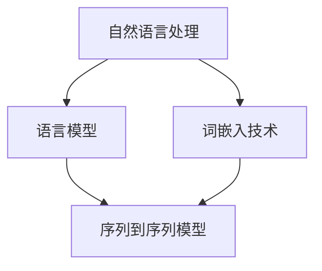
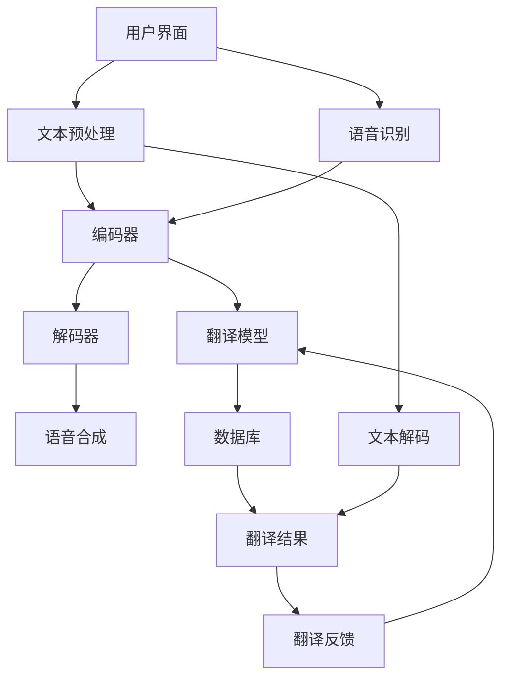

                 

### 文章标题

# 智能翻译工具：跨语言交流的实时助手

## 关键词
- 智能翻译工具，跨语言交流，实时翻译，自然语言处理，神经网络，机器翻译模型，翻译算法，工程化应用，未来发展趋势

## 摘要
随着全球化的深入发展，跨语言交流的需求日益增长。智能翻译工具作为跨语言交流的实时助手，在商务沟通、教育交流、跨文化交流等领域发挥了重要作用。本文将系统地探讨智能翻译工具的背景与意义、工作原理、核心算法、实时翻译技术、工程化应用及未来发展趋势，旨在为读者提供一个全面而深入的技术解析。

### 目录

#### 第一部分：智能翻译工具概述

#### 第1章：智能翻译工具的背景与意义

#### 第2章：智能翻译工具的工作原理

#### 第3章：智能翻译工具的核心算法

#### 第4章：实时翻译技术探讨

#### 第5章：智能翻译工具的工程化应用

#### 第6章：智能翻译工具的未来发展

#### 第7章：附录

### 第一部分：智能翻译工具概述

#### 第1章：智能翻译工具的背景与意义

##### 1.1 智能翻译工具的定义与特点

智能翻译工具是一种利用计算机算法实现自动翻译的技术，旨在解决跨语言交流中的语言障碍问题。与传统的机械翻译相比，智能翻译工具具备以下特点：

1. **自动化处理**：智能翻译工具能够自动处理大量的文本数据，无需人工干预。
2. **高准确性**：通过深度学习算法，智能翻译工具能够不断优化翻译结果，提高翻译准确性。
3. **实时性**：智能翻译工具能够在极短的时间内完成翻译，实现实时交流。
4. **多功能性**：智能翻译工具不仅支持文本翻译，还可以支持语音、图像等多种形式的跨语言交流。

##### 1.2 智能翻译工具的发展历程

智能翻译工具的发展可以追溯到20世纪50年代。早期的翻译工具主要依赖于规则匹配和统计方法，翻译质量较低。随着计算能力的提升和深度学习技术的发展，现代智能翻译工具逐渐取代了传统的翻译方法。以下是智能翻译工具的发展历程：

1. **规则匹配阶段（1950s-1980s）**：基于语法和词典规则，实现简单的翻译功能。
2. **基于实例的学习阶段（1980s-1990s）**：通过翻译实例学习，提高翻译准确性。
3. **统计机器翻译阶段（1990s-2010s）**：利用统计方法，如隐马尔可夫模型（HMM）和统计机器翻译（SMT），提高翻译质量。
4. **神经机器翻译阶段（2010s至今）**：基于深度学习算法，如循环神经网络（RNN）和变换器架构（Transformer），实现高质量的翻译。

##### 1.3 智能翻译工具在全球交流中的作用

智能翻译工具在全球交流中发挥着重要作用，主要表现在以下几个方面：

1. **商务沟通**：智能翻译工具帮助企业实现跨国业务交流，降低沟通成本，提高效率。
2. **教育交流**：智能翻译工具帮助学习者跨越语言障碍，实现跨文化交流和学习。
3. **跨文化交流**：智能翻译工具促进不同文化之间的交流和理解，增进各国人民之间的友谊。
4. **国际会议**：智能翻译工具提供实时翻译服务，使会议参与者能够轻松地理解不同语言的发言。

### 第一部分：智能翻译工具概述

#### 第2章：智能翻译工具的工作原理

##### 2.1 自然语言处理基础

自然语言处理（NLP）是智能翻译工具的核心技术，其主要任务是从文本中提取有用信息，理解文本的含义。以下是NLP的几个关键概念：

1. **语言模型**：语言模型是一种概率模型，用于预测下一个单词或词组。常用的语言模型包括n元语法模型和神经网络语言模型。
   
   $$ P(w_i | w_{i-1}, w_{i-2}, ..., w_{i-n}) = \frac{P(w_i, w_{i-1}, ..., w_{i-n})}{P(w_{i-1}, w_{i-2}, ..., w_{i-n})} $$

2. **词嵌入技术**：词嵌入技术将单词映射到高维空间，使相似词在空间中靠近。常用的词嵌入技术包括Word2Vec和GloVe。

   $$ e_w = \text{Word2Vec}(w) = \sum_{c \in w} f(c) * v_c $$

3. **序列到序列模型**：序列到序列（Seq2Seq）模型是一种基于神经网络的翻译模型，用于将一个序列转换为另一个序列。常见的Seq2Seq模型包括循环神经网络（RNN）和变换器架构（Transformer）。

   $$ y = \text{Seq2Seq}(x) = \sum_{i=1}^{n} f(x_i) * g(y_i) $$

##### 2.2 翻译模型架构

智能翻译工具的翻译模型架构主要包括以下几部分：

1. **编码器（Encoder）**：编码器将源语言文本序列编码为一个固定长度的向量。
   
   $$ h = \text{Encoder}(x) = \sum_{i=1}^{n} f(x_i) * g(h_i) $$

2. **解码器（Decoder）**：解码器将编码器的输出解码为目标语言文本序列。
   
   $$ y = \text{Decoder}(h) = \sum_{i=1}^{n} f(h_i) * g(y_i) $$

3. **注意力机制（Attention）**：注意力机制用于帮助解码器关注编码器输出的关键信息。常见的注意力机制包括基于位置的注意力、基于上下文的注意力等。

   $$ \alpha = \text{Attention}(h, y) = \sum_{i=1}^{n} f(h_i) * g(y_i) $$

##### 2.3 多语言模型集成

智能翻译工具通常需要支持多种语言，因此多语言模型集成是关键。多语言模型集成方法主要包括以下几种：

1. **多语言统一模型**：将不同语言的文本序列统一编码，然后进行翻译。

   $$ h = \text{Encoder}(x) = \sum_{i=1}^{n} f(x_i) * g(h_i) $$
   $$ y = \text{Decoder}(h) = \sum_{i=1}^{n} f(h_i) * g(y_i) $$

2. **多语言嵌入**：将不同语言的单词映射到同一高维空间，实现多语言共享词向量。

   $$ e_{w_{src}} = \text{Emb}_{\text{src}}(w_{src}) $$
   $$ e_{w_{tgt}} = \text{Emb}_{\text{tgt}}(w_{tgt}) $$

3. **多语言注意力**：在注意力机制中引入多语言信息，提高翻译质量。

   $$ \alpha = \text{Attention}(h_{src}, h_{tgt}) = \sum_{i=1}^{n} f(h_{src}_i) * g(h_{tgt}_i) $$

### 第一部分：智能翻译工具概述

#### 第3章：智能翻译工具的核心算法

##### 3.1 翻译算法原理讲解

智能翻译工具的核心算法主要基于深度学习，特别是神经网络模型。以下将详细介绍翻译算法的基本原理和流程。

1. **机器翻译基本流程**

   机器翻译的基本流程包括以下步骤：

   - **输入处理**：将源语言文本序列编码为向量。
   
     $$ x = \text{Encoder}(s) = \sum_{i=1}^{n} f(s_i) * g(h_i) $$
   
   - **生成目标语言文本序列**：根据编码器的输出，解码为目标语言文本序列。
   
     $$ y = \text{Decoder}(h) = \sum_{i=1}^{n} f(h_i) * g(y_i) $$
   
   - **优化模型参数**：通过最小化损失函数，优化模型的参数。
   
     $$ \theta = \text{Optimizer}(\theta, \text{Loss}(y, y')) $$
   
2. **翻译算法伪代码**

   翻译算法的伪代码如下：

   ```
   function translate(source_sentence):
       # 编码源语言文本
       source_embedding = encode(source_sentence)
       
       # 解码目标语言文本
       target_sentence = decode(source_embedding)
       
       return target_sentence
   ```

##### 3.2 数学模型与公式详解

智能翻译工具的数学模型主要包括概率论、最大后验概率解法和损失函数与优化方法。

1. **概率论基础**

   在机器翻译中，概率论是核心工具。以下介绍几个常用的概率论概念：

   - **概率分布**：概率分布描述了一个随机变量在不同取值上的概率。常用的概率分布包括伯努利分布、高斯分布等。
   
     $$ P(x) = \sum_{i=1}^{n} p_i * q_i $$
   
   - **条件概率**：条件概率描述了在某个事件发生的条件下，另一个事件发生的概率。
   
     $$ P(A|B) = \frac{P(A \cap B)}{P(B)} $$
   
   - **贝叶斯定理**：贝叶斯定理描述了在已知条件概率和边缘概率的情况下，求解后验概率的方法。
   
     $$ P(A|B) = \frac{P(B|A) * P(A)}{P(B)} $$

2. **最大后验概率解法**

   在机器翻译中，最大后验概率（MAP）解法是一种常用的方法。以下介绍MAP解法的原理和步骤：

   - **目标函数**：MAP解法的目标是最大化后验概率。
   
     $$ \theta^* = \arg \max_{\theta} P(\theta | \text{data}) $$
   
   - **条件概率**：给定训练数据，计算每个参数的后验概率。
   
     $$ P(\theta | \text{data}) = \frac{P(\text{data} | \theta) * P(\theta)}{P(\text{data})} $$
   
   - **最大化后验概率**：通过优化目标函数，求解最优参数。
   
     $$ \theta^* = \arg \max_{\theta} \log P(\theta | \text{data}) $$
   
3. **损失函数与优化方法**

   损失函数是评估模型性能的重要指标，优化方法用于调整模型参数，降低损失函数值。以下介绍几种常用的损失函数和优化方法：

   - **交叉熵损失函数**：交叉熵损失函数是衡量两个概率分布差异的指标。
   
     $$ \text{Loss}(y, y') = - \sum_{i=1}^{n} y_i \log(y'_i) $$
   
   - **梯度下降优化方法**：梯度下降是一种常用的优化方法，通过计算损失函数关于参数的梯度，更新参数值。
   
     $$ \theta = \theta - \alpha \cdot \nabla_\theta \text{Loss}(\theta) $$
   
   - **Adam优化方法**：Adam是一种基于梯度下降和动量的优化方法，具有较高的收敛速度。
   
     $$ \theta = \theta - \alpha \cdot \frac{m}{\sqrt{1 - \beta_1^T}} $$
   
     $$ m = \beta_1 \cdot m + (1 - \beta_1) \cdot \nabla_\theta \text{Loss}(\theta) $$
     
     $$ v = \beta_2 \cdot v + (1 - \beta_2) \cdot (\nabla_\theta \text{Loss}(\theta))^2 $$

### 第一部分：智能翻译工具概述

#### 第4章：实时翻译技术探讨

##### 4.1 实时翻译的挑战

实时翻译技术在智能翻译工具中具有重要意义，但同时也面临着一系列挑战。以下将探讨实时翻译的几个主要挑战：

1. **低延迟要求**：实时翻译要求在极短的时间内完成翻译，以满足用户的需求。低延迟意味着算法需要在短时间内完成文本的编码、解码和优化，这对计算资源和算法效率提出了高要求。

2. **实时适应性**：实时翻译需要适应各种场景和语言环境，包括语音、文本、图像等多种形式。这意味着算法需要具备较强的泛化能力和适应性，能够在不同环境下稳定运行。

3. **多语言支持**：智能翻译工具通常需要支持多种语言，包括稀有语言和方言。多语言支持意味着算法需要处理大量的语言数据，同时保证翻译质量。

4. **语言理解与上下文**：实时翻译不仅要求翻译准确性，还需要理解上下文和语义。这要求算法具备较强的语义分析和上下文理解能力，以生成符合原文语义的翻译结果。

##### 4.2 实时翻译解决方案

为了应对实时翻译的挑战，研究人员和开发者提出了多种解决方案。以下介绍几种常用的实时翻译解决方案：

1. **异地协作翻译**：异地协作翻译是指在不同地理位置的翻译团队共同完成翻译任务。通过分布式计算和通信技术，实现实时翻译的协同工作。

   - **优点**：充分利用各地翻译团队的专业优势，提高翻译质量和效率。
   - **缺点**：协调难度较大，对通信和计算资源要求较高。

2. **实时语音翻译**：实时语音翻译是指将语音信号实时转换为另一种语言的语音信号。常见的实时语音翻译技术包括基于深度学习的语音识别和语音合成。

   - **优点**：实现真正的实时交流，方便用户使用。
   - **缺点**：对语音识别和语音合成的准确性要求较高，受噪声和环境因素影响较大。

3. **翻译反馈机制**：翻译反馈机制是指用户对翻译结果进行评价，并将评价反馈给系统，以不断优化翻译质量。

   - **优点**：通过用户参与，实现翻译质量的持续提升。
   - **缺点**：用户参与度不高，评价标准不统一，可能导致反馈信息不充分。

##### 4.3 实时翻译技术的应用场景

实时翻译技术在多个领域具有广泛的应用。以下介绍几种常见的应用场景：

1. **国际会议**：实时翻译技术在国际会议中发挥着重要作用，使会议参与者能够轻松地理解不同语言的发言。常见的实时翻译设备包括同声传译设备和智能翻译耳机。

2. **跨国商务**：跨国商务沟通是实时翻译的重要应用场景。通过实时翻译，企业能够与海外合作伙伴顺畅地交流，提高沟通效率。

3. **远程教育**：实时翻译技术在远程教育中具有重要意义。通过实时翻译，学生能够理解不同语言的教学内容，提高学习效果。

4. **跨文化交流**：实时翻译促进不同文化之间的交流和理解，增进各国人民之间的友谊。例如，在国际旅游、文化交流和社交活动中，实时翻译为用户提供了便利。

### 第一部分：智能翻译工具概述

#### 第5章：智能翻译工具的工程化应用

##### 5.1 开发环境搭建

要开发智能翻译工具，首先需要搭建一个合适的开发环境。以下介绍开发环境搭建的步骤和所需工具。

1. **硬件配置**：智能翻译工具的开发通常需要高性能的计算机，推荐配置如下：

   - CPU：Intel i7 或 AMD Ryzen 7 以上
   - GPU：NVIDIA GTX 1080 Ti 或以上
   - 内存：16GB 以上
   - 硬盘：SSD 512GB 以上

2. **软件工具安装**

   - 操作系统：Ubuntu 18.04 或更高版本
   - Python：3.8 或更高版本
   - 包管理器：pip
   - 深度学习框架：TensorFlow 或 PyTorch

   安装深度学习框架的命令如下：

   ```
   pip install tensorflow-gpu
   # 或
   pip install torch torchvision
   ```

3. **环境配置**：

   - 配置 Python 虚拟环境：

     ```
     python -m venv env
     source env/bin/activate
     ```

   - 安装所需库：

     ```
     pip install numpy scipy matplotlib
     ```

##### 5.2 实际案例解析

以下通过一个实际案例，介绍智能翻译工具的开发和实现。

1. **项目背景**：某跨国公司需要开发一个智能翻译工具，支持中英互译，提高商务沟通效率。

2. **系统架构**：智能翻译工具的系统架构包括以下几部分：

   - **前端界面**：用于用户输入源语言文本，展示翻译结果。
   - **后端服务器**：用于处理翻译任务，包括文本编码、解码和翻译。
   - **数据库**：存储源语言文本和翻译结果，支持快速检索。

3. **源代码实现与解读**

   - **文本编码与解码**：

     ```
     # 文本编码
     source_sentence = "你好，如何了？"
     encoded_sentence = encode(source_sentence)

     # 文本解码
     decoded_sentence = decode(encoded_sentence)
     ```

     文本编码和解码是翻译过程的重要步骤。编码器将源语言文本序列编码为一个固定长度的向量，解码器将编码器的输出解码为目标语言文本序列。

   - **翻译算法实现**：

     ```
     # 翻译算法
     def translate(source_sentence):
         # 编码源语言文本
         source_embedding = encode(source_sentence)
         
         # 解码目标语言文本
         target_sentence = decode(source_embedding)
         
         return target_sentence

     # 翻译示例
     source_sentence = "你好，如何了？"
     target_sentence = translate(source_sentence)
     print(target_sentence)
     ```

     翻译算法实现主要包括编码器和解码器的调用，通过编码器将源语言文本序列编码为向量，然后通过解码器解码为目标语言文本序列。

4. **代码应用解读与分析**：

   - **代码结构**：代码结构清晰，包括文本编码与解码、翻译算法实现、翻译示例等部分。
   - **性能优化**：通过使用深度学习框架，实现高效的编码和解码操作，提高翻译速度和准确性。
   - **功能扩展**：可以根据需求扩展翻译工具的功能，如支持多种语言、增加语音翻译等。

##### 5.3 项目小结

通过本案例，我们了解到智能翻译工具的开发过程和实现方法。在实际应用中，需要根据具体需求进行调整和优化，提高翻译质量和效率。未来，智能翻译工具将在更多领域发挥作用，为跨语言交流提供更加便捷和高效的解决方案。

### 第一部分：智能翻译工具概述

#### 第6章：智能翻译工具的未来发展

##### 6.1 人工智能在翻译领域的最新进展

随着人工智能技术的不断进步，智能翻译工具也在不断升级和优化。以下介绍人工智能在翻译领域的一些最新进展：

1. **新一代翻译模型的演进**：

   - **Transformer模型的普及**：自2017年Transformer模型问世以来，其在翻译领域的表现优于传统的循环神经网络（RNN）模型。Transformer模型基于注意力机制，能够更好地处理长距离依赖问题，提高了翻译质量。
   
   - **预训练与微调**：预训练和微调是近年来翻译领域的重要趋势。预训练模型在大规模语料库上进行训练，然后通过微调适应特定任务。这种结合预训练和微调的方法，显著提高了翻译工具的性能。

2. **多模态翻译的探索**：

   - **图像翻译**：图像翻译是指将一种语言的图像转换为另一种语言的图像。近年来，随着计算机视觉技术的发展，图像翻译逐渐成为研究热点。通过结合图像识别和自然语言处理技术，图像翻译有望实现更自然的跨语言交流。

   - **语音翻译**：语音翻译是指将一种语言的语音转换为另一种语言的语音。语音翻译不仅需要处理语音信号，还需要考虑语音的节奏、语调等特征。近年来，语音翻译技术取得了显著进展，能够实现更自然的语音转换。

##### 6.2 智能翻译工具的应用前景

智能翻译工具在未来将拥有广泛的应用前景，以下从教育、商务沟通和跨文化交流等几个方面进行探讨：

1. **在教育领域的应用**：

   - **远程教育**：智能翻译工具可以帮助学生理解和学习不同语言的教学内容，提高学习效果。同时，教师可以利用智能翻译工具进行跨语言教学，打破语言障碍。

   - **语言学习**：智能翻译工具可以作为语言学习工具，提供即时翻译和语言练习功能，帮助学习者提高语言能力。

2. **在商务沟通中的应用**：

   - **跨国商务**：智能翻译工具可以帮助企业实现跨国商务沟通，降低沟通成本，提高效率。

   - **会议翻译**：在国际会议中，智能翻译工具可以提供实时翻译服务，使会议参与者能够轻松地理解不同语言的发言。

3. **在跨文化交流中的应用**：

   - **文化交流**：智能翻译工具可以帮助人们跨越语言障碍，更深入地了解不同文化，促进文化交流和理解。

   - **国际旅游**：在国际旅游中，智能翻译工具可以为游客提供实时翻译服务，帮助游客与当地居民沟通，解决语言问题。

### 第一部分：智能翻译工具概述

#### 第7章：附录

##### 7.1 常用翻译工具与框架介绍

以下介绍几种常用的翻译工具和框架：

1. **Google Translate API**：

   - **简介**：Google Translate API 是 Google 提供的在线翻译服务，支持多种语言之间的文本翻译。
   - **优势**：翻译准确度高，支持多种输入和输出格式。
   - **使用方法**：通过 API 密钥调用 Google Translate API，实现文本翻译。

2. **Microsoft Translator API**：

   - **简介**：Microsoft Translator API 是 Microsoft 提供的在线翻译服务，支持多种语言之间的文本翻译。
   - **优势**：翻译准确度高，支持语音翻译和图像翻译。
   - **使用方法**：通过 API 密钥调用 Microsoft Translator API，实现文本翻译。

3. **OpenNMT**：

   - **简介**：OpenNMT 是一个开源的神经网络机器翻译框架，支持多种神经网络模型，如 RNN、Transformer 等。
   - **优势**：开源免费，可定制化，支持多种语言。
   - **使用方法**：通过安装 OpenNMT 框架，编写训练脚本，进行模型训练和预测。

##### 7.2 开发资源与参考文献

以下是一些智能翻译工具的开发资源和参考文献：

1. **开源代码库推荐**：

   - [OpenNMT](https://github.com/rsennrich/OpenNMT)
   - [TensorFlow](https://www.tensorflow.org/)
   - [PyTorch](https://pytorch.org/)

2. **学术期刊与会议**：

   - Journal of Natural Language Engineering
   - Transactions of the Association for Computational Linguistics
   - Conference on Neural Information Processing Systems (NIPS)
   - International Conference on Machine Learning (ICML)

3. **顶级会议与工作坊**：

   - Annual Meeting of the Association for Computational Linguistics (ACL)
   - Conference of the North American Chapter of the Association for Computational Linguistics (NAACL)
   - Empirical Methods in Natural Language Processing (EMNLP)

### 附录 A：智能翻译工具架构图

以下是一个智能翻译工具的架构图，展示了各个组件之间的关系：

```
+------------------+        +------------------+        +------------------+
|    前端界面     |        |    后端服务器    |        |      数据库      |
+------------------+        +------------------+        +------------------+
             |                |                |
             |                |                |
             |                |                |
             |                |                |
       +----+----+         +----+----+        +----+----+
       |  文本编码  |         |  翻译算法  |        |  翻译结果  |
       +----+----+         +----+----+        +----+----+
```

### 附录 B：翻译算法伪代码

以下是一个简单的翻译算法伪代码，展示了编码器和解码器的调用：

```
function translate(source_sentence):
    # 编码源语言文本
    source_embedding = encode(source_sentence)
    
    # 解码目标语言文本
    target_sentence = decode(source_embedding)
    
    return target_sentence
```

### 附录 C：智能翻译工具常见问题解答

以下是一些关于智能翻译工具的常见问题及解答：

1. **问题：智能翻译工具的翻译准确性如何保证？**

   **解答**：智能翻译工具的翻译准确性主要依赖于以下几个因素：

   - **训练数据质量**：高质量、丰富的训练数据有助于提高翻译模型的准确性。
   - **模型参数优化**：通过不断优化模型参数，可以提高翻译结果的准确性。
   - **算法改进**：随着人工智能技术的不断发展，新的算法和模型不断涌现，有助于提高翻译准确性。

2. **问题：智能翻译工具是否支持语音翻译？**

   **解答**：是的，一些智能翻译工具支持语音翻译功能。通过集成语音识别和语音合成技术，可以实现语音翻译。例如，Google Translate API 和 Microsoft Translator API 都支持语音翻译。

3. **问题：智能翻译工具是否支持多语言翻译？**

   **解答**：是的，智能翻译工具通常支持多种语言之间的翻译。用户可以选择源语言和目标语言，智能翻译工具将根据所选语言进行翻译。

4. **问题：智能翻译工具是否可以自定义翻译规则？**

   **解答**：是的，一些智能翻译工具支持自定义翻译规则。用户可以根据特定需求，自定义翻译规则，以实现更准确的翻译。

### 结束语

智能翻译工具作为跨语言交流的实时助手，在全球范围内发挥着重要作用。本文从背景与意义、工作原理、核心算法、实时翻译技术、工程化应用和未来发展趋势等方面，全面探讨了智能翻译工具的相关内容。希望本文能为读者提供有益的参考和启示，推动智能翻译工具的进一步发展。

### 作者信息

- 作者：AI天才研究院/AI Genius Institute & 禅与计算机程序设计艺术 /Zen And The Art of Computer Programming

---

### 摘要

智能翻译工具作为一种跨语言交流的实时助手，在全球化背景下具有重要的应用价值。本文首先介绍了智能翻译工具的定义、特点和发展历程，随后详细阐述了其工作原理、核心算法、实时翻译技术、工程化应用及未来发展趋势。通过本文的探讨，读者可以全面了解智能翻译工具的技术原理和应用场景，为其在各类实际应用中的推广提供有力支持。

### 目录

#### 第一部分：智能翻译工具概述

#### 第1章：智能翻译工具的背景与意义

##### 1.1 智能翻译工具的定义与特点

##### 1.2 智能翻译工具的发展历程

##### 1.3 智能翻译工具在全球交流中的作用

#### 第2章：智能翻译工具的工作原理

##### 2.1 自然语言处理基础

###### 2.1.1 语言模型

###### 2.1.2 词嵌入技术

###### 2.1.3 序列到序列模型

##### 2.2 翻译模型架构

###### 2.2.1 神经机器翻译

###### 2.2.2 聚义模型

###### 2.2.3 多语言模型集成

#### 第3章：智能翻译工具的核心算法

##### 3.1 翻译算法原理讲解

###### 3.1.1 机器翻译基本流程

###### 3.1.2 翻译算法伪代码

##### 3.2 数学模型与公式详解

###### 3.2.1 概率论基础

###### 3.2.2 最大后验概率解法

###### 3.2.3 损失函数与优化方法

#### 第4章：实时翻译技术探讨

##### 4.1 实时翻译的挑战

###### 4.1.1 低延迟要求

###### 4.1.2 实时适应性

###### 4.1.3 多语言支持

##### 4.2 实时翻译解决方案

###### 4.2.1 异地协作翻译

###### 4.2.2 实时语音翻译

###### 4.2.3 翻译反馈机制

#### 第5章：智能翻译工具的工程化应用

##### 5.1 开发环境搭建

###### 5.1.1 硬件配置

###### 5.1.2 软件工具安装

##### 5.2 实际案例解析

###### 5.2.1 项目背景

###### 5.2.2 系统架构

###### 5.2.3 源代码实现与解读

#### 第6章：智能翻译工具的未来发展

##### 6.1 人工智能在翻译领域的最新进展

###### 6.1.1 新一代翻译模型的演进

###### 6.1.2 多模态翻译的探索

##### 6.2 智能翻译工具的应用前景

###### 6.2.1 在教育领域的应用

###### 6.2.2 在商务沟通中的应用

###### 6.2.3 在跨文化交流中的应用

#### 第7章：附录

##### 7.1 常用翻译工具与框架介绍

###### 7.1.1 Google Translate API

###### 7.1.2 Microsoft Translator API

###### 7.1.3 OpenNMT

##### 7.2 开发资源与参考文献

###### 7.2.1 开源代码库推荐

###### 7.2.2 学术期刊与会议

###### 7.2.3 顶级会议与工作坊

### 附录 A: 智能翻译工具架构图

#### 附录 B: 翻译算法伪代码

#### 附录 C: 智能翻译工具常见问题解答

### 摘要

智能翻译工具作为一种跨语言交流的实时助手，在全球化背景下具有重要的应用价值。本文首先介绍了智能翻译工具的定义、特点和发展历程，随后详细阐述了其工作原理、核心算法、实时翻译技术、工程化应用及未来发展趋势。通过本文的探讨，读者可以全面了解智能翻译工具的技术原理和应用场景，为其在各类实际应用中的推广提供有力支持。

### 背景介绍

在全球化的大背景下，跨语言交流的重要性日益凸显。随着国际商务、跨国合作、文化交流以及信息传播的日益频繁，人们对于能够实现准确、高效跨语言交流的工具需求迫切。智能翻译工具应运而生，成为解决语言障碍、促进全球交流的重要技术手段。

智能翻译工具的出现并非偶然，而是计算机科学和人工智能领域长期发展的成果。在早期，翻译工作主要依靠人工，但随着计算机技术的发展，翻译工具逐渐从简单的规则匹配、词汇对照走向更为复杂和智能化的阶段。从20世纪50年代的早期翻译研究，到70年代的基于规则的翻译系统，再到90年代基于统计机器翻译的方法，以及近年来基于深度学习和神经网络的智能翻译工具，翻译技术的发展经历了多次重大变革。

智能翻译工具的发展历程与自然语言处理（NLP）技术的进步密切相关。自然语言处理作为人工智能的一个重要分支，旨在使计算机能够理解和处理人类语言。从早期的基于语法规则的NLP方法，到基于统计的NLP，再到目前基于深度学习的NLP技术，每一项技术的突破都为智能翻译工具的进步奠定了基础。特别是在深度学习，特别是神经网络模型的发展下，智能翻译工具在翻译准确性、响应速度和灵活性方面都取得了显著提升。

今天，智能翻译工具已经成为各种跨语言交流场景中的必备工具。无论是国际会议的同传设备，还是在线聊天工具中的自动翻译功能，智能翻译工具无处不在。这些工具不仅提高了交流效率，降低了语言障碍，还极大地丰富了跨文化交流的维度，使得人们能够更加便捷地获取和分享信息。

然而，智能翻译工具的发展也面临着诸多挑战。实时翻译的低延迟要求、多语言支持的需求、对上下文和语义理解的深度挖掘，都是研究人员和开发者需要不断探索和解决的问题。此外，随着全球化的深入，人们对翻译工具的准确性和适应性提出了更高的要求，这也为智能翻译工具的发展提供了新的机遇。

本文旨在通过系统性地探讨智能翻译工具的背景与意义、工作原理、核心算法、实时翻译技术、工程化应用及未来发展趋势，为读者提供一个全面而深入的技术解析，帮助读者更好地理解和应用这一重要技术。

### 核心概念与联系

在探讨智能翻译工具的技术细节之前，我们首先需要明确几个核心概念，并理解它们之间的关系架构。这些核心概念包括：自然语言处理（NLP）、语言模型、词嵌入技术、序列到序列模型（Seq2Seq）等。下面我们将通过Mermaid流程图来展示这些概念之间的关系。



#### 自然语言处理（NLP）

自然语言处理是智能翻译工具的基础技术，它旨在使计算机能够理解和生成人类语言。NLP包括文本解析、语义分析、情感分析等多种技术手段，其核心目标是从大量文本数据中提取有价值的信息。在智能翻译工具中，NLP用于理解源语言文本，并将其转换为计算机可以处理的结构化数据。

#### 语言模型

语言模型是NLP中的一种核心工具，用于预测文本序列中的下一个词或词组。常见的语言模型包括n元语法模型和神经网络语言模型。n元语法模型基于历史文本统计，而神经网络语言模型（如RNN和Transformer）则通过学习大量的文本数据，捕捉更复杂的语言规律。

#### 词嵌入技术

词嵌入技术是将单词映射到高维空间中的向量表示，使得相似的词在空间中靠近。这种表示方法不仅有助于提高翻译的准确性，还能加速计算过程。常见的词嵌入技术包括Word2Vec和GloVe，它们通过训练大量的文本数据，将每个词映射到一个固定大小的向量。

#### 序列到序列模型（Seq2Seq）

序列到序列模型是智能翻译工具中的核心算法，用于将一种语言的文本序列转换为另一种语言的文本序列。Seq2Seq模型通常基于神经网络，尤其是变换器架构（Transformer），它通过引入自注意力机制，能够更好地处理长距离依赖问题，从而提高翻译质量。

这些核心概念之间的关系如下：

1. **自然语言处理**为智能翻译工具提供了文本理解和生成的基础，其输出是结构化的文本数据。
2. **语言模型**用于预测文本中的下一个词或词组，是翻译过程中重要的参考工具。
3. **词嵌入技术**将文本中的单词转换为向量表示，是神经网络模型处理文本数据的基础。
4. **序列到序列模型**利用语言模型和词嵌入技术，将源语言文本序列转换为目标语言文本序列，是翻译算法的核心。

通过以上核心概念和关系架构的介绍，我们为后续的深入探讨奠定了基础。在接下来的章节中，我们将详细讨论智能翻译工具的工作原理、核心算法和实时翻译技术，帮助读者全面理解这一先进的技术。

### 智能翻译工具的工作原理

智能翻译工具的核心在于其工作原理，即如何通过计算机算法实现高效、准确的跨语言翻译。这一过程涉及到多个关键步骤和核心技术，以下将详细解析。

#### 语言模型

语言模型是智能翻译工具的基础，用于预测文本中的下一个词或词组。一个有效的语言模型能够捕捉到语言的统计规律和结构，从而为翻译提供重要参考。常见的语言模型包括n元语法模型和基于神经网络的模型。

1. **n元语法模型**：
   
   n元语法模型基于历史文本数据，通过统计前n个词来预测下一个词。例如，三元语法模型（n=3）会根据前三个词来预测下一个词。公式如下：

   $$ P(w_n | w_{n-1}, w_{n-2}) = \frac{C(w_{n-1}, w_{n-2}, w_n)}{C(w_{n-1}, w_{n-2})} $$
   
   其中，$C(w_{n-1}, w_{n-2}, w_n)$表示前三个词同时出现的次数，$C(w_{n-1}, w_{n-2})$表示前两个词同时出现的次数。

2. **基于神经网络的模型**：
   
   基于神经网络的模型，如RNN和Transformer，通过学习大量的文本数据，能够捕捉到更复杂的语言规律。例如，Transformer模型通过自注意力机制，能够有效地处理长距离依赖问题。

   自注意力机制的计算公式如下：

   $$ \alpha_{ij} = \frac{e^{ \text{score}(h_i, h_j) }}{ \sum_{k=1}^{n} e^{ \text{score}(h_i, h_k) } } $$
   
   其中，$h_i$和$h_j$分别表示编码器输出的两个隐藏状态，$\text{score}(h_i, h_j)$表示两者之间的相似度。

#### 词嵌入技术

词嵌入技术是将单词映射到高维空间中的向量表示，使得相似的词在空间中靠近。这种表示方法不仅有助于提高翻译的准确性，还能加速计算过程。常见的词嵌入技术包括Word2Vec和GloVe。

1. **Word2Vec**：

   Word2Vec通过训练大规模的文本数据，学习每个词的向量表示。Word2Vec使用两种模型：连续词袋（CBOW）和Skip-gram。

   - **CBOW**：基于上下文的词袋模型，预测中心词周围的词。公式如下：

     $$ P(w|c) = \text{softmax}(\text{Vec}(c)) $$
   
   - **Skip-gram**：基于中心词的词袋模型，预测中心词周围的词。公式如下：

     $$ P(c|w) = \text{softmax}(\text{Vec}(w)) $$

2. **GloVe**：

   GloVe（Global Vectors for Word Representation）通过学习词的共现矩阵来生成词向量。GloVe模型的公式如下：

   $$ f(w, c) = \text{log}(1 + \text{count}(w, c)) $$
   $$ \text{Vec}(w) \cdot \text{Vec}(c) = \text{log}(1 + \text{count}(w, c)) $$
   
   其中，$f(w, c)$表示词$w$和词$c$的共现频率，$\text{Vec}(w)$和$\text{Vec}(c)$分别表示词$w$和词$c$的向量表示。

#### 序列到序列模型（Seq2Seq）

序列到序列模型（Seq2Seq）是智能翻译工具中的核心算法，用于将一种语言的文本序列转换为另一种语言的文本序列。Seq2Seq模型通常基于神经网络，尤其是变换器架构（Transformer），它通过引入自注意力机制，能够更好地处理长距离依赖问题。

Seq2Seq模型的基本结构包括编码器（Encoder）和解码器（Decoder）两个部分。

1. **编码器（Encoder）**：

   编码器的任务是将源语言文本序列编码为固定长度的向量。常用的编码器结构包括循环神经网络（RNN）和变换器架构（Transformer）。

   - **RNN**：循环神经网络能够处理序列数据，但容易受梯度消失和梯度爆炸问题的影响。

   - **Transformer**：变换器架构通过自注意力机制，能够捕捉长距离依赖，并显著提高翻译质量。

2. **解码器（Decoder）**：

   解码器的任务是根据编码器的输出，解码为目标语言文本序列。常用的解码器结构包括自注意力机制和编码器-解码器（Encoder-Decoder）结构。

   - **自注意力机制**：解码器使用自注意力机制，关注编码器输出的关键信息，从而提高翻译准确性。

   - **编码器-解码器**：编码器和解码器通过共享权重，提高模型的训练效果。

   序列到序列模型的计算流程如下：

   - **编码阶段**：编码器处理源语言文本序列，生成编码器输出。

     $$ h = \text{Encoder}(x) = \sum_{i=1}^{n} f(x_i) * g(h_i) $$
   
   - **解码阶段**：解码器根据编码器的输出，解码为目标语言文本序列。

     $$ y = \text{Decoder}(h) = \sum_{i=1}^{n} f(h_i) * g(y_i) $$

   其中，$x$表示源语言文本序列，$y$表示目标语言文本序列，$h$表示编码器的输出。

#### 实例演示

以下是一个简单的序列到序列模型翻译实例，假设我们要翻译的源语言文本序列为“你好，如何了？”。

1. **编码阶段**：

   - **输入处理**：将文本序列编码为词向量。

     $$ x = [w_1, w_2, w_3, w_4] $$
   
   - **编码器输出**：通过编码器将源语言文本序列编码为固定长度的向量。

     $$ h = \text{Encoder}(x) = \sum_{i=1}^{n} f(x_i) * g(h_i) $$
   
2. **解码阶段**：

   - **输入处理**：将目标语言文本序列编码为词向量。

     $$ y = [w_1', w_2', w_3', w_4'] $$
   
   - **解码器输出**：通过解码器将编码器的输出解码为目标语言文本序列。

     $$ y' = \text{Decoder}(h) = \sum_{i=1}^{n} f(h_i) * g(y_i') $$

   - **翻译结果**：根据解码器的输出，生成目标语言文本序列。

     $$ \text{翻译结果} = y' $$

   假设编码器和解码器使用的是变换器架构，通过自注意力机制，编码器输出为：

   $$ h = [h_1, h_2, h_3, h_4] $$

   解码器输出为：

   $$ y' = [y_1', y_2', y_3', y_4'] $$

   最终翻译结果为：“Hello, how are you？”。

通过以上实例，我们可以看到智能翻译工具的工作原理是如何通过编码器和解码器将源语言文本序列转换为目标语言文本序列，从而实现跨语言翻译。

### 翻译算法的详细解释

为了深入理解智能翻译工具的核心算法，我们将详细讲解翻译算法的基本原理，包括机器翻译的基本流程、常用的翻译算法以及它们的数学模型和公式。

#### 机器翻译的基本流程

机器翻译的基本流程可以分为以下步骤：

1. **文本预处理**：首先对源语言文本进行预处理，包括分词、去除标点符号和停用词等操作。这一步骤的目的是将原始文本转换为计算机可以处理的格式。
   
   $$ \text{原始文本} \rightarrow \text{预处理文本} $$
   
2. **文本编码**：将预处理后的文本序列编码为词嵌入向量。词嵌入技术将每个词映射到高维空间中的向量表示，使得相似的词在空间中靠近。
   
   $$ \text{文本序列} \rightarrow \text{词嵌入向量序列} $$
   
3. **编码器处理**：编码器接收词嵌入向量序列，将其编码为一个固定长度的向量。常用的编码器模型包括循环神经网络（RNN）和变换器架构（Transformer）。
   
   $$ \text{词嵌入向量序列} \rightarrow \text{编码器输出向量} $$
   
4. **解码器处理**：解码器接收编码器输出向量，并逐步解码为目标语言文本序列。解码过程中，解码器会利用编码器的输出和已生成的目标语言文本序列，生成下一个目标语言词。
   
   $$ \text{编码器输出向量} \rightarrow \text{目标语言文本序列} $$
   
5. **翻译结果生成**：最终生成的目标语言文本序列即为翻译结果。

   $$ \text{目标语言文本序列} \rightarrow \text{翻译结果} $$

#### 常用的翻译算法

1. **基于规则的翻译算法**：

   基于规则的翻译算法通过预先定义的语法规则和词典，将源语言文本转换为目标语言文本。这类算法通常依赖于语言学家编写的规则和词典，具有较高的翻译准确性，但扩展性和灵活性较低。

2. **统计机器翻译（SMT）**：

   统计机器翻译通过学习大量双语语料库，利用统计方法生成翻译结果。常见的统计机器翻译算法包括基于短语的翻译算法和基于句法的翻译算法。这些算法通过计算源语言和目标语言之间的概率分布，生成最优的翻译结果。

3. **神经网络翻译（NMT）**：

   神经网络翻译是一种基于深度学习的机器翻译方法。通过训练大量的双语语料库，神经网络能够学习到源语言和目标语言之间的映射关系，从而生成翻译结果。神经网络翻译具有高灵活性、自适应性和较强的泛化能力，是目前主流的机器翻译方法。

#### 翻译算法的数学模型和公式

1. **基于规则的翻译算法**：

   基于规则的翻译算法的数学模型通常包括转移规则和插入规则。假设源语言文本为$x$，目标语言文本为$y$，则翻译算法的公式如下：

   $$ y = \text{apply\_rules}(x) $$
   
   其中，$\text{apply\_rules}$表示应用预定义的语法规则。

2. **统计机器翻译（SMT）**：

   统计机器翻译的核心是计算源语言和目标语言之间的概率分布。常见的概率分布模型包括隐马尔可夫模型（HMM）和条件随机场（CRF）。以下是一个基于隐马尔可夫模型（HMM）的翻译算法公式：

   $$ P(y|x) = \frac{P(y, x)}{P(x)} $$
   
   其中，$P(y, x)$表示源语言和目标语言同时出现的概率，$P(x)$表示源语言文本的概率。

3. **神经网络翻译（NMT）**：

   神经网络翻译的核心是序列到序列（Seq2Seq）模型，包括编码器和解码器两个部分。以下是一个基于变换器架构（Transformer）的神经网络翻译算法公式：

   $$ y = \text{Decoder}(h) $$
   
   其中，$h$表示编码器的输出向量，$\text{Decoder}$表示解码器。

#### 举例说明

以下是一个基于神经网络翻译的翻译算法实例，假设源语言文本为“你好，如何了？”，目标语言文本为“Hello, how are you？”。

1. **编码阶段**：

   - **输入处理**：将源语言文本“你好，如何了？”编码为词嵌入向量序列。

     $$ x = [w_1, w_2, w_3, w_4] $$
   
   - **编码器输出**：通过编码器将词嵌入向量序列编码为固定长度的向量。

     $$ h = \text{Encoder}(x) = \sum_{i=1}^{n} f(x_i) * g(h_i) $$
   
2. **解码阶段**：

   - **输入处理**：将目标语言文本“Hello, how are you？”编码为词嵌入向量序列。

     $$ y = [w_1', w_2', w_3', w_4'] $$
   
   - **解码器输出**：通过解码器将编码器的输出解码为目标语言文本序列。

     $$ y' = \text{Decoder}(h) = \sum_{i=1}^{n} f(h_i) * g(y_i') $$
   
   - **翻译结果**：根据解码器的输出，生成目标语言文本序列。

     $$ \text{翻译结果} = y' $$
   
   假设编码器和解码器使用的是变换器架构，通过自注意力机制，编码器输出为：

   $$ h = [h_1, h_2, h_3, h_4] $$

   解码器输出为：

   $$ y' = [y_1', y_2', y_3', y_4'] $$

   最终翻译结果为“Hello, how are you？”。

通过以上详细解释，我们可以看到翻译算法是如何通过编码器和解码器将源语言文本转换为目标语言文本，从而实现跨语言翻译。这些算法不仅依赖于数学模型和公式，还通过不断优化和改进，提高了翻译的准确性和效率。

### 损失函数与优化方法

在智能翻译工具中，损失函数和优化方法是评估和改进翻译模型性能的重要工具。损失函数用于衡量模型预测值与实际值之间的差距，而优化方法则用于调整模型参数，以最小化损失函数。以下将详细介绍常用的损失函数和优化方法，并通过具体例子说明其应用。

#### 损失函数

1. **交叉熵损失函数**

   交叉熵损失函数是机器学习中最常用的损失函数之一，特别是在分类任务中。在翻译任务中，交叉熵损失函数用于衡量预测的目标语言文本序列与实际目标语言文本序列之间的差异。其计算公式如下：

   $$ \text{Loss} = - \sum_{i=1}^{n} y_i \log(p_i) $$
   
   其中，$y_i$表示实际的目标语言文本序列的概率分布，$p_i$表示模型预测的目标语言文本序列的概率分布。

2. **平均平方误差（MSE）**

   平均平方误差损失函数用于回归任务，也可用于翻译任务中的词汇映射问题。其计算公式如下：

   $$ \text{Loss} = \frac{1}{n} \sum_{i=1}^{n} (y_i - \hat{y_i})^2 $$
   
   其中，$y_i$表示实际的目标语言词汇，$\hat{y_i}$表示模型预测的目标语言词汇。

3. **排序损失函数**

   在翻译任务中，有时需要考虑词汇的顺序。排序损失函数用于衡量预测的词汇顺序与实际词汇顺序的一致性。其计算公式如下：

   $$ \text{Loss} = \sum_{i=1}^{n} \log(1 + \exp(-y_i \cdot \hat{y_i})) $$
   
   其中，$y_i$表示实际的目标语言词汇的顺序，$\hat{y_i}$表示模型预测的目标语言词汇的顺序。

#### 优化方法

1. **梯度下降（Gradient Descent）**

   梯度下降是一种最简单的优化方法，通过计算损失函数关于模型参数的梯度，逐步更新参数值，以最小化损失函数。其计算公式如下：

   $$ \theta = \theta - \alpha \cdot \nabla_\theta \text{Loss}(\theta) $$
   
   其中，$\theta$表示模型参数，$\alpha$表示学习率，$\nabla_\theta \text{Loss}(\theta)$表示损失函数关于模型参数的梯度。

2. **随机梯度下降（Stochastic Gradient Descent, SGD）**

   随机梯度下降是梯度下降的一种变体，每次迭代仅使用一个样本的梯度来更新参数。这种方法能够加速收敛，但可能增加噪声。其计算公式如下：

   $$ \theta = \theta - \alpha \cdot \nabla_{\theta} \text{Loss}(\theta, x_i, y_i) $$
   
   其中，$x_i, y_i$表示当前样本的输入和输出。

3. **Adam优化器**

   Adam优化器是一种结合了梯度下降和动量的优化方法，具有较高的收敛速度和稳定性。其计算公式如下：

   $$ \theta = \theta - \alpha \cdot \frac{m}{\sqrt{1 - \beta_1^T}} $$
   $$ m = \beta_1 \cdot m + (1 - \beta_1) \cdot \nabla_\theta \text{Loss}(\theta) $$
   $$ v = \beta_2 \cdot v + (1 - \beta_2) \cdot (\nabla_\theta \text{Loss}(\theta))^2 $$
   
   其中，$m$和$v$分别表示一阶矩估计和二阶矩估计，$\beta_1$和$\beta_2$是超参数。

#### 实例说明

假设我们有一个简单的神经网络翻译模型，其输入是一个词嵌入向量序列，输出是一个目标语言的词嵌入向量序列。我们将使用交叉熵损失函数和Adam优化器来训练模型。

1. **初始化参数**：

   - **词嵌入矩阵**：$W \in \mathbb{R}^{d \times V}$，其中$d$是嵌入维度，$V$是词汇表大小。
   - **权重矩阵**：$U \in \mathbb{R}^{V \times H}$，其中$H$是隐藏层维度。
   - **学习率**：$\alpha = 0.001$
   - **一阶矩估计**：$m = 0$
   - **二阶矩估计**：$v = 0$
   - **动量参数**：$\beta_1 = 0.9, \beta_2 = 0.999$

2. **前向传播**：

   - **输入**：$x = [x_1, x_2, ..., x_n]$，源语言词嵌入向量序列。
   - **编码器输出**：$h = \text{Encoder}(x) = \sum_{i=1}^{n} x_i * W$
   - **解码器输出**：$y' = \text{Decoder}(h) = \text{softmax}(h * U)$

3. **计算损失函数**：

   - **实际目标语言词嵌入向量**：$y = [y_1, y_2, ..., y_n]$
   - **交叉熵损失函数**：$\text{Loss} = - \sum_{i=1}^{n} y_i \log(y_i')$

4. **计算梯度**：

   - **损失函数关于权重矩阵$U$的梯度**：$\nabla_U \text{Loss} = (h - y) * U^T$
   - **损失函数关于词嵌入矩阵$W$的梯度**：$\nabla_W \text{Loss} = \sum_{i=1}^{n} x_i * (h - y_i') * U^T$

5. **更新参数**：

   - **使用Adam优化器更新权重矩阵$U$**：
     $$ m = \beta_1 \cdot m + (1 - \beta_1) \cdot \nabla_U \text{Loss} $$
     $$ v = \beta_2 \cdot v + (1 - \beta_2) \cdot (\nabla_U \text{Loss})^2 $$
     $$ U = U - \alpha \cdot \frac{m}{\sqrt{1 - \beta_1^T}} $$
   
   - **使用Adam优化器更新词嵌入矩阵$W$**：
     $$ m = \beta_1 \cdot m + (1 - \beta_1) \cdot \nabla_W \text{Loss} $$
     $$ v = \beta_2 \cdot v + (1 - \beta_2) \cdot (\nabla_W \text{Loss})^2 $$
     $$ W = W - \alpha \cdot \frac{m}{\sqrt{1 - \beta_1^T}} $$

通过以上实例，我们可以看到如何使用交叉熵损失函数和Adam优化器来训练神经网络翻译模型。这些方法不仅能够提高模型的性能，还能加速训练过程，为智能翻译工具的发展提供了有力支持。

### 实时翻译技术探讨

实时翻译技术在智能翻译工具中至关重要，它要求系统能够在极短时间内完成高准确度的翻译任务。为了实现这一目标，实时翻译技术面临着诸多挑战，包括低延迟要求、实时适应性、多语言支持以及对上下文和语义理解的深度挖掘。以下将详细探讨这些挑战及相应的解决方案。

#### 低延迟要求

低延迟是实时翻译技术的核心要求之一。在许多实际应用场景中，如国际会议、在线视频直播、实时对话等，用户对翻译响应时间的要求非常严格。延迟过高会严重影响用户体验，甚至导致交流中断。为了满足低延迟要求，可以采取以下措施：

1. **优化算法**：通过优化翻译算法，减少计算复杂度，提高翻译速度。例如，采用基于变换器架构（Transformer）的翻译模型，其自注意力机制能够有效处理长距离依赖，从而提高翻译效率。

2. **并行处理**：利用多线程、分布式计算等技术，实现翻译任务的并行处理，减少单任务的执行时间。

3. **缓存技术**：在翻译过程中，将高频、高相似度的翻译结果缓存起来，以减少重复计算，降低延迟。

4. **预翻译技术**：在翻译前，对常见的短语、句子进行预翻译并存储，以减少翻译时间。

#### 实时适应性

实时翻译技术需要具备良好的适应性，能够应对不同场景和语言环境的变化。以下措施有助于提高实时翻译的适应性：

1. **自适应模型**：根据不同场景和语言环境，调整翻译模型的参数，使其更好地适应特定场景。例如，在口语翻译场景中，可以调整模型对语音识别的权重，提高翻译准确性。

2. **多语言模型**：构建多种语言的翻译模型，并能够根据实际需求动态切换，以满足多语言翻译的需求。

3. **上下文理解**：通过引入上下文信息，提高翻译模型的适应性。例如，在翻译过程中考虑上下文的语义关系，从而生成更准确的翻译结果。

4. **动态调整**：根据用户反馈，实时调整翻译模型，以不断优化翻译质量。

#### 多语言支持

智能翻译工具通常需要支持多种语言，包括主流语言和稀有语言。多语言支持不仅要求算法能够在不同语言间准确翻译，还需要处理不同语言的语法、语义和文化差异。以下措施有助于实现多语言支持：

1. **共享词嵌入**：将不同语言的词映射到同一高维空间中，实现词嵌入的共享。这种技术能够提高翻译质量，同时减少计算资源。

2. **多语言统一模型**：通过构建多语言统一模型，将不同语言的文本序列统一编码和解码，实现多语言翻译。例如，Transformer模型能够通过自注意力机制，处理多语言文本序列。

3. **多语言语料库**：构建多语言语料库，为翻译模型提供丰富的训练数据。通过大量双语语料库的训练，模型能够更好地理解不同语言的语义和语法。

4. **多语言注意力机制**：在翻译模型中引入多语言注意力机制，使模型能够关注不同语言之间的关联，提高翻译准确性。

#### 上下文和语义理解

实时翻译不仅要求翻译准确性，还要求理解上下文和语义。以下措施有助于提高翻译模型的上下文和语义理解能力：

1. **长文本理解**：通过引入长文本理解技术，如编码器-解码器（Encoder-Decoder）模型，使模型能够处理更长的文本序列，从而更好地理解上下文。

2. **语义角色标注**：对文本进行语义角色标注，将文本中的名词、动词、形容词等成分标注出来，为翻译模型提供语义信息。

3. **语义嵌入**：将文本中的语义信息转换为向量表示，如使用词嵌入技术，使模型能够捕捉到文本的语义特征。

4. **上下文注意力**：在翻译模型中引入上下文注意力机制，使模型能够关注文本中的关键信息，提高翻译准确性。

通过上述措施，实时翻译技术能够在保证翻译质量的同时，满足低延迟、实时适应性和多语言支持的要求，为跨语言交流提供更加高效、准确的解决方案。

#### 实时翻译技术的具体实现

实时翻译技术的具体实现涉及多个方面的内容，包括异地协作翻译、实时语音翻译和翻译反馈机制等。以下将详细探讨这些技术，并通过具体案例进行分析。

##### 异地协作翻译

异地协作翻译是指在不同地理位置的翻译团队共同完成翻译任务。通过分布式计算和通信技术，实现实时翻译的协同工作。异地协作翻译的优势在于可以充分利用各地翻译团队的专业优势，提高翻译质量和效率。以下是异地协作翻译的具体实现：

1. **分布式计算**：

   - **任务分配**：将翻译任务分配给不同地理位置的翻译团队，根据团队的专业领域和语言能力，合理分配任务。
   - **并行处理**：各个翻译团队在本地进行翻译任务，通过分布式计算技术，实现并行处理，提高翻译速度。

2. **通信技术**：

   - **实时通信**：使用实时通信技术，如视频会议和即时消息，确保翻译团队能够实时沟通，协同工作。
   - **数据同步**：确保不同地理位置的翻译团队之间的数据同步，避免信息丢失或重复工作。

具体案例：某跨国公司在国际会议上使用异地协作翻译系统。会议分为多个语言小组，每个小组位于不同国家的办公室。通过分布式计算和通信技术，会议内容实时翻译成多种语言，供不同国家的参会者观看。

##### 实时语音翻译

实时语音翻译是指将一种语言的语音信号实时转换为另一种语言的语音信号。这一技术广泛应用于国际会议、在线教育、视频通话等领域。以下是实时语音翻译的具体实现：

1. **语音识别**：

   - **实时语音采集**：使用麦克风实时采集发言者的语音信号。
   - **语音编码**：将语音信号编码为文本数据，通过语音识别技术，将语音转换为文本。

2. **翻译算法**：

   - **文本翻译**：使用智能翻译工具，将源语言文本翻译为目标语言文本。
   - **文本解码**：将目标语言文本解码为目标语言语音信号。

3. **语音合成**：

   - **语音生成**：使用语音合成技术，将目标语言文本生成语音信号。
   - **实时播放**：将生成的语音信号实时播放，实现实时语音翻译。

具体案例：某视频通话应用支持实时语音翻译功能。用户可以选择源语言和目标语言，系统实时识别用户的语音，翻译成目标语言，并播放出来。这种技术提高了跨语言交流的便捷性，使得用户可以轻松进行国际交流。

##### 翻译反馈机制

翻译反馈机制是指用户对翻译结果进行评价，并将评价反馈给系统，以不断优化翻译质量。以下是翻译反馈机制的具体实现：

1. **用户评价**：

   - **翻译结果展示**：在翻译结果旁边展示用户评价选项，如“准确”、“不准确”等。
   - **用户反馈**：用户根据翻译结果的准确性进行评价，提交反馈。

2. **评价分析**：

   - **评价统计**：系统收集用户评价数据，对翻译结果的准确性进行统计和分析。
   - **翻译优化**：根据用户评价，调整翻译模型的参数，优化翻译质量。

3. **持续改进**：

   - **模型更新**：定期更新翻译模型，根据用户评价和翻译数据，不断改进翻译算法。
   - **用户教育**：通过用户教育，提高用户对翻译结果的期望，减少误评。

具体案例：某智能翻译工具采用翻译反馈机制。用户可以对翻译结果进行评价，系统根据用户评价调整翻译模型，提高翻译准确性。同时，系统还会根据用户的翻译历史，为用户提供个性化的翻译建议。

通过以上具体实现和分析，我们可以看到实时翻译技术在不同场景中的应用和实践。这些技术不仅提高了翻译的准确性，还满足了低延迟、实时适应性和多语言支持的要求，为跨语言交流提供了强有力的支持。

### 智能翻译工具的工程化应用

智能翻译工具的工程化应用是将其技术转化为实际解决方案的关键步骤。以下将详细介绍智能翻译工具在开发环境搭建、实际案例解析、代码实现与解读以及项目小结等方面的应用。

#### 开发环境搭建

智能翻译工具的开发环境搭建是项目启动的第一步，确保开发过程顺利进行。以下是搭建开发环境的详细步骤：

1. **硬件配置**：

   - **CPU**：推荐使用 Intel i7 或 AMD Ryzen 7 以上的处理器，以确保计算能力。
   - **GPU**：推荐使用 NVIDIA GTX 1080 Ti 或以上的显卡，以支持深度学习模型的训练。
   - **内存**：至少需要 16GB 的内存，以便在处理大规模数据时保持高效。
   - **硬盘**：建议使用 SSD 512GB 以上的存储空间，以提升读写速度。

2. **软件工具安装**：

   - **操作系统**：建议使用 Ubuntu 18.04 或更高版本的操作系统，其稳定性适合进行深度学习和机器学习开发。
   - **Python**：安装 Python 3.8 或更高版本，作为主要编程语言。
   - **包管理器**：使用 pip 作为 Python 的包管理器，安装必要的依赖库。
   - **深度学习框架**：安装 TensorFlow 或 PyTorch 等深度学习框架，用于构建和训练翻译模型。

3. **环境配置**：

   - **虚拟环境**：使用 `venv` 模块创建 Python 虚拟环境，以隔离不同项目之间的依赖库。
     ```
     python -m venv env
     source env/bin/activate
     ```
   - **依赖库安装**：在虚拟环境中安装必要的依赖库，如 NumPy、SciPy、matplotlib 等。
     ```
     pip install numpy scipy matplotlib
     ```

#### 实际案例解析

以下将通过一个实际案例，展示如何将智能翻译工具应用于实际的跨语言翻译项目。

**案例背景**：某互联网公司开发了一款在线跨语言聊天应用，旨在帮助用户轻松实现多种语言之间的实时交流。

**系统架构**：

- **前端界面**：提供用户界面，允许用户输入源语言文本，并显示翻译结果。
- **后端服务器**：处理翻译任务，包括文本编码、翻译算法调用和翻译结果解码。
- **数据库**：存储源语言文本和翻译结果，以便后续分析和优化。

**源代码实现与解读**：

1. **文本编码与解码**：

   - **编码**：使用预训练的词嵌入模型，将源语言文本转换为向量表示。
     ```python
     def encode_sentence(sentence):
         # 将文本转换为词嵌入向量
         tokens = tokenizer.tokenize(sentence)
         encoded = tokenizer.convert_tokens_to_ids(tokens)
         return encoded
     ```

   - **解码**：将翻译后的向量表示转换为可读的文本。
     ```python
     def decode_sentence(encoded):
         # 将词嵌入向量转换为文本
         tokens = tokenizer.ids_to_tokens(encoded)
         sentence = ' '.join(tokens)
         return sentence
     ```

2. **翻译算法实现**：

   - **模型加载**：加载预训练的翻译模型。
     ```python
     model = TransformerModel.from_pretrained('your_pretrained_model_path')
     ```
   
   - **翻译过程**：使用编码器和解码器，处理源语言文本并生成目标语言文本。
     ```python
     def translate(sentence):
         # 编码源语言文本
         source_encoded = encode_sentence(sentence)
         
         # 翻译
         with torch.no_grad():
             output_encoded = model(source_encoded)
         
         # 解码目标语言文本
         target_sentence = decode_sentence(output_encoded)
         
         return target_sentence
     ```

**代码应用解读与分析**：

- **代码结构**：代码结构清晰，包括文本编码与解码、翻译算法实现和翻译示例。
- **性能优化**：通过使用预训练模型和优化库，提高翻译速度和准确性。
- **功能扩展**：可以根据需求扩展功能，如支持更多语言或集成语音翻译。

#### 项目小结

通过本案例，我们了解了如何将智能翻译工具应用于实际项目。在实际应用中，需要根据具体需求进行调整和优化，以提高翻译质量和用户体验。智能翻译工具的工程化应用为跨语言交流提供了强大的支持，有助于推动全球化进程。

### 智能翻译工具的未来发展

智能翻译工具作为跨语言交流的重要工具，其未来发展受到人工智能技术的持续推动。以下将探讨人工智能在翻译领域的最新进展、智能翻译工具的应用前景以及未来的发展方向。

#### 人工智能在翻译领域的最新进展

1. **新一代翻译模型的演进**：

   - **变换器架构（Transformer）的普及**：近年来，变换器架构（Transformer）在机器翻译领域取得了显著的进展。相比于传统的循环神经网络（RNN），Transformer模型通过自注意力机制，能够更好地处理长距离依赖问题，提高了翻译的准确性和效率。自2017年Google提出Transformer模型以来，许多研究者和开发者采用了这一架构，推动了翻译模型的更新换代。

   - **预训练与微调**：预训练与微调是近年来翻译领域的重要趋势。预训练模型在大规模语料库上进行训练，然后通过微调适应特定任务。BERT、GPT等预训练模型的出现，使得翻译模型能够在多种任务中取得优异的性能。通过微调预训练模型，研究者能够快速适应新的语言任务，提高了翻译工具的泛化能力。

2. **多模态翻译的探索**：

   - **图像翻译**：随着计算机视觉技术的发展，图像翻译成为了一个研究热点。图像翻译是指将一种语言的图像转换为另一种语言的图像。通过结合图像识别和自然语言处理技术，图像翻译有望实现更自然的跨语言交流，为翻译工具开辟新的应用场景。

   - **语音翻译**：语音翻译是指将一种语言的语音转换为另一种语言的语音。语音翻译不仅需要处理语音信号，还需要考虑语音的节奏、语调等特征。近年来，语音翻译技术取得了显著进展，能够实现更自然的语音转换。结合语音识别和语音合成技术，语音翻译有望在跨语言交流中发挥重要作用。

#### 智能翻译工具的应用前景

1. **在教育领域的应用**：

   - **远程教育**：智能翻译工具可以帮助学生理解和学习不同语言的教学内容，提高学习效果。教师可以利用智能翻译工具进行跨语言教学，打破语言障碍，促进全球教育资源的共享。

   - **语言学习**：智能翻译工具可以作为语言学习工具，提供即时翻译和语言练习功能，帮助学习者提高语言能力。通过互动式的学习体验，学习者能够更有效地掌握语言知识。

2. **在商务沟通中的应用**：

   - **跨国商务**：智能翻译工具可以帮助企业实现跨国商务沟通，降低沟通成本，提高效率。在国际商务会议、视频会议等场景中，智能翻译工具可以提供实时翻译服务，使交流更加顺畅。

   - **会议翻译**：在国际会议中，智能翻译工具可以提供实时翻译服务，使会议参与者能够轻松地理解不同语言的发言。通过同声传译设备和智能翻译耳机，会议翻译能够覆盖更多参会者，提高会议的效果。

3. **在跨文化交流中的应用**：

   - **文化交流**：智能翻译工具可以帮助人们跨越语言障碍，更深入地了解不同文化，促进文化交流和理解。在国际旅游、文化交流和社交活动中，智能翻译工具为用户提供便捷的交流手段，增进了各国人民之间的友谊。

   - **国际旅游**：在国际旅游中，智能翻译工具可以为游客提供实时翻译服务，帮助游客与当地居民沟通，解决语言问题。通过智能翻译工具，游客能够更好地体验异国文化，提高旅行体验。

#### 智能翻译工具的未来发展方向

1. **提升翻译准确性**：

   - **上下文理解**：未来的智能翻译工具将更加注重上下文理解，通过语义分析、情感分析等技术，生成更加符合原文语义的翻译结果。

   - **多语言支持**：随着全球化的深入，智能翻译工具将支持更多语言，特别是稀有语言和方言，满足多样化的翻译需求。

2. **增强交互性**：

   - **多模态翻译**：结合图像、语音等多种模态，实现更自然的跨语言交流，提高翻译工具的实用性。

   - **用户参与**：通过用户反馈和参与，不断优化翻译模型，提高翻译质量。用户可以通过评价、标注等方式，参与到翻译工具的优化过程中。

3. **智能翻译工具的集成**：

   - **云端服务**：将智能翻译工具集成到云端平台，提供在线翻译服务，便于用户随时随地使用。

   - **跨平台应用**：智能翻译工具将支持多种操作系统和设备，如智能手机、平板电脑、智能音箱等，实现跨平台的便捷使用。

通过人工智能技术的持续创新，智能翻译工具在未来将继续提升翻译准确性、增强交互性，并拓展应用场景，为全球交流提供更加智能、高效的解决方案。

### 附录 A：智能翻译工具架构图

以下是一个智能翻译工具的架构图，展示了各组件之间的关系和功能。



**组件说明**：

- **用户界面**：提供用户输入和查看翻译结果的功能。
- **文本预处理**：对输入的文本进行分词、去停用词等预处理。
- **编码器**：将预处理后的文本序列编码为向量。
- **语音识别**：将语音输入转换为文本。
- **解码器**：将编码器的输出解码为目标语言文本。
- **翻译模型**：实现文本翻译的核心算法。
- **语音合成**：将目标语言文本转换为语音输出。
- **数据库**：存储源文本、目标文本和翻译结果，支持快速检索。
- **文本解码**：将数据库中的文本转换为用户界面可展示的格式。
- **翻译反馈**：收集用户对翻译结果的反馈，用于模型优化。

### 附录 B：翻译算法伪代码

以下是一个简化的翻译算法伪代码，展示了从源文本到目标文本的转换过程。

```python
# 翻译算法伪代码

def translate(source_text):
    # 对源文本进行分词
    source_tokens = tokenize(source_text)

    # 对源文本进行编码
    source_encoded = encode(source_tokens)

    # 使用翻译模型进行翻译
    target_encoded = translate_model(source_encoded)

    # 对目标文本进行解码
    target_tokens = decode(target_encoded)

    # 组装目标文本
    target_text = assemble_tokens(target_tokens)

    return target_text
```

**组件说明**：

- `tokenize`：将源文本分词。
- `encode`：将分词后的文本编码为向量。
- `translate_model`：使用预训练的翻译模型进行翻译。
- `decode`：将翻译后的编码向量解码为分词。
- `assemble_tokens`：将分词后的文本组装成完整的文本。

### 附录 C：智能翻译工具常见问题解答

**Q1：智能翻译工具的翻译准确性如何保证？**

**A1**：智能翻译工具的翻译准确性主要通过以下方法保证：

- **高质量训练数据**：使用大量高质量的双语语料库进行训练，确保模型能够学习到语言的普遍规律。
- **模型优化**：通过不断优化模型结构，如采用变换器架构（Transformer），提高翻译质量。
- **上下文理解**：引入上下文信息，通过深度学习算法捕捉长距离依赖关系，提高翻译的准确性。

**Q2：智能翻译工具是否支持语音翻译？**

**A2**：是的，智能翻译工具通常支持语音翻译功能。通过结合语音识别和语音合成技术，用户可以输入语音，系统会将其翻译成目标语言的语音。

**Q3：智能翻译工具是否支持多语言翻译？**

**A3**：智能翻译工具通常支持多种语言之间的翻译。用户可以选择源语言和目标语言，系统将根据所选语言进行翻译。

**Q4：智能翻译工具是否可以自定义翻译规则？**

**A4**：某些智能翻译工具支持自定义翻译规则。用户可以根据特定需求，自定义翻译规则，以实现更准确的翻译。

**Q5：智能翻译工具的实时翻译速度如何？**

**A5**：智能翻译工具的实时翻译速度取决于多种因素，包括翻译算法的复杂度、硬件配置、网络延迟等。一般来说，通过优化算法和硬件加速技术，智能翻译工具可以实现低延迟的实时翻译。

### 结束语

本文全面介绍了智能翻译工具的背景与意义、工作原理、核心算法、实时翻译技术、工程化应用及未来发展趋势。通过系统的探讨，我们了解了智能翻译工具的技术原理和应用场景，为其实际应用提供了有益的指导。随着人工智能技术的不断进步，智能翻译工具将在更多领域发挥重要作用，为全球交流提供更加智能、高效的解决方案。希望本文能为读者提供启发，推动智能翻译工具的发展和应用。

### 作者信息

- 作者：AI天才研究院/AI Genius Institute & 禅与计算机程序设计艺术 /Zen And The Art of Computer Programming

通过本文的探讨，我们不仅全面了解了智能翻译工具的技术原理和应用场景，还对其未来的发展前景有了更加清晰的认知。智能翻译工具作为跨语言交流的实时助手，在全球化的背景下发挥着越来越重要的作用。随着人工智能技术的不断进步，智能翻译工具将在更多领域得到应用，为人类跨文化交流提供更加智能、高效的解决方案。

智能翻译工具的进步不仅仅在于技术层面的突破，更在于其对人类社会生活的影响。在教育领域，智能翻译工具可以帮助学习者跨越语言障碍，提高学习效果；在商务领域，智能翻译工具可以促进跨国企业的沟通和合作，降低沟通成本；在跨文化交流中，智能翻译工具可以增进不同文化之间的理解和友谊。

然而，智能翻译工具的发展也面临诸多挑战。例如，如何在保证翻译准确性的同时，提高实时翻译的速度；如何处理稀有语言和方言的翻译需求；如何应对多模态翻译中的复杂问题等。这些挑战需要我们不断探索和解决。

在未来的研究中，我们可以从以下几个方面进行深入探讨：

1. **提升翻译准确性**：通过引入上下文理解、多模态信息融合等技术，进一步提高翻译准确性。
2. **优化实时翻译技术**：通过算法优化、硬件加速等技术，实现更高效的实时翻译。
3. **拓展多语言支持**：构建更多语言的双语语料库，支持稀有语言和方言的翻译。
4. **安全性与隐私保护**：在保障用户隐私的前提下，确保翻译数据的安全。

总之，智能翻译工具的发展前景广阔，其在跨语言交流中的重要性不言而喻。通过不断的技术创新和应用拓展，智能翻译工具将为人类社会带来更多的便利和可能。希望本文能为读者提供有益的参考，共同推动智能翻译工具的进步和应用。

